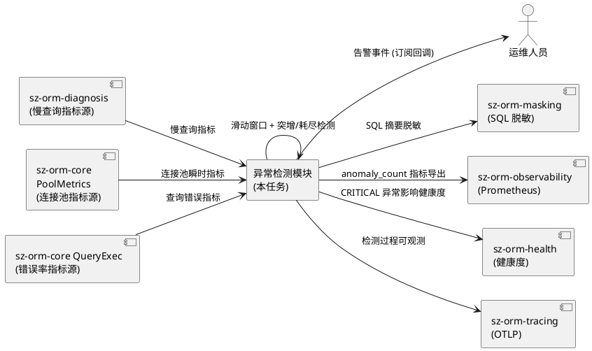
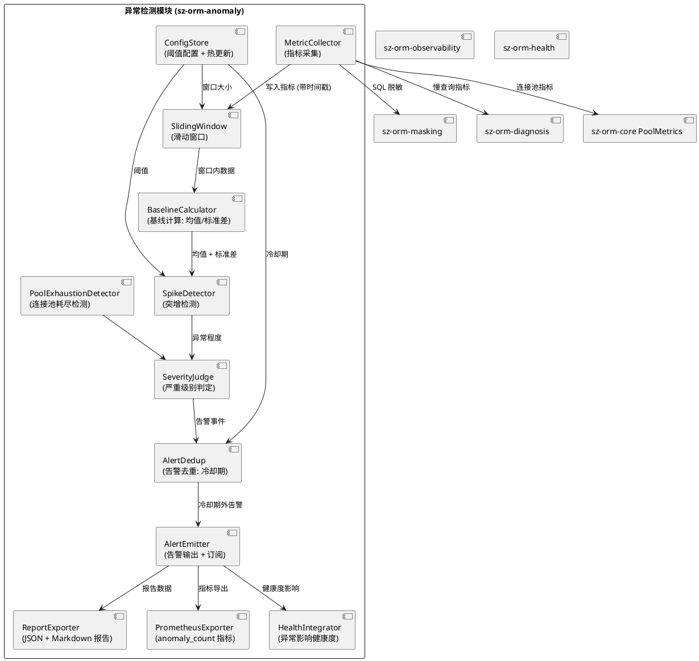
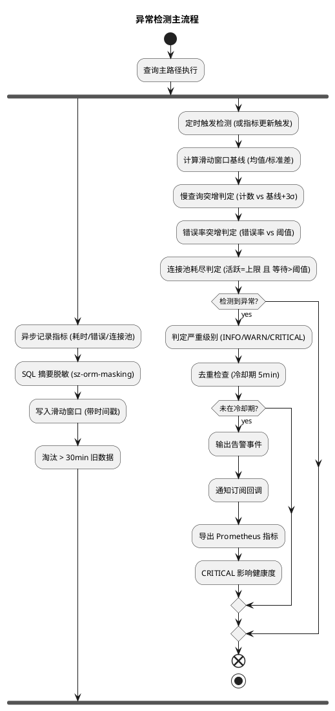
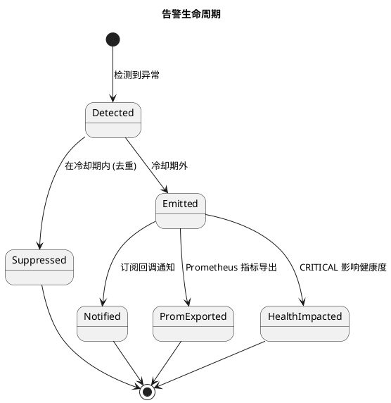
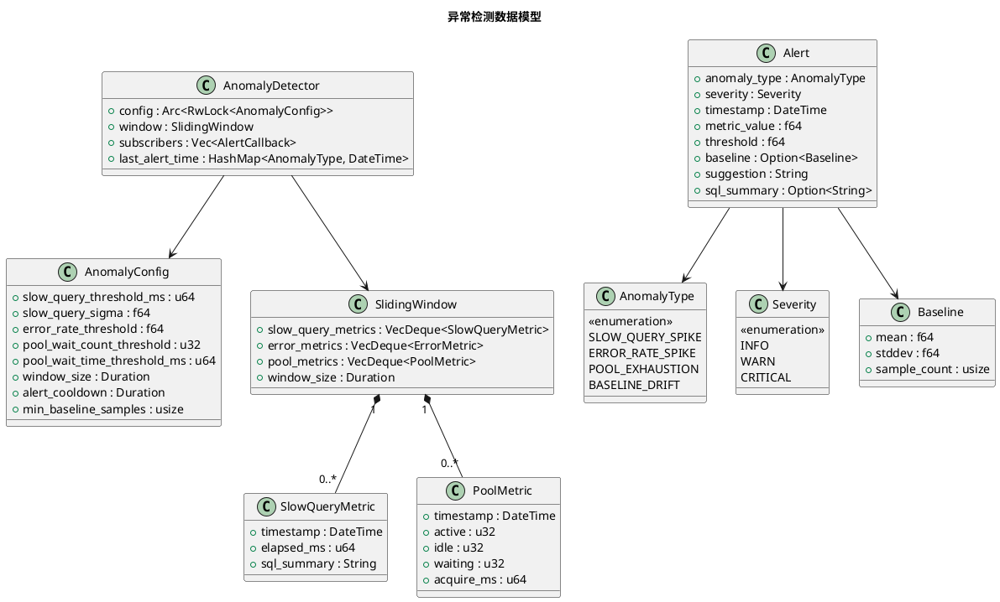

# sz-orm 异常检测（Anomaly Detection）技术设计文档

> 任务编号：TASK-004
> 对应需求规格：`docs/spec/anomaly_detection/spec.md`（REQ-ANM-001 ~ REQ-ANM-016）
> 版本基线：v4.9.0
> 日期：2026-08-19
> 文档定位：技术设计（How to build），与 spec.md 的"做什么"互补

---

# 一、需求与存量功能关系分析

## 1.1 需求功能与存量功能对比

### 1.1.1 已实现功能

| 需求功能 | 存量功能 | 代码位置 | 匹配度 |
|---------|---------|---------|--------|
| 慢查询诊断 | SlowQueryDiagnoser（根因分析 + 阶段分解 + severity 判定） | packages/sz-orm-diagnosis/src/diagnoser.rs:22-72 | 75% |
| 慢查询指标来源 | QueryOutcome（含 slow 标志 + elapsed_ms）+ QueryPhaseTiming | packages/sz-orm-adaptive/src/executor.rs + sz-orm-flamegraph | 75% |
| 连接池指标 | PoolMetrics（acquire_count/acquire_failed_count/acquire_wait_time/release_count） | packages/sz-orm-core/src/pool.rs:606-619 | 75% |
| Prometheus 指标导出 | sz-orm-observability（Prometheus exporter） | packages/sz-orm-observability/src/lib.rs | 50% |
| 健康检查 | sz-orm-health（健康检查 + SLA） | packages/sz-orm-health/src/lib.rs | 50% |
| OTLP tracing | sz-orm-tracing（OTLP） | packages/sz-orm-tracing/src/lib.rs | 100% |
| SQL 脱敏 | sz-orm-masking（参数值替换为占位符） | packages/sz-orm-masking/src/lib.rs | 100% |
| severity 判定模式 | determine_severity（Critical/Warning/Info 三级） | packages/sz-orm-diagnosis/src/diagnoser.rs:79-80 | 75% |
| 既有 feature gate 机制 | Cargo feature 启用模块（默认不启用） | packages/sz-orm-core/Cargo.toml features | 100% |

### 1.1.2 需要扩展的功能

| 需求功能 | 存量功能 | 差异说明 | 扩展方向 |
|---------|---------|---------|---------|
| 异常检测模块 | 无异常检测能力 | sz-orm-diagnosis 仅诊断单次慢查询，不检测"突增/耗尽"模式 | 新增异常检测模块（指标采集 + 滑动窗口 + 突增/耗尽检测 + 告警） |
| 指标采集（错误率） | 无错误率指标采集 | PoolMetrics 有 acquire_failed_count 但无查询错误率 | 新增错误率指标采集（查询错误类型/计数/时间戳） |
| 滑动窗口 | 无滑动窗口 | sz-orm-diagnosis 无时间窗口数据保留 | 新增滑动窗口（默认 30 分钟，旧数据丢弃） |
| 突增检测（基线 + Nσ） | 无突增检测 | 仅有绝对阈值，无统计基线 | 新增突增检测（滑动窗口均值 + 标准差 + Nσ 判定） |
| 连接池耗尽检测 | PoolMetrics 有 acquire_failed_count | 无"活跃=上限 且 等待>阈值"的耗尽模式检测 | 新增连接池耗尽检测 |
| 告警事件输出 | 无告警事件 | sz-orm-diagnosis 输出 DiagnosisReport（非告警） | 新增告警事件（异常类型/严重级别/时间戳/指标值/阈值/建议操作） |
| 告警订阅 API | 无告警订阅 | 无回调注册机制 | 新增告警订阅 API（注册回调接收告警事件） |
| 告警去重（冷却期） | 无去重 | 无冷却期机制 | 新增告警去重（同类型 5 分钟内不重复） |
| 报告导出（JSON + Markdown） | sz-orm-diagnosis 有报告 | 既有报告非异常检测报告 | 新增异常检测报告导出 |
| Prometheus 集成 | sz-orm-observability 有 exporter | 无 anomaly_count 指标 | 新增 anomaly_count/anomaly_last_timestamp 指标导出 |
| 健康度集成 | sz-orm-health 有健康检查 | 无异常影响健康度 | 新增 CRITICAL 异常降低健康度 |

### 1.1.3 需要新增的功能或接口

**指标采集模块**
- 慢查询指标采集：查询耗时/SQL 摘要/时间戳（来源于 sz-orm-diagnosis）
- 错误率指标采集：错误类型/错误计数/时间戳（来源于 sz-orm-core 查询执行）
- 连接池指标采集：活跃数/空闲数/等待数/获取耗时（来源于 PoolMetrics）
- SQL 摘要脱敏：复用 sz-orm-masking（参数值 → 占位符）
- 滑动窗口：保留最近 N 分钟数据（默认 30 分钟），旧数据丢弃

**异常检测模块**
- 慢查询突增检测：滑动窗口内慢查询计数 > 基线均值 + 3σ 或绝对阈值
- 错误率突增检测：错误率 > 基线均值 + 3σ 或绝对阈值（默认 5%）
- 连接池耗尽检测：活跃数=上限 且 等待数>阈值（默认 10）或等待耗时>阈值（默认 1s）
- 偏离基线检测：指标长期偏离基线（平均耗时连续 N 窗口上升）
- 严重级别判定：超阈值 1.5x → WARN，超 3x → CRITICAL
- 告警去重：同类型异常冷却期内（默认 5 分钟）不重复告警

**告警输出与集成模块**
- 告警事件结构：异常类型/严重级别/时间戳/指标值/阈值/基线/建议操作/SQL 摘要（脱敏）
- 告警订阅 API：注册回调接收告警事件
- Prometheus 集成：导出 anomaly_count/anomaly_last_timestamp 指标
- 健康度集成：CRITICAL 异常降低健康度
- 报告导出：JSON + Markdown（检测时间段/异常列表/统计摘要）
- feature 门控：anomaly-detection feature（默认不启用）

## 1.2 存量功能详细分析

### 1.2.1 sz-orm-diagnosis 慢查询诊断

- **接口契约**：SlowQueryDiagnoser::diagnose(query_key, timings, outcome) → Option<DiagnosisReport>
- **业务规则**：仅对 outcome.slow == true 的查询触发诊断；根因分析 → 阶段分解 → 建议提示 → severity 判定
- **约束**：诊断单次查询，不检测"突增"模式；无滑动窗口；无历史基线
- **扩展点**：异常检测模块可复用 SlowQueryDiagnoser 的慢查询指标作为数据源

### 1.2.2 PoolMetrics 连接池指标

- **接口契约**：PoolMetrics（acquire_count/acquire_failed_count/acquire_wait_time/release_count/connection_created_count/connection_closed_count）
- **业务规则**：所有字段为池生命周期累计值（不随获取/归还重置），基于无锁 AtomicU64 计数
- **约束**：仅有累计值，无瞬时值（活跃数/空闲数/等待数需另行采集）
- **扩展点**：异常检测模块需采集瞬时值（活跃数/空闲数/等待数），可扩展 PoolMetrics 或新增瞬时指标采集

### 1.2.3 sz-orm-masking SQL 脱敏

- **接口契约**：将 SQL 参数值替换为占位符（password='xxx' → password=?）
- **业务规则**：复用既有脱敏逻辑
- **扩展点**：异常检测模块的 SQL 摘要脱敏直接调用 sz-orm-masking

### 1.2.4 sz-orm-observability Prometheus exporter

- **接口契约**：导出 Prometheus 格式指标
- **业务规则**：既有指标导出（连接池/查询耗时等）
- **扩展点**：新增 anomaly_count/anomaly_last_timestamp 指标导出

---

# 二、增量设计方案

## 2.1 实现模型

### 2.1.1 上下文视图

### 2.1.2 服务/组件总体架构

**模块划分及职责**：
- **MetricCollector**：异步/旁路采集三类指标（慢查询/错误率/连接池），SQL 脱敏
- **SlidingWindow**：保留最近 N 分钟数据（默认 30 分钟），旧数据丢弃，内存上限 10 MB
- **BaselineCalculator**：计算滑动窗口内基线（均值/标准差/分位数）
- **SpikeDetector**：突增检测（计数/错误率 > 基线 + Nσ 或绝对阈值）
- **PoolExhaustionDetector**：连接池耗尽检测（活跃=上限 且 等待>阈值）
- **SeverityJudge**：严重级别判定（INFO/WARN/CRITICAL）
- **AlertDedup**：告警去重（同类型冷却期内不重复）
- **AlertEmitter**：告警输出 + 订阅回调通知
- **ReportExporter**：JSON + Markdown 报告导出
- **PrometheusExporter**：anomaly_count/anomaly_last_timestamp 指标导出
- **HealthIntegrator**：CRITICAL 异常降低健康度
- **ConfigStore**：阈值配置 + 运行时热更新

### 2.1.3 实现设计文档

**指标采集与检测流程**：

**告警状态机**：

**设计决策**：
1. **新增独立包 sz-orm-anomaly**：异常检测是独立能力域，与 sz-orm-diagnosis（单次诊断）职责不同。独立包便于 feature gate 隔离 + 单独测试 + 未来扩展（如 ML 模型）
2. **异步/旁路采集**：指标采集不阻塞查询主路径（DFX 4.2.1，REQ-ANM-005）。通过 channel 异步发送指标，采集耗时 < 100μs
3. **滑动窗口 + 统计基线**：滑动窗口保留最近 30 分钟数据，实时计算均值/标准差作为基线。避免离线训练，适合实时检测
4. **统计规则 + 阈值（非 ML）**：基于统计规则（均值 + Nσ）+ 绝对阈值，简单可解释，无需训练数据（边界声明：不涉及 AI/ML）
5. **告警去重冷却期**：同类型异常 5 分钟内不重复告警，避免告警风暴（REQ-ANM-014）
6. **feature gate 隔离**：anomaly-detection feature 默认不启用，不影响既有编译（DFX 4.5.2）
7. **复用既有基础设施**：SQL 脱敏复用 sz-orm-masking，Prometheus 导出复用 sz-orm-observability，健康度集成复用 sz-orm-health，tracing 复用 sz-orm-tracing

## 2.2 接口设计

### 2.2.1 总体设计

| 接口分类 | 接口名 | 稳定性 | 说明 |
|---------|--------|--------|------|
| 指标采集 | record_slow_query / record_error / record_pool_usage | 稳定 | 采集三类指标 |
| 检测 | detect_anomalies / check_slow_query_spike / check_error_rate_spike / check_pool_exhaustion | 稳定 | 异常检测 |
| 告警 | subscribe_alerts / emit_alert | 稳定 | 告警订阅 + 输出 |
| 报告 | export_report_json / export_report_markdown | 稳定 | 报告导出 |
| 配置 | update_config / get_config | 稳定 | 阈值热更新 |
| 集成 | export_prometheus_metrics / impact_health | 稳定 | Prometheus + 健康度集成 |

### 2.2.2 接口清单

#### 指标采集接口

**record_slow_query** - 记录慢查询指标
- **签名**：`pub fn record_slow_query(&self, elapsed_ms: u64, sql_summary: &str, timestamp: DateTime)`
- **前置条件**：启用 anomaly-detection feature
- **后置条件**：指标写入滑动窗口
- **核心逻辑**：SQL 摘要脱敏（sz-orm-masking）→ 写入滑动窗口（带时间戳）→ 淘汰旧数据
- **性能**：耗时 < 100μs（不阻塞主路径）

**record_error** - 记录查询错误指标
- **签名**：`pub fn record_error(&self, error_type: ErrorType, timestamp: DateTime)`

**record_pool_usage** - 记录连接池指标
- **签名**：`pub fn record_pool_usage(&self, active: u32, idle: u32, waiting: u32, acquire_ms: u64, timestamp: DateTime)`

#### 检测接口

**detect_anomalies** - 执行异常检测
- **签名**：`pub fn detect_anomalies(&self) -> Vec<Alert>`
- **后置条件**：返回检测到的异常告警列表
- **核心逻辑**：调用三类检测 → 严重级别判定 → 去重 → 返回告警

**check_slow_query_spike** - 慢查询突增检测
- **核心逻辑**：计算滑动窗口内慢查询计数 → 与基线均值 + 3σ 比较 → 超过则输出 SLOW_QUERY_SPIKE 告警
- **异常映射**：基线样本不足（< 100）→ 仅用绝对阈值

**check_pool_exhaustion** - 连接池耗尽检测
- **核心逻辑**：检查活跃数=上限 且 等待数>阈值（默认 10）或等待耗时>阈值（默认 1s）→ 输出 POOL_EXHAUSTION 告警

#### 告警接口

**subscribe_alerts** - 订阅告警
- **签名**：`pub fn subscribe_alerts(&self, callback: Arc<dyn Fn(Alert) + Send + Sync>) -> SubscriptionId`
- **后置条件**：异常发生时回调被调用
- **异常映射**：回调 panic → 捕获隔离，不影响检测模块（REQ-ANM 异常场景 1）

**emit_alert** - 输出告警
- **核心逻辑**：去重检查（冷却期）→ 通知订阅者 → 导出 Prometheus 指标 → CRITICAL 影响健康度

#### 报告接口

**export_report_json** - 导出 JSON 报告
- **签名**：`pub fn export_report_json(&self, period: TimeRange) -> String`
- **输出**：JSON 含检测时间段/异常列表/统计摘要

**export_report_markdown** - 导出 Markdown 报告
- **输出**：Markdown 表格 + 异常列表

#### 配置接口

**update_config** - 热更新配置
- **签名**：`pub fn update_config(&self, new_config: AnomalyConfig)`
- **后置条件**：阈值运行时生效，不重启（DFX 4.4.3）

## 2.3 数据模型

### 2.3.1 设计目标

- 支持三类指标采集（慢查询/错误率/连接池）
- 滑动窗口内存上限 10 MB（默认 30 分钟，DFX 4.1.3）
- 告警事件结构化（异常类型/严重级别/时间戳/指标值/阈值/基线/建议操作/SQL 摘要）
- 阈值配置可热更新

### 2.3.2 模型实现

**对象生命周期**：
- AnomalyDetector：全局单例（或 per-Pool 实例），随 Pool 生命周期
- SlidingWindow：持续滚动，旧数据丢弃
- Alert：检测到异常时创建，通知订阅者后可丢弃（或保留用于报告导出）

**持久化策略**：
- 指标数据：仅内存（滑动窗口），不持久化
- 告警事件：可选持久化（报告导出时写入 JSON/Markdown 文件）
- 配置：内存（热更新），可选持久化到配置文件

## 2.4 算法选择

### 2.4.1 滑动窗口：VecDeque + 时间淘汰

**选择理由**：
- VecDeque 双端队列，头尾 O(1) 操作
- 按时间戳淘汰旧数据（写入时检查头部是否超过窗口大小）
- 内存可控（默认 30 分钟，上限 10 MB）

### 2.4.2 基线计算：Welford 在线算法

**选择理由**：
- Welford 算法在线计算均值/标准差，数值稳定（避免大数相减精度损失）
- 单次更新 O(1)，适合滑动窗口实时计算
- 无需存储全部样本（仅 count/mean/M2 三个状态量）

### 2.4.3 突增判定：均值 + Nσ 或绝对阈值

**选择理由**：
- 统计规则简单可解释（N 默认 3，即 99.7% 置信区间）
- 基线样本不足时回退绝对阈值（避免小样本误判）
- 双重判定（基线 + 绝对阈值）降低漏报

### 2.4.4 告警去重：HashMap + 冷却期

**选择理由**：
- HashMap<AnomalyType, DateTime> 记录每种异常最后告警时间
- 新告警检查冷却期（默认 5 分钟），期内不重复
- O(1) 查找，不影响性能

## 2.5 错误处理策略

| 错误类型 | 处理策略 | 用户感知 |
|---------|---------|---------|
| 指标源未接入（sz-orm-diagnosis/PoolMetrics 未接入） | 降级运行，记录"指标源缺失" | 告警"指标源未接入，检测能力受限" |
| 滑动窗口溢出（指标速率超容量） | 丢弃最旧数据，记录降采样 | 日志"指标降采样" |
| 基线样本不足（< 100） | 跳过突增判定，仅用绝对阈值 | 日志"基线样本不足，仅绝对阈值判定" |
| 阈值配置非法（负数/无效值） | 使用默认阈值，记录配置错误 | 日志"阈值配置非法，使用默认值" |
| 告警风暴（短时大量异常） | 去重 + 冷却期 + 聚合 | 收到聚合告警，非逐条 |
| 订阅回调 panic | 捕获 panic，记录错误，不影响检测模块 | 日志"订阅者回调 panic，已隔离" |
| Prometheus 集成未启用 | 跳过 Prometheus 导出，仅本地告警 | 告警仅本地，未导出 Prometheus |
| 报告导出失败（磁盘不足/权限） | 记录导出失败，告警仍正常 | 日志"报告导出失败" |
| 检测模块故障 | 不影响查询主路径（异步/旁路） | 查询正常，检测降级 |

## 2.6 性能优化

1. **指标采集 < 100μs**（DFX 4.1.1）：异步 channel 发送，不阻塞主路径
2. **检测判定 < 1 ms**（DFX 4.1.2）：滑动窗口内 Welford 在线算法 O(1)
3. **内存 < 10 MB**（DFX 4.1.3）：滑动窗口默认 30 分钟，按时间淘汰旧数据
4. **无锁指标采集**：AtomicU64 计数（复用 PoolMetrics 模式），避免锁竞争
5. **检测定时触发**：可选定时触发（如每 10s）或指标更新触发，避免空转

## 2.7 安全性设计

1. **SQL 摘要脱敏**：复用 sz-orm-masking，参数值替换为占位符（DFX 4.3.1）
2. **阈值配置不泄露日志**：阈值配置不得输出到日志（DFX 4.3.2）
3. **订阅回调隔离**：订阅者回调 panic 不影响检测模块（catch_unwind 隔离）

## 2.8 兼容性设计

1. **既有 API 100% 不变**：sz-orm-diagnosis/observability/health 既有 API 不修改（DFX 4.5.1）
2. **feature gate 隔离**：anomaly-detection feature 默认不启用，不影响既有编译（DFX 4.5.2）
3. **sz-pay 生产依赖不受影响**：sz-pay 不启用 anomaly-detection feature（DFX 4.5.3）

## 2.9 验证方法

| 需求 | 验证命令 | 预期结果 |
|------|---------|---------|
| REQ-ANM-001 慢查询采集 | 单元测试 record_slow_query | 记录耗时/摘要/时间戳 |
| REQ-ANM-004 滑动窗口 | 内存测试（采集超 30min） | 旧数据丢弃，内存不增长 |
| REQ-ANM-005 不阻塞主路径 | 性能测试（采集耗时） | < 100μs |
| REQ-ANM-006 SQL 脱敏 | 脱敏测试（SQL 含 password='xxx'） | 摘要显示 password=? |
| REQ-ANM-007 慢查询突增 | 集成测试（模拟慢查询突增） | 输出 SLOW_QUERY_SPIKE 告警 |
| REQ-ANM-009 连接池耗尽 | 集成测试（活跃=上限 且 等待>阈值） | 输出 POOL_EXHAUSTION 告警 |
| REQ-ANM-012 误报控制 | 负向测试（误报率） | < 5% |
| REQ-ANM-013 漏报控制 | 负向测试（模拟真实异常） | 必须触发告警 |
| REQ-ANM-014 告警去重 | 单元测试（同类型 5min 内第二次） | 不重复告警 |
| REQ-ANM-015 feature 门控 | `cargo check`（不启用 feature） | 编译成功，无检测模块依赖 |
| REQ-ANM-016 测试验证 | `cargo test -p sz-orm-anomaly` | 单元 + 集成测试全通过 |
| 交付记录 | 文档存在性检查 | delivery-record.md 存在 |