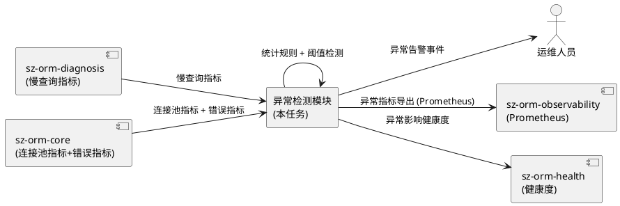
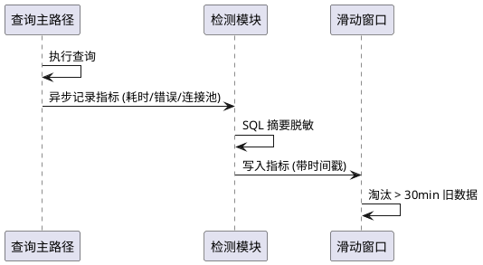
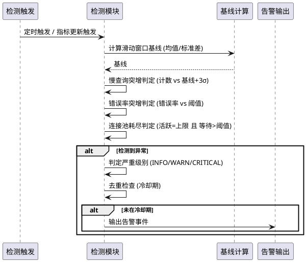
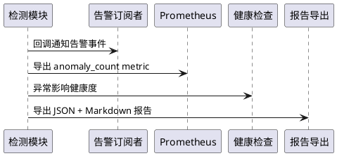

# sz-orm 异常检测（Anomaly Detection）需求规格说明书

> 任务编号：TASK-004
> 任务名称：异常检测（Anomaly Detection）
> 版本基线：v4.9.0
> 日期：2026-08-19
> 需求格式：EARS（Ubiquitous / Event-driven / State-driven / Optional / Unwanted）
> 文档定位：需求规格（What to build），不含技术设计（How to build）
> 需求编号约定：REQ-ANM-xxx（异常检测需求项，REQ-ANM-001 ~ REQ-ANM-016）
> 优先级声明：16 项需求 P1（用户要求新增异常检测能力，非生产阻塞但属重要可观测性扩展）
> 现状基线：sz-orm 无异常检测能力；既有相关包：sz-orm-diagnosis（慢查询诊断，3,999 LOC / 194 tests，六种根因 + 分阶段耗时 + 死锁检测 + 瓶颈定位）、sz-orm-observability（Prometheus exporter + SLO）、sz-orm-health（健康检查 + SLA）、sz-orm-flamegraph（查询火焰图）
> 规划依据：`packages/sz-orm-diagnosis/src/lib.rs`（既有慢查询诊断，可扩展）+ `packages/sz-orm-observability/src/lib.rs`（Prometheus 指标）+ `packages/sz-orm-core/src/pool.rs`（连接池指标 PoolMetrics）+ 用户要求"检测慢查询突增、错误率突增、连接池耗尽等"
> 兼容性铁律：既有 sz-orm-diagnosis/observability/health 包 API 100% 向后兼容；sz-pay 生产依赖不受影响；新能力通过 feature gate 隔离
> 范围声明：本任务聚焦新增异常检测模块，检测数据库查询异常（慢查询突增、错误率突增、连接池耗尽等）；可能作为 sz-orm-diagnosis 的扩展或新包（由设计阶段决定）；需附测试验证
> 边界声明：本任务检测的是"异常模式"（突增/耗尽/偏离基线），非"单次错误"（单次错误由既有错误处理覆盖）；不涉及 AI/ML 模型（基于统计规则 + 阈值）；代码尽量精简，不冗余

---

# 1. 组件定位

## 1.1 核心职责

本组件负责新增 sz-orm 异常检测能力，通过持续采集数据库运行指标（慢查询计数、错误率、连接池使用率等），基于统计规则 + 阈值检测异常模式（突增/耗尽/偏离基线），输出异常告警，供运维人员或上游系统消费。

## 1.2 核心输入

1. **慢查询指标**：来源于 sz-orm-diagnosis（SlowQueryDiagnoser）+ sz-orm-flamegraph（QueryTracer 分阶段计时），含查询耗时、查询 SQL 摘要、时间戳。
2. **错误率指标**：来源于 sz-orm-core 查询执行错误（连接错误/SQL 错误/超时），含错误类型、错误计数、时间戳。
3. **连接池指标**：来源于 sz-orm-core PoolMetrics（活跃连接数/空闲连接数/等待数/获取耗时），见 `packages/sz-orm-core/src/pool.rs`。
4. **既有可观测性基础设施**：sz-orm-observability（Prometheus exporter）、sz-orm-health（SLA 指标）、sz-orm-tracing（OTLP）。
5. **检测配置**：阈值配置（慢查询耗时阈值、错误率阈值、连接池使用率阈值）、时间窗口、突增判定灵敏度。
6. **历史基线**：用于突增判定的历史指标数据（滑动窗口均值/标准差）。

## 1.3 核心输出

1. **异常告警**：当检测到异常模式时，输出告警事件，含异常类型、严重级别、时间戳、指标值、阈值、建议操作。
2. **异常检测 API**：供上游调用注册指标 / 查询当前异常 / 订阅告警事件。
3. **异常检测报告**：可导出为 JSON / Markdown，含检测时间段、异常列表、统计摘要。
4. **集成点**：与 sz-orm-observability Prometheus exporter 集成（异常指标导出）、与 sz-orm-health 集成（异常影响健康度）。
5. **测试验证**：单元测试（阈值判定逻辑）+ 集成测试（模拟异常场景触发检测）。
6. **交付记录**：按 session rules 要求，必须有交付记录文档。

## 1.4 职责边界

本组件**不负责**：
1. 单次错误的处理（由既有错误处理覆盖，本组件检测"模式"非"单次"）。
2. AI/ML 异常检测模型（基于统计规则 + 阈值，非机器学习）。
3. 告警通知渠道（邮件/短信/钉钉等，由上游系统消费告警事件）。
4. 自动修复（检测 + 告警，修复由运维或 sz-orm-advisor 处理）。
5. 修改既有 sz-orm-diagnosis/observability/health 包的既有 API（仅扩展或集成）。
6. 分布式异常检测（单实例本地检测，跨实例聚合属未来任务）。

---

# 2. 领域术语

**异常模式**
: 指标随时间表现出的非正常模式，包括突增（spike）、耗尽（exhaustion）、偏离基线（drift）、持续异常（sustained）。

**慢查询突增**
: 在时间窗口内，慢查询（耗时超过阈值）的计数或占比显著高于历史基线（如超过均值 + 3σ）。

**错误率突增**
: 在时间窗口内，查询错误率（错误数/总查询数）显著高于历史基线或绝对阈值。

**连接池耗尽**
: 连接池活跃连接数达到上限，新请求等待，等待数或等待耗时超过阈值。

**基线**
: 历史指标在正常状态下的统计特征（均值、标准差、分位数），用于突增判定。

**滑动窗口**
: 仅保留最近 N 分钟指标数据的统计窗口，旧数据丢弃。

**告警事件**
: 检测到异常时输出的事件，含异常类型、严重级别、时间戳、指标值、阈值、建议操作。

**严重级别**
: 告警的紧急程度，枚举 INFO / WARN / CRITICAL。

---

# 3. 角色与边界

## 3.1 核心角色

- **运维人员**：消费异常告警，执行修复操作的人员。
- **上游监控系统**：订阅告警事件的外部系统（如 Prometheus Alertmanager）。

## 3.2 外部系统

- **sz-orm-diagnosis**：慢查询指标来源。
- **sz-orm-core PoolMetrics**：连接池指标来源。
- **sz-orm-observability**：Prometheus exporter 集成目标。
- **sz-orm-health**：健康度集成目标。

## 3.3 交互上下文

---

# 4. DFX约束

## 4.1 性能

1. 指标采集开销上限：单次指标记录耗时 < 100 μs（不阻塞查询主路径）。
2. 异常检测判定耗时上限：单次判定 < 1 ms（滑动窗口内）。
3. 检测模块内存占用上限：滑动窗口 N 分钟数据 < 10 MB（N 默认 30 分钟）。

## 4.2 可靠性

1. 检测模块故障不得影响查询主路径（检测异步/旁路，主路径不阻塞）。
2. 告警不得误报率 > 5%（阈值需可调，避免噪声）。
3. 告警不得漏报已发生的真实异常（负向测试覆盖）。

## 4.3 安全性

1. 告警中的 SQL 摘要不得含敏感参数值（脱敏，复用 sz-orm-masking）。
2. 检测配置中的阈值不得泄露到日志。

## 4.4 可维护性

1. 检测模块必须接入既有 tracing（OTLP），检测过程可观测。
2. 异常报告导出格式：JSON + Markdown，结构化字段。
3. 阈值配置支持运行时热更新（不重启）。

## 4.5 兼容性

1. 既有 sz-orm-diagnosis/observability/health API 100% 不变。
2. 新能力通过 feature gate 隔离（如 `anomaly-detection`），默认不启用不影响既有编译。
3. sz-pay 生产依赖不受影响。

---

# 5. 核心能力

## 5.1 指标采集

### 5.1.1 业务规则

1. **[Ubiquitous] 慢查询指标采集**：The 异常检测模块 shall 采集慢查询指标（查询耗时、SQL 摘要、时间戳），数据来源于 sz-orm-diagnosis。
   a. 验收条件：[慢查询发生] → [检测模块记录耗时/摘要/时间戳]
2. **[Ubiquitous] 错误率指标采集**：The 异常检测模块 shall 采集查询错误指标（错误类型、错误计数、时间戳），数据来源于 sz-orm-core 查询执行。
   a. 验收条件：[查询错误发生] → [检测模块记录错误类型/计数/时间戳]
3. **[Ubiquitous] 连接池指标采集**：The 异常检测模块 shall 采集连接池指标（活跃数/空闲数/等待数/获取耗时），数据来源于 sz-orm-core PoolMetrics。
   a. 验收条件：[连接池状态变化] → [检测模块记录活跃/空闲/等待/耗时]
4. **[State-driven] 滑动窗口**：While 指标采集持续，the 检测模块 shall 仅保留最近 N 分钟数据（默认 30 分钟），旧数据丢弃。
   a. 验收条件：[采集超过 30 分钟] → [30 分钟前数据已丢弃，内存不增长]
5. **[Unwanted] 采集阻塞主路径**：If 指标采集导致查询主路径阻塞，then the 检测模块 shall 改为异步/旁路采集。
   a. 验收条件：[采集耗时 < 100μs] → [主路径无感知]
6. **[Ubiquitous] SQL 摘要脱敏**：The 采集 shall 对 SQL 摘要脱敏（参数值替换为占位符），复用 sz-orm-masking。
   a. 验收条件：[SQL 含 password='xxx'] → [摘要显示 password=?]

### 5.1.2 交互流程

### 5.1.3 异常场景

1. **指标来源不可用**
   a. 触发条件：sz-orm-diagnosis 或 PoolMetrics 未接入
   b. 系统行为：检测模块降级运行，记录"指标源缺失"
   c. 用户感知：告警"指标源未接入，检测能力受限"
2. **滑动窗口溢出**
   a. 触发条件：指标速率超过窗口容量
   b. 系统行为：丢弃最旧数据，记录降采样
   c. 用户感知：日志记录"指标降采样"

## 5.2 异常模式检测

### 5.2.1 业务规则

1. **[Event-driven] 慢查询突增检测**：When 时间窗口内慢查询计数超过历史基线均值 + Nσ（默认 N=3）或绝对阈值，the 检测模块 shall 输出慢查询突增告警。
   a. 验收条件：[慢查询计数 > 基线均值 + 3σ] → [输出 SLOW_QUERY_SPIKE 告警，含当前计数/基线/阈值]
2. **[Event-driven] 错误率突增检测**：When 时间窗口内错误率超过历史基线均值 + Nσ 或绝对阈值（默认 5%），the 检测模块 shall 输出错误率突增告警。
   a. 验收条件：[错误率 > 5%] → [输出 ERROR_RATE_SPIKE 告警，含当前错误率/基线/阈值]
3. **[Event-driven] 连接池耗尽检测**：When 连接池活跃数达到上限且等待数超过阈值（默认 10）或等待耗时超过阈值（默认 1s），the 检测模块 shall 输出连接池耗尽告警。
   a. 验收条件：[活跃数=上限 且 等待数>10] → [输出 POOL_EXHAUSTION 告警，含活跃/等待/上限]
4. **[Optional] 偏离基线检测**：Where 启用基线漂移检测，the 检测模块 shall 检测指标长期偏离基线（如平均耗时持续上升）。
   a. 验收条件：[平均耗时连续 N 窗口上升] → [输出 BASELINE_DRIFT 告警]
5. **[Ubiquitous] 严重级别判定**：The 检测模块 shall 根据异常程度判定严重级别（INFO / WARN / CRITICAL），如超阈值 1.5x 为 WARN，超 3x 为 CRITICAL。
   a. 验收条件：[指标超阈值 3x] → [告警级别 CRITICAL]
6. **[Unwanted] 误报控制**：If 告警误报率 > 5%，then the 检测模块 shall 支持调高灵敏度阈值以降低误报。
   a. 验收条件：[误报率 > 5%] → [可调阈值，文档说明调参方法]
7. **[Unwanted] 漏报控制**：If 真实异常未触发告警，then the 检测模块 shall 在负向测试中暴露并修正阈值。
   a. 验收条件：[负向测试：模拟异常] → [必须触发告警，否则测试失败]
8. **[Ubiquitous] 告警去重**：The 检测模块 shall 对同一异常类型在冷却期内（默认 5 分钟）不重复告警。
   a. 验收条件：[同类型异常 5 分钟内第二次] → [不重复告警，更新计数]

### 5.2.2 交互流程

### 5.2.3 异常场景

1. **基线数据不足**
   a. 触发条件：滑动窗口数据少于最小样本数（如 < 100）
   b. 系统行为：跳过突增判定，仅用绝对阈值
   c. 用户感知：日志"基线样本不足，仅绝对阈值判定"
2. **阈值配置错误**
   a. 触发条件：阈值配置为负数或非法值
   b. 系统行为：使用默认阈值，记录配置错误
   c. 用户感知：日志"阈值配置非法，使用默认值"
3. **告警风暴**
   a. 触发条件：短时间内大量异常触发
   b. 系统行为：去重 + 冷却期 + 聚合（同类型合并）
   c. 用户感知：收到聚合告警，非逐条

## 5.3 告警输出与集成

### 5.3.1 业务规则

1. **[Ubiquitous] 告警事件结构**：The 告警 shall 含字段：异常类型、严重级别、时间戳、指标值、阈值、基线、建议操作、SQL 摘要（脱敏）。
   a. 验收条件：[告警输出] → [含上述全部字段]
2. **[Ubiquitous] 告警订阅 API**：The 检测模块 shall 提供告警订阅 API，上游系统可注册回调接收告警事件。
   a. 验收条件：[注册回调] → [异常发生时回调被调用]
3. **[Optional] Prometheus 集成**：Where 启用 sz-orm-observability 集成，the 检测模块 shall 将异常指标导出为 Prometheus metric（anomaly_count / anomaly_last_timestamp）。
   a. 验收条件：[启用集成] → [Prometheus 抓取到 anomaly_count 指标]
4. **[Optional] 健康度集成**：Where 启用 sz-orm-health 集成，the 检测模块 shall 将异常影响健康度（CRITICAL 异常降低健康度）。
   a. 验收条件：[CRITICAL 异常] → [健康度下降]
5. **[Ubiquitous] 报告导出**：The 检测模块 shall 支持导出异常检测报告（JSON + Markdown），含检测时间段、异常列表、统计摘要。
   a. 验收条件：[导出报告] → [JSON + Markdown 文件生成，结构完整]
6. **[State-driven] feature 门控**：While 异常检测为 feature 门控（如 `anomaly-detection`），the 模块 shall 默认不启用，不影响既有编译。
   a. 验收条件：[cargo check 不启用 feature] → [编译成功，无检测模块依赖]
7. **[Ubiquitous] 测试验证**：The 检测模块 shall 附单元测试（阈值判定逻辑）+ 集成测试（模拟异常场景触发检测）。
   a. 验收条件：[cargo test] → [单元测试 + 集成测试全通过，含负向测试]
8. **[Ubiquitous] 交付记录**：The 任务 shall 生成交付记录文档，含新增 API 清单 + 测试结果 + 集成点证据 + feature gate 启用方式。
   a. 验收条件：[任务完成] → [交付记录文档存在且内容完整]

### 5.3.2 交互流程

### 5.3.3 异常场景

1. **订阅回调 panic**
   a. 触发条件：订阅者回调 panic
   b. 系统行为：捕获 panic，记录错误，不影响检测模块
   c. 用户感知：日志"订阅者回调 panic，已隔离"
2. **Prometheus 集成未启用**
   a. 触发条件：sz-orm-observability 未接入
   b. 系统行为：跳过 Prometheus 导出，仅本地告警
   c. 用户感知：告警仅本地，未导出 Prometheus
3. **报告导出失败**
   a. 触发条件：磁盘空间不足或权限错误
   b. 系统行为：记录导出失败，告警仍正常
   c. 用户感知：日志"报告导出失败"

---

# 6. 数据约束

## 6.1 异常告警事件

1. **异常类型**：必填，枚举 SLOW_QUERY_SPIKE / ERROR_RATE_SPIKE / POOL_EXHAUSTION / BASELINE_DRIFT
2. **严重级别**：必填，枚举 INFO / WARN / CRITICAL
3. **时间戳**：必填，ISO 8601
4. **指标值**：必填，触发异常时的当前指标值
5. **阈值**：必填，触发异常的阈值
6. **基线**：可选，突增判定时的历史基线（均值/标准差）
7. **建议操作**：可选，如"检查慢查询 SQL"、"扩容连接池"
8. **SQL 摘要**：可选，脱敏后的 SQL 摘要

## 6.2 检测配置

1. **慢查询耗时阈值**：默认 100 ms，可调
2. **慢查询突增灵敏度（σ倍数）**：默认 3，可调
3. **错误率阈值**：默认 5%，可调
4. **连接池等待数阈值**：默认 10，可调
5. **连接池等待耗时阈值**：默认 1 s，可调
6. **滑动窗口大小**：默认 30 分钟，可调
7. **告警冷却期**：默认 5 分钟，可调
8. **最小基线样本数**：默认 100，可调

## 6.3 指标记录

1. **时间戳**：必填，ISO 8601
2. **指标类型**：必填，枚举 SLOW_QUERY / ERROR / POOL_USAGE
3. **指标值**：必填，数值
4. **SQL 摘要**：可选，脱敏
5. **错误类型**：可选，错误时填写

---

# 7. 需求追溯矩阵

| 需求编号 | 需求名称 | EARS 类型 | 验收条件 | 验证方法 |
|---------|---------|----------|---------|---------|
| REQ-ANM-001 | 慢查询指标采集 | Ubiquitous | 记录耗时/摘要/时间戳 | 单元测试 |
| REQ-ANM-002 | 错误率指标采集 | Ubiquitous | 记录错误类型/计数 | 单元测试 |
| REQ-ANM-003 | 连接池指标采集 | Ubiquitous | 记录活跃/空闲/等待 | 单元测试 |
| REQ-ANM-004 | 滑动窗口 | State-driven | 旧数据丢弃 | 内存测试 |
| REQ-ANM-005 | 采集不阻塞主路径 | Unwanted | 耗时 < 100μs | 性能测试 |
| REQ-ANM-006 | SQL 摘要脱敏 | Ubiquitous | 参数值脱敏 | 脱敏测试 |
| REQ-ANM-007 | 慢查询突增检测 | Event-driven | 超基线+3σ 告警 | 集成测试 |
| REQ-ANM-008 | 错误率突增检测 | Event-driven | 超阈值告警 | 集成测试 |
| REQ-ANM-009 | 连接池耗尽检测 | Event-driven | 活跃=上限且等待>阈值告警 | 集成测试 |
| REQ-ANM-010 | 偏离基线检测 | Optional | 持续偏离告警 | 集成测试 |
| REQ-ANM-011 | 严重级别判定 | Ubiquitous | INFO/WARN/CRITICAL 正确 | 单元测试 |
| REQ-ANM-012 | 误报控制 | Unwanted | 误报率 < 5% | 负向测试 |
| REQ-ANM-013 | 漏报控制 | Unwanted | 真实异常必触发 | 负向测试 |
| REQ-ANM-014 | 告警去重 | Ubiquitous | 冷却期内不重复 | 单元测试 |
| REQ-ANM-015 | feature 门控 | State-driven | 默认不启用 | cargo check |
| REQ-ANM-016 | 测试验证 | Ubiquitous | 单元+集成测试通过 | cargo test |

---

# 8. 验收标准总览

1. **指标采集完整**：慢查询 + 错误率 + 连接池三类指标采集，SQL 脱敏
2. **异常检测准确**：慢查询突增 + 错误率突增 + 连接池耗尽三类检测，含负向测试
3. **误报/漏报可控**：误报率 < 5%，真实异常不漏报
4. **告警输出完整**：告警事件含全部字段，支持订阅 + Prometheus + 健康度集成
5. **报告导出**：JSON + Markdown 报告可导出
6. **feature 门控**：默认不启用，不影响既有编译
7. **性能不阻塞**：采集 < 100μs，判定 < 1ms，内存 < 10MB
8. **测试全通过**：单元测试 + 集成测试（含负向）全通过
9. **交付记录完整**：API 清单 + 测试结果 + 集成证据 + feature 启用方式