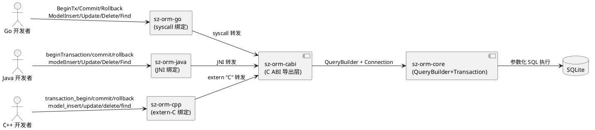
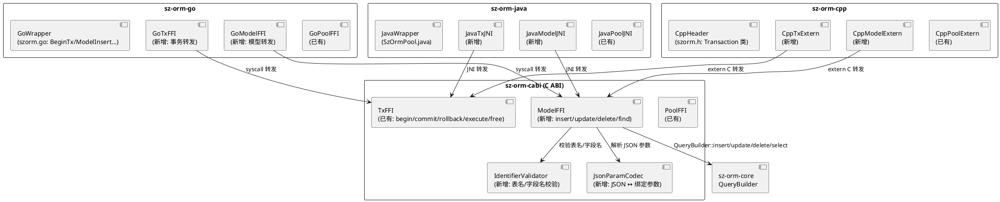
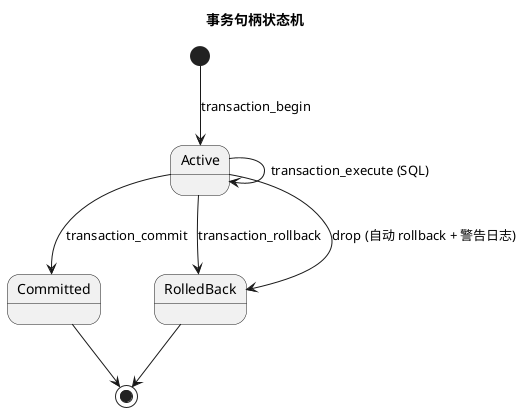
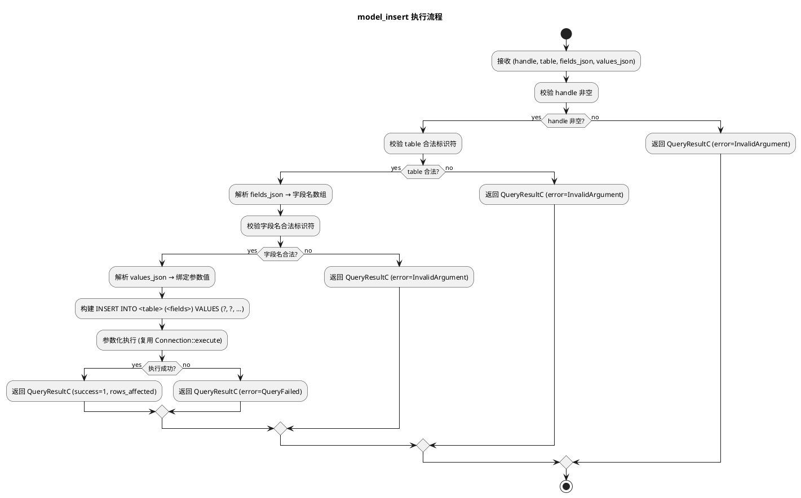
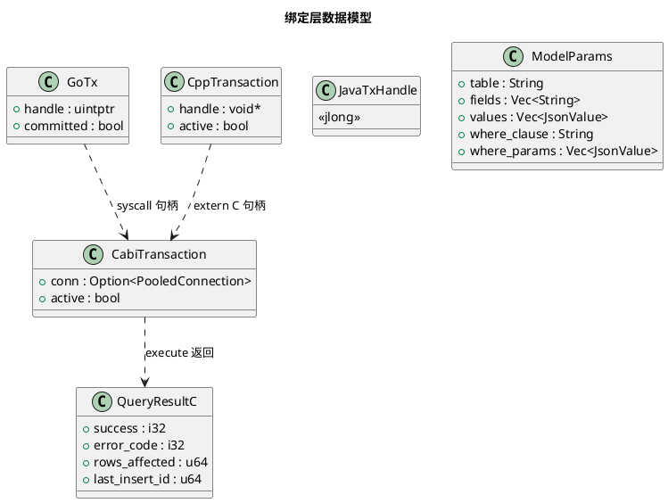

# sz-orm Go/Java/C++ 绑定事务与模型级 API 扩充技术设计文档

> 任务编号：TASK-002
> 对应需求规格：`docs/spec/bindings_tx_model/spec.md`（REQ-BND-001 ~ REQ-BND-018）
> 版本基线：v4.9.0
> 日期：2026-08-19
> 文档定位：技术设计（How to build），与 spec.md 的"做什么"互补

---

# 一、需求与存量功能关系分析

## 1.1 需求功能与存量功能对比

### 1.1.1 已实现功能

| 需求功能 | 存量功能 | 代码位置 | 匹配度 |
|---------|---------|---------|--------|
| CABI 事务导出 begin/commit/rollback | sz_orm_transaction_begin/commit/rollback/execute/free 已实现 | packages/sz-orm-cabi/src/lib.rs:697-859 | 100% |
| 事务句柄不透明指针 | SzOrmTransactionHandle = *mut c_void | packages/sz-orm-cabi/src/lib.rs:37 | 100% |
| 事务句柄泄漏自动 rollback | sz_orm_transaction_free 在事务仍活跃时自动回滚 | packages/sz-orm-cabi/src/lib.rs:849-859 | 100% |
| sz-orm-core 事务能力 | Transaction::new/commit/rollback + TransactionManager | packages/sz-orm-core/src/transaction.rs:186/226/247/540 | 100% |
| C ABI 错误码枚举 | SzOrmErrorCode（Ok/NotFound/ConnectionFailed/QueryFailed/PoolExhausted/TransactionAborted/Panic/InvalidArgument） | packages/sz-orm-cabi/src/lib.rs:43-93 | 100% |
| panic 捕获不跨 FFI 边界 | std::panic::catch_unwind 包裹所有导出函数 | packages/sz-orm-cabi/src/lib.rs:705/757/795/830 | 100% |
| Go 绑定 Pool/Query 转发 | sz_orm_go_pool_new/ping/query/execute/version | packages/sz-orm-go/src/lib.rs:21-80 | 100% |
| Java 绑定 Pool/Query JNI | Java_sz_1orm_1java_SzOrmPool_poolNew/ping/query/execute | packages/sz-orm-java/src/lib.rs:19-80 | 100% |
| C++ 绑定 Pool/Query extern C | sz_orm_cpp_pool_new/ping/query/execute/version | packages/sz-orm-cpp/src/lib.rs:20-80 | 100% |
| C++ RAII 头文件 | szorm.h（Pool 类 + RAII 析构） | packages/sz-orm-cpp/cpp/szorm.h:46-80 | 100% |
| Go 动态库加载 | syscall.NewLazyDLL（Windows）+ dlopen（Unix） | packages/sz-orm-go/go/szorm/load_windows.go + load_unix.go | 100% |
| Java E2E 7 步 | SzOrmPoolTest.java（版本/建池/健康/建表/插入/查询/释放） | packages/sz-orm-java/java-test/sz_orm_java/SzOrmPoolTest.java:14-57 | 100% |

### 1.1.2 需要扩展的功能

| 需求功能 | 存量功能 | 差异说明 | 扩展方向 |
|---------|---------|---------|---------|
| Go 绑定事务 API 转发 | Go 绑定仅转发 pool/query，未转发事务 | sz-orm-cabi 已有事务导出，Go 侧未暴露 | 新增 sz_orm_go_transaction_begin/commit/rollback 转发 + Go wrapper BeginTx/Commit/Rollback |
| Java 绑定事务 API 转发 | Java 绑定仅转发 pool/query，未转发事务 | JNI 入口缺事务方法 | 新增 Java_sz_1orm_1java_SzOrmPool_beginTransaction/commit/rollback + Java wrapper |
| C++ 绑定事务 API 转发 | C++ 绑定仅转发 pool/query，未转发事务 | extern C 缺事务函数 | 新增 sz_orm_cpp_transaction_begin/commit/rollback + szorm.h Transaction 类 |
| Java E2E 扩展至 12 步 | Java E2E 仅 7 步（无事务/模型 CRUD） | 缺事务提交/回滚 + insert/find/update/delete | 扩展 SzOrmPoolTest.java 至 ≥ 12 步 |
| Go E2E 扩展至 10 步 | Go E2E 仅基础测试 | 缺事务 + 模型 CRUD | 扩展 szorm_test.go 至 ≥ 10 步 |
| C++ E2E 新增 | C++ 仅有 7 个 Rust 侧测试，无 C++ 侧 E2E | 缺 C++ 侧端到端验证 | 新增 C++ E2E（建表/插入/查询/事务提交/回滚） |

### 1.1.3 需要新增的功能或接口

**CABI 层新增模型级导出（4 个函数）**
- sz_orm_model_insert(pool_or_tx, table, fields_json, values_json) → QueryResultC
- sz_orm_model_update(pool_or_tx, table, set_json, where_clause, where_params_json) → QueryResultC
- sz_orm_model_delete(pool_or_tx, table, where_clause, where_params_json) → QueryResultC
- sz_orm_model_find(pool_or_tx, table, where_clause, where_params_json) → *mut c_char (JSON 行数组)
- 输入：表名/字段名/值 JSON/where 条件（参数化）
- 输出：受影响行数 / JSON 行数据
- 核心逻辑：校验表名/字段名合法标识符 → 构建 INSERT/UPDATE/DELETE/SELECT SQL → 参数化执行
- 依赖：sz-orm-core QueryBuilder（query.rs）+ Connection::execute/query

**Go 绑定新增（7 个 API）**
- 事务：BeginTx/Commit/Rollback（3 个）
- 模型：ModelInsert/ModelUpdate/ModelDelete/ModelFind（4 个）
- 依赖：sz-orm-cabi 导出函数 + Go syscall 调用

**Java 绑定新增（7 个 JNI 入口 + Java wrapper）**
- 事务 JNI：Java_sz_1orm_1java_SzOrmPool_beginTransaction/commit/rollback
- 模型 JNI：Java_sz_1orm_1java_SzOrmPool_modelInsert/Update/Delete/Find
- Java wrapper：SzOrmPool.beginTransaction/commit/rollback + modelInsert/Update/Delete/Find
- 依赖：sz-orm-cabi 导出函数 + JNI 调用

**C++ 绑定新增（7 个 extern C + szorm.h 扩展）**
- 事务 extern C：sz_orm_cpp_transaction_begin/commit/rollback
- 模型 extern C：sz_orm_cpp_model_insert/update/delete/find
- szorm.h：Transaction 类（RAII，析构自动 rollback）+ Pool.modelInsert/Update/Delete/Find
- 依赖：sz-orm-cabi 导出函数 + extern "C"

**E2E 测试新增**
- Java E2E：事务提交（begin→insert→commit→find）+ 事务回滚（begin→insert→rollback→find 空）+ 模型 CRUD 往返
- Go E2E：同上
- C++ E2E：同上（需 g++ 编译）

## 1.2 存量功能详细分析

### 1.2.1 CABI 事务导出（已实现）

- **接口契约**：
  - `sz_orm_transaction_begin(pool_handle) → tx_handle`（null 表示失败）
  - `sz_orm_transaction_execute(tx_handle, sql) → QueryResultC`
  - `sz_orm_transaction_commit(tx_handle) → i32`（1 成功 0 失败）
  - `sz_orm_transaction_rollback(tx_handle) → i32`
  - `sz_orm_transaction_free(tx_handle)`（若事务仍活跃则自动回滚）
- **业务规则**：事务内 SQL 通过 `sz_orm_transaction_execute` 执行，commit/rollback 后事务标记 inactive
- **约束**：事务句柄线程亲和性（同一句柄不得跨线程使用）；panic 捕获不跨 FFI 边界
- **扩展点**：当前事务内仅支持 execute（原始 SQL），需新增模型级 API（insert/update/delete/find）支持事务内模型操作

### 1.2.2 sz-orm-core 事务能力

- **接口契约**：Transaction::new(conn, options) / commit() / rollback() / execute()
- **业务规则**：支持隔离级别/只读/超时/嵌套保存点（DEFAULT_MAX_NESTING_DEPTH = 8）
- **约束**：事务持有 Connection（从 Pool acquire），commit/rollback 后归还连接

### 1.2.3 Go 绑定动态库加载

- **接口契约**：syscall.NewLazyDLL（Windows）+ dlopen（Unix）加载 sz_orm_go.dll/.so
- **业务规则**：init() 时 loadLibrary，procs map 缓存函数指针
- **约束**：非 cgo，纯 Go syscall，跨平台

### 1.2.4 Java JNI 入口命名

- **接口契约**：`Java_sz_1orm_1java_SzOrmPool_<method>`（包名下划线转义为 _1）
- **业务规则**：EnvUnowned.with_env 包裹 JNI 调用，错误通过 ThrowRuntimeEx 抛出
- **约束**：句柄为 jlong（0 表示失败）

### 1.2.5 C++ RAII 头文件

- **接口契约**：szorm.h 声明 extern C 函数 + szorm::Pool RAII 类
- **业务规则**：Pool 析构调用 sz_orm_cpp_pool_free，移动语义（禁止拷贝）
- **约束**：Windows 用 __declspec(dllimport)，非 Windows 用 extern "C"

---

# 二、增量设计方案

## 2.1 实现模型

### 2.1.1 上下文视图

### 2.1.2 服务/组件总体架构

**模块划分及职责**：
- **CABI ModelFFI**：新增 4 个模型级 C ABI 导出，校验标识符 + 解析 JSON + 调用 QueryBuilder
- **CABI IdentifierValidator**：表名/字段名合法标识符校验（防 SQL 注入）
- **CABI JsonParamCodec**：JSON ↔ 绑定参数编解码（字段值/where 参数）
- **Go/Java/C++ Tx 转发**：各自 FFI 机制转发至 CABI TxFFI
- **Go/Java/C++ Model 转发**：各自 FFI 机制转发至 CABI ModelFFI
- **Wrapper 层**：语言侧封装（Go struct 方法 / Java class 方法 / C++ RAII 类）

### 2.1.3 实现设计文档

**事务生命周期状态机**：

**模型级 API 执行流程**：

**设计决策**：
1. **模型级 API 复用 QueryBuilder**：不重复实现 SQL 生成，复用 sz-orm-core QueryBuilder（query.rs:36），保证 SQL 一致性 + 参数化
2. **JSON 编码字段值**：FFI 传字符串 JSON（跨语言通用），Rust 侧解析为绑定参数值。避免 C 结构体类型映射复杂度
3. **标识符校验防注入**：表名/字段名校验为合法标识符（`^[A-Za-z_][A-Za-z0-9_]*$`），拒绝含 `'`/`;`/`--`/空格的输入
4. **事务内模型操作**：模型级 API 接受 pool_handle 或 tx_handle（通过 union 或统一 handle 类型），事务内操作走事务连接

## 2.2 接口设计

### 2.2.1 总体设计

| 接口分类 | 接口名 | 语言层 | 稳定性 |
|---------|--------|--------|--------|
| CABI 模型导出 | sz_orm_model_insert/update/delete/find | Rust extern C | 稳定 |
| CABI 标识符校验 | validate_identifier | Rust 内部 | 稳定 |
| Go 事务 | BeginTx/Commit/Rollback | Go | 稳定 |
| Go 模型 | ModelInsert/ModelUpdate/ModelDelete/ModelFind | Go | 稳定 |
| Java 事务 JNI | Java_sz_1orm_1java_SzOrmPool_beginTransaction/commit/rollback | Rust extern system | 稳定 |
| Java 模型 JNI | Java_sz_1orm_1java_SzOrmPool_modelInsert/Update/Delete/Find | Rust extern system | 稳定 |
| C++ 事务 extern C | sz_orm_cpp_transaction_begin/commit/rollback | Rust extern C | 稳定 |
| C++ 模型 extern C | sz_orm_cpp_model_insert/update/delete/find | Rust extern C | 稳定 |

### 2.2.2 接口清单

#### CABI 模型级导出

**sz_orm_model_insert** - 插入行
- **签名**：`unsafe extern "C" fn sz_orm_model_insert(handle, table: *const c_char, fields_json: *const c_char, values_json: *const c_char) -> QueryResultC`
- **前置条件**：handle 有效（pool 或 tx）；table/fields_json/values_json 非空 NUL 结尾 C 字符串
- **后置条件**：插入行，返回受影响行数
- **核心逻辑**：校验标识符 → 解析 JSON → 构建 `INSERT INTO <table> (<fields>) VALUES (?, ...)` → 参数化执行
- **异常映射**：非法表名 → InvalidArgument；执行失败 → QueryFailed；panic → Panic

**sz_orm_model_update** - 更新行
- **签名**：`unsafe extern "C" fn sz_orm_model_update(handle, table, set_json, where_clause, where_params_json) -> QueryResultC`
- **核心逻辑**：构建 `UPDATE <table> SET <field>=?, ... WHERE <where_clause>` → 参数化执行
- **异常映射**：同 insert；where 条件无匹配 → 返回 rows_affected=0（非错误）

**sz_orm_model_delete** - 删除行
- **签名**：`unsafe extern "C" fn sz_orm_model_delete(handle, table, where_clause, where_params_json) -> QueryResultC`
- **核心逻辑**：构建 `DELETE FROM <table> WHERE <where_clause>` → 参数化执行

**sz_orm_model_find** - 查询行
- **签名**：`unsafe extern "C" fn sz_orm_model_find(handle, table, where_clause, where_params_json) -> *mut c_char`
- **返回**：JSON 行数组字符串（调用方用 sz_orm_string_free 释放），null 表示失败
- **核心逻辑**：构建 `SELECT * FROM <table> WHERE <where_clause>` → 参数化查询 → 结果集转 JSON

#### Go 绑定事务 API

**BeginTx** - 开启事务
- **签名**：`func (p *Pool) BeginTx() (*Tx, error)`
- **实现**：syscall 调用 sz_orm_go_transaction_begin，返回 Tx{handle} 封装
- **异常映射**：handle=0 → error "transaction begin failed"

**Commit/Rollback** - 提交/回滚事务
- **签名**：`func (tx *Tx) Commit() error` / `func (tx *Tx) Rollback() error`
- **实现**：syscall 调用 sz_orm_go_transaction_commit/rollback
- **RAII**：Tx 析构（Go finalizer 或 defer）调用 rollback（若仍活跃）

#### Go 绑定模型 API

**ModelInsert** - 插入行
- **签名**：`func (p *Pool) ModelInsert(table string, fields []string, values []interface{}) (int64, error)`
- **实现**：fields/values 序列化为 JSON → syscall 调用 sz_orm_go_model_insert → 解析 QueryResultC

#### Java 绑定事务 JNI

**beginTransaction** - 开启事务
- **JNI 签名**：`Java_sz_1orm_1java_SzOrmPool_beginTransaction(env, class, poolHandle) -> jlong txHandle`
- **Java wrapper**：`public long beginTransaction()`

#### C++ 绑定事务 extern C + RAII

**sz_orm_cpp_transaction_begin** - 开启事务
- **签名**：`extern "C" void* sz_orm_cpp_transaction_begin(void* poolHandle)`
- **szorm.h Transaction 类**：RAII，析构自动 rollback（若仍活跃）

## 2.3 数据模型

### 2.3.1 设计目标

- 事务句柄对语言侧不透明（*mut c_void / jlong / uintptr_t）
- 模型级 API 参数通过 JSON 传递（跨语言通用，避免 C 结构体类型映射）
- 表名/字段名校验防注入
- 事务句柄生命周期：begin 创建 → commit/rollback/drop 释放

### 2.3.2 模型实现

**对象生命周期**：
- CabiTransaction：begin 创建，commit/rollback/free 销毁（free 时若 active 自动 rollback）
- GoTx：BeginTx 创建，Commit/Rollback/defer 销毁
- CppTransaction：transaction_begin 创建，析构自动 rollback（RAII）

**持久化策略**：无持久化（FFI 句柄仅在内存）

## 2.4 算法选择

### 2.4.1 标识符校验：正则白名单

**选择理由**：表名/字段名只需合法标识符（`^[A-Za-z_][A-Za-z0-9_]*$`），正则匹配 O(n) 简单高效，拒绝任何含 SQL 元字符的输入

### 2.4.2 JSON 参数编解码：serde_json

**选择理由**：
- sz-orm 已依赖 serde_json（Cargo.toml:36）
- JSON 跨语言通用（Go/Java/C++ 均有 JSON 库）
- 避免 C 结构体类型映射复杂度（int/float/string/bool/null ↔ SQLite 类型）

### 2.4.3 SQL 构建：复用 QueryBuilder

**选择理由**：
- sz-orm-core QueryBuilder（query.rs:36）已实现参数化 INSERT/UPDATE/DELETE/SELECT
- 保证 SQL 生成一致性 + 参数化（AGENTS.md 约束：禁止 SQL 字符串拼接）
- 避免重复实现 SQL 生成逻辑

## 2.5 错误处理策略

| 错误类型 | 处理策略 | 错误码 |
|---------|---------|--------|
| 无效事务句柄（null/已释放） | 返回错误码，不 panic | InvalidArgument |
| 事务已 commit/rollback 后再操作 | 返回 TransactionAborted | TransactionAborted |
| 非法表名/字段名（含 SQL 元字符） | 返回 InvalidArgument | InvalidArgument |
| JSON 解析失败 | 返回 InvalidArgument | InvalidArgument |
| SQL 执行失败（约束冲突等） | 返回 QueryFailed + 数据库错误 | QueryFailed |
| 事务嵌套（当前不支持） | 返回错误，提示不支持嵌套 | InvalidArgument |
| panic（Rust 侧） | catch_unwind 捕获，返回 Panic | Panic |
| FFI 句柄跨线程误用 | 文档约束（FFI 句柄线程亲和性），运行时不强制 | — |

## 2.6 性能优化

1. **FFI 调用开销 < 1 ms**（DFX 4.1.1）：syscall/JNI/extern C 转发为单次函数调用，开销可忽略
2. **事务 begin→commit 往返 < 10 ms**（SQLite 内存库，DFX 4.1.2）：BEGIN + INSERT + COMMIT 三次 SQLite 调用
3. **JSON 编解码优化**：字段数通常 < 50，serde_json 毫秒级

## 2.7 安全性设计

1. **参数化查询**：所有模型级 API 通过 QueryBuilder 参数化（禁止 SQL 拼接，AGENTS.md 约束）
2. **标识符校验**：表名/字段名正则白名单（`^[A-Za-z_][A-Za-z0-9_]*$`），拒绝含 `'`/`;`/`--`/空格的输入
3. **panic 不跨 FFI 边界**：所有导出函数用 std::panic::catch_unwind 包裹，panic 转为错误码
4. **事务句柄线程亲和性**：文档约束同一句柄不得跨线程使用（FFI 安全约束）
5. **内存管理**：FFI 字符串由 Rust 侧分配，语言侧通过 sz_orm_string_free 释放（避免双重释放）

## 2.8 兼容性设计

1. **既有 API 签名不变**：pool_new/ping/query/execute/version 保持不变（DFX 4.5.1）
2. **既有 E2E 不回退**：Java 7 步 / Go E2E / C++ 7 测试保持通过（DFX 4.5.2）
3. **sz-orm-cabi 既有事务导出不变**：sz_orm_transaction_begin/commit/rollback/execute/free 签名不变，仅新增模型级导出

## 2.9 验证方法

| 需求 | 验证命令 | 预期结果 |
|------|---------|---------|
| REQ-BND-001 CABI 事务导出 | grep sz_orm_transaction packages/sz-orm-cabi/src/lib.rs | 3 个事务函数已存在 |
| REQ-BND-007 CABI 模型导出 | grep sz_orm_model packages/sz-orm-cabi/src/lib.rs | 4 个模型函数存在 |
| REQ-BND-011 SQL 注入防护 | 负向测试 insert("users; DROP--", ...) | 返回 InvalidArgument |
| REQ-BND-012 参数化查询 | grep 源码 format!/push_str 拼接 SQL 值 | 无（全用绑定参数） |
| Java E2E | javac + java SzOrmPoolTest | ≥ 12 步通过 |
| Go E2E | go test ./szorm/ | ≥ 10 步通过 |
| C++ E2E | g++ + 执行 C++ E2E | 全部通过 |
| 既有测试不回退 | cargo test -p sz-orm-cabi/java/go/cpp | 既有测试全通过 |
| 临时文件清理 | E2E 后扫描临时数据库文件 | 无残留 |