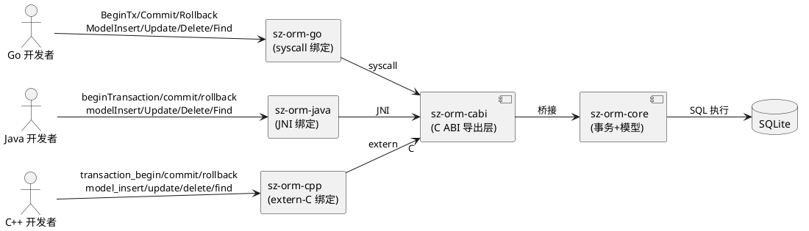
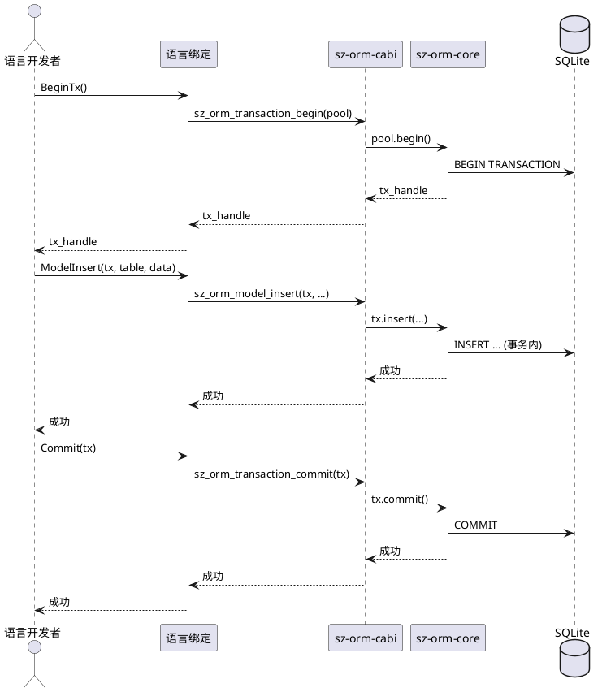
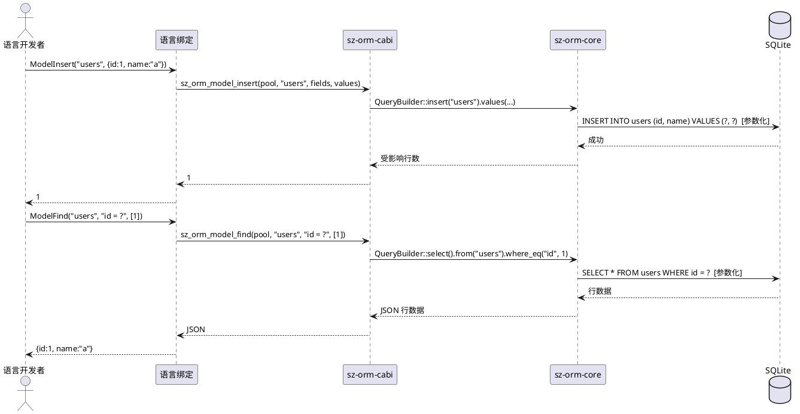
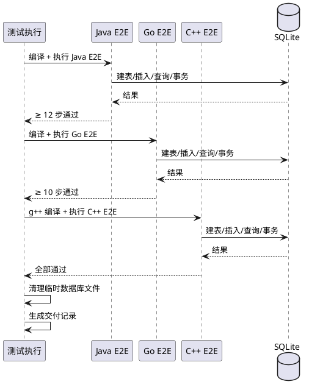

# sz-orm Go/Java/C++ 绑定事务与模型级 API 扩充需求规格说明书

> 任务编号：TASK-002
> 任务名称：扩充 Go/Java/C++ 绑定覆盖面（缺事务/模型级 API）
> 版本基线：v4.9.0
> 日期：2026-08-19
> 需求格式：EARS（Ubiquitous / Event-driven / State-driven / Optional / Unwanted）
> 文档定位：需求规格（What to build），不含技术设计（How to build）
> 需求编号约定：REQ-BND-xxx（绑定需求项，REQ-BND-001 ~ REQ-BND-018）
> 优先级声明：18 项需求全部 P0（用户明确要求补齐事务/模型级 API，且当前绑定仅基础 Pool/Query，功能缺口明确）
> 现状基线：Go/Java/C++ 绑定仅实现基础 Pool/Query API（pool_new/ping/query/execute/version），缺事务（begin/commit/rollback）和模型级（insert/update/delete/find）API；基于 sz-orm-cabi 的 C ABI 导出层
> 规划依据：`docs/sz-orm与同类产品对比分析.md`（3.2 节：sz-orm-java 6 API / sz-orm-go 8 API / sz-orm-cpp 8 API，均缺事务/模型级）+ `docs/sz-orm-maturity-roadmap.md`（C1 类：补充事务级 JNI/syscall/extern-C API）+ `packages/sz-orm-cabi/src/lib.rs`（C ABI 导出层）
> 兼容性铁律：既有基础 Pool/Query API（pool_new/ping/query/execute/version）100% 向后兼容，仅新增 API 不修改既有 API 签名；sz-pay 生产依赖不受影响（sz-pay 不使用 Go/Java/C++ 绑定）
> 范围声明：本任务聚焦为 Go/Java/C++ 三个绑定补充事务 API（begin/commit/rollback）和模型级 API（insert/update/delete/find），每个绑定附 E2E 测试；不涉及 Python/JS 绑定（已独立任务）
> 边界声明：本任务不新增 workspace 成员（在既有 sz-orm-go/java/cpp 包内扩展）；不修改 sz-orm-cabi 既有导出函数签名（仅新增导出函数）；代码尽量精简，不冗余

---

# 1. 组件定位

## 1.1 核心职责

本组件负责为 sz-orm 的 Go/Java/C++ 三个语言绑定补充事务级 API（begin/commit/rollback）和模型级 API（insert/update/delete/find），使三个绑定从"基础 Pool/Query"升级为"完整事务 + 模型 CRUD"能力，每个绑定附端到端测试验证。

## 1.2 核心输入

1. **sz-orm-cabi C ABI 导出层**：`packages/sz-orm-cabi/src/lib.rs`，当前导出 pool_new/ping/query/execute/version，本任务需新增事务/模型级导出函数。
2. **sz-orm-core 事务能力**：`packages/sz-orm-core/src/transaction.rs`，提供 begin/commit/rollback 基础能力，CABI 层需桥接。
3. **sz-orm-core 模型能力**：`packages/sz-orm-core/src/model.rs` + `query.rs`，提供 insert/update/delete/find 基础能力。
4. **既有绑定实现**：
   - sz-orm-java：`packages/sz-orm-java/src/lib.rs`（JNI，6 个入口），Java 侧 `packages/sz-orm-java/java-test/`
   - sz-orm-go：`packages/sz-orm-go/src/lib.rs`（syscall，8 个导出），Go 侧 `packages/sz-orm-go/go/szorm/`
   - sz-orm-cpp：`packages/sz-orm-cpp/src/lib.rs`（extern "C"，8 个导出），C++ 侧 `packages/sz-orm-cpp/cpp/szorm.h`
5. **SQLite 后端**：三个绑定均基于 sz-orm-cabi 的 SQLite 后端，E2E 测试使用 SQLite 内存/文件数据库。

## 1.3 核心输出

1. **sz-orm-cabi 新增导出函数**：事务（sz_orm_transaction_begin/commit/rollback）+ 模型级（sz_orm_model_insert/update/delete/find）。
2. **sz-orm-java 新增 JNI 入口**：beginTransaction/commit/rollback + modelInsert/modelUpdate/modelDelete/modelFind，Java 侧 wrapper 类。
3. **sz-orm-go 新增 syscall 导出**：BeginTx/Commit/Rollback + ModelInsert/ModelUpdate/ModelDelete/ModelFind，Go 侧 wrapper。
4. **sz-orm-cpp 新增 extern "C" 导出**：transaction_begin/commit/rollback + model_insert/update/delete/find，C++ 头文件 szorm.h 扩展。
5. **E2E 测试**：每个绑定附事务 E2E（提交/回滚）+ 模型 CRUD E2E（插入/更新/删除/查询往返）。
6. **交付记录**：按 session rules 要求，必须有交付记录文档。

## 1.4 职责边界

本组件**不负责**：
1. 修改 sz-orm-cabi 既有导出函数签名（pool_new/ping/query/execute/version 保持不变）。
2. Python/JS 绑定扩展（已独立任务/已有完整实现）。
3. 新增 workspace 成员。
4. 非 SQLite 后端的绑定测试（当前绑定仅支持 SQLite）。
5. 绑定的异步 API（当前绑定均为同步 FFI，异步属未来任务）。
6. 分布式事务（属 sz-orm-dtx，本任务仅本地事务）。

---

# 2. 领域术语

**C ABI 导出层**
: sz-orm-cabi 包通过 `#[no_mangle] extern "C"` 导出的 C 兼容接口，供 Go/Java/C++ 通过 syscall/JNI/extern-C 调用。

**事务句柄**
: `sz_orm_transaction_begin` 返回的不透明指针，后续 commit/rollback 需传入此句柄。

**模型级 API**
: 针对数据库表的行级操作（insert/update/delete/find），区别于原始 SQL 执行（execute/query）。

**E2E 测试**
: 端到端测试，从语言侧（Java/Go/C++）调用绑定，经 FFI → CABI → sz-orm-core → SQLite，验证完整链路往返。

**绑定轨标准**
: 绑定/集成层成熟标准（跨语言 E2E 全部通过 + 导出函数 100% 有测试覆盖 + 头文件/文档齐全），不设 LOC 门槛。

---

# 3. 角色与边界

## 3.1 核心角色

- **Go 开发者**：通过 sz-orm-go 调用 sz-orm 能力的 Go 程序员。
- **Java 开发者**：通过 sz-orm-java 调用 sz-orm 能力的 Java 程序员。
- **C++ 开发者**：通过 sz-orm-cpp 调用 sz-orm 能力的 C++ 程序员。

## 3.2 外部系统

- **sz-orm-cabi**：C ABI 导出层，本任务需扩展导出函数。
- **sz-orm-core**：核心能力提供者（事务/模型）。
- **SQLite**：E2E 测试的后端数据库。

## 3.3 交互上下文

---

# 4. DFX约束

## 4.1 性能

1. 单次 FFI 调用耗时上限：1 ms（不含 SQL 执行时间，仅 FFI 桥接开销）。
2. 事务 begin→commit 往返耗时上限：10 ms（SQLite 内存库）。

## 4.2 可靠性

1. 事务句柄必须显式 commit 或 rollback，不得隐式泄漏（句柄泄漏检测）。
2. 事务回滚后，事务内所有写操作必须不生效（原子性）。
3. 模型级 API 的字段类型映射必须双向一致（insert 的值 = find 返回的值）。

## 4.3 安全性

1. 所有 SQL 必须参数化（禁止字符串拼接，AGENTS.md 约束）。
2. 事务句柄不得被跨线程误用（FFI 句柄线程亲和性）。
3. 模型级 API 的表名/字段名必须校验（防 SQL 注入）。

## 4.4 可维护性

1. 每个新增导出函数必须有对应测试（绑定轨标准：导出函数 100% 有测试覆盖）。
2. C++ 头文件 szorm.h 必须同步更新新增函数声明。
3. 代码尽量精简，不冗余（session rules）。

## 4.5 兼容性

1. 既有基础 API（pool_new/ping/query/execute/version）签名不变。
2. 既有 E2E 测试不回退（Java 7 步 / Go E2E / C++ 7 测试保持通过）。

---

# 5. 核心能力

## 5.1 事务 API（begin/commit/rollback）

### 5.1.1 业务规则

1. **[Ubiquitous] CABI 事务导出**：The sz-orm-cabi shall 导出 `sz_orm_transaction_begin(pool_handle) -> tx_handle`、`sz_orm_transaction_commit(tx_handle) -> int`、`sz_orm_transaction_rollback(tx_handle) -> int` 三个 C ABI 函数。
   a. 验收条件：[grep sz-orm-cabi/src/lib.rs] → [存在三个 #[no_mangle] extern "C" 事务函数]
2. **[Event-driven] 事务提交**：When 调用 `transaction_begin` 获取事务句柄后执行写操作再调用 `commit`，the 绑定 shall 将事务内所有写操作持久化到数据库。
   a. 验收条件：[begin → insert → commit → find] → [find 返回 insert 的数据]
3. **[Event-driven] 事务回滚**：When 调用 `transaction_begin` 后执行写操作再调用 `rollback`，the 绑定 shall 撤销事务内所有写操作。
   a. 验收条件：[begin → insert → rollback → find] → [find 返回空，insert 未生效]
4. **[Unwanted] 事务句柄泄漏**：If 事务句柄未 commit/rollback 即丢弃，then the 绑定 shall 在句柄释放时自动 rollback 并记录警告。
   a. 验收条件：[begin → 丢弃句柄] → [自动 rollback，日志记录"事务未显式结束"]
5. **[State-driven] 事务内错误**：While 事务内某操作返回错误，the 绑定 shall 允许调用方决定 rollback 或继续。
   a. 验收条件：[begin → insert 错误 → rollback] → [事务回滚，无残留]
6. **[Ubiquitous] 三绑定事务 API 对齐**：The Go/Java/C++ 三个绑定 shall 各自提供事务 API（Go: BeginTx/Commit/Rollback；Java: beginTransaction/commit/rollback；C++: transaction_begin/commit/rollback），语义一致。
   a. 验收条件：[三绑定各自 E2E 事务测试] → [提交/回滚行为一致]

### 5.1.2 交互流程

### 5.1.3 异常场景

1. **事务句柄无效**
   a. 触发条件：commit/rollback 传入已释放或 null 的 tx_handle
   b. 系统行为：返回错误码（-1），不 panic
   c. 用户感知：错误返回"无效事务句柄"
2. **commit 失败**
   a. 触发条件：数据库约束冲突（如唯一键重复）
   b. 系统行为：commit 返回错误，事务自动 rollback
   c. 用户感知：错误返回"commit 失败：约束冲突"
3. **事务嵌套**
   a. 触发条件：在事务内再 begin（当前不支持嵌套事务）
   b. 系统行为：返回错误码，提示不支持嵌套
   c. 用户感知：错误返回"不支持嵌套事务"

## 5.2 模型级 API（insert/update/delete/find）

### 5.2.1 业务规则

1. **[Ubiquitous] CABI 模型导出**：The sz-orm-cabi shall 导出 `sz_orm_model_insert`、`sz_orm_model_update`、`sz_orm_model_delete`、`sz_orm_model_find` 四个 C ABI 函数，参数含表名/字段名/值/条件。
   a. 验收条件：[grep sz-orm-cabi/src/lib.rs] → [存在四个 #[no_mangle] extern "C" 模型函数]
2. **[Event-driven] insert 往返**：When 调用 `model_insert(table, fields, values)` 后调用 `model_find(table, pk)`，the 绑定 shall 返回 insert 的数据。
   a. 验收条件：[insert(users, {id:1, name:"a"}) → find(users, id=1)] → [返回 {id:1, name:"a"}]
3. **[Event-driven] update 生效**：When 调用 `model_update(table, set, where)` 后调用 `model_find`，the 绑定 shall 返回更新后的数据。
   a. 验收条件：[update(users, {name:"b"}, id=1) → find(users, id=1)] → [返回 {id:1, name:"b"}]
4. **[Event-driven] delete 生效**：When 调用 `model_delete(table, where)` 后调用 `model_find`，the 绑定 shall 返回空。
   a. 验收条件：[delete(users, id=1) → find(users, id=1)] → [返回空]
5. **[Unwanted] SQL 注入防护**：If 表名/字段名含特殊字符（如 `'` 或 `;`），then the 绑定 shall 拒绝执行并返回错误。
   a. 验收条件：[insert("users; DROP--", ...)] → [返回错误"非法表名"]
6. **[Ubiquitous] 参数化查询**：The 模型级 API shall 全部使用参数化查询，禁止 SQL 字符串拼接。
   a. 验收条件：[grep 源码] → [无 format!/push_str 拼接 SQL 值，全部用绑定参数]
7. **[Ubiquitous] 三绑定模型 API 对齐**：The Go/Java/C++ 三个绑定 shall 各自提供模型级 API（Go: ModelInsert/Update/Delete/Find；Java: modelInsert/Update/Delete/Find；C++: model_insert/update/delete/find），语义一致。
   a. 验收条件：[三绑定各自 E2E CRUD 测试] → [insert/update/delete/find 行为一致]
8. **[Optional] 事务内模型操作**：Where 模型级 API 调用时传入事务句柄，the 绑定 shall 在该事务内执行操作（而非自动提交）。
   a. 验收条件：[begin → model_insert(tx, ...) → rollback → find] → [find 返回空，操作已回滚]

### 5.2.2 交互流程

### 5.2.3 异常场景

1. **表不存在**
   a. 触发条件：insert/update/delete/find 的表名在数据库中不存在
   b. 系统行为：返回错误码，附数据库错误消息
   c. 用户感知：错误返回"表 xxx 不存在"
2. **字段类型不匹配**
   a. 触发条件：insert 字符串值到 INTEGER 列
   b. 系统行为：返回错误码，附类型错误
   c. 用户感知：错误返回"类型不匹配"
3. **find 无结果**
   a. 触发条件：find 条件无匹配行
   b. 系统行为：返回空结果（非错误）
   c. 用户感知：返回空数组/空对象
4. **update/delete 影响零行**
   a. 触发条件：where 条件无匹配行
   b. 系统行为：返回受影响行数 0（非错误）
   c. 用户感知：返回 0

## 5.3 E2E 测试

### 5.3.1 业务规则

1. **[Ubiquitous] Java E2E 扩展**：The sz-orm-java shall 扩展 Java 侧 E2E 测试至 ≥ 12 步（既有 7 步 + 事务 3 步 + 模型 CRUD 2 步）。
   a. 验收条件：[执行 Java E2E] → [≥ 12 步全部通过，含事务提交/回滚 + insert/find/update/delete 往返]
2. **[Ubiquitous] Go E2E 扩展**：The sz-orm-go shall 扩展 Go 侧 E2E 测试至 ≥ 10 步（既有 + 事务 + 模型 CRUD）。
   a. 验收条件：[执行 Go E2E] → [≥ 10 步全部通过]
3. **[Ubiquitous] C++ E2E 扩展**：The sz-orm-cpp shall 新增 C++ 侧 E2E 测试（建表/插入/查询/事务提交/事务回滚），需 g++ 环境编译。
   a. 验收条件：[g++ 编译 + 执行 C++ E2E] → [全部通过]
4. **[State-driven] SQLite 后端**：While E2E 测试使用 SQLite 后端，the 测试 shall 使用内存库（`sqlite::memory:`）或临时文件库，测试后清理。
   a. 验收条件：[E2E 完成] → [临时数据库文件已删除]
5. **[Ubiquitous] 既有测试不回退**：The 扩展 shall 不破坏既有测试（sz-orm-cabi 22 测试 / sz-orm-java Java E2E 7 步 / sz-orm-go 8 测试 / sz-orm-cpp 7 测试）。
   a. 验收条件：[cargo test -p sz-orm-cabi/java/go/cpp] → [既有测试全部通过]
6. **[Ubiquitous] 交付记录**：The 任务 shall 生成交付记录文档，含新增 API 清单 + E2E 测试结果 + 三绑定验证证据。
   a. 验收条件：[任务完成] → [交付记录文档存在且内容完整]

### 5.3.2 交互流程

### 5.3.3 异常场景

1. **g++ 环境缺失**
   a. 触发条件：执行 C++ E2E 时系统无 g++
   b. 系统行为：跳过 C++ E2E，标记"需 g++ 环境"
   c. 用户感知：报告"C++ E2E 跳过：无 g++ 环境"
2. **E2E 测试失败**
   a. 触发条件：某步 E2E 断言失败
   b. 系统行为：记录失败步骤与期望/实际值
   c. 用户感知：报告失败步骤详情
3. **临时文件残留**
   a. 触发条件：E2E 中断，临时数据库文件未清理
   b. 系统行为：测试结束后扫描并清理
   c. 用户感知：无残留临时文件

---

# 6. 数据约束

## 6.1 事务句柄

1. **句柄类型**：不透明指针（`*mut c_void` / `jlong` / `uintptr_t`），对语言侧不透明
2. **句柄生命周期**：begin 创建 → commit/rollback 释放；未显式释放时 drop 自动 rollback
3. **句柄线程亲和性**：同一事务句柄不得跨线程使用（FFI 安全约束）

## 6.2 模型级 API 参数

1. **表名**：必填，字符串，校验合法标识符（防注入）
2. **字段名**：必填，字符串数组，校验合法标识符
3. **值**：必填，类型映射（int/float/string/bool/null ↔ SQLite 类型）
4. **where 条件**：可选，参数化（条件表达式 + 绑定参数值）

## 6.3 导出函数命名约定

1. **CABI 层**：`sz_orm_` 前缀 + snake_case（如 `sz_orm_transaction_begin`）
2. **Go 层**：PascalCase（如 `BeginTx`）
3. **Java 层**：camelCase（如 `beginTransaction`）
4. **C++ 层**：snake_case（如 `transaction_begin`）

---

# 7. 需求追溯矩阵

| 需求编号 | 需求名称 | EARS 类型 | 验收条件 | 验证方法 |
|---------|---------|----------|---------|---------|
| REQ-BND-001 | CABI 事务导出 | Ubiquitous | 三个事务函数存在 | grep sz-orm-cabi/src/lib.rs |
| REQ-BND-002 | 事务提交 | Event-driven | begin→insert→commit→find 返回数据 | E2E 测试 |
| REQ-BND-003 | 事务回滚 | Event-driven | begin→insert→rollback→find 返回空 | E2E 测试 |
| REQ-BND-004 | 事务句柄泄漏 | Unwanted | 丢弃句柄自动 rollback | 负向测试 |
| REQ-BND-005 | 事务内错误 | State-driven | 错误后可 rollback | E2E 测试 |
| REQ-BND-006 | 三绑定事务 API 对齐 | Ubiquitous | 三绑定行为一致 | 三绑定 E2E |
| REQ-BND-007 | CABI 模型导出 | Ubiquitous | 四个模型函数存在 | grep sz-orm-cabi/src/lib.rs |
| REQ-BND-008 | insert 往返 | Event-driven | insert→find 返回数据 | E2E 测试 |
| REQ-BND-009 | update 生效 | Event-driven | update→find 返回新值 | E2E 测试 |
| REQ-BND-010 | delete 生效 | Event-driven | delete→find 返回空 | E2E 测试 |
| REQ-BND-011 | SQL 注入防护 | Unwanted | 非法表名被拒 | 负向测试 |
| REQ-BND-012 | 参数化查询 | Ubiquitous | 无 SQL 拼接 | grep 源码 |
| REQ-BND-013 | 三绑定模型 API 对齐 | Ubiquitous | 三绑定行为一致 | 三绑定 E2E |
| REQ-BND-014 | 事务内模型操作 | Optional | 传入 tx 在事务内执行 | E2E 测试 |
| REQ-BND-015 | Java E2E 扩展 | Ubiquitous | ≥ 12 步通过 | Java E2E 执行 |
| REQ-BND-016 | Go E2E 扩展 | Ubiquitous | ≥ 10 步通过 | Go E2E 执行 |
| REQ-BND-017 | C++ E2E 扩展 | Ubiquitous | g++ 编译 + E2E 通过 | g++ + C++ E2E |
| REQ-BND-018 | 既有测试不回退 | Ubiquitous | 既有测试全过 | cargo test |

---

# 8. 验收标准总览

1. **CABI 导出完整**：3 个事务函数 + 4 个模型函数，共 7 个新增导出
2. **三绑定 API 对齐**：Go/Java/C++ 各提供事务 + 模型级 API，语义一致
3. **E2E 测试全通过**：Java ≥ 12 步 / Go ≥ 10 步 / C++ 全通过（需 g++）
4. **既有测试不回退**：sz-orm-cabi 22 / java 7 / go 8 / cpp 7 既有测试保持通过
5. **SQL 注入防护**：表名/字段名校验，全部参数化查询
6. **事务原子性**：commit 持久化 / rollback 撤销 / 句柄泄漏自动 rollback
7. **临时文件清理**：E2E 后无残留临时数据库
8. **交付记录完整**：新增 API 清单 + E2E 结果 + 三绑定验证证据