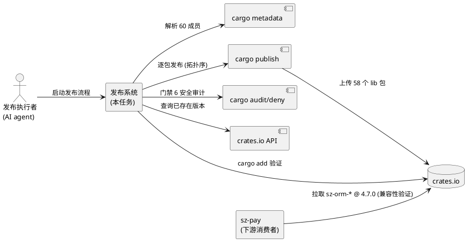
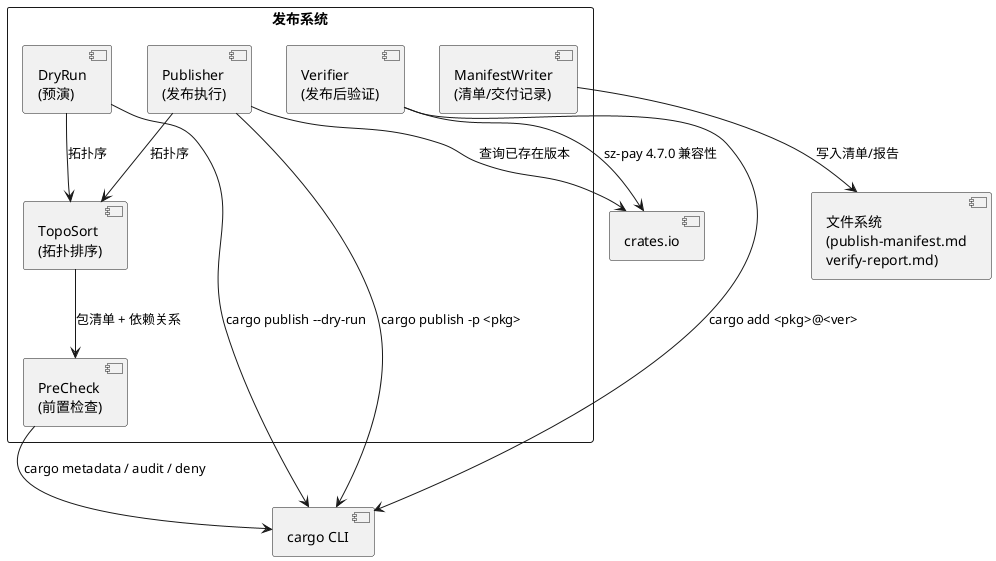
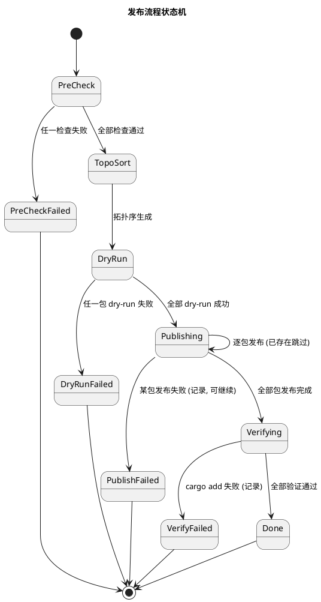
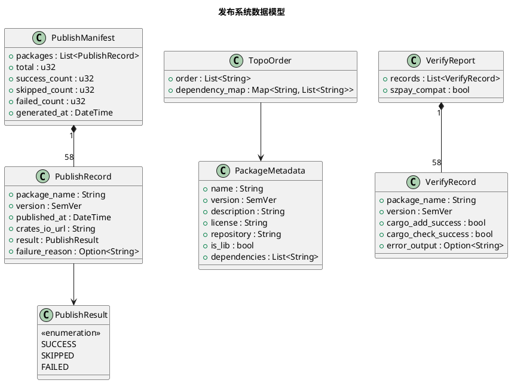

# sz-orm crates.io 全量发布技术设计文档

> 任务编号：TASK-001
> 对应需求规格：`docs/spec/cratesio_publish_all/spec.md`（REQ-PUB-001 ~ REQ-PUB-012）
> 版本基线：v4.9.0
> 日期：2026-08-19
> 文档定位：技术设计（How to build），与 spec.md 的"做什么"互补

---

# 一、需求与存量功能关系分析

## 1.1 需求功能与存量功能对比

### 1.1.1 已实现功能

| 需求功能 | 存量功能 | 代码位置 | 匹配度 |
|---------|---------|---------|--------|
| crates.io 登录态检查 | `cargo login` 写入 `~/.cargo/credentials.toml` | Rust 工具链内置 | 100% |
| workspace 清单解析 | `cargo metadata --format-version 1` 输出 60 个成员 | Cargo.toml:1-2（60 成员） | 100% |
| 版本号继承机制 | `version.workspace = true` 继承 `[workspace.package]` version | Cargo.toml:6（version = "4.9.0"） | 100% |
| sz-orm-core 已发布 | sz-orm-core 1.0.0 已在 crates.io（2026-07-23） | crates.io 历史记录 | 100% |
| 安全审计门禁 | `cargo audit` + `cargo deny check`（AGENTS.md 门禁 6） | scripts/ + cargo audit | 100% |
| 依赖拓扑关系 | workspace.dependencies 声明包间依赖 | Cargo.toml:82-90（sz-orm-core/ai/oracle/mssql/sqlx 等互依） | 100% |

### 1.1.2 需要扩展的功能

| 需求功能 | 存量功能 | 差异说明 | 扩展方向 |
|---------|---------|---------|---------|
| 58 个 lib 包发布清单 | 无发布清单脚本 | 仅 sz-orm-core 单包发布过，无批量清单 | 新增发布清单生成脚本（解析 cargo metadata，排除 cli/examples） |
| 依赖拓扑排序 | workspace.dependencies 隐式声明 | 依赖关系存在但无显式拓扑序列 | 新增拓扑排序算法（Kahn 算法），输出发布顺序 |
| dry-run 全量预演 | 单包 dry-run 经验 | 仅 sz-orm-core 做过 dry-run，无批量预演 | 新增批量 dry-run 脚本，逐包执行 `cargo publish --dry-run` |
| 逐包发布执行 | 单包发布经验 | 仅 sz-orm-core 发布过，无批量发布 | 新增批量发布脚本，按拓扑序逐包 `cargo publish` |
| cargo add 验证 | 无发布后验证 | sz-orm-core 发布后未做 cargo add 验证 | 新增验证脚本，临时项目 cargo add 拉取验证 |
| sz-orm-core 版本升级 | sz-orm-core Cargo.toml version = 1.0.0（已发布） | 需升级至 4.9.0 对齐 workspace | 修改 sz-orm-core Cargo.toml version 为 workspace 继承 |
| 发布清单文档 | 无 publish-manifest.md | 无发布记录文档 | 新增 publish-manifest.md + verify-report.md |
| 交付记录 | 无发布交付记录 | session rules 要求交付记录 | 新增交付记录文档 |

### 1.1.3 需要新增的功能或接口

按业务模块分组：

**发布前置检查模块**
- 可发布包清单生成：输入 workspace metadata，输出 58 个 lib 包清单（排除 cli/examples）
- 版本号一致性校验：55 个继承版本包校验解析为 4.9.0，3 个独立版本包校验为 0.1.0
- 包元数据完整性校验：每个包 Cargo.toml 含 name/description/license/repository 非空
- crates.io 已存在版本查询：通过 `cargo search` 或 crates.io API 查询某包某版本是否已存在

**发布执行模块**
- 依赖拓扑排序：Kahn 算法对 58 包按 workspace 内依赖关系排序
- 批量 dry-run 预演：按拓扑序逐包 `cargo publish --dry-run`
- 逐包发布：按拓扑序逐包 `cargo publish -p <pkg>`，已存在版本跳过
- 发布失败处理：记录失败包名 + 错误输出，支持继续后续包

**发布后验证模块**
- cargo add 可用性验证：临时项目 `cargo add <pkg>@<version>` + `cargo check`
- sz-pay 兼容性验证：crates.io 上 sz-orm-* 4.7.0 仍可拉取
- 临时文件清理：验证后删除临时项目目录
- 交付记录生成：发布时间 + 包数量 + 成功/失败统计 + crates.io URL 列表

## 1.2 存量功能详细分析

### 1.2.1 workspace 版本继承机制

- **接口契约**：`[workspace.package]` version = "4.9.0"，子包 `version.workspace = true` 继承
- **业务规则**：55 个包继承 workspace 版本，3 个包（graph/js/python）独立 0.1.0
- **约束**：sz-orm-core 已发布 1.0.0，升级至 4.9.0 时 1.0.0 保留不删（crates.io 禁止覆盖）
- **依赖**：版本号变更需同步所有引用该包的 workspace.dependencies 版本声明

### 1.2.2 workspace.dependencies 拓扑关系

- **接口契约**：Cargo.toml:82-90 声明 sz-orm-core/ai/oracle/mssql/sqlx/masking 等互依
- **业务规则**：被依赖包必须先发布（如 sz-orm-core 先于 sz-orm-sqlx，sz-orm-cabi 先于 sz-orm-java/go/cpp）
- **约束**：拓扑排序必须考虑 feature gate（某些依赖仅在特定 feature 下启用）
- **扩展点**：拓扑排序算法需处理循环依赖检测（理论上 workspace 不应有循环依赖）

### 1.2.3 既有安全审计门禁

- **接口契约**：`cargo audit`（RUSTSEC 漏洞）+ `cargo deny check`（许可证违规）
- **业务规则**：发布前必须通过门禁 6（AGENTS.md）
- **约束**：cargo audit 需联网查询 RUSTSEC 数据库，cargo deny 需 deny.toml 配置

---

# 二、增量设计方案

## 2.1 实现模型

### 2.1.1 上下文视图

### 2.1.2 服务/组件总体架构

**模块划分及职责**：
- **PreCheck**：前置检查（登录态/清单生成/版本号/元数据/安全审计）
- **TopoSort**：依赖拓扑排序（Kahn 算法）
- **DryRun**：批量 dry-run 预演
- **Publisher**：逐包发布执行（已存在跳过/失败处理）
- **Verifier**：发布后验证（cargo add + sz-pay 兼容性）
- **ManifestWriter**：发布清单 + 验证报告 + 交付记录

### 2.1.3 实现设计文档

**发布流程状态机**：

**设计决策**：
1. **状态机设计**：6 个主状态 + 4 个失败终态。失败不立即终止，支持"记录失败 + 继续后续包"（REQ-PUB-010）。
2. **可重入设计**：发布失败后可单独重发该包及后续包（DFX 4.2.1）。通过 ManifestWriter 记录每包状态（SUCCESS/SKIPPED/FAILED），重发时跳过 SUCCESS/SKIPPED。
3. **拓扑排序选择 Kahn 算法**：BFS 实现，O(V+E) 复杂度，能检测循环依赖（若入度队列提前空但仍有边则循环）。

## 2.2 接口设计

### 2.2.1 总体设计

| 接口分类 | 接口名 | 稳定性 | 说明 |
|---------|--------|--------|------|
| 前置检查 | precheck_login / precheck_manifest / precheck_version / precheck_metadata / precheck_audit | 稳定 | 发布前校验 |
| 拓扑排序 | topo_sort | 稳定 | 生成发布顺序 |
| 预演 | dry_run_all | 稳定 | 批量 dry-run |
| 发布执行 | publish_package / publish_all | 稳定 | 逐包/批量发布 |
| 验证 | verify_package / verify_all / verify_szpay_compat | 稳定 | 发布后验证 |
| 清单 | write_manifest / write_verify_report / write_delivery_record | 稳定 | 文档生成 |

### 2.2.2 接口清单

#### 前置检查接口

**precheck_login** - crates.io 登录态检查
- **前置条件**：`~/.cargo/credentials.toml` 存在
- **后置条件**：返回登录态有效/无效
- **实现**：执行 `cargo publish --dry-run -p sz-orm-core`，成功则 token 有效
- **异常映射**：token 过期 → 提示"请先 cargo login"

**precheck_manifest** - 可发布包清单生成
- **前置条件**：workspace Cargo.toml 存在
- **后置条件**：返回 58 个 lib 包清单（排除 cli/examples）
- **实现**：解析 `cargo metadata --format-version 1`，过滤 `publish != false` 且 `crate_type == lib` 的包
- **异常映射**：metadata 解析失败 → 中止

**precheck_version** - 版本号一致性检查
- **前置条件**：包清单已生成
- **后置条件**：55 包 version = 4.9.0，3 包 version = 0.1.0
- **实现**：读取每个包 Cargo.toml，校验 `version.workspace = true` 解析为 4.9.0 或独立版本 0.1.0
- **异常映射**：版本不匹配 → 报告包名 + 期望/实际版本

**precheck_metadata** - 包元数据完整性检查
- **前置条件**：包清单已生成
- **后置条件**：每个包 description/license/repository 非空
- **实现**：读取每个包 Cargo.toml [package] 段，校验 description 非空、license = MIT、repository 指向 github
- **异常映射**：字段缺失 → 中止，报告"sz-orm-xxx 缺少 description"

**precheck_audit** - 安全审计
- **前置条件**：cargo audit / cargo deny 已安装
- **后置条件**：无 RUSTSEC 漏洞 + 无许可证违规
- **实现**：执行 `cargo audit` + `cargo deny check`
- **异常映射**：发现漏洞 → 中止，报告漏洞详情

#### 拓扑排序接口

**topo_sort** - 依赖拓扑排序
- **前置条件**：包清单 + 依赖关系已生成
- **后置条件**：返回拓扑序列，被依赖包排在依赖方之前
- **实现**：Kahn 算法（BFS），从入度为 0 的包开始，逐步移除已发布依赖
- **异常映射**：检测到循环依赖 → 中止，报告循环链

#### 预演接口

**dry_run_all** - 批量 dry-run 预演
- **前置条件**：拓扑序已生成
- **后置条件**：58 包全部 dry-run 成功
- **实现**：按拓扑序逐包执行 `cargo publish --dry-run -p <pkg>`，超时 5 分钟/包
- **异常映射**：某包 dry-run 失败 → 中止，报告失败包 + 错误输出

#### 发布执行接口

**publish_package** - 单包发布
- **前置条件**：前序依赖包已发布
- **后置条件**：该包在 crates.io 可访问
- **实现**：
  1. 查询 crates.io 该版本是否已存在（`cargo search` 或 API）
  2. 已存在 → 跳过，记录 SKIPPED
  3. 不存在 → 执行 `cargo publish -p <pkg>`，超时 5 分钟
  4. 成功 → 记录 SUCCESS + crates.io URL + 时间戳
  5. 失败 → 记录 FAILED + 错误输出，询问是否继续后续
- **异常映射**：编译失败/依赖缺失/token 失效/网络错误 → 记录失败原因

**publish_all** - 批量发布
- **前置条件**：dry-run 全部通过
- **后置条件**：58 包在 crates.io 可访问（含跳过的已存在包）
- **实现**：按拓扑序逐包调用 publish_package

#### 验证接口

**verify_package** - 单包 cargo add 验证
- **前置条件**：该包已发布成功
- **后置条件**：临时项目 cargo add 成功 + cargo check 通过
- **实现**：
  1. 创建临时目录 `tmp/verify-<pkg>/`
  2. `cargo init` + `cargo add <pkg>@<version>` + `cargo check`
  3. 成功 → 记录验证通过
  4. 删除临时目录
- **异常映射**：cargo add 失败 → 记录 FAIL + 错误输出

**verify_szpay_compat** - sz-pay 兼容性验证
- **前置条件**：sz-orm-* 6 包已发布
- **后置条件**：crates.io 上 4.7.0 仍可拉取
- **实现**：临时项目 `cargo add sz-orm-core@4.7.0`（及其他 5 包），验证可拉取
- **异常映射**：4.7.0 不可拉取 → 警告"sz-pay 依赖可能受影响"

#### 清单接口

**write_manifest** - 发布清单写入
- **后置条件**：`publish-manifest.md` 含 58 行发布记录
- **字段**：包名/版本号/发布时间/crates.io URL/发布结果/失败原因

**write_verify_report** - 验证报告写入
- **后置条件**：`verify-report.md` 含 58 行验证记录

**write_delivery_record** - 交付记录写入
- **后置条件**：交付记录文档含发布时间/包数量/成功失败统计/URL 列表

## 2.3 数据模型

### 2.3.1 设计目标

- 支持发布流程可重入（失败后可单独重发）
- 支持发布状态追踪（SUCCESS/SKIPPED/FAILED）
- 支持发布清单 + 验证报告 + 交付记录三类文档输出
- 与 sz-pay 4.7.0 兼容性验证基准对齐

### 2.3.2 模型实现

**对象关系**：
- PublishManifest 聚合 58 个 PublishRecord（发布清单）
- VerifyReport 聚合 58 个 VerifyRecord（验证报告）
- TopoOrder 依赖 PackageMetadata（拓扑排序输入）
- PublishRecord 关联 PublishResult 枚举（SUCCESS/SKIPPED/FAILED）

**持久化策略**：
- PublishManifest → `docs/spec/cratesio_publish_all/publish-manifest.md`（Markdown 表格）
- VerifyReport → `docs/spec/cratesio_publish_all/verify-report.md`（Markdown 表格）
- 交付记录 → `docs/spec/cratesio_publish_all/delivery-record.md`
- 不持久化到数据库（发布流程一次性执行）

## 2.4 算法选择

### 2.4.1 依赖拓扑排序：Kahn 算法

**选择理由**：
- BFS 实现，O(V+E) 复杂度，V=58 包 E≈100 依赖边，毫秒级完成
- 能检测循环依赖（若入度队列提前空但仍有边则存在循环）
- 输出确定的拓扑序（同层级按包名字典序，保证可重现）

**算法步骤**：
1. 构建依赖图：节点=包，边=被依赖包 → 依赖方
2. 计算每个包入度（被多少包依赖）
3. 入度为 0 的包入队（无 workspace 内依赖的包，如 sz-orm-core）
4. BFS：出队一个包，将其依赖方的入度减 1，入度归 0 则入队
5. 若出队包数 < 总包数 → 存在循环依赖，中止

### 2.4.2 已存在版本查询：crates.io API

**选择理由**：
- `cargo search <pkg>` 输出含版本号，但不够精确
- crates.io API `GET https://crates.io/api/v1/crates/<pkg>` 返回 JSON 含所有版本
- 避免重复发布（crates.io 禁止覆盖同版本号）

## 2.5 错误处理策略

| 错误类型 | 处理策略 | 用户感知 |
|---------|---------|---------|
| 未登录 crates.io | 中止发布，提示 `cargo login` | 错误提示"请先 cargo login" |
| 包元数据缺失 | 中止发布，报告缺失包名+字段 | 错误提示"sz-orm-xxx 缺少 description" |
| 安全审计未通过 | 中止发布，报告漏洞/许可证问题 | 错误提示"安全审计未通过" |
| 循环依赖 | 中止发布，报告循环链 | 错误提示"检测到循环依赖: A→B→C→A" |
| dry-run 失败 | 中止发布，报告失败包+错误 | 错误提示"sz-orm-xxx dry-run 失败" |
| 依赖包未发布 | 记录失败，提示修正拓扑序 | 错误提示"dependency sz-orm-xxx not found" |
| 版本号冲突 | 跳过（已存在）或中止（非跳过模式） | 提示"版本已存在，跳过" |
| 网络错误 | 可重试（最多 3 次） | 错误提示"网络问题，重试中" |
| 编译失败 | 记录失败，属独立任务修复 | 错误提示"编译失败，需修复源码" |
| cargo add 失败 | 记录 FAIL + 错误输出 | verify-report.md 标记 FAIL |
| sz-pay 兼容性破坏 | 警告（不中止） | 警告"sz-pay 依赖可能受影响" |
| token 泄露风险 | 脱敏处理（不写入文档/日志） | 无 token 明文 |

## 2.6 性能优化

1. **依赖编译缓存复用**：`cargo publish` 复用 target/ 缓存，全量 58 包总耗时上限 2 小时（DFX 4.1.2）
2. **并行 dry-run**：无依赖关系的包可并行 dry-run（但 cargo publish 需串行，因 crates.io 限流）
3. **超时控制**：单包 5 分钟超时（DFX 4.1.1），避免卡死

## 2.7 安全性设计

1. **token 脱敏**：`~/.cargo/credentials.toml` 不在 repo 内，token 不出现在任何日志/报告/交付记录
2. **安全审计前置**：发布前必须通过 `cargo audit` + `cargo deny check`（门禁 6）
3. **版本号不可回退**：已发布版本不得重复发布或降版（DFX 4.5.1）

## 2.8 兼容性设计

1. **sz-orm-core 1.0.0 保留**：升级至 4.9.0 时 1.0.0 不删（crates.io 禁止覆盖）
2. **sz-pay 4.7.0 兼容**：新发布 4.9.0 不得破坏 4.7.0 API（语义化版本），verify_szpay_compat 验证
3. **3 个独立版本包**：graph/js/python 保持 0.1.0，不强制对齐 4.9.0

## 2.9 验证方法

| 需求 | 验证命令 | 预期结果 |
|------|---------|---------|
| REQ-PUB-001 登录态 | `cargo publish --dry-run -p sz-orm-core` | 成功 |
| REQ-PUB-002 包清单 | `cargo metadata --format-version 1` 解析 | 58 个 lib 包 |
| REQ-PUB-003 版本号 | grep Cargo.toml version.workspace | 55 包继承 4.9.0 |
| REQ-PUB-005 元数据 | cargo metadata 校验 description/license | 全部非空 |
| REQ-PUB-007 拓扑序 | 拓扑排序算法输出 | 被依赖包先发布 |
| REQ-PUB-008 发布 | `cargo publish -p <pkg>` | 成功 |
| REQ-PUB-011 cargo add | 临时项目 `cargo add <pkg>@<ver>` | 拉取成功 |
| sz-pay 兼容 | `cargo add sz-orm-core@4.7.0` | 仍可拉取 |
| 交付记录 | 文档存在性检查 | publish-manifest.md + verify-report.md + delivery-record.md 存在 |