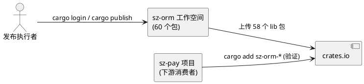
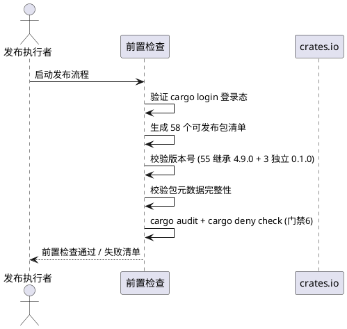
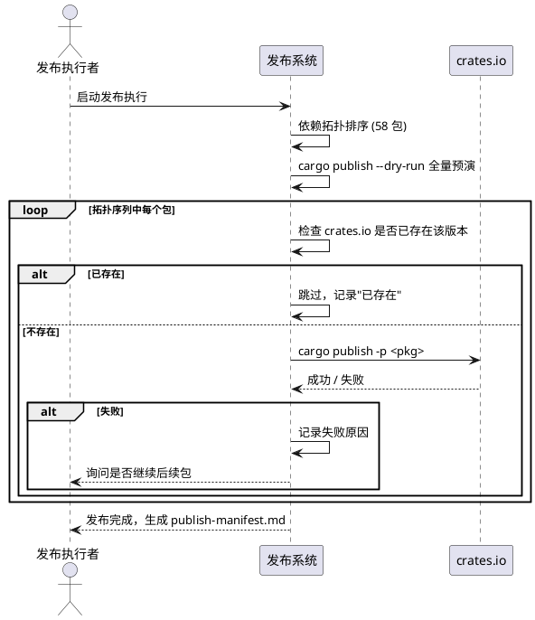
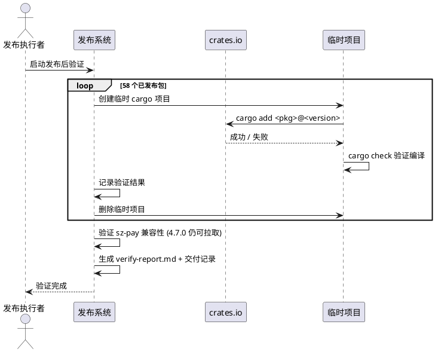

# sz-orm crates.io 全量发布需求规格说明书

> 任务编号：TASK-001
> 任务名称：crates.io 发布全部 60 包
> 版本基线：v4.9.0（workspace.package.version = "4.9.0"）
> 日期：2026-08-19
> 需求格式：EARS（Ubiquitous / Event-driven / State-driven / Optional / Unwanted）
> 文档定位：需求规格（What to build），不含技术设计（How to build）
> 需求编号约定：REQ-PUB-xxx（发布需求项，REQ-PUB-001 ~ REQ-PUB-012）
> 优先级声明：12 项需求全部 P0（用户明确要求全量发布，且 sz-pay 生产依赖从 crates.io 拉取，发布阻塞即生产阻塞）
> 现状基线：仅 sz-orm-core 已发布到 crates.io（1.0.0，2026-07-23），其余 59 个包未发布；3 个包有独立版本号（sz-orm-graph/js/python = 0.1.0），其余 55 个继承 workspace 4.9.0
> 规划依据：`Cargo.toml`（60 个 workspace 成员）+ `docs/sz-orm与同类产品对比分析.md`（crates.io 发布项标 ⚠️ 仅 sz-orm-core）+ `E:\vue\test\鲜视达\服务器信息.md`（crates.io 登录凭据）
> 兼容性铁律：sz-pay 生产依赖（从 crates.io 拉取 sz-orm-core/sqlx/config/auth/macros/queue 6 个包 @ 4.7.0）不得被破坏；已发布的 sz-orm-core 1.0.0 不得回退版本号
> 范围声明：本任务聚焦 crates.io 全量发布流程（登录验证 → 版本号确认 → 依赖拓扑排序 → 逐包发布 → 发布后验证），不修改任何包的源码功能逻辑，仅可能调整 Cargo.toml 的 publish/metadata 字段
> 边界声明：本任务不涉及新增 workspace 成员（保持 60），不涉及功能开发，不涉及文档翻译（属任务5）；如发布过程中发现某包编译失败，则该包的修复属独立任务，不在本任务范围内

---

# 1. 组件定位

## 1.1 核心职责

本组件负责将 sz-orm 工作空间全部 60 个包发布到 crates.io，使外部项目能够通过 `cargo add sz-orm-*` 拉取任意包。本组件处理发布前置检查（登录态/版本号/依赖拓扑）、逐包发布执行、发布后可用性验证三个阶段。

## 1.2 核心输入

1. **crates.io 登录凭据**：来源于 `E:\vue\test\鲜视达\服务器信息.md`，需通过 `cargo login` 写入 `~/.cargo/credentials.toml`。
2. **workspace 清单**：`Cargo.toml`（60 个成员：58 lib + cli + examples），其中 cli/examples 不发布（非 lib 包）。
3. **各包 Cargo.toml**：含 `[package]` name/version/description/license/repository 字段，需校验完整性。
4. **版本号策略**：
   - sz-orm-core：已发布 1.0.0，本次需升级至 4.9.0（与 workspace 对齐）或保持独立版本线。
   - sz-orm-graph / sz-orm-js / sz-orm-python：独立版本号 0.1.0。
   - 其余 55 个包：继承 workspace.package.version = "4.9.0"。
5. **包间依赖关系**：workspace 内包相互依赖（如 sz-orm-cabi 依赖 sz-orm-sqlx，sz-orm-java/go/cpp 依赖 sz-orm-cabi），决定发布拓扑顺序。
6. **sz-pay 生产依赖基准**：sz-pay 从 crates.io 拉取 sz-orm-* 6 个包 @ 4.7.0，作为 API 兼容性验证的下游基准。

## 1.3 核心输出

1. **crates.io 上 60 个包的发布记录**：每个包在 crates.io 上可访问，版本号正确。
2. **发布清单文档**：`docs/spec/cratesio_publish_all/publish-manifest.md`，记录每个包的发布时间、版本号、crates.io URL。
3. **发布后验证报告**：`docs/spec/cratesio_publish_all/verify-report.md`，记录 `cargo add` 验证结果。
4. **交付记录**：按 session rules 要求，必须有交付记录文档。

## 1.4 职责边界

本组件**不负责**：
1. 修改任何包的源码功能逻辑（如发现编译失败，修复属独立任务）。
2. 新增 workspace 成员。
3. 文档翻译（属任务5）。
4. crates.io 账号注册（假设账号已存在）。
5. 处理 yanked 包的恢复（如需 yank 属独立运维操作）。
6. 发布到 crates.io 以外的 registry（如私有 registry）。

---

# 2. 领域术语

**可发布包**
: workspace 中 `[package]` 含 `publish = true` 或未显式设置 `publish`（默认可发布）的 lib 包，共 58 个（cli/examples 为二进制包，不发布到 crates.io）。

**版本号继承**
: 子包 Cargo.toml 中 `version.workspace = true`，表示继承 `[workspace.package]` 的 version 字段（4.9.0）。

**独立版本号**
: 子包 Cargo.toml 中显式声明 `version = "x.y.z"`，不继承 workspace 版本（sz-orm-graph/js/python = 0.1.0）。

**发布拓扑顺序**
: 按包间依赖关系排序的发布序列，被依赖的包必须先发布，否则 `cargo publish` 会因依赖未找到而失败。

**cargo login 登录态**
: `~/.cargo/credentials.toml` 中存在有效 API token 的状态。

**yanked 包**
: 在 crates.io 上被标记为不可用的包版本，`cargo add` 会跳过 yanked 版本。

---

# 3. 角色与边界

## 3.1 核心角色

- **发布执行者**：运行 `cargo login` + `cargo publish` 命令的操作人员（本任务由 AI agent 执行）。

## 3.2 外部系统

- **crates.io**：Rust 官方包注册中心，接收 `cargo publish` 上传，提供 `cargo add` 拉取。
- **sz-pay 项目**：下游生产消费者，从 crates.io 拉取 sz-orm-* 6 个包，作为兼容性验证基准。

## 3.3 交互上下文

---

# 4. DFX约束

## 4.1 性能

1. 单包 `cargo publish` 耗时上限：5 分钟（含编译 + 上传）；超时视为发布失败。
2. 全量 58 包发布总耗时上限：2 小时（含依赖编译缓存复用）。

## 4.2 可靠性

1. 发布过程必须可重入：某包发布失败后，修复后可单独重发该包及其后续包，无需从头开始。
2. 已成功发布的包不得重复发布同版本号（crates.io 禁止覆盖）。
3. 发布后 100% 的包可通过 `cargo add <pkg>` 拉取成功。

## 4.3 安全性

1. crates.io API token 不得写入版本控制（`~/.cargo/credentials.toml` 不在 repo 内）。
2. token 不得出现在任何日志、报告、交付记录中（脱敏处理）。
3. 发布前必须通过 `cargo audit` + `cargo deny check`（门禁 6）。

## 4.4 可维护性

1. 发布清单（publish-manifest.md）必须记录每个包的：包名、版本号、发布时间、crates.io URL、发布结果。
2. 发布失败必须记录失败原因（编译错误 / 依赖缺失 / token 失效 / 网络错误）。

## 4.5 兼容性

1. 已发布的 sz-orm-core 1.0.0 不得回退或覆盖。
2. sz-pay 当前依赖 sz-orm-* @ 4.7.0，新发布 4.9.0 不得破坏 4.7.0 的 API（语义化版本）。
3. 3 个独立版本号包（graph/js/python = 0.1.0）保持 0.1.0，不强制对齐 4.9.0。

---

# 5. 核心能力

## 5.1 发布前置检查

### 5.1.1 业务规则

1. **[Ubiquitous] crates.io 登录态检查**：The 发布系统 shall 在执行任何 `cargo publish` 前验证 `~/.cargo/credentials.toml` 存在且 token 有效。
   a. 验收条件：[执行 `cargo publish --dry-run -p sz-orm-core`] → [返回成功（token 有效）或明确提示"请先 cargo login"]
2. **[Ubiquitous] 可发布包清单生成**：The 发布系统 shall 生成 58 个可发布 lib 包清单（排除 cli/examples 二进制包）。
   a. 验收条件：[扫描 workspace 成员] → [清单含 58 个 lib 包，不含 cli/examples]
3. **[State-driven] 版本号一致性检查**：While 子包 Cargo.toml 声明 `version.workspace = true`，the 发布系统 shall 校验其解析后版本号等于 4.9.0。
   a. 验收条件：[55 个继承版本包] → [每个包 version 解析为 4.9.0]
4. **[Optional] 独立版本号包处理**：Where 包为 sz-orm-graph / sz-orm-js / sz-orm-python，the 发布系统 shall 保持其独立版本号 0.1.0，不强制对齐 workspace 版本。
   a. 验收条件：[3 个独立版本包] → [version = 0.1.0，不被修改]
5. **[Ubiquitous] 包元数据完整性检查**：The 发布系统 shall 校验每个包 Cargo.toml 含 name/description/license/repository 字段且非空。
   a. 验收条件：[58 个包] → [每个包 description 非空、license = MIT、repository 指向 github]
6. **[Unwanted] 元数据缺失**：If 任一包缺少 description 或 license 字段，then the 发布系统 shall 中止发布并报告缺失包名与字段。
   a. 验收条件：[某包 description 为空] → [发布中止，报告"sz-orm-xxx 缺少 description"]

### 5.1.2 交互流程

### 5.1.3 异常场景

1. **未登录 crates.io**
   a. 触发条件：`~/.cargo/credentials.toml` 不存在或 token 过期
   b. 系统行为：中止发布，提示执行 `cargo login <token>`
   c. 用户感知：错误提示"crates.io 未登录，请先执行 cargo login"
2. **包元数据缺失**
   a. 触发条件：某包 Cargo.toml 缺少 description 字段
   b. 系统行为：中止发布，报告缺失包名与字段
   c. 用户感知：错误提示"sz-orm-xxx 缺少 description 字段，无法发布"
3. **安全审计未通过**
   a. 触发条件：`cargo audit` 发现 RUSTSEC 漏洞或 `cargo deny check` 发现许可证违规
   b. 系统行为：中止发布，报告漏洞/许可证问题
   c. 用户感知：错误提示"安全审计未通过，详见 cargo audit / cargo deny 输出"

## 5.2 依赖拓扑排序与发布执行

### 5.2.1 业务规则

1. **[Ubiquitous] 依赖拓扑排序**：The 发布系统 shall 按包间依赖关系生成发布顺序，被依赖的包排在依赖方之前。
   a. 验收条件：[分析 58 个包的 workspace 内依赖] → [生成拓扑序列，如 sz-orm-core 先于 sz-orm-sqlx，sz-orm-cabi 先于 sz-orm-java/go/cpp]
2. **[Event-driven] 逐包发布**：When 拓扑序列中前序包全部发布成功，the 发布系统 shall 对当前包执行 `cargo publish -p <pkg>`。
   a. 验收条件：[前序包全部成功] → [执行 `cargo publish -p sz-orm-xxx`，等待返回]
3. **[State-driven] 已发布包跳过**：While 某包的目标版本号已存在于 crates.io，the 发布系统 shall 跳过该包并记录"已存在"。
   a. 验收条件：[sz-orm-core 1.0.0 已存在] → [跳过，记录"sz-orm-core@1.0.0 已存在"]
4. **[Unwanted] 发布失败处理**：If `cargo publish` 返回非零退出码，then the 发布系统 shall 记录失败包名、错误输出，并询问是否继续后续包发布。
   a. 验收条件：[sz-orm-xxx 发布失败] → [记录失败原因，中止该包，可选继续后续]
5. **[Ubiquitous] dry-run 预演**：The 发布系统 shall 在正式发布前对全部 58 包执行 `cargo publish --dry-run` 预演，验证打包无错。
   a. 验收条件：[执行 dry-run] → [58 包全部 dry-run 成功后方可正式发布]
6. **[Optional] sz-orm-core 版本升级**：Where sz-orm-core 当前已发布 1.0.0 且需对齐 4.9.0，the 发布系统 shall 将其升级至 4.9.0 并发布（1.0.0 保留不删）。
   a. 验收条件：[sz-orm-core Cargo.toml version 改为 4.9.0] → [crates.io 上 sz-orm-core 4.9.0 可用，1.0.0 仍存在]

### 5.2.2 交互流程

### 5.2.3 异常场景

1. **依赖包未发布**
   a. 触发条件：拓扑排序错误，被依赖包未先发布
   b. 系统行为：`cargo publish` 报错"dependency sz-orm-xxx not found on crates.io"
   c. 用户感知：错误提示依赖缺失，需修正拓扑顺序
2. **版本号冲突**
   a. 触发条件：目标版本号已存在于 crates.io 且非跳过模式
   b. 系统行为：`cargo publish` 报错"already exists"
   c. 用户感知：错误提示版本已存在，需升级版本号或跳过
3. **网络错误**
   a. 触发条件：上传过程中网络中断
   b. 系统行为：`cargo publish` 报错网络错误，可重试
   c. 用户感知：错误提示网络问题，建议重试
4. **编译失败**
   a. 触发条件：`cargo publish` 触发编译，某包编译错误
   b. 系统行为：记录编译错误，中止该包发布
   c. 用户感知：错误提示编译失败，需修复源码（属独立任务）

## 5.3 发布后验证

### 5.3.1 业务规则

1. **[Event-driven] cargo add 可用性验证**：When 某包发布成功，the 发布系统 shall 在临时目录执行 `cargo add <pkg>@<version>` 验证可拉取。
   a. 验收条件：[sz-orm-xxx@4.9.0 发布成功] → [临时项目 `cargo add sz-orm-xxx@4.9.0` 成功，编译通过]
2. **[Ubiquitous] 全量验证报告**：The 发布系统 shall 生成 verify-report.md，记录 58 个包的 `cargo add` 验证结果（成功/失败）。
   a. 验收条件：[全量发布完成] → [verify-report.md 含 58 行验证记录]
3. **[Unwanted] 验证失败**：If 任一包 `cargo add` 失败，then the 发布系统 shall 在报告中标记失败并附错误输出。
   a. 验收条件：[sz-orm-xxx cargo add 失败] → [verify-report.md 标记 FAIL + 错误输出]
4. **[State-driven] sz-pay 兼容性验证**：While sz-pay 当前依赖 sz-orm-* @ 4.7.0，the 发布系统 shall 验证新发布 4.9.0 不破坏 4.7.0 API（4.7.0 包仍可在 crates.io 拉取）。
   a. 验收条件：[crates.io 上 sz-orm-core 4.7.0 仍可拉取] → [sz-pay 不受影响]
5. **[Ubiquitous] 临时文件清理**：The 发布系统 shall 在验证完成后删除所有临时目录（cargo add 验证用的临时项目）。
   a. 验收条件：[验证完成] → [临时目录已删除，无残留]
6. **[Ubiquitous] 交付记录生成**：The 发布系统 shall 生成交付记录文档，含发布时间、包数量、成功/失败统计、crates.io URL 列表。
   a. 验收条件：[发布流程结束] → [交付记录文档存在且内容完整]

### 5.3.2 交互流程

### 5.3.3 异常场景

1. **cargo add 拉取失败**
   a. 触发条件：crates.io 上包不存在或版本号错误
   b. 系统行为：记录失败，附 `cargo add` 错误输出
   c. 用户感知：verify-report.md 标记 FAIL
2. **临时目录残留**
   a. 触发条件：验证中断，临时目录未清理
   b. 系统行为：启动时扫描并清理残留临时目录
   c. 用户感知：无残留临时文件
3. **sz-pay 兼容性破坏**
   a. 触发条件：新发布 4.9.0 导致 4.7.0 被 yanked 或 API 不兼容
   b. 系统行为：报告兼容性风险
   c. 用户感知：警告"sz-pay 依赖可能受影响"

---

# 6. 数据约束

## 6.1 发布清单记录

1. **包名**：必填，与 workspace 成员名一致（如 sz-orm-core）
2. **版本号**：必填，格式 semver（如 4.9.0 / 0.1.0）
3. **发布时间**：必填，ISO 8601 格式（如 2026-08-19T10:30:00Z）
4. **crates.io URL**：必填，格式 `https://crates.io/crates/<pkg>/<version>`
5. **发布结果**：必填，枚举值 SUCCESS / SKIPPED / FAILED
6. **失败原因**：可选，仅当结果为 FAILED 时填写

## 6.2 版本号策略

1. **继承版本包**：55 个包，version = 4.9.0（workspace.package.version）
2. **独立版本包**：3 个包（sz-orm-graph / sz-orm-js / sz-orm-python），version = 0.1.0
3. **sz-orm-core 特殊处理**：已发布 1.0.0，本次发布 4.9.0（1.0.0 保留）
4. **版本号不可回退**：已发布版本不得重复发布或降版

## 6.3 可发布包范围

1. **lib 包**：58 个，可发布到 crates.io
2. **二进制包**：cli / examples，不发布（crates.io 主要托管 lib 包）
3. **publish 字段**：不得设置 `publish = false`（否则该包不可发布）

---

# 7. 需求追溯矩阵

| 需求编号 | 需求名称 | EARS 类型 | 验收条件 | 验证方法 |
|---------|---------|----------|---------|---------|
| REQ-PUB-001 | crates.io 登录态检查 | Ubiquitous | cargo publish --dry-run 成功 | `cargo publish --dry-run -p sz-orm-core` |
| REQ-PUB-002 | 可发布包清单生成 | Ubiquitous | 清单含 58 个 lib 包 | `cargo metadata` 解析 |
| REQ-PUB-003 | 版本号一致性检查 | State-driven | 55 包 version = 4.9.0 | grep Cargo.toml |
| REQ-PUB-004 | 独立版本号包处理 | Optional | 3 包 version = 0.1.0 | grep Cargo.toml |
| REQ-PUB-005 | 包元数据完整性检查 | Ubiquitous | description/license 非空 | cargo metadata 校验 |
| REQ-PUB-006 | 元数据缺失处理 | Unwanted | 中止并报告缺失 | 负向测试 |
| REQ-PUB-007 | 依赖拓扑排序 | Ubiquitous | 被依赖包先发布 | 拓扑排序算法 |
| REQ-PUB-008 | 逐包发布执行 | Event-driven | cargo publish 成功 | `cargo publish -p <pkg>` |
| REQ-PUB-009 | 已发布包跳过 | State-driven | 跳过已存在版本 | crates.io API 查询 |
| REQ-PUB-010 | 发布失败处理 | Unwanted | 记录失败原因 | 错误日志 |
| REQ-PUB-011 | cargo add 可用性验证 | Event-driven | 临时项目 cargo add 成功 | `cargo add <pkg>@<ver>` |
| REQ-PUB-012 | 交付记录生成 | Ubiquitous | 交付文档完整 | 文档存在性检查 |

---

# 8. 验收标准总览

1. **前置检查全通过**：登录态 ✓ / 58 包清单 ✓ / 版本号 ✓ / 元数据 ✓ / 安全审计 ✓
2. **dry-run 预演全通过**：58 包 `cargo publish --dry-run` 全部成功
3. **正式发布完成**：58 包在 crates.io 上可访问（含跳过的已存在包）
4. **cargo add 验证全通过**：58 包 `cargo add` 拉取成功
5. **sz-pay 兼容性未破坏**：4.7.0 包仍可拉取
6. **临时文件已清理**：无残留临时目录
7. **交付记录已生成**：publish-manifest.md + verify-report.md + 交付记录文档存在且内容完整
8. **token 未泄露**：任何文档/日志中不含 crates.io API token 明文