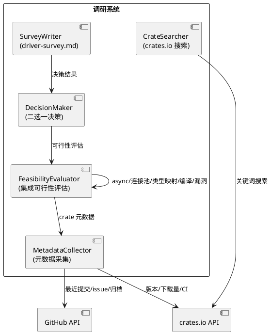
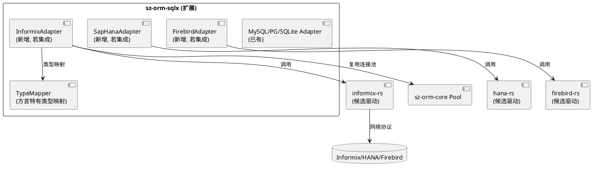
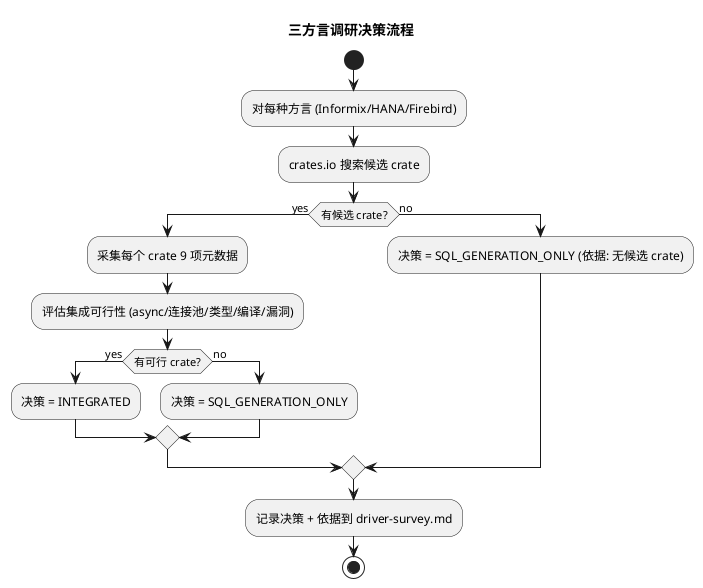
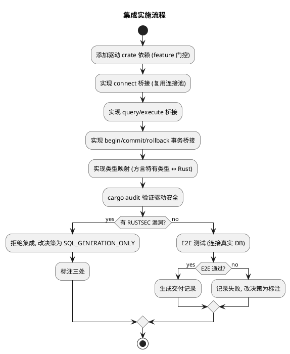
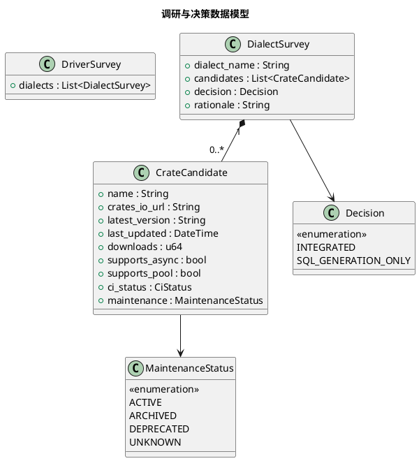

# sz-orm Informix/SAP HANA/Firebird 真实驱动集成技术设计文档

> 任务编号：TASK-003
> 对应需求规格：`docs/spec/dialect_real_driver/spec.md`（REQ-DIA-001 ~ REQ-DIA-014）
> 版本基线：v4.9.0
> 日期：2026-08-19
> 文档定位：技术设计（How to build），与 spec.md 的"做什么"互补

---

# 一、需求与存量功能关系分析

## 1.1 需求功能与存量功能对比

### 1.1.1 已实现功能

| 需求功能 | 存量功能 | 代码位置 | 匹配度 |
|---------|---------|---------|--------|
| Informix 方言枚举 | DbType::Informix（feature = "dialect-informix"） | packages/sz-orm-core/src/db_type.rs:67-69 | 100% |
| SAP HANA 方言枚举 | DbType::SapHana（feature = "dialect-saphana"） | packages/sz-orm-core/src/db_type.rs:70-72 | 100% |
| Firebird 方言枚举 | DbType::Firebird（feature = "dialect-firebird"） | packages/sz-orm-core/src/db_type.rs:73-75 | 100% |
| Informix SQL 生成层 | dialect.rs Informix SQL 字符串生成 | packages/sz-orm-core/src/dialect.rs（172 处分发） | 100% |
| SAP HANA SQL 生成层 | dialect.rs SapHana SQL 字符串生成 | packages/sz-orm-core/src/dialect.rs | 100% |
| Firebird SQL 生成层 | dialect.rs Firebird SQL 字符串生成 | packages/sz-orm-core/src/dialect.rs | 100% |
| 既有驱动集成模式 | sz-orm-sqlx（MySQL/PG/SQLite via sqlx）+ sz-orm-oracle + sz-orm-mssql | packages/sz-orm-sqlx/src/ + packages/sz-orm-oracle/src/ + packages/sz-orm-mssql/src/ | 100% |
| feature 门控机制 | Cargo feature 启用方言（默认不启用） | packages/sz-orm-core/Cargo.toml features | 100% |
| 连接池复用 | Pool + PooledConnection（自研无锁队列） | packages/sz-orm-core/src/pool.rs:749 | 100% |

### 1.1.2 需要扩展的功能

| 需求功能 | 存量功能 | 差异说明 | 扩展方向 |
|---------|---------|---------|---------|
| Rust 生态驱动 crate 调研 | 无调研报告 | 未评估 informix-rs/hana-rs/firebird-rs 可用性 | 新增 driver-survey.md，逐一调研候选 crate |
| 三方言驱动决策 | 无决策记录 | 未明确"集成"或"标注 SQL generation only" | 调研后逐方言决策，附客观证据 |
| （若集成）驱动适配层 | 无 Informix/HANA/Firebird 驱动桥接 | sz-orm-sqlx 仅适配 MySQL/PG/SQLite | 在 sz-orm-sqlx 或新模块实现三方言桥接 |
| （若集成）E2E 测试 | 无三方言 E2E | 无真实数据库连接测试 | 连接真实 DB 执行建表/插入/查询/事务往返 |
| （若标注）三处标注一致性 | 仅对比文档标注"仅 SQL 生成层" | db_type.rs/dialect.rs 注释 + README 未标注 | 补齐代码注释 + 文档 + README 三处标注 |

### 1.1.3 需要新增的功能或接口

**调研模块**
- 候选 crate 搜索：crates.io API 按关键词搜索（informix/hana/firebird）
- crate 元数据采集：crates.io API + GitHub API（版本/更新时间/下载量/CI/维护状态）
- 调研报告生成：driver-survey.md，每方言含候选 crate 清单 + 9 项字段 + 决策 + 依据

**决策模块**
- 集成可行性评估：async 支持/连接池支持/类型映射/编译兼容/RUSTSEC 漏洞检查
- 二选一决策：每方言明确 INTEGRATED 或 SQL_GENERATION_ONLY，附客观证据

**集成模块（若决策为集成）**
- 驱动适配层：connect/query/execute/begin/commit/rollback 桥接，复用既有连接池
- 类型映射：方言特有类型 ↔ Rust 类型（Informix SERIAL / HANA NVARCHAR / Firebird BLOB）
- feature 门控：通过 Cargo feature 启用（默认不启用）
- E2E 测试：连接真实 DB 执行建表/插入/查询/事务往返

**标注模块（若决策为标注）**
- 代码注释标注：db_type.rs 该方言枚举变体 + dialect.rs 该方言 SQL 生成分支
- 文档标注：对比分析文档 2.3 节 + README 方言列表
- 标注一致性校验：三处措辞一致

## 1.2 存量功能详细分析

### 1.2.1 既有方言枚举与 feature 门控

- **接口契约**：DbType 枚举 28 变体（21 默认内置 + 7 feature 门控），Informix/SapHana/Firebird 为 feature 门控
- **业务规则**：feature 门控方言默认不启用，需 `--features dialect-informix` 等启用
- **约束**：不启用 feature 时编译不包含三方言变体（零成本）
- **扩展点**：集成真实驱动时，驱动依赖也应 feature 门控

### 1.2.2 既有 SQL 生成层

- **接口契约**：dialect.rs 根据 DbType 分发生成不同 SQL 字符串（172 处分发，4724 行）
- **业务规则**：三方言 SQL 生成已实现（Informix SERIAL/ROW、HANA NVARCHAR/CE 函数、Firebird GENERATOR/SEQUENCE/EXECUTE BLOCK）
- **约束**：SQL 生成层不执行 SQL（无数据库连接），仅生成 SQL 字符串
- **扩展点**：集成真实驱动时，SQL 生成层保留不变，驱动层执行生成的 SQL

### 1.2.3 既有驱动集成模式（sz-orm-sqlx）

- **接口契约**：sz-orm-sqlx 通过 sqlx crate 适配 MySQL/PG/SQLite，提供 connect/query/execute/事务桥接
- **业务规则**：复用 sz-orm-core 连接池（Pool + PooledConnection），驱动层仅负责 SQL 执行
- **约束**：sqlx 0.8.x 支持 async + 连接池
- **扩展点**：三方言集成可复用此模式（驱动 crate 替换 sqlx，桥接逻辑相同）

---

# 二、增量设计方案

## 2.1 实现模型

### 2.1.1 上下文视图

```plantuml
@startuml
left to right direction
actor "方言用户" as User
rectangle "调研系统\n(本任务)" as Survey
component "crates.io API" as CratesApi
component "GitHub API" as GithubApi
rectangle "sz-orm-core\n(方言枚举+SQL生成)" as Core
rectangle "sz-orm-sqlx\n(驱动适配)" as Sqlx
component "Rust 驱动 crate" as Driver
database "Informix/HANA/Firebird" as DB

User --> Survey : 启动调研
Survey --> CratesApi : 搜索候选 crate
Survey --> GithubApi : 查询维护状态
Survey --> Survey : 决策: 集成 or 标注
alt 决策为集成
    User --> Sqlx : 连接/查询/事务
    Sqlx --> Driver : 调用驱动 crate
    Driver --> DB : 网络协议
else 决策为标注
    User --> Core : 生成 SQL (三方言)
    Core --> User : SQL 字符串 + "SQL generation only" 标注
end
@enduml
```

### 2.1.2 服务/组件总体架构



**集成方案架构（若决策为集成）**：



**模块划分及职责**：
- **CrateSearcher**：crates.io API 按关键词搜索候选 crate
- **MetadataCollector**：采集 crate 元数据（9 项字段）
- **FeasibilityEvaluator**：评估集成可行性（async/连接池/类型映射/编译/漏洞）
- **DecisionMaker**：二选一决策（INTEGRATED / SQL_GENERATION_ONLY）
- **SurveyWriter**：生成 driver-survey.md
- **（若集成）XxxAdapter**：方言驱动适配层，复用连接池 + 类型映射

### 2.1.3 实现设计文档

**调研与决策流程**：



**集成实施流程（若决策为集成）**：



**设计决策**：
1. **调研先行，决策后实施**：先调研 Rust 生态驱动可用性，再决策集成或标注。避免盲目集成不可用驱动
2. **客观证据为准**：调研结论基于 crates.io 下载量/GitHub 最近提交/CI 状态，禁止凭 crate README 自述（DFX 4.2.1，session rules）
3. **feature 门控隔离**：集成驱动通过 feature 启用（默认不启用），不影响既有编译（DFX 4.5.2）
4. **复用既有集成模式**：参考 sz-orm-sqlx（MySQL/PG/SQLite）桥接模式，驱动 crate 替换 sqlx，桥接逻辑相同
5. **不自行编写驱动**：仅集成既有 Rust crate，若无可行 crate 则标注 SQL_GENERATION_ONLY（边界声明）

## 2.2 接口设计

### 2.2.1 总体设计

| 接口分类 | 接口名 | 稳定性 | 说明 |
|---------|--------|--------|------|
| 调研 | search_candidates / collect_metadata / evaluate_feasibility / make_decision | 稳定 | 调研流程 |
| 标注 | annotate_db_type / annotate_dialect / annotate_docs / verify_consistency | 稳定 | 标注流程 |
| 集成（若集成） | connect / query / execute / begin / commit / rollback / type_map | 实验 | 驱动适配 |

### 2.2.2 接口清单

#### 调研接口

**search_candidates** - 候选 crate 搜索
- **输入**：方言关键词（informix / hana / firebird）
- **输出**：候选 crate 列表（名称/crates.io URL）
- **实现**：crates.io API `GET https://crates.io/api/v1/crates?q=<keyword>` 解析 JSON

**collect_metadata** - crate 元数据采集
- **输入**：crate 名称
- **输出**：9 项字段（名称/URL/最新版本/最后更新时间/下载量/async/连接池/CI/维护状态）
- **实现**：crates.io API + GitHub API 交叉查询
- **异常映射**：crate 不存在 → 跳过；GitHub repo 不存在 → 维护状态标记"未知"

**evaluate_feasibility** - 集成可行性评估
- **输入**：crate 元数据
- **输出**：可行性报告（async 支持/连接池支持/类型映射/编译兼容/RUSTSEC 漏洞）
- **实现**：
  1. 检查 crate 是否支持 async（依赖 tokio/async-std）
  2. 检查是否支持连接池（自带或可配合 bb8/deadpool）
  3. 检查类型映射覆盖（方言特有类型）
  4. `cargo check` 验证编译兼容
  5. `cargo audit` 检查 RUSTSEC 漏洞

**make_decision** - 二选一决策
- **输入**：可行性报告
- **输出**：INTEGRATED 或 SQL_GENERATION_ONLY + 决策依据
- **决策规则**：
  - 有可行 crate（async + 连接池 + 编译兼容 + 无漏洞）→ INTEGRATED
  - 无候选 / 全废弃 / 不支持 async / 有漏洞 → SQL_GENERATION_ONLY

#### 标注接口

**annotate_db_type** - db_type.rs 标注
- **实现**：在 DbType::Informix/SapHana/Firebird 变体上添加注释 `// SQL generation only: 仅 SQL 生成，无真实驱动连接`

**annotate_dialect** - dialect.rs 标注
- **实现**：在三方言 SQL 生成分支添加注释

**annotate_docs** - 文档标注
- **实现**：对比分析文档 2.3 节 + README 方言列表标注 "SQL generation only"

**verify_consistency** - 标注一致性校验
- **实现**：grep 三处标注，措辞一致

#### 集成接口（若决策为集成）

**connect** - 连接数据库
- **签名**：`async fn connect(conn_str: &str) -> Result<Connection, DriverError>`
- **实现**：调用驱动 crate 连接函数，包装为 sz-orm-core Connection trait

**query / execute** - 查询/执行
- **实现**：调用驱动 crate query/execute，结果集转为 sz-orm-core Row

**begin / commit / rollback** - 事务
- **实现**：调用驱动 crate 事务 API

**type_map** - 类型映射
- **实现**：方言特有类型 ↔ Rust 类型（Informix SERIAL → i64 / HANA NVARCHAR → String / Firebird BLOB → Vec<u8>）

## 2.3 数据模型

### 2.3.1 设计目标

- 调研报告结构化（每 crate 9 项字段 + 决策 + 依据）
- 决策结果可追溯（附客观证据链接）
- 集成方案复用既有连接池 + Connection trait
- 标注一致性（代码 + 文档 + README 三处）

### 2.3.2 模型实现



**对象关系**：
- DriverSurvey 聚合 3 个 DialectSurvey（Informix/HANA/Firebird）
- DialectSurvey 聚合多个 CrateCandidate + 1 个 Decision
- 每方言独立决策（不强制三方言同一决策）

**持久化策略**：
- DriverSurvey → `docs/spec/dialect_real_driver/driver-survey.md`（Markdown）
- 决策结果 → db_type.rs 注释 + dialect.rs 注释 + 对比文档 + README（若标注）
- 交付记录 → `docs/spec/dialect_real_driver/delivery-record.md`

## 2.4 算法选择

### 2.4.1 候选 crate 搜索：crates.io API 关键词搜索

**选择理由**：crates.io 提供官方 API（`/api/v1/crates?q=<keyword>`），返回 JSON 含 crate 列表，比手动 web 搜索更可靠可复现

### 2.4.2 维护状态判定：GitHub 最近提交 + 归档标志

**选择理由**：
- GitHub API 返回 repo `archived` 标志（明确归档）
- 最近提交时间 > 1 年 → DEPRECATED
- 最近提交时间 > 6 月 → 需进一步评估
- 客观可量化，禁止凭 README 自述

### 2.4.3 集成可行性评估：多维检查

**选择理由**：async/连接池/类型映射/编译/漏洞五维检查，任一不满足则降级为标注。避免集成后发现问题再回退

## 2.5 错误处理策略

| 错误类型 | 处理策略 | 用户感知 |
|---------|---------|---------|
| crates.io API 不可用 | 记录错误，标记"调研失败" | driver-survey.md 标记"API 不可用" |
| 无候选 crate | 决策 SQL_GENERATION_ONLY | 依据"Rust 生态无可用驱动" |
| 候选 crate 全废弃 | 决策 SQL_GENERATION_ONLY | 依据"无活跃维护的驱动" |
| crate 不支持 async | 降级评估，可能标注或封装 async | driver-survey.md 记录 async 支持情况 |
| 驱动 crate 编译失败 | 改决策 SQL_GENERATION_ONLY | 报告"驱动编译失败，改标注" |
| 驱动有 RUSTSEC 漏洞 | 拒绝集成，改标注 | 报告"有漏洞，拒绝集成" |
| E2E 数据库服务器不可用 | E2E 标记"需数据库服务器"，跳过但不失败 | 报告"E2E 跳过：数据库未启动" |
| 类型映射失败 | 记录未映射类型，返回错误 | 错误"类型 xxx 不支持" |
| 标注遗漏 | 一致性检查失败，补齐 | 报告遗漏位置，补齐后通过 |
| SQL 生成层被误改 | 既有测试失败，回滚 | 测试失败，回滚后通过 |

## 2.6 性能优化

1. **调研并行**：三方言调研可并行（无依赖关系），缩短调研耗时
2. **（若集成）连接池复用**：复用 sz-orm-core 连接池，连接池复用率 ≥ 95%（DFX 4.1.2）
3. **（若集成）查询往返 < 50 ms**（本地数据库，DFX 4.1.1）

## 2.7 安全性设计

1. **（若集成）cargo audit 验证驱动**：驱动 crate 必须无 RUSTSEC 漏洞（DFX 4.3.1）
2. **连接字符串密码脱敏**：不得出现在日志（DFX 4.3.2）
3. **SQL 参数化**：所有 SQL 参数化（AGENTS.md 约束）
4. **标注不引入安全误导**：标注"SQL generation only"明确告知用户无驱动连接，避免用户误用

## 2.8 兼容性设计

1. **既有 SQL 生成层 100% 保留**：标注方案不修改 SQL 生成逻辑（DFX 4.5.1）
2. **既有 feature 门控不变**：dialect-informix/saphana/firebird 默认不启用（DFX 4.5.2）
3. **既有 25 种其他方言不受影响**：仅处理三方言，其他方言行为不变（DFX 4.5.3）
4. **sz-pay 生产依赖不受影响**：sz-pay 不使用三方言

## 2.9 验证方法

| 需求 | 验证命令 | 预期结果 |
|------|---------|---------|
| REQ-DIA-001 三方言调研 | 文档存在性检查 | driver-survey.md 含三方言 |
| REQ-DIA-002 调研证据完整 | 文档检查 | 每 crate 含 9 项字段 |
| REQ-DIA-004 决策二选一 | 文档检查 | 每方言有明确决策 + 依据 |
| REQ-DIA-007 feature 门控 | `cargo check`（不启用 feature） | 编译成功，无三方言驱动依赖 |
| REQ-DIA-009 驱动漏洞拒绝 | `cargo audit` | 有漏洞则改标注 |
| REQ-DIA-013 标注一致性 | grep 三处标注 | 措辞一致 |
| REQ-DIA-014 SQL 生成保留 | 既有方言测试 | 生成层不变，测试通过 |
| （若集成）E2E | 真实 DB 测试 | 建表/插入/查询/事务往返全通过 |
| 交付记录 | 文档存在性检查 | delivery-record.md 存在 |