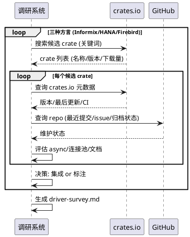
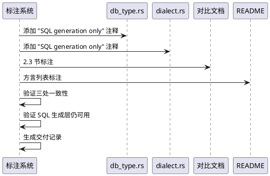

# sz-orm Informix/SAP HANA/Firebird 真实驱动集成需求规格说明书

> 任务编号：TASK-003
> 任务名称：Informix/SAP HANA/Firebird 真实驱动集成
> 版本基线：v4.9.0
> 日期：2026-08-19
> 需求格式：EARS（Ubiquitous / Event-driven / State-driven / Optional / Unwanted）
> 文档定位：需求规格（What to build），不含技术设计（How to build）
> 需求编号约定：REQ-DIA-xxx（方言需求项，REQ-DIA-001 ~ REQ-DIA-014）
> 优先级声明：14 项需求 P1（用户要求评估可行性并集成或明确标注，非生产阻塞）
> 现状基线：Informix / SAP HANA / Firebird 三种方言仅 SQL 生成层（方言枚举 + SQL 字符串生成），无真实数据库驱动连接；`docs/sz-orm与同类产品对比分析.md` 2.3 节明确标注"仅 SQL 生成层，无真实数据库驱动连接"
> 规划依据：`packages/sz-orm-core/src/db_type.rs`（DbType 枚举含 Informix/SapHana/Firebird，feature 门控）+ `packages/sz-orm-core/src/dialect.rs`（SQL 生成层）+ Rust 生态驱动 crate 调研（需评估 informix-rs / hana-rs / firebird-rs 可用性）
> 兼容性铁律：既有 SQL 生成层 100% 保留，不破坏；既有 21 种内置方言 + 4 种 feature 门控方言（CockroachDB/YugabyteDB/Snowflake/Redshift）不受影响；sz-pay 生产依赖不受影响
> 范围声明：本任务聚焦 Informix/SAP HANA/Firebird 三种方言的真实驱动集成或明确标注"SQL generation only"，不涉及其他方言
> 边界声明：本任务不新增 workspace 成员（在既有 sz-orm-core/sz-orm-sqlx 内扩展，或仅文档标注）；如 Rust 生态无成熟驱动，则采用"明确标注"方案，不自行编写驱动

---

# 1. 组件定位

## 1.1 核心职责

本组件负责评估 Informix/SAP HANA/Firebird 三种方言在 Rust 生态中的真实驱动 crate 可用性，对每种方言做出二选一决策：（A）集成真实驱动实现连接/查询/事务；（B）在文档和代码中明确标注"SQL generation only"（仅 SQL 生成，无驱动连接）。决策必须有调研证据支撑。

## 1.2 核心输入

1. **既有方言枚举**：`packages/sz-orm-core/src/db_type.rs`，DbType 含 Informix/SapHana/Firebird（feature 门控）。
2. **既有 SQL 生成层**：`packages/sz-orm-core/src/dialect.rs`（4,724 行 / 172 处分发），三方言的 SQL 字符串生成已实现。
3. **Rust 生态驱动 crate 调研**：需评估以下 crate（crates.io + GitHub）：
   - Informix：`informix-rs` / `ifx-rs` 等
   - SAP HANA：`hana-rs` / `hdb` 等
   - Firebird：`firebird-rs` / `rsfb-client` 等
4. **既有驱动集成模式**：sz-orm-sqlx（MySQL/PG/SQLite via sqlx）+ sz-orm-oracle（Oracle）+ sz-orm-mssql（MSSQL），作为集成参考。
5. **本机数据库**：MySQL/PG/Oracle/SQLite 已配置，Informix/SAP HANA/Firebird 未配置（需评估是否安装）。

## 1.3 核心输出

1. **驱动可用性调研报告**：`docs/spec/dialect_real_driver/driver-survey.md`，记录每种方言的候选 crate、维护状态、最新版本、是否支持异步、是否支持连接池、E2E 可行性。
2. **三方言决策结果**：每种方言明确"集成真实驱动"或"标注 SQL generation only"，附决策依据。
3. **（若集成）驱动适配层**：在 sz-orm-sqlx 或新模块中实现三方言的连接/查询/事务桥接。
4. **（若集成）E2E 测试**：连接真实数据库执行建表/插入/查询/事务往返。
5. **（若标注）文档与代码标注**：在 db_type.rs 注释 + dialect.rs 注释 + 对比分析文档 + README 中明确标注"SQL generation only"。
6. **交付记录**：按 session rules 要求，必须有交付记录文档。

## 1.4 职责边界

本组件**不负责**：
1. 自行编写数据库驱动（仅评估和集成既有 Rust crate）。
2. 修改既有 21 种内置方言 + 4 种 feature 门控方言的行为。
3. 安装 Informix/SAP HANA/Firebird 数据库服务器（如需 E2E，假设已安装或使用 Docker）。
4. 新增 workspace 成员（在既有包内扩展或仅文档标注）。
5. 三方言的 SQL 生成层优化（既有 SQL 生成保留不变）。

---

# 2. 领域术语

**SQL 生成层**
: 方言枚举 + SQL 字符串生成，能根据方言生成正确的 SQL 语句，但不执行（无数据库连接）。

**真实驱动集成**
: 通过 Rust crate 连接真实数据库服务器，执行 SQL 并返回结果集，含连接/查询/事务/类型映射。

**SQL generation only（仅 SQL 生成）**
: 明确标注该方言仅支持 SQL 字符串生成，不支持真实数据库连接；用户可获取生成的 SQL 自行通过其他驱动执行。

**驱动 crate 可用性**
: 候选 crate 的维护状态（活跃/归档）、最新版本、下载量、是否支持 async、是否支持连接池、是否通过 CI、文档完整性。

**feature 门控方言**
: 通过 Cargo feature 启用的方言（Informix/SapHana/Firebird 当前为 feature 门控，见 db_type.rs:55-75）。

---

# 3. 角色与边界

## 3.1 核心角色

- **Informix 用户**：使用 Informix 数据库的 sz-orm 消费者。
- **SAP HANA 用户**：使用 SAP HANA 数据库的 sz-orm 消费者。
- **Firebird 用户**：使用 Firebird 数据库的 sz-orm 消费者。

## 3.2 外部系统

- **crates.io / GitHub**：Rust 生态驱动 crate 的来源，用于调研可用性。
- **Informix/SAP HANA/Firebird 数据库服务器**：E2E 测试的后端（若集成方案）。

## 3.3 交互上下文

```plantuml
@startuml
left to right direction
actor "方言用户" as User
rectangle "sz-orm-core\n(方言枚举+SQL生成)" as Core
rectangle "sz-orm-sqlx\n(驱动适配)" as Sqlx
component "Rust 驱动 crate" as Driver
database "Informix/HANA/Firebird" as DB

User --> Core : 生成 SQL (三方言)
alt 集成真实驱动
    User --> Sqlx : 连接/查询/事务
    Sqlx --> Driver : 调用
    Driver --> DB : 网络协议
else 标注 SQL generation only
    Core --> User : SQL 字符串 + "仅生成"标注
end
@enduml
```

---

# 4. DFX约束

## 4.1 性能

1. （若集成）单次查询往返耗时上限：50 ms（本地数据库，不含网络）。
2. （若集成）连接池复用率 ≥ 95%（与既有连接池标准一致）。

## 4.2 可靠性

1. 调研结论必须基于真实证据（crates.io 下载量 / GitHub 最近提交 / CI 状态），禁止凭文档自述（session rules）。
2. （若集成）E2E 测试必须连接真实数据库，禁止 mock。
3. （若标注）标注必须出现在代码注释 + 文档 + README 三处，保持一致。

## 4.3 安全性

1. （若集成）驱动 crate 必须通过 `cargo audit`（无 RUSTSEC 漏洞）。
2. （若集成）连接字符串中的密码不得出现在日志。
3. 所有 SQL 参数化（AGENTS.md 约束）。

## 4.4 可维护性

1. 调研报告必须记录每个候选 crate 的：名称、最新版本、最后更新时间、下载量、是否 async、是否连接池、CI 状态、决策。
2. 决策结果必须可追溯（附调研证据链接）。

## 4.5 兼容性

1. 既有 SQL 生成层 100% 保留，不破坏。
2. 既有 feature 门控（Informix/SapHana/Firebird）行为不变（默认不启用）。
3. 既有 25 种其他方言不受影响。

---

# 5. 核心能力

## 5.1 驱动可用性调研

### 5.1.1 业务规则

1. **[Ubiquitous] 三方言逐一调研**：The 调研系统 shall 对 Informix / SAP HANA / Firebird 三种方言分别调研 Rust 生态候选驱动 crate。
   a. 验收条件：[调研完成] → [driver-survey.md 含三种方言各自的候选 crate 清单]
2. **[Ubiquitous] 调研证据完整**：The 调研系统 shall 对每个候选 crate 记录：名称、crates.io URL、最新版本、最后更新时间、下载量、是否 async、是否连接池、CI 状态、维护状态（活跃/归档/废弃）。
   a. 验收条件：[driver-survey.md] → [每个 crate 含上述 9 项字段]
3. **[Unwanted] 禁止凭文档自述**：If 调研结论仅基于 crate README 自述而无 crates.io/GitHub 客观证据，then the 调研 shall 标记为"证据不足"并降级决策置信度。
   a. 验收条件：[无客观证据的结论] → [标记"证据不足"]
4. **[Ubiquitous] 决策二选一**：The 调研系统 shall 对每种方言做出明确决策：（A）集成真实驱动 / （B）标注 SQL generation only，附决策依据。
   a. 验收条件：[三方言] → [每种有明确决策 + 依据]

### 5.1.2 交互流程



### 5.1.3 异常场景

1. **无候选 crate**
   a. 触发条件：crates.io 搜索无任何相关 crate
   b. 系统行为：决策为"标注 SQL generation only"，依据"Rust 生态无可用驱动"
   c. 用户感知：driver-survey.md 记录"无候选 crate，标注 SQL generation only"
2. **候选 crate 全部废弃**
   a. 触发条件：所有候选 crate 维护状态为归档/废弃
   b. 系统行为：决策为"标注 SQL generation only"，依据"无活跃维护的驱动"
   c. 用户感知：driver-survey.md 记录废弃状态
3. **crate 不支持 async**
   a. 触发条件：候选 crate 仅同步，与 sz-orm 异步架构不匹配
   b. 系统行为：降级评估，可能决策"标注"或"集成但封装为 async"
   c. 用户感知：driver-survey.md 记录 async 支持情况

## 5.2 真实驱动集成（若决策为集成）

### 5.2.1 业务规则

1. **[Optional] 驱动适配层**：Where 方言决策为"集成真实驱动"，the 系统 shall 在 sz-orm-sqlx 或新模块实现该方言的连接/查询/事务桥接，复用既有连接池。
   a. 验收条件：[方言决策为集成] → [实现 connect/query/execute/begin/commit/rollback 桥接]
2. **[Event-driven] E2E 测试**：When 方言集成完成，the 系统 shall 连接真实数据库执行建表/插入/查询/事务往返 E2E 测试。
   a. 验收条件：[集成完成] → [E2E: 建表→insert→find→update→delete→事务提交/回滚 全通过]
3. **[State-driven] feature 门控**：While 三方言为 feature 门控，the 集成 shall 通过 feature 启用（默认不启用，避免影响既有编译）。
   a. 验收条件：[cargo check 不启用 feature] → [编译成功，无三方言驱动依赖]
4. **[Ubiquitous] 类型映射**：The 集成 shall 实现方言特有类型与 Rust 类型的映射（如 Informix SERIAL / HANA NVARCHAR / Firebird BLOB）。
   a. 验收条件：[类型映射测试] → [方言特有类型正确往返]
5. **[Unwanted] 驱动漏洞**：If 驱动 crate 有 RUSTSEC 漏洞，then the 系统 shall 拒绝集成并改决策为"标注 SQL generation only"。
   a. 验收条件：[cargo audit 发现漏洞] → [拒绝集成，改决策为标注]

### 5.2.2 交互流程

```plantuml
@startuml
participant "集成系统" as S
component "Rust 驱动 crate" as Driver
database "真实数据库" as DB

S -> Driver : 添加依赖 (feature 门控)
S -> S : 实现连接桥接 (复用连接池)
S -> S : 实现查询/事务桥接
S -> S : 实现类型映射
S -> DB : E2E: 建表/插入/查询/事务
DB --> S : 结果
S -> S : cargo audit 验证驱动安全
S -> S : 生成集成证据 + 交付记录
@enduml
```

### 5.2.3 异常场景

1. **数据库服务器不可用**
   a. 触发条件：E2E 时 Informix/HANA/Firebird 服务器未启动
   b. 系统行为：E2E 标记"需数据库服务器"，跳过但不失败
   c. 用户感知：报告"E2E 跳过：数据库未启动"
2. **类型映射失败**
   a. 触发条件：方言特有类型无法映射到 Rust 类型
   b. 系统行为：记录未映射类型，返回错误
   c. 用户感知：错误返回"类型 xxx 不支持"
3. **驱动 crate 编译失败**
   a. 触发条件：驱动 crate 与当前 Rust 版本不兼容
   b. 系统行为：改决策为"标注 SQL generation only"
   c. 用户感知：报告"驱动编译失败，改标注"

## 5.3 明确标注 SQL generation only（若决策为标注）

### 5.3.1 业务规则

1. **[Optional] 代码注释标注**：Where 方言决策为"标注 SQL generation only"，the 系统 shall 在 db_type.rs 该方言枚举变体上添加注释"// SQL generation only: 仅 SQL 生成，无真实驱动连接"。
   a. 验收条件：[决策为标注] → [db_type.rs 该变体含注释]
2. **[Optional] dialect.rs 标注**：Where 方言决策为"标注"，the 系统 shall 在 dialect.rs 该方言 SQL 生成分支上添加注释。
   a. 验收条件：[决策为标注] → [dialect.rs 该分支含注释]
3. **[Optional] 文档标注**：Where 方言决策为"标注"，the 系统 shall 在 `docs/sz-orm与同类产品对比分析.md` 2.3 节 + README 方言列表中明确标注"SQL generation only"。
   a. 验收条件：[决策为标注] → [对比文档 + README 含标注]
4. **[Ubiquitous] 标注一致性**：The 标注 shall 在代码注释 + 文档 + README 三处保持一致措辞。
   a. 验收条件：[grep 三处标注] → [措辞一致]
5. **[State-driven] SQL 生成保留**：While 方言标注为"SQL generation only"，the 既有 SQL 生成层 shall 100% 保留可用（用户可获取生成的 SQL）。
   a. 验收条件：[生成 Informix SQL] → [返回正确 SQL 字符串，功能不变]
6. **[Ubiquitous] 交付记录**：The 任务 shall 生成交付记录文档，含三方言决策结果 + 调研证据 + （若集成）E2E 结果 + （若标注）标注位置清单。
   a. 验收条件：[任务完成] → [交付记录文档存在且内容完整]

### 5.3.2 交互流程



### 5.3.3 异常场景

1. **标注遗漏**
   a. 触发条件：某处（代码/文档/README）遗漏标注
   b. 系统行为：一致性检查失败，补齐
   c. 用户感知：报告遗漏位置，补齐后通过
2. **SQL 生成层被误改**
   a. 触发条件：标注过程中误改 SQL 生成逻辑
   b. 系统行为：既有测试失败，回滚
   c. 用户感知：测试失败，回滚后通过

---

# 6. 数据约束

## 6.1 调研报告记录

1. **方言名**：必填，Informix / SAP HANA / Firebird
2. **候选 crate 清单**：必填，每个 crate 含 9 项字段（名称/URL/版本/更新时间/下载量/async/连接池/CI/维护状态）
3. **决策结果**：必填，枚举 INTEGRATED / SQL_GENERATION_ONLY
4. **决策依据**：必填，基于客观证据的陈述
5. **（若集成）E2E 结果**：可选，集成时必填
6. **（若标注）标注位置**：可选，标注时必填（代码/文档/README 三处）

## 6.2 方言决策矩阵

1. **Informix**：调研后决策（集成 or 标注）
2. **SAP HANA**：调研后决策（集成 or 标注）
3. **Firebird**：调研后决策（集成 or 标注）
4. **三方言独立决策**：不强制三方言同一决策（可能 Informix 集成、HANA 标注）

## 6.3 集成范围约束（若集成）

1. **连接**：connect(conn_str) → 连接句柄
2. **查询**：query(sql, params) → 结果集
3. **执行**：execute(sql, params) → 受影响行数
4. **事务**：begin/commit/rollback
5. **类型映射**：方言特有类型 ↔ Rust 类型
6. **不自行编写驱动**：仅集成既有 Rust crate

---

# 7. 需求追溯矩阵

| 需求编号 | 需求名称 | EARS 类型 | 验收条件 | 验证方法 |
|---------|---------|----------|---------|---------|
| REQ-DIA-001 | 三方言逐一调研 | Ubiquitous | driver-survey.md 含三方言 | 文档存在性 |
| REQ-DIA-002 | 调研证据完整 | Ubiquitous | 每 crate 含 9 项字段 | 文档检查 |
| REQ-DIA-003 | 禁止凭文档自述 | Unwanted | 无证据标记"证据不足" | 负向检查 |
| REQ-DIA-004 | 决策二选一 | Ubiquitous | 每方言有明确决策 | 文档检查 |
| REQ-DIA-005 | 驱动适配层 | Optional | 集成时实现桥接 | 代码 grep |
| REQ-DIA-006 | E2E 测试 | Event-driven | 集成时 E2E 通过 | 真实 DB 测试 |
| REQ-DIA-007 | feature 门控 | State-driven | 默认不启用 | cargo check |
| REQ-DIA-008 | 类型映射 | Ubiquitous | 特有类型往返 | 类型测试 |
| REQ-DIA-009 | 驱动漏洞拒绝 | Unwanted | 有漏洞改标注 | cargo audit |
| REQ-DIA-010 | 代码注释标注 | Optional | 标注时 db_type.rs 含注释 | grep |
| REQ-DIA-011 | dialect.rs 标注 | Optional | 标注时 dialect.rs 含注释 | grep |
| REQ-DIA-012 | 文档标注 | Optional | 标注时文档含标注 | grep |
| REQ-DIA-013 | 标注一致性 | Ubiquitous | 三处措辞一致 | grep 一致性 |
| REQ-DIA-014 | SQL 生成保留 | State-driven | 生成层不变 | 既有测试 |

---

# 8. 验收标准总览

1. **调研报告完整**：三方言各有候选 crate 清单 + 9 项字段 + 决策 + 依据
2. **决策明确**：每方言明确"集成"或"标注"，附客观证据
3. **（若集成）E2E 通过**：连接真实 DB，建表/插入/查询/事务往返全通过
4. **（若集成）feature 门控**：默认不启用，不影响既有编译
5. **（若集成）类型映射**：方言特有类型正确往返
6. **（若标注）三处标注一致**：代码 + 文档 + README 措辞一致
7. **SQL 生成层保留**：既有 SQL 生成 100% 不变，既有测试不回退
8. **交付记录完整**：决策结果 + 调研证据 + E2E/标注位置