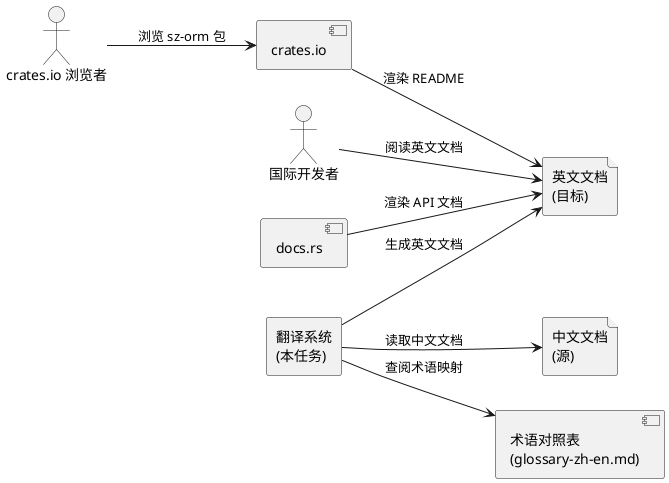
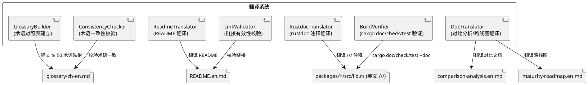
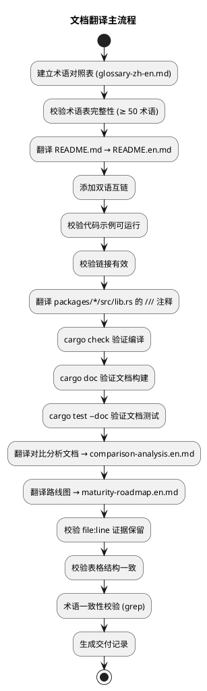
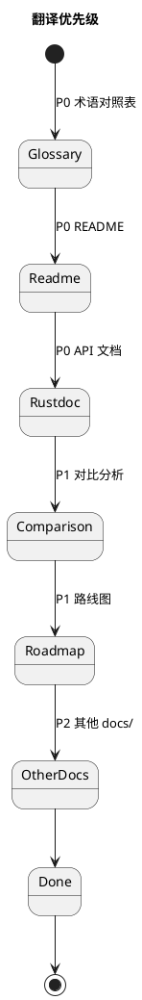
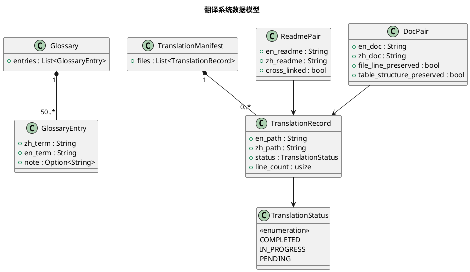

# sz-orm 英文文档翻译技术设计文档

> 任务编号：TASK-005
> 对应需求规格：`docs/spec/english_docs_i18n/spec.md`（REQ-I18N-001 ~ REQ-I18N-012）
> 版本基线：v4.9.0
> 日期：2026-08-19
> 文档定位：技术设计（How to build），与 spec.md 的"做什么"互补

---

# 一、需求与存量功能关系分析

## 1.1 需求功能与存量功能对比

### 1.1.1 已实现功能

| 需求功能 | 存量功能 | 代码位置 | 匹配度 |
|---------|---------|---------|--------|
| 中文 README | README.md（中文，含项目介绍/特性/快速开始/示例） | README.md | 100% |
| 中文 API 文档（rustdoc） | packages/*/src/lib.rs 的 /// 文档注释（部分中文） | packages/*/src/lib.rs | 100% |
| 中文对比分析文档 | docs/sz-orm与同类产品对比分析.md（中文，336,810 LOC 审计 + 竞品对比） | docs/sz-orm与同类产品对比分析.md | 100% |
| 中文成熟化路线图 | docs/sz-orm-maturity-roadmap.md（中文） | docs/sz-orm-maturity-roadmap.md | 100% |
| cargo doc 构建 | `cargo doc --workspace --no-deps` 生成 HTML API 文档 | Rust 工具链内置 | 100% |
| 文档测试 | `cargo test --doc` 运行 rustdoc 代码示例 | Rust 工具链内置 | 100% |
| 既有代码示例 | README + rustdoc 含可运行代码示例 | README.md + packages/*/src/lib.rs | 100% |

### 1.1.2 需要扩展的功能

| 需求功能 | 存量功能 | 差异说明 | 扩展方向 |
|---------|---------|---------|---------|
| 术语对照表 | 无中英术语对照表 | 翻译时无统一术语参考，易混用 | 新增 docs/glossary-zh-en.md（≥ 50 术语映射） |
| 英文 README | 无英文 README | 仅中文 README，国际可见性不足 | 新增 README.en.md（或 README.md 改英文 + 链接中文版） |
| 英文 API 文档（rustdoc） | rustdoc 注释部分中文 | 国际开发者难理解 | 翻译 packages/*/src/lib.rs 的 /// 注释为英文 |
| 英文对比分析文档 | 仅中文对比文档 | 国际可见性不足 | 新增 docs/sz-orm-comparison-analysis.en.md |
| 英文路线图 | 仅中文路线图 | 国际可见性不足 | 新增 docs/sz-orm-maturity-roadmap.en.md |
| 双语互链 | 无双语互链 | 中英文档无相互链接 | README.md + README.en.md 互链 |
| 翻译一致性校验 | 无校验机制 | 翻译可能混用术语 | 新增术语一致性校验（grep 标准译法） |

### 1.1.3 需要新增的功能或接口

**术语对照表模块**
- 术语提取：扫描全部中文文档提取技术术语
- 术语映射建立：中英术语对照（≥ 50 术语），如"连接池" → "connection pool"
- 术语一致性校验：grep 英文文档，校验同一术语统一译法

**README 翻译模块**
- 英文 README 生成：翻译中文 README 为英文，保留代码示例 + 链接
- 双语互链：README.en.md 链接中文版，README.md 链接英文版
- 代码示例可运行性验证：英文示例与中文一致且可运行
- 链接有效性验证：英文 README 链接目标存在

**API 文档翻译模块**
- rustdoc 注释翻译：翻译 packages/*/src/lib.rs 的 /// 注释为英文
- API 签名不变：仅翻译注释，不修改 pub fn/struct/enum 签名
- 文档测试保留：rustdoc 代码示例保留可运行，注释翻译为英文
- 编译验证：cargo check + cargo doc + cargo test --doc 全通过

**对比分析与路线图翻译模块**
- 英文对比分析文档：翻译 docs/sz-orm与同类产品对比分析.md，保留 file:line 证据 + 表格结构
- 英文路线图：翻译 docs/sz-orm-maturity-roadmap.md
- file:line 证据保留：代码证据路径不变，仅描述文字翻译
- 表格结构保留：Markdown 表格行列数与中文版一致

## 1.2 存量功能详细分析

### 1.2.1 中文 README 结构

- **接口契约**：README.md 含项目介绍/特性/快速开始/示例/链接
- **业务规则**：crates.io 主页渲染 README.md
- **约束**：翻译不得改变技术含义（语义等价）；代码示例可运行；链接有效
- **扩展点**：英文 README 需保持相同结构（章节对应），便于对照维护

### 1.2.2 rustdoc 注释机制

- **接口契约**：`///`? 开头文档注释，cargo doc 生成为 HTML API 文档
- **业务规则**：```rust 块为文档测试，cargo test --doc 运行
- **约束**：翻译仅修改 /// 注释，不修改代码；API 签名不变；文档测试保留可运行
- **扩展点**：翻译后 cargo doc 生成英文 HTML，docs.rs 自动托管

### 1.2.3 对比分析文档结构

- **接口契约**：含 60 包审计 + 竞品对比 + 综合矩阵，大量 file:line 代码证据 + Markdown 表格
- **业务规则**：每条 SZ-ORM 能力结论附真实 file:line 证据
- **约束**：翻译保留 file:line 路径不变（代码证据路径与中文版一致）；表格行列数一致
- **扩展点**：英文版需保留全部 file:line 证据 + 表格结构

---

# 二、增量设计方案

## 2.1 实现模型

### 2.1.1 上下文视图



### 2.1.2 服务/组件总体架构



**模块划分及职责**：
- **GlossaryBuilder**：扫描中文文档提取术语，建立中英对照表（≥ 50 术语）
- **ReadmeTranslator**：翻译 README.md 为英文，保留代码示例 + 链接 + 双语互链
- **RustdocTranslator**：翻译 packages/*/src/lib.rs 的 /// 注释为英文，API 签名不变
- **DocTranslator**：翻译对比分析文档 + 路线图，保留 file:line 证据 + 表格结构
- **ConsistencyChecker**：grep 英文文档，校验术语统一译法
- **LinkValidator**：校验英文 README 链接目标存在
- **BuildVerifier**：cargo check + cargo doc + cargo test --doc 验证翻译不破坏编译

### 2.1.3 实现设计文档

**翻译流程**：



**翻译优先级状态机**：



**设计决策**：
1. **术语对照表先行**：先建立术语映射（≥ 50 术语），翻译时查阅，确保全项目术语一致（REQ-I18N-001）
2. **双语并存（非替换）**：中文文档保留，英文文档新建（README.en.md + comparison-analysis.en.md），避免丢失中文读者
3. **README 翻译策略选择**：新建 README.en.md + 中文 README.md 添加英文版链接。理由：crates.io 默认渲染 README.md，若改英文则中文读者需点击链接；保留中文 README.md + 英文版链接兼顾双方。**但** crates.io 国际可见性要求 README.md 显示英文 → **最终决策**：README.md 改为英文（crates.io 主页英文），README.zh.md 保留中文，互链
4. **rustdoc 注释翻译**：仅翻译 /// 注释，不修改代码（API 签名不变），文档测试保留可运行
5. **file:line 证据保留**：对比文档中的代码证据路径不变（如 packages/sz-orm-core/src/query.rs:36），仅描述文字翻译
6. **表格结构保留**：Markdown 表格行列数与中文版一致，仅单元格内容翻译
7. **不翻译测试代码注释 / git commit / AGENTS.md / spec 文档**：边界声明，这些保持中文

## 2.2 接口设计

### 2.2.1 总体设计

| 接口分类 | 接口名 | 稳定性 | 说明 |
|---------|--------|--------|------|
| 术语表 | build_glossary / lookup_term / check_consistency | 稳定 | 术语对照表 |
| README 翻译 | translate_readme / add_bilingual_links / validate_examples / validate_links | 稳定 | README 翻译 |
| rustdoc 翻译 | translate_rustdoc / preserve_api_signature / validate_doctest | 稳定 | API 文档翻译 |
| 文档翻译 | translate_comparison / translate_roadmap / preserve_file_line / preserve_table_structure | 稳定 | 对比/路线图翻译 |
| 验证 | verify_build / verify_consistency | 稳定 | 编译 + 一致性验证 |

### 2.2.2 接口清单

#### 术语表接口

**build_glossary** - 建立术语对照表
- **后置条件**：docs/glossary-zh-en.md 存在，含 ≥ 50 术语映射
- **核心逻辑**：扫描全部中文文档提取技术术语 → 建立中英映射 → 审核完整性
- **字段**：中文术语 / 英文译法（唯一）/ 备注（可选，如"保留中文"/"品牌名"）

**lookup_term** - 查询术语
- **输入**：中文术语
- **输出**：英文标准译法
- **异常映射**：术语未收录 → 暂停翻译，补充术语表

**check_consistency** - 术语一致性校验
- **核心逻辑**：grep 英文文档，校验同一术语统一译法，发现混用则标记修正

#### README 翻译接口

**translate_readme** - 翻译 README
- **输入**：中文 README.md
- **输出**：英文 README.md（改英文）+ 中文 README.zh.md（保留）
- **核心逻辑**：查阅术语表翻译 → 保留代码示例 → 保留链接 → 添加双语互链
- **异常映射**：代码示例不一致 → 修正；死链 → 修正链接

**add_bilingual_links** - 添加双语互链
- **后置条件**：README.md 含"中文版"链接，README.zh.md 含"English"链接

**validate_examples** - 代码示例可运行性验证
- **核心逻辑**：英文示例 cargo run 验证，与中文示例行为一致

**validate_links** - 链接有效性验证
- **核心逻辑**：grep 英文 README 链接，校验目标存在

#### rustdoc 翻译接口

**translate_rustdoc** - 翻译 rustdoc 注释
- **输入**：packages/*/src/lib.rs 的 /// 注释（中文）
- **输出**：/// 注释（英文），API 签名不变
- **核心逻辑**：扫描 /// 注释 → 查阅术语表翻译 → 保留 ```rust 代码块
- **异常映射**：rustdoc 语法错误 → cargo doc 失败，回滚修正

**preserve_api_signature** - API 签名不变
- **后置条件**：git diff 仅注释变更，无 pub fn/struct/enum 签名变更

**validate_doctest** - 文档测试验证
- **核心逻辑**：cargo test --doc，文档测试全通过

#### 文档翻译接口

**translate_comparison** - 翻译对比分析文档
- **输入**：docs/sz-orm与同类产品对比分析.md
- **输出**：docs/sz-orm-comparison-analysis.en.md
- **核心逻辑**：翻译描述文字 → 保留 file:line 证据 → 保留表格结构

**preserve_file_line** - file:line 证据保留
- **后置条件**：英文文档 file:line 路径与中文版一致

**preserve_table_structure** - 表格结构保留
- **后置条件**：英文文档表格行列数与中文版一致

#### 验证接口

**verify_build** - 编译验证
- **核心逻辑**：cargo check + cargo doc --workspace --no-deps + cargo test --doc 全通过

## 2.3 数据模型

### 2.3.1 设计目标

- 术语对照表覆盖 ≥ 50 术语，翻译一致使用
- 双语文档并存（中文保留 + 英文新建/替换）
- file:line 证据保留（对比文档代码证据路径不变）
- 表格结构保留（行列数一致）

### 2.3.2 模型实现



**对象关系**：
- Glossary 聚合 ≥ 50 个 GlossaryEntry（术语映射）
- TranslationManifest 聚合多个 TranslationRecord（翻译文件清单）
- ReadmePair / DocPair 关联 TranslationRecord（双语文档对）

**持久化策略**：
- Glossary → `docs/glossary-zh-en.md`（Markdown 表格）
- 英文 README → `README.md`（改英文）+ 中文 README → `README.zh.md`
- 英文对比文档 → `docs/sz-orm-comparison-analysis.en.md`
- 英文路线图 → `docs/sz-orm-maturity-roadmap.en.md`
- 翻译清单 + 交付记录 → `docs/spec/english_docs_i18n/delivery-record.md`

## 2.4 算法选择

### 2.4.1 术语提取：扫描 + 词频统计

**选择理由**：扫描全部中文文档，统计技术术语词频，高频术语优先纳入对照表。确保覆盖 ≥ 50 术语

### 2.4.2 术语一致性校验：grep 标准译法

**选择理由**：grep 英文文档中同一中文术语的译法，若出现多种译法则标记混用，修正为对照表标准译法。简单高效

### 2.4.3 翻译顺序：优先级驱动

**选择理由**：按 P0（README + API 文档）→ P1（对比分析 + 路线图）→ P2（其他）优先级翻译，确保关键文档先完成

## 2.5 错误处理策略

| 错误类型 | 处理策略 | 用户感知 |
|---------|---------|---------|
| 术语未收录对照表 | 暂停翻译该术语，补充术语表后继续 | 术语表补充提示 |
| 术语混用（多种译法） | 标记并统一为标准译法 | 修正后一致 |
| 代码示例不一致 | 修正英文示例与中文一致 | 示例一致 |
| 死链（链接目标不存在） | 修正链接路径 | 链接有效 |
| rustdoc 语法错误 | cargo doc 失败，回滚修正 | cargo doc 成功 |
| 文档测试失败（误改代码示例） | cargo test --doc 失败，回滚示例 | 文档测试通过 |
| 翻译破坏编译 | cargo check 失败，回滚该处修正 | cargo check 成功 |
| file:line 证据丢失 | 与中文版比对补齐 | 证据保留完整 |
| 表格结构错乱 | 与中文版比对修正 | 表格结构一致 |

## 2.6 性能优化

1. **翻译不增加编译时间**：仅注释翻译，无逻辑变更（DFX 4.1.1）
2. **cargo doc 耗时不变**：文档量等比例增加，无额外开销（DFX 4.1.2）
3. **批量翻译**：可批量扫描 packages/*/src/lib.rs，减少 IO 开销

## 2.7 安全性设计

1. **翻译不引入敏感信息**：不得泄露凭据/内部 IP（DFX 4.3.1）
2. **翻译不移除安全警告**：既有安全警告/约束声明保留（DFX 4.3.2）
3. **API 签名不变**：仅注释翻译，不修改代码逻辑

## 2.8 兼容性设计

1. **中文文档 100% 保留**：双语并存，中文原文档不删除（DFX 4.5.1）
2. **API 签名不变**：仅 /// 注释翻译，pub fn/struct/enum 签名不变（DFX 4.5.2）
3. **cargo doc 构建不破坏**：英文注释合法 rustdoc（DFX 4.5.3）
4. **sz-pay 生产依赖不受影响**：仅文档翻译，无代码变更（DFX 4.5.4）

## 2.9 验证方法

| 需求 | 验证命令 | 预期结果 |
|------|---------|---------|
| REQ-I18N-001 术语对照表 | 文档存在性检查 | glossary-zh-en.md ≥ 50 术语 |
| REQ-I18N-002 术语一致性 | grep 英文文档术语译法 | 统一无混用 |
| REQ-I18N-005 英文 README | 文档存在性检查 | README.md 全英文 |
| REQ-I18N-006 中文 README 保留 | 文档存在性检查 | README.zh.md 存在 + 互链 |
| REQ-I18N-007 代码示例可运行 | cargo run 英文示例 | 运行成功 |
| REQ-I18N-008 链接有效 | 链接检查 | 无死链 |
| REQ-I18N-009 rustdoc 翻译 | `cargo doc --workspace --no-deps` | 生成英文 HTML API 文档 |
| REQ-I18N-010 API 签名不变 | `git diff` | 仅注释变更，无签名变更 |
| REQ-I18N-011 翻译不破坏编译 | `cargo check + cargo doc + cargo test --doc` | 全通过 |
| file:line 证据保留 | 对比中英文档 file:line | 路径一致 |
| 表格结构保留 | 对比中英文档表格 | 行列数一致 |
| 交付记录 | 文档存在性检查 | delivery-record.md 存在 |