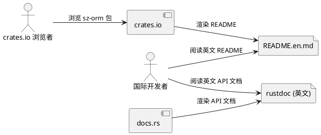
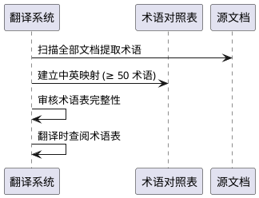
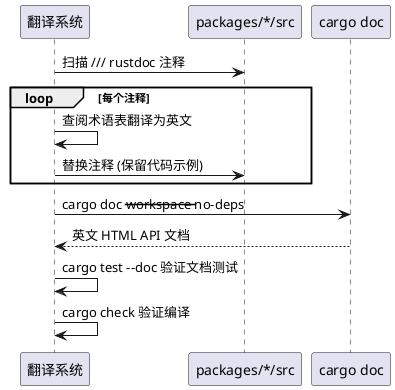

# sz-orm 英文文档翻译需求规格说明书

> 任务编号：TASK-005
> 任务名称：英文文档翻译
> 版本基线：v4.9.0
> 日期：2026-08-19
> 需求格式：EARS（Ubiquitous / Event-driven / State-driven / Optional / Unwanted）
> 文档定位：需求规格（What to build），不含技术设计（How to build）
> 需求编号约定：REQ-I18N-xxx（国际化需求项，REQ-I18N-001 ~ REQ-I18N-012）
> 优先级声明：12 项需求 P1（用户要求翻译关键文档为英文，提升国际可见性；对比分析文档显示"文档语言 ⚠️ 中文"为竞品劣势项）
> 现状基线：sz-orm 所有文档仅中文，包括 README.md / API 文档（rustdoc） / 对比分析文档 / 路线图 / spec 文档等；`docs/sz-orm与同类产品对比分析.md` 综合对比矩阵"文档语言"项标 ⚠️ 中文（竞品 Diesel/SeaORM/SQLx/Hibernate/EF Core/SQLAlchemy 均为英文）
> 规划依据：`README.md`（中文）+ `docs/` 目录（中文文档）+ `packages/*/src/lib.rs`（rustdoc 注释，部分中文）+ 用户要求"优先翻译 README.md 和 API 文档，保持技术术语一致性"
> 兼容性铁律：中文文档 100% 保留（不删除，双语并存）；既有代码 API 签名不变（仅注释翻译）；sz-pay 生产依赖不受影响
> 范围声明：本任务聚焦将关键文档翻译为英文，包括 README、API 文档（rustdoc）、对比分析文档等；优先级：README.md > API 文档（rustdoc）> 对比分析文档 > 路线图 > spec 文档
> 边界声明：本任务不修改任何代码功能逻辑（仅文档/注释翻译）；不翻译测试代码注释（测试注释保持中文，不影响功能）；保持技术术语一致性（术语表见第 6 章）

---

# 1. 组件定位

## 1.1 核心职责

本组件负责将 sz-orm 的关键文档从中文翻译为英文，使国际开发者能够理解和使用 sz-orm，消除"文档语言 ⚠️ 中文"的竞品劣势。翻译覆盖 README、API 文档（rustdoc 注释）、对比分析文档、路线图等，保持技术术语一致性，中文文档保留（双语并存）。

## 1.2 核心输入

1. **README.md**：项目根 `README.md`（中文），含项目介绍、特性、快速开始、示例等。
2. **API 文档（rustdoc 注释）**：`packages/*/src/lib.rs` 及各模块的 `///` 文档注释（部分中文），翻译后 `cargo doc` 生成英文 API 文档。
3. **对比分析文档**：`docs/sz-orm与同类产品对比分析.md`（中文，336,810 LOC 审计 + 竞品对比）。
4. **成熟化路线图**：`docs/sz-orm-maturity-roadmap.md`（中文）。
5. **其他 docs/ 文档**：工程化实践、审查手册等（中文）。
6. **技术术语表**：需建立中英术语对照表，确保一致性（如"连接池" → "connection pool"、"方言" → "dialect"）。

## 1.3 核心输出

1. **英文 README**：`README.en.md`（英文版），与中文 README 双语并存；或 README.md 改为英文 + 链接中文版。
2. **英文 API 文档**：`packages/*/src/lib.rs` 的 rustdoc 注释翻译为英文，`cargo doc --workspace --no-deps` 生成英文 API 文档。
3. **英文对比分析文档**：`docs/sz-orm-comparison-analysis.en.md`（英文版）。
4. **英文路线图**：`docs/sz-orm-maturity-roadmap.en.md`（英文版）。
5. **术语对照表**：`docs/glossary-zh-en.md`，记录中英术语映射，确保翻译一致性。
6. **交付记录**：按 session rules 要求，必须有交付记录文档。

## 1.4 职责边界

本组件**不负责**：
1. 修改任何代码功能逻辑（仅文档/注释翻译，API 签名不变）。
2. 翻译测试代码注释（测试注释保持中文，不影响功能）。
3. 翻译 git commit message（历史保留）。
4. 翻译 AGENTS.md（AI 工作指南，面向 AI，保持中文）。
5. 删除中文文档（双语并存）。
6. 翻译代码内非文档注释（如 `//` 行内注释，仅翻译 `///` rustdoc 注释）。
7. 翻译 spec 文档（本批 spec 为内部需求规格，保持中文；如需翻译属后续任务）。

---

# 2. 领域术语

**rustdoc 注释**
: Rust 代码中 `///` 开头的文档注释，`cargo doc` 将其生成为 HTML API 文档。

**双语并存**
: 中文文档保留，英文文档新建（如 README.md 中文 + README.en.md 英文），或同文件内中英双段。

**技术术语一致性**
: 同一技术概念在所有英文文档中使用统一译法，由术语对照表约束（如"连接池"统一译为 "connection pool"，不混用 "pool" / "connection pool" / "conn pool"）。

**术语对照表**
: 记录中英术语映射的文档，翻译时必须查阅，确保全项目一致。

---

# 3. 角色与边界

## 3.1 核心角色

- **国际开发者**：英语母语或偏好英文的 sz-orm 潜在用户，需英文文档理解和使用。
- **crates.io 浏览者**：在 crates.io 上浏览 sz-orm 包的用户，README 显示为 crates.io 页面。

## 3.2 外部系统

- **crates.io**：包发布平台，README.md 渲染为包主页，英文 README 提升国际可见性。
- **docs.rs**：Rust API 文档托管，`cargo doc` 生成的 rustdoc 上传后供浏览。

## 3.3 交互上下文



---

# 4. DFX约束

## 4.1 性能

1. 翻译不得增加代码编译时间（仅注释翻译，无逻辑变更）。
2. `cargo doc --workspace --no-deps` 生成耗时不变（文档量等比例增加）。

## 4.2 可靠性

1. 翻译不得改变技术含义（语义等价，禁止意译导致歧义）。
2. 代码示例在英文文档中必须可运行（与中文文档示例一致）。
3. 链接在英文文档中必须有效（相对路径正确）。

## 4.3 安全性

1. 翻译不得引入敏感信息泄露（如凭据、内部 IP）。
2. 翻译不得移除既有安全警告/约束声明。

## 4.4 可维护性

1. 术语对照表必须先于翻译建立，翻译时查阅。
2. 英文文档结构与中文文档一致（章节对应），便于对照维护。
3. 双语文档同步更新机制：中文文档更新时，英文文档对应章节需同步（标注待翻译）。

## 4.5 兼容性

1. 中文文档 100% 保留，不删除。
2. 既有代码 API 签名不变（仅 `///` 注释翻译）。
3. 既有 `cargo doc` 构建不破坏（英文注释合法 rustdoc）。
4. sz-pay 生产依赖不受影响。

---

# 5. 核心能力

## 5.1 术语对照表建立

### 5.1.1 业务规则

1. **[Ubiquitous] 术语对照表**：The 翻译系统 shall 先建立中英术语对照表 `docs/glossary-zh-en.md`，覆盖 sz-orm 全部技术术语。
   a. 验收条件：[翻译开始前] → [glossary-zh-en.md 存在，含 ≥ 50 个术语映射]
2. **[Ubiquitous] 术语一致性**：The 翻译 shall 严格遵循术语对照表，同一中文术语在所有英文文档中统一译法。
   a. 验收条件：[grep 英文文档 "连接池"译法] → [统一为 "connection pool"，无混用]
3. **[Unwanted] 术语混用**：If 同一术语出现多种英文译法，then the 翻译系统 shall 标记并统一为对照表中的标准译法。
   a. 验收条件：[发现混用] → [修正为标准译法]
4. **[Optional] 术语保留中文**：Where 术语为 sz-orm 特有概念（如 "鲜视达" 品牌名），the 翻译 shall 保留原文 + 英文注释。
   a. 验收条件：[品牌名"鲜视达"] → [英文文档保留 "鲜视达 (Xianshida)" 或保留中文]

### 5.1.2 交互流程



### 5.1.3 异常场景

1. **术语缺失对照**
   a. 触发条件：翻译时遇到术语表中未收录的术语
   b. 系统行为：暂停翻译该术语，补充术语表后继续
   c. 用户感知：术语表补充提示

## 5.2 README 翻译（最高优先级）

### 5.2.1 业务规则

1. **[Ubiquitous] 英文 README 生成**：The 翻译系统 shall 生成英文 README（`README.en.md` 或 README.md 改英文 + 链接中文版），含项目介绍、特性、快速开始、示例、链接。
   a. 验收条件：[README.en.md 存在] → [含介绍/特性/快速开始/示例，全英文]
2. **[Ubiquitous] 中文 README 保留**：The 翻译 shall 保留中文 README（双语并存），英文版链接中文版反之亦然。
   a. 验收条件：[README.en.md 含链接 "中文版"] → [README.md 含链接 "English"]
3. **[Ubiquitous] 代码示例可运行**：The 英文 README 中的代码示例 shall 与中文版一致且可运行。
   a. 验收条件：[英文示例 cargo run] → [运行成功，与中文示例行为一致]
4. **[Ubiquitous] 链接有效**：The 英文 README 中的链接 shall 全部有效（相对路径正确，无死链）。
   a. 验收条件：[grep 英文 README 链接] → [全部链接目标存在]
5. **[State-driven] crates.io 渲染**：While README.md 为 crates.io 主页渲染源，the 翻译 shall 确保 crates.io 显示英文（README.md 改英文或 crates.io metadata 指向英文版）。
   a. 验收条件：[crates.io 上 sz-orm 包主页] → [README 显示英文]

### 5.2.2 交互流程

```plantuml
@startuml
participant "翻译系统" as T
file "README.md (中文)" as Zh
file "README.en.md (英文)" as En

T -> Zh : 阅读中文 README
T -> T : 查阅术语对照表翻译
T -> En : 生成英文 README
T -> En : 添加中文版链接
T -> Zh : 添加英文版链接
T -> T : 验证代码示例可运行
T -> T : 验证链接有效
@enduml
```

### 5.2.3 异常场景

1. **代码示例不一致**
   a. 触发条件：英文示例与中文示例行为不一致
   b. 系统行为：修正英文示例与中文一致
   c. 用户感知：示例一致
2. **死链**
   a. 触发条件：英文 README 链接目标不存在
   b. 系统行为：修正链接路径
   c. 用户感知：链接有效

## 5.3 API 文档翻译（rustdoc 注释）

### 5.3.1 业务规则

1. **[Ubiquitous] rustdoc 注释翻译**：The 翻译系统 shall 将 `packages/*/src/lib.rs` 及各模块的 `///` 文档注释翻译为英文，`cargo doc` 生成英文 API 文档。
   a. 验收条件：[cargo doc --workspace --no-deps] → [生成英文 HTML API 文档]
2. **[Ubiquitous] API 签名不变**：The 翻译 shall 不修改任何 `pub fn` / `pub struct` / `pub enum` 的签名（仅翻译 `///` 注释）。
   a. 验收条件：[git diff] → [仅注释变更，无签名变更]
3. **[Ubiquitous] 代码示例保留**：The rustdoc 中的代码示例（```rust 块）shall 保留可运行，注释翻译为英文。
   a. 验收条件：[cargo test --doc] → [文档测试全通过]
4. **[Optional] 中文注释保留**：Where 需保留中文注释（如特定业务术语），the 翻译 shall 采用英文为主 + 中文括注。
   a. 验收条件：[特有术语] → [英文 + (中文) 括注]
5. **[Unwanted] 翻译破坏编译**：If 翻译导致 `cargo doc` 或 `cargo check` 失败，then the 翻译系统 shall 回滚该处并修正。
   a. 验收条件：[cargo check + cargo doc] → [全部成功]

### 5.3.2 交互流程



### 5.3.3 异常场景

1. **rustdoc 语法错误**
   a. 触发条件：翻译引入非法 rustdoc 语法（如未闭合 ```）
   b. 系统行为：cargo doc 失败，回滚修正
   c. 用户感知：cargo doc 成功
2. **文档测试失败**
   a. 触发条件：翻译误改代码示例
   b. 系统行为：cargo test --doc 失败，回滚示例
   c. 用户感知：文档测试通过

## 5.4 对比分析与路线图翻译

### 5.4.1 业务规则

1. **[Ubiquitous] 英文对比分析文档**：The 翻译系统 shall 生成 `docs/sz-orm-comparison-analysis.en.md`（英文版对比分析），含 60 包审计 + 竞品对比 + 综合矩阵。
   a. 验收条件：[英文对比文档存在] → [含审计/对比/矩阵，全英文]
2. **[Ubiquitous] 英文路线图**：The 翻译系统 shall 生成 `docs/sz-orm-maturity-roadmap.en.md`（英文版路线图）。
   a. 验收条件：[英文路线图存在] → [含现状/执行清单/里程碑，全英文]
3. **[Ubiquitous] file:line 证据保留**：The 翻译 shall 保留对比文档中的 `file:line` 代码证据（路径不变，仅描述文字翻译）。
   a. 验收条件：[英文对比文档 file:line] → [路径与中文版一致，如 packages/sz-orm-core/src/query.rs:36]
4. **[Ubiquitous] 表格结构保留**：The 翻译 shall 保留文档中的 Markdown 表格结构（行列对应，仅单元格内容翻译）。
   a. 验收条件：[英文文档表格] → [行列数与中文版一致]
5. **[Ubiquitous] 中文文档保留**：The 翻译 shall 保留中文原文档（双语并存）。
   a. 验收条件：[中文对比文档 + 路线图存在] → [未被删除]
6. **[Ubiquitous] 交付记录**：The 任务 shall 生成交付记录文档，含翻译文件清单 + 术语表 + 验证结果（cargo doc / cargo test --doc 通过）。
   a. 验收条件：[任务完成] → [交付记录文档存在且内容完整]

### 5.4.2 交互流程

```plantuml
@startuml
participant "翻译系统" as T
file "对比分析.md (中文)" as ZhCmp
file "comparison-analysis.en.md" as EnCmp
file "maturity-roadmap.en.md" as EnRoad

T -> ZhCmp : 阅读中文对比文档
T -> T : 查阅术语表翻译 (保留 file:line + 表格结构)
T -> EnCmp : 生成英文对比文档
T -> EnRoad : 生成英文路线图
T -> T : 验证 file:line 证据保留
T -> T : 验证表格结构一致
@enduml
```

### 5.4.3 异常场景

1. **file:line 证据丢失**
   a. 触发条件：翻译时误删 file:line 路径
   b. 系统行为：与中文版比对补齐
   c. 用户感知：证据保留完整
2. **表格结构错乱**
   a. 触发条件：翻译时表格行列数变化
   b. 系统行为：与中文版比对修正
   c. 用户感知：表格结构一致

---

# 6. 数据约束

## 6.1 术语对照表

1. **中文术语**：必填，原文
2. **英文译法**：必填，标准译法（唯一）
3. **备注**：可选，如"保留中文"、"品牌名"
4. **示例**：连接池 → connection pool / 方言 → dialect / 查询构造器 → query builder / 派生宏 → derive macro / 连接池耗尽 → pool exhaustion / 异常检测 → anomaly detection

## 6.2 翻译文件清单

1. **文件路径**：必填，英文文档路径
2. **对应中文路径**：必填，源中文文档
3. **翻译状态**：必填，枚举 COMPLETED / IN_PROGRESS / PENDING
4. **字数/行数**：可选，翻译量统计

## 6.3 翻译范围与优先级

1. **P0（最高）**：README.md
2. **P0**：API 文档（rustdoc 注释，`packages/*/src/lib.rs`）
3. **P1**：对比分析文档 `docs/sz-orm与同类产品对比分析.md`
4. **P1**：成熟化路线图 `docs/sz-orm-maturity-roadmap.md`
5. **P2**：其他 docs/ 文档（工程化实践、审查手册等）
6. **不翻译**：测试代码注释 / git commit message / AGENTS.md / spec 文档（本批）

## 6.4 翻译质量约束

1. **语义等价**：英文与中文技术含义一致，禁止意译导致歧义
2. **术语一致**：同一术语全项目统一译法（术语对照表约束）
3. **代码示例可运行**：英文文档示例与中文一致且可运行
4. **链接有效**：英文文档链接目标存在
5. **file:line 证据保留**：对比文档中的代码证据路径不变
6. **表格结构保留**：Markdown 表格行列数与中文版一致

---

# 7. 需求追溯矩阵

| 需求编号 | 需求名称 | EARS 类型 | 验收条件 | 验证方法 |
|---------|---------|----------|---------|---------|
| REQ-I18N-001 | 术语对照表建立 | Ubiquitous | glossary-zh-en.md ≥ 50 术语 | 文档检查 |
| REQ-I18N-002 | 术语一致性 | Ubiquitous | 统一译法无混用 | grep 一致性 |
| REQ-I18N-003 | 术语混用处理 | Unwanted | 混用修正为标准 | grep 检查 |
| REQ-I18N-004 | 术语保留中文 | Optional | 品牌名保留 | 文档检查 |
| REQ-I18N-005 | 英文 README 生成 | Ubiquitous | README.en.md 全英文 | 文档存在性 |
| REQ-I18N-006 | 中文 README 保留 | Ubiquitous | 双语并存 + 互链 | 文档检查 |
| REQ-I18N-007 | 代码示例可运行 | Ubiquitous | 英文示例可运行 | cargo run |
| REQ-I18N-008 | 链接有效 | Ubiquitous | 无死链 | 链接检查 |
| REQ-I18N-009 | rustdoc 注释翻译 | Ubiquitous | cargo doc 生成英文 | cargo doc |
| REQ-I18N-010 | API 签名不变 | Ubiquitous | 仅注释变更 | git diff |
| REQ-I18N-011 | 翻译不破坏编译 | Unwanted | cargo check + doc 成功 | cargo check/doc |
| REQ-I18N-012 | 交付记录 | Ubiquitous | 交付文档完整 | 文档存在性 |

---

# 8. 验收标准总览

1. **术语对照表完整**：≥ 50 术语映射，翻译一致使用
2. **英文 README 完成**：全英文，代码示例可运行，链接有效，双语并存
3. **英文 API 文档完成**：rustdoc 注释英文，cargo doc 生成英文，API 签名不变，文档测试通过
4. **英文对比分析 + 路线图完成**：全英文，file:line 证据保留，表格结构一致
5. **中文文档保留**：双语并存，中文原文档不删除
6. **编译不破坏**：cargo check + cargo doc + cargo test --doc 全通过
7. **语义等价**：英文与中文技术含义一致，无歧义
8. **交付记录完整**：翻译文件清单 + 术语表 + 验证结果