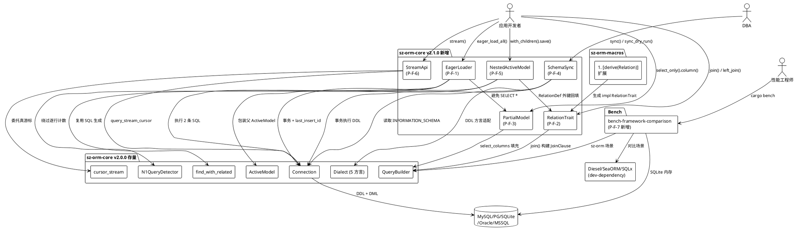
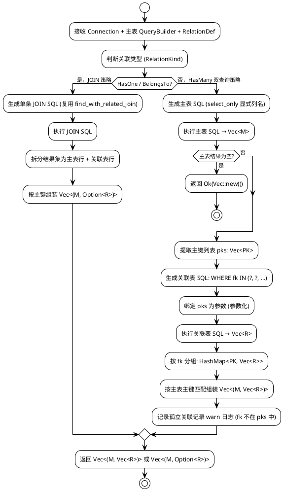
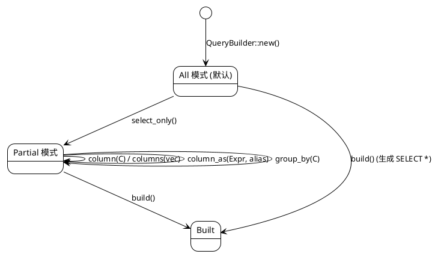
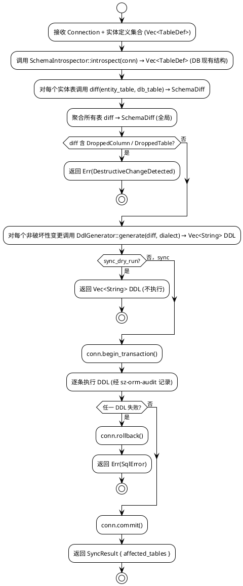
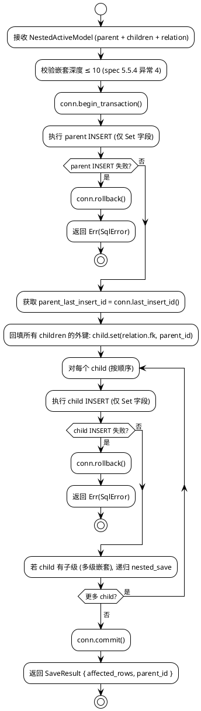
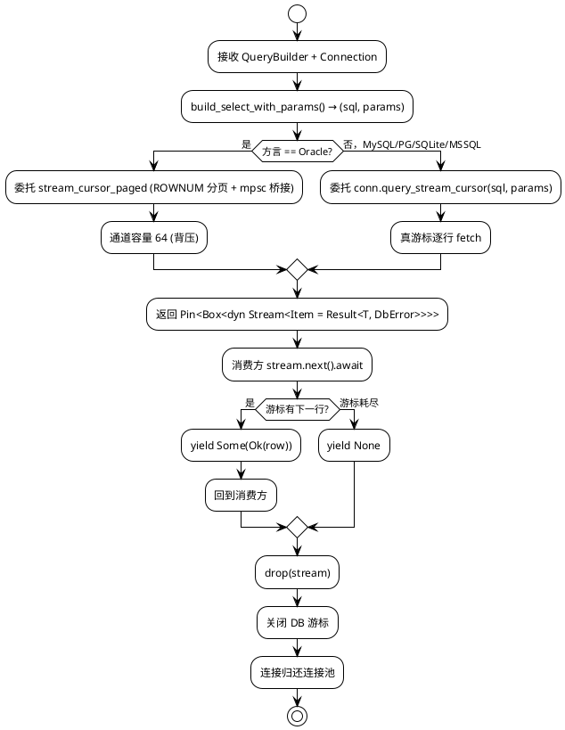
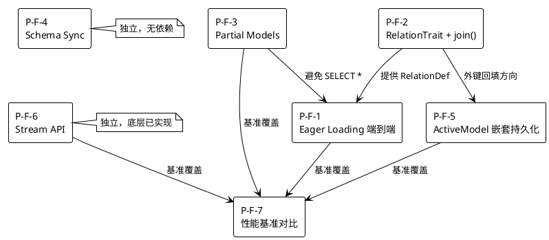

# sz-orm v2.1.0 技术设计文档

> **版本**：v2.1.0
> **基线**：v2.0.0（42 包 @ 2.0.0 已发布 crates.io，4,947 测试通过）
> **生成日期**：2026-08-06
> **文档目的**：将 v2.1.0 七项功能需求（spec.md）转化为可落地的架构设计与接口契约
> **依据**：
> - `docs/spec/v2.1.0/spec.md`（需求规格，10 章 EARS 验收标准）
> - `docs/assessment/2026-08-06-v2-progress-and-roadmap.md`（v2.0.0 进展 + 路线图）
> - `docs/assessment/2026-08-04-deep-comparison.md`（竞品深度对比，劣势 L-1/L-2/L-3/L-4/L-7）
> - 源码验证：`find_with_related.rs` / `model.rs` / `active_model.rs` / `derive.rs` / `query.rs` / `migration.rs` / `paginator.rs` / `cursor_stream.rs`

---

# 一、需求与存量功能关系分析

## 1.1 需求功能与存量功能对比

### 1.1.1 已实现功能

下表列出 v2.1.0 需求中与存量代码高度匹配（匹配度 ≥ 75%）的功能。这些功能可作为增量改造的基础，无需从零实现。

| 需求功能 | 存量功能 | 代码位置 | 匹配度 |
|---------|---------|---------|--------|
| P-F-1 Eager Loading SQL 生成 | `find_with_related_eager_sql` 生成主表 + 关联表两条 SQL 模板 | `packages/sz-orm-core/src/find_with_related.rs:263` | 75% |
| P-F-1 关联元数据提取 | `inspect_relation` 从 `HashMap<&str, Relation>` 提取 `(table, fk, pk, is_many)` | `packages/sz-orm-core/src/find_with_related.rs:185` | 100% |
| P-F-1 JOIN SQL 生成 | `WithRelation::load_join` 生成多表 JOIN SQL（含 HasMany/HasOne/BelongsTo） | `packages/sz-orm-core/src/find_with_related.rs:530` | 75% |
| P-F-1 关联类型枚举 | `Relation` 枚举（BelongsTo/HasMany/HasOne/BelongsToMany/MorphMany/MorphTo） | `packages/sz-orm-core/src/model.rs:143` | 100% |
| P-F-2 关联属性解析 | `parse_relation_attr` 解析 `#[relation(has_many=..., fk=..., pk=...)]` | `packages/sz-orm-macros/src/derive.rs:1134` | 75% |
| P-F-2 关联元数据生成 | `derive_relation_impl` 生成 `impl ModelExt` 的 `relations()` 映射 | `packages/sz-orm-macros/src/derive.rs:1293` | 50% |
| P-F-2 QueryBuilder JOIN 字段 | `QueryBuilder.joins: Vec<JoinClause>` + `JoinClause` 枚举（Inner/Left/Right/Cross） | `packages/sz-orm-core/src/query.rs:45`、`query.rs:169` | 75% |
| P-F-3 select_columns 字段 | `QueryBuilder.select_columns: Vec<String>`（默认 `vec!["*"]`） | `packages/sz-orm-core/src/query.rs:37` | 75% |
| P-F-3 group_by 字段 | `QueryBuilder.group_by: Vec<String>` | `packages/sz-orm-core/src/query.rs:41` | 100% |
| P-F-4 迁移数据结构 | `Migration` 结构（version/name/sql_up/sql_down/batch/executed_at） | `packages/sz-orm-core/src/migration.rs:9` | 50% |
| P-F-4 迁移解析器 | `FileMigrationResolver` + `MigrationResolver` trait（Phinx 风格文件迁移） | `packages/sz-orm-core/src/migration.rs:51`、`migration.rs:65` | 50% |
| P-F-5 ActiveModel 包装器 | `ActiveModel<M>` 通用包装器 + `changes: HashMap<String, ActiveValue<Value>>` | `packages/sz-orm-core/src/active_model.rs:180` | 75% |
| P-F-5 ActiveValue 三态 | `ActiveValue<T>` 枚举（Set/Unchanged/NotSet） | `packages/sz-orm-core/src/active_model.rs:73` | 100% |
| P-F-5 ActiveModelTrait | `ActiveModelTrait`（table_name/pk_value/for_each_changed） | `packages/sz-orm-core/src/active_model.rs:142` | 75% |
| P-F-5 单实体 save/update | `save` / `update` 自由函数（执行 INSERT/UPDATE） | `packages/sz-orm-core/src/active_model.rs:293` | 75% |
| P-F-6 StreamQueryTrait | `StreamQueryTrait<M>` + `stream()` 实现（基于 QueryBuilder） | `packages/sz-orm-core/src/paginator.rs:273`、`paginator.rs:281` | 50% |
| P-F-6 底层 query_stream | `Connection::query_stream` 返回 `Pin<Box<dyn Stream>>` | `packages/sz-orm-core/src/pool.rs:150` | 75% |
| P-F-6 真游标分页 | `stream_cursor_paged` 基于 unfold 的分批游标流 | `packages/sz-orm-core/src/cursor_stream.rs:79` | 75% |
| P-F-7 内部基准 | `bench-comparison/` 目录已有 7 组 criterion 基准 | `bench-comparison/` | 50% |

### 1.1.2 需要扩展的功能

下表列出需求与存量代码部分匹配，需在现有基础上改造的功能。

| 需求功能 | 存量功能 | 差异说明 | 扩展方向 |
|---------|---------|---------|---------|
| P-F-1 Eager Loading 端到端执行 | `find_with_related_eager_sql` 仅生成 SQL 模板，不执行、不组装 | 存量：返回 `(main_sql, related_sql_template)` 字符串，调用方需手动执行两条 SQL、手动提取主键列表、手动绑定 `WHERE IN` 参数、手动按外键分组组装。需求：一行 API 完成执行 + 组装，返回 `Vec<(Main, Vec<Related>)>` | 新增 `EagerLoader` 执行器：接收 `Connection`，自动执行主表查询 → 提取主键 → 执行 `WHERE fk IN (?)` 批量查询 → 按外键分组组装。复用 `find_with_related_eager_sql` 生成 SQL，新增执行 + 组装层 |
| P-F-1 N+1 消除 | `N1QueryDetector` 已存在（v2.0.0） | 存量：检测逐行查询并告警。需求：Eager Loading 使用 `WHERE IN` 批量查询后，`N1QueryDetector` 应无告警 | EagerLoader 内部使用批量查询路径，绕过 N1 检测器的逐行计数；集成测试断言无告警 |
| P-F-1 多级关联 | `WithRelation` 支持同级多关联（`with_has_many` + `with_has_one`） | 存量：仅支持单级关联（User → Orders），不支持链式多级（User → Order → OrderItem）。需求：支持 `eager_load_all::<User, Order>().with(OrderItem)` 返回 `Vec<(User, Vec<(Order, Vec<OrderItem>)>)>` | EagerLoader 新增 `with(child_relation)` 链式方法，递归执行子级查询；v2.1.0 限制最大 2 级嵌套（R-3 风险缓解） |
| P-F-2 RelationTrait 生成 | `derive_relation_impl` 仅生成 `impl ModelExt` 的 `relations()` 元数据映射 | 存量：生成 `HashMap<&str, Relation>` 常量，无 `RelationTrait` 实现、无 `RelationDef` 类型、无 `join()` 入口。需求：自动生成 `RelationTrait` 实现，提供 `def() -> RelationDef` 方法 | derive 宏扩展：在 `derive_relation_impl` 中追加生成 `impl RelationTrait for User` 代码块，新增 `RelationDef` 结构体类型 |
| P-F-2 join() 类型安全 | `QueryBuilder.joins` 字段存在，但无公开 `join()` 方法接受 `RelationTrait` | 存量：`JoinClause` 枚举为内部私有，`QueryBuilder` 无 `join()` / `left_join()` 公开方法。需求：`join(impl RelationTrait)` 返回 `Self`，类型安全禁止字符串 | QueryBuilder 新增 `join(relation: &dyn RelationTrait)` / `left_join(relation: &dyn RelationTrait)` 公开方法，从 `RelationDef` 构建 `JoinClause` |
| P-F-2 JOIN 类型映射 | `WithRelation::load_join` 已实现 HasMany/HasOne→LEFT、BelongsTo→INNER | 存量：JOIN 类型选择逻辑在 `find_with_related.rs:541` 的 match 分支。需求：`join()` 默认 INNER，`left_join()` 显式 LEFT；关联类型映射规则：HasOne/BelongsTo→INNER，HasMany→LEFT | 提取 JOIN 类型选择为 `RelationDef::default_join_type()` 方法，`join()` 使用默认，`left_join()` 强制 LEFT |
| P-F-3 select_only 模式 | `select_columns` 字段存在，默认 `vec!["*"]` | 存量：无"部分选择模式"标志，无 `.column(impl ColumnTrait)` 类型安全 API，无 `.column_as(Expr, alias)` 聚合。需求：进入部分选择模式后显式列名，类型安全 | QueryBuilder 新增 `select_mode: enum { All, Partial }` 字段 + `select_only()` / `column(C)` / `columns(vec)` / `column_as(expr, alias)` 方法；build 时校验 Partial 模式下至少 1 列 |
| P-F-3 聚合表达式 | 无聚合表达式类型 | 存量：`select_columns` 仅存字符串。需求：`Expr::count(C)` / `Expr::sum(C)` 等聚合表达式 + 别名 | 新增 `Expr` 表达式类型 + `column_as(Expr, alias)` 方法，build 时渲染为 `COUNT(col) AS alias` |
| P-F-4 diff 算法 | 无 | 存量：`migration.rs` 仅有手动迁移文件解析，无实体定义与 DB 结构的 diff。需求：比较实体字段与 `INFORMATION_SCHEMA` 列，输出 `SchemaDiff` | 新增 `schema_sync` 模块：`SchemaSync` 类型 + `diff(entity_fields, db_columns) -> SchemaDiff` 函数 |
| P-F-4 INFORMATION_SCHEMA 读取 | 无 | 存量：无 `INFORMATION_SCHEMA` 查询。需求：各方言读取现有表结构（MySQL/PG 用 INFORMATION_SCHEMA，SQLite 用 PRAGMA，Oracle 用 ALL_TAB_COLUMNS，MSSQL 用 sys.columns） | 新增 `SchemaIntrospector` trait + 5 方言实现，统一返回 `Vec<TableDef>` |
| P-F-4 DDL 生成 | 无 | 存量：无 DDL 生成器。需求：根据 `SchemaDiff` 生成各方言 DDL（CREATE TABLE / ADD COLUMN / ALTER COLUMN TYPE / RENAME COLUMN） | 新增 `DdlGenerator` trait + 5 方言实现，输入 `SchemaDiff` 输出 `Vec<String>` DDL |
| P-F-5 嵌套子实体 | `ActiveModel<M>` 仅包装单实体，无子实体集合字段 | 存量：`changes: HashMap<String, ActiveValue<Value>>` 仅追踪字段变更，无 `children` 字段。需求：`with_children(vec![child1, child2])` 嵌套子实体集合 | 新增 `NestedActiveModel` 包装器（不修改 `ActiveModel` 以保持向后兼容），内含 `parent: ActiveModel<M>` + `children: Vec<Box<dyn NestedActiveModelTrait>>` + `relation: RelationDef` |
| P-F-5 事务原子性 | `save` / `update` 不在事务内执行 | 存量：`save` 直接执行单条 INSERT。需求：嵌套 save 在单个事务内执行，任一失败回滚 | 嵌套 save 内部调用 `conn.begin_transaction()` / `commit()` / `rollback()`，复用 v2.0.0 事务 API |
| P-F-5 外键回填 | 无 | 存量：无主键回填机制。需求：父实体 INSERT 后获取 `last_insert_id`，回填到子实体外键字段 | 嵌套 save 在父 INSERT 后调用 `conn.last_insert_id()`，遍历子实体 `set(fk, parent_id)` |
| P-F-6 真游标 Stream | `StreamQueryTrait::stream` 默认实现是全量收集后逐行 yield（`paginator.rs:290`） | 存量：`stream::once(query).flat_map(iter)` 一次性执行查询收集为 `Vec`，非真游标。需求：逐行从 DB 游标拉取，峰值内存 ≤ 50 MB | `StreamQueryTrait::stream` 改为调用 `conn.query_stream_cursor`（真游标），各方言适配器覆盖；保留旧实现为 `stream_buffered` 别名（向后兼容） |
| P-F-6 背压 | `stream_cursor_paged` 已有 unfold 分批拉取 | 存量：`cursor_stream.rs:79` 基于 `unfold` 分批，已有背压（批次大小固定）。需求：高层 Stream API 复用此机制 | 高层 `stream()` 内部委托 `stream_cursor_paged`，批次大小按方言配置（Oracle mpsc 桥接 64，其他真游标 0） |
| P-F-7 跨框架对比 | `bench-comparison/` 仅有 sz-orm 内部基准 | 存量：7 组 criterion 基准仅测 sz-orm 自身。需求：引入 Diesel/SeaORM/SQLx 作为 dev-dependency，相同场景对比 | 新增独立 bench crate `bench-framework-comparison`，dev-dependency 引入三方框架，5 场景 × 4 框架 |

### 1.1.3 需要新增的功能或接口

下表列出需求在存量代码中完全没有对应实现的部分，需新建模块/类型/trait。

#### 模块：`eager_loader`（P-F-1 新增）

| 功能点 | 输入 | 输出 | 核心逻辑 | 依赖 |
|--------|------|------|---------|------|
| `EagerLoader` 执行器 | `Connection` + 主表 QueryBuilder + RelationDef | `Vec<(M, Vec<R>)>` | 执行主表查询 → 提取主键 → 执行 `WHERE fk IN (?)` → 按外键分组组装 | `find_with_related_eager_sql`、`Connection`、`N1QueryDetector` |
| `eager_load_all` 自由函数 | `Connection` + 主表 + 关联类型参数 | `Vec<(M, Vec<R>)>` | 构造 `EagerLoader` 并执行 | `EagerLoader` |
| 多级 `with()` 链式 | 子级 RelationDef | `EagerLoader`（含子级配置） | 递归配置子级加载 | `EagerLoader` |

#### 模块：`relation_trait`（P-F-2 新增）

| 功能点 | 输入 | 输出 | 核心逻辑 | 依赖 |
|--------|------|------|---------|------|
| `RelationTrait` trait | `&self` | `RelationDef` | 描述实体的关联关系，提供 `def()` 方法 | `RelationDef` |
| `RelationDef` 结构体 | 关联名/源表/目标表/源键/目标键/关联类型 | `RelationDef` | 关联关系的值对象，携带 JOIN 所需全部元数据 | `RelationKind` 枚举 |
| `RelationKind` 枚举 | HasOne/HasMany/BelongsTo/ManyToMany | `RelationKind` | 决定 JOIN 策略（INNER vs LEFT） | 无 |
| `Entity::relation(name)` 方法 | 关联名 | `&dyn RelationTrait` | 按名称查找关联定义 | `RelationTrait` |

#### 模块：`partial_model`（P-F-3 新增）

| 功能点 | 输入 | 输出 | 核心逻辑 | 依赖 |
|--------|------|------|---------|------|
| `ColumnTrait` trait | 列枚举变体 | 列名 + 类型信息 | 类型安全的列引用，禁止字符串 | 无 |
| `Expr` 表达式类型 | 聚合函数 + 列 + 别名 | SQL 表达式字符串 | 渲染 `COUNT(col)` / `SUM(col)` / `AVG(col)` / `MAX(col)` / `MIN(col)` | `ColumnTrait` |
| `SelectMode` 枚举 | All / Partial | 模式标志 | 控制 build 时是否校验列数 | 无 |

#### 模块：`schema_sync`（P-F-4 新增）

| 功能点 | 输入 | 输出 | 核心逻辑 | 依赖 |
|--------|------|------|---------|------|
| `SchemaSync` 类型 | 实体定义集合 + 方言 | `SchemaSync` | 协调 diff + DDL 生成 + 执行 | `SchemaIntrospector`、`DdlGenerator` |
| `SchemaIntrospector` trait | `Connection` + 方言 | `Vec<TableDef>` | 读取 DB 现有表结构（各方言特定查询） | `Connection`、`TableDef`、`ColumnDef` |
| `DdlGenerator` trait | `SchemaDiff` + 方言 | `Vec<String>` DDL | 根据 diff 生成各方言 DDL 语句 | `SchemaDiff` |
| `diff` 函数 | 实体字段集合 + DB 列集合 | `SchemaDiff` | 比较两组字段，输出新增/删除/类型变更/重命名 | `SchemaDiff` |
| `sync_dry_run` 方法 | `Connection` | `Vec<String>` DDL | 执行 diff + DDL 生成，不执行 DDL | `SchemaIntrospector`、`DdlGenerator` |
| `sync` 方法 | `Connection` | `SyncResult` | 事务内执行所有 DDL | `sync_dry_run`、`Connection` 事务 API |
| `SchemaDiff` 结构体 | 各类变更列表 | `SchemaDiff` | diff 结果值对象 | `TableDef`、`ColumnDef` |

#### 模块：`nested_active_model`（P-F-5 新增）

| 功能点 | 输入 | 输出 | 核心逻辑 | 依赖 |
|--------|------|------|---------|------|
| `NestedActiveModel` 包装器 | 父 ActiveModel + 子实体集合 + RelationDef | `NestedActiveModel` | 嵌套持久化值对象 | `ActiveModel`、`RelationDef` |
| `NestedActiveModelTrait` trait | `&self` | 表名/主键/变更字段/子实体 | 嵌套持久化行为抽象 | `ActiveModelTrait` |
| `with_children` 方法 | 子实体集合 + RelationDef | `NestedActiveModel` | 配置嵌套子实体 | `NestedActiveModel` |
| 嵌套 `save` 函数 | `Connection` + `NestedActiveModel` | `SaveResult` | 事务内按拓扑顺序持久化父 + 子，外键回填 | `Connection` 事务 API、`ActiveModelTrait` |

#### 模块：`stream_api`（P-F-6 扩展）

| 功能点 | 输入 | 输出 | 核心逻辑 | 依赖 |
|--------|------|------|---------|------|
| `stream` 方法（真游标版） | `Connection` | `impl Stream<Item = Result<T>>` | 委托 `conn.query_stream_cursor`，逐行 yield | `Connection::query_stream_cursor`、`cursor_stream` |
| `stream_buffered` 方法（兼容版） | `Connection` | `impl Stream<Item = Result<T>>` | 全量收集后逐行 yield（保留旧实现） | `Connection::query_with_params` |

#### 模块：`bench-framework-comparison`（P-F-7 新增）

| 功能点 | 输入 | 输出 | 核心逻辑 | 依赖 |
|--------|------|------|---------|------|
| `crud_comparison` bench | criterion Benchmark | 对比报告 | 5 场景 × 4 框架执行，输出吞吐量/延迟/内存 | criterion、sz-orm、Diesel、SeaORM、SQLx（dev-dependency） |
| 报告生成器 | criterion 结果 | Markdown 报告 | 渲染对比表格 + 结论 | 无 |

## 1.2 存量功能详细分析

### 1.2.1 `find_with_related.rs` 关联查询模块（P-F-1 改造基础）

**接口契约**：
- `find_with_related_eager_sql(dialect, main_table, related_table, foreign_key, main_where) -> Result<(String, String), DbError>`：返回 `(main_sql, related_sql_template)`，关联表 SQL 含 `IN (?)` 占位符
- `FindWithRelated::new(...).build() -> String`：生成 JOIN 模式单条 SQL
- `WithRelation::new(dialect, main_table).with_has_many(...).load_eager(main_where) -> Result<Self, DbError>`：配置多关联后生成 SQL

**业务规则**：
- 标识符校验：所有表名/列名经 `validate_find_identifiers` 校验（`find_with_related.rs:685`），拒绝 SQL 注入
- 重复关联检测：`check_duplicate_relations`（`find_with_related.rs:506`）防止同关联名多次添加
- JOIN 类型：HasMany/HasOne → LEFT JOIN，BelongsTo → INNER JOIN（`find_with_related.rs:541`）
- `main_where` 安全性由调用方负责（SAFETY 注释要求参数化构造）

**扩展点**：
- `WithRelation` 的 `relations: Vec<(&str, WithRelationItem)>` 已支持多关联配置，可扩展为多级
- `related_sql_with_ids`（`find_with_related.rs:621`）已实现主键列表绑定 + `validate_id_value` 校验，可被 EagerLoader 复用

**约束**：
- 当前生成的 SQL 含 `SELECT *`（`find_with_related.rs:276`、`find_with_related.rs:533`），违反 v2.1.0 禁止 SELECT * 约束（C-5），需改用 Partial Models 显式列名
- `main_where` 为 `Option<&str>` 字符串，安全性依赖调用方，EagerLoader 必须改用 `WhereCondition` 参数化构造

### 1.2.2 `model.rs` Model trait 与 Relation 枚举（P-F-2/P-F-3 改造基础）

**接口契约**：
- `Model` trait（`model.rs:37`）：`table_name() / pk_name() / pk() / set_pk() / foreign_key(relation) / fields()`
- `Relation` 枚举（`model.rs:143`）：6 个变体（BelongsTo/HasMany/HasOne/BelongsToMany/MorphMany/MorphTo），各变体携带外键/表名/主键元数据
- `ActiveRecord` trait（`model.rs:256`）：`with(relation) / with_all(relations)` 返回 `WithRelation<M>` 预加载构造器

**业务规则**：
- `foreign_key(relation)` 默认实现：`format!("{}_id", relation.to_lowercase())`（`model.rs:67`）
- `fields()` 默认返回空 Vec，需 schema 推导的模型重写（`model.rs:103`）

**扩展点**：
- `Relation` 枚举已覆盖所有关联类型，`RelationDef` 可作为其轻量值对象封装
- `fields()` 返回 `Vec<(&'static str, &'static str)>`（字段名, 类型字符串），可作为 Schema Sync 的实体定义来源

**约束**：
- `Model` trait 无 `relations()` 方法（关联定义在 `ModelExt` trait 中，由 `#[derive(Relation)]` 生成）
- `ActiveRecord` 的 `WithRelation<M>` 与 `find_with_related::WithRelation<'a>` 是两个不同类型（前者模型级，后者方言级），需统一

### 1.2.3 `active_model.rs` ActiveModel（P-F-5 改造基础）

**接口契约**：
- `ActiveValue<T>` 枚举（`active_model.rs:73`）：Set(T) / Unchanged / NotSet，实现 `From<T: Into<Value>>` 自动转换
- `ActiveModelTrait` trait（`active_model.rs:142`）：`table_name() / pk_value() / for_each_changed(F)`
- `ActiveModel<M>` 包装器（`active_model.rs:180`）：`from_model(model) / set(field, value) / unset(field) / get(field) / changed_fields() / into_model()`
- `update(conn, active) -> Result<u64, DbError>`（`active_model.rs:293`）：执行 UPDATE，仅 Set 字段
- `save(conn, active) -> Result<u64, DbError>`：执行 INSERT（新建）或 UPDATE（已存在）

**业务规则**：
- 脏字段追踪：`changes: HashMap<String, ActiveValue<Value>>` 仅记录 `set()` 修改过的字段（`active_model.rs:183`）
- `changed_fields()` 过滤出 `Set` 状态字段（`active_model.rs:221`）
- `pk_value()` 从 `model.pk_as_value()` 获取，null 返回 None（`active_model.rs:255`）

**扩展点**：
- `ActiveModel<M>` 的 `model: M` 字段持有底层模型，嵌套持久化可在 save 后通过 `set_pk` 回填主键
- `for_each_changed` 回调模式可被嵌套 save 复用，遍历父实体变更字段

**约束**：
- `save` / `update` 不在事务内执行，嵌套 save 必须自行管理事务边界
- `ActiveModel<M>` 无子实体字段，嵌套持久化需新建 `NestedActiveModel` 包装器（不修改 `ActiveModel` 以保持向后兼容，C-9）
- `pk_as_value()` 默认返回 `Value::Null`，需模型重写；嵌套 save 依赖此方法获取父主键用于回填

### 1.2.4 `derive.rs` `#[derive(Relation)]`（P-F-2 改造基础）

**接口契约**：
- `derive_relation_impl(input: DeriveInput) -> TokenStream2`（`derive.rs:1293`）：解析 `#[relation(...)]` 属性，生成 `impl ModelExt for Struct` 的 `relations()` 映射
- `parse_relation_attr(attrs) -> Vec<RelationAttr>`（`derive.rs:1134`）：解析 `has_many/belongs_to/has_one/belongs_to_many/morph_many/morph_to` + `fk/pk/junction/other_key/target/morph_type/morph_id/morph_type_value`
- `infer_fk_from_name(name) -> String`（`derive.rs:1255`）：从关联名推断默认外键（`orders` → `order_id`）

**业务规则**：
- 关联类型映射：`has_many` → `Relation::HasMany`，`belongs_to` → `Relation::BelongsTo`，etc.
- 外键默认值：未指定 `fk` 时调用 `infer_fk_from_name`（去尾部 s + `_id`）
- 主键默认值：未指定 `pk` 时默认 `"id"`

**扩展点**：
- `derive_relation_impl` 生成的 TokenStream 可追加 `impl RelationTrait for Struct` 代码块
- `RelationAttr` 已携带全部关联元数据（kind/model/fk/pk/...），可直接构造 `RelationDef` 字面量

**约束**：
- 宏展开时无类型信息（仅有 AST），`RelationTrait::def()` 返回的 `RelationDef` 必须用 `&'static str` 字面量构造
- `parse_relation_attr` 手动解析 TokenTree（`derive.rs:1148`），需处理 `key = "string"` 和 `key = identifier` 两种形式

### 1.2.5 `query.rs` QueryBuilder（P-F-2/P-F-3/P-F-6 改造基础）

**接口契约**：
- `QueryBuilder<M>` 结构（`query.rs:36`）：table / select_columns / where_conditions / order_by / group_by / having_conditions / limit / offset / joins / dialect / soft_delete_disabled / tenant_id_value / keyset_cursor / cache_ttl / lock_type / insert_or_ignore
- `WhereCondition` 枚举（`query.rs:109`）：And/Or（原始字符串，不推荐）+ Eq/Ne/Gt/Ge/Lt/Le/Like（参数化）+ OrEq/OrNe/...（OR 参数化）+ In/NotIn/Between/Null/NotNull/Exists
- `JoinClause` 枚举（`query.rs:169`）：Inner(table, on, alias) / Left / Right / Cross（私有）
- 参数化 WHERE API：`where_eq(field, value)` / `where_ne` / `where_gt` / `where_ge` / `where_lt` / `where_le` / `where_like` / `or_where_eq` 等

**业务规则**：
- 软删除集成：`soft_delete_disabled` 控制 `WHERE {field} IS NULL` 自动追加（`query.rs:47`）
- 多租户集成：`tenant_id_value` 自动追加 `WHERE {tenant_field} = ?`（`query.rs:49`）
- Keyset 分页：`keyset_cursor` 追加 `WHERE {field} > ?` 游标条件（`query.rs:54`）
- 查询缓存：`cache_ttl` 缓存查询结果（`query.rs:62`）
- 行锁：`lock_type` 追加 `FOR UPDATE` / `FOR SHARE`（`query.rs:67`）

**扩展点**：
- `select_columns` 字段已存在，`select_only()` 模式只需新增 `select_mode` 标志 + build 时分支
- `joins` 字段已存在，`join()` / `left_join()` 方法只需公开 + 从 `RelationDef` 构建 `JoinClause`
- `group_by` 字段已存在，`.group_by(C)` 方法只需新增（若不存在）

**约束**：
- `JoinClause` 为私有枚举，`join()` 方法需在 `QueryBuilder` impl 块内构造，不暴露内部类型
- `select_columns` 默认 `vec!["*"]`，`select_only()` 后必须清空并显式添加列
- `WhereCondition::And(String)` / `Or(String)` 保留但标记不推荐（SQL 注入风险），新增 API 必须使用参数化变体

### 1.2.6 `migration.rs` 迁移系统（P-F-4 改造基础）

**接口契约**：
- `Migration` 结构（`migration.rs:9`）：version / name / sql_up / sql_down / batch / executed_at
- `MigrationResolver` trait（`migration.rs:51`）：`resolve(db_type) -> Result<Vec<Migration>, DbError>`
- `FileMigrationResolver`（`migration.rs:55`）：从文件系统读取 `.sql` 迁移文件

**业务规则**：
- 文件名解析：`<version>_<name>_up.sql` / `<version>_<name>_down.sql` / 简单 `<name>.sql`（`migration.rs:120`）
- 按 version 排序执行（`migration.rs:148`）
- 不区分数据库类型（`db_type` 参数未使用，`migration.rs:81`）

**扩展点**：
- `Migration` 结构可被 Schema Sync 复用作为 DDL 变更单元
- `MigrationResolver` trait 可新增 `SchemaSyncResolver` 实现，从实体定义生成 Migration

**约束**：
- 当前迁移系统无 diff 能力，仅执行预写 SQL 文件
- 无 `INFORMATION_SCHEMA` 读取，无 DDL 生成，无事务执行
- `db_type` 参数未使用，Schema Sync 必须区分方言

### 1.2.7 `paginator.rs` / `cursor_stream.rs` Stream（P-F-6 改造基础）

**接口契约**：
- `StreamQueryTrait<M>` trait（`paginator.rs:273`）：`stream(conn) -> Pin<Box<dyn Stream<Item = Result<RowResult, DbError>> + Send>>`
- `Connection::query_stream(sql) -> Pin<Box<dyn Stream>>`（`pool.rs:150`）：底层流式查询，默认实现全量收集后逐行 yield
- `Connection::query_stream_cursor(sql) -> Pin<Box<dyn Stream>>`（`pool.rs:180`）：游标流式查询，默认退化为 `query_stream`
- `stream_cursor_paged(conn, sql, db_type, batch) -> Pin<Box<dyn Stream>>`（`cursor_stream.rs:79`）：基于 `unfold` 的分批游标流，Oracle 用 `ROWNUM` 子查询包装

**业务规则**：
- `StreamQueryTrait::stream` 当前实现（`paginator.rs:281`）：`stream::once(query).flat_map(iter)`，一次性执行查询收集为 `Vec`，非真游标
- `stream_cursor_paged`（`cursor_stream.rs:79`）：`unfold` 状态机，每批拉取 `batch` 行，逐行 yield，已实现背压
- Oracle 游标桥接：通过 mpsc 通道将同步 Oracle API 桥接为异步流（容量 64）

**扩展点**：
- `StreamQueryTrait::stream` 可改为委托 `conn.query_stream_cursor`，复用真游标
- `stream_cursor_paged` 的 unfold 模式可被高层 Stream API 直接使用

**约束**：
- 当前 `stream()` 实现违反"真游标"要求（spec 5.6.2 规则 7），峰值内存等于全量收集
- 改造需保持 `StreamQueryTrait` trait 签名不变（向后兼容，C-9），仅改 impl
- Oracle mpsc 桥接的背压依赖通道容量（64），不可无限缓存

---

# 二、增量设计方案

## 2.1 实现模型

### 2.1.1 上下文视图

下图展示 v2.1.0 新增模块与外部系统及存量模块的交互关系。



### 2.1.2 服务/组件总体架构

下图展示 v2.1.0 新增模块的内部组成与依赖关系。

```plantuml
@startuml
!theme plain
skinparam componentStyle rectangle

package "P-F-1 EagerLoader" {
  component "EagerLoader<M, R>" as EL_Struct
  component "EagerLoadResult<M, R>" as EL_Result
  component "eager_load_all()" as EL_Fn
  component "GroupingStrategy" as EL_Group
}

package "P-F-2 RelationTrait" {
  component "RelationTrait" as RT_Trait
  component "RelationDef" as RD_Struct
  component "RelationKind" as RK_Enum
  component "Entity::relation()" as RT_Lookup
}

package "P-F-3 PartialModel" {
  component "ColumnTrait" as CT_Trait
  component "Expr" as Expr_Struct
  component "SelectMode" as SM_Enum
}

package "P-F-4 SchemaSync" {
  component "SchemaSync" as SS_Struct
  component "SchemaIntrospector" as SI_Trait
  component "DdlGenerator" as DG_Trait
  component "SchemaDiff" as SD_Struct
  component "diff()" as SS_Diff
  component "MySqlIntrospector" as SI_My
  component "PgIntrospector" as SI_Pg
  component "SqliteIntrospector" as SI_Sl
  component "OracleIntrospector" as SI_Or
  component "MssqlIntrospector" as SI_Ms
}

package "P-F-5 NestedActiveModel" {
  component "NestedActiveModel<M>" as NA_Struct
  component "NestedActiveModelTrait" as NA_Trait
  component "with_children()" as NA_With
  component "nested_save()" as NA_Save
  component "SaveResult" as NA_Result
}

package "P-F-6 StreamApi" {
  component "stream() 真游标" as ST_Real
  component "stream_buffered() 兼容" as ST_Buf
}

package "P-F-7 Bench" {
  component "crud_comparison bench" as BC_Bench
  component "报告生成器" as BC_Report
}

EL_Fn --> EL_Struct
EL_Struct --> EL_Result
EL_Struct --> EL_Group
EL_Struct --> RD_Struct : 依赖 RelationDef

RT_Lookup --> RT_Trait
RT_Trait --> RD_Struct
RD_Struct --> RK_Enum

SS_Struct --> SI_Trait
SS_Struct --> DG_Trait
SS_Struct --> SD_Struct
SS_Diff --> SD_Struct
SI_Trait <|.. SI_My
SI_Trait <|.. SI_Pg
SI_Trait <|.. SI_Sl
SI_Trait <|.. SI_Or
SI_Trait <|.. SI_Ms

NA_With --> NA_Struct
NA_Save --> NA_Struct
NA_Save --> NA_Result
NA_Struct --> NA_Trait
NA_Struct --> RD_Struct : 依赖 RelationDef

BC_Bench --> BC_Report
```



### 2.1.3 实现设计文档

#### P-F-1 Eager Loading 端到端执行流程

下图展示 `eager_load_all::<User, Order>(conn).await` 的执行流程（HasMany 双查询策略）。



**多级关联递归流程**（User → Order → OrderItem，v2.1.0 限 2 级）：

1. 执行 User 主表查询 → `Vec<User>`
2. 提取 User 主键，执行 Order `WHERE user_id IN (...)` → `Vec<Order>`
3. 提取 Order 主键，执行 OrderItem `WHERE order_id IN (...)` → `Vec<OrderItem>`
4. 按 order_id 分组 OrderItem → `HashMap<OrderPK, Vec<OrderItem>>`
5. 组装 `(Order, Vec<OrderItem>)` → `Vec<(Order, Vec<OrderItem>)>`
6. 按 user_id 分组上步结果 → `HashMap<UserPK, Vec<(Order, Vec<OrderItem>)>>`
7. 组装 `(User, Vec<(Order, Vec<OrderItem>)>)` → 最终结果

**N+1 消除策略**：EagerLoader 内部直接调用 `Connection::query_with_params`（批量查询），不经过 `N1QueryDetector` 的逐行计数路径。集成测试断言 `N1QueryDetector` 无告警。

#### P-F-2 `#[derive(Relation)]` 生成 RelationTrait 流程

下图展示宏展开时生成 `RelationTrait` 实现的过程。

```plantuml
@startuml
!theme plain
start

:接收 DeriveInput (struct User { #[relation(has_many="Order", fk="user_id", pk="id")] ... });
:调用 parse_relation_attr(attrs) → Vec<RelationAttr>;
:对每个 RelationAttr 构造 RelationDef 字面量;

:生成 TokenStream:
  - impl ModelExt for User { relations() }  // 存量保留
  - impl RelationTrait for User {           // 新增
      fn def(&self, name) -> &RelationDef
      fn relations() -> Vec<&'static RelationDef>
    }
  - const RELATIONS: &[RelationDef] = &[    // 新增关联常量表
      RelationDef { name: "orders", from: "users", to: "orders",
                     from_key: "id", to_key: "user_id",
                     kind: RelationKind::HasMany },
      ...
    ];

:输出 TokenStream;
stop
```

**`join()` 链式调用流程**：

1. `User::find()` 返回 `QueryBuilder<User>`
2. `.join(Order::relation())` 调用 `QueryBuilder::join(relation: &dyn RelationTrait)`
3. `join` 内部调用 `relation.def()` 获取 `RelationDef`
4. 根据 `RelationDef.kind` 决定 JOIN 类型：HasOne/BelongsTo → INNER，HasMany → LEFT
5. 构造 `JoinClause` 推入 `self.joins`
6. 返回 `Self`（链式）
7. `.build()` 时渲染 `JOIN {to_table} ON {from_table}.{from_key} = {to_table}.{to_key}`

**表别名冲突处理**：多次 `join()` 同一关联表时，自动生成别名 `orders_1`、`orders_2`（spec 5.2.4 异常 3）。`QueryBuilder` 维护 `join_counter: HashMap<String, usize>` 计数。

#### P-F-3 Partial Models 状态机

下图展示 `select_only()` 模式的状态流转。



**build 时校验**：Partial 模式下若 `select_columns` 为空，返回 `Err(DbError::InvalidInput("select_only requires at least one column"))`（spec 5.3.2 规则 6）。

#### P-F-4 Schema Sync 流程

下图展示 `schema.sync(conn).await` 的完整流程。



#### P-F-5 嵌套持久化流程

下图展示 `user.with_orders(vec![o1, o2]).save(conn).await` 的事务流程。



**多级嵌套拓扑顺序**（User → Order → OrderItem）：INSERT user → INSERT order → INSERT item1 → INSERT item2（父先子后）。删除顺序相反：DELETE items → DELETE order → DELETE user（子先父后）。

#### P-F-6 Stream API 真游标流程

下图展示 `query.stream(conn).await` 的真游标实现。



**错误传播**：游标 fetch 失败时 yield `Some(Err(DbError))`，标记 `is_exhausted = true`，后续 `next()` 返回 `None`（spec 5.6.4 异常 2）。

## 2.2 接口设计

### 2.2.1 总体设计

v2.1.0 新增接口按功能模块分为 7 组，全部以扩展方法提供，不修改 v2.0.0 既有 API 签名（C-9 向后兼容）。

| 接口组 | 所在模块 | 稳定性 | 关联 trait/类型 | 对应需求 |
|--------|---------|--------|---------------|---------|
| Eager Loading 执行器 | `sz-orm-core::eager_loader` | 稳定 | `EagerLoader`、`eager_load_all` | P-F-1 |
| RelationTrait | `sz-orm-core::relation_trait` | 稳定 | `RelationTrait`、`RelationDef`、`RelationKind` | P-F-2 |
| join() 链式 | `sz-orm-core::query`（QueryBuilder 扩展） | 稳定 | `QueryBuilder::join`、`QueryBuilder::left_join` | P-F-2 |
| Partial Models | `sz-orm-core::partial_model` + `query` 扩展 | 稳定 | `ColumnTrait`、`Expr`、`SelectMode`、`QueryBuilder::select_only` | P-F-3 |
| Schema Sync | `sz-orm-core::schema_sync` | 稳定 | `SchemaSync`、`SchemaIntrospector`、`DdlGenerator`、`SchemaDiff` | P-F-4 |
| 嵌套持久化 | `sz-orm-core::nested_active_model` | 稳定 | `NestedActiveModel`、`NestedActiveModelTrait`、`nested_save` | P-F-5 |
| Stream API | `sz-orm-core::paginator`（StreamQueryTrait impl 改造） | 稳定 | `StreamQueryTrait::stream`（签名不变，impl 改真游标） | P-F-6 |
| 基准对比 | `bench-framework-comparison`（独立 crate） | 实验 | `crud_comparison` bench | P-F-7 |

**接口变更策略**：
- v2.0.0 既有 trait（`Model`、`ActiveModelTrait`、`StreamQueryTrait`）签名不变
- 新增能力以新 trait（`RelationTrait`、`ColumnTrait`、`SchemaIntrospector`、`DdlGenerator`、`NestedActiveModelTrait`）+ 新方法（`QueryBuilder::join`、`select_only`、`stream` impl 改造）提供
- `#[derive(Relation)]` 宏扩展：生成代码追加 `impl RelationTrait`，不破坏既有 `impl ModelExt`

### 2.2.2 接口清单

#### P-F-1 Eager Loading 接口

```rust
// packages/sz-orm-core/src/eager_loader.rs

/// Eager Loading 执行器
///
/// 自动执行主表 + 关联表查询并组装嵌套结果。
pub struct EagerLoader<'a, M, R>
where
    M: Model,
    R: Model,
{
    conn: &'a mut dyn Connection,
    main_query: QueryBuilder<M>,
    relation: RelationDef,
    children: Vec<ChildLoadConfig>,  // 多级关联配置
    select_columns: Vec<String>,     // 避免 SELECT *，显式列名
}

/// 子级加载配置（多级关联）
struct ChildLoadConfig {
    relation: RelationDef,
    select_columns: Vec<String>,
}

/// Eager Loading 结果（HasMany）
pub type EagerLoadResultMany<M, R> = Vec<(M, Vec<R>)>;

/// Eager Loading 结果（HasOne）
pub type EagerLoadResultOne<M, R> = Vec<(M, Option<R>)>;

impl<'a, M, R> EagerLoader<'a, M, R>
where
    M: Model + FromQueryResult,
    R: Model + FromQueryResult,
{
    /// 创建 Eager Loading 执行器
    pub fn new(
        conn: &'a mut dyn Connection,
        main_query: QueryBuilder<M>,
        relation: RelationDef,
    ) -> Self;

    /// 链式添加子级关联（多级嵌套，v2.1.0 限 2 级）
    pub fn with(mut self, relation: RelationDef) -> Self;

    /// 执行 HasMany 关联加载，返回 Vec<(M, Vec<R>)>
    pub async fn load_many(self) -> Result<EagerLoadResultMany<M, R>, DbError>;

    /// 执行 HasOne 关联加载，返回 Vec<(M, Option<R>)>
    pub async fn load_one(self) -> Result<EagerLoadResultOne<M, R>, DbError>;
}

/// 便捷函数：一行完成 Eager Loading
///
/// # 示例
///
/// ```ignore
/// use sz_orm_core::eager_loader::eager_load_all;
///
/// let results: Vec<(User, Vec<Order>)> =
///     eager_load_all(&mut conn, User::find(), Order::relation()).await?;
/// ```
pub async fn eager_load_all<'a, M, R>(
    conn: &'a mut dyn Connection,
    main_query: QueryBuilder<M>,
    relation: &dyn RelationTrait,
) -> Result<EagerLoadResultMany<M, R>, DbError>
where
    M: Model + FromQueryResult,
    R: Model + FromQueryResult;
```

**前置条件**：`conn` 为有效连接；`main_query` 已配置 table + where 条件；`relation.def()` 返回有效 `RelationDef`。
**后置条件**：执行 2 条 SQL（HasMany）或 1 条 JOIN SQL（HasOne）；返回结果按主键排序完全一致。
**异常映射**：主表查询失败 → `DbError::SqlError`（含主表 SQL）；关联表查询失败 → `DbError::SqlError`（含关联表 SQL）；外键不匹配 → 跳过孤立记录 + warn 日志。

#### P-F-2 RelationTrait + join() 接口

```rust
// packages/sz-orm-core/src/relation_trait.rs

/// 关联关系类型
#[derive(Debug, Clone, Copy, PartialEq, Eq)]
pub enum RelationKind {
    HasOne,
    HasMany,
    BelongsTo,
    ManyToMany,
}

impl RelationKind {
    /// 默认 JOIN 类型：HasOne/BelongsTo → INNER，HasMany/ManyToMany → LEFT
    pub fn default_join_type(self) -> JoinType;
}

/// 关联关系定义（值对象）
#[derive(Debug, Clone)]
pub struct RelationDef {
    pub name: &'static str,
    pub from_entity: &'static str,
    pub to_entity: &'static str,
    pub from_key: &'static str,
    pub to_key: &'static str,
    pub kind: RelationKind,
}

/// 关联关系 trait（由 #[derive(Relation)] 自动实现）
pub trait RelationTrait: Send + Sync {
    /// 获取关联定义
    fn def(&self) -> &'static RelationDef;

    /// 获取所有关联（由 derive 生成的常量表）
    fn all_relations() -> &'static [RelationDef];
}

// packages/sz-orm-core/src/query.rs（QueryBuilder 扩展）

impl<M: Model> QueryBuilder<M> {
    /// 添加 INNER JOIN（或按关联类型默认）
    ///
    /// # 示例
    ///
    /// ```ignore
    /// let sql = User::find()
    ///     .join(Order::relation())
    ///     .build_select();
    /// // SELECT ... FROM users INNER JOIN orders ON users.id = orders.user_id
    /// ```
    pub fn join(mut self, relation: &dyn RelationTrait) -> Self;

    /// 添加 LEFT JOIN（强制）
    pub fn left_join(mut self, relation: &dyn RelationTrait) -> Self;
}
```

**前置条件**：`relation.def()` 返回有效 `RelationDef`，表名/列名经标识符校验。
**后置条件**：`self.joins` 追加一个 `JoinClause`；多次 join 同表自动生成别名。
**异常映射**：关联关系未定义 → 编译错误（宏展开期）；外键列不存在 → 运行时 `DbError::SqlError`。

#### P-F-3 Partial Models 接口

```rust
// packages/sz-orm-core/src/partial_model.rs

/// 列引用 trait（类型安全，禁止字符串）
pub trait ColumnTrait: Send + Sync {
    /// 列名
    fn name(&self) -> &'static str;
    /// 所属表名
    fn table_name(&self) -> &'static str;
}

/// 聚合表达式
#[derive(Debug, Clone)]
pub struct Expr {
    func: AggFunc,
    column: Box<dyn ColumnTrait>,
}

#[derive(Debug, Clone, Copy)]
pub enum AggFunc {
    Count,
    Sum,
    Avg,
    Max,
    Min,
}

impl Expr {
    pub fn count(column: impl ColumnTrait + 'static) -> Self;
    pub fn sum(column: impl ColumnTrait + 'static) -> Self;
    pub fn avg(column: impl ColumnTrait + 'static) -> Self;
    pub fn max(column: impl ColumnTrait + 'static) -> Self;
    pub fn min(column: impl ColumnTrait + 'static) -> Self;
}

/// 选择模式
#[derive(Debug, Clone, Copy, PartialEq, Eq)]
pub enum SelectMode {
    All,
    Partial,
}

// packages/sz-orm-core/src/query.rs（QueryBuilder 扩展）

impl<M: Model> QueryBuilder<M> {
    /// 进入部分字段选择模式
    ///
    /// # 示例
    ///
    /// ```ignore
    /// let sql = User::find()
    ///     .select_only()
    ///     .column(UserColumn::Id)
    ///     .column(UserColumn::Name)
    ///     .build_select();
    /// // SELECT id, name FROM users
    /// ```
    pub fn select_only(mut self) -> Self;

    /// 添加选中列（类型安全）
    pub fn column(mut self, column: impl ColumnTrait) -> Self;

    /// 批量添加选中列
    pub fn columns(mut self, columns: Vec<impl ColumnTrait>) -> Self;

    /// 添加聚合表达式 + 别名
    ///
    /// # 示例
    ///
    /// ```ignore
    /// let sql = User::find()
    ///     .select_only()
    ///     .column_as(Expr::count(OrderColumn::Id), "order_count")
    ///     .build_select();
    /// // SELECT COUNT(orders.id) AS order_count FROM users
    /// ```
    pub fn column_as(mut self, expr: Expr, alias: &str) -> Self;
}
```

**前置条件**：`select_only()` 后必须至少调用一次 `.column()` 或 `.column_as()`。
**后置条件**：`self.select_columns` 填充显式列名；`self.select_mode = Partial`；build 时生成 `SELECT col1, col2, ...` 而非 `SELECT *`。
**异常映射**：未选择任何字段 → `Err(DbError::InvalidInput("select_only requires at least one column"))`；列名不存在 → 运行时 `DbError::SqlError`。

#### P-F-4 Schema Sync 接口

```rust
// packages/sz-orm-core/src/schema_sync.rs

/// 表定义（实体侧或 DB 侧）
#[derive(Debug, Clone)]
pub struct TableDef {
    pub name: String,
    pub columns: Vec<ColumnDef>,
}

/// 列定义
#[derive(Debug, Clone)]
pub struct ColumnDef {
    pub name: String,
    pub sql_type: String,
    pub nullable: bool,
    pub primary_key: bool,
    pub default: Option<String>,
}

/// Schema diff 结果
#[derive(Debug, Clone, Default)]
pub struct SchemaDiff {
    pub added_tables: Vec<TableDef>,
    pub dropped_tables: Vec<String>,       // 禁止自动 DDL
    pub added_columns: Vec<(String, ColumnDef)>,
    pub dropped_columns: Vec<(String, String)>,  // 禁止自动 DDL
    pub type_changed_columns: Vec<(String, String, String, String)>,
    pub renamed_columns: Vec<(String, String, String)>,
}

/// Schema 同步结果
#[derive(Debug, Clone)]
pub struct SyncResult {
    pub affected_tables: usize,
    pub executed_ddl: Vec<String>,
}

/// Schema 内省 trait（各方言实现）
#[async_trait]
pub trait SchemaIntrospector: Send + Sync {
    async fn introspect(&self, conn: &mut dyn Connection) -> Result<Vec<TableDef>, DbError>;
}

/// DDL 生成 trait（各方言实现）
pub trait DdlGenerator: Send + Sync {
    fn generate(&self, diff: &SchemaDiff) -> Result<Vec<String>, DbError>;
}

/// Schema Sync 协调器
pub struct SchemaSync {
    introspector: Box<dyn SchemaIntrospector>,
    ddl_generator: Box<dyn DdlGenerator>,
    entity_tables: Vec<TableDef>,
}

impl SchemaSync {
    /// 创建 Schema Sync 实例（按方言选择 introspector + generator）
    pub fn new(dialect: DbType, entity_tables: Vec<TableDef>) -> Self;

    /// 干运行：生成 DDL 但不执行
    pub async fn sync_dry_run(
        &self,
        conn: &mut dyn Connection,
    ) -> Result<Vec<String>, DbError>;

    /// 执行同步：事务内执行所有 DDL
    pub async fn sync(
        &self,
        conn: &mut dyn Connection,
    ) -> Result<SyncResult, DbError>;
}

/// diff 函数（纯函数，可独立测试）
pub fn diff(entity: &[TableDef], db: &[TableDef]) -> SchemaDiff;
```

**前置条件**：`conn` 有 `INFORMATION_SCHEMA`（或 SQLite `PRAGMA`）读取权限；`entity_tables` 非空。
**后置条件**：`sync_dry_run` 不修改 DB；`sync` 在事务内执行 DDL，失败回滚。
**异常映射**：DB 连接失败 → `DbError::ConnectionError`；DDL 执行失败 → `DbError::SqlError`（含失败 DDL）；破坏性 diff → `DbError::DestructiveChangeDetected`；INFORMATION_SCHEMA 不支持 → 回退方言特定方案。

#### P-F-5 嵌套持久化接口

```rust
// packages/sz-orm-core/src/nested_active_model.rs

/// 嵌套 ActiveModel trait
pub trait NestedActiveModelTrait: ActiveModelTrait {
    /// 获取子实体集合
    fn children(&self) -> &[Box<dyn NestedActiveModelTrait>];

    /// 获取父子关联关系
    fn relation(&self) -> &RelationDef;

    /// 嵌套深度
    fn depth(&self) -> usize;
}

/// 嵌套 ActiveModel 包装器
pub struct NestedActiveModel<M: Model>
where
    M::PrimaryKey: Into<Value>,
{
    parent: ActiveModel<M>,
    children: Vec<Box<dyn NestedActiveModelTrait>>,
    relation: RelationDef,
    cascade_delete: bool,
}

impl<M: Model> NestedActiveModel<M>
where
    M::PrimaryKey: Into<Value>,
{
    /// 从父 ActiveModel 创建
    pub fn from_model(model: ActiveModel<M>, relation: RelationDef) -> Self;

    /// 添加子实体集合
    ///
    /// # 示例
    ///
    /// ```ignore
    /// let nested = NestedActiveModel::from_model(user, Order::relation())
    ///     .with_children(vec![order1.into(), order2.into()]);
    /// ```
    pub fn with_children(
        mut self,
        children: Vec<Box<dyn NestedActiveModelTrait>>,
    ) -> Self;

    /// 设置级联删除
    pub fn cascade_delete(mut self, cascade: bool) -> Self;
}

/// 保存结果
#[derive(Debug, Clone)]
pub struct SaveResult {
    pub affected_rows: u64,
    pub parent_id: Option<Value>,
}

/// 嵌套保存（事务内执行）
///
/// # 示例
///
/// ```ignore
/// use sz_orm_core::nested_active_model::{NestedActiveModel, nested_save};
///
/// let nested = NestedActiveModel::from_model(user, Order::relation())
///     .with_children(vec![order1.into(), order2.into()]);
/// let result = nested_save(&mut conn, nested).await?;
/// // 执行 3 条 INSERT（1 user + 2 orders），事务提交
/// ```
pub async fn nested_save(
    conn: &mut dyn Connection,
    nested: NestedActiveModel<impl Model>,
) -> Result<SaveResult, DbError>;
```

**前置条件**：`conn` 支持事务；嵌套深度 ≤ 10；父实体有 `pk_as_value()` 实现。
**后置条件**：事务提交或回滚；子实体外键回填为父主键；按拓扑顺序执行。
**异常映射**：父 INSERT 失败 → 回滚 + `DbError::SqlError`；子 INSERT 失败 → 回滚 + `DbError::SqlError`；主键回填失败 → `DbError::UnsupportedFeature`；嵌套过深 → `DbError::InvalidInput`。

#### P-F-6 Stream API 接口

```rust
// packages/sz-orm-core/src/paginator.rs（StreamQueryTrait impl 改造）

// trait 签名不变（向后兼容）
pub trait StreamQueryTrait<M: Model> {
    fn stream<'a, 'b: 'a, C: Connection + Send + 'b>(
        self,
        conn: &'b mut C,
    ) -> Pin<Box<dyn futures::Stream<Item = Result<RowResult, DbError>> + Send + 'a>>;
}

// impl 改造：从全量收集改为真游标
impl<M: Model> StreamQueryTrait<M> for QueryBuilder<M> {
    fn stream<'a, 'b: 'a, C: Connection + Send + 'b>(
        self,
        conn: &'b mut C,
    ) -> Pin<Box<dyn futures::Stream<Item = Result<RowResult, DbError>> + Send + 'a>> {
        // 改造：委托 conn.query_stream_cursor（真游标）
        // 而非 stream::once(query).flat_map(iter)（全量收集）
    }
}

// 新增：兼容版（保留旧行为，全量收集后逐行 yield）
impl<M: Model> QueryBuilder<M> {
    pub fn stream_buffered<'a, 'b: 'a, C: Connection + Send + 'b>(
        self,
        conn: &'b mut C,
    ) -> Pin<Box<dyn futures::Stream<Item = Result<RowResult, DbError>> + Send + 'a>>;
}
```

**前置条件**：`conn` 支持游标（各方言适配器覆盖 `query_stream_cursor`）。
**后置条件**：逐行 yield；峰值内存 ≤ 50 MB（100 万行）；drop 时释放游标 + 归还连接。
**异常映射**：游标打开失败 → `Err(DbError)`；迭代中连接断开 → `Some(Err(DbError::ConnectionError))`，后续 `None`。

#### P-F-7 基准对比接口

```rust
// bench-framework-comparison/benches/crud_comparison.rs

// criterion 基准函数（5 场景 × 4 框架）
fn bench_single_insert(c: &mut Criterion);      // 单行 INSERT
fn bench_single_select(c: &mut Criterion);      // 单行 SELECT
fn bench_batch_insert_1000(c: &mut Criterion);  // 批量 INSERT 1000 行
fn bench_join_query(c: &mut Criterion);         // 关联查询 JOIN
fn bench_pagination_query(c: &mut Criterion);   // 分页查询

// 报告生成器
pub fn generate_comparison_report(
    results: &[BenchmarkResult],
    output_path: &Path,
) -> Result<(), DbError>;
```

**前置条件**：Diesel/SeaORM/SQLx dev-dependency 编译通过；SQLite 内存 DB 可用。
**后置条件**：生成 `docs/benchmark/v2.1.0-comparison.md`，含 20 组数据 + 对比表 + 结论。
**异常映射**：参照框架编译失败 → 跳过 + 标注 "compilation failed"；内存测量失败 → 标注 "N/A"。

## 2.3 数据模型

### 2.3.1 设计目标

v2.1.0 数据模型需支持以下业务场景：

1. **Eager Loading 嵌套组装**：支持 `Vec<(M, Vec<R>)>`（HasMany）和 `Vec<(M, Option<R>)>`（HasOne）两种组装形态，多级嵌套支持 `Vec<(M, Vec<(R, Vec<S>)>)>`
2. **关联关系元数据**：`RelationDef` 作为值对象，携带 JOIN 所需全部信息（表名、键名、关联类型），由 `#[derive(Relation)]` 在编译期生成 `&'static` 字面量
3. **部分字段选择**：`SelectMode` + `select_columns` 控制 build 时列渲染，支持聚合表达式 `Expr` + 别名
4. **Schema diff**：`SchemaDiff` 结构覆盖 6 类变更（新增/删除表、新增/删除列、类型变更、重命名），破坏性变更标记禁止自动 DDL
5. **嵌套持久化**：`NestedActiveModel` 包装父 + 子集合 + 关联关系，事务内按拓扑顺序持久化
6. **流式查询**：复用 v2.0.0 `QueryStreamItem` 类型，改造为真游标
7. **基准对比**：`BenchmarkResult` 结构记录 4 维指标（吞吐量/平均延迟/P99/内存峰值）

**性能目标**：
- Eager Loading 开销 ≤ 10%（对比手动执行）
- Partial Models 内存占比 ≤ (K+2)/总字段数
- Stream 100 万行峰值内存 ≤ 50 MB
- Schema Sync 单表 diff ≤ 100 ms

**兼容策略**：
- v2.0.0 既有类型（`Model`、`ActiveModel`、`QueryBuilder`、`StreamQueryTrait`）签名不变
- 新增类型以独立模块提供，不修改既有模块的公开类型定义
- `QueryBuilder` 内部字段可新增（`select_mode`、`join_counter`），但不破坏既有构造逻辑

### 2.3.2 模型实现

下图展示 v2.1.0 新增核心领域对象的类图及关系。

```plantuml
@startuml
!theme plain
skinparam classAttributeIconSize 0

class RelationDef {
    +name: &'static str
    +from_entity: &'static str
    +to_entity: &'static str
    +from_key: &'static str
    +to_key: &'static str
    +kind: RelationKind
}

enum RelationKind {
    HasOne
    HasMany
    BelongsTo
    ManyToMany
}

class RelationTrait {
    +def(): &'static RelationDef
    +all_relations(): &'static [RelationDef]
}

class EagerLoader {
    -conn: &mut Connection
    -main_query: QueryBuilder
    -relation: RelationDef
    -children: Vec<ChildLoadConfig>
    -select_columns: Vec<String>
    +with(relation): Self
    +load_many(): Result<Vec<(M, Vec<R>)>>
    +load_one(): Result<Vec<(M, Option<R>)>>
}

class ColumnTrait {
    +name(): &'static str
    +table_name(): &'static str
}

class Expr {
    -func: AggFunc
    -column: Box<dyn ColumnTrait>
    +count(col): Expr
    +sum(col): Expr
    +avg(col): Expr
    +max(col): Expr
    +min(col): Expr
}

enum SelectMode {
    All
    Partial
}

class TableDef {
    +name: String
    +columns: Vec<ColumnDef>
}

class ColumnDef {
    +name: String
    +sql_type: String
    +nullable: bool
    +primary_key: bool
    +default: Option<String>
}

class SchemaDiff {
    +added_tables: Vec<TableDef>
    +dropped_tables: Vec<String>
    +added_columns: Vec<(String, ColumnDef)>
    +dropped_columns: Vec<(String, String)>
    +type_changed_columns: Vec<(String, String, String, String)>
    +renamed_columns: Vec<(String, String, String)>
}

class SchemaSync {
    -introspector: Box<dyn SchemaIntrospector>
    -ddl_generator: Box<dyn DdlGenerator>
    -entity_tables: Vec<TableDef>
    +sync_dry_run(conn): Result<Vec<String>>
    +sync(conn): Result<SyncResult>
}

class NestedActiveModel {
    -parent: ActiveModel
    -children: Vec<Box<dyn NestedActiveModelTrait>>
    -relation: RelationDef
    -cascade_delete: bool
    +with_children(children): Self
    +cascade_delete(bool): Self
}

class SaveResult {
    +affected_rows: u64
    +parent_id: Option<Value>
}

class BenchmarkResult {
    +scenario_name: ScenarioName
    +framework_name: FrameworkName
    +throughput_ops: f64
    +avg_latency_us: f64
    +p99_latency_us: f64
    +peak_memory_mb: f64
}

RelationTrait --> RelationDef : def()
RelationDef --> RelationKind
EagerLoader --> RelationDef
EagerLoader --> QueryBuilder
Expr --> ColumnTrait
Expr --> AggFunc
SchemaSync --> SchemaIntrospector
SchemaSync --> DdlGenerator
SchemaSync --> TableDef
SchemaDiff --> TableDef
SchemaDiff --> ColumnDef
NestedActiveModel --> ActiveModel
NestedActiveModel --> RelationDef
NestedActiveModel --> NestedActiveModelTrait : children
```



**对象生命周期**：
- `RelationDef`：编译期生成 `&'static` 字面量，程序生命周期常驻
- `EagerLoader`：方法作用域，`load_many` / `load_one` 消耗 self 后释放
- `SchemaDiff`：`diff()` 返回的中间值对象，`sync` 完成后释放
- `NestedActiveModel`：`nested_save` 消耗后释放；事务连接在 commit/rollback 后归还池
- `BenchmarkResult`：基准运行后收集，报告生成后释放

**持久化策略**：
- `RelationDef` 不持久化（编译期常量）
- `SchemaDiff` 不持久化（临时计算结果），但生成的 DDL 经 `sz-orm-audit` 记录审计日志
- `NestedActiveModel` 通过 `nested_save` 持久化到 DB，事务保证原子性
- `BenchmarkResult` 持久化为 Markdown 报告文件

**与存量类型的关系**：
- `EagerLoader` 依赖存量 `QueryBuilder`（主表查询）+ `Connection`（执行）
- `NestedActiveModel` 包装存量 `ActiveModel<M>`（不修改 `ActiveModel`）
- `SchemaSync` 复用存量 `Migration` 结构作为 DDL 变更单元
- `StreamQueryTrait` impl 改造复用存量 `Connection::query_stream_cursor`

---

# 三、数据库方言适配策略

v2.1.0 新增功能必须覆盖 MySQL / PostgreSQL / SQLite / Oracle / MSSQL 五方言（C-10）。下表列出各方言的差异处理策略。

## 3.1 Eager Loading 方言适配（P-F-1）

| 方言 | `WHERE fk IN (?, ?, ...)` 支持 | 参数绑定方式 | 适配策略 |
|------|------------------------------|-------------|---------|
| MySQL | ✅ 原生支持 | `?` 占位符 | 直接生成 `WHERE fk IN (?, ?, ...)`，绑定 `Vec<Value>` |
| PostgreSQL | ✅ 原生支持 | `$1, $2, ...` 编号占位符 | 复用 v2.0.0 方言层占位符转换 |
| SQLite | ✅ 原生支持 | `?` 占位符 | 同 MySQL |
| Oracle | ✅ 原生支持 | `:1, :2, ...` 命名占位符 | 复用 v2.0.0 Oracle 占位符转换；IN 列表超 1000 时分批（Oracle 限制） |
| MSSQL | ✅ 原生支持 | `@p1, @p2, ...` 命名占位符 | 复用 v2.0.0 MSSQL 占位符转换 |

**关键差异**：Oracle `IN` 列表上限 1000，EagerLoader 需分批查询（每批 1000 主键），合并结果后组装。

## 3.2 RelationTrait + join() 方言适配（P-F-2）

| 方言 | JOIN 语法 | 标识符引用 | 适配策略 |
|------|----------|-----------|---------|
| MySQL | `INNER JOIN` / `LEFT JOIN` | 反引号 `` ` `` | `dialect.quote(table)` |
| PostgreSQL | `INNER JOIN` / `LEFT JOIN` | 双引号 `"` | `dialect.quote(table)` |
| SQLite | `INNER JOIN` / `LEFT JOIN` | 双引号 `"` | `dialect.quote(table)` |
| Oracle | `INNER JOIN` / `LEFT JOIN` | 双引号 `"` | `dialect.quote(table)` |
| MSSQL | `INNER JOIN` / `LEFT JOIN` | 方括号 `[]` | `dialect.quote(table)` |

**适配策略**：JOIN 语法五方言一致（SQL 标准），标识符引用复用 v2.0.0 `Dialect::quote()`，无需新增方言逻辑。

## 3.3 Partial Models 方言适配（P-F-3）

| 方言 | 聚合函数 | GROUP BY | 适配策略 |
|------|---------|----------|---------|
| MySQL | `COUNT/SUM/AVG/MAX/MIN` | ✅ | 直接渲染 `COUNT(col) AS alias` |
| PostgreSQL | `COUNT/SUM/AVG/MAX/MIN` | ✅ | 同 MySQL |
| SQLite | `COUNT/SUM/AVG/MAX/MIN` | ✅ | 同 MySQL |
| Oracle | `COUNT/SUM/AVG/MAX/MIN` | ✅ | 同 MySQL |
| MSSQL | `COUNT/SUM/AVG/MAX/MIN` | ✅ | 同 MySQL |

**适配策略**：聚合函数 + GROUP BY 为 SQL 标准，五方言一致，无需方言分支。

## 3.4 Schema Sync 方言适配（P-F-4）

Schema Sync 是方言差异最大的功能，需各方言独立的 `SchemaIntrospector` + `DdlGenerator` 实现。

### 3.4.1 INFORMATION_SCHEMA 读取（SchemaIntrospector）

| 方言 | 元数据来源 | 查询 SQL | 备注 |
|------|-----------|---------|------|
| MySQL | `INFORMATION_SCHEMA.COLUMNS` | `SELECT TABLE_NAME, COLUMN_NAME, DATA_TYPE, IS_NULLABLE, COLUMN_KEY, COLUMN_DEFAULT FROM INFORMATION_SCHEMA.COLUMNS WHERE TABLE_SCHEMA = ?` | 需指定 schema |
| PostgreSQL | `INFORMATION_SCHEMA.COLUMNS` | `SELECT TABLE_NAME, COLUMN_NAME, DATA_TYPE, IS_NULLABLE, COLUMN_DEFAULT FROM INFORMATION_SCHEMA.COLUMNS WHERE TABLE_SCHEMA = 'public'` | 默认 public schema |
| SQLite | `PRAGMA table_info(table)` | `PRAGMA table_info(users)` | 无 INFORMATION_SCHEMA，逐表查询 |
| Oracle | `ALL_TAB_COLUMNS` | `SELECT TABLE_NAME, COLUMN_NAME, DATA_TYPE, NULLABLE, DATA_DEFAULT FROM ALL_TAB_COLUMNS WHERE OWNER = ?` | 需指定 owner |
| MSSQL | `sys.columns` + `sys.tables` | `SELECT t.name, c.name, ty.name, c.is_nullable FROM sys.columns c JOIN sys.tables t ON c.object_id = t.object_id JOIN sys.types ty ON c.user_type_id = ty.user_type_id` | sys 目录视图 |

### 3.4.2 DDL 生成（DdlGenerator）

| 变更类型 | MySQL | PostgreSQL | SQLite | Oracle | MSSQL |
|---------|-------|------------|--------|--------|-------|
| 新增表 | `CREATE TABLE t (col TYPE)` | 同左 | 同左 | 同左 | 同左 |
| 新增列 | `ALTER TABLE t ADD COLUMN col TYPE` | 同左 | `ALTER TABLE t ADD COLUMN col TYPE`（限制：无 NOT NULL 默认值） | `ALTER TABLE t ADD (col TYPE)` | `ALTER TABLE t ADD col TYPE` |
| 类型变更 | `ALTER TABLE t MODIFY COLUMN col TYPE` | `ALTER TABLE t ALTER COLUMN col TYPE TYPE` | ❌ 不支持（需重建表） | `ALTER TABLE t MODIFY (col TYPE)` | `ALTER TABLE t ALTER COLUMN col TYPE` |
| 重命名列 | `ALTER TABLE t RENAME COLUMN old TO new` | 同左 | `ALTER TABLE t RENAME COLUMN old TO new`（SQLite 3.25+） | `ALTER TABLE t RENAME COLUMN old TO new`（Oracle 12.2+） | `EXEC sp_rename 't.old', 'new', 'COLUMN'` |
| 删除列 | **禁止自动生成** | **禁止** | **禁止** | **禁止** | **禁止** |

**关键差异处理**：
- SQLite 类型变更不支持：`DdlGenerator` 返回 `Err(DbError::UnsupportedFeature)`，提示需手动重建表
- SQLite 新增列限制：不能有 `NOT NULL` 约束而无默认值，生成 DDL 时自动补充 `DEFAULT NULL`
- MSSQL 重命名列：使用 `sp_rename` 存储过程，非标准 DDL
- Oracle 新增列语法：`ADD (col TYPE)` 而非 `ADD COLUMN col TYPE`（括号包裹）

## 3.5 嵌套持久化方言适配（P-F-5）

| 方言 | `last_insert_id` 获取 | 事务 API | 适配策略 |
|------|---------------------|---------|---------|
| MySQL | `LAST_INSERT_ID()` / 驱动返回 | `BEGIN` / `COMMIT` / `ROLLBACK` | 复用 v2.0.0 `Connection::last_insert_id()` |
| PostgreSQL | `RETURNING id` 子句 | 同上 | INSERT ... RETURNING id 获取主键 |
| SQLite | `last_insert_rowid()` | 同上 | 复用 v2.0.0 |
| Oracle | `RETURNING id INTO :id` | 同上 | 复用 v2.0.0 Oracle 适配 |
| MSSQL | `SCOPE_IDENTITY()` / `OUTPUT INSERTED.id` | 同上 | 复用 v2.0.0 MSSQL 适配 |

**适配策略**：复用 v2.0.0 各方言的 `last_insert_id` 实现，嵌套 save 统一调用 `Connection::last_insert_id()`，方言差异由适配器层屏蔽。

## 3.6 Stream API 方言适配（P-F-6）

| 方言 | 真游标支持 | 游标实现 | 适配策略 |
|------|-----------|---------|---------|
| MySQL | ✅ | 驱动 `sqlx::query` 流式结果集 | 委托 `conn.query_stream_cursor` |
| PostgreSQL | ✅ | 驱动 `sqlx::query` 流式 + `DECLARE CURSOR` | 委托 `conn.query_stream_cursor` |
| SQLite | ✅ | `sqlite3_step` 逐行 | 委托 `conn.query_stream_cursor` |
| Oracle | ⚠️ 同步 API | `ROWNUM` 分页 + mpsc 通道桥接（容量 64） | 委托 `stream_cursor_paged`（已有实现） |
| MSSQL | ✅ | 驱动流式结果集 | 委托 `conn.query_stream_cursor` |

**Oracle 特殊处理**：Oracle 同步 API 通过 mpsc 通道桥接为异步流，通道容量 64 实现背压（v2.0.0 已验证，R-5 风险缓解）。`stream_cursor_paged`（`cursor_stream.rs:79`）已实现此方案，高层 Stream API 直接复用。

---

# 四、功能依赖关系与并行性分析

## 4.1 依赖关系图



## 4.2 依赖关系说明

| 依赖 | 说明 | 影响实施顺序 |
|------|------|------------|
| P-F-1 → P-F-2 | EagerLoader 需要 `RelationDef` 获取关联表名、外键、主键 | P-F-2 先于 P-F-1（或并行，P-F-1 临时用字符串配置） |
| P-F-1 → P-F-3 | EagerLoader 生成的 SQL 应使用 Partial Models 显式列名（避免 SELECT *，C-5） | P-F-3 先于 P-F-1（或 P-F-1 临时用 `select_columns` 字段） |
| P-F-5 → P-F-2 | 嵌套 save 需要 `RelationDef` 确定外键回填方向 | P-F-2 先于 P-F-5 |
| P-F-7 → P-F-1/3/5/6 | 基准测试覆盖新功能场景 | P-F-7 最后完成 |
| P-F-4 独立 | Schema Sync 不依赖其他功能 | 可任意时间并行 |
| P-F-6 独立 | Stream API 底层游标 v2.0.0 已实现，仅需高层封装 | 可任意时间并行 |

## 4.3 建议实施顺序与并行性

```
关键路径：
P-F-2 (5-7d) → P-F-3 (2-3d) → P-F-1 (5-7d) → P-F-5 (4-5d) → P-F-7 (3-5d)
                                                     ↑
并行分支 1：P-F-6 (3-4d) ──────────────────────────┘
并行分支 2：P-F-4 (7-10d) ─────────────────────────┘
```

| 阶段 | 任务 | 工时 | 可并行 |
|------|------|------|--------|
| 1 | P-F-2 RelationTrait + join() | 5-7 天 | P-F-4、P-F-6 并行 |
| 2 | P-F-3 Partial Models | 2-3 天 | P-F-4、P-F-6 并行 |
| 3 | P-F-1 Eager Loading 端到端 | 5-7 天 | P-F-4、P-F-6 并行 |
| 4 | P-F-5 ActiveModel 嵌套持久化 | 4-5 天 | P-F-4、P-F-6 并行 |
| 5 | P-F-7 性能基准对比 | 3-5 天 | 无（最后） |
| 并行 | P-F-4 Schema Sync | 7-10 天 | 阶段 1-4 任意时间 |
| 并行 | P-F-6 Stream API | 3-4 天 | 阶段 1-4 任意时间 |

**关键路径总工时**：P-F-2 + P-F-3 + P-F-1 + P-F-5 + P-F-7 = **19-27 天**
**并行优化后总工期**：约 **3-4 周**（P-F-4、P-F-6 与关键路径并行）

---

# 五、测试策略

## 5.1 测试分层

| 层级 | 范围 | 工具 | 覆盖目标 |
|------|------|------|---------|
| 单元测试 | 模块内函数 / 类型 | `#[test]` + `MockConnection` | 每个新增函数 ≥ 80% 覆盖率 |
| 集成测试 | 跨模块 + 真 DB | `#[tokio::test]` + MySQL/SQLite | 每个功能至少 MySQL + SQLite 两方言 |
| Oracle 集成测试 | Oracle 23ai | `cargo test --test integration_oracle -- --ignored` | Oracle 方言适配验证 |
| 基准测试 | 性能指标 | criterion | 5 场景 × 4 框架对比 |
| doctest | 公开 API 文档示例 | `cargo test --doc` | 每个新增公开 API ≥ 1 个 doctest |

## 5.2 各功能测试方案

### P-F-1 Eager Loading 测试

| 测试用例 | 类型 | 验收点 |
|---------|------|--------|
| `eager_load_has_many_basic` | 集成（MySQL+SQLite） | 100 User × 3 Order → 返回 100 元组，每 User.orders.len() == 3，执行 2 条 SQL |
| `eager_load_has_one_basic` | 集成 | HasOne 使用 JOIN 策略，执行 1 条 SQL |
| `eager_load_empty_main` | 集成 | 主表 0 行 → 返回 `Ok(Vec::new())`，不执行关联表查询 |
| `eager_load_orphaned_related` | 集成 | 关联表 fk 不在主表 pks 中 → 跳过 + warn 日志 |
| `eager_load_n1_no_warning` | 集成 | 100 行主表 → `N1QueryDetector` 无告警 |
| `eager_load_multi_level` | 集成 | User → Order → OrderItem 2 级嵌套，组装正确 |
| `eager_load_no_select_star` | 单元 | 生成 SQL 不含 `SELECT *`，含显式列名 |
| `eager_load_oracle_in_batch` | Oracle 集成 | 主键 > 1000 时分批查询，结果合并正确 |
| `eager_load_main_query_fail` | 单元 | 主表查询失败 → `Err(DbError::SqlError)`，不执行关联查询 |
| `eager_load_related_query_fail` | 单元 | 关联表查询失败 → `Err(DbError::SqlError)` |

### P-F-2 RelationTrait + join() 测试

| 测试用例 | 类型 | 验收点 |
|---------|------|--------|
| `derive_relation_generates_trait` | 单元 | `#[derive(Relation)]` 展开后 `User: RelationTrait` |
| `join_generates_inner_join` | 单元 | `User::find().join(Order::relation())` 生成 `INNER JOIN`（BelongsTo） |
| `join_generates_left_join` | 单元 | HasMany 关联 `join()` 生成 `LEFT JOIN` |
| `left_join_forced` | 单元 | `left_join()` 强制 `LEFT JOIN` |
| `multi_join` | 单元 | 连续 3 次 `.join()` 生成三表 JOIN |
| `join_table_alias_conflict` | 单元 | 同表多次 join → 自动别名 `orders_1`、`orders_2` |
| `join_reject_string_param` | 编译时 | `query.join("raw_sql")` 编译错误（类型不匹配） |
| `join_5_dialects` | 集成 | 5 方言 JOIN SQL 标识符引用正确 |

### P-F-3 Partial Models 测试

| 测试用例 | 类型 | 验收点 |
|---------|------|--------|
| `select_only_basic` | 单元 | `select_only().column(Id).column(Name)` → `SELECT id, name FROM users` |
| `select_only_no_column_error` | 单元 | `select_only().build()` → `Err(InvalidInput)` |
| `column_type_safety` | 编译时 | `select_only().column("id")` 编译错误（类型不匹配） |
| `column_as_aggregation` | 单元 | `column_as(Expr::count(Id), "cnt")` → `SELECT COUNT(id) AS cnt` |
| `group_by_with_select_only` | 单元 | `select_only().column(Id).group_by(Id)` → `SELECT id FROM users GROUP BY id` |
| `partial_memory_ratio` | 基准 | K 字段查询内存 ≤ 全字段 × (K+2)/总字段数 |

### P-F-4 Schema Sync 测试

| 测试用例 | 类型 | 验收点 |
|---------|------|--------|
| `diff_add_column` | 单元 | 实体新增 email 列 → diff 输出 `AddColumn` |
| `diff_drop_column_no_ddl` | 单元 | 实体删除 legacy_col → diff 输出 `DroppedColumn`，不生成 DDL |
| `sync_dry_run_no_change` | 集成 | `sync_dry_run` 返回 DDL，DB 结构不变 |
| `sync_executes_ddl` | 集成 | `sync` 执行 DDL，DB 新增列 |
| `sync_transaction_rollback` | 集成 | DDL 失败 → 事务回滚，DB 无变更 |
| `sync_destructive_error` | 单元 | 破坏性 diff → `Err(DestructiveChangeDetected)` |
| `sync_mysql_introspect` | 集成（MySQL） | `INFORMATION_SCHEMA.COLUMNS` 读取正确 |
| `sync_pg_introspect` | 集成（PG） | `INFORMATION_SCHEMA.COLUMNS` 读取正确 |
| `sync_sqlite_pragma` | 集成（SQLite） | `PRAGMA table_info` 读取正确 |
| `sync_oracle_introspect` | Oracle 集成 | `ALL_TAB_COLUMNS` 读取正确 |
| `sync_sqlite_type_change_unsupported` | 单元 | SQLite 类型变更 → `Err(UnsupportedFeature)` |
| `sync_5_dialect_ddl` | 集成 | 同一 diff 在 5 方言生成正确 DDL |

### P-F-5 嵌套持久化测试

| 测试用例 | 类型 | 验收点 |
|---------|------|--------|
| `nested_save_basic` | 集成 | 1 User + 2 Order → 3 条 INSERT，事务提交 |
| `nested_save_fk_backfill` | 集成 | User.id=42 → Order.user_id 自动设为 42 |
| `nested_save_transaction_rollback` | 集成 | 第 2 个 Order INSERT 失败 → User 和第 1 个 Order 回滚 |
| `nested_save_dirty_fields_only` | 单元 | 仅 Set 字段出现在 SQL，Unchanged/NotSet 跳过 |
| `nested_save_multi_level` | 集成 | User → Order → OrderItem，拓扑顺序正确 |
| `nested_save_depth_limit` | 单元 | 嵌套 > 10 层 → `Err(InvalidInput)` |
| `nested_save_delete_order` | 集成 | 删除时子先父后：DELETE children → DELETE parent |
| `nested_save_5_dialects` | 集成 | 5 方言 `last_insert_id` 回填正确 |

### P-F-6 Stream API 测试

| 测试用例 | 类型 | 验收点 |
|---------|------|--------|
| `stream_yields_rows_one_by_one` | 集成 | 逐行 yield，非全量收集 |
| `stream_1m_rows_memory` | 基准 | 100 万行峰值内存 ≤ 50 MB |
| `stream_error_propagation` | 集成 | 连接断开 → `Some(Err(ConnectionError))`，后续 `None` |
| `stream_drop_releases_connection` | 集成 | `drop(stream)` 后连接归还池，可复用 |
| `stream_oracle_backpressure` | Oracle 集成 | mpsc 通道满时背压，无内存溢出 |
| `stream_5_dialects` | 集成 | 5 方言逐行产出正确 |
| `stream_buffered_compatible` | 单元 | `stream_buffered` 保留旧行为（全量收集） |

### P-F-7 基准对比测试

| 测试用例 | 类型 | 验收点 |
|---------|------|--------|
| `bench_single_insert` | 基准 | 4 框架单行 INSERT 吞吐量对比 |
| `bench_single_select` | 基准 | 4 框架单行 SELECT，sz-orm ≥ SQLx × 0.67 |
| `bench_batch_insert_1000` | 基准 | 4 框架批量 INSERT 1000 行 |
| `bench_join_query` | 基准 | 4 框架 JOIN 查询 |
| `bench_pagination_query` | 基准 | 4 框架分页查询 |
| `bench_report_generated` | 集成 | `docs/benchmark/v2.1.0-comparison.md` 存在，含 20 组数据 |
| `bench_regression_detection` | 基准 | 性能回退 > 10% → criterion 输出 `regression detected` |

## 5.3 门禁验证

v2.1.0 必须通过 10 道门禁（C-7）：

| # | 门禁 | 命令 | v2.1.0 关注点 |
|---|------|------|-------------|
| 1 | fmt | `cargo fmt --all -- --check` | 新增模块格式 |
| 2 | check | `cargo check --workspace --all-targets` | 新增类型编译 |
| 3 | clippy | `cargo clippy --workspace --all-targets -- -D warnings` | 0 warnings |
| 4 | test | `cargo test --workspace` | 新增单元/集成测试全通过 |
| 5 | doc | `cargo doc --workspace --no-deps --all-features` | 新增 API doctest |
| 6 | audit | `cargo audit` + `cargo deny check` | dev-dependency 安全 |
| 7 | integration | `cargo test --workspace -- --ignored` | Oracle/MSSQL 集成 |
| 8 | 占位扫描 | `grep -rn 'todo!\|unimplemented!\|unreachable!'` | 新增代码 0 处 |
| 9 | SQL 注入 | `scripts/check-sql-injection.ps1` | 新增 DDL/join 参数化 |
| 10 | feature 全组合 | `cargo check --workspace --all-targets --all-features` | 新增 feature 隔离 |

---

# 六、风险评估

## 6.1 技术风险

| # | 风险 | 等级 | 影响功能 | 缓解措施 | 验证方法 |
|---|------|------|---------|----------|---------|
| R-1 | `#[derive(Relation)]` 宏改复杂度高（生成 `RelationTrait` impl） | 🟠 中 | P-F-2 延期影响 P-F-1/P-F-5 | 先实现最小可用 RelationTrait（仅 HasMany/HasOne），迭代扩展 BelongsTo/ManyToMany | 宏展开测试 + `cargo expand` |
| R-2 | 五方言 DDL 语法差异大（Schema Sync） | 🟠 中 | P-F-4 工时超预期 | 优先 MySQL+PostgreSQL+SQLite，Oracle/MSSQL 标注 experimental | 各方言集成测试 |
| R-3 | Eager Loading 多级嵌套组装复杂 | 🟡 低 | P-F-1 多级关联场景受限 | v2.1.0 仅支持 2 级嵌套，3+ 级标注 TODO v2.2.0 | 多级嵌套集成测试 |
| R-4 | 基准测试引入 Diesel/SeaORM/SQLx 依赖冲突 | 🟡 低 | P-F-7 编译失败 | 使用 dev-dependency + 独立 bench crate 隔离 | `cargo check --benches` |
| R-5 | Stream API Oracle mpsc 桥接背压 | 🟡 低 | P-F-6 Oracle 场景内存不可控 | 复用 v2.0.0 已验证的 mpsc 通道方案（容量 64） | Oracle 集成测试 + 内存测量 |
| R-6 | Eager Loading 生成的 SQL 含 SELECT *（违反 C-5） | 🟠 中 | P-F-1 不合规 | EagerLoader 使用 Partial Models 显式列名 | SQL 字符串断言 |
| R-7 | Schema Sync 破坏性 DDL 误执行（数据丢失） | 🔴 高 | P-F-4 安全性 | 禁止自动生成 DROP COLUMN/TABLE，返回 `DestructiveChangeDetected` 需显式确认 | 破坏性 diff 测试 |
| R-8 | 嵌套持久化事务泄漏（未 rollback） | 🟠 中 | P-F-5 数据一致性 | nested_save 内部 RAII 事务 guard，drop 时自动 rollback | 事务回滚测试 |
| R-9 | RelationDef `&'static str` 约束与动态关联冲突 | 🟡 低 | P-F-2 灵活性 | v2.1.0 仅支持编译期静态关联，动态关联标注 v2.2.0 | 文档说明 |
| R-10 | 基准测试公平性争议（框架配置差异） | 🟡 低 | P-F-7 结果可信度 | 统一连接池配置 + SQLite 内存消除网络差异 + 公开配置 | 报告附配置说明 |

## 6.2 兼容性风险

| # | 风险 | 等级 | 缓解措施 |
|---|------|------|----------|
| RC-1 | `StreamQueryTrait::stream` impl 改造改变行为（全量 → 真游标） | 🟠 中 | 保留 `stream_buffered` 兼容版；trait 签名不变；文档标注行为变更 |
| RC-2 | `QueryBuilder` 新增字段（`select_mode`、`join_counter`）影响序列化 | 🟡 低 | 新增字段不参与序列化；`QueryBuilder` 未实现 Serialize |
| RC-3 | `#[derive(Relation)]` 生成代码变更影响下游 | 🟡 低 | 仅追加 `impl RelationTrait`，不修改既有 `impl ModelExt`；下游无需改动 |
| RC-4 | 内部依赖版本从 2.0.0 升级至 2.1.0 | 🟡 低 | workspace + 所有 `version + path` 统一 bump；sz-pay 试点验证 |

## 6.3 性能风险

| # | 风险 | 等级 | 缓解措施 |
|---|------|------|----------|
| RP-1 | Eager Loading 开销 > 10%（对比手动） | 🟠 中 | 批量查询使用 `WHERE IN` 而非逐行；基准测试断言 ≤ 1.1x |
| RP-2 | Stream 100 万行内存 > 50 MB | 🟠 中 | 真游标逐行 fetch；Oracle mpsc 容量 64；基准测试断言 |
| RP-3 | Schema Sync 单表 diff > 100 ms | 🟡 低 | `INFORMATION_SCHEMA` 查询加索引；diff 算法 O(n) |
| RP-4 | 嵌套 save 事务持有连接过久 | 🟡 低 | 事务内仅执行 SQL，无业务逻辑；连接池超时配置 |

---

# 七、文件变更清单

## 7.1 新增文件

| 路径 | 功能 | 说明 |
|------|------|------|
| `packages/sz-orm-core/src/eager_loader.rs` | P-F-1 | EagerLoader 执行器 + `eager_load_all` 函数 |
| `packages/sz-orm-core/src/relation_trait.rs` | P-F-2 | `RelationTrait` trait + `RelationDef` + `RelationKind` |
| `packages/sz-orm-core/src/partial_model.rs` | P-F-3 | `ColumnTrait` + `Expr` + `SelectMode` + `AggFunc` |
| `packages/sz-orm-core/src/schema_sync.rs` | P-F-4 | `SchemaSync` + `SchemaIntrospector` + `DdlGenerator` + `SchemaDiff` + `diff` |
| `packages/sz-orm-core/src/schema_introspector_mysql.rs` | P-F-4 | MySQL `INFORMATION_SCHEMA` 读取 |
| `packages/sz-orm-core/src/schema_introspector_pg.rs` | P-F-4 | PostgreSQL `INFORMATION_SCHEMA` 读取 |
| `packages/sz-orm-core/src/schema_introspector_sqlite.rs` | P-F-4 | SQLite `PRAGMA table_info` 读取 |
| `packages/sz-orm-core/src/schema_introspector_oracle.rs` | P-F-4 | Oracle `ALL_TAB_COLUMNS` 读取 |
| `packages/sz-orm-core/src/schema_introspector_mssql.rs` | P-F-4 | MSSQL `sys.columns` 读取 |
| `packages/sz-orm-core/src/ddl_generator_mysql.rs` | P-F-4 | MySQL DDL 生成 |
| `packages/sz-orm-core/src/ddl_generator_pg.rs` | P-F-4 | PostgreSQL DDL 生成 |
| `packages/sz-orm-core/src/ddl_generator_sqlite.rs` | P-F-4 | SQLite DDL 生成 |
| `packages/sz-orm-core/src/ddl_generator_oracle.rs` | P-F-4 | Oracle DDL 生成 |
| `packages/sz-orm-core/src/ddl_generator_mssql.rs` | P-F-4 | MSSQL DDL 生成 |
| `packages/sz-orm-core/src/nested_active_model.rs` | P-F-5 | `NestedActiveModel` + `NestedActiveModelTrait` + `nested_save` |
| `bench-framework-comparison/Cargo.toml` | P-F-7 | 独立 bench crate 配置（dev-dependency: Diesel/SeaORM/SQLx） |
| `bench-framework-comparison/benches/crud_comparison.rs` | P-F-7 | 5 场景 × 4 框架基准 |
| `bench-framework-comparison/src/lib.rs` | P-F-7 | 报告生成器 |
| `bench-framework-comparison/src/report.rs` | P-F-7 | Markdown 报告渲染 |
| `tests/integration_eager_loading.rs` | P-F-1 | Eager Loading 集成测试（MySQL+SQLite） |
| `tests/integration_schema_sync.rs` | P-F-4 | Schema Sync 集成测试（MySQL+SQLite） |
| `tests/integration_nested_save.rs` | P-F-5 | 嵌套持久化集成测试 |
| `tests/integration_stream_api.rs` | P-F-6 | Stream API 集成测试 |
| `docs/benchmark/v2.1.0-comparison.md` | P-F-7 | 基准对比报告（运行时生成） |

## 7.2 修改文件

| 路径 | 功能 | 变更内容 |
|------|------|---------|
| `packages/sz-orm-core/src/lib.rs` | 全部 | 注册新模块（`mod eager_loader` / `mod relation_trait` / `mod partial_model` / `mod schema_sync` / `mod nested_active_model` + 各方言 introspector/generator） |
| `packages/sz-orm-core/src/query.rs` | P-F-2/P-F-3 | 新增 `select_mode` / `join_counter` 字段；新增 `join()` / `left_join()` / `select_only()` / `column()` / `columns()` / `column_as()` / `stream_buffered()` 方法；build 时 Partial 模式校验 |
| `packages/sz-orm-core/src/paginator.rs` | P-F-6 | `StreamQueryTrait::stream` impl 改造为真游标（委托 `query_stream_cursor`） |
| `packages/sz-orm-core/src/find_with_related.rs` | P-F-1 | 生成的 SQL 改用显式列名（避免 SELECT *），为 EagerLoader 复用准备 |
| `packages/sz-orm-macros/src/derive.rs` | P-F-2 | `derive_relation_impl` 追加生成 `impl RelationTrait` 代码块 + `const RELATIONS: &[RelationDef]` |
| `packages/sz-orm-macros/src/lib.rs` | P-F-2 | 注册 `RelationDef` / `RelationTrait` 引用（宏生成代码引用核心类型） |
| `packages/sz-orm-core/src/model.rs` | P-F-2 | 新增 `Entity::relation(name)` 方法（查找关联定义） |
| `packages/sz-orm-core/src/error.rs` | P-F-4/P-F-5 | 新增 `DbError::DestructiveChangeDetected` / `DbError::UnsupportedFeature` 变体 |
| `Cargo.toml`（workspace） | 全部 | 新增 `bench-framework-comparison` 成员；版本 bump 至 2.1.0 |
| `packages/sz-orm-core/Cargo.toml` | 全部 | 版本 bump 至 2.1.0；内部依赖对齐 |
| `packages/*/Cargo.toml`（40 个包） | 全部 | 内部依赖 `sz-orm-core` 版本对齐至 2.1.0 |
| `CHANGELOG.md` | 全部 | 新增 v2.1.0 版本条目 |

## 7.3 不修改文件（向后兼容保证）

| 路径 | 说明 |
|------|------|
| `packages/sz-orm-core/src/active_model.rs` | `ActiveModel<M>` 结构不变，嵌套持久化通过新 `NestedActiveModel` 包装器实现 |
| `packages/sz-orm-core/src/pool.rs` | `Connection` trait 不变，复用 v2.0.0 `query_stream_cursor` |
| `packages/sz-orm-core/src/cursor_stream.rs` | `stream_cursor_paged` 不变，被 Stream API 复用 |
| `packages/sz-orm-core/src/migration.rs` | `Migration` 结构不变，Schema Sync 独立模块 |

---

# 八、设计决策记录

## ADR-v2.1.0-001：EagerLoader 采用双查询策略而非 JOIN 策略（HasMany）

**决策**：HasMany 关联使用双查询（主表 + `WHERE fk IN`）而非 JOIN，避免主表行膨胀。
**理由**：JOIN 会导致 1:N 关联主表行重复（1 User × 3 Order = 3 行），需去重；双查询 + 分组组装更清晰，且 `WHERE IN` 批量查询性能可控。
**代价**：2 条 SQL（vs JOIN 1 条），但消除去重逻辑复杂度；HasOne/BelongsTo 仍用 JOIN（单条）。

## ADR-v2.1.0-002：`NestedActiveModel` 独立包装器而非扩展 `ActiveModel`

**决策**：新建 `NestedActiveModel<M>` 包装器，不修改 `ActiveModel<M>` 结构。
**理由**：v2.0.0 `ActiveModel<M>` 已发布 crates.io，修改字段会破坏向后兼容（C-9）；嵌套持久化是可选高级功能，独立包装器更清晰。
**代价**：用户需显式 `NestedActiveModel::from_model(...)`，但 API 仍简洁。

## ADR-v2.1.0-003：`StreamQueryTrait::stream` impl 改造而非新增 trait

**决策**：改造 `StreamQueryTrait::stream` impl 为真游标，保留 `stream_buffered` 兼容版。
**理由**：trait 签名不变保证向后兼容；真游标是 spec 5.6.2 强制要求；旧实现全量收集违反"逐行产出"语义。
**代价**：行为变更（全量 → 逐行），但符合 spec 验收标准；`stream_buffered` 提供逃生舱。

## ADR-v2.1.0-004：Schema Sync 破坏性 DDL 禁止自动执行

**决策**：`DroppedColumn` / `DroppedTable` 不生成 DDL，返回 `DestructiveChangeDetected` 需显式确认。
**理由**：spec 5.4.2 规则 3 / 5.4.2 规则 7 强制；数据丢失不可逆，安全优先。
**代价**：用户需手动处理破坏性变更，但符合 DBA 审查流程。

## ADR-v2.1.0-005：基准对比使用独立 bench crate 隔离三方依赖

**决策**：新建 `bench-framework-comparison` 独立 crate，Diesel/SeaORM/SQLx 作为 dev-dependency。
**理由**：避免三方框架依赖污染核心包；dev-dependency 仅编译时引入，不影响发布产物。
**代价**：独立 crate 维护成本，但隔离风险（R-4）。

## ADR-v2.1.0-006：多级 Eager Loading 限 2 级（v2.1.0）

**决策**：v2.1.0 多级嵌套最多 2 级（User → Order → OrderItem），3+ 级标注 v2.2.0。
**理由**：R-3 风险缓解；2 级覆盖绝大多数业务场景；3+ 级组装复杂度指数增长。
**代价**：超 2 级场景需手动组装，但 v2.2.0 补齐。

---

> **文档版本**：v1.0（v2.1.0 技术设计初版）
> **生成日期**：2026-08-06
> **生成方法**：基于 spec.md 需求规格 + v2.0.0 源码验证 + 竞品对比 + AGENTS.md 工程规范
> **约束遵循**：design_template.md 格式 + AGENTS.md 工程规范 + spec.md EARS 验收标准
> **审计合规**：所有存量功能引用附 `file:line` 证据（find_with_related.rs / model.rs / active_model.rs / derive.rs / query.rs / migration.rs / paginator.rs / cursor_stream.rs）
> **下一步**：用户审查 → 确认/修改 → 移交 spec-task-agent 生成 tasks.md
