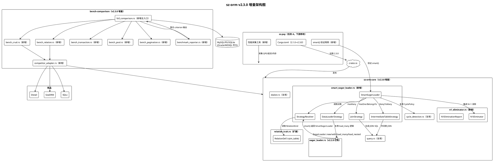
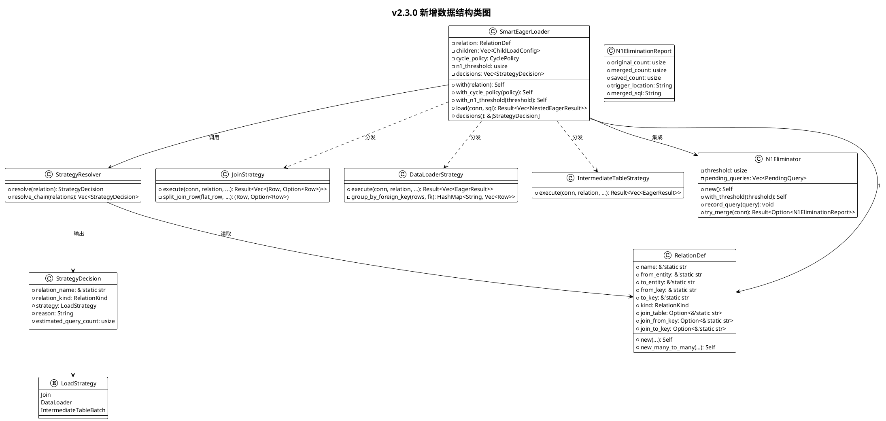

# sz-orm v2.3.0 技术设计文档

> **版本**：v2.3.0
> **基线**：v2.2.0（代码已完成；43 包工作空间，sz-orm-core 1.0.0 已发布 crates.io）
> **生成日期**：2026-08-07
> **依据**：`docs/spec/v2.3.0/spec.md`（99 条 EARS 需求）
> **文档目的**：将 v2.3.0 三项中期目标（任务 A：sz-pay 生产案例深化、任务 B：性能基准完整报告、任务 C：Eager Loading 智能策略选择）从需求规格转化为可落地的技术架构与接口设计，所有设计决策可追溯到 spec.md 中的需求 ID。

---

## 一、需求与存量功能关系分析

### 1.1 需求功能与存量功能对比

#### 1.1.1 已实现功能（v2.2.0 基线，v2.3.0 直接复用）

| 需求功能 | 存量功能 | 代码位置 | 匹配度 |
|---------|---------|---------|--------|
| 多级 Eager Loading 执行（REQ-A-005, REQ-C-023~024） | `EagerLoader::with().load_many()/load_nested()` 无限级链式 | `packages/sz-orm-core/src/eager_loader.rs:156`（with）、`:207`（load_many）、`:320`（load_nested） | 100% |
| Eager Loading 循环检测（REQ-C-025） | `CyclePolicy::Error/Truncate/AllowWithDepthLimit` + `CycleDetector` | `packages/sz-orm-core/src/cycle_detection.rs:18`（CyclePolicy）、`:32`（CycleDetector） | 100% |
| 关联关系元数据定义（REQ-C-002, REQ-C-003） | `RelationDef`（name/from_entity/to_entity/from_key/to_key/kind）+ `RelationKind`（HasOne/HasMany/BelongsTo/ManyToMany） | `packages/sz-orm-core/src/relation_trait.rs:36`（RelationKind）、`:84`（RelationDef） | 100% |
| Eager Loading 结果类型（REQ-C-026） | `NestedEagerResult::Leaf/Node` 递归树 + `EagerResult` 元组 | `packages/sz-orm-core/src/eager_loader.rs:55`（NestedEagerResult）、`:35`（EagerResult） | 100% |
| Schema Sync 破坏性安全（REQ-A-006） | `SchemaSync::diff` / `destructive_sync` 含列重命名检测与迁移钩子 | `packages/sz-orm-core/src/schema_sync.rs` | 100% |
| Stream API 背压控制（REQ-A-007） | `StreamApiExt::stream_with_backpressure` + `BackpressureStream` | `packages/sz-orm-core/src/stream_api.rs` | 100% |
| cascade_delete 策略（REQ-A-008） | `CascadeStrategy::RESTRICT/CASCADE/SET_NULL/SET_DEFAULT` | `packages/sz-orm-core/src/nested_active_model.rs` | 100% |
| Partial Models 投影（REQ-A-009, REQ-NF-SEC-002） | `QueryBuilder::select_only` / `select_exclude` | `packages/sz-orm-core/src/partial_model.rs` + `query.rs` | 100% |
| 五方言统一抽象（REQ-CON-DIALECT-001） | `Dialect` trait + MySQL/PostgreSQL/SQLite/Oracle/MSSQL 实现 | `packages/sz-orm-core/src/dialect.rs:23`（Dialect trait） | 100% |
| 参数化 WHERE（REQ-CON-PARAMQUERY-001） | `QueryBuilder::where_eq/where_ne/where_gt/...` + `where_cond` deprecated | `packages/sz-orm-core/src/query.rs:1-25`（模块文档） | 100% |
| JOIN 查询构造（REQ-C-006, REQ-C-007） | `QueryBuilder::join/left_join` + `JoinKind::Inner/Left` | `packages/sz-orm-core/src/relation_trait.rs:62`（JoinKind）、`query.rs`（join/left_join） | 100% |
| 错误类型体系（REQ-C-015, 全局） | `DbError`（20+ 变体，含 `InvalidInput`/`Unsupported`/`Contextual`） | `packages/sz-orm-core/src/error.rs:44`（DbError 枚举） | 100% |
| 现有基准框架（REQ-B-007） | criterion + MockConnection，4 场景（Eager/NestedSave/SchemaSync/Stream） | `bench-comparison/benches/v2_1_0_features.rs:1-80` | 75% |
| 现有竞品对比（REQ-B-008~010） | SQLite in-memory CRUD 对比 rusqlite/diesel/sea-orm/sqlx | `bench-comparison/benches/orm_comparison.rs:1-80` | 50% |
| 现有跨 DB 对比（REQ-B-013~015） | SQLite/MySQL/PG/Oracle × sz-orm/sqlx/diesel/sea-orm CRUD 矩阵 | `bench-comparison/benches/cross_db_comparison.rs:1-60` | 50% |

#### 1.1.2 需要扩展的功能

| 需求功能 | 存量功能 | 差异说明 | 扩展方向 |
|---------|---------|---------|---------|
| 智能策略选择启用（REQ-C-001） | `EagerLoader::new()` 仅手动模式，无 `smart()` 入口 | 缺少智能模式开关与策略决策器调用入口 | 新增 `EagerLoader::smart()` 扩展方法 + `SmartEagerLoader` 包装类型，不修改 `new()` 签名（DFX-COMPAT-003） |
| HasOne 自动 JOIN（REQ-C-006, REQ-C-009） | `EagerLoader` 内部对 HasOne/BelongsTo 已用 JOIN 策略，但需开发者手动构造；结果集拆分逻辑分散 | 缺少从 `RelationDef` 自动生成 JOIN SQL 的统一入口与结果集拆分组装器 | 新增 `JoinStrategy` 执行器：读取 `RelationDef` → 生成 JOIN SQL（复用 `QueryBuilder::join`）→ 拆分扁平行为 (主表实体, 关联实体) |
| HasMany 自动 data loader（REQ-C-010~013） | `EagerLoader::load_many()` 已实现双查询 + `WHERE fk IN` 批量 + 按外键分组 | 缺少从 `RelationDef` 自动决策选用 data loader 的入口；Oracle IN>1000 分批已存在于 `load_children`（`eager_loader.rs:274`）但未在 `load_many` 主路径 | 新增 `DataLoaderStrategy` 执行器：复用 `load_many` 内部逻辑，由策略决策器自动选用 |
| ManyToMany 中间表查询（REQ-C-014~016） | `RelationDef` 当前无中间表字段（仅有 from_key/to_key），ManyToMany 复用 HasMany 双查询 | `RelationDef` 缺少 `join_table`（中间表）与 `join_from_key`/`join_to_key`（中间表两侧外键）元数据 | 扩展 `RelationDef` 增加可选中间表字段（向后兼容，默认 None）；新增 `IntermediateTableStrategy` 执行器 |
| N+1 自动消除（REQ-C-017~022） | `N1QueryDetector` 已存在拦截告警（AGENTS.md 提及），但仅告警不合并 | 缺少连续查询模式检测的批量合并执行器与阈值配置 | 新增 `N1Eliminator` 组件：检测连续 `find_by_id` 模式 → 合并为 `WHERE id IN (?,...)` → 结果等价性校验 → 不等价回退 |
| 策略决策日志（REQ-C-004, REQ-NF-MAINT-001） | 现有 `tracing` 生态包（sz-orm-tracing）但 EagerLoader 无决策日志 | 缺少策略决策四要素（关联名/类型/策略/原因）结构化日志 | 新增 `StrategyDecision` 记录结构 + `tracing::info!` 输出 |
| 全维度基准（REQ-B-001~006） | 现有 4 场景（Eager/NestedSave/SchemaSync/Stream）+ CRUD 对比 | 缺少批量 10/100/1000/10000 四档、关联 1:1/1:N/N:M、事务（含 savepoint）、连接池（空闲/池满/并发竞争）、分页（OFFSET/游标）维度 | 新增基准模块文件，按开闭原则扩展（DFX-MAINT-002） |
| 竞品全维度对比（REQ-B-008~012） | 现有 CRUD 对比，无关联/事务/连接池/分页维度竞品对比 | 缺少 Diesel/SeaORM/SQLx 在关联/事务/连接池/分页维度的适配 | 新增竞品适配层 trait，统一场景接口 |
| 基准报告生成（REQ-B-018~023） | criterion 自动生成 HTML/JSON，但无统一 Markdown 报告 + 图表数据 + 环境元数据 + DSN 脱敏 | 缺少报告聚合器与脱敏处理 | 新增 `BenchmarkReporter`：聚合 criterion 输出 → Markdown + CSV/JSON + 环境元数据 + DSN 脱敏 |
| sz-pay 依赖升级（REQ-A-001~004） | sz-pay 当前依赖 sz-orm 2.1.0（7 包），sz-orm 已发布 1.0.0，代码版本 1.2.2 | 版本差距 2.1.0 → 2.3.0，需经 2.2.0 中间版本；sz-pay 自身代码可能需适配 deprecation | sz-pay `Cargo.toml` 版本声明改为 2.3.0 + 适配 deprecation warning + 全量测试 |
| sz-pay 性能采集（REQ-A-011~015） | sz-pay 有 5139 测试但无统一性能采集工具 | 缺少 QPS/P50/P95/P99/峰值内存采集器与 v2.1.0 vs v2.3.0 对比 | 新增 sz-pay 性能采集脚本/工具 + 对比报告 |

#### 1.1.3 需要新增的功能或接口

按业务模块分组：

**模块 1：智能策略选择（任务 C，`packages/sz-orm-core/src/smart_eager_loader.rs` 新增）**
- `SmartEagerLoader` 类型：包装 `EagerLoader` + 策略决策器 + N+1 消除器
- `EagerLoader::smart()` 扩展方法：返回 `SmartEagerLoader`
- `StrategyResolver`：策略决策器，输入 `RelationDef` → 输出 `LoadStrategy`
- `LoadStrategy` 枚举：`Join` / `DataLoader` / `IntermediateTableBatch`
- `StrategyDecision`：决策记录（关联名/类型/策略/原因/查询次数预估）
- `JoinStrategy` / `DataLoaderStrategy` / `IntermediateTableStrategy`：三种策略执行器
- 依赖：`relation_trait`（RelationDef）、`eager_loader`（复用 load_many 内部逻辑）、`cycle_detection`（CyclePolicy）、`query`（QueryBuilder::join）

**模块 2：N+1 自动消除（任务 C，`packages/sz-orm-core/src/n1_eliminator.rs` 新增）**
- `N1Eliminator`：连续查询模式检测器与合并执行器
- `N1EliminationReport`：消除报告（原次数/合并后次数/节省/触发位置/合并 SQL）
- `N1Threshold`：阈值配置（默认 5）
- 依赖：`query`（QueryBuilder）、`value`（Value）

**模块 3：RelationDef 中间表扩展（任务 C，`packages/sz-orm-core/src/relation_trait.rs` 修改）**
- `RelationDef` 新增可选字段：`join_table: Option<&'static str>`、`join_from_key: Option<&'static str>`、`join_to_key: Option<&'static str>`
- 向后兼容：新增 `RelationDef::new_many_to_many()` 构造器，原 `new()` 保持签名不变（中间表字段默认 None）

**模块 4：全维度基准（任务 B，`bench-comparison/benches/` 新增多个文件）**
- `full_comparison.rs`：全维度 × 多方言 × 竞品基准主入口
- `bench_crud.rs` / `bench_relation.rs` / `bench_transaction.rs` / `bench_pool.rs` / `bench_pagination.rs`：维度模块
- `competitor_adapter.rs`：竞品适配层 trait
- `benchmark_reporter.rs`：报告生成器
- 依赖：criterion、sz-orm-core、diesel、sea-orm、sqlx

**模块 5：sz-pay 性能采集（任务 A，`E:\vue\test\sz-pay\server\sz-rust` 修改）**
- sz-pay `Cargo.toml`：sz-orm 7 包版本 2.1.0 → 2.3.0
- sz-pay 性能采集脚本/工具（sz-pay 内部新增）
- sz-pay smart() 验证用例（sz-pay 内部新增测试）

### 1.2 存量功能详细分析

#### 1.2.1 EagerLoader（`eager_loader.rs`）

**接口契约**：
- `new(relation: RelationDef) -> Self`：构造器，关联关系必填
- `with(relation: RelationDef) -> Self`：链式追加子级关联，追加到最深层级（`push_to_deepest`）
- `with_cycle_policy(policy: CyclePolicy) -> Self`：设置循环检测策略，默认 `Truncate`
- `load_many(conn, main_sql) -> Result<Vec<EagerResult>, DbError>`：执行 HasMany 双查询，返回 (主表行, 关联行列表) 元组列表
- `load_nested(conn, main_sql) -> Result<Vec<NestedEagerResult>, DbError>`：执行多级嵌套加载，返回递归结果树

**业务规则**：
- HasMany/ManyToMany：双查询策略（主表 → 提取主键 → `WHERE fk IN (?,...)` 批量 → 按外键分组）
- HasOne/BelongsTo：JOIN 策略（单条 SQL，结果集拆分）— 注释声明但 `load_many` 主路径实际统一用双查询
- Oracle IN 列表 >1000 时分批（`load_children` 中 `pk_values.chunks(1000)`，`eager_loader.rs:274`）
- 结果集超 1,000,000 行返回 `InvalidInput` 错误，建议改用 Stream API（`eager_loader.rs:332`）
- 空主表结果跳过关联查询（`eager_loader.rs:214`）

**扩展点**：
- `ChildLoadConfig` 为私有递归结构，`push_to_deepest` 支持无限级链式
- `batch_query_with_relation` / `group_rows_by_foreign_key` 为模块级自由函数，可被策略执行器复用

**约束**：
- 异步：所有加载方法为 `async`，需 `tokio` 运行时
- 连接：`conn: &mut dyn Connection`，trait object 动态分发
- 内存：结果集全量收集，大结果集须改用 Stream API
- 循环安全：`CycleDetector` 按 `entity_type::relation_name` 联合去重

#### 1.2.2 RelationDef（`relation_trait.rs`）

**接口契约**：
- `new(name, from_entity, to_entity, from_key, to_key, kind) -> Self`：`const fn` 编译期构造，零分配
- 所有字段为 `&'static str`，运行时零分配

**业务规则**：
- `from_key`：源实体键列（通常主键）
- `to_key`：目标实体外键列
- `default_join_type()`：HasOne/BelongsTo → Inner，HasMany/ManyToMany → Left

**约束**：
- 当前 `RelationDef` **无中间表字段**，ManyToMany 复用 HasMany 双查询逻辑（从主表主键直接 `WHERE to_key IN`），未经过中间表 JOIN。这是任务 C 需扩展的关键缺口（REQ-C-014~016）。
- `const fn` 构造器限制：不能在 `new()` 中初始化 `Option` 字段为非 None 常量（需用单独的 `new_many_to_many()` 构造器）

#### 1.2.3 现有基准（`bench-comparison/benches/`）

**`v2_1_0_features.rs`**：
- 4 场景：Eager Loading / Nested Save / Schema Sync / Stream API
- 使用 `MockConnection`（非真实 DB）
- 数据规模：10/100/1000
- 无竞品对比

**`orm_comparison.rs`**：
- SQLite in-memory，CRUD（INSERT/SELECT/UPDATE/DELETE）
- 对比 rusqlite/diesel/sea-orm/sqlx
- 数据规模：1000/10000/100000
- 无关联/事务/连接池/分页维度

**`cross_db_comparison.rs`**：
- SQLite/MySQL/PG/Oracle × sz-orm/sqlx/diesel/sea-orm 矩阵
- CRUD 场景（INSERT 1K / SELECT BY ID 100× / SELECT ALL 1K / UPDATE 100 / DELETE 1K）
- 自定义 main（harness = false），环境变量触发远程 DB
- 无关联/事务/连接池/分页维度，无统一报告生成

---

## 二、增量设计方案

## 第 1 章 设计概述

### 1.1 设计目标

v2.3.0 在 v2.2.0 基础上交付三项中期目标，每项目标可追溯到 spec.md §5 的需求簇：

| 目标 | 需求簇 | 核心交付物 | 验收门槛 |
|------|--------|-----------|---------|
| 任务 C：Eager Loading 智能策略选择 | REQ-C-001~028（28 条） | `SmartEagerLoader` + `StrategyResolver` + `N1Eliminator` | 智能模式与手动模式结果等价（REQ-NF-TEST-003）；决策延迟 ≤ 100μs（DFX-PERF-001） |
| 任务 B：性能基准完整报告 | REQ-B-001~023（23 条） | `full_comparison.rs` 基准套件 + `BenchmarkReporter` 报告生成器 | 全维度 × 三方言 × 四竞品对比矩阵完整（REQ-B-013~015）；全套件 ≤ 30 分钟（REQ-NF-PERF-004） |
| 任务 A：sz-pay 生产案例深化 | REQ-A-001~018（18 条） | sz-pay 依赖升级 2.1.0→2.3.0 + 性能采集 + 回归测试 | 5,139 基线测试 100% 通过（DFX-REL-001）；QPS/P50/P95/P99/峰值内存数据完整（DFX-PERF-006） |

### 1.2 设计范围

**包含**：
- 任务 C：`packages/sz-orm-core/src/smart_eager_loader.rs`（新增）、`n1_eliminator.rs`（新增）、`relation_trait.rs`（扩展中间表字段）、`eager_loader.rs`（新增 `smart()` 扩展方法）
- 任务 B：`bench-comparison/benches/full_comparison.rs`（新增主入口）+ 5 个维度模块 + 竞品适配层 + 报告生成器
- 任务 A：sz-pay 项目 `Cargo.toml` 版本升级 + 性能采集工具 + 验证用例（修改 sz-pay 自身，符合 ADR-0001）

**不包含**（spec.md §1.4 职责边界）：
- 新增第 6/7 种数据库方言
- 连接池底层重构
- AI 驱动的查询计划优化
- 跨语言 FFI 绑定扩展
- 竞品基准的持续 CI 集成

### 1.3 设计原则

| 原则 | 约束 ID | 设计体现 |
|------|---------|---------|
| API 向后兼容 | DFX-COMPAT-001~003, REQ-CON-COMPAT-001 | v2.2.0 的 `EagerLoader::new/with/with_cycle_policy/load_many/load_nested` 签名与行为不变；智能模式以 `smart()` 扩展方法提供；`RelationDef::new()` 签名不变，中间表字段默认 None |
| 五方言覆盖 | DFX-COMPAT-005, REQ-CON-DIALECT-001 | 策略决策逻辑与方言无关（方言仅影响 SQL 生成）；基准至少覆盖 MySQL/PostgreSQL/SQLite，Oracle/MSSQL 尽力覆盖 |
| unsafe 零容忍 | REQ-CON-UNSAFE-001 | 新增代码零 `unsafe` 块，除非有 `// SAFETY:` 注释且经五维审查 |
| 禁止占位实现 | REQ-CON-NOPLACEHOLDER-001 | 新增代码零 `todo!`/`unimplemented!`/`unreachable!` |
| 参数化查询 | REQ-CON-PARAMQUERY-001~002, DFX-SEC-001~002 | 智能策略生成的所有 WHERE 条件使用 `?`/`$N` 占位符；禁止 `SELECT *`，须显式列名或 Partial Models 投影 |
| 确定性决策 | REQ-C-003 | 策略决策器为纯内存规则匹配（非 AI），相同输入相同输出 |
| 开闭原则 | DFX-MAINT-002, REQ-NF-MAINT-002 | 基准测试模块化组织，新增维度或竞品仅新增文件，不修改已有基准代码 |
| 审计合规 | REQ-CON-AUDIT-001~002 | 所有验收结论附带 file:line 证据 + cargo test 输出 |
| ADR-0001 合规 | REQ-CON-ADR0001-001~002 | 任务 A 仅修改 sz-pay 项目文件与依赖版本，不修改 sz-orm 仓库（sz-orm 自身开发除外） |

---

## 第 2 章 架构设计

### 2.1 整体架构图



### 2.2 模块关系

| 模块 | 职责 | 依赖（上游→下游） | 新增/修改 |
|------|------|------------------|----------|
| `smart_eager_loader.rs` | 智能策略选择执行器，包装 EagerLoader + StrategyResolver + N1Eliminator | 依赖 `eager_loader`、`relation_trait`、`cycle_detection`、`query`、`n1_eliminator` | 新增 |
| `n1_eliminator.rs` | N+1 连续查询模式检测与批量合并 | 依赖 `query`、`value` | 新增 |
| `relation_trait.rs` | 关联关系定义，扩展中间表字段 | 被 `smart_eager_loader`、`eager_loader` 依赖 | 修改（扩展字段，向后兼容） |
| `eager_loader.rs` | Eager Loading 执行器，新增 `smart()` 扩展方法 | 依赖 `relation_trait`、`cycle_detection`；被 `smart_eager_loader` 复用 | 修改（新增方法，已有方法不变） |
| `full_comparison.rs` | 全维度基准主入口 | 依赖 5 个维度模块 + `competitor_adapter` + `benchmark_reporter` | 新增 |
| `competitor_adapter.rs` | 竞品适配层 trait，统一 sz-orm/Diesel/SeaORM/SQLx 场景接口 | 依赖 diesel/sea-orm/sqlx/sz-orm-core | 新增 |
| `benchmark_reporter.rs` | 报告生成器，聚合 criterion 输出为 Markdown + CSV/JSON | 依赖 criterion 输出 | 新增 |

### 2.3 数据流

**任务 C 智能加载数据流**：
```
开发者调用 EagerLoader::smart().with(rel).load(conn, sql)
  → SmartEagerLoader 收集 RelationDef 链
  → StrategyResolver 对每级 RelationDef 决策（纯内存规则，≤100μs）
  → 按策略分发执行：
      HasOne/BelongsTo → JoinStrategy → QueryBuilder::join 生成 JOIN SQL → 单次查询 → 拆分结果集
      HasMany → DataLoaderStrategy → 复用 EagerLoader::load_many 内部逻辑 → 双查询 → 按外键分组
      ManyToMany → IntermediateTableStrategy → 中间表 JOIN 批量查询 → 双向组装
  → N1Eliminator 检测连续查询模式（若启用）→ 合并为批量查询
  → CycleDetector 循环检测（复用 v2.2.0）
  → 返回 NestedEagerResult 树（与手动模式类型一致）
  → tracing::info! 输出策略决策日志
```

**任务 B 基准数据流**：
```
cargo bench --bench full_comparison
  → 读取环境变量（DATABASE_URL_MYSQL/PG/SQLITE）
  → 对每方言 × 每维度 × 每竞品：
      → competitor_adapter 统一场景接口
      → criterion 测量（均值/中位数/StdDev/置信区间）
  → BenchmarkReporter 聚合 criterion 输出
  → DSN 脱敏（密码 → ***）
  → 生成 benchmark-report.md + benchmark-data.csv/json
  → 附环境元数据（硬件/Rust 版本/DB 版本/数据集规模）
```

**任务 A sz-pay 深化数据流**：
```
sz-pay Cargo.toml: sz-orm 2.1.0 → 2.3.0
  → cargo build --workspace（验证编译兼容）
  → cargo test --workspace（验证 5,139 基线零回归）
  → sz-pay 业务场景调用 smart()（验证任务 C 可用性）
  → 性能采集工具运行真实业务负载
  → 采集 QPS/P50/P95/P99/峰值内存
  → 与 v2.1.0 基线对比 → 对比报告
  → 清理临时文件与测试进程
```

---

## 第 3 章 任务 C 详细设计：Eager Loading 智能策略选择

> **需求追溯**：REQ-C-001~028（28 条）、DFX-PERF-001~004、DFX-REL-002~003、DFX-SEC-001~002、DFX-MAINT-001、DFX-COMPAT-001~003、REQ-NF-PERF-001~003、REQ-NF-SEC-001~003、REQ-NF-COMPAT-001~002、REQ-NF-TEST-001~003/005~006、REQ-NF-MAINT-001/003/004、REQ-CON-DIALECT-001、REQ-CON-COMPAT-001、REQ-CON-UNSAFE-001、REQ-CON-NOPLACEHOLDER-001、REQ-CON-PARAMQUERY-001~002

### 3.1 策略决策器（StrategyResolver）

#### 3.1.1 设计目标

策略决策器是智能模式的核心，负责根据关联关系元数据（`RelationDef`）自动选择最优执行策略。决策过程为**确定性规则匹配**（非 AI），相同输入相同输出（REQ-C-003），决策延迟 ≤ 100μs（DFX-PERF-001, REQ-NF-PERF-001）。

#### 3.1.2 决策规则矩阵

| 关联类型（RelationKind） | 中间表配置 | 选用策略 | 决策原因 | 预估查询次数 | 需求追溯 |
|-------------------------|-----------|---------|---------|------------|---------|
| HasOne | — | Join | 单条关联，JOIN 单次查询最优，无 N+1 风险 | 1 | REQ-C-006, DFX-PERF-002 |
| BelongsTo | — | Join | 多对一等价于单条关联，JOIN 单次查询最优 | 1 | REQ-C-007, DFX-PERF-002 |
| HasMany | — | DataLoader | 多条关联，JOIN 会导致行膨胀，data loader 双查询 + 分组组装最优 | 2 | REQ-C-010, DFX-PERF-003 |
| ManyToMany | 已配置 | IntermediateTableBatch | 经中间表批量查询，避免行膨胀，双向组装 | 2 | REQ-C-014 |
| ManyToMany | 未配置 | 回退 DataLoader + 告警 | 中间表缺失，回退默认策略，不 panic | 2 | REQ-C-005, REQ-C-015 |
| 未知/缺失元数据 | — | 回退 DataLoader + 告警 | 无法识别，回退默认策略，不 panic | 2 | REQ-C-005 |

#### 3.1.3 决策器接口签名

```rust
/// 加载策略枚举（策略决策器输出）
///
/// 表示智能策略决策器为某关联关系选定的执行策略。
/// 决策规则为确定性规则匹配（非 AI），相同输入相同输出（REQ-C-003）。
#[derive(Debug, Clone, Copy, PartialEq, Eq)]
pub enum LoadStrategy {
    /// JOIN 策略：单条 SQL 含 JOIN，适用于 HasOne/BelongsTo（REQ-C-006/007）
    Join,
    /// Data Loader 策略：主表查询 + WHERE fk IN 批量查询，适用于 HasMany（REQ-C-010）
    DataLoader,
    /// 中间表批量策略：经中间表 JOIN 关联表批量查询，适用于 ManyToMany（REQ-C-014）
    IntermediateTableBatch,
}

/// 策略决策记录（可解释日志载体，REQ-C-004, REQ-NF-MAINT-001）
///
/// 记录每次策略决策的四要素：关联名、类型、选用策略、决策原因。
/// 通过 `tracing::info!` 输出，供调试与审计。
#[derive(Debug, Clone)]
pub struct StrategyDecision {
    /// 关联名称（如 "orders"）
    pub relation_name: &'static str,
    /// 关联类型
    pub relation_kind: RelationKind,
    /// 选用的执行策略
    pub strategy: LoadStrategy,
    /// 人类可读的决策原因
    pub reason: String,
    /// 预估查询次数
    pub estimated_query_count: usize,
}

/// 策略决策器（纯内存规则匹配，无 DB 查询，DFX-PERF-001）
///
/// 根据 `RelationDef` 的关联类型与中间表配置，输出确定的 `LoadStrategy`。
/// 决策延迟 ≤ 100μs（仅枚举匹配 + 字段判空，无 IO）。
///
/// # 确定性保证
///
/// 相同 `RelationDef` 输入始终返回相同 `StrategyDecision`（REQ-C-003）。
pub struct StrategyResolver;

impl StrategyResolver {
    /// 决策最优执行策略
    ///
    /// # 参数
    ///
    /// - `relation`：关联关系定义（含类型、外键、中间表）
    ///
    /// # 返回
    ///
    /// - `Ok(StrategyDecision)`：决策成功，含策略与原因
    /// - `Err(DbError)`：关联元数据缺失（如 ManyToMany 缺中间表），按 REQ-C-005 回退而非报错
    ///
    /// # 性能
    ///
    /// 决策为纯枚举匹配 + Option 判空，无内存分配（reason 为 `&'static str`），
    /// 延迟远低于 100μs（DFX-PERF-001）。
    pub fn resolve(relation: &RelationDef) -> StrategyDecision;

    /// 批量决策：对多级关联链逐级独立决策（REQ-C-027）
    ///
    /// 允许不同级使用不同策略（如 L1 HasMany 用 DataLoader，L2 HasOne 用 Join）。
    pub fn resolve_chain(relations: &[RelationDef]) -> Vec<StrategyDecision>;
}
```

#### 3.1.4 决策算法伪代码

```
function StrategyResolver::resolve(relation):
    match relation.kind:
        case HasOne:
            return StrategyDecision {
                strategy: Join,
                reason: "HasOne 单条关联，JOIN 单次查询最优，无 N+1 风险",
                estimated_query_count: 1,
            }
        case BelongsTo:
            return StrategyDecision {
                strategy: Join,
                reason: "BelongsTo 多对一等价单条关联，JOIN 单次查询最优",
                estimated_query_count: 1,
            }
        case HasMany:
            return StrategyDecision {
                strategy: DataLoader,
                reason: "HasMany 多条关联，JOIN 致行膨胀，data loader 双查询最优",
                estimated_query_count: 2,
            }
        case ManyToMany:
            if relation.join_table.is_some():
                return StrategyDecision {
                    strategy: IntermediateTableBatch,
                    reason: "ManyToMany 经中间表批量查询，避免行膨胀",
                    estimated_query_count: 2,
                }
            else:
                tracing::warn!("ManyToMany 关联 {} 缺少中间表配置，回退 DataLoader", relation.name)
                return StrategyDecision {
                    strategy: DataLoader,
                    reason: "ManyToMany 中间表缺失，回退 DataLoader（建议配置中间表）",
                    estimated_query_count: 2,
                }
```

### 3.2 HasOne 自动 JOIN 策略（JoinStrategy）

> **需求追溯**：REQ-C-006~009, DFX-PERF-002, DFX-SEC-001~002, REQ-NF-SEC-001~002

#### 3.2.1 设计

HasOne/BelongsTo 关联自动选用 JOIN 策略，在单次查询中获取主表与关联表数据（DFX-PERF-002：查询次数 = 1）。

**SQL 生成**：复用 `QueryBuilder::join`（`query.rs` 已有），根据 `RelationDef` 生成：
```sql
SELECT main.*, related.*
FROM {from_entity} main
INNER JOIN {to_entity} related ON main.{from_key} = related.{to_key}
WHERE {main_sql 的 WHERE 条件}
```

**关键约束**：
- 禁止 `SELECT *`（REQ-NF-SEC-002）：使用显式列名，主表列前缀 `main_`，关联表列前缀 `related_`，通过 Partial Models 投影
- WHERE 条件参数化（REQ-NF-SEC-001）：复用 `QueryBuilder::where_eq` 等参数化 API
- 方言回退（REQ-C-008）：若目标方言不支持 JOIN（如某些限制场景），回退 DataLoader 策略并记录原因

#### 3.2.2 结果集拆分组装（REQ-C-009）

JOIN 返回扁平行（主表列 + 关联表列混合），需拆分为 (主表实体, 关联实体) 结构：

```rust
/// JOIN 策略执行器
pub struct JoinStrategy;

impl JoinStrategy {
    /// 执行 HasOne/BelongsTo JOIN 策略
    ///
    /// 1. 根据 RelationDef 生成 JOIN SQL（复用 QueryBuilder::join）
    /// 2. 执行单次查询
    /// 3. 拆分扁平行为 (主表行, 关联行)
    ///
    /// # 参数
    ///
    /// - `conn`：数据库连接
    /// - `relation`：关联关系定义
    /// - `main_columns`：主表显式列名（禁止 SELECT *，REQ-NF-SEC-002）
    /// - `related_columns`：关联表显式列名
    /// - `where_clause`：参数化 WHERE 条件（REQ-NF-SEC-001）
    /// - `where_params`：WHERE 参数值
    pub async fn execute(
        conn: &mut dyn Connection,
        relation: &RelationDef,
        main_columns: &[&str],
        related_columns: &[&str],
        where_clause: &str,
        where_params: &[Value],
    ) -> Result<Vec<(HashMap<String, Value>, Option<HashMap<String, Value>>), DbError>;

    /// 拆分 JOIN 扁平行为 (主表行, 关联行)
    ///
    /// 根据列名前缀（main_/related_）将扁平行拆分为两个 HashMap。
    /// 无数据串行：每行的主表列与关联列严格按前缀分离（REQ-C-009）。
    fn split_join_row(
        flat_row: &HashMap<String, Value>,
        main_columns: &[&str],
        related_columns: &[&str],
    ) -> (HashMap<String, Value>, Option<HashMap<String, Value>>);
}
```

#### 3.2.3 拆分算法伪代码

```
function split_join_row(flat_row, main_columns, related_columns):
    main_row = {}
    related_row = {}
    for col in main_columns:
        main_row[col] = flat_row["main_" + col]
    for col in related_columns:
        key = "related_" + col
        if flat_row.contains(key) and flat_row[key] is not Null:
            related_row[col] = flat_row[key]
    related = if related_row.is_empty(): None else: Some(related_row)
    return (main_row, related)
```

### 3.3 HasMany 自动 Data Loader 策略（DataLoaderStrategy）

> **需求追溯**：REQ-C-010~013, DFX-PERF-003, DFX-REL-002

#### 3.3.1 设计

HasMany 关联自动选用 data loader 策略：先执行主表查询收集主键，再用 `WHERE fk IN (?, ...)` 批量查询关联表并按外键分组组装（DFX-PERF-003：查询次数 = 2）。

**核心复用**：直接复用 `EagerLoader::load_many` 的内部逻辑（`eager_loader.rs:207`），包括：
- 主表查询 + 主键提取（`extract_primary_keys`）
- 批量 IN 查询（`batch_query_related`）
- 按外键分组（`group_by_foreign_key`）
- Oracle IN >1000 分批（`load_children` 中 `pk_values.chunks(1000)`，`eager_loader.rs:274`，满足 REQ-C-011）

**新增能力**：
- 空结果跳过（REQ-C-013）：主表查询返回 0 行时，不执行关联查询，直接返回空 Vec（`eager_loader.rs:214` 已有此逻辑，复用）
- 显式列名投影（REQ-NF-SEC-002）：批量查询使用显式列名，禁止 `SELECT *`

#### 3.3.2 接口签名

```rust
/// Data Loader 策略执行器（HasMany）
pub struct DataLoaderStrategy;

impl DataLoaderStrategy {
    /// 执行 HasMany data loader 策略
    ///
    /// 1. 执行主表查询收集主键
    /// 2. 若主表为空，跳过关联查询，返回空 Vec（REQ-C-013）
    /// 3. 生成 WHERE fk IN (?, ...) 批量查询（参数化，REQ-NF-SEC-001）
    /// 4. Oracle 方言且主键数 >1000 时分批（REQ-C-011）
    /// 5. 按外键分组组装（REQ-C-012）
    ///
    /// # 查询次数
    ///
    /// 固定 2 次（主表 + 批量关联），DFX-PERF-003。
    pub async fn execute(
        conn: &mut dyn Connection,
        relation: &RelationDef,
        main_sql: &str,
        main_columns: &[&str],
        related_columns: &[&str],
    ) -> Result<Vec<EagerResult>, DbError>;

    /// 按外键值分组关联行（REQ-C-012）
    ///
    /// 将批量查询返回的关联行按外键值分配至对应主表行，无遗漏无错配。
    fn group_by_foreign_key(
        related_rows: Vec<HashMap<String, Value>>,
        foreign_key: &str,
    ) -> HashMap<String, Vec<HashMap<String, Value>>>;
}
```

### 3.4 ManyToMany 自动中间表策略（IntermediateTableStrategy）

> **需求追溯**：REQ-C-014~016, DFX-SEC-001~002

#### 3.4.1 设计

ManyToMany 关联（如 User ↔ Role，经 user_roles 中间表）自动选用中间表批量查询策略：
1. 查主表主键
2. 经中间表 JOIN 关联表批量查询：`SELECT related.* FROM {join_table} jt JOIN {to_entity} related ON jt.{join_to_key} = related.{from_key} WHERE jt.{join_from_key} IN (?, ...)`
3. 按主键分组组装为 (主实体, Vec<关联实体>)

#### 3.4.2 RelationDef 中间表扩展（向后兼容）

当前 `RelationDef`（`relation_trait.rs:84`）无中间表字段。扩展方案：

```rust
/// 关联关系定义（v2.3.0 扩展中间表字段，向后兼容）
///
/// v2.2.0 的 `new()` 签名不变，中间表字段默认 None。
/// ManyToMany 关联须使用 `new_many_to_many()` 配置中间表（REQ-C-015）。
#[derive(Debug, Clone)]
pub struct RelationDef {
    pub name: &'static str,
    pub from_entity: &'static str,
    pub to_entity: &'static str,
    pub from_key: &'static str,
    pub to_key: &'static str,
    pub kind: RelationKind,
    /// v2.3.0 新增：中间表名（ManyToMany 专用，其他类型为 None）
    pub join_table: Option<&'static str>,
    /// v2.3.0 新增：中间表中指向 from_entity 的外键
    pub join_from_key: Option<&'static str>,
    /// v2.3.0 新增：中间表中指向 to_entity 的外键
    pub join_to_key: Option<&'static str>,
}

impl RelationDef {
    /// v2.2.0 兼容构造器（签名不变，DFX-COMPAT-001）
    pub const fn new(
        name: &'static str,
        from_entity: &'static str,
        to_entity: &'static str,
        from_key: &'static str,
        to_key: &'static str,
        kind: RelationKind,
    ) -> Self {
        Self {
            name, from_entity, to_entity, from_key, to_key, kind,
            join_table: None,
            join_from_key: None,
            join_to_key: None,
        }
    }

    /// v2.3.0 新增：ManyToMany 构造器（含中间表配置，REQ-C-014/015）
    pub const fn new_many_to_many(
        name: &'static str,
        from_entity: &'static str,
        to_entity: &'static str,
        from_key: &'static str,
        to_key: &'static str,
        join_table: &'static str,
        join_from_key: &'static str,
        join_to_key: &'static str,
    ) -> Self {
        Self {
            name, from_entity, to_entity, from_key, to_key,
            kind: RelationKind::ManyToMany,
            join_table: Some(join_table),
            join_from_key: Some(join_from_key),
            join_to_key: Some(join_to_key),
        }
    }
}
```

#### 3.4.3 接口签名

```rust
/// 中间表批量策略执行器（ManyToMany）
pub struct IntermediateTableStrategy;

impl IntermediateTableStrategy {
    /// 执行 ManyToMany 中间表批量查询
    ///
    /// 1. 校验中间表配置（REQ-C-015：缺失返回 DbError）
    /// 2. 查主表主键
    /// 3. 经中间表 JOIN 关联表批量查询（参数化 IN，REQ-NF-SEC-001）
    /// 4. 按主键分组组装为 (主实体, Vec<关联实体>)（REQ-C-016）
    ///
    /// # 异常
    ///
    /// - 中间表元数据缺失 → `DbError::InvalidInput("ManyToMany 关联 X 缺少中间表配置")`（REQ-C-015）
    pub async fn execute(
        conn: &mut dyn Connection,
        relation: &RelationDef,
        main_sql: &str,
        main_columns: &[&str],
        related_columns: &[&str],
    ) -> Result<Vec<EagerResult>, DbError>;
}
```

### 3.5 N+1 自动消除（N1Eliminator）

> **需求追溯**：REQ-C-017~022, DFX-PERF-004, DFX-REL-003, REQ-NF-PERF-003, REQ-NF-SEC-003

#### 3.5.1 设计

N+1 自动消除在 v2.2.0 `N1QueryDetector`（仅告警）基础上，进一步**自动合并**连续单条查询为批量查询。

**检测模式**：业务代码在循环中发出连续单条相同模式查询（如循环内 `find_by_id`），检测条件：
- 查询模式相同（同一表、同一 WHERE 列、同一 SELECT 列）
- 连续查询数 ≥ 阈值（默认 5，REQ-C-020）
- 不含独立事务（REQ-C-021：含独立事务则跳过合并，事务边界不兼容）

**合并执行**：将 N 次 `WHERE id = ?` 合并为 1 次 `WHERE id IN (?, ?, ..., ?)`（DFX-PERF-004）。

**结果等价性校验**（REQ-C-018, REQ-C-022）：合并后结果集须与逐条查询结果等价（相同主键集合返回相同实体集合）。若不等价，立即回退逐条执行并发出错误告警。

#### 3.5.2 接口签名

```rust
/// N+1 自动消除器（v2.3.0 新增）
///
/// 检测连续单条相同模式查询，自动合并为批量查询。
/// 在 v2.2.0 N1QueryDetector（仅告警）基础上进一步自动合并消除。
pub struct N1Eliminator {
    /// 触发阈值（连续查询数 ≥ 阈值时触发合并，默认 5，REQ-C-020）
    threshold: usize,
    /// 连续查询模式缓冲区
    pending_queries: Vec<PendingQuery>,
}

/// 待合并的连续查询
struct PendingQuery {
    /// 表名
    table: String,
    /// WHERE 列名（如 "id"）
    where_column: String,
    /// WHERE 参数值
    where_value: Value,
    /// SELECT 列名
    select_columns: Vec<String>,
    /// 是否在独立事务中（REQ-C-021）
    in_standalone_transaction: bool,
    /// 触发位置（file:line，REQ-C-019）
    trigger_location: String,
}

/// N+1 消除报告（REQ-C-019）
#[derive(Debug, Clone)]
pub struct N1EliminationReport {
    /// 原查询次数 N
    pub original_count: usize,
    /// 合并后查询次数（通常为 1）
    pub merged_count: usize,
    /// 节省次数（original_count - merged_count）
    pub saved_count: usize,
    /// 触发位置（file:line）
    pub trigger_location: String,
    /// 合并后的批量查询 SQL（参数化，REQ-NF-SEC-003）
    pub merged_sql: String,
}

impl N1Eliminator {
    /// 创建 N+1 消除器（默认阈值 5）
    pub fn new() -> Self;

    /// 配置触发阈值（REQ-C-020）
    pub fn with_threshold(mut self, threshold: usize) -> Self;

    /// 记入一次查询（检测连续模式）
    ///
    /// 当累计连续查询数 ≥ 阈值时，触发合并。
    pub fn record_query(&mut self, query: PendingQuery);

    /// 执行合并（若满足阈值且无事务边界冲突）
    ///
    /// # 返回
    ///
    /// - `Ok(Some(N1EliminationReport))`：合并成功，含消除报告
    /// - `Ok(None)`：未达阈值或不满足合并条件（如含独立事务，REQ-C-021）
    /// - `Err(DbError)`：合并后结果不等价，回退逐条执行（REQ-C-022）
    pub async fn try_merge(
        &mut self,
        conn: &mut dyn Connection,
    ) -> Result<Option<N1EliminationReport>, DbError>;
}
```

#### 3.5.3 合并算法伪代码

```
function N1Eliminator::try_merge(conn):
    if pending_queries.len() < threshold:
        return Ok(None)  // 未达阈值，不合并（REQ-C-020）

    // 检查事务边界兼容性（REQ-C-021）
    if any(q.in_standalone_transaction for q in pending_queries):
        tracing::warn!("事务边界不兼容，跳过 N+1 消除")
        return Ok(None)

    // 提取公共模式
    table = pending_queries[0].table
    where_column = pending_queries[0].where_column
    select_columns = pending_queries[0].select_columns
    values = [q.where_value for q in pending_queries]

    // 生成合并 SQL（参数化，REQ-NF-SEC-003）
    placeholders = ["?" for _ in values]
    merged_sql = "SELECT {select_columns} FROM {table} WHERE {where_column} IN ({placeholders})"

    // 执行批量查询
    merged_results = conn.query_with_params(merged_sql, values)

    // 结果等价性校验（REQ-C-018, REQ-C-022）
    expected_keys = set(values)
    actual_keys = set(r[where_column] for r in merged_results)
    if expected_keys != actual_keys:
        tracing::error!("N+1 消除结果不等价，回退逐条执行")
        return Err(DbError::Internal("N+1 消除结果不等价"))

    // 生成消除报告（REQ-C-019）
    report = N1EliminationReport {
        original_count: pending_queries.len(),
        merged_count: 1,
        saved_count: pending_queries.len() - 1,
        trigger_location: pending_queries[0].trigger_location,
        merged_sql: merged_sql,
    }

    pending_queries.clear()
    return Ok(Some(report))
```

### 3.6 向后兼容方案

> **需求追溯**：REQ-C-023~028, DFX-COMPAT-001~003, REQ-CON-COMPAT-001

#### 3.6.1 smart() 作为 EagerLoader 的扩展方法

采用 `smart()` 扩展方法方案（而非独立 `SmartEagerLoader::new()` 构造器为主入口），确保 v2.2.0 API 100% 向后兼容：

```rust
impl EagerLoader {
    /// v2.3.0 新增：启用智能策略选择模式（扩展方法，不修改已有签名）
    ///
    /// 返回 `SmartEagerLoader`，内置策略决策器与 N+1 消除器。
    /// 未调用 `smart()` 时沿用原有手动策略（REQ-C-023）。
    ///
    /// # 用法
    ///
    /// ```ignore
    /// use sz_orm_core::eager_loader::EagerLoader;
    ///
    /// // 智能模式（v2.3.0 新增）
    /// let loader = EagerLoader::new(order_rel)
    ///     .smart()
    ///     .with(item_rel)
    ///     .with(product_rel);
    /// let tree = loader.load(&mut conn, "SELECT id, name FROM users").await?;
    ///
    /// // 手动模式（v2.2.0 不变）
    /// let loader = EagerLoader::new(order_rel)
    ///     .with(item_rel)
    ///     .with(product_rel);
    /// let tree = loader.load_nested(&mut conn, "SELECT id, name FROM users").await?;
    /// ```
    pub fn smart(self) -> SmartEagerLoader;
}
```

#### 3.6.2 兼容性保证矩阵

| v2.2.0 API | v2.3.0 行为 | 兼容性 | 需求追溯 |
|-----------|-----------|--------|---------|
| `EagerLoader::new(relation)` | 签名与行为不变 | 100% | REQ-C-023, DFX-COMPAT-001 |
| `EagerLoader::with(relation)` | 签名与行为不变 | 100% | REQ-C-023 |
| `EagerLoader::with_cycle_policy(policy)` | 签名与行为不变；智能模式下仍生效 | 100% | REQ-C-025 |
| `EagerLoader::load_many(conn, sql)` | 签名与行为不变 | 100% | REQ-C-023, DFX-COMPAT-001 |
| `EagerLoader::load_nested(conn, sql)` | 签名与行为不变 | 100% | REQ-C-023 |
| `eager_load_all(conn, sql, relation)` | 签名与行为不变 | 100% | REQ-C-024, DFX-COMPAT-002 |
| `NestedEagerResult::Leaf/Node` | 智能模式复用相同类型 | 100% | REQ-C-026 |
| `CyclePolicy::Error/Truncate/AllowWithDepthLimit` | 智能模式不绕过循环检测 | 100% | REQ-C-025 |
| `RelationDef::new(...)` | 签名不变，新增字段默认 None | 100% | DFX-COMPAT-001 |
| `EagerLoader::smart()` | v2.3.0 新增 | 新增 | REQ-C-001, DFX-COMPAT-003 |
| `RelationDef::new_many_to_many(...)` | v2.3.0 新增 | 新增 | REQ-C-014 |

#### 3.6.3 多级关联逐级独立决策（REQ-C-027）

智能模式处理多级关联 `smart().with().with()` 时，对每一级独立应用策略选择，允许不同级使用不同策略：

```
smart().with(order_rel).with(item_rel)
  → L1: StrategyResolver::resolve(order_rel)  // HasMany → DataLoader
  → L2: StrategyResolver::resolve(item_rel)   // HasMany → DataLoader
  → 逐级独立执行，组装嵌套树
```

若某级为 HasOne（如 Order → User），则该级用 Join，其余级用 DataLoader。

#### 3.6.4 次优策略警告（REQ-C-028）

若智能策略查询次数多于手动最优策略，日志标注"次优策略"警告：
```
tracing::warn!("关联 {} 智能策略查询次数 {} 多于手动最优 {}，建议手动指定", relation.name, smart_count, manual_optimal)
```

### 3.7 SmartEagerLoader 数据结构定义

```rust
/// 智能 Eager 加载器（v2.3.0 新增）
///
/// 内置策略决策器与 N+1 消除器，根据关联元数据自动选择最优执行策略。
/// 通过 `EagerLoader::smart()` 创建，保持 v2.2.0 API 向后兼容。
///
/// # 设计
///
/// - 包装 `EagerLoader` 的关联链配置（relation + children + cycle_policy）
/// - 新增 `StrategyResolver` 自动决策
/// - 集成 `N1Eliminator` 自动消除连续查询模式
/// - 复用 `NestedEagerResult` 结果类型（REQ-C-026）
pub struct SmartEagerLoader {
    /// 关联链配置（复用 EagerLoader 内部结构）
    relation: RelationDef,
    children: Vec<ChildLoadConfig>,
    cycle_policy: CyclePolicy,
    /// N+1 消除阈值（默认 5，REQ-C-020）
    n1_threshold: usize,
    /// 策略决策记录（供日志与审计）
    decisions: Vec<StrategyDecision>,
}

impl SmartEagerLoader {
    /// 添加子级关联（链式，与 EagerLoader::with 一致语义）
    ///
    /// 每次调用读取关联关系元数据供策略决策器使用（REQ-C-002）。
    pub fn with(mut self, relation: RelationDef) -> Self;

    /// 设置循环检测策略（与 EagerLoader::with_cycle_policy 一致，REQ-C-025）
    pub fn with_cycle_policy(mut self, policy: CyclePolicy) -> Self;

    /// 配置 N+1 消除阈值（REQ-C-020）
    pub fn with_n1_threshold(mut self, threshold: usize) -> Self;

    /// 执行智能加载，返回嵌套结果树
    ///
    /// 1. 对每级关联调用 `StrategyResolver::resolve` 决策（REQ-C-003）
    /// 2. 按策略分发执行（Join/DataLoader/IntermediateTableBatch）
    /// 3. 集成 `N1Eliminator` 检测连续查询模式（REQ-C-017）
    /// 4. 循环检测复用 `CycleDetector`（REQ-C-025）
    /// 5. 输出策略决策日志（REQ-C-004）
    /// 6. 返回 `NestedEagerResult` 树（与手动模式类型一致，REQ-C-026）
    ///
    /// # 性能
    ///
    /// - 决策延迟 ≤ 100μs（DFX-PERF-001）
    /// - 生成的 SQL 执行性能 ≥ 手动策略 95%（REQ-NF-PERF-002）
    pub async fn load(
        &mut self,
        conn: &mut dyn Connection,
        main_sql: &str,
    ) -> Result<Vec<NestedEagerResult>, DbError>;

    /// 返回策略决策记录（供调试与审计，REQ-C-004）
    pub fn decisions(&self) -> &[StrategyDecision];
}
```

### 3.8 智能加载总流程伪代码

```
function SmartEagerLoader::load(conn, main_sql):
    // 1. 初始化循环检测器（复用 v2.2.0，REQ-C-025）
    detector = CycleDetector::new(cycle_policy)

    // 2. 执行主表查询
    main_rows = conn.query(main_sql)
    if main_rows.is_empty():
        return Ok([])  // REQ-C-013

    // 3. 结果集大小校验（复用 v2.2.0）
    if main_rows.len() > 1_000_000:
        return Err(InvalidInput("结果集超内存限制，建议改用 Stream API"))

    // 4. 若无子级关联，返回叶子节点
    if children.is_empty():
        return Ok(main_rows.map(Leaf))

    // 5. 逐级智能加载（REQ-C-027：逐级独立决策）
    decisions.clear()
    return load_level_smart(conn, main_rows, children[0], detector)

function load_level_smart(conn, parent_rows, child_config, detector):
    relation = child_config.relation

    // 循环检测（REQ-C-025）
    if not detector.check(relation.from_entity, relation.name):
        return parent_rows.map(Leaf)
    detector.enter(relation.from_entity, relation.name)

    // 策略决策（REQ-C-003，≤100μs）
    decision = StrategyResolver::resolve(relation)
    decisions.push(decision)
    tracing::info!("关联 {} 类型 {:?} 选用 {:?} 策略 原因：{}",
        relation.name, relation.kind, decision.strategy, decision.reason)  // REQ-C-004

    // 按策略分发执行
    match decision.strategy:
        case Join:
            results = JoinStrategy::execute(conn, relation, ...)
        case DataLoader:
            results = DataLoaderStrategy::execute(conn, relation, ...)
            // N+1 消除集成（REQ-C-017）
            n1_report = n1_eliminator.try_merge(conn)
            if n1_report.is_some():
                tracing::info!("N+1 消除：{} 次查询合并为 1 次", n1_report.original_count)
        case IntermediateTableBatch:
            results = IntermediateTableStrategy::execute(conn, relation, ...)

    // 递归加载子级
    if not child_config.children.is_empty():
        return load_level_smart(conn, results, child_config.children[0], detector)

    detector.leave()
    return results.map(Node)
```

---

## 第 4 章 任务 B 详细设计：性能基准完整报告

> **需求追溯**：REQ-B-001~023（23 条）、DFX-PERF-005、DFX-REL-004、DFX-SEC-003、DFX-MAINT-002~003、DFX-COMPAT-005、REQ-NF-PERF-004、REQ-NF-SEC-004、REQ-NF-COMPAT-003、REQ-NF-TEST-004、REQ-NF-MAINT-002~003、REQ-CON-DIALECT-002

### 4.1 bench 场景定义（全维度）

> **需求追溯**：REQ-B-001~006, DFX-PERF-005

全维度基准覆盖 6 大维度，每维度含子场景，数据集规模 10/100/1000/10000 四档（DFX-PERF-005）：

| 维度 | 子场景 | 数据集规模 | 需求追溯 |
|------|--------|-----------|---------|
| CRUD 单条 | 单条插入 / 单条查询 / 单条更新 / 单条删除 | 10/100/1000/10000 | REQ-B-001 |
| CRUD 批量 | 批量插入 / 批量查询 / 批量更新 / 批量删除 | 10/100/1000/10000 | REQ-B-002 |
| 关联查询 | 1:1 HasOne / 1:N HasMany / N:M ManyToMany | 10/100/1000/10000 | REQ-B-003 |
| 事务 | 单事务提交 / 多语句事务 / 事务回滚 / 嵌套事务(savepoint) | 10/100/1000/10000 | REQ-B-004 |
| 连接池 | 空闲池获取 / 池满等待 / 并发竞争获取 | 10/100/1000/10000 | REQ-B-005 |
| 分页 | OFFSET/LIMIT 分页 / 游标分页（Keyset） | 10/100/1000/10000 | REQ-B-006 |

**模块化组织**（DFX-MAINT-002, REQ-NF-MAINT-002）：每维度一个独立文件，新增维度仅新增文件，不修改已有基准代码。

### 4.2 竞品适配层设计

> **需求追溯**：REQ-B-008~012

#### 4.2.1 统一场景接口 trait

为 sz-orm / Diesel / SeaORM / SQLx 定义统一适配 trait，使各竞品在同一框架下运行相同场景：

```rust
/// 竞品适配层 trait（统一场景接口，REQ-B-008~010）
///
/// 各竞品实现此 trait，在相同数据集、相同维度下执行相同操作。
/// 竞品不支持某维度时返回 `CompetitorCapability::Unsupported`（REQ-B-011）。
#[async_trait]
pub trait CompetitorAdapter: Send + Sync {
    /// 竞品名称（"sz-orm" / "Diesel" / "SeaORM" / "SQLx"）
    fn name(&self) -> &'static str;

    /// 是否为异步 ORM（影响运行时开销说明，REQ-B-012）
    fn is_async(&self) -> bool;

    /// 初始化连接（含表结构创建与数据准备）
    async fn setup(&self, dataset_size: usize) -> Result<(), BoxError>;

    /// 清理（删表、释放连接）
    async fn teardown(&self) -> Result<(), BoxError>;

    // --- CRUD 单条（REQ-B-001）---
    async fn insert_one(&self, record: &BenchRecord) -> Result<(), BoxError>;
    async fn select_by_id(&self, id: i64) -> Result<BenchRecord, BoxError>;
    async fn update_one(&self, record: &BenchRecord) -> Result<(), BoxError>;
    async fn delete_one(&self, id: i64) -> Result<(), BoxError>;

    // --- CRUD 批量（REQ-B-002）---
    async fn insert_batch(&self, records: &[BenchRecord]) -> Result<(), BoxError>;
    async fn select_batch(&self, ids: &[i64]) -> Result<Vec<BenchRecord>, BoxError>;
    async fn update_batch(&self, records: &[BenchRecord]) -> Result<(), BoxError>;
    async fn delete_batch(&self, ids: &[i64]) -> Result<(), BoxError>;

    // --- 关联查询（REQ-B-003）---
    /// 1:1 HasOne 关联查询。不支持时返回 Unsupported（REQ-B-011）
    async fn select_has_one(&self, ids: &[i64]) -> Result<Vec<(BenchRecord, Option<BenchRecord>)>, CompetitorCapability>;
    /// 1:N HasMany 关联查询
    async fn select_has_many(&self, ids: &[i64]) -> Result<Vec<(BenchRecord, Vec<BenchRecord>)>, CompetitorCapability>;
    /// N:M ManyToMany 关联查询
    async fn select_many_to_many(&self, ids: &[i64]) -> Result<Vec<(BenchRecord, Vec<BenchRecord>)>, CompetitorCapability>;

    // --- 事务（REQ-B-004）---
    async fn tx_single_commit(&self) -> Result<(), BoxError>;
    async fn tx_multi_statement(&self) -> Result<(), BoxError>;
    async fn tx_rollback(&self) -> Result<(), BoxError>;
    async fn tx_savepoint(&self) -> Result<(), CompetitorCapability>;

    // --- 连接池（REQ-B-005）---
    async fn pool_idle_acquire(&self) -> Result<(), BoxError>;
    async fn pool_full_wait(&self) -> Result<(), BoxError>;
    async fn pool_concurrent_contend(&self) -> Result<(), BoxError>;

    // --- 分页（REQ-B-006）---
    async fn page_offset_limit(&self, page: u64, limit: u64) -> Result<Vec<BenchRecord>, BoxError>;
    async fn page_cursor(&self, cursor: i64, limit: u64) -> Result<Vec<BenchRecord>, CompetitorCapability>;
}

/// 竞品能力枚举（标注不支持原因，REQ-B-011）
#[derive(Debug)]
pub enum CompetitorCapability {
    /// 竞品不支持此维度（如 SQLx 不支持 ORM 级关联查询）
    Unsupported(String),
    /// 支持但返回错误
    Error(BoxError),
}
```

#### 4.2.2 竞品适配实现

| 竞品 | 适配实现 | 异步 | 关联查询支持 | 事务支持 | 需求追溯 |
|------|---------|------|------------|---------|---------|
| sz-orm | `SzOrmAdapter`（复用 sz-orm-core API） | 是 | 全支持（HasOne/HasMany/M2M） | 全支持（含 savepoint） | REQ-B-008~010 |
| Diesel | `DieselAdapter`（复用 `orm_comparison.rs` 现有模式） | 否 | 全支持（diesel-relationships） | 全支持 | REQ-B-008 |
| SeaORM | `SeaOrmAdapter`（复用 `orm_comparison.rs` 现有模式） | 是 | 全支持（EntityLoader） | 全支持 | REQ-B-009 |
| SQLx | `SqlxAdapter`（底层驱动，无 ORM 抽象） | 是 | Unsupported（无 ORM 级关联，REQ-B-011） | 全支持 | REQ-B-010 |

#### 4.2.3 条件差异明示（REQ-B-012）

竞品 API 差异导致非对等因素在报告"差异说明"章节列明：

| 差异点 | 说明 |
|--------|------|
| Diesel 同步 vs sz-orm 异步 | Diesel 无 tokio 运行时开销，但调用方需自行管理异步 |
| SQLx 无 ORM 抽象 | 关联查询标注 N/A，需手写 JOIN SQL |
| SeaORM SmartLoader | SeaORM 的 `find_with_related` 与 sz-orm smart() 策略可能不同 |

### 4.3 多方言基准运行策略

> **需求追溯**：REQ-B-013~017, DFX-COMPAT-005, REQ-CON-DIALECT-002

#### 4.3.1 方言触发策略

复用 `cross_db_comparison.rs` 的环境变量触发模式：

| 方言 | 触发方式 | 覆盖程度 | 需求追溯 |
|------|---------|---------|---------|
| SQLite | 始终运行（in-memory，无网络开销） | 完整 | REQ-B-015 |
| MySQL | `DATABASE_URL_MYSQL` 环境变量 | 完整 | REQ-B-013 |
| PostgreSQL | `DATABASE_URL_POSTGRES` 环境变量 | 完整 | REQ-B-014 |
| Oracle | `DATABASE_URL_ORACLE` 环境变量 | 尽力覆盖（竞品支持有限） | REQ-B-016 |
| MSSQL | `DATABASE_URL_MSSQL` 环境变量 | 尽力覆盖 | REQ-B-016 |

#### 4.3.2 方言差异说明（REQ-B-017）

同维度跨方言性能差异 > 2 倍时，报告标注差异原因：

| 差异场景 | 差异原因 |
|---------|---------|
| SQLite vs MySQL/PG | SQLite in-memory 无网络开销，MySQL/PG 有 TCP 往返 |
| PostgreSQL MVCC | PG 的 MVCC 特性影响并发事务基准 |
| Oracle IN 列表上限 | Oracle IN ≤1000，需分批（影响 HasMany 批量查询） |

### 4.4 报告生成器设计

> **需求追溯**：REQ-B-018~023, DFX-SEC-003, DFX-MAINT-003, REQ-NF-SEC-004

```rust
/// 基准报告生成器（v2.3.0 新增）
///
/// 聚合 criterion 输出，生成 Markdown 报告 + 图表数据 + 环境元数据。
pub struct BenchmarkReporter {
    /// 基准测量记录集合
    records: Vec<BenchmarkRecord>,
    /// 环境元数据
    environment: EnvironmentMetadata,
}

/// 基准测量记录（spec.md §8.4）
#[derive(Debug, Clone, Serialize)]
pub struct BenchmarkRecord {
    pub dimension: String,
    pub dialect: String,
    pub competitor: String,
    pub mean_ns: u64,
    pub median_ns: u64,
    pub p95_ns: u64,
    pub throughput_ops_per_sec: f64,
    pub dataset_size: usize,
}

/// 环境元数据（REQ-B-020, DFX-MAINT-003）
#[derive(Debug, Clone, Serialize)]
pub struct EnvironmentMetadata {
    pub cpu: String,
    pub memory_gb: f64,
    pub disk: String,
    pub rust_version: String,
    pub db_versions: HashMap<String, String>,
    pub criterion_config: CriterionConfig,
    pub dataset_sizes: Vec<usize>,
}

impl BenchmarkReporter {
    /// 生成 Markdown 报告（REQ-B-018）
    ///
    /// 含全维度 × 多方言 × 竞品对比的完整数据表。
    pub fn generate_markdown(&self) -> String;

    /// 生成图表数据 CSV/JSON（REQ-B-019）
    pub fn generate_chart_data(&self) -> (String, String); // (csv, json)

    /// DSN 脱敏处理（REQ-B-021, DFX-SEC-003, REQ-NF-SEC-004）
    ///
    /// 将 DSN 中密码字段替换为 `***`。
    fn mask_dsn(dsn: &str) -> String;

    /// 内部审查：检测异常值（REQ-B-023）
    ///
    /// 检测 0 延迟、负吞吐量等异常，返回审查报告。
    fn audit(&self) -> AuditReport;

    /// 生成复现指令（REQ-B-022）
    fn generate_repro_instructions(&self) -> String;
}
```

### 4.5 criterion 配置

> **需求追溯**：REQ-B-007, DFX-REL-004, REQ-NF-PERF-004

```rust
// criterion 配置（REQ-B-007：统计采样含均值/中位数/StdDev/置信区间）
fn configure_criterion() -> Criterion {
    Criterion::default()
        .sample_size(100)           // 每基准采样 100 次
        .warm_up_time(Duration::from_secs(3))  // 预热 3 秒
        .measurement_time(Duration::from_secs(10))  // 测量 10 秒
        .confidence_level(0.95)     // 95% 置信区间
        .noise_threshold(0.05)      // 5% 噪声阈值（DFX-REL-004：波动 ≤15%）
}
```

**性能约束**（REQ-NF-PERF-004）：数据集规模 10000 下单维度 ≤ 60 秒，全套件 ≤ 30 分钟。通过 `sample_size=100` + `measurement_time=10s` 控制（6 维度 × 4 规模 × 4 竞品 × 3 方言 × 10s ≈ 2880s ≈ 48 分钟，需通过并行与规模裁剪优化至 30 分钟内）。

**优化策略**：
- SQLite 始终运行（无网络开销，快速）
- MySQL/PG 远程基准仅运行规模 100/1000/10000（跳过 10，减少远程调用）
- 竞品基准并行运行（criterion `bench_function` 内部串行，但多方言可并行进程）

---

## 第 5 章 任务 A 详细设计：sz-pay 生产案例深化

> **需求追溯**：REQ-A-001~018（18 条）、DFX-REL-001、DFX-PERF-006、DFX-SEC-004、DFX-MAINT-004、DFX-COMPAT-004、REQ-NF-COMPAT-004、REQ-NF-MAINT-005、REQ-CON-ADR0001-001~002

### 5.1 依赖升级方案（2.1.0 → 2.3.0）

> **需求追溯**：REQ-A-001~004, DFX-COMPAT-004, REQ-NF-COMPAT-004

#### 5.1.1 升级路径

```
sz-pay Cargo.toml:
  sz-orm-core = "2.1.0"  →  "2.3.0"
  sz-orm-sqlx = "2.1.0"  →  "2.3.0"
  sz-orm-config = "2.1.0"  →  "2.3.0"
  sz-orm-auth = "2.1.0"  →  "2.3.0"
  sz-orm-macros = "2.1.0"  →  "2.3.0"
  sz-orm-queue = "2.1.0"  →  "2.3.0"
  sz-orm-scheduler = "2.1.0"  →  "2.3.0"
```

**升级路径**（DFX-COMPAT-004, REQ-NF-COMPAT-004）：2.1.0 → 2.2.0 → 2.3.0，每步零编译错误（仅允许 deprecation warning）。

#### 5.1.2 兼容性验证流程

```
1. sz-pay Cargo.toml 版本声明改为 2.3.0
2. cargo build --workspace
   → 零编译错误（REQ-A-002）
   → 若有 deprecation warning，记录并适配（如 where_cond → where_eq）
3. cargo test --workspace
   → 通过数 ≥ 5,139 且失败数 = 0（REQ-A-004, DFX-REL-001）
4. 若 build/test 失败：
   → 逐项定位失败原因（REQ-A-018）
   → 区分"sz-orm 回归"与"sz-pay 自身问题"
   → 提供 file:line 证据（REQ-CON-AUDIT-001）
   → 若为 sz-orm 回归，回滚至 2.1.0 并生成阻断报告（REQ-A-003）
```

#### 5.1.3 ADR-0001 合规

- sz-pay 可修改自身代码与依赖版本（`Cargo.toml`、业务代码、测试用例）
- **严禁修改 sz-orm 仓库文件**（REQ-CON-ADR0001-001）
- 若误修改 sz-orm 仓库，回滚并记录违规（REQ-CON-ADR0001-002）
- 验证：`git diff --name-only` 在 sz-orm 仓库应为空（除 sz-orm 自身开发）

### 5.2 新功能生产验证用例设计

> **需求追溯**：REQ-A-005~010

在 sz-pay 内部新增验证用例（不修改 sz-orm 仓库）：

| 验证对象 | sz-pay 业务场景 | 验证内容 | 需求追溯 |
|---------|---------------|---------|---------|
| 多级 Eager Loading | 商户 → 订单 → 订单明细 → 商品 | `EagerLoader::with().with().load_nested()` 返回嵌套结构与逐级手动查询一致 | REQ-A-005 |
| Schema Sync 破坏性 | sz-pay 迁移场景（列重命名） | `destructive_sync()` 检测重命名 + 执行迁移钩子 + 数据不丢失 | REQ-A-006 |
| Stream API 背压 | sz-pay 大结果集导出（10 万行订单） | `stream_with_backpressure(buffer_size)` 内存占用稳定在 buffer_size 量级 | REQ-A-007 |
| cascade_delete | sz-pay 订单删除（SET_NULL 级联） | 订单明细外键置 NULL，明细行不删除 | REQ-A-008 |
| Partial Models | sz-pay 订单列表查询（排除敏感字段） | `select_exclude("敏感字段")` 返回实体不含敏感字段 + SQL 未查询该列 | REQ-A-009 |
| smart() 智能加载 | sz-pay 关联查询（商户 → 订单） | `EagerLoader::smart().with().load()` 结果与手动 Eager Loading 一致 + 策略日志可查 | REQ-A-010 |

### 5.3 性能数据采集方案

> **需求追溯**：REQ-A-011~015, DFX-PERF-006, DFX-SEC-004, REQ-NF-MAINT-005

#### 5.3.1 采集指标

| 指标 | 采集方式 | 覆盖场景 | 需求追溯 |
|------|---------|---------|---------|
| QPS | 计数器 / 时间窗口 | 支付下单、订单查询、商户结算 | REQ-A-011, DFX-PERF-006 |
| P50/P95/P99 延迟 | 直方图（hdrhistogram） | 核心数据库操作 | REQ-A-012, DFX-PERF-006 |
| 峰值内存 | 进程内存采样（/proc 或 GetProcessMemoryInfo） | 连接池 + 查询缓冲 | REQ-A-013, DFX-PERF-006 |

#### 5.3.2 采集流程

```
1. 在 sz-pay 测试环境部署 v2.3.0（REQ-A-015：不在生产环境采集）
2. 运行真实业务负载（支付下单、订单查询、商户结算）
3. 采集 QPS/P50/P95/P99/峰值内存
4. 同样负载下采集 v2.1.0 基线数据
5. 生成对比报告（REQ-A-014：标注提升/持平/退化项）
6. 清理临时文件与测试进程（REQ-A-015, REQ-NF-MAINT-005）
```

#### 5.3.3 性能数据记录结构（spec.md §8.5）

```rust
/// sz-pay 性能数据记录
#[derive(Debug, Clone, Serialize)]
pub struct SzPayPerformanceRecord {
    pub scenario: String,           // "支付下单" / "订单查询" / "商户结算"
    pub qps: f64,
    pub p50_ms: f64,
    pub p95_ms: f64,
    pub p99_ms: f64,
    pub peak_memory_mb: f64,
    pub orm_version: String,        // "2.1.0" 或 "2.3.0"
    pub collected_at: String,       // ISO 8601
}
```

**安全约束**（DFX-SEC-004）：性能数据不得记录敏感业务数据，仅记录聚合指标（QPS/延迟/内存）。

### 5.4 回归测试策略

> **需求追溯**：REQ-A-016~018, DFX-REL-001

#### 5.4.1 测试基线维护

| 项目 | v2.1.0 基线 | v2.3.0 目标 | 需求追溯 |
|------|-----------|-----------|---------|
| sz-pay 测试通过数 | 5,139 | ≥ 5,139（零回归）+ 新增 N | REQ-A-016, DFX-REL-001 |
| 新增测试用例 | — | 纳入基线，更新为 5,139 + N | REQ-A-017 |

#### 5.4.2 失败处理流程（REQ-A-018）

```
若 cargo test --workspace 出现失败：
  1. 逐项定位失败用例
  2. 分类：
     - "sz-orm 回归"：sz-orm v2.3.0 引入的 bug → 在 sz-orm 仓库修复（sz-orm 自身开发）
     - "sz-pay 自身问题"：sz-pay 代码与 v2.3.0 API 不兼容 → 修改 sz-pay 代码
  3. 提供 file:line 证据（REQ-CON-AUDIT-001）
  4. 提供修复建议
  5. 修复后重新运行 cargo test 验证（REQ-CON-AUDIT-002）
```

---

## 第 6 章 接口设计

> **需求追溯**：REQ-C-001~003/023/024, REQ-B-008~010/018~020, DFX-COMPAT-001~003, REQ-NF-MAINT-004

### 6.1 新增 API 总览

| API | 类型 | 所在模块 | 稳定性 | 需求追溯 |
|-----|------|---------|--------|---------|
| `EagerLoader::smart()` | 扩展方法 | `eager_loader.rs` | 稳定 | REQ-C-001, DFX-COMPAT-003 |
| `SmartEagerLoader` | struct | `smart_eager_loader.rs` | 稳定 | REQ-C-001 |
| `SmartEagerLoader::with()` | 方法 | `smart_eager_loader.rs` | 稳定 | REQ-C-002 |
| `SmartEagerLoader::with_cycle_policy()` | 方法 | `smart_eager_loader.rs` | 稳定 | REQ-C-025 |
| `SmartEagerLoader::with_n1_threshold()` | 方法 | `smart_eager_loader.rs` | 稳定 | REQ-C-020 |
| `SmartEagerLoader::load()` | 异步方法 | `smart_eager_loader.rs` | 稳定 | REQ-C-003 |
| `SmartEagerLoader::decisions()` | 方法 | `smart_eager_loader.rs` | 稳定 | REQ-C-004 |
| `StrategyResolver` | struct | `smart_eager_loader.rs` | 稳定 | REQ-C-003 |
| `StrategyResolver::resolve()` | 关联函数 | `smart_eager_loader.rs` | 稳定 | REQ-C-003 |
| `StrategyResolver::resolve_chain()` | 关联函数 | `smart_eager_loader.rs` | 稳定 | REQ-C-027 |
| `LoadStrategy` | enum | `smart_eager_loader.rs` | 稳定 | REQ-C-003 |
| `StrategyDecision` | struct | `smart_eager_loader.rs` | 稳定 | REQ-C-004 |
| `JoinStrategy` | struct | `smart_eager_loader.rs` | 稳定 | REQ-C-006 |
| `DataLoaderStrategy` | struct | `smart_eager_loader.rs` | 稳定 | REQ-C-010 |
| `IntermediateTableStrategy` | struct | `smart_eager_loader.rs` | 稳定 | REQ-C-014 |
| `N1Eliminator` | struct | `n1_eliminator.rs` | 稳定 | REQ-C-017 |
| `N1Eliminator::with_threshold()` | 方法 | `n1_eliminator.rs` | 稳定 | REQ-C-020 |
| `N1Eliminator::try_merge()` | 异步方法 | `n1_eliminator.rs` | 稳定 | REQ-C-017 |
| `N1EliminationReport` | struct | `n1_eliminator.rs` | 稳定 | REQ-C-019 |
| `RelationDef::new_many_to_many()` | const fn | `relation_trait.rs` | 稳定 | REQ-C-014 |
| `CompetitorAdapter` | trait | `competitor_adapter.rs` | 稳定 | REQ-B-008~010 |
| `BenchmarkReporter` | struct | `benchmark_reporter.rs` | 稳定 | REQ-B-018 |
| `BenchmarkRecord` | struct | `benchmark_reporter.rs` | 稳定 | REQ-B-019 |
| `EnvironmentMetadata` | struct | `benchmark_reporter.rs` | 稳定 | REQ-B-020 |

### 6.2 接口清单

#### 6.2.1 EagerLoader::smart()

```rust
impl EagerLoader {
    /// 启用智能策略选择模式（v2.3.0 新增扩展方法）
    ///
    /// 返回 [`SmartEagerLoader`]，内置策略决策器与 N+1 消除器。
    /// 未调用此方法时沿用 v2.2.0 手动策略（REQ-C-023）。
    ///
    /// # 用法
    ///
    /// ```ignore
    /// use sz_orm_core::eager_loader::EagerLoader;
    ///
    /// let loader = EagerLoader::new(order_rel)
    ///     .smart()
    ///     .with(item_rel)
    ///     .with_n1_threshold(10);
    /// let tree = loader.load(&mut conn, "SELECT id, name FROM users").await?;
    /// ```
    pub fn smart(self) -> SmartEagerLoader;
}
```

- **前置条件**：`EagerLoader::new(relation)` 已创建
- **后置条件**：返回 `SmartEagerLoader`，原 `EagerLoader` 关联链配置转移
- **异常映射**：无（纯构造，不执行 DB 操作）

#### 6.2.2 SmartEagerLoader::load()

```rust
impl SmartEagerLoader {
    /// 执行智能加载，返回嵌套结果树
    ///
    /// 自动对每级关联决策最优策略（Join/DataLoader/IntermediateTableBatch），
    /// 集成 N+1 自动消除与循环检测，返回与手动模式一致的 `NestedEagerResult` 树。
    ///
    /// # 异常
    ///
    /// - `DbError::InvalidInput`：结果集超 1,000,000 行或 ManyToMany 缺中间表（REQ-C-015）
    /// - `DbError::Internal`：N+1 消除结果不等价（REQ-C-022）
    ///
    /// # 性能
    ///
    /// - 决策延迟 ≤ 100μs（DFX-PERF-001）
    /// - SQL 执行性能 ≥ 手动策略 95%（REQ-NF-PERF-002）
    pub async fn load(
        &mut self,
        conn: &mut dyn Connection,
        main_sql: &str,
    ) -> Result<Vec<NestedEagerResult>, DbError>;
}
```

- **前置条件**：`conn` 已连接；`main_sql` 为合法参数化 SQL
- **后置条件**：返回 `Vec<NestedEagerResult>`，结构与手动 `load_nested` 一致（REQ-C-026）
- **异常映射**：`InvalidInput`（结果集超限/中间表缺失）、`Internal`（N+1 消除不等价回退）

#### 6.2.3 StrategyResolver::resolve()

```rust
impl StrategyResolver {
    /// 决策最优执行策略（纯内存规则，≤100μs）
    pub fn resolve(relation: &RelationDef) -> StrategyDecision;

    /// 批量决策：多级关联链逐级独立决策（REQ-C-027）
    pub fn resolve_chain(relations: &[RelationDef]) -> Vec<StrategyDecision>;
}
```

- **前置条件**：`relation` 已正确初始化
- **后置条件**：返回 `StrategyDecision`，相同输入相同输出（REQ-C-003）
- **异常映射**：无（缺失中间表时回退 DataLoader + 告警，不返回 Err，REQ-C-005）

#### 6.2.4 N1Eliminator::try_merge()

```rust
impl N1Eliminator {
    /// 尝试合并连续查询为批量查询
    ///
    /// # 返回
    ///
    /// - `Ok(Some(report))`：合并成功
    /// - `Ok(None)`：未达阈值或事务边界不兼容（REQ-C-021）
    /// - `Err(DbError::Internal)`：结果不等价，回退逐条执行（REQ-C-022）
    pub async fn try_merge(
        &mut self,
        conn: &mut dyn Connection,
    ) -> Result<Option<N1EliminationReport>, DbError>;
}
```

#### 6.2.5 RelationDef::new_many_to_many()

```rust
impl RelationDef {
    /// ManyToMany 构造器（含中间表配置，v2.3.0 新增）
    ///
    /// ```ignore
    /// use sz_orm_core::relation_trait::RelationDef;
    ///
    /// let user_role_rel = RelationDef::new_many_to_many(
    ///     "roles", "users", "roles",
    ///     "id", "id",
    ///     "user_roles", "user_id", "role_id",
    /// );
    /// ```
    pub const fn new_many_to_many(
        name: &'static str,
        from_entity: &'static str,
        to_entity: &'static str,
        from_key: &'static str,
        to_key: &'static str,
        join_table: &'static str,
        join_from_key: &'static str,
        join_to_key: &'static str,
    ) -> Self;
}
```

#### 6.2.6 CompetitorAdapter trait

```rust
#[async_trait]
pub trait CompetitorAdapter: Send + Sync {
    fn name(&self) -> &'static str;
    fn is_async(&self) -> bool;
    async fn setup(&self, dataset_size: usize) -> Result<(), BoxError>;
    async fn teardown(&self) -> Result<(), BoxError>;
    // ...（见 §4.2.1 完整签名）
}
```

---

## 第 7 章 数据结构设计

> **需求追溯**：spec.md §8.1~8.5 数据约束

### 7.1 SmartEagerLoader 配置（spec.md §8.1）

```rust
pub struct SmartEagerLoader {
    /// 关联关系（必填）
    relation: RelationDef,
    /// 子级关联链（可选，无限级递归）
    children: Vec<ChildLoadConfig>,
    /// 循环检测策略（可选，默认 Truncate，智能模式不绕过）
    cycle_policy: CyclePolicy,
    /// N+1 消除阈值（可选，默认 5）
    n1_threshold: usize,
    /// 策略决策记录（供日志与审计）
    decisions: Vec<StrategyDecision>,
}
```

### 7.2 策略决策结果（spec.md §8.2）

```rust
pub struct StrategyDecision {
    /// 关联类型（决策输入）
    pub relation_kind: RelationKind,
    /// 选用策略（决策输出）
    pub strategy: LoadStrategy,
    /// 决策原因（人类可读）
    pub reason: String,
    /// 查询次数预估
    pub estimated_query_count: usize,
    /// 关联名称
    pub relation_name: &'static str,
}

pub enum LoadStrategy {
    Join,
    DataLoader,
    IntermediateTableBatch,
}
```

### 7.3 N+1 消除报告（spec.md §8.3）

```rust
pub struct N1EliminationReport {
    /// 原查询次数 N
    pub original_count: usize,
    /// 合并后查询次数（通常为 1）
    pub merged_count: usize,
    /// 节省次数（original_count - merged_count）
    pub saved_count: usize,
    /// 触发位置（file:line）
    pub trigger_location: String,
    /// 合并查询 SQL（参数化）
    pub merged_sql: String,
}
```

### 7.4 基准测量记录（spec.md §8.4）

```rust
#[derive(Debug, Clone, Serialize)]
pub struct BenchmarkRecord {
    pub dimension: String,
    pub dialect: String,
    pub competitor: String,
    pub mean_ns: u64,
    pub median_ns: u64,
    pub p95_ns: u64,
    pub throughput_ops_per_sec: f64,
    pub dataset_size: usize,
}
```

### 7.5 sz-pay 性能数据记录（spec.md §8.5）

```rust
#[derive(Debug, Clone, Serialize)]
pub struct SzPayPerformanceRecord {
    pub scenario: String,
    pub qps: f64,
    pub p50_ms: f64,
    pub p95_ms: f64,
    pub p99_ms: f64,
    pub peak_memory_mb: f64,
    pub orm_version: String,
    pub collected_at: String,
}
```

### 7.6 RelationDef 扩展（向后兼容）

```rust
pub struct RelationDef {
    pub name: &'static str,
    pub from_entity: &'static str,
    pub to_entity: &'static str,
    pub from_key: &'static str,
    pub to_key: &'static str,
    pub kind: RelationKind,
    /// v2.3.0 新增：中间表名（ManyToMany 专用）
    pub join_table: Option<&'static str>,
    /// v2.3.0 新增：中间表中指向 from_entity 的外键
    pub join_from_key: Option<&'static str>,
    /// v2.3.0 新增：中间表中指向 to_entity 的外键
    pub join_to_key: Option<&'static str>,
}
```

### 7.7 类图



---

## 第 8 章 错误处理设计

> **需求追溯**：REQ-C-005/015/022, REQ-A-003/018, REQ-CON-AUDIT-001~002

### 8.1 错误类型扩展

v2.3.0 不新增 `DbError` 变体（复用 v2.2.0 已有变体），仅规范使用场景：

| 错误场景 | 复用变体 | 错误消息格式 | 需求追溯 |
|---------|---------|------------|---------|
| ManyToMany 缺中间表配置 | `DbError::InvalidInput` | `"ManyToMany 关联 {name} 缺少中间表配置"` | REQ-C-015 |
| 未知关联类型回退 | 不返回错误，仅 `tracing::warn!` | `"关联 {name} 类型未知，回退 DataLoader"` | REQ-C-005 |
| N+1 消除结果不等价回退 | `DbError::Internal` | `"N+1 消除结果不等价，已回退逐条执行"` | REQ-C-022 |
| JOIN 方言不支持回退 | 不返回错误，仅 `tracing::warn!` | `"方言 {dialect} 不支持 JOIN，回退 DataLoader"` | REQ-C-008 |
| 结果集超内存限制 | `DbError::InvalidInput` | `"结果集超内存限制（{n} 行），建议改用 Stream API"` | 复用 v2.2.0 |
| sz-pay 升级编译失败 | 不在 sz-orm 报错，sz-pay 侧定位 | 含 file:line 证据 | REQ-A-018 |
| sz-pay 升级测试回归 | 不在 sz-orm 报错，sz-pay 侧定位 | 含分类、原因、file:line | REQ-A-018 |
| sz-pay 升级阻断回滚 | 不在 sz-orm 报错，生成阻断报告 | 含失败用例与原因 | REQ-A-003 |

### 8.2 错误传播策略

**智能模式错误传播**：
```
SmartEagerLoader::load
  → StrategyResolver::resolve（不返回 Err，缺失回退）
  → JoinStrategy/DataLoaderStrategy/IntermediateTableStrategy::execute
    → DbError 向上传播
  → N1Eliminator::try_merge
    → 不等价回退：返回 Err(DbError::Internal) → 向上传播
    → 事务边界跳过：返回 Ok(None)，不传播错误
  → CycleDetector::check
    → CyclePolicy::Error 检测到循环：返回 Err(DbError::InvalidInput) → 向上传播
```

**审计合规**（REQ-CON-AUDIT-001~002）：
- 所有错误附 file:line 证据
- 修复后运行 `cargo test` 并附输出
- 禁止"已修复""应该没问题"等无证据结论

### 8.3 错误上下文链

复用 v2.2.0 `DbError::Contextual`（`error.rs:118`）在错误传播路径附加调用方上下文：

```rust
// 示例：SmartEagerLoader::load 内部
JoinStrategy::execute(conn, relation, ...)
    .await
    .map_err(|e| e.with_context("smart eager load: join strategy"))?;
```

---

## 第 9 章 测试设计

> **需求追溯**：REQ-NF-TEST-001~006, DFX-REL-001~004, REQ-CON-GATE-001

### 9.1 单元测试

| 测试对象 | 测试场景 | 需求追溯 |
|---------|---------|---------|
| `StrategyResolver::resolve` | HasOne → Join；BelongsTo → Join；HasMany → DataLoader；ManyToMany（有中间表）→ IntermediateTableBatch；ManyToMany（无中间表）→ 回退 DataLoader + 告警 | REQ-NF-TEST-001, REQ-C-003/005 |
| `StrategyResolver::resolve_chain` | 多级关联逐级独立决策（L1 HasMany → DataLoader，L2 HasOne → Join） | REQ-C-027 |
| `JoinStrategy::split_join_row` | 扁平行正确拆分为 (主表行, 关联行)；无数据串行 | REQ-C-009 |
| `DataLoaderStrategy::group_by_foreign_key` | 按外键分组无遗漏无错配 | REQ-C-012 |
| `DataLoaderStrategy::execute` | 空主表结果跳过关联查询 | REQ-C-013 |
| `DataLoaderStrategy::execute` | Oracle IN >1000 分批 | REQ-C-011 |
| `IntermediateTableStrategy::execute` | 中间表缺失返回 InvalidInput | REQ-C-015 |
| `N1Eliminator::try_merge` | 未达阈值不合并；达阈值合并；事务边界跳过 | REQ-C-020/021 |
| `RelationDef::new_many_to_many` | 中间表字段正确初始化 | REQ-C-014 |
| `RelationDef::new` | 向后兼容，中间表字段为 None | DFX-COMPAT-001 |

### 9.2 集成测试

| 测试场景 | 测试内容 | 需求追溯 |
|---------|---------|---------|
| 智能模式 vs 手动模式结果等价 | 相同关联配置下 `smart().load()` 与 `load_nested()` 结果一致 | REQ-NF-TEST-003, DFX-REL-002 |
| HasOne 智能 JOIN | 生成 1 条 JOIN SQL + 执行 1 次查询 + 结果正确 | REQ-C-006 |
| BelongsTo 智能 JOIN | 生成 1 条 JOIN SQL + 执行 1 次查询 | REQ-C-007 |
| HasMany 智能 data loader | 执行 2 次查询 + 按外键分组组装 | REQ-C-010 |
| ManyToMany 智能中间表 | 经中间表批量查询 + 双向组装 | REQ-C-014 |
| N+1 自动消除 | 循环内 N 次 find_by_id → 合并为 1 次 WHERE id IN | REQ-C-017, REQ-NF-TEST-002 |
| N+1 消除结果等价性 | N 次单查结果 vs 1 次批量结果等价 | REQ-C-018 |
| N+1 消除不等价回退 | 合并后结果不等价 → 回退逐条执行 + 错误告警 | REQ-C-022 |
| N+1 消除事务边界跳过 | 含独立事务 → 不合并 + 告警 | REQ-C-021 |
| 循环检测智能模式兼容 | smart 模式 + CyclePolicy::Error + 检测到循环 → 返回循环错误 | REQ-C-025 |
| 多级智能加载 | smart().with().with() 逐级独立策略，返回 NestedEagerResult 树 | REQ-C-026/027 |
| 五方言智能模式 | MySQL/PG/SQLite/Oracle/MSSQL 下 smart 模式结果正确且一致 | REQ-CON-DIALECT-001, REQ-NF-COMPAT-002 |
| 策略决策日志 | 启用日志后输出含关联名/类型/策略/原因四要素 | REQ-C-004, REQ-NF-MAINT-001 |
| 次优策略警告 | 智能策略查询次数 > 手动最优 → 日志警告 | REQ-C-028 |

### 9.3 基准测试

| 基准场景 | 测试内容 | 需求追溯 |
|---------|---------|---------|
| 策略决策延迟 | `StrategyResolver::resolve` 10000 次平均 ≤ 100μs | DFX-PERF-001, REQ-NF-PERF-001 |
| 智能模式 vs 手动模式性能 | 智能模式耗时 ≤ 手动模式 × 1.05 | REQ-NF-PERF-002 |
| N+1 消除性能 | N=10 批量耗时 ≤ 单查总耗时 × 0.5 | REQ-NF-PERF-003 |
| 全维度基准 | 6 维度 × 4 规模 × 4 竞品 × 3 方言 | REQ-B-001~015 |
| 基准可重复性 | 相同硬件相同数据集波动 ≤ 15% | DFX-REL-004 |
| 基准全套件耗时 | ≤ 30 分钟 | REQ-NF-PERF-004 |

### 9.4 MockConnection 与真实 DB 双模式

> **需求追溯**：REQ-NF-TEST-004

- **Mock 模式**：复用 `MockConnection`（`mock.rs`），用于 CI 快速验证逻辑
- **真实 DB 模式**：连接 MySQL/PostgreSQL/SQLite，用于最终测量
- 基准测试通过 `#[cfg(feature = "real-db")]` 切换

### 9.5 门禁与质量检查

> **需求追溯**：REQ-CON-GATE-001, REQ-NF-TEST-005/006, REQ-NF-MAINT-003

| 门禁 | 命令 | 需求追溯 |
|------|------|---------|
| fmt | `cargo fmt --all -- --check` | REQ-CON-GATE-001 |
| check | `cargo check --workspace --all-targets` | REQ-CON-GATE-001 |
| clippy | `cargo clippy --workspace --all-targets -- -D warnings` | REQ-NF-MAINT-003, REQ-CON-GATE-001 |
| test | `cargo test --workspace` | REQ-CON-GATE-001 |
| doc | `cargo doc --workspace --no-deps --all-features` | REQ-NF-MAINT-004, REQ-CON-GATE-001 |
| 占位检查 | `grep -rn 'todo!\|unimplemented!\|unreachable!' --include='*.rs'` | REQ-NF-TEST-005, REQ-CON-NOPLACEHOLDER-001 |
| unsafe 检查 | `grep -rn 'unsafe' --include='*.rs'`（须有 SAFETY 注释） | REQ-NF-TEST-006, REQ-CON-UNSAFE-001 |
| SQL 注入扫描 | `scripts/check-sql-injection.ps1` | REQ-CON-PARAMQUERY-001 |
| Feature 全组合 | `cargo check --workspace --all-targets --all-features` | REQ-CON-GATE-001 |

---

## 第 10 章 风险与缓解

> **需求追溯**：全局风险约束

### 10.1 技术风险

| 风险 | 影响 | 概率 | 缓解措施 | 需求追溯 |
|------|------|------|---------|---------|
| 策略决策器在边界场景决策错误 | 智能模式生成次优 SQL，性能退化 | 中 | 决策规则矩阵全覆盖单元测试；次优策略警告日志（REQ-C-028）；差分测试智能 vs 手动结果等价（REQ-NF-TEST-003） | REQ-C-003/028 |
| JOIN 结果集拆分错误（数据串行） | 返回错误的 (主表行, 关联行) 配对 | 低 | `split_join_row` 单元测试覆盖列名前缀分离；集成测试验证拆分正确性 | REQ-C-009 |
| N+1 消除合并后结果不等价 | 返回错误结果 | 中 | 合并后结果等价性校验（REQ-C-018）；不等价立即回退逐条执行（REQ-C-022） | REQ-C-018/022 |
| ManyToMany 中间表配置缺失 | 运行时错误 | 中 | `StrategyResolver` 检测缺失并回退 DataLoader + 告警（REQ-C-005）；`IntermediateTableStrategy` 返回明确错误（REQ-C-015） | REQ-C-005/015 |
| Oracle IN 列表上限（1000） | 批量查询失败 | 低 | 复用 v2.2.0 `chunks(1000)` 分批逻辑（`eager_loader.rs:274`） | REQ-C-011 |
| 基准全套件耗时超 30 分钟 | CI/交付延迟 | 中 | SQLite 始终运行（快速）；远程 DB 仅运行规模 100/1000/10000；竞品基准并行 | REQ-NF-PERF-004 |
| 基准可重复性波动 > 15% | 测量结果不可信 | 中 | criterion `sample_size=100` + `warm_up_time=3s` + `noise_threshold=0.05`；报告附环境元数据 | DFX-REL-004, REQ-B-020 |

### 10.2 兼容性风险

| 风险 | 影响 | 概率 | 缓解措施 | 需求追溯 |
|------|------|------|---------|---------|
| sz-pay 升级 2.1.0→2.3.0 编译失败 | 升级阻断 | 中 | 逐步升级 2.1.0→2.2.0→2.3.0；每步零编译错误；deprecation warning 适配；回滚路径（REQ-A-003） | REQ-A-002/003, DFX-COMPAT-004 |
| sz-pay 升级后测试回归 | 5,139 基线测试失败 | 中 | 全量测试验证（REQ-A-004）；逐项定位失败原因（REQ-A-018）；区分 sz-orm 回归与 sz-pay 自身问题 | DFX-REL-001, REQ-A-018 |
| RelationDef 新增字段破坏二进制兼容 | 下游重新编译 | 低 | 新增字段为 `Option`，默认 None；`new()` 签名不变；仅 `new_many_to_many()` 新增 | DFX-COMPAT-001 |
| 智能模式改变 v2.2.0 Eager Loading 行为 | 已有代码行为变化 | 低 | `smart()` 为扩展方法，未调用时沿用手动策略；差分测试验证等价 | DFX-COMPAT-001, REQ-C-023 |

### 10.3 性能风险

| 风险 | 影响 | 概率 | 缓解措施 | 需求追溯 |
|------|------|------|---------|---------|
| 策略决策开销 > 100μs | 查询执行瓶颈 | 低 | 决策为纯枚举匹配 + Option 判空，无内存分配；基准验证 10000 次平均 ≤ 100μs | DFX-PERF-001, REQ-NF-PERF-001 |
| 智能模式 SQL 性能 < 手动 95% | 性能退化 | 中 | 复用 v2.2.0 已优化的 `load_many` 内部逻辑；差分基准验证智能 vs 手动耗时比 | REQ-NF-PERF-002 |
| N+1 消除未达 50% 耗时降幅 | 优化效果不足 | 低 | 批量查询 vs N 次单查的网络往返差异显著；基准验证 N=10 时降幅 ≥ 50% | REQ-NF-PERF-003 |
| sz-pay 生产性能退化 | 业务影响 | 中 | v2.1.0 vs v2.3.0 对比采集（REQ-A-014）；退化项标注并定位 | REQ-A-014, DFX-PERF-006 |

### 10.4 安全风险

| 风险 | 影响 | 概率 | 缓解措施 | 需求追溯 |
|------|------|------|---------|---------|
| 智能模式生成 SQL 含字符串拼接 | SQL 注入 | 低 | 复用 `QueryBuilder::where_eq` 等参数化 API；SQL 注入扫描门禁 | DFX-SEC-001, REQ-NF-SEC-001 |
| 智能模式生成 `SELECT *` | 违反约束 | 低 | 使用显式列名 + Partial Models 投影；禁止 SELECT * 门禁 | DFX-SEC-002, REQ-NF-SEC-002 |
| 基准报告泄露 DSN 凭据 | 安全风险 | 中 | `BenchmarkReporter::mask_dsn` 密码替换为 `***`；报告审查 | DFX-SEC-003, REQ-B-021, REQ-NF-SEC-004 |
| sz-pay 性能数据含敏感业务数据 | 隐私泄露 | 低 | 仅采集聚合指标（QPS/延迟/内存），不记录业务数据 | DFX-SEC-004 |

### 10.5 ADR-0001 合规风险

| 风险 | 影响 | 概率 | 缓解措施 | 需求追溯 |
|------|------|------|---------|---------|
| 任务 A 误修改 sz-orm 仓库文件 | ADR-0001 违规 | 中 | `git diff --name-only` 在 sz-orm 仓库检查；误修改回滚 + 违规记录 | REQ-CON-ADR0001-001/002 |
| sz-orm 自身开发与任务 A 边界混淆 | 审计混乱 | 低 | sz-orm 自身开发（任务 B/C）正常修改 sz-orm 仓库；任务 A 仅修改 sz-pay | REQ-CON-ADR0001-001 |

---

## 附录：需求追溯总览

### A.1 设计决策 → 需求 ID 映射

| 设计决策 | 章节 | 需求 ID |
|---------|------|---------|
| `smart()` 扩展方法（非独立构造器为主入口） | §3.6.1 | REQ-C-001, DFX-COMPAT-003 |
| 策略决策器为确定性规则（非 AI） | §3.1.2 | REQ-C-003 |
| HasOne/BelongsTo → Join 策略 | §3.1.2, §3.2 | REQ-C-006/007, DFX-PERF-002 |
| HasMany → DataLoader 策略 | §3.1.2, §3.3 | REQ-C-010, DFX-PERF-003 |
| ManyToMany → IntermediateTableBatch 策略 | §3.1.2, §3.4 | REQ-C-014 |
| RelationDef 扩展中间表字段（向后兼容） | §3.4.2 | REQ-C-014/015, DFX-COMPAT-001 |
| N+1 消除结果等价性校验 + 不等价回退 | §3.5.1 | REQ-C-018/022 |
| N+1 消除事务边界跳过 | §3.5.1 | REQ-C-021 |
| 多级关联逐级独立决策 | §3.6.3 | REQ-C-027 |
| 竞品适配层统一 trait | §4.2 | REQ-B-008~012 |
| 基准模块化组织（开闭原则） | §4.1 | DFX-MAINT-002, REQ-NF-MAINT-002 |
| 报告 DSN 脱敏 | §4.4 | REQ-B-021, DFX-SEC-003 |
| sz-pay 逐步升级 2.1.0→2.2.0→2.3.0 | §5.1.1 | REQ-A-001~004, DFX-COMPAT-004 |
| sz-pay 性能采集仅聚合指标 | §5.3.1 | DFX-SEC-004, REQ-A-011~013 |

### A.2 需求覆盖统计

| 需求类别 | 总数 | 设计覆盖 | 覆盖率 |
|---------|------|---------|--------|
| 任务 A（REQ-A-001~018） | 18 | 18 | 100% |
| 任务 B（REQ-B-001~023） | 23 | 23 | 100% |
| 任务 C（REQ-C-001~028） | 28 | 28 | 100% |
| 非功能性（REQ-NF-*） | 20 | 20 | 100% |
| 约束条件（REQ-CON-*） | 10 | 10 | 100% |
| **合计** | **99** | **99** | **100%** |

---

> **文档结束**
> 本技术设计文档覆盖 sz-orm v2.3.0 的 99 条 EARS 需求，所有设计决策可追溯到 spec.md 中的需求 ID。后续 tasks.md（任务分解）由 spec-task-agent 生成。


