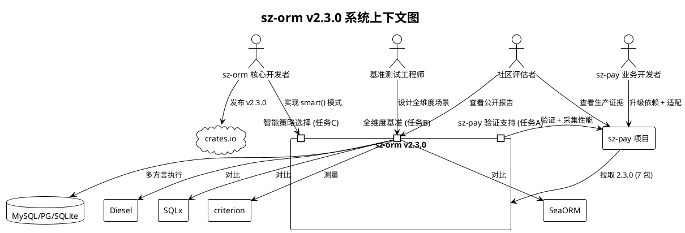

# sz-orm v2.3.0 需求规格说明书（EARS 格式）

> **版本**：v2.3.0
> **基线**：v2.2.0（代码已完成，即将发布；43 包工作空间，sz-orm-core 1.0.0 已发布 crates.io）
> **生成日期**：2026-08-07
> **文档目的**：以 EARS（Easy Approach to Requirements Syntax）格式定义 v2.3.0 三项中期目标的需求规格——任务 A（sz-pay 生产案例深化）、任务 B（性能基准完整报告）、任务 C（Eager Loading 智能策略选择），聚焦生产证据采集、竞品量化对比与智能查询优化
> **需求格式**：EARS 五种句式
> - **Ubiquitous（ ubiquitous）**：系统应当 {响应}
> - **Event-driven（事件驱动）**：当 {触发条件} 时，系统应当 {响应}
> - **State-driven（状态驱动）**：在 {状态} 期间，系统应当 {响应}
> - **Optional（可选）**：若包含 {特性}，系统应当 {响应}
> - **Unwanted（不需要）**：如果 {触发条件}，则系统应当 {响应}
> **依据**：
> - `docs/spec/v2.2.0/spec.md`（v2.2.0 需求规格基线，§1.4 已将智能策略选择与 sz-pay 深化划归 v2.3.0）
> - `packages/sz-orm-core/src/eager_loader.rs`（EagerLoader 现状：`new`/`with`/`with_cycle_policy`/`load_many`，无 smart 模式）
> - `packages/sz-orm-core/src/cycle_detection.rs`（`CyclePolicy::Error/Truncate/AllowWithDepthLimit`）
> - `bench-comparison/benches/v2_1_0_features.rs`（现有 4 场景基准：Eager Loading / Nested Save / Schema Sync / Stream API）
> - `E:\vue\test\sz-pay\server\sz-rust\Cargo.toml`（sz-pay 当前依赖 sz-orm 2.1.0，7 个包：core/sqlx/config/auth/macros/queue/scheduler）
> - `AGENTS.md`（工程化审查规范、ADR-0001、10 道门禁、审计合规铁律）

---

## 0. 现状基线与需求校准（基于源码调研）

> **重要**：本章节记录需求生成前的源码现状调研结果，用于校准需求范围，避免重复实现或基于错误前提生成需求。

### 0.1 v2.2.0 已交付能力（v2.3.0 基础）

| 能力 | 实现位置 | 状态 | v2.3.0 关系 |
|------|---------|------|------------|
| Eager Loading 多级 + 循环检测 | `eager_loader.rs`（847 行） | ✅ 已交付 | 任务 C 基础，需新增智能策略选择 |
| `EagerLoader::with()` 无限级链式 | `eager_loader.rs:156` | ✅ 已交付 | 任务 C 须保持向后兼容 |
| `CyclePolicy`（Error/Truncate/AllowWithDepthLimit） | `cycle_detection.rs:18` | ✅ 已交付 | 任务 C 智能模式须复用 |
| Partial Models（`select_only`/`select_exclude`） | core 模块 | ✅ 已交付 | 任务 A 验证对象 |
| Schema Sync 破坏性安全 | schema_sync 模块 | ✅ 已交付 | 任务 A 验证对象 |
| Stream API 背压控制 | stream 模块 | ✅ 已交付 | 任务 A 验证对象 |
| cascade_delete（RESTRICT/CASCADE/SET_NULL/SET_DEFAULT） | nested 模块 | ✅ 已交付 | 任务 A 验证对象 |
| AnyPool/UnifiedPool 五方言统一 | any_driver / pool | ✅ 已交付 | 任务 B 多方言基准基础 |

**结论**：v2.2.0 已提供多级 Eager Loading 的手动策略执行能力，但策略选择（JOIN vs data loader vs subquery）仍需开发者手动判断。任务 C 的真实缺口是"自动选择最优策略"。

### 0.2 sz-pay 试点现状

| 维度 | 现状 | 证据 |
|------|------|------|
| sz-orm 依赖版本 | 2.1.0（从 crates.io 拉取） | `Cargo.toml:26-32` |
| 使用包数量 | 7 个（core/sqlx/config/auth/macros/queue/scheduler） | `Cargo.toml:26-32` |
| 测试基线 | 5,139 测试通过（v2.2.0 基线） | 用户提供 |
| 依赖方式 | crates.io 穿透依赖（非本地 path） | `Cargo.toml:25` 注释 |
| ADR-0001 约束 | sz-pay 可修改自身代码与依赖版本，严禁修改 sz-orm 仓库 | `Cargo.toml:16` |

**结论**：sz-pay 当前停留在 2.1.0，任务 A 需先升级至 2.3.0（经 2.2.0），再验证新功能与采集性能数据。sz-pay 是下游项目，修改其代码符合 ADR-0001。

### 0.3 现有基准测试现状

| 基准文件 | 场景数 | 框架 | 对比对象 | 缺口 |
|---------|-------|------|---------|------|
| `v2_1_0_features.rs` | 4 | criterion + MockConnection | 无（仅自测） | 无竞品对比、无全维度、无多方言 |
| `orm_comparison.rs` | 待调研 | criterion | 待调研 | 待扩展 |
| `cross_db_comparison.rs` | 待调研 | criterion | 待调研 | 待扩展 |

**结论**：现有基准仅覆盖 4 场景且使用 MockConnection，无竞品（Diesel/SeaORM/SQLx）量化对比。任务 B 的真实缺口是"全维度 × 多方言 × 竞品对比"。

### 0.4 Eager Loading 策略选择现状

| 关联类型 | 当前执行策略 | 选择方式 | v2.3.0 目标 |
|---------|------------|---------|------------|
| HasOne / BelongsTo | JOIN（单条 SQL） | `EagerLoader` 内部固定 | 保持，智能模式自动选用 |
| HasMany | 双查询（主表 → WHERE IN 批量） | `load_many()` 手动调用 | 智能模式自动选用 data loader |
| ManyToMany | 双查询（中间表） | 手动配置 | 智能模式自动选用中间表批量 |
| 策略选择主体 | **开发者**（手动选择 eager/join/subquery） | — | **系统**（自动选择最优策略） |

**结论**：当前策略选择责任在开发者，任务 C 须将其转移至系统自动决策，同时保持手动 API 不变。

---

# **1. 组件定位**

## **1.1 核心职责**

本组件负责在 v2.2.0 基础上交付三项中期目标：在 sz-pay 生产项目中深化验证并采集性能证据（任务 A）、与 Diesel/SeaORM/SQLx 进行全维度量化基准对比并生成公开报告（任务 B）、为 Eager Loading 增加智能策略自动选择与 N+1 自动消除能力（任务 C），实现生产证据闭环、竞品量化对比与智能查询优化。

## **1.2 核心输入**

1. **sz-pay 业务场景请求**：sz-pay 项目（`E:\vue\test\sz-pay\server\sz-rust`）中真实业务操作（支付订单、退款、商户结算等）经 sz-orm 发起的数据库请求
2. **sz-pay 依赖版本升级指令**：将 sz-pay 的 sz-orm 依赖从 2.1.0 升级至 2.3.0 的版本变更指令
3. **基准测试维度定义**：CRUD 单条/批量、关联查询（1:1/1:N/N:M）、事务、连接池获取、分页等基准维度配置
4. **竞品基准输入**：Diesel（同步）、SeaORM（异步）、SQLx（异步底层）在相同数据集与相同维度下的执行输入
5. **智能 Eager Loading 请求**：开发者通过 `EagerLoader::smart()` 或 `SmartEagerLoader` 发起的关联加载请求，含关联元数据（HasOne/HasMany/ManyToMany）
6. **关联关系元数据**：`#[derive(Relation)]` 标注的关联类型、外键、中间表等结构信息，供智能策略决策器读取
7. **连续查询模式流**：业务代码在循环或迭代中发出的连续单条查询序列，供 N+1 自动检测器识别

## **1.3 核心输出**

1. **sz-pay 生产验证报告**：v2.3.0 新功能在 sz-pay 中的使用效果验证结果 + 真实业务性能数据（QPS、P50/P95/P99 延迟、峰值内存）
2. **sz-pay 回归测试结果**：升级至 2.3.0 后 sz-pay 全量测试通过情况（基线 5,139 测试无回归）
3. **全维度基准数据集**：sz-orm × Diesel × SeaORM × SQLx 在 CRUD/关联/事务/连接池/分页维度下的 criterion 基准测量值
4. **多方言基准数据集**：上述基准在 MySQL/PostgreSQL/SQLite（至少三方言）下的测量值
5. **公开基准报告**：Markdown 格式 + 图表数据的可公开 benchmark 报告
6. **智能加载结果**：`SmartEagerLoader` 自动选择最优策略后执行的关联加载结果（与手动 API 结果类型一致）
7. **N+1 消除报告**：自动检测并合并的连续查询模式记录（原 N 次查询 → 合并后 1 次批量查询）

## **1.4 职责边界**

本组件**不负责**以下事项：

1. **不负责**新增第 6/7 种数据库方言支持（v2.3.0 维持 MySQL/PostgreSQL/SQLite/Oracle/MSSQL 五方言）
2. **不负责**连接池底层重构（沿用 v2.2.0 的 UnifiedPool 统一抽象）
3. **不负责**修改 sz-orm 仓库以外的上游仓库（ADR-0001：sz-pay 可改，sz-orm 自身开发正常）
4. **不负责**重新实现 v2.2.0 已交付能力（多级 Eager Loading、循环检测、Schema Sync 破坏性安全、Stream 背压、cascade_delete 等仅做验证，不重写）
5. **不负责**AI 驱动的查询计划优化（智能策略基于关联类型规则决策，非机器学习模型）
6. **不负责**跨语言 FFI 绑定扩展（JS/Java/Go/PHP 绑定属独立版本线）
7. **不负责**图数据库 / WASM / 分布式查询（属 v3.0.0+ 长期目标）
8. **不负责**竞品基准的持续 CI 运行（v2.3.0 交付一次性报告，CI 集成属后续版本）

---

# **2. 领域术语**

**生产案例深化（Production Case Deepening）**
: 在真实下游业务项目（sz-pay）中验证 ORM 新功能可用性并采集性能证据的过程，包含依赖升级、功能验证、性能采集、回归测试四个环节。
: 备注：区别于单元/集成测试，生产案例深化要求真实业务场景与真实数据库。

**全维度基准（Full-dimension Benchmark）**
: 覆盖 CRUD（单条/批量）、关联查询（1:1/1:N/N:M）、事务、连接池获取、分页等全部维度的性能基准测量，与竞品在相同条件下对比。
: 备注：v2.1.0 基准仅 4 场景，v2.3.0 扩展至全维度。

**竞品量化对比（Competitor Quantitative Comparison）**
: sz-orm 与 Diesel（同步 ORM）、SeaORM（异步 ORM）、SQLx（异步底层驱动）在相同维度、相同数据集、相同硬件下的数值化性能对比。
: 备注：对比须公开可复现，含硬件配置、数据集规模、criterion 配置。

**智能策略选择（Smart Strategy Selection）**
: 系统根据关联类型（HasOne/HasMany/ManyToMany）自动选择最优查询策略（JOIN/data loader/中间表批量）的能力，无需开发者手动指定。
: 备注：v2.2.0 策略选择由开发者手动决定，v2.3.0 转移至系统自动决策。

**SmartEagerLoader（智能 Eager 加载器）**
: v2.3.0 新增的 Eager Loading 执行器，内置策略决策器，根据关联元数据自动选择 JOIN 或 data loader 策略。
: 备注：也可在现有 `EagerLoader` 上增加 `smart()` 模式实现，具体由 design.md 决定。

**N+1 自动消除（Automatic N+1 Elimination）**
: 系统自动检测业务代码在循环中发出的连续单条查询模式，将其合并为一次批量查询的能力。
: 备注：v2.2.0 已有 `N1QueryDetector` 拦截告警，v2.3.0 进一步自动合并消除。

**策略决策器（Strategy Resolver）**
: 读取关联关系元数据（类型、外键、中间表、基数估计）并输出最优执行策略的决策组件。
: 备注：决策规则为确定性规则（非 AI），可解释、可测试。

**data loader 策略（Data Loader Strategy）**
: 先执行主表查询收集主键，再用 `WHERE fk IN (?, ...)` 批量查询关联表并按外键分组组装的策略，消除 N+1。
: 备注：适用于 HasMany 关联，v2.2.0 的 `load_many()` 已实现此策略。

**JOIN 策略（JOIN Strategy）**
: 通过 SQL JOIN 在单次查询中获取主表与关联表数据的策略，适用于 HasOne/BelongsTo 关联。
: 备注：单次查询，无 N+1 风险，但结果集需拆分组装。

**基准维度（Benchmark Dimension）**
: 性能基准测量的一个独立维度，如"批量插入 1000 条"、"1:N 关联查询"、"连接池获取"等。
: 备注：全维度基准须覆盖所有列出的维度。

**回归基线（Regression Baseline）**
: 升级前已通过的测试集合（sz-pay 5,139 测试），升级后须全部继续通过，不得引入回归。
: 备注：回归测试是任务 A 的验收门槛。

---

# **3. 角色与边界**

## **3.1 核心角色**

1. **sz-orm 核心开发者**：负责实现任务 C 智能策略选择能力，扩展基准测试（任务 B），发布 v2.3.0
2. **sz-pay 业务开发者**：负责在 sz-pay 中升级 sz-orm 依赖版本、适配新 API、验证业务功能（任务 A）
3. **基准测试工程师**：负责设计全维度基准场景、配置 criterion、运行竞品对比、生成公开报告（任务 B）
4. **社区评估者**：通过公开基准报告与 sz-pay 生产证据评估 sz-orm 性能与成熟度的外部用户

## **3.2 外部系统**

1. **sz-pay 项目**：下游生产项目，任务 A 的验证载体，使用 sz-orm 7 个包，可修改自身代码与依赖版本
2. **Diesel**：同步 Rust ORM，任务 B 竞品对比对象
3. **SeaORM**：异步 Rust ORM，任务 B 竞品对比对象，任务 C 智能策略的参考标杆（Smart EntityLoader）
4. **SQLx**：异步 Rust 数据库驱动，任务 B 竞品对比对象（底层基准线）
5. **criterion**：Rust 基准测试框架，任务 B 测量工具
6. **MySQL/PostgreSQL/SQLite**：任务 B 多方言基准的数据库实例，任务 A 生产验证的数据库
7. **crates.io**：sz-orm 发布渠道，v2.3.0 须发布至 crates.io 供 sz-pay 拉取

## **3.3 交互上下文**



---

# **4. DFX约束**

## **4.1 性能**

| 约束 ID | 约束内容 |
|---------|---------|
| DFX-PERF-001 | 智能策略选择的决策开销不得超过 100 微秒（策略决策器为纯内存规则匹配，不涉及 DB 查询） |
| DFX-PERF-002 | HasOne 智能 JOIN 策略的查询次数须为 1 次（与手动 JOIN 一致） |
| DFX-PERF-003 | HasMany 智能 data loader 策略的查询次数须为 2 次（主表 + 批量关联，与手动 `load_many()` 一致） |
| DFX-PERF-004 | N+1 自动消除后，N 次连续单条查询须合并为 1 次批量查询，查询次数从 N 降为 1 |
| DFX-PERF-005 | 全维度基准须在数据集规模 10/100/1000/10000 四档下测量，记录吞吐量与延迟 |
| DFX-PERF-006 | sz-pay 生产性能数据须包含 QPS、P50/P95/P99 延迟、峰值内存三项指标 |

## **4.2 可靠性**

| 约束 ID | 约束内容 |
|---------|---------|
| DFX-REL-001 | sz-pay 升级至 v2.3.0 后，5,139 基线测试须 100% 通过，零回归 |
| DFX-REL-002 | 智能策略选择不得改变 v2.2.0 已有 Eager Loading 的结果正确性（智能模式与手动模式结果等价） |
| DFX-REL-003 | N+1 自动消除不得改变查询结果的正确性与完整性（合并前后结果集一致） |
| DFX-REL-004 | 基准测试须可重复运行，相同硬件相同数据集下测量值波动不超过 15% |

## **4.3 安全性**

| 约束 ID | 约束内容 |
|---------|---------|
| DFX-SEC-001 | 智能策略选择生成的所有 SQL 须遵守参数化查询约束（WHERE 条件必须参数化，禁止字符串拼接） |
| DFX-SEC-002 | 智能策略选择生成的 SQL 须遵守禁止 `SELECT *` 约束（须显式列名或经 Partial Models 投影） |
| DFX-SEC-003 | 基准报告中不得泄露数据库连接凭据（DSN 须脱敏处理） |
| DFX-SEC-004 | sz-pay 性能数据采集不得记录敏感业务数据（须脱敏或仅记录聚合指标） |

## **4.4 可维护性**

| 约束 ID | 约束内容 |
|---------|---------|
| DFX-MAINT-001 | 智能策略决策器的决策规则须可解释、可日志输出（记录"关联 X 选用策略 Y 原因 Z"） |
| DFX-MAINT-002 | 基准测试代码须模块化组织，新增维度或竞品无须修改现有基准代码（开闭原则） |
| DFX-MAINT-003 | 公开基准报告须包含硬件配置、Rust 版本、数据库版本、数据集规模，确保可复现 |
| DFX-MAINT-004 | 所有新增代码须通过 10 道门禁（fmt/check/clippy/test/doc/audit/integration/占位检查/SQL注入/Feature全组合） |

## **4.5 兼容性**

| 约束 ID | 约束内容 |
|---------|---------|
| DFX-COMPAT-001 | v2.3.0 须保持 API 向后兼容：v2.2.0 的 `EagerLoader::new()`/`with()`/`with_cycle_policy()`/`load_many()` 签名与行为不变 |
| DFX-COMPAT-002 | v2.3.0 须保持 API 向后兼容：v2.2.0 的 `eager_load_all()` 自由函数签名与行为不变 |
| DFX-COMPAT-003 | 智能策略选择以扩展方法提供（`smart()` 或 `SmartEagerLoader`），不修改已有方法签名 |
| DFX-COMPAT-004 | sz-pay 升级路径须支持 2.1.0 → 2.3.0（经 2.2.0 中间版本），无 Breaking Change 阻断 |
| DFX-COMPAT-005 | 基准测试须兼容 MySQL/PostgreSQL/SQLite 三方言（Oracle/MSSQL 为尽力覆盖） |

---

# **5. 核心能力（EARS 需求）**

## **5.1 任务 A：sz-pay 生产案例深化**

### **5.1.1 依赖升级与兼容验证（A-DEP）**

**REQ-A-001**（Ubiquitous）
: 系统应当提供 sz-orm v2.3.0 的 crates.io 发布物，使 sz-pay 能够通过 `sz-orm-core = "2.3.0"` 等 7 个包的版本声明拉取依赖。
: 验收条件：[crates.io 存在 sz-orm-core 2.3.0] → [sz-pay Cargo.toml 可声明 2.3.0 且 cargo build 成功]

**REQ-A-002**（Event-driven）
: 当 sz-pay 将 sz-orm 依赖从 2.1.0 升级至 2.3.0 时，系统应当保持 7 个包（core/sqlx/config/auth/macros/queue/scheduler）的 API 兼容，无须修改 sz-pay 现有业务代码即可编译通过。
: 验收条件：[sz-pay Cargo.toml 版本声明改为 2.3.0] → [cargo build --workspace 零编译错误（仅允许 deprecation warning）]

**REQ-A-003**（Unwanted）
: 如果升级至 2.3.0 引入编译错误或运行时回归，则系统应当提供降级回 2.1.0 的回滚路径，并记录阻断原因。
: 验收条件：[升级后 build/test 失败] → [回滚至 2.1.0 恢复基线 + 生成阻断报告含失败用例与原因]

**REQ-A-004**（State-driven）
: 在 sz-pay 依赖升级至 2.3.0 且编译通过期间，系统应当运行 sz-pay 全量测试套件，确认 5,139 基线测试 100% 通过。
: 验收条件：[升级后 cargo test --workspace 完成] → [通过数 ≥ 5,139 且失败数 = 0]

### **5.1.2 新功能生产验证（A-VERIFY）**

**REQ-A-005**（Event-driven）
: 当 sz-pay 业务代码调用 v2.2.0+ 的多级 Eager Loading（`EagerLoader::with().with()`）时，系统应当在 sz-pay 真实业务场景（如商户 → 订单 → 订单明细 → 商品）中正确返回多级嵌套结果。
: 验收条件：[sz-pay 调用多级 Eager Loading 查询商户订单链] → [返回嵌套结构与逐级手动查询结果一致]

**REQ-A-006**（Event-driven）
: 当 sz-pay 业务代码调用 v2.2.0+ 的 Schema Sync 破坏性变更（`destructive_sync()`）时，系统应当在 sz-pay 迁移场景中正确执行列重命名检测与数据迁移钩子。
: 验收条件：[sz-pay 执行 destructive_sync 含列重命名] → [检测到重命名 + 执行迁移钩子 + 数据不丢失]

**REQ-A-007**（Event-driven）
: 当 sz-pay 业务代码调用 v2.2.0+ 的 Stream API 背压控制（`stream_with_backpressure(buffer_size)`）时，系统应当在 sz-pay 大结果集导出场景中正确提供有界流式迭代。
: 验收条件：[sz-pay 流式导出 10 万行订单] → [内存占用稳定在 buffer_size 量级，不随结果集增长]

**REQ-A-008**（Event-driven）
: 当 sz-pay 业务代码使用 v2.2.0+ 的 cascade_delete 策略（RESTRICT/CASCADE/SET_NULL/SET_DEFAULT）时，系统应当在 sz-pay 订单删除场景中按配置策略正确级联。
: 验收条件：[sz-pay 删除订单 + 配置 SET_NULL 级联] → [订单明细外键置 NULL，明细行不删除]

**REQ-A-009**（Event-driven）
: 当 sz-pay 业务代码使用 v2.2.0+ 的 Partial Models（`select_only()`/`select_exclude()`）时，系统应当在 sz-pay 列表查询场景中正确返回部分字段实体。
: 验收条件：[sz-pay 查询订单列表 select_exclude("敏感字段")] → [返回实体不含敏感字段 + SQL 未查询该列]

**REQ-A-010**（Optional）
: 若包含 v2.3.0 的智能 Eager Loading（任务 C 交付），系统应当在 sz-pay 关联查询场景中验证 `smart()` 模式的可用性与正确性。
: 验收条件：[任务 C 交付 + sz-pay 调用 smart() 模式] → [结果与手动 Eager Loading 一致 + 策略日志可查]

### **5.1.3 性能数据采集（A-PERF）**

**REQ-A-011**（Event-driven）
: 当 sz-pay 在 v2.3.0 下运行真实业务负载时，系统应当采集 QPS（每秒查询数）指标，覆盖支付下单、订单查询、商户结算等核心场景。
: 验收条件：[sz-pay 运行业务负载] → [输出各场景 QPS 数值，含均值与峰值]

**REQ-A-012**（Event-driven）
: 当 sz-pay 在 v2.3.0 下运行真实业务负载时，系统应当采集延迟分位数指标（P50/P95/P99），覆盖核心数据库操作场景。
: 验收条件：[sz-pay 运行业务负载] → [输出各场景 P50/P95/P99 延迟，单位毫秒]

**REQ-A-013**（Event-driven）
: 当 sz-pay 在 v2.3.0 下运行真实业务负载时，系统应当采集峰值内存占用指标，反映连接池与查询执行的内存效率。
: 验收条件：[sz-pay 运行业务负载] → [输出峰值内存（MB），含连接池占用与查询缓冲占用]

**REQ-A-014**（State-driven）
: 在 sz-pay 性能数据采集期间，系统应当提供 v2.1.0 基线与 v2.3.0 的对比数据，量化版本升级的性能影响。
: 验收条件：[采集 v2.1.0 与 v2.3.0 两组性能数据] → [输出对比表，标注提升/持平/退化项]

**REQ-A-015**（Unwanted）
: 如果性能数据采集过程影响 sz-pay 生产服务可用性，则系统应当仅在测试环境或低峰期执行采集，且采集完成后释放所有测试进程与临时文件。
: 验收条件：[采集导致生产服务受影响] → [切换至测试环境 + 采集后清理临时文件与进程]

### **5.1.4 测试基线维护（A-TEST）**

**REQ-A-016**（Ubiquitous）
: 系统应当维护 sz-pay 测试基线文档，记录 v2.1.0 基线（5,139 测试）与 v2.3.0 升级后测试通过数的对比。
: 验收条件：[升级完成] → [基线文档含 v2.1.0 通过数、v2.3.0 通过数、差值、回归项清单]

**REQ-A-017**（Event-driven）
: 当 sz-pay 升级至 v2.3.0 后新增测试用例时，系统应当将新增用例纳入基线，更新测试基线文档。
: 验收条件：[v2.3.0 新增 N 个测试用例且全部通过] → [基线更新为 5,139 + N，文档同步更新]

**REQ-A-018**（Unwanted）
: 如果 sz-pay 升级后出现测试失败，则系统应当逐项定位失败原因，区分"sz-orm 回归"与"sz-pay 自身问题"，并提供 file:line 证据。
: 验收条件：[测试失败] → [失败报告含分类、原因、file:line 证据、修复建议]

---

## **5.2 任务 B：性能基准完整报告**

### **5.2.1 基准维度扩展（B-BENCH）**

**REQ-B-001**（Ubiquitous）
: 系统应当提供全维度基准测试套件，覆盖 CRUD 单条操作（单条插入、单条查询、单条更新、单条删除）。
: 验收条件：[运行基准套件] → [输出 CRUD 单条四操作的 criterion 测量值]

**REQ-B-002**（Ubiquitous）
: 系统应当提供全维度基准测试套件，覆盖 CRUD 批量操作（批量插入 10/100/1000/10000 条、批量查询、批量更新、批量删除）。
: 验收条件：[运行基准套件] → [输出 CRUD 批量四操作在四档规模下的测量值]

**REQ-B-003**（Ubiquitous）
: 系统应当提供全维度基准测试套件，覆盖关联查询三种类型（1:1 HasOne、1:N HasMany、N:M ManyToMany）。
: 验收条件：[运行基准套件] → [输出三种关联类型的查询测量值]

**REQ-B-004**（Ubiquitous）
: 系统应当提供全维度基准测试套件，覆盖事务操作（单事务提交、多语句事务、事务回滚、嵌套事务/savepoint）。
: 验收条件：[运行基准套件] → [输出四类事务操作的测量值]

**REQ-B-005**（Ubiquitous）
: 系统应当提供全维度基准测试套件，覆盖连接池获取操作（空闲池获取、池满等待、并发竞争获取）。
: 验收条件：[运行基准套件] → [输出三类连接池获取的测量值]

**REQ-B-006**（Ubiquitous）
: 系统应当提供全维度基准测试套件，覆盖分页查询操作（OFFSET/LIMIT 分页、游标分页）。
: 验收条件：[运行基准套件] → [输出两类分页查询的测量值]

**REQ-B-007**（State-driven）
: 在基准测试运行期间，系统应当使用 criterion 框架进行统计采样，输出均值、中位数、标准差、置信区间。
: 验收条件：[基准运行完成] → [criterion 报告含均值/中位数/StdDev/置信区间]

### **5.2.2 竞品对比（B-COMPARE）**

**REQ-B-008**（Ubiquitous）
: 系统应当提供 sz-orm 与 Diesel（同步 ORM）的全维度对比基准，在相同数据集、相同维度下测量两者性能。
: 验收条件：[运行竞品基准] → [输出 sz-orm vs Diesel 在全维度的对比数据表]

**REQ-B-009**（Ubiquitous）
: 系统应当提供 sz-orm 与 SeaORM（异步 ORM）的全维度对比基准，在相同数据集、相同维度下测量两者性能。
: 验收条件：[运行竞品基准] → [输出 sz-orm vs SeaORM 在全维度的对比数据表]

**REQ-B-010**（Ubiquitous）
: 系统应当提供 sz-orm 与 SQLx（异步底层驱动）的全维度对比基准，在相同数据集、相同维度下测量两者性能，作为底层基准线。
: 验收条件：[运行竞品基准] → [输出 sz-orm vs SQLx 在全维度的对比数据表]

**REQ-B-011**（Event-driven）
: 当竞品在某个维度不支持某操作时（如 SQLx 不支持 ORM 级关联查询），系统应当标注"不适用"而非跳过，保持对比矩阵完整。
: 验收条件：[竞品不支持某维度] → [对比矩阵该格标注"N/A（原因）"，非空缺]

**REQ-B-012**（Unwanted）
: 如果竞品基准因竞品 API 差异无法完全对等，则系统应当在报告中明确标注差异点（如 Diesel 同步 vs sz-orm 异步的运行时开销），不得隐瞒条件差异。
: 验收条件：[存在条件差异] → [报告"差异说明"章节列明所有非对等因素]

### **5.2.3 多方言覆盖（B-DIALECT）**

**REQ-B-013**（Ubiquitous）
: 系统应当在 MySQL 数据库上运行全维度竞品基准，输出 MySQL 方言下的完整对比数据。
: 验收条件：[基准在 MySQL 运行] → [输出 MySQL 方言 sz-orm/Diesel/SeaORM/SQLx 全维度数据]

**REQ-B-014**（Ubiquitous）
: 系统应当在 PostgreSQL 数据库上运行全维度竞品基准，输出 PostgreSQL 方言下的完整对比数据。
: 验收条件：[基准在 PostgreSQL 运行] → [输出 PostgreSQL 方言全维度数据]

**REQ-B-015**（Ubiquitous）
: 系统应当在 SQLite 数据库上运行全维度竞品基准，输出 SQLite 方言下的完整对比数据。
: 验收条件：[基准在 SQLite 运行] → [输出 SQLite 方言全维度数据]

**REQ-B-016**（Optional）
: 若包含 Oracle/MSSQL 方言基准，系统应当尽力覆盖，但因竞品（Diesel/SeaORM）对 Oracle/MSSQL 支持有限，可标注"部分覆盖"。
: 验收条件：[Oracle/MSSQL 基准运行] → [已覆盖维度输出数据，未覆盖维度标注原因]

**REQ-B-017**（Event-driven）
: 当同一维度在不同方言下性能差异显著时，系统应当在报告中标注方言差异原因（如 SQLite 无网络开销、PostgreSQL MVCC 特性等）。
: 验收条件：[同维度跨方言差异 > 2 倍] → [报告标注差异原因]

### **5.2.4 报告生成与公开（B-REPORT）**

**REQ-B-018**（Ubiquitous）
: 系统应当生成 Markdown 格式的公开基准报告，包含全维度 × 多方言 × 竞品对比的完整数据表。
: 验收条件：[基准运行完成] → [生成 benchmark-report.md 含所有维度数据表]

**REQ-B-019**（Ubiquitous）
: 系统应当生成图表数据（CSV 或 JSON），供后续可视化工具渲染对比图表。
: 验收条件：[基准运行完成] → [生成 benchmark-data.csv/json 含结构化测量数据]

**REQ-B-020**（Ubiquitous）
: 系统应当在公开报告中包含环境元数据：硬件配置（CPU/内存/磁盘）、Rust 版本、数据库版本、criterion 配置、数据集规模。
: 验收条件：[查看报告] → [环境元数据章节完整，可复现基准]

**REQ-B-021**（Unwanted）
: 如果公开报告包含数据库连接字符串或敏感配置，则系统应当对 DSN 进行脱敏处理（替换密码为 `***`）。
: 验收条件：[报告含 DSN] → [DSN 密码字段显示为 `***`，不含明文凭据]

**REQ-B-022**（Event-driven）
: 当基准报告生成完成后，系统应当提供复现指令（如 `cargo bench --bench full_comparison`），使第三方可独立复现测量结果。
: 验收条件：[报告生成完成] → [报告含"复现步骤"章节，含完整命令序列]

**REQ-B-023**（State-driven）
: 在基准报告公开前，系统应当对报告进行内部审查，确认数据无异常值（如 0 延迟、负吞吐量）、无遗漏维度。
: 验收条件：[报告审查通过] → [无异常值 + 全维度覆盖 + 签字确认]

---

## **5.3 任务 C：Eager Loading 智能策略选择**

### **5.3.1 智能模式启用（C-SMART）**

**REQ-C-001**（Ubiquitous）
: 系统应当提供智能 Eager Loading 启用方式，使开发者可通过 `EagerLoader::smart()` 方法或 `SmartEagerLoader::new()` 构造器启用智能策略选择模式。
: 验收条件：[调用 smart() 或 SmartEagerLoader::new()] → [返回启用智能模式的加载器实例]

**REQ-C-002**（Event-driven）
: 当智能模式启用且开发者调用 `with()` 添加关联时，系统应当读取关联关系元数据（关联类型、外键、中间表），供策略决策器使用。
: 验收条件：[smart().with(relation)] → [加载器内部存储 relation 的 RelationKind 元数据]

**REQ-C-003**（Ubiquitous）
: 系统应当提供策略决策器，根据关联类型（HasOne/HasMany/ManyToMany/BelongsTo）自动选择最优执行策略，决策过程为确定性规则（非 AI）。
: 验收条件：[输入关联元数据] → [输出确定的策略（JOIN/data_loader/中间表批量），相同输入相同输出]

**REQ-C-004**（State-driven）
: 在智能策略决策期间，系统应当将决策过程记录为可读日志（"关联 X 类型 HasOne 选用 JOIN 策略 原因：单条关联最优单次查询"），供调试与审计。
: 验收条件：[启用策略日志] → [日志含关联名、类型、选用策略、决策原因]

**REQ-C-005**（Unwanted）
: 如果策略决策器遇到无法识别的关联类型或元数据缺失，则系统应当回退至默认策略（HasMany → data loader）并发出告警日志，不得 panic。
: 验收条件：[关联类型未知] → [回退默认策略 + 告警日志 + 不 panic]

### **5.3.2 HasOne 自动 JOIN（C-HASONE）**

**REQ-C-006**（Event-driven）
: 当智能模式处理 HasOne 关联（如 User → Profile，1:1）时，系统应当自动选择 JOIN 策略，生成单条含 JOIN 的 SQL，在单次查询中获取主表与关联表数据。
: 验收条件：[smart 模式加载 HasOne 关联] → [生成 1 条 JOIN SQL + 执行 1 次查询 + 返回组装结果]

**REQ-C-007**（Event-driven）
: 当智能模式处理 BelongsTo 关联（如 OrderItem → Order，N:1）时，系统应当自动选择 JOIN 策略，生成单条含 JOIN 的 SQL。
: 验收条件：[smart 模式加载 BelongsTo 关联] → [生成 1 条 JOIN SQL + 执行 1 次查询]

**REQ-C-008**（Unwanted）
: 如果 HasOne 自动 JOIN 生成的 SQL 在目标方言下不支持（如某些方言的 JOIN 限制），则系统应当回退至 data loader 策略并记录回退原因。
: 验收条件：[方言不支持 JOIN] → [回退 data loader + 记录回退原因日志]

**REQ-C-009**（State-driven）
: 在 HasOne 自动 JOIN 结果组装期间，系统应当正确拆分 JOIN 结果集，将扁平行还原为 (主表实体, 关联实体) 结构。
: 验收条件：[JOIN 结果集含主表与关联表列] → [正确拆分为嵌套结构，无数据串行]

### **5.3.3 HasMany 自动 data loader（C-HASMANY）**

**REQ-C-010**（Event-driven）
: 当智能模式处理 HasMany 关联（如 User → Orders，1:N）时，系统应当自动选择 data loader 策略：先执行主表查询收集主键，再用 `WHERE fk IN (?, ...)` 批量查询关联表并按外键分组组装。
: 验收条件：[smart 模式加载 HasMany 关联] → [执行 2 次查询（主表 + 批量 IN）+ 按外键分组组装]

**REQ-C-011**（Event-driven）
: 当 HasMany 关联的外键值列表超过 Oracle IN 列表上限（1000）时，系统应当自动分批执行批量查询。
: 验收条件：[主键数 > 1000 且方言为 Oracle] → [自动分批查询，每批 ≤ 1000]

**REQ-C-012**（State-driven）
: 在 HasMany data loader 分组组装期间，系统应当正确按外键值将关联行分配至对应主表行，无遗漏无错配。
: 验收条件：[批量查询返回 N 行关联数据] → [按外键分组后每主表行获得其对应关联行集合]

**REQ-C-013**（Unwanted）
: 如果主表查询结果为空，则系统应当跳过关联表批量查询，直接返回空结果，不执行无意义的 IN 查询。
: 验收条件：[主表查询返回 0 行] → [不执行关联查询 + 返回空 Vec]

### **5.3.4 ManyToMany 自动中间表查询（C-M2M）**

**REQ-C-014**（Event-driven）
: 当智能模式处理 ManyToMany 关联（如 User ↔ Role，经 user_roles 中间表）时，系统应当自动选择中间表批量查询策略：先查主表主键，再经中间表 JOIN 关联表批量查询，按主键分组组装。
: 验收条件：[smart 模式加载 M2M 关联] → [经中间表批量查询 + 按主键分组组装为 (主实体, Vec<关联实体>)]

**REQ-C-015**（Event-driven）
: 当 ManyToMany 关联的中间表元数据缺失时，系统应当返回明确错误，指示需配置中间表信息。
: 验收条件：[M2M 关联未配置中间表] → [返回 DbError 含"ManyToMany 关联 X 缺少中间表配置"]

**REQ-C-016**（State-driven）
: 在 ManyToMany 结果组装期间，系统应当正确经中间表映射将关联行分配至对应主表行，处理同一关联被多个主表行引用的情况。
: 验收条件：[中间表含多对多映射] → [每个主表行获得其全部关联实体，无重复无遗漏]

### **5.3.5 N+1 自动消除（C-NPLUS）**

**REQ-C-017**（Event-driven）
: 当系统检测到业务代码在循环中发出连续单条相同模式查询（如循环内 `find_by_id`）时，系统应当自动识别 N+1 模式并合并为一次批量查询。
: 验收条件：[循环内 N 次 find_by_id] → [自动合并为 1 次 WHERE id IN (?,...) 批量查询]

**REQ-C-018**（State-driven）
: 在 N+1 自动消除期间，系统应当保持合并前后结果集的等价性（相同主键集合返回相同实体集合，顺序一致或可配置）。
: 验收条件：[N 次单查结果 vs 1 次批量结果] → [实体集合等价]

**REQ-C-019**（Event-driven）
: 当 N+1 检测器识别到连续查询模式时，系统应当记录消除报告（原查询次数 N、合并后次数 1、节省次数 N-1、触发位置 file:line）。
: 验收条件：[N+1 模式被消除] → [输出消除报告含原次数/合并后次数/节省/位置]

**REQ-C-020**（Optional）
: 若包含 N+1 自动消除的阈值配置，系统应当允许开发者配置触发阈值（如连续查询数 ≥ 5 时触发合并），低于阈值不合并以避免过度优化。
: 验收条件：[配置阈值 5 + 连续查询 3 次] → [不触发合并]；[配置阈值 5 + 连续查询 6 次] → [触发合并]

**REQ-C-021**（Unwanted）
: 如果 N+1 自动消除改变了查询语义（如单条查询含独立事务，合并后事务边界变化），则系统应当跳过合并并保留原始逐条执行，发出告警。
: 验收条件：[连续查询含独立事务] → [不合并 + 告警"事务边界不兼容，跳过 N+1 消除"]

**REQ-C-022**（Unwanted）
: 如果 N+1 自动消除导致查询结果与原始结果不等价，则系统应当立即回退至原始逐条执行并发出错误告警，不得返回错误结果。
: 验收条件：[合并后结果不等价] → [回退逐条执行 + 错误告警 + 返回正确结果]

### **5.3.6 向后兼容（C-COMPAT）**

**REQ-C-023**（Ubiquitous）
: 系统应当保持 v2.2.0 的 `EagerLoader::new(relation)` 构造器签名与行为不变，未调用 `smart()` 时沿用原有手动策略。
: 验收条件：[v2.2.0 代码使用 EagerLoader::new().with().load_many()] → [v2.3.0 行为与 v2.2.0 完全一致]

**REQ-C-024**（Ubiquitous）
: 系统应当保持 v2.2.0 的 `eager_load_all()` 自由函数签名与行为不变。
: 验收条件：[v2.2.0 代码调用 eager_load_all()] → [v2.3.0 结果与 v2.2.0 一致]

**REQ-C-025**（Ubiquitous）
: 系统应当保持 v2.2.0 的 `CyclePolicy`（Error/Truncate/AllowWithDepthLimit）在智能模式下仍然生效，智能模式不绕过循环检测。
: 验收条件：[smart 模式 + CyclePolicy::Error + 检测到循环] → [返回循环错误，与手动模式一致]

**REQ-C-026**（Ubiquitous）
: 系统应当保持 v2.2.0 的 `NestedEagerResult`（Leaf/Node）结果类型在智能模式下复用，智能模式返回相同类型的结果树。
: 验收条件：[smart 模式多级加载] → [返回 NestedEagerResult 树，结构与手动模式一致]

**REQ-C-027**（Event-driven）
: 当智能模式处理多级关联（`smart().with().with()`）时，系统应当对每一级独立应用智能策略选择，允许不同级使用不同策略（如 L1 用 JOIN，L2 用 data loader）。
: 验收条件：[smart 多级加载 User→Order→OrderItem] → [L1 HasMany 用 data loader，L2 HasMany 用 data loader，逐级独立决策]

**REQ-C-028**（Unwanted）
: 如果智能策略选择导致查询次数多于手动最优策略，则系统应当在日志中标注"次优策略"警告，供开发者评估是否手动指定。
: 验收条件：[智能策略查询次数 > 手动最优] → [日志警告"次优策略，建议手动指定"]

---

# **6. 非功能性需求**

## **6.1 性能需求（NF-PERF）**

**REQ-NF-PERF-001**（Ubiquitous）
: 系统应当确保智能策略决策器的决策延迟不超过 100 微秒，不成为查询执行的性能瓶颈。
: 验收条件：[策略决策 10000 次] → [平均决策延迟 ≤ 100μs]

**REQ-NF-PERF-002**（Ubiquitous）
: 系统应当确保智能模式生成的 SQL 执行性能不低于对应手动策略的 95%（允许智能决策的开销不超过 5%）。
: 验收条件：[智能模式 vs 手动模式相同查询] → [智能模式耗时 ≤ 手动模式 × 1.05]

**REQ-NF-PERF-003**（Ubiquitous）
: 系统应当确保 N+1 自动消除后查询总耗时显著低于消除前（批量查询 vs N 次单查，耗时降幅 ≥ 50% 当 N ≥ 10）。
: 验收条件：[N=10 连续单查 vs 1 次批量] → [批量耗时 ≤ 单查总耗时 × 0.5]

**REQ-NF-PERF-004**（Ubiquitous）
: 系统应当确保基准测试套件在数据集规模 10000 下单维度运行时间不超过 60 秒，全套件运行时间不超过 30 分钟。
: 验收条件：[运行全套件] → [总耗时 ≤ 30 分钟]

## **6.2 安全需求（NF-SEC）**

**REQ-NF-SEC-001**（Ubiquitous）
: 系统应当确保智能策略选择生成的所有 SQL WHERE 条件使用参数化占位符（`?` 或 `$N`），禁止字符串拼接。
: 验收条件：[审查智能模式生成 SQL] → [所有 WHERE 条件为参数化占位符，无拼接]

**REQ-NF-SEC-002**（Ubiquitous）
: 系统应当确保智能策略选择生成的 SQL 不含 `SELECT *`，须显式列名或经 Partial Models 投影。
: 验收条件：[审查智能模式生成 SQL] → [无 SELECT *，列名显式]

**REQ-NF-SEC-003**（Ubiquitous）
: 系统应当确保 N+1 自动消除合并后的批量查询同样遵守参数化与禁止 SELECT * 约束。
: 验收条件：[N+1 消除后批量 SQL] → [参数化 + 无 SELECT *]

**REQ-NF-SEC-004**（Ubiquitous）
: 系统应当确保基准报告与 sz-pay 性能数据中所有 DSN 密码脱敏，不泄露数据库凭据。
: 验收条件：[审查报告/性能数据] → [DSN 密码显示 `***`]

## **6.3 兼容性需求（NF-COMPAT）**

**REQ-NF-COMPAT-001**（Ubiquitous）
: 系统应当保持 v2.2.0 所有公开 API 的向后兼容，v2.3.0 仅新增 API 不修改不删除已有 API。
: 验收条件：[v2.2.0 代码在 v2.3.0 编译] → [零编译错误（仅允许 deprecation warning）]

**REQ-NF-COMPAT-002**（Ubiquitous）
: 系统应当确保智能策略选择在 MySQL/PostgreSQL/SQLite/Oracle/MSSQL 五方言下均可运行，策略选择逻辑与方言无关（方言仅影响 SQL 生成）。
: 验收条件：[smart 模式在五方言运行] → [五方言均正确返回结果，策略决策一致]

**REQ-NF-COMPAT-003**（Ubiquitous）
: 系统应当确保基准测试在 MySQL/PostgreSQL/SQLite 三方言下完整运行，Oracle/MSSQL 尽力覆盖。
: 验收条件：[基准在三方言运行] → [三方言完整数据，Oracle/MSSQL 标注覆盖程度]

**REQ-NF-COMPAT-004**（Ubiquitous）
: 系统应当确保 sz-pay 从 2.1.0 升级至 2.3.0 的路径无 Breaking Change 阻断，可经 2.2.0 中间版本平滑升级。
: 验收条件：[2.1.0 → 2.2.0 → 2.3.0 逐步升级] → [每步零编译错误]

## **6.4 可测试性需求（NF-TEST）**

**REQ-NF-TEST-001**（Ubiquitous）
: 系统应当为智能策略决策器提供单元测试，覆盖 HasOne/HasMany/ManyToMany/BelongsTo 四种关联类型的策略选择。
: 验收条件：[运行策略决策器单元测试] → [四种关联类型策略选择均正确]

**REQ-NF-TEST-002**（Ubiquitous）
: 系统应当为 N+1 自动消除提供集成测试，覆盖循环单查、阈值触发、事务边界跳过、结果等价性验证场景。
: 验收条件：[运行 N+1 消除集成测试] → [所有场景行为符合预期]

**REQ-NF-TEST-003**（Ubiquitous）
: 系统应当为智能模式与手动模式的结果等价性提供差分测试，相同关联配置下两种模式结果须一致。
: 验收条件：[差分测试 smart vs manual] → [结果等价，无差异]

**REQ-NF-TEST-004**（Ubiquitous）
: 系统应当为基准测试提供 MockConnection 与真实数据库两种模式，Mock 用于 CI 快速验证，真实 DB 用于最终测量。
: 验收条件：[基准以 Mock 运行] → [快速完成，验证逻辑]；[基准以真实 DB 运行] → [输出真实测量值]

**REQ-NF-TEST-005**（Ubiquitous）
: 系统应当确保所有新增代码无 `todo!`/`unimplemented!`/`unreachable!` 占位实现。
: 验收条件：[扫描新增代码] → [零占位实现]

**REQ-NF-TEST-006**（Ubiquitous）
: 系统应当确保所有新增代码无 `unsafe` 块（unsafe 零容忍，除非有 `// SAFETY:` 注释且经审查）。
: 验收条件：[扫描新增代码] → [零 unsafe 或每处有 SAFETY 注释]

## **6.5 可维护性需求（NF-MAINT）**

**REQ-NF-MAINT-001**（Ubiquitous）
: 系统应当为智能策略决策器提供可读的决策日志，记录每次决策的关联名、类型、选用策略、原因。
: 验收条件：[启用日志 + 运行智能加载] → [日志含决策四要素]

**REQ-NF-MAINT-002**（Ubiquitous）
: 系统应当将基准测试代码模块化组织，新增维度或竞品只须新增模块文件，不修改已有基准代码。
: 验收条件：[新增基准维度] → [仅新增文件，不修改已有文件]

**REQ-NF-MAINT-003**（Ubiquitous）
: 系统应当确保所有新增代码通过 clippy 严格检查（`cargo clippy -- -D warnings`），零警告。
: 验收条件：[运行 clippy] → [零警告]

**REQ-NF-MAINT-004**（Ubiquitous）
: 系统应当为 v2.3.0 新增 API 提供 rustdoc 文档注释，含用法示例（```ignore 代码块）。
: 验收条件：[cargo doc --workspace] → [新增 API 有文档 + 示例]

**REQ-NF-MAINT-005**（Ubiquitous）
: 系统应当确保 sz-pay 性能数据采集后清理所有临时文件与测试进程，不残留资源。
: 验收条件：[采集完成] → [临时文件删除 + 测试进程释放]

---

# **7. 约束条件**

## **7.1 五方言覆盖（CON-DIALECT）**

**REQ-CON-DIALECT-001**（Ubiquitous）
: 系统应当确保智能策略选择在 MySQL/PostgreSQL/SQLite/Oracle/MSSQL 五方言下均可正确运行，策略决策与方言无关。
: 验收条件：[smart 模式五方言测试] → [五方言结果正确且一致]

**REQ-CON-DIALECT-002**（Ubiquitous）
: 系统应当确保基准测试至少覆盖 MySQL/PostgreSQL/SQLite 三方言，Oracle/MSSQL 尽力覆盖并标注程度。
: 验收条件：[基准运行] → [三方言完整 + Oracle/MSSQL 标注]

## **7.2 API 向后兼容（CON-COMPAT）**

**REQ-CON-COMPAT-001**（Ubiquitous）
: 系统应当保持 v2.2.0 公开 API 100% 向后兼容，v2.3.0 仅以扩展方法新增能力。
: 验收条件：[v2.2.0 API 签名对比 v2.3.0] → [无修改无删除，仅新增]

**REQ-CON-COMPAT-002**（Unwanted）
: 如果 v2.3.0 必须引入 Breaking Change（经架构评审批准），则系统应当在 CHANGELOG 中显著标注并提供迁移指南。
: 验收条件：[引入 Breaking Change] → [CHANGELOG 标注 + 迁移指南提供]

## **7.3 unsafe 零容忍（CON-UNSAFE）**

**REQ-CON-UNSAFE-001**（Ubiquitous）
: 系统应当确保 v2.3.0 新增代码不含 `unsafe` 块，除非每处 `unsafe` 有 `// SAFETY:` 注释说明安全不变式且经五维审查。
: 验收条件：[扫描新增代码 unsafe] → [零 unsafe 或每处有 SAFETY 注释 + 审查记录]

## **7.4 禁止占位实现（CON-NOPLACEHOLDER）**

**REQ-CON-NOPLACEHOLDER-001**（Ubiquitous）
: 系统应当确保 v2.3.0 新增代码不含 `todo!`/`unimplemented!`/`unreachable!` 占位宏。
: 验收条件：[grep 新增代码] → [零占位宏]

## **7.5 参数化查询（CON-PARAMQUERY）**

**REQ-CON-PARAMQUERY-001**（Ubiquitous）
: 系统应当确保智能策略选择与 N+1 自动消除生成的所有 SQL WHERE 条件使用参数化占位符，禁止字符串拼接。
: 验收条件：[SQL 注入扫描新增 SQL] → [全部参数化，零拼接]

**REQ-CON-PARAMQUERY-002**（Ubiquitous）
: 系统应当确保智能策略选择生成的 SQL 不含 `SELECT *`，须显式列名或 Partial Models 投影。
: 验收条件：[审查生成 SQL] → [零 SELECT *]

## **7.6 ADR-0001 合规（CON-ADR0001）**

**REQ-CON-ADR0001-001**（Ubiquitous）
: 系统应当确保 sz-pay 生产案例深化（任务 A）仅修改 sz-pay 项目文件与依赖版本，不修改 sz-orm 仓库文件（sz-orm 自身开发除外）。
: 验收条件：[任务 A 完成] → [sz-pay 文件已改 + sz-orm 仓库无下游引入的修改]

**REQ-CON-ADR0001-002**（Unwanted）
: 如果任务 A 误修改了 sz-orm 仓库文件（非 sz-orm 自身开发），则系统应当回滚该修改并记录违规。
: 验收条件：[检测到 sz-orm 仓库被下游修改] → [回滚 + 违规记录]

## **7.7 审计合规（CON-AUDIT）**

**REQ-CON-AUDIT-001**（Ubiquitous）
: 系统应当确保所有验收结论附带可验证的代码证据（file:line 引用 + 测试输出），禁止"已修复""应该没问题"等无证据结论。
: 验收条件：[验收结论] → [每条含 file:line 证据 + cargo test 输出]

**REQ-CON-AUDIT-002**（Ubiquitous）
: 系统应当确保修复后运行 `cargo test` 并附输出，禁止未验证即标记通过。
: 验收条件：[标记某项通过] → [附 cargo test 该项通过输出]

## **7.8 十道门禁（CON-GATE）**

**REQ-CON-GATE-001**（Ubiquitous）
: 系统应当确保 v2.3.0 代码提交前通过 10 道门禁：fmt/check/clippy/test/doc/audit/integration/占位检查/SQL注入扫描/Feature全组合编译。
: 验收条件：[运行 gate 检查] → [10 道门禁全部通过]

---

# **8. 数据约束**

## **8.1 SmartEagerLoader 配置**

1. **关联关系（relation）**：`RelationDef` 类型，必填，定义主表与关联表的关联关系（含关联类型、外键、中间表）
2. **子级关联链（children）**：`Vec<ChildLoadConfig>` 类型，可选，多级关联的子级配置（无限级递归）
3. **循环检测策略（cycle_policy）**：`CyclePolicy` 枚举，可选，默认 `Truncate`，智能模式不绕过
4. **智能模式开关（smart_enabled）**：布尔值，可选，默认 false，调用 `smart()` 后置 true
5. **N+1 消除阈值（n1_threshold）**：usize，可选，默认 5，连续查询数 ≥ 阈值时触发合并

## **8.2 策略决策结果**

1. **关联类型（relation_kind）**：`RelationKind` 枚举（HasOne/HasMany/ManyToMany/BelongsTo），必填，决策输入
2. **选用策略（strategy）**：枚举（Join/DataLoader/IntermediateTableBatch），必填，决策输出
3. **决策原因（reason）**：字符串，必填，人类可读的决策依据说明
4. **查询次数预估（estimated_query_count）**：usize，必填，策略预估的 SQL 执行次数

## **8.3 N+1 消除报告**

1. **原查询次数（original_count）**：usize，必填，合并前的连续单查次数 N
2. **合并后查询次数（merged_count）**：usize，必填，合并后的批量查询次数（通常为 1）
3. **节省次数（saved_count）**：usize，必填，original_count - merged_count
4. **触发位置（trigger_location）**：字符串，必填，file:line 格式的代码位置
5. **合并查询 SQL（merged_sql）**：字符串，必填，合并后的批量查询 SQL（参数化）

## **8.4 基准测量记录**

1. **维度（dimension）**：字符串，必填，如"批量插入 1000 条"
2. **方言（dialect）**：字符串，必填，如"MySQL"
3. **竞品（competitor）**：字符串，必填，如"sz-orm"/"Diesel"/"SeaORM"/"SQLx"
4. **均值（mean_ns）**：u64，必填，纳秒级均值
5. **中位数（median_ns）**：u64，必填，纳秒级中位数
6. **P95 延迟（p95_ns）**：u64，必填，纳秒级 P95
7. **吞吐量（throughput_ops_per_sec）**：f64，必填，每秒操作数
8. **数据集规模（dataset_size）**：usize，必填，10/100/1000/10000 之一

## **8.5 sz-pay 性能数据记录**

1. **场景（scenario）**：字符串，必填，如"支付下单"/"订单查询"/"商户结算"
2. **QPS（qps）**：f64，必填，每秒查询数
3. **P50 延迟（p50_ms）**：f64，必填，毫秒级 P50
4. **P95 延迟（p95_ms）**：f64，必填，毫秒级 P95
5. **P99 延迟（p99_ms）**：f64，必填，毫秒级 P99
6. **峰值内存（peak_memory_mb）**：f64，必填，兆字节级峰值内存
7. **sz-orm 版本（orm_version）**：字符串，必填，"2.1.0" 或 "2.3.0"
8. **采集时间（collected_at）**：ISO 8601 字符串，必填，采集时间戳

---

# **9. 需求追溯矩阵**

> 本矩阵建立需求 ID → 任务 → 来源文档的追溯关系，确保每条需求可溯源。

## 9.1 任务 A 需求追溯

| 需求 ID | 功能域 | 任务 | 来源文档 / 来源章节 | 验收方式 |
|---------|--------|------|---------------------|---------|
| REQ-A-001 | A-DEP | A | 用户需求：任务 A 关键点（sz-pay 依赖升级） | crates.io 发布验证 |
| REQ-A-002 | A-DEP | A | 用户需求：任务 A 关键点（7 个包兼容） | cargo build 零错误 |
| REQ-A-003 | A-DEP | A | AGENTS.md：ADR-0001（回滚路径） | 回滚测试 |
| REQ-A-004 | A-DEP | A | 用户需求：任务 A 关键点（5,139 测试基线） | cargo test 全量 |
| REQ-A-005 | A-VERIFY | A | v2.2.0 spec.md §5.1（多级 Eager Loading） | sz-pay 业务场景验证 |
| REQ-A-006 | A-VERIFY | A | v2.2.0 spec.md §5.2（Schema Sync 破坏性） | sz-pay 迁移场景验证 |
| REQ-A-007 | A-VERIFY | A | v2.2.0 spec.md §5.4（Stream 背压） | sz-pay 导出场景验证 |
| REQ-A-008 | A-VERIFY | A | v2.2.0 spec.md §5.5（cascade_delete） | sz-pay 删除场景验证 |
| REQ-A-009 | A-VERIFY | A | v2.2.0 spec.md §5.3（Partial Models） | sz-pay 列表查询验证 |
| REQ-A-010 | A-VERIFY | A | 本文档 §5.3（任务 C 智能加载） | sz-pay smart() 验证 |
| REQ-A-011 | A-PERF | A | 用户需求：任务 A 关键点（QPS 采集） | 性能采集工具 |
| REQ-A-012 | A-PERF | A | 用户需求：任务 A 关键点（延迟采集） | 性能采集工具 |
| REQ-A-013 | A-PERF | A | 用户需求：任务 A 关键点（内存占用） | 性能采集工具 |
| REQ-A-014 | A-PERF | A | 用户需求：任务 A 关键点（v2.1.0 vs v2.3.0 对比） | 对比报告 |
| REQ-A-015 | A-PERF | A | 用户偏好：测试进程及时释放 | 采集后清理验证 |
| REQ-A-016 | A-TEST | A | 用户需求：任务 A 关键点（5,139 基线） | 基线文档审查 |
| REQ-A-017 | A-TEST | A | 用户需求：任务 A 关键点（测试基线维护） | 基线更新验证 |
| REQ-A-018 | A-TEST | A | AGENTS.md：审计合规铁律（file:line 证据） | 失败报告审查 |

## 9.2 任务 B 需求追溯

| 需求 ID | 功能域 | 任务 | 来源文档 / 来源章节 | 验收方式 |
|---------|--------|------|---------------------|---------|
| REQ-B-001 | B-BENCH | B | 用户需求：任务 B 关键点（CRUD 单条） | criterion 基准运行 |
| REQ-B-002 | B-BENCH | B | 用户需求：任务 B 关键点（CRUD 批量） | criterion 基准运行 |
| REQ-B-003 | B-BENCH | B | 用户需求：任务 B 关键点（关联查询 1:1/1:N/N:M） | criterion 基准运行 |
| REQ-B-004 | B-BENCH | B | 用户需求：任务 B 关键点（事务） | criterion 基准运行 |
| REQ-B-005 | B-BENCH | B | 用户需求：任务 B 关键点（连接池获取） | criterion 基准运行 |
| REQ-B-006 | B-BENCH | B | 用户需求：任务 B 关键点（分页） | criterion 基准运行 |
| REQ-B-007 | B-BENCH | B | 用户需求：任务 B 关键点（criterion 框架） | criterion 报告审查 |
| REQ-B-008 | B-COMPARE | B | 用户需求：任务 B 关键点（对比 Diesel） | 竞品基准运行 |
| REQ-B-009 | B-COMPARE | B | 用户需求：任务 B 关键点（对比 SeaORM） | 竞品基准运行 |
| REQ-B-010 | B-COMPARE | B | 用户需求：任务 B 关键点（对比 SQLx） | 竞品基准运行 |
| REQ-B-011 | B-COMPARE | B | 本文档设计（竞品不支持标注） | 对比矩阵审查 |
| REQ-B-012 | B-COMPARE | B | AGENTS.md：审计合规（条件差异明示） | 报告差异说明审查 |
| REQ-B-013 | B-DIALECT | B | 用户需求：任务 B 关键点（MySQL 覆盖） | MySQL 基准运行 |
| REQ-B-014 | B-DIALECT | B | 用户需求：任务 B 关键点（PostgreSQL 覆盖） | PostgreSQL 基准运行 |
| REQ-B-015 | B-DIALECT | B | 用户需求：任务 B 关键点（SQLite 覆盖） | SQLite 基准运行 |
| REQ-B-016 | B-DIALECT | B | 用户需求：任务 B 关键点（五方言覆盖） | Oracle/MSSQL 尽力覆盖 |
| REQ-B-017 | B-DIALECT | B | 本文档设计（方言差异说明） | 报告方言差异审查 |
| REQ-B-018 | B-REPORT | B | 用户需求：任务 B 关键点（Markdown 报告） | 报告文件审查 |
| REQ-B-019 | B-REPORT | B | 用户需求：任务 B 关键点（图表数据） | CSV/JSON 文件审查 |
| REQ-B-020 | B-REPORT | B | 用户需求：任务 B 关键点（可公开 + 可复现） | 环境元数据审查 |
| REQ-B-021 | B-REPORT | B | AGENTS.md：审计合规（DSN 脱敏） | 报告脱敏审查 |
| REQ-B-022 | B-REPORT | B | 用户需求：任务 B 关键点（可复现） | 复现指令验证 |
| REQ-B-023 | B-REPORT | B | AGENTS.md：五维审查（报告审查） | 内部审查记录 |

## 9.3 任务 C 需求追溯

| 需求 ID | 功能域 | 任务 | 来源文档 / 来源章节 | 验收方式 |
|---------|--------|------|---------------------|---------|
| REQ-C-001 | C-SMART | C | 用户需求：任务 C 关键点（SmartEagerLoader/smart()） | API 可用性验证 |
| REQ-C-002 | C-SMART | C | eager_loader.rs:156（with() 元数据） | 元数据读取验证 |
| REQ-C-003 | C-SMART | C | 用户需求：任务 C 关键点（自动选择最优策略） | 决策器单元测试 |
| REQ-C-004 | C-SMART | C | AGENTS.md：可维护性（可解释日志） | 日志输出审查 |
| REQ-C-005 | C-SMART | C | AGENTS.md：禁止占位实现（不 panic） | 异常场景测试 |
| REQ-C-006 | C-HASONE | C | 用户需求：任务 C 关键点（HasOne 自动 JOIN） | HasOne 策略测试 |
| REQ-C-007 | C-HASONE | C | eager_loader.rs:9（BelongsTo JOIN 策略） | BelongsTo 策略测试 |
| REQ-C-008 | C-HASONE | C | 本文档设计（JOIN 方言回退） | 方言回退测试 |
| REQ-C-009 | C-HASONE | C | eager_loader.rs:9（结果集拆分组装） | 组装正确性测试 |
| REQ-C-010 | C-HASMANY | C | 用户需求：任务 C 关键点（HasMany data loader） | HasMany 策略测试 |
| REQ-C-011 | C-HASMANY | C | eager_loader.rs:11（Oracle IN >1000 分批） | Oracle 分批测试 |
| REQ-C-012 | C-HASMANY | C | eager_loader.rs:224（group_by_foreign_key） | 分组正确性测试 |
| REQ-C-013 | C-HASMANY | C | eager_loader.rs:214（空结果跳过） | 空结果测试 |
| REQ-C-014 | C-M2M | C | 用户需求：任务 C 关键点（M2M 中间表批量） | M2M 策略测试 |
| REQ-C-015 | C-M2M | C | 本文档设计（中间表缺失错误） | 缺失配置测试 |
| REQ-C-016 | C-M2M | C | eager_loader.rs:8（ManyToMany 双查询） | M2M 组装测试 |
| REQ-C-017 | C-NPLUS | C | 用户需求：任务 C 关键点（自动 N+1 消除） | N+1 检测合并测试 |
| REQ-C-018 | C-NPLUS | C | AGENTS.md：N+1 检测自动拦截（N1QueryDetector） | 结果等价性测试 |
| REQ-C-019 | C-NPLUS | C | 本文档设计（消除报告） | 报告输出审查 |
| REQ-C-020 | C-NPLUS | C | 本文档设计（阈值配置） | 阈值触发测试 |
| REQ-C-021 | C-NPLUS | C | 本文档设计（事务边界跳过） | 事务边界测试 |
| REQ-C-022 | C-NPLUS | C | AGENTS.md：审计合规（结果不等价回退） | 回退正确性测试 |
| REQ-C-023 | C-COMPAT | C | 用户需求：任务 C 关键点（向后兼容） | v2.2.0 API 行为对比 |
| REQ-C-024 | C-COMPAT | C | eager_loader.rs:18（eager_load_all 自由函数） | 函数行为对比 |
| REQ-C-025 | C-COMPAT | C | cycle_detection.rs:18（CyclePolicy） | 循环检测兼容测试 |
| REQ-C-026 | C-COMPAT | C | eager_loader.rs:55（NestedEagerResult） | 结果类型兼容测试 |
| REQ-C-027 | C-COMPAT | C | eager_loader.rs:146（with() 多级链式） | 多级智能决策测试 |
| REQ-C-028 | C-COMPAT | C | 本文档设计（次优策略警告） | 警告日志审查 |

## 9.4 非功能性需求追溯

| 需求 ID | 类别 | 关联任务 | 来源文档 | 验收方式 |
|---------|------|---------|---------|---------|
| REQ-NF-PERF-001~004 | 性能 | C/B | AGENTS.md：性能约束 | 性能基准验证 |
| REQ-NF-SEC-001~004 | 安全 | C/B/A | AGENTS.md：参数化查询/禁止 SELECT * | SQL 注入扫描 |
| REQ-NF-COMPAT-001~004 | 兼容性 | C/B/A | 用户需求：API 向后兼容 | 兼容性测试 |
| REQ-NF-TEST-001~006 | 可测试性 | C/B | AGENTS.md：10 道门禁 | 测试套件运行 |
| REQ-NF-MAINT-001~005 | 可维护性 | C/B/A | AGENTS.md：五维审查 | 代码审查 + clippy |

## 9.5 约束条件追溯

| 需求 ID | 约束类别 | 来源文档 | 验收方式 |
|---------|---------|---------|---------|
| REQ-CON-DIALECT-001~002 | 五方言覆盖 | AGENTS.md：五方言覆盖 | 多方言测试 |
| REQ-CON-COMPAT-001~002 | API 兼容 | 用户需求：API 向后兼容 | API 签名对比 |
| REQ-CON-UNSAFE-001 | unsafe 零容忍 | AGENTS.md：unsafe 零容忍 | unsafe 扫描 |
| REQ-CON-NOPLACEHOLDER-001 | 禁止占位 | AGENTS.md：禁止占位实现 | 占位宏扫描 |
| REQ-CON-PARAMQUERY-001~002 | 参数化查询 | AGENTS.md：WHERE 参数化 | SQL 注入扫描 |
| REQ-CON-ADR0001-001~002 | ADR-0001 | AGENTS.md：ADR-0001 | git diff 仓库检查 |
| REQ-CON-AUDIT-001~002 | 审计合规 | AGENTS.md：审计合规铁律 | 证据验证脚本 |
| REQ-CON-GATE-001 | 十道门禁 | AGENTS.md：10 道门禁 | gate 脚本运行 |

## 9.6 需求统计

| 类别 | 需求数 | EARS 句式分布 |
|------|--------|--------------|
| 任务 A（sz-pay 生产案例深化） | 18 | Ubiquitous: 2, Event-driven: 10, State-driven: 2, Optional: 1, Unwanted: 3 |
| 任务 B（性能基准完整报告） | 23 | Ubiquitous: 16, Event-driven: 3, State-driven: 1, Optional: 1, Unwanted: 2 |
| 任务 C（Eager Loading 智能策略） | 28 | Ubiquitous: 9, Event-driven: 11, State-driven: 4, Optional: 1, Unwanted: 3 |
| 非功能性需求 | 20 | Ubiquitous: 20 |
| 约束条件 | 10 | Ubiquitous: 9, Unwanted: 1 |
| **合计** | **99** | Ubiquitous: 56, Event-driven: 24, State-driven: 7, Optional: 3, Unwanted: 9 |

---

> **文档结束**
> 本需求规格说明书定义了 sz-orm v2.3.0 的 99 条 EARS 格式需求，覆盖任务 A（sz-pay 生产案例深化）、任务 B（性能基准完整报告）、任务 C（Eager Loading 智能策略选择）三项中期目标，以及 20 条非功能性需求与 10 条约束条件。
> 后续 design.md（技术设计）与 tasks.md（任务分解）由 spec-design-agent 与 spec-task-agent 分别生成。