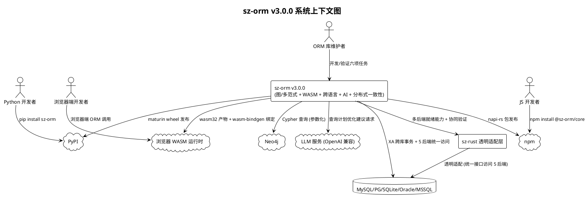
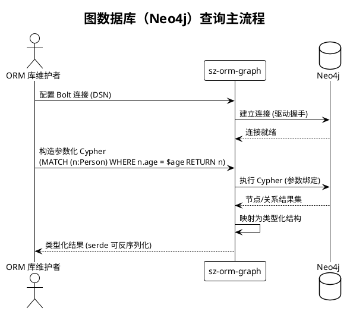
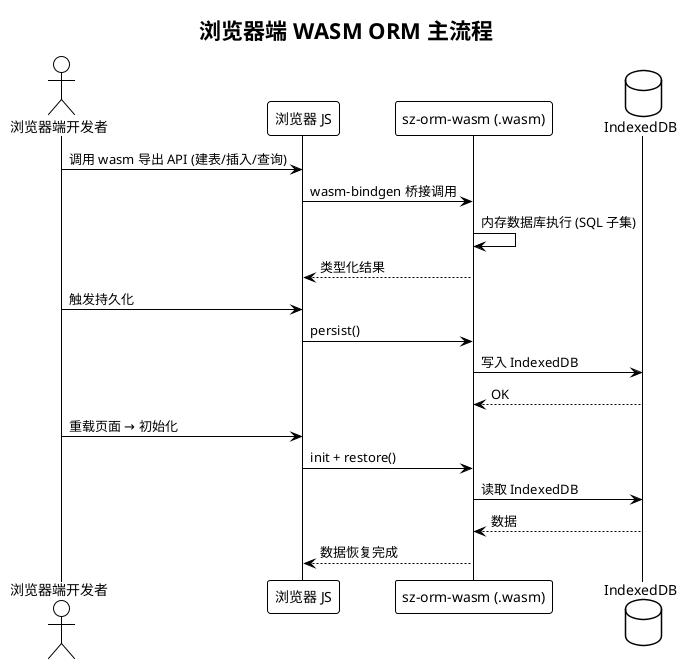
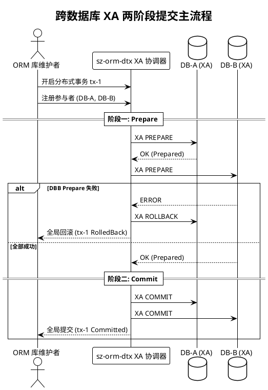
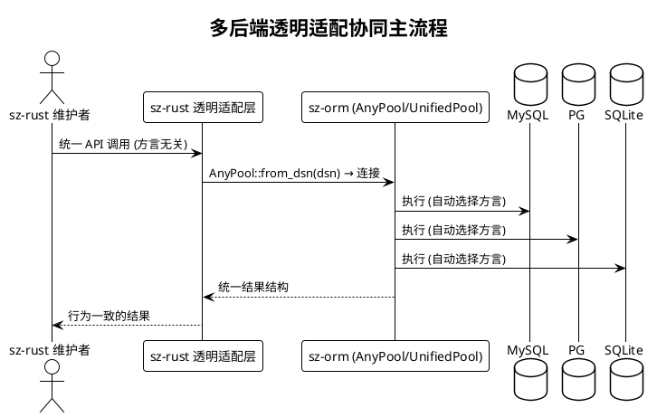

# sz-orm v3.0.0 需求规格说明书

> 版本：v3.0.0（长期目标规划）
> 基线：v2.4.0（已完成：五方言集成测试 + 性能基准 + crates.io 44 包发布 2.3.0）
> 日期：2026-08-07
> 需求格式：EARS（Ubiquitous / Event-driven / State-driven / Unwanted）
> 文档定位：需求规格（What to build），不含技术设计（How to build）
> 优先级声明：5 项长期目标均为**低优先级**，按"多库事务(5) → 发布产物(3) → WASM(2) → 图数据库(1) → AI 优化器(4)"的收益/风险序推进；协同需求（多后端透明适配）为 v2.4.0 已就绪能力的下游闭环

---

# 1. 组件定位

## 1.1 核心职责

本组件负责交付 sz-orm v3.0.0 的六项任务：图数据库支持、WASM 完善、maturin/napi 发布产物、AI 辅助查询优化器、多数据库事务一致性保证、多后端透明适配协同，实现 sz-orm 从"多方言关系型 ORM"向"多范式数据库 + 跨语言生态 + 智能化 + 分布式一致性"的长期能力扩展。

## 1.2 核心输入

1. **现有 5 后端 ORM 能力**：`AnyBackend` / `AnyPool` / `UnifiedPool`（`packages/sz-orm-sqlx/src/any_driver.rs:57,129`、`unified_pool.rs:48`），作为多后端透明适配与图数据库对齐的基准。
2. **sz-orm-wasm 现有实现**：`WasmQuery` / `WasmDatabase`（内存数据库 + SQL 子集解析）/ `advanced` 模块（内存限制、WASI 沙箱、异步调度、模块缓存），作为 WASM 完善的既有基础。
3. **sz-orm-dtx 现有实现**：`DistributedTransaction` / `DtxManager` / `TransactionLogStore` / `saga` / `tcc` / `cross_shard`（`packages/sz-orm-dtx/src/lib.rs`），作为 XA 事务增强的既有基础。
4. **sz-orm-ai 现有实现**：`Nl2SqlEngine`（Simple/OpenAI 两引擎）、`QueryOptimizer`（纯规则优化分析器，含 `QueryAnalysis` / `QueryOptimizationHint`）、`OpenAIEmbeddingClient`（real feature）、`safety` 安全模块，作为 AI 查询优化器扩展的既有基础。
5. **sz-orm-python / sz-orm-js 现有绑定**：PyO3 绑定（`packages/sz-orm-python`，pyproject.toml maturin 配置就绪）+ napi-rs 绑定（`packages/sz-orm-js`，package.json napi 配置就绪），作为发布产物的代码基础。
6. **sz-rust P2-1 协同需求**：`E:\vue\test\鲜视达\rust\sz-rust\docs\roadmap.md:102` 声明的"sz-orm 扩展 5 驱动支持，sz-rust 透明适配"，上游已就绪。
7. **v2.4.0 发布闭环**：44 包 crates.io 发布成功（2.3.0），为 v3.0.0 新增包（如有）提供发布流程基线。

## 1.3 核心输出

1. **图数据库支持能力**：面向 Neo4j（Cypher 查询）的查询接口与结果映射，作为新独立包提供。
2. **WASM 浏览器端 ORM**：可在浏览器环境（wasm32 目标）编译运行的 ORM 子集 + JS 互操作层 + 浏览器端数据存储。
3. **跨语言发布产物**：PyPI wheel（Python）+ npm 包（JavaScript/Node.js），由 maturin / napi-rs 构建。
4. **AI 查询优化建议能力**：基于 LLM 的查询计划优化建议（结构化提示 + 可选重写 SQL），与现有规则型 `QueryOptimizer` 并存。
5. **多数据库事务一致性保证**：基于 sz-orm-dtx 的 XA/2PC 增强，跨数据库原子提交与崩溃恢复。
6. **多后端透明适配闭环**：sz-rust 透明适配层可基于 sz-orm 多后端能力完成集成，含等价性验证。
7. **需求追溯矩阵**：本文档第 7 章，建立需求 ↔ 任务 ↔ 验收条件映射。

## 1.4 职责边界

本组件**不负责**以下事项：

1. **不新增第六种关系型方言**：图数据库（Neo4j）是非关系型多范式扩展，不属于关系型 SQL 方言范畴；现有 5 方言能力不变。
2. **不做 SQL 之外的图查询语言标准化**：图数据库仅覆盖 Cypher 查询，不负责 GQL 等其它图查询语言的标准化。
3. **不重写 ORM 核心**：所有新增能力以扩展包/扩展模块方式提供，不修改 sz-orm-core 既有公开 API 签名（无 Breaking Change）。
4. **不替代关系型事务**：XA 增强针对跨数据库场景，单库本地事务行为保持不变。
5. **不负责 LLM 训练**：AI 查询优化器消费已有 LLM 服务（OpenAI 兼容 API），不训练模型、不托管模型。
6. **不负责 WASI 服务器端运行时**：WASM 完善聚焦浏览器端（wasm32-unknown-unknown + wasm-bindgen），服务器端 WASI 由 sz-rust P2-5 另行覆盖。
7. **不负责 sz-rust 框架侧代码**：透明适配层代码在 sz-rust 侧实现（ADR-0001 严禁修改下游/上游仓库），本组件仅提供上游就绪验证与协同接口约束。

---

# 2. 领域术语

**图数据库（Graph Database）**
: 以节点（Node）、关系（Relationship）、属性（Property）为基本存储单位的非关系型数据库，代表为 Neo4j，使用 Cypher 查询语言。
: 备注：与关系型数据库（MySQL/PG 等）的多范式对比，v3.0.0 图数据库支持的首要目标。

**Cypher**
: Neo4j 的声明式图查询语言，通过 `MATCH` / `WHERE` / `RETURN` 等关键字描述图模式匹配。
: 备注：参数化 Cypher 对应关系型的参数化 SQL 铁律。

**WASM（WebAssembly）**
: 可在浏览器等环境中运行的二进制指令格式，Rust 通过 `wasm32-unknown-unknown` 目标编译。
: 备注：v3.0.0 目标是"浏览器端 ORM"，与 sz-rust P2-5 的服务器端 WASI 场景相区分。

**wasm-bindgen**
: Rust WASM 与 JavaScript 互操作的绑定工具，生成 JS 侧可直接调用的绑定与 TypeScript 类型声明。

**IndexedDB**
: 浏览器内置的键值存储数据库，WASM 模块在浏览器端持久化数据的主要载体。

**maturin**
: Rust → Python 扩展的构建与发布工具，生成 PyPI wheel 制品（本组件 sz-orm-python 已配置 pyproject.toml）。
: 备注：发布产物目标之一，Python 侧 `sz-orm` 包。

**napi-rs（Node-API）**
: Rust → Node.js 原生插件的构建与发布工具，生成跨平台 npm 包（本组件 sz-orm-js 已配置 package.json）。
: 备注：发布产物目标之二，npm 侧 `@sz-orm/core` 包。

**AI 查询优化器（AI Query Optimizer）**
: 基于 LLM（OpenAI 兼容 API）对 SQL 查询计划与写法提供优化建议的能力，输出结构化建议（含严重级别、描述、可选重写 SQL）。
: 备注：与现有规则型 `QueryOptimizer`（纯规则匹配，无 LLM 依赖）并存互补。

**XA 事务（XA Transaction）**
: 跨多个资源管理器（数据库）的分布式事务协议，两阶段提交（2PC）的工业标准，含 prepare / commit / rollback 三阶段。

**2PC（两阶段提交）**
: 分布式事务协调协议，第一阶段 Prepare（各参与者预提交），第二阶段 Commit/Rollback（根据全局结果决定）。
: 备注：sz-orm-dtx 已实现 2PC 协调器，XA 增强是其协议级扩展。

**透明适配层（Transparent Adapter）**
: sz-rust 侧屏蔽 sz-orm 5 后端差异的统一访问层，使应用代码与具体数据库方言解耦（sz-rust P2-1 目标）。

**多范式数据库（Multi-paradigm Database）**
: 同时支持关系型与图（或其它范式）数据库的查询与数据访问能力，是图数据库支持任务的核心价值主张。

---

# 3. 角色与边界

## 3.1 核心角色

- **ORM 库维护者**：执行 v3.0.0 六项任务的开发、验证、发布操作者，是新增能力的主要使用者与验收人。
- **浏览器端应用开发者**：使用 WASM 完善产物（sz-orm-wasm）在浏览器中执行查询的开发者。
- **Python 开发者**：通过 PyPI 安装 `sz-orm` wheel 使用 ORM 的开发者。
- **JavaScript/Node.js 开发者**：通过 npm 安装 `@sz-orm/core` 使用 ORM 的开发者。
- **sz-rust 框架维护者**：基于 sz-orm 多后端能力实现透明适配层的下游框架方。

## 3.2 外部系统

- **Neo4j**：图数据库目标系统，Cypher 查询执行对象（v3.0.0 目标 #1）。
- **浏览器/WASM 运行时**：wasm-bindgen 生成的 JS 绑定运行环境（目标 #2）。
- **PyPI 注册中心**：maturin wheel 发布目标（目标 #3）。
- **npm 注册中心**：napi-rs npm 包发布目标（目标 #3）。
- **LLM 服务（OpenAI 兼容 API）**：AI 查询优化器的外部推理服务（目标 #4）。
- **MySQL / PostgreSQL / SQLite / Oracle / MSSQL**：现有 5 后端数据库，多数据库事务一致性与多后端适配的执行环境。
- **sz-rust 项目**：透明适配层的实现方与消费方（协同需求）。

## 3.3 交互上下文



---

# 4. DFX 约束

## 4.1 性能

1. **图查询延迟上限**：图数据库（Neo4j）单次 Cypher 查询的端到端调用（含连接建立/执行/结果反序列化）在 1000 节点图上的 P95 延迟必须 ≤ 500ms（目标 #1）。
2. **AI 建议响应上限**：AI 查询优化器单条查询建议的生成延迟必须 ≤ 10s（P95，含 LLM 调用），且不得阻塞业务查询主路径（目标 #4）。
3. **WASM 体积上限**：sz-orm-wasm 浏览器产物（.wasm 二进制）gzip 后体积必须 ≤ 1MB，适配边缘场景带宽约束（目标 #2）。
4. **现有基准不回退**：v3.0.0 不得使 v2.4.0 已验收的性能基准回退（决策延迟 P99 ≤ 100μs、智能/手动比 ≤ 1.10、N+1 消除生效）。

## 4.2 可靠性

1. **XA 原子性**：跨数据库 XA 事务必须保证全有或全无（All-or-Nothing），任一参与者 prepare 失败则全局回滚（目标 #5）。
2. **崩溃恢复完整性**：XA/2PC 事务在协调者崩溃后必须能基于事务日志恢复未决事务，恢复成功率必须达 100%（目标 #5）。
3. **发布产物可安装**：PyPI wheel 与 npm 包必须能在目标平台（至少 linux-x64 / win32-x64 / darwin-x64）干净安装并加载（目标 #3）。
4. **WASM 模块隔离**：WASM 内存数据库必须通过现有 `advanced` 沙箱能力限制内存使用，超限必须返回错误而非 panic（目标 #2）。
5. **测试零失败**：全 workspace `cargo test --workspace` 必须全部通过（除明确 `#[ignore]` 的真实服务/外部依赖测试）。

## 4.3 安全性

1. **参数化查询铁律**：所有新增查询（含 Cypher）必须参数化绑定，禁止字符串拼接构造查询语句（目标 #1/#5）。
2. **LLM 输出不直接执行**：AI 优化器产出的任何 SQL 建议必须仅作建议展示，禁止自动执行 LLM 生成的 SQL（目标 #4）。
3. **绑定层注入防护**：Python/JS 绑定层必须复用 sz-orm-core 的参数化查询路径，禁止在绑定层构造裸 SQL（目标 #3）。
4. **敏感信息脱敏**：XA 事务日志、AI 请求日志中的 DSN/连接串必须脱敏（目标 #4/#5）。
5. **不安全代码零容忍**：新增代码禁止 `unsafe`（除 `// SAFETY:` 论证注释），与既有工程化铁律一致。

## 4.4 可维护性

1. **禁止占位实现**：新增代码禁止 `todo!` / `unimplemented!` / `unreachable!`。
2. **clippy 零警告**：`cargo clippy --workspace --all-targets -- -D warnings` 必须零警告。
3. **10 道门禁**：AGENTS.md 定义的全部门禁必须通过，含 Feature 全组合编译（新增 feature 必须纳入组合矩阵）。
4. **新增包发布闭环**：若新增独立包（如图数据库包），必须纳入 crates.io 发布拓扑与发布脚本。
5. **AI 建议可追溯**：AI 优化器每条建议必须记录来源引擎（规则/LLM）与 LLM 模型标识，便于审计。

## 4.5 兼容性

1. **无 Breaking Change**：v3.0.0 所有新增能力以扩展方式提供，现有公开 API 签名保持完全向后兼容。
2. **Rust 版本兼容**：edition = "2021"，rust-version = "1.81"，不得提升。
3. **Feature 隔离**：图数据库/AI/绑定等重依赖能力必须通过 feature gate 隔离，默认 feature 不引入额外依赖。
4. **下游零回归**：sz-pay（5139 测试基线）与 sz-rust 在 v3.0.0 升级后必须零回归。

---

# 5. 核心能力

## 5.1 图数据库支持（Neo4j / Cypher）

> 现状：sz-orm 当前无任何图数据库能力（`packages/` 下无图驱动），本模块为全新扩展。
> 形态：以新独立包（如 `sz-orm-graph`）提供，不触碰 sz-orm-core / sz-orm-sqlx 既有 API。

### 5.1.1 业务规则

1. **图数据库连接能力**（EARS: Ubiquitous）
   系统应当提供 Neo4j 图数据库的连接能力，支持 Bolt 协议连接，并复用 sz-orm 的连接池抽象模式。
   a. 验收条件：[提供 Neo4j 连接配置并建立连接] → [连接建立成功，返回可复用的连接句柄；连接信息不泄露在错误消息中]

2. **参数化 Cypher 查询**（EARS: Event-driven）
   当用户通过图查询接口执行 Cypher 查询时，系统应当支持参数化绑定（`WHERE n.age = $age` 形式），禁止字符串拼接构造查询。
   a. 验收条件：[传入含参数的 Cypher 查询 + 参数值] → [执行成功且结果正确；注入载荷作为参数传入时被当作字面量而非语法]

3. **查询结果类型化映射**（EARS: State-driven）
   在 Cypher 查询返回节点/关系/标量结果的状态下，系统应当将结果映射为类型化结构（节点属性 Map、关系、标量），支持 `serde` 反序列化到用户结构。
   a. 验收条件：[返回混合类型结果的查询] → [结果映射为类型化结构且字段值与原始结果一致；反序列化到 `#[derive(Deserialize)]` 用户结构成功]

4. **图节点/关系声明式建模**（EARS: Ubiquitous）
   系统应当提供图模型声明能力（节点标签、属性、关系方向与类型），供类型化查询与结果映射复用。
   a. 验收条件：[声明节点/关系模型] → [模型可用于查询构造与结果映射，无需手写结构体字段映射]

5. **禁止项 — 非图库方言混用**（EARS: Unwanted）
   如果用户尝试在图查询接口中使用关系型 SQL（SELECT/INSERT 等），则系统应当返回明确的类型错误，禁止将 SQL 透传给图数据库。
   a. 验收条件：[图接口传入 SQL 语句] → [返回明确的"不支持 SQL"错误，图数据库收到零请求]

### 5.1.2 交互流程



### 5.1.3 异常场景

1. **Neo4j 连接失败**
   a. 触发条件：Neo4j 服务不可达、凭证错误、Bolt 协议版本不兼容
   b. 系统行为：返回连接错误，不泄露完整 DSN/密码（脱敏处理）
   c. 用户感知：错误码 `GraphConnectionError` + 脱敏后的连接地址

2. **Cypher 语法错误**
   a. 触发条件：用户提交的 Cypher 语法错误或引用了不存在的标签/属性
   b. 系统行为：透传数据库错误详情，标注为查询错误
   c. 用户感知：错误码 `GraphQueryError` + 数据库错误消息

3. **结果映射失败**
   a. 触发条件：返回结果结构与用户目标结构不匹配（字段缺失、类型不符）
   b. 系统行为：返回反序列化错误，附缺失字段/类型差异明细
   c. 用户感知：错误码 `GraphMappingError` + 字段级差异明细

## 5.2 WASM 完善（浏览器端 ORM）

> 现状：`packages/sz-orm-wasm` 已有 `WasmQuery` / `WasmDatabase`（内存 DB + SQL 子集解析）/ `advanced`（内存限制、WASI 沙箱、异步调度、模块缓存），但**无 wasm-bindgen 互操作、无浏览器端持久化**。
> 形态：在既有 sz-orm-wasm 包内扩展（不新增包），补齐浏览器端能力。

### 5.2.1 业务规则

1. **wasm32 目标编译**（EARS: Ubiquitous）
   系统应当保证 sz-orm-wasm 可通过 `wasm32-unknown-unknown` 目标编译，产出浏览器可加载的 `.wasm` 产物。
   a. 验收条件：[`cargo build --target wasm32-unknown-unknown -p sz-orm-wasm`] → [编译成功产出 .wasm 文件；产物 gzip 体积 ≤ 1MB]

2. **JS 互操作层（wasm-bindgen）**（EARS: Ubiquitous）
   系统应当通过 wasm-bindgen 导出浏览器端可调用的 ORM API（建表、增删改查、查询），并生成 TypeScript 类型声明。
   a. 验收条件：[wasm-bindgen 生成绑定后加载] → [JS 侧可直接调用导出 API；生成的 .d.ts 覆盖全部导出函数签名]

3. **浏览器端数据持久化**（EARS: State-driven）
   在浏览器环境可用的状态下，系统应当将内存数据库数据持久化到 IndexedDB，并在页面重载后恢复。
   a. 验收条件：[写入数据 → 触发持久化 → 重载页面] → [数据从 IndexedDB 恢复，查询结果与持久化前一致]

4. **内存资源限制**（EARS: State-driven）
   在 WASM 内存数据库达到配置上限的状态下，系统应当通过既有 `advanced` 沙箱能力拒绝进一步写入并返回明确错误，禁止无界内存增长。
   a. 验收条件：[内存使用达到上限后继续写入] → [写入被拒绝 + 错误 `MemoryLimitError`；内存占用不再增长]

5. **禁止项 — 非 WASM 环境静默降级**（EARS: Unwanted）
   如果在不支持 IndexedDB 或 WASM 的环境（如纯内存 Node 测试）中运行，则系统应当明确报告"持久化不可用"状态，禁止静默丢数据。
   a. 验收条件：[无 IndexedDB 环境触发持久化] → [返回明确"持久化不可用"状态，数据仍保留在内存可读]

### 5.2.2 交互流程



### 5.2.3 异常场景

1. **IndexedDB 不可用**
   a. 触发条件：浏览器隐私模式/禁用 IndexedDB/非浏览器环境
   b. 系统行为：持久化返回"不可用"状态，内存数据继续可读
   c. 用户感知：`persist()` 返回 `Err(PersistenceUnavailable)`，数据不丢失但重启后不恢复

2. **WASM 内存超限**
   a. 触发条件：写入使内存使用超过 `MemoryConfig` 配置上限
   b. 系统行为：拒绝写入，返回 `MemoryLimitError`
   c. 用户感知：错误 `MemoryLimitError` + 当前使用量/上限

3. **恢复数据损坏**
   a. 触发条件：IndexedDB 中存储的数据损坏或不完整（版本不兼容、截断）
   b. 系统行为：恢复失败返回错误，内存库保持空表状态，不 panic
   c. 用户感知：`restore()` 返回 `Err(RestoreError)` + 损坏详情

## 5.3 maturin/napi 发布产物（跨语言生态）

> 现状：`sz-orm-python`（PyO3 0.20，pyproject.toml 已配置 maturin）与 `sz-orm-js`（napi-rs 2，package.json 已配置 napi）代码已存在，但**尚未产出/发布 PyPI wheel 与 npm 包**。
> 形态：补齐构建、跨平台打包、发布流水线。

### 5.3.1 业务规则

1. **Python wheel 构建（maturin）**（EARS: Ubiquitous）
   系统应当通过 maturin 从 sz-orm-python 构建可安装的 PyPI wheel，覆盖 Python ≥ 3.8 与主要平台（linux-x64 / win32-x64 / darwin-x64）。
   a. 验收条件：[执行 maturin build --release] → [产出 .whl 制品；在干净 venv 中 pip install 成功并可 import sz_orm_python]

2. **npm 包构建（napi-rs）**（EARS: Ubiquitous）
   系统应当通过 napi-rs 从 sz-orm-js 构建跨平台 npm 包（`@sz-orm/core` 主包 + 平台二进制子包）。
   a. 验收条件：[执行 napi build --release] → [产出平台二进制 .node 文件与 index.d.ts；npm install 后 require/import 成功并可调用 ORM API]

3. **绑定层功能等价**（EARS: State-driven）
   在 Python/JS 绑定层可用状态下，系统应当保证绑定层暴露的 Model / QueryBuilder / Pool / Transaction 能力与 sz-orm-core 对应能力行为等价（同一参数化查询路径）。
   a. 验收条件：[同一 CRUD 用例分别在绑定层与 sz-orm-core 执行] → [结果一致；绑定层查询使用参数化绑定而非裸 SQL]

4. **绑定层异步能力**（EARS: Event-driven）
   当 Python/JS 调用方需要异步执行查询时，系统应当支持绑定层的异步调用（Python asyncio / JS async），复用 tokio 运行时集成。
   a. 验收条件：[asyncio/async 环境执行异步查询] → [查询完成且结果正确；无运行时冲突错误]

5. **禁止项 — 未经验证发布**（EARS: Unwanted）
   如果绑定层测试（含跨平台加载测试）未全部通过，则系统应当阻断发布，禁止发布未经验证的制品。
   a. 验收条件：[任一平台加载/功能测试失败时触发发布] → [发布流程中止 + 失败平台与原因]

### 5.3.2 交互流程

```plantuml
@startuml
!theme plain
title 跨语言发布产物构建与验证主流程

actor "ORM 库维护者" as Dev
participant "构建流水线" as Pipe
participant "sz-orm-python" as Py
participant "sz-orm-js" as Js
cloud "PyPI" as PyPI
cloud "npm" as Npm

== Python 侧 ==
Dev -> Pipe : maturin build --release
Pipe -> Py : 编译 (pyo3 + tokio)
Py --> Pipe : .whl 制品
Pipe -> Pipe : 干净 venv 安装 + import 测试
Pipe --> PyPI : 发布 wheel

== JS 侧 ==
Dev -> Pipe : napi build --release (三平台)
Pipe -> Js : 编译 (napi-rs)
Js --> Pipe : .node 二进制 + .d.ts
Pipe -> Pipe : npm install + require 测试 (三平台)
Pipe --> Npm : 发布主包 + 平台子包

Pipe --> Dev : 全部平台验证通过 + 发布完成

@enduml
```

### 5.3.3 异常场景

1. **maturin 构建失败**
   a. 触发条件：pyo3 依赖编译错误、Cargo feature 冲突、平台工具链缺失
   b. 系统行为：构建中止，输出编译错误详情
   c. 用户感知：构建失败 + 错误详情，不产出 wheel

2. **npm 平台二进制缺失**
   a. 触发条件：某平台（如 darwin-x64）未构建对应 .node 二进制
   b. 系统行为：发布前校验平台矩阵完整性，缺失则阻断发布
   c. 用户感知：发布中止 + 缺失平台列表

3. **绑定层测试失败**
   a. 触发条件：跨语言功能测试与 sz-orm-core 行为不一致（参数化失效、异步失败）
   b. 系统行为：发布阻断，输出失败用例与差异
   c. 用户感知：发布中止 + 失败用例明细

## 5.4 AI 辅助查询优化器

> 现状：`sz-orm-ai` 已有 `QueryOptimizer`（纯规则匹配，无 LLM）、`Nl2SqlEngine`（Simple/OpenAI 两引擎）、`OpenAIEmbeddingClient`（real feature）、`safety` 模块。
> 形态：在 sz-orm-ai 内新增"LLM 查询计划优化建议"能力，与规则型 QueryOptimizer 并存。

### 5.4.1 业务规则

1. **LLM 优化建议引擎**（EARS: Event-driven）
   当用户请求对某条 SQL 查询进行优化建议时，系统应当调用 LLM 服务（OpenAI 兼容 API）生成结构化优化建议（严重级别、建议标题、详细描述、可选重写 SQL），并合并规则型 `QueryOptimizer` 的分析结果。
   a. 验收条件：[提交一条含可优化点（如 SELECT *、缺索引）的查询] → [返回结构化建议列表，LLM 建议与规则建议均可追溯来源；建议包含严重级别与描述]

2. **查询计划输入**（EARS: Event-driven）
   当用户提供数据库 EXPLAIN 计划文本时，系统应当解析计划并纳入优化建议上下文，识别全表扫描、缺索引、排序/临时表等信号。
   a. 验收条件：[提交 EXPLAIN 计划文本] → [解析出信号（如全表扫描、缺索引）并反映在建议中；无法解析时返回明确解析错误而非静默忽略]

3. **建议结构化输出**（EARS: Ubiquitous）
   系统应当输出统一的优化建议结构（`QueryOptimizationHint` 兼容格式），支持序列化为 JSON 供外部消费，且必须标注建议来源（规则/LLM）与 LLM 模型标识。
   a. 验收条件：[生成建议] → [输出 JSON 结构化数据，每条含 severity/title/description/source/model；`QueryAnalysis` 聚合了规则与 LLM 两类 hint]

4. **LLM 可配置性**（EARS: Ubiquitous）
   系统应当支持通过配置（API key、API base、模型名、超时、最大 token）对接不同 OpenAI 兼容 LLM 服务，且未配置 LLM 时自动降级为纯规则引擎。
   a. 验收条件：[配置不同模型名/API base] → [调用对应服务成功；未配置 API key 时] → [仅返回规则引擎结果，不报错、不阻塞]

5. **禁止项 — 自动执行 LLM 生成 SQL**（EARS: Unwanted）
   如果系统生成了 LLM 重写 SQL 建议，则应当仅作为建议返回，禁止自动执行或写入数据库。
   a. 验收条件：[LLM 返回重写 SQL] → [SQL 仅存在于建议结构中，系统零次执行该 SQL]

### 5.4.2 交互流程

```plantuml
@startuml
!theme plain
title AI 查询优化建议主流程

actor "ORM 库维护者" as Dev
participant "sz-orm-ai 优化器" as Ai
participant "规则引擎 QueryOptimizer" as Rule
cloud "LLM 服务" as LLM

Dev -> Ai : 提交 SQL + (可选) EXPLAIN 计划
Ai -> Rule : 规则分析 (离线)
Rule --> Ai : 规则 hint 列表
Ai -> LLM : 请求优化建议 (含 SQL + 计划 + schema)
LLM --> Ai : 结构化建议 (JSON)
Ai -> Ai : 合并规则 + LLM 建议\n统一 QueryAnalysis 结构
Ai --> Dev : 结构化建议 (含 source/model 标注)
Dev --> Dev : 人工审阅后手动采纳

@enduml
```

### 5.4.3 异常场景

1. **LLM 服务不可用**
   a. 触发条件：LLM 服务超时、限流、API key 失效、网络中断
   b. 系统行为：自动降级为纯规则引擎，返回规则建议并标注 LLM 不可用原因
   c. 用户感知：仍返回建议列表（规则来源），含 LLM 降级说明，不报错

2. **LLM 返回非结构化/非法输出**
   a. 触发条件：LLM 返回非法 JSON、字段缺失、严重级别非法
   b. 系统行为：丢弃非法建议，校验通过的保留；记录解析失败日志
   c. 用户感知：仅返回校验通过的建议 + 解析失败日志（不 panic）

3. **EXPLAIN 解析失败**
   a. 触发条件：EXPLAIN 文本格式与预期方言不符（方言差异、版本差异）
   b. 系统行为：忽略计划输入继续基于 SQL 文本分析，标注"计划未解析"
   c. 用户感知：建议仍生成 + 标注"EXPLAIN 未解析"，不静默

## 5.5 多数据库事务一致性保证（XA 增强）

> 现状：`sz-orm-dtx` 已有 2PC 协调器（`DistributedTransaction` / `DtxManager` / `TransactionLogStore` / `saga` / `tcc` / `cross_shard`），但为回调式参与者模型，**无数据库级 XA 协议（prepare/commit 直连 DB 资源管理器）**。
> 形态：在 sz-orm-dtx 内扩展 XA 资源管理器适配，复用现有 2PC 状态机与日志。

### 5.5.1 业务规则

1. **跨数据库 XA 事务**（EARS: Event-driven）
   当用户在多个数据库（支持 XA 的 MySQL/PG/Oracle/MSSQL）上发起分布式事务时，系统应当通过两阶段提交保证原子性：先对所有参与者执行 Prepare，全部成功后才 Commit，任一失败则全局 Rollback。
   a. 验收条件：[两库各写一条数据并提交 XA 事务] → [两库同时提交成功；制造某库 Prepare 失败] → [两库均无数据残留（全回滚）]

2. **事务日志与崩溃恢复**（EARS: State-driven）
   在分布式事务进入 Prepare 之后、Commit 完成之前的状态下，系统应当将事务状态与参与者列表写入 `TransactionLogStore`，并在协调者恢复时对未决事务执行补偿（已完成 Prepare 的继续 Commit / 未完成的 Rollback）。
   a. 验收条件：[事务 Prepare 后模拟协调者崩溃 → 重启恢复] → [基于日志恢复未决事务并收敛到终态（Committed/RolledBack），无悬挂事务残留]

3. **悬挂事务检测**（EARS: Event-driven）
   当某参与者 Prepare 后超过配置超时（默认 30s）仍未收到全局决定时，系统应当将该事务标记为悬挂并启动超时处理（按配置策略提交/回滚）。
   a. 验收条件：[参与者 Prepare 后协调者停摆超过超时] → [事务被标记悬挂并触发超时处理；状态收敛到终态]

4. **与现有 dtx 模式共存**（EARS: Ubiquitous）
   系统应当保证 XA 能力与既有 2PC（回调式）/ Saga / TCC / cross_shard 模式共存，均通过 `DtxManager` 统一管理，不破坏既有 API。
   a. 验收条件：[XA 事务与既有 2PC 回调事务并行运行] → [两类事务独立协调、互不干扰；既有 dtx API 签名不变]

5. **禁止项 — 伪两阶段提交**（EARS: Unwanted）
   如果某数据库不支持 XA/本地事务参与（如 SQLite 或未开启 XA），则系统应当拒绝将该库注册为 XA 参与者并明确报错，禁止将"非原子提交"伪装为原子提交。
   a. 验收条件：[尝试将不支持 XA 的库注册为参与者] → [注册被拒绝 + 明确错误；事务不进入 Prepare]

### 5.5.2 交互流程



### 5.5.3 异常场景

1. **Prepare 部分失败**
   a. 触发条件：部分参与者 Prepare 失败（网络中断、约束冲突）
   b. 系统行为：对已 Prepare 的参与者执行回滚，事务标记 Failed
   c. 用户感知：事务回滚 + 失败参与者标识 + 错误详情

2. **协调者崩溃后恢复**
   a. 触发条件：Prepare 后协调者进程崩溃
   b. 系统行为：重启后从 TransactionLogStore 恢复未决事务，按日志状态收敛
   c. 用户感知：事务自动收敛到终态，无悬挂事务（可查询状态）

3. **提交超时悬挂**
   a. 触发条件：全局 Commit 阶段某参与者无响应超过超时
   b. 系统行为：标记悬挂，按配置策略补偿（重试/回滚），记录审计日志
   c. 用户感知：事务状态为悬挂并最终收敛，审计日志可追溯

4. **不支持 XA 的参与者**
   a. 触发条件：尝试注册 SQLite 或不支持 XA 的库
   b. 系统行为：注册被拒绝，返回明确错误
   c. 用户感知：错误 `XaNotSupported` + 资源标识

## 5.6 多后端透明适配协同（sz-rust P2-1）

> 现状：sz-orm 上游 5 后端能力已就绪（`AnyBackend` / `AnyPool` / `UnifiedPool`，见 v2.4.0 报告 §二），sz-rust P2-1 待上游配合条件已满足。
> 形态：本需求约束"上游就绪验证 + 协同接口约束"，透明适配层代码由 sz-rust 侧实现。

### 5.6.1 业务规则

1. **上游就绪验证**（EARS: Ubiquitous）
   系统应当提供一份"多后端能力就绪清单"验证文档，覆盖 `AnyBackend` 五方言枚举、`from_dsn()` 识别、`dialect()` 映射、`AnyPool` / `UnifiedPool` 连接工厂，证明上游已满足 sz-rust P2-1 启动条件。
   a. 验收条件：[按清单逐项验证] → [每项能力均可从公开 API 调用并产出预期结果，文档附 file:line 证据]

2. **五后端行为一致性验证**（EARS: State-driven）
   在通过 `AnyPool`/`UnifiedPool` 连接任一后端的状态下，系统应当保证相同 ORM 代码（CRUD/事务/Eager Loading）在五方言下行为一致（复用 v2.4.0 五方言等价性测试基础设施）。
   a. 验收条件：[同一测试用例在五方言执行] → [结果等价（行数/字段/值/嵌套深度一致）；不支持的方言特性有明确文档标注]

3. **统一接口约束**（EARS: Event-driven）
   当 sz-rust 侧实现透明适配层时，系统应当保证其可基于 sz-orm 公开 API（AnyBackend/AnyPool/UnifiedPool）完成统一访问，无需触碰 sz-orm 内部实现。
   a. 验收条件：[sz-rust 透明适配层仅依赖 sz-orm 公开 API] → [适配层编译通过；git diff 证明 sz-orm 仓库零修改（ADR-0001）]

4. **禁止项 — 方言特性隐式假设**（EARS: Unwanted）
   如果透明适配层或应用代码依赖某方言专属特性（如 MySQL `ON DUPLICATE KEY UPDATE`）而未声明方言约束，则系统应当在文档/诊断中明确提示，禁止跨方言静默行为差异。
   a. 验收条件：[代码使用方言专属特性但未声明] → [诊断输出明确的方言约束提示，或文档明确标注该特性支持方言范围]

### 5.6.2 交互流程



### 5.6.3 异常场景

1. **DSN 方言识别失败**
   a. 触发条件：DSN scheme 不是已知五方言之一
   b. 系统行为：`AnyBackend::from_dsn()` 返回明确错误
   c. 用户感知：错误 `UnknownBackend` + 支持的 scheme 列表

2. **方言特性不可用**
   a. 触发条件：透明适配层使用某方言不支持的特性
   b. 系统行为：返回方言不支持错误，标注支持范围
   c. 用户感知：错误 + 支持的方言范围说明

3. **上游能力回归**
   a. 触发条件：sz-orm 上游 API 变更导致适配层编译失败
   b. 系统行为：在 sz-rust 侧检测到 breakage（sz-orm 侧保持向后兼容承诺，理论上不发生）
   c. 用户感知：适配层编译错误 + 差异定位（由 sz-rust 侧修复）

---

# 6. 数据约束

## 6.1 图数据库数据（目标 #1）

1. **Cypher 参数绑定**：所有图查询的过滤条件必须通过参数绑定（`$param`）传入，禁止在查询文本中拼接字面量。
2. **模型元数据**：节点/关系模型的标签与属性名必须与数据库实际 schema 一致（验证时校验），避免运行期映射静默失败。
3. **结果类型**：节点属性映射为 `Map<String, Value>`，关系含方向与类型字段，标量按 Cypher 类型映射为 Value 变体。

## 6.2 WASM 浏览器数据（目标 #2）

1. **内存上限**：WASM 内存数据库必须通过 `MemoryConfig` 配置上限（默认建议 64MB），超过即拒绝写入。
2. **持久化一致性**：IndexedDB 持久化必须采用"事务级写入"（一次持久化一批变更），禁止部分写入导致数据损坏。
3. **存储版本**：IndexedDB 数据结构必须携带版本号，恢复时版本不匹配返回 `RestoreError` 而非静默损坏。

## 6.3 发布制品数据（目标 #3）

1. **包名与版本**：PyPI 包名 `sz-orm`、npm 主包 `@sz-orm/core`，版本号必须与对应 Rust 绑定包（0.1.0 线）对齐。
2. **平台矩阵**：必须覆盖 linux-x64 / win32-x64 / darwin-x64 三平台，缺失平台不得发布。
3. **绑定安全**：绑定层所有查询必须走 sz-orm-core 参数化路径，绑定层禁止出现 SQL 字符串拼接。

## 6.4 AI 建议数据（目标 #4）

1. **建议结构**：每条建议必须含 `severity`（Info/Warning/Critical）、`title`、`description`、可选 `suggested_sql`、必填 `source`（rule/llm）与 `model`（LLM 模型标识）。
2. **LLM 输入脱敏**：发送给 LLM 的 SQL 中不得包含敏感字面量（密码、token），发送前必须脱敏处理。
3. **schema 上下文**：LLM 请求可携带 `SchemaContext`（表/列/索引信息），但不得携带真实业务数据行。

## 6.5 XA 事务数据（目标 #5）

1. **事务日志**：日志条目必须含 `tx_id` / `state` / `participants` / `timestamp` / `action`（复用 `TransactionLogEntry`），Prepare/Commit/Rollback 各阶段均落日志。
2. **终态收敛**：每笔分布式事务必须收敛到终态（Committed / RolledBack / Failed），禁止无限悬挂。
3. **参与者标识**：每个参与者必须携带唯一 `resource_id`（如 DSN 脱敏哈希），用于日志与审计追溯。

## 6.6 多后端协同数据（目标 #6）

1. **DSN 归一化**：`AnyBackend::from_dsn()` 必须覆盖五方言 scheme（mysql/postgres/sqlite/oracle/mssql），未知 scheme 返回错误。
2. **等价性覆盖**：五方言行为一致性验证必须覆盖 CRUD / 事务 / Eager Loading 三类用例（复用 v2.4.0 `tests/common/equivalence.rs` 基础设施）。
3. **零上游修改**：协同交付必须满足 ADR-0001，sz-orm 仓库在协同期间零代码修改。

---

# 7. 需求追溯矩阵

| 需求编号 | 需求描述 | EARS 类型 | 所属任务 | 验收条件 | 关联章节 |
|---------|---------|----------|---------|---------|---------|
| REQ-GDB-001 | 图数据库连接能力 | Ubiquitous | 目标1 图数据库 | Bolt 连接成功，脱敏错误 | 5.1.1 规则1 |
| REQ-GDB-002 | 参数化 Cypher 查询 | Event-driven | 目标1 图数据库 | 参数绑定执行，注入载荷为字面量 | 5.1.1 规则2 |
| REQ-GDB-003 | 查询结果类型化映射 | State-driven | 目标1 图数据库 | 结果映射 + serde 反序列化成功 | 5.1.1 规则3 |
| REQ-GDB-004 | 图模型声明式建模 | Ubiquitous | 目标1 图数据库 | 模型驱动查询与映射 | 5.1.1 规则4 |
| REQ-GDB-005 | 禁止 SQL 透传图接口 | Unwanted | 目标1 图数据库 | 图接口拒绝 SQL，零透传 | 5.1.1 规则5 |
| REQ-WASM-001 | wasm32 目标编译 | Ubiquitous | 目标2 WASM | 编译成功，gzip ≤ 1MB | 5.2.1 规则1 |
| REQ-WASM-002 | JS 互操作层 | Ubiquitous | 目标2 WASM | wasm-bindgen 绑定 + .d.ts | 5.2.1 规则2 |
| REQ-WASM-003 | 浏览器端持久化 | State-driven | 目标2 WASM | IndexedDB 持久化 + 恢复 | 5.2.1 规则3 |
| REQ-WASM-004 | 内存资源限制 | State-driven | 目标2 WASM | 超限拒绝写入 | 5.2.1 规则4 |
| REQ-WASM-005 | 禁止静默降级持久化 | Unwanted | 目标2 WASM | 不可用时明确报告 | 5.2.1 规则5 |
| REQ-FDI-001 | Python wheel 构建 | Ubiquitous | 目标3 发布产物 | maturin wheel + pip install 成功 | 5.3.1 规则1 |
| REQ-FDI-002 | npm 包构建 | Ubiquitous | 目标3 发布产物 | napi 产物 + npm install 成功 | 5.3.1 规则2 |
| REQ-FDI-003 | 绑定层功能等价 | State-driven | 目标3 发布产物 | 绑定层 == sz-orm-core 行为 | 5.3.1 规则3 |
| REQ-FDI-004 | 绑定层异步能力 | Event-driven | 目标3 发布产物 | asyncio/async 查询成功 | 5.3.1 规则4 |
| REQ-FDI-005 | 禁止未验证发布 | Unwanted | 目标3 发布产物 | 测试失败阻断发布 | 5.3.1 规则5 |
| REQ-AI-001 | LLM 优化建议引擎 | Event-driven | 目标4 AI 优化器 | 结构化建议 + 来源追溯 | 5.4.1 规则1 |
| REQ-AI-002 | 查询计划输入 | Event-driven | 目标4 AI 优化器 | EXPLAIN 解析纳入建议 | 5.4.1 规则2 |
| REQ-AI-003 | 建议结构化输出 | Ubiquitous | 目标4 AI 优化器 | JSON 输出含 source/model | 5.4.1 规则3 |
| REQ-AI-004 | LLM 可配置性 | Ubiquitous | 目标4 AI 优化器 | 模型可配置，未配置降级 | 5.4.1 规则4 |
| REQ-AI-005 | 禁止自动执行 LLM SQL | Unwanted | 目标4 AI 优化器 | LLM SQL 仅建议零执行 | 5.4.1 规则5 |
| REQ-DTX-001 | 跨数据库 XA 事务 | Event-driven | 目标5 事务一致性 | 2PC 全有全无 | 5.5.1 规则1 |
| REQ-DTX-002 | 事务日志与崩溃恢复 | State-driven | 目标5 事务一致性 | 日志恢复未决事务 | 5.5.1 规则2 |
| REQ-DTX-003 | 悬挂事务检测 | Event-driven | 目标5 事务一致性 | 超时收敛终态 | 5.5.1 规则3 |
| REQ-DTX-004 | 与现有 dtx 模式共存 | Ubiquitous | 目标5 事务一致性 | XA 与 2PC/Saga/TCC 共存 | 5.5.1 规则4 |
| REQ-DTX-005 | 禁止伪两阶段提交 | Unwanted | 目标5 事务一致性 | 拒绝不支持 XA 参与者 | 5.5.1 规则5 |
| REQ-MB-001 | 上游就绪验证 | Ubiquitous | 协同 多后端适配 | 就绪清单逐项验证 | 5.6.1 规则1 |
| REQ-MB-002 | 五后端行为一致性 | State-driven | 协同 多后端适配 | 五方言等价测试通过 | 5.6.1 规则2 |
| REQ-MB-003 | 统一接口约束 | Event-driven | 协同 多后端适配 | 适配层仅依赖公开 API | 5.6.1 规则3 |
| REQ-MB-004 | 禁止方言隐式假设 | Unwanted | 协同 多后端适配 | 方言约束明确提示 | 5.6.1 规则4 |

---

# 8. 约束条件汇总

## 8.1 语言与工具链

| 约束项 | 约束值 | 来源 |
|-------|-------|------|
| Rust edition | 2021 | workspace.package.edition |
| rust-version | 1.81 | workspace.package.rust-version |
| 异步运行时 | tokio 1.40 (full) | workspace.dependencies |
| 绑定工具链 | maturin ≥ 1.0（python）/ napi-rs 2（js） | pyproject.toml / package.json |

## 8.2 外部依赖

| 目标 | 外部依赖 | 用途 | Feature 隔离 |
|------|---------|------|-------------|
| 图数据库 | Bolt 驱动（Neo4j） | 图查询 | 新包 feature 隔离 |
| WASM | wasm-bindgen / web-sys（IndexedDB） | JS 互操作 + 持久化 | 新 feature |
| 发布产物 | maturin / napi-rs（构建期） | 跨语言打包 | 构建期依赖 |
| AI 优化器 | reqwest / base64（real feature 已有） | LLM 调用 | sz-orm-ai real feature |

## 8.3 工程化铁律（沿用）

| 编号 | 铁律 | 验证方式 |
|------|------|---------|
| C-01 | 禁止占位实现 | grep todo!/unimplemented!/unreachable! |
| C-02 | unsafe 零容忍 | grep unsafe（须有 // SAFETY: 注释） |
| C-03 | 参数化查询 | where_eq/or_where_eq，禁止 where_cond/or_where |
| C-04 | 禁止 SELECT * | SQL 注入扫描脚本 |
| C-05 | API 向后兼容 | 无 Breaking Change |
| C-06 | clippy 零警告 | cargo clippy -- -D warnings |
| C-07 | 10 道门禁全通过 | gate.ps1 |
| C-08 | ADR-0001 不改上游 | git diff 零上游修改 |

---

# 9. 验收标准总览

## 9.1 目标 1 验收标准（图数据库支持）

- [ ] AC-GDB-1：新增图数据库包可通过 `cargo build` 编译，Neo4j 真实连接测试通过（`#[ignore]` 标注）
- [ ] AC-GDB-2：参数化 Cypher 查询执行成功，注入载荷被当作字面量
- [ ] AC-GDB-3：节点/关系/标量结果类型化映射 + serde 反序列化成功
- [ ] AC-GDB-4：图接口拒绝 SQL 输入，透传零请求
- [ ] AC-GDB-5：图数据库包通过 10 道门禁（含 clippy 零警告、无占位实现）

## 9.2 目标 2 验收标准（WASM 完善）

- [ ] AC-WASM-1：`wasm32-unknown-unknown` 目标编译成功，产物 gzip ≤ 1MB
- [ ] AC-WASM-2：wasm-bindgen 绑定加载成功，JS 调用导出 API 工作
- [ ] AC-WASM-3：IndexedDB 持久化 → 重载 → 恢复链路验证通过
- [ ] AC-WASM-4：内存超限拒绝写入（`MemoryLimitError`），无 panic
- [ ] AC-WASM-5：无 IndexedDB 环境明确报告"持久化不可用"

## 9.3 目标 3 验收标准（maturin/napi 发布产物）

- [ ] AC-FDI-1：maturin 产出 wheel，干净 venv `pip install` + `import` 成功
- [ ] AC-FDI-2：napi-rs 产出三平台 .node 二进制 + .d.ts，`npm install` + `require` 成功
- [ ] AC-FDI-3：绑定层 CRUD/事务与 sz-orm-core 行为等价（参数化路径）
- [ ] AC-FDI-4：绑定层异步查询（asyncio/async）执行成功
- [ ] AC-FDI-5：任一平台测试失败则阻断发布

## 9.4 目标 4 验收标准（AI 查询优化器）

- [ ] AC-AI-1：LLM 优化建议生成成功，建议含 severity/title/description/source/model
- [ ] AC-AI-2：EXPLAIN 计划解析纳入建议；无法解析时明确报错
- [ ] AC-AI-3：未配置 LLM 时自动降级规则引擎，不报错不阻塞
- [ ] AC-AI-4：LLM 重写 SQL 仅作为建议返回，系统零执行
- [ ] AC-AI-5：发送 LLM 的 SQL 已脱敏（无敏感字面量）

## 9.5 目标 5 验收标准（多数据库事务一致性）

- [ ] AC-DTX-1：两库 XA 事务全有全无（全提交 / 全回滚）
- [ ] AC-DTX-2：协调者崩溃后基于日志恢复未决事务，收敛终态
- [ ] AC-DTX-3：悬挂事务超时（默认 30s）处理收敛，无无限悬挂
- [ ] AC-DTX-4：XA 与既有 2PC/Saga/TCC 共存，既有 dtx API 不变
- [ ] AC-DTX-5：不支持 XA 的库注册被拒绝（`XaNotSupported`）

## 9.6 协同验收标准（多后端透明适配）

- [ ] AC-MB-1：多后端能力就绪清单逐项验证通过（附 file:line 证据）
- [ ] AC-MB-2：五方言行为一致性测试通过（复用等价性基础设施）
- [ ] AC-MB-3：sz-rust 适配层仅依赖 sz-orm 公开 API，sz-orm 仓库零修改
- [ ] AC-MB-4：方言专属特性使用有明确约束提示

## 9.7 总体验收标准

- [ ] AC-ALL-1：v3.0.0 无 Breaking Change，v2.4.0 公开 API 全部保持不变
- [ ] AC-ALL-2：全 workspace `cargo test --workspace` 全部通过
- [ ] AC-ALL-3：全 workspace `cargo clippy --workspace --all-targets -- -D warnings` 零警告
- [ ] AC-ALL-4：新增能力全部 feature gate 隔离，默认 feature 不引入额外依赖
- [ ] AC-ALL-5：sz-pay（5139 测试）与 sz-rust 下游零回归
- [ ] AC-ALL-6：v2.4.0 性能基准不回退（决策延迟/智能 vs 手动/N+1 消除）
- [ ] AC-ALL-7：本需求规格文档所有 REQ 编号需求全部满足

---

# 10. 风险登记

| 编号 | 风险 | 等级 | 缓解措施 | 关联目标 |
|------|------|------|---------|---------|
| R-01 | Neo4j Bolt 驱动生态成熟度不足 | 高 | 锁定驱动版本，独立包 feature 隔离，评估期先行 spike | 图数据库 |
| R-02 | WASM 生态对 tokio/异步支持有限 | 高 | 浏览器端用同步/轻异步执行路径，与服务器端 WASI 场景分离 | WASM |
| R-03 | wasm-bindgen 版本 API 变动频繁 | 中 | 锁定版本，绑定层最小化 | WASM |
| R-04 | maturin/napi 跨平台 CI 矩阵成本 | 中 | 复用 GitHub Actions 矩阵，三平台并行构建 | 发布产物 |
| R-05 | LLM 服务不可用/限流导致建议不可用 | 中 | 自动降级规则引擎（REQ-AI-004） | AI 优化器 |
| R-06 | LLM 生成 SQL 存在安全/正确性风险 | 高 | 建议零自动执行 + 脱敏 + safety 模块校验 | AI 优化器 |
| R-07 | XA 协议在不同数据库的实现差异 | 高 | 仅对明确支持 XA 的库开放，逐库集成测试 | 事务一致性 |
| R-08 | 分布式事务性能开销（Prepare/Commit 网络往返） | 中 | 超时与重试可配置，提供性能基准 | 事务一致性 |
| R-09 | sz-rust 适配层方言差异处理成本 | 中 | 五方言等价性测试 + 方言约束文档 | 多后端协同 |
| R-10 | 长期目标优先级低，与日常迭代争抢资源 | 中 | 按收益/风险序逐步推进，独立里程碑 | 全部 |

---

> **文档结束**
> 本文档为需求规格（What to build），不含技术设计（How to build）。
> 技术设计文档（design.md）与任务分解（tasks.md）由后续 spec-design-agent 与 spec-task-agent 分别处理。