# sz-orm v3.2.0 技术设计文档

> 版本：v3.2.0（性能深度优化）
> 基线：v3.1.0（已完成：GraphPool 连接池改进 + WASM TypeScript 定义 + rdkafka-sys 可选化 + OpenTelemetry 集成 + 全部 10 项交付）
> 日期：2026-08-08
> 文档定位：技术设计（How to build），对应需求规格 `docs/spec/v3.2.0/spec.md`（20 条 EARS 需求，4 组 REQ-ZC/REQ-SIMD/REQ-PW/REQ-PC）
> 设计约束：Rust 2021 Edition / rust-version 1.81 / API 向后兼容（无 Breaking Change）/ 禁止占位实现 / unsafe 零容忍 / 参数化查询铁律 / Feature 隔离 / 五方言行为一致
> 优先级声明：四项性能优化均为中优先级，按"连接池预热增强(3) → 查询计划缓存(4) → 零拷贝序列化(1) → SIMD 加速(2)"的收益/风险序推进；预热与计划缓存为低风险高收益，零拷贝与 SIMD 为高风险高收益需 feature gate 隔离

---

# 一、需求与存量功能关系分析

## 1.1 需求功能与存量功能对比

v3.2.0 的四项性能优化任务与 v3.1.0 已交付代码的关系如下。v3.1.0 已完成 GraphPool 连接池改进、WASM TypeScript 定义、rdkafka-sys 可选化、OpenTelemetry 集成等 10 项交付，workspace 版本 2.3.0 已发布 crates.io。本版本在此基础上向"查询结果处理零拷贝 + 数据密集操作 SIMD + 冷启动预热 + 重复查询解析缓存"四个维度深度优化，所有新增能力以扩展模块 + feature gate 方式提供，不修改 sz-orm-core 既有公开 API 签名（满足 spec §4.5 兼容性约束 C-05 无 Breaking Change）。

### 1.1.1 已实现功能

| 需求功能 | 存量功能 | 代码位置 | 匹配度 |
|---------|---------|---------|--------|
| Value 类型基础（REQ-ZC-001 依赖） | `Value` 枚举 20 变体（Null/Bool/整数/浮点/Decimal/String/Bytes/Uuid/Date/DateTime/Time/Json/Array/Object），`#[non_exhaustive]` | [packages/sz-orm-core/src/value.rs:13](file:///E:/vue/test/鲜视达/rust/sz-orm/packages/sz-orm-core/src/value.rs#L13) | 100% |
| Value 部分借用（REQ-ZC-001 基础） | `Value::to_param() -> Cow<'_, str>` 已使用 Cow 借用（Null/Bool 等字面量 Borrowed，String/Decimal 等 Owned） | [packages/sz-orm-core/src/value.rs:525](file:///E:/vue/test/鲜视达/rust/sz-orm/packages/sz-orm-core/src/value.rs#L525) | 50% |
| Value 方言感知参数化（REQ-ZC-001 基础） | `Value::to_param_with_dialect() -> Cow<'_, str>` 方言感知转义 | [packages/sz-orm-core/src/value.rs:572](file:///E:/vue/test/鲜视达/rust/sz-orm/packages/sz-orm-core/src/value.rs#L572) | 50% |
| RowData 行数据（REQ-ZC-002 依赖） | `RowData` 结构体 `HashMap<String, Value>` owned 列名 + get/set/iter/column_names | [packages/sz-orm-core/src/result_map.rs:397](file:///E:/vue/test/鲜视达/rust/sz-orm/packages/sz-orm-core/src/result_map.rs#L397) | 100% |
| 结果反序列化路径（REQ-ZC-003 优化目标） | `apply_result_map` 单行映射 + `apply_result_map_many` 多行聚合，含 discriminator/association/collection | [packages/sz-orm-core/src/result_map.rs:514](file:///E:/vue/test/鲜视达/rust/sz-orm/packages/sz-orm-core/src/result_map.rs#L514)、[packages/sz-orm-core/src/result_map.rs:641](file:///E:/vue/test/鲜视达/rust/sz-orm/packages/sz-orm-core/src/result_map.rs#L641) | 75% |
| 连接池核心（REQ-PW-001 依赖） | `Pool` 结构体（ArrayQueue + AtomicU32 + Notify 无锁设计），acquire/release/close_all | [packages/sz-orm-core/src/pool.rs:712](file:///E:/vue/test/鲜视达/rust/sz-orm/packages/sz-orm-core/src/pool.rs#L712) | 100% |
| 手动预热能力（REQ-PW-001 基础） | `Pool::prewarm()` 按 min_idle 预热，失败不阻断（tracing::warn!），CAS 递增 total_count | [packages/sz-orm-core/src/pool.rs:879](file:///E:/vue/test/鲜视达/rust/sz-orm/packages/sz-orm-core/src/pool.rs#L879) | 75% |
| 指定数量预热（REQ-PW-004 基础） | `Pool::warmup(min_idle)` 指定数量预热，CAS 防并发超额 | [packages/sz-orm-core/src/pool.rs:1563](file:///E:/vue/test/鲜视达/rust/sz-orm/packages/sz-orm-core/src/pool.rs#L1563) | 75% |
| 预热配置开关（REQ-PW-001 基础） | `PoolConfigBuilder::prewarm(enabled)` + `PoolConfig::with_prewarm(bool)` | [packages/sz-orm-core/src/pool.rs:684](file:///E:/vue/test/鲜视达/rust/sz-orm/packages/sz-orm-core/src/pool.rs#L684)、[packages/sz-orm-core/src/pool.rs:545](file:///E:/vue/test/鲜视达/rust/sz-orm/packages/sz-orm-core/src/pool.rs#L545) | 100% |
| 池状态查询（REQ-PW-003 基础） | `PoolStatus`（idle/active/max/min/waiters）+ `PoolMetrics`（acquire_count/created_count 等累计指标，AtomicU64 无锁） | [packages/sz-orm-core/src/pool.rs:551](file:///E:/vue/test/鲜视达/rust/sz-orm/packages/sz-orm-core/src/pool.rs#L551)、[packages/sz-orm-core/src/pool.rs:578](file:///E:/vue/test/鲜视达/rust/sz-orm/packages/sz-orm-core/src/pool.rs#L578) | 75% |
| 多后端统一池（REQ-PW-002 依赖） | `UnifiedPool` 包装 `Pool` + `AnyBackend`，5 后端透明切换，connect/connect_with_config | [packages/sz-orm-sqlx/src/unified_pool.rs:48](file:///E:/vue/test/鲜视达/rust/sz-orm/packages/sz-orm-sqlx/src/unified_pool.rs#L48) | 100% |
| L2Cache 数据缓存架构（REQ-PC-004 参考思路） | `L2Cache`（data + table_index + access_order + stats + table_stats + default_ttl + max_size + invalidation_bus） | [packages/sz-orm-core/src/l2_cache.rs:517](file:///E:/vue/test/鲜视达/rust/sz-orm/packages/sz-orm-core/src/l2_cache.rs#L517) | 75% |
| LRU 顺序跟踪器（REQ-PC-004 复用） | `LruOrder` arena 双向链表 + HashMap，O(1) touch/remove/lru_key/iter_keys/clear | [packages/sz-orm-core/src/l2_cache.rs:359](file:///E:/vue/test/鲜视达/rust/sz-orm/packages/sz-orm-core/src/l2_cache.rs#L359) | 100% |
| 缓存命中率统计（REQ-PC-004 复用思路） | `L2CacheStats`（hits/misses/sets/evictions/size + hit_rate/miss_rate）+ `PerTableStats` 按表分桶 | [packages/sz-orm-core/src/l2_cache.rs:214](file:///E:/vue/test/鲜视达/rust/sz-orm/packages/sz-orm-core/src/l2_cache.rs#L214) | 100% |
| 表级失效索引（REQ-PC-003 复用思路） | `L2Cache::table_index`（table -> Vec<key_string>）+ `invalidate_table` 表级精确失效 | [packages/sz-orm-core/src/l2_cache.rs:521](file:///E:/vue/test/鲜视达/rust/sz-orm/packages/sz-orm-core/src/l2_cache.rs#L521) | 100% |
| 查询构建器（REQ-PC-001 集成点） | `QueryBuilder<M>` 链式构造，含 cache_ttl 字段（TASK-022 查询结果缓存） | [packages/sz-orm-core/src/query.rs:36](file:///E:/vue/test/鲜视达/rust/sz-orm/packages/sz-orm-core/src/query.rs#L36) | 100% |
| AI 查询优化器（REQ-PC-002 缓存对象） | `UnifiedQueryOptimizer`（rule_optimizer + config + llm_optimizer），optimize() 返回 UnifiedQueryAnalysis | [packages/sz-orm-ai/src/query_plan_optimizer.rs:515](file:///E:/vue/test/鲜视达/rust/sz-orm/packages/sz-orm-ai/src/query_plan_optimizer.rs#L515) | 75% |
| 遥测基础设施（REQ-PW-003 集成点） | `TelemetryConfig` + `TelemetryMetrics`（AtomicU64 无锁指标：query_count/duration/rows/pool_acquire） | [packages/sz-orm-core/src/telemetry.rs:33](file:///E:/vue/test/鲜视达/rust/sz-orm/packages/sz-orm-core/src/telemetry.rs#L33)、[packages/sz-orm-core/src/telemetry.rs:83](file:///E:/vue/test/鲜视达/rust/sz-orm/packages/sz-orm-core/src/telemetry.rs#L83) | 100% |
| workspace 版本集中管理 | `workspace.package.version = "2.3.0"`，edition="2021"，rust-version="1.81" | [Cargo.toml:6](file:///E:/vue/test/鲜视达/rust/sz-orm/Cargo.toml#L6) | 100% |
| sz-orm-core feature 体系 | default=["redis"]，含 testing/db-verify/redis/circuit-breaker/rate-limit | [packages/sz-orm-core/Cargo.toml:13](file:///E:/vue/test/鲜视达/rust/sz-orm/packages/sz-orm-core/Cargo.toml#L13) | 100% |

### 1.1.2 需要扩展的功能

| 需求功能 | 存量功能 | 差异说明 | 扩展方向 |
|---------|---------|---------|---------|
| 借用型值类型（REQ-ZC-001） | `Value` 枚举 owned String/Vec<u8>，`to_param()` 已用 Cow 但仅限参数化输出 | 输入输出差异：现有 Value 的 String/Bytes/Decimal/Uuid/Date 等变体持有 owned 数据，反序列化时从行缓冲区拷贝；需新增借用型变体使用 Cow<'_, str>/Cow<'_, [u8]> 引用原始缓冲区；业务逻辑差异：借用型需生命周期参数，API 复杂度增加 | 在 sz-orm-core 新增 `value_borrowed` 模块（feature gate "zero-copy"），定义 `BorrowedValue<'a>` 枚举，提供 `BorrowedValue::to_owned() -> Value` 转换；现有 `Value` API 保持不变 |
| RowData 列名借用（REQ-ZC-002） | `RowData` 的 `HashMap<String, Value>` owned 列名，每次插入 clone String | 输入输出差异：列名来源于 schema 元数据（ResultMap 注册），现有每次 clone owned String 作为 HashMap 键；需引用既有列名而非拷贝；业务逻辑差异：HashMap 键从 String 改为引用需调整哈希与比较 | 新增 `BorrowedRowData<'a>` 结构体（feature gate "zero-copy"），列名使用 `&'a str` 引用元数据，提供 `to_owned() -> RowData` 转换；现有 `RowData` API 保持不变 |
| 零拷贝反序列化路径（REQ-ZC-003） | `apply_result_map`/`apply_result_map_many` 中 `v.clone()`（result_map.rs:545,550,569,685）与 `attrs.clone()` | 业务逻辑差异：现有路径对每个列值 clone 一次（id_mappings/result_mappings），association prefix 模式还 clone 行数据；需在启用 zero-copy 时改为借用或 move；边界条件差异：借用型生命周期需贯穿整个反序列化过程 | 新增 `apply_result_map_borrowed` / `apply_result_map_many_borrowed` 函数（feature gate "zero-copy"），输入 `BorrowedRowData`，输出 `BorrowedValue`，消除可避免 clone；现有 `apply_result_map` 保持不变 |
| 自动预热（REQ-PW-001） | `Pool::prewarm()` 需手动调用，`Pool::new()` 是同步方法无法内部异步预热 | 行为差异：需池创建后自动触发预热无需手动调用；约束差异：`Pool::new` 同步，需异步构造路径或 tokio::spawn 后台预热；兼容性差异：默认行为可配置，未配置时与既有手动预热一致 | 新增 `Pool::new_async` 异步构造方法（feature gate "auto-prewarm"），内部 await prewarm；或 `Pool::new` 后 tokio::spawn 后台预热（不阻塞构造）；`PoolConfig` 新增 `auto_prewarm: bool` 字段（默认 false 向后兼容） |
| 多池统一预热（REQ-PW-002） | `UnifiedPool` 仅单池，无多后端统一预热接口 | 接口差异：需一次性预热所有已注册后端池并汇总结果；行为差异：某后端失败不阻断其它 | `UnifiedPool` 新增 `unified_prewarm() -> PrewarmSummary` 方法（feature gate "auto-prewarm"），并行预热各后端池，汇总成功/失败/耗时 |
| 预热进度可观测（REQ-PW-003） | `PoolStatus`（idle/active/max/min/waiters）无预热进度字段，`PoolMetrics` 有 connection_created_count 但无预热专项指标 | 结构差异：需暴露已预热数/目标数/失败数/耗时四项；行为差异：预热完成后指标保留可查 | `PoolStatus` 新增 `prewarm_progress: Option<PrewarmProgress>` 字段（向后兼容，None 表示未预热或未启用）；`TelemetryMetrics` 新增 prewarm 相关原子计数器 |
| 渐进式预热策略（REQ-PW-004） | `Pool::prewarm()` 一次性循环建连，无分批间隔 | 行为差异：大池（min_idle ≥ 20）瞬时建连冲击数据库，需分批（每批 N 个，间隔 M ms）；约束差异：总预热时间不超过可配置上限 | `PoolConfig` 新增 `progressive_prewarm: Option<ProgressiveConfig>`（批大小/间隔/总超时），`prewarm` 内部按批创建 + tokio::time::sleep 间隔 |
| 查询优化结果缓存（REQ-PC-002） | `UnifiedQueryOptimizer::optimize()` 每次重新执行规则分析 + LLM 调用，无缓存 | 行为差异：相同 SQL 重复优化浪费 CPU/LLM 调用；需缓存优化结果（UnifiedQueryAnalysis）；集成差异：优化器与缓存需解耦 | `UnifiedQueryOptimizer` 新增 `with_plan_cache(cache: Arc<PlanCache>)` 方法，optimize() 内部先查缓存命中跳过；缓存键复用 SQL 归一化哈希 |
| sz-orm-core feature 矩阵扩展 | 现有 features: default=["redis"], testing, db-verify, redis, circuit-breaker, rate-limit | 组合差异：新增 4 个 feature（zero-copy/simd/auto-prewarm/plan-cache）需纳入组合矩阵；依赖差异：simd 需引入 wide crate | `packages/sz-orm-core/Cargo.toml` 新增 4 个 feature 定义 + wide 可选依赖；纳入门禁 10 Feature 全组合编译 |

### 1.1.3 需要新增的功能或接口

按业务模块分组，以下功能在存量代码中完全没有对应实现，需新增。

**模块 A：零拷贝序列化（对应 REQ-ZC-001~005，扩展 sz-orm-core）**

| 功能点 | 输入 | 输出 | 核心逻辑 | 依赖 |
|-------|------|------|---------|------|
| 借用型值类型 BorrowedValue | 原始行缓冲区 + 列偏移 | `BorrowedValue<'a>`（Cow<'a,str>/Cow<'a,[u8]> 变体） | 从行缓冲区按列偏移构造 Cow::Borrowed，零额外分配；提供 to_owned/eq/as_str/as_bytes 等与 Value 等价方法 | std::borrow::Cow |
| 借用型行数据 BorrowedRowData | schema 列名引用 + BorrowedValue 列表 | `BorrowedRowData<'a>`（列名 &'a str 引用元数据） | 列名引用 ResultMap 注册的元数据，零列名 clone；提供 get/set/iter 与 RowData 等价方法 | BorrowedValue |
| 列式结果集 ColumnarResultSet | 行式结果 + schema 列顺序 | `ColumnarResultSet`（每列连续 Vec<Value>） | 行式转列式：按列拆分到独立 Vec，提升缓存局部性；提供 to_row_data 转回行式 | Value/RowData |
| 零拷贝反序列化函数 | BorrowedRowData + ResultMap | `HashMap<String, BorrowedValue>` | 复用 apply_result_map 逻辑但消除 v.clone()，借用或 move 列值 | BorrowedRowData |
| 分配追踪基准 | 反序列化基准用例 | 分配次数/耗时对比报告 | 启用 zero-copy vs 未启用，统计 String 分配次数与耗时，证明减少 ≥50%/≥30% | criterion + 分配计数器 |

**模块 B：SIMD 加速（对应 REQ-SIMD-001~005，扩展 sz-orm-core）**

| 功能点 | 输入 | 输出 | 核心逻辑 | 依赖 |
|-------|------|------|---------|------|
| SIMD 批量行解码 | 行缓冲区（≥1024 行整数列） | 解码后的 Vec<Value> | 使用 wide crate 批量解析整数列（i32x8/i64x4 向量），吞吐量 ≥2x；不足 1024 回退标量 | wide crate |
| SIMD 列比较批量过滤 | 值数组 + 比较目标 | 过滤后的索引/值 | SIMD 并行比较多个元素（eq/lt/gt 向量化），耗时减少 ≥40%；结果与标量一致 | wide crate |
| SIMD 可用性检测 | 运行时环境 | SimdAvailability 枚举 | 编译时 cfg(target_feature) 检测 + 运行时 is_x86_feature_detected 宏；WASM/无 SIMD 目标自动降级 | std::arch |
| SIMD 降级标量路径 | 同 SIMD 输入 | 同 SIMD 输出 | 标量逐元素处理，API 签名与 SIMD 路径一致，仅性能差异 | 无 |
| SIMD 差分测试 | 随机输入（含边界值） | SIMD vs 标量结果比对 | 生成随机输入（溢出/NaN/空集/极大极小），断言 SIMD 与标量结果完全一致 | proptest |

**模块 C：连接池预热增强（对应 REQ-PW-001~005，扩展 sz-orm-core + sz-orm-sqlx）**

| 功能点 | 输入 | 输出 | 核心逻辑 | 依赖 |
|-------|------|------|---------|------|
| 自动预热触发 | PoolConfig（auto_prewarm=true） | 池创建后空闲 ≥ min_idle | Pool::new 后 tokio::spawn 后台 prewarm，或 new_async await prewarm；失败不阻断 | tokio |
| 多池统一预热 | UnifiedPool（多后端注册） | PrewarmSummary（各池成功/失败/耗时） | 并行 tokio::join 各后端 prewarm，汇总结果；部分失败不阻断其它 | UnifiedPool |
| 预热进度指标 | 预热过程 | PrewarmProgress（已预热/目标/失败/耗时） | AtomicU32/AtomicU64 计数器实时更新，PoolStatus 查询；预热完成保留 | telemetry |
| 渐进式分批预热 | ProgressiveConfig（批大小/间隔/超时） | 分批创建连接 | 每批 N 个连接 + tokio::time::sleep 间隔，总时间不超上限；瞬时建连数 ≤ 批大小 | tokio::time |
| 预热失败明确报告 | 预热失败（DB 不可达） | 日志 + 指标明确记录 | 复用 tracing::warn! 语义 + 失败计数器；PoolStatus 反映实际空闲 < min_idle | tracing |

**模块 D：查询计划缓存（对应 REQ-PC-001~005，扩展 sz-orm-core）**

| 功能点 | 输入 | 输出 | 核心逻辑 | 依赖 |
|-------|------|------|---------|------|
| SQL 归一化 | SQL 文本（含参数占位符） | 归一化 SQL + 缓存键哈希 | 参数值替换为统一标记 $1/$2，sqlparser 解析后规范化；64bit 强哈希（FxHash/xxHash）；不含参数值/敏感信息 | sqlparser |
| SQL 解析结果缓存 | 归一化 SQL 键 | Option<AST>（命中返回） | LRU + 容量上限，命中跳过解析（≤1μs）；未命中解析后存入；复用 LruOrder | LruOrder |
| 查询优化结果缓存 | 归一化 SQL 键 | Option<UnifiedQueryAnalysis> | 缓存优化建议/重写 SQL，命中跳过优化器调用；与解析缓存独立条目 | UnifiedQueryAnalysis |
| Schema 变更精确失效 | 表名（DDL 触发） | 受影响缓存条目失效 | 表级索引（table -> Vec<cache_key>，复用 L2Cache table_index 思路），仅失效受影响表；手动 invalidate_table 接口 | table_index |
| 缓存命中率统计 | 缓存操作 | PlanCacheStats（命中/未命中/命中率） | 复用 L2CacheStats 思路，原子计数器；容量达上限 LRU 淘汰 | L2CacheStats |
| 缓存键无碰撞验证 | 随机 SQL 对 | 碰撞检测 + 差分测试 | 强哈希 64bit + 可选 SQL 文本二次校验；差分测试：缓存命中 vs 未缓存执行结果一致 | proptest |

## 1.2 存量功能详细分析

### 1.2.1 Value 枚举（value.rs:13）

- **接口契约**：20 个变体枚举，`#[non_exhaustive]` 允许未来扩展。实现 `Debug/Clone/PartialEq/Serialize/Deserialize/Default`。`to_param() -> Cow<'_, str>` 返回参数化字符串（Null/Bool 为 Cow::Borrowed 字面量，String/Decimal 等为 Cow::Owned）。`to_param_with_dialect()` 方言感知转义。
- **业务规则**：`as_i64/as_str/as_bytes/as_bool` 等访问器返回 `Option<T>`，类型不匹配返回 None。`From<T>` trait 为各标量类型实现。
- **扩展点**：`#[non_exhaustive]` 允许新增变体不破坏下游 match（需通配臂）。`to_param` 已部分使用 Cow，为借用型扩展提供模式参考。
- **约束**：owned String/Vec<u8> 变体在反序列化时需从行缓冲区拷贝。`Clone` 会深拷贝 String/Vec。`PartialEq` 比较需逐字段。

### 1.2.2 RowData（result_map.rs:397）

- **接口契约**：`HashMap<String, Value>` 封装。`get(&str) -> Option<&Value>`、`set(impl Into<String>, Value)`、`iter() -> Iterator<(&String, &Value)>`、`column_names() -> Vec<String>`（clone 列名）。
- **业务规则**：列名 owned String 作为 HashMap 键。`get_with_prefix` 用于 JOIN 列前缀隔离。`is_not_null` 判断列存在且非 Null。
- **扩展点**：`columns` 字段为 private，可通过新增并行类型 `BorrowedRowData` 扩展而非修改。
- **约束**：HashMap 键 owned String，每次插入/clone 列名有分配。`column_names()` clone 所有列名。

### 1.2.3 apply_result_map / apply_result_map_many（result_map.rs:514,641）

- **接口契约**：`apply_result_map(registry, map_id, &RowData) -> Result<HashMap<String, Value>>`。`apply_result_map_many(registry, map_id, &[RowData]) -> Result<Vec<HashMap<String, Value>>>`。`#[tracing::instrument]` 装饰。
- **业务规则**：1) discriminator 多态分派；2) id_mappings + result_mappings 填充属性（`v.clone()`）；3) associations 递归（prefix 模式 clone 行数据）；4) collections 跨行聚合（`attrs.clone()`）。多行模式按主键分组。
- **扩展点**：函数为自由函数非方法，可新增 `apply_result_map_borrowed` 并行版本而非修改。
- **约束**：每个列值 `v.clone()`（result_map.rs:545,550），association prefix 模式 `v.clone()`（result_map.rs:569），多行聚合 `attrs.clone()`（result_map.rs:685）。这些 clone 是零拷贝优化的目标。

### 1.2.4 Pool + prewarm + warmup（pool.rs:712,879,1563）

- **接口契约**：`Pool::new(config, factory) -> Result<Pool>`（同步）。`prewarm() -> ()`（async，按 config.prewarm 开关与 min_idle 预热）。`warmup(min_idle) -> Result<()>`（async，指定数量）。`acquire() -> Result<PooledConnection>`。`status() -> PoolStatus`。`pool_metrics() -> PoolMetrics`。
- **业务规则**：prewarm 循环 min_idle 次，CAS 递增 total_count 防并发超额，`tokio::time::timeout(connection_timeout, factory.create())` 带超时建连。成功 push 到 idle 队列 + notify_one；失败 fetch_sub 回退 + tracing::warn!。预热失败不阻断（不 panic 不 Err）。
- **扩展点**：`Pool::new` 同步无法内部 await prewarm（注释明确说明 pool.rs:868-876）。可通过 `new_async` 异步构造或 tokio::spawn 后台预热扩展。`PoolConfig` 可新增字段（向后兼容，Default 不变）。
- **约束**：`Pool::new` 同步是自动预热的核心约束。prewarm 一次性循环无分批。`PoolStatus` 无预热进度字段。`PoolMetrics.connection_created_count` 含 prewarm 创建但无预热专项指标。

### 1.2.5 L2Cache + LruOrder + L2CacheStats（l2_cache.rs:517,359,214）

- **接口契约**：`L2Cache::put(key, value, ttl)`、`get(key) -> Option<Value>`、`invalidate_table(table)`、`stats() -> L2CacheStats`。`LruOrder` O(1) touch/remove/lru_key。`L2CacheStats` hits/misses/sets/evictions/size + hit_rate()。
- **业务规则**：data + table_index（表级失效）+ access_order（LRU）+ stats + table_stats（按表分桶）。锁顺序约定：data → access_order → table_index → stats 避免死锁。parking_lot::RwLock 防毒化。LRU 淘汰优先淘汰已过期 key。
- **扩展点**：`LruOrder` 是独立的 arena 双向链表 + HashMap 实现，可直接复用于 PlanCache。`L2CacheStats` 的 hits/misses/hit_rate 模式可复用。`table_index` 表级失效思路可复用。
- **约束**：L2Cache 缓存查询结果数据（Value），PlanCache 缓存解析/优化结果（AST/Analysis），职责分离不合并。LruOrder 使用 String key，PlanCache 可用 u64 哈希 key。

### 1.2.6 UnifiedPool（unified_pool.rs:48）

- **接口契约**：`UnifiedPool { backend: AnyBackend, pool: Pool }`。`connect(dsn) -> Result<Self>`、`connect_with_config(dsn, config) -> Result<Self>`。所有方法委托内部 Pool。
- **业务规则**：根据 DSN scheme 自动识别后端（MySql/Postgres/Sqlite/Oracle/Mssql），创建对应 ConnectionFactory + Pool。
- **扩展点**：当前仅单池，可新增 `unified_prewarm()` 方法并行预热（但 UnifiedPool 只持有一个 Pool，多池需注册多个 UnifiedPool 或扩展为 `MultiUnifiedPool`）。
- **约束**：UnifiedPool 是单池包装，多池统一预热需在更高层（如 sz-rust AppState 持有多个 UnifiedPool）或扩展 UnifiedPool 为多池注册表。

### 1.2.7 UnifiedQueryOptimizer（query_plan_optimizer.rs:515）

- **接口契约**：`UnifiedQueryOptimizer { rule_optimizer, config, llm_optimizer }`。`optimize(sql, schema, explain_output, parser) -> UnifiedQueryAnalysis`（async）。
- **业务规则**：规则分析始终执行（离线），LLM 在 enable_llm=true 且 api_key 存在时执行，否则降级纯规则。LLM 返回 suggested_sql 仅建议零执行。
- **扩展点**：`optimize` 每次重新执行，可新增 `with_plan_cache(cache)` 方法在 optimize 内部先查缓存。
- **约束**：优化结果是 `UnifiedQueryAnalysis`（含 hints + explain_signals + llm_degraded_reason），需可序列化/Clone 才能缓存。

### 1.2.8 TelemetryMetrics（telemetry.rs:83）

- **接口契约**：`TelemetryMetrics` 含 AtomicU64 无锁计数器（query_count/query_total_duration_ns/query_total_rows/pool_acquire_count/pool_acquire_total_duration_ns/query_error_count）。
- **业务规则**：所有字段 AtomicU64，无锁计数，对热路径影响可忽略。通过 `tracing` span 创建链路追踪。
- **扩展点**：可新增 prewarm 相关原子计数器（prewarm_count/prewarm_failed_count/prewarm_duration_ns）。
- **约束**：仅累计指标，无进度状态（预热进度需已预热/目标/失败三项，进度是时态值非累计值，需独立 AtomicU32）。

---

# 二、增量设计方案

## 2.0 架构总览

### 2.0.1 v3.2.0 整体架构图

v3.2.0 在 v3.1.0 现有 44 包 workspace 基础上，不新增独立包，而是在 sz-orm-core 内扩展 4 个模块（zero-copy / simd / auto-prewarm / plan-cache），通过 feature gate 隔离，同时在 sz-orm-sqlx 的 UnifiedPool 扩展多池统一预热。整体架构如下：

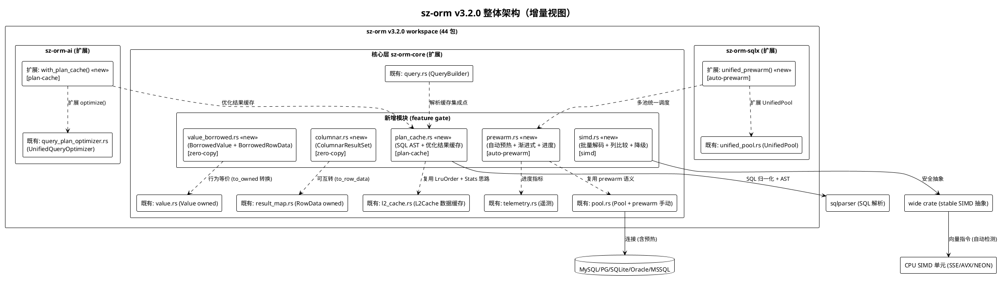

### 2.0.2 4 大模块在 workspace 中的定位

| 模块 | 需求组 | 包名 | 形态 | feature gate | 在 workspace 中的位置 | 依赖关系 |
|------|--------|------|------|-------------|---------------------|---------|
| 零拷贝序列化 | REQ-ZC-001~005 | `sz-orm-core` | **扩展新模块** | `zero-copy` | `packages/sz-orm-core/src/value_borrowed.rs` + `columnar.rs` | 无新增依赖（std::borrow::Cow） |
| SIMD 加速 | REQ-SIMD-001~005 | `sz-orm-core` | **扩展新模块** | `simd` | `packages/sz-orm-core/src/simd.rs` | 新增 `wide` crate（stable，optional） |
| 连接池预热增强 | REQ-PW-001~005 | `sz-orm-core` + `sz-orm-sqlx` | **扩展模块 + 扩展 UnifiedPool** | `auto-prewarm` | `packages/sz-orm-core/src/prewarm.rs` + `unified_pool.rs` 扩展 | 无新增（复用 tokio + telemetry） |
| 查询计划缓存 | REQ-PC-001~005 | `sz-orm-core` + `sz-orm-ai` | **扩展新模块 + 扩展优化器** | `plan-cache` | `packages/sz-orm-core/src/plan_cache.rs` + `query_plan_optimizer.rs` 扩展 | 复用 sqlparser（已有 dev-dep，提升为 dep） |

### 2.0.3 与 v3.1.0 现有架构的演进关系

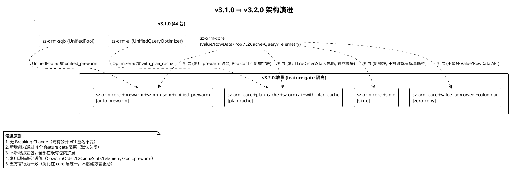

**演进关键决策**：

| 决策点 | 选项 | 选择 | 理由 |
|--------|------|------|------|
| 零拷贝实现形态 | A. 修改 Value 为 Cow / B. 新增并行 BorrowedValue | B | 修改 Value 破坏 API 兼容（生命周期参数传染）；并行类型通过 feature gate 隔离，默认 owned 不变 |
| 列式结果集位置 | A. 嵌入 result_map / B. 独立 columnar 模块 | B | 列式布局是独立的数据结构，与行式 RowData 职责分离；独立模块便于 feature gate |
| SIMD 抽象方式 | A. std::simd (nightly) / B. wide crate (stable) / C. 平台内联汇编 | B | wide 是 stable 安全抽象，不强制 nightly；内联汇编违反 unsafe 零容忍；std::simd 可作 nightly feature 可选项 |
| 自动预热触发方式 | A. Pool::new 内 tokio::spawn / B. 新增 Pool::new_async / C. 两者皆提供 | C | spawn 不阻塞构造但调用方不感知预热完成时机；new_async 显式 await 但需调用方迁移；两者皆提供覆盖不同场景 |
| 多池统一预热位置 | A. sz-orm-core / B. sz-orm-sqlx UnifiedPool / C. 新独立包 | B | UnifiedPool 已是多后端抽象点，unified_prewarm 是其自然延伸；core 层不感知多后端；新包过度设计 |
| 计划缓存与 L2Cache 关系 | A. 合并到 L2Cache / B. 独立 PlanCache 模块 | B | L2Cache 缓存查询结果数据（Value），PlanCache 缓存解析/优化结果（AST/Analysis），职责分离；独立模块避免 L2Cache 膨胀 |
| SQL 归一化实现 | A. 字符串正则替换 / B. sqlparser AST 规范化 | B | AST 规范化语义准确（忽略空白/注释/参数顺序），正则易出错；sqlparser 已是生态标准 |
| 缓存键哈希算法 | A. std DefaultHasher / B. FxHash / C. xxHash 64bit | C | xxHash 64bit 非加密但分布均匀速度快；DefaultHasher 随版本变化不稳定；FxHash 简单但碰撞率略高 |

---

## 2.1 零拷贝序列化（REQ-ZC-001~005）

### 2.1.1 模块目标

在 sz-orm-core 内扩展借用型值类型 `BorrowedValue<'a>` 与借用型行数据 `BorrowedRowData<'a>`，以及列式结果集 `ColumnarResultSet`，通过 feature gate "zero-copy" 隔离。启用后查询结果反序列化路径减少内存拷贝（分配减少 ≥50%，耗时减少 ≥30%），不启用时现有 owned `Value`/`RowData` API 完全不变。

### 2.1.2 架构设计

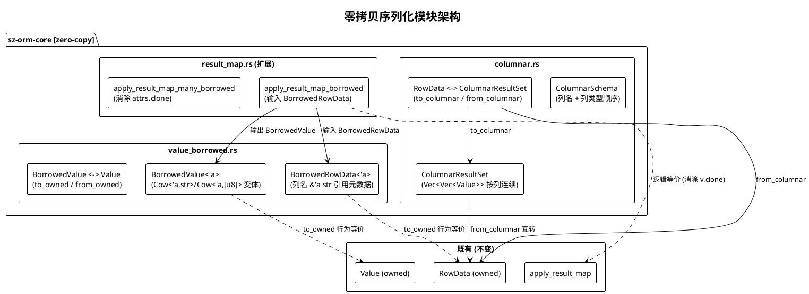

### 2.1.3 核心数据结构设计

**BorrowedValue<'a>** — 借用型值枚举，与 `Value` 变体一一对应，字符串/字节变体使用 `Cow<'a, str>` / `Cow<'a, [u8]>`：

- 标量变体（Null/Bool/I8..I64/U8..U64/F32/F64）：与 Value 相同（Copy 类型，零成本）
- 字符串类变体（Decimal/String/Uuid/Date/DateTime/Time/Json）：`Cow<'a, str>` 替代 `String`，Cow::Borrowed 引用原始行缓冲区，Cow::Owned 仅在需修改时
- Bytes 变体：`Cow<'a, [u8]>` 替代 `Vec<u8>`
- Array 变体：`Vec<BorrowedValue<'a>>`（元素借用）
- Object 变体：`HashMap<String, BorrowedValue<'a>>`（键 owned，值借用）
- 生命周期 `'a` 绑定到原始行缓冲区，编译期静态检查禁止悬垂引用
- 提供 `to_owned() -> Value`（Cow::Owned 时 clone，Cow::Borrowed 时 to_owned）与 `from(value: &Value) -> BorrowedValue<'_>`（引用 Value 内部数据）
- 实现 `Debug/Clone/PartialEq`，行为与 Value 等价

**BorrowedRowData<'a>** — 借用型行数据，列名引用元数据：

- `columns: HashMap<&'a str, BorrowedValue<'a>>`（键引用 schema 元数据列名，值借用行缓冲区）
- `'a` 绑定到 schema 列名元数据 + 行缓冲区
- 提供 `get(&str) -> Option<&BorrowedValue>`、`set(&'a str, BorrowedValue)`、`iter() -> Iterator<(&'a str, &BorrowedValue)>`
- 提供 `to_owned() -> RowData`（列名 to_string，值 to_owned）
- 约束：构造时需提供 schema 列名引用（来自 ResultMap 注册的 `&'static str` 或长期存活的结构）

**ColumnarResultSet** — 列式结果集，每列连续存储：

- `columns: Vec<Vec<Value>>`（外层 Vec 每元素为一列，内层 Vec 连续存储该列所有行的值）
- `schema: ColumnarSchema`（列名顺序 + 列类型，用于行列对应）
- `row_count: usize`（行数，等于每列 Vec 长度）
- 提供 `to_row_data() -> Vec<RowData>`（行式转换，按行组装 HashMap）与 `from_row_data(rows: &[RowData], schema) -> ColumnarResultSet`（列式转换）
- 提供 `column(&str) -> Option<&Vec<Value>>`（按列名取列，批量遍历缓存友好）
- 约束：每列长度必须等于 row_count，列顺序与 schema 一致

### 2.1.4 核心流程设计

**零拷贝反序列化流程**（apply_result_map_borrowed）：

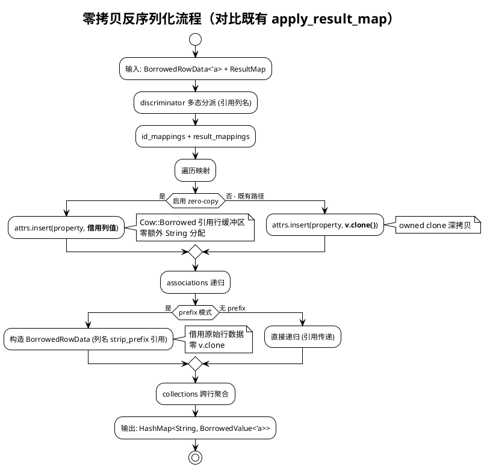

**关键优化点**（对比既有 clone 位置）：
- result_map.rs:545,550 的 `v.clone()` → 借用型路径改为 `BorrowedValue::from(v)` 引用
- result_map.rs:569 的 prefix 模式 `v.clone()` → 借用型路径列名 strip_prefix 引用，值借用
- result_map.rs:685 的 `attrs.clone()` → 借用型路径聚合时 move 而非 clone（或 Cow 浅 clone）

### 2.1.5 Feature gate 配置

```toml
# packages/sz-orm-core/Cargo.toml [features] 新增
zero-copy = []
# 无新增依赖，仅 std::borrow::Cow
```

- 默认不启用，启用后 `value_borrowed` + `columnar` 模块导出
- `#[cfg(feature = "zero-copy")]` 条件编译，未启用时零代码体积影响
- 与 simd feature 正交（可独立或组合启用）

### 2.1.6 与现有代码集成点

| 集成点 | 位置 | 集成方式 | 兼容性 |
|--------|------|---------|--------|
| Value 模块 | [value.rs:13](file:///E:/vue/test/鲜视达/rust/sz-orm/packages/sz-orm-core/src/value.rs#L13) | 新增 `value_borrowed` 模块，`BorrowedValue::to_owned() -> Value` 桥接 | 不修改 Value，新增并行类型 |
| RowData 模块 | [result_map.rs:397](file:///E:/vue/test/鲜视达/rust/sz-orm/packages/sz-orm-core/src/result_map.rs#L397) | 新增 `BorrowedRowData`，`to_owned() -> RowData` 桥接 | 不修改 RowData，新增并行类型 |
| 反序列化函数 | [result_map.rs:514](file:///E:/vue/test/鲜视达/rust/sz-orm/packages/sz-orm-core/src/result_map.rs#L514) | 新增 `apply_result_map_borrowed` 并行函数 | 不修改既有函数 |
| lib.rs 导出 | [lib.rs](file:///E:/vue/test/鲜视达/rust/sz-orm/packages/sz-orm-core/src/lib.rs) | `#[cfg(feature = "zero-copy")] pub mod value_borrowed;` + `pub mod columnar;` | 条件导出 |

---

## 2.2 SIMD 加速（REQ-SIMD-001~005）

### 2.2.1 模块目标

在 sz-orm-core 内扩展 SIMD 加速模块，通过 `wide` crate（stable 安全抽象）加速批量行解码与列比较，含运行时自动检测与降级。启用后批量操作（≥1024 元素）吞吐量 ≥2x，列比较耗时减少 ≥40%，不启用时全量标量路径不变。

### 2.2.2 架构设计

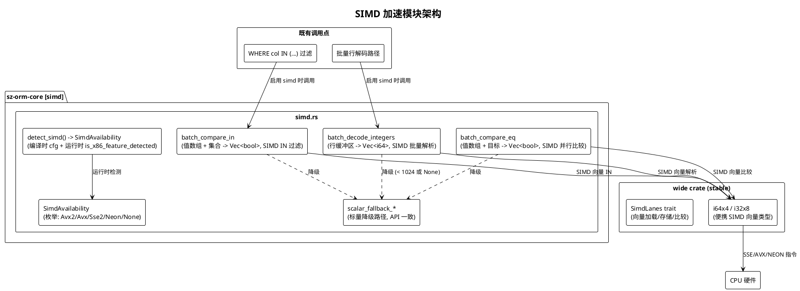

### 2.2.3 核心数据结构设计

**SimdAvailability** — SIMD 可用性枚举：

- 变体：`Avx2` / `Avx` / `Sse2` / `Neon`（ARM） / `None`（不支持）
- `detect_simd() -> SimdAvailability`：编译时 `cfg!(target_feature = "avx2")` 等检测 + 运行时 `is_x86_feature_detected!("avx2")` 宏（x86）；WASM 目标 `cfg!(target_arch = "wasm32")` 直接返回 None
- 缓存检测结果（`std::sync::OnceLock`，首次检测后缓存，避免重复开销）

**批量操作 API**（方法签名）：

- `batch_decode_integers(buf: &[u8], count: usize, avail: SimdAvailability) -> Vec<i64>`：批量解码整数列，count ≥ 1024 且 avail ≠ None 时 SIMD 路径，否则标量
- `batch_compare_eq(values: &[i64], target: i64, avail: SimdAvailability) -> Vec<bool>`：批量相等比较，SIMD i64x4 并行比较 4 元素
- `batch_compare_in(values: &[i64], set: &[i64], avail: SimdAvailability) -> Vec<bool>`：批量 IN 过滤，SIMD 向量比较 + 布尔掩码
- 标量降级路径 `scalar_decode_integers` / `scalar_compare_eq` / `scalar_compare_in`：API 签名与 SIMD 路径一致，仅逐元素处理

### 2.2.4 核心流程设计

**SIMD 批量解码流程**：

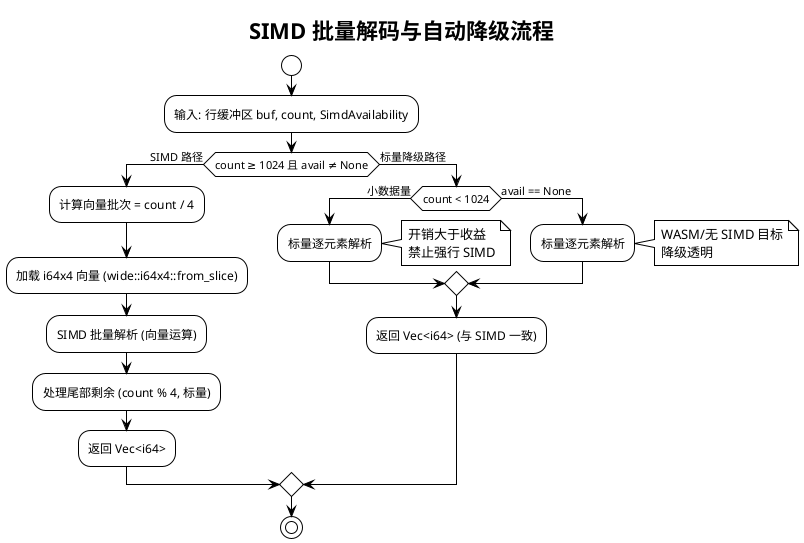

**关键设计决策**：
- 阈值 1024：小于此值 SIMD 开销（向量加载/存储）大于收益，回退标量（REQ-SIMD-005）
- 尾部处理：count 不一定是向量宽度整数倍，尾部 count % 4 元素标量处理
- 降级透明：SIMD 与标量 API 签名一致，调用方不感知降级（REQ-SIMD-003）
- 零 unsafe：通过 `wide` crate 安全抽象访问向量指令，禁止手写内联汇编（REQ-SIMD-004）

### 2.2.5 Feature gate 配置

```toml
# packages/sz-orm-core/Cargo.toml [features] 新增
simd = ["dep:wide"]
# [dependencies] 新增
wide = { version = "0.7", optional = true }
```

- 默认不启用，启用后引入 `wide` crate（stable，安全 SIMD 抽象）
- `#[cfg(feature = "simd")]` 条件编译，未启用时零依赖零代码体积
- WASM 目标：simd feature 自动降级（`cfg!(target_arch = "wasm32")` 检测返回 None，走标量路径）
- 可选 nightly 路径：`simd-nightly = ["simd"]` 启用 `std::simd` 便携 SIMD（需 nightly feature 隔离，不强制全项目 nightly）

### 2.2.6 与现有代码集成点

| 集成点 | 位置 | 集成方式 | 兼容性 |
|--------|------|---------|--------|
| 批量行解码 | 查询结果处理路径（result_map.rs 反序列化） | `#[cfg(feature = "simd")]` 调用 `batch_decode_integers`，否则标量 | 标量路径不变，SIMD 为可选加速 |
| WHERE IN 过滤 | [query.rs:36](file:///E:/vue/test/鲜视达/rust/sz-orm/packages/sz-orm-core/src/query.rs#L36) QueryBuilder 构造的 IN 条件执行 | `#[cfg(feature = "simd")]` 调用 `batch_compare_in`，否则标量 | 标量路径不变 |
| lib.rs 导出 | [lib.rs](file:///E:/vue/test/鲜视达/rust/sz-orm/packages/sz-orm-core/src/lib.rs) | `#[cfg(feature = "simd")] pub mod simd;` | 条件导出 |

---

## 2.3 连接池预热增强（REQ-PW-001~005）

### 2.3.1 模块目标

在 sz-orm-core 内增强既有预热能力（复用 `Pool::prewarm()` 语义），新增自动预热触发、渐进式分批策略、预热进度可观测；在 sz-orm-sqlx 的 UnifiedPool 扩展多池统一预热。通过 feature gate "auto-prewarm" 隔离自动预热行为，手动预热 API 保持不变（向后兼容）。

### 2.3.2 架构设计

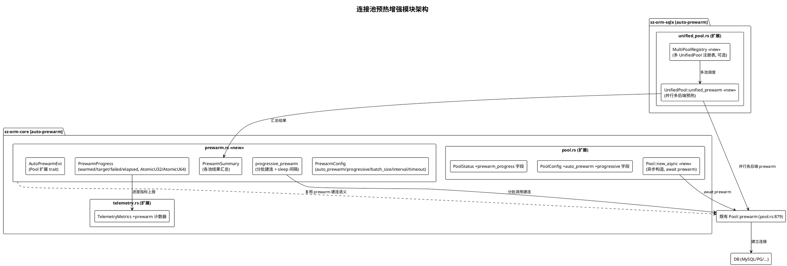

### 2.3.3 核心数据结构设计

**PrewarmConfig** — 预热配置（扩展 PoolConfig，向后兼容）：

- `auto_prewarm: bool`（默认 false，向后兼容；true 时池创建自动触发预热）
- `progressive: Option<ProgressiveConfig>`（None 为一次性预热复用既有；Some 为渐进式分批）
- **ProgressiveConfig**：`batch_size: u32`（每批连接数，默认 2）、`interval: Duration`（批间隔，默认 10ms）、`total_timeout: Duration`（总超时上限，默认 30s）
- 通过 `PoolConfigBuilder::auto_prewarm(bool)` + `progressive_prewarm(ProgressiveConfig)` 链式配置

**PrewarmProgress** — 预热进度（实时可观测）：

- `warmed: AtomicU32`（已预热成功数）
- `target: u32`（目标数 = min_idle）
- `failed: AtomicU32`（失败数）
- `elapsed: AtomicU64`（已耗时纳秒，Instant 起算）
- `is_completed: AtomicBool`（是否完成）
- 提供 `snapshot() -> PrewarmProgressSnapshot`（快照，含上述四项 + completed）
- 约束：warmed + failed ≤ target；完成后指标保留可查（不重置）

**PrewarmSummary** — 多池统一预热汇总：

- `results: Vec<BackendPrewarmResult>`（各后端结果）
- **BackendPrewarmResult**：`backend: AnyBackend`、`warmed: u32`、`failed: u32`、`elapsed: Duration`、`errors: Vec<String>`（失败原因）
- 提供 `total_warmed() / total_failed() / all_succeeded()` 聚合查询

**PoolStatus 扩展**（向后兼容）：

- 新增 `prewarm_progress: Option<PrewarmProgressSnapshot>`（None 表示未预热或未启用 auto-prewarm，既有调用方不受影响）

### 2.3.4 核心流程设计

**自动预热触发流程**：

```plantuml
@startuml
!theme plain
title 自动预热触发（两种方式）

start
:配置 auto_prewarm=true;
split :方式 A: Pool::new (同步)
  :Pool::new(config, factory);
  if (config.auto_prewarm) then (是)
    :tokio::spawn 后台 prewarm;
    note right: 不阻塞构造\n调用方不感知预热完成时机\n池立即可用(冷启动)
    :后台: 执行 prewarm 逻辑;
  else (否)
    :既有行为 (无预热);
  endif
split again :方式 B: Pool::new_async (异步)
  :Pool::new_async(config, factory).await;
  if (config.auto_prewarm) then (是)
    :await prewarm (阻塞至预热完成);
    note right: 调用方显式等待\n池就绪后返回(空闲 ≥ min_idle)
  else (否)
    :等同 Pool::new;
  endif
end split
:返回 Pool (prewarm_progress 可查);
stop

@enduml
```

**渐进式分批预热流程**：

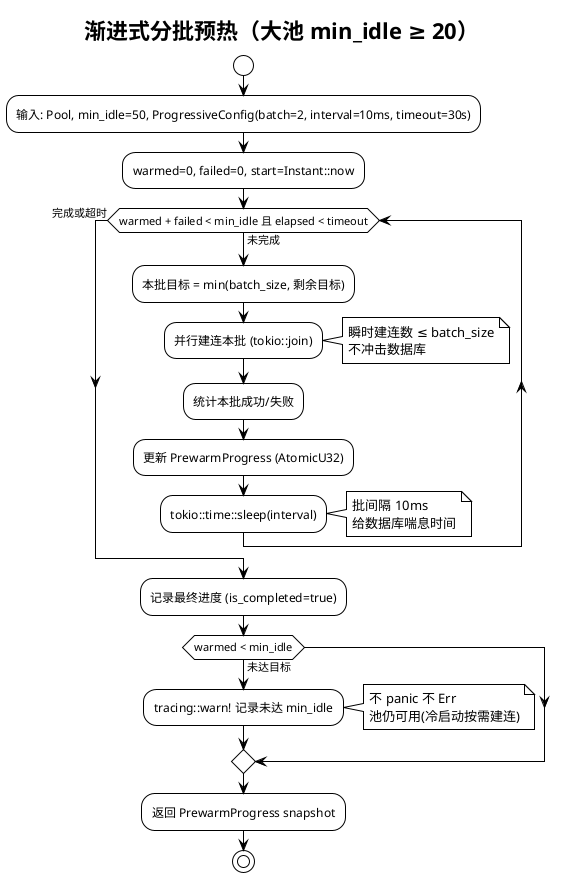

**多池统一预热流程**：

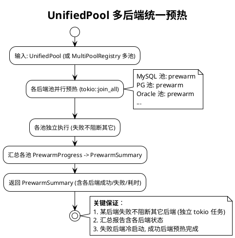

### 2.3.5 Feature gate 配置

```toml
# packages/sz-orm-core/Cargo.toml [features] 新增
auto-prewarm = []
# 无新增依赖（复用 tokio + telemetry）
# packages/sz-orm-sqlx/Cargo.toml [features] 新增
auto-prewarm = ["sz-orm-core/auto-prewarm"]
```

- 默认不启用，启用后 `prewarm` 模块导出 + PoolConfig 新增字段生效
- `#[cfg(feature = "auto-prewarm")]` 条件编译
- 未启用时：`Pool::prewarm()` 手动 API 保持不变，PoolConfig 无 auto_prewarm 字段（向后兼容）
- sz-orm-sqlx 的 auto-prewarm feature 转发 sz-orm-core，保证 UnifiedPool 扩展与 core 同步启用

### 2.3.6 与现有代码集成点

| 集成点 | 位置 | 集成方式 | 兼容性 |
|--------|------|---------|--------|
| Pool 预热 | [pool.rs:879](file:///E:/vue/test/鲜视达/rust/sz-orm/packages/sz-orm-core/src/pool.rs#L879) | 复用 prewarm 建连语义，新增 `new_async` + 后台 spawn 路径 | 既有 `prewarm()` 手动 API 不变 |
| PoolConfig | [pool.rs:545](file:///E:/vue/test/鲜视达/rust/sz-orm/packages/sz-orm-core/src/pool.rs#L545) | 新增 `auto_prewarm` + `progressive` 字段（默认 false/None 向后兼容） | Default 不变 |
| PoolStatus | [pool.rs:551](file:///E:/vue/test/鲜视达/rust/sz-orm/packages/sz-orm-core/src/pool.rs#L551) | 新增 `prewarm_progress: Option<...>` 字段（None 向后兼容） | 既有字段不变 |
| TelemetryMetrics | [telemetry.rs:83](file:///E:/vue/test/鲜视达/rust/sz-orm/packages/sz-orm-core/src/telemetry.rs#L83) | 新增 prewarm 原子计数器 | 既有字段不变 |
| UnifiedPool | [unified_pool.rs:48](file:///E:/vue/test/鲜视达/rust/sz-orm/packages/sz-orm-sqlx/src/unified_pool.rs#L48) | 新增 `unified_prewarm()` 方法 | 既有方法不变 |
| lib.rs 导出 | [lib.rs](file:///E:/vue/test/鲜视达/rust/sz-orm/packages/sz-orm-core/src/lib.rs) | `#[cfg(feature = "auto-prewarm")] pub mod prewarm;` | 条件导出 |

---

## 2.4 查询计划缓存（REQ-PC-001~005）

### 2.4.1 模块目标

在 sz-orm-core 内新增查询计划缓存模块 `PlanCache`，缓存 SQL 解析结果（AST）与查询优化结果（UnifiedQueryAnalysis），与既有 L2Cache（数据缓存）职责分离。通过 feature gate "plan-cache" 隔离，启用后相同 SQL 模板第二次起跳过解析/优化（≤1μs），含 schema 变更精确失效、LRU 淘汰、命中率统计。

### 2.4.2 架构设计

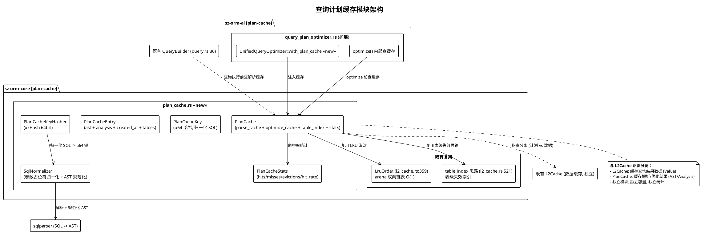

### 2.4.3 核心数据结构设计

**PlanCacheKey** — 缓存键（无碰撞设计）：

- `hash: u64`（xxHash 64bit，归一化 SQL 哈希）
- `sql_normalized: String`（归一化 SQL 文本，可选二次校验，防止哈希碰撞）
- 约束：哈希基于 SQL 模板归一化（参数占位符替换为统一标记 $1/$2），**不含参数值**（REQ-PC-001 安全性），**不含敏感信息**（密码/token 不进入缓存键）

**SqlNormalizer** — SQL 归一化：

- `normalize(sql: &str) -> (String, Vec<&str>)`：返回（归一化 SQL，参数占位符列表）
- 实现：sqlparser 解析 SQL → AST → 规范化（忽略空白/注释/参数顺序，参数值替换为 $1/$2 占位符）→ 重新生成归一化 SQL 文本
- 约束：相同语义不同写法（如 `SELECT * FROM t WHERE id=?` vs `select * from t where id = ?`）归一化后相同（命中同一缓存）

**PlanCacheEntry** — 缓存条目：

- `ast: Option<sqlparser::ast::Statement>`（SQL 解析 AST，Clone-able）
- `analysis: Option<UnifiedQueryAnalysis>`（查询优化结果，可选）
- `created_at: Instant`（创建时间，用于 TTL 判断）
- `tables: Vec<String>`（依赖表列表，用于 schema 变更精确失效）
- `ttl: Option<Duration>`（TTL，None 为永不过期）

**PlanCache** — 计划缓存主体：

- `parse_cache: RwLock<HashMap<u64, PlanCacheEntry>>`（SQL 解析结果缓存，键为 PlanCacheKey.hash）
- `optimize_cache: RwLock<HashMap<u64, PlanCacheEntry>>`（优化结果缓存，独立条目）
- `access_order: RwLock<LruOrder>`（LRU 访问顺序，复用 [l2_cache.rs:359](file:///E:/vue/test/鲜视达/rust/sz-orm/packages/sz-orm-core/src/l2_cache.rs#L359) 的 arena 双向链表）
- `table_index: RwLock<HashMap<String, Vec<u64>>>`（表级失效索引，table -> Vec<cache_key_hash>，复用 L2Cache table_index 思路）
- `stats: RwLock<PlanCacheStats>`（命中率统计）
- `max_size: usize`（容量上限，默认 1024）
- `default_ttl: Option<Duration>`（默认 TTL）
- 锁顺序约定：parse_cache → access_order → table_index → stats（复用 L2Cache 锁顺序约定避免死锁）
- 使用 parking_lot::RwLock 防毒化（与 L2Cache 一致）

**PlanCacheStats** — 命中率统计（复用 [L2CacheStats:214](file:///E:/vue/test/鲜视达/rust/sz-orm/packages/sz-orm-core/src/l2_cache.rs#L214) 思路）：

- `parse_hits/parse_misses/optimize_hits/optimize_misses: AtomicU64`（解析/优化分别统计）
- `evictions: AtomicU64`（LRU 淘汰次数）
- `size: usize`（当前条目数）
- 提供 `parse_hit_rate() / optimize_hit_rate() -> f64`

### 2.4.4 核心流程设计

**查询计划缓存主流程**：

```plantuml
@startuml
!theme plain
title 查询计划缓存主流程（解析 + 优化双缓存）

start
:输入: SQL 模板 + 参数;
:SqlNormalizer::normalize(sql) -> 归一化 SQL;
:PlanCacheKeyHasher::hash(归一化SQL) -> u64 键;
note right: 键不含参数值\n不含敏感信息

== 解析缓存查找 ==
if (parse_cache 查找键) then (命中)
  :返回 AST (≤1μs);
  :stats.parse_hits++;
  :LRU touch (移到 MRU 端);
else (未命中)
  :stats.parse_misses++;
  :sqlparser 解析 SQL -> AST;
  :提取依赖表列表 (AST 遍历);
  :存入 parse_cache + table_index;
  :LRU 淘汰 (若达容量上限);
endif

== 优化缓存查找 (可选) ==
if (启用优化器) then (是)
  if (optimize_cache 查找键) then (命中)
    :返回 UnifiedQueryAnalysis (≤1μs);
    :stats.optimize_hits++;
  else (未命中)
    :stats.optimize_misses++;
    :UnifiedQueryOptimizer::optimize(sql, schema) -> Analysis;
    :存入 optimize_cache;
  endif
else (否)
  :跳过优化;
endif

:执行查询 (参数化绑定, 缓存不干预执行);
:返回结果;
stop

@enduml
```

**Schema 变更精确失效流程**：

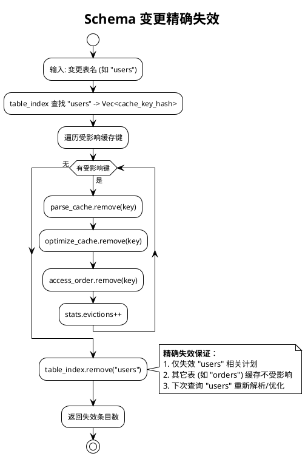

**关键设计决策**：
- 双缓存分离：parse_cache 与 optimize_cache 独立条目，因优化结果可能晚于解析（按需优化），分别统计命中率
- 并发竞态处理：允许多线程并发缓存同一 SQL（不锁定），最终 last-write-wins 保留一个条目，不影响正确性（REQ-PC-005 异常场景 4）
- 缓存键碰撞防护：xxHash 64bit 碰撞概率极低 + 可选 sql_normalized 二次校验，碰撞时回退解析（不返回错误计划）
- 参数化铁律不变：缓存的是 SQL 模板（参数占位符），参数仍必须参数化绑定执行，禁止将参数值拼入缓存键（spec §4.3 安全性 S-04）

### 2.4.5 Feature gate 配置

```toml
# packages/sz-orm-core/Cargo.toml [features] 新增
plan-cache = ["dep:sqlparser"]
# [dependencies] sqlparser 从 dev-dependency 提升为 optional dependency
sqlparser = { version = "0.47", optional = true }
# 哈希依赖（xxHash）
xxhash-rust = { version = "0.8", optional = true, features = ["xxh64"] }
# plan-cache feature 同时启用 xxhash
plan-cache = ["dep:sqlparser", "dep:xxhash-rust"]

# packages/sz-orm-ai/Cargo.toml [features] 新增
plan-cache = ["sz-orm-core/plan-cache"]
```

- 默认不启用，启用后引入 sqlparser（从 dev-dep 提升为 optional dep）+ xxhash-rust
- `#[cfg(feature = "plan-cache")]` 条件编译
- sz-orm-ai 的 plan-cache feature 转发 sz-orm-core，保证优化器扩展与 core 同步启用
- 未启用时：零依赖零代码体积，查询每次重新解析/优化（既有行为不变）

### 2.4.6 与现有代码集成点

| 集成点 | 位置 | 集成方式 | 兼容性 |
|--------|------|---------|--------|
| LruOrder 复用 | [l2_cache.rs:359](file:///E:/vue/test/鲜视达/rust/sz-orm/packages/sz-orm-core/src/l2_cache.rs#L359) | PlanCache 直接使用 LruOrder（arena 双向链表 O(1)） | LruOrder 为 pub，不修改 |
| L2CacheStats 思路 | [l2_cache.rs:214](file:///E:/vue/test/鲜视达/rust/sz-orm/packages/sz-orm-core/src/l2_cache.rs#L214) | PlanCacheStats 复用 hits/misses/hit_rate 模式 | 独立结构，不修改 L2CacheStats |
| table_index 思路 | [l2_cache.rs:521](file:///E:/vue/test/鲜视达/rust/sz-orm/packages/sz-orm-core/src/l2_cache.rs#L521) | PlanCache table_index 复用表级失效思路 | 独立字段，不修改 L2Cache |
| QueryBuilder | [query.rs:36](file:///E:/vue/test/鲜视达/rust/sz-orm/packages/sz-orm-core/src/query.rs#L36) | 查询执行前 `#[cfg(feature = "plan-cache")]` 查 PlanCache | 未启用时直接解析，既有行为不变 |
| UnifiedQueryOptimizer | [query_plan_optimizer.rs:515](file:///E:/vue/test/鲜视达/rust/sz-orm/packages/sz-orm-ai/src/query_plan_optimizer.rs#L515) | 新增 `with_plan_cache(cache)` 方法，optimize() 内部查缓存 | 未调用 with_plan_cache 时行为不变 |
| Schema 变更触发 | 迁移工具（migration.rs）DDL 执行后 | `#[cfg(feature = "plan-cache")]` 调用 `plan_cache.invalidate_table(table)` | 未启用时不触发，既有迁移不变 |
| lib.rs 导出 | [lib.rs](file:///E:/vue/test/鲜视达/rust/sz-orm/packages/sz-orm-core/src/lib.rs) | `#[cfg(feature = "plan-cache")] pub mod plan_cache;` | 条件导出 |

---

## 2.5 接口设计

### 2.5.1 总体设计

v3.2.0 新增接口按四个方向分组，全部通过 feature gate 隔离，默认不导出。接口稳定性等级：全部为**稳定**（v3.2.0 首次提供，后续按 semver 兼容）。

| 接口分组 | 所属方向 | feature gate | 接口数量 | 稳定性 |
|---------|---------|-------------|---------|--------|
| 借用型值类型 | 零拷贝 | `zero-copy` | 5 | 稳定 |
| 列式结果集 | 零拷贝 | `zero-copy` | 4 | 稳定 |
| SIMD 批量操作 | SIMD | `simd` | 4 | 稳定 |
| 自动预热 | 预热增强 | `auto-prewarm` | 6 | 稳定 |
| 多池统一预热 | 预热增强 | `auto-prewarm` | 2 | 稳定 |
| 查询计划缓存 | 计划缓存 | `plan-cache` | 7 | 稳定 |

### 2.5.2 接口清单

#### 零拷贝序列化接口

**BorrowedValue<'a>** — 借用型值类型

- `BorrowedValue::from(value: &Value) -> BorrowedValue<'_>`：从 owned Value 引用构造借用型
- `BorrowedValue::to_owned(&self) -> Value`：转换为 owned Value（Cow::Borrowed 时 to_owned）
- `BorrowedValue::as_str(&self) -> Option<&str>`：字符串类变体返回引用（零拷贝）
- `BorrowedValue::as_bytes(&self) -> Option<&[u8]>`：字节变体返回引用
- `BorrowedValue::eq(&self, other: &Value) -> bool`：借用型与 owned 比较（行为等价）
- 前置条件：`'a` 绑定的原始缓冲区生命周期 ≥ BorrowedValue 生命周期
- 后置条件：to_owned 后与原 Value 行为等价

**BorrowedRowData<'a>** — 借用型行数据

- `BorrowedRowData::new(schema: &'a [&'a str]) -> Self`：按 schema 列名构造空行
- `BorrowedRowData::get(&self, col: &str) -> Option<&BorrowedValue<'a>>`：按列名取值引用
- `BorrowedRowData::to_owned(&self) -> RowData`：转换为 owned RowData
- `BorrowedRowData::iter(&self) -> impl Iterator<Item = (&'a str, &BorrowedValue<'a>)>`：列迭代

**ColumnarResultSet** — 列式结果集

- `ColumnarResultSet::from_row_data(rows: &[RowData], schema: ColumnarSchema) -> Self`：行式转列式
- `ColumnarResultSet::to_row_data(&self) -> Vec<RowData>`：列式转行式
- `ColumnarResultSet::column(&self, name: &str) -> Option<&Vec<Value>>`：按列名取列（批量遍历缓存友好）
- `ColumnarResultSet::row_count(&self) -> usize`：行数

#### SIMD 加速接口

**SimdAvailability** — SIMD 可用性

- `SimdAvailability::detect() -> SimdAvailability`：运行时检测（OnceLock 缓存）
- `SimdAvailability::is_available(&self) -> bool`：是否支持 SIMD

**批量操作**（方法签名）

- `batch_decode_integers(buf: &[u8], count: usize, avail: SimdAvailability) -> Vec<i64>`：批量整数解码
- `batch_compare_eq(values: &[i64], target: i64, avail: SimdAvailability) -> Vec<bool>`：批量相等比较
- `batch_compare_in(values: &[i64], set: &[i64], avail: SimdAvailability) -> Vec<bool>`：批量 IN 过滤
- 前置条件：count ≥ 1024 且 avail.is_available() 走 SIMD，否则自动标量降级
- 后置条件：SIMD 与标量结果完全一致

#### 连接池预热增强接口

**Pool 自动预热扩展**

- `Pool::new_async(config: PoolConfig, factory: Arc<dyn ConnectionFactory>) -> Result<Pool>`：异步构造（await prewarm）
- `Pool::prewarm_progress(&self) -> Option<PrewarmProgressSnapshot>`：查询预热进度
- `PoolConfigBuilder::auto_prewarm(self, enabled: bool) -> Self`：配置自动预热
- `PoolConfigBuilder::progressive_prewarm(self, config: ProgressiveConfig) -> Self`：配置渐进式预热
- `PoolStatus::prewarm_progress(&self) -> Option<&PrewarmProgressSnapshot>`：PoolStatus 查询预热进度
- 前置条件：auto_prewarm=true 时池创建后自动预热
- 后置条件：预热完成后空闲 ≥ min_idle（DB 可达时）；失败不阻断池创建

**UnifiedPool 多池统一预热**

- `UnifiedPool::unified_prewarm(&self) -> PrewarmSummary`：单 UnifiedPool 预热（委托内部 Pool）
- `MultiPoolRegistry::unified_prewarm_all(&self) -> PrewarmSummary`：多池注册表统一预热（并行各后端）
- 后置条件：各后端独立预热，部分失败不阻断其它；汇总含各后端结果

#### 查询计划缓存接口

**PlanCache** — 计划缓存

- `PlanCache::new(max_size: usize, default_ttl: Option<Duration>) -> Self`：创建缓存
- `PlanCache::get_or_parse(&self, sql: &str) -> Arc<Statement>`：获取或解析 AST（命中跳过解析）
- `PlanCache::get_or_optimize(&self, sql: &str) -> Option<Arc<UnifiedQueryAnalysis>>`：获取或优化结果
- `PlanCache::invalidate_table(&self, table: &str) -> usize`：表级失效（返回失效条目数）
- `PlanCache::invalidate_all(&self)`：全量失效
- `PlanCache::stats(&self) -> PlanCacheStats`：命中率统计
- `PlanCache::with_max_size(self, size: usize) -> Self`：配置容量
- 前置条件：缓存键基于 SQL 归一化（不含参数值/敏感信息）
- 后置条件：命中时返回缓存计划（≤1μs）；schema 变更后受影响条目失效

**UnifiedQueryOptimizer 扩展**

- `UnifiedQueryOptimizer::with_plan_cache(self, cache: Arc<PlanCache>) -> Self`：注入计划缓存
- 后置条件：optimize() 内部先查缓存命中跳过；未注入时行为不变

---

## 2.6 数据模型

### 2.6.1 设计目标

v3.2.0 数据模型围绕四个优化方向的领域对象设计，需支持：

1. 借用型值/行数据的生命周期安全（编译期静态检查）
2. SIMD 可用性的运行时检测与缓存
3. 预热进度的实时可观测与完成后保留
4. 查询计划缓存的 LRU 淘汰 + 表级失效 + 命中率统计
5. 与现有 Value/RowData/Pool/L2Cache 的兼容互转

### 2.6.2 模型实现

```plantuml
@startuml
!theme plain
title v3.2.0 核心领域对象类图

' 零拷贝
class BorrowedValue<'a> {
  +Null
  +Bool(bool)
  +I64(i64)
  +String(Cow<'a, str>)
  +Bytes(Cow<'a, [u8]>)
  +Array(Vec<BorrowedValue<'a>>)
  +to_owned() : Value
  +from(value: &Value) : BorrowedValue
  +as_str() : Option<&str>
}
class BorrowedRowData<'a> {
  -columns : HashMap<&'a str, BorrowedValue<'a>>
  +get(col: &str) : Option<&BorrowedValue>
  +to_owned() : RowData
}
class ColumnarResultSet {
  -columns : Vec<Vec<Value>>
  -schema : ColumnarSchema
  -row_count : usize
  +column(name: &str) : Option<&Vec<Value>>
  +to_row_data() : Vec<RowData>
}
class ColumnarSchema {
  +names : Vec<String>
  +types : Vec<DbType>
}

' SIMD
class SimdAvailability {
  +Avx2
  +Avx
  +Sse2
  +Neon
  +None
  +detect() : SimdAvailability
  +is_available() : bool
}

' 预热
class PrewarmConfig {
  +auto_prewarm : bool
  +progressive : Option<ProgressiveConfig>
}
class ProgressiveConfig {
  +batch_size : u32
  +interval : Duration
  +total_timeout : Duration
}
class PrewarmProgress {
  -warmed : AtomicU32
  -target : u32
  -failed : AtomicU32
  -elapsed : AtomicU64
  -is_completed : AtomicBool
  +snapshot() : PrewarmProgressSnapshot
}
class PrewarmSummary {
  +results : Vec<BackendPrewarmResult>
  +total_warmed() : u32
  +total_failed() : u32
}
class BackendPrewarmResult {
  +backend : AnyBackend
  +warmed : u32
  +failed : u32
  +elapsed : Duration
  +errors : Vec<String>
}

' 计划缓存
class PlanCache {
  -parse_cache : RwLock<HashMap<u64, PlanCacheEntry>>
  -optimize_cache : RwLock<HashMap<u64, PlanCacheEntry>>
  -access_order : RwLock<LruOrder>
  -table_index : RwLock<HashMap<String, Vec<u64>>>
  -stats : RwLock<PlanCacheStats>
  -max_size : usize
  +get_or_parse(sql: &str) : Arc<Statement>
  +invalidate_table(table: &str) : usize
  +stats() : PlanCacheStats
}
class PlanCacheEntry {
  +ast : Option<Statement>
  +analysis : Option<UnifiedQueryAnalysis>
  +created_at : Instant
  +tables : Vec<String>
  +ttl : Option<Duration>
}
class PlanCacheStats {
  -parse_hits : AtomicU64
  -parse_misses : AtomicU64
  -optimize_hits : AtomicU64
  -optimize_misses : AtomicU64
  -evictions : AtomicU64
  +parse_hit_rate() : f64
  +optimize_hit_rate() : f64
}
class PlanCacheKey {
  +hash : u64
  +sql_normalized : String
}

' 既有（引用）
class Value <<既有>>
class RowData <<既有>>
class LruOrder <<既有, 复用>>
class UnifiedQueryAnalysis <<既有>>

BorrowedValue ..> Value : to_owned / from
BorrowedRowData ..> RowData : to_owned
ColumnarResultSet ..> RowData : to_row_data
ColumnarResultSet --> ColumnarSchema
PrewarmConfig --> ProgressiveConfig
PrewarmSummary --> BackendPrewarmResult
PlanCache --> PlanCacheEntry
PlanCache --> LruOrder : 复用
PlanCache --> PlanCacheStats
PlanCacheEntry --> UnifiedQueryAnalysis

@enduml
```

**对象生命周期与持久化策略**：

| 领域对象 | 生命周期 | 创建/销毁策略 | 持久化 |
|---------|---------|-------------|--------|
| BorrowedValue<'a> | 绑定原始缓冲区 `'a` | 从行缓冲区构造，缓冲区释放时失效 | 无（内存引用） |
| BorrowedRowData<'a> | 绑定 schema + 行缓冲区 | 从查询结果构造，转换后释放 | 无 |
| ColumnarResultSet | 查询结果生命周期 | from_row_data 构造，to_row_data 后可释放 | 无 |
| SimdAvailability | 进程级单例（OnceLock） | 首次 detect() 创建，永久缓存 | 无 |
| PrewarmProgress | 池生命周期 | 池创建时创建，池关闭时销毁 | 无（内存 Atomic） |
| PrewarmSummary | 单次预热调用 | unified_prewarm 返回后由调用方持有 | 无 |
| PlanCache | 应用级（Arc 共享） | 应用启动创建，应用退出销毁 | 无（内存缓存，可选 TTL） |
| PlanCacheEntry | 缓存生命周期 | get_or_parse 创建，LRU 淘汰/失效销毁 | 无（内存） |
| PlanCacheStats | PlanCache 生命周期 | 随 PlanCache 创建，原子计数 | 无 |

---

## 2.7 里程碑划分

按 spec §优先级声明"连接池预热增强(3) → 查询计划缓存(4) → 零拷贝序列化(1) → SIMD 加速(2)"的收益/风险序推进，划分为 5 个里程碑：

| 里程碑 | 方向 | 任务 | 交付物 | 预估工期 | 风险 |
|--------|------|------|--------|---------|------|
| **M1** | 连接池预热增强 | REQ-PW-001~005 | `prewarm.rs` 模块 + `Pool::new_async` + `PoolConfig` 扩展 + `PrewarmProgress` + `UnifiedPool::unified_prewarm` + 渐进式分批 + telemetry 集成 + 单元/集成测试 | 3 天 | 低（复用既有 prewarm 语义） |
| **M2** | 查询计划缓存 | REQ-PC-001~005 | `plan_cache.rs` 模块 + `SqlNormalizer` + `PlanCache` + LRU 淘汰 + 表级失效 + 命中率统计 + `UnifiedQueryOptimizer::with_plan_cache` + 差分测试 | 4 天 | 中（缓存键碰撞需差分测试验证） |
| **M3** | 零拷贝序列化 | REQ-ZC-001~005 | `value_borrowed.rs` + `columnar.rs` + `BorrowedValue` + `BorrowedRowData` + `ColumnarResultSet` + `apply_result_map_borrowed` + 分配追踪基准 + 等价性测试 | 4 天 | 高（生命周期复杂度，API 使用难度） |
| **M4** | SIMD 加速 | REQ-SIMD-001~005 | `simd.rs` 模块 + `SimdAvailability` 检测 + `batch_decode_integers` + `batch_compare_*` + 标量降级 + wide crate 集成 + 差分测试（边界值） + WASM 降级验证 | 3 天 | 高（跨平台一致性，收益需基准验证） |
| **M5** | 集成验证 + 发布 | 全部 | Feature 全组合编译 + 五方言集成测试 + sz-pay 5139 回归 + v2.4.0 基准不回退 + 性能基准报告 + CHANGELOG + 需求追溯 | 2 天 | 中（feature 组合矩阵膨胀） |

**里程碑依赖关系**：

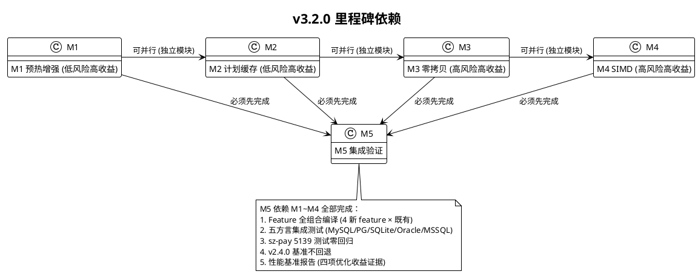

**关键里程碑验收标准**：

- **M1 验收**：AC-PW-1~6（自动预热 + 多池统一 + 进度可观测 + 渐进式 + 失败不静默 + 冷启动 P95 ≤ 20ms）
- **M2 验收**：AC-PC-1~6（解析缓存命中 ≤1μs + 优化缓存 + schema 失效 + LRU 淘汰 + 差分一致 + 命中率 ≥80%）
- **M3 验收**：AC-ZC-1~5（借用型零分配 + 列名借用 + 分配减少 ≥50%/耗时 ≥30% + 列式布局 + 可避免深拷贝为零）
- **M4 验收**：AC-SIMD-1~5（吞吐量 ≥2x + 比较耗时减少 ≥40% + WASM 降级 + 零 unsafe + <1024 回退标量）
- **M5 验收**：AC-ALL-1~8（无 Breaking Change + 全测试通过 + clippy 零警告 + feature 隔离 + 下游零回归 + 基准不回退 + 五方言一致 + 20 条需求全满足）

---

## 2.8 风险分析与缓解措施

| 编号 | 风险 | 等级 | 关联方向 | 缓解措施 | 验证方式 |
|------|------|------|---------|---------|---------|
| R-01 | 借用型值生命周期复杂度增加 API 使用难度 | 高 | 零拷贝 | feature gate 隔离默认 owned；提供清晰文档与示例；编译期静态检查（生命周期 `'a` 编译错误优于运行时） | 文档示例 + 编译测试（错误案例） |
| R-02 | SIMD 实现跨平台一致性维护成本 | 高 | SIMD | 优先 `wide` crate（stable）抽象；差分测试覆盖边界值（溢出/NaN/空集/极大极小）；WASM 自动降级验证 | 差分测试（proptest 随机输入）+ WASM 编译验证 |
| R-03 | `std::simd` 需 nightly 导致全项目 nightly 化力 | 中 | SIMD | SIMD 独立 feature gate，stable 路径用 `wide` crate，nightly 路径（`simd-nightly`）可选不强制 | `cargo check` stable + nightly 双路径验证 |
| R-04 | 自动预热在数据库不可达时影响启动体验 | 中 | 预热增强 | 预热失败不阻断池创建（复用 [pool.rs:866](file:///E:/vue/test/鲜视达/rust/sz-orm/packages/sz-orm-core/src/pool.rs#L866) 语义）；超时可配置；日志明确提示 | 集成测试（DB 不可达场景） |
| R-05 | 查询计划缓存键碰撞导致错误计划 | 中 | 计划缓存 | xxHash 64bit 强哈希 + 可选 SQL 文本二次校验；碰撞时回退解析不返回错误计划 | 差分测试（缓存 vs 未缓存结果一致） |
| R-06 | Schema 变更未通过迁移工具导致缓存未失效 | 中 | 计划缓存 | 提供手动 `invalidate_table` 接口 + 文档提示；迁移工具 DDL 后自动触发失效 | 集成测试（手动失效 + 迁移触发） |
| R-07 | 零拷贝与 SIMD 优化收益不达预期（基准验证） | 中 | 零拷贝/SIMD | 先行 spike 基准，收益不达预期则降优先级或取消；M3/M4 附基准证据 | criterion 基准测试（分配次数 + 吞吐量） |
| R-08 | 性能优化引入五方言行为差异 | 中 | 全部 | 五方言集成测试全覆盖；优化在 core 层统一，不触碰方言驱动（sz-orm-sqlx/oracle/mssql） | 五方言集成测试（MySQL/PG/SQLite/Oracle/MSSQL） |
| R-09 | feature 组合矩阵膨胀（4 新 feature × 既有组合） | 低 | 全部 | 纳入既有门禁 10 Feature 全组合编译；CI 矩阵覆盖 | `cargo check --all-features` + CI 矩阵 |
| R-10 | 下游 sz-pay 升级回归（虽 feature 默认关闭） | 中 | 全部 | 实际回归验证 5139 测试；feature gate 确保默认零行为变更 | sz-pay `cargo test` 5139 测试零回归 |
| R-11 | PlanCache 引入 sqlparser 从 dev-dep 提升为 dep 增加编译时间 | 低 | 计划缓存 | sqlparser 仅在 plan-cache feature 启用时引入（optional dep）；未启用时零影响 | 编译时间对比（启用 vs 未启用） |
| R-12 | 借用型与 owned 混用类型不符 | 中 | 零拷贝 | 提供 `BorrowedValue::to_owned` / `Value` 桥接；类型不匹配返回明确错误（非 panic） | 等价性测试（混用场景） |

**风险应对优先级**：R-01/R-02（高风险）需在 M3/M4 启动前先行 spike 基准验证收益，若不达预期则降级或取消；R-04/R-05/R-06（中风险）在里程碑内通过集成测试覆盖；R-09/R-10/R-11（低风险）在 M5 集成验证阶段统一处理。

---

## 2.9 性能基准验证方案

### 2.9.1 基准测试矩阵

| 基准组 | 方向 | 验收标准 | 测试方法 | 证据 |
|--------|------|---------|---------|------|
| 零拷贝反序列化 | 零拷贝 | 分配减少 ≥50%，耗时减少 ≥30% | 10000 行结果集，启用 vs 未启用 zero-copy，统计 String 分配次数 + 耗时 | criterion 基准报告 + 分配计数器 |
| SIMD 批量解码 | SIMD | 吞吐量 ≥2x | 1024+ 行整数列，SIMD vs 标量，统计吞吐量 | criterion 基准报告 |
| SIMD 列比较 | SIMD | 耗时减少 ≥40% | 1024+ 元素 IN/批量过滤，SIMD vs 标量 | criterion 基准报告 |
| 冷启动延迟 | 预热增强 | P95 ≤ 20ms（对比未预热 ≤100ms） | 自动预热 vs 冷启动，首次查询 P95 延迟 | 集成测试计时 |
| 计划缓存命中 | 计划缓存 | 命中耗时 ≤1μs，命中率 ≥80% | 重复 SQL 模板，第二次起命中计时 + 命中率统计 | 基准测试 + PlanCacheStats |
| v2.4.0 基线不回退 | 全部 | decision_latency P99 ≤100μs 等 | v3.2.0 vs v2.4.0 基准对比 | 基准对比报告 |

### 2.9.2 基准复现命令

```bash
# 零拷贝基准
cargo bench --features zero-copy --bench zero_copy_bench
# SIMD 基准
cargo bench --features simd --bench simd_bench
# 预热基准（需真实 DB）
cargo test --features auto-prewarm -- --ignored prewarm_bench
# 计划缓存基准
cargo bench --features plan-cache --bench plan_cache_bench
# v2.4.0 基线对比
cargo bench --bench core_bench  # 对比 v2.4.0 已验收基准
```

---

> **文档结束**