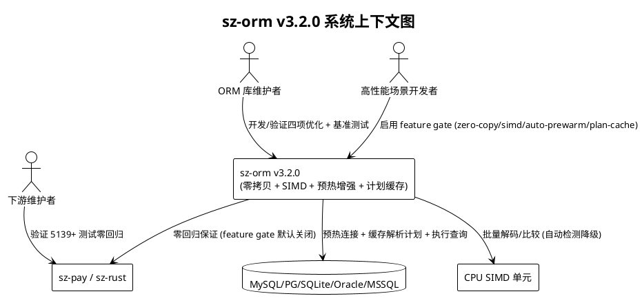
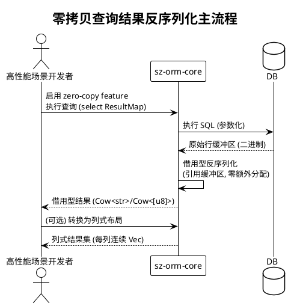
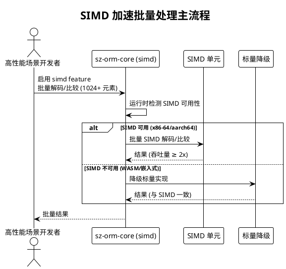
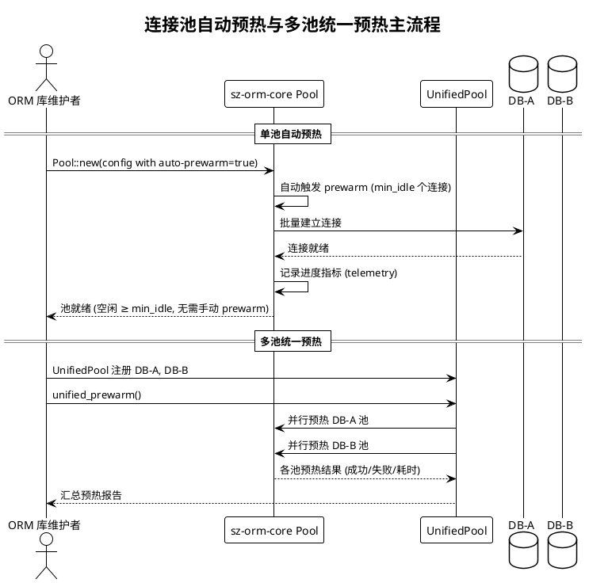
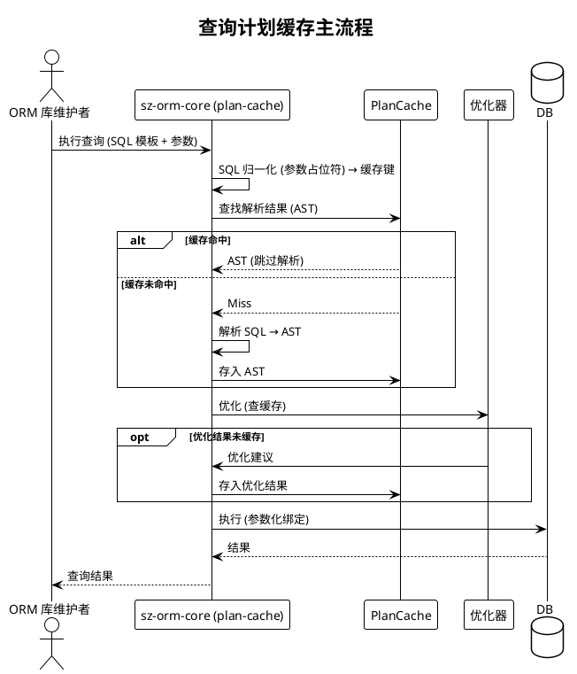

# sz-orm v3.2.0 需求规格说明书

> 版本：v3.2.0（性能深度优化）
> 基线：v3.1.0（已完成：GraphPool 连接池改进 + WASM TypeScript 定义 + rdkafka-sys 可选化 + OpenTelemetry 集成 + 全部 10 项交付）
> 日期：2026-08-08
> 需求格式：EARS（Ubiquitous / Event-driven / State-driven / Unwanted）
> 文档定位：需求规格（What to build），不含技术设计（How to build）
> 优先级声明：四个性能优化方向均为**中优先级**，按"连接池预热增强(3) → 查询计划缓存(4) → 零拷贝序列化(1) → SIMD 加速(2)"的收益/风险序推进；预热与计划缓存为低风险高收益，零拷贝与 SIMD 为高风险高收益需 feature gate 隔离

---

# 1. 组件定位

## 1.1 核心职责

本组件负责交付 sz-orm v3.2.0 的四项性能深度优化任务：零拷贝序列化、SIMD 加速、连接池预热增强、查询计划缓存，实现 sz-orm 在查询结果处理、批量数据操作、冷启动延迟、重复查询解析四个维度的性能突破，且不破坏现有 API 兼容性与五方言覆盖。

## 1.2 核心输入

1. **现有 Value 类型与 RowData 结构**：`Value` 枚举（`packages/sz-orm-core/src/value.rs:13`，含 String/Bytes/Decimal 等 owned 变体）与 `RowData`（`packages/sz-orm-core/src/result_map.rs:397`，`HashMap<String, Value>` owned 列名），作为零拷贝优化的既有基础与改造对象。
2. **现有查询结果反序列化路径**：`result_map.rs` 的 `apply_result_map` / `apply_result_map_many`（`packages/sz-orm-core/src/result_map.rs:514,641`），作为零拷贝反序列化的优化目标。
3. **现有连接池预热能力**：`PoolConfigBuilder::prewarm()`（`packages/sz-orm-core/src/pool.rs:684`）、`Pool::prewarm()`（`packages/sz-orm-core/src/pool.rs:879`）、`Pool::warmup()`（`packages/sz-orm-core/src/pool.rs:1563`），需手动调用，作为预热增强的既有基础。
4. **现有 L2Cache 数据缓存**：`L2Cache`（`packages/sz-orm-core/src/l2_cache.rs:517`，LRU + TTL + Redis 后端 + 失效总线），作为查询计划缓存的架构参考（但计划缓存与数据缓存独立）。
5. **现有查询构建与执行路径**：`query.rs`（`packages/sz-orm-core/src/query.rs`）与 `queryable.rs`（`packages/sz-orm-core/src/queryable.rs`），作为查询计划缓存的集成点。
6. **现有 AI 规则型查询优化器**：`QueryOptimizer`（`packages/sz-orm-ai/src/nl2sql.rs:1190`）与 `UnifiedQueryOptimizer`（`packages/sz-orm-ai/src/query_plan_optimizer.rs:440`），其优化结果可作为计划缓存对象。
7. **v2.4.0 性能基线**：decision_latency/resolve 68-81ns、smart_vs_manual 30.4ms vs 33.6ms、n1_elimination 60.6x 加速、WASM gzip 89.7KB，作为不回退基准。
8. **五方言覆盖约束**：MySQL/PostgreSQL/SQLite/Oracle/MSSQL，所有性能优化必须保持五方言行为一致。

## 1.3 核心输出

1. **零拷贝查询结果处理能力**：查询结果反序列化路径减少内存拷贝，提供借用型值类型与列式结果集布局选项。
2. **SIMD 加速批量处理能力**：批量行解码、列比较、类型转换等数据密集操作利用 SIMD 指令加速，含自动降级机制。
3. **连接池自动预热能力**：池创建时自动触发预热，多池统一预热，预热进度可观测，预热策略可配置。
4. **查询计划缓存能力**：SQL 解析结果与查询优化结果缓存，避免重复解析，含 schema 变更失效机制。
5. **性能基准报告**：v3.2.0 性能基准测试结果，证明四项优化收益且 v2.4.0 基线不回退。
6. **需求追溯矩阵**：本文档第 7 章，建立需求 ↔ 验收条件映射。

## 1.4 职责边界

本组件**不负责**以下事项：

1. **不重写 ORM 核心数据模型**：零拷贝优化以扩展方式提供（新增借用型类型 + feature gate），现有 `Value` / `RowData` owned API 保持完全向后兼容，不修改既有公开签名。
2. **不引入平台特定 SIMD 内联汇编**：SIMD 加速通过 Rust `std::simd`（便携 SIMD）或 `wide` crate 实现，禁止手写平台特定内联汇编，禁止 `unsafe`（除 `// SAFETY:` 论证注释）。
3. **不替代 L2Cache 数据缓存**：查询计划缓存是独立的新缓存层（缓存 SQL 解析/优化结果），与既有 L2Cache（缓存查询结果数据）职责分离，不合并、不替代。
4. **不负责数据库端查询计划缓存**：本组件仅缓存客户端侧的 SQL 解析与优化结果，数据库端 prepared statement 复用由各方言驱动自行管理，不干预。
5. **不负责 SIMD 在 WASM 目标的加速**：WASM 目标无原生 SIMD 稳定支持，SIMD 加速仅针对原生目标（x86-64/aarch64），WASM 目标自动降级为标量实现。
6. **不修改五方言驱动实现**：性能优化在 sz-orm-core 层提供，五方言驱动（sz-orm-sqlx/sz-orm-oracle/sz-orm-mssql）仅按需集成，不修改既有方言逻辑。
7. **不负责 sz-pay / sz-rust 下游代码**：下游零回归通过 feature gate 默认关闭保证，本组件仅提供上游就绪验证（ADR-0001 严禁修改下游/上游仓库）。

---

# 2. 领域术语

**零拷贝（Zero-Copy）**
: 在数据传递过程中避免不必要的内存拷贝（clone/copy），通过借用（`&T` / `Cow<T>`）或所有权转移（move）而非深拷贝传递数据。
: 备注：v3.2.0 零拷贝聚焦查询结果反序列化路径，非全量零拷贝重构。

**借用型值类型（Borrowed Value Type）**
: 与现有 owned `Value` 枚举对应的借用版本，字符串/字节变体使用 `Cow<'_, str>` / `Cow<'_, [u8]>` 而非 `String` / `Vec<u8>`，允许引用原始行缓冲区而非拷贝。
: 备注：通过 feature gate 隔离，默认使用 owned Value，启用后可选用借用型。

**列式结果集（Columnar Result Set）**
: 查询结果按列而非按行存储的布局（每列一个连续 Vec），提升批量处理缓存局部性，适合 SIMD 加速与批量导出场景。
: 备注：与现有 `RowData`（行式 `HashMap<String, Value>`）并存，按场景选择。

**SIMD（Single Instruction Multiple Data）**
: 单指令多数据，CPU 向量指令集（x86 SSE/AVX、ARM NEON）可一条指令处理多个数据元素，加速数据密集批量操作。
: 备注：Rust 通过 `std::simd`（便携 SIMD，nightly）或 `wide` crate（stable）抽象访问。

**便携 SIMD（Portable SIMD）**
: Rust `std::simd` 模块提供的跨平台 SIMD 抽象，编译时自动选择目标平台最优向量宽度，避免手写平台特定代码。

**连接池预热（Connection Pool Prewarming）**
: 在连接池创建时（或创建后立即）预创建一定数量（`min_idle`）的数据库连接放入空闲队列，避免首次查询时才建立连接导致的冷启动延迟。
: 备注：sz-orm 已有 `Pool::prewarm()`（`packages/sz-orm-core/src/pool.rs:879`），v3.2.0 增强为自动触发 + 多池统一 + 进度可观测。

**自动预热（Auto-Prewarm）**
: 池创建时自动触发预热（无需调用方手动调用 `pool.prewarm().await`），通过配置开关启用，默认行为可配置。

**渐进式预热（Progressive Prewarm）**
: 预热连接分批创建（如每批 2 个，间隔 10ms），避免瞬时大量建连对数据库造成冲击，适合大池（min_idle ≥ 20）场景。

**查询计划缓存（Query Plan Cache）**
: 缓存 SQL 语句的解析结果（AST）与优化结果（优化建议/重写 SQL），相同 SQL 再次执行时跳过解析与优化阶段，减少 CPU 开销。
: 备注：与 L2Cache（数据缓存）独立，计划缓存缓存"如何执行"，数据缓存缓存"执行结果"。

**SQL 解析结果（SQL Parse Result）**
: SQL 文本经 `sqlparser` crate 解析后的 AST（抽象语法树），是查询构建/优化/重写的中间表示。

**缓存失效（Cache Invalidation）**
: 当缓存依赖的条件变化时（如 schema 变更、表结构修改、索引增删），对应缓存条目必须被移除，禁止返回过期计划。

**冷启动延迟（Cold Start Latency）**
: 系统启动后首次查询的端到端延迟，含连接建立 + SQL 解析 + 查询执行，预热与计划缓存旨在降低此延迟。

---

# 3. 角色与边界

## 3.1 核心角色

- **ORM 库维护者**：执行 v3.2.0 四项性能优化任务的开发、验证、基准测试操作者，是新增能力的主要使用者与验收人。
- **高性能场景应用开发者**：在批量查询、大结果集、高并发冷启动等性能敏感场景使用 sz-orm 的开发者，是零拷贝/SIMD/预热/计划缓存的主要受益方。
- **sz-pay / sz-rust 下游维护者**：依赖 sz-orm 的下游项目方，关注 v3.2.0 升级是否零回归。

## 3.2 外部系统

- **MySQL / PostgreSQL / SQLite / Oracle / MSSQL**：现有 5 后端数据库，连接池预热与查询计划缓存的执行环境，五方言行为一致性验证对象。
- **CPU SIMD 单元（SSE/AVX/NEON）**：SIMD 加速的硬件依赖，运行时自动检测可用性。
- **sz-pay 项目**：下游验证项目（5139 测试基线），零回归验证对象。
- **sz-rust 项目**：下游框架项目，零回归验证对象。

## 3.3 交互上下文

---

# 4. DFX 约束

## 4.1 性能

1. **冷启动延迟降低**：启用自动预热后，系统启动后首次查询的 P95 延迟必须 ≤ 20ms（对比未预热冷启动 P95 ≤ 100ms，基线见 `packages/sz-orm-core/src/pool.rs:459` 注释）。
2. **查询计划缓存命中率**：在重复 SQL 场景（如 Web 应用相同查询不同参数），查询计划缓存命中率必须 ≥ 80%（缓存容量充足且无 schema 变更期间）。
3. **查询计划缓存收益**：缓存命中时 SQL 解析+优化阶段耗时必须 ≤ 1μs（对比未缓存解析+优化 P95 ≤ 100μs）。
4. **零拷贝反序列化收益**：启用零拷贝 feature 后，10000 行结果集反序列化的内存分配次数必须较未启用减少 ≥ 50%，耗时减少 ≥ 30%。
5. **SIMD 加速收益**：启用 SIMD feature 后，批量行解码（≥ 1024 行）吞吐量必须较标量实现提升 ≥ 2x（在支持 SIMD 的 x86-64/aarch64 目标）。
6. **现有基准不回退**：v3.2.0 不得使 v2.4.0 已验收的性能基准回退（decision_latency P99 ≤ 100μs、smart_vs_manual 比 ≤ 1.10、n1_elimination batch 更快、WASM gzip ≤ 1MB）。

## 4.2 可靠性

1. **预热失败不阻断**：连接池预热失败（数据库不可达）不得阻断池创建与应用启动，预热失败仅记录告警日志，池仍可冷启动（复用现有 `packages/sz-orm-core/src/pool.rs:866` 语义）。
2. **计划缓存不污染查询**：查询计划缓存返回的过期/错误计划不得导致查询结果错误，schema 变更后缓存必须失效，禁止使用过期计划执行查询。
3. **SIMD 降级正确性**：SIMD 不可用（不支持的目标平台/运行时检测失败）时自动降级为标量实现，降级路径结果必须与 SIMD 路径完全一致。
4. **零拷贝正确性**：借用型值类型与 owned 值类型在所有查询/序列化/比较场景下行为等价，借用型生命周期必须安全（无悬垂引用）。
5. **测试零失败**：全 workspace `cargo test --workspace` 必须全部通过（除明确 `#[ignore]` 的真实服务/外部依赖测试），含五方言集成测试。

## 4.3 安全性

1. **SIMD 无 unsafe 逃逸**：SIMD 加速实现禁止 `unsafe`（除 `// SAFETY:` 论证注释），通过 `std::simd` 或 `wide` crate 安全抽象访问向量指令。
2. **借用型无悬垂引用**：借用型值类型的生命周期必须静态可证安全，禁止 `unsafe` 强制延长生命周期，借用必须引用有效的原始缓冲区。
3. **计划缓存键无碰撞**：查询计划缓存的缓存键（SQL 归一化哈希）必须无碰撞（相同 SQL 不同语义 → 不同键；不同 SQL 相同语义 → 相同键可接受），禁止因键碰撞返回错误计划。
4. **参数化查询铁律不变**：查询计划缓存不得绕过参数化查询铁律，缓存的是 SQL 模板（参数占位符），参数仍必须参数化绑定，禁止将参数值拼入缓存键。
5. **敏感信息不缓存**：查询计划缓存键与缓存内容不得包含敏感参数值（密码、token），仅缓存 SQL 结构与占位符，参数值不进入缓存。

## 4.4 可维护性

1. **禁止占位实现**：新增代码禁止 `todo!` / `unimplemented!` / `unreachable!`。
2. **clippy 零警告**：`cargo clippy --workspace --all-targets -- -D warnings` 必须零警告。
3. **10 道门禁**：AGENTS.md 定义的全部门禁必须通过，含 Feature 全组合编译（新增 feature 必须纳入组合矩阵）。
4. **性能基准可复现**：v3.2.0 性能基准测试必须可复现（附命令 + 环境 + 结果），收益结论附基准测试输出证据。
5. **预热进度可观测**：连接池预热过程必须暴露进度指标（已预热数/目标数/失败数），可通过既有 telemetry（`packages/sz-orm-core/src/telemetry.rs`）或 PoolStatus 查询。

## 4.5 兼容性

1. **无 Breaking Change**：v3.2.0 所有新增能力以扩展方式提供，现有公开 API 签名（`Value` / `RowData` / `Pool` / `PoolConfig` 等）保持完全向后兼容。
2. **Rust 版本兼容**：edition = "2021"，rust-version = "1.81"，不得提升（SIMD 若需 nightly feature 则通过独立 feature gate 隔离，不强制全项目 nightly）。
3. **Feature 隔离**：零拷贝/SIMD/自动预热/查询计划缓存四项能力必须通过 feature gate 隔离，默认 feature 不引入额外依赖与行为变更。
4. **下游零回归**：sz-pay（5139 测试基线）与 sz-rust 在 v3.2.0 升级后必须零回归（feature gate 默认关闭，理论上无行为变更，但需实际回归验证）。
5. **五方言行为一致**：所有性能优化必须保持 MySQL/PostgreSQL/SQLite/Oracle/MSSQL 五方言行为一致，不得为某方言单独优化而破坏其它方言。

---

# 5. 核心能力

## 5.1 零拷贝序列化

> 现状：`Value` 枚举（`packages/sz-orm-core/src/value.rs:13`）使用 owned `String`/`Vec<u8>` 变体，`RowData`（`packages/sz-orm-core/src/result_map.rs:397`）使用 `HashMap<String, Value>` owned 列名，查询结果反序列化路径（`apply_result_map` / `apply_result_map_many`，`packages/sz-orm-core/src/result_map.rs:514,641`）存在多次 clone。`Value::to_param()`（`packages/sz-orm-core/src/value.rs:525`）已部分使用 `Cow<str>`，但仅限参数化输出。
> 形态：在 sz-orm-core 内扩展借用型值类型与列式结果集（feature gate "zero-copy"），不修改既有 owned `Value` / `RowData` API。

### 5.1.1 业务规则

1. **借用型值类型**（EARS: Ubiquitous）
   系统应当提供与现有 owned `Value` 行为等价的借用型值类型，其字符串/字节变体使用 `Cow<'_, str>` / `Cow<'_, [u8]>` 而非 `String` / `Vec<u8>`，允许引用原始行缓冲区而非拷贝，且可通过 feature gate 启用。
   a. 验收条件：[启用 zero-copy feature 并查询返回字符串/字节列] → [结果值引用原始缓冲区，零额外 String 分配；借用型值与 owned Value 在比较/序列化/类型转换场景行为等价]

2. **RowData 列名借用**（EARS: State-driven）
   在查询结果的列名来源于固定 schema 元数据（如 `ResultMap` 注册的列名）的状态下，系统应当允许 RowData 引用既有列名而非每次 clone owned String，减少 HashMap 键的内存分配。
   a. 验收条件：[查询使用已注册 ResultMap 且列名固定] → [RowData 列名引用元数据，零列名 String clone；行数据读写行为与 owned RowData 一致]

3. **查询结果零拷贝反序列化路径**（EARS: Event-driven）
   当用户启用零拷贝 feature 并执行查询时，系统应当在结果反序列化路径（`apply_result_map` / `apply_result_map_many`）中减少不必要的 Value clone 与 String 分配，优先借用原始行缓冲区或所有权转移（move）。
   a. 验收条件：[启用 zero-copy 执行 10000 行查询并反序列化] → [反序列化路径内存分配次数较未启用减少 ≥ 50%，耗时减少 ≥ 30%；结果与未启用行为完全一致]

4. **列式结果集布局**（EARS: State-driven）
   在批量查询结果需要列式处理（如批量导出、聚合计算、SIMD 加速）的状态下，系统应当提供列式结果集布局选项（每列一个连续 Vec），提升缓存局部性，且与现有行式 RowData 可互转。
   a. 验收条件：[查询并选择列式布局] → [结果按列连续存储，批量列遍历缓存命中率提升；列式结果可转换为行式 RowData 且数据一致]

5. **禁止项 — 隐式深拷贝**（EARS: Unwanted）
   如果启用零拷贝 feature 后，反序列化路径仍存在可避免的隐式深拷贝（如不必要的 `.clone()`、`to_string()`），则系统应当通过基准测试与分配追踪识别并消除，禁止零拷贝 feature 名不副实。
   a. 验收条件：[启用 zero-copy 运行分配追踪基准] → [可避免的深拷贝为零；基准报告附分配次数对比证据]

### 5.1.2 交互流程

### 5.1.3 异常场景

1. **借用型生命周期不足**
   a. 触发条件：借用型值引用的原始缓冲区已释放（如连接归还后仍持有借用型结果）
   b. 系统行为：编译期拒绝（生命周期静态检查），或运行期明确错误（若使用 Arc 共享）
   c. 用户感知：编译错误（推荐）或错误 `BorrowLifetimeError`（不 panic）

2. **列式布局不适用场景**
   a. 触发条件：查询仅需单行或少量行，列式布局开销大于收益
   b. 系统行为：保持行式 RowData，不强制列式
   c. 用户感知：结果仍为 RowData，无错误（布局由调用方选择）

3. **零拷贝与 owned 混用类型不符**
   a. 触发条件：借用型值与 owned Value 在同一操作中混用且类型不匹配
   b. 系统行为：返回类型错误，标注差异
   c. 用户感知：错误 `TypeMismatch` + 期望类型与实际类型

## 5.2 SIMD 加速

> 现状：sz-orm 无任何 SIMD 加适数据处理能力（全量标量实现），批量行解码、列比较、类型转换等数据密集操作逐元素处理。
> 形态：在 sz-orm-core 内扩展 SIMD 加速模块（feature gate "simd"），通过 `std::simd` 或 `wide` crate 安全抽象，含自动降级。

### 5.2.1 业务规则

1. **批量行解码 SIMD 加速**（EARS: Event-driven）
   当用户启用 SIMD feature 且查询返回大批量行（≥ 1024 行）需要解码时，系统应当利用 SIMD 指令批量解码行缓冲区（如整数列批量解析、字符串列批量长度计算），吞吐量较标量实现提升 ≥ 2x。
   a. 验收条件：[启用 simd feature 在 x86-64/aarch64 目标查询 1024+ 行整数列] → [解码吞吐量较标量提升 ≥ 2x；解码结果与标量完全一致]

2. **列比较批量过滤 SIMD**（EARS: Event-driven）
   当用户启用 SIMD feature 且对大批量值执行列比较（如 `WHERE col IN (...)`、批量过滤、批量去重）时，系统应当利用 SIMD 指令并行比较多个元素，减少比较循环耗时。
   a. 验收条件：[启用 simd feature 对 1024+ 元素执行 IN/批量过滤] → [比较耗时较标量减少 ≥ 40%；过滤结果与标量完全一致]

3. **SIMD 可用性自动检测与降级**（EARS: State-driven）
   在运行目标不支持 SIMD（如 WASM、部分嵌入式 ARM）或 SIMD 检测失败的状态下，系统应当自动降级为标量实现，降级对调用方透明，且降级路径结果与 SIMD 路径完全一致。
   a. 验收条件：[在 WASM 或无 SIMD 目标运行 SIMD 加速代码] → [自动降级标量执行，结果正确，无 panic，无 unsafe 逃逸]

4. **SIMD 安全抽象**（EARS: Ubiquitous）
   系统应当通过 Rust `std::simd`（便携 SIMD）或 `wide` crate（stable fallback）的安全抽象访问 SIMD 指令，禁止手写平台特定内联汇编，禁止 `unsafe`（除 `// SAFETY:` 论证注释）。
   a. 验收条件：[审查 SIMD 实现代码] → [零 `unsafe`（或每处均有 // SAFETY: 论证）；零内联汇编；跨 x86-64/aarch64 编译通过]

5. **禁止项 — 非 SIMD 安全场景误用**（EARS: Unwanted）
   如果数据量不足（< 1024 元素）或数据类型不适合 SIMD（如复杂嵌套对象、变长字符串），则系统应当回退标量实现，禁止对小数据量强行 SIMD 导致开销大于收益。
   a. 验收条件：[对 < 1024 元素或不适合 SIMD 的类型调用批量操作] → [回退标量实现，无 SIMD 开销；结果正确]

### 5.2.2 交互流程

### 5.2.3 异常场景

1. **SIMD 指令运行时不可用**
   a. 触发条件：目标 CPU 不支持预期 SIMD 指令集（如旧 CPU 无 AVX2）
   b. 系统行为：自动降级标量实现，记录降级日志
   c. 用户感知：结果正确，性能为标量水平，日志含降级原因

2. **SIMD 与标量结果不一致（回归 bug）**
   a. 触发条件：SIMD 实现与标量实现在边界值（溢出、NaN、空集）结果不一致
   b. 系统行为：差分测试拦截，阻断发布
   c. 用户感知：测试失败 + 不一致用例明细（开发期发现，不进入生产）

3. **SIMD feature 在 WASM 目标编译失败**
   a. 触发条件：启用 simd feature 并以 wasm32-unknown-unknown 目标编译
   b. 系统行为：simd feature 在 WASM 目标自动禁用或降级，编译通过
   c. 用户感知：WASM 产物编译成功，SIMD 降级标量（无错误）

## 5.3 连接池预热增强

> 现状：sz-orm 已有 `PoolConfigBuilder::prewarm()`（`packages/sz-orm-core/src/pool.rs:684`）、`Pool::prewarm()`（`packages/sz-orm-core/src/pool.rs:879`）、`Pool::warmup()`（`packages/sz-orm-core/src/pool.rs:1563`），但需调用方手动调用 `pool.prewarm().await`，且仅单池层面，无多池统一预热，预热进度不可观测。
> 形态：在 sz-orm-core 内增强既有预热能力（feature gate "auto-prewarm" 控制自动预热，手动预热 API 保持不变），新增多池统一预热与进度可观测。

### 5.3.1 业务规则

1. **自动预热**（EARS: Ubiquitous）
   系统应当提供连接池自动预热能力，在池创建时（`Pool::new`）自动触发预热（建立 `min_idle` 个连接），无需调用方手动调用 `pool.prewarm().await`，且可通过配置开关启用（默认行为可配置，向后兼容）。
   a. 验收条件：[配置 auto-prewarm=true 创建池] → [池创建后空闲连接数 ≥ min_idle，无需手动 prewarm 调用；未配置时行为与既有手动预热一致（向后兼容）]

2. **多池统一预热**（EARS: Event-driven）
   当用户通过 `UnifiedPool` / `AnyPool` 管理多个后端连接池时，系统应当支持统一预热接口，一次性预热所有已注册后端池，并汇总各池预热结果（成功数/失败数/总耗时）。
   a. 验收条件：[UnifiedPool 注册多后端并调用统一预热] → [所有后端池均被预热，返回汇总结果；某后端预热失败不阻断其它后端]

3. **预热进度可观测**（EARS: State-driven）
   在连接池预热进行中的状态下，系统应当暴露预热进度指标（已预热数/目标数/失败数/耗时），可通过既有 telemetry（`packages/sz-orm-core/src/telemetry.rs`）或 `PoolStatus` 查询，预热完成后指标保留可查。
   a. 验收条件：[预热过程中查询 PoolStatus 或 telemetry] → [返回已预热/目标/失败数与耗时；预热完成后指标可追溯]

4. **渐进式预热策略**（EARS: Event-driven）
   当用户配置大池（`min_idle` ≥ 20）并启用渐进式预热时，系统应当分批创建预热连接（如每批 2 个，间隔可配置），避免瞬时大量建连对数据库造成冲击，且总预热时间不超过可配置上限。
   a. 验收条件：[配置 min_idle=50 + 渐进式预热] → [连接分批创建，数据库瞬时建连数 ≤ 批大小；总预热时间 ≤ 配置上限；最终空闲连接数 ≥ min_idle]

5. **禁止项 — 预热失败静默吞错**（EARS: Unwanted）
   如果连接池预热过程中部分或全部连接创建失败，则系统应当明确记录失败原因与数量（复用既有 `packages/sz-orm-core/src/pool.rs:949` 的 `tracing::warn!` 语义），禁止静默吞掉错误导致调用方误以为预热成功。
   a. 验收条件：[预热时数据库不可达或部分失败] → [日志/指标明确记录失败数与原因；PoolStatus 反映实际空闲数 < min_idle；不 panic]

### 5.3.2 交互流程

### 5.3.3 异常场景

1. **预热时数据库不可达**
   a. 触发条件：池创建时数据库服务未启动或网络不通
   b. 系统行为：预热失败，记录告警日志，池仍可冷启动（复用 `packages/sz-orm-core/src/pool.rs:866` 语义）
   c. 用户感知：日志含预热失败原因，首次查询时冷启动建连（延迟略高但功能正常）

2. **渐进式预热超时**
   a. 触发条件：渐进式预热总时间超过配置上限（数据库建连慢）
   b. 系统行为：停止预热，已预热连接保留，记录未达 min_idle
   c. 用户感知：PoolStatus 显示空闲数 < min_idle，日志含超时原因，后续查询可触发按需建连

3. **多池预热部分失败**
   a. 触发条件：多后端中某后端预热失败（如 Oracle 不可达，MySQL 正常）
   b. 系统行为：失败后端记录错误，成功后端正常预热，不互相阻断
   c. 用户感知：汇总报告含各后端状态，失败后端冷启动，成功后端预热完成

## 5.4 查询计划缓存

> 现状：sz-orm 有 L2Cache 数据缓存（`packages/sz-orm-core/src/l2_cache.rs:517`，缓存查询结果数据），但**无查询计划缓存**（无 SQL 解析结果/优化结果缓存），每次查询重复解析 SQL 与运行优化器。AI 优化器 `UnifiedQueryOptimizer`（`packages/sz-orm-ai/src/query_plan_optimizer.rs:440`）的优化结果也未缓存。
> 形态：在 sz-orm-core 内新增查询计划缓存模块（feature gate "plan-cache"），与 L2Cache 独立，缓存 SQL 解析 AST 与优化结果。

### 5.4.1 业务规则

1. **SQL 解析结果缓存**（EARS: Ubiquitous）
   系统应当提供 SQL 解析结果（AST）缓存能力，相同 SQL 模板（参数占位符归一化后）再次解析时命中缓存跳过解析阶段，且可通过 feature gate 启用，缓存键基于 SQL 归一化哈希（不含参数值）。
   a. 验收条件：[启用 plan-cache feature 对相同 SQL 模板执行多次查询] → [第二次起解析命中缓存，解析耗时 ≤ 1μs；缓存键不含参数值；不同参数相同 SQL 模板命中同一缓存]

2. **查询优化结果缓存**（EARS: Event-driven）
   当用户启用查询计划缓存且查询经过优化器（规则型 `QueryOptimizer` 或 AI `UnifiedQueryOptimizer`）时，系统应当缓存优化结果（优化建议/重写 SQL），相同 SQL 模板再次优化时命中缓存跳过优化阶段。
   a. 验收条件：[启用 plan-cache 对相同 SQL 多次请求优化建议] → [第二次起优化命中缓存，优化耗时 ≤ 1μs；优化建议与首次一致]

3. **Schema 变更缓存失效**（EARS: Event-driven）
   当数据库 schema 发生变更（表结构修改、列增删、索引增删）时，系统应当失效受影响表的查询计划缓存条目，禁止使用过期计划执行查询，且失效范围精确（仅失效受影响表，不全量清空）。
   a. 验收条件：[缓存已有 table_a 查询计划 → 修改 table_a schema] → [table_a 相关计划缓存条目失效；其它表缓存不受影响；下次查询 table_a 重新解析/优化]

4. **缓存容量与淘汰策略**（EARS: State-driven）
   在查询计划缓存条目数达到配置容量上限的状态下，系统应当按淘汰策略（LRU，复用既有 `packages/sz-orm-core/src/l2_cache.rs:359` 的 `LruOrder` 设计思路）移除最久未用条目，且缓存命中率可统计（复用 `L2CacheStats` 命中率统计思路）。
   a. 验收条件：[缓存条目达上限后继续缓存新计划] → [LRU 淘汰最久未用条目；缓存命中率可通过 stats 查询；淘汰不影响正确性]

5. **禁止项 — 缓存污染导致错误计划**（EARS: Unwanted）
   如果查询计划缓存因键碰撞、过期未失效、并发竞态等原因返回错误计划，则系统应当通过差分测试与缓存键无碰撞设计杜绝，禁止缓存污染导致查询结果错误。
   a. 验收条件：[差分测试：缓存命中 vs 未缓存执行相同查询] → [结果完全一致；缓存键无碰撞（相同语义不同 SQL 可同键，不同语义同 SQL 必不同键）；并发场景无竞态错误]

### 5.4.2 交互流程

### 5.4.3 异常场景

1. **缓存键碰撞**
   a. 触发条件：两个不同语义的 SQL 归一化后哈希碰撞（极低概率）
   b. 系统行为：使用强哈希（如 FxHash/xxHash 64bit）+ 可选 SQL 文本二次校验，碰撞时回退解析
   c. 用户感知：结果正确（碰撞时回退，不返回错误计划），性能略降（回退解析）

2. **Schema 变更未触发失效**
   a. 触发条件：schema 变更未通过 sz-orm 迁移工具（手动 DDL），缓存未失效
   b. 系统行为：提供手动失效接口（`invalidate_table`），调用方显式失效
   c. 用户感知：手动调用失效后缓存清空，下次查询重新解析；未调用则可能用过期计划（需文档提示）

3. **缓存内存压力**
   a. 触发条件：缓存大量 SQL 计划导致内存占用过高
   b. 系统行为：LRU 淘汰 + 容量上限 + 可配置 TTL，超限时移除最久未用
   c. 用户感知：缓存大小受控，命中率与容量可通过 stats 查询

4. **并发缓存竞态**
   a. 触发条件：多线程并发缓存同一 SQL，可能重复解析
   b. 系统行为：允许重复解析（不锁定），最终只保留一个条目（last-write-wins），不影响正确性
   c. 用户感知：首次并发可能解析多次（轻微浪费），后续命中缓存，结果正确

---

# 6. 数据约束

## 6.1 零拷贝数据（方向 1）

1. **借用型值生命周期**：借用型值类型引用的原始缓冲区生命周期必须 ≥ 借用型值本身，禁止悬垂引用（编译期静态检查或 Arc 共享）。
2. **借用型与 owned 等价**：借用型值与 owned Value 在所有公开操作（比较/序列化/类型转换/参数化）下行为等价，差异仅在内存布局。
3. **列式布局完整性**：列式结果集每列长度必须等于行数，列顺序必须与 schema 元数据一致，转换为行式 RowData 时行列对应关系正确。

## 6.2 SIMD 数据（方向 2）

1. **SIMD 批量边界**：SIMD 加速批量操作的元素数必须 ≥ 1024（配置阈值），小于阈值回退标量。
2. **SIMD 结果等价**：SIMD 路径与标量路径在所有输入（含边界值：溢出、NaN、空集、极大/极小值）下结果完全一致。
3. **SIMD 降级透明**：降级路径对调用方透明，API 签名一致，仅性能差异，无行为差异。

## 6.3 连接池预热数据（方向 3）

1. **预热目标数**：预热目标连接数必须等于 `min_idle`（既有 `packages/sz-orm-core/src/pool.rs:468` 字段），不超过 `max_size`。
2. **预热进度指标**：预热进度必须含已预热数、目标数、失败数、耗时四项，可通过 PoolStatus 或 telemetry 查询，预热完成后指标保留。
3. **预热失败不阻断池**：预热失败时池仍可创建与使用（冷启动建连），失败仅记录日志与指标，不 panic、不 Err 返回池创建。

## 6.4 查询计划缓存数据（方向 4）

1. **缓存键归一化**：缓存键必须基于 SQL 模板归一化（参数占位符替换为统一标记）后的哈希，不含参数值，不含敏感信息。
2. **缓存条目内容**：缓存条目含 SQL 解析 AST、优化结果（可选）、创建时间、依赖表列表（用于 schema 变更失效）。
3. **缓存容量上限**：缓存容量必须可配置（默认建议 1024 条），达上限按 LRU 淘汰，淘汰策略与既有 `LruOrder`（`packages/sz-orm-core/src/l2_cache.rs:359`）思路一致。
4. **缓存命中率统计**：必须暴露命中次数/未命中次数/命中率三项指标，复用 `L2CacheStats`（`packages/sz-orm-core/src/l2_cache.rs:214`）设计思路。

---

# 7. 需求追溯矩阵

| 需求编号 | 需求描述 | EARS 类型 | 所属方向 | 验收条件 | 关联章节 |
|---------|---------|----------|---------|---------|---------|
| REQ-ZC-001 | 借用型值类型 | Ubiquitous | 方向1 零拷贝 | Cow 引用缓冲区，行为等价 | 5.1.1 规则1 |
| REQ-ZC-002 | RowData 列名借用 | State-driven | 方向1 零拷贝 | 列名引用元数据，零 clone | 5.1.1 规则2 |
| REQ-ZC-003 | 零拷贝反序列化路径 | Event-driven | 方向1 零拷贝 | 分配减少 ≥50%，耗时减少 ≥30% | 5.1.1 规则3 |
| REQ-ZC-004 | 列式结果集布局 | State-driven | 方向1 零拷贝 | 列式连续存储，可转行式 | 5.1.1 规则4 |
| REQ-ZC-005 | 禁止隐式深拷贝 | Unwanted | 方向1 零拷贝 | 可避免深拷贝为零 | 5.1.1 规则5 |
| REQ-SIMD-001 | 批量行解码 SIMD 加速 | Event-driven | 方向2 SIMD | 吞吐量 ≥ 2x，结果一致 | 5.2.1 规则1 |
| REQ-SIMD-002 | 列比较批量过滤 SIMD | Event-driven | 方向2 SIMD | 比较耗时减少 ≥40% | 5.2.1 规则2 |
| REQ-SIMD-003 | SIMD 自动检测与降级 | State-driven | 方向2 SIMD | 降级透明，结果一致 | 5.2.1 规则3 |
| REQ-SIMD-004 | SIMD 安全抽象 | Ubiquitous | 方向2 SIMD | 零 unsafe，零内联汇编 | 5.2.1 规则4 |
| REQ-SIMD-005 | 禁止小数据量 SIMD | Unwanted | 方向2 SIMD | <1024 回退标量 | 5.2.1 规则5 |
| REQ-PW-001 | 自动预热 | Ubiquitous | 方向3 预热增强 | 池创建自动预热，向后兼容 | 5.3.1 规则1 |
| REQ-PW-002 | 多池统一预热 | Event-driven | 方向3 预热增强 | 多后端统一预热，汇总结果 | 5.3.1 规则2 |
| REQ-PW-003 | 预热进度可观测 | State-driven | 方向3 预热增强 | 进度指标可查 | 5.3.1 规则3 |
| REQ-PW-004 | 渐进式预热策略 | Event-driven | 方向3 预热增强 | 分批建连，不冲击 DB | 5.3.1 规则4 |
| REQ-PW-005 | 禁止预热静默吞错 | Unwanted | 方向3 预热增强 | 失败明确记录 | 5.3.1 规则5 |
| REQ-PC-001 | SQL 解析结果缓存 | Ubiquitous | 方向4 计划缓存 | 命中跳过解析，键不含参数 | 5.4.1 规则1 |
| REQ-PC-002 | 查询优化结果缓存 | Event-driven | 方向4 计划缓存 | 优化结果命中跳过 | 5.4.1 规则2 |
| REQ-PC-003 | Schema 变更缓存失效 | Event-driven | 方向4 计划缓存 | 精确失效受影响表 | 5.4.1 规则3 |
| REQ-PC-004 | 缓存容量与淘汰策略 | State-driven | 方向4 计划缓存 | LRU 淘汰，命中率可统计 | 5.4.1 规则4 |
| REQ-PC-005 | 禁止缓存污染错误计划 | Unwanted | 方向4 计划缓存 | 差分测试一致，无碰撞 | 5.4.1 规则5 |

---

# 8. 约束条件汇总

## 8.1 语言与工具链

| 约束项 | 约束值 | 来源 |
|-------|-------|------|
| Rust edition | 2021 | workspace.package.edition |
| rust-version | 1.81 | workspace.package.rust-version |
| 异步运行时 | tokio 1.40 (full) | workspace.dependencies |
| SIMD 抽象 | `std::simd`（便携，需 nightly feature 隔离）或 `wide` crate（stable） | 新增 feature gate |

## 8.2 外部依赖

| 方向 | 外部依赖 | 用途 | Feature 隔离 |
|------|---------|------|-------------|
| 零拷贝 | 无新增（使用 std::borrow::Cow） | 借用型值 | `zero-copy` feature |
| SIMD | `wide` crate（stable）或 `std::simd`（nightly） | 便携 SIMD 抽象 | `simd` feature |
| 预热增强 | 无新增（复用既有 tokio + telemetry） | 自动/多池预热 | `auto-prewarm` feature |
| 查询计划缓存 | 无新增（复用既有 sqlparser + 哈希） | SQL 解析缓存 | `plan-cache` feature |

## 8.3 工程化铁律（沿用）

| 编号 | 铁律 | 验证方式 |
|------|------|---------|
| C-01 | 禁止占位实现 | grep todo!/unimplemented!/unreachable! |
| C-02 | unsafe 零容忍 | grep unsafe（须有 // SAFETY: 注释） |
| C-03 | 参数化查询 | where_eq/or_where_eq，禁止 where_cond/or_where |
| C-04 | 禁止 SELECT * | SQL 注入扫描脚本 |
| C-05 | API 向后兼容 | 无 Breaking Change |
| C-06 | clippy 零警告 | cargo clippy -- -D warnings |
| C-07 | 10 道门禁全通过 | gate.ps1 |
| C-08 | ADR-0001 不改上游 | git diff 零上游修改 |

---

# 9. 验收标准总览

## 9.1 方向 1 验收标准（零拷贝序列化）

- [ ] AC-ZC-1：启用 `zero-copy` feature 后，借用型值类型可引用原始缓冲区，零额外 String 分配（分配追踪基准证据）
- [ ] AC-ZC-2：RowData 列名借用元数据时零列名 clone，行数据读写行为与 owned 一致
- [ ] AC-ZC-3：10000 行反序列化内存分配减少 ≥ 50%，耗时减少 ≥ 30%（基准测试输出证据）
- [ ] AC-ZC-4：列式结果集布局可选用，可转行式 RowData，数据一致
- [ ] AC-ZC-5：分配追踪基准证明可避免深拷贝为零

## 9.2 方向 2 验收标准（SIMD 加速）

- [ ] AC-SIMD-1：启用 `simd` feature 在 x86-64/aarch64 查询 1024+ 行，解码吞吐量 ≥ 2x（基准证据）
- [ ] AC-SIMD-2：列比较批量过滤耗时较标量减少 ≥ 40%，结果一致
- [ ] AC-SIMD-3：WASM/无 SIMD 目标自动降级标量，结果正确，无 panic
- [ ] AC-SIMD-4：SIMD 实现零 unsafe（或每处 // SAFETY: 论证），零内联汇编，跨平台编译通过
- [ ] AC-SIMD-5：< 1024 元素或不适合类型回退标量，无 SIMD 开销

## 9.3 方向 3 验收标准（连接池预热增强）

- [ ] AC-PW-1：配置 `auto-prewarm=true` 创建池后空闲 ≥ min_idle，无需手动 prewarm（向后兼容验证）
- [ ] AC-PW-2：UnifiedPool 多后端统一预热，汇总各池结果，部分失败不阻断其它
- [ ] AC-PW-3：预热进度可通过 PoolStatus / telemetry 查询（已预热/目标/失败/耗时）
- [ ] AC-PW-4：渐进式预热分批建连，瞬时建连数 ≤ 批大小，总时间 ≤ 上限
- [ ] AC-PW-5：预热失败明确记录（日志 + 指标），不静默吞错，不 panic
- [ ] AC-PW-6：冷启动首次查询 P95 ≤ 20ms（对比未预热 ≤ 100ms）

## 9.4 方向 4 验收标准（查询计划缓存）

- [ ] AC-PC-1：启用 `plan-cache` 后相同 SQL 模板第二次解析命中缓存，耗时 ≤ 1μs，缓存键不含参数值
- [ ] AC-PC-2：查询优化结果缓存命中跳过优化，建议与首次一致
- [ ] AC-PC-3：Schema 变更精确失效受影响表计划，其它表缓存不受影响
- [ ] AC-PC-4：缓存达上限 LRU 淘汰，命中率可统计（命中/未命中/命中率）
- [ ] AC-PC-5：差分测试（缓存 vs 未缓存）结果完全一致，无键碰撞，无并发竞态错误
- [ ] AC-PC-6：重复 SQL 场景缓存命中率 ≥ 80%（容量充足无 schema 变更期间）

## 9.5 总体验收标准

- [ ] AC-ALL-1：v3.2.0 无 Breaking Change，v3.1.0 公开 API 全部保持不变
- [ ] AC-ALL-2：全 workspace `cargo test --workspace` 全部通过
- [ ] AC-ALL-3：全 workspace `cargo clippy --workspace --all-targets -- -D warnings` 零警告
- [ ] AC-ALL-4：四项能力全部 feature gate 隔离，默认 feature 不引入额外依赖与行为变更
- [ ] AC-ALL-5：sz-pay（5139 测试）与 sz-rust 下游零回归
- [ ] AC-ALL-6：v2.4.0 性能基准不回退（decision_latency/智能 vs 手动/N+1 消除/WASM 体积）
- [ ] AC-ALL-7：五方言行为一致性测试通过（MySQL/PG/SQLite/Oracle/MSSQL）
- [ ] AC-ALL-8：本需求规格文档所有 20 条 REQ 编号需求全部满足

---

# 10. 风险登记

| 编号 | 风险 | 等级 | 缓解措施 | 关联方向 |
|------|------|------|---------|---------|
| R-01 | 借用型值生命周期复杂度增加 API 使用难度 | 高 | feature gate 隔离，默认 owned；提供清晰文档与示例；编译期静态检查 | 零拷贝 |
| R-02 | SIMD 实现跨平台一致性维护成本 | 高 | 优先 `wide` crate（stable）抽象；差分测试覆盖边界值；WASM 自动降级 | SIMD |
| R-03 | `std::simd` 需 nightly 导致全项目 nightly 化力 | 中 | SIMD 独立 feature gate，stable 路径用 `wide` crate，nightly 路径可选 | SIMD |
| R-04 | 自动预热在数据库不可达时影响启动体验 | 中 | 预热失败不阻断池创建（复用既有语义）；超时可配置；日志明确提示 | 预热增强 |
| R-05 | 查询计划缓存键碰撞导致错误计划 | 中 | 强哈希（64bit）+ 可选 SQL 文本二次校验；差分测试验证 | 计划缓存 |
| R-06 | Schema 变更未通过迁移工具导致缓存未失效 | 中 | 提供手动失效接口 + 文档提示；迁移工具自动触发失效 | 计划缓存 |
| R-07 | 零拷贝与 SIMD 优化收益不达预期（基准验证） | 中 | 先行 spike 基准，收益不达预期则降优先级或取消 | 零拷贝/SIMD |
| R-08 | 性能优化引入五方言行为差异 | 中 | 五方言集成测试全覆盖；优化在 core 层统一，不触碰方言驱动 | 全部 |
| R-09 | feature 组合矩阵膨胀（4 新 feature × 既有组合） | 低 | 纳入既有门禁 10 Feature 全组合编译；CI 矩阵覆盖 | 全部 |
| R-10 | 下游 sz-pay 升级回归（虽 feature 默认关闭） | 中 | 实际回归验证 5139 测试；feature gate 确保默认零行为变更 | 全部 |

---

> **文档结束**