# sz-orm v3.3.0 技术设计文档

> 版本：v3.3.0（分布式缓存一致性 + GraphQL 查询支持 + 多租户与数据隔离 + AI 自然语言查询增强）
> 基线：v3.2.0（已完成：零拷贝序列化 + SIMD 加速 + 连接池预热增强 + 查询计划缓存）
> 日期：2026-08-08
> 文档定位：技术设计（How to build），对应需求规格 `docs/spec/v3.3.0/spec.md`（22 条 EARS 需求，4 组 REQ-DC/REQ-GQL/REQ-MT/REQ-AI）
> 设计约束：Rust 2021 Edition / rust-version 1.81 / API 向后兼容（无 Breaking Change）/ 禁止占位实现 / unsafe 零容忍 / 参数化查询铁律 / Feature 隔离 / 五方言行为一致
> 优先级声明：四个方向均为中优先级，按"多租户与数据隔离(3) → 分布式缓存一致性(1) → GraphQL 查询支持(2) → AI 自然语言查询增强(4)"的收益/风险序推进；多租户与缓存一致性为高收益中风险（复用既有 P0-3 多租户与 L2Cache 基础），GraphQL 与 AI 增强为中收益中风险（需 feature gate 隔离重依赖）

---

# 一、需求与存量功能关系分析

## 1.1 需求功能与存量功能对比

v3.3.0 的四项能力扩展任务与 v3.2.0 已交付代码的关系如下。v3.2.0 已完成零拷贝序列化、SIMD 加速、连接池预热增强、查询计划缓存四项性能优化，workspace 版本 1.2.2 已发布 crates.io。本版本在此基础上向"分布式缓存一致性 + GraphQL 声明式查询 + 多租户数据隔离 + AI 智能查询"四个维度能力突破，所有新增能力以扩展模块 + feature gate 方式提供，不修改 sz-orm-core / sz-orm-graphql / sz-orm-ai 既有公开 API 签名（满足 spec §4.5 兼容性约束 C-05 无 Breaking Change）。

### 1.1.1 已实现功能

| 需求功能 | 存量功能 | 代码位置 | 匹配度 |
|---------|---------|---------|--------|
| L2Cache 数据缓存架构（REQ-DC-001 基础） | `L2Cache`（data + table_index + access_order + stats + table_stats + default_ttl + max_size + invalidation_bus），LRU + TTL + Redis 后端 | [packages/sz-orm-core/src/l2_cache.rs:517](file:///E:/vue/test/鲜视达/rust/sz-orm/packages/sz-orm-core/src/l2_cache.rs#L517) | 100% |
| 跨实例失效抽象（REQ-DC-001 基础） | `InvalidationBus` trait（publish/subscribe），`InvalidationMessage` 失效消息抽象 | [packages/sz-orm-core/src/l2_cache.rs:82](file:///E:/vue/test/鲜视达/rust/sz-orm/packages/sz-orm-core/src/l2_cache.rs#L82) | 75% |
| 进程内失效总线（REQ-DC-001 单实例基础） | `LocalInvalidationBus`（tokio::sync::broadcast 多订阅者广播） | [packages/sz-orm-core/src/l2_cache.rs:93](file:///E:/vue/test/鲜视达/rust/sz-orm/packages/sz-orm-core/src/l2_cache.rs#L93) | 100% |
| Redis 分布式后端（REQ-DC-001 依赖） | `RedisBackend`（redis 0.27 + tokio-comp + connection-manager 自动重连） | [packages/sz-orm-core/src/l2_cache.rs:1361](file:///E:/vue/test/鲜视达/rust/sz-orm/packages/sz-orm-core/src/l2_cache.rs#L1361) | 75% |
| LRU 顺序跟踪器（REQ-DC-004 复用） | `LruOrder` arena 双向链表 + HashMap，O(1) touch/remove/lru_key | [packages/sz-orm-core/src/l2_cache.rs:359](file:///E:/vue/test/鲜视达/rust/sz-orm/packages/sz-orm-core/src/l2_cache.rs#L359) | 100% |
| 缓存命中率统计（REQ-DC-005 复用） | `L2CacheStats`（hits/misses/sets/evictions/size + hit_rate/miss_rate）+ `PerTableStats` | [packages/sz-orm-core/src/l2_cache.rs:214](file:///E:/vue/test/鲜视达/rust/sz-orm/packages/sz-orm-core/src/l2_cache.rs#L214) | 100% |
| 表级失效索引（REQ-DC-001 复用） | `L2Cache::table_index`（table -> Vec<key_string>）+ `invalidate_table` 表级精确失效 | [packages/sz-orm-core/src/l2_cache.rs:521](file:///E:/vue/test/鲜视达/rust/sz-orm/packages/sz-orm-core/src/l2_cache.rs#L521) | 100% |
| GraphQL Schema 容器（REQ-GQL-003 基础） | `GraphQLSchema`（types + queries + mutations）+ `GraphQLType` + `GraphQLField` + `to_sdl()` SDL 生成 | [packages/sz-orm-graphql/src/lib.rs:27](file:///E:/vue/test/鲜视达/rust/sz-orm/packages/sz-orm-graphql/src/lib.rs#L27) | 100% |
| GraphQL DB Resolver（REQ-GQL-002 基础） | `DbResolver` trait（resolve_query/resolve_mutation，boxed future 无 async-trait 依赖）+ `ResolverContext` | [packages/sz-orm-graphql/src/resolver.rs:69](file:///E:/vue/test/鲜视达/rust/sz-orm/packages/sz-orm-graphql/src/resolver.rs#L69) | 75% |
| GraphQL 真实引擎接入（REQ-GQL-001 依赖） | `real` feature 接入 async-graphql 7 + async-graphql-axum + axum 0.8 | [packages/sz-orm-graphql/Cargo.toml:15](file:///E:/vue/test/鲜视达/rust/sz-orm/packages/sz-orm-graphql/Cargo.toml#L15) | 100% |
| P0-3 行级隔离（REQ-MT-001 基础） | `QueryBuilder::with_tenant_id(tenant_id: i64)` 自动追加 `WHERE tenant_id = ?` | [packages/sz-orm-core/src/query.rs:448](file:///E:/vue/test/鲜视达/rust/sz-orm/packages/sz-orm-core/src/query.rs#L448) | 100% |
| P0-3 跨租户禁用（REQ-MT-001 兼容） | `QueryBuilder::without_tenant()` 临时禁用租户过滤（跨租户管理查询） | [packages/sz-orm-core/src/query.rs:456](file:///E:/vue/test/鲜视达/rust/sz-orm/packages/sz-orm-core/src/query.rs#L456) | 100% |
| P0-3 租户字段（REQ-MT-001 兼容） | `Model::tenant_field() -> Option<&'static str>` 租户字段名 + `build_tenant_condition()` 条件构造 | [packages/sz-orm-core/src/query.rs:469](file:///E:/vue/test/鲜视达/rust/sz-orm/packages/sz-orm-core/src/query.rs#L469)、[packages/sz-orm-core/src/query.rs:488](file:///E:/vue/test/鲜视达/rust/sz-orm/packages/sz-orm-core/src/query.rs#L488) | 100% |
| 行级权限控制（REQ-MT-004 基础） | `AccessRule`（table + row_filter + allowed_columns + denied_columns）+ `AccessContext`（tenant_id + user_id + roles + rules） | [packages/sz-orm-core/src/access_control.rs:9](file:///E:/vue/test/鲜视达/rust/sz-orm/packages/sz-orm-core/src/access_control.rs#L9) | 75% |
| 列级脱敏（REQ-MT-004 基础） | `MaskingRule` 枚举（Phone/Email/IdCard/BankCard/Name/Address/Ip/Imei/Plate/Custom）+ `DataMasker::apply()` Unicode 安全脱敏 | [packages/sz-orm-masking/src/lib.rs:21](file:///E:/vue/test/鲜视达/rust/sz-orm/packages/sz-orm-masking/src/lib.rs#L21) | 75% |
| 审计日志（REQ-MT-005 基础） | `SqlAuditor` + `SqlAuditContext`（sql + user + timestamp），敏感关键词大小写不敏感脱敏 | [packages/sz-orm-audit/src/lib.rs:40](file:///E:/vue/test/鲜视达/rust/sz-orm/packages/sz-orm-audit/src/lib.rs#L40) | 75% |
| 分片路由（REQ-MT-002 架构参考） | `sz-orm-sharding`（ShardingStrategy + ScatterGather + ShardTransactionCoordinator + FNV-1a 确定性哈希） | [packages/sz-orm-sharding/src/lib.rs:24](file:///E:/vue/test/鲜视达/rust/sz-orm/packages/sz-orm-sharding/src/lib.rs#L24) | 50% |
| 连接池核心（REQ-MT-003 依赖） | `Pool`（ArrayQueue + AtomicU32 + Notify 无锁设计）+ `UnifiedPool` 多后端透明切换 | [packages/sz-orm-core/src/pool.rs:712](file:///E:/vue/test/鲜视达/rust/sz-orm/packages/sz-orm-core/src/pool.rs#L712)、[packages/sz-orm-sqlx/src/unified_pool.rs:48](file:///E:/vue/test/鲜视达/rust/sz-orm/packages/sz-orm-sqlx/src/unified_pool.rs#L48) | 100% |
| NL2SQL 引擎（REQ-AI-001 基础） | `Nl2SqlEngine` trait + `SimpleNl2SqlEngine`（规则匹配）+ `OpenAINl2SqlEngine`（real feature，OpenAI 兼容 API） | [packages/sz-orm-ai/src/nl2sql.rs:80](file:///E:/vue/test/鲜视达/rust/sz-orm/packages/sz-orm-ai/src/nl2sql.rs#L80) | 75% |
| NL2SQL 输出结构（REQ-AI-001 基础） | `SqlQuery`（sql + explanation + confidence）+ `SchemaContext` + `TableInfo` + `ColumnInfo` | [packages/sz-orm-ai/src/nl2sql.rs:19](file:///E:/vue/test/鲜视达/rust/sz-orm/packages/sz-orm-ai/src/nl2sql.rs#L19) | 100% |
| 规则型查询优化器（REQ-AI-004 基础） | `QueryOptimizer`（规则型优化分析器，nl2sql.rs:1190） | [packages/sz-orm-ai/src/nl2sql.rs:1190](file:///E:/vue/test/鲜视达/rust/sz-orm/packages/sz-orm-ai/src/nl2sql.rs#L1190) | 50% |
| LLM 查询优化器（REQ-AI-003 依赖） | `UnifiedQueryOptimizer`（rule_optimizer + config + llm_optimizer），optimize() 返回 UnifiedQueryAnalysis | [packages/sz-orm-ai/src/query_plan_optimizer.rs:440](file:///E:/vue/test/鲜视达/rust/sz-orm/packages/sz-orm-ai/src/query_plan_optimizer.rs#L440) | 75% |
| SQL 安全验证（REQ-AI-001/005 基础） | `safety` 模块（validate_select_only 仅 SELECT + validate_no_injection 注入检测） | [packages/sz-orm-ai/src/safety.rs:12](file:///E:/vue/test/鲜视达/rust/sz-orm/packages/sz-orm-ai/src/safety.rs#L12) | 100% |
| 敏感字面量脱敏（REQ-AI-001/005 基础） | `sql_sanitizer` 模块（敏感字面量替换为占位符，发送 LLM 前脱敏） | [packages/sz-orm-ai/src/sql_sanitizer.rs](file:///E:/vue/test/鲜视达/rust/sz-orm/packages/sz-orm-ai/src/sql_sanitizer.rs) | 100% |
| 遥测基础设施（REQ-DC-004/MT-005 集成点） | `TelemetryConfig` + `TelemetryMetrics`（AtomicU64 无锁指标） | [packages/sz-orm-core/src/telemetry.rs:33](file:///E:/vue/test/鲜视达/rust/sz-orm/packages/sz-orm-core/src/telemetry.rs#L33) | 100% |
| workspace 版本集中管理 | `workspace.package.version`，edition="2021"，rust-version="1.81" | [Cargo.toml:6](file:///E:/vue/test/鲜视达/rust/sz-orm/Cargo.toml#L6) | 100% |
| sz-orm-core feature 体系 | default=["redis"]，含 testing/db-verify/redis/circuit-breaker/rate-limit/auto-prewarm/plan-cache/zero-copy/simd | [packages/sz-orm-core/Cargo.toml:13](file:///E:/vue/test/鲜视达/rust/sz-orm/packages/sz-orm-core/Cargo.toml#L13) | 100% |

### 1.1.2 需要扩展的功能

| 需求功能 | 存量功能 | 差异说明 | 扩展方向 |
|---------|---------|---------|---------|
| 跨实例失效协议 Redis Pub/Sub（REQ-DC-001） | `InvalidationBus` trait 已抽象，但仅有 `LocalInvalidationBus`（进程内广播），无 Redis Pub/Sub 跨实例实现 | 接口差异：trait 已定义 publish/subscribe，需新增 Redis Pub/Sub 实现；行为差异：跨实例失效需 Redis 连接 + Pub/Sub 订阅循环；约束差异：Redis 连接需认证 + 重连 | 新增 `RedisPubSubInvalidationBus`（feature gate "dist-cache"），实现 `InvalidationBus` trait，复用既有 `redis` crate 连接；既有 trait 与 `LocalInvalidationBus` 不变 |
| 缓存一致性保证可选（REQ-DC-003） | `L2Cache` 仅有最终一致性（写库后失效本地缓存 + TTL 兜底），无强一致性选项 | 行为差异：强一致性需"先失效所有实例缓存再写库"或"写库后同步失效所有实例"；接口差异：需新增一致性级别配置；约束差异：强一致性性能开销大于最终一致性 | `L2Cache` 新增 `ConsistencyLevel` 配置（Strong/Eventual，默认 Eventual 向后兼容），写路径按级别分派；既有写路径不变 |
| GraphQL 查询解析为 IR（REQ-GQL-001） | `sz-orm-graphql` 仅 Schema 定义 + SDL 生成 + root field 异步查询，无查询文本解析为 IR | 接口差异：需新增查询解析器（查询文本 → IR）；行为差异：IR 含选择集/字段/参数/指令，作为执行/N+1/复杂度统一中间结构；依赖差异：复用 async-graphql 的解析能力或自研轻量解析 | 新增 `query_ir` 模块（feature gate "graphql-n1" + "graphql-complexity" 共用），定义 `GraphQLIR` + `parse_query()` 函数；复用 `real` feature 的 async-graphql 解析能力 |
| N+1 自动消除 DataLoader（REQ-GQL-002） | `DbResolver` trait 逐条解析 root field，无批量加载机制 | 行为差异：需在单个事件循环 tick 内收集多个关联字段访问合并为批量请求；接口差异：需新增 DataLoader 抽象 + 集成到 resolver 执行路径；约束差异：批量结果按键映射回填保持顺序 | 新增 `dataloader` 模块（feature gate "graphql-n1"），定义 `DataLoader<K,V>` + `BatchLoader` trait，集成到 GraphQL 执行路径；既有 `DbResolver` 不变 |
| 类型化 Schema 自动生成（REQ-GQL-003） | `GraphQLSchema` 需手动 `add_type`/`add_query`/`add_mutation` 构建，无从 Rust 模型自动生成 | 接口差异：需从 `#[derive(Model)]` 结构体自动生成 Schema；行为差异：Rust 类型 → GraphQL 类型映射（String→String、i32→Int、i64→BigInt 等）；依赖差异：需过程宏或反射 | 新增 `schema_gen` 模块（feature gate "graphql-schema-gen"），定义 `SchemaGenerator` + 类型映射表；复用 `sz-orm-macros` 过程宏能力从 `#[derive(Model)]` 提取字段元数据 |
| 查询复杂度限制（REQ-GQL-004） | 无查询复杂度计算与限制能力 | 接口差异：需新增复杂度计算器（深度 + 字段数 + 成本累加）；行为差异：超限查询拒绝并返回错误；约束差异：计算开销 ≤ 执行总耗时 5% | 新增 `complexity` 模块（feature gate "graphql-complexity"），定义 `ComplexityConfig` + `ComplexityCalculator` + `ComplexityError`；集成到查询执行前校验 |
| 租户上下文自动注入（REQ-MT-001） | `with_tenant_id` 需调用方逐处显式传递，无运行时上下文自动注入 | 行为差异：需中间件/网关设置上下文后查询自动读取；接口差异：需新增 `TenantContext` + 异步上下文隔离（tokio task-local 或 thread-local）；约束差异：上下文不可被客户端篡改 | 新增 `tenant_context` 模块（feature gate "multi-tenant-enhanced"），定义 `TenantContext` + `TenantContextGuard`（RAII），查询构建路径自动从上下文读取；既有 `with_tenant_id` 行为不变 |
| Schema 隔离（REQ-MT-002） | 仅有行级隔离（`tenant_id` 列），无 Schema 级隔离（每租户独立 Schema） | 行为差异：需查询自动路由到 `tenant_{id}_{table}`；接口差异：需新增 Schema 隔离策略 + 表名重写；约束差异：Schema 由系统创建不可由租户操作 | 新增 `schema_isolation` 模块（feature gate "multi-tenant-enhanced"），定义 `SchemaIsolationStrategy` + 表名重写逻辑；与行级隔离可选切换 |
| 连接池隔离（REQ-MT-003） | `Pool`/`UnifiedPool` 单池，无按租户隔离的连接池分区 | 接口差异：需为不同租户维护独立连接池或池分区；行为差异：租户切换原子，避免连接争用；约束差异：路由开销 ≤ 50μs | 新增 `TenantPoolRegistry`（feature gate "multi-tenant-enhanced"），按 tenant_id 维护 `HashMap<i64, Arc<Pool>>`，租户切换原子；既有 `Pool`/`UnifiedPool` 不变 |
| 行级安全增强（REQ-MT-004） | `AccessRule::row_filter` 仅有 SQL 片段过滤，无租户上下文集成 + 部门级/角色级细粒度 | 接口差异：需行级安全策略与租户上下文集成；行为差异：超出 tenant_id 的细粒度权限（部门级、角色级）；约束差异：策略由服务端定义不可被客户端篡改 | 扩展 `access_control` 模块（feature gate "multi-tenant-enhanced"），新增 `RowLevelSecurityPolicy` + 与 `TenantContext` 集成；既有 `AccessRule` 不变 |
| 列级脱敏增强（REQ-MT-004） | `DataMasker::apply()` 仅有脱敏函数，无按租户权限的脱敏规则配置 + ORM 层强制执行 | 接口差异：需脱敏规则与租户权限关联；行为差异：未授权租户读到脱敏值而非原始值；约束差异：ORM 层强制执行不可绕过 | 新增 `ColumnMaskingRule` + ORM 层脱敏拦截器（feature gate "multi-tenant-enhanced"），复用既有 `DataMasker`；既有 `DataMasker::apply()` 不变 |
| 多租户审计增强（REQ-MT-005） | `SqlAuditor` 仅记录 SQL + user + timestamp，无租户 ID + 操作类型 + 跨租户拒绝记录 | 接口差异：需审计日志含租户 ID + 操作类型（上下文设置/切换/跨租户拒绝/行级过滤/列级脱敏）；行为差异：跨租户访问尝试被拒绝并审计；约束差异：日志不可篡改 | 扩展 `sz-orm-audit`（feature gate "multi-tenant-enhanced"），新增 `TenantAuditContext` + `TenantAuditOperation` 枚举；既有 `SqlAuditor` 不变 |
| NL2SQL 增强（REQ-AI-001） | `Nl2SqlEngine` 仅支持简单 SELECT，不支持多表 JOIN + 聚合 + 子查询 + 排序 + 分页 | 行为差异：需支持更复杂的自然语言查询转换；接口差异：LLM prompt 需增强 schema 上下文；约束差异：生成的 SQL 仍仅 SELECT + 参数化 | 扩展 `Nl2SqlEngine`（feature gate "ai-nl2sql-enhanced"），增强 LLM prompt 含完整 schema + 关系信息，复用既有 `safety` + `sql_sanitizer`；既有 `Nl2SqlEngine` trait 不变 |
| LLM 优化器缓存集成（v3.2.0 已有） | `UnifiedQueryOptimizer::with_plan_cache()` v3.2.0 已实现 | 无差异 | 无需扩展，v3.3.0 复用 |
| sz-orm-core feature 矩阵扩展 | 现有 features: default=["redis"], 含 9 个 feature（testing/db-verify/redis/circuit-breaker/rate-limit/auto-prewarm/plan-cache/zero-copy/simd） | 组合差异：新增 4 个 feature（dist-cache/multi-tenant-enhanced + graphql 相关在 sz-orm-graphql + ai 相关在 sz-orm-ai）需纳入组合矩阵；依赖差异：dist-cache 需 bloomfilter crate，graphql-n1 需 dataloader | 各包 Cargo.toml 新增 feature 定义 + 可选依赖；纳入门禁 10 Feature 全组合编译 |

### 1.1.3 需要新增的功能或接口

按业务模块分组，以下功能在存量代码中完全没有对应实现，需新增。

**模块 A：分布式缓存一致性（对应 REQ-DC-001~006，扩展 sz-orm-core）**

| 功能点 | 输入 | 输出 | 核心逻辑 | 依赖 |
|-------|------|------|---------|------|
| Redis Pub/Sub 失效总线 | InvalidationMessage | 跨实例失效广播 | 实现 InvalidationBus trait，publish 经 Redis PUBLISH 命令广播，subscribe 经 Redis SUBSCRIBE 订阅循环 | redis crate（既有） |
| Gossip 失效总线 | InvalidationMessage + 节点列表 | 去中心化失效传播 | 点对点 gossip 传播 + 反熵补全 + 共享密钥认证；≤10 实例 1s 收敛 | 自研（tokio + 加密） |
| 一致性级别配置 | ConsistencyLevel（Strong/Eventual） | 写路径分派 | 强一致：先失效所有实例缓存再写库；最终一致：写库后异步失效 + TTL 兜底 | L2Cache 既有写路径 |
| Write-behind 异步批量写入 | 写操作 + 批次配置 | 立即返回 + 后台刷盘 | 写入 WAL 持久化队列立即返回，后台任务按批次大小 + 刷盘间隔异步批量写入数据库；宕机重启 WAL 回放 | tokio + WAL + sz-orm-crypto（加密） |
| 布隆过滤器缓存击穿防护 | key + 容量 + 假阳性率 | 可能存在判定 | 空间效率高概率型数据结构，先判断 key 是否可能存在；假阳性率 ≤ 1% 可配置 | bloomfilter crate 或自研 |
| 互斥锁缓存击穿防护 | key | 单请求查库回填 | tokio::sync::Mutex 按 key 互斥，仅允许一个请求查库回填，其它请求等回填 | tokio |
| 随机 TTL 缓存雪崩防护 | 基础 TTL + 抖动范围 | 随机化 TTL | 过期时间加安全随机抖动（rand crate），标准差 ≥ 抖动范围 | rand crate |
| 失效消息丢失兜底 | 网络分区/Redis 故障 | 最终一致/强一致保证 | 最终一致：TTL 到期自动失效；强一致：同步重试至所有实例确认 | L2Cache TTL + 重试 |

**模块 B：GraphQL 查询支持（对应 REQ-GQL-001~005，扩展 sz-orm-graphql）**

| 功能点 | 输入 | 输出 | 核心逻辑 | 依赖 |
|-------|------|------|---------|------|
| GraphQL 查询解析为 IR | 查询文本 + 变量 | GraphQLIR（选择集/字段/参数/指令） | 复用 async-graphql 解析或自研轻量解析；IR 与原始查询语义等价可往返 | async-graphql（既有 real feature） |
| DataLoader 批量加载 | 多个关联字段访问 | 批量合并 + 按键回填 | 单个事件循环 tick 内收集合并为一次批量请求；结果按键映射回各请求点保持顺序 | tokio |
| BatchLoader trait | 批量键集合 | 批量值映射 | 调用方实现批量加载逻辑（如 `SELECT * FROM orders WHERE user_id IN (?, ?, ?)`） | 无 |
| 类型化 Schema 自动生成 | Rust 模型结构体（`#[derive(Model)]`） | GraphQLSchema SDL | 从模型字段元数据生成 GraphQL Type/Field/Query/Mutation；类型映射 String→String、i32→Int、i64→BigInt、f64→Float、bool→Boolean、Option<T>→T 可空、Vec<T>→[T] | sz-orm-macros（过程宏） |
| 查询复杂度计算 | GraphQLIR + ComplexityConfig | 复杂度值 + 超限判定 | 深度限制（嵌套层级）+ 字段数量限制（选择集大小）+ 计算成本限制（按字段权重累加） | 无 |
| 复杂度超限拒绝 | 超限查询 | ComplexityError | 拒绝查询并返回明确错误，合法查询正常执行 | 无 |

**模块 C：多租户与数据隔离（对应 REQ-MT-001~006，扩展 sz-orm-core）**

| 功能点 | 输入 | 输出 | 核心逻辑 | 依赖 |
|-------|------|------|---------|------|
| 租户上下文 | tenant_id + 隔离策略 + 权限 | TenantContext | 运行时上下文，由可信路径（中间件/网关）设置；异步上下文隔离（tokio task-local） | tokio |
| 租户上下文自动注入 | TenantContext + 查询 | 自动追加隔离条件 | 查询构建路径自动从上下文读取 tenant_id，追加 WHERE tenant_id = ? 或 Schema 路由 | 既有 with_tenant_id |
| Schema 隔离策略 | tenant_id + 表名 | tenant_{id}_{table} | 查询自动路由到对应 Schema，物理隔离各租户数据 | 既有 QueryBuilder 表名重写 |
| 租户连接池注册表 | tenant_id + Pool 配置 | 按租户隔离的连接池 | HashMap<i64, Arc<Pool>> 按租户维护独立池；租户切换原子 | 既有 Pool |
| 行级安全策略 | 租户上下文 + 权限策略 | 可见行过滤条件 | 超出 tenant_id 的细粒度权限（部门级、角色级），SQL 片段参数化 | 既有 AccessRule |
| 列级脱敏规则 | 列名 + 脱敏函数 + 适用权限 | 脱敏值 | 未授权租户读到脱敏值而非原始值；ORM 层强制执行不可绕过 | 既有 DataMasker |
| 多租户审计 | 租户操作（切换/跨租户拒绝/过滤/脱敏） | 审计日志 | 复用既有 sz-orm-audit，审计日志含租户 ID + 操作 + 时间 + 结果 | 既有 SqlAuditor |

**模块 D：AI 自然语言查询增强（对应 REQ-AI-001~006，扩展 sz-orm-ai）**

| 功能点 | 输入 | 输出 | 核心逻辑 | 依赖 |
|-------|------|------|---------|------|
| NL2SQL 增强 | 自然语言（多表 JOIN + 聚合 + 分页） | 参数化 SQL + 解释 + 置信度 | 增强 LLM prompt 含完整 schema + 关系信息；生成 SQL 经 safety 验证仅 SELECT；LLM 请求经 sql_sanitizer 脱敏 | 既有 Nl2SqlEngine + safety + sql_sanitizer |
| 查询意图分析 | 自然语言 | 意图类型 + 参数 + 风险等级 | 识别 SELECT/INSERT/UPDATE/DELETE 意图 + 提取表名/条件/排序/分页/更新字段；写操作标注高风险；禁止自动执行 | LLM（既有 real feature） |
| 自动索引建议 | 查询模式 + 慢查询日志 | 索引建议（列/类型/收益/证据） | 分析 WHERE/JOIN/ORDER BY 列 + 慢查询日志；推荐索引 + 预期收益 + 查询模式证据；DDL 建议不自动执行 | sqlparser + LLM（可选） |
| 查询重写建议 | SQL 查询 | 重写建议 + 等价性论证 + 收益 | 等价变换（谓词下推/子查询展开/JOIN 调整/冗余消除）；输出建议不自动重写；附等价性论证 | sqlparser + LLM（可选） |
| AI 建议审计记录 | AI 建议 | 审计记录（来源/模型/置信度/类型） | 每条建议记录来源引擎（规则/LLM）、LLM 模型标识、置信度、建议类型 | 既有 telemetry |

## 1.2 存量功能详细分析

### 1.2.1 L2Cache + InvalidationBus + LocalInvalidationBus（l2_cache.rs:517,82,93）

- **接口契约**：`L2Cache::put(key, value, ttl)`、`get(key) -> Option<Value>`、`invalidate_table(table)`、`stats() -> L2CacheStats`。`InvalidationBus` trait 定义 `publish(message)` 与 `subscribe() -> Iterator<InvalidationMessage>`。`LocalInvalidationBus` 基于 `tokio::sync::broadcast` 实现多订阅者广播，`subscribe()` 返回的迭代器 drain 当前已缓冲消息。
- **业务规则**：L2Cache 持有 data + table_index（表级失效）+ access_order（LRU）+ stats + table_stats（按表分桶）+ invalidation_bus。锁顺序约定：data → access_order → table_index → stats 避免死锁。parking_lot::RwLock 防毒化。LRU 淘汰优先淘汰已过期 key。`LocalInvalidationBus` 广播缓冲区默认 256，无订阅者时 publish 忽略错误，订阅者滞后（Lagged）跳过丢失消息继续读下一条。
- **扩展点**：`InvalidationBus` trait 是跨实例失效的抽象点，v3.3.0 新增 `RedisPubSubInvalidationBus` 与 `GossipInvalidationBus` 两种实现。`L2Cache` 的 invalidation_bus 字段为 `Arc<dyn InvalidationBus>`，可注入新实现无需修改 L2Cache。`LruOrder` 独立 arena 双向链表，可复用于 Write-behind WAL 顺序跟踪。
- **约束**：`InvalidationBus::subscribe()` 返回 `Box<dyn Iterator>` 同步 drain，非异步流；Redis Pub/Sub 实现需异步订阅循环（tokio::spawn）+ 同步 drain 缓冲消息桥接。`InvalidationMessage` 大小必须 ≤ 1KB（spec §6.1 数据约束）。`RedisBackend` 已有 Redis 连接 + 自动重连，Pub/Sub 实现可复用连接管理但需独立 Pub/Sub 连接（Redis Pub/Sub 要求专用连接）。

### 1.2.2 GraphQLSchema + DbResolver（lib.rs:27, resolver.rs:69）

- **接口契约**：`GraphQLSchema`（types: Vec<GraphQLType> + queries: Vec<GraphQLField> + mutations: Vec<GraphQLField>）+ `add_type`/`add_query`/`add_mutation` 链式构建 + `to_sdl()` SDL 生成。`DbResolver` trait 定义 `resolve_query(ctx: &ResolverContext) -> Pin<Box<dyn Future<Output = Result<Value, String>> + Send>>` 与 `resolve_mutation`，使用 boxed future 无需 async-trait 依赖。`ResolverContext` 含 field_name + type_name + is_list + args。
- **业务规则**：Schema 手动构建，SDL 生成遍历 types/queries/mutations 格式化输出。`GraphQLServer::with_db_resolver` 注入真实 DB resolver，未注入时回退 mock 数据（向后兼容）。
- **扩展点**：`GraphQLSchema` 的 `add_type`/`add_query`/`add_mutation` 是手动构建点，v3.3.0 新增 `SchemaGenerator` 从 Rust 模型自动生成 Schema 调用这些方法。`DbResolver` trait 是 resolver 扩展点，v3.3.0 新增 DataLoader 在 resolver 执行路径外批量收集，不修改 trait。
- **约束**：`DbResolver` 使用 boxed future（`Pin<Box<dyn Future>>`），DataLoader 集成需在 future 执行过程中收集批量请求，需异步上下文协调（tokio task-local 或显式传递 DataLoader 引用）。`real` feature 接入 async-graphql 7，查询解析可复用 async-graphql 的 `parse_query_token` 但需转换为内部 IR。GraphQL 变量必须参数化绑定到下游 SQL（spec §4.3 安全性 C-03），禁止字符串拼接。

### 1.2.3 QueryBuilder 多租户过滤（query.rs:448,456,469,488）

- **接口契约**：`QueryBuilder::with_tenant_id(tenant_id: i64) -> Self`（链式，设置 tenant_id_value）。`without_tenant() -> Self`（设置 tenant_disabled = true）。`tenant_field() -> Option<&'static str>`（返回 Model 租户字段名，disabled 时 None）。`build_tenant_condition() -> Option<(String, Value)>`（构造 `WHERE tenant_id = ?` SQL 片段 + 参数值）。
- **业务规则**：`build_select_with_params` 等方法调用 `build_tenant_condition`，若返回 Some 则追加 `AND {sql}` 到 WHERE 子句并将 value 加入参数列表。`tenant_disabled` 优先级高于 `tenant_id_value`（disabled 时即使设置了 tenant_id 也不追加条件）。租户 ID 类型为 i64（与 spec §6.3 数据约束一致，禁止字符串租户 ID 避免注入风险）。
- **扩展点**：`with_tenant_id` 是显式设置点，v3.3.0 新增 `TenantContext` 自动注入，在 `build_tenant_condition` 内部若 `tenant_id_value` 为 None 则从 `TenantContext` 读取。`build_tenant_condition` 是条件构造点，v3.3.0 Schema 隔离在此分派（行级追加 WHERE vs Schema 级重写表名）。
- **约束**：`with_tenant_id` 需调用方逐处显式传递，v3.3.0 自动注入需保证未显式调用时从上下文读取（兼容既有显式调用）。`tenant_field` 返回 `&'static str`（来自 Model trait 关联函数），Schema 隔离表名重写需在 `table()` 方法或 SQL 生成阶段介入。参数化查询铁律：`build_tenant_condition` 已使用 `format!("{} = ?", ...)` + `Value::I64(tid)` 参数化，v3.3.0 保持。

### 1.2.4 AccessRule + AccessContext（access_control.rs:9,22）

- **接口契约**：`AccessRule`（table + row_filter: Option<String> + allowed_columns: Option<HashSet<String>> + denied_columns: HashSet<String>）。`AccessContext`（tenant_id: Option<String> + user_id: Option<String> + roles: Vec<String> + rules: HashMap<String, AccessRule>）。方法 `row_filter(table) -> Option<&str>`、`is_column_allowed(table, column) -> bool`、`filter_columns(table, columns) -> Vec<String>`。
- **业务规则**：`is_column_allowed` 先检查 denied_columns（拒绝优先），再检查 allowed_columns（白名单）。`row_filter` 返回 SQL WHERE 子句片段用于行级过滤。
- **扩展点**：`AccessRule::row_filter` 是行级过滤扩展点，v3.3.0 行级安全增强在此集成 `TenantContext` + 部门级/角色级细粒度。`AccessContext::tenant_id` 为 `Option<String>`（字符串），v3.3.0 需与 `QueryBuilder` 的 i64 租户 ID 协调（类型转换或统一为 i64）。
- **约束**：`row_filter` 为 `Option<String>`（SQL 片段），v3.3.0 行级安全策略需参数化（避免注入），策略由服务端定义不可被客户端篡改（spec §4.3 安全性）。`AccessContext` 未与 `QueryBuilder` 集成（独立结构），v3.3.0 需桥接。

### 1.2.5 Nl2SqlEngine + safety + sql_sanitizer（nl2sql.rs:80, safety.rs:12, sql_sanitizer.rs）

- **接口契约**：`Nl2SqlEngine` trait（async trait，`nl2sql(query, schema) -> Result<SqlQuery, Nl2SqlError>`）。`SimpleNl2SqlEngine`（规则匹配，无外部 API）+ `OpenAINl2SqlEngine`（real feature，OpenAI 兼容 API）。`SqlQuery`（sql + explanation + confidence）。`safety::validate_select_only(sql) -> bool`（仅 SELECT）+ `validate_no_injection(sql) -> bool`（注入检测）。`sql_sanitizer` 敏感字面量替换为占位符。
- **业务规则**：所有生成的 SQL 经 `validate_select_only` + `validate_no_injection` 安全验证，仅允许 SELECT。`OpenAINl2SqlEngine` 调用 LLM 前经 `sql_sanitizer` 脱敏输入。`SimpleNl2SqlEngine` 基于 schema 表名/列名规则匹配，支持简单 SELECT。
- **扩展点**：`Nl2SqlEngine` trait 是引擎扩展点，v3.3.0 增强既有 `OpenAINl2SqlEngine` 的 prompt（含完整 schema + 关系信息）而非新增引擎。`safety` 模块是安全验证扩展点，v3.3.0 查询意图分析识别写操作（INSERT/UPDATE/DELETE）需扩展 safety 或新增意图安全标注（非仅 SELECT 验证）。
- **约束**：`Nl2SqlEngine` trait 为 async trait（`#[async_trait]`），v3.3.0 保持。生成的 SQL 必须仅 SELECT（spec §4.3 安全性 C-09），查询意图分析识别的写操作仅标注风险等级不执行。LLM 请求内容必须脱敏（spec §4.3 安全性），复用既有 `sql_sanitizer`。AI 输出不自动执行（spec §4.3 安全性 C-09，v3.0.0 既有铁律沿用）。

### 1.2.6 UnifiedQueryOptimizer（query_plan_optimizer.rs:440）

- **接口契约**：`UnifiedQueryOptimizer`（rule_optimizer + config + llm_optimizer）。`optimize(sql, schema, explain_output, parser) -> UnifiedQueryAnalysis`（async）。v3.2.0 已新增 `with_plan_cache(cache: Arc<PlanCache>)` 方法。
- **业务规则**：规则分析始终执行（离线），LLM 在 enable_llm=true 且 api_key 存在时执行，否则降级纯规则。LLM 返回 suggested_sql 仅建议零执行。v3.2.0 plan-cache feature 启用后 optimize 内部先查缓存命中跳过。
- **扩展点**：v3.3.0 自动索引建议与查询重写建议可复用 `UnifiedQueryOptimizer` 的 LLM 调用基础设施（reqwest HTTP 客户端 + 配置），但职责分离（优化器产出查询分析，索引/重写建议为独立产出）。
- **约束**：LLM 返回建议不自动执行（spec §4.3 安全性 C-09）。`UnifiedQueryAnalysis` 需可序列化/Clone（v3.2.0 已满足，plan-cache 缓存依赖）。v3.3.0 索引/重写建议产出为独立结构（非 UnifiedQueryAnalysis 扩展），避免优化器职责膨胀。

### 1.2.7 sz-orm-masking + sz-orm-audit（masking/lib.rs:21, audit/lib.rs:40）

- **接口契约**：`MaskingRule` 枚举（Phone/Email/IdCard/BankCard/Name/Address/Ip/Imei/Plate/Custom(String)）+ `DataMasker::apply(rule, value) -> String`（Unicode 安全，短输入兜底不 panic）。`SqlAuditor`（logs: Mutex<Vec<SqlAuditContext>>）+ `SqlAuditContext`（sql + user + timestamp）+ `log(ctx)`（敏感关键词大小写不敏感脱敏后存储）。
- **业务规则**：`DataMasker::apply` 按 rule 分派到 `mask_prefix_suffix`/`mask_email`/`mask_name` 等函数，Custom(spec) 解析 "prefix,suffix" 配置。`SqlAuditor::log` 经 `mask_sensitive` 脱敏 SENSITIVE_KEYWORDS（password/token/credit_card 等）后存入内存缓冲。
- **扩展点**：`DataMasker::apply` 是脱敏执行点，v3.3.0 列级脱敏增强新增 `ColumnMaskingRule`（列名 + 脱敏函数 + 适用权限）配置层，调用 `DataMasker::apply` 执行。`SqlAuditor` 是审计记录点，v3.3.0 多租户审计增强新增 `TenantAuditContext` + `TenantAuditOperation` 枚举，调用 `SqlAuditor::log` 记录。
- **约束**：`DataMasker::apply` 输入为 `&str` 输出为 `String`，v3.3.0 ORM 层脱敏需在结果反序列化后按列应用（result_map 路径或 QueryBuilder 执行后）。`SqlAuditor` 日志存内存（Mutex<Vec>），v3.3.0 多租户审计需不可篡改（可扩展为持久化或追加写入）。脱敏在 ORM 层强制执行不可绕过（spec §4.3 安全性），绕过 ORM 的原生 SQL 需在 Connection 层拦截或文档明确约束。

---

# 二、增量设计方案

## 2.0 架构总览

### 2.0.1 v3.3.0 整体架构图

v3.3.0 在 v3.2.0 现有 workspace 基础上，不新增独立包，而是在 sz-orm-core 内扩展 2 个模块（dist-cache / multi-tenant-enhanced），在 sz-orm-graphql 内扩展 3 个模块（graphql-n1 / graphql-schema-gen / graphql-complexity），在 sz-orm-ai 内扩展 3 个模块（ai-nl2sql-enhanced / ai-index-advisor / ai-rewrite-advisor），通过 8 个 feature gate 隔离，复用既有 `sz-orm-audit` / `sz-orm-masking` / `sz-orm-sharding` 基础设施。整体架构如下：

```plantuml
@startuml
!theme plain
title sz-orm v3.3.0 整体架构（增量视图）

rectangle "sz-orm v3.3.0 workspace" as WS {

  rectangle "核心层 sz-orm-core (扩展)" as Core {
    rectangle "既有: l2_cache.rs (L2Cache + InvalidationBus)" as L2Old
    rectangle "既有: query.rs (QueryBuilder + with_tenant_id)" as QueryOld
    rectangle "既有: access_control.rs (AccessRule)" as ACOld
    rectangle "既有: pool.rs (Pool)" as PoolOld
    rectangle "既有: telemetry.rs (遥测)" as TelemetryOld

    rectangle "新增模块 (feature gate)" as New {
      rectangle "dist_cache.rs <<new>>\n(RedisPubSub + Gossip + WriteBehind + 防护)\n[dist-cache]" as DcMod
      rectangle "tenant_context.rs <<new>>\n(TenantContext + Schema隔离 + 池隔离)\n[multi-tenant-enhanced]" as MtMod
      rectangle "tenant_security.rs <<new>>\n(行级安全增强 + 列级脱敏增强)\n[multi-tenant-enhanced]" as MtSecMod
    }
  }

  rectangle "sz-orm-graphql (扩展)" as Gql {
    rectangle "既有: lib.rs (GraphQLSchema) + resolver.rs (DbResolver)" as GqlOld
    rectangle "新增模块 (feature gate)" as GqlNew {
      rectangle "query_ir.rs <<new>>\n(GraphQLIR + parse_query)\n[graphql-n1 + graphql-complexity]" as IrMod
      rectangle "dataloader.rs <<new>>\n(DataLoader + BatchLoader)\n[graphql-n1]" as DlMod
      rectangle "schema_gen.rs <<new>>\n(SchemaGenerator 从 Rust 模型)\n[graphql-schema-gen]" as SgMod
      rectangle "complexity.rs <<new>>\n(深度/字段数/成本限制)\n[graphql-complexity]" as CxMod
    }
  }

  rectangle "sz-orm-ai (扩展)" as Ai {
    rectangle "既有: nl2sql.rs (Nl2SqlEngine) + safety.rs + sql_sanitizer.rs" as AiOld
    rectangle "既有: query_plan_optimizer.rs (UnifiedQueryOptimizer)" as OptOld
    rectangle "新增模块 (feature gate)" as AiNew {
      rectangle "intent_analysis.rs <<new>>\n(查询意图分析)\n[ai-nl2sql-enhanced]" as IntentMod
      rectangle "index_advisor.rs <<new>>\n(自动索引建议)\n[ai-index-advisor]" as IdxMod
      rectangle "rewrite_advisor.rs <<new>>\n(查询重写建议)\n[ai-rewrite-advisor]" as RwMod
    }
  }

  rectangle "复用既有基础设施" as Reuse {
    rectangle "sz-orm-audit (审计)" as Audit
    rectangle "sz-orm-masking (脱敏)" as Masking
    rectangle "sz-orm-sharding (分片路由参考)" as Sharding
    rectangle "sz-orm-crypto (加密)" as Crypto
  }
}

cloud "Redis (Pub/Sub)" as Redis
cloud "LLM 服务 (OpenAI 兼容)" as LLM
database "MySQL/PG/SQLite/Oracle/MSSQL" as Rdb
rectangle "async-graphql 引擎 (real feature)" as GqlEngine

DcMod ..> L2Old : 扩展 InvalidationBus (不破坏 trait)
DcMod --> Redis : Pub/Sub 跨实例失效
DcMod ..> Crypto : Write-behind WAL 加密
MtMod ..> QueryOld : 扩展 build_tenant_condition (自动注入)
MtMod ..> PoolOld : 租户连接池注册表
MtSecMod ..> ACOld : 扩展行级安全
MtSecMod ..> Masking : 复用 DataMasker
MtMod ..> Audit : 多租户审计
MtMod ..> Sharding : Schema 隔离路由参考
IrMod ..> GqlOld : 查询解析为 IR
DlMod ..> GqlOld : 集成 DataLoader 到 resolver 路径
SgMod ..> GqlOld : 自动生成 Schema (调用 add_type)
CxMod ..> IrMod : 复杂度计算基于 IR
GqlOld ..> GqlEngine : 复用 real feature 执行
IntentMod ..> AiOld : 复用 safety + sql_sanitizer
IdxMod ..> OptOld : 复用 LLM 调用基础设施
RwMod ..> OptOld : 复用 LLM 调用基础设施
AiNew ..> LLM : NL2SQL/意图/索引/重写建议
DcMod ..> TelemetryOld : 失效协议指标
MtMod ..> TelemetryOld : 隔离开销指标

@enduml
```

### 2.0.2 4 大方向在 workspace 中的定位

| 方向 | 需求组 | 包名 | 形态 | feature gate | 在 workspace 中的位置 | 依赖关系 |
|------|--------|------|------|-------------|---------------------|---------|
| 分布式缓存一致性 | REQ-DC-001~006 | `sz-orm-core` | **扩展新模块** | `dist-cache` | `packages/sz-orm-core/src/dist_cache.rs` | 复用 redis（既有）+ 新增 bloomfilter（optional）+ rand（optional）+ sz-orm-crypto（既有） |
| GraphQL 查询支持 | REQ-GQL-001~005 | `sz-orm-graphql` | **扩展新模块** | `graphql-n1` / `graphql-schema-gen` / `graphql-complexity` | `packages/sz-orm-graphql/src/{query_ir,dataloader,schema_gen,complexity}.rs` | 复用 async-graphql（既有 real feature）+ sz-orm-macros（过程宏） |
| 多租户与数据隔离 | REQ-MT-001~006 | `sz-orm-core` | **扩展新模块** | `multi-tenant-enhanced` | `packages/sz-orm-core/src/{tenant_context,tenant_security}.rs` | 复用既有 sz-orm-audit + sz-orm-masking + sz-orm-sharding 思路 |
| AI 自然语言查询增强 | REQ-AI-001~006 | `sz-orm-ai` | **扩展新模块** | `ai-nl2sql-enhanced` / `ai-index-advisor` / `ai-rewrite-advisor` | `packages/sz-orm-ai/src/{intent_analysis,index_advisor,rewrite_advisor}.rs` | 复用既有 Nl2SqlEngine + safety + sql_sanitizer + UnifiedQueryOptimizer LLM 基础 |

### 2.0.3 与 v3.2.0 现有架构的演进关系

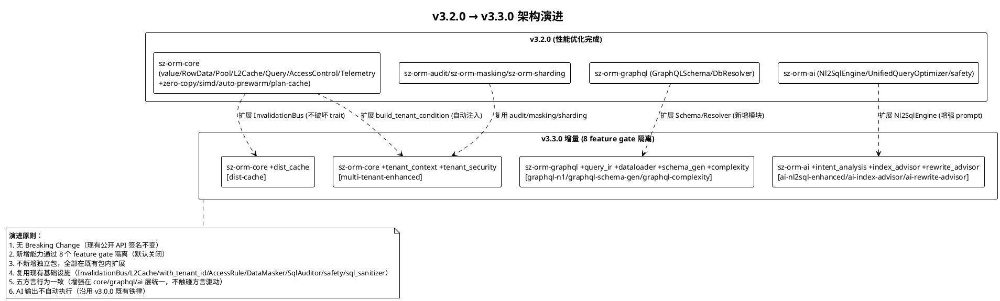

**演进关键决策**：

| 决策点 | 选项 | 选择 | 理由 |
|--------|------|------|------|
| 跨实例失效协议实现位置 | A. 新独立包 sz-orm-dist-cache / B. sz-orm-core 内扩展模块 | B | InvalidationBus trait 已在 sz-orm-core，新实现是 trait 的实现，放 core 内避免循环依赖；独立包过度设计 |
| Gossip 协议实现方式 | A. 引入 membership 协议库 / B. 自研轻量 gossip | B | 需求仅 ≤10 实例 1s 收敛，自研轻量 gossip（点对点 + 反熵）足够；引入重库违反 feature 隔离轻依赖原则 |
| Write-behind WAL 实现 | A. 引入持久化队列库 / B. 自研 WAL + 复用 sz-orm-crypto | B | WAL 需求简单（顺序追加 + 按序列号回放），自研避免重依赖；加密复用既有 sz-orm-crypto |
| 布隆过滤器实现 | A. 引入 bloomfilter crate / B. 自研 | A | bloomfilter crate 轻量稳定，自研易出错（哈希函数/位数组）；optional 依赖 feature gate 隔离 |
| GraphQL IR 解析方式 | A. 复用 async-graphql 解析 / B. 自研轻量解析 | A | async-graphql 7 已是 real feature 依赖，复用其解析能力避免重复造轮子；IR 从其 AST 转换 |
| DataLoader 实现 | A. 引入 dataloader crate / B. 自研 | B | DataLoader 核心逻辑简单（tick 收集 + 批量 + 按键回填），自研避免新依赖且可控；与 async-graphql 集成更灵活 |
| Schema 自动生成方式 | A. 运行时反射 / B. 过程宏编译时生成 | B | Rust 无运行时反射；过程宏编译时生成从 `#[derive(Model)]` 提取字段元数据，零运行时开销；复用 sz-orm-macros |
| 租户上下文隔离方式 | A. thread-local / B. tokio task-local | B | sz-orm 异步运行时基于 tokio，task-local 与异步任务边界一致；thread-local 在异步跨线程执行时失效 |
| Schema 隔离表名重写位置 | A. QueryBuilder::table() / B. SQL 生成阶段 | A | table() 是表名设置点，在此重写为 `tenant_{id}_{table}` 最直接；SQL 生成阶段重写需解析 SQL 易出错 |
| 连接池隔离粒度 | A. 每租户独立 Pool / B. 单 Pool 分区 | A | 独立 Pool 物理隔离连接争用，分区仍共享锁/队列；租户数量可控时独立 Pool 开销可接受 |
| 行级安全策略参数化 | A. SQL 字符串拼接 / B. 参数化绑定 | B | 参数化查询铁律（spec §4.3 C-03），策略条件必须参数化；既有 build_tenant_condition 已是参数化模式 |
| AI 索引/重写建议产出 | A. 扩展 UnifiedQueryAnalysis / B. 独立产出结构 | B | 优化器产出查询分析，索引/重写建议为独立产出，职责分离避免优化器膨胀；复用 LLM 调用基础设施但非 Analysis 扩展 |
| 查询意图分析写操作处理 | A. 扩展 safety 允许写 / B. 独立意图安全标注 | B | safety 模块职责是 SQL 安全验证（仅 SELECT），意图分析识别写操作是意图标注非 SQL 验证；独立标注避免 safety 职责膨胀 |

---

## 2.1 分布式缓存一致性（REQ-DC-001~006）

### 2.1.1 模块目标

在 sz-orm-core 内扩展分布式缓存一致性模块 `dist_cache`，新增跨实例失效协议实现（Redis Pub/Sub + Gossip）、一致性保证选项（强一致/最终一致）、Write-behind 异步批量写入、缓存击穿/雪崩防护（布隆过滤器 + 互斥锁 + 随机 TTL），通过 feature gate "dist-cache" 隔离。启用后多实例部署缓存跨实例一致，写吞吐量提升 ≥3x（Write-behind），缓存击穿穿透 ≤1，不启用时既有 `L2Cache` / `InvalidationBus` / `LocalInvalidationBus` API 完全不变。

### 2.1.2 架构设计

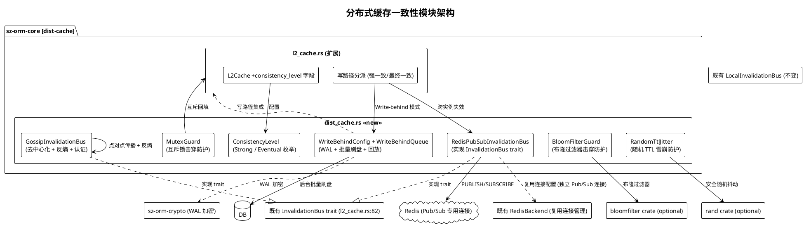

### 2.1.3 核心数据结构设计

**ConsistencyLevel** — 一致性级别枚举（扩展 L2Cache 配置，向后兼容）：

- 变体：`Eventual`（默认，写库后异步失效 + TTL 兜底）/ `Strong`（先失效所有实例缓存再写库）
- 通过 `L2CacheConfigBuilder::consistency_level(ConsistencyLevel)` 配置
- 约束：默认 Eventual 向后兼容；Strong 性能开销大于 Eventual

**RedisPubSubInvalidationBus** — Redis Pub/Sub 跨实例失效总线：

- 字段：`client: redis::aio::ConnectionManager`（复用既有 Redis 连接管理，自动重连）、`channel: String`（Pub/Sub 通道名，默认 "sz-orm:invalidation"）、`local_buffer: parking_lot::Mutex<VecDeque<InvalidationMessage>>`（订阅循环写入本地缓冲，subscribe drain 读取）、`instance_id: String`（本实例 ID，避免自回环）
- 实现 `InvalidationBus` trait：`publish(message)` 经 `PUBLISH` 命令广播（序列化 InvalidationMessage 为 ≤1KB JSON）；`subscribe()` drain local_buffer
- 异步订阅循环：`tokio::spawn` 独立 Pub/Sub 连接 `SUBSCRIBE` 通道，收到消息反序列化后写入 local_buffer（跳过本实例 instance_id 避免自回环）
- 约束：Pub/Sub 需专用连接（Redis Pub/Sub 要求）；消息大小 ≤ 1KB（spec §6.1）；认证复用 Redis 连接配置（密码 + ACL）

**GossipInvalidationBus** — Gossip 去中心化失效总线：

- 字段：`nodes: Vec<NodeAddr>`（集群节点地址列表）、`shared_secret: Vec<u8>`（共享密钥认证）、`local_buffer: parking_lot::Mutex<VecDeque<InvalidationMessage>>`、`seen_messages: parking_lot::RwLock<HashSet<u64>>`（已见消息 ID 去重，防重复传播）、`instance_id: String`
- 实现 `InvalidationBus` trait：`publish(message)` 点对点发送到所有已知节点（并行 tokio::join）；`subscribe()` drain local_buffer
- 节点认证：每次通信附带 HMAC(shared_secret, message) 认证标签，未认证节点消息拒绝
- 反熵（anti-entropy）：节点重连后定期（默认 5s）与随机对端交换 seen_messages 摘要，补全缺失失效消息
- 约束：≤10 实例 1s 收敛（spec §4.1 性能）；共享密钥认证（spec §4.3 安全性）；去重避免重复传播

**WriteBehindConfig** — Write-behind 配置：

- `batch_size: u32`（批量刷盘大小，默认 100）
- `flush_interval: Duration`（刷盘间隔，默认 100ms）
- `wal_path: PathBuf`（WAL 文件路径）
- `encryption_key: Vec<u8>`（WAL 加密密钥，复用 sz-orm-crypto）
- `fallback_to_sync: bool`（刷盘失败回退同步写，默认 true）

**WriteBehindQueue** — Write-behind 持久化队列：

- 字段：`wal: Mutex<WalFile>`（WAL 文件追加写入）、`pending: crossbeam_queue::ArrayQueue<WriteOp>`（内存待刷盘队列）、`sequence: AtomicU64`（单调递增序列号）、`config: WriteBehindConfig`
- **WriteOp**：`op_type: WriteOpType`（Insert/Update/Delete）、`table: String`、`pk: Value`、`data: Vec<(String, Value)>`（变更数据）、`timestamp: i64`、`sequence: u64`
- 方法：`enqueue(op) -> Result<()>`（写 WAL 持久化 + 入内存队列立即返回，≤1ms）、`flush_batch() -> Result<usize>`（批量刷盘到 DB，按 sequence 顺序）、`replay() -> Result<()>`（宕机重启从 WAL 按序列号回放未刷盘操作）
- WAL 格式：每条记录 = [4字节长度][加密载荷][8字节CRC]，加密复用 sz-orm-crypto，CRC 校验完整性
- 约束：宕机不丢数据（WAL 持久化先于返回成功）；刷盘失败告警 + 回退同步写（spec §4.2 可靠性）；WAL 加密存储（spec §4.3 安全性）

**BloomFilterGuard** — 布隆过滤器击穿防护：

- 字段：`filter: bloomfilter::Bloom<String>`、`capacity: usize`（默认 100000）、`false_positive_rate: f64`（默认 0.01）
- 方法：`add(key: &str)`（写入 key）、`might_contain(key: &str) -> bool`（判断是否可能存在，假阳性 ≤1%）、`rebuild(keys: impl Iterator)`（超容量时重建）
- 约束：假阳性率 ≤ 1% 可配置（spec §6.1）；超容量自动扩容或重建

**MutexGuard** — 互斥锁击穿防护：

- 字段：`mutexes: parking_lot::Mutex<HashMap<String, Arc<tokio::sync::Mutex<()>>>>`（按 key 互斥锁）
- 方法：`guard(key: &str) -> tokio::sync::MutexGuard`（获取 key 互斥锁，仅允许一个请求查库回填）
- 约束：互斥期间仅一个请求查库回填（spec §4.1 性能，穿透 ≤1）

**RandomTtlJitter** — 随机 TTL 雪崩防护：

- 方法：`jitter(base_ttl: Duration, jitter_range: f64) -> Duration`（base_ttl × (1 ± jitter_range × random)），random 使用 rand crate 安全随机源
- 约束：抖动范围默认基础 TTL 的 ±20%（spec §6.1）；安全随机源（非伪随机）避免抖动可预测；标准差 ≥ 抖动范围（spec §4.2 可靠性）

### 2.1.4 核心流程设计

**跨实例失效协议主流程（Redis Pub/Sub）**：

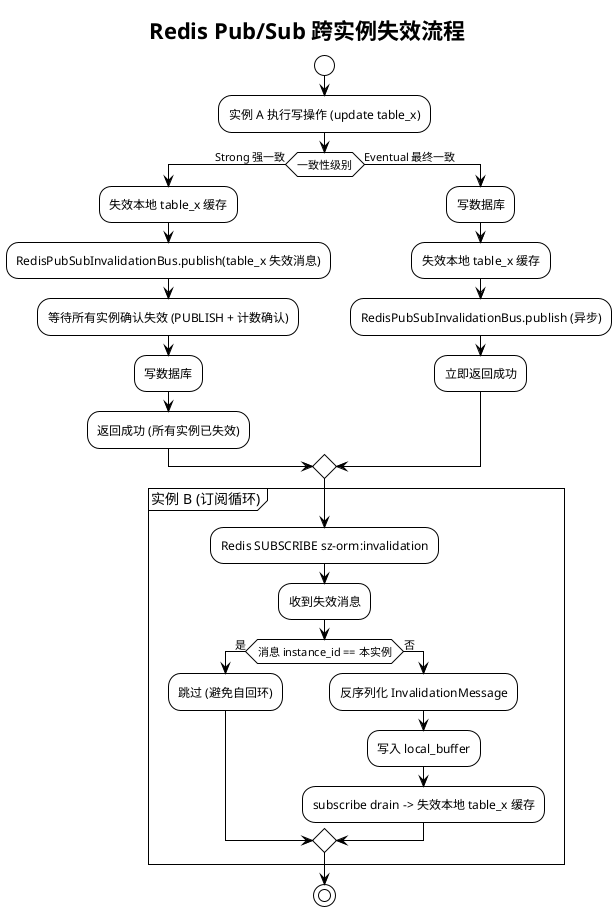

**Write-behind 异步批量写入流程**：

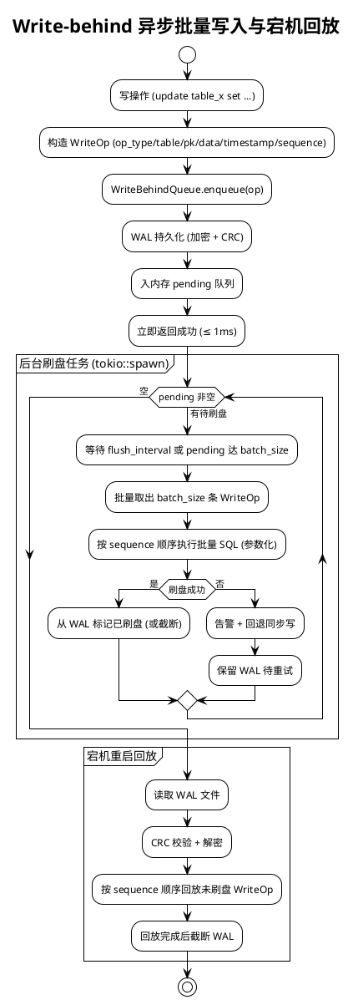

**缓存击穿/雪崩防护流程**：

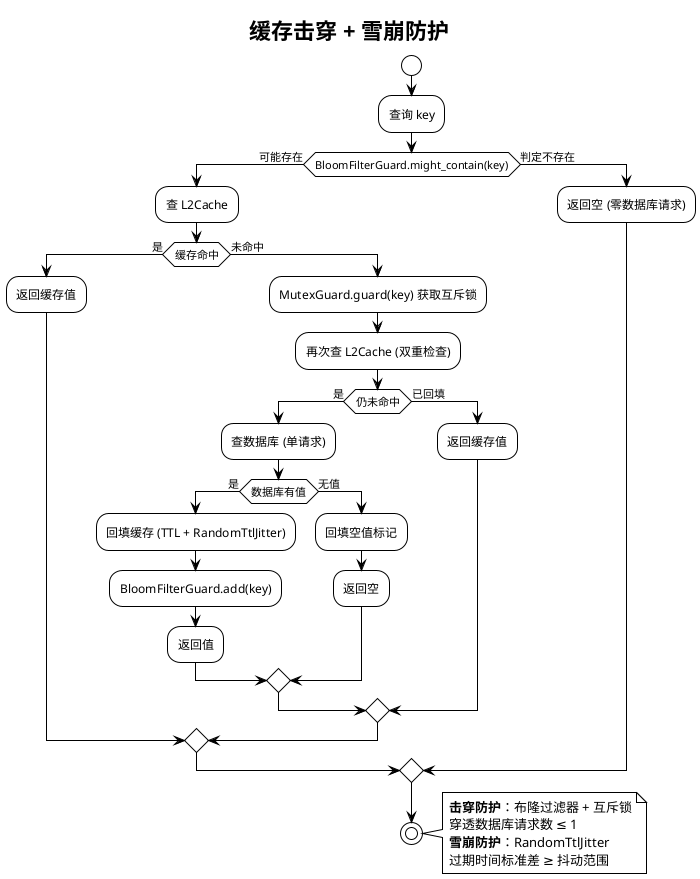

### 2.1.5 Feature gate 配置

```toml
# packages/sz-orm-core/Cargo.toml [features] 新增
dist-cache = ["dep:bloomfilter", "dep:rand"]
# [dependencies] 新增
bloomfilter = { version = "1.0", optional = true }
rand = { version = "0.8", optional = true }
# redis 已是既有 optional 依赖（default feature 启用），dist-cache 复用
# sz-orm-crypto 已是既有依赖（或新增 optional）
```

- 默认不启用，启用后 `dist_cache` 模块导出 + L2Cache 新增 consistency_level 字段生效
- `#[cfg(feature = "dist-cache")]` 条件编译，未启用时零依赖零代码体积
- 复用既有 `redis` crate（default feature 已启用 RedisBackend，Pub/Sub 共用连接配置但独立连接）
- 与既有 `redis` / `circuit-breaker` / `rate-limit` / `auto-prewarm` / `plan-cache` / `zero-copy` / `simd` feature 正交（可独立或组合启用）

### 2.1.6 与现有代码集成点

| 集成点 | 位置 | 集成方式 | 兼容性 |
|--------|------|---------|--------|
| InvalidationBus trait | [l2_cache.rs:82](file:///E:/vue/test/鲜视达/rust/sz-orm/packages/sz-orm-core/src/l2_cache.rs#L82) | 新增 `RedisPubSubInvalidationBus` + `GossipInvalidationBus` 实现 trait | trait 与既有 `LocalInvalidationBus` 不变 |
| L2Cache 失效总线注入 | [l2_cache.rs:517](file:///E:/vue/test/鲜视达/rust/sz-orm/packages/sz-orm-core/src/l2_cache.rs#L517) | `L2Cache` 的 `invalidation_bus: Arc<dyn InvalidationBus>` 可注入新实现 | 字段类型不变，注入新实现无需修改 L2Cache |
| L2Cache 写路径 | [l2_cache.rs:517](file:///E:/vue/test/鲜视达/rust/sz-orm/packages/sz-orm-core/src/l2_cache.rs#L517) | 新增 `consistency_level` 字段（默认 Eventual 向后兼容），写路径按级别分派 | 默认 Eventual 行为不变 |
| Redis 连接管理 | [l2_cache.rs:1361](file:///E:/vue/test/鲜视达/rust/sz-orm/packages/sz-orm-core/src/l2_cache.rs#L1361) | 复用 `RedisBackend` 连接配置，Pub/Sub 独立连接 | 既有 RedisBackend 不变 |
| telemetry 指标 | [telemetry.rs:83](file:///E:/vue/test/鲜视达/rust/sz-orm/packages/sz-orm-core/src/telemetry.rs#L83) | 新增失效协议指标（发布数/接收数/丢弃数/延迟）原子计数器 | 既有字段不变 |
| lib.rs 导出 | [lib.rs](file:///E:/vue/test/鲜视达/rust/sz-orm/packages/sz-orm-core/src/lib.rs) | `#[cfg(feature = "dist-cache")] pub mod dist_cache;` | 条件导出 |

---

## 2.2 GraphQL 查询支持（REQ-GQL-001~005）

### 2.2.1 模块目标

在 sz-orm-graphql 内扩展四项能力：查询解析为 IR、N+1 自动消除（DataLoader）、类型化 Schema 自动生成、查询复杂度限制，通过 feature gate "graphql-n1" / "graphql-schema-gen" / "graphql-complexity" 隔离。复用既有 `real` feature 的 async-graphql 引擎，不重写既有 `GraphQLSchema` / `DbResolver` API。启用后 GraphQL 查询 N+1 消除（查询次数 ≤2），Schema 从 Rust 模型自动生成，复杂度超限查询拒绝，不启用时既有 GraphQL 能力完全不变。

### 2.2.2 架构设计

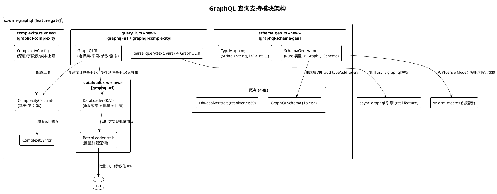

### 2.2.3 核心数据结构设计

**GraphQLIR** — GraphQL 查询中间表示：

- `operation: GraphQLOperation`（Query/Mutation/Subscription）
- `selection_set: Vec<GraphQLSelection>`（顶层选择集）
- **GraphQLSelection**：`name: String`（字段名）、`alias: Option<String>`（别名）、`arguments: HashMap<String, GraphQLValue>`（参数）、`directives: Vec<GraphQLDirective>`（指令）、`selection_set: Vec<GraphQLSelection>`（子选择集，嵌套关联）
- **GraphQLValue**：`Int(i64)` / `Float(f64)` / `String(String)` / `Boolean(bool)` / `Null` / `Enum(String)` / `List(Vec<GraphQLValue>)` / `Object(HashMap<String, GraphQLValue>)` / `Variable(String)`（变量引用）
- **GraphQLDirective**：`name: String` + `arguments: HashMap<String, GraphQLValue>`
- 约束：IR 与原始查询文本语义等价（可往返解析，spec §6.2）；含完整选择集（字段名/别名/参数/指令/子选择集）

**parse_query** — 查询解析函数：

- 签名：`parse_query(query_text: &str, variables: Option<Value>) -> Result<GraphQLIR, GraphQLParseError>`
- 实现：复用 async-graphql 的 `async_graphql::parser::parse_query_token` 解析为 async-graphql AST，再转换为内部 `GraphQLIR`
- 约束：非法查询文本返回 `GraphQLParseError`（含错误位置与原因，spec §5.2.3 异常场景1）

**DataLoader<K, V>** — 批量加载器：

- 字段：`batch_loader: Arc<dyn BatchLoader<K, V>>`、`pending: parking_lot::Mutex<HashMap<K, Vec<oneshot::Sender<V>>>>`（当前 tick 收集的请求 + 回填 channel）、`tick_handle: Option<tokio::task::JoinHandle>`
- **BatchLoader<K, V>** trait：`batch_load(keys: Vec<K>) -> BoxFuture<'_, Result<HashMap<K, V>, BatchLoadError>>`（调用方实现批量加载逻辑，如 `SELECT * FROM orders WHERE user_id IN (?, ?, ?)`）
- 方法：`load(key: K) -> BoxFuture<'_, Result<V, BatchLoadError>>`（收集请求到 pending，返回 oneshot Receiver；当前 tick 结束时触发 batch_load 并回填所有 pending）
- tick 机制：`tokio::spawn` 在当前事件循环 tick 结束（`tokio::task::yield_now`）时触发 batch_load，合并当前 tick 内所有 load 请求为一次批量
- 约束：批量键唯一（去重后批量请求，spec §6.2）；结果按键映射回各请求点，顺序与原始请求一致（spec §6.2）

**SchemaGenerator** — 类型化 Schema 自动生成：

- 方法：`from_model<M: Model>() -> GraphQLSchema`（从 `#[derive(Model)]` 结构体生成 Schema）
- 实现：通过 `M::table_name()` + `M::columns()`（或过程宏提取的字段元数据）获取表名 + 字段名 + 类型，按 `TypeMapping` 映射为 GraphQL 类型，调用 `GraphQLSchema::add_type` / `add_query` / `add_mutation` 构建
- **TypeMapping**（Rust → GraphQL）：`String → String`、`i32 → Int`、`i64 → BigInt`、`f64 → Float`、`bool → Boolean`、`Option<T> → T 可空`、`Vec<T> → [T] 列表`、`NaiveDate → Date`、`DateTime → DateTime`、`Uuid → ID`
- 不支持类型处理：复杂嵌套枚举、泛型等告警跳过（spec §5.2.3 异常场景3），要求用户手动标注
- 约束：Rust 类型与 GraphQL 类型一致（字段名、类型映射、可空性，spec §5.2.1 规则3）；生成的 Schema 可直接用于 GraphQL 查询执行

**ComplexityConfig** — 复杂度配置：

- `max_depth: u32`（深度上限，默认 10）
- `max_fields: u32`（字段数量上限，默认 100）
- `max_cost: u64`（计算成本上限，默认 1000）
- `field_weights: HashMap<String, u64>`（字段权重，默认 1，高开销字段可配置更高权重）

**ComplexityCalculator** — 复杂度计算器：

- 方法：`calculate(ir: &GraphQLIR) -> ComplexityResult`
- **ComplexityResult**：`depth: u32`（实际深度）、`field_count: u32`（实际字段数）、`cost: u64`（实际成本）、`exceeded: Option<ComplexityError>`（超限错误）
- 计算：深度 = 最大嵌套层级；字段数 = 所有选择集字段总数；成本 = Σ(字段权重 × 子树深度)（递归累加）
- 约束：计算开销 ≤ 查询执行总耗时的 5%（spec §4.1 性能）；超限返回 `ComplexityError`（含深度/字段数/成本超限详情）

### 2.2.4 核心流程设计

**GraphQL 查询主流程（IR + 复杂度 + DataLoader）**：

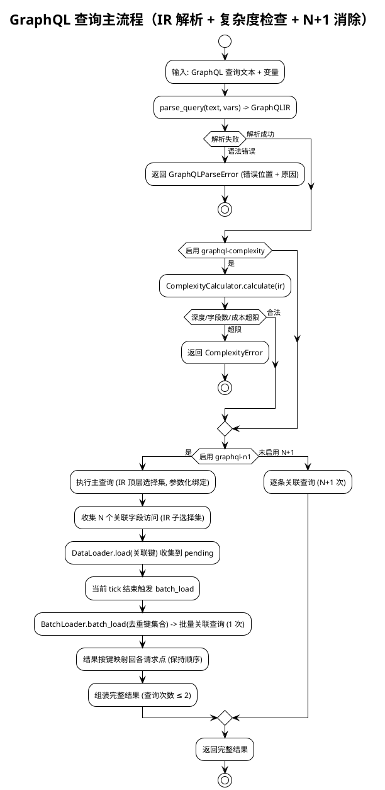

**DataLoader 批量加载与回填流程**：

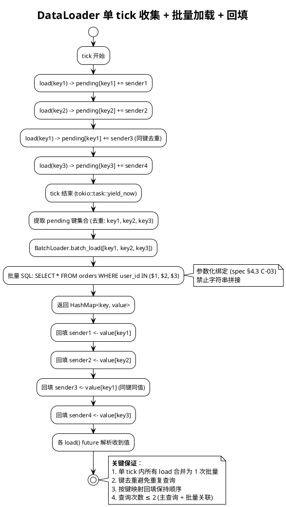

### 2.2.5 Feature gate 配置

```toml
# packages/sz-orm-graphql/Cargo.toml [features] 新增
graphql-n1 = []
graphql-schema-gen = ["dep:sz-orm-macros"]
graphql-complexity = []
# [dependencies] 新增
sz-orm-macros = { version = "2.1.0", path = "../sz-orm-macros", optional = true }
# async-graphql 已是既有 real feature 依赖，query_ir 复用
```

- 默认不启用，启用后对应模块导出
- `#[cfg(feature = "graphql-n1")]` / `#[cfg(feature = "graphql-schema-gen")]` / `#[cfg(feature = "graphql-complexity")]` 条件编译
- `query_ir` 模块由 `graphql-n1` 和 `graphql-complexity` 共用（IR 是两者基础），两者任一启用即导出
- `graphql-schema-gen` 需 `sz-orm-macros` 过程宏依赖（optional）
- 与既有 `real` / `db-resolver` feature 正交（可独立或组合启用，`real` 启用后 IR 解析复用 async-graphql 引擎）

### 2.2.6 与现有代码集成点

| 集成点 | 位置 | 集成方式 | 兼容性 |
|--------|------|---------|--------|
| GraphQLSchema | [lib.rs:27](file:///E:/vue/test/鲜视达/rust/sz-orm/packages/sz-orm-graphql/src/lib.rs#L27) | `SchemaGenerator::from_model` 调用 `add_type`/`add_query`/`add_mutation` 构建 | 既有手动构建 API 不变 |
| DbResolver trait | [resolver.rs:69](file:///E:/vue/test/鲜视达/rust/sz-orm/packages/sz-orm-graphql/src/resolver.rs#L69) | DataLoader 在 resolver 执行路径外批量收集，不修改 trait | trait 与既有实现不变 |
| async-graphql 引擎 | [Cargo.toml:15](file:///E:/vue/test/鲜视达/rust/sz-orm/packages/sz-orm-graphql/Cargo.toml#L15) | `query_ir` 复用 `real` feature 的 async-graphql 解析能力 | real feature 不变 |
| lib.rs 导出 | [lib.rs](file:///E:/vue/test/鲜视达/rust/sz-orm/packages/sz-orm-graphql/src/lib.rs) | `#[cfg(feature = "graphql-n1")] pub mod query_ir;` + `pub mod dataloader;` 等 | 条件导出 |

---

## 2.3 多租户与数据隔离（REQ-MT-001~006）

### 2.3.1 模块目标

在 sz-orm-core 内增强多租户能力，新增租户上下文自动注入、Schema 隔离（每租户独立 Schema）、连接池隔离（按租户独立 Pool）、行级安全增强（部门级/角色级细粒度）、列级脱敏增强（按租户权限脱敏）、多租户审计日志，通过 feature gate "multi-tenant-enhanced" 隔离。复用既有 `with_tenant_id` / `without_tenant` / `tenant_field` / `AccessRule` / `DataMasker` / `SqlAuditor` 基础，既有 API 保持完全向后兼容。启用后租户上下文自动注入（无需逐处显式传递），Schema 隔离物理隔离各租户数据，连接池隔离避免租户间连接争用，行级安全 + 列级脱敏 + 审计增强。

### 2.3.2 架构设计

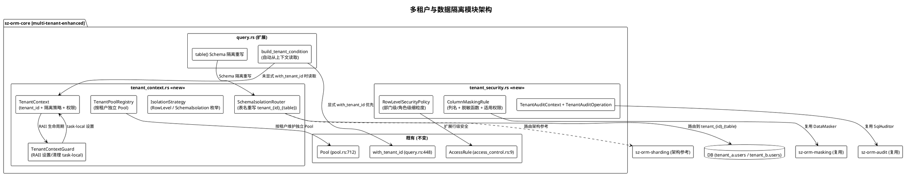

### 2.3.3 核心数据结构设计

**TenantContext** — 租户上下文（运行时自动注入）：

- `tenant_id: i64`（必填，与既有 `with_tenant_id(tenant_id: i64)` 类型一致，spec §6.3）
- `isolation_strategy: IsolationStrategy`（必填，行级/Schema 隔离策略）
- `permissions: TenantPermissions`（可选，行级安全策略 + 列级脱敏规则）
- **IsolationStrategy** 枚举：`RowLevel`（行级隔离，追加 `WHERE tenant_id = ?`）/ `SchemaIsolation`（Schema 隔离，路由到 `tenant_{id}_{table}`）
- **TenantPermissions**：`row_level_policies: Vec<RowLevelSecurityPolicy>` + `column_masking_rules: Vec<ColumnMaskingRule>` + `roles: Vec<String>`
- 约束：上下文不可被客户端篡改（由可信路径中间件/网关设置，spec §4.3 安全性）；tenant_id 必填 i64（禁止字符串避免注入，spec §6.3）

**TenantContextGuard** — RAII 上下文守卫：

- 实现：`Drop` trait 在作用域结束时自动清理 task-local 上下文
- 方法：`TenantContext::enter(context) -> TenantContextGuard`（设置 task-local 上下文，返回守卫）
- task-local 存储：`tokio::task_local! { static TENANT_CONTEXT: RefCell<Option<TenantContext>> }`（异步任务边界隔离，spec §2.0.3 决策）
- 约束：租户切换原子（守卫作用域内上下文不变，spec §4.2 可靠性）；未设置上下文时查询拒绝执行（spec §5.3.3 异常场景1）

**SchemaIsolationRouter** — Schema 隔离路由器：

- 方法：`rewrite_table(table: &str, tenant_id: i64) -> String`（返回 `tenant_{tenant_id}_{table}`，spec §6.3 命名格式）
- 约束：Schema 命名遵循 `tenant_{id}_{table}` 格式（禁止用户自定义避免冲突）；Schema 由系统创建不可由租户操作（spec §6.3）

**TenantPoolRegistry** — 租户连接池注册表：

- 字段：`pools: parking_lot::RwLock<HashMap<i64, Arc<Pool>>>`（按 tenant_id 维护独立 Pool）、`pool_config: PoolConfig`（各租户池共享配置）
- 方法：`get_or_create(tenant_id: i64) -> Arc<Pool>`（获取或创建租户池，CAS 防并发重复创建）、`switch(tenant_id: i64) -> TenantPoolGuard`（原子切换当前租户池）
- 约束：租户切换原子（spec §4.2 可靠性）；路由开销 ≤ 50μs（HashMap 查找 + Arc clone，spec §4.1 性能）

**RowLevelSecurityPolicy** — 行级安全策略（扩展既有 AccessRule）：

- `table: String`（表名）
- `filter_condition: ParameterizedCondition`（参数化过滤条件，如 `department_id = $1`，非 SQL 字符串拼接）
- **ParameterizedCondition**：`sql_fragment: String`（含占位符 `$1`）+ `params: Vec<Value>`（参数值）
- `principal: Principal`（权限主体，tenant_id + roles）
- 约束：策略由服务端定义不可被客户端篡改（spec §4.3 安全性）；参数化绑定（spec §4.3 C-03）；超出 tenant_id 的细粒度权限（部门级、角色级，spec §5.3.1 规则4）

**ColumnMaskingRule** — 列级脱敏规则：

- `table: String`（表名）
- `column: String`（列名）
- `masking_function: MaskingFunction`（脱敏函数枚举，复用既有 `MaskingRule`）
- `applicable_permissions: PermissionPredicate`（适用权限，未授权租户/角色才脱敏）
- 约束：ORM 层强制执行不可绕过（spec §4.3 安全性）；未配置脱敏规则的敏感列默认拒绝读取（安全优先，spec §5.3.3 异常场景5）

**TenantAuditContext + TenantAuditOperation** — 多租户审计：

- **TenantAuditContext**：`tenant_id: i64` + `operation: TenantAuditOperation` + `timestamp: i64` + `result: AuditResult`（成功/拒绝）+ `detail: String`
- **TenantAuditOperation** 枚举：`ContextSet`（上下文设置）/ `ContextSwitch`（租户切换）/ `CrossTenantDenied`（跨租户访问拒绝）/ `RowLevelFiltered`（行级安全过滤）/ `ColumnMasked`（列级脱敏执行）
- 约束：审计日志含租户 ID + 操作 + 时间 + 结果（spec §6.3）；日志不可篡改（追加写入或持久化，spec §5.3.1 规则5）

### 2.3.4 核心流程设计

**租户上下文自动注入与查询重写流程**：

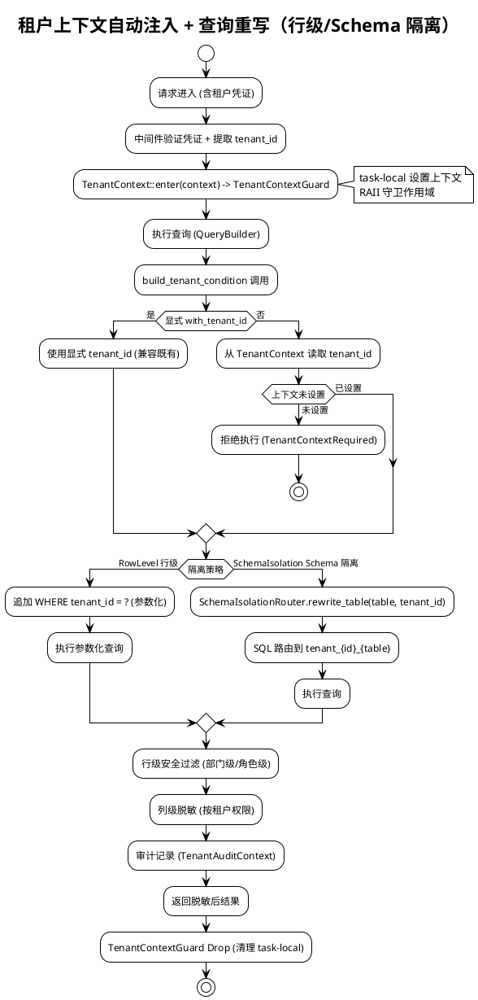

**租户切换与连接池隔离流程**：

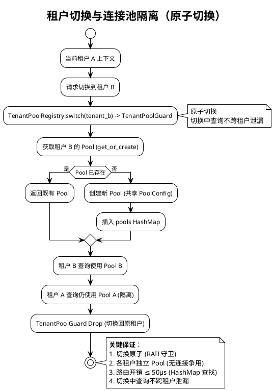

### 2.3.5 Feature gate 配置

```toml
# packages/sz-orm-core/Cargo.toml [features] 新增
multi-tenant-enhanced = []
# 无新增外部依赖（复用既有 tokio + parking_lot + sz-orm-audit + sz-orm-masking）
# sz-orm-audit + sz-orm-masking 已是 workspace 成员，通过 dev-dep 或 optional dep 引入
```

- 默认不启用，启用后 `tenant_context` + `tenant_security` 模块导出 + QueryBuilder 自动注入生效
- `#[cfg(feature = "multi-tenant-enhanced")]` 条件编译
- 复用既有 `tokio`（task-local）+ `parking_lot`（RwLock）+ `sz-orm-audit`（审计）+ `sz-orm-masking`（脱敏）+ `sz-orm-sharding`（架构参考，非依赖）
- 与既有 `with_tenant_id` / `without_tenant` / `tenant_field` API 兼容（显式调用优先于上下文自动注入）

### 2.3.6 与现有代码集成点

| 集成点 | 位置 | 集成方式 | 兼容性 |
|--------|------|---------|--------|
| QueryBuilder 租户条件 | [query.rs:488](file:///E:/vue/test/鲜视达/rust/sz-orm/packages/sz-orm-core/src/query.rs#L488) | `build_tenant_condition` 内部若 `tenant_id_value` 为 None 则从 `TenantContext` 读取 | 既有显式 `with_tenant_id` 优先，行为不变 |
| QueryBuilder 表名 | [query.rs:36](file:///E:/vue/test/鲜视达/rust/sz-orm/packages/sz-orm-core/src/query.rs#L36) | `table()` 方法在 Schema 隔离策略下重写为 `tenant_{id}_{table}` | 行级隔离策略下表名不变 |
| AccessRule 行级安全 | [access_control.rs:9](file:///E:/vue/test/鲜视达/rust/sz-orm/packages/sz-orm-core/src/access_control.rs#L9) | 新增 `RowLevelSecurityPolicy` 扩展，与 `TenantContext` 集成 | 既有 `AccessRule` 不变 |
| Pool 连接池 | [pool.rs:712](file:///E:/vue/test/鲜视达/rust/sz-orm/packages/sz-orm-core/src/pool.rs#L712) | 新增 `TenantPoolRegistry` 按租户维护独立 Pool | 既有 `Pool` 不变 |
| sz-orm-masking 脱敏 | [masking/lib.rs:21](file:///E:/vue/test/鲜视达/rust/sz-orm/packages/sz-orm-masking/src/lib.rs#L21) | 新增 `ColumnMaskingRule` 配置层，调用 `DataMasker::apply` 执行 | 既有 `DataMasker::apply` 不变 |
| sz-orm-audit 审计 | [audit/lib.rs:40](file:///E:/vue/test/鲜视达/rust/sz-orm/packages/sz-orm-audit/src/lib.rs#L40) | 新增 `TenantAuditContext` + `TenantAuditOperation`，调用 `SqlAuditor::log` 记录 | 既有 `SqlAuditor` 不变 |
| lib.rs 导出 | [lib.rs](file:///E:/vue/test/鲜视达/rust/sz-orm/packages/sz-orm-core/src/lib.rs) | `#[cfg(feature = "multi-tenant-enhanced")] pub mod tenant_context;` + `pub mod tenant_security;` | 条件导出 |

---

## 2.4 AI 自然语言查询增强（REQ-AI-001~006）

### 2.4.1 模块目标

在 sz-orm-ai 内扩展三项能力：NL2SQL 增强（多表 JOIN + 聚合 + 子查询 + 排序 + 分页）、查询意图分析（SELECT/INSERT/UPDATE/DELETE 意图识别 + 参数提取）、自动索引建议（基于查询模式 + 慢查询日志）、查询重写建议（等价变换 + 谓词下推 + 子查询展开），通过 feature gate "ai-nl2sql-enhanced" / "ai-index-advisor" / "ai-rewrite-advisor" 隔离。复用既有 `Nl2SqlEngine` / `safety` / `sql_sanitizer` / `UnifiedQueryOptimizer` LLM 基础，不修改既有公开 API。所有 AI 建议仅作建议展示，禁止自动执行 LLM 生成的 SQL/DDL（沿用 v3.0.0 既有铁律）。

### 2.4.2 架构设计

```plantuml
@startuml
!theme plain
title AI 自然语言查询增强模块架构

package "sz-orm-ai [feature gate]" {
  rectangle "intent_analysis.rs <<new>>\n[ai-nl2sql-enhanced]" as IntentMod {
    rectangle "QueryIntent\n(SELECT/INSERT/UPDATE/DELETE)" as Qi
    rectangle "IntentAnalysisResult\n(意图+参数+风险等级+置信度)" as Iar
    rectangle "IntentAnalyzer\n(识别 + 提取 + 标注)" as Ia
  }
  rectangle "index_advisor.rs <<new>>\n[ai-index-advisor]" as IdxMod {
    rectangle "IndexSuggestion\n(列/类型/DDL/收益/证据)" as Is
    rectangle "IndexAdvisor\n(查询模式分析 + 慢查询日志)" as Iadv
  }
  rectangle "rewrite_advisor.rs <<new>>\n[ai-rewrite-advisor]" as RwMod {
    rectangle "RewriteSuggestion\n(原始SQL/重写SQL/变换类型/论证/收益)" as Rs
    rectangle "RewriteAdvisor\n(谓词下推/子查询展开/JOIN调整/冗余消除)" as Radv
  }
  rectangle "既有 (不变)" as AiOld {
    rectangle "Nl2SqlEngine (nl2sql.rs:80)" as Nl2
    rectangle "safety (safety.rs:12)" as Safety
    rectangle "sql_sanitizer" as Sanitizer
    rectangle "UnifiedQueryOptimizer (query_plan_optimizer.rs:440)" as Opt
  }
}

cloud "LLM 服务 (OpenAI 兼容)" as LLM
rectangle "sqlparser (SQL -> AST)" as SqlP
database "DB (慢查询日志)" as Db

Ia --> LLM : 请求意图分析 (脱敏输入)
Ia --> Sanitizer : 输入脱敏
Ia --> Safety : 写操作标注风险 (不执行)
Iadv --> SqlP : 解析查询模式 (WHERE/JOIN/ORDER BY 列)
Iadv --> Db : 读取慢查询日志
Iadv --> LLM : 请求索引建议 (可选)
Radv --> SqlP : 解析 SQL AST
Radv --> LLM : 请求重写建议 (可选)
Nl2 ..> LLM : 既有 NL2SQL (增强 prompt)
Nl2 --> Safety : 既有安全验证
Nl2 --> Sanitizer : 既有脱敏
Opt ..> LLM : 既有 LLM 优化器 (复用基础设施)

@enduml
```

### 2.4.3 核心数据结构设计

**QueryIntent** — 查询意图枚举：

- 变体：`Select` / `Insert` / `Update` / `Delete`
- 约束：写操作（Insert/Update/Delete）必须标注高风险（spec §5.4.1 规则2）

**IntentAnalysisResult** — 意图分析结果：

- `intent: QueryIntent`（意图类型）
- `table: String`（表名）
- `conditions: Vec<ParameterizedCondition>`（条件，参数化）
- `ordering: Vec<OrderField>`（排序字段）
- `pagination: Option<Pagination>`（分页，offset + limit）
- `update_fields: Vec<(String, Value)>`（更新字段，如适用）
- `risk_level: RiskLevel`（风险等级 Low/Medium/High，写操作为 High）
- `confidence: f32`（置信度 0.0-1.0）
- `candidates: Vec<IntentAnalysisResult>`（意图模糊时多候选 + 置信度，spec §5.4.3 异常场景3）
- 约束：写操作标注高风险（spec §6.4）；禁止自动执行（spec §4.3 安全性 C-09）

**IntentAnalyzer** — 意图分析器：

- 方法：`analyze(natural_language: &str, schema: &SchemaContext) -> BoxFuture<'_, Result<IntentAnalysisResult, IntentError>>`
- 实现：构造 LLM prompt（含 schema 表名/列名 + 自然语言查询），调用 LLM 识别意图 + 提取参数；输入经 `sql_sanitizer` 脱敏；写操作标注 High 风险
- 约束：延迟 ≤ 5s P95（spec §4.1 性能）；LLM 请求内容脱敏（spec §4.3 安全性）；不阻塞业务查询主路径（spec §4.1 性能）

**IndexSuggestion** — 索引建议：

- `index_columns: Vec<String>`（索引列）
- `index_type: IndexType`（BTree/Hash/GIN/BRIN 等，按方言选择）
- `ddl_text: String`（DDL 文本，如 `CREATE INDEX idx_users_email ON users(email)`）
- `expected_benefit: BenefitEstimate`（预期收益，查询加速比）
- `evidence: Vec<QueryPattern>`（查询模式证据，命中查询列表）
- **BenefitEstimate**：`speedup_ratio: f64`（预期加速比）+ `confidence: f32` + `uncertain: bool`（收益不确定标注，spec §5.4.3 异常场景4）
- **QueryPattern**：`sql_template: String` + `frequency: u64`（查询频率）+ `columns_accessed: Vec<String>`
- 约束：建议为 DDL 文本不自动执行（spec §5.4.1 规则3）；附查询模式证据与收益评估（spec §6.4）；延迟 ≤ 10s P95（spec §4.1 性能）

**IndexAdvisor** — 索引建议器：

- 方法：`suggest(query_patterns: &[QueryPattern], slow_queries: &[SlowQueryLog]) -> BoxFuture<'_, Result<Vec<IndexSuggestion>, IndexError>>`
- 实现：分析 WHERE/JOIN/ORDER BY 列 + 慢查询日志，识别高频查询模式；规则型分析（列组合 + 选择性）+ 可选 LLM 建议；产出 DDL 建议
- 约束：DDL 不自动执行（spec §4.3 安全性 C-09）；建议附查询模式证据（spec §5.4.1 规则3）

**RewriteSuggestion** — 重写建议：

- `original_sql: String`（原始 SQL）
- `rewritten_sql: String`（重写 SQL）
- `transform_type: TransformType`（变换类型枚举：PredicatePushdown / SubqueryFlattening / JoinReorder / RedundantElimination）
- `equivalence_proof: EquivalenceProof`（等价性论证）
- `expected_benefit: BenefitEstimate`（预期收益）
- **EquivalenceProof**：`proof_text: String`（论证文本）+ `verified: bool`（是否自动验证）+ `unverified: bool`（等价性未验证标注，spec §5.4.3 异常场景5）
- 约束：建议不自动重写（spec §5.4.1 规则4）；附等价性论证与预期收益（spec §6.4）

**RewriteAdvisor** — 重写建议器：

- 方法：`suggest(sql: &str, schema: &SchemaContext) -> BoxFuture<'_, Result<Vec<RewriteSuggestion>, RewriteError>>`
- 实现：sqlparser 解析 SQL 为 AST，识别可优化模式（谓词下推/子查询展开/JOIN 顺序/冗余条件）；规则型分析 + 可选 LLM 建议；产出重写建议 + 等价性论证
- 约束：不自动重写（spec §4.3 安全性 C-09）；支持谓词下推 + 子查询展开（spec §5.4.1 规则4）

**AiAdviceAuditRecord** — AI 建议审计记录：

- `source_engine: AdviceSource`（来源引擎枚举：Rule / Llm）
- `llm_model: Option<String>`（LLM 模型标识，规则型为 None）
- `confidence: f32`（置信度）
- `advice_type: AdviceType`（建议类型枚举：Nl2Sql / Intent / Index / Rewrite）
- `timestamp: i64`
- 约束：每条建议记录来源/模型/置信度/类型（spec §4.4 可维护性）；LLM 请求内容脱敏（spec §4.3 安全性）

### 2.4.4 核心流程设计

**NL2SQL 增强与意图分析主流程**：

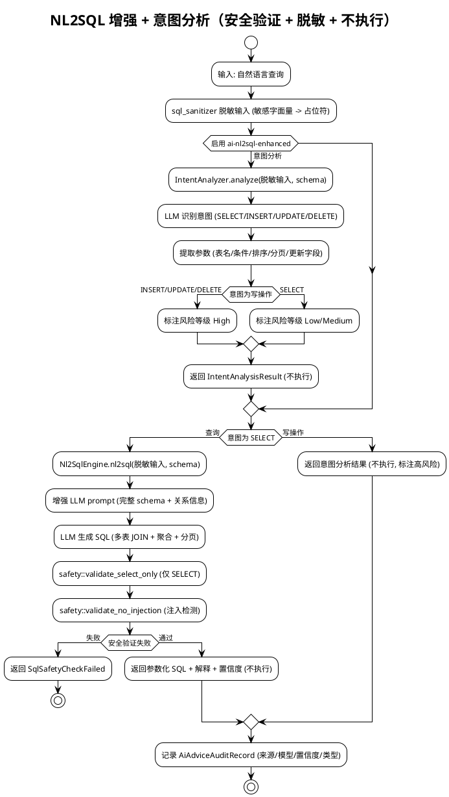

**自动索引建议与查询重写建议流程**：

```plantuml
@startuml
!theme plain
title 索引建议 + 重写建议（不自动执行）

start
partition "自动索引建议 [ai-index-advisor]" {
  :输入: 查询模式 + 慢查询日志;
  :sqlparser 解析查询 (WHERE/JOIN/ORDER BY 列);
  :识别高频查询模式;
  :规则型分析 (列组合 + 选择性);
  :可选 LLM 请求索引建议 (脱敏输入);
  :产出 IndexSuggestion (列/类型/DDL/收益/证据);
  :返回建议 (DDL 不自动执行);
}

partition "查询重写建议 [ai-rewrite-advisor]" {
  :输入: SQL 查询;
  :sqlparser 解析为 AST;
  :识别可优化模式;
  alt 谓词下推
    :将 WHERE 下推到子查询/JOIN 内层;
  else 子查询展开
    :将子查询展开为 JOIN;
  else JOIN 顺序调整
    :调整 JOIN 顺序减少中间结果;
  else 冗余条件消除
    :消除冗余 WHERE 条件;
  end alt
  :可选 LLM 请求重写建议 (脱敏输入);
  :产出 RewriteSuggestion (原始/重写/变换/论证/收益);
  :返回建议 (不自动重写);
}
stop

@enduml
```

### 2.4.5 Feature gate 配置

```toml
# packages/sz-orm-ai/Cargo.toml [features] 新增
ai-nl2sql-enhanced = []
ai-index-advisor = ["dep:sqlparser"]
ai-rewrite-advisor = ["dep:sqlparser"]
# [dependencies] 新增
sqlparser = { workspace = true, optional = true }
# reqwest 已是既有 real feature 依赖（LLM 调用），三个新 feature 复用
# safety + sql_sanitizer 既有模块，无新增依赖
```

- 默认不启用，启用后对应模块导出
- `#[cfg(feature = "ai-nl2sql-enhanced")]` / `#[cfg(feature = "ai-index-advisor")]` / `#[cfg(feature = "ai-rewrite-advisor")]` 条件编译
- `ai-index-advisor` 与 `ai-rewrite-advisor` 需 `sqlparser` 依赖（SQL 解析为 AST，optional）
- 复用既有 `real` feature 的 reqwest HTTP 客户端（LLM 调用）+ `safety` + `sql_sanitizer` + `UnifiedQueryOptimizer` LLM 基础
- 与既有 `real` / `llm-optimizer` / `plan-cache` feature 正交（可独立或组合启用）

### 2.4.6 与现有代码集成点

| 集成点 | 位置 | 集成方式 | 兼容性 |
|--------|------|---------|--------|
| Nl2SqlEngine | [nl2sql.rs:80](file:///E:/vue/test/鲜视达/rust/sz-orm/packages/sz-orm-ai/src/nl2sql.rs#L80) | 增强 `OpenAINl2SqlEngine` 的 LLM prompt（含完整 schema + 关系信息），不修改 trait | trait 与既有 `SimpleNl2SqlEngine` 不变 |
| safety 模块 | [safety.rs:12](file:///E:/vue/test/鲜视达/rust/sz-orm/packages/sz-orm-ai/src/safety.rs#L12) | NL2SQL 复用 `validate_select_only` + `validate_no_injection`；意图分析写操作独立标注风险（不扩展 safety） | 既有 safety 函数不变 |
| sql_sanitizer | [sql_sanitizer.rs](file:///E:/vue/test/鲜视达/rust/sz-orm/packages/sz-orm-ai/src/sql_sanitizer.rs) | 所有 LLM 请求经 sql_sanitizer 脱敏输入 | 既有不变 |
| UnifiedQueryOptimizer | [query_plan_optimizer.rs:440](file:///E:/vue/test/鲜视达/rust/sz-orm/packages/sz-orm-ai/src/query_plan_optimizer.rs#L440) | 索引/重写建议复用 LLM 调用基础设施（reqwest + 配置），独立产出结构 | 既有优化器不变 |
| lib.rs 导出 | [lib.rs](file:///E:/vue/test/鲜视达/rust/sz-orm/packages/sz-orm-ai/src/lib.rs) | `#[cfg(feature = "ai-nl2sql-enhanced")] pub mod intent_analysis;` 等 | 条件导出 |

---

## 2.5 里程碑规划

按 spec §0 优先级声明"多租户与数据隔离(3) → 分布式缓存一致性(1) → GraphQL 查询支持(2) → AI 自然语言查询增强(4)"的收益/风险序推进，划分 5 个里程碑。每个里程碑含明确交付物、验收标准、依赖关系。

### 2.5.1 里程碑总览

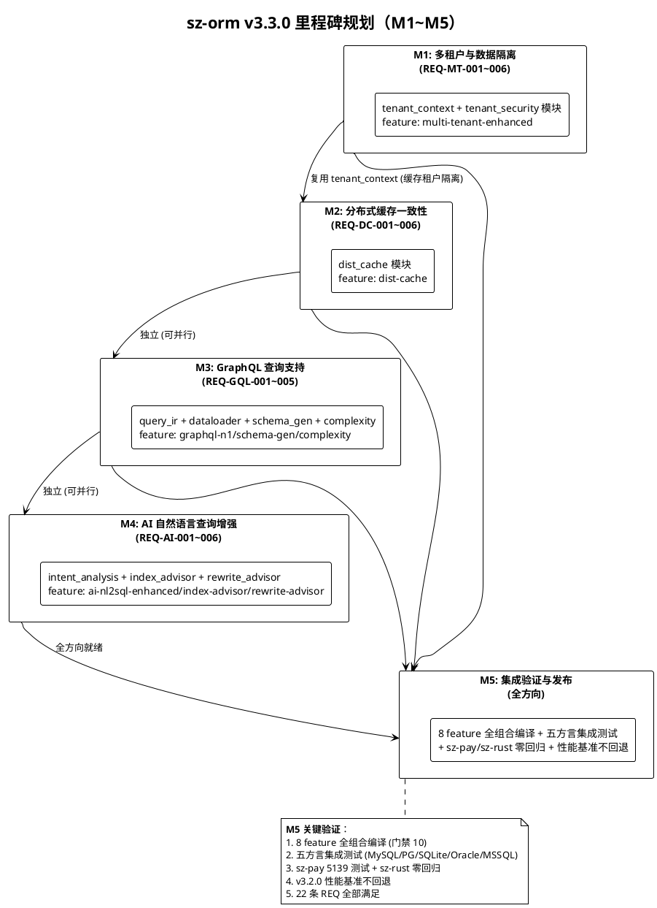

### 2.5.2 里程碑详细规划

| 里程碑 | 周期 | 交付物 | 验收标准（对应 spec §9） | 依赖 | 风险 |
|--------|------|--------|-------------------------|------|------|
| **M1 多租户与数据隔离** | 2 周 | `tenant_context.rs` + `tenant_security.rs` + QueryBuilder 扩展 + TenantPoolRegistry + 行级安全/列级脱敏/审计增强 | AC-MT-1~6（spec §9.3）：上下文自动注入、Schema 隔离路由、连接池原子切换、行级安全+列脱敏、审计日志、跨租户泄漏杜绝 | 既有 `with_tenant_id` / `AccessRule` / `DataMasker` / `SqlAuditor` / `Pool` | R-07 上下文竞态（高）、R-08 Schema 膨胀（中）、R-09 脱敏遗漏（高） |
| **M2 分布式缓存一致性** | 2 周 | `dist_cache.rs` + RedisPubSubInvalidationBus + GossipInvalidationBus + ConsistencyLevel + WriteBehindQueue + BloomFilterGuard + MutexGuard + RandomTtlJitter | AC-DC-1~6（spec §9.1）：Pub/Sub 50ms 同步、Gossip 1s 收敛、强/最终一致、Write-behind 3x 吞吐 + WAL 不丢数据、击穿穿透 ≤1 + 雪崩防护、失效消息丢失兜底 | 既有 `InvalidationBus` / `L2Cache` / `RedisBackend` / `sz-orm-crypto` | R-01 网络分区（高）、R-02 宕机丢数据（高）、R-03 布隆假阳性（中） |
| **M3 GraphQL 查询支持** | 2 周 | `query_ir.rs` + `dataloader.rs` + `schema_gen.rs` + `complexity.rs` + GraphQLIR + DataLoader + SchemaGenerator + ComplexityCalculator | AC-GQL-1~5（spec §9.2）：IR 解析、N+1 消除查询次数 ≤2、Schema 自动生成、复杂度限制、变量参数化 | 既有 `GraphQLSchema` / `DbResolver` / `real` feature / `sz-orm-macros` | R-04 DataLoader 顺序（中）、R-05 复杂类型支持（中）、R-06 误拒合法查询（中） |
| **M4 AI 自然语言查询增强** | 2 周 | `intent_analysis.rs` + `index_advisor.rs` + `rewrite_advisor.rs` + IntentAnalyzer + IndexAdvisor + RewriteAdvisor + AiAdviceAuditRecord | AC-AI-1~6（spec §9.4）：NL2SQL 增强、意图分析、索引建议、重写建议、安全可追溯、不自动执行 | 既有 `Nl2SqlEngine` / `safety` / `sql_sanitizer` / `UnifiedQueryOptimizer` / `real` feature | R-10 安全验证遗漏（高）、R-11 误自动执行（高）、R-12 LLM 不可用（中） |
| **M5 集成验证与发布** | 1 周 | 8 feature 全组合编译 + 五方言集成测试 + sz-pay/sz-rust 零回归验证 + 性能基准不回退验证 + 22 条 REQ 验收 | AC-ALL-1~8（spec §9.5）：无 Breaking Change、cargo test 全通过、clippy 零警告、feature 隔离、下游零回归、性能不回退、五方言一致、22 REQ 全满足 | M1~M4 全方向就绪 | R-13 feature 组合膨胀（低）、R-14 下游回归（中）、R-15 五方言差异（中） |

### 2.5.3 关键路径与并行机会

- **关键路径**：M1（多租户）→ M5（集成验证），M1 为多租户与缓存一致性共用 `tenant_context`（缓存可按租户隔离），需先交付
- **并行机会**：M2（缓存）/ M3（GraphQL）/ M4（AI）三者独立，可并行开发（不同包/不同模块，无相互依赖）
- **M5 前置**：M1~M4 全部就绪后进入 M5 集成验证
- **总周期**：关键路径 2 周（M1）+ 1 周（M5）= 3 周（串行）；并行开发下 M2/M3/M4 与 M1 同期进行，总周期可压缩至 3 周

---

## 2.6 风险登记与缓解措施

基于 spec §10 风险登记，结合本设计方案的架构决策，补充技术层面的缓解措施。

| 编号 | 风险 | 等级 | 影响范围 | 缓解措施（技术层面） | 关联方向 | 关联 REQ |
|------|------|------|---------|---------------------|---------|---------|
| R-01 | 跨实例失效协议在网络分区下失效消息丢失 | 高 | 多实例缓存一致性 | TTL 兜底（最终一致性）+ 同步重试（强一致性）+ gossip 反熵（节点重连补全）；网络分区集成测试覆盖（模拟 Redis 故障 + 网络断开）；失效消息丢失检测指标（发布数 vs 接收数） | 分布式缓存 | REQ-DC-006 |
| R-02 | Write-behind 宕机丢数据 | 高 | Write-behind 写入 | WAL 持久化先于返回成功（enqueue 顺序：写 WAL → 入内存队列 → 返回）；宕机重启按 sequence 回放测试覆盖；刷盘失败回退同步写 + WAL 保留待重试；WAL CRC 校验完整性 | 分布式缓存 | REQ-DC-004 |
| R-03 | 布隆过滤器假阳性导致穿透 | 中 | 缓存击穿防护 | 假阳性率 ≤ 1% 可配置（bloomfilter crate 参数）；互斥锁兜底（假阳性时仅一个请求查库）；空值标记回填（首次穿透后后续命中空值标记）；假阳性率指标监控 | 分布式缓存 | REQ-DC-005 |
| R-04 | GraphQL DataLoader 批量加载顺序与逐条不一致 | 中 | N+1 消除正确性 | 差分测试覆盖（批量 vs 逐条结果完全一致）；按键映射回填保持原始请求顺序；同键去重后同值回填；DataLoader 单元测试含顺序断言 | GraphQL | REQ-GQL-002 |
| R-05 | Schema 自动生成对复杂 Rust 类型支持不足 | 中 | Schema 自动生成可用性 | 不支持类型告警跳过（复杂嵌套枚举/泛型）+ 告警含字段与类型；用户可手动标注覆盖；TypeMapping 文档明确支持类型列表；类型映射测试覆盖 | GraphQL | REQ-GQL-003 |
| R-06 | 查询复杂度限制误拒合法查询 | 中 | 复杂度限制可用性 | 复杂度上限可独立配置（深度/字段数/成本）；提供配置调整文档与示例；复杂度计算开销 ≤ 5% 基准测试；合法查询不被误拒的边界测试 | GraphQL | REQ-GQL-004 |
| R-07 | 多租户上下文竞态导致跨租户泄漏 | 高 | 多租户隔离安全性 | tokio task-local 异步上下文隔离（与异步任务边界一致）；RAII 守卫原子切换；竞态测试覆盖（并发租户切换 + 查询）；上下文必填校验（未设置拒绝执行） | 多租户 | REQ-MT-006 |
| R-08 | Schema 隔离 Schema 数量膨胀（大量租户） | 中 | Schema 隔离可扩展性 | 大规模租户用行级隔离（RowLevel），小规模用 Schema 隔离（SchemaIsolation）；按租户规模选择策略文档；Schema 隔离创建/销毁生命周期管理；大规模租户性能测试 | 多租户 | REQ-MT-002 |
| R-09 | 列级脱敏规则配置遗漏导致敏感数据泄漏 | 高 | 列级脱敏安全性 | 默认拒绝读取未配置脱敏规则的敏感列（安全优先）；告警通知补配置；ORM 层强制执行（result_map 路径 + QueryBuilder 执行后）；绕过 ORM 的原生 SQL 在 Connection 层拦截或文档明确约束 | 多租户 | REQ-MT-004 |
| R-10 | LLM 生成 SQL 安全验证遗漏 | 高 | AI 建议安全性 | 安全验证强制（`validate_select_only` + `validate_no_injection` 复用既有 safety）；安全事件审计；NL2SQL 输出 100% 经 safety 验证测试覆盖；注入载荷测试集 | AI 增强 | REQ-AI-001/005 |
| R-11 | AI 建议被误自动执行 | 高 | AI 建议安全性 | 安全铁律（仅建议展示，零数据库执行）；代码审查检查无 execute 调用；测试验证 AI 建议路径零 DB 执行（mock DB 断言无 execute 调用）；API 设计建议返回文本而非可执行对象 | AI 增强 | REQ-AI-006 |
| R-12 | LLM 服务不可用导致 AI 能力失效 | 中 | AI 建议可用性 | 降级为规则型建议（如适用，索引/重写有规则型路径）；不阻塞业务查询主路径（AI 建议异步/独立调用）；错误提示 `LlmServiceUnavailable`；LLM 调用超时 + 重试配置 | AI 增强 | REQ-AI-001~004 |
| R-13 | feature 组合矩阵膨胀（8 新 feature × 既有组合） | 低 | 工程化门禁 | 纳入既有门禁 10 Feature 全组合编译（`cargo check --all-features`）；CI 矩阵覆盖 8 新 feature；feature 正交性设计（可独立启用）；组合编译时间监控 | 全部 | 全部 |
| R-14 | 下游 sz-pay 升级回归（虽 feature 默认关闭） | 中 | 下游兼容性 | feature gate 默认关闭确保默认零行为变更；实际回归验证 sz-pay 5139 测试 + sz-rust；sz-pay/sz-rust 升级指南文档；ADR-0001 严禁修改下游/上游仓库 | 全部 | 全部 |
| R-15 | 五方言行为差异（多租户 Schema 隔离在各方言支持差异） | 中 | 五方言一致性 | Schema 隔离在 core 层统一抽象（表名重写 `tenant_{id}_{table}`），方言驱动仅执行 SQL；五方言集成测试覆盖（MySQL/PG/SQLite/Oracle/MSSQL）；各方言 Schema 创建 DDL 差异处理 | 全部 | REQ-MT-002 |

---

## 2.7 验收标准映射

将 spec §9 验收标准总览映射到本设计方案的具体实现点，确保每条验收标准有明确的技术交付物支撑。

### 2.7.1 方向 1 验收标准映射（分布式缓存一致性）

| 验收标准 | 对应 REQ | 技术交付物 | 验证方式 |
|---------|---------|-----------|---------|
| AC-DC-1：Redis Pub/Sub 跨实例失效 50ms 内同步 | REQ-DC-001 | `RedisPubSubInvalidationBus`（2.1.3） | 多实例集成测试（实例 A 失效 → 实例 B 50ms 内失效，Redis Pub/Sub 延迟测量） |
| AC-DC-2：Gossip ≤10 实例 1s 收敛 + 认证 | REQ-DC-002 | `GossipInvalidationBus`（2.1.3） | 10 实例 gossip 集群测试（收敛延迟测量 + 共享密钥认证验证） |
| AC-DC-3：强一致/最终一致可选 + 行为正确 | REQ-DC-003 | `ConsistencyLevel` + 写路径分派（2.1.3） | 强一致写后读返回最新值测试 + 最终一致写后立即返回 + TTL 兜底测试 |
| AC-DC-4：Write-behind 3x 吞吐 + WAL 不丢数据 | REQ-DC-004 | `WriteBehindQueue` + WAL 回放（2.1.3） | 吞吐量基准测试（vs write-through）+ 宕机重启 WAL 回放零丢失测试 + 刷盘失败回退同步写测试 |
| AC-DC-5：击穿穿透 ≤1 + 雪崩 TTL 标准差 | REQ-DC-005 | `BloomFilterGuard` + `MutexGuard` + `RandomTtlJitter`（2.1.3） | 高并发不存在 key 穿透请求数测试（≤1）+ 批量过期 TTL 标准差测试（≥ 抖动范围） |
| AC-DC-6：失效消息丢失兜底 | REQ-DC-006 | TTL 兜底 + 同步重试（2.1.4） | 网络分区/Redis 故障模拟测试（最终一致 TTL 到期失效 + 强一致同步重试） |

### 2.7.2 方向 2 验收标准映射（GraphQL 查询支持）

| 验收标准 | 对应 REQ | 技术交付物 | 验证方式 |
|---------|---------|-----------|---------|
| AC-GQL-1：IR 解析含完整选择集 | REQ-GQL-001 | `GraphQLIR` + `parse_query`（2.2.3） | 合法查询解析为 IR 测试（选择集/字段/参数/指令完整）+ 非法查询返回解析错误测试 |
| AC-GQL-2：N+1 消除查询次数 ≤2 + 结果一致 | REQ-GQL-002 | `DataLoader` + `BatchLoader`（2.2.3） | N 个关联字段查询次数测试（≤2）+ 批量 vs 逐条差分测试（结果完全一致）+ 减少 ≥90% 基准 |
| AC-GQL-3：Schema 自动生成类型一致 | REQ-GQL-003 | `SchemaGenerator` + `TypeMapping`（2.2.3） | Rust 模型 → Schema 生成测试（类型/字段一一对应）+ 生成 Schema 用于查询执行测试 |
| AC-GQL-4：复杂度限制 + 开销 ≤5% | REQ-GQL-004 | `ComplexityConfig` + `ComplexityCalculator`（2.2.3） | 深度/字段数/成本超限拒绝测试 + 合法查询正常执行测试 + 复杂度计算开销基准（≤5%） |
| AC-GQL-5：变量参数化无注入 | REQ-GQL-005 | DataLoader 批量 SQL 参数化（2.2.4） | 注入载荷测试（变量作为参数值而非语法）+ 下游 SQL 执行安全验证 |

### 2.7.3 方向 3 验收标准映射（多租户与数据隔离）

| 验收标准 | 对应 REQ | 技术交付物 | 验证方式 |
|---------|---------|-----------|---------|
| AC-MT-1：上下文自动注入 + 既有 API 兼容 | REQ-MT-001 | `TenantContext` + `TenantContextGuard` + `build_tenant_condition` 扩展（2.3.3） | 中间件设置上下文 + 查询自动追加隔离条件测试 + 既有 `with_tenant_id` 行为不变兼容测试 |
| AC-MT-2：Schema 隔离路由 + 物理隔离 | REQ-MT-002 | `SchemaIsolationRouter` + `table()` 重写（2.3.3） | 租户 A/B 查询路由到 `tenant_a/b.{table}` 测试 + 两租户数据物理隔离测试 + 行级/Schema 切换测试 |
| AC-MT-3：连接池原子切换 + 路由 ≤50μs | REQ-MT-003 | `TenantPoolRegistry`（2.3.3） | 租户切换原子测试（切换中无跨租户泄漏）+ 路由开销基准测试（≤50μs） |
| AC-MT-4：行级安全 + 列脱敏不可绕过 | REQ-MT-004 | `RowLevelSecurityPolicy` + `ColumnMaskingRule`（2.3.3） | 部门级行级安全过滤测试 + 薪资列脱敏测试 + 绕过 ORM 原生 SQL 仍受约束测试 |
| AC-MT-5：审计日志含租户 ID/操作/时间/结果 | REQ-MT-005 | `TenantAuditContext` + `TenantAuditOperation`（2.3.3） | 租户切换/跨租户拒绝/行级过滤/列脱敏审计记录测试 + 日志不可篡改测试 |
| AC-MT-6：上下文必填 + 原子切换 + 无泄漏 | REQ-MT-006 | 上下文必填校验 + RAII 守卫 + 竞态测试（2.3.4） | 未设置上下文拒绝执行测试 + 租户切换竞态测试（无泄漏）+ 查询重写全覆盖测试 |

### 2.7.4 方向 4 验收标准映射（AI 自然语言查询增强）

| 验收标准 | 对应 REQ | 技术交付物 | 验证方式 |
|---------|---------|-----------|---------|
| AC-AI-1：NL2SQL 多表 JOIN + 仅 SELECT + 脱敏 + ≤10s | REQ-AI-001 | `Nl2SqlEngine` prompt 增强（2.4.3） | 多表 JOIN + 聚合 + 分页 NL2SQL 测试 + 安全验证仅 SELECT 测试 + LLM 请求脱敏测试 + 延迟 ≤10s P95 基准 |
| AC-AI-2：意图分析 + 写操作高风险 + ≤5s | REQ-AI-002 | `IntentAnalyzer` + `IntentAnalysisResult`（2.4.3） | SELECT/INSERT/UPDATE/DELETE 意图识别测试 + 写操作高风险标注测试 + 延迟 ≤5s P95 基准 |
| AC-AI-3：索引建议含列/类型/收益/证据 + 不执行 + ≤10s | REQ-AI-003 | `IndexAdvisor` + `IndexSuggestion`（2.4.3） | 索引建议含列/类型/DDL/收益/证据测试 + DDL 不自动执行测试 + 延迟 ≤10s P95 基准 |
| AC-AI-4：重写建议含等价变换/论证/收益 + 不重写 | REQ-AI-004 | `RewriteAdvisor` + `RewriteSuggestion`（2.4.3） | 谓词下推/子查询展开建议测试 + 等价性论证测试 + 不自动重写测试 |
| AC-AI-5：建议不执行 + 记录来源/模型/置信度/类型 + 脱敏 | REQ-AI-005 | `AiAdviceAuditRecord`（2.4.3） | AI 建议零数据库执行测试 + 审计记录含来源/模型/置信度/类型测试 + LLM 请求脱敏测试 |
| AC-AI-6：AI 生成 SQL/DDL 仅建议文本零执行 | REQ-AI-006 | 安全铁律（2.4.1） | AI 建议路径 mock DB 断言无 execute 调用测试 + 建议返回文本而非可执行对象测试 |

### 2.7.5 总体验收标准映射

| 验收标准 | 技术交付物 | 验证方式 |
|---------|-----------|---------|
| AC-ALL-1：无 Breaking Change | 8 feature gate 默认关闭 + 既有 API 不修改 | 既有公开 API 签名对比测试（v3.2.0 vs v3.3.0） |
| AC-ALL-2：cargo test 全通过 | 全部新增模块单元/集成测试 | `cargo test --workspace` 全通过 |
| AC-ALL-3：clippy 零警告 | 全部新增代码遵循 clippy 规则 | `cargo clippy --workspace --all-targets -- -D warnings` 零警告 |
| AC-ALL-4：feature gate 隔离 + 默认无额外依赖 | 8 feature 默认关闭 + optional 依赖 | `cargo check --workspace`（默认 feature）零新依赖 + `cargo check --all-features` 全组合编译 |
| AC-ALL-5：sz-pay/sz-rust 零回归 | feature gate 默认关闭 | sz-pay 5139 测试 + sz-rust 测试实际回归验证 |
| AC-ALL-6：v3.2.0 性能基准不回退 | 新增能力不触碰既有性能路径 | 冷启动 P95 ≤ 20ms + 计划缓存命中率 ≥ 80% + 零拷贝 ≥ 50% + SIMD ≥ 2x 基准对比 |
| AC-ALL-7：五方言行为一致 | 增强在 core/graphql/ai 层统一，不触碰方言驱动 | MySQL/PG/SQLite/Oracle/MSSQL 五方言集成测试 |
| AC-ALL-8：22 条 REQ 全部满足 | M1~M4 全方向交付 | 需求追溯矩阵（spec §7）逐条验收 |

---

> **文档结束**

