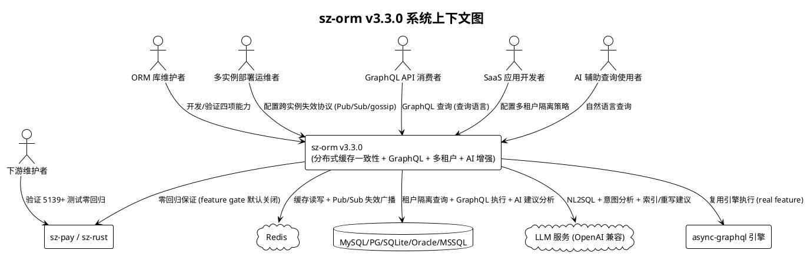
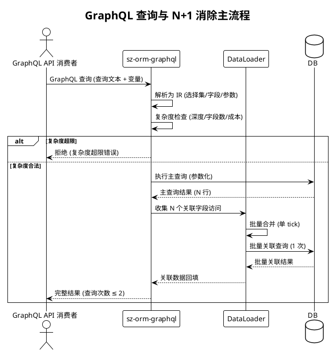
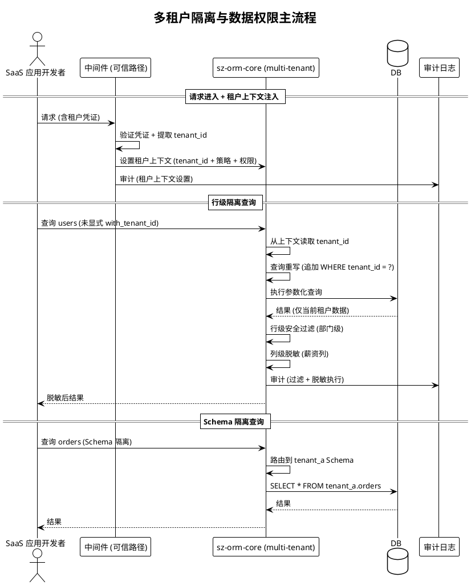

# sz-orm v3.3.0 需求规格说明书

> 版本：v3.3.0（分布式缓存一致性 + GraphQL 查询支持 + 多租户与数据隔离 + AI 自然语言查询增强）
> 基线：v3.2.0（已完成：零拷贝序列化 + SIMD 加速 + 连接池预热增强 + 查询计划缓存）
> 日期：2026-08-08
> 需求格式：EARS（Ubiquitous / Event-driven / State-driven / Unwanted）
> 文档定位：需求规格（What to build），不含技术设计（How to build）
> 优先级声明：四个方向均为**中优先级**，按"多租户与数据隔离(3) → 分布式缓存一致性(1) → GraphQL 查询支持(2) → AI 自然语言查询增强(4)"的收益/风险序推进；多租户与缓存一致性为高收益中风险（复用既有 P0-3 多租户与 L2Cache 基础），GraphQL 与 AI 增强为中收益中风险（需 feature gate 隔离重依赖）
> 需求编号约定：REQ-DC-xxx（分布式缓存）/ REQ-GQL-xxx（GraphQL）/ REQ-MT-xxx（多租户）/ REQ-AI-xxx（AI 增强）

---

# 1. 组件定位

## 1.1 核心职责

本组件负责交付 sz-orm v3.3.0 的四项能力扩展任务：分布式缓存一致性、GraphQL 查询支持、多租户与数据隔离、AI 自然语言查询增强，实现 sz-orm 在"分布式缓存一致性保证、GraphQL 声明式查询、多租户数据隔离、AI 智能查询"四个维度的能力突破，且不破坏现有 API 兼容性与五方言覆盖。

## 1.2 核心输入

1. **现有 L2Cache 与失效总线**：`L2Cache`（`packages/sz-orm-core/src/l2_cache.rs:517`，LRU + TTL + Redis 后端 + 失效总线）、`InvalidationBus` trait（`packages/sz-orm-core/src/l2_cache.rs:82`，跨实例失效抽象）、`LocalInvalidationBus`（`packages/sz-orm-core/src/l2_cache.rs:93`，进程内广播）、`RedisBackend`（`packages/sz-orm-core/src/l2_cache.rs:1361`，Redis 分布式后端），作为分布式缓存一致性增强的既有基础。
2. **现有 GraphQL 包**：`sz-orm-graphql`（`packages/sz-orm-graphql`，含 `GraphQLSchema` / `GraphQLType` / `GraphQLField` / `DbResolver` trait / `real` feature 接入 async-graphql），作为 GraphQL 查询支持增强的既有基础。
3. **现有 P0-3 多租户过滤**：`QueryBuilder::with_tenant_id()`（`packages/sz-orm-core/src/query.rs:448`）、`without_tenant()`（`packages/sz-orm-core/src/query.rs:456`）、`Model::tenant_field()`（`packages/sz-orm-core/src/query.rs:469`）、`build_tenant_condition()`（`packages/sz-orm-core/src/query.rs:488`，自动追加 `WHERE tenant_id = ?`），作为多租户与数据隔离增强的既有基础。
4. **现有 AI 能力包**：`Nl2SqlEngine`（`packages/sz-orm-ai/src/nl2sql.rs`，Simple/OpenAI 两引擎）、`QueryOptimizer`（`packages/sz-orm-ai/src/nl2sql.rs:1190`，规则型优化分析器）、`UnifiedQueryOptimizer`（`packages/sz-orm-ai/src/query_plan_optimizer.rs:440`，LLM 优化器）、`safety` 模块（`packages/sz-orm-ai/src/safety.rs`，输入安全检查）、`sql_sanitizer`（`packages/sz-orm-ai/src/sql_sanitizer.rs`，敏感字面量脱敏），作为 AI 自然语言查询增强的既有基础。
5. **现有连接池与多后端**：`Pool` / `UnifiedPool` / `AnyPool`（`packages/sz-orm-core/src/pool.rs`、`packages/sz-orm-sqlx/src/unified_pool.rs`），作为多租户连接池隔离与租户路由的既有基础。
6. **现有分片能力**：`sz-orm-sharding`（`packages/sz-orm-sharding`，含 `ShardingStrategy` / `ScatterGather` / `ShardTransactionCoordinator`），作为多租户 Schema 隔离与路由的架构参考。
7. **现有审计与脱敏能力**：`sz-orm-audit`（审计日志）、`sz-orm-masking`（列级脱敏），作为多租户数据权限增强的既有基础。
8. **v3.2.0 性能基线**：冷启动 P95 ≤ 20ms、查询计划缓存命中率 ≥ 80%、零拷贝反序列化分配减少 ≥ 50%、SIMD 批量解码吞吐量 ≥ 2x，作为不回退基准。
9. **五方言覆盖约束**：MySQL/PostgreSQL/SQLite/Oracle/MSSQL，所有新能力必须保持五方言行为一致。

## 1.3 核心输出

1. **分布式缓存一致性能力**：L2Cache 跨实例失效协议（Redis Pub/Sub 或 gossip）、一致性保证（强一致性/最终一致性可选）、Write-behind 异步批量写入、缓存击穿/雪崩防护（布隆过滤器 + 互斥锁 + 随机 TTL）。
2. **GraphQL 查询支持能力**：GraphQL 查询解析（查询语言 → 内部 IR）、N+1 自动消除（DataLoader 批量加载）、类型化 Schema 自动生成（Rust 模型 → GraphQL Schema）、查询复杂度限制（深度 + 字段数 + 计算成本）。
3. **多租户与数据隔离能力**：多租户 ORM 层（行级隔离 + 租户上下文自动注入）、Schema 隔离（每租户独立 Schema / 共享 Schema + tenant_id 列）、租户切换与路由（连接池隔离 + 查询重写）、数据权限增强（行级安全 + 列级脱敏 + 审计日志）。
4. **AI 自然语言查询增强能力**：NL2SQL 增强、查询意图分析（SELECT/INSERT/UPDATE/DELETE 意图识别 + 参数提取）、自动索引建议（基于查询模式分析 + 慢查询日志）、查询重写建议（等价变换 + 谓词下推 + 子查询展开）。
5. **需求追溯矩阵**：本文档第 7 章，建立需求 ↔ 验收条件映射。
6. **验收标准总览**：本文档第 9 章，按方向汇总验收条件。

## 1.4 职责边界

本组件**不负责**以下事项：

1. **不重写 L2Cache 核心数据结构**：分布式缓存一致性增强以扩展方式提供（新增跨实例失效协议实现 + Write-behind 模块 + 防护组件），既有 `L2Cache` / `CacheKey` / `L2CacheStats` / `InvalidationBus` trait 公开 API 保持完全向后兼容。
2. **不替代 async-graphql 引擎**：GraphQL 查询支持复用既有 `sz-orm-graphql` 包的 `real` feature（async-graphql），新增能力（DataLoader / Schema 自动生成 / 复杂度限制）以扩展方式提供，不重写 GraphQL 执行引擎。
3. **不重写 P0-3 多租户过滤核心**：多租户增强以扩展方式提供（新增 Schema 隔离 + 连接池隔离 + 行级安全 + 列级脱敏 + 审计），既有 `with_tenant_id` / `without_tenant` / `tenant_field` API 保持完全向后兼容。
4. **不负责 LLM 模型训练与托管**：AI 自然语言查询增强消费已有 LLM 服务（OpenAI 兼容 API），不训练模型、不托管模型、不负责 LLM 推理性能。
5. **不自动执行 AI 生成的 SQL**：AI 优化器产出的任何 SQL 建议（NL2SQL / 重写建议 / 索引建议）必须仅作建议展示，禁止自动执行 LLM 生成的 SQL（沿用 v3.0.0 既有安全铁律）。
6. **不修改五方言驱动实现**：四项能力在 sz-orm-core / sz-orm-graphql / sz-orm-ai 层提供，五方言驱动（sz-orm-sqlx/sz-orm-oracle/sz-orm-mssql）仅按需集成，不修改既有方言逻辑。
7. **不负责 sz-pay / sz-rust 下游代码**：下游零回归通过 feature gate 默认关闭保证，本组件仅提供上游就绪验证（ADR-0001 严禁修改下游/上游仓库）。
8. **不引入新关系型方言**：四项能力均基于现有五方言，不新增第六种关系型方言。

---

# 2. 领域术语

**分布式缓存一致性（Distributed Cache Consistency）**
: 多实例部署环境下，各实例 L2Cache 缓存数据保持一致的能力，当一个实例更新数据并失效缓存时，其它实例对应缓存同步失效，避免读到过期数据。
: 备注：v3.3.0 通过跨实例失效协议（Redis Pub/Sub 或 gossip）实现。

**跨实例失效协议（Cross-Instance Invalidation Protocol）**
: 缓存失效消息在多实例间传播的协议，当某实例执行写操作失效本地缓存时，通过协议通知其它实例同步失效，支持 Redis Pub/Sub（中心化）或 gossip（去中心化）两种实现。
: 备注：sz-orm 已有 `InvalidationBus` trait（`packages/sz-orm-core/src/l2_cache.rs:82`）抽象，v3.3.0 新增 Redis Pub/Sub 与 gossip 两种实现。

**强一致性缓存（Strong Consistency Cache）**
: 缓存与数据库保持强一致的语义，写操作完成后读操作必须返回最新值，通过"先失效缓存再写库"或"写库后同步失效所有实例缓存"实现。
: 备注：性能开销大于最终一致性，适用于对一致性要求严格的场景。

**最终一致性缓存（Eventual Consistency Cache）**
: 缓存与数据库最终达到一致的语义，写操作后短期内可能读到过期数据，但最终会一致，通过异步失效 + TTL 兜底实现。
: 备注：性能优于强一致性，适用于对一致性要求宽松的场景。

**Write-behind（写后异步）**
: 写操作先写入缓存并立即返回成功，由后台任务异步批量写入数据库的缓存写入策略，提升写吞吐量但需保证持久化（宕机不丢数据）。
: 备注：与 Write-through（同步写库）对比，Write-behind 牺牲即时一致性换取写性能。

**缓存击穿（Cache Breakdown）**
: 大量并发请求同时查询一个缓存不存在但数据库存在的 key，导致请求穿透到数据库造成瞬时压力，通过互斥锁（只允许一个请求查库回填）防护。

**缓存雪崩（Cache Avalanche）**
: 大量缓存在同一时刻集体过期失效，导致大量请求同时穿透到数据库造成瞬时压力，通过随机 TTL（过期时间加随机抖动）防护。

**布隆过滤器（Bloom Filter）**
: 一种空间效率高的概率型数据结构，用于判断某元素是否在集合中，可能误判（假阳性）但不会漏判（假阴性），用于缓存击穿防护（先判断 key 是否可能存在）。

**GraphQL IR（中间表示）**
: GraphQL 查询文本经解析后的内部中间表示（选择集 / 字段 / 参数 / 指令），是查询执行、N+1 消除、复杂度分析的中间数据结构。

**DataLoader**
: Facebook 提出的批量加载模式，将多个独立请求在单个事件循环 tick 内收集合并为一次批量请求，自动消除 N+1 查询问题。
: 备注：v3.3.0 在 sz-orm-graphql 内集成 DataLoader，对 GraphQL 解析出的字段访问自动批量化。

**类型化 Schema 自动生成（Typed Schema Generation）**
: 从 Rust 模型定义（`#[derive(Model)]` 结构体）自动生成 GraphQL Schema（Type / Field / Query / Mutation），无需手写 SDL，保持 Rust 类型与 GraphQL 类型一致。

**查询复杂度限制（Query Complexity Limit）**
: 对 GraphQL 查询的计算成本进行限制，含深度限制（嵌套层级）、字段数量限制（选择集大小）、计算成本限制（按字段权重累加），防止恶意/低效查询消耗资源。

**多租户（Multi-Tenant）**
: 单个应用实例服务多个租户（客户/组织），各租户数据相互隔离的架构模式，sz-orm 已有 P0-3 行级隔离基础（`with_tenant_id`）。
: 备注：v3.3.0 增强为行级 + Schema 级双重隔离，并增加数据权限增强。

**行级隔离（Row-Level Isolation）**
: 多租户共享同一张表，通过 `tenant_id` 列区分各租户数据，查询自动追加 `WHERE tenant_id = ?` 过滤，sz-orm 已有此能力（`packages/sz-orm-core/src/query.rs:448`）。

**Schema 隔离（Schema Isolation）**
: 每个租户使用独立数据库 Schema（如 `tenant_a.users` / `tenant_b.users`），物理隔离各租户数据，隔离强度高于行级隔离。
: 备注：与行级隔离可选，按租户规模与隔离要求选择。

**租户上下文（Tenant Context）**
: 当前请求所属租户的运行时上下文（tenant_id + 隔离策略 + 权限），自动注入查询构建与执行路径，无需调用方逐处传递。

**行级安全（Row-Level Security, RLS）**
: 数据库行级访问控制，基于租户上下文与权限策略过滤可见行，超出 `tenant_id` 过滤的细粒度权限（如部门级、角色级）。

**列级脱敏（Column-Level Masking）**
: 对特定列（如身份证、手机号、薪资）按租户权限进行脱敏处理，未授权租户读到脱敏值而非原始值，sz-orm 已有 `sz-orm-masking` 包基础。

**查询意图分析（Query Intent Analysis）**
: 从自然语言查询中识别用户意图（SELECT 查询 / INSERT 插入 / UPDATE 更新 / DELETE 删除）并提取关键参数（表名、条件、排序、分页）的能力。

**自动索引建议（Automatic Index Suggestion）**
: 基于查询模式分析（WHERE 条件列、JOIN 列、ORDER BY 列）与慢查询日志，自动推荐应创建的数据库索引，提升查询性能。

**查询重写建议（Query Rewrite Suggestion）**
: 对输入 SQL 提出等价变换建议（谓词下推、子查询展开、JOIN 顺序调整、冗余条件消除），输出建议而非自动重写，由人工审核后应用。

**谓词下推（Predicate Pushdown）**
: 将过滤条件（WHERE）下推到子查询或 JOIN 的内层，减少中间结果集大小的查询优化技术。

**子查询展开（Subquery Flattening）**
: 将子查询展开为 JOIN 或等价的扁平查询，提升优化器选择更优执行计划的机会。

---

# 3. 角色与边界

## 3.1 核心角色

- **ORM 库维护者**：执行 v3.3.0 四项能力扩展任务的开发、验证、测试操作者，是新增能力的主要使用者与验收人。
- **多实例部署运维者**：在多实例环境部署 sz-orm 应用的运维方，关注分布式缓存一致性协议配置与失效行为。
- **GraphQL API 消费者**：通过 GraphQL 接口查询数据的前端/客户端开发者，关注查询能力与复杂度限制。
- **SaaS 应用开发者**：基于 sz-orm 构建多租户 SaaS 应用的开发者，是多租户与数据隔离能力的主要受益方。
- **AI 辅助查询使用者**：通过自然语言查询数据库的业务用户，关注 NL2SQL 准确性与查询建议质量。
- **sz-pay / sz-rust 下游维护者**：依赖 sz-orm 的下游项目方，关注 v3.3.0 升级是否零回归。

## 3.2 外部系统

- **Redis**：分布式缓存后端与跨实例失效协议（Pub/Sub）的承载系统（方向 1）。
- **MySQL / PostgreSQL / SQLite / Oracle / MSSQL**：现有 5 后端数据库，多租户隔离、GraphQL 查询、AI 建议的执行环境。
- **LLM 服务（OpenAI 兼容 API）**：AI 自然语言查询增强的外部推理服务（方向 4）。
- **async-graphql 引擎**：GraphQL 查询执行引擎（方向 2，复用既有 `real` feature）。
- **sz-pay 项目**：下游验证项目（5139 测试基线），零回归验证对象。
- **sz-rust 项目**：下游框架项目，零回归验证对象。

## 3.3 交互上下文



---

# 4. DFX 约束

## 4.1 性能

1. **跨实例失效延迟**：Redis Pub/Sub 跨实例失效消息传播延迟必须 ≤ 50ms（P95，单 Redis 实例同机房），gossip 协议收敛延迟必须 ≤ 1s（P95，≤ 10 实例）。
2. **Write-behind 吞吐量**：启用 Write-behind 后，写操作吞吐量必须较 Write-through 提升 ≥ 3x（批量合并 + 异步刷盘），且单条写操作返回延迟必须 ≤ 1ms。
3. **缓存击穿防护收益**：启用布隆过滤器 + 互斥锁后，对不存在的 key 高并发查询穿透到数据库的请求数必须 ≤ 1（互斥期间仅一个请求查库）。
4. **GraphQL N+1 消除收益**：启用 DataLoader 后，GraphQL 查询含 N 个关联字段访问时，实际数据库查询次数必须 ≤ 2（1 次主查询 + 1 次批量关联查询），较未启用 N+1 模式的 N+1 次减少 ≥ 90%。
5. **GraphQL 复杂度限制开销**：查询复杂度计算（深度 + 字段数 + 成本累加）开销必须 ≤ 查询执行总耗时的 5%，不得因复杂度限制导致显著性能退化。
6. **多租户隔离开销**：多租户上下文自动注入与查询重写的额外开销必须 ≤ 5μs/查询（行级隔离），Schema 隔离的连接池路由开销必须 ≤ 50μs/查询。
7. **AI 建议响应上限**：NL2SQL 单条转换延迟必须 ≤ 10s（P95，含 LLM 调用），查询意图分析延迟必须 ≤ 5s（P95），索引/重写建议延迟必须 ≤ 10s（P95），且不得阻塞业务查询主路径。
8. **现有基准不回退**：v3.3.0 不得使 v3.2.0 已验收的性能基准回退（冷启动 P95 ≤ 20ms、计划缓存命中率 ≥ 80%、零拷贝分配减少 ≥ 50%、SIMD 吞吐量 ≥ 2x）。

## 4.2 可靠性

1. **跨实例失效完整性**：任一实例执行写操作失效缓存后，所有实例对应缓存必须最终失效（最终一致性）或立即失效（强一致性），禁止某实例持续读到过期数据。
2. **Write-behind 持久化保证**：Write-behind 异步写入必须在宕机场景不丢数据（通过 WAL/持久化队列 + 重启回放），刷盘失败必须告警并回退同步写。
3. **缓存雪崩防护有效性**：随机 TTL 必须使缓存过期时间分散，同一批次缓存过期时间标准差必须 ≥ 配置的抖动范围，禁止大量缓存同时过期。
4. **GraphQL 查询正确性**：GraphQL 查询经 DataLoader 批量加载的结果必须与逐条加载完全一致（含关联字段顺序与数据），复杂度限制不得改变查询结果（仅拒绝超限查询）。
5. **多租户隔离强保证**：租户 A 的查询必须永远无法读到租户 B 的数据（行级隔离 + Schema 隔离均需保证），租户切换必须原子（切换中查询不会跨租户泄漏）。
6. **行级安全与脱敏正确性**：行级安全过滤后的可见行必须与权限策略一致，列级脱敏后的值必须与脱敏规则一致，未授权访问必须读到脱敏值而非原始值。
7. **AI 建议安全性**：NL2SQL 生成的 SQL 必须经过安全验证（仅允许 SELECT，检测注入风险，沿用既有 `safety` 模块），意图分析识别的写操作（INSERT/UPDATE/DELETE）必须明确标注风险等级，禁止自动执行。
8. **测试零失败**：全 workspace `cargo test --workspace` 必须全部通过（除明确 `#[ignore]` 的真实服务/外部依赖测试），含五方言集成测试。

## 4.3 安全性

1. **跨实例失效协议认证**：Redis Pub/Sub 连接必须支持认证（密码 + ACL），gossip 协议节点间通信必须支持认证（共享密钥），禁止未认证节点加入失效广播。
2. **Write-behind 数据加密**：Write-behind 持久化队列/WAL 中的数据必须加密存储（复用既有 `sz-orm-crypto` 能力），禁止明文持久化敏感数据。
3. **GraphQL 注入防护**：GraphQL 查询变量必须参数化绑定到下游 SQL，禁止将 GraphQL 变量字符串拼接到 SQL，复杂度限制必须有效防止资源耗尽攻击。
4. **多租户权限铁律**：租户上下文必须由可信路径注入（中间件/网关），禁止由客户端直接传入 tenant_id 绕过权限，行级安全策略必须由服务端定义不可被客户端篡改。
5. **列级脱敏不可绕过**：列级脱敏必须在 ORM 层强制执行，禁止通过原生 SQL 或绕过 ORM 的路径读到原始值，脱敏规则变更必须审计记录。
6. **AI 输出不直接执行**：AI 优化器产出的任何 SQL 建议（NL2SQL / 重写 / 索引 DDL）必须仅作建议展示，禁止自动执行 LLM 生成的 SQL/DDL（沿用 v3.0.0 既有铁律）。
7. **AI 请求脱敏**：发送给 LLM 的请求内容必须脱敏（敏感字面量替换为占位符，复用既有 `sql_sanitizer`），禁止将真实数据值发送给外部 LLM 服务。
8. **不安全代码零容忍**：新增代码禁止 `unsafe`（除 `// SAFETY:` 论证注释），与既有工程化铁律一致。
9. **参数化查询铁律不变**：四项能力不得绕过参数化查询铁律，GraphQL 变量、多租户 tenant_id、AI 生成 SQL 均必须参数化绑定，禁止字符串拼接。

## 4.4 可维护性

1. **禁止占位实现**：新增代码禁止 `todo!` / `unimplemented!` / `unreachable!`。
2. **clippy 零警告**：`cargo clippy --workspace --all-targets -- -D warnings` 必须零警告。
3. **10 道门禁**：AGENTS.md 定义的全部门禁必须通过，含 Feature 全组合编译（新增 feature 必须纳入组合矩阵）。
4. **跨实例失效协议可观测**：失效消息传播必须暴露指标（发布数/接收数/丢弃数/延迟），可通过既有 telemetry 查询，协议异常必须告警。
5. **多租户审计可追溯**：租户切换、跨租户访问尝试（拒绝）、行级安全过滤、列级脱敏执行必须审计记录（复用既有 `sz-orm-audit`），审计日志含租户 ID + 操作 + 时间。
6. **AI 建议可追溯**：AI 优化器每条建议必须记录来源引擎（规则/LLM）、LLM 模型标识、置信度、建议类型，便于审计与质量评估。
7. **GraphQL Schema 变更可追溯**：类型化 Schema 自动生成的输入（Rust 模型）与输出（SDL）必须可追溯，Schema 变更必须记录差异。

## 4.5 兼容性

1. **无 Breaking Change**：v3.3.0 所有新增能力以扩展方式提供，现有公开 API 签名（`L2Cache` / `QueryBuilder` / `GraphQLSchema` / `Nl2SqlEngine` 等）保持完全向后兼容。
2. **Rust 版本兼容**：edition = "2021"，rust-version = "1.81"，不得提升。
3. **Feature 隔离**：四项能力必须通过 feature gate 隔离（`dist-cache` / `graphql-n1` / `graphql-schema-gen` / `graphql-complexity` / `multi-tenant-enhanced` / `ai-nl2sql-enhanced` / `ai-index-advisor` / `ai-rewrite-advisor`），默认 feature 不引入额外依赖与行为变更。
4. **下游零回归**：sz-pay（5139 测试基线）与 sz-rust 在 v3.3.0 升级后必须零回归（feature gate 默认关闭，理论上无行为变更，但需实际回归验证）。
5. **五方言行为一致**：所有新能力必须保持 MySQL/PostgreSQL/SQLite/Oracle/MSSQL 五方言行为一致，不得为某方言单独实现而破坏其它方言。
6. **既有 P0-3 多租户兼容**：多租户增强必须兼容既有 `with_tenant_id` / `without_tenant` / `tenant_field` API，既有行级隔离行为不变，增强为可选开启。

---

# 5. 核心能力

## 5.1 分布式缓存一致性

> 现状：sz-orm 已有 `L2Cache`（`packages/sz-orm-core/src/l2_cache.rs:517`，LRU + TTL + Redis 后端）、`InvalidationBus` trait（`packages/sz-orm-core/src/l2_cache.rs:82`，跨实例失效抽象）、`LocalInvalidationBus`（进程内广播）、`RedisBackend`（Redis 分布式后端）。但缺少：跨实例失效协议实现（Redis Pub/Sub / gossip）、一致性保证选项、Write-behind、缓存击穿/雪崩防护。
> 形态：在 sz-orm-core 内扩展分布式缓存一致性模块（feature gate "dist-cache"），新增跨实例失效协议实现 + Write-behind + 防护组件，不修改既有 `L2Cache` / `InvalidationBus` trait 公开 API。

### 5.1.1 业务规则

1. **跨实例失效协议 — Redis Pub/Sub**（EARS: Ubiquitous）
   系统应当提供基于 Redis Pub/Sub 的跨实例失效协议实现（`RedisPubSubInvalidationBus`），当某实例执行写操作失效本地缓存时，通过 Redis Pub/Sub 发布失效消息，其它实例订阅并同步失效，且可通过 feature gate 启用。
   a. 验收条件：[多实例部署 + 启用 dist-cache + 实例 A 失效 table_x 缓存] → [实例 B 及所有订阅实例的 table_x 缓存在 50ms 内同步失效；失效消息含表名/key 精确信息]

2. **跨实例失效协议 — Gossip**（EARS: State-driven）
   在无中心化 Redis 基础设施或去中心化部署场景下，系统应当提供基于 gossip 协议的跨实例失效协议实现（`GossipInvalidationBus`），各实例通过点对点 gossip 传播失效消息，最终所有实例收敛一致。
   a. 验收条件：[无 Redis 部署 + 启用 gossip 协议 + 实例 A 失效缓存] → [通过 gossip 传播，≤ 10 实例在 1s 内收敛一致；协议支持节点认证（共享密钥）]

3. **缓存一致性保证可选**（EARS: Ubiquitous）
   系统应当提供强一致性与最终一致性两种缓存一致性保证选项，强一致性通过"先失效所有实例缓存再写库"实现，最终一致性通过"写库后异步失效 + TTL 兜底"实现，且可通过配置选择。
   a. 验收条件：[配置强一致性 + 实例 A 写 table_x] → [所有实例 table_x 缓存失效后再返回写成功；读操作必返回最新值；配置最终一致性时写操作立即返回，异步失效 + TTL 兜底]

4. **Write-behind 异步批量写入**（EARS: Event-driven）
   当用户启用 Write-behind 模式时，系统应当将写操作先写入缓存与持久化队列（WAL）并立即返回成功，由后台任务按可配置批次大小与刷盘间隔异步批量写入数据库，且宕机重启后从 WAL 回放未刷盘写操作保证不丢数据。
   a. 验收条件：[启用 write-behind + 批量 N 条写操作] → [写操作立即返回（≤ 1ms），后台批量刷盘；吞吐量较 write-through 提升 ≥ 3x；宕机重启后 WAL 回放，零数据丢失；刷盘失败告警并回退同步写]

5. **缓存击穿/雪崩防护**（EARS: State-driven）
   在高并发查询缓存不存在 key 的场景下，系统应当通过布隆过滤器（先判断 key 是否可能存在）+ 互斥锁（仅允许一个请求查库回填）防护缓存击穿；在批量缓存过期的场景下，系统应当通过随机 TTL（过期时间加可配置随机抖动）防护缓存雪崩。
   a. 验收条件：[高并发查询不存在 key] → [布隆过滤器拦截 + 互斥锁保证穿透数据库请求数 ≤ 1；批量缓存过期时过期时间标准差 ≥ 配置抖动范围，无雪崩]

6. **禁止项 — 跨实例失效消息丢失**（EARS: Unwanted）
   如果跨实例失效协议因网络分区、Redis 故障、gossip 节点离线等原因导致失效消息丢失，则系统应当通过 TTL 兜底（最终一致性）或同步重试（强一致性）保证最终一致，禁止某实例持续读到过期数据。
   a. 验收条件：[失效消息丢失场景（网络分区/Redis 故障）] → [最终一致性：TTL 到期后缓存自动失效；强一致性：同步重试至所有实例确认失效；无实例持续读过期数据]

### 5.1.2 交互流程

```plantuml
@startuml
!theme plain
title 分布式缓存一致性与跨实例失效主流程

actor "ORM 库维护者" as Dev
participant "sz-orm-core (dist-cache)" as Orm
participant "L2Cache" as Cache
database "DB" as Db
cloud "Redis Pub/Sub" as Redis
participant "实例 B" as InstB

== 写操作 + 跨实例失效 ==
Dev -> Orm : 写操作 (update table_x)
alt 强一致性
    Orm -> Cache : 失效本地 table_x 缓存
    Orm -> Redis : 发布失效消息 (table_x)
    Redis -> InstB : 推送失效消息
    InstB -> InstB : 失效本地 table_x 缓存
    InstB --> Redis : 确认
    Orm -> Db : 写数据库
    Db --> Orm : 写成功
    Orm --> Dev : 返回成功 (所有实例已失效)
else 最终一致性
    Orm -> Db : 写数据库
    Db --> Orm : 写成功
    Orm -> Cache : 失效本地缓存
    Orm -> Redis : 异步发布失效消息
    Orm --> Dev : 立即返回成功
    Redis -> InstB : 异步推送 (≤ 50ms)
    InstB -> InstB : 异步失效
end

== 缓存击穿防护 ==
Dev -> Orm : 高并发查询 key (缓存不存在)
Orm -> Orm : 布隆过滤器判断 (可能存在?)
alt 布隆过滤器判定不存在
    Orm --> Dev : 返回空 (零数据库请求)
else 布隆过滤器判定可能存在
    Orm -> Orm : 互斥锁 (仅一个请求进入)
    Orm -> Db : 查询数据库 (单请求)
    Db --> Orm : 结果
    Orm -> Cache : 回填缓存
    Orm --> Dev : 返回结果 (其它请求等回填)
end

@enduml
```

### 5.1.3 异常场景

1. **Redis Pub/Sub 连接失败**
   a. 触发条件：Redis 不可达、认证失败、Pub/Sub 通道关闭
   b. 系统行为：降级为本地失效（仅失效本实例缓存），记录告警日志，定期重连
   c. 用户感知：跨实例失效暂不可用（最终由 TTL 兜底），日志含 Redis 连接错误

2. **Write-behind 刷盘失败**
   a. 触发条件：数据库不可达、刷盘超时、WAL 持久化失败
   b. 系统行为：告警，回退同步写模式（write-through），保留 WAL 待重试
   c. 用户感知：写性能回退至同步水平，告警通知，数据不丢失（WAL 保留）

3. **布隆过滤器误判**
   a. 触发条件：布隆过滤器假阳性（判定可能存在但实际不存在）
   b. 系统行为：互斥锁内查库返回空，回填"空值标记"到缓存，后续查询命中空值标记
   c. 用户感知：首次查询穿透到数据库（一次），后续查询命中空值标记，无持续穿透

4. **gossip 协议节点离线**
   a. 触发条件：gossip 集群中部分节点离线，失效消息无法传播到离线节点
   b. 系统行为：离线节点重连后通过 gossip 反熵（anti-entropy）补全缺失失效消息
   c. 用户感知：离线节点重连后缓存最终一致，期间由 TTL 兜底

## 5.2 GraphQL 查询支持

> 现状：sz-orm 已有 `sz-orm-graphql` 包（`packages/sz-orm-graphql`，含 `GraphQLSchema` / `GraphQLType` / `GraphQLField` / `DbResolver` trait / `real` feature 接入 async-graphql），支持 Schema 定义、SDL 生成、root field 异步查询。但缺少：查询解析（查询语言 → IR）、N+1 自动消除（DataLoader）、类型化 Schema 自动生成（Rust 模型 → Schema）、查询复杂度限制。
> 形态：在 sz-orm-graphql 内扩展四项能力（feature gate "graphql-n1" / "graphql-schema-gen" / "graphql-complexity"），复用既有 `real` feature 的 async-graphql 引擎，不重写既有 `GraphQLSchema` / `DbResolver` API。

### 5.2.1 业务规则

1. **GraphQL 查询解析为 IR**（EARS: Ubiquitous）
   系统应当将 GraphQL 查询文本解析为内部中间表示（IR，含选择集 / 字段 / 参数 / 指令），作为查询执行、N+1 消除、复杂度分析的统一中间数据结构，且可通过 feature gate 启用。
   a. 验收条件：[传入合法 GraphQL 查询文本] → [解析为 IR 结构，IR 含完整选择集与字段信息；非法查询文本返回解析错误]

2. **N+1 自动消除（DataLoader）**（EARS: Event-driven）
   当用户启用 DataLoader 且 GraphQL 查询含 N 个关联字段访问（如查询 N 个用户及其订单）时，系统应当将逐条关联查询自动合并为批量加载（单个事件循环 tick 内收集合并为一次批量请求），实际数据库查询次数 ≤ 2（1 次主查询 + 1 次批量关联查询）。
   a. 验收条件：[启用 graphql-n1 + 查询 N 个用户及关联订单] → [数据库查询次数 ≤ 2；结果与逐条加载完全一致（含关联字段顺序与数据）；较未启用 N+1 次减少 ≥ 90%]

3. **类型化 Schema 自动生成**（EARS: State-driven）
   在用户提供 Rust 模型定义（`#[derive(Model)]` 结构体）的状态下，系统应当自动生成对应的 GraphQL Schema（Type / Field / Query / Mutation），无需手写 SDL，且 Rust 类型与 GraphQL 类型保持一致（字段名、类型映射、可空性）。
   a. 验收条件：[提供 Rust 模型结构体] → [自动生成 GraphQL Schema SDL；Schema 类型/字段与 Rust 结构体一一对应；生成的 Schema 可直接用于 GraphQL 查询执行]

4. **查询复杂度限制**（EARS: Event-driven）
   当用户启用查询复杂度限制且 GraphQL 查询超出配置限制时，系统应当拒绝查询并返回明确错误，限制含深度限制（嵌套层级上限）、字段数量限制（选择集大小上限）、计算成本限制（按字段权重累加上限），且复杂度计算开销 ≤ 查询执行总耗时的 5%。
   a. 验收条件：[配置深度上限 5 + 提交深度 6 的查询] → [拒绝并返回复杂度超限错误；配置字段数上限 100 + 提交 101 字段查询 → 拒绝；配置成本上限 1000 + 高成本查询 → 拒绝；合法查询正常执行]

5. **禁止项 — GraphQL 变量注入**（EARS: Unwanted）
   如果 GraphQL 查询变量被字符串拼接到下游 SQL 而非参数化绑定，则系统应当通过参数化查询铁律杜绝，禁止 GraphQL 变量导致 SQL 注入。
   a. 验收条件：[GraphQL 变量含注入载荷] → [变量参数化绑定到下游 SQL，载荷作为参数值而非语法；下游 SQL 执行安全，无注入]

### 5.2.2 交互流程



### 5.2.3 异常场景

1. **GraphQL 查询语法错误**
   a. 触发条件：查询文本不符合 GraphQL 语法
   b. 系统行为：解析阶段返回语法错误，含错误位置与原因
   c. 用户感知：错误码 `GraphQLParseError` + 错误位置与原因

2. **DataLoader 批量加载失败**
   a. 触发条件：批量关联查询数据库失败（连接断开、SQL 错误）
   b. 系统行为：批量请求失败，各关联字段返回错误，不影响主查询结果
   c. 用户感知：主查询结果含数据，关联字段标记错误，错误码 `BatchLoadError`

3. **Schema 自动生成类型映射不支持**
   a. 触发条件：Rust 模型含 GraphQL 不支持的类型（如复杂嵌套枚举、泛型）
   b. 系统行为：跳过不支持字段并告警，或要求用户手动标注
   c. 用户感知：告警含不支持字段与类型，生成的 Schema 跳过该字段

4. **复杂度限制误拒合法查询**
   a. 触发条件：复杂度计算过严导致合法查询被拒
   b. 系统行为：提供配置调整，复杂度上限可配置
   c. 用户感知：用户可调整上限配置，合法查询正常执行

## 5.3 多租户与数据隔离

> 现状：sz-orm 已有 P0-3 多租户过滤（`QueryBuilder::with_tenant_id()` / `without_tenant()` / `Model::tenant_field()` / `build_tenant_condition()`，自动追加 `WHERE tenant_id = ?`，`packages/sz-orm-core/src/query.rs:448-488`），支持行级隔离。已有 `sz-orm-audit`（审计日志）、`sz-orm-masking`（列级脱敏）、`sz-orm-sharding`（分片路由）基础。但缺少：Schema 隔离（每租户独立 Schema）、租户切换与路由（连接池隔离）、行级安全 + 列级脱敏 + 审计日志增强。
> 形态：在 sz-orm-core 内增强多租户能力（feature gate "multi-tenant-enhanced"），新增 Schema 隔离 + 连接池隔离 + 行级安全 + 列级脱敏 + 审计，既有 `with_tenant_id` / `without_tenant` / `tenant_field` API 保持完全向后兼容。

### 5.3.1 业务规则

1. **租户上下文自动注入**（EARS: Ubiquitous）
   系统应当提供租户上下文（tenant_id + 隔离策略 + 权限）的运行时自动注入能力，由可信路径（中间件/网关）设置后，查询构建与执行路径自动读取上下文追加隔离条件，无需调用方逐处传递，且既有 `with_tenant_id` API 保持兼容。
   a. 验收条件：[中间件设置租户上下文 + 执行查询] → [查询自动追加隔离条件（行级 WHERE tenant_id = ? 或 Schema 路由）；未显式 with_tenant_id 时从上下文读取；既有 with_tenant_id 行为不变]

2. **Schema 隔离（每租户独立 Schema）**（EARS: State-driven）
   在用户配置 Schema 隔离策略的状态下，系统应当为每个租户使用独立数据库 Schema（如 `tenant_a.users` / `tenant_b.users`），查询自动路由到对应 Schema，物理隔离各租户数据，且与行级隔离可选（按租户规模与隔离要求选择）。
   a. 验收条件：[配置 Schema 隔离 + 租户 A 查询 users] → [SQL 路由到 `tenant_a.users`；租户 B 查询路由到 `tenant_b.users`；两租户数据物理隔离；行级隔离与 Schema 隔离可按配置切换]

3. **租户切换与连接池隔离**（EARS: Event-driven）
   当用户启用连接池隔离时，系统应当为不同租户（或租户组）维护独立连接池（或池分区），避免租户间连接争用与查询重写开销，租户切换必须原子（切换中查询不会跨租户泄漏），且连接池路由开销 ≤ 50μs/查询。
   a. 验收条件：[启用连接池隔离 + 租户 A 切换到租户 B] → [切换原子，切换中查询不跨租户泄漏；租户 A 用池 A，租户 B 用池 B；路由开销 ≤ 50μs]

4. **行级安全与列级脱敏**（EARS: State-driven）
   在用户配置行级安全策略与列级脱敏规则的状态下，系统应当对查询结果按租户权限进行行级过滤（超出 tenant_id 的细粒度权限，如部门级、角色级）与列级脱敏（未授权列读到脱敏值而非原始值），且脱敏在 ORM 层强制执行不可绕过。
   a. 验收条件：[配置部门级行级安全 + 租户 A 用户查询] → [仅返回该用户部门可见行；配置薪资列脱敏 + 未授权租户查询 → 薪资列返回脱敏值；绕过 ORM 的原生 SQL 仍受脱敏约束]

5. **多租户审计日志**（EARS: Event-driven）
   当用户启用多租户审计时，系统应当对租户切换、跨租户访问尝试（拒绝）、行级安全过滤、列级脱敏执行进行审计记录（复用既有 `sz-orm-audit`），审计日志含租户 ID + 操作 + 时间 + 结果，且审计日志不可篡改。
   a. 验收条件：[租户切换 + 跨租户访问尝试 + 脱敏执行] → [审计日志记录全部操作，含租户 ID/操作/时间/结果；跨租户访问尝试被拒绝并审计；日志不可篡改]

6. **禁止项 — 跨租户数据泄漏**（EARS: Unwanted）
   如果多租户隔离因上下文未设置、租户切换竞态、查询重写遗漏等原因导致租户 A 读到租户 B 的数据，则系统应当通过隔离强保证（上下文必填校验 + 原子切换 + 查询重写全覆盖测试）杜绝，禁止任何跨租户数据泄漏。
   a. 验收条件：[未设置租户上下文 + 查询] → [拒绝执行并返回错误（上下文必填）；租户切换竞态测试 → 切换原子无泄漏；查询重写全覆盖测试 → 所有查询路径均追加隔离条件]

### 5.3.2 交互流程



### 5.3.3 异常场景

1. **租户上下文未设置**
   a. 触发条件：请求未经过中间件设置租户上下文
   b. 系统行为：拒绝查询执行，返回上下文必填错误
   c. 用户感知：错误码 `TenantContextRequired` + 提示需设置租户上下文

2. **租户切换竞态**
   a. 触发条件：并发请求中租户上下文切换竞态
   b. 系统行为：上下文使用线程局部存储或异步上下文隔离，切换原子
   c. 用户感知：无跨租户泄漏，每请求读到正确租户上下文

3. **Schema 隔离 Schema 不存在**
   a. 触发条件：租户对应 Schema 未创建（新租户未初始化）
   b. 系统行为：返回 Schema 不存在错误，触发租户初始化流程（可选）
   c. 用户感知：错误码 `TenantSchemaNotFound` + 提示需初始化租户 Schema

4. **行级安全策略冲突**
   a. 触发条件：行级安全策略与租户隔离条件冲突（如策略允许跨租户访问）
   b. 系统行为：策略冲突时拒绝执行，审计记录冲突
   c. 用户感知：错误码 `SecurityPolicyConflict` + 审计日志含冲突详情

5. **列级脱敏规则缺失**
   a. 触发条件：某列未配置脱敏规则但租户权限要求脱敏
   b. 系统行为：默认拒绝读取该列（安全优先），告警提示配置缺失
   c. 用户感知：该列返回 `REDACTED` 或拒绝，告警通知补配置

## 5.4 AI 自然语言查询增强

> 现状：sz-orm 已有 `Nl2SqlEngine`（`packages/sz-orm-ai/src/nl2sql.rs`，Simple/OpenAI 两引擎，仅支持 SELECT）、`QueryOptimizer`（`packages/sz-orm-ai/src/nl2sql.rs:1190`，规则型优化分析器）、`UnifiedQueryOptimizer`（`packages/sz-orm-ai/src/query_plan_optimizer.rs:440`，LLM 优化器）、`safety` 模块（输入安全检查）、`sql_sanitizer`（敏感字面量脱敏）。但缺少：查询意图分析（SELECT/INSERT/UPDATE/DELETE 意图识别）、自动索引建议、查询重写建议（等价变换 + 谓词下推 + 子查询展开）。
> 形态：在 sz-orm-ai 内扩展三项能力（feature gate "ai-nl2sql-enhanced" / "ai-index-advisor" / "ai-rewrite-advisor"），复用既有 `Nl2SqlEngine` / `safety` / `sql_sanitizer` 基础，不修改既有公开 API。

### 5.4.1 业务规则

1. **NL2SQL 增强**（EARS: Ubiquitous）
   系统应当增强既有 NL2SQL 能力，支持更复杂的自然语言查询转换（多表 JOIN、聚合、子查询、排序、分页），生成的 SQL 必须经过安全验证（仅允许 SELECT，检测注入风险，复用既有 `safety` 模块），且发送给 LLM 的请求内容必须脱敏（复用既有 `sql_sanitizer`）。
   a. 验收条件：[自然语言查询含多表 JOIN + 聚合 + 分页] → [生成正确参数化 SQL；SQL 经安全验证仅 SELECT；LLM 请求内容敏感字面量已脱敏；转换延迟 ≤ 10s P95]

2. **查询意图分析**（EARS: Event-driven）
   当用户提交自然语言查询时，系统应当识别查询意图（SELECT 查询 / INSERT 插入 / UPDATE 更新 / DELETE 删除）并提取关键参数（表名、条件、排序、分页、更新字段），意图分析延迟 ≤ 5s P95，且识别为写操作（INSERT/UPDATE/DELETE）的意图必须明确标注风险等级，禁止自动执行。
   a. 验收条件：[自然语言 "删除年龄大于 30 的用户"] → [识别意图 DELETE + 提取表名 users + 条件 age > 30 + 标注高风险；禁止自动执行；返回结构化意图分析结果]

3. **自动索引建议**（EARS: State-driven）
   在用户提供查询模式分析（WHERE 条件列、JOIN 列、ORDER BY 列）与慢查询日志的状态下，系统应当基于查询模式自动推荐应创建的数据库索引（含索引列、索引类型、预期收益），建议为 DDL 建议而非自动执行，且建议必须附查询模式证据与收益评估。
   a. 验收条件：[提供查询模式 + 慢查询日志] → [推荐索引建议（列/类型/收益）；建议附查询模式证据（哪些查询命中该索引）；建议为 DDL 文本不自动执行；延迟 ≤ 10s P95]

4. **查询重写建议**（EARS: Event-driven）
   当用户提交 SQL 查询请求重写建议时，系统应当提出等价变换建议（谓词下推、子查询展开、JOIN 顺序调整、冗余条件消除），输出建议而非自动重写（由人工审核后应用），且重写建议必须附等价性论证与预期收益。
   a. 验收条件：[提交含子查询的 SQL] → [建议子查询展开为 JOIN + 等价性论证 + 预期收益；建议为文本不自动执行；提交含 WHERE 嵌套查询 → 建议谓词下推]

5. **AI 建议安全与可追溯**（EARS: Ubiquitous）
   系统应当保证所有 AI 建议（NL2SQL / 意图分析 / 索引建议 / 重写建议）不自动执行，每条建议记录来源引擎（规则/LLM）、LLM 模型标识、置信度、建议类型，便于审计与质量评估，且 LLM 请求内容脱敏。
   a. 验收条件：[生成任意 AI 建议] → [建议不自动执行（仅展示）；建议记录来源引擎/模型/置信度/类型；LLM 请求内容敏感字面量已脱敏]

6. **禁止项 — AI 输出自动执行**（EARS: Unwanted）
   如果 AI 优化器产出的 SQL/DDL 建议被自动执行（而非仅作建议展示），则系统应当通过安全铁律杜绝，禁止自动执行 LLM 生成的 SQL/DDL（沿用 v3.0.0 既有铁律）。
   a. 验收条件：[AI 生成 SQL/DDL 建议] → [仅返回建议文本，零数据库执行；调用方需显式审核并手动执行]

### 5.4.2 交互流程

```plantuml
@startuml
!theme plain
title AI 自然语言查询增强主流程

actor "AI 辅助查询使用者" as User
participant "sz-orm-ai" as Ai
participant "safety / sanitizer" as Safety
cloud "LLM 服务" as LLM
database "DB" as Db

== NL2SQL 增强 ==
User -> Ai : 自然语言查询 (多表 JOIN + 聚合)
Ai -> Safety : 脱敏输入 (敏感字面量)
Safety --> Ai : 脱敏后输入
Ai -> LLM : 请求 NL2SQL (脱敏输入)
LLM --> Ai : 生成 SQL
Ai -> Safety : 安全验证 (仅 SELECT + 注入检测)
Safety --> Ai : 验证通过
Ai --> User : 参数化 SQL + 解释 + 置信度 (不执行)

== 查询意图分析 ==
User -> Ai : 自然语言 "删除年龄大于 30 的用户"
Ai -> LLM : 请求意图分析
LLM --> Ai : 意图 DELETE + 参数
Ai -> Ai : 标注风险等级 (高风险)
Ai --> User : 意图分析结果 (DELETE + 表名 + 条件 + 高风险, 不执行)

== 自动索引建议 ==
User -> Ai : 查询模式 + 慢查询日志
Ai -> Ai : 分析查询模式 (WHERE/JOIN/ORDER BY 列)
Ai -> LLM : 请求索引建议 (可选)
LLM --> Ai : 索引建议
Ai --> User : 索引 DDL 建议 + 收益评估 (不执行)

== 查询重写建议 ==
User -> Ai : SQL 查询 (含子查询)
Ai -> Ai : 分析等价变换 (谓词下推/子查询展开)
Ai -> LLM : 请求重写建议 (可选)
LLM --> Ai : 重写建议
Ai --> User : 重写建议 + 等价性论证 (不自动重写)

@enduml
```

### 5.4.3 异常场景

1. **LLM 服务不可达**
   a. 触发条件：LLM 服务网络不通、API Key 无效、限流
   b. 系统行为：返回 LLM 不可用错误，降级为规则型建议（如适用），不阻塞业务查询主路径
   c. 用户感知：错误码 `LlmServiceUnavailable` + 降级提示（如有）

2. **NL2SQL 生成 SQL 安全验证失败**
   a. 触发条件：LLM 生成的 SQL 含非 SELECT 操作或注入风险
   b. 系统行为：安全验证拦截，拒绝返回该 SQL，记录安全事件
   c. 用户感知：错误码 `SqlSafetyCheckFailed` + 提示查询不被允许

3. **查询意图分析识别不确定**
   a. 触发条件：自然语言意图模糊（如"处理用户"无法明确是查询还是删除）
   b. 系统行为：返回多个候选意图 + 置信度，要求用户确认
   c. 用户感知：候选意图列表 + 置信度，用户选择后明确执行

4. **索引建议收益评估不足**
   a. 触发条件：查询模式数据不足无法评估索引收益
   b. 系统行为：返回建议但标注收益不确定，提示需更多查询模式数据
   c. 用户感知：索引建议附"收益不确定"标注，提示补充慢查询日志

5. **查询重写建议等价性无法保证**
   a. 触发条件：重写变换的等价性无法自动论证（如复杂语义依赖）
   b. 系统行为：返回建议但标注"等价性未验证"，要求人工审核
   c. 用户感知：重写建议附"等价性未验证"标注，提示需人工确认

---

# 6. 数据约束

## 6.1 分布式缓存数据（方向 1）

1. **跨实例失效消息**：失效消息必须含失效类型（InvalidateKey/InvalidateTable/InvalidateAll）、目标（key 或表名）、发起实例 ID、时间戳，消息大小必须 ≤ 1KB（避免 Pub/Sub 大消息阻塞）。
2. **Write-behind WAL 完整性**：WAL 条目必须含操作类型（Insert/Update/Delete）、表名、主键、变更数据、时间戳、序列号（单调递增），宕机重启按序列号顺序回放。
3. **布隆过滤器容量**：布隆过滤器容量必须可配置（默认建议 100000 元素），假阳性率必须 ≤ 1%（可配置），超容量时自动扩容或重建。
4. **随机 TTL 范围**：随机 TTL 抖动范围必须可配置（默认建议基础 TTL 的 ±20%），抖动必须使用安全随机源（非伪随机），避免抖动可预测。

## 6.2 GraphQL 数据（方向 2）

1. **GraphQL IR 完整性**：IR 必须含完整选择集（字段名、别名、参数、指令、子选择集），IR 与原始查询文本语义等价（可往返解析）。
2. **DataLoader 批量键唯一性**：DataLoader 批量加载的键必须唯一（去重后批量请求），结果按键映射回各请求点，顺序与原始请求一致。
3. **Schema 自动生成类型映射**：Rust 类型到 GraphQL 类型的映射必须明确（String→String、i32→Int、i64→BigInt、f64→Float、bool→Boolean、Option<T>→T 可空、Vec<T>→[T] 列表），不支持类型必须告警跳过。
4. **复杂度限制配置**：深度上限、字段数上限、成本上限三项必须可独立配置，字段权重必须可按字段配置（默认 1，高开销字段可配置更高权重）。

## 6.3 多租户数据（方向 3）

1. **租户上下文完整性**：租户上下文必须含 tenant_id（必填）、隔离策略（行级/Schema，必填）、权限（行级安全策略 + 列级脱敏规则，可选），上下文不可被客户端篡改。
2. **租户 ID 类型**：租户 ID 必须为 i64（与既有 `with_tenant_id(tenant_id: i64)` 一致，`packages/sz-orm-core/src/query.rs:448`），禁止字符串租户 ID（避免注入风险）。
3. **Schema 隔离命名**：租户 Schema 命名必须遵循 `tenant_{id}_{table}` 格式（如 `tenant_42_users`），禁止用户自定义命名（避免冲突），Schema 必须由系统创建不可由租户操作。
4. **行级安全策略**：行级安全策略必须含可见行过滤条件（SQL 片段，参数化）、权限主体（租户 ID + 角色），策略由服务端定义不可被客户端篡改。
5. **列级脱敏规则**：列级脱敏规则必须含列名、脱敏函数（如 mask_phone/mask_idcard/mask_salary）、适用权限（未授权租户/角色），脱敏在 ORM 层强制执行不可绕过。
6. **审计日志完整性**：审计日志必须含租户 ID、操作类型（上下文设置/切换/跨租户拒绝/行级过滤/列级脱敏）、时间戳、结果（成功/拒绝）、操作详情，日志不可篡改。

## 6.4 AI 增强数据（方向 4）

1. **NL2SQL 输出**：NL2SQL 输出必须含 SQL（参数化占位符）、解释、置信度（0.0-1.0）、来源引擎（Simple/OpenAI），SQL 必须仅 SELECT（安全验证）。
2. **查询意图分析输出**：意图分析输出必须含意图类型（SELECT/INSERT/UPDATE/DELETE）、表名、条件、排序、分页、更新字段（如适用）、风险等级（低/中/高）、置信度，写操作必须标注高风险。
3. **索引建议输出**：索引建议必须含索引列、索引类型（BTree/Hash/GIN 等）、DDL 文本、预期收益（查询加速比）、查询模式证据（命中查询列表），建议不自动执行。
4. **重写建议输出**：重写建议必须含原始 SQL、重写 SQL、变换类型（谓词下推/子查询展开/JOIN 调整/冗余消除）、等价性论证、预期收益，建议不自动执行。
5. **AI 建议审计记录**：每条 AI 建议必须记录来源引擎、LLM 模型标识、置信度、建议类型、时间戳，LLM 请求内容敏感字面量已脱敏。

---

# 7. 需求追溯矩阵

| 需求编号 | 需求描述 | EARS 类型 | 所属方向 | 验收条件 | 关联章节 |
|---------|---------|----------|---------|---------|---------|
| REQ-DC-001 | 跨实例失效协议 Redis Pub/Sub | Ubiquitous | 方向1 分布式缓存 | 50ms 内同步失效，消息含表名/key | 5.1.1 规则1 |
| REQ-DC-002 | 跨实例失效协议 Gossip | State-driven | 方向1 分布式缓存 | ≤10 实例 1s 收敛，支持认证 | 5.1.1 规则2 |
| REQ-DC-003 | 缓存一致性保证可选 | Ubiquitous | 方向1 分布式缓存 | 强一致/最终一致可选，行为正确 | 5.1.1 规则3 |
| REQ-DC-004 | Write-behind 异步批量写入 | Event-driven | 方向1 分布式缓存 | 吞吐量 ≥ 3x，WAL 不丢数据 | 5.1.1 规则4 |
| REQ-DC-005 | 缓存击穿/雪崩防护 | State-driven | 方向1 分布式缓存 | 穿透 ≤ 1，TTL 标准差 ≥ 抖动范围 | 5.1.1 规则5 |
| REQ-DC-006 | 禁止失效消息丢失 | Unwanted | 方向1 分布式缓存 | TTL 兜底或同步重试，无持续过期 | 5.1.1 规则6 |
| REQ-GQL-001 | GraphQL 查询解析为 IR | Ubiquitous | 方向2 GraphQL | IR 含完整选择集，非法返回错误 | 5.2.1 规则1 |
| REQ-GQL-002 | N+1 自动消除 DataLoader | Event-driven | 方向2 GraphQL | 查询次数 ≤ 2，结果一致，减少 ≥ 90% | 5.2.1 规则2 |
| REQ-GQL-003 | 类型化 Schema 自动生成 | State-driven | 方向2 GraphQL | Rust 模型 → Schema，类型一致 | 5.2.1 规则3 |
| REQ-GQL-004 | 查询复杂度限制 | Event-driven | 方向2 GraphQL | 超限拒绝，开销 ≤ 5% | 5.2.1 规则4 |
| REQ-GQL-005 | 禁止 GraphQL 变量注入 | Unwanted | 方向2 GraphQL | 变量参数化，无注入 | 5.2.1 规则5 |
| REQ-MT-001 | 租户上下文自动注入 | Ubiquitous | 方向3 多租户 | 自动追加隔离条件，既有 API 兼容 | 5.3.1 规则1 |
| REQ-MT-002 | Schema 隔离 | State-driven | 方向3 多租户 | 路由到租户 Schema，物理隔离 | 5.3.1 规则2 |
| REQ-MT-003 | 租户切换与连接池隔离 | Event-driven | 方向3 多租户 | 原子切换，路由 ≤ 50μs | 5.3.1 规则3 |
| REQ-MT-004 | 行级安全与列级脱敏 | State-driven | 方向3 多租户 | 行级过滤 + 列脱敏，不可绕过 | 5.3.1 规则4 |
| REQ-MT-005 | 多租户审计日志 | Event-driven | 方向3 多租户 | 审计记录全部操作，不可篡改 | 5.3.1 规则5 |
| REQ-MT-006 | 禁止跨租户数据泄漏 | Unwanted | 方向3 多租户 | 上下文必填，原子切换，无泄漏 | 5.3.1 规则6 |
| REQ-AI-001 | NL2SQL 增强 | Ubiquitous | 方向4 AI 增强 | 复杂查询正确，安全验证，脱敏 | 5.4.1 规则1 |
| REQ-AI-002 | 查询意图分析 | Event-driven | 方向4 AI 增强 | 意图识别 + 参数提取，写操作标风险 | 5.4.1 规则2 |
| REQ-AI-003 | 自动索引建议 | State-driven | 方向4 AI 增强 | 推荐索引 + 收益评估，不自动执行 | 5.4.1 规则3 |
| REQ-AI-004 | 查询重写建议 | Event-driven | 方向4 AI 增强 | 等价变换建议 + 论证，不自动重写 | 5.4.1 规则4 |
| REQ-AI-005 | AI 建议安全与可追溯 | Ubiquitous | 方向4 AI 增强 | 不自动执行，记录来源/模型/置信度 | 5.4.1 规则5 |
| REQ-AI-006 | 禁止 AI 输出自动执行 | Unwanted | 方向4 AI 增强 | 仅建议展示，零数据库执行 | 5.4.1 规则6 |

---

# 8. 约束条件汇总

## 8.1 语言与工具链

| 约束项 | 约束值 | 来源 |
|-------|-------|------|
| Rust edition | 2021 | workspace.package.edition |
| rust-version | 1.81 | workspace.package.rust-version |
| 异步运行时 | tokio 1.40 (full) | workspace.dependencies |
| GraphQL 引擎 | async-graphql 7（复用既有 `real` feature） | sz-orm-graphql 既有依赖 |
| LLM 客户端 | OpenAI 兼容 API（复用既有 `real` feature） | sz-orm-ai 既有依赖 |

## 8.2 外部依赖

| 方向 | 外部依赖 | 用途 | Feature 隔离 |
|------|---------|------|-------------|
| 分布式缓存 | `redis` crate（Pub/Sub，复用既有 L2Cache redis feature） | 跨实例失效协议 | `dist-cache` feature |
| 分布式缓存 | 布隆过滤器 crate（如 `bloomfilter` 或自研） | 缓存击穿防护 | `dist-cache` feature |
| GraphQL | `async-graphql`（复用既有） + DataLoader（自研或 `dataloader` crate） | N+1 消除 | `graphql-n1` feature |
| GraphQL | 自研 Schema 生成（从 Rust 模型） | 类型化 Schema 自动生成 | `graphql-schema-gen` feature |
| GraphQL | 自研复杂度计算 | 查询复杂度限制 | `graphql-complexity` feature |
| 多租户 | 无新增（复用既有 sz-orm-core + sz-orm-audit + sz-orm-masking） | 多租户增强 | `multi-tenant-enhanced` feature |
| AI 增强 | 复用既有 sz-orm-ai（`real` + `llm-optimizer` feature） | NL2SQL/意图/索引/重写 | `ai-nl2sql-enhanced` / `ai-index-advisor` / `ai-rewrite-advisor` feature |

## 8.3 工程化铁律（沿用）

| 编号 | 铁律 | 验证方式 |
|------|------|---------|
| C-01 | 禁止占位实现 | grep todo!/unimplemented!/unreachable! |
| C-02 | unsafe 零容忍 | grep unsafe（须有 // SAFETY: 注释） |
| C-03 | 参数化查询 | where_eq/or_where_eq，禁止 where_cond/or_where |
| C-04 | 禁止 SELECT * | SQL 注入扫描脚本 |
| C-05 | API 向后兼容 | 无 Breaking Change |
| C-06 | clippy 零警告 | cargo clippy -- -D warnings |
| C-07 | 10 道门禁全通过 | gate.ps1 |
| C-08 | ADR-0001 不改上游 | git diff 零上游修改 |
| C-09 | AI 输出不自动执行 | 既有 v3.0.0 铁律沿用 |
| C-10 | 多租户隔离强保证 | 上下文必填 + 原子切换 + 查询重写全覆盖测试 |

---

# 9. 验收标准总览

## 9.1 方向 1 验收标准（分布式缓存一致性）

- [ ] AC-DC-1：启用 `dist-cache` 后，Redis Pub/Sub 跨实例失效在 50ms 内同步（多实例集成测试证据）
- [ ] AC-DC-2：Gossip 协议 ≤ 10 实例 1s 收敛，支持节点认证
- [ ] AC-DC-3：强一致性写操作后所有实例读返回最新值；最终一致性写操作立即返回 + TTL 兜底
- [ ] AC-DC-4：Write-behind 吞吐量 ≥ 3x（基准证据），WAL 宕机回放零数据丢失，刷盘失败回退同步写
- [ ] AC-DC-5：布隆过滤器 + 互斥锁保证穿透数据库请求数 ≤ 1；随机 TTL 标准差 ≥ 抖动范围
- [ ] AC-DC-6：失效消息丢失场景（网络分区）由 TTL 兜底或同步重试保证最终一致

## 9.2 方向 2 验收标准（GraphQL 查询支持）

- [ ] AC-GQL-1：GraphQL 查询文本解析为 IR，IR 含完整选择集，非法查询返回解析错误
- [ ] AC-GQL-2：启用 `graphql-n1` 后 N 个关联字段查询次数 ≤ 2，结果与逐条一致，减少 ≥ 90%（基准证据）
- [ ] AC-GQL-3：Rust 模型自动生成 GraphQL Schema，类型/字段一一对应，生成 Schema 可用于查询执行
- [ ] AC-GQL-4：深度/字段数/成本超限查询被拒绝并返回错误，合法查询正常执行，复杂度计算开销 ≤ 5%
- [ ] AC-GQL-5：GraphQL 变量参数化绑定到下游 SQL，注入载荷作为参数值无注入

## 9.3 方向 3 验收标准（多租户与数据隔离）

- [ ] AC-MT-1：租户上下文自动注入，查询自动追加隔离条件，既有 `with_tenant_id` API 行为不变（兼容验证）
- [ ] AC-MT-2：Schema 隔离路由到 `tenant_{id}_{table}`，两租户数据物理隔离，行级/Schema 隔离可切换
- [ ] AC-MT-3：连接池隔离原子切换，切换中无跨租户泄漏，路由开销 ≤ 50μs
- [ ] AC-MT-4：行级安全过滤仅返回可见行，列级脱敏返回脱敏值，绕过 ORM 的原生 SQL 仍受约束
- [ ] AC-MT-5：审计日志记录租户切换/跨租户拒绝/行级过滤/列级脱敏，含租户 ID/操作/时间/结果，不可篡改
- [ ] AC-MT-6：未设置租户上下文拒绝执行；租户切换竞态测试无泄漏；查询重写全覆盖测试所有路径追加隔离条件

## 9.4 方向 4 验收标准（AI 自然语言查询增强）

- [ ] AC-AI-1：NL2SQL 支持多表 JOIN + 聚合 + 分页，生成 SQL 仅 SELECT，LLM 请求脱敏，延迟 ≤ 10s P95
- [ ] AC-AI-2：查询意图分析识别 SELECT/INSERT/UPDATE/DELETE + 提取参数，写操作标注高风险，延迟 ≤ 5s P95
- [ ] AC-AI-3：自动索引建议含索引列/类型/收益/证据，DDL 不自动执行，延迟 ≤ 10s P95
- [ ] AC-AI-4：查询重写建议含等价变换/论证/收益，不自动重写，支持谓词下推 + 子查询展开
- [ ] AC-AI-5：所有 AI 建议不自动执行，记录来源引擎/模型/置信度/类型，LLM 请求脱敏
- [ ] AC-AI-6：AI 生成 SQL/DDL 仅返回建议文本，零数据库执行（安全铁律验证）

## 9.5 总体验收标准

- [ ] AC-ALL-1：v3.3.0 无 Breaking Change，v3.2.0 公开 API 全部保持不变
- [ ] AC-ALL-2：全 workspace `cargo test --workspace` 全部通过
- [ ] AC-ALL-3：全 workspace `cargo clippy --workspace --all-targets -- -D warnings` 零警告
- [ ] AC-ALL-4：四项能力全部 feature gate 隔离，默认 feature 不引入额外依赖与行为变更
- [ ] AC-ALL-5：sz-pay（5139 测试）与 sz-rust 下游零回归
- [ ] AC-ALL-6：v3.2.0 性能基准不回退（冷启动 P95 ≤ 20ms、计划缓存命中率 ≥ 80%、零拷贝 ≥ 50%、SIMD ≥ 2x）
- [ ] AC-ALL-7：五方言行为一致性测试通过（MySQL/PG/SQLite/Oracle/MSSQL）
- [ ] AC-ALL-8：本需求规格文档所有 22 条 REQ 编号需求全部满足（REQ-DC-001~006 + REQ-GQL-001~005 + REQ-MT-001~006 + REQ-AI-001~006）

---

# 10. 风险登记

| 编号 | 风险 | 等级 | 缓解措施 | 关联方向 |
|------|------|------|---------|---------|
| R-01 | 跨实例失效协议在网络分区下失效消息丢失 | 高 | TTL 兜底（最终一致性）+ 同步重试（强一致性）+ gossip 反熵；网络分区测试覆盖 | 分布式缓存 |
| R-02 | Write-behind 宕机丢数据 | 高 | WAL 持久化 + 重启回放 + 刷盘失败回退同步写；宕机恢复测试覆盖 | 分布式缓存 |
| R-03 | 布隆过滤器假阳性导致穿透 | 中 | 互斥锁兜底 + 空值标记回填；假阳性率 ≤ 1% 可配置 | 分布式缓存 |
| R-04 | GraphQL DataLoader 批量加载顺序与逐条不一致 | 中 | 差分测试（批量 vs 逐条）覆盖；按键映射回填保持顺序 | GraphQL |
| R-05 | Schema 自动生成对复杂 Rust 类型支持不足 | 中 | 不支持类型告警跳过 + 文档标注；用户可手动标注覆盖 | GraphQL |
| R-06 | 查询复杂度限制误拒合法查询 | 中 | 复杂度上限可配置；提供配置调整文档与示例 | GraphQL |
| R-07 | 多租户上下文竞态导致跨租户泄漏 | 高 | 线程局部/异步上下文隔离 + 原子切换 + 竞态测试覆盖 | 多租户 |
| R-08 | Schema 隔离 Schema 数量膨胀（大量租户） | 中 | 大规模租户用行级隔离，小规模用 Schema 隔离；按租户规模选择策略 | 多租户 |
| R-09 | 列级脱敏规则配置遗漏导致敏感数据泄漏 | 高 | 默认拒绝读取未配置脱敏规则的敏感列（安全优先）+ 告警补配置 | 多租户 |
| R-10 | LLM 生成 SQL 安全验证遗漏 | 高 | 安全验证强制（仅 SELECT + 注入检测）+ 安全事件审计；复用既有 `safety` 模块 | AI 增强 |
| R-11 | AI 建议被误自动执行 | 高 | 安全铁律（仅建议展示）+ 代码审查 + 测试验证零执行 | AI 增强 |
| R-12 | LLM 服务不可用导致 AI 能力失效 | 中 | 降级为规则型建议（如适用）+ 不阻塞业务主路径 + 错误提示 | AI 增强 |
| R-13 | feature 组合矩阵膨胀（8 新 feature × 既有组合） | 低 | 纳入既有门禁 10 Feature 全组合编译；CI 矩阵覆盖 | 全部 |
| R-14 | 下游 sz-pay 升级回归（虽 feature 默认关闭） | 中 | 实际回归验证 5139 测试；feature gate 确保默认零行为变更 | 全部 |
| R-15 | 五方言行为差异（多租户 Schema 隔离在各方言支持差异） | 中 | 五方言集成测试覆盖；Schema 隔离在 core 层统一抽象 | 全部 |

---

> **文档结束**