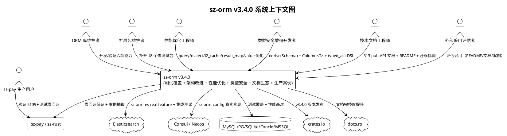
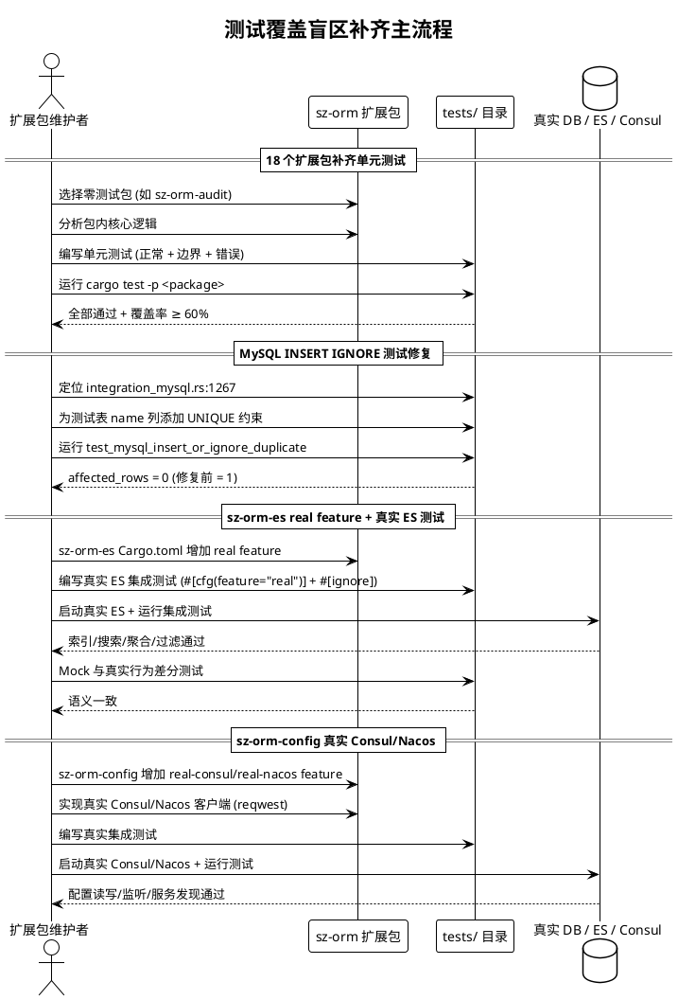
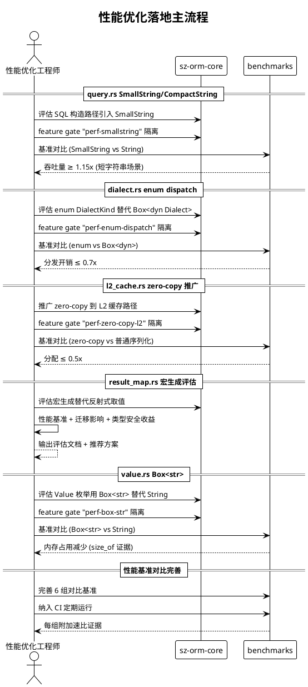
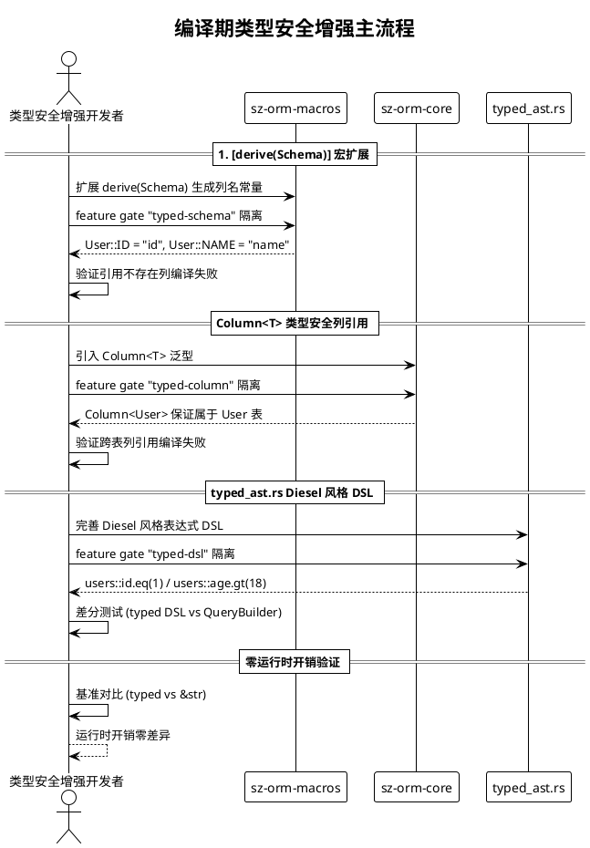
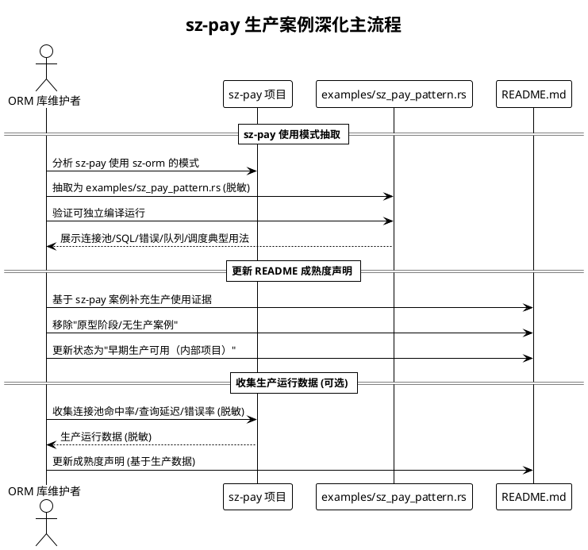

# sz-orm v3.4.0 需求规格说明书

> 版本：v3.4.0（测试覆盖补齐 + 架构改进 + 性能优化落地 + 编译期类型安全增强 + 文档与生态建设 + sz-pay 生产案例深化）
> 基线：v3.3.0（已完成：分布式缓存一致性 + GraphQL 查询支持 + 多租户与数据隔离 + AI 自然语言查询增强）
> 日期：2026-08-08
> 需求格式：EARS（Ubiquitous / Event-driven / State-driven / Unwanted）
> 文档定位：需求规格（What to build），不含技术设计（How to build）
> 优先级声明：六个方向按"测试覆盖补齐(1,最高) → 架构改进(2) → 性能优化(3) → 编译期类型安全(4) → 文档与生态(5) → sz-pay 生产案例(6)"的收益/风险序推进；测试覆盖为最高收益中低风险（补齐既有包测试，不引入新依赖），架构与性能为中收益中风险（涉及核心模块重构，需 feature gate 隔离），类型安全为中收益中风险（宏扩展，编译期验证），文档与案例为低风险高收益（纯文档与示例）
> 需求编号约定：REQ-TC-xxx（测试覆盖）/ REQ-AR-xxx（架构改进）/ REQ-PF-xxx（性能优化）/ REQ-TS-xxx（类型安全）/ REQ-DOC-xxx（文档）/ REQ-PC-xxx（生产案例）
> 缺陷来源：`docs/assessment/2026-08-08-v3.3.0-depth-evaluation.md` §6.1~§6.3 + §7

---

# 1. 组件定位

## 1.1 核心职责

本组件负责交付 sz-orm v3.4.0 的六项能力扩展任务：测试覆盖盲区补齐、架构改进、性能优化落地、编译期类型安全增强、文档与生态建设、sz-pay 生产案例深化，实现 sz-orm 在"测试覆盖完备性、架构清晰度、性能基准可验证性、编译期类型安全、文档完整度、生产可信度"六个维度的能力突破，且不破坏现有 API 兼容性与五方言覆盖。

## 1.2 核心输入

1. **深度评估报告缺陷清单**：`docs/assessment/2026-08-08-v3.3.0-depth-evaluation.md` §6.1~§6.3 + §7 发现的全部缺陷与建议，作为 v3.4.0 的需求来源。
2. **18 个零测试扩展包清单**：sz-orm-config/auth/crypto/audit/batch/rw/masking/logger/health/es/grpc/swagger/tracing/observability/back/lc/wasm/axum/actix/js/python（各包 tests/ 目录实测 0 测试文件），作为测试覆盖补齐的对象。
3. **MySQL INSERT IGNORE 测试缺陷**：`packages/sz-orm-core/tests/integration_mysql.rs:1267` 测试表 `name` 列缺 UNIQUE 约束，导致 `INSERT IGNORE` 重复插入未被忽略，`affected_rows` 返回 1 而非预期的 0，作为测试修复对象。
4. **sz-orm-es MOCK-ONLY 现状**：`packages/sz-orm-es/src/lib.rs:1` 明确标注 MOCK-ONLY，内存 HashMap 实现，重启即丢，无真实 ES 验证，作为真实后端实现对象。
5. **sz-orm-config 仅内存实现现状**：`packages/sz-orm-config/src/lib.rs:42` 仅内存实现（ConsulConfigCenter），未集成真实 Consul/Nacos，作为真实配置中心实现对象。
6. **313 个 pub API 文档缺口**：`packages/sz-orm-core/src/lib.rs:403` docs.rs cfg 跳过导致 313 个 pub API 缺文档，作为文档补齐对象。
7. **README 过时声明**：`README.md:46` 自称"原型阶段/无生产案例"，实际 sz-pay 已用（7 个包、297 处引用、5139 测试），作为 README 更新对象。
8. **async trait 风格不统一**：`packages/sz-orm-core/src/pool.rs:42` Connection trait 手动解糖，其他 trait 使用 `#[async_trait]`，作为风格统一评估对象。
9. **sz-orm-query-builder 与 core::QueryBuilder 重叠**：`packages/sz-orm-query-builder/src/lib.rs:53` 与 `packages/sz-orm-core/src/query.rs:36` 两个 QueryBuilder，用户困惑，作为选择指南对象。
10. **性能热点模块**：`query.rs`（155KB，SQL 构造字符串拼接）、`dialect.rs`（127KB，Box<dyn Dialect> 动态分发）、`l2_cache.rs`（89KB，序列化开销）、`result_map.rs`（77KB，反射式取值）、`value.rs`（40KB，Value 枚举 20 变体），作为性能优化评估对象。
11. **既有 `#[derive(Schema)]` 宏**：`packages/sz-orm-macros/src/lib.rs:71` 已有 Schema derive，作为编译期类型安全扩展基础。
12. **既有 typed_ast.rs 模块**：`packages/sz-orm-core/src/typed_ast.rs` 已有强类型 AST 基础，作为 Diesel 风格 DSL 完善基础。
13. **sz-pay 生产使用证据**：`E:\vue\test\sz-pay\server\sz-rust` 依赖 7 个 sz-orm 包、297 处引用、5139 测试零回归、从 crates.io 拉取 2.3.0，作为生产案例抽取对象。
14. **v3.3.0 已验收基线**：分布式缓存一致性、GraphQL 查询支持、多租户与数据隔离、AI 自然语言查询增强四项能力已验收通过，作为不回退基准。
15. **五方言覆盖约束**：MySQL/PostgreSQL/SQLite/Oracle/MSSQL，所有新能力必须保持五方言行为一致。

## 1.3 核心输出

1. **测试覆盖补齐能力**：18 个零测试扩展包补齐单元测试、MySQL INSERT IGNORE 测试缺陷修复、sz-orm-es 真实 ES 集成测试、sz-orm-config 真实 Consul/Nacos 集成测试。
2. **架构改进能力**：Mock 包 `real` feature 占位、313 个 pub API 文档补齐、README 成熟度声明更新、async trait 风格统一评估、sz-orm-query-builder 选择指南。
3. **性能优化能力**：query.rs SmallString/CompactString 评估、dialect.rs enum dispatch 评估、l2_cache.rs zero-copy 推广、result_map.rs 宏生成评估、value.rs Box<str> 评估。
4. **编译期类型安全能力**：`#[derive(Schema)]` 宏扩展（编译期列名常量）、`Column<T>` 类型安全列引用、typed_ast.rs Diesel 风格表达式 DSL。
5. **文档与生态能力**：313 个 pub API 文档补齐、README 成熟度声明更新、Diesel/SeaORM/SQLx 迁移指南。
6. **sz-pay 生产案例能力**：examples/sz_pay_pattern.rs 脱敏案例、README 成熟度声明更新。
7. **需求追溯矩阵**：本文档第 7 章，建立需求 ↔ 验收条件映射。
8. **验收标准总览**：本文档第 9 章，按方向汇总验收条件。

## 1.4 职责边界

本组件**不负责**以下事项：

1. **不重写核心数据结构**：性能优化以评估 + feature gate 隔离方式提供（SmallString/CompactString/enum dispatch/Box<str> 均为可选优化），既有 `QueryBuilder` / `Dialect` / `L2Cache` / `ResultMap` / `Value` 公开 API 保持完全向后兼容。
2. **不引入新关系型方言**：六项能力均基于现有五方言，不新增第六种关系型方言。
3. **不修改五方言驱动实现**：六项能力在 sz-orm-core / sz-orm-macros / 扩展包层提供，五方言驱动（sz-orm-sqlx/sz-orm-oracle/sz-orm-mssql）仅按需集成，不修改既有方言逻辑。
4. **不负责 sz-pay / sz-rust 下游代码**：下游零回归通过 feature gate 默认关闭保证，本组件仅提供上游就绪验证（ADR-0001 严禁修改下游/上游仓库）。
5. **不自动执行 AI 生成的 SQL**：沿用 v3.0.0 既有安全铁律，v3.4.0 不改变 AI 输出不自动执行铁律。
6. **不负责 LLM 模型训练与托管**：沿用 v3.3.0 既有边界。
7. **不重写 async-graphql 引擎**：沿用 v3.3.0 既有边界。
8. **不破坏既有 P0-3 多租户与 v3.3.0 四项能力**：v3.4.0 增强以扩展方式提供，既有 `with_tenant_id` / `L2Cache` / `GraphQLSchema` / `Nl2SqlEngine` 等 API 保持完全向后兼容。
9. **不引入新重依赖到默认 feature**：所有新能力通过 feature gate 隔离，默认 feature 不引入额外依赖与行为变更。
10. **不降低既有测试覆盖**：v3.4.0 不得使 v3.3.0 已验收的 6,327 测试基线回退，仅增不减。

---

# 2. 领域术语

**测试覆盖盲区（Test Coverage Gap）**
: 扩展包无独立测试文件（tests/ 目录 0 文件），导致包内逻辑无运行时验证，生产采用存在风险。
: 备注：v3.4.0 通过补齐单元测试消除盲区，评估报告 §6.3 列出 18 个零测试包。

**MOCK-ONLY 包（Mock-Only Package）**
: 包仅提供内存 Mock 实现，无真实后端验证，重启即丢数据，非生产可用。
: 备注：sz-orm-es（`packages/sz-orm-es/src/lib.rs:1`）明确标注 MOCK-ONLY，v3.4.0 增加 `real` feature 占位 + 真实 ES 集成测试。

**`real` feature 占位（Real Feature Placeholder）**
: 在 Cargo.toml 中声明 `real` feature 但不立即实现真实后端，仅占位以区分 mock 与 real 模式，为后续真实实现预留接口。
: 备注：v3.4.0 为 sz-orm-es 增加 `real` feature 占位，真实 ES 实现可作为后续版本交付。

**UNIQUE 约束测试缺陷（Unique Constraint Test Defect）**
: 测试表缺 UNIQUE 约束导致 `INSERT IGNORE` / `UPSERT` 冲突处理测试无效，重复插入未被忽略，`affected_rows` 返回值与预期不符。
: 备注：`packages/sz-orm-core/tests/integration_mysql.rs:1267` 测试表 `name` 列缺 UNIQUE 约束，v3.4.0 修复。

**SmallString / CompactString**
: 小字符串优化类型，对短字符串（通常 ≤ 23 字节）内联存储避免堆分配，长字符串退化为堆分配，减少 SQL 构造中的频繁 String 分配。
: 备注：v3.4.0 评估在 query.rs SQL 构造路径引入 SmallString/CompactString，feature gate 隔离。

**enum dispatch（枚举分发）**
: 用枚举替代 trait object（Box<dyn Trait>），通过 match 分发消除 vtable 查找开销，编译期可内联优化。
: 备注：v3.4.0 评估 dialect.rs 用 `enum DialectKind { MySQL, PostgreSQL, SQLite, Oracle, MSSQL }` 替代 `Box<dyn Dialect>`。

**zero-copy 序列化（Zero-Copy Serialization）**
: 序列化/反序列化过程中不拷贝数据，直接借用原始字节缓冲区，减少分配与拷贝开销。
: 备注：sz-orm 已有 `zero-copy` feature（`packages/sz-orm-core/src/value_borrowed.rs`），v3.4.0 推广到 L2 缓存路径。

**反射式取值（Reflective Value Extraction）**
: 结果集映射通过运行时类型名称匹配列值，存在运行时开销与类型不安全风险。
: 备注：`packages/sz-orm-core/src/result_map.rs`（77KB）使用反射式取值，v3.4.0 评估宏生成替代运行时映射。

**Box<str>**
: 堆分配的字符串切片，比 String 少存储 capacity 字段（节省 8 字节/值），适合不需要修改字符串的场景。
: 备注：v3.4.0 评估 `packages/sz-orm-core/src/value.rs` Value 枚举 20 变体用 Box<str> 替代 String。

**编译期列名常量（Compile-Time Column Name Constant）**
: 通过 `#[derive(Schema)]` 宏在编译期生成列名常量（如 `User::ID` / `User::NAME`），列名拼写错误在编译期暴露而非运行时。
: 备注：v3.4.0 扩展 `packages/sz-orm-macros/src/lib.rs:71` 既有 Schema derive。

**类型安全列引用（Type-Safe Column Reference）**
: `Column<T>` 泛型类型关联列与所属表，如 `Column<User>` 保证列引用属于 User 表，编译期防止跨表列引用错误。
: 备注：v3.4.0 引入 `Column<User>` 替代 `&str` 列名。

**Diesel 风格表达式 DSL（Diesel-Style Expression DSL）**
: 借鉴 Diesel 的表达式 DSL（如 `users::id.eq(1)` / `users::age.gt(18)`），提供编译期类型安全的查询表达式构建。
: 备注：v3.4.0 完善 `packages/sz-orm-core/src/typed_ast.rs` 既有强类型 AST 模块。

**pub API 文档缺口（Pub API Documentation Gap）**
: 公开 API 缺 `///` 文档注释，导致 docs.rs 文档缺失，阻碍外部用户理解与采用。
: 备注：评估报告 §6.2 指出 313 个 pub API 缺文档，`packages/sz-orm-core/src/lib.rs:403` docs.rs cfg 跳过。

**docs.rs cfg 跳过（docs.rs cfg Skip）**
: `#[cfg_attr(docsrs, doc(cfg(...)))]` 配置导致 docs.rs 跳过部分 API 文档生成，需移除跳过使全部 pub API 有文档。
: 备注：`packages/sz-orm-core/src/lib.rs:406` 的 docs.rs cfg 跳过，v3.4.0 移除。

**async trait 风格不统一（Async Trait Style Inconsistency）**
: Connection trait 手动解糖（`fn execute<'a>(&'a mut self, ...) -> Pin<Box<dyn Future + 'a>>`），其他 trait 使用 `#[async_trait]` 宏，增加学习成本与维护负担。
: 备注：`packages/sz-orm-core/src/pool.rs:42` Connection trait 手动解糖，v3.4.0 评估统一为一种风格。

**sz-pay 生产案例（sz-pay Production Case）**
: sz-pay 支付中台后端项目（`E:\vue\test\sz-pay\server\sz-rust`）使用 sz-orm 7 个包、297 处引用、5139 测试零回归，是 sz-orm 唯一真实生产用户。
: 备注：v3.4.0 将 sz-pay 使用模式抽取为 `examples/sz_pay_pattern.rs`（脱敏版），更新 README 成熟度声明。

**迁移指南（Migration Guide）**
: 从其他 ORM（Diesel/SeaORM/SQLx）迁移到 sz-orm 的文档指南，含概念映射、API 对照、示例代码，降低迁移成本。
: 备注：v3.4.0 编写 Diesel/SeaORM/SQLx 三份迁移指南。

---

# 3. 角色与边界

## 3.1 核心角色

- **ORM 库维护者**：执行 v3.4.0 六项能力扩展任务的开发、验证、测试操作者，是新增能力的主要使用者与验收人。
- **扩展包维护者**：负责 18 个零测试扩展包补齐测试的开发者，关注测试覆盖与包内逻辑验证。
- **性能优化工程师**：负责 query.rs/dialect.rs/l2_cache.rs/result_map.rs/value.rs 性能评估与优化的开发者，关注基准对比与加速比。
- **类型安全增强开发者**：负责 `#[derive(Schema)]` 宏扩展与 typed_ast.rs DSL 完善的开发者，关注编译期类型检查。
- **技术文档工程师**：负责 313 个 pub API 文档补齐、README 更新、迁移指南编写的文档作者。
- **sz-pay 生产用户**：依赖 sz-orm 的下游项目方，关注 v3.4.0 升级是否零回归与案例抽取。
- **外部采用评估者**：评估是否采用 sz-orm 的外部开发者，关注 README 成熟度声明、文档完整度、迁移指南、生产案例。

## 3.2 外部系统

- **MySQL / PostgreSQL / SQLite / Oracle / MSSQL**：现有 5 后端数据库，测试覆盖补齐与性能基准的执行环境。
- **Elasticsearch**：sz-orm-es 真实后端实现对象（v3.4.0 `real` feature 占位 + 集成测试）。
- **Consul / Nacos**：sz-orm-config 真实配置中心实现对象（v3.4.0 真实客户端实现）。
- **sz-pay 项目**：下游验证项目（5139 测试基线），零回归验证对象与生产案例抽取来源。
- **sz-rust 项目**：下游框架项目，零回归验证对象。
- **crates.io**：sz-orm-core 1.0.0 已发布，v3.4.0 版本发布目标平台。
- **docs.rs**：Rust 文档托管平台，313 个 pub API 文档补齐后 docs.rs 文档完整度提升。

## 3.3 交互上下文



---

# 4. DFX 约束

## 4.1 性能

1. **测试覆盖补齐不回退**：v3.4.0 补齐 18 个扩展包测试后，全 workspace `cargo test --workspace` 测试数必须 ≥ v3.3.0 基线 6,327，且全部通过。
2. **性能优化加速比**：启用 SmallString/CompactString 后，query.rs SQL 构造吞吐量必须较基线提升 ≥ 15%（短字符串场景）；启用 enum dispatch 后，dialect.rs 方言分发开销必须较 Box<dyn Dialect> 减少 ≥ 30%；推广 zero-copy 到 L2 缓存路径后，L2 缓存序列化/反序列化分配减少 ≥ 50%。
3. **编译期类型安全零运行时开销**：`#[derive(Schema)]` 生成的列名常量与 `Column<T>` 类型安全列引用必须在编译期完成，运行时零额外开销（相比 `&str` 列名）。
4. **文档构建不回退**：补齐 313 个 pub API 文档后，`cargo doc --workspace --no-deps` 构建必须成功，构建时间不得较 v3.3.0 基线增加 ≥ 20%。
5. **现有基准不回退**：v3.4.0 不得使 v3.3.0 已验收的性能基准回退（冷启动 P95 ≤ 20ms、计划缓存命中率 ≥ 80%、零拷贝分配减少 ≥ 50%、SIMD 吞吐量 ≥ 2x、跨实例失效延迟 ≤ 50ms、GraphQL N+1 查询次数 ≤ 2、多租户隔离开销 ≤ 5μs/查询、AI 建议延迟 ≤ 10s P95）。

## 4.2 可靠性

1. **MySQL INSERT IGNORE 测试修复正确性**：修复后测试表 `name` 列必须有 UNIQUE 约束，`INSERT IGNORE` 重复插入必须被忽略，`affected_rows` 必须返回 0（而非缺陷时的 1），测试必须真实验证冲突处理逻辑。
2. **sz-orm-es 真实 ES 集成测试正确性**：启用 `real` feature 后，sz-orm-es 必须与真实 Elasticsearch 集成测试，查询语义与 Mock 实现一致（含索引/搜索/聚合/过滤），Mock 与真实行为差分测试覆盖。
3. **sz-orm-config 真实 Consul/Nacos 正确性**：真实 Consul/Nacos 客户端实现必须与真实配置中心集成测试（配置读写/监听/服务发现），内存实现与真实实现行为一致（含配置变更通知）。
4. **18 个扩展包测试有效性**：补齐的单元测试必须真实验证包内核心逻辑（非仅编译测试），含正常路径 + 边界 + 错误处理，测试覆盖率必须 ≥ 60%（行覆盖，各包独立测量）。
5. **编译期类型安全正确性**：`#[derive(Schema)]` 生成的列名常量必须与结构体字段一一对应，`Column<T>` 必须在编译期防止跨表列引用错误，typed_ast.rs DSL 必须生成合法 SQL 且与运行时 QueryBuilder 行为一致。
6. **测试零失败**：全 workspace `cargo test --workspace` 必须全部通过（除明确 `#[ignore]` 的真实服务/外部依赖测试），含五方言集成测试 + 新增 18 包测试 + sz-orm-es 真实 ES 测试 + sz-orm-config 真实 Consul/Nacos 测试。

## 4.3 安全性

1. **sz-orm-es 真实 ES 认证**：真实 Elasticsearch 连接必须支持认证（API Key / Basic Auth），禁止未认证访问 ES 集群。
2. **sz-orm-config 真实 Consul/Nacos 认证**：真实 Consul/Nacos 连接必须支持认证（ACL / Token），禁止未认证读取配置。
3. **编译期类型安全不引入注入**：`Column<T>` 与 typed_ast.rs DSL 必须通过参数化查询铁律，禁止将列名/表名字符串拼接到 SQL。
4. **性能优化不绕过参数化**：SmallString/CompactString/enum dispatch/Box<str> 优化不得绕过参数化查询铁律，SQL 构造仍必须参数化绑定。
5. **不安全代码零容忍**：新增代码禁止 `unsafe`（除 `// SAFETY:` 论证注释），与既有工程化铁律一致。
6. **参数化查询铁律不变**：六项能力不得绕过参数化查询铁律，编译期类型安全增强生成的 SQL 必须参数化绑定，禁止字符串拼接。
7. **AI 输出不自动执行铁律不变**：沿用 v3.0.0 既有铁律，v3.4.0 不改变。

## 4.4 可维护性

1. **禁止占位实现**：新增代码禁止 `todo!` / `unimplemented!` / `unreachable!`（与既有铁律一致），sz-orm-es `real` feature 占位不视为占位实现（占位 feature 声明，非代码内 todo!）。
2. **clippy 零警告**：`cargo clippy --workspace --all-targets -- -D warnings` 必须零警告。
3. **10 道门禁**：AGENTS.md 定义的全部门禁必须通过，含 Feature 全组合编译（新增 feature 必须纳入组合矩阵）。
4. **async trait 风格统一评估可追溯**：async trait 风格统一的评估结论必须附 file:line 证据 + 性能基准对比 + 迁移影响分析，评估文档可追溯。
5. **sz-orm-query-builder 选择指南可追溯**：选择指南必须含两个 QueryBuilder 的能力对比表 + 适用场景 + 性能基准，指南文档可追溯。
6. **迁移指南可追溯**：Diesel/SeaORM/SQLx 三份迁移指南必须含概念映射表 + API 对照表 + 示例代码 + 常见陷阱，指南文档可追溯。
7. **sz-pay 案例脱敏**：`examples/sz_pay_pattern.rs` 必须脱敏（无真实密钥/连接串/业务数据），案例可公开。
8. **审计合规铁律**：每个缺陷修复必须附 file:line 证据 + 测试验证，禁止未验证即标记 ✅。

## 4.5 兼容性

1. **无 Breaking Change**：v3.4.0 所有新增能力以扩展方式提供，现有公开 API 签名（`QueryBuilder` / `Dialect` / `L2Cache` / `ResultMap` / `Value` / `Connection` / `Schema` 等）保持完全向后兼容。
2. **Rust 版本兼容**：edition = "2021"，rust-version = "1.81"，不得提升。
3. **Feature 隔离**：六项能力必须通过 feature gate 隔离（`test-coverage` / `real-es` / `real-config` / `perf-smallstring` / `perf-enum-dispatch` / `perf-zero-copy-l2` / `perf-box-str` / `typed-schema` / `typed-column` / `typed-dsl` / `doc-full`），默认 feature 不引入额外依赖与行为变更。
4. **下游零回归**：sz-pay（5139 测试基线）与 sz-rust 在 v3.4.0 升级后必须零回归（feature gate 默认关闭，理论上无行为变更，但需实际回归验证）。
5. **五方言行为一致**：所有新能力必须保持 MySQL/PostgreSQL/SQLite/Oracle/MSSQL 五方言行为一致，不得为某方言单独实现而破坏其它方言。
6. **既有 v3.3.0 四项能力兼容**：v3.4.0 增强必须兼容既有分布式缓存一致性 / GraphQL / 多租户 / AI 增强能力，既有 API 行为不变，增强为可选开启。
7. **既有 `#[derive(Schema)]` 兼容**：编译期类型安全增强必须兼容既有 Schema derive 行为，既有 derive 输出不变，增强为可选开启（`typed-schema` feature）。

---

# 5. 核心能力

## 5.1 测试覆盖盲区补齐

> 现状：评估报告 §6.3 指出 18 个扩展包 0 测试文件（sz-orm-config/auth/crypto/audit/batch/rw/masking/logger/health/es/grpc/swagger/tracing/observability/back/lc/wasm/axum/actix/js/python），MySQL INSERT IGNORE 测试缺陷（`packages/sz-orm-core/tests/integration_mysql.rs:1267` 测试表缺 UNIQUE 约束），sz-orm-es MOCK-ONLY 无真实 ES 验证（`packages/sz-orm-es/src/lib.rs:1`），sz-orm-config 仅内存实现（`packages/sz-orm-config/src/lib.rs:42`）。
> 形态：补齐 18 个扩展包单元测试（各包独立 tests/ 目录），修复 MySQL INSERT IGNORE 测试缺陷，为 sz-orm-es 增加 `real` feature 占位 + 真实 ES 集成测试，为 sz-orm-config 增加真实 Consul/Nacos 客户端实现 + 集成测试，不修改既有公开 API。

### 5.1.1 业务规则

1. **18 个扩展包补齐单元测试**（EARS: Ubiquitous）
   系统应当为 sz-orm-config/auth/crypto/audit/batch/rw/masking/logger/health/es/grpc/swagger/tracing/observability/back/lc/wasm/axum/actix/js/python 共 18 个扩展包补齐单元测试，每个包新增独立 tests/ 目录与测试文件，测试覆盖包内核心逻辑（正常路径 + 边界 + 错误处理），各包行覆盖率 ≥ 60%，且不修改既有公开 API。
   a. 验收条件：[18 个扩展包各包 tests/ 目录] → [各包有 ≥ 1 个测试文件；`cargo test -p <package>` 全部通过；各包行覆盖率 ≥ 60%（`cargo tarpaulin -p <package>` 证据）；全 workspace 测试数 ≥ 6,327 + 新增数]

2. **MySQL INSERT IGNORE 测试缺陷修复**（EARS: State-driven）
   在修复 `packages/sz-orm-core/tests/integration_mysql.rs:1267` 测试表 `name` 列缺 UNIQUE 约束的状态下，系统应当为测试表添加 UNIQUE 约束，使 `INSERT IGNORE` 重复插入被忽略，`affected_rows` 返回 0（而非缺陷时的 1），测试真实验证冲突处理逻辑。
   a. 验收条件：[修复后测试表 name 列有 UNIQUE 约束] → [INSERT IGNORE 重复插入被忽略，affected_rows = 0；`cargo test -p sz-orm-core --test integration_mysql test_mysql_insert_or_ignore_duplicate` 通过；测试真实验证冲突处理]

3. **sz-orm-es `real` feature 占位 + 真实 ES 集成测试**（EARS: Ubiquitous）
   系统应当为 sz-orm-es 在 Cargo.toml 增加 `real` feature 占位（声明 feature 但不立即实现真实后端，仅占位区分 mock 与 real 模式），并增加真实 Elasticsearch 集成测试（`#[cfg(feature = "real")]` + `#[ignore]` 标注，需真实 ES 环境运行），测试覆盖索引/搜索/聚合/过滤，Mock 与真实行为差分测试验证语义一致。
   a. 验收条件：[sz-orm-es Cargo.toml 有 real feature] → [默认 mock 行为不变；启用 real feature + 真实 ES 环境运行集成测试通过；Mock 与真实行为差分测试覆盖索引/搜索/聚合/过滤；语义一致]

4. **sz-orm-config 真实 Consul/Nacos 客户端实现**（EARS: State-driven）
   在 sz-orm-config 仅内存实现（`packages/sz-orm-config/src/lib.rs:42`）的状态下，系统应当增加真实 Consul 与 Nacos 客户端实现（基于 reqwest，feature gate "real-consul" / "real-nacos" 隔离），支持配置读写/监听/服务发现，并增加真实 Consul/Nacos 集成测试，内存实现与真实实现行为一致（含配置变更通知）。
   a. 验收条件：[启用 real-consul + 真实 Consul 环境] → [配置读写/监听/服务发现正确；启用 real-nacos + 真实 Nacos 环境同理；内存实现与真实实现行为一致（配置变更通知测试覆盖）；默认内存行为不变]

5. **禁止项 — 测试无效覆盖**（EARS: Unwanted）
   如果补齐的单元测试仅验证编译通过（`#[test] fn it_works() { assert!(true); }`）而非真实逻辑，则系统应当通过测试覆盖率检查（≥ 60% 行覆盖）与代码审查杜绝，禁止无效覆盖伪装测试补齐。
   a. 验收条件：[各包测试覆盖率 ≥ 60% 行覆盖] → [测试真实验证包内核心逻辑；无效覆盖测试（仅 assert!(true)）被代码审查拒绝；覆盖率证据附 tarpaulin 报告]

### 5.1.2 交互流程



### 5.1.3 异常场景

1. **扩展包逻辑复杂难以测试**
   a. 触发条件：包内逻辑依赖外部服务或复杂异步状态，难以纯单元测试
   b. 系统行为：拆分为可测试的纯函数 + 外部交互抽象（trait），对纯函数单元测试，对外部交互集成测试（`#[ignore]` 标注）
   c. 用户感知：包内核心逻辑有单元测试覆盖，外部交互有集成测试（需真实环境运行）

2. **真实 ES 环境不可用**
   a. 触发条件：CI 环境无真实 Elasticsearch
   b. 系统行为：真实 ES 集成测试标注 `#[ignore]`，默认不运行，需手动 `cargo test -- --ignored` 或 CI 配置真实 ES 后运行
   c. 用户感知：默认 `cargo test` 跳过真实 ES 测试，Mock 测试仍通过；真实 ES 测试在配置环境后可运行

3. **真实 Consul/Nacos 环境不可用**
   a. 触发条件：CI 环境无真实 Consul/Nacos
   b. 系统行为：真实 Consul/Nacos 集成测试标注 `#[ignore]`，默认不运行
   c. 用户感知：默认 `cargo test` 跳过真实 Consul/Nacos 测试，内存测试仍通过；真实测试在配置环境后可运行

4. **测试覆盖率难以达到 60%**
   a. 触发条件：包内部分逻辑为胶水代码或外部交互，难以单元测试
   b. 系统行为：对可测试逻辑达到 ≥ 60% 覆盖，不可测试逻辑标注 `#[allow(dead_code)]` 或重构为可测试
   c. 用户感知：覆盖率报告附证据，不可测试逻辑有说明

## 5.2 架构改进

> 现状：评估报告 §6.2 指出 Mock 包未标注清晰（sz-orm-es 在 lib.rs 顶部警告但 Cargo.toml 无 feature 区分）、313 个 pub API 缺文档（`packages/sz-orm-core/src/lib.rs:403` docs.rs cfg 跳过）、README 过时（`README.md:46` 自称"原型阶段/无生产案例"）、async trait 风格不统一（`packages/sz-orm-core/src/pool.rs:42` Connection 手动解糖，其他 #[async_trait]）、sz-orm-query-builder 与 core::QueryBuilder 重叠（`packages/sz-orm-query-builder/src/lib.rs:53`）。
> 形态：为 Mock 包增加 `real` feature 占位、补齐 313 个 pub API 文档并移除 docs.rs cfg 跳过、更新 README 成熟度声明、评估 async trait 风格统一、编写 sz-orm-query-builder 选择指南，不修改既有公开 API（除文档注释）。

### 5.2.1 业务规则

1. **Mock 包 `real` feature 占位**（EARS: Ubiquitous）
   系统应当为 sz-orm-es 等 Mock 包在 Cargo.toml 增加 `real` feature 占位（声明 feature 但不立即实现真实后端），区分 mock 与 real 模式，为后续真实实现预留接口，且默认 feature 行为不变（仍为 Mock）。
   a. 验收条件：[sz-orm-es Cargo.toml 有 real feature 占位] → [默认 mock 行为不变；`cargo check -p sz-orm-es --features real` 编译通过；feature 声明文档清晰]

2. **313 个 pub API 文档补齐**（EARS: Ubiquitous）
   系统应当为 313 个缺文档的 pub API 补齐 `///` 文档注释（含功能描述 + 参数 + 返回值 + 示例 + 错误），移除 `packages/sz-orm-core/src/lib.rs:406` 的 docs.rs cfg 跳过，使 docs.rs 文档完整，且不修改 API 签名。
   a. 验收条件：[313 个 pub API 补齐文档] → [`cargo doc --workspace --no-deps` 无警告；docs.rs 文档完整（无 missing-docs 警告）；移除 docs.rs cfg 跳过；API 签名不变]

3. **README 成熟度声明更新**（EARS: State-driven）
   在 README.md 第 46 行自称"原型阶段/无生产案例"与实际不符（sz-pay 已用 7 个包、297 处引用、5139 测试）的状态下，系统应当更新 README 成熟度声明，移除"原型阶段/无生产案例"过时声明，补充 sz-pay 生产案例（7 个包、297 处引用、5139 测试零回归、crates.io 发布），并更新项目状态为"早期生产可用（内部项目）"。
   a. 验收条件：[README.md 第 46 行更新] → [移除"原型阶段/无生产案例"；补充 sz-pay 案例（7 包/297 引用/5139 测试）；状态更新为"早期生产可用（内部项目）"；声明与评估报告 §5.1 一致]

4. **async trait 风格统一评估**（EARS: Ubiquitous）
   系统应当评估 async trait 风格统一方案（统一为 `#[async_trait]` 宏或统一为手动解糖），评估含性能基准对比（宏展开开销 vs 手动解糖开销）、迁移影响分析（涉及哪些 trait 与调用方）、学习成本评估，输出评估文档与推荐方案，且不强制立即迁移（评估为先）。
   a. 验收条件：[输出 async trait 风格统一评估文档] → [含性能基准对比（宏 vs 手动）；迁移影响分析（涉及 trait 列表）；学习成本评估；推荐方案；评估文档附 file:line 证据]

5. **sz-orm-query-builder 选择指南**（EARS: Ubiquitous）
   系统应当编写 sz-orm-query-builder 与 core::QueryBuilder 的选择指南，含能力对比表（支持的查询类型/方言/特性）、适用场景（独立 SQL 构造 vs ORM 集成）、性能基准对比、迁移建议，消除用户对两个 QueryBuilder 的困惑。
   a. 验收条件：[输出选择指南文档] → [含能力对比表（查询类型/方言/特性）；适用场景说明；性能基准对比；迁移建议；指南文档附 file:line 证据]

6. **禁止项 — 文档与实际不符**（EARS: Unwanted）
   如果补齐的文档/README/选择指南与代码实际行为不符（如文档声称支持某特性但代码未实现），则系统应当通过文档构建 + doctest 验证 + 代码审查杜绝，禁止文档与实际不符。
   a. 验收条件：[文档构建 + doctest 验证] → [`cargo doc --workspace --no-deps` 无警告；`cargo test --workspace --doc` doctest 通过；文档与代码实际行为一致]

### 5.2.2 交互流程

```plantuml
@startuml
!theme plain
title 架构改进主流程

actor "ORM 库维护者" as Dev
actor "技术文档工程师" as DocEng
participant "sz-orm 扩展包" as Pkg
participant "README.md" as Readme
cloud "docs.rs" as DocsRs

== Mock 包 real feature 占位 ==
Dev -> Pkg : sz-orm-es Cargo.toml 增加 real feature
Dev -> Pkg : 验证默认 mock 行为不变
Pkg --> Dev : cargo check --features real 编译通过

== 313 pub API 文档补齐 ==
DocEng -> Pkg : 定位 313 个缺文档 pub API
DocEng -> Pkg : 补齐 /// 文档注释 (功能/参数/返回/示例/错误)
DocEng -> Pkg : 移除 lib.rs:406 docs.rs cfg 跳过
DocEng -> DocsRs : cargo doc --workspace --no-deps
DocsRs --> DocEng : 无警告 + 文档完整

== README 成熟度声明更新 ==
DocEng -> Readme : 定位第 46 行过时声明
DocEng -> Readme : 移除"原型阶段/无生产案例"
DocEng -> Readme : 补充 sz-pay 案例 (7 包/297 引用/5139 测试)
DocEng -> Readme : 更新状态为"早期生产可用（内部项目）"

== async trait 风格统一评估 ==
Dev -> Dev : 性能基准对比 (宏 vs 手动)
Dev -> Dev : 迁移影响分析 (涉及 trait 列表)
Dev -> Dev : 学习成本评估
Dev -> DocEng : 输出评估文档 + 推荐方案

== sz-orm-query-builder 选择指南 ==
DocEng -> DocEng : 能力对比表 (查询类型/方言/特性)
DocEng -> DocEng : 适用场景 + 性能基准 + 迁移建议
DocEng -> DocEng : 输出选择指南文档

@enduml
```

### 5.2.3 异常场景

1. **313 个 pub API 文档补齐工作量过大**
   a. 触发条件：313 个 API 一次性补齐工作量巨大，可能影响版本交付
   b. 系统行为：分批补齐（优先公开 API > 内部 API > 测试 API），每批附进度跟踪，版本交付时全部补齐
   c. 用户感知：文档逐步补齐，最终全部完成，docs.rs 文档完整

2. **async trait 风格统一迁移影响过大**
   a. 触发条件：统一为一种风格涉及大量 trait 与调用方修改，可能引入回归
   b. 系统行为：v3.4.0 仅输出评估文档与推荐方案，不强制立即迁移；迁移可作为后续版本交付
   c. 用户感知：评估文档附推荐方案，迁移影响分析清晰，决策有据

3. **sz-orm-query-builder 与 core::QueryBuilder 长期重叠**
   a. 触发条件：两个 QueryBuilder 长期共存，用户困惑持续
   b. 系统行为：v3.4.0 输出选择指南，长期可评估合并（作为后续版本）
   c. 用户感知：选择指南消除困惑，长期合并方案有规划

## 5.3 性能优化落地

> 现状：评估报告 §6.1 指出 query.rs（155KB，SQL 构造字符串拼接频繁）、dialect.rs（127KB，Box<dyn Dialect> 动态分发）、l2_cache.rs（89KB，序列化开销）、result_map.rs（77KB，反射式取值）、value.rs（40KB，Value 枚举 20 变体匹配路径长）为性能热点。已有 simd/zero-copy/plan-cache feature 但缺乏生产基准对比。
> 形态：评估并落地 SmallString/CompactString（query.rs）、enum dispatch（dialect.rs）、zero-copy 推广（l2_cache.rs）、宏生成（result_map.rs）、Box<str>（value.rs），全部通过 feature gate 隔离，不修改既有公开 API。

### 5.3.1 业务规则

1. **query.rs SmallString/CompactString 评估与落地**（EARS: Ubiquitous）
   系统应当评估在 query.rs SQL 构造路径引入 SmallString/CompactString（小字符串内联存储避免堆分配），通过 feature gate "perf-smallstring" 隔离，启用后 SQL 构造吞吐量较基线提升 ≥ 15%（短字符串场景），且不修改既有 QueryBuilder 公开 API。
   a. 验收条件：[启用 perf-smallstring] → [SQL 构造吞吐量 ≥ 基线 1.15x（短字符串场景基准证据）；既有 QueryBuilder API 不变；feature gate 默认关闭]

2. **dialect.rs enum dispatch 评估与落地**（EARS: Ubiquitous）
   系统应当评估在 dialect.rs 用 enum dispatch（`enum DialectKind { MySQL, PostgreSQL, SQLite, Oracle, MSSQL }` + match 分发）替代 Box<dyn Dialect>（消除 vtable 查找开销），通过 feature gate "perf-enum-dispatch" 隔离，启用后方言分发开销较基线减少 ≥ 30%，且不修改既有 Dialect trait 公开 API。
   a. 验收条件：[启用 perf-enum-dispatch] → [方言分发开销 ≤ 基线 0.7x（基准证据）；既有 Dialect trait API 不变；五方言行为一致；feature gate 默认关闭]

3. **l2_cache.rs zero-copy 推广**（EARS: State-driven）
   在 sz-orm 已有 `zero-copy` feature（`packages/sz-orm-core/src/value_borrowed.rs`）的状态下，系统应当推广 zero-copy 到 L2 缓存序列化/反序列化路径，通过 feature gate "perf-zero-copy-l2" 隔离，启用后 L2 缓存序列化/反序列化分配减少 ≥ 50%，且不修改既有 L2Cache 公开 API。
   a. 验收条件：[启用 perf-zero-copy-l2] → [L2 缓存序列化/反序列化分配 ≤ 基线 0.5x（分配计数证据）；既有 L2Cache API 不变；feature gate 默认关闭]

4. **result_map.rs 宏生成评估**（EARS: Ubiquitous）
   系统应当评估用代码生成（宏，扩展 `#[derive(Schema)]`）替代 result_map.rs 反射式取值，通过 feature gate 隔离，评估含性能基准对比（宏生成 vs 反射式）、迁移影响分析、类型安全收益，输出评估文档与推荐方案，且不强制立即迁移（评估为先）。
   a. 验收条件：[输出 result_map.rs 宏生成评估文档] → [含性能基准对比（宏 vs 反射）；迁移影响分析；类型安全收益；推荐方案；评估文档附 file:line 证据]

5. **value.rs Box<str> 评估与落地**（EARS: Ubiquitous）
   系统应当评估在 value.rs Value 枚举 20 变体用 Box<str> 替代 String（节省 8 字节/值的 capacity 字段），通过 feature gate "perf-box-str" 隔离，启用后 Value 枚举内存占用减少（基准证据），且不修改既有 Value 公开 API。
   a. 验收条件：[启用 perf-box-str] → [Value 枚举内存占用减少（size_of 证据）；既有 Value API 不变；feature gate 默认关闭]

6. **性能基准对比完善**（EARS: Ubiquitous）
   系统应当完善 benchmarks，对比 zero-copy vs 普通模式、simd vs 标量解码、plan-cache vs 无缓存、SmallString vs String、enum dispatch vs Box<dyn>、Box<str> vs String 的实际加速比，基准结果附证据，且纳入 CI 定期运行。
   a. 验收条件：[完善 benchmarks] → [含 6 组对比基准（zero-copy/simd/plan-cache/SmallString/enum dispatch/Box<str>）；每组附加速比证据；CI 定期运行基准]

7. **禁止项 — 性能优化破坏正确性**（EARS: Unwanted）
   如果性能优化（SmallString/enum dispatch/Box<str> 等）改变了查询语义或结果正确性，则系统应当通过差分测试（优化前 vs 优化后结果一致）与既有测试套件杜绝，禁止性能优化破坏正确性。
   a. 验收条件：[性能优化前后差分测试] → [查询结果完全一致（优化前 vs 优化后）；既有 6,327+ 测试全部通过；无正确性回归]

### 5.3.2 交互流程



### 5.3.3 异常场景

1. **SmallString/CompactString 对长字符串无收益**
   a. 触发条件：SQL 构造中字符串多为长字符串（> 23 字节），SmallString 退化为堆分配无收益
   b. 系统行为：基准对比区分短/长字符串场景，短字符串场景收益证据，长字符串场景不退化
   c. 用户感知：基准报告附短/长字符串场景分别收益，用户按场景选择启用

2. **enum dispatch 五方言行为差异**
   a. 触发条件：enum dispatch 替代 trait object 后，某方言行为与基线不一致
   b. 系统行为：五方言集成测试覆盖，行为差分测试（enum vs Box<dyn>）验证一致
   c. 用户感知：五方言行为一致，集成测试证据

3. **zero-copy L2 缓存路径兼容性**
   a. 触发条件：L2 缓存 zero-copy 推广后，与既有 Redis 后端或序列化格式不兼容
   b. 系统行为：兼容性测试覆盖（zero-copy vs 普通序列化互通），序列化格式不变
   c. 用户感知：既有 Redis 缓存数据可读，序列化格式不变

4. **性能基准结果波动**
   a. 触发条件：基准结果因环境噪声波动，加速比不稳定
   b. 系统行为：基准多次运行取中位数，附置信区间，CI 环境标准化
   c. 用户感知：基准结果附中位数 + 置信区间，结果可信

## 5.4 编译期类型安全增强

> 现状：评估报告 §7 方向 2 指出 SZ-ORM 当前列名/表名为运行时字符串，Diesel 的编译期 schema 是最大差距。已有 `#[derive(Schema)]` 宏（`packages/sz-orm-macros/src/lib.rs:71`）与 typed_ast.rs 模块（`packages/sz-orm-core/src/typed_ast.rs`）基础。
> 形态：扩展 `#[derive(Schema)]` 宏生成编译期列名常量、引入 `Column<T>` 类型安全列引用、完善 typed_ast.rs Diesel 风格表达式 DSL，全部通过 feature gate 隔离，不修改既有公开 API。

### 5.4.1 业务规则

1. **`#[derive(Schema)]` 宏扩展生成编译期列名常量**（EARS: Ubiquitous）
   系统应当扩展既有 `#[derive(Schema)]` 宏（`packages/sz-orm-macros/src/lib.rs:71`），为每个结构体字段生成编译期列名常量（如 `User::ID` = "id"、`User::NAME` = "name"），列名拼写错误在编译期暴露而非运行时，通过 feature gate "typed-schema" 隔离，且不修改既有 Schema derive 行为。
   a. 验收条件：[启用 typed-schema + derive(Schema) struct User] → [生成 User::ID/User::NAME 等列名常量；引用不存在的列编译失败；既有 Schema derive 行为不变；feature gate 默认关闭]

2. **`Column<T>` 类型安全列引用**（EARS: Ubiquitous）
   系统应当引入 `Column<T>` 泛型类型关联列与所属表（如 `Column<User>` 保证列引用属于 User 表），替代 `&str` 列名，在编译期防止跨表列引用错误，通过 feature gate "typed-column" 隔离，且不修改既有 QueryBuilder 接受 `&str` 的 API（新增 `Column<T>` 重载）。
   a. 验收条件：[启用 typed-column + Column<User>::new("id")] → [编译期防止跨表列引用（Column<User> 不可用于 Order 查询）；既有 &str API 不变；新增 Column<T> 重载；feature gate 默认关闭]

3. **typed_ast.rs Diesel 风格表达式 DSL**（EARS: Ubiquitous）
   系统应当完善既有 typed_ast.rs 模块（`packages/sz-orm-core/src/typed_ast.rs`），提供 Diesel 风格表达式 DSL（如 `users::id.eq(1)` / `users::age.gt(18)` / `users::name.like("%foo%")`），编译期类型安全，生成的 SQL 与运行时 QueryBuilder 行为一致，通过 feature gate "typed-dsl" 隔离，且不修改既有 QueryBuilder API。
   a. 验收条件：[启用 typed-dsl + users::id.eq(1)] → [编译期类型安全（类型不匹配编译失败）；生成 SQL 与 QueryBuilder 一致（差分测试）；既有 QueryBuilder API 不变；feature gate 默认关闭]

4. **编译期类型安全零运行时开销**（EARS: Ubiquitous）
   系统应当保证 `#[derive(Schema)]` 生成的列名常量、`Column<T>` 类型安全列引用、typed_ast.rs DSL 在编译期完成类型检查，运行时零额外开销（相比 `&str` 列名），基准对比验证零开销。
   a. 验收条件：[基准对比 typed vs &str] → [运行时开销零差异（基准证据）；类型检查在编译期完成]

5. **禁止项 — 类型安全绕过参数化**（EARS: Unwanted）
   如果编译期类型安全增强（`Column<T>` / typed_ast.rs DSL）将列名/表名字符串拼接到 SQL 而非参数化绑定，则系统应当通过参数化查询铁律杜绝，禁止类型安全增强引入 SQL 注入。
   a. 验收条件：[Column<T> / typed DSL 生成 SQL] → [列名/表名参数化绑定或编译期常量内联；值参数化绑定；无字符串拼接；SQL 注入扫描通过]

### 5.4.2 交互流程



### 5.4.3 异常场景

1. **`#[derive(Schema)]` 宏对复杂类型支持不足**
   a. 触发条件：结构体含复杂嵌套类型（泛型、生命周期、trait object）
   b. 系统行为：跳过不支持字段并告警，或要求用户手动标注
   c. 用户感知：告警含不支持字段与类型，生成的列名常量跳过该字段

2. **`Column<T>` 与既有 `&str` API 混用**
   a. 触发条件：用户在同一查询中混用 `Column<T>` 与 `&str` 列名
   b. 系统行为：支持混用（`Column<T>` 可解引用为 `&str`），但混用失去类型安全收益
   c. 用户感知：混用编译通过但类型安全降级，文档建议统一使用 `Column<T>`

3. **typed_ast.rs DSL 与 QueryBuilder 行为不一致**
   a. 触发条件：DSL 生成的 SQL 与 QueryBuilder 生成的 SQL 不一致
   b. 系统行为：差分测试覆盖（DSL vs QueryBuilder），不一致即修复
   c. 用户感知：差分测试保证一致，无行为差异

## 5.5 文档与生态建设

> 现状：评估报告 §7 方向 4 指出 313 个 pub API 缺文档（`packages/sz-orm-core/src/lib.rs:403` docs.rs cfg 跳过）、无社区采用、无迁移指南。README 过时（`README.md:46`）。
> 形态：补齐 313 个 pub API 文档、更新 README 成熟度声明、编写 Diesel/SeaORM/SQLx 迁移指南，不修改既有公开 API（除文档注释）。

### 5.5.1 业务规则

1. **补齐 313 个 pub API 文档**（EARS: Ubiquitous）
   系统应当为 313 个缺文档的 pub API 补齐 `///` 文档注释（含功能描述 + 参数 + 返回值 + 示例 + 错误），移除 `packages/sz-orm-core/src/lib.rs:406` 的 docs.rs cfg 跳过，使 docs.rs 文档完整，且不修改 API 签名。
   a. 验收条件：[313 个 pub API 补齐文档] → [`cargo doc --workspace --no-deps` 无警告；docs.rs 文档完整（无 missing-docs 警告）；移除 docs.rs cfg 跳过；API 签名不变]
   备注：与 REQ-AR-002 重复，v3.4.0 统一交付，需求编号保留 REQ-DOC-001 用于文档与生态方向追溯。

2. **更新 README 成熟度声明**（EARS: State-driven）
   在 README.md 第 46 行自称"原型阶段/无生产案例"与实际不符的状态下，系统应当更新 README 成熟度声明，移除过时声明，补充 sz-pay 生产案例，更新项目状态为"早期生产可用（内部项目）"，并补充 crates.io 发布信息。
   a. 验收条件：[README.md 更新] → [移除"原型阶段/无生产案例"；补充 sz-pay 案例；状态更新为"早期生产可用（内部项目）"；补充 crates.io 发布信息；声明与评估报告 §5.1 一致]
   备注：与 REQ-AR-003 重复，v3.4.0 统一交付，需求编号保留 REQ-DOC-002 用于文档与生态方向追溯。

3. **编写 Diesel/SeaORM/SQLx 迁移指南**（EARS: Ubiquitous）
   系统应当编写从 Diesel/SeaORM/SQLx 迁移到 sz-orm 的三份迁移指南，每份含概念映射表（Diesel schema.rs → sz-orm derive(Schema) 等）、API 对照表（Diesel `users::id.eq(1)` → sz-orm typed DSL 等）、示例代码（CRUD + 关联查询 + 事务 + 迁移）、常见陷阱（异步/同步差异、类型映射差异、方言差异），降低外部用户迁移成本。
   a. 验收条件：[输出三份迁移指南] → [Diesel/SeaORM/SQLx 各一份；含概念映射表 + API 对照表 + 示例代码 + 常见陷阱；指南文档可追溯；示例代码可编译]

4. **禁止项 — 文档过时**（EARS: Unwanted）
   如果文档（pub API 文档/README/迁移指南）与代码实际行为不符或过时，则系统应当通过文档构建 + doctest 验证 + CI 定期检查杜绝，禁止文档过时。
   a. 验收条件：[文档构建 + doctest + CI 检查] → [`cargo doc --workspace --no-deps` 无警告；`cargo test --workspace --doc` doctest 通过；CI 定期检查文档与代码一致]

### 5.5.2 交互流程

```plantuml
@startuml
!theme plain
title 文档与生态建设主流程

actor "技术文档工程师" as DocEng
participant "sz-orm-core" as Core
participant "README.md" as Readme
cloud "docs.rs" as DocsRs

== 补齐 313 pub API 文档 ==
DocEng -> Core : 定位 313 个缺文档 pub API
DocEng -> Core : 补齐 /// 文档注释
DocEng -> Core : 移除 lib.rs:406 docs.rs cfg 跳过
DocEng -> DocsRs : cargo doc --workspace --no-deps
DocsRs --> DocEng : 无警告 + 文档完整

== 更新 README 成熟度声明 ==
DocEng -> Readme : 移除"原型阶段/无生产案例"
DocEng -> Readme : 补充 sz-pay 案例 + crates.io 发布信息
DocEng -> Readme : 更新状态为"早期生产可用（内部项目）"

== 编写迁移指南 ==
DocEng -> DocEng : Diesel 迁移指南 (概念映射 + API 对照 + 示例 + 陷阱)
DocEng -> DocEng : SeaORM 迁移指南
DocEng -> DocEng : SQLx 迁移指南
DocEng -> DocEng : 验证示例代码可编译

@enduml
```

### 5.5.3 异常场景

1. **迁移指南示例代码不可编译**
   a. 触发条件：迁移指南中示例代码与当前 sz-orm API 不一致
   b. 系统行为：示例代码纳入 doctest 验证，不可编译即修复
   c. 用户感知：示例代码可编译，doctest 通过

2. **迁移指南与竞品版本不匹配**
   a. 触发条件：Diesel/SeaORM/SQLx 新版本 API 变化，迁移指南过时
   b. 系统行为：迁移指南标注基于的竞品版本，定期更新
   c. 用户感知：指南标注版本，用户按版本对照

## 5.6 sz-pay 生产案例深化

> 现状：评估报告 §7 方向 5 指出 sz-pay 支付中台后端项目（`E:\vue\test\sz-pay\server\sz-rust`）已使用 sz-orm 7 个包、297 处引用、5139 测试零回归、从 crates.io 拉取 2.3.0，是 sz-orm 唯一真实生产用户。应深化并抽取为可复用案例，增强可信度。
> 形态：将 sz-pay 使用模式抽取为 `examples/sz_pay_pattern.rs`（脱敏版）、更新 README 成熟度声明，不修改 sz-pay / sz-rust 下游代码（ADR-0001）。

### 5.6.1 业务规则

1. **sz-pay 使用模式抽取为 examples/sz_pay_pattern.rs**（EARS: Ubiquitous）
   系统应当将 sz-pay 使用 sz-orm 的模式（连接池配置、SQL 执行、错误映射、消息队列、定时调度）抽取为 `examples/sz_pay_pattern.rs`（脱敏版，无真实密钥/连接串/业务数据），示例可独立编译运行，展示 sz-orm 在生产环境的典型用法，且不修改 sz-pay / sz-rust 下游代码（ADR-0001）。
   a. 验收条件：[输出 examples/sz_pay_pattern.rs] → [示例脱敏（无真实密钥/连接串/业务数据）；可独立编译运行；展示连接池/SQL 执行/错误映射/消息队列/定时调度典型用法；不修改 sz-pay/sz-rust 下游代码]

2. **更新 README 成熟度声明（基于 sz-pay 案例）**（EARS: State-driven）
   在 sz-pay 已是真实生产用户的状态下，系统应当更新 README 成熟度声明，基于 sz-pay 案例补充生产使用证据（7 个包、297 处引用、5139 测试零回归、crates.io 发布、使用场景），移除"原型阶段/无生产案例"过时声明，增强外部采用评估者信心。
   a. 验收条件：[README 更新基于 sz-pay 案例] → [补充生产使用证据（7 包/297 引用/5139 测试/crates.io）；移除过时声明；声明与评估报告 §5.1 一致；增强外部采用信心]
   备注：与 REQ-AR-003 / REQ-DOC-002 重复，v3.4.0 统一交付，需求编号保留 REQ-PC-002 用于生产案例方向追溯。

3. **收集 sz-pay 生产运行数据（可选）**（EARS: State-driven）
   在 sz-pay 生产环境可访问的状态下，系统应当收集 sz-pay 生产运行数据（连接池命中率、查询延迟、错误率），作为 sz-orm 生产性能证据，更新 README 成熟度声明，且数据脱敏（无业务敏感信息）。
   a. 验收条件：[收集 sz-pay 生产运行数据] → [数据脱敏（无业务敏感信息）；含连接池命中率/查询延迟/错误率；更新 README 成熟度声明；数据可追溯]
   备注：此需求为可选（sz-pay 生产环境可访问时执行），不可访问时跳过。

4. **禁止项 — 案例泄露敏感信息**（EARS: Unwanted）
   如果 `examples/sz_pay_pattern.rs` 或 README 案例泄露 sz-pay 真实密钥/连接串/业务数据，则系统应当通过脱敏审查 + 密钥扫描杜绝，禁止案例泄露敏感信息。
   a. 验收条件：[案例脱敏审查 + 密钥扫描] → [无真实密钥/连接串/业务数据；密钥扫描通过；案例可公开]

### 5.6.2 交互流程



### 5.6.3 异常场景

1. **sz-pay 生产环境不可访问**
   a. 触发条件：sz-pay 生产环境无法访问，无法收集运行数据
   b. 系统行为：跳过生产运行数据收集（REQ-PC-003 为可选），仅抽取使用模式与更新 README
   c. 用户感知：案例抽取与 README 更新完成，生产运行数据标注"未收集"

2. **案例脱敏遗漏**
   a. 触发条件：案例中遗漏真实密钥/连接串/业务数据
   b. 系统行为：脱敏审查 + 密钥扫描（如 `grep -r "password\|secret\|key" examples/`），遗漏即修复
   c. 用户感知：密钥扫描通过，案例可公开

3. **sz-pay 使用模式与 sz-orm 当前 API 不匹配**
   a. 触发条件：sz-pay 使用 sz-orm 2.3.0，当前 sz-orm 为 v3.4.0，API 可能变化
   b. 系统行为：案例基于当前 v3.4.0 API 编写，标注与 sz-pay 2.3.0 差异
   c. 用户感知：案例可编译运行，差异标注清晰

---

# 6. 数据约束

## 6.1 测试覆盖数据（方向 1）

1. **18 个扩展包测试覆盖**：每个扩展包必须新增 ≥ 1 个测试文件，测试覆盖率 ≥ 60%（行覆盖，`cargo tarpaulin -p <package>` 证据），测试含正常路径 + 边界 + 错误处理。
2. **MySQL INSERT IGNORE 测试修复**：测试表 `name` 列必须有 UNIQUE 约束（`CREATE TABLE ... name VARCHAR(...) UNIQUE`），`INSERT IGNORE` 重复插入 `affected_rows` 必须返回 0。
3. **sz-orm-es 真实 ES 集成测试**：真实 ES 集成测试必须标注 `#[cfg(feature = "real")]` + `#[ignore]`，覆盖索引/搜索/聚合/过滤，Mock 与真实行为差分测试覆盖。
4. **sz-orm-config 真实 Consul/Nacos 集成测试**：真实 Consul/Nacos 集成测试必须标注 `#[cfg(feature = "real-consul")]` / `#[cfg(feature = "real-nacos")]` + `#[ignore]`，覆盖配置读写/监听/服务发现。

## 6.2 架构改进数据（方向 2）

1. **Mock 包 `real` feature 占位**：Cargo.toml 必须声明 `real` feature（`[features] real = []`），默认 feature 不含 `real`，`cargo check --features real` 编译通过。
2. **313 个 pub API 文档**：每个 pub API 必须有 `///` 文档注释（含功能描述 + 参数 + 返回值 + 示例 + 错误），`cargo doc --workspace --no-deps` 无 missing-docs 警告。
3. **README 成熟度声明**：README 必须含 sz-pay 生产案例（7 个包、297 处引用、5139 测试零回归、crates.io 发布），状态为"早期生产可用（内部项目）"。
4. **async trait 风格统一评估文档**：评估文档必须含性能基准对比（宏 vs 手动，附基准证据）、迁移影响分析（涉及 trait 列表 + 调用方列表）、学习成本评估、推荐方案。
5. **sz-orm-query-builder 选择指南**：选择指南必须含能力对比表（查询类型/方言/特性）、适用场景、性能基准对比、迁移建议。

## 6.3 性能优化数据（方向 3）

1. **SmallString/CompactString 基准**：启用 `perf-smallstring` 后，SQL 构造吞吐量 ≥ 基线 1.15x（短字符串场景），基准证据附中位数 + 置信区间。
2. **enum dispatch 基准**：启用 `perf-enum-dispatch` 后，方言分发开销 ≤ 基线 0.7x，基准证据附中位数 + 置信区间。
3. **zero-copy L2 缓存基准**：启用 `perf-zero-copy-l2` 后，L2 缓存序列化/反序列化分配 ≤ 基线 0.5x（分配计数证据）。
4. **Box<str> 基准**：启用 `perf-box-str` 后，Value 枚举内存占用减少（`size_of::<Value>()` 证据）。
5. **性能基准对比报告**：6 组对比基准（zero-copy/simd/plan-cache/SmallString/enum dispatch/Box<str>），每组附加速比 + 中位数 + 置信区间。

## 6.4 编译期类型安全数据（方向 4）

1. **`#[derive(Schema)]` 列名常量**：每个结构体字段生成 `StructName::FIELD_NAME` 常量（值为字段名字符串），常量为 `&'static str`，编译期确定。
2. **`Column<T>` 类型安全**：`Column<T>` 必须关联表类型 `T`，跨表列引用编译失败（`Column<User>` 不可用于 `Order` 查询）。
3. **typed_ast.rs DSL**：DSL 表达式（`eq/gt/lt/like/in` 等）必须编译期类型安全，生成 SQL 与 QueryBuilder 行为一致（差分测试覆盖）。
4. **零运行时开销**：typed vs `&str` 基准对比运行时开销零差异（基准证据）。

## 6.5 文档与生态数据（方向 5）

1. **313 个 pub API 文档**：与 §6.2 一致，v3.4.0 统一交付。
2. **README 成熟度声明**：与 §6.2 一致，v3.4.0 统一交付。
3. **迁移指南**：三份迁移指南（Diesel/SeaORM/SQLx），每份含概念映射表 + API 对照表 + 示例代码 + 常见陷阱，示例代码可编译（doctest 验证）。

## 6.6 sz-pay 生产案例数据（方向 6）

1. **examples/sz_pay_pattern.rs**：示例必须脱敏（无真实密钥/连接串/业务数据），可独立编译运行，展示连接池/SQL 执行/错误映射/消息队列/定时调度典型用法。
2. **README 生产使用证据**：README 必须含 sz-pay 生产使用证据（7 个包、297 处引用、5139 测试零回归、crates.io 发布、使用场景）。
3. **生产运行数据（可选）**：若收集，数据必须脱敏（无业务敏感信息），含连接池命中率/查询延迟/错误率。

---

# 7. 需求追溯矩阵

| 需求编号 | 需求描述 | EARS 类型 | 所属方向 | 验收条件 | 关联章节 |
|---------|---------|----------|---------|---------|---------|
| REQ-TC-001 | 18 个扩展包补齐单元测试 | Ubiquitous | 方向1 测试覆盖 | 各包 ≥ 1 测试文件，覆盖率 ≥ 60%，全 workspace 通过 | 5.1.1 规则1 |
| REQ-TC-002 | MySQL INSERT IGNORE 测试缺陷修复 | State-driven | 方向1 测试覆盖 | UNIQUE 约束添加，affected_rows = 0，测试通过 | 5.1.1 规则2 |
| REQ-TC-003 | sz-orm-es real feature + 真实 ES 集成测试 | Ubiquitous | 方向1 测试覆盖 | real feature 占位，真实 ES 测试通过，Mock/真实差分 | 5.1.1 规则3 |
| REQ-TC-004 | sz-orm-config 真实 Consul/Nacos 实现 | State-driven | 方向1 测试覆盖 | 真实客户端实现，集成测试通过，内存/真实行为一致 | 5.1.1 规则4 |
| REQ-TC-005 | 禁止测试无效覆盖 | Unwanted | 方向1 测试覆盖 | 覆盖率 ≥ 60%，无效覆盖被拒绝，附 tarpaulin 报告 | 5.1.1 规则5 |
| REQ-AR-001 | Mock 包 real feature 占位 | Ubiquitous | 方向2 架构改进 | real feature 声明，默认 mock 不变，编译通过 | 5.2.1 规则1 |
| REQ-AR-002 | 313 个 pub API 文档补齐 | Ubiquitous | 方向2 架构改进 | cargo doc 无警告，docs.rs 完整，API 签名不变 | 5.2.1 规则2 |
| REQ-AR-003 | README 成熟度声明更新 | State-driven | 方向2 架构改进 | 移除过时声明，补充 sz-pay 案例，状态更新 | 5.2.1 规则3 |
| REQ-AR-004 | async trait 风格统一评估 | Ubiquitous | 方向2 架构改进 | 评估文档含基准/迁移/学习成本/推荐方案 | 5.2.1 规则4 |
| REQ-AR-005 | sz-orm-query-builder 选择指南 | Ubiquitous | 方向2 架构改进 | 含能力对比/适用场景/基准/迁移建议 | 5.2.1 规则5 |
| REQ-AR-006 | 禁止文档与实际不符 | Unwanted | 方向2 架构改进 | cargo doc + doctest 通过，文档与代码一致 | 5.2.1 规则6 |
| REQ-PF-001 | query.rs SmallString/CompactString 评估与落地 | Ubiquitous | 方向3 性能优化 | 吞吐量 ≥ 1.15x，API 不变，feature gate 隔离 | 5.3.1 规则1 |
| REQ-PF-002 | dialect.rs enum dispatch 评估与落地 | Ubiquitous | 方向3 性能优化 | 分发开销 ≤ 0.7x，API 不变，五方言一致 | 5.3.1 规则2 |
| REQ-PF-003 | l2_cache.rs zero-copy 推广 | State-driven | 方向3 性能优化 | 分配 ≤ 0.5x，API 不变，feature gate 隔离 | 5.3.1 规则3 |
| REQ-PF-004 | result_map.rs 宏生成评估 | Ubiquitous | 方向3 性能优化 | 评估文档含基准/迁移/类型安全收益/推荐方案 | 5.3.1 规则4 |
| REQ-PF-005 | value.rs Box<str> 评估与落地 | Ubiquitous | 方向3 性能优化 | 内存占用减少，API 不变，feature gate 隔离 | 5.3.1 规则5 |
| REQ-PF-006 | 性能基准对比完善 | Ubiquitous | 方向3 性能优化 | 6 组对比基准，每组附加速比证据，CI 定期运行 | 5.3.1 规则6 |
| REQ-PF-007 | 禁止性能优化破坏正确性 | Unwanted | 方向3 性能优化 | 差分测试一致，既有测试通过，无正确性回归 | 5.3.1 规则7 |
| REQ-TS-001 | #[derive(Schema)] 宏扩展生成编译期列名常量 | Ubiquitous | 方向4 类型安全 | 生成列名常量，引用不存在列编译失败，API 不变 | 5.4.1 规则1 |
| REQ-TS-002 | Column<T> 类型安全列引用 | Ubiquitous | 方向4 类型安全 | 编译期防止跨表引用，既有 &str API 不变 | 5.4.1 规则2 |
| REQ-TS-003 | typed_ast.rs Diesel 风格表达式 DSL | Ubiquitous | 方向4 类型安全 | 编译期类型安全，生成 SQL 与 QueryBuilder 一致 | 5.4.1 规则3 |
| REQ-TS-004 | 编译期类型安全零运行时开销 | Ubiquitous | 方向4 类型安全 | 基准对比零差异，类型检查在编译期 | 5.4.1 规则4 |
| REQ-TS-005 | 禁止类型安全绕过参数化 | Unwanted | 方向4 类型安全 | 列名/表名参数化或编译期常量，无字符串拼接 | 5.4.1 规则5 |
| REQ-DOC-001 | 补齐 313 个 pub API 文档 | Ubiquitous | 方向5 文档生态 | cargo doc 无警告，docs.rs 完整，API 签名不变 | 5.5.1 规则1 |
| REQ-DOC-002 | 更新 README 成熟度声明 | State-driven | 方向5 文档生态 | 移除过时声明，补充 sz-pay 案例，状态更新 | 5.5.1 规则2 |
| REQ-DOC-003 | 编写 Diesel/SeaORM/SQLx 迁移指南 | Ubiquitous | 方向5 文档生态 | 三份指南含概念映射/API 对照/示例/陷阱，示例可编译 | 5.5.1 规则3 |
| REQ-DOC-004 | 禁止文档过时 | Unwanted | 方向5 文档生态 | cargo doc + doctest + CI 检查通过 | 5.5.1 规则4 |
| REQ-PC-001 | sz-pay 使用模式抽取为 examples/sz_pay_pattern.rs | Ubiquitous | 方向6 生产案例 | 示例脱敏，可独立编译运行，展示典型用法 | 5.6.1 规则1 |
| REQ-PC-002 | 更新 README 成熟度声明（基于 sz-pay 案例） | State-driven | 方向6 生产案例 | 补充生产使用证据，移除过时声明，增强信心 | 5.6.1 规则2 |
| REQ-PC-003 | 收集 sz-pay 生产运行数据（可选） | State-driven | 方向6 生产案例 | 数据脱敏，含命中率/延迟/错误率，更新 README | 5.6.1 规则3 |
| REQ-PC-004 | 禁止案例泄露敏感信息 | Unwanted | 方向6 生产案例 | 脱敏审查 + 密钥扫描通过，案例可公开 | 5.6.1 规则4 |

---

# 8. 约束条件汇总

## 8.1 语言与工具链

| 约束项 | 约束值 | 来源 |
|-------|-------|------|
| Rust edition | 2021 | workspace.package.edition |
| rust-version | 1.81 | workspace.package.rust-version |
| 异步运行时 | tokio 1.40 (full) | workspace.dependencies |
| 文档构建 | cargo doc --workspace --no-deps | AGENTS.md 门禁 5 |
| 覆盖率工具 | cargo tarpaulin（可选） | 测试覆盖率证据 |
| 基准工具 | criterion（既有 benchmarks） | 性能基准证据 |

## 8.2 外部依赖

| 方向 | 外部依赖 | 用途 | Feature 隔离 |
|------|---------|------|-------------|
| 测试覆盖 | `elasticsearch` crate（真实 ES，可选） | sz-orm-es 真实 ES 集成测试 | `real` feature（sz-orm-es） |
| 测试覆盖 | `reqwest` + `consul` / `nacos` 客户端（可选） | sz-orm-config 真实配置中心 | `real-consul` / `real-nacos` feature（sz-orm-config） |
| 性能优化 | `smallstring` / `compactstr` crate（可选） | SmallString/CompactString 优化 | `perf-smallstring` feature |
| 性能优化 | 无新增（enum dispatch 为自研） | enum dispatch 优化 | `perf-enum-dispatch` feature |
| 性能优化 | 无新增（zero-copy 既有） | L2 缓存 zero-copy 推广 | `perf-zero-copy-l2` feature |
| 性能优化 | 无新增（Box<str> 为 std） | Value 枚举 Box<str> 优化 | `perf-box-str` feature |
| 类型安全 | 无新增（proc-macro 既有） | derive(Schema) 扩展 + Column<T> + typed DSL | `typed-schema` / `typed-column` / `typed-dsl` feature |
| 文档生态 | 无新增（纯文档） | pub API 文档 + README + 迁移指南 | 无 feature（默认启用） |
| 生产案例 | 无新增（examples 既有） | examples/sz_pay_pattern.rs | 无 feature（默认启用） |

## 8.3 工程化铁律（沿用）

| 编号 | 铁律 | 验证方式 |
|------|------|---------|
| C-01 | 禁止占位实现 | grep todo!/unimplemented!/unreachable! |
| C-02 | unsafe 零容忍 | grep unsafe（须有 // SAFETY: 注释） |
| C-03 | 参数化查询 | where_eq/or_where_eq，禁止 where_cond/or_where |
| C-04 | 禁止 SELECT * | SQL 注入扫描脚本 |
| C-05 | API 向后兼容 | 无 Breaking Change |
| C-06 | clippy 零警告 | cargo clippy -- -D warnings |
| C-07 | 10 道门禁全通过 | gate.ps1 |
| C-08 | ADR-0001 不改上游 | git diff 零上游修改 |
| C-09 | AI 输出不自动执行 | 既有 v3.0.0 铁律沿用 |
| C-10 | 多租户隔离强保证 | 既有 v3.3.0 铁律沿用 |
| C-11 | 审计合规铁律 | 每个缺陷修复附 file:line 证据 + 测试验证 |
| C-12 | 测试覆盖率 ≥ 60% | cargo tarpaulin -p <package> 证据（18 扩展包） |

## 8.4 新增 Feature 一览

| Feature | 所属包 | 用途 | 默认 | 依赖 |
|---------|-------|------|------|------|
| `real` | sz-orm-es | 真实 ES 后端占位 | 关闭 | 无（占位） |
| `real-consul` | sz-orm-config | 真实 Consul 客户端 | 关闭 | reqwest + consul |
| `real-nacos` | sz-orm-config | 真实 Nacos 客户端 | 关闭 | reqwest + nacos |
| `perf-smallstring` | sz-orm-core | SmallString/CompactString 优化 | 关闭 | smallstring/compactstr |
| `perf-enum-dispatch` | sz-orm-core | enum dispatch 优化 | 关闭 | 无 |
| `perf-zero-copy-l2` | sz-orm-core | L2 缓存 zero-copy 推广 | 关闭 | 无（复用既有 zero-copy） |
| `perf-box-str` | sz-orm-core | Value 枚举 Box<str> 优化 | 关闭 | 无 |
| `typed-schema` | sz-orm-macros / sz-orm-core | 编译期列名常量 | 关闭 | 无（复用既有 proc-macro） |
| `typed-column` | sz-orm-core | Column<T> 类型安全列引用 | 关闭 | 无 |
| `typed-dsl` | sz-orm-core | typed_ast.rs Diesel 风格 DSL | 关闭 | 无 |

---

# 9. 验收标准总览

## 9.1 方向 1 验收标准（测试覆盖盲区补齐）

- [ ] AC-TC-1：18 个扩展包各新增 ≥ 1 个测试文件，`cargo test -p <package>` 全部通过，各包行覆盖率 ≥ 60%（tarpaulin 报告证据）
- [ ] AC-TC-2：MySQL INSERT IGNORE 测试表 `name` 列添加 UNIQUE 约束，`affected_rows = 0`，`cargo test -p sz-orm-core --test integration_mysql test_mysql_insert_or_ignore_duplicate` 通过
- [ ] AC-TC-3：sz-orm-es Cargo.toml 有 `real` feature 占位，默认 mock 行为不变，启用 `real` + 真实 ES 环境集成测试通过，Mock/真实行为差分测试覆盖
- [ ] AC-TC-4：sz-orm-config 启用 `real-consul` / `real-nacos` + 真实环境集成测试通过，配置读写/监听/服务发现正确，内存/真实行为一致
- [ ] AC-TC-5：各包测试覆盖率 ≥ 60% 行覆盖（tarpaulin 报告证据），无效覆盖测试（仅 assert!(true)）被代码审查拒绝
- [ ] AC-TC-6：全 workspace `cargo test --workspace` 测试数 ≥ 6,327 + 新增数，全部通过

## 9.2 方向 2 验收标准（架构改进）

- [ ] AC-AR-1：sz-orm-es 等 Mock 包 Cargo.toml 有 `real` feature 占位，默认 mock 行为不变，`cargo check --features real` 编译通过
- [ ] AC-AR-2：313 个 pub API 补齐 `///` 文档注释，`cargo doc --workspace --no-deps` 无 missing-docs 警告，移除 docs.rs cfg 跳过，API 签名不变
- [ ] AC-AR-3：README.md 移除"原型阶段/无生产案例"，补充 sz-pay 案例（7 包/297 引用/5139 测试），状态更新为"早期生产可用（内部项目）"
- [ ] AC-AR-4：async trait 风格统一评估文档输出，含性能基准对比（宏 vs 手动）+ 迁移影响分析（涉及 trait 列表）+ 学习成本评估 + 推荐方案
- [ ] AC-AR-5：sz-orm-query-builder 选择指南输出，含能力对比表 + 适用场景 + 性能基准对比 + 迁移建议
- [ ] AC-AR-6：`cargo doc --workspace --no-deps` 无警告，`cargo test --workspace --doc` doctest 通过，文档与代码实际行为一致

## 9.3 方向 3 验收标准（性能优化落地）

- [ ] AC-PF-1：启用 `perf-smallstring` 后 SQL 构造吞吐量 ≥ 基线 1.15x（短字符串场景基准证据），既有 QueryBuilder API 不变
- [ ] AC-PF-2：启用 `perf-enum-dispatch` 后方言分发开销 ≤ 基线 0.7x（基准证据），既有 Dialect trait API 不变，五方言行为一致
- [ ] AC-PF-3：启用 `perf-zero-copy-l2` 后 L2 缓存序列化/反序列化分配 ≤ 基线 0.5x（分配计数证据），既有 L2Cache API 不变
- [ ] AC-PF-4：result_map.rs 宏生成评估文档输出，含性能基准对比（宏 vs 反射）+ 迁移影响分析 + 类型安全收益 + 推荐方案
- [ ] AC-PF-5：启用 `perf-box-str` 后 Value 枚举内存占用减少（size_of 证据），既有 Value API 不变
- [ ] AC-PF-6：6 组对比基准（zero-copy/simd/plan-cache/SmallString/enum dispatch/Box<str>）完善，每组附加速比 + 中位数 + 置信区间，CI 定期运行
- [ ] AC-PF-7：性能优化前后差分测试查询结果完全一致，既有 6,327+ 测试全部通过，无正确性回归

## 9.4 方向 4 验收标准（编译期类型安全增强）

- [ ] AC-TS-1：启用 `typed-schema` + `derive(Schema) struct User` 生成 `User::ID` / `User::NAME` 等列名常量，引用不存在的列编译失败，既有 Schema derive 行为不变
- [ ] AC-TS-2：启用 `typed-column` + `Column<User>::new("id")` 编译期防止跨表列引用，既有 `&str` API 不变，新增 `Column<T>` 重载
- [ ] AC-TS-3：启用 `typed-dsl` + `users::id.eq(1)` 编译期类型安全，生成 SQL 与 QueryBuilder 行为一致（差分测试覆盖），既有 QueryBuilder API 不变
- [ ] AC-TS-4：typed vs `&str` 基准对比运行时开销零差异（基准证据），类型检查在编译期完成
- [ ] AC-TS-5：`Column<T>` / typed DSL 生成 SQL 列名/表名参数化绑定或编译期常量内联，值参数化绑定，无字符串拼接，SQL 注入扫描通过

## 9.5 方向 5 验收标准（文档与生态建设）

- [ ] AC-DOC-1：313 个 pub API 补齐文档，`cargo doc --workspace --no-deps` 无警告，docs.rs 文档完整，移除 docs.rs cfg 跳过，API 签名不变
- [ ] AC-DOC-2：README 移除"原型阶段/无生产案例"，补充 sz-pay 案例 + crates.io 发布信息，状态更新为"早期生产可用（内部项目）"
- [ ] AC-DOC-3：Diesel/SeaORM/SQLx 三份迁移指南输出，各含概念映射表 + API 对照表 + 示例代码 + 常见陷阱，示例代码可编译（doctest 验证）
- [ ] AC-DOC-4：`cargo doc --workspace --no-deps` 无警告，`cargo test --workspace --doc` doctest 通过，CI 定期检查文档与代码一致

## 9.6 方向 6 验收标准（sz-pay 生产案例深化）

- [ ] AC-PC-1：`examples/sz_pay_pattern.rs` 输出，脱敏（无真实密钥/连接串/业务数据），可独立编译运行，展示连接池/SQL 执行/错误映射/消息队列/定时调度典型用法
- [ ] AC-PC-2：README 基于 sz-pay 案例补充生产使用证据（7 包/297 引用/5139 测试/crates.io），移除过时声明，增强外部采用信心
- [ ] AC-PC-3：若 sz-pay 生产环境可访问，收集生产运行数据（连接池命中率/查询延迟/错误率，脱敏），更新 README 成熟度声明；不可访问时跳过（标注"未收集"）
- [ ] AC-PC-4：案例脱敏审查 + 密钥扫描通过（`grep -r "password\|secret\|key" examples/` 无真实密钥），案例可公开

## 9.7 总体验收标准

- [ ] AC-ALL-1：v3.4.0 无 Breaking Change，v3.3.0 公开 API 全部保持不变
- [ ] AC-ALL-2：全 workspace `cargo test --workspace` 全部通过，测试数 ≥ 6,327 + 新增数
- [ ] AC-ALL-3：全 workspace `cargo clippy --workspace --all-targets -- -D warnings` 零警告
- [ ] AC-ALL-4：六项能力全部 feature gate 隔离，默认 feature 不引入额外依赖与行为变更
- [ ] AC-ALL-5：sz-pay（5139 测试）与 sz-rust 下游零回归
- [ ] AC-ALL-6：v3.3.0 性能基准不回退（冷启动 P95 ≤ 20ms、计划缓存命中率 ≥ 80%、零拷贝 ≥ 50%、SIMD ≥ 2x、跨实例失效 ≤ 50ms、GraphQL N+1 ≤ 2、多租户 ≤ 5μs、AI ≤ 10s P95）
- [ ] AC-ALL-7：五方言行为一致性测试通过（MySQL/PG/SQLite/Oracle/MSSQL）
- [ ] AC-ALL-8：10 道门禁全通过（含 Feature 全组合编译，新增 10 feature 纳入组合矩阵）
- [ ] AC-ALL-9：每个缺陷修复附 file:line 证据 + 测试验证（审计合规铁律）
- [ ] AC-ALL-10：本需求规格文档所有 31 条 REQ 编号需求全部满足（REQ-TC-001~005 + REQ-AR-001~006 + REQ-PF-001~007 + REQ-TS-001~005 + REQ-DOC-001~004 + REQ-PC-001~004）

---

# 10. 风险登记

| 编号 | 风险 | 等级 | 缓解措施 | 关联方向 |
|------|------|------|---------|---------|
| R-01 | 18 个扩展包补齐测试工作量巨大 | 高 | 分批补齐（优先 config/auth/crypto/audit/batch/rw/masking），每批附进度跟踪；可分配多人并行 | 测试覆盖 |
| R-02 | 真实 ES/Consul/Nacos 环境不可用 | 中 | 集成测试标注 `#[ignore]`，默认不运行；CI 配置真实环境后运行；Mock 测试保证默认通过 | 测试覆盖 |
| R-03 | MySQL INSERT IGNORE 修复引入其它测试回归 | 中 | 修复后运行全 workspace 测试验证；仅修改测试表 DDL，不影响生产代码 | 测试覆盖 |
| R-04 | 313 个 pub API 文档补齐工作量巨大 | 高 | 分批补齐（优先公开 API > 内部 API > 测试 API），每批附进度跟踪；可分配文档工程师与开发者协作 | 架构改进/文档生态 |
| R-05 | async trait 风格统一迁移影响过大 | 中 | v3.4.0 仅输出评估文档与推荐方案，不强制立即迁移；迁移作为后续版本交付 | 架构改进 |
| R-06 | SmallString/CompactString 对长字符串无收益 | 低 | 基准对比区分短/长字符串场景，短字符串场景收益证据，长字符串场景不退化 | 性能优化 |
| R-07 | enum dispatch 五方言行为差异 | 中 | 五方言集成测试覆盖，行为差分测试（enum vs Box<dyn>）验证一致 | 性能优化 |
| R-08 | zero-copy L2 缓存与既有 Redis 后端不兼容 | 中 | 兼容性测试覆盖（zero-copy vs 普通序列化互通），序列化格式不变 | 性能优化 |
| R-09 | 性能优化破坏正确性 | 高 | 差分测试（优化前 vs 优化后结果一致）+ 既有 6,327+ 测试套件覆盖 | 性能优化 |
| R-10 | 性能基准结果波动 | 中 | 基准多次运行取中位数 + 置信区间，CI 环境标准化 | 性能优化 |
| R-11 | #[derive(Schema)] 宏对复杂类型支持不足 | 中 | 跳过不支持字段并告警，或要求用户手动标注；文档标注支持类型范围 | 类型安全 |
| R-12 | Column<T> 与既有 &str API 混用困惑 | 低 | 支持混用（Column<T> 可解引用为 &str），文档建议统一使用 Column<T> | 类型安全 |
| R-13 | typed_ast.rs DSL 与 QueryBuilder 行为不一致 | 中 | 差分测试覆盖（DSL vs QueryBuilder），不一致即修复 | 类型安全 |
| R-14 | 迁移指南与竞品版本不匹配 | 低 | 迁移指南标注基于的竞品版本，定期更新 | 文档生态 |
| R-15 | sz-pay 生产环境不可访问 | 中 | 跳过生产运行数据收集（REQ-PC-003 为可选），仅抽取使用模式与更新 README | 生产案例 |
| R-16 | 案例脱敏遗漏泄露敏感信息 | 高 | 脱敏审查 + 密钥扫描（grep password/secret/key），遗漏即修复；案例可公开前最终审查 | 生产案例 |
| R-17 | feature 组合矩阵膨胀（10 新 feature × 既有组合） | 低 | 纳入既有门禁 10 Feature 全组合编译；CI 矩阵覆盖 | 全部 |
| R-18 | 下游 sz-pay 升级回归（虽 feature 默认关闭） | 中 | 实际回归验证 5139 测试；feature gate 确保默认零行为变更 | 全部 |
| R-19 | 五方言行为差异（性能优化/类型安全增强在各方言支持差异） | 中 | 五方言集成测试覆盖；优化与类型安全在 core 层统一抽象 | 全部 |
| R-20 | 文档与代码实际行为不符 | 中 | cargo doc + doctest + CI 定期检查，不符即修复 | 架构改进/文档生态 |

---

> **文档结束**