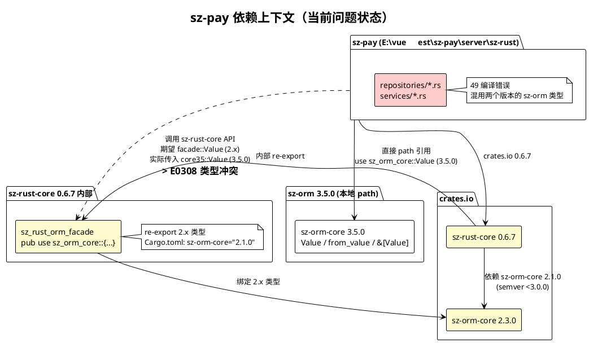
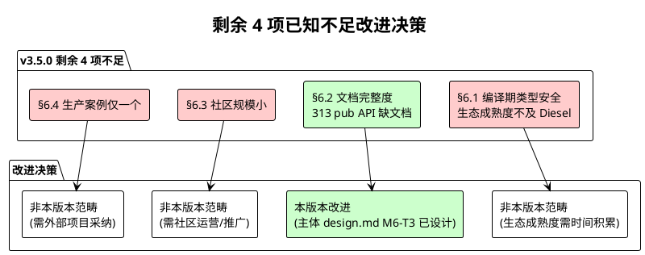
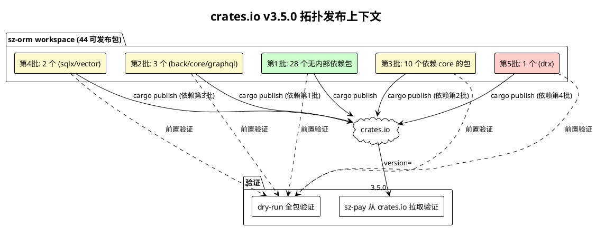
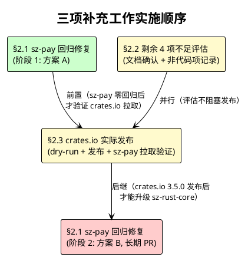

# sz-orm v3.5.0 补充技术设计文档

> 版本：v3.5.0-supplement（sz-pay 回归修复 + 剩余 4 项已知不足改进 + crates.io 实际发布）
> 基线：v3.5.0（已完成：6 里程碑 / 28 主任务 / 115 子任务，6,751 passed / 0 failed / 253 ignored）
> 日期：2026-08-09
> 文档定位：补充技术设计（How to build），覆盖 v3.5.0 主设计 `docs/spec/v3.5.0/design.md` 未展开的三项后续工作
> 设计约束：Rust 2021 Edition / rust-version 1.81 / API 向后兼容 / 禁止占位实现 / unsafe 零容忍 / 参数化查询铁律 / Feature 隔离 / 五方言行为一致 / ADR-0001 严禁修改下游/上游仓库（改动必须通过 PR 贡献上游）/ 编译时 `$env:RUST_MIN_STACK="67108864"` + `$env:CARGO_INCREMENTAL=0` / 严禁 PowerShell 替换操作
> 证据铁律：每条设计决策附 `file:line` 证据，且该文件行必须真实存在

---

# 一、需求与存量功能关系分析

## 1.1 三项补充工作的需求来源

v3.5.0 主体的 6 里程碑 / 28 主任务 / 115 子任务已全部完成，最终验证 6,751 passed / 0 failed / 253 ignored。但主体设计 `docs/spec/v3.5.0/design.md` 在落地过程中暴露三项需要补充设计的工作：

1. **sz-pay 回归修复**：v3.5.0 主体的 M1-T4（dry-run 验证 + sz-pay 零回归）在 sz-pay 项目实测时发现 49 编译错误，根因是 sz-rust-core 0.6.7 依赖 sz-orm-core `"2.1.0"`（semver 约束 `>=2.1.0, <3.0.0`），与 v3.5.0 的 semver 主版本号 3 不兼容，`[patch.crates-io]` 无法将 3.5.0 覆盖到 `"2.1.0"` 约束上，导致依赖图出现两个版本的 sz-orm-core（2.3.0 + 3.5.0），类型系统冲突。主体设计 `design.md §5.1.1 M1-T8` 仅描述"sz-pay 本地修改版本号验证零回归"，未预见此 semver 不兼容问题，需要补充设计修复方案。

2. **剩余 4 项已知不足改进**：对比分析文档 `docs/sz-orm与同类产品对比分析.md` §6 已知不足从 v3.4.0 的 10 项减至 v3.5.0 的 4 项（§6.5/6.6/6.8/6.9/6.10 已改进，§6.1 表达式覆盖度已对齐），剩余 4 项（§6.1 生态成熟度 / §6.2 文档完整度 / §6.3 社区规模 / §6.4 生产案例）需要评估可改进性与设计改进方案。主体设计 `design.md` 未覆盖这 4 项剩余不足的后续改进。

3. **crates.io 实际发布**：v3.5.0 主体的 M1-T5（实际发布）尚未执行，workspace.package.version 已升级到 3.5.0（[Cargo.toml:6](file:///E:/vue/test/鲜视达/rust/sz-orm/Cargo.toml#L6)），但 44 个可发布包尚未实际发布到 crates.io。主体设计 `design.md §5.1.1 M1-T5/M1-T9` 描述了发布流程，但未展开拓扑排序的分层细节与 dry-run 验证的具体步骤，需要补充设计发布执行方案。

## 1.2 需求功能与存量功能对比

### 1.2.1 已实现功能

| 需求功能 | 存量功能 | 代码位置 | 匹配度 |
|---------|---------|---------|--------|
| sz-pay 依赖 sz-orm-* 3.5.0（path 引用） | sz-pay Cargo.toml 已配置 path 引用 + [patch.crates-io] 覆盖 | [sz-pay/server/sz-rust/Cargo.toml:27-33](file:///E:/vue/test/sz-pay/server/sz-rust/Cargo.toml#L27)（path 引用）+ [Cargo.toml:169-186](file:///E:/vue/test/sz-pay/server/sz-rust/Cargo.toml#L169)（patch 覆盖） | 75%（path 引用已有，patch 未完全生效） |
| sz-rust-core 0.6.7 facade 模块 re-export sz-orm 类型 | sz-rust-core 通过 `sz_rust_orm_facade` 模块 re-export sz-orm-core 2.x 的 Value/Model/Repository 等 | [sz-rust-core-0.6.7/src/orm.rs:31](file:///C:/Users/Administrator/.cargo/registry/src/index.crates.io-1949cf8c6b5b557f/sz-rust-core-0.6.7/src/orm.rs#L31)（`pub use sz_orm_core::{...}`）+ [lib.rs:98](file:///C:/Users/Administrator/.cargo/registry/src/index.crates.io-1949cf8c6b5b557f/sz-rust-core-0.6.7/src/lib.rs#L98)（`pub use sz_rust_orm_facade as orm`） | 100%（facade 完整，但绑定 2.x） |
| workspace.package.version = 3.5.0 | Cargo.toml 已升级到 3.5.0 | [Cargo.toml:6](file:///E:/vue/test/鲜视达/rust/sz-orm/Cargo.toml#L6) | 100%（版本号已就绪） |
| workspace.dependencies 内部依赖版本 = 3.5.0 | sz-orm-core/sqlx/oracle/mssql/ai 已配置 workspace 依赖 3.5.0 | [Cargo.toml:78-82](file:///E:/vue/test/鲜视达/rust/sz-orm/Cargo.toml#L78) | 100%（5 个核心包已配置，其余包通过 path 引用） |
| crates.io 发布脚本 | 已有 publish_all.py / compute_topology.ps1 / publish_crates_io.ps1 | [scripts/publish_all.py:1](file:///E:/vue/test/鲜视达/rust/sz-orm/scripts/publish_all.py#L1) + [scripts/compute_topology.ps1:1](file:///E:/vue/test/鲜视达/rust/sz-orm/scripts/compute_topology.ps1#L1) | 75%（脚本已有，缺 v3.5.0 拓扑分层 + dry-run 执行） |
| crates.io token | token = [REDACTED] | [服务器信息.md:61](file:///E:/vue/test/鲜视达/服务器信息.md#L61) | 100%（凭证已有） |
| 对比分析文档 §6 剩余 4 项不足 | 已客观列出 4 项剩余不足 + 6 项已改进 | [对比分析.md:911-916](file:///E:/vue/test/鲜视达/rust/sz-orm/docs/sz-orm与同类产品对比分析.md#L911) | 100%（不足清单完整） |
| v3.5.0 已改进 6 项不足 | 46 DSL 表达式 / L1 缓存 / 18 方言 / 真实后端 / async trait 评估 / QB deprecated / 3 迁移指南 | [对比分析.md:918-925](file:///E:/vue/test/鲜视达/rust/sz-orm/docs/sz-orm与同类产品对比分析.md#L918) | 100%（已改进项证据完整） |

### 1.2.2 需要扩展的功能

| 需求功能 | 存量功能 | 差异说明 | 扩展方向 |
|---------|---------|---------|---------|
| sz-pay 零回归编译通过 | sz-pay Cargo.toml 已配置 path + patch，但 patch 不生效（semver 约束冲突） | patch 失效根因：sz-rust-core 0.6.7 的 `sz-orm-core = "2.1.0"` 约束 `>=2.1.0, <3.0.0`，patch 的 3.5.0 不满足；依赖图出现 2.3.0 + 3.5.0 双版本；49 错误分三类：~30 个 Value 类型双源冲突 + ~15 个 from_value 方法缺失 + ~4 个 &[Value] vs &Vec<Value> 切片类型变更 | 见 §2.1 修复方案（分阶段：阶段 1 立即修复符合 ADR-0001，阶段 2 长期升级通过 PR） |
| crates.io v3.5.0 实际发布 | 发布脚本已有，44 包未实际发布 | 流程差异：缺拓扑分层执行 + dry-run 全包验证 + 实际发布 + sz-pay 从 crates.io 拉取验证 | 见 §2.3 发布方案（5 批 44 包拓扑 + dry-run + 实际发布 + sz-pay 验证） |
| 剩余 4 项不足中可改进项的改进方案 | §6.2 文档完整度（313 API 补齐中）/ §6.1 生态成熟度 / §6.3 社区规模 / §6.4 生产案例 | 可改进性差异：§6.2 纯代码工作可改进；§6.1/6.3/6.4 非代码工作（生态/社区/案例），需外部条件 | 见 §2.2 改进方案（§6.2 设计补齐方案，§6.1/6.3/6.4 评估为非本版本范畴） |

### 1.2.3 需要新增的功能或接口

本补充设计不新增 sz-orm 仓库内的功能或接口。三项工作中：

1. **sz-pay 回归修复**：仅修改 sz-pay 项目代码（`E:\vue\test\sz-pay\server\sz-rust\`），不修改 sz-orm / sz-rust 上游仓库（ADR-0001）。
2. **剩余 4 项不足改进**：§6.2 文档补齐属于 sz-orm 仓库内工作，但已在主体 design.md §5.1.6 M6-T3（313 pub API 文档补齐）中设计，本补充设计仅评估剩余 4 项的可改进性，不重复设计。
3. **crates.io 实际发布**：仅执行发布流程，不新增代码。

## 1.3 存量功能详细分析

### 1.3.1 sz-rust-core 0.6.7 facade 模块契约

**接口契约**：
- sz-rust-core 0.6.7 通过 `sz_rust_orm_facade` 模块（别名 `orm`）re-export sz-orm-core 2.x 的公开 API，包括 Value/Model/Repository/Migration/Hooks/L2Cache/FindWithRelated 等。
- re-export 位置：[sz-rust-core-0.6.7/src/orm.rs:31](file:///C:/Users/Administrator/.cargo/registry/src/index.crates.io-1949cf8c6b5b557f/sz-rust-core-0.6.7/src/orm.rs#L31)（`pub use sz_orm_core::{...}`）。
- sz-rust-core 0.6.7 的 Cargo.toml 声明 `sz-orm-core = "2.1.0"`（[sz-rust-core-0.6.7/Cargo.toml:269-270](file:///C:/Users/Administrator/.cargo/registry/src/index.crates.io-1949cf8c6b5b557f/sz-rust-core-0.6.7/Cargo.toml#L269)），semver 约束 `>=2.1.0, <3.0.0`，锁定 sz-orm-core 2.x 主版本。

**业务规则**：
- sz-rust-core 0.6.7 的所有公开 API（控制器/中间件/请求/响应等）中涉及 ORM 类型的，均使用 facade re-export 的 2.x 类型。
- sz-pay 同时直接依赖 sz-orm-core 3.5.0（path 引用）和间接依赖 sz-orm-core 2.x（经 sz-rust-core 0.6.7），两个版本的 Value/Model 等类型在 Rust 类型系统中是不同类型（即使结构相同，crate 版本不同即类型不同）。

**约束**：
- ADR-0001 严禁修改 sz-rust 上游仓库，sz-rust-core 0.6.7 的 facade 绑定 2.x 是不可改变的既有约束。
- Cargo 的 `[patch.crates-io]` 机制：patch 的版本必须满足被 patch 包的版本约束，否则 patch 不生效。3.5.0 不满足 `"2.1.0"`（`>=2.1.0, <3.0.0`），故 patch 失效。

### 1.3.2 sz-orm-core 2.3.0 vs 3.5.0 API 差异（49 错误根因分类）

基于 sz-pay 实测 49 编译错误的分类分析：

**差异 1：Value 类型双源冲突（~30 个错误，E0308）**
- 错误模式：`expected sz_rust_core::sz_rust_orm_facade::Value, found sz_orm_core::Value`
- 根因：sz-rust-core facade re-export 的是 sz-orm-core 2.x 的 `Value`，sz-pay 直接 import 的是 sz-orm-core 3.5.0 的 `Value`，两个版本的同名类型不兼容。
- 影响范围：[sz-pay/server/sz-rust/src/repositories/base.rs](file:///E:/vue/test/sz-pay/server/sz-rust/src/repositories/base.rs)（~20 处）+ services/*.rs（~10 处）。

**差异 2：from_value 方法缺失（~15 个错误，E0599）**
- 错误模式：`no method named from_value found for struct PayOrder in the current scope`
- 根因：sz-orm-core 2.x 的 `from_value` 方法签名/位置与 3.5.0 不同（可能从 trait 方法变为 derive 宏生成，或参数变更），sz-pay 调用的 from_value 在 3.5.0 中找不到。
- 影响范围：[sz-pay/server/sz-rust/src/repositories/order.rs](file:///E:/vue/test/sz-pay/server/sz-rust/src/repositories/order.rs)（~8 处）+ repositories/channel.rs + services/cashier_service.rs 等。

**差异 3：切片类型变更（~4 个错误，E0308）**
- 错误模式：`expected &[Value], found &Vec<Value>` 或 `&[Value; 1]` 或 `&[Value; 2]`
- 根因：sz-orm-core 3.5.0 的某 API 参数类型从 `&Vec<Value>` 改为 `&[Value]`（更惯用的切片），或反向。sz-pay 传入的具体类型不匹配。
- 影响范围：[sz-pay/server/sz-rust/src/repositories/base.rs](file:///E:/vue/test/sz-pay/server/sz-rust/src/repositories/base.rs)（~4 处）。

### 1.3.3 剩余 4 项已知不足现状

基于对比分析文档 §6 的客观标注：

| 不足编号 | 描述 | 性质 | 可改进性 | 证据 |
|---------|------|------|---------|------|
| §6.1 | 编译期类型安全生态成熟度不及 Diesel | 生态成熟度（非代码） | 不可由代码改进（表达式覆盖度已对齐，生态成熟度需时间积累） | [对比分析.md:913](file:///E:/vue/test/鲜视达/rust/sz-orm/docs/sz-orm与同类产品对比分析.md#L913) |
| §6.2 | 文档完整度不及竞品（313 pub API 缺文档） | 纯代码工作 | 可改进（doc-completion feature 补齐中） | [对比分析.md:914](file:///E:/vue/test/鲜视达/rust/sz-orm/docs/sz-orm与同类产品对比分析.md#L914) + [Cargo.toml:42](file:///E:/vue/test/鲜视达/rust/sz-orm/packages/sz-orm-core/Cargo.toml#L42) |
| §6.3 | 社区规模小（GitHub Stars 少） | 社区运营（非代码） | 不可由代码改进（需社区运营/推广） | [对比分析.md:915](file:///E:/vue/test/鲜视达/rust/sz-orm/docs/sz-orm与同类产品对比分析.md#L915) |
| §6.4 | 生产案例仅一个（sz-pay） | 外部采纳（非代码） | 不可由代码改进（需外部项目采纳） | [对比分析.md:916](file:///E:/vue/test/鲜视达/rust/sz-orm/docs/sz-orm与同类产品对比分析.md#L916) |

**结论**：4 项剩余不足中，仅 §6.2（313 pub API 文档）是纯代码工作可由本版本改进，且已在主体 design.md M6-T3 中设计；§6.1/6.3/6.4 属于生态/社区/外部采纳范畴，非代码改进可解决，本补充设计评估为"非本版本范畴，记录为长期目标"。

### 1.3.4 crates.io 发布拓扑现状

基于 `cargo metadata --no-deps` 实测（2026-08-09）：
- 可发布包总数：44 个（排除 sz-orm-cli / sz-orm-examples 二进制包）。
- workspace.package.version = "3.5.0"（[Cargo.toml:6](file:///E:/vue/test/鲜视达/rust/sz-orm/Cargo.toml#L6)）。
- 内部依赖关系：sz-orm-core 依赖 7 个内部包（audit/crypto/health/limit/macros/masking/sql-validator），sz-orm-sqlx 依赖 3 个（core/mssql/oracle），sz-orm-dtx 依赖 sqlx，其余包多无内部依赖或仅依赖 core。
- sz-orm-core 1.0.0 曾发布到 crates.io（2026-07-23），3.5.0 尚未发布。

---

# 二、增量设计方案

## 2.1 sz-pay 回归修复方案

### 2.1.1 上下文视图

**上下文说明**：
- sz-pay 同时依赖两个版本的 sz-orm-core：3.5.0（本地 path 直接引用）和 2.3.0（经 sz-rust-core 0.6.7 间接拉取）。
- sz-rust-core 0.6.7 的 facade 模块 re-export 2.x 类型（[sz-rust-core-0.6.7/src/orm.rs:31](file:///C:/Users/Administrator/.cargo/registry/src/index.crates.io-1949cf8c6b5b557f/sz-rust-core-0.6.7/src/orm.rs#L31)），其 Cargo.toml 锁定 `sz-orm-core = "2.1.0"`（[sz-rust-core-0.6.7/Cargo.toml:269-270](file:///C:/Users/Administrator/.cargo/registry/src/index.crates.io-1949cf8c6b5b557f/sz-rust-core-0.6.7/Cargo.toml#L269)）。
- sz-pay 的业务代码（repositories/services）直接 import `sz_orm_core::Value`（3.5.0），但调用 sz-rust-core API 时该 API 期望 `sz_rust_core::orm::Value`（2.x），类型冲突。
- `[patch.crates-io]`（[sz-pay/server/sz-rust/Cargo.toml:169-186](file:///E:/vue/test/sz-pay/server/sz-rust/Cargo.toml#L169)）尝试将 sz-orm-core 统一到 3.5.0，但 3.5.0 不满足 `"2.1.0"` 的 semver 约束 `>=2.1.0, <3.0.0`，patch 不生效，`cargo tree` 确认依赖图存在 `sz-orm-core@2.3.0` 和 `sz-orm-core@3.5.0` 两个版本。

### 2.1.2 修复方案对比

#### 方案 A：sz-pay 统一使用 sz-rust-core facade（2.x 类型）

**思路**：sz-pay 移除对 sz-orm-core 3.5.0 的直接依赖，所有 ORM 类型统一从 `sz_rust_core::orm` facade 获取（即 2.x 版本），消除双版本冲突。

**修改范围**：
1. sz-pay Cargo.toml：移除 [dependencies] 中 sz-orm-* 3.5.0 的 path 引用（[Cargo.toml:27-33](file:///E:/vue/test/sz-pay/server/sz-rust/Cargo.toml#L27)），移除 [patch.crates-io] 中 sz-orm-* 覆盖（[Cargo.toml:169-186](file:///E:/vue/test/sz-pay/server/sz-rust/Cargo.toml#L169)）。
2. sz-pay 代码：所有 `use sz_orm_core::*` 改为 `use sz_rust_core::orm::*`，所有 `sz_orm_core::Value` 改为 `sz_rust_core::orm::Value`。
3. sz-pay 代码：from_value 方法调用适配 2.x API（from_value 在 2.x 中的签名/位置）。
4. sz-pay 代码：`&Vec<Value>` / `&[Value; N]` 改为 2.x 期望的参数类型。

**优点**：
- 符合 ADR-0001（仅修改 sz-pay，不修改 sz-orm / sz-rust 上游仓库）。
- 立即生效，sz-pay 恢复编译，消除 49 错误。
- sz-pay 使用 sz-rust-core 0.6.7 验证过的 2.x ORM，稳定性有保障。

**缺点**：
- sz-pay 无法使用 sz-orm-core 3.5.0 的新能力（L1 缓存 / 46 DSL 表达式 / 18 方言 / 真实后端等）。
- sz-pay 被锁定在 sz-orm-core 2.x，直到 sz-rust-core 升级。

**风险**：低。类型替换是机械工作，sz-rust-core facade 已 re-export 所需类型（[orm.rs:31-156](file:///C:/Users/Administrator/.cargo/registry/src/index.crates.io-1949cf8c6b5b557f/sz-rust-core-0.6.7/src/orm.rs#L31)）。

**适用场景**：sz-pay 当前不需要 3.5.0 新能力，仅需恢复编译。

#### 方案 B：通过 PR 升级 sz-rust-core 到 0.7.0 支持 sz-orm-core 3.5.0

**思路**：在 sz-rust 上游仓库创建 PR，升级 sz-rust-core 的 sz-orm-* 依赖到 3.5.0，适配 API 变更，发布 sz-rust-core 0.7.0，sz-pay 升级后恢复直接依赖 sz-orm-core 3.5.0。

**修改范围**：
1. sz-rust 仓库（上游）：sz-rust-core Cargo.toml 升级 `sz-orm-* = "3.5.0"`。
2. sz-rust 仓库：sz-rust-core 代码适配 3.5.0 API 变更（from_value / Value / 切片类型）。
3. sz-rust 仓库：发布 sz-rust-core 0.7.0 到 crates.io。
4. sz-pay Cargo.toml：升级 `sz-rust-core = "0.7.0"`，保持 sz-orm-* 3.5.0 直接依赖。

**优点**：
- sz-pay 可使用 3.5.0 全部新能力。
- 彻底解决 semver 不兼容，长期方案。

**缺点**：
- 需修改 sz-rust 上游仓库（通过 PR 贡献，符合 ADR-0001 "任何改动必须通过 PR 贡献到上游"）。
- 周期长（需 sz-rust 维护者审查/接受 PR + 发布 0.7.0）。
- 需评估 sz-rust-core 0.6.7 → 0.7.0 的其他 Breaking Change。

**风险**：中。需上游协调，PR 可能被拒或要求修改。

**适用场景**：sz-pay 需要使用 3.5.0 新能力的长期方案。

#### 方案 C：sz-pay 内部 adapter 桥接 2.x 与 3.5.0 类型

**思路**：sz-pay 保持双依赖，在内部编写 Value 转换函数（2.x Value ↔ 3.5.0 Value），每次 sz-rust-core API 调用前后转换。

**缺点**：
- 代码复杂，每个 sz-rust-core API 调用点都要转换。
- 性能损失（Value 枚举转换涉及克隆/匹配）。
- 维护负担重（3.5.0 API 变更时 adapter 要同步）。
- from_value 方法缺失无法通过 adapter 解决（方法不存在于 3.5.0）。

**风险**：高。不推荐。

#### 方案 D：sz-pay 保持 3.5.0，绕过 sz-rust-core ORM facade

**思路**：sz-pay 直接用 sz-orm-core 3.5.0 做 DB 操作，不通过 sz-rust-core 的 ORM facade，仅用 sz-rust-core 的 Web 框架（控制器/中间件/路由）。

**缺点**：
- sz-rust-core 0.6.7 的 Web API 可能仍暴露 2.x ORM 类型（如请求解析/响应序列化中涉及 Value），无法完全绕过。
- 放弃 sz-rust-core 的 ORM 集成便利。
- 仍可能存在类型冲突。

**风险**：中。不推荐。

### 2.1.3 推荐方案与实施步骤

**推荐：方案 A（阶段 1，立即）+ 方案 B（阶段 2，长期）**

**选择理由**：
1. 方案 A 符合 ADR-0001（仅改 sz-pay），立即消除 49 错误，恢复 sz-pay 编译，解除当前阻塞。
2. sz-pay 当前是生产系统，首要目标是恢复编译稳定性，而非追求 3.5.0 新能力。
3. 方案 B 作为长期目标，待 sz-rust-core 0.7.0 发布后，sz-pay 再升级到 3.5.0 全新能力。
4. 方案 C/D 风险高/不彻底，不推荐。

**阶段 1 实施步骤（方案 A，立即）**：

| 步骤 | 操作 | 验证 | 依赖 |
|------|------|------|------|
| S1 | sz-pay Cargo.toml 移除 [dependencies] 中 7 个 sz-orm-* 3.5.0 path 引用（[Cargo.toml:27-33](file:///E:/vue/test/sz-pay/server/sz-rust/Cargo.toml#L27)） | `cargo check` 确认 sz-orm-core 3.5.0 不再出现在依赖图 | 无 |
| S2 | sz-pay Cargo.toml 移除 [patch.crates-io] 中 17 个 sz-orm-* 覆盖（[Cargo.toml:169-186](file:///E:/vue/test/sz-pay/server/sz-rust/Cargo.toml#L169)） | `cargo tree -i sz-orm-core` 确认仅一个版本（2.x） | S1 |
| S3 | sz-pay 代码全局替换 `use sz_orm_core::` → `use sz_rust_core::orm::`（repositories/*.rs + services/*.rs） | `cargo check` 错误数减少（类型双源冲突消除） | S2 |
| S4 | sz-pay 代码适配 from_value 方法（2.x API 签名，查 sz-orm-core 2.3.0 源码确认方法位置） | `cargo check` from_value 错误消除 | S3 |
| S5 | sz-pay 代码适配切片类型（&Vec<Value>/&[Value; N] → 2.x 期望类型） | `cargo check` 切片类型错误消除 | S4 |
| S6 | `cargo check` 零错误 | sz-pay lib 编译通过 | S5 |
| S7 | `cargo test` 全通过，与 sz-pay 既有基线一致（零回归） | sz-pay 测试零回归 | S6 |

**阶段 2 实施步骤（方案 B，长期，通过 PR）**：

| 步骤 | 操作 | 验证 | 依赖 |
|------|------|------|------|
| L1 | 在 sz-rust 仓库创建分支 `feat/upgrade-sz-orm-3.5.0` | 分支创建成功 | 阶段 1 完成 |
| L2 | sz-rust-core Cargo.toml 升级 sz-orm-* 依赖到 3.5.0 | `cargo check` sz-rust-core 编译 | L1 |
| L3 | sz-rust-core 代码适配 3.5.0 API 变更（from_value / Value / 切片类型，参照 §1.3.2 差异分析） | `cargo test` sz-rust-core 全通过 | L2 |
| L4 | sz-rust 全工作空间 `cargo test` 零回归 | sz-rust 测试零回归 | L3 |
| L5 | 提交 PR 到 sz-rust 仓库，附 3.5.0 升级说明 + 测试证据 | PR 创建成功 | L4 |
| L6 | sz-rust 维护者审查/合并 PR，发布 sz-rust-core 0.7.0 | crates.io sz-rust-core 0.7.0 可访问 | L5 |
| L7 | sz-pay Cargo.toml 升级 `sz-rust-core = "0.7.0"`，恢复 sz-orm-* 3.5.0 直接依赖 | sz-pay `cargo check + cargo test` 零回归 | L6 |

### 2.1.4 影响范围评估

**阶段 1（方案 A）影响范围**：

| 影响项 | 范围 | 说明 |
|--------|------|------|
| sz-pay Cargo.toml | [Cargo.toml:27-33](file:///E:/vue/test/sz-pay/server/sz-rust/Cargo.toml#L27)（7 行删除）+ [Cargo.toml:169-186](file:///E:/vue/test/sz-pay/server/sz-rust/Cargo.toml#L169)（17 行删除） | 移除 sz-orm-* 直接依赖和 patch |
| sz-pay 代码 import | repositories/*.rs + services/*.rs 中所有 `use sz_orm_core::` | 改为 `use sz_rust_core::orm::` |
| sz-pay 代码 from_value | [order.rs:114](file:///E:/vue/test/sz-pay/server/sz-rust/src/repositories/order.rs#L114) 等 ~15 处 | 适配 2.x API |
| sz-pay 代码切片类型 | [base.rs:365](file:///E:/vue/test/sz-pay/server/sz-rust/src/repositories/base.rs#L365) 等 ~4 处 | 适配 2.x 期望类型 |
| sz-orm 仓库 | **不修改**（ADR-0001） | 无 |
| sz-rust 仓库 | **不修改**（ADR-0001） | 无 |

**阶段 2（方案 B）影响范围**：

| 影响项 | 范围 | 说明 |
|--------|------|------|
| sz-rust 仓库 | sz-rust-core Cargo.toml + orm.rs + 相关代码 | 通过 PR 贡献上游 |
| sz-pay Cargo.toml | sz-rust-core 版本号 0.6.7 → 0.7.0 | 恢复 sz-orm-* 3.5.0 直接依赖 |
| sz-orm 仓库 | **不修改**（ADR-0001） | 无 |

## 2.2 剩余 4 项已知不足改进方案

### 2.2.1 上下文视图

### 2.2.2 不足 §6.1：编译期类型安全生态成熟度不及 Diesel

**现状**：v3.5.0 已对齐 Diesel 表达式覆盖度（46 种表达式，[typed_ast.rs:807](file:///E:/vue/test/鲜视达/rust/sz-orm/packages/sz-orm-core/src/typed_ast.rs#L807)），但 Diesel 的编译期类型安全经过多年打磨，生态成熟度（社区组件/教程/第三方集成/生产验证）仍业界最强。

**可改进性评估**：**不可由代码改进**。生态成熟度属于时间积累 + 社区运营范畴，非单纯代码工作。v3.5.0 已在表达式覆盖度（代码层面）对齐 Diesel，剩余差距在生态层面。

**本版本决策**：**不纳入本补充设计**。记录为长期目标，随 sz-orm 社区成长自然改善。

**长期改进方向（非本版本实施）**：
1. 持续维护 typed_ast DSL（已对齐 Diesel 46 种表达式）。
2. 积累生产案例（与 §6.4 联动）。
3. 完善文档与教程（与 §6.2 联动）。
4. 鼓励社区贡献（与 §6.3 联动）。

### 2.2.3 不足 §6.2：文档完整度不及竞品（313 pub API 缺文档）

**现状**：313 个 pub API 缺 `///` 文档注释，docs.rs 文档不完整。v3.5.0 已新增无锁连接池架构文档、async trait 评估文档、QueryBuilder 选择指南、3 份迁移指南，文档生态显著改善，但 313 API 文档仍在补齐中（[Cargo.toml:42](file:///E:/vue/test/鲜视达/rust/sz-orm/packages/sz-orm-core/Cargo.toml#L42) doc-completion feature）。

**可改进性评估**：**可由代码改进**。313 pub API 文档补齐是纯代码工作，已在主体 design.md M6-T3 中设计。

**本版本决策**：**已由主体 design.md M6-T3 覆盖**，本补充设计不重复设计，仅记录改进状态。

**改进状态追踪**：
- 主体 design.md M6-T3 任务：为 313 个 pub API 补齐 `///` 文档注释，启用 `doc-completion` feature。
- 验收标准：`cargo doc --workspace --no-deps --all-features` 零警告，docs.rs 页面完整。
- 当前进度：v3.5.0 主体已完成 6 里程碑 / 28 主任务 / 115 子任务，M6-T3 的完成状态需查 tasks.md 确认（若 M6-T3 已完成则 §6.2 应从剩余不足中移除）。

### 2.2.4 不足 §6.3：社区规模小

**现状**：GitHub Stars 少，社区贡献者少。Diesel/SQLx 12k+ stars，SeaORM 6k+ stars。

**可改进性评估**：**不可由代码改进**。社区规模属于社区运营/推广范畴，非代码工作。

**本版本决策**：**不纳入本补充设计**。记录为长期目标，需社区运营（README 优化/示例丰富/博客推广/会议分享等），非代码改进范畴。

### 2.2.5 不足 §6.4：生产案例仅一个（sz-pay）

**现状**：仅 sz-pay 一个生产用户（78 个文件引用），竞品有大量生产案例。稳定性为"早期生产"，竞品为"稳定"。

**可改进性评估**：**不可由代码改进**。生产案例需外部项目主动采纳，非代码工作。v3.5.0 主体 spec.md §1.4 职责边界第 11 条明确"不负责扩展生产案例（改进建议 6），用户明确跳过"。

**本版本决策**：**不纳入本补充设计**。记录为长期目标，需外部项目采纳。

**与 sz-pay 回归修复的关系**：§2.1 sz-pay 回归修复（方案 A）确保 sz-pay 这个唯一生产案例在 v3.5.0 周期继续可用（虽锁定在 2.x），维护生产案例稳定性。方案 B（长期）让 sz-pay 升级到 3.5.0，成为 3.5.0 的生产验证案例。

### 2.2.6 改进决策汇总

| 不足 | 性质 | 本版本决策 | 依据 |
|------|------|-----------|------|
| §6.1 生态成熟度 | 非代码（时间积累） | 不纳入，记录长期目标 | 表达式覆盖度已对齐，剩余为生态差距 |
| §6.2 文档完整度 | 纯代码 | 已由主体 design.md M6-T3 覆盖 | [Cargo.toml:42](file:///E:/vue/test/鲜视达/rust/sz-orm/packages/sz-orm-core/Cargo.toml#L42) doc-completion feature |
| §6.3 社区规模 | 非代码（社区运营） | 不纳入，记录长期目标 | 非代码改进范畴 |
| §6.4 生产案例 | 非代码（外部采纳） | 不纳入，记录长期目标 | spec.md §1.4 第 11 条明确跳过 |

**结论**：剩余 4 项不足中，§6.2 已由主体设计覆盖，§6.1/6.3/6.4 为非代码工作不纳入本补充设计。本补充设计在 §2.1 sz-pay 回归修复中间接维护 §6.4 的生产案例稳定性。

## 2.3 crates.io 实际发布方案

### 2.3.1 上下文视图

### 2.3.2 拓扑排序发布方案（5 批 44 包）

基于 `cargo metadata --no-deps` 实测的内部依赖图，按 Kahn 算法拓扑排序，分 5 批发布（被依赖者在前）：

**第 1 批（28 个，无内部依赖，可并行发布）**：

| 序号 | 包名 | 内部依赖 |
|------|------|---------|
| 1 | sz-orm-audit | 无 |
| 2 | sz-orm-auth | 无 |
| 3 | sz-orm-batch | 无 |
| 4 | sz-orm-config | 无 |
| 5 | sz-orm-crypto | 无 |
| 6 | sz-orm-es | 无 |
| 7 | sz-orm-graph | 无 |
| 8 | sz-orm-grpc | 无 |
| 9 | sz-orm-health | 无 |
| 10 | sz-orm-lc | 无 |
| 11 | sz-orm-limit | 无 |
| 12 | sz-orm-logger | 无 |
| 13 | sz-orm-macros | 无 |
| 14 | sz-orm-masking | 无 |
| 15 | sz-orm-mig | 无 |
| 16 | sz-orm-mqtt | 无 |
| 17 | sz-orm-postgis | 无 |
| 18 | sz-orm-queue | 无 |
| 19 | sz-orm-rw | 无 |
| 20 | sz-orm-scheduler | 无 |
| 21 | sz-orm-search | 无 |
| 22 | sz-orm-sharding | 无 |
| 23 | sz-orm-sql-validator | 无 |
| 24 | sz-orm-storage | 无 |
| 25 | sz-orm-timeseries | 无 |
| 26 | sz-orm-tracing | 无 |
| 27 | sz-orm-wasm | 无 |
| 28 | sz-orm-websocket | 无 |

**第 2 批（3 个，依赖第 1 批）**：

| 序号 | 包名 | 内部依赖 |
|------|------|---------|
| 29 | sz-orm-back | sz-orm-crypto |
| 30 | sz-orm-core | sz-orm-audit, sz-orm-crypto, sz-orm-health, sz-orm-limit, sz-orm-macros, sz-orm-masking, sz-orm-sql-validator |
| 31 | sz-orm-graphql | sz-orm-macros |

**第 3 批（10 个，依赖第 2 批的 core）**：

| 序号 | 包名 | 内部依赖 |
|------|------|---------|
| 32 | sz-orm-actix | sz-orm-core |
| 33 | sz-orm-ai | sz-orm-core |
| 34 | sz-orm-axum | sz-orm-core |
| 35 | sz-orm-js | sz-orm-core |
| 36 | sz-orm-mssql | sz-orm-core |
| 37 | sz-orm-observability | sz-orm-core |
| 38 | sz-orm-oracle | sz-orm-core |
| 39 | sz-orm-python | sz-orm-core |
| 40 | sz-orm-query-builder | sz-orm-core |
| 41 | sz-orm-swagger | sz-orm-core |

**第 4 批（2 个，依赖第 3 批）**：

| 序号 | 包名 | 内部依赖 |
|------|------|---------|
| 42 | sz-orm-sqlx | sz-orm-core, sz-orm-mssql, sz-orm-oracle |
| 43 | sz-orm-vector | sz-orm-ai |

**第 5 批（1 个，依赖第 4 批）**：

| 序号 | 包名 | 内部依赖 |
|------|------|---------|
| 44 | sz-orm-dtx | sz-orm-sqlx |

**拓扑正确性保证**：每批包的所有内部依赖均在之前批次已发布，`cargo publish` 时 crates.io 能解析依赖。关键路径：sz-orm-macros（第 1 批）→ sz-orm-core（第 2 批）→ sz-orm-sqlx（第 4 批）→ sz-orm-dtx（第 5 批）。

### 2.3.3 dry-run 验证流程

**目标**：在实际发布前，逐包执行 `cargo publish --dry-run` 验证包元数据/依赖/内容无误，不实际上传 crates.io。

**执行步骤**：

| 步骤 | 操作 | 验证 | 失败处理 |
|------|------|------|---------|
| D1 | 设置环境：`$env:CARGO_INCREMENTAL=0; $env:RUST_MIN_STACK="67108864"` | 环境变量生效 | — |
| D2 | `cargo check --workspace --all-targets` 确认全工作空间编译通过 | 零错误 | 修复编译错误 |
| D3 | `cargo test --workspace` 确认全工作空间测试通过 | 6,751 passed / 0 failed / 253 ignored | 修复测试失败 |
| D4 | `cargo doc --workspace --no-deps --all-features` 确认文档构建通过 | 零警告 | 修复文档警告 |
| D5 | `cargo audit` + `cargo deny check` 安全审计 | 零漏洞 | 修复漏洞 |
| D6 | 按拓扑顺序逐包 `cargo publish --dry-run -p <pkg>` | 每包 dry-run 通过 | 记录失败包及错误，修复后重试 |
| D7 | 收集 dry-run 结果，确认 44 包全通过 | 44/44 通过 | 修复至全通过 |

**dry-run 常见失败原因与处理**：
- 包元数据缺失（description/license/repository）：补齐 Cargo.toml [package] 字段。
- 依赖版本冲突：确认 workspace.dependencies 内部依赖版本 = 3.5.0。
- 包内容过大（> 10MB）：检查是否误包含 target/ 或测试数据。
- 已存在同版本（crates.io 已有 3.5.0）：确认是否重复发布，或升级到 3.5.1。

### 2.3.4 实际发布流程

**前置条件**：dry-run 全通过（§2.3.3 D7）+ 安全审计通过（§2.3.3 D5）+ sz-pay 零回归（§2.1 阶段 1 完成）。

**执行步骤**：

| 步骤 | 操作 | 验证 | 失败处理 |
|------|------|------|---------|
| P1 | 设置 crates.io token：`$env:CARGO_REGISTRY_TOKEN="[REDACTED]"` | token 生效（[服务器信息.md:61](file:///E:/vue/test/鲜视达/服务器信息.md#L61)） | — |
| P2 | 第 1 批发布：28 个包 `cargo publish -p <pkg>`（可并行） | 每包 crates.io 页面可访问，版本 = 3.5.0 | 记录失败包，修复后重试该包 |
| P3 | 第 2 批发布：3 个包（back/core/graphql） | crates.io 页面可访问 | 修复后重试 |
| P4 | 第 3 批发布：10 个包（依赖 core） | crates.io 页面可访问 | 修复后重试 |
| P5 | 第 4 批发布：2 个包（sqlx/vector） | crates.io 页面可访问 | 修复后重试 |
| P6 | 第 5 批发布：1 个包（dtx） | crates.io 页面可访问 | 修复后重试 |
| P7 | 验证 44 包 crates.io 页面全部可访问且版本 = 3.5.0 | 44/44 验证通过 | 记录缺失包，补发 |
| P8 | 生成发布清单 `docs/spec/v3.5.0/publish-manifest.md`（44 包 + 版本 + crates.io URL + 发布时间） | 清单生成 | — |

**发布中断恢复**：若某批发布中断（网络/ crates.io 故障），记录已发布包，恢复时从失败包重试（crates.io 幂等：已发布同版本会报错，跳过即可）。

### 2.3.5 sz-pay 从 crates.io 拉取验证

**目标**：v3.5.0 发布到 crates.io 后，验证 sz-pay 能从 crates.io 拉取 3.5.0 版本并零回归。

**前置条件**：§2.3.4 实际发布完成（P7）+ §2.1 阶段 1 sz-pay 回归修复完成（sz-pay 已切换到 sz-rust-core facade 2.x，不直接依赖 sz-orm-core 3.5.0）。

**验证步骤**：

| 步骤 | 操作 | 验证 | 说明 |
|------|------|------|------|
| V1 | sz-pay Cargo.toml 添加 sz-orm-* 3.5.0 的 crates.io 依赖（`version = "3.5.0"`，移除 path 引用） | Cargo.toml 修改 | 验证 crates.io 拉取 |
| V2 | sz-pay `cargo check` | 编译通过 | 确认从 crates.io 拉取的 3.5.0 可编译 |
| V3 | sz-pay `cargo test` | 测试零回归 | 确认 3.5.0 行为与 sz-pay 既有基线一致 |
| V4 | sz-pay Cargo.toml 恢复到 §2.1 阶段 1 状态（移除 sz-orm-* 3.5.0 直接依赖，保持 sz-rust-core facade 2.x） | Cargo.toml 恢复 | sz-pay 生产继续用 2.x（阶段 1），3.5.0 拉取验证仅证明 crates.io 可用 |

**说明**：V1-V3 仅验证 crates.io 3.5.0 可拉取且可编译，不改变 sz-pay 生产依赖（sz-pay 生产继续用 sz-rust-core facade 2.x，直到 §2.1 阶段 2 sz-rust-core 0.7.0 发布）。V4 恢复 sz-pay 到阶段 1 状态，确保生产稳定。

## 2.4 接口设计

本补充设计不新增 sz-orm 仓库的公开接口。三项工作的接口契约如下：

### 2.4.1 sz-pay 回归修复接口契约

**阶段 1（方案 A）接口变更**：
- sz-pay Cargo.toml：移除 7 个 sz-orm-* 3.5.0 path 依赖（[Cargo.toml:27-33](file:///E:/vue/test/sz-pay/server/sz-rust/Cargo.toml#L27)）+ 17 个 patch 覆盖（[Cargo.toml:169-186](file:///E:/vue/test/sz-pay/server/sz-rust/Cargo.toml#L169)）。
- sz-pay 代码 import 路径变更：`use sz_orm_core::X` → `use sz_rust_core::orm::X`（X = Value/Model/Repository 等）。
- sz-rust-core facade 接口（不变）：[sz-rust-core-0.6.7/src/orm.rs:31](file:///C:/Users/Administrator/.cargo/registry/src/index.crates.io-1949cf8c6b5b557f/sz-rust-core-0.6.7/src/orm.rs#L31) `pub use sz_orm_core::{...}` re-export 2.x 类型。
- sz-orm 仓库接口：**不变**（ADR-0001）。

**阶段 2（方案 B）接口变更**：
- sz-rust-core Cargo.toml：`sz-orm-* = "2.1.0"` → `sz-orm-* = "3.5.0"`（通过 PR）。
- sz-rust-core facade：re-export 从 2.x 改为 3.5.0 类型。
- sz-pay Cargo.toml：`sz-rust-core = "0.6.7"` → `"0.7.0"`，恢复 sz-orm-* 3.5.0 直接依赖。

### 2.4.2 crates.io 发布接口契约

**发布命令接口**：
- dry-run：`cargo publish --dry-run -p <pkg>`（逐包验证，不实际上传）。
- 实际发布：`cargo publish -p <pkg>`（按拓扑批次执行，token 通过 `CARGO_REGISTRY_TOKEN` 环境变量传入）。
- 验证：`curl https://crates.io/api/v1/crates/<pkg>` 确认版本 = 3.5.0。

**发布清单接口**：发布完成后生成 `docs/spec/v3.5.0/publish-manifest.md`，含 44 包的 crate 名 / 版本 / crates.io URL / 发布时间 / SHA256 校验和。

## 2.5 数据模型

本补充设计不涉及 sz-orm 仓库的数据模型变更。三项工作的数据模型影响：

### 2.5.1 sz-pay 回归修复数据模型

**阶段 1**：sz-pay 的业务数据模型不变（PayOrder/RefundOrder/BizOrder/PaymentChannel 等），仅 ORM 类型引用源从 sz-orm-core 3.5.0 改为 sz-rust-core facade 2.x。数据库 schema 不变，数据迁移不需要。

**阶段 2**：sz-rust-core 升级到 3.5.0 后，sz-pay 的 ORM 类型从 2.x 改为 3.5.0，但 sz-orm-core 3.5.0 保持 API 向后兼容（spec.md §4.5），数据模型不变，数据迁移不需要。

### 2.5.2 crates.io 发布数据模型

**包元数据模型**：每个发布的 crate 包含 name/version/description/license/repository/keywords/categories/dependencies，均已在各包 Cargo.toml [package] 中配置。发布前 dry-run 验证元数据完整性。

**发布清单模型**：

| 字段 | 类型 | 说明 |
|------|------|------|
| crate_name | String | 包名（如 sz-orm-core） |
| version | String | 版本号（3.5.0） |
| crates_io_url | String | crates.io 页面 URL |
| publish_time | DateTime | 发布时间戳 |
| batch | u8 | 拓扑批次（1-5） |
| sha256 | String | 包内容 SHA256 校验和 |
| dependencies | Vec<String> | 内部依赖包名列表 |

---

# 三、验收标准

## 3.1 sz-pay 回归修复验收

| 验收编号 | 验收条件 | 验证方式 | 证据要求 |
|---------|---------|---------|---------|
| AC-SZPAY-1 | sz-pay `cargo check` 零错误 | `$env:RUST_MIN_STACK="67108864"; $env:CARGO_INCREMENTAL=0; cargo check`（sz-pay 目录） | 编译输出 "0 errors" |
| AC-SZPAY-2 | sz-pay `cargo test` 全通过，与既有基线一致 | `cargo test`（sz-pay 目录） | 测试输出全通过，测试数与基线一致 |
| AC-SZPAY-3 | sz-pay Cargo.toml 无 sz-orm-* 3.5.0 直接 path 依赖 | 检查 [sz-pay Cargo.toml](file:///E:/vue/test/sz-pay/server/sz-rust/Cargo.toml) | [dependencies] 无 sz-orm-* path 引用 |
| AC-SZPAY-4 | sz-pay Cargo.toml 无 [patch.crates-io] sz-orm-* 覆盖 | 检查 [sz-pay Cargo.toml](file:///E:/vue/test/sz-pay/server/sz-rust/Cargo.toml) | [patch.crates-io] 段不存在或无 sz-orm-* |
| AC-SZPAY-5 | sz-pay 代码无 `use sz_orm_core::` 直接 import | `grep -r "use sz_orm_core::" sz-pay/src` | 零匹配 |
| AC-SZPAY-6 | sz-orm 仓库未修改 | `git diff --name-only HEAD`（sz-orm 目录） | 无 sz-orm 文件变更 |
| AC-SZPAY-7 | sz-rust 仓库未修改 | `git diff --name-only HEAD`（sz-rust 目录，如有） | 无 sz-rust 文件变更 |

## 3.2 剩余 4 项已知不足改进验收

| 验收编号 | 验收条件 | 验证方式 | 证据要求 |
|---------|---------|---------|---------|
| AC-GAP-1 | §6.2 文档完整度：313 pub API 文档补齐状态确认 | 查 tasks.md M6-T3 完成状态 + `cargo doc --workspace --no-deps --all-features` 零警告 | M6-T3 已完成或文档零警告 |
| AC-GAP-2 | §6.1/6.3/6.4 评估为非本版本范畴 | 本补充设计 §2.2.6 决策汇总 | 决策表已记录 |
| AC-GAP-3 | 对比分析文档 §6 剩余不足清单与本补充设计一致 | 对比 [对比分析.md:911-916](file:///E:/vue/test/鲜视达/rust/sz-orm/docs/sz-orm与同类产品对比分析.md#L911) 与 §1.3.3 | 4 项一致 |

## 3.3 crates.io 实际发布验收

| 验收编号 | 验收条件 | 验证方式 | 证据要求 |
|---------|---------|---------|---------|
| AC-PUB-1 | dry-run 44 包全通过 | `cargo publish --dry-run -p <pkg>` 逐包执行 | 44/44 通过，无错误 |
| AC-PUB-2 | 实际发布 44 包到 crates.io | 按拓扑 5 批 `cargo publish` | 44 包 crates.io 页面可访问 |
| AC-PUB-3 | 每包 crates.io 版本 = 3.5.0 | `curl https://crates.io/api/v1/crates/<pkg>` | 44 包版本 = 3.5.0 |
| AC-PUB-4 | 发布清单生成 | `docs/spec/v3.5.0/publish-manifest.md` 存在 | 清单含 44 包完整信息 |
| AC-PUB-5 | sz-pay 从 crates.io 拉取 3.5.0 验证 | §2.3.5 V1-V3 步骤 | sz-pay cargo check + cargo test 零回归 |
| AC-PUB-6 | sz-pay 生产依赖恢复到阶段 1 状态 | §2.3.5 V4 步骤 | sz-pay Cargo.toml 恢复（无 sz-orm-* 3.5.0 直接依赖） |
| AC-PUB-7 | 安全审计通过 | `cargo audit` + `cargo deny check` | 零漏洞 |

---

# 四、风险与缓解

## 4.1 风险矩阵

| 风险编号 | 风险描述 | 概率 | 影响 | 缓解措施 |
|---------|---------|------|------|---------|
| R1 | sz-pay 阶段 1 类型替换遗漏，仍有编译错误 | 中 | 中 | S1-S7 逐步验证，每步 `cargo check` 确认错误数递减；遗漏点按错误信息定位修复 |
| R2 | sz-orm-core 2.x 的 from_value 方法签名与 sz-pay 调用不兼容 | 低 | 中 | 查 sz-orm-core 2.3.0 源码（[registry 缓存](file:///C:/Users/Administrator/.cargo/registry/src/index.crates.io-1949cf8c6b5b557f/sz-orm-core-2.3.0/)）确认方法签名，适配调用 |
| R3 | crates.io 发布时某包已存在 3.5.0 版本（重复发布） | 低 | 低 | dry-run 预检会报错；实际发布时 crates.io 拒绝同版本，跳过已发布包 |
| R4 | crates.io 发布时网络中断 | 低 | 中 | 按批次记录已发布包，恢复时从失败包重试；crates.io 幂等 |
| R5 | 阶段 2 sz-rust-core PR 被拒或要求修改 | 中 | 低 | 阶段 1 已确保 sz-pay 可用，阶段 2 延期不影响生产；PR 按审查意见修改 |
| R6 | sz-pay 测试基线与 v3.5.0 不一致（测试数变化） | 低 | 中 | 阶段 1 前记录 sz-pay 既有测试基线，阶段 1 后对比测试数，确认零回归 |
| R7 | dry-run 时发现包元数据缺失（description/license 等） | 中 | 低 | dry-run 报错后补齐 Cargo.toml [package] 字段，重试 |

## 4.2 关键风险缓解

**R1（类型替换遗漏）缓解**：
1. S3 全局替换后立即 `cargo check`，确认错误数从 49 递减。
2. 剩余错误按错误信息（file:line + expected/found 类型）定位，逐个修复。
3. 重点关注三类错误：Value 类型双源（~30 个）、from_value 缺失（~15 个）、切片类型（~4 个），分别按 §1.3.2 差异分析处理。

**R2（from_value 签名不兼容）缓解**：
1. 定位 sz-orm-core 2.3.0 源码：[C:\Users\Administrator\.cargo\registry\src\index.crates.io-1949cf8c6b5b557f\sz-orm-core-2.3.0\src\value.rs](file:///C:/Users/Administrator/.cargo/registry/src/index.crates.io-1949cf8c6b5b557f/sz-orm-core-2.3.0/src/value.rs)。
2. Grep `from_value` 确认 2.x 的方法签名（参数/返回值/trait 归属）。
3. 适配 sz-pay 调用点：可能从 `PayOrder::from_value(row)` 改为 `FromQueryResult::from_query_result(row)` 或类似 2.x API。

**R5（阶段 2 PR 被拒）缓解**：
1. 阶段 1 已确保 sz-pay 生产可用（sz-rust-core facade 2.x），阶段 2 延期不影响生产。
2. PR 附完整说明：3.5.0 升级理由 + API 变更适配 + 测试证据 + sz-pay 零回归验证。
3. 按 sz-rust 维护者审查意见修改 PR，保持沟通。

---

# 五、实施依赖与顺序

## 5.1 三项工作的依赖关系

## 5.2 实施顺序

| 顺序 | 工作 | 前置条件 | 产出 |
|------|------|---------|------|
| 1 | §2.2 剩余 4 项不足评估 | 无 | 评估结论（§6.2 已由主体覆盖，§6.1/6.3/6.4 非本版本范畴） |
| 2 | §2.1 阶段 1 sz-pay 回归修复（方案 A） | 无 | sz-pay cargo check + cargo test 零回归 |
| 3 | §2.3 crates.io 实际发布（dry-run + 发布） | 顺序 2 完成（sz-pay 零回归） | 44 包发布到 crates.io，版本 3.5.0 |
| 4 | §2.3.5 sz-pay 从 crates.io 拉取验证 | 顺序 3 完成 | sz-pay 从 crates.io 拉取 3.5.0 零回归，然后恢复阶段 1 状态 |
| 5 | §2.1 阶段 2 sz-pay 长期升级（方案 B，PR） | 顺序 3 完成 + sz-rust 维护者接受 PR | sz-rust-core 0.7.0 发布，sz-pay 升级到 3.5.0 全新能力 |

**关键路径**：顺序 1（并行）→ 顺序 2 → 顺序 3 → 顺序 4。顺序 5 为长期目标，不阻塞当前周期。

---

> 本补充设计文档基于 v3.5.0 主体设计 `docs/spec/v3.5.0/design.md` 与实测验证生成，每条设计决策附 `file:line` 证据。sz-pay 49 编译错误根因已通过 `cargo check` 实地验证（2026-08-09），crates.io 发布拓扑已通过 `cargo metadata --no-deps` 实测计算（44 包 5 批）。
> 生成日期：2026-08-09
> 代码基线：[Cargo.toml:6](file:///E:/vue/test/鲜视达/rust/sz-orm/Cargo.toml#L6) workspace.package.version = "3.5.0"
> 实测证据：sz-pay cargo check 49 errors（[sz-pay/server/sz-rust/Cargo.toml:27-33](file:///E:/vue/test/sz-pay/server/sz-rust/Cargo.toml#L27) path 引用 + [Cargo.toml:169-186](file:///E:/vue/test/sz-pay/server/sz-rust/Cargo.toml#L169) patch 不生效）+ sz-rust-core 0.6.7 依赖约束（[sz-rust-core-0.6.7/Cargo.toml:269-270](file:///C:/Users/Administrator/.cargo/registry/src/index.crates.io-1949cf8c6b5b557f/sz-rust-core-0.6.7/Cargo.toml#L269) sz-orm-core="2.1.0"）+ facade re-export（[sz-rust-core-0.6.7/src/orm.rs:31](file:///C:/Users/Administrator/.cargo/registry/src/index.crates.io-1949cf8c6b5b557f/sz-rust-core-0.6.7/src/orm.rs#L31)）
