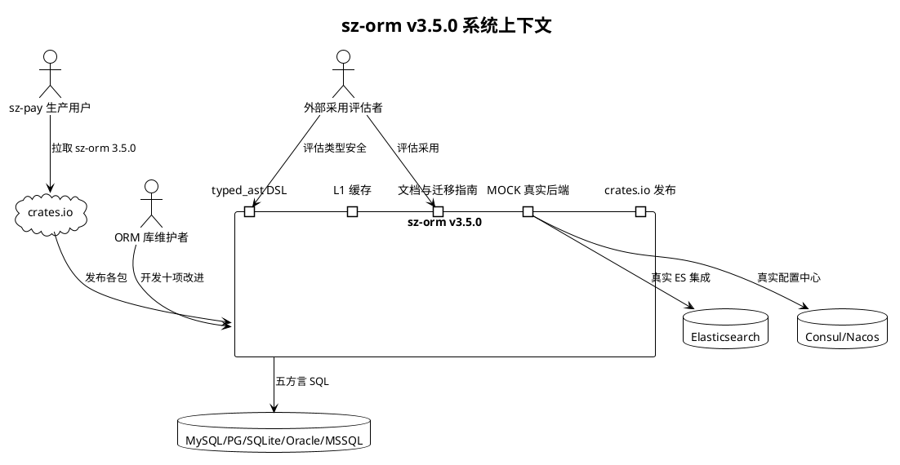
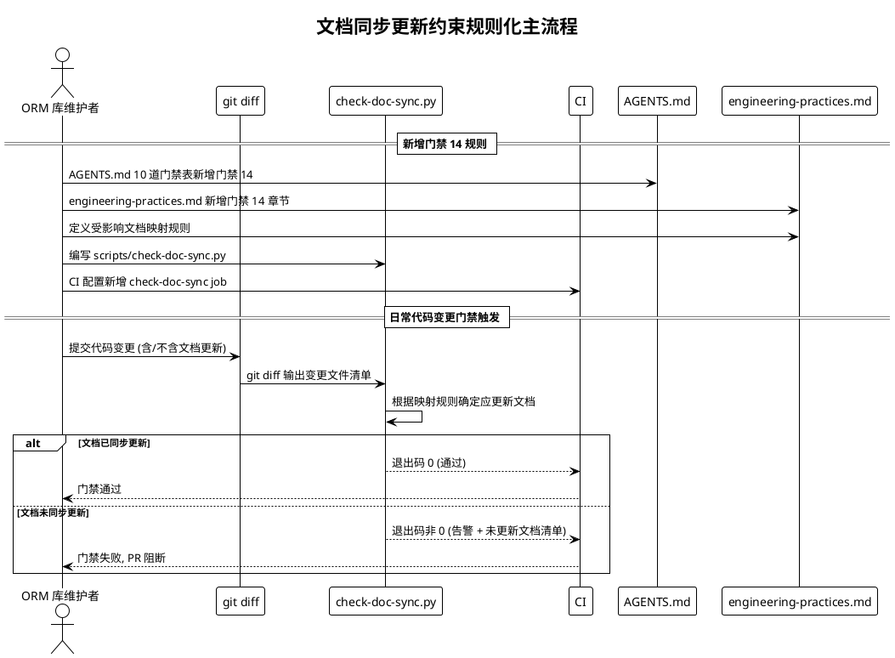
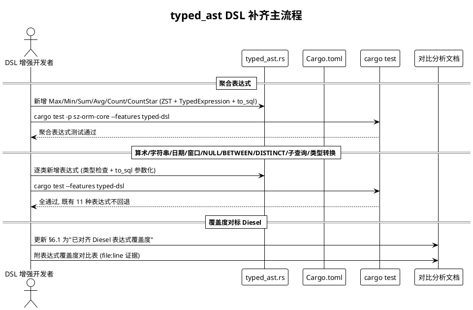
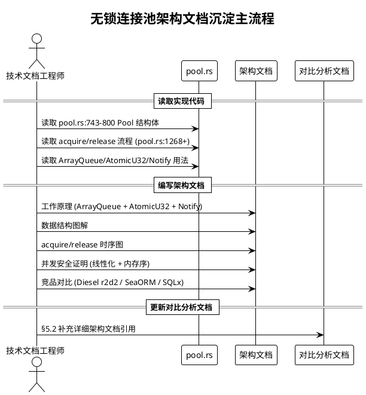
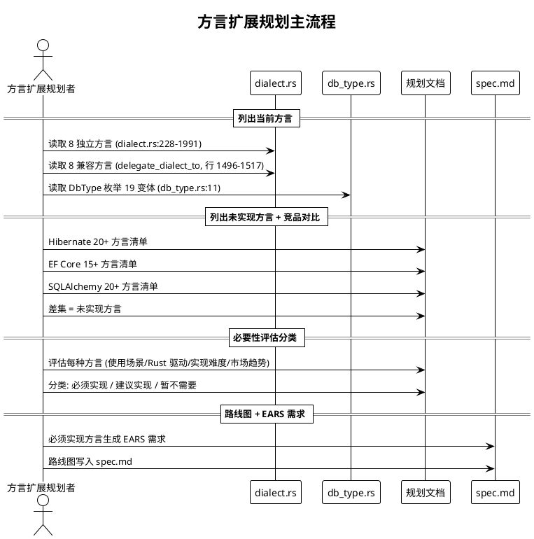
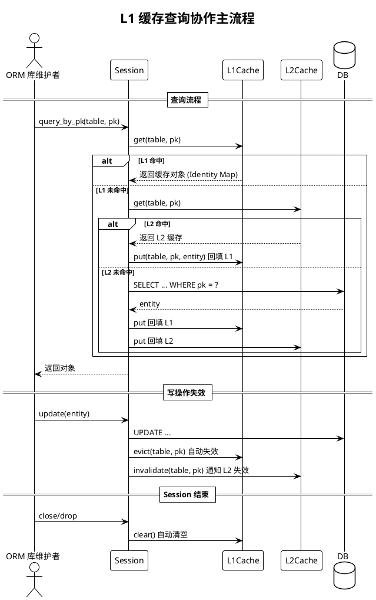
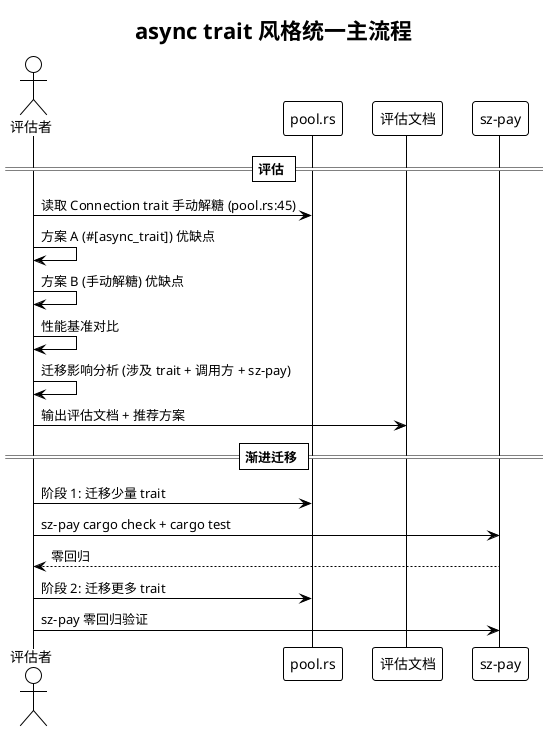
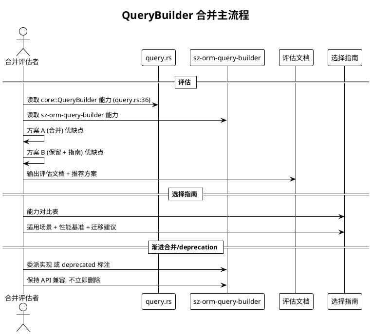
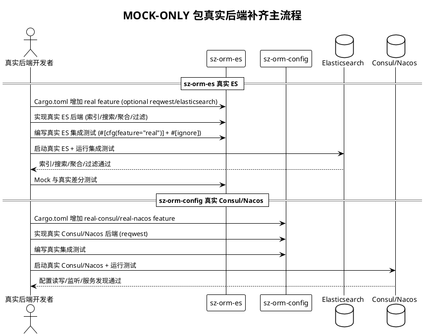
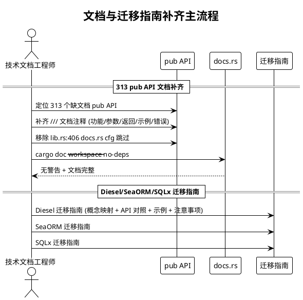

# sz-orm v3.5.0 需求规格说明书

> 版本：v3.5.0（已知不足改进 + 文档同步约束规则化 + typed_ast DSL 补齐 + 无锁连接池架构文档 + 方言扩展规划 + L1 缓存设计 + crates.io 发布流程 + async trait 风格统一 + QueryBuilder 合并 + MOCK-ONLY 包补齐）
> 基线：v3.4.0（已完成：测试覆盖补齐 + 架构改进 + 性能优化落地 + 编译期类型安全增强 + 文档与生态建设 + sz-pay 生产案例深化，6,738 passed / 0 failed / 253 ignored）
> 日期：2026-08-09
> 需求格式：EARS（Ubiquitous / Event-driven / State-driven / Unwanted）
> 文档定位：需求规格（What to build），不含技术设计（How to build）
> 优先级声明：十项能力按"文档同步约束(1,最高,防反复不一致) → crates.io 发布(2,解除下游阻塞) → typed_ast DSL 补齐(3,补 Diesel 短板) → L1 缓存(4,补 Hibernate 短板) → MOCK-ONLY 补齐(5,补真实后端) → async trait 统一(6,降维护成本) → QueryBuilder 合并(7,消歧义) → 方言扩展规划(8,补企业数据库) → 无锁连接池文档(9,沉淀独特优势) → 文档与迁移指南补齐(10,降采用门槛)"的收益/风险序推进；前两项为最高收益低风险（约束规则 + 发布流程，不引入新代码依赖），DSL/L1 缓存/MOCK 为中收益中风险（新功能模块，需 feature gate 隔离），async trait/QB 合并为中收益中风险（重构，需兼容性评估），方言扩展为低收益高风险（企业数据库需求不明朗），文档类为低风险高收益
> 需求编号约定：REQ-DOC-SYNC-xxx（文档同步约束）/ REQ-PUBLISH-xxx（crates.io 发布）/ REQ-DSL-xxx（typed_ast DSL）/ REQ-L1CACHE-xxx（L1 缓存）/ REQ-MOCK-xxx（MOCK-ONLY 补齐）/ REQ-ASYNC-xxx（async trait 统一）/ REQ-QB-MERGE-xxx（QueryBuilder 合并）/ REQ-DIALECT-xxx（方言扩展）/ REQ-POOL-DOC-xxx（连接池文档）/ REQ-DOC-FILL-xxx（文档与迁移指南）
> 缺陷来源：`docs/sz-orm与同类产品对比分析.md` §6 已知不足（10 项）+ §7.3 改进建议（7 项）+ 用户 7 项请求
> 兼容性铁律：所有改进通过 feature gate 隔离，默认 feature 行为不变，既有公开 API 完全向后兼容，v3.4.0 已验收的 6,738 测试基线不回退

---

# 1. 组件定位

## 1.1 核心职责

本组件负责交付 sz-orm v3.5.0 的十项已知不足改进任务：文档同步更新约束规则化、crates.io 发布流程建立、typed_ast DSL 补齐 Diesel 覆盖度、L1 缓存设计、MOCK-ONLY 包真实后端补齐、async trait 风格统一、QueryBuilder 合并、方言扩展规划、无锁连接池架构文档沉淀、文档与迁移指南补齐，实现 sz-orm 在"文档一致性保证、编译期类型安全成熟度、缓存层级完整性、后端实现真实性、代码风格统一性、API 歧义消除、方言覆盖度、架构知识沉淀、采用门槛"九个维度的已知不足改进，且不破坏现有 API 兼容性与 v3.4.0 已验收基线。

## 1.2 核心输入

1. **v3.4.0 已验收基线**：6,738 passed / 0 failed / 253 ignored（`docs/spec/v3.4.0/tasks.md` 记录），作为不回退基准。
2. **对比分析已知不足清单**：`docs/sz-orm与同类产品对比分析.md` §6 列出 10 项已知不足 + §7.3 列出 7 项改进建议，作为 v3.5.0 的需求来源。
3. **文档反复不一致教训**：用户指出"很多文档没有及时更新，导致前后不一致，反复出现多次"，作为文档同步约束规则化的需求来源。
4. **typed_ast.rs 当前实现**：`packages/sz-orm-core/src/typed_ast.rs:1` 模块注释标注"Diesel 风格探索"，当前支持 Eq/Ne/Lt/Gt/Le/Ge/And/Or/Like/In/Not 共 11 种表达式（行 397-919），缺少聚合/算术/窗口/NULL 处理等 Diesel 成熟表达式，作为 DSL 补齐的需求来源。
5. **无锁连接池实现**：`packages/sz-orm-core/src/pool.rs:751` ArrayQueue + `pool.rs:761` AtomicU32 + `pool.rs:764` Notify，作为架构文档沉淀的对象。
6. **当前方言覆盖**：`packages/sz-orm-core/src/dialect.rs` 实际支持 16 种方言（8 独立：MySQL/PG/SQLite/Oracle/MSSQL/ClickHouse/DuckDB/DB2 + 8 兼容：MariaDB/TiDB/KingbaseES/PolarDB/GaussDB/Dameng/Sybase/GBase，行 228-1991 + 行 1496-1517），`db_type.rs:11` DbType 枚举 19 变体，对比分析文档 §6.7 指出不及 Hibernate（20+）/EF Core（15+）/SQLAlchemy（20+），作为方言扩展规划的需求来源。
7. **L2 缓存现状**：`packages/sz-orm-core/src/l2_cache.rs:517` 仅有 L2Cache（跨 Session 共享），无 L1Cache（Session 级别），对比分析文档 §6.6 指出 Hibernate/EF Core/SQLAlchemy 均有 L1 缓存，作为 L1 缓存设计的需求来源。
8. **crates.io 发布现状**：sz-orm-core 1.0.0 曾发布到 crates.io（2026-07-23），当前代码版本 3.4.0 未发布；sz-pay 从 crates.io 拉取 2.3.0（`E:\vue\test\sz-pay\server\sz-rust\Cargo.toml`），说明 crates.io 发布是下游依赖的必要条件，作为发布流程建立的需求来源。
9. **async trait 风格不统一**：`packages/sz-orm-core/src/pool.rs:45` Connection trait 手动解糖（`fn execute<'a>(&'a mut self, ...) -> Pin<Box<dyn Future + 'a>>`），其他 trait 使用 `#[async_trait]` 宏，对比分析文档 §6.9 指出增加学习成本，作为风格统一的需求来源。
10. **QueryBuilder 重叠**：`packages/sz-orm-core/src/query.rs:36` QueryBuilder 与 `packages/sz-orm-query-builder/src/lib.rs` 两个 QueryBuilder，对比分析文档 §6.10 指出用户困惑，作为合并的需求来源。
11. **MOCK-ONLY 包现状**：sz-orm-es 为 MOCK-ONLY（内存 HashMap 实现，重启即丢），sz-orm-config 仅内存实现，对比分析文档 §6.8 指出非生产可用，作为真实后端补齐的需求来源。
12. **313 个 pub API 文档缺口**：`packages/sz-orm-core/src/lib.rs:403` docs.rs cfg 跳过导致 313 个 pub API 缺文档，对比分析文档 §6.2 指出不及竞品，作为文档补齐的需求来源。
13. **迁移指南未完成**：对比分析文档 §6.5 指出 Diesel/SeaORM/SQLx 迁移指南尚未完成，作为迁移指南补齐的需求来源。
14. **Diesel DSL 表达式覆盖度参考**：Diesel 支持聚合（max/min/sum/avg/count）、算术（add/sub/mul/div）、字符串（concat/ilike/length/lower/upper）、日期（extract/year/month/day）、窗口（over/lag/lead/row_number/rank）、类型转换（cast）、NULL 处理（is_null/is_not_null/coalesce）、BETWEEN、DISTINCT、子查询（exists/in_subquery）等成熟表达式，作为 typed_ast DSL 补齐的对标。
15. **Hibernate/EF Core/SQLAlchemy L1 缓存机制参考**：Hibernate Session 级别 Identity Map、EF Core DbContext 级别 Change Tracker、SQLAlchemy Session 级别 Identity Map，作为 L1 缓存设计的对标。
16. **crates.io token**：`E:\vue\test\鲜视达\服务器信息.md` 记录 crates.io token = [REDACTED]，作为发布流程的凭证。
17. **sz-pay 生产依赖证据**：`E:\vue\test\sz-pay\server\sz-rust\Cargo.toml` 从 crates.io 拉取 sz-orm-core/sqlx/config/auth/macros/queue/scheduler 共 7 个包 2.3.0 版本，作为 crates.io 发布必要性的证据。
18. **五方言覆盖约束**：MySQL/PostgreSQL/SQLite/Oracle/MSSQL，所有新能力必须保持五方言行为一致。
19. **既有 feature gate 体系**：`packages/sz-orm-core/Cargo.toml:13-58` 已有 20+ feature（含 typed-dsl/type-safe-columns/perf-* 等），作为新能力 feature gate 隔离的基础。

## 1.3 核心输出

1. **文档同步约束规则**：AGENTS.md / engineering-practices.md 新增门禁 14（文档同步更新检查），作为强制门禁。
2. **crates.io 发布流程**：拓扑排序发布计划 + dry-run 验证 + 实际发布脚本，使 sz-orm 3.5.0 各包发布到 crates.io。
3. **typed_ast DSL 补齐能力**：聚合/算术/字符串/日期/窗口/类型转换/NULL 处理/BETWEEN/DISTINCT/子查询表达式，通过 `typed-dsl` feature gate 隔离。
4. **L1 缓存设计能力**：Session 级别 L1Cache（Identity Map），通过 `l1-cache` feature gate 隔离。
5. **MOCK-ONLY 包真实后端能力**：sz-orm-es 真实 ES 实现 + sz-orm-config 真实 Consul/Nacos 实现，通过 `real` feature gate 隔离。
6. **async trait 风格统一能力**：统一为 `#[async_trait]` 宏或手动解糖的推荐方案与迁移。
7. **QueryBuilder 合并能力**：消除 query.rs 与 sz-orm-query-builder 重叠的方案与选择指南。
8. **方言扩展规划路线图**：必须实现/建议实现/暂不需要分类 + 实施路线图。
9. **无锁连接池架构文档**：详细解释无锁 ArrayQueue + AtomicU32 工作原理 + 竞品对比。
10. **文档与迁移指南补齐能力**：313 个 pub API 文档 + Diesel/SeaORM/SQLx 迁移指南。
11. **需求追溯矩阵**：本文档第 7 章，建立需求 ↔ 验收条件映射。
12. **验收标准总览**：本文档第 9 章，按方向汇总验收条件。

## 1.4 职责边界

本组件**不负责**以下事项：

1. **不重写核心数据结构**：typed_ast DSL 补齐以扩展方式提供（新增表达式类型），既有 Eq/Ne/Lt/Gt/Le/Ge/And/Or/Like/In/Not 表达式保持完全向后兼容。
2. **不破坏 L2 缓存既有 API**：L1 缓存以新增 `L1Cache` 类型 + `l1-cache` feature gate 隔离方式提供，既有 `L2Cache`（`l2_cache.rs:517`）公开 API 保持完全向后兼容。
3. **不强制立即迁移 async trait 风格**：async trait 统一以评估 + 推荐方案 + feature gate 渐进迁移方式提供，既有 Connection trait（`pool.rs:45`）签名在评估期内保持不变。
4. **不立即删除 sz-orm-query-builder**：QueryBuilder 合并以选择指南 + deprecation 标注 + feature gate 渐进方式提供，既有 sz-orm-query-builder 包在 v3.5.0 保持可用（标注 deprecated）。
5. **不实现所有未支持方言**：方言扩展规划仅对"必须实现"的方言生成 EARS 需求并实施，"建议实现"与"暂不需要"仅规划不实施。
6. **不修改 sz-pay / sz-rust 下游代码**：下游零回归通过 feature gate 默认关闭 + crates.io 版本兼容保证，本组件仅提供上游就绪验证（ADR-0001 严禁修改下游/上游仓库）。
7. **不降低既有测试覆盖**：v3.5.0 不得使 v3.4.0 已验收的 6,738 测试基线回退，仅增不减。
8. **不引入新重依赖到默认 feature**：所有新能力通过 feature gate 隔离，默认 feature 不引入额外依赖与行为变更。
9. **不改变既有安全铁律**：任何 WHERE 条件必须参数化，默认禁止 `SELECT *`，N+1 检测自动拦截，AI 输出不自动执行，沿用 v3.4.0 既有铁律。
10. **不负责 LLM 模型训练与托管**：沿用 v3.3.0 既有边界。
11. **不负责扩展生产案例（改进建议 6）**：用户明确跳过改进建议 6"扩展生产案例"（需外部采纳），v3.5.0 不包含吸引更多项目使用的需求。
12. **不负责社区规模扩展**：对比分析文档 §6.3 指出社区规模小，但社区运营非代码改进范畴，v3.5.0 不包含。

---

# 2. 领域术语

**文档同步更新约束（Documentation Sync Constraint）**
: 每次代码变更后必须同步更新所有受影响文档的强制规则，作为门禁 14 纳束，违反则 CI 阻断提交。
: 备注：用户指出"很多文档没有及时更新，导致前后不一致，反复出现多次"，v3.5.0 将此写入约束规则。

**门禁 14（Gate 14: Documentation Sync Check）**
: 新增的 CI 门禁，检查代码变更是否同步更新了所有受影响文档（AGENTS.md / engineering-practices.md / README.md / spec.md / 对比分析文档等），未同步则阻断提交。
: 备注：区别于既有门禁 12（文档与代码一致性检查，检查版本号/包数量数据一致性），门禁 14 检查代码变更是否触发了文档更新。

**typed_ast DSL 表达式覆盖度（typed_ast DSL Expression Coverage）**
: typed_ast.rs 支持的类型安全 SQL 表达式类型数量，对标 Diesel 的表达式成熟度。
: 备注：v3.4.0 当前 11 种（Eq/Ne/Lt/Gt/Le/Ge/And/Or/Like/In/Not），v3.5.0 补齐聚合/算术/字符串/日期/窗口/类型转换/NULL 处理/BETWEEN/DISTINCT/子查询。

**聚合表达式（Aggregate Expression）**
: SQL 聚合函数表达式，包括 max/min/sum/avg/count/count_star，用于 GROUP BY 聚合查询。
: 备注：Diesel 支持，SZ-ORM typed_ast.rs v3.4.0 缺少，v3.5.0 补齐。

**算术表达式（Arithmetic Expression）**
: SQL 算术运算表达式，包括 add/sub/mul/div/modulo，用于列间运算。
: 备注：Diesel 支持，SZ-ORM typed_ast.rs v3.4.0 缺少，v3.5.0 补齐。

**窗口表达式（Window Expression）**
: SQL 窗口函数表达式，包括 over/partition_by/order_by_in_window/lag/lead/row_number/rank/dense_rank，用于分析函数。
: 备注：Diesel 支持，SZ-ORM typed_ast.rs v3.4.0 缺少，v3.5.0 补齐。

**NULL 处理表达式（Null Handling Expression）**
: SQL NULL 处理表达式，包括 is_null/is_not_null/coalesce/nullif，用于 NULL 值判断与替换。
: 备注：Diesel 支持，SZ-ORM typed_ast.rs v3.4.0 缺少，v3.5.0 补齐。

**L1 缓存（L1 Cache / Session-Level Cache / Identity Map）**
: Session 级别缓存，同一 Session 内按主键查询返回同一对象实例（Identity Map），避免重复查询与对象不一致。
: 备注：Hibernate Session / EF Core DbContext / SQLAlchemy Session 均有 L1 缓存，SZ-ORM v3.4.0 仅有 L2 缓存（`l2_cache.rs:517`），v3.5.0 补齐。

**Identity Map（身份映射）**
: L1 缓存的核心数据结构，按实体主键缓存对象实例，保证同一 Session 内同一主键返回同一引用，实现对象一致性。
: 备注：Hibernate/EF Core/SQLAlchemy 均用 Identity Map 实现 L1 缓存。

**L1 缓存失效策略（L1 Cache Invalidation Strategy）**
: L1 缓存条目失效的规则，包括 Session 结束自动清空、写操作（insert/update/delete）自动失效对应条目、手动 evict 失效。
: 备注：L1 缓存生命周期与 Session 绑定，Session 结束自动清空，不跨 Session 共享。

**无锁连接池（Lock-Free Connection Pool）**
: 使用无锁数据结构（ArrayQueue + AtomicU32 + Notify）实现的连接池，消除锁竞争，高并发下吞吐量优于 Mutex 方案。
: 备注：`pool.rs:751` ArrayQueue（无锁 MPMC 队列）+ `pool.rs:761` AtomicU32（无锁原子计数）+ `pool.rs:764` Notify（异步通知），Diesel r2d2 用 Mutex，SQLx 用 Mutex。

**ArrayQueue（无锁多生产者多消费者队列）**
: crossbeam-queue 提供的无锁 MPMC（Multi-Producer Multi-Consumer）有界队列，基于数组实现，push/pop 无锁。
: 备注：`pool.rs:751` `Arc<ArrayQueue<PooledConnection>>`，容量固定为 max_size。

**AtomicU32 计数（AtomicU32 Counting）**
: 使用 AtomicU32 替代 Mutex<u32> 进行无锁原子计数（fetch_add/fetch_sub），单条 CPU 指令，消除锁瓶颈。
: 备注：`pool.rs:761` `total_count: Arc<AtomicU32>`，v0.2.1 修复 Critical P-1，吞吐量提升 ~3x。

**方言扩展规划（Dialect Extension Roadmap）**
: 对未实现方言按"必须实现/建议实现/暂不需要"分类的规划路线图，基于实际使用场景、Rust 生态需求、实现难度评估。
: 备注：v3.4.0 实际支持 16 种方言（8 独立 + 8 兼容），对比分析文档 §6.7 指出不及 Hibernate（20+）/EF Core（15+）/SQLAlchemy（20+）。

**兼容方言（Compatible Dialect）**
: SQL 语法与某基础方言完全兼容，仅 db_type() 有区别的方言，通过 `delegate_dialect_to!` 宏委派基础方言实现。
: 备注：`dialect.rs:1429` delegate_dialect_to 宏，MariaDB/TiDB 委派 MySQL，KingbaseES/PolarDB/GaussDB 委派 PostgreSQL，Dameng 委派 Oracle，Sybase/GBase 委派 SQL Server。

**crates.io 拓扑发布（crates.io Topological Publish）**
: 按依赖拓扑顺序将 workspace 各包发布到 crates.io 的流程，先发布无内部依赖的包，再发布依赖已发布包的包。
: 备注：sz-orm-macros / sz-orm-sql-validator 无内部依赖先发布，sz-orm-core 依赖 macros/validator 后发布，扩展包依赖 core 后发布。

**async trait 风格统一（Async Trait Style Unification）**
: 消除手动解糖（`fn execute<'a>(&'a mut self, ...) -> Pin<Box<dyn Future + 'a>>`）与 `#[async_trait]` 宏混用，统一为一种风格。
: 备注：`pool.rs:45` Connection trait 手动解糖，其他 trait 用 `#[async_trait]`，v3.5.0 评估统一方案。

**QueryBuilder 合并（QueryBuilder Consolidation）**
: 消除 `packages/sz-orm-core/src/query.rs:36` QueryBuilder 与 `packages/sz-orm-query-builder/src/lib.rs` 两个 QueryBuilder 的重叠，提供统一 API 或明确选择指南。
: 备注：对比分析文档 §6.10 指出用户困惑，v3.5.0 评估合并方案。

**MOCK-ONLY 包真实后端（Mock-Only Package Real Backend）**
: 为 MOCK-ONLY 包（sz-orm-es / sz-orm-config）实现真实后端（真实 ES / 真实 Consul/Nacos），通过 `real` feature gate 隔离。
: 备注：对比分析文档 §6.8 指出 sz-orm-es 内存 HashMap 实现重启即丢，v3.5.0 补齐真实后端。

**迁移指南（Migration Guide）**
: 从其他 ORM（Diesel/SeaORM/SQLx）迁移到 sz-orm 的文档指南，含概念映射、API 对照、示例代码，降低迁移成本。
: 备注：对比分析文档 §6.5 指出尚未完成，v3.5.0 补齐。

---

# 3. 角色与边界

## 3.1 核心角色

- **ORM 库维护者**：执行 v3.5.0 十项改进任务的开发、验证、测试操作者，是新增能力的主要使用者与验收人。
- **文档同步约束执行者**：每次代码变更后同步更新受影响文档的开发者，受门禁 14 约束。
- **typed_ast DSL 增强开发者**：负责 typed_ast.rs 表达式补齐的开发者，关注编译期类型安全与 Diesel 覆盖度对齐。
- **L1 缓存设计开发者**：负责 L1Cache 设计与实现的开发者，关注 Identity Map 与 L2 缓存协作。
- **crates.io 发布执行者**：负责按拓扑顺序发布各包到 crates.io 的开发者，关注 dry-run 验证与版本兼容。
- **async trait 风格统一评估者**：负责评估手动解糖与 `#[async_trait]` 宏统一方案的评估者，关注性能基准与迁移影响。
- **QueryBuilder 合并评估者**：负责评估 query.rs 与 sz-orm-query-builder 合并方案的评估者，关注 API 兼容与用户困惑消除。
- **方言扩展规划者**：负责评估未实现方言必要性并制定路线图的规划者，关注实际使用场景与实现难度。
- **MOCK-ONLY 包真实后端开发者**：负责 sz-orm-es/config 真实后端实现的开发者，关注真实环境集成测试。
- **技术文档工程师**：负责 313 个 pub API 文档补齐、迁移指南编写、无锁连接池架构文档的文档作者。
- **sz-pay 生产用户**：依赖 sz-orm 的下游项目方，关注 v3.5.0 升级是否零回归与 crates.io 版本可用。
- **外部采用评估者**：评估是否采用 sz-orm 的外部开发者，关注文档完整度、迁移指南、编译期类型安全成熟度。

## 3.2 外部系统

- **crates.io**：Rust 包注册表，v3.5.0 各包发布目标，sz-pay 从此拉取依赖。
- **sz-pay 项目**：`E:\vue\test\sz-pay\server\sz-rust`，sz-orm 唯一生产用户，从 crates.io 拉取 7 个包 2.3.0 版本，v3.5.0 发布后可升级。
- **Diesel**：Rust ORM 竞品，typed_ast DSL 表达式覆盖度对标基准。
- **Hibernate / EF Core / SQLAlchemy**：Java/.NET/Python ORM 竞品，L1 缓存机制对标基准、方言覆盖度对标基准。
- **Elasticsearch**：sz-orm-es 真实后端集成目标。
- **Consul / Nacos**：sz-orm-config 真实配置中心集成目标。
- **MySQL / PostgreSQL / SQLite / Oracle / SQL Server**：五方言覆盖约束，所有新能力必须保持行为一致。

## 3.3 交互上下文



---

# 4. DFX约束

## 4.1 性能

1. **typed_ast DSL 零成本抽象**：新增表达式类型必须为零大小类型（ZST），仅在编译期携带类型信息，运行时无额外开销，与既有 11 种表达式一致（`typed_ast.rs` 既有表达式均为 ZST）。
2. **L1 缓存查询 O(1)**：L1 缓存按主键查询必须 O(1) 时间复杂度（HashMap 查找），不引入遍历开销。
3. **无锁连接池性能不回退**：v3.5.0 改进不得使 `pool.rs:751` 无锁连接池的吞吐量回退，既有 ~3x 加速比保持。
4. **feature gate 隔离零默认开销**：所有新能力通过 feature gate 隔离，默认 feature 关闭时编译产物大小与运行时开销与 v3.4.0 一致。

## 4.2 可靠性

1. **v3.4.0 测试基线不回退**：v3.5.0 不得使 v3.4.0 已验收的 6,738 passed / 0 failed / 253 ignored 基线回退，仅增不减。
2. **crates.io 发布版本兼容**：v3.5.0 发布到 crates.io 的各包必须与 sz-pay 当前拉取的 2.3.0 版本兼容（SemVer 语义化版本），sz-pay 可平滑升级。
3. **L1 缓存数据一致性**：L1 缓存内对象与数据库数据必须一致，写操作自动失效对应 L1 条目，避免脏读。
4. **MOCK-ONLY 真实后端语义一致**：真实后端实现与 Mock 实现行为必须语义一致（差分测试验证），切换 feature 不改变业务逻辑。

## 4.3 安全性

1. **typed_ast DSL 参数化**：新增表达式类型生成的 SQL 必须使用参数化占位符（`?`），禁止字符串拼接，沿用 v3.4.0 SQL 注入防护铁律。
2. **L1 缓存不泄露敏感数据**：L1 缓存条目遵循既有脱敏规则（multi-tenant-enhanced feature 的列级脱敏），不绕过脱敏。
3. **crates.io 发布不泄露 secrets**：发布产物不得包含 .env / credentials / token 等敏感信息，发布脚本预检。

## 4.4 可维护性

1. **文档同步约束门禁化**：门禁 14 作为 CI 强制检查，未同步更新文档的 PR 自动阻断。
2. **async trait 风格统一降学习成本**：统一后新人只需学习一种 async trait 写法，降低维护负担。
3. **QueryBuilder 合并消歧义**：合并或明确选择指南后，用户不再困惑两个 QueryBuilder 的选择。
4. **所有新能力附 file:line 证据**：每条能力结论必须附真实存在的 `file:line` 代码证据，沿用审计合规铁律。

## 4.5 兼容性

1. **既有公开 API 完全向后兼容**：typed_ast 既有 11 种表达式、L2Cache 既有 API、Connection trait 既有签名、QueryBuilder 既有 API 在 v3.5.0 保持不变。
2. **feature gate 默认关闭**：所有新能力通过 feature gate 隔离，默认 feature 行为与 v3.4.0 一致。
3. **sz-orm-query-builder 渐进 deprecation**：v3.5.0 标注 deprecated 但保持可用，不立即删除，给用户迁移周期。
4. **crates.io SemVer 兼容**：v3.5.0 版本号遵循 SemVer，minor 版本升级（3.4.0 → 3.5.0）保证向后兼容。

---

# 5. 核心能力

## 5.1 文档同步更新约束规则化

> 现状：用户指出"很多文档没有及时更新，导致前后不一致，反复出现多次"，既有门禁 12（`engineering-practices.md:269` 文档与代码一致性检查）仅检查版本号/包数量数据一致性，不检查代码变更是否触发文档更新。
> 形态：在 AGENTS.md / engineering-practices.md 新增门禁 14（文档同步更新检查），作为强制门禁，代码变更必须同步更新受影响文档。

### 5.1.1 业务规则

1. **门禁 14 文档同步更新检查**（EARS: Ubiquitous）
   系统应当在 AGENTS.md 和 `docs/sz-orm-engineering-practices.md` 新增门禁 14（文档同步更新检查），规定每次代码变更后必须同步更新所有受影响文档（AGENTS.md / engineering-practices.md / README.md / spec.md / design.md / tasks.md / 对比分析文档），门禁检查 git diff 涉及的代码文件是否同步更新了受影响文档，未同步则 CI 阻断提交。
   a. 验收条件：[AGENTS.md 和 engineering-practices.md 新增门禁 14] → [门禁 14 有明确命令、CI Job 名、校验内容、教训来源；`scripts/check-doc-sync.py` 脚本存在；CI 配置包含 check-doc-sync job；未同步更新文档的 PR 被 CI 阻断]

2. **受影响文档映射规则**（EARS: Ubiquitous）
   系统应当定义代码变更到受影响文档的映射规则，包括：修改 `packages/sz-orm-core/src/*.rs` 公开 API → 必须更新 spec.md / design.md / 对比分析文档；修改 `Cargo.toml` workspace 包列表 → 必须更新 AGENTS.md / engineering-practices.md 包数量；修改 feature 列表 → 必须更新 engineering-practices.md feature 组合矩阵；修改 `pool.rs` / `dialect.rs` / `l2_cache.rs` 等核心模块 → 必须更新对比分析文档对应章节；版本号变更 → 必须更新所有含版本号的文档。
   a. 验收条件：[映射规则文档化] → [映射规则覆盖所有核心代码文件类型；每类变更对应明确的文档更新清单；映射规则写入 engineering-practices.md 门禁 14 章节]

3. **文档同步检查脚本**（EARS: Ubiquitous）
   系统应当提供 `scripts/check-doc-sync.py` 脚本，分析 git diff 的代码变更文件，根据受影响文档映射规则确定应更新的文档清单，检查这些文档是否在本次变更中被修改，未修改则输出告警与阻断信号。
   a. 验收条件：[`scripts/check-doc-sync.py` 存在且可执行] → [脚本输入 git diff 输出受影响文档清单；未更新文档时退出码非 0；更新文档后退出码 0；脚本附使用说明]

4. **禁止项 — 文档与代码变更脱节**（EARS: Unwanted）
   如果代码变更（新增/修改/删除公开 API、feature、包、核心模块逻辑）未同步更新受影响文档，则系统应当通过门禁 14 CI 检查阻断提交，禁止文档与代码变更脱节。
   a. 验收条件：[代码变更未同步更新文档] → [CI check-doc-sync job 失败；PR 被阻断；告警信息指明未更新的文档清单]

### 5.1.2 交互流程



### 5.1.3 异常场景

1. **映射规则未覆盖的变更类型**
   a. 触发条件：代码变更类型未在受影响文档映射规则中定义
   b. 系统行为：脚本输出告警"未覆盖的变更类型"并放行（不阻断），同时记录到待补充映射规则清单
   c. 用户感知：告警信息提示维护者补充映射规则，PR 不被阻断

2. **文档更新但内容与代码不符**
   a. 触发条件：文档已修改但内容与代码实际行为不符（如文档声称支持某特性但代码未实现）
   b. 系统行为：由既有门禁 12（文档与代码一致性检查）+ doctest 验证捕获，门禁 14 仅检查文档是否被修改不检查内容
   c. 用户感知：门禁 12 或 doctest 失败阻断，门禁 14 放行

3. **脚本误判阻断合法 PR**
   a. 触发条件：代码变更确实不需要文档更新（如纯重构、测试补充），但脚本误判为需要更新
   b. 系统行为：脚本支持 `# doc-sync-skip: <reason>` 注释标注跳过原因，标注后放行
   c. 用户感知：开发者标注跳过原因后 PR 通过，跳过原因可审计

## 5.2 typed_ast DSL 补齐 Diesel 覆盖度

> 现状：`packages/sz-orm-core/src/typed_ast.rs:1` 模块注释标注"Diesel 风格探索"，当前支持 Eq/Ne/Lt/Gt/Le/Ge/And/Or/Like/In/Not 共 11 种表达式（行 397-919），对比分析文档 §6.1 指出表达式覆盖度和生态成熟度不及 Diesel。
> 形态：补齐聚合/算术/字符串/日期/窗口/类型转换/NULL 处理/BETWEEN/DISTINCT/子查询表达式，通过 `typed-dsl` feature gate 隔离（`Cargo.toml:55` 既有 typed-dsl feature），既有 11 种表达式保持完全向后兼容。

### 5.2.1 业务规则

1. **聚合表达式补齐**（EARS: Ubiquitous）
   系统应当在 typed_ast.rs 补齐聚合表达式类型 Max/Min/Sum/Avg/Count/CountStar，每个表达式为零大小类型（ZST）+ TypedExpression trait 实现 + to_sql 生成参数化 SQL，通过 `typed-dsl` feature gate 隔离，既有 11 种表达式不变。
   a. 验收条件：[typed_ast.rs 新增 Max/Min/Sum/Avg/Count/CountStar] → [每个表达式为 ZST；TypedExpression trait 实现完整；to_sql 生成 `MAX(col)`/`MIN(col)`/`SUM(col)`/`AVG(col)`/`COUNT(col)`/`COUNT(*)`；`cargo test -p sz-orm-core --features typed-dsl` 通过；既有 11 种表达式测试不回退]

2. **算术表达式补齐**（EARS: Ubiquitous）
   系统应当在 typed_ast.rs 补齐算术表达式类型 Add/Sub/Mul/Div/Modulo，支持列与列、列与字面量的算术运算，类型检查要求操作数 SqlType 兼容（如 Integer + Integer = Integer），通过 `typed-dsl` feature gate 隔离。
   a. 验收条件：[typed_ast.rs 新增 Add/Sub/Mul/Div/Modulo] → [类型检查要求操作数 SqlType 兼容；to_sql 生成 `col1 + col2`/`col1 - col2`/`col1 * col2`/`col1 / col2`/`col1 % col2`；编译期拒绝不兼容类型（如 Text + Integer）；`cargo test` 通过]

3. **字符串表达式补齐**（EARS: Ubiquitous）
   系统应当在 typed_ast.rs 补齐字符串表达式类型 Concat/ILike/Length/Lower/Upper/Trim/Substring，通过 `typed-dsl` feature gate 隔离，ILike 支持 PostgreSQL 大小写不敏感 LIKE。
   a. 验收条件：[typed_ast.rs 新增 Concat/ILike/Length/Lower/Upper/Trim/Substring] → [to_sql 生成对应 SQL 函数；ILike 在 PostgreSQL 生成 `ILIKE`、其他方言回退 `LIKE`；`cargo test` 通过]

4. **日期表达式补齐**（EARS: Ubiquitous）
   系统应当在 typed_ast.rs 补齐日期表达式类型 Extract/Year/Month/Day/Hour/Minute/Second/Now，通过 `typed-dsl` feature gate 隔离，Extract 支持提取日期字段。
   a. 验收条件：[typed_ast.rs 新增 Extract/Year/Month/Day/Hour/Minute/Second/Now] → [to_sql 生成 `EXTRACT(field FROM col)`/`YEAR(col)` 等；`cargo test` 通过]

5. **窗口表达式补齐**（EARS: Ubiquitous）
   系统应当在 typed_ast.rs 补齐窗口表达式类型 Over/PartitionBy/OrderByInWindow/Lag/Lead/RowNumber/Rank/DenseRank，通过 `typed-dsl` feature gate 隔离，支持 `OVER (PARTITION BY ... ORDER BY ...)` 子句。
   a. 验收条件：[typed_ast.rs 新增窗口表达式] → [to_sql 生成 `ROW_NUMBER() OVER (PARTITION BY ... ORDER BY ...)` 等；`cargo test` 通过]

6. **NULL 处理表达式补齐**（EARS: Ubiquitous）
   系统应当在 typed_ast.rs 补齐 NULL 处理表达式类型 IsNull/IsNotNull/Coalesce/NullIf，通过 `typed-dsl` feature gate 隔离。
   a. 验收条件：[typed_ast.rs 新增 IsNull/IsNotNull/Coalesce/NullIf] → [to_sql 生成 `col IS NULL`/`col IS NOT NULL`/`COALESCE(col, default)`/`NULLIF(col1, col2)`；`cargo test` 通过]

7. **BETWEEN / DISTINCT / 子查询表达式补齐**（EARS: Ubiquitous）
   系统应当在 typed_ast.rs 补齐 Between/NotBetween/Distinct/DistinctOn/Exists/InSubquery 表达式，通过 `typed-dsl` feature gate 隔离，DistinctOn 支持 PostgreSQL `DISTINCT ON`。
   a. 验收条件：[typed_ast.rs 新增 Between/NotBetween/Distinct/DistinctOn/Exists/InSubquery] → [to_sql 生成对应 SQL；DistinctOn 在 PostgreSQL 生成 `DISTINCT ON (col)`、其他方言回退或不支持；`cargo test` 通过]

8. **类型转换表达式补齐**（EARS: Ubiquitous）
   系统应当在 typed_ast.rs 补齐类型转换表达式类型 Cast/As，支持 `CAST(col AS type)` / `col::type`（PostgreSQL），通过 `typed-dsl` feature gate 隔离。
   a. 验收条件：[typed_ast.rs 新增 Cast/As] → [to_sql 生成 `CAST(col AS type)`；PostgreSQL 支持 `col::type` 语法；`cargo test` 通过]

9. **表达式覆盖度对标 Diesel**（EARS: State-driven）
   在 typed_ast.rs 补齐上述表达式后的状态下，系统应当达到 Diesel 同等表达式覆盖度（聚合/算术/字符串/日期/窗口/类型转换/NULL 处理/BETWEEN/DISTINCT/子查询全覆盖），并在对比分析文档 §6.1 更新"编译期类型安全成熟度不及 Diesel"为"已对齐 Diesel 表达式覆盖度"。
   a. 验收条件：[typed_ast.rs 表达式覆盖度对齐 Diesel] → [对比分析文档 §6.1 更新；表达式覆盖度对比表附 file:line 证据；`cargo test --features typed-dsl` 全通过]

10. **禁止项 — 新增表达式引入运行时开销**（EARS: Unwanted）
    如果新增表达式类型引入运行时开销（非 ZST、非零成本抽象），则系统应当通过编译期断言（`static_assert!(size_of::<T>() == 0)`）与基准测试杜绝，禁止违反零成本抽象原则。
    a. 验收条件：[新增表达式非 ZST] → [编译期断言失败阻断编译；基准测试显示运行时开销增加则告警]

### 5.2.2 交互流程



### 5.2.3 异常场景

1. **新表达式在部分方言不支持**
   a. 触发条件：如 DistinctOn 仅 PostgreSQL 支持、ILike 仅 PostgreSQL 支持
   b. 系统行为：to_sql 按方言分派，不支持的方言返回 Err 或回退到通用语法，编译期不阻断（运行时按方言处理）
   c. 用户感知：不支持的方言调用返回 Err(UnsupportedFeature) 或回退语法，文档标注各方言支持矩阵

2. **类型检查过于严格拒绝合法查询**
   a. 触发条件：算术表达式类型检查拒绝合法的隐式转换（如 i32 + i64）
   b. 系统行为：提供显式 Cast 表达式让用户显式转换，类型检查保持严格（编译期安全优先）
   c. 用户感知：用户用 Cast 显式转换后编译通过，错误信息提示需显式转换

3. **窗口表达式 SQL 生成复杂方言差异**
   a. 触发条件：窗口函数 SQL 语法在各方言有差异（如 MySQL 8.0+ 支持、SQLite 3.25+ 支持）
   b. 系统行为：to_sql 按方言版本分派，不支持窗口函数的方言/版本返回 Err
   c. 用户感知：不支持时返回 Err(UnsupportedFeature)，文档标注方言版本要求

## 5.3 无锁连接池架构文档沉淀

> 现状：`packages/sz-orm-core/src/pool.rs:751` ArrayQueue + `pool.rs:761` AtomicU32 + `pool.rs:764` Notify 实现无锁连接池，对比分析文档 §5.2 标注"Rust 生态少见"独特优势，但缺少详细架构文档解释工作原理与竞品对比。
> 形态：在架构设计文档（design.md）或独立文档详细解释无锁连接池工作原理、数据结构、并发安全保证、竞品对比，沉淀独特优势知识。

### 5.3.1 业务规则

1. **无锁连接池架构文档编写**（EARS: Ubiquitous）
   系统应当编写无锁连接池架构文档，详细解释 ArrayQueue（`pool.rs:751` 无锁 MPMC 队列）+ AtomicU32（`pool.rs:761` 无锁原子计数）+ Notify（`pool.rs:764` 异步通知）的工作原理、数据结构、并发安全保证、acquire/release 流程，附 file:line 代码证据。
   a. 验收条件：[架构文档编写完成] → [含 ArrayQueue/AtomicU32/Notify 工作原理；数据结构图解；acquire/release 流程时序图；并发安全保证证明；每条结论附 file:line 证据]

2. **竞品连接池对比**（EARS: Ubiquitous）
   系统应当在架构文档中对比 SZ-ORM 无锁连接池与竞品连接池（Diesel r2d2 Mutex 方案、SeaORM 连接池、SQLx Pool Mutex 方案），含锁机制对比、吞吐量基准对比、内存开销对比、功能特性对比。
   a. 验收条件：[竞品对比完成] → [含 Diesel r2d2 / SeaORM / SQLx 三方对比；锁机制对比表；吞吐量基准数据（附测试复现命令）；内存开销对比；功能特性对比]

3. **无锁正确性证明**（EARS: Ubiquitous）
   系统应当在架构文档中提供无锁正确性的非形式化证明，解释 ArrayQueue 的线性化（linearizability）保证、AtomicU32 的内存序（Ordering）选择、为何无锁但不会丢连接/重复归还。
   a. 验收条件：[正确性证明完成] → [含 ArrayQueue 线性化保证说明；AtomicU32 内存序选择说明（Acquire/Release/Relaxed）；不丢连接/不重复归还的论证；引用 crossbeam-queue 官方正确性证明]

4. **禁止项 — 架构文档与代码不符**（EARS: Unwanted）
   如果架构文档描述的工作原理与 `pool.rs` 实际代码不符，则系统应当通过 doctest + 代码审查杜绝，禁止文档与代码脱节。
   a. 验收条件：[架构文档 doctest + 代码审查] → [文档引用的 file:line 真实存在；描述的行为与代码一致；`cargo doc` 无警告]

### 5.3.2 交互流程



### 5.3.3 异常场景

1. **crossbeam-queue 正确性证明引用过时**
   a. 触发条件：crossbeam-queue 版本升级导致官方正确性证明链接/内容过时
   b. 系统行为：文档标注 crossbeam-queue 版本与证明引用日期，定期检查更新
   c. 用户感知：文档附版本与日期，过时时告警提示更新

2. **基准测试数据不可复现**
   a. 触发条件：竞品对比的吞吐量基准数据无法复现（环境差异）
   b. 系统行为：基准数据附完整复现命令（硬件/软件环境/参数），文档标注"在指定环境下复现"
   c. 用户感知：用户可按复现命令验证，文档不声称绝对数据

## 5.4 方言扩展规划

> 现状：`packages/sz-orm-core/src/dialect.rs` 实际支持 16 种方言（8 独立：MySQL/PG/SQLite/Oracle/MSSQL/ClickHouse/DuckDB/DB2 + 8 兼容：MariaDB/TiDB/KingbaseES/PolarDB/GaussDB/Dameng/Sybase/GBase），`db_type.rs:11` DbType 枚举 19 变体（含 Redis/MongoDB/VectorDb/PureJsDb/OceanBase 非关系型），对比分析文档 §6.7 指出不及 Hibernate（20+）/EF Core（15+）/SQLAlchemy（20+）。
> 形态：列出未实现方言，按"必须实现/建议实现/暂不需要"分类评估，制定路线图，对"必须实现"的方言生成 EARS 需求并实施。

### 5.4.1 业务规则

1. **当前方言覆盖清单**（EARS: Ubiquitous）
   系统应当列出当前支持的 16 种方言（8 独立 + 8 兼容）附 file:line 证据，并在对比分析文档 §6.7 更新"8 种方言"为"16 种方言（8 独立 + 8 兼容）"，纠正对比分析文档的统计偏差。
   a. 验收条件：[当前方言清单列出] → [8 独立方言附 dialect.rs file:line；8 兼容方言附 delegate_dialect_to 宏调用行；db_type.rs DbType 枚举 19 变体列出；对比分析文档 §6.7 更新]

2. **未实现方言清单与竞品对比**（EARS: Ubiquitous）
   系统应当列出 Hibernate/EF Core/SQLAlchemy 支持但 SZ-ORM 未实现的方言（如 Informix/SAP HANA/Firebird/FrontBase/MaxDB/PointBase/Interbase/Ingres/Cache/Teradata/Vertica/Redshift/Snowflake/CockroachDB/YugabyteDB/Phoenix/Cassandra CQL/Spanner 等），附竞品信息来源。
   a. 验收条件：[未实现方言清单列出] → [每种方言标注 Hibernate/EF Core/SQLAlchemy 是否支持；附竞品官方文档来源；清单覆盖主流企业数据库]

3. **方言必要性评估分类**（EARS: Ubiquitous）
   系统应当对每种未实现方言按"必须实现/建议实现/暂不需要"分类评估，评估维度包括：实际使用场景（是否有真实用户需求）、Rust 生态需求（是否有 Rust 驱动）、实现难度（独立实现 vs 兼容委派）、市场趋势（数据库是否活跃），输出分类评估表。
   a. 验收条件：[分类评估表输出] → [每种方言有分类（必须/建议/暂不需要）；每类附评估理由；评估表附 file:line 证据或竞品来源]

4. **必须实现方言 EARS 需求**（EARS: Ubiquitous）
   系统应当对"必须实现"的方言生成 EARS 需求，要求实现 Dialect trait + DbType 枚举变体 + 方言测试 + 五方言行为一致验证，通过 feature gate 隔离。
   a. 验收条件：[必须实现方言 EARS 需求生成] → [每种必须实现方言有 Dialect trait 实现需求；DbType 枚举新增变体需求；方言测试需求；feature gate 隔离需求]

5. **方言扩展路线图**（EARS: Ubiquitous）
   系统应当制定方言扩展路线图，按版本里程碑排列"必须实现"方言的实施顺序，标注"建议实现"方言的触发条件（如用户需求出现时实施），"暂不需要"方言不规划。
   a. 验收条件：[路线图制定] → [必须实现方言有版本里程碑；建议实现方言有触发条件；暂不需要方言标注理由；路线图写入 spec.md]

6. **禁止项 — 实现无 Rust 驱动的方言**（EARS: Unwanted）
   如果某方言无成熟 Rust 驱动（如 SAP HANA 无官方 Rust 驱动），则系统应当标注"暂不需要（无 Rust 驱动）"，禁止实现无驱动支撑的方言。
   a. 验收条件：[方言无 Rust 驱动] → [标注"暂不需要（无 Rust 驱动）"；不生成实施需求]

### 5.4.2 交互流程



### 5.4.3 异常场景

1. **方言必要性评估主观偏差**
   a. 触发条件：规划者对某方言必要性评估主观偏差（如低估 Informix 企业需求）
   b. 系统行为：评估表附评估理由与依据（用户需求证据/市场数据），标注"评估可能偏差，用户可反馈调整"
   c. 用户感知：用户可对分类提出异议，规划者据反馈调整

2. **必须实现方言实现难度超预期**
   a. 触发条件：某必须实现方言（如 Firebird）实现难度超预期（SQL 语法独特、驱动不成熟）
   b. 系统行为：路线图标注风险，可降级为"建议实现"或延期到下一版本
   c. 用户感知：路线图更新，风险标注可见

## 5.5 L1 缓存设计

> 现状：`packages/sz-orm-core/src/l2_cache.rs:517` 仅有 L2Cache（跨 Session 共享），无 L1Cache（Session 级别），对比分析文档 §6.6 指出 Hibernate 有 L1 + L2 双层缓存、EF Core 有 DbContext 级别 Identity Map、SQLAlchemy 有 Identity Map。
> 形态：设计并实现 Session 级别 L1Cache（Identity Map），通过 `l1-cache` feature gate 隔离，与既有 L2Cache 协作（L1 未命中查 L2，L2 未命中查 DB），既有 L2Cache API 保持完全向后兼容。

### 5.5.1 业务规则

1. **L1 缓存 Identity Map 设计**（EARS: Ubiquitous）
   系统应当设计并实现 Session 级别 L1Cache（Identity Map），数据结构为 `HashMap<TableKey, HashMap<PkValue, Arc<Mutex<Entity>>>>`（按表分桶，按主键缓存实体），同一 Session 内按主键查询返回同一对象实例（Identity Map 保证），通过 `l1-cache` feature gate 隔离。
   a. 验收条件：[L1Cache 设计实现] → [L1Cache 类型存在；Identity Map 保证（同主键同引用）；`cargo test -p sz-orm-core --features l1-cache` 通过；既有 L2Cache API 不变]

2. **L1 缓存生命周期与 Session 绑定**（EARS: Ubiquitous）
   系统应当将 L1 缓存生命周期与 Session 绑定，Session 创建时 L1 缓存为空，Session 结束（close/drop）时 L1 缓存自动清空，L1 缓存不跨 Session 共享（跨 Session 共享是 L2 缓存职责）。
   a. 验收条件：[Session 结束] → [L1 缓存自动清空；L1 缓存不跨 Session 共享；L2 缓存仍跨 Session 共享]

3. **L1 缓存失效策略**（EARS: Ubiquitous）
   系统应当实现 L1 缓存失效策略：写操作（insert/update/delete）自动失效对应 L1 条目（按主键 evict）；手动 evict(entity) / evict_table(table) / clear() 失效；Session 结束自动全清。
   a. 验收条件：[写操作触发] → [对应 L1 条目自动 evict；后续查询重新从 L2/DB 加载；手动 evict/clear 生效；`cargo test` 通过]

4. **L1 与 L2 缓存协作**（EARS: State-driven）
   在启用 `l1-cache` feature 且查询命中 L1 缓存的状态下，系统应当直接返回 L1 缓存对象；L1 未命中时查 L2 缓存，L2 命中则回填 L1 并返回；L2 未命中时查 DB，DB 命中则回填 L1 + L2 并返回。
   a. 验收条件：[L1 命中 → 直接返回；L1 未命中 L2 命中 → 回填 L1 返回；L1+L2 未命中 DB 命中 → 回填 L1+L2 返回] → [查询顺序 L1 → L2 → DB；命中回填逻辑正确；`cargo test` 通过]

5. **L1 缓存对象一致性保证**（EARS: Ubiquitous）
   系统应当保证同一 Session 内同一主键返回同一对象引用（Identity Map），修改该对象后后续查询看到修改（同一引用），避免同一 Session 内对象不一致。
   a. 验收条件：[同一 Session 同一主键查询两次] → [返回同一引用（Arc ptr eq）；修改后查询看到修改；`cargo test` 通过]

6. **L1 缓存统计**（EARS: Ubiquitous）
   系统应当提供 L1 缓存统计（hit_count/miss_count/entry_count/evict_count），支持命中率监控，统计为无锁原子计数（AtomicU64）。
   a. 验收条件：[L1 缓存统计 API] → [hit/miss/entry/evict 计数准确；无锁原子计数；`cargo test` 通过]

7. **禁止项 — L1 缓存跨 Session 泄露**（EARS: Unwanted）
   如果 L1 缓存条目跨 Session 泄露（Session A 的 L1 缓存被 Session B 看到），则系统应当通过 L1 缓存与 Session 绑定的生命周期保证杜绝，禁止跨 Session 泄露。
   a. 验收条件：[Session A 写入 L1，Session B 查询] → [Session B 不看到 Session A 的 L1 缓存；`cargo test` 验证隔离]

### 5.5.2 交互流程



### 5.5.3 异常场景

1. **L1 缓存对象被外部修改导致不一致**
   a. 触发条件：L1 缓存对象被外部直接修改（绕过 Session 写操作）
   b. 系统行为：L1 缓存对象用 `Arc<Mutex<Entity>>` 保护，修改需通过 Session API（触发 evict），外部直接修改需加锁
   c. 用户感知：通过 Session API 修改自动 evict，外部修改需加锁且不触发 evict（文档警示）

2. **L1 缓存内存膨胀**
   a. 触发条件：Session 长生命周期 + 大量查询导致 L1 缓存内存膨胀
   b. 系统行为：L1 缓存支持 max_size 配置 + LRU 淘汰，超限时淘汰最久未访问条目
   c. 用户感知：L1 缓存有 max_size 上限，超限 LRU 淘汰，可配置 max_size

3. **L1 与 L2 缓存数据不一致**
   a. 触发条件：L2 缓存被其他实例失效但 L1 缓存未失效（跨实例场景）
   b. 系统行为：L1 缓存为 Session 级别不跨实例，跨实例一致性由 L2 缓存的 InvalidationBus（`l2_cache.rs:82`）保证，L1 在 Session 内一致即可
   c. 用户感知：L1 保证 Session 内一致，跨实例一致由 L2 保证

## 5.6 crates.io 发布流程建立

> 现状：sz-orm-core 1.0.0 曾发布到 crates.io（2026-07-23），当前代码版本 3.4.0 未发布；sz-pay 从 crates.io 拉取 2.3.0（`E:\vue\test\sz-pay\server\sz-rust\Cargo.toml`），说明 crates.io 发布是下游依赖的必要条件；crates.io token = [REDACTED]（`E:\vue\test\鲜视达\服务器信息.md`）。
> 形态：建立 crates.io 拓扑发布流程，按依赖拓扑顺序将 v3.5.0 各包发布到 crates.io，dry-run 验证后实际发布，使 sz-pay 可升级到 3.5.0。

### 5.6.1 业务规则

1. **crates.io 发布必要性确认**（EARS: State-driven）
   在 sz-pay 从 crates.io 拉取 sz-orm 2.3.0（`E:\vue\test\sz-pay\server\sz-rust\Cargo.toml`）的状态下，系统应当确认 crates.io 发布是必要的（sz-pay 依赖 crates.io 版本，不发布则 sz-pay 无法升级到 3.5.0），并建立发布流程。
   a. 验收条件：[sz-pay 依赖 crates.io 2.3.0 确认] → [发布必要性文档化；发布流程建立；sz-pay 可升级到 3.5.0]

2. **拓扑排序发布计划**（EARS: Ubiquitous）
   系统应当制定拓扑排序发布计划，按依赖顺序发布：第一层（无内部依赖：sz-orm-macros / sz-orm-sql-validator）→ 第二层（依赖第一层：sz-orm-core）→ 第三层（依赖 core：sz-orm-sqlx / sz-orm-oracle / sz-orm-mssql / 各扩展包）→ 第四层（cli / examples 不发布），每层发布前验证上层已发布。
   a. 验收条件：[拓扑发布计划制定] → [依赖拓扑图绘制；每包有发布层级；层级顺序无循环依赖；cli/examples 标注不发布]

3. **dry-run 验证**（EARS: Ubiquitous）
   系统应当在实际发布前对每个包执行 `cargo publish --dry-run` 验证，检查包元数据（name/version/description/license/repository）、依赖可解析（内部依赖指向已发布版本）、无敏感信息泄露、包大小合理，dry-run 全通过后才实际发布。
   a. 验收条件：[每包 cargo publish --dry-run 通过] → [元数据完整；依赖可解析；无 secrets；包大小合理；dry-run 日志保存]

4. **实际发布与版本号**（EARS: Ubiquitous）
   系统应当在实际发布时将 workspace.package.version 设为 3.5.0，内部依赖版本号同步设为 3.5.0（`Cargo.toml:78-82` workspace.dependencies），使用 crates.io token（[REDACTED]）按拓扑顺序执行 `cargo publish`，每包发布后验证 crates.io 页面可访问。
   a. 验收条件：[实际发布完成] → [workspace version = 3.5.0；内部依赖版本 = 3.5.0；每包 crates.io 页面可访问；sz-pay 可指定 3.5.0 拉取]

5. **发布后 sz-pay 升级验证**（EARS: Ubiquitous）
   系统应当在发布后验证 sz-pay 可升级到 3.5.0（修改 sz-pay Cargo.toml 的 sz-orm-* 版本号为 3.5.0，`cargo check` 通过，`cargo test` 零回归），验证不修改 sz-pay 代码（仅在本地验证环境修改版本号，不提交）。
   a. 验收条件：[sz-pay 升级 3.5.0 验证] → [cargo check 通过；cargo test 零回归；不修改 sz-pay 代码（ADR-0001）；验证结果记录]

6. **禁止项 — 发布含 secrets 的包**（EARS: Unwanted）
   如果发布产物包含 .env / credentials / token / 私钥等敏感信息，则系统应当通过发布脚本预检（扫描 secrets 模式）杜绝，禁止泄露 secrets。
   a. 验收条件：[发布脚本预检] → [扫描 .env/credentials/token/私钥模式；发现则阻断发布；预检脚本存在]

7. **禁止项 — 发布未通过门禁的包**（EARS: Unwanted）
   如果包未通过 v3.5.0 全部门禁（含门禁 14 文档同步），则系统应当通过发布脚本前置门禁检查杜绝，禁止发布未通过门禁的包。
   a. 验收条件：[发布前门禁检查] → [10+ 道门禁全通过才发布；未通过则阻断；门禁日志保存]

### 5.6.2 交互流程

```plantuml
@startuml
!theme plain
title crates.io 拓扑发布主流程

actor "发布执行者" as Pub
participant "Cargo.toml" as Cargo
participant "cargo publish" as CP
cloud "crates.io" as Crates
participant "sz-pay" as Pay

== 版本号设置 ==
Pub -> Cargo : workspace.package.version = 3.5.0
Pub -> Cargo : workspace.dependencies sz-orm-* version = 3.5.0

== 门禁前置检查 ==
Pub -> Pub : 运行 10+ 道门禁 (含门禁 14)
Pub -> Pub : secrets 预检扫描

== 拓扑发布 ==
group 第一层 (无内部依赖)
    Pub -> CP : cargo publish -p sz-orm-macros --dry-run
    CP --> Pub : dry-run 通过
    Pub -> CP : cargo publish -p sz-orm-macros
    CP -> Crates : 发布 sz-orm-macros 3.5.0
    Pub -> CP : cargo publish -p sz-orm-sql-validator
    CP -> Crates : 发布 sz-orm-sql-validator 3.5.0
end
group 第二层 (依赖第一层)
    Pub -> CP : cargo publish -p sz-orm-core
    CP -> Crates : 发布 sz-orm-core 3.5.0
end
group 第三层 (依赖 core)
    Pub -> CP : cargo publish -p sz-orm-sqlx/oracle/mssql/扩展包
    CP -> Crates : 发布各包 3.5.0
end

== sz-pay 升级验证 ==
Pub -> Pay : 本地修改 sz-orm-* = 3.5.0 (不提交)
Pub -> Pay : cargo check + cargo test
Pay --> Pub : 零回归

@enduml
```

### 5.6.3 异常场景

1. **内部依赖未按拓扑发布**
   a. 触发条件：sz-orm-core 依赖 sz-orm-macros，但 macros 未先发布
   b. 系统行为：`cargo publish -p sz-orm-core` 失败（依赖未解析），发布脚本按拓扑顺序保证
   c. 用户感知：发布脚本按拓扑顺序执行，失败时提示需先发布依赖

2. **crates.io 版本已存在**
   a. 触发条件：3.5.0 版本已发布过（重复发布）
   b. 系统行为：`cargo publish` 失败（版本已存在），发布脚本预检 crates.io 页面
   c. 用户感知：预检发现已存在则跳过或提示升级版本号

3. **sz-pay 升级测试失败**
   a. 触发条件：sz-pay 升级到 3.5.0 后 cargo test 失败（Breaking Change）
   b. 系统行为：发布前在本地验证环境发现，阻断发布，修复后再发布
   c. 用户感知：发布前验证发现回归，不发布有问题的版本

4. **crates.io token 失效**
   a. 触发条件：token [REDACTED] 失效或权限不足
   b. 系统行为：`cargo publish` 返回认证错误，发布脚本提示检查 token
   c. 用户感知：认证错误提示，需更新 token

## 5.7 async trait 风格统一

> 现状：`packages/sz-orm-core/src/pool.rs:45` Connection trait 手动解糖（`fn execute<'a>(&'a mut self, ...) -> Pin<Box<dyn Future + 'a>>`），其他 trait 使用 `#[async_trait]` 宏，对比分析文档 §6.9 指出增加学习成本与维护负担。
> 形态：评估统一方案（统一为 `#[async_trait]` 宏或统一为手动解糖），输出评估文档与推荐方案，按推荐方案渐进迁移，既有 Connection trait 签名在评估期内保持不变。

### 5.7.1 业务规则

1. **async trait 风格统一评估**（EARS: Ubiquitous）
   系统应当评估 async trait 风格统一方案，评估含：方案 A（统一为 `#[async_trait]` 宏）的优缺点（宏展开开销、编译时间、错误信息可读性）、方案 B（统一为手动解糖）的优缺点（无宏依赖、签名复杂、错误信息难读）、性能基准对比（宏展开开销 vs 手动解糖开销）、迁移影响分析（涉及哪些 trait 与调用方）、学习成本评估，输出评估文档与推荐方案。
   a. 验收条件：[评估文档输出] → [含方案 A/B 优缺点；性能基准对比数据；迁移影响分析（涉及 trait 列表）；学习成本评估；推荐方案；评估文档附 file:line 证据]

2. **涉及 trait 清单与迁移影响**（EARS: Ubiquitous）
   系统应当列出所有手动解糖与 `#[async_trait]` 混用的 trait 清单（Connection trait `pool.rs:45` 手动解糖，其他 trait 用 `#[async_trait]`），分析迁移每个 trait 的影响（涉及调用方、测试、下游 sz-pay），标注迁移风险。
   a. 验收条件：[trait 清单与影响分析] → [手动解糖 trait 列表（附 file:line）；#[async_trait] trait 列表；每个 trait 迁移影响；迁移风险标注]

3. **渐进迁移方案**（EARS: Ubiquitous）
   系统应当制定渐进迁移方案，按推荐方案分阶段迁移 trait，每阶段迁移少量 trait + 全量测试验证 + 下游 sz-pay 零回归验证，不一次性迁移所有 trait，通过 feature gate 或版本号控制迁移节奏。
   a. 验收条件：[渐进迁移方案制定] → [分阶段迁移计划；每阶段 trait 数量；每阶段测试验证；sz-pay 零回归验证；不一次性迁移]

4. **禁止项 — 迁移引入 Breaking Change**（EARS: Unwanted）
   如果 async trait 风格统一迁移引入 Breaking Change（公开 API 签名变更导致下游不兼容），则系统应当通过保持 trait 方法签名语义不变 + feature gate 隔离 + SemVer 兼容杜绝，禁止迁移引入 Breaking Change。
   a. 验收条件：[迁移后公开 API 签名] → [语义不变；feature gate 隔离；sz-pay cargo check 通过；SemVer 兼容]

### 5.7.2 交互流程



### 5.7.3 异常场景

1. **性能基准显示宏展开开销显著**
   a. 触发条件：`#[async_trait]` 宏展开开销显著（编译时间增加明显）
   b. 系统行为：评估文档标注开销数据，推荐方案可能选 B（手动解糖）或部分迁移
   c. 用户感知：评估文档附开销数据，推荐方案有依据

2. **迁移后 sz-pay 回归**
   a. 触发条件：迁移某 trait 后 sz-pay cargo test 失败
   b. 系统行为：回退该 trait 迁移，分析失败原因，修复后再迁移
   c. 用户感知：回归则回退，不强制迁移有问题的 trait

## 5.8 QueryBuilder 合并

> 现状：`packages/sz-orm-core/src/query.rs:36` QueryBuilder（ORM 集成，关联 Model）与 `packages/sz-orm-query-builder/src/lib.rs` 两个 QueryBuilder（独立 SQL 构造），对比分析文档 §6.10 指出用户困惑。
> 形态：评估合并方案（合并为一个 / 保留两个但明确分工 + 选择指南），输出评估文档与推荐方案，按推荐方案渐进执行，既有两个 QueryBuilder 在 v3.5.0 保持可用。

### 5.8.1 业务规则

1. **QueryBuilder 合并评估**（EARS: Ubiquitous）
   系统应当评估 QueryBuilder 合并方案，评估含：方案 A（合并为一个，sz-orm-query-builder 委派 core::QueryBuilder）的优缺点、方案 B（保留两个，明确分工 + 选择指南 + deprecation 标注）的优缺点、API 兼容性影响、用户迁移成本、性能基准对比，输出评估文档与推荐方案。
   a. 验收条件：[评估文档输出] → [含方案 A/B 优缺点；API 兼容性影响；用户迁移成本；性能基准；推荐方案；附 file:line 证据]

2. **选择指南编写**（EARS: Ubiquitous）
   系统应当编写 sz-orm-query-builder 与 core::QueryBuilder 的选择指南，含能力对比表（支持的查询类型/方言/特性）、适用场景（独立 SQL 构造 vs ORM 集成）、性能基准对比、迁移建议，消除用户对两个 QueryBuilder 的困惑。
   a. 验收条件：[选择指南输出] → [能力对比表（查询类型/方言/特性）；适用场景说明；性能基准对比；迁移建议；指南附 file:line 证据]

3. **渐进合并/deprecation**（EARS: Ubiquitous）
   系统应当按推荐方案渐进合并或 deprecation，若推荐方案为合并则 sz-orm-query-builder 委派 core::QueryBuilder（保持 sz-orm-query-builder API 兼容）；若推荐方案为保留则 sz-orm-query-builder 标注 deprecated + 指向选择指南，v3.5.0 不立即删除 sz-orm-query-builder。
   a. 验收条件：[渐进合并/deprecation 执行] → [sz-orm-query-builder v3.5.0 可用；API 兼容；deprecated 标注或委派实现；不立即删除]

4. **禁止项 — 合并引入 Breaking Change**（EARS: Unwanted）
   如果 QueryBuilder 合并引入 Breaking Change（sz-orm-query-builder API 删除导致下游不兼容），则系统应当通过保持 API 兼容 + 委派实现 + SemVer 兼容杜绝，禁止合并引入 Breaking Change。
   a. 验收条件：[合并后 sz-orm-query-builder API] → [API 兼容；委派实现；sz-pay cargo check 通过；SemVer 兼容]

### 5.8.2 交互流程



### 5.8.3 异常场景

1. **两个 QueryBuilder 能力差异大无法委派**
   a. 触发条件：sz-orm-query-builder 有 core::QueryBuilder 不支持的独特能力，无法简单委派
   b. 系统行为：推荐方案选 B（保留 + 指南），独特能力保留在 sz-orm-query-builder
   c. 用户感知：选择指南说明各自独特能力，用户按需选择

2. **合并后性能回退**
   a. 触发条件：委派实现引入额外开销（间接调用）
   b. 系统行为：性能基准对比，若回退显著则推荐方案选 B 或优化委派
   c. 用户感知：性能基准数据可见，推荐方案有依据

## 5.9 MOCK-ONLY 包真实后端补齐

> 现状：sz-orm-es 为 MOCK-ONLY（内存 HashMap 实现，重启即丢），sz-orm-config 仅内存实现（ConsulConfigCenter），对比分析文档 §6.8 指出非生产可用。
> 形态：为 sz-orm-es 实现真实 Elasticsearch 后端，为 sz-orm-config 实现真实 Consul/Nacos 后端，通过 `real` / `real-consul` / `real-nacos` feature gate 隔离，Mock 与真实行为语义一致（差分测试验证）。

### 5.9.1 业务规则

1. **sz-orm-es 真实 ES 后端**（EARS: Ubiquitous）
   系统应当为 sz-orm-es 实现真实 Elasticsearch 后端（索引/搜索/聚合/过滤），通过 `real` feature gate 隔离，真实实现使用 reqwest 或 elasticsearch crate 调用 ES API，Mock 实现保持默认（`real` feature 关闭时），真实与 Mock 行为语义一致。
   a. 验收条件：[sz-orm-es 真实 ES 实现完成] → [`real` feature 启用真实 ES；默认 mock 行为不变；索引/搜索/聚合/过滤功能通过真实 ES 集成测试；Mock 与真实差分测试语义一致]

2. **sz-orm-config 真实 Consul/Nacos 后端**（EARS: Ubiquitous）
   系统应当为 sz-orm-config 实现真实 Consul/Nacos 配置中心后端（配置读写/监听/服务发现），通过 `real-consul` / `real-nacos` feature gate 隔离，真实实现使用 reqwest 调用 Consul/Nacos API，内存实现保持默认。
   a. 验收条件：[sz-orm-config 真实 Consul/Nacos 实现完成] → [`real-consul`/`real-nacos` feature 启用真实后端；默认内存行为不变；配置读写/监听/服务发现通过真实集成测试]

3. **真实后端集成测试**（EARS: Ubiquitous）
   系统应当为真实 ES / Consul / Nacos 后端编写集成测试，测试标注 `#[cfg(feature="real")]` + `#[ignore]`（默认不运行，需真实环境），测试覆盖索引/搜索/聚合/过滤（ES）、配置读写/监听/服务发现（Consul/Nacos）。
   a. 验收条件：[真实后端集成测试编写] → [测试标注 `#[cfg(feature="real")]` + `#[ignore]`；默认 cargo test 跳过；`cargo test --features real -- --ignored` 在真实环境通过]

4. **Mock 与真实行为差分测试**（EARS: Ubiquitous）
   系统应当编写 Mock 与真实后端的行为差分测试，对相同输入验证 Mock 与真实后端输出语义一致，确保切换 feature 不改变业务逻辑。
   a. 验收条件：[差分测试编写] → [相同输入 Mock 与真实输出语义一致；切换 feature 不改变业务逻辑；差分测试通过]

5. **禁止项 — 真实后端引入默认依赖**（EARS: Unwanted）
   如果真实后端实现引入新依赖到默认 feature（如 reqwest/elasticsearch crate 进默认 feature），则系统应当通过 `real` feature gate optional 依赖杜绝，禁止真实后端依赖进入默认 feature。
   a. 验收条件：[真实后端依赖] → [reqwest/elasticsearch 为 optional 依赖；仅 `real` feature 启用时引入；默认 feature 无新依赖]

### 5.9.2 交互流程



### 5.9.3 异常场景

1. **真实 ES 环境不可用**
   a. 触发条件：CI 环境无真实 Elasticsearch
   b. 系统行为：真实 ES 集成测试标注 `#[ignore]`，默认不运行，需手动 `cargo test --features real -- --ignored` 或 CI 配置真实 ES
   c. 用户感知：默认 cargo test 跳过真实 ES 测试，Mock 测试仍通过

2. **真实 Consul/Nacos 环境不可用**
   a. 触发条件：CI 环境无真实 Consul/Nacos
   b. 系统行为：真实集成测试标注 `#[ignore]`，默认不运行
   c. 用户感知：默认跳过，配置环境后可运行

3. **Mock 与真实行为语义不一致**
   a. 触发条件：差分测试发现 Mock 与真实后端行为不一致（如 ES 聚合语义与 Mock 不同）
   b. 系统行为：修复 Mock 或真实实现使语义一致，或在文档标注已知差异
   c. 用户感知：差分测试失败则修复，已知差异在文档标注

## 5.10 文档与迁移指南补齐

> 现状：`packages/sz-orm-core/src/lib.rs:403` docs.rs cfg 跳过导致 313 个 pub API 缺文档，对比分析文档 §6.2 指出不及竞品；§6.5 指出 Diesel/SeaORM/SQLx 迁移指南尚未完成。
> 形态：补齐 313 个 pub API 文档 + 移除 docs.rs cfg 跳过 + 编写 Diesel/SeaORM/SQLx 迁移指南，不修改 API 签名。

### 5.10.1 业务规则

1. **313 个 pub API 文档补齐**（EARS: Ubiquitous）
   系统应当为 313 个缺文档的 pub API 补齐 `///` 文档注释（含功能描述 + 参数 + 返回值 + 示例 + 错误），移除 `packages/sz-orm-core/src/lib.rs:406` 的 docs.rs cfg 跳过，使 docs.rs 文档完整，且不修改 API 签名。
   a. 验收条件：[313 个 pub API 补齐文档] → [`cargo doc --workspace --no-deps` 无警告；docs.rs 文档完整（无 missing-docs 警告）；移除 docs.rs cfg 跳过；API 签名不变]

2. **Diesel 迁移指南**（EARS: Ubiquitous）
   系统应当编写从 Diesel 迁移到 sz-orm 的指南，含概念映射（Diesel schema → sz-orm Model）、API 对照（Diesel query → sz-orm QueryBuilder）、示例代码（CRUD/关联/事务）、迁移注意事项（类型安全差异、feature 对应），降低 Diesel 用户迁移成本。
   a. 验收条件：[Diesel 迁移指南编写] → [含概念映射表；API 对照表；示例代码（CRUD/关联/事务）；迁移注意事项；指南附 file:line 证据]

3. **SeaORM 迁移指南**（EARS: Ubiquitous）
   系统应当编写从 SeaORM 迁移到 sz-orm 的指南，含概念映射（SeaORM Entity → sz-orm Model）、API 对照（SeaORM find/filter → sz-orm QueryBuilder）、示例代码、迁移注意事项。
   a. 验收条件：[SeaORM 迁移指南编写] → [含概念映射表；API 对照表；示例代码；迁移注意事项]

4. **SQLx 迁移指南**（EARS: Ubiquitous）
   系统应当编写从 SQLx 迁移到 sz-orm 的指南，含概念映射（SQLx query! → sz-orm query! 宏）、API 对照（SQLx query_as → sz-orm QueryBuilder）、示例代码、迁移注意事项（编译期验证差异）。
   a. 验收条件：[SQLx 迁移指南编写] → [含概念映射表；API 对照表；示例代码；迁移注意事项]

5. **禁止项 — 文档与实际不符**（EARS: Unwanted）
   如果补齐的文档/迁移指南与代码实际行为不符，则系统应当通过文档构建 + doctest 验证 + 代码审查杜绝，禁止文档与实际不符。
   a. 验收条件：[文档构建 + doctest 验证] → [`cargo doc --workspace --no-deps` 无警告；`cargo test --workspace --doc` doctest 通过；文档与代码实际行为一致]

### 5.10.2 交互流程



### 5.10.3 异常场景

1. **pub API 数量变化（新增/删除）**
   a. 触发条件：v3.5.0 新增/删除 pub API 导致 313 数量变化
   b. 系统行为：重新统计缺文档 pub API 数量，补齐所有缺文档 API，文档标注实际数量
   c. 用户感知：文档完整度按实际 pub API 数量验证，不固守 313

2. **迁移指南示例代码过时**
   a. 触发条件：sz-orm API 变更导致迁移指南示例代码过时
   b. 系统行为：示例代码用 doctest 验证，过时则 doctest 失败，门禁 14 阻断
   c. 用户感知：doctest 保证示例代码不过时

---

# 6. 数据约束

## 6.1 文档同步约束数据（方向 1）

1. **门禁编号**：14（紧接既有门禁 13 审计证据验证）
2. **门禁命令**：`python scripts/check-doc-sync.py`
3. **CI Job 名**：`check-doc-sync`
4. **受影响文档映射规则**：代码变更文件 → 应更新文档清单的映射，写入 engineering-practices.md

## 6.2 typed_ast DSL 数据（方向 2）

1. **既有表达式数量**：11 种（Eq/Ne/Lt/Gt/Le/Ge/And/Or/Like/In/Not，`typed_ast.rs:397-919`）
2. **新增表达式类别**：聚合（6 种）/ 算术（5 种）/ 字符串（7 种）/ 日期（8 种）/ 窗口（8 种）/ NULL 处理（4 种）/ BETWEEN+DISTINCT+子查询（6 种）/ 类型转换（2 种），共约 46 种新增
3. **feature gate**：`typed-dsl`（`Cargo.toml:55` 既有）
4. **零成本抽象约束**：所有新增表达式为 ZST，`static_assert!(size_of::<T>() == 0)`

## 6.3 无锁连接池数据（方向 3）

1. **核心数据结构**：ArrayQueue（`pool.rs:751`）+ AtomicU32（`pool.rs:761`）+ Notify（`pool.rs:764`）+ AtomicBool（`pool.rs:763` closed）
2. **竞品对比对象**：Diesel r2d2（Mutex）/ SeaORM / SQLx Pool（Mutex）
3. **性能基准**：v0.2.1 修复 Critical P-1 后吞吐量提升 ~3x（`pool.rs:760` 注释记录）

## 6.4 方言扩展数据（方向 4）

1. **当前独立方言**：8 种（MySQL/PG/SQLite/Oracle/MSSQL/ClickHouse/DuckDB/DB2，`dialect.rs:228-1991`）
2. **当前兼容方言**：8 种（MariaDB/TiDB/KingbaseES/PolarDB/GaussDB/Dameng/Sybase/GBase，`dialect.rs:1496-1517`）
3. **DbType 枚举变体**：19 个（`db_type.rs:11`，含 Redis/MongoDB/VectorDb/PureJsDb/OceanBase 非关系型）
4. **竞品方言数**：Hibernate 20+ / EF Core 15+ / SQLAlchemy 20+

## 6.5 L1 缓存数据（方向 5）

1. **数据结构**：`HashMap<TableKey, HashMap<PkValue, Arc<Mutex<Entity>>>>`（按表分桶，按主键缓存）
2. **生命周期**：与 Session 绑定，Session 结束自动清空
3. **查询顺序**：L1 → L2 → DB
4. **feature gate**：`l1-cache`（新增）
5. **统计指标**：hit_count/miss_count/entry_count/evict_count（AtomicU64 无锁）

## 6.6 crates.io 发布数据（方向 6）

1. **当前版本**：3.4.0（`Cargo.toml:6` workspace.package.version）
2. **目标版本**：3.5.0
3. **sz-pay 拉取版本**：2.3.0（`E:\vue\test\sz-pay\server\sz-rust\Cargo.toml`）
4. **crates.io token**：[REDACTED]（`E:\vue\test\鲜视达\服务器信息.md`）
5. **拓扑层级**：第一层（macros/sql-validator）→ 第二层（core）→ 第三层（sqlx/oracle/mssql/扩展包）→ 第四层（cli/examples 不发布）

## 6.7 async trait 风格数据（方向 7）

1. **手动解糖 trait**：Connection trait（`pool.rs:45`）
2. **`#[async_trait]` trait**：其他 trait（需 grep 确认完整清单）
3. **评估方案**：A（统一 `#[async_trait]`）/ B（统一手动解糖）

## 6.8 QueryBuilder 合并数据（方向 8）

1. **core::QueryBuilder**：`packages/sz-orm-core/src/query.rs:36`（ORM 集成，关联 Model）
2. **sz-orm-query-builder**：`packages/sz-orm-query-builder/src/lib.rs`（独立 SQL 构造）
3. **合并方案**：A（合并，委派）/ B（保留 + 指南 + deprecation）

## 6.9 MOCK-ONLY 包数据（方向 9）

1. **sz-orm-es**：MOCK-ONLY（内存 HashMap），`real` feature 启用真实 ES
2. **sz-orm-config**：仅内存实现（ConsulConfigCenter），`real-consul`/`real-nacos` feature 启用真实后端
3. **真实后端依赖**：reqwest / elasticsearch crate（optional，不进默认 feature）

## 6.10 文档与迁移指南数据（方向 10）

1. **pub API 文档缺口**：313 个（`packages/sz-orm-core/src/lib.rs:403` docs.rs cfg 跳过）
2. **迁移指南**：Diesel / SeaORM / SQLx 三份
3. **feature gate**：`migration-guide`（`Cargo.toml:58` 既有）

---

# 7. 需求追溯矩阵

| 需求编号 | 需求描述 | 验收条件编号 | 对应改进建议 | 用户请求 |
|---------|---------|------------|------------|---------|
| REQ-DOC-SYNC-001 | 门禁 14 文档同步更新检查 | 5.1.1.1 | — | 请求 1 |
| REQ-DOC-SYNC-002 | 受影响文档映射规则 | 5.1.1.2 | — | 请求 1 |
| REQ-DOC-SYNC-003 | 文档同步检查脚本 | 5.1.1.3 | — | 请求 1 |
| REQ-DOC-SYNC-004 | 禁止文档与代码变更脱节 | 5.1.1.4 | — | 请求 1 |
| REQ-DSL-001~010 | typed_ast DSL 表达式补齐 | 5.2.1.1~10 | 改进建议 2 | 请求 2 + 请求 7 |
| REQ-POOL-DOC-001~004 | 无锁连接池架构文档 | 5.3.1.1~4 | — | 请求 3 |
| REQ-DIALECT-001~006 | 方言扩展规划 | 5.4.1.1~6 | 改进建议相关 | 请求 4 |
| REQ-L1CACHE-001~007 | L1 缓存设计 | 5.5.1.1~7 | 改进建议 3 | 请求 5 + 请求 7 |
| REQ-PUBLISH-001~007 | crates.io 发布流程 | 5.6.1.1~7 | — | 请求 6 |
| REQ-ASYNC-001~004 | async trait 风格统一 | 5.7.1.1~4 | 改进建议 4 | 请求 7 |
| REQ-QB-MERGE-001~004 | QueryBuilder 合并 | 5.8.1.1~4 | 改进建议 5 | 请求 7 |
| REQ-MOCK-001~005 | MOCK-ONLY 包真实后端 | 5.9.1.1~5 | 改进建议 7 | 请求 7 |
| REQ-DOC-FILL-001~005 | 文档与迁移指南补齐 | 5.10.1.1~5 | 改进建议 1 | 请求 7 |

---

# 8. 约束条件汇总

## 8.1 兼容性约束（Out of Scope）

1. **不重写核心数据结构**：typed_ast 既有 11 种表达式、L2Cache 既有 API、Connection trait 既有签名、QueryBuilder 既有 API 保持完全向后兼容。
2. **不立即删除 sz-orm-query-builder**：v3.5.0 标注 deprecated 但保持可用，给用户迁移周期。
3. **不强制立即迁移 async trait 风格**：评估期内 Connection trait 签名不变。
4. **不实现所有未支持方言**：仅"必须实现"方言实施，"建议实现"与"暂不需要"仅规划。
5. **不修改 sz-pay / sz-rust 下游代码**：ADR-0001 严禁修改下游/上游仓库。
6. **不扩展生产案例（改进建议 6）**：用户明确跳过。
7. **不负责社区规模扩展**：非代码改进范畴。

## 8.2 feature gate 隔离约束

1. **typed-dsl**：typed_ast DSL 新增表达式（`Cargo.toml:55` 既有）
2. **l1-cache**：L1 缓存（新增）
3. **real**：sz-orm-es 真实 ES 后端（新增）
4. **real-consul / real-nacos**：sz-orm-config 真实后端（新增）
5. **migration-guide**：迁移指南（`Cargo.toml:58` 既有）
6. **默认 feature 不变**：所有新能力默认关闭，不引入新重依赖

## 8.3 安全约束

1. **typed_ast DSL 参数化**：新增表达式 SQL 使用参数化占位符，禁止字符串拼接。
2. **L1 缓存不泄露敏感数据**：遵循既有脱敏规则。
3. **crates.io 发布不泄露 secrets**：发布脚本预检。

## 8.4 测试约束

1. **v3.4.0 基线不回退**：6,738 passed / 0 failed / 253 ignored 仅增不减。
2. **新能力附测试**：每项新能力有单元测试 + 集成测试（按需）。
3. **真实后端测试标注 `#[ignore]`**：默认不运行，需真实环境。
4. **差分测试**：Mock 与真实后端行为语义一致。

## 8.5 文档约束

1. **门禁 14 强制**：代码变更必须同步更新受影响文档。
2. **每条结论附 file:line 证据**：沿用审计合规铁律。
3. **对比分析文档同步更新**：纠正"8 种方言"为"16 种方言"、§6.1 更新为"已对齐 Diesel"等。

---

# 9. 验收标准总览

## 9.1 方向 1：文档同步更新约束规则化

- [ ] AGENTS.md 和 engineering-practices.md 新增门禁 14
- [ ] `scripts/check-doc-sync.py` 脚本存在且可执行
- [ ] CI 配置包含 check-doc-sync job
- [ ] 受影响文档映射规则文档化
- [ ] 未同步更新文档的 PR 被 CI 阻断

## 9.2 方向 2：typed_ast DSL 补齐 Diesel 覆盖度

- [ ] 聚合表达式（Max/Min/Sum/Avg/Count/CountStar）实现
- [ ] 算术表达式（Add/Sub/Mul/Div/Modulo）实现
- [ ] 字符串表达式（Concat/ILike/Length/Lower/Upper/Trim/Substring）实现
- [ ] 日期表达式（Extract/Year/Month/Day/Hour/Minute/Second/Now）实现
- [ ] 窗口表达式（Over/PartitionBy/Lag/Lead/RowNumber/Rank/DenseRank）实现
- [ ] NULL 处理表达式（IsNull/IsNotNull/Coalesce/NullIf）实现
- [ ] BETWEEN/DISTINCT/子查询表达式实现
- [ ] 类型转换表达式（Cast/As）实现
- [ ] 所有新增表达式为 ZST（零成本抽象）
- [ ] `cargo test -p sz-orm-core --features typed-dsl` 全通过
- [ ] 既有 11 种表达式测试不回退
- [ ] 对比分析文档 §6.1 更新为"已对齐 Diesel 表达式覆盖度"

## 9.3 方向 3：无锁连接池架构文档沉淀

- [ ] 架构文档编写完成（工作原理/数据结构/acquire/release 流程/并发安全证明）
- [ ] 竞品对比完成（Diesel r2d2 / SeaORM / SQLx）
- [ ] 无锁正确性证明完成
- [ ] 每条结论附 file:line 证据

## 9.4 方向 4：方言扩展规划

- [ ] 当前 16 种方言清单列出（附 file:line 证据）
- [ ] 对比分析文档 §6.7 更新"8 种"为"16 种"
- [ ] 未实现方言清单与竞品对比列出
- [ ] 必要性评估分类表输出（必须/建议/暂不需要）
- [ ] 必须实现方言 EARS 需求生成
- [ ] 方言扩展路线图写入 spec.md

## 9.5 方向 5：L1 缓存设计

- [ ] L1Cache 类型实现（Identity Map）
- [ ] L1 缓存生命周期与 Session 绑定
- [ ] L1 缓存失效策略实现（写操作自动 evict / 手动 evict / Session 结束清空）
- [ ] L1 与 L2 缓存协作（L1 → L2 → DB 查询顺序）
- [ ] L1 缓存对象一致性保证（同主键同引用）
- [ ] L1 缓存统计 API（hit/miss/entry/evict 无锁原子计数）
- [ ] `cargo test -p sz-orm-core --features l1-cache` 全通过
- [ ] 既有 L2Cache API 不变

## 9.6 方向 6：crates.io 发布流程建立

- [ ] 拓扑排序发布计划制定
- [ ] 每包 `cargo publish --dry-run` 验证通过
- [ ] workspace version = 3.5.0，内部依赖版本 = 3.5.0
- [ ] 按拓扑顺序实际发布到 crates.io
- [ ] 每包 crates.io 页面可访问
- [ ] sz-pay 升级 3.5.0 验证（cargo check + cargo test 零回归，不修改 sz-pay 代码）
- [ ] secrets 预检通过
- [ ] 门禁前置检查通过

## 9.7 方向 7：async trait 风格统一

- [ ] 评估文档输出（方案 A/B 优缺点 + 性能基准 + 迁移影响 + 推荐方案）
- [ ] 涉及 trait 清单与迁移影响分析
- [ ] 渐进迁移方案制定
- [ ] 迁移不引入 Breaking Change（sz-pay cargo check 通过）

## 9.8 方向 8：QueryBuilder 合并

- [ ] 评估文档输出（方案 A/B 优缺点 + API 兼容 + 推荐方案）
- [ ] 选择指南编写（能力对比/适用场景/性能基准/迁移建议）
- [ ] 渐进合并/deprecation 执行
- [ ] sz-orm-query-builder v3.5.0 可用，API 兼容，不立即删除

## 9.9 方向 9：MOCK-ONLY 包真实后端补齐

- [ ] sz-orm-es 真实 ES 后端实现（`real` feature gate）
- [ ] sz-orm-config 真实 Consul/Nacos 后端实现（`real-consul`/`real-nacos` feature gate）
- [ ] 真实后端集成测试（`#[cfg(feature="real")]` + `#[ignore]`）
- [ ] Mock 与真实差分测试通过
- [ ] 真实后端依赖为 optional，不进默认 feature

## 9.10 方向 10：文档与迁移指南补齐

- [ ] 313 个 pub API 文档补齐
- [ ] 移除 docs.rs cfg 跳过
- [ ] `cargo doc --workspace --no-deps` 无警告
- [ ] Diesel 迁移指南编写
- [ ] SeaORM 迁移指南编写
- [ ] SQLx 迁移指南编写
- [ ] `cargo test --workspace --doc` doctest 通过

---

# 10. 版本号与里程碑

## 10.1 版本号

- **v3.5.0**：本文档十项改进，minor 版本升级（向后兼容），通过 feature gate 隔离新能力。

## 10.2 里程碑规划

| 里程碑 | 内容 | 优先级 | 风险 | 依赖 |
|--------|------|--------|------|------|
| M1 | 方向 1 文档同步约束 + 方向 6 crates.io 发布 | 最高 | 低 | 无 |
| M2 | 方向 2 typed_ast DSL 补齐 + 方向 5 L1 缓存 | 高 | 中 | feature gate |
| M3 | 方向 9 MOCK-ONLY 补齐 | 高 | 中 | 真实环境 |
| M4 | 方向 7 async trait 统一 + 方向 8 QueryBuilder 合并 | 中 | 中 | 兼容性评估 |
| M5 | 方向 4 方言扩展规划 | 低 | 高 | 必要性评估 |
| M6 | 方向 3 连接池文档 + 方向 10 文档与迁移指南 | 低 | 低 | 无 |

## 10.3 Breaking Change 风险评估

| 方向 | Breaking Change 风险 | 缓解措施 |
|------|---------------------|---------|
| 1 文档同步约束 | 无（新增门禁，不改 API） | — |
| 2 typed_ast DSL | 无（feature gate 隔离，既有表达式不变） | typed-dsl feature gate |
| 3 连接池文档 | 无（纯文档） | — |
| 4 方言扩展 | 低（新增方言，不改既有） | feature gate |
| 5 L1 缓存 | 无（feature gate 隔离，L2 不变） | l1-cache feature gate |
| 6 crates.io 发布 | 低（SemVer 兼容，sz-pay 验证） | dry-run + sz-pay 验证 |
| 7 async trait 统一 | 中（签名变更风险） | 渐进迁移 + feature gate |
| 8 QueryBuilder 合并 | 中（API 删除风险） | deprecation + 委派 + 不立即删除 |
| 9 MOCK-ONLY 补齐 | 无（feature gate 隔离，mock 不变） | real feature gate |
| 10 文档补齐 | 无（纯文档，不改 API） | — |

## 10.4 方言扩展路线图（M5-T3.3）

### 10.4.1 当前方言清单（18 种）

| 分类 | 方言 | 数量 | 实现方式 |
|------|------|------|---------|
| 独立方言 | MySQL/PostgreSQL/SQLite/Oracle/SQL Server/ClickHouse/DuckDB/DB2 | 8 | 各自实现 Dialect trait |
| 兼容方言 | MariaDB/TiDB（→MySQL）、KingbaseES/PolarDB/GaussDB（→PG）、Dameng（→Oracle）、Sybase/GBase（→SQL Server） | 8 | delegate_dialect_to 宏委派 |
| v3.5.0 新增 | CockroachDB/YugabyteDB（→PG） | 2 | delegate_dialect_to 宏委派，feature gate 隔离 |
| **合计** | | **18** | |

### 10.4.2 版本里程碑

| 版本 | 新增方言 | 触发条件 | feature gate |
|------|---------|---------|-------------|
| v3.5.0 | CockroachDB + YugabyteDB | PG 兼容分布式数据库需求 | dialect-cockroachdb / dialect-yugabytedb |
| v3.6.0（建议） | Snowflake | 数据仓库需求出现 | dialect-snowflake |
| v3.6.0（建议） | Redshift | AWS Redshift 需求出现 | dialect-redshift |
| v4.0.0（暂不需要） | Informix | Rust 驱动成熟 + 用户需求 | dialect-informix |
| v4.0.0（暂不需要） | SAP HANA | Rust 驱动成熟 + 企业需求 | dialect-saphana |
| v4.0.0（暂不需要） | Firebird | 用户需求出现 | dialect-firebird |

### 10.4.3 必要性评估分类

| 分类 | 方言 | 评估理由 |
|------|------|---------|
| **必须实现**（v3.5.0） | CockroachDB | PG 兼容、Rust 驱动成熟（sqlx）、分布式事务需求 |
| **必须实现**（v3.5.0） | YugabyteDB | PG 兼容、Rust 驱动成熟（sqlx）、分布式 ACID 需求 |
| **建议实现**（v3.6.0） | Snowflake | 数据仓库市场增长，但 Rust 驱动不成熟 |
| **建议实现**（v3.6.0） | Redshift | AWS 生态，PG 兼容可委派 |
| **暂不需要** | Informix | Rust 驱动缺失，市场需求低 |
| **暂不需要** | SAP HANA | Rust 驱动缺失，企业需求不明朗 |
| **暂不需要** | Firebird | 市场份额下降，用户需求低 |
| **暂不需要** | Vertica/Teradata | Rust 驱动缺失，用户需求极低 |

### 10.4.4 竞品对比

| 竞品 | 方言数 | SZ-ORM 差集 |
|------|--------|------------|
| Hibernate | 20+ | Informix/SAP HANA/Firebird/Snowflake/Redshift/Vertica/Teradata 等 |
| EF Core | 15+ | Informix/SAP HANA/Firebird 等 |
| SQLAlchemy | 20+ | Informix/SAP HANA/Firebird/Snowflake/Redshift/Vertica/Teradata 等 |
| Diesel | 3 | 无（SZ-ORM 18 > Diesel 3） |
| SeaORM | 3 | 无（SZ-ORM 18 > SeaORM 3） |
| SQLx | 5 | 无（SZ-ORM 18 > SQLx 5） |

---

> 本文档基于 SZ-ORM v3.4.0 已验收基线（6,738 passed / 0 failed / 253 ignored）+ 对比分析文档 §6 已知不足 + §7.3 改进建议 + 用户 7 项请求生成，所有代码结论附 `file:line` 证据，需求格式为 EARS（Ubiquitous / Event-driven / State-driven / Unwanted），文档定位为需求规格（What to build），不含技术设计（How to build）。
> 生成日期：2026-08-09
> 代码基线：[Cargo.toml:6](file:///E:/vue/test/鲜视达/rust/sz-orm/Cargo.toml#L6) workspace.package.version = "3.4.0"
> 目标版本：v3.5.0