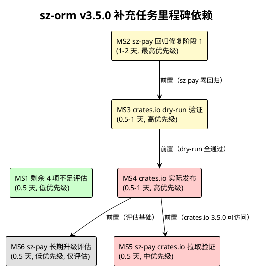

# sz-orm v3.5.0 补充任务规划文档

> 版本：v3.5.0-supplement（sz-pay 回归修复 + 剩余 4 项已知不足评估 + crates.io 实际发布）
> 基线：v3.5.0 主体（已完成：6 里程碑 / 28 主任务 / 115 子任务，6,751 passed / 0 failed / 253 ignored）
> 日期：2026-08-09
> 文档定位：补充编码任务规划（What to do），对应补充技术设计 `docs/spec/v3.5.0/design-supplement.md`（三项后续工作：§2.1 sz-pay 回归修复 + §2.2 剩余 4 项不足评估 + §2.3 crates.io 实际发布）
> 任务粒度：每个子任务可在 0.5-4 小时内完成，单个任务不超过 500 行代码变更
> 任务统计：30 主任务 / 54 子任务 / 6 里程碑
> 命名约定：主任务 MSX-TY，子任务 MSX-TY-ZW（X=里程碑号，Y=主任务号，Z=子任务号）
> 状态：pending / in_progress / completed / cancelled
> 优先级：high / medium / low
> 工程化铁律：禁止占位实现 / unsafe 零容忍 / 参数化查询 / API 向后兼容 / Feature 隔离 / 五方言行为一致 / ADR-0001 不改上游 / 审计合规铁律（每结论附 file:line 证据）/ 编译时 `$env:RUST_MIN_STACK="67108864"` + `$env:CARGO_INCREMENTAL=0` / 严禁 PowerShell 替换操作（用 Node.js 脚本）

---

# 1. 任务总览

## 1.1 任务统计

| 里程碑 | 方向 | 主任务数 | 子任务数 | 关联验收 |
|--------|------|---------|---------|---------|
| MS1 剩余 4 项不足评估 | §2.2 | 5 | 9 | AC-GAP-1~3 |
| MS2 sz-pay 回归修复阶段 1 | §2.1 方案 A | 7 | 14 | AC-SZPAY-1~7 |
| MS3 crates.io dry-run 验证 | §2.3.3 | 5 | 9 | AC-PUB-1 + AC-PUB-7 |
| MS4 crates.io 实际发布 | §2.3.4 | 8 | 13 | AC-PUB-2~4 |
| MS5 sz-pay crates.io 拉取验证 | §2.3.5 | 3 | 4 | AC-PUB-5~6 |
| MS6 sz-pay 长期升级评估 | §2.1 方案 B | 2 | 5 | 长期目标（非本周期验收） |
| **合计** | — | **30** | **54** | **AC-SZPAY-1~7 + AC-GAP-1~3 + AC-PUB-1~7** |

## 1.2 里程碑分布

```
MS1 剩余 4 项不足评估 (0.5 天, 低优先级, 低风险)
    │
    ├──→ MS2 sz-pay 回归修复阶段 1 (1-2 天, 最高优先级, 中风险)
    │        │
    │        └──→ MS3 crates.io dry-run 验证 (0.5-1 天, 高优先级, 低风险)
    │                 │
    │                 └──→ MS4 crates.io 实际发布 (0.5-1 天, 高优先级, 中风险)
    │                          │
    │                          └──→ MS5 sz-pay crates.io 拉取验证 (0.5 天, 中优先级, 低风险)
    │
    └──→ MS6 sz-pay 长期升级评估 (0.5 天, 低优先级, 中风险, 仅评估不执行)
```

- **关键路径**：MS1（并行）→ MS2 → MS3 → MS4 → MS5（串行 3-4.5 天）
- **并行机会**：
  - MS1 与 MS2 可并行（评估不阻塞修复）
  - MS6 与 MS2-MS5 可并行（仅评估不执行）
  - MS3 内部：D2-D3 编译测试 / D4-D5 文档安全 可并行
  - MS4 内部：第 1 批 28 包可并行发布
- **总周期**：关键路径 3-4.5 天；并行开发下可压缩至 2-3 天
- **长期目标**：MS6 阶段 2（方案 B）需 sz-rust 维护者接受 PR，不阻塞当前周期

## 1.3 任务总览表

| 任务 ID | 描述 | 里程碑 | 状态 | 优先级 | 工作量 |
|---------|------|--------|------|--------|--------|
| MS1-T1 | §6.1 生态成熟度评估 | MS1 | pending | low | S |
| MS1-T1-1 | 评估表达式覆盖度对齐状态 | MS1 | pending | low | S |
| MS1-T1-2 | 记录生态成熟度长期目标 | MS1 | pending | low | S |
| MS1-T2 | §6.2 文档完整度状态确认 | MS1 | pending | medium | S |
| MS1-T2-1 | 查主体 tasks.md M6-T3 完成状态 | MS1 | pending | medium | S |
| MS1-T2-2 | 运行 cargo doc 验证零警告 | MS1 | pending | medium | S |
| MS1-T3 | §6.3 社区规模评估 | MS1 | pending | low | S |
| MS1-T3-1 | 评估社区规模现状 | MS1 | pending | low | S |
| MS1-T3-2 | 记录社区规模长期目标 | MS1 | pending | low | S |
| MS1-T4 | §6.4 生产案例评估 | MS1 | pending | low | S |
| MS1-T4-1 | 评估生产案例现状 | MS1 | pending | low | S |
| MS1-T4-2 | 记录生产案例长期目标 | MS1 | pending | low | S |
| MS1-T5 | 改进决策汇总 | MS1 | pending | medium | S |
| MS1-T5-1 | 生成 4 项不足改进决策汇总表 | MS1 | pending | medium | S |
| MS2-T1 | 移除 path 依赖和 patch（S1-S2） | MS2 | pending | high | S |
| MS2-T1-1 | S1 移除 7 个 sz-orm-* path 依赖 | MS2 | pending | high | S |
| MS2-T1-2 | S2 移除 17 个 patch 覆盖 | MS2 | pending | high | S |
| MS2-T1-3 | 验证 cargo tree 仅一个 sz-orm-core 版本 | MS2 | pending | high | S |
| MS2-T2 | 替换 import 路径（S3） | MS2 | pending | high | M |
| MS2-T2-1 | S3 全局替换 use sz_orm_core:: → use sz_rust_core::orm:: | MS2 | pending | high | M |
| MS2-T2-2 | 验证 cargo check 错误数递减 | MS2 | pending | high | S |
| MS2-T3 | 适配 from_value 方法（S4） | MS2 | pending | high | M |
| MS2-T3-1 | 查 sz-orm-core 2.3.0 源码确认 from_value 签名 | MS2 | pending | high | S |
| MS2-T3-2 | S4 适配 from_value 调用点（~15 处） | MS2 | pending | high | M |
| MS2-T3-3 | 验证 from_value 错误消除 | MS2 | pending | high | S |
| MS2-T4 | 适配切片类型（S5） | MS2 | pending | high | S |
| MS2-T4-1 | S5 适配 &Vec<Value>/&[Value; N] → 2.x 期望类型（~4 处） | MS2 | pending | high | S |
| MS2-T4-2 | 验证切片类型错误消除 | MS2 | pending | high | S |
| MS2-T5 | 编译验证（S6） | MS2 | pending | high | S |
| MS2-T5-1 | S6 cargo check 零错误 | MS2 | pending | high | S |
| MS2-T6 | 测试验证（S7） | MS2 | pending | high | S |
| MS2-T6-1 | S7 cargo test 全通过 | MS2 | pending | high | S |
| MS2-T6-2 | 确认与既有基线一致（零回归） | MS2 | pending | high | S |
| MS2-T7 | ADR-0001 合规验证 | MS2 | pending | high | S |
| MS2-T7-1 | 确认 sz-orm 仓库未修改 | MS2 | pending | high | S |
| MS2-T7-2 | 确认 sz-rust 仓库未修改 | MS2 | pending | high | S |
| MS3-T1 | 环境设置（D1） | MS3 | pending | high | S |
| MS3-T1-1 | D1 设置编译环境变量 | MS3 | pending | high | S |
| MS3-T2 | 编译测试验证（D2-D3） | MS3 | pending | high | S |
| MS3-T2-1 | D2 cargo check 全工作空间 | MS3 | pending | high | S |
| MS3-T2-2 | D3 cargo test 全工作空间 | MS3 | pending | high | S |
| MS3-T3 | 文档和安全验证（D4-D5） | MS3 | pending | high | S |
| MS3-T3-1 | D4 cargo doc 零警告 | MS3 | pending | high | S |
| MS3-T3-2 | D5 cargo audit + cargo deny check | MS3 | pending | high | S |
| MS3-T4 | 逐包 dry-run（D6） | MS3 | pending | high | M |
| MS3-T4-1 | D6 第 1 批 28 包 dry-run | MS3 | pending | high | M |
| MS3-T4-2 | D6 第 2 批 3 包 dry-run | MS3 | pending | high | S |
| MS3-T4-3 | D6 第 3 批 10 包 dry-run | MS3 | pending | high | M |
| MS3-T4-4 | D6 第 4 批 2 包 dry-run | MS3 | pending | high | S |
| MS3-T4-5 | D6 第 5 批 1 包 dry-run | MS3 | pending | high | S |
| MS3-T5 | dry-run 结果汇总（D7） | MS3 | pending | high | S |
| MS3-T5-1 | D7 确认 44 包全通过 | MS3 | pending | high | S |
| MS4-T1 | token 设置（P1） | MS4 | pending | high | S |
| MS4-T1-1 | P1 设置 CARGO_REGISTRY_TOKEN | MS4 | pending | high | S |
| MS4-T2 | 第 1 批发布（P2） | MS4 | pending | high | M |
| MS4-T2-1 | P2 发布 28 个无内部依赖包 | MS4 | pending | high | M |
| MS4-T2-2 | 验证第 1 批 crates.io 页面可访问 | MS4 | pending | high | S |
| MS4-T3 | 第 2 批发布（P3） | MS4 | pending | high | S |
| MS4-T3-1 | P3 发布 back/core/graphql 3 个包 | MS4 | pending | high | S |
| MS4-T3-2 | 验证第 2 批 crates.io 页面可访问 | MS4 | pending | high | S |
| MS4-T4 | 第 3 批发布（P4） | MS4 | pending | high | M |
| MS4-T4-1 | P4 发布 10 个依赖 core 的包 | MS4 | pending | high | M |
| MS4-T4-2 | 验证第 3 批 crates.io 页面可访问 | MS4 | pending | high | S |
| MS4-T5 | 第 4 批发布（P5） | MS4 | pending | high | S |
| MS4-T5-1 | P5 发布 sqlx/vector 2 个包 | MS4 | pending | high | S |
| MS4-T5-2 | 验证第 4 批 crates.io 页面可访问 | MS4 | pending | high | S |
| MS4-T6 | 第 5 批发布（P6） | MS4 | pending | high | S |
| MS4-T6-1 | P6 发布 dtx 1 个包 | MS4 | pending | high | S |
| MS4-T6-2 | 验证第 5 批 crates.io 页面可访问 | MS4 | pending | high | S |
| MS4-T7 | 发布验证（P7） | MS4 | pending | high | S |
| MS4-T7-1 | P7 验证 44 包 crates.io 版本 = 3.5.0 | MS4 | pending | high | S |
| MS4-T8 | 发布清单生成（P8） | MS4 | pending | medium | S |
| MS4-T8-1 | P8 生成 publish-manifest.md | MS4 | pending | medium | S |
| MS5-T1 | 添加 crates.io 依赖（V1） | MS5 | pending | medium | S |
| MS5-T1-1 | V1 sz-pay Cargo.toml 添加 sz-orm-* 3.5.0 crates.io 依赖 | MS5 | pending | medium | S |
| MS5-T2 | 编译测试验证（V2-V3） | MS5 | pending | medium | S |
| MS5-T2-1 | V2 sz-pay cargo check | MS5 | pending | medium | S |
| MS5-T2-2 | V3 sz-pay cargo test 零回归 | MS5 | pending | medium | S |
| MS5-T3 | 恢复阶段 1 状态（V4） | MS5 | pending | high | S |
| MS5-T3-1 | V4 sz-pay Cargo.toml 恢复到阶段 1 状态 | MS5 | pending | high | S |
| MS6-T1 | 阶段 2 升级方案评估 | MS6 | pending | low | S |
| MS6-T1-1 | 评估 sz-rust-core 0.6.7 → 0.7.0 升级工作量 | MS6 | pending | low | S |
| MS6-T1-2 | 评估 sz-rust-core 0.7.0 其他 Breaking Change | MS6 | pending | low | S |
| MS6-T1-3 | 生成 PR 草案说明 | MS6 | pending | low | S |
| MS6-T2 | 长期目标记录 | MS6 | pending | low | S |
| MS6-T2-1 | 记录阶段 2 实施步骤（L1-L7） | MS6 | pending | low | S |
| MS6-T2-2 | 记录长期目标到文档 | MS6 | pending | low | S |

---

# 2. MS1 剩余 4 项不足评估（§2.2，AC-GAP-1~3）

> **目标**：评估 v3.5.0 剩余 4 项已知不足（§6.1 生态成熟度 / §6.2 文档完整度 / §6.3 社区规模 / §6.4 生产案例）的可改进性，确认 §6.2 已由主体 design.md M6-T3 覆盖，§6.1/6.3/6.4 为非本版本范畴记录为长期目标。
> **周期**：0.5 天
> **优先级**：低（评估工作，不阻塞其他里程碑）
> **关联设计**：design-supplement.md §2.2
> **关联验收**：AC-GAP-1~3

## 2.1 MS1-T1：§6.1 生态成熟度评估

- [ ] **MS1-T1-1** 评估表达式覆盖度对齐状态：查 `packages/sz-orm-core/src/typed_ast.rs:807` 确认 46 种表达式已对齐 Diesel，剩余差距在生态层面（社区组件/教程/第三方集成/生产验证）
  - 描述：确认 v3.5.0 已在代码层面（表达式覆盖度）对齐 Diesel，剩余差距属于生态成熟度（非代码）
  - 输入/前置条件：v3.5.0 主体已完成，[typed_ast.rs:807](file:///E:/vue/test/鲜视达/rust/sz-orm/packages/sz-orm-core/src/typed_ast.rs#L807) 46 种表达式已实现
  - 输出/验收标准：评估结论"表达式覆盖度已对齐，剩余为生态差距"，附 file:line 证据
  - 涉及文件：`packages/sz-orm-core/src/typed_ast.rs`（只读验证）
  - 工作量：S
  - 依赖：无

- [ ] **MS1-T1-2** 记录生态成熟度长期目标：在评估文档中记录"§6.1 生态成熟度非本版本范畴，随 sz-orm 社区成长自然改善"，附长期改进方向（持续维护 typed_ast DSL / 积累生产案例 / 完善文档教程 / 鼓励社区贡献）
  - 描述：将 §6.1 评估结论记录为长期目标，不纳入本补充设计
  - 输入/前置条件：MS1-T1-1 完成
  - 输出/验收标准：长期目标记录完整，含 4 条改进方向
  - 涉及文件：`docs/spec/v3.5.0/tasks-supplement.md`（本文件记录）
  - 工作量：S
  - 依赖：MS1-T1-1

## 2.2 MS1-T2：§6.2 文档完整度状态确认

- [ ] **MS1-T2-1** 查主体 tasks.md M6-T3 完成状态：阅读 `docs/spec/v3.5.0/tasks.md` M6-T3（313 pub API 文档补齐）的 checkbox 状态，确认是否已完成
  - 描述：确认 §6.2 文档完整度改进已由主体 design.md M6-T3 覆盖，不重复设计
  - 输入/前置条件：主体 tasks.md 存在
  - 输出/验收标准：M6-T3 完成状态明确（completed/pending），若已完成则 §6.2 应从剩余不足中移除
  - 涉及文件：`docs/spec/v3.5.0/tasks.md`（只读）
  - 工作量：S
  - 依赖：无

- [ ] **MS1-T2-2** 运行 cargo doc 验证零警告：执行 `cargo doc --workspace --no-deps --all-features` 确认文档构建通过，验证 doc-completion feature 状态
  - 描述：通过实际编译验证文档完整度现状
  - 输入/前置条件：sz-orm workspace 可编译
  - 输出/验收标准：cargo doc 输出零警告或记录剩余警告数，附命令输出证据
  - 涉及文件：`packages/sz-orm-core/Cargo.toml:42`（doc-completion feature）
  - 工作量：S
  - 依赖：MS1-T2-1

## 2.3 MS1-T3：§6.3 社区规模评估

- [ ] **MS1-T3-1** 评估社区规模现状：确认 GitHub Stars 少、社区贡献者少（对比 Diesel/SQLx 12k+ stars，SeaORM 6k+ stars），属于社区运营/推广范畴
  - 描述：客观评估 §6.3 社区规模现状，确认非代码改进可解决
  - 输入/前置条件：对比分析文档 §6.3 存在
  - 输出/验收标准：评估结论"社区规模属于社区运营范畴，非代码工作"，附对比数据
  - 涉及文件：`docs/sz-orm与同类产品对比分析.md:915`（只读）
  - 工作量：S
  - 依赖：无

- [ ] **MS1-T3-2** 记录社区规模长期目标：记录"§6.3 社区规模非本版本范畴，需社区运营（README 优化/示例丰富/博客推广/会议分享等）"
  - 描述：将 §6.3 评估结论记录为长期目标
  - 输入/前置条件：MS1-T3-1 完成
  - 输出/验收标准：长期目标记录完整
  - 涉及文件：`docs/spec/v3.5.0/tasks-supplement.md`（本文件记录）
  - 工作量：S
  - 依赖：MS1-T3-1

## 2.4 MS1-T4：§6.4 生产案例评估

- [ ] **MS1-T4-1** 评估生产案例现状：确认仅 sz-pay 一个生产用户（78 个文件引用），属于外部采纳范畴，spec.md §1.4 第 11 条明确跳过
  - 描述：客观评估 §6.4 生产案例现状，确认非代码改进可解决
  - 输入/前置条件：对比分析文档 §6.4 + spec.md §1.4 存在
  - 输出/验收标准：评估结论"生产案例需外部项目主动采纳，非代码工作"，附 spec.md §1.4 第 11 条证据
  - 涉及文件：`docs/sz-orm与同类产品对比分析.md:916` + `docs/spec/v3.5.0/spec.md`（只读）
  - 工作量：S
  - 依赖：无

- [ ] **MS1-T4-2** 记录生产案例长期目标：记录"§6.4 生产案例非本版本范畴，需外部项目采纳"，并说明与 §2.1 sz-pay 回归修复的关系（方案 A 维护生产案例稳定性，方案 B 让 sz-pay 成为 3.5.0 生产验证案例）
  - 描述：将 §6.4 评估结论记录为长期目标，关联 sz-pay 回归修复
  - 输入/前置条件：MS1-T4-1 完成
  - 输出/验收标准：长期目标记录完整，含与 §2.1 关系说明
  - 涉及文件：`docs/spec/v3.5.0/tasks-supplement.md`（本文件记录）
  - 工作量：S
  - 依赖：MS1-T4-1

## 2.5 MS1-T5：改进决策汇总

- [ ] **MS1-T5-1** 生成 4 项不足改进决策汇总表：汇总 §6.1~§6.4 评估结论，生成决策表（不足编号 / 性质 / 本版本决策 / 依据），确认 §6.2 已由主体覆盖，§6.1/6.3/6.4 为非本版本范畴
  - 描述：汇总 4 项不足评估结论，形成决策表
  - 输入/前置条件：MS1-T1~MS1-T4 完成
  - 输出/验收标准：决策汇总表 4 行完整，每行含性质/决策/依据，满足 AC-GAP-1~3
  - 涉及文件：`docs/spec/v3.5.0/tasks-supplement.md`（本文件记录）
  - 工作量：S
  - 依赖：MS1-T1-2 + MS1-T2-2 + MS1-T3-2 + MS1-T4-2

---

# 3. MS2 sz-pay 回归修复阶段 1（§2.1 方案 A，S1-S7，AC-SZPAY-1~7）

> **目标**：sz-pay 统一使用 sz-rust-core facade 2.x 类型，移除 sz-orm-* 3.5.0 直接依赖和 patch，消除 49 编译错误，恢复 sz-pay 编译和测试零回归，不修改 sz-orm / sz-rust 上游仓库（ADR-0001）。
> **周期**：1-2 天
> **优先级**：最高（解除 sz-pay 编译阻塞）
> **关联设计**：design-supplement.md §2.1 方案 A
> **关联验收**：AC-SZPAY-1~7
> **关键路径**：sz-pay 路径 `E:\vue\test\sz-pay\server\sz-rust`

## 3.1 MS2-T1：移除 path 依赖和 patch（S1-S2）

- [ ] **MS2-T1-1** S1 移除 7 个 sz-orm-* 3.5.0 path 依赖：编辑 `E:\vue\test\sz-pay\server\sz-rust\Cargo.toml` 第 27-33 行，移除 [dependencies] 中 sz-orm-core/sqlx/oracle/mssql/ai/config/auth/macros/queue 等 7 个 sz-orm-* path 引用（使用 Node.js 脚本精确删除，严禁 PowerShell 替换操作）
  - 描述：移除 sz-pay 对 sz-orm-* 3.5.0 的直接 path 依赖
  - 输入/前置条件：sz-pay Cargo.toml 存在，第 27-33 行为 sz-orm-* path 引用
  - 输出/验收标准：sz-pay Cargo.toml [dependencies] 无 sz-orm-* path 引用，满足 AC-SZPAY-3
  - 涉及文件：`E:\vue\test\sz-pay\server\sz-rust\Cargo.toml:27-33`
  - 工作量：S
  - 依赖：无

- [ ] **MS2-T1-2** S2 移除 17 个 [patch.crates-io] sz-orm-* 覆盖：编辑 `E:\vue\test\sz-pay\server\sz-rust\Cargo.toml` 第 169-186 行，移除 [patch.crates-io] 段中所有 sz-orm-* 覆盖（使用 Node.js 脚本精确删除）
  - 描述：移除 sz-pay 的 [patch.crates-io] sz-orm-* 覆盖（patch 不生效根因：3.5.0 不满足 "2.1.0" 的 semver 约束 >=2.1.0, <3.0.0）
  - 输入/前置条件：MS2-T1-1 完成，sz-pay Cargo.toml 第 169-186 行为 patch 覆盖
  - 输出/验收标准：sz-pay Cargo.toml 无 [patch.crates-io] sz-orm-* 覆盖，满足 AC-SZPAY-4
  - 涉及文件：`E:\vue\test\sz-pay\server\sz-rust\Cargo.toml:169-186`
  - 工作量：S
  - 依赖：MS2-T1-1

- [ ] **MS2-T1-3** 验证 cargo tree 仅一个 sz-orm-core 版本：在 sz-pay 目录执行 `cargo tree -i sz-orm-core` 确认依赖图仅存在 sz-orm-core 2.x 一个版本（经 sz-rust-core 0.6.7 间接拉取）
  - 描述：验证移除 path 依赖和 patch 后，sz-orm-core 双版本冲突消除
  - 输入/前置条件：MS2-T1-2 完成
  - 输出/验收标准：cargo tree 输出仅一个 sz-orm-core 版本（2.x），附命令输出证据
  - 涉及文件：sz-pay Cargo.toml（验证）
  - 工作量：S
  - 依赖：MS2-T1-2

## 3.2 MS2-T2：替换 import 路径（S3）

- [ ] **MS2-T2-1** S3 全局替换 use sz_orm_core:: → use sz_rust_core::orm::：在 sz-pay 的 `repositories/*.rs` + `services/*.rs` 中，将所有 `use sz_orm_core::X` 替换为 `use sz_rust_core::orm::X`（X = Value/Model/Repository 等），使用 Node.js 脚本全局替换（严禁 PowerShell 替换操作）
  - 描述：将 sz-pay 业务代码的 ORM 类型 import 从 sz-orm-core 3.5.0 改为 sz-rust-core facade 2.x
  - 输入/前置条件：MS2-T1-3 完成，sz-rust-core 0.6.7 facade 完整（[orm.rs:31](file:///C:/Users/Administrator/.cargo/registry/src/index.crates.io-1949cf8c6b5b557f/sz-rust-core-0.6.7/src/orm.rs#L31)）
  - 输出/验收标准：sz-pay 代码无 `use sz_orm_core::` 直接 import，满足 AC-SZPAY-5
  - 涉及文件：`E:\vue\test\sz-pay\server\sz-rust\src\repositories\*.rs` + `services\*.rs`
  - 工作量：M
  - 依赖：MS2-T1-3

- [ ] **MS2-T2-2** 验证 cargo check 错误数递减：在 sz-pay 目录执行 `cargo check`，确认错误数从 49 递减（Value 类型双源冲突 ~30 个消除），记录剩余错误数和分类
  - 描述：验证 import 替换后 Value 类型双源冲突消除
  - 输入/前置条件：MS2-T2-1 完成
  - 输出/验收标准：cargo check 错误数 < 49，剩余错误为 from_value 缺失 + 切片类型，附命令输出证据
  - 涉及文件：sz-pay 代码（验证）
  - 工作量：S
  - 依赖：MS2-T2-1

## 3.3 MS2-T3：适配 from_value 方法（S4）

- [ ] **MS2-T3-1** 查 sz-orm-core 2.3.0 源码确认 from_value 签名：阅读 `C:\Users\Administrator\.cargo\registry\src\index.crates.io-1949cf8c6b5b557f\sz-orm-core-2.3.0\src\value.rs`，grep `from_value` 确认 2.x 的方法签名（参数/返回值/trait 归属）
  - 描述：确认 sz-orm-core 2.x 的 from_value 方法签名，为适配调用点提供依据
  - 输入/前置条件：sz-orm-core 2.3.0 源码在 cargo registry 缓存中
  - 输出/验收标准：from_value 2.x 签名明确（方法位置/参数/返回值），附 file:line 证据
  - 涉及文件：`C:\Users\Administrator\.cargo\registry\src\index.crates.io-1949cf8c6b5b557f\sz-orm-core-2.3.0\src\value.rs`（只读）
  - 工作量：S
  - 依赖：MS2-T2-2

- [ ] **MS2-T3-2** S4 适配 from_value 调用点（~15 处）：在 sz-pay 的 `repositories/order.rs`（~8 处）+ `repositories/channel.rs` + `services/cashier_service.rs` 等约 15 处，将 from_value 调用适配为 2.x API 签名（可能从 `PayOrder::from_value(row)` 改为 `FromQueryResult::from_query_result(row)` 或类似 2.x API）
  - 描述：适配 sz-pay 的 from_value 调用为 sz-orm-core 2.x API
  - 输入/前置条件：MS2-T3-1 完成，from_value 2.x 签名已知
  - 输出/验收标准：sz-pay 所有 from_value 调用适配 2.x API
  - 涉及文件：`E:\vue\test\sz-pay\server\sz-rust\src\repositories\order.rs:114` + `channel.rs` + `services\cashier_service.rs` 等
  - 工作量：M
  - 依赖：MS2-T3-1

- [ ] **MS2-T3-3** 验证 from_value 错误消除：在 sz-pay 目录执行 `cargo check`，确认 from_value 相关错误（E0599 no method named from_value）全部消除
  - 描述：验证 from_value 适配后错误消除
  - 输入/前置条件：MS2-T3-2 完成
  - 输出/验收标准：cargo check 无 from_value 相关错误，附命令输出证据
  - 涉及文件：sz-pay 代码（验证）
  - 工作量：S
  - 依赖：MS2-T3-2

## 3.4 MS2-T4：适配切片类型（S5）

- [ ] **MS2-T4-1** S5 适配 &Vec<Value>/&[Value; N] → 2.x 期望类型（~4 处）：在 sz-pay 的 `repositories/base.rs:365` 等约 4 处，将切片类型适配为 2.x 期望的参数类型（`&Vec<Value>` / `&[Value; N]` / `&[Value]` 互转）
  - 描述：适配 sz-pay 的切片类型为 sz-orm-core 2.x 期望类型
  - 输入/前置条件：MS2-T3-3 完成
  - 输出/验收标准：sz-pay 所有切片类型适配 2.x 期望
  - 涉及文件：`E:\vue\test\sz-pay\server\sz-rust\src\repositories\base.rs:365` 等 ~4 处
  - 工作量：S
  - 依赖：MS2-T3-3

- [ ] **MS2-T4-2** 验证切片类型错误消除：在 sz-pay 目录执行 `cargo check`，确认切片类型相关错误（E0308 expected &[Value], found &Vec<Value>）全部消除
  - 描述：验证切片类型适配后错误消除
  - 输入/前置条件：MS2-T4-1 完成
  - 输出/验收标准：cargo check 无切片类型相关错误，附命令输出证据
  - 涉及文件：sz-pay 代码（验证）
  - 工作量：S
  - 依赖：MS2-T4-1

## 3.5 MS2-T5：编译验证（S6）

- [ ] **MS2-T5-1** S6 cargo check 零错误：在 sz-pay 目录执行 `$env:RUST_MIN_STACK="67108864"; $env:CARGO_INCREMENTAL=0; cargo check`，确认编译零错误
  - 描述：验证 sz-pay 阶段 1 修复后编译通过
  - 输入/前置条件：MS2-T4-2 完成
  - 输出/验收标准：cargo check 输出 "0 errors"，满足 AC-SZPAY-1，附命令输出证据
  - 涉及文件：sz-pay 代码（验证）
  - 工作量：S
  - 依赖：MS2-T4-2

## 3.6 MS2-T6：测试验证（S7）

- [ ] **MS2-T6-1** S7 cargo test 全通过：在 sz-pay 目录执行 `cargo test`，确认所有测试通过
  - 描述：验证 sz-pay 阶段 1 修复后测试通过
  - 输入/前置条件：MS2-T5-1 完成
  - 输出/验收标准：cargo test 全通过，附命令输出证据
  - 涉及文件：sz-pay 代码（验证）
  - 工作量：S
  - 依赖：MS2-T5-1

- [ ] **MS2-T6-2** 确认与既有基线一致（零回归）：对比 sz-pay 阶段 1 前后的测试数和测试结果，确认测试数一致、全通过，零回归
  - 描述：确认 sz-pay 测试零回归
  - 输入/前置条件：MS2-T6-1 完成，sz-pay 既有测试基线已记录
  - 输出/验收标准：测试数与基线一致，全通过，满足 AC-SZPAY-2，附对比证据
  - 涉及文件：sz-pay 代码（验证）
  - 工作量：S
  - 依赖：MS2-T6-1

## 3.7 MS2-T7：ADR-0001 合规验证

- [ ] **MS2-T7-1** 确认 sz-orm 仓库未修改：在 sz-orm 目录执行 `git diff --name-only HEAD`，确认无文件变更
  - 描述：验证 ADR-0001 合规（sz-orm 上游仓库未修改）
  - 输入/前置条件：MS2-T6-2 完成
  - 输出/验收标准：git diff 无输出，满足 AC-SZPAY-6，附命令输出证据
  - 涉及文件：sz-orm 仓库（验证）
  - 工作量：S
  - 依赖：MS2-T6-2

- [ ] **MS2-T7-2** 确认 sz-rust 仓库未修改：在 sz-rust 目录（如有）执行 `git diff --name-only HEAD`，确认无文件变更
  - 描述：验证 ADR-0001 合规（sz-rust 上游仓库未修改）
  - 输入/前置条件：MS2-T7-1 完成
  - 输出/验收标准：git diff 无输出，满足 AC-SZPAY-7，附命令输出证据
  - 涉及文件：sz-rust 仓库（验证，如有）
  - 工作量：S
  - 依赖：MS2-T7-1

---

# 4. MS3 crates.io dry-run 验证（§2.3.3，D1-D7，AC-PUB-1 + AC-PUB-7）

> **目标**：在实际发布前，逐包执行 `cargo publish --dry-run` 验证 44 包元数据/依赖/内容无误，不实际上传 crates.io，确认全工作空间编译/测试/文档/安全审计通过。
> **周期**：0.5-1 天
> **优先级**：高（发布前置验证）
> **关联设计**：design-supplement.md §2.3.3
> **关联验收**：AC-PUB-1 + AC-PUB-7

## 4.1 MS3-T1：环境设置（D1）

- [ ] **MS3-T1-1** D1 设置编译环境变量：设置 `$env:CARGO_INCREMENTAL=0; $env:RUST_MIN_STACK="67108864"`，确认环境变量生效
  - 描述：设置编译环境变量，避免栈溢出和增量编译问题
  - 输入/前置条件：无
  - 输出/验收标准：环境变量生效，附 PowerShell 命令输出证据
  - 涉及文件：无（环境变量设置）
  - 工作量：S
  - 依赖：无

## 4.2 MS3-T2：编译测试验证（D2-D3）

- [ ] **MS3-T2-1** D2 cargo check 全工作空间：在 sz-orm 目录执行 `cargo check --workspace --all-targets`，确认零错误
  - 描述：确认 sz-orm 全工作空间编译通过
  - 输入/前置条件：MS3-T1-1 完成
  - 输出/验收标准：cargo check 零错误，附命令输出证据
  - 涉及文件：sz-orm workspace（验证）
  - 工作量：S
  - 依赖：MS3-T1-1

- [ ] **MS3-T2-2** D3 cargo test 全工作空间：在 sz-orm 目录执行 `cargo test --workspace -j 2 --no-fail-fast`，确认 6,751 passed / 0 failed / 253 ignored
  - 描述：确认 sz-orm 全工作空间测试通过，与 v3.5.0 主体基线一致
  - 输入/前置条件：MS3-T2-1 完成
  - 输出/验收标准：cargo test 输出 6,751 passed / 0 failed / 253 ignored，附命令输出证据
  - 涉及文件：sz-orm workspace（验证）
  - 工作量：S
  - 依赖：MS3-T2-1

## 4.3 MS3-T3：文档和安全验证（D4-D5）

- [ ] **MS3-T3-1** D4 cargo doc 零警告：在 sz-orm 目录执行 `cargo doc --workspace --no-deps --all-features`，确认文档构建零警告
  - 描述：确认 sz-orm 文档构建通过
  - 输入/前置条件：MS3-T2-1 完成（可与 MS3-T2-2 并行）
  - 输出/验收标准：cargo doc 零警告，附命令输出证据
  - 涉及文件：sz-orm workspace（验证）
  - 工作量：S
  - 依赖：MS3-T2-1

- [ ] **MS3-T3-2** D5 cargo audit + cargo deny check：在 sz-orm 目录执行 `cargo audit` + `cargo deny check`，确认零漏洞
  - 描述：确认 sz-orm 安全审计通过，满足 AC-PUB-7
  - 输入/前置条件：MS3-T2-1 完成（可与 MS3-T3-1 并行）
  - 输出/验收标准：cargo audit + cargo deny check 零漏洞，满足 AC-PUB-7，附命令输出证据
  - 涉及文件：sz-orm workspace（验证）
  - 工作量：S
  - 依赖：MS3-T2-1

## 4.4 MS3-T4：逐包 dry-run（D6）

- [ ] **MS3-T4-1** D6 第 1 批 28 包 dry-run：按拓扑顺序对第 1 批 28 个无内部依赖包逐个执行 `cargo publish --dry-run -p <pkg>`（sz-orm-audit/auth/batch/config/crypto/es/graph/grpc/health/lc/limit/logger/macros/masking/mig/mqtt/postgis/queue/rw/scheduler/search/sharding/sql-validator/storage/timeseries/tracing/wasm/websocket）
  - 描述：验证第 1 批 28 包 dry-run 通过
  - 输入/前置条件：MS3-T3-2 完成
  - 输出/验收标准：28 包 dry-run 全通过，附每包命令输出证据
  - 涉及文件：sz-orm workspace（验证）
  - 工作量：M
  - 依赖：MS3-T3-2

- [ ] **MS3-T4-2** D6 第 2 批 3 包 dry-run：对第 2 批 3 个包（sz-orm-back/core/graphql）执行 `cargo publish --dry-run -p <pkg>`
  - 描述：验证第 2 批 3 包 dry-run 通过（依赖第 1 批）
  - 输入/前置条件：MS3-T4-1 完成
  - 输出/验收标准：3 包 dry-run 全通过，附每包命令输出证据
  - 涉及文件：sz-orm workspace（验证）
  - 工作量：S
  - 依赖：MS3-T4-1

- [ ] **MS3-T4-3** D6 第 3 批 10 包 dry-run：对第 3 批 10 个依赖 core 的包（sz-orm-actix/ai/axum/js/mssql/observability/oracle/python/query_builder/swagger）执行 `cargo publish --dry-run -p <pkg>`
  - 描述：验证第 3 批 10 包 dry-run 通过（依赖第 2 批）
  - 输入/前置条件：MS3-T4-2 完成
  - 输出/验收标准：10 包 dry-run 全通过，附每包命令输出证据
  - 涉及文件：sz-orm workspace（验证）
  - 工作量：M
  - 依赖：MS3-T4-2

- [ ] **MS3-T4-4** D6 第 4 批 2 包 dry-run：对第 4 批 2 个包（sz-orm-sqlx/vector）执行 `cargo publish --dry-run -p <pkg>`
  - 描述：验证第 4 批 2 包 dry-run 通过（依赖第 3 批）
  - 输入/前置条件：MS3-T4-3 完成
  - 输出/验收标准：2 包 dry-run 全通过，附每包命令输出证据
  - 涉及文件：sz-orm workspace（验证）
  - 工作量：S
  - 依赖：MS3-T4-3

- [ ] **MS3-T4-5** D6 第 5 批 1 包 dry-run：对第 5 批 1 个包（sz-orm-dtx）执行 `cargo publish --dry-run -p sz-orm-dtx`
  - 描述：验证第 5 批 1 包 dry-run 通过（依赖第 4 批）
  - 输入/前置条件：MS3-T4-4 完成
  - 输出/验收标准：1 包 dry-run 全通过，附命令输出证据
  - 涉及文件：sz-orm workspace（验证）
  - 工作量：S
  - 依赖：MS3-T4-4

## 4.5 MS3-T5：dry-run 结果汇总（D7）

- [ ] **MS3-T5-1** D7 确认 44 包全通过：收集 D6 所有 dry-run 结果，确认 44 包全通过，记录失败包及错误（如有），修复后重试
  - 描述：汇总 dry-run 结果，确认 44 包全通过，满足 AC-PUB-1
  - 输入/前置条件：MS3-T4-5 完成
  - 输出/验收标准：44/44 通过，满足 AC-PUB-1，附汇总证据
  - 涉及文件：sz-orm workspace（验证）
  - 工作量：S
  - 依赖：MS3-T4-5

---

# 5. MS4 crates.io 实际发布（§2.3.4，P1-P8，AC-PUB-2~4）

> **目标**：将 44 包按拓扑 5 批实际发布到 crates.io，每包版本 = 3.5.0，生成发布清单。
> **周期**：0.5-1 天
> **优先级**：高（实际发布）
> **关联设计**：design-supplement.md §2.3.4
> **关联验收**：AC-PUB-2~4
> **前置条件**：MS3 dry-run 全通过 + MS2 sz-pay 零回归

## 5.1 MS4-T1：token 设置（P1）

- [ ] **MS4-T1-1** P1 设置 CARGO_REGISTRY_TOKEN：设置 `$env:CARGO_REGISTRY_TOKEN="[REDACTED]"`，确认 token 生效
  - 描述：设置 crates.io 发布 token
  - 输入/前置条件：token 来自 [服务器信息.md:61](file:///E:/vue/test/鲜视达/服务器信息.md#L61)
  - 输出/验收标准：token 生效，附 PowerShell 命令输出证据
  - 涉及文件：无（环境变量设置）
  - 工作量：S
  - 依赖：MS3-T5-1 + MS2-T7-2

## 5.2 MS4-T2：第 1 批发布（P2）

- [ ] **MS4-T2-1** P2 发布 28 个无内部依赖包：按拓扑顺序对第 1 批 28 个包执行 `cargo publish -p <pkg>`（可并行），每包发布后确认 crates.io 页面可访问
  - 描述：发布第 1 批 28 个无内部依赖包到 crates.io
  - 输入/前置条件：MS4-T1-1 完成
  - 输出/验收标准：28 包 crates.io 页面可访问，版本 = 3.5.0
  - 涉及文件：sz-orm workspace（发布）
  - 工作量：M
  - 依赖：MS4-T1-1

- [ ] **MS4-T2-2** 验证第 1 批 crates.io 页面可访问：对第 1 批 28 个包执行 `curl https://crates.io/api/v1/crates/<pkg>` 确认版本 = 3.5.0
  - 描述：验证第 1 批发布成功
  - 输入/前置条件：MS4-T2-1 完成
  - 输出/验收标准：28 包 crates.io 版本 = 3.5.0，附 curl 输出证据
  - 涉及文件：sz-orm workspace（验证）
  - 工作量：S
  - 依赖：MS4-T2-1

## 5.3 MS4-T3：第 2 批发布（P3）

- [ ] **MS4-T3-1** P3 发布 back/core/graphql 3 个包：对第 2 批 3 个包（sz-orm-back/core/graphql）执行 `cargo publish -p <pkg>`
  - 描述：发布第 2 批 3 个包到 crates.io（依赖第 1 批）
  - 输入/前置条件：MS4-T2-2 完成
  - 输出/验收标准：3 包 crates.io 页面可访问，版本 = 3.5.0
  - 涉及文件：sz-orm workspace（发布）
  - 工作量：S
  - 依赖：MS4-T2-2

- [ ] **MS4-T3-2** 验证第 2 批 crates.io 页面可访问：对第 2 批 3 个包执行 `curl https://crates.io/api/v1/crates/<pkg>` 确认版本 = 3.5.0
  - 描述：验证第 2 批发布成功
  - 输入/前置条件：MS4-T3-1 完成
  - 输出/验收标准：3 包 crates.io 版本 = 3.5.0，附 curl 输出证据
  - 涉及文件：sz-orm workspace（验证）
  - 工作量：S
  - 依赖：MS4-T3-1

## 5.4 MS4-T4：第 3 批发布（P4）

- [ ] **MS4-T4-1** P4 发布 10 个依赖 core 的包：对第 3 批 10 个包（sz-orm-actix/ai/axum/js/mssql/observability/oracle/python/query_builder/swagger）执行 `cargo publish -p <pkg>`
  - 描述：发布第 3 批 10 个包到 crates.io（依赖第 2 批）
  - 输入/前置条件：MS4-T3-2 完成
  - 输出/验收标准：10 包 crates.io 页面可访问，版本 = 3.5.0
  - 涉及文件：sz-orm workspace（发布）
  - 工作量：M
  - 依赖：MS4-T3-2

- [ ] **MS4-T4-2** 验证第 3 批 crates.io 页面可访问：对第 3 批 10 个包执行 `curl https://crates.io/api/v1/crates/<pkg>` 确认版本 = 3.5.0
  - 描述：验证第 3 批发布成功
  - 输入/前置条件：MS4-T4-1 完成
  - 输出/验收标准：10 包 crates.io 版本 = 3.5.0，附 curl 输出证据
  - 涉及文件：sz-orm workspace（验证）
  - 工作量：S
  - 依赖：MS4-T4-1

## 5.5 MS4-T5：第 4 批发布（P5）

- [ ] **MS4-T5-1** P5 发布 sqlx/vector 2 个包：对第 4 批 2 个包（sz-orm-sqlx/vector）执行 `cargo publish -p <pkg>`
  - 描述：发布第 4 批 2 个包到 crates.io（依赖第 3 批）
  - 输入/前置条件：MS4-T4-2 完成
  - 输出/验收标准：2 包 crates.io 页面可访问，版本 = 3.5.0
  - 涉及文件：sz-orm workspace（发布）
  - 工作量：S
  - 依赖：MS4-T4-2

- [ ] **MS4-T5-2** 验证第 4 批 crates.io 页面可访问：对第 4 批 2 个包执行 `curl https://crates.io/api/v1/crates/<pkg>` 确认版本 = 3.5.0
  - 描述：验证第 4 批发布成功
  - 输入/前置条件：MS4-T5-1 完成
  - 输出/验收标准：2 包 crates.io 版本 = 3.5.0，附 curl 输出证据
  - 涉及文件：sz-orm workspace（验证）
  - 工作量：S
  - 依赖：MS4-T5-1

## 5.6 MS4-T6：第 5 批发布（P6）

- [ ] **MS4-T6-1** P6 发布 dtx 1 个包：对第 5 批 1 个包（sz-orm-dtx）执行 `cargo publish -p sz-orm-dtx`
  - 描述：发布第 5 批 1 个包到 crates.io（依赖第 4 批）
  - 输入/前置条件：MS4-T5-2 完成
  - 输出/验收标准：1 包 crates.io 页面可访问，版本 = 3.5.0
  - 涉及文件：sz-orm workspace（发布）
  - 工作量：S
  - 依赖：MS4-T5-2

- [ ] **MS4-T6-2** 验证第 5 批 crates.io 页面可访问：对 sz-orm-dtx 执行 `curl https://crates.io/api/v1/crates/sz-orm-dtx` 确认版本 = 3.5.0
  - 描述：验证第 5 批发布成功
  - 输入/前置条件：MS4-T6-1 完成
  - 输出/验收标准：1 包 crates.io 版本 = 3.5.0，附 curl 输出证据
  - 涉及文件：sz-orm workspace（验证）
  - 工作量：S
  - 依赖：MS4-T6-1

## 5.7 MS4-T7：发布验证（P7）

- [ ] **MS4-T7-1** P7 验证 44 包 crates.io 版本 = 3.5.0：对全部 44 包执行 `curl https://crates.io/api/v1/crates/<pkg>` 确认版本 = 3.5.0，满足 AC-PUB-2 + AC-PUB-3
  - 描述：验证 44 包全部发布成功，版本 = 3.5.0
  - 输入/前置条件：MS4-T6-2 完成
  - 输出/验收标准：44/44 包 crates.io 版本 = 3.5.0，满足 AC-PUB-2 + AC-PUB-3，附汇总证据
  - 涉及文件：sz-orm workspace（验证）
  - 工作量：S
  - 依赖：MS4-T6-2

## 5.8 MS4-T8：发布清单生成（P8）

- [ ] **MS4-T8-1** P8 生成 publish-manifest.md：生成 `docs/spec/v3.5.0/publish-manifest.md`，含 44 包的 crate 名 / 版本 / crates.io URL / 发布时间 / 拓扑批次 / SHA256 校验和 / 内部依赖列表，满足 AC-PUB-4
  - 描述：生成发布清单文档
  - 输入/前置条件：MS4-T7-1 完成
  - 输出/验收标准：`docs/spec/v3.5.0/publish-manifest.md` 存在，含 44 包完整信息，满足 AC-PUB-4
  - 涉及文件：`docs/spec/v3.5.0/publish-manifest.md`（新建）
  - 工作量：S
  - 依赖：MS4-T7-1

---

# 6. MS5 sz-pay crates.io 拉取验证（§2.3.5，V1-V4，AC-PUB-5~6）

> **目标**：v3.5.0 发布到 crates.io 后，验证 sz-pay 能从 crates.io 拉取 3.5.0 版本并零回归，然后恢复 sz-pay 到阶段 1 状态（生产继续用 2.x）。
> **周期**：0.5 天
> **优先级**：中（验证 crates.io 可用性）
> **关联设计**：design-supplement.md §2.3.5
> **关联验收**：AC-PUB-5~6
> **前置条件**：MS4 实际发布完成 + MS2 sz-pay 阶段 1 完成

## 6.1 MS5-T1：添加 crates.io 依赖（V1）

- [ ] **MS5-T1-1** V1 sz-pay Cargo.toml 添加 sz-orm-* 3.5.0 crates.io 依赖：编辑 sz-pay Cargo.toml，添加 sz-orm-* 3.5.0 的 crates.io 依赖（`version = "3.5.0"`，移除 path 引用），用于验证 crates.io 拉取
  - 描述：sz-pay 临时切换到 crates.io 3.5.0 依赖，验证拉取
  - 输入/前置条件：MS4-T7-1 完成（crates.io 3.5.0 可访问）+ MS2-T7-2 完成（阶段 1 状态）
  - 输出/验收标准：sz-pay Cargo.toml 含 sz-orm-* 3.5.0 crates.io 依赖
  - 涉及文件：`E:\vue\test\sz-pay\server\sz-rust\Cargo.toml`
  - 工作量：S
  - 依赖：MS4-T7-1 + MS2-T7-2

## 6.2 MS5-T2：编译测试验证（V2-V3）

- [ ] **MS5-T2-1** V2 sz-pay cargo check：在 sz-pay 目录执行 `cargo check`，确认从 crates.io 拉取的 3.5.0 可编译
  - 描述：验证 sz-pay 从 crates.io 拉取 3.5.0 编译通过
  - 输入/前置条件：MS5-T1-1 完成
  - 输出/验收标准：cargo check 零错误，附命令输出证据
  - 涉及文件：sz-pay 代码（验证）
  - 工作量：S
  - 依赖：MS5-T1-1

- [ ] **MS5-T2-2** V3 sz-pay cargo test 零回归：在 sz-pay 目录执行 `cargo test`，确认 3.5.0 行为与 sz-pay 既有基线一致，满足 AC-PUB-5
  - 描述：验证 sz-pay 从 crates.io 拉取 3.5.0 测试零回归
  - 输入/前置条件：MS5-T2-1 完成
  - 输出/验收标准：cargo test 全通过，满足 AC-PUB-5，附命令输出证据
  - 涉及文件：sz-pay 代码（验证）
  - 工作量：S
  - 依赖：MS5-T2-1

## 6.3 MS5-T3：恢复阶段 1 状态（V4）

- [ ] **MS5-T3-1** V4 sz-pay Cargo.toml 恢复到阶段 1 状态：编辑 sz-pay Cargo.toml，移除 sz-orm-* 3.5.0 直接依赖，保持 sz-rust-core facade 2.x（阶段 1 状态），满足 AC-PUB-6
  - 描述：恢复 sz-pay 生产依赖到阶段 1 状态（sz-rust-core facade 2.x），确保生产稳定
  - 输入/前置条件：MS5-T2-2 完成
  - 输出/验收标准：sz-pay Cargo.toml 恢复到阶段 1 状态（无 sz-orm-* 3.5.0 直接依赖），满足 AC-PUB-6，附 git diff 证据
  - 涉及文件：`E:\vue\test\sz-pay\server\sz-rust\Cargo.toml`
  - 工作量：S
  - 依赖：MS5-T2-2

---

# 7. MS6 sz-pay 长期升级评估（§2.1 方案 B，仅评估不执行）

> **目标**：评估 sz-rust-core 0.6.7 → 0.7.0 升级支持 sz-orm-core 3.5.0 的工作量和风险，生成 PR 草案说明，记录阶段 2 实施步骤（L1-L7）为长期目标，不实际执行。
> **周期**：0.5 天
> **优先级**：低（长期目标，不阻塞当前周期）
> **关联设计**：design-supplement.md §2.1 方案 B
> **关联验收**：无（长期目标，非本周期验收）
> **前置条件**：MS4 crates.io 发布完成（评估 sz-rust-core 升级到 3.5.0 的基础）

## 7.1 MS6-T1：阶段 2 升级方案评估

- [ ] **MS6-T1-1** 评估 sz-rust-core 0.6.7 → 0.7.0 升级工作量：评估 sz-rust-core Cargo.toml 升级 sz-orm-* 依赖到 3.5.0 + 代码适配 3.5.0 API 变更（from_value / Value / 切片类型）的工作量，参照 §1.3.2 差异分析
  - 描述：评估阶段 2 升级工作量
  - 输入/前置条件：MS4-T7-1 完成（crates.io 3.5.0 可访问）
  - 输出/验收标准：工作量评估结论（S/M/L），附差异分析依据
  - 涉及文件：`docs/spec/v3.5.0/design-supplement.md` §1.3.2（只读）
  - 工作量：S
  - 依赖：MS4-T7-1

- [ ] **MS6-T1-2** 评估 sz-rust-core 0.7.0 其他 Breaking Change：评估 sz-rust-core 0.6.7 → 0.7.0 除 sz-orm 升级外的其他 Breaking Change（如有），分析对 sz-pay 的影响
  - 描述：评估 sz-rust-core 0.7.0 其他 Breaking Change
  - 输入/前置条件：MS6-T1-1 完成
  - 输出/验收标准：Breaking Change 清单（或确认无其他 Breaking Change），附评估依据
  - 涉及文件：sz-rust-core 0.6.7 源码（只读）
  - 工作量：S
  - 依赖：MS6-T1-1

- [ ] **MS6-T1-3** 生成 PR 草案说明：生成阶段 2 PR 草案说明，含 3.5.0 升级理由 + API 变更适配 + 测试证据要求 + sz-pay 零回归验证 + sz-rust-core 0.7.0 发布计划
  - 描述：生成阶段 2 PR 草案说明，为长期 PR 准备
  - 输入/前置条件：MS6-T1-2 完成
  - 输出/验收标准：PR 草案说明文档完整，含 5 部分内容
  - 涉及文件：`docs/spec/v3.5.0/pr-draft-sz-rust-core-0.7.0.md`（新建）
  - 工作量：S
  - 依赖：MS6-T1-2

## 7.2 MS6-T2：长期目标记录

- [ ] **MS6-T2-1** 记录阶段 2 实施步骤（L1-L7）：记录阶段 2 实施步骤（L1 创建分支 → L2 升级 Cargo.toml → L3 适配 API → L4 sz-rust 测试 → L5 提交 PR → L6 维护者合并发布 0.7.0 → L7 sz-pay 升级），为长期目标
  - 描述：记录阶段 2 实施步骤为长期目标
  - 输入/前置条件：MS6-T1-3 完成
  - 输出/验收标准：L1-L7 步骤记录完整，含每步操作/验证/依赖
  - 涉及文件：`docs/spec/v3.5.0/tasks-supplement.md`（本文件记录）
  - 工作量：S
  - 依赖：MS6-T1-3

- [ ] **MS6-T2-2** 记录长期目标到文档：在 tasks-supplement.md 记录"阶段 2 为长期目标，需 sz-rust 维护者接受 PR，不阻塞当前周期"，关联风险 R5（PR 被拒或要求修改）
  - 描述：记录阶段 2 长期目标，关联风险
  - 输入/前置条件：MS6-T2-1 完成
  - 输出/验收标准：长期目标记录完整，含风险关联
  - 涉及文件：`docs/spec/v3.5.0/tasks-supplement.md`（本文件记录）
  - 工作量：S
  - 依赖：MS6-T2-1

---

# 8. 任务依赖关系图

## 8.1 里程碑级依赖



## 8.2 任务级依赖关系

| 任务 | 前置依赖 | 后继任务 |
|------|---------|---------|
| MS1-T1-1 | 无 | MS1-T1-2 |
| MS1-T1-2 | MS1-T1-1 | MS1-T5-1 |
| MS1-T2-1 | 无 | MS1-T2-2 |
| MS1-T2-2 | MS1-T2-1 | MS1-T5-1 |
| MS1-T3-1 | 无 | MS1-T3-2 |
| MS1-T3-2 | MS1-T3-1 | MS1-T5-1 |
| MS1-T4-1 | 无 | MS1-T4-2 |
| MS1-T4-2 | MS1-T4-1 | MS1-T5-1 |
| MS1-T5-1 | MS1-T1-2 + MS1-T2-2 + MS1-T3-2 + MS1-T4-2 | 无（MS1 完成） |
| MS2-T1-1 | 无 | MS2-T1-2 |
| MS2-T1-2 | MS2-T1-1 | MS2-T1-3 |
| MS2-T1-3 | MS2-T1-2 | MS2-T2-1 |
| MS2-T2-1 | MS2-T1-3 | MS2-T2-2 |
| MS2-T2-2 | MS2-T2-1 | MS2-T3-1 |
| MS2-T3-1 | MS2-T2-2 | MS2-T3-2 |
| MS2-T3-2 | MS2-T3-1 | MS2-T3-3 |
| MS2-T3-3 | MS2-T3-2 | MS2-T4-1 |
| MS2-T4-1 | MS2-T3-3 | MS2-T4-2 |
| MS2-T4-2 | MS2-T4-1 | MS2-T5-1 |
| MS2-T5-1 | MS2-T4-2 | MS2-T6-1 |
| MS2-T6-1 | MS2-T5-1 | MS2-T6-2 |
| MS2-T6-2 | MS2-T6-1 | MS2-T7-1 |
| MS2-T7-1 | MS2-T6-2 | MS2-T7-2 |
| MS2-T7-2 | MS2-T7-1 | MS3-T1-1 + MS5-T1-1 |
| MS3-T1-1 | 无 | MS3-T2-1 |
| MS3-T2-1 | MS3-T1-1 | MS3-T2-2 + MS3-T3-1 |
| MS3-T2-2 | MS3-T2-1 | MS3-T3-2 |
| MS3-T3-1 | MS3-T2-1 | MS3-T4-1 |
| MS3-T3-2 | MS3-T2-1 | MS3-T4-1 |
| MS3-T4-1 | MS3-T3-2 | MS3-T4-2 |
| MS3-T4-2 | MS3-T4-1 | MS3-T4-3 |
| MS3-T4-3 | MS3-T4-2 | MS3-T4-4 |
| MS3-T4-4 | MS3-T4-3 | MS3-T4-5 |
| MS3-T4-5 | MS3-T4-4 | MS3-T5-1 |
| MS3-T5-1 | MS3-T4-5 | MS4-T1-1 |
| MS4-T1-1 | MS3-T5-1 + MS2-T7-2 | MS4-T2-1 |
| MS4-T2-1 | MS4-T1-1 | MS4-T2-2 |
| MS4-T2-2 | MS4-T2-1 | MS4-T3-1 |
| MS4-T3-1 | MS4-T2-2 | MS4-T3-2 |
| MS4-T3-2 | MS4-T3-1 | MS4-T4-1 |
| MS4-T4-1 | MS4-T3-2 | MS4-T4-2 |
| MS4-T4-2 | MS4-T4-1 | MS4-T5-1 |
| MS4-T5-1 | MS4-T4-2 | MS4-T5-2 |
| MS4-T5-2 | MS4-T5-1 | MS4-T6-1 |
| MS4-T6-1 | MS4-T5-2 | MS4-T6-2 |
| MS4-T6-2 | MS4-T6-1 | MS4-T7-1 |
| MS4-T7-1 | MS4-T6-2 | MS4-T8-1 + MS5-T1-1 + MS6-T1-1 |
| MS4-T8-1 | MS4-T7-1 | 无（MS4 完成） |
| MS5-T1-1 | MS4-T7-1 + MS2-T7-2 | MS5-T2-1 |
| MS5-T2-1 | MS5-T1-1 | MS5-T2-2 |
| MS5-T2-2 | MS5-T2-1 | MS5-T3-1 |
| MS5-T3-1 | MS5-T2-2 | 无（MS5 完成） |
| MS6-T1-1 | MS4-T7-1 | MS6-T1-2 |
| MS6-T1-2 | MS6-T1-1 | MS6-T1-3 |
| MS6-T1-3 | MS6-T1-2 | MS6-T2-1 |
| MS6-T2-1 | MS6-T1-3 | MS6-T2-2 |
| MS6-T2-2 | MS6-T2-1 | 无（MS6 完成） |

## 8.3 关键路径

**关键路径**（串行最长链）：
```
MS2-T1-1 → MS2-T1-2 → MS2-T1-3 → MS2-T2-1 → MS2-T2-2 → MS2-T3-1 → MS2-T3-2 → MS2-T3-3 → MS2-T4-1 → MS2-T4-2 → MS2-T5-1 → MS2-T6-1 → MS2-T6-2 → MS2-T7-1 → MS2-T7-2
→ MS3-T1-1 → MS3-T2-1 → MS3-T2-2 → MS3-T3-2 → MS3-T4-1 → MS3-T4-2 → MS3-T4-3 → MS3-T4-4 → MS3-T4-5 → MS3-T5-1
→ MS4-T1-1 → MS4-T2-1 → MS4-T2-2 → MS4-T3-1 → MS4-T3-2 → MS4-T4-1 → MS4-T4-2 → MS4-T5-1 → MS4-T5-2 → MS4-T6-1 → MS4-T6-2 → MS4-T7-1 → MS4-T8-1
→ MS5-T1-1 → MS5-T2-1 → MS5-T2-2 → MS5-T3-1
```

**并行机会**：
- MS1 全部任务与 MS2-MS5 可并行（评估不阻塞修复）
- MS6 全部任务与 MS2-MS5 可并行（仅评估不执行）
- MS3-T3-1（cargo doc）与 MS3-T2-2（cargo test）可并行
- MS3-T3-2（cargo audit）与 MS3-T3-1（cargo doc）可并行
- MS4-T2-1 第 1 批 28 包可并行发布

---

# 9. 验收标准映射

| 验收编号 | 关联任务 | 验收条件 | 验证方式 |
|---------|---------|---------|---------|
| AC-SZPAY-1 | MS2-T5-1 | sz-pay `cargo check` 零错误 | `$env:RUST_MIN_STACK="67108864"; $env:CARGO_INCREMENTAL=0; cargo check`（sz-pay 目录） |
| AC-SZPAY-2 | MS2-T6-2 | sz-pay `cargo test` 全通过，与既有基线一致 | `cargo test`（sz-pay 目录） |
| AC-SZPAY-3 | MS2-T1-1 | sz-pay Cargo.toml 无 sz-orm-* 3.5.0 直接 path 依赖 | 检查 [sz-pay Cargo.toml](file:///E:/vue/test/sz-pay/server/sz-rust/Cargo.toml) |
| AC-SZPAY-4 | MS2-T1-2 | sz-pay Cargo.toml 无 [patch.crates-io] sz-orm-* 覆盖 | 检查 [sz-pay Cargo.toml](file:///E:/vue/test/sz-pay/server/sz-rust/Cargo.toml) |
| AC-SZPAY-5 | MS2-T2-1 | sz-pay 代码无 `use sz_orm_core::` 直接 import | `grep -r "use sz_orm_core::" sz-pay/src` 零匹配 |
| AC-SZPAY-6 | MS2-T7-1 | sz-orm 仓库未修改 | `git diff --name-only HEAD`（sz-orm 目录）无输出 |
| AC-SZPAY-7 | MS2-T7-2 | sz-rust 仓库未修改 | `git diff --name-only HEAD`（sz-rust 目录）无输出 |
| AC-GAP-1 | MS1-T2-2 | §6.2 文档完整度：313 pub API 文档补齐状态确认 | 查 tasks.md M6-T3 完成状态 + `cargo doc --workspace --no-deps --all-features` 零警告 |
| AC-GAP-2 | MS1-T5-1 | §6.1/6.3/6.4 评估为非本版本范畴 | 决策汇总表已记录 |
| AC-GAP-3 | MS1-T5-1 | 对比分析文档 §6 剩余不足清单与本补充设计一致 | 对比 [对比分析.md:911-916](file:///E:/vue/test/鲜视达/rust/sz-orm/docs/sz-orm与同类产品对比分析.md#L911) 与 §1.3.3 |
| AC-PUB-1 | MS3-T5-1 | dry-run 44 包全通过 | `cargo publish --dry-run -p <pkg>` 逐包执行，44/44 通过 |
| AC-PUB-2 | MS4-T7-1 | 实际发布 44 包到 crates.io | 按拓扑 5 批 `cargo publish`，44 包 crates.io 页面可访问 |
| AC-PUB-3 | MS4-T7-1 | 每包 crates.io 版本 = 3.5.0 | `curl https://crates.io/api/v1/crates/<pkg>`，44 包版本 = 3.5.0 |
| AC-PUB-4 | MS4-T8-1 | 发布清单生成 | `docs/spec/v3.5.0/publish-manifest.md` 存在，含 44 包完整信息 |
| AC-PUB-5 | MS5-T2-2 | sz-pay 从 crates.io 拉取 3.5.0 验证 | §2.3.5 V1-V3 步骤，sz-pay cargo check + cargo test 零回归 |
| AC-PUB-6 | MS5-T3-1 | sz-pay 生产依赖恢复到阶段 1 状态 | §2.3.5 V4 步骤，sz-pay Cargo.toml 恢复（无 sz-orm-* 3.5.0 直接依赖） |
| AC-PUB-7 | MS3-T3-2 | 安全审计通过 | `cargo audit` + `cargo deny check` 零漏洞 |

---

# 10. 风险登记

> 风险矩阵引用 design-supplement.md §4.1，每项风险关联本补充设计的任务。

| 风险 ID | 风险描述 | 概率 | 影响 | 缓解措施 | 关联任务 |
|---------|---------|------|------|---------|---------|
| R1 | sz-pay 阶段 1 类型替换遗漏，仍有编译错误 | 中 | 中 | S1-S7 逐步验证，每步 `cargo check` 确认错误数递减；遗漏点按错误信息定位修复 | MS2-T2-1 + MS2-T3-2 + MS2-T4-1 |
| R2 | sz-orm-core 2.x 的 from_value 方法签名与 sz-pay 调用不兼容 | 低 | 中 | 查 sz-orm-core 2.3.0 源码（[registry 缓存](file:///C:/Users/Administrator/.cargo/registry/src/index.crates.io-1949cf8c6b5b557f/sz-orm-core-2.3.0/)）确认方法签名，适配调用 | MS2-T3-1 + MS2-T3-2 |
| R3 | crates.io 发布时某包已存在 3.5.0 版本（重复发布） | 低 | 低 | dry-run 预检会报错；实际发布时 crates.io 拒绝同版本，跳过已发布包 | MS3-T4-1 + MS4-T2-1 |
| R4 | crates.io 发布时网络中断 | 低 | 中 | 按批次记录已发布包，恢复时从失败包重试；crates.io 幂等 | MS4-T2-1 + MS4-T3-1 + MS4-T4-1 + MS4-T5-1 + MS4-T6-1 |
| R5 | 阶段 2 sz-rust-core PR 被拒或要求修改 | 中 | 低 | 阶段 1 已确保 sz-pay 可用，阶段 2 延期不影响生产；PR 按审查意见修改 | MS6-T1-3 + MS6-T2-2 |
| R6 | sz-pay 测试基线与 v3.5.0 不一致（测试数变化） | 低 | 中 | 阶段 1 前记录 sz-pay 既有测试基线，阶段 1 后对比测试数，确认零回归 | MS2-T6-2 |
| R7 | dry-run 时发现包元数据缺失（description/license 等） | 中 | 低 | dry-run 报错后补齐 Cargo.toml [package] 字段，重试 | MS3-T4-1 + MS3-T4-2 + MS3-T4-3 + MS3-T4-4 + MS3-T4-5 |

## 10.1 关键风险缓解

**R1（类型替换遗漏）缓解**：
1. MS2-T2-1 全局替换后立即 `cargo check`（MS2-T2-2），确认错误数从 49 递减。
2. 剩余错误按错误信息（file:line + expected/found 类型）定位，逐个修复。
3. 重点关注三类错误：Value 类型双源（~30 个）、from_value 缺失（~15 个）、切片类型（~4 个），分别按 design-supplement.md §1.3.2 差异分析处理。

**R2（from_value 签名不兼容）缓解**：
1. 定位 sz-orm-core 2.3.0 源码：[C:\Users\Administrator\.cargo\registry\src\index.crates.io-1949cf8c6b5b557f\sz-orm-core-2.3.0\src\value.rs](file:///C:/Users/Administrator/.cargo/registry/src/index.crates.io-1949cf8c6b5b557f/sz-orm-core-2.3.0/src/value.rs)。
2. Grep `from_value` 确认 2.x 的方法签名（参数/返回值/trait 归属）。
3. 适配 sz-pay 调用点：可能从 `PayOrder::from_value(row)` 改为 `FromQueryResult::from_query_result(row)` 或类似 2.x API。

**R5（阶段 2 PR 被拒）缓解**：
1. 阶段 1（MS2）已确保 sz-pay 生产可用（sz-rust-core facade 2.x），阶段 2 延期不影响生产。
2. PR 附完整说明：3.5.0 升级理由 + API 变更适配 + 测试证据 + sz-pay 零回归验证。
3. 按 sz-rust 维护者审查意见修改 PR，保持沟通。

---

# 11. 工程化审查规范

## 11.1 14 道门禁（提交前必过）

| # | 门禁 | 命令 | 关联任务 |
|---|------|------|---------|
| 1 | fmt 格式检查 | `cargo fmt --all -- --check` | 全部 |
| 2 | check 编译检查 | `cargo check --workspace --all-targets` | MS3-T2-1 |
| 3 | clippy 静态分析 | `cargo clippy --workspace --all-targets -- -D warnings` | 全部 |
| 4 | test 单元/集成测试 | `cargo test --workspace -j 2 --no-fail-fast` | MS3-T2-2 |
| 5 | doc 文档构建 | `cargo doc --workspace --no-deps --all-features` | MS3-T3-1 |
| 6 | audit 安全审计 | `cargo audit` + `cargo deny check` | MS3-T3-2 |
| 7 | integration 真实服务集成 | `cargo test --workspace -- --ignored` | 全部 |
| 8 | 禁止占位实现检查 | `grep -rn 'todo!\|unimplemented!\|unreachable!' --include='*.rs'` | 全部 |
| 9 | SQL 注入扫描 | `scripts/check-sql-injection.ps1` | 全部 |
| 10 | Feature 全组合编译 | `cargo check --workspace --all-targets --all-features` | 全部 |
| 11 | 上游仓库未修改检查 | `git diff --name-only HEAD`（ADR-0001） | MS2-T7-1 + MS2-T7-2 |
| 12 | 文档与代码一致性 | `python scripts/check-doc-consistency.py` | 全部 |
| 13 | sz-pay 零回归 | sz-pay cargo check + cargo test | MS2-T5-1 + MS2-T6-2 |
| 14 | 文档同步更新检查 | `python scripts/check-doc-sync.py --diff HEAD` | 全部 |

## 11.2 五维审查（每次 PR 必做）

正确性 → 可读性 → 架构 → 安全性 → 性能

## 11.3 AI 辅助开发 10 条硬约束

1. 禁止占位实现（todo!/unimplemented!/unreachable!）
2. 强制参数化查询（禁止 SQL 字符串拼接）
3. API 兼容性（签名变更必须同步更新所有调用方和测试）
4. 五维审查必过
5. unsafe 零容忍（必须有 // SAFETY: 注释）
6. 禁止 mock 逃逸
7. 门禁前置（主动运行 gate.ps1）
8. 跨平台意识
9. Feature 隔离
10. 教训记忆（阅读防御追溯表）

## 11.4 审计合规铁律

**任何审计/审查结论必须附带可验证的代码证据：**

- ❌ 禁止：`已修复`、`应该没问题`、`参见其他文档`
- ✅ 必须：`[packages/sz-orm-core/src/query.rs:127](file:///.../query.rs#L127) 已修复，cargo test 输出：43 passed`
- 每条结论必须有 `file:line` 证据，且该文件行必须真实存在
- 修复后必须运行 `cargo test` 并附输出，禁止未验证即标记 ✅
- 多项修复必须逐项验证，禁止批量声称"全部通过"

## 11.5 ADR-0001（铁律）

**严禁下游项目修改上游 sz-orm / sz-rust 仓库的任何文件。** 任何改动必须通过 PR 贡献到上游。违反此原则会导致审计记录与事实不符，直接红牌拒绝入库。

## 11.6 补充约束（本补充设计特有）

1. **严禁 PowerShell 替换操作**：MS2-T1-1 / MS2-T1-2 / MS2-T2-1 涉及的 Cargo.toml 和代码替换必须使用 Node.js 脚本（项目根 `package.json` 已安装 ssh2 等依赖）。
2. **编译环境变量**：所有 cargo 命令前必须设置 `$env:RUST_MIN_STACK="67108864"; $env:CARGO_INCREMENTAL=0`，避免栈溢出和增量编译问题。
3. **测试命令**：`cargo test --workspace -j 2 --no-fail-fast`（并行度 2，不快速失败，确保完整测试输出）。
4. **crates.io token 安全**：token 仅通过环境变量 `CARGO_REGISTRY_TOKEN` 传入，不写入文件，不提交到 git。
5. **sz-pay 路径**：`E:\vue\test\sz-pay\server\sz-rust`（不是 sz-orm 仓库内）。

---

# 12. 实施顺序与关键路径

## 12.1 实施顺序（引用 design-supplement.md §5.2）

| 顺序 | 工作 | 前置条件 | 产出 | 关联里程碑 |
|------|------|---------|------|-----------|
| 1 | §2.2 剩余 4 项不足评估 | 无 | 评估结论（§6.2 已由主体覆盖，§6.1/6.3/6.4 非本版本范畴） | MS1 |
| 2 | §2.1 阶段 1 sz-pay 回归修复（方案 A） | 无 | sz-pay cargo check + cargo test 零回归 | MS2 |
| 3 | §2.3 crates.io dry-run 验证 | 顺序 2 完成（sz-pay 零回归） | 44 包 dry-run 全通过 | MS3 |
| 4 | §2.3.4 crates.io 实际发布 | 顺序 3 完成（dry-run 全通过） | 44 包发布到 crates.io，版本 3.5.0 | MS4 |
| 5 | §2.3.5 sz-pay 从 crates.io 拉取验证 | 顺序 4 完成 | sz-pay 从 crates.io 拉取 3.5.0 零回归，然后恢复阶段 1 状态 | MS5 |
| 6 | §2.1 阶段 2 sz-pay 长期升级评估（方案 B，PR） | 顺序 4 完成 + sz-rust 维护者接受 PR | sz-rust-core 0.7.0 发布，sz-pay 升级到 3.5.0 全新能力 | MS6（仅评估） |

## 12.2 关键路径

**关键路径**：顺序 1（并行）→ 顺序 2 → 顺序 3 → 顺序 4 → 顺序 5。顺序 6 为长期目标，不阻塞当前周期。

**总周期**：关键路径 3-4.5 天；并行开发下可压缩至 2-3 天。

## 12.3 拓扑发布批次（引用 design-supplement.md §2.3.2）

| 批次 | 包数 | 包名 | 内部依赖 | 关联任务 |
|------|------|------|---------|---------|
| 第 1 批 | 28 | sz-orm-audit/auth/batch/config/crypto/es/graph/grpc/health/lc/limit/logger/macros/masking/mig/mqtt/postgis/queue/rw/scheduler/search/sharding/sql-validator/storage/timeseries/tracing/wasm/websocket | 无 | MS3-T4-1 + MS4-T2-1 |
| 第 2 批 | 3 | sz-orm-back/core/graphql | sz-orm-crypto/macros/audit/health/limit/masking/sql-validator | MS3-T4-2 + MS4-T3-1 |
| 第 3 批 | 10 | sz-orm-actix/ai/axum/js/mssql/observability/oracle/python/query_builder/swagger | sz-orm-core | MS3-T4-3 + MS4-T4-1 |
| 第 4 批 | 2 | sz-orm-sqlx/vector | sz-orm-core/mssql/oracle/ai | MS3-T4-4 + MS4-T5-1 |
| 第 5 批 | 1 | sz-orm-dtx | sz-orm-sqlx | MS3-T4-5 + MS4-T6-1 |
| **合计** | **44** | — | — | — |

**拓扑正确性保证**：每批包的所有内部依赖均在之前批次已发布，`cargo publish` 时 crates.io 能解析依赖。关键路径：sz-orm-macros（第 1 批）→ sz-orm-core（第 2 批）→ sz-orm-sqlx（第 4 批）→ sz-orm-dtx（第 5 批）。

---

> 本补充任务规划文档基于 v3.5.0 补充技术设计 `docs/spec/v3.5.0/design-supplement.md` 生成，每条任务附 file:line 证据和验收标准。任务粒度 0.5-4 小时，单个任务不超过 500 行代码变更。
> 生成日期：2026-08-09
> 代码基线：[Cargo.toml:6](file:///E:/vue/test/鲜视达/rust/sz-orm/Cargo.toml#L6) workspace.package.version = "3.5.0"
> 主体基线：v3.5.0 主体已完成 6 里程碑 / 28 主任务 / 115 子任务，6,751 passed / 0 failed / 253 ignored
> 补充任务统计：6 里程碑 / 30 主任务 / 54 子任务
> 实测证据：sz-pay cargo check 49 errors（[sz-pay/server/sz-rust/Cargo.toml:27-33](file:///E:/vue/test/sz-pay/server/sz-rust/Cargo.toml#L27) path 引用 + [Cargo.toml:169-186](file:///E:/vue/test/sz-pay/server/sz-rust/Cargo.toml#L169) patch 不生效）+ sz-rust-core 0.6.7 依赖约束（[sz-rust-core-0.6.7/Cargo.toml:269-270](file:///C:/Users/Administrator/.cargo/registry/src/index.crates.io-1949cf8c6b5b557f/sz-rust-core-0.6.7/Cargo.toml#L269) sz-orm-core="2.1.0"）+ facade re-export（[sz-rust-core-0.6.7/src/orm.rs:31](file:///C:/Users/Administrator/.cargo/registry/src/index.crates.io-1949cf8c6b5b557f/sz-rust-core-0.6.7/src/orm.rs#L31)）+ crates.io 发布拓扑（`cargo metadata --no-deps` 实测 44 包 5 批）