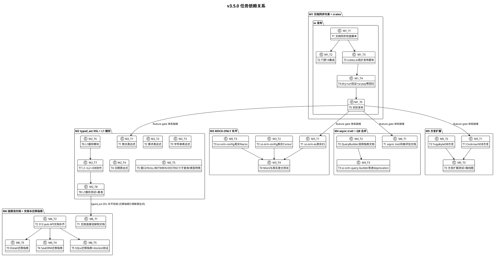

# sz-orm v3.5.0 编码任务规划文档

> 版本：v3.5.0（已知不足改进 + 文档同步约束规则化 + typed_ast DSL 补齐 + 无锁连接池架构文档 + 方言扩展规划 + L1 缓存设计 + crates.io 发布流程 + async trait 风格统一 + QueryBuilder 合并 + MOCK-ONLY 包补齐）
> 基线：v3.4.0（已完成：测试覆盖补齐 + 架构改进 + 性能优化落地 + 编译期类型安全增强 + 文档与生态建设 + sz-pay 生产案例深化，6,738 passed / 0 failed / 253 ignored）
> 日期：2026-08-09
> 文档定位：编码任务规划（What to do），对应需求规格 `docs/spec/v3.5.0/spec.md`（10 方向 / 60 条 EARS 需求 / 10 组 REQ-DOC-SYNC/REQ-DSL/REQ-POOL-DOC/REQ-DIALECT/REQ-L1CACHE/REQ-PUBLISH/REQ-ASYNC/REQ-QB-MERGE/REQ-MOCK/REQ-DOC-FILL）与技术设计 `docs/spec/v3.5.0/design.md`（6 里程碑 + 10 聚合 feature gate）
> 任务粒度：每个子任务可在 1-4 小时内完成，单个任务不超过 500 行代码变更
> 任务统计：28 主任务 / 115 子任务 / 6 里程碑
> 工程化铁律：禁止占位实现 / unsafe 零容忍 / 参数化查询 / API 向后兼容 / Feature 隔离 / 五方言行为一致 / ADR-0001 不改上游 / 审计合规铁律（每结论附 file:line 证据）

---

# 1. 任务总览

## 1.1 任务统计

| 里程碑 | 方向 | 主任务数 | 子任务数 | 关联需求 |
|--------|------|---------|---------|---------|
| M1 文档同步约束 + crates.io 发布 | 方向 1 + 方向 6 | 5 | 23 | REQ-DOC-SYNC-001~004 + REQ-PUBLISH-001~007 |
| M2 typed_ast DSL 补齐 + L1 缓存 | 方向 2 + 方向 5 | 8 | 34 | REQ-DSL-001~010 + REQ-L1CACHE-001~007 |
| M3 MOCK-ONLY 包真实后端补齐 | 方向 9 | 4 | 20 | REQ-MOCK-001~005 |
| M4 async trait 统一 + QueryBuilder 合并 | 方向 7 + 方向 8 | 3 | 12 | REQ-ASYNC-001~004 + REQ-QB-MERGE-001~004 |
| M5 方言扩展 | 方向 4 | 3 | 14 | REQ-DIALECT-001~006 |
| M6 连接池文档 + 文档与迁移指南补齐 | 方向 3 + 方向 10 | 5 | 12 | REQ-POOL-DOC-001~004 + REQ-DOC-FILL-001~005 |
| **合计** | — | **28** | **115** | **60 条 REQ** |

## 1.2 里程碑分布

```
M1 文档同步约束 + crates.io 发布 (2 周, 最高优先级, 低风险)
    │
    ├──→ M2 typed_ast DSL + L1 缓存 (3 周, 高优先级, 中风险) ──→ M6 连接池文档 + 文档与迁移指南 (2 周, 低优先级, 低风险)
    ├──→ M3 MOCK-ONLY 补齐 (2 周, 高优先级, 中风险)
    ├──→ M4 async trait + QB 合并 (2 周, 中优先级, 中风险)
    └──→ M5 方言扩展 (1 周, 低优先级, 高风险)
```

- **关键路径**：M1 → M2 → M6（串行 7 周）
- **并行机会**：
  - M1 完成后 M2/M3/M4/M5 可并行（feature gate 体系就绪）
  - M2 内部：46 种表达式 + L1 缓存可并行（不同模块）
  - M3 内部：ES + Consul/Nacos 可并行（不同包）
  - M6 内部：架构文档 + 313 API 文档 + 三份迁移指南可并行
- **总周期**：关键路径 7 周；并行开发下可压缩至 5-6 周

## 1.3 Feature Gate 矩阵

### 1.3.1 4 个新增 Feature gate

| 新增 Feature | 所属包 | 默认 | 依赖 | 关联里程碑 |
|---------|--------|------|------|-----------|
| `l1-cache` | sz-orm-core | 关闭 | 无 | M2 |
| `dialect-cockroachdb` | sz-orm-core | 关闭 | 无 | M5 |
| `dialect-yugabytedb` | sz-orm-core | 关闭 | 无 | M5 |
| `async-trait-unify` | sz-orm-core | 关闭 | 无（仅标识） | M4 |

### 1.3.2 6 个既有 Feature 复用

| 既有 Feature | 所属包 | 默认 | 依赖 | 关联里程碑 |
|---------|--------|------|------|-----------|
| `typed-dsl` | sz-orm-core | 关闭 | 无 | M2 |
| `real` | sz-orm-es | 关闭 | elasticsearch（optional） | M3 |
| `real-consul` | sz-orm-config | 关闭 | reqwest（optional） | M3 |
| `real-nacos` | sz-orm-config | 关闭 | reqwest（optional） | M3 |
| `doc-completion` | sz-orm-core | 关闭 | 无（纯文档） | M6 |
| `migration-guide` | sz-orm-core | 关闭 | 无（纯文档） | M6 |

---

# 2. M1 文档同步约束 + crates.io 发布（REQ-DOC-SYNC-001~004 + REQ-PUBLISH-001~007）

> **目标**：实现门禁 14 文档同步更新检查（代码变更触发文档更新约束），完成 v3.5.0 crates.io 拓扑发布 + sz-pay 零回归验证，不修改既有公开 API。
> **周期**：2 周
> **优先级**：最高（低风险高收益）
> **关联设计**：design.md §5.1.1
> **关联验收**：AC-DOC-SYNC-1~4 + AC-PUBLISH-1~7（spec §9.1）

## 2.1 M1-T1：文档同步检查脚本

- [ ] **M1-T1.1** 编写 `scripts/check-doc-sync.py` 脚本骨架：argparse 参数解析（--diff/--base/--head/--skip-file）、git diff 解析、退出码定义（0=通过/1=未同步/2=错误）
  - 关联需求：REQ-DOC-SYNC-003
  - 关联设计：design.md §5.1.1 M1-T1
  - 验收：`python scripts/check-doc-sync.py --help` 输出用法说明
  - 依赖：无

- [ ] **M1-T1.2** 定义 10 类代码变更 → 受影响文档映射规则：①Cargo.toml 版本→README/AGENTS.md ②Cargo.toml feature→engineering-practices.md feature 矩阵 ③新增 pub API→API 文档 ④pool.rs→连接池文档 ⑤dialect.rs→方言文档 ⑥typed_ast.rs→DSL 文档 ⑦l2_cache.rs→缓存文档 ⑧migration→迁移指南 ⑨Cargo.toml 新增包→workspace 文档 ⑩Cargo.toml 依赖→依赖文档
  - 关联需求：REQ-DOC-SYNC-002
  - 关联设计：design.md §5.1.1 M1-T2
  - 验收：映射规则以 JSON/YAML 配置文件 `scripts/doc-sync-rules.yaml` 形式存在，10 类规则完整
  - 依赖：M1-T1.1

- [ ] **M1-T1.3** 实现 git diff 解析逻辑：调用 `git diff --name-only` 获取变更文件列表，按映射规则匹配受影响文档清单
  - 关联需求：REQ-DOC-SYNC-003
  - 关联设计：design.md §5.1.1 M1-T1
  - 验收：给定测试 diff（含 Cargo.toml 版本变更），脚本正确识别应更新 README.md
  - 依赖：M1-T1.2

- [ ] **M1-T1.4** 实现文档更新检查逻辑：对每个受影响文档，检查该文档是否在 diff 中被修改；支持 `# doc-sync-skip` 跳过标记
  - 关联需求：REQ-DOC-SYNC-003
  - 关联设计：design.md §5.1.1 M1-T1
  - 验收：未同步更新文档时退出码 1 并输出未更新文档清单；含跳过标记时跳过检查
  - 依赖：M1-T1.3

- [ ] **M1-T1.5** 编写脚本单元测试 `tests/test_check_doc_sync.py`：覆盖映射规则匹配、diff 解析、跳过标记、退出码（正常/未同步/错误）
  - 关联需求：REQ-DOC-SYNC-003
  - 关联设计：design.md §6.1.1
  - 验收：`python -m pytest tests/test_check_doc_sync.py` 全通过，行覆盖率 ≥ 90%
  - 依赖：M1-T1.4

## 2.2 M1-T2：门禁 14 集成

- [ ] **M1-T2.1** 在 `AGENTS.md` 门禁表新增第 14 行：`| 14 | 文档同步更新检查 | python scripts/check-doc-sync.py --diff HEAD |`
  - 关联需求：REQ-DOC-SYNC-001
  - 关联设计：design.md §5.1.1 M1-T3
  - 验收：AGENTS.md 门禁表包含 14 行（含新增门禁 14）
  - 依赖：M1-T1.4

- [ ] **M1-T2.2** 在 `docs/sz-orm-engineering-practices.md` 新增"门禁 14：文档同步更新检查"章节：说明检查逻辑、10 类映射规则、跳过标记用法、CI 集成方式
  - 关联需求：REQ-DOC-SYNC-001
  - 关联设计：design.md §5.1.1 M1-T3
  - 验收：engineering-practices.md 包含门禁 14 章节，10 类映射规则列出
  - 依赖：M1-T2.1

- [ ] **M1-T2.3** 在 `.github/workflows/ci.yml` 新增 `check-doc-sync` job：checkout + setup-python + pip install pyyaml + run check-doc-sync.py --diff HEAD
  - 关联需求：REQ-DOC-SYNC-001
  - 关联设计：design.md §5.1.1 M1-T4
  - 验收：CI 配置包含 check-doc-sync job，PR 触发时执行文档同步检查
  - 依赖：M1-T2.2

- [ ] **M1-T2.4** 编写端到端集成测试：模拟代码变更未同步文档（应阻断，退出码 1）+ 同步文档（应通过，退出码 0）+ 跳过标记（应通过）
  - 关联需求：REQ-DOC-SYNC-004
  - 关联设计：design.md §6.1.1
  - 验收：三种场景测试通过
  - 依赖：M1-T2.3

## 2.3 M1-T3：crates.io 拓扑发布脚本

- [ ] **M1-T3.1** 编写 `scripts/publish-workspace.sh` 发布脚本骨架：参数解析（--dry-run/--verify/--token）、拓扑排序调用、逐包发布、sz-pay 验证
  - 关联需求：REQ-PUBLISH-002
  - 关联设计：design.md §5.1.1 M1-T5
  - 验收：`bash scripts/publish-workspace.sh --help` 输出用法说明
  - 依赖：无

- [ ] **M1-T3.2** 复用 `scripts/compute_topology.ps1` 计算工作空间依赖拓扑排序，输出发布顺序清单（sz-orm-macros → sz-orm-core → 扩展包 → cli/examples）
  - 关联需求：REQ-PUBLISH-002
  - 关联设计：design.md §5.1.1 M1-T5
  - 验收：拓扑排序输出包含 43 个包，顺序满足依赖关系（被依赖者在前）
  - 依赖：M1-T3.1

- [ ] **M1-T3.3** 实现 dry-run 模式：逐包执行 `cargo publish --dry-run`，收集验证结果（通过/失败 + 错误信息）
  - 关联需求：REQ-PUBLISH-003
  - 关联设计：design.md §5.1.1 M1-T5
  - 验收：`bash scripts/publish-workspace.sh --dry-run` 输出每包 dry-run 结果，不实际发布
  - 依赖：M1-T3.2

- [ ] **M1-T3.4** 升级 `Cargo.toml` workspace.package.version = "3.5.0" + workspace.dependencies 中所有 sz-orm-* 内部依赖版本 = "3.5.0"
  - 关联需求：REQ-PUBLISH-004
  - 关联设计：design.md §5.1.1 M1-T6
  - 验收：`cargo check --workspace` 通过，所有包版本 = 3.5.0
  - 依赖：M1-T3.3

- [ ] **M1-T3.5** 编写 secrets 预检脚本 `scripts/check-secrets.py`：扫描 .env/credentials/token/私钥模式，确保发布前无敏感信息泄露
  - 关联需求：REQ-PUBLISH-006
  - 关联设计：design.md §5.1.1 M1-T7
  - 验收：`python scripts/check-secrets.py` 扫描工作空间，发现 secrets 时退出码 1
  - 依赖：M1-T3.4

- [ ] **M1-T3.6** 实现实际发布模式：按拓扑顺序逐包执行 `cargo publish --token <token>`，每包发布后验证 crates.io 页面可访问
  - 关联需求：REQ-PUBLISH-004
  - 关联设计：design.md §5.1.1 M1-T5/M1-T9
  - 验收：`bash scripts/publish-workspace.sh --token <token>` 按拓扑顺序发布，每包 crates.io 页面可访问
  - 依赖：M1-T3.5

## 2.4 M1-T4：dry-run 验证 + sz-pay 零回归

- [ ] **M1-T4.1** 执行 `bash scripts/publish-workspace.sh --dry-run` 验证 43 个包 dry-run 全通过，记录失败包及错误信息
  - 关联需求：REQ-PUBLISH-003
  - 关联设计：design.md §5.1.1 M1-T5
  - 验收：43 个包 dry-run 全通过（或修复至全通过）
  - 依赖：M1-T3.3

- [ ] **M1-T4.2** 在 sz-pay 项目 `E:\vue\test\sz-pay\server\sz-rust\Cargo.toml` 本地修改 sz-orm-* 依赖版本为 3.5.0（path 引用或本地 registry），不修改 sz-pay 代码
  - 关联需求：REQ-PUBLISH-005
  - 关联设计：design.md §5.1.1 M1-T8
  - 验收：sz-pay Cargo.toml 依赖版本 = 3.5.0
  - 依赖：M1-T3.4

- [ ] **M1-T4.3** 在 sz-pay 执行 `cargo check` 验证编译通过，记录编译错误（如有）
  - 关联需求：REQ-PUBLISH-005
  - 关联设计：design.md §5.1.1 M1-T8
  - 验收：sz-pay cargo check 零错误（或修复至零错误）
  - 依赖：M1-T4.2

- [ ] **M1-T4.4** 在 sz-pay 执行 `cargo test` 验证测试零回归，记录测试失败（如有）
  - 关联需求：REQ-PUBLISH-005
  - 关联设计：design.md §5.1.1 M1-T8
  - 验收：sz-pay cargo test 全通过，与 v3.4.0 基线测试数一致（零回归）
  - 依赖：M1-T4.3

- [ ] **M1-T4.5** 执行 `python scripts/check-secrets.py` 验证工作空间无敏感信息泄露
  - 关联需求：REQ-PUBLISH-006
  - 关联设计：design.md §5.1.1 M1-T7
  - 验收：secrets 预检通过，退出码 0
  - 依赖：M1-T3.5

## 2.5 M1-T5：实际发布

- [ ] **M1-T5.1** 执行 `bash scripts/publish-workspace.sh --token [REDACTED]` 实际发布 43 个包到 crates.io
  - 关联需求：REQ-PUBLISH-004
  - 关联设计：design.md §5.1.1 M1-T9
  - 验收：43 个包发布成功，crates.io 页面可访问
  - 依赖：M1-T4.4 + M1-T4.5

- [ ] **M1-T5.2** 验证 crates.io 每包页面可访问且版本 = 3.5.0，记录发布清单
  - 关联需求：REQ-PUBLISH-004
  - 关联设计：design.md §5.1.1 M1-T9
  - 验收：43 个包 crates.io 页面版本 = 3.5.0
  - 依赖：M1-T5.1

- [ ] **M1-T5.3** 在 sz-pay 项目从 crates.io 拉取 3.5.0 版本（修改 Cargo.toml 依赖为 `version = "3.5.0"`，移除 path 引用），执行 cargo check + cargo test 验证零回归
  - 关联需求：REQ-PUBLISH-005
  - 关联设计：design.md §5.1.1 M1-T8
  - 验收：sz-pay 从 crates.io 拉取 3.5.0，cargo check + cargo test 零回归
  - 依赖：M1-T5.2

---

# 3. M2 typed_ast DSL 补齐 + L1 缓存（REQ-DSL-001~010 + REQ-L1CACHE-001~007）

> **目标**：补齐 typed_ast.rs 46 种表达式（聚合/算术/字符串/日期/窗口/NULL/BETWEEN/DISTINCT/子查询/类型转换），实现 L1Cache（Identity Map + LRU + Session 绑定 + L1→L2→DB 协作），不修改既有公开 API。
> **周期**：3 周
> **优先级**：高（中风险中收益）
> **关联设计**：design.md §5.1.2
> **关联验收**：AC-DSL-1~10 + AC-L1CACHE-1~7（spec §9.2）

## 3.1 M2-T1：聚合表达式

- [ ] **M2-T1.1** 在 `packages/sz-orm-core/src/typed_ast.rs` 新增 6 种聚合表达式 ZST：Max<T>/Min<T>/Sum<T>/Avg<T>/Count<T>/CountStar，各为 PhantomData<T> 零大小类型
  - 关联需求：REQ-DSL-001
  - 关联设计：design.md §5.1.2 M2-T1
  - 验收：6 种表达式定义存在，`std::mem::size_of::<Max<T>>() == 0` 编译期断言通过
  - 依赖：无

- [ ] **M2-T1.2** 为 6 种聚合表达式实现 TypedExpression trait：to_sql() 方法生成 `MAX(col)`/`MIN(col)`/`SUM(col)`/`AVG(col)`/`COUNT(col)`/`COUNT(*)` SQL 片段
  - 关联需求：REQ-DSL-001
  - 关联设计：design.md §5.1.2 M2-T1
  - 验收：to_sql() 输出正确 SQL，五方言行为一致（聚合函数语法通用）
  - 依赖：M2-T1.1

- [ ] **M2-T1.3** 为 6 种聚合表达式实现 ExprTable trait（表名提取）+ 构造器函数 max()/min()/sum()/avg()/count()/count_star()
  - 关联需求：REQ-DSL-001
  - 关联设计：design.md §5.1.2 M2-T1
  - 验收：构造器函数可链式调用，ExprTable 正确提取表名
  - 依赖：M2-T1.2

- [ ] **M2-T1.4** 编写聚合表达式单元测试 `tests/typed_ast_aggregate_test.rs`：覆盖 to_sql 输出、ZST 断言、五方言一致性、与 QueryBuilder SQL 差分对比
  - 关联需求：REQ-DSL-001
  - 关联设计：design.md §6.1.2
  - 验收：`cargo test -p sz-orm-core --features typed-dsl typed_ast_aggregate` 全通过
  - 依赖：M2-T1.3

## 3.2 M2-T2：算术表达式

- [ ] **M2-T2.1** 在 `packages/sz-orm-core/src/typed_ast.rs` 新增 5 种算术表达式 ZST：Add<L,R>/Sub<L,R>/Mul<L,R>/Div<L,R>/Modulo<L,R>，各为 PhantomData 零大小类型
  - 关联需求：REQ-DSL-002
  - 关联设计：design.md §5.1.2 M2-T2
  - 验收：5 种表达式定义存在，ZST 断言通过
  - 依赖：无

- [ ] **M2-T2.2** 定义 Addable 类型检查 trait（NumericType: SqlType + Addable），约束算术表达式只能作用于数值类型
  - 关联需求：REQ-DSL-002
  - 关联设计：design.md §5.1.2 M2-T2
  - 验收：非数值类型（如 Text）使用算术表达式编译失败
  - 依赖：M2-T2.1

- [ ] **M2-T2.3** 为 5 种算术表达式实现 TypedExpression trait：to_sql() 生成 `L + R`/`L - R`/`L * R`/`L / R`/`L % R`，正确处理括号优先级
  - 关联需求：REQ-DSL-002
  - 关联设计：design.md §5.1.2 M2-T2
  - 验收：to_sql() 输出正确 SQL，括号优先级正确，五方言行为一致
  - 依赖：M2-T2.2

- [ ] **M2-T2.4** 编写算术表达式单元测试 `tests/typed_ast_arithmetic_test.rs`：覆盖 to_sql 输出、类型检查、ZST 断言、嵌套表达式、五方言一致性
  - 关联需求：REQ-DSL-002
  - 关联设计：design.md §6.1.2
  - 验收：`cargo test -p sz-orm-core --features typed-dsl typed_ast_arithmetic` 全通过
  - 依赖：M2-T2.3

## 3.3 M2-T3：字符串表达式

- [ ] **M2-T3.1** 在 `packages/sz-orm-core/src/typed_ast.rs` 新增 7 种字符串表达式 ZST：Concat<L,R>/ILike<L,R>/Length<T>/Lower<T>/Upper<T>/Trim<T>/Substring<T>
  - 关联需求：REQ-DSL-003
  - 关联设计：design.md §5.1.2 M2-T3
  - 验收：7 种表达式定义存在，ZST 断言通过
  - 依赖：无

- [ ] **M2-T3.2** 为 7 种字符串表达式实现 TypedExpression trait + 方言分派：Concat 生成 `L || R`（PG/Oracle）或 `CONCAT(L, R)`（MySQL/SQLite）；ILike 生成 `L ILIKE R`（PG）或 `LOWER(L) LIKE LOWER(R)`（其他）；Length/Lower/Upper/Trim/Substring 各方言函数名分派
  - 关联需求：REQ-DSL-003
  - 关联设计：design.md §5.1.2 M2-T3
  - 验收：to_sql() 各方言输出正确，五方言行为一致
  - 依赖：M2-T3.1

- [ ] **M2-T3.3** 编写字符串表达式单元测试 `tests/typed_ast_string_test.rs`：覆盖 to_sql 输出、方言分派、ZST 断言、五方言一致性
  - 关联需求：REQ-DSL-003
  - 关联设计：design.md §6.1.2
  - 验收：`cargo test -p sz-orm-core --features typed-dsl typed_ast_string` 全通过
  - 依赖：M2-T3.2

## 3.4 M2-T4：日期表达式

- [ ] **M2-T4.1** 在 `packages/sz-orm-core/src/typed_ast.rs` 新增 8 种日期表达式 ZST：Extract<T>/Year<T>/Month<T>/Day<T>/Hour<T>/Minute<T>/Second<T>/Now
  - 关联需求：REQ-DSL-004
  - 关联设计：design.md §5.1.2 M2-T4
  - 验收：8 种表达式定义存在，ZST 断言通过
  - 依赖：无

- [ ] **M2-T4.2** 为 8 种日期表达式实现 TypedExpression trait：Year/Month/Day/Hour/Minute/Second 生成 `EXTRACT(YEAR FROM col)`（标准）或 `YEAR(col)`（MySQL）；Now 生成 `NOW()`/`CURRENT_TIMESTAMP`；Extract 支持任意字段
  - 关联需求：REQ-DSL-004
  - 关联设计：design.md §5.1.2 M2-T4
  - 验收：to_sql() 各方言输出正确，五方言行为一致
  - 依赖：M2-T4.1

- [ ] **M2-T4.3** 编写日期表达式单元测试 `tests/typed_ast_date_test.rs`：覆盖 to_sql 输出、方言分派、ZST 断言、五方言一致性
  - 关联需求：REQ-DSL-004
  - 关联设计：design.md §6.1.2
  - 验收：`cargo test -p sz-orm-core --features typed-dsl typed_ast_date` 全通过
  - 依赖：M2-T4.2

## 3.5 M2-T5：窗口/NULL/BETWEEN/DISTINCT/子查询/类型转换表达式

- [ ] **M2-T5.1** 在 `packages/sz-orm-core/src/typed_ast.rs` 新增 8 种窗口表达式 ZST：Over<T>/PartitionBy<T>/OrderByInWindow<T>/Lag<T>/Lead<T>/RowNumber/Rank/DenseRank，实现方言版本分派（窗口函数 PG/Oracle/SQL Server 支持，MySQL 8.0+ 支持，SQLite 3.25+ 支持）
  - 关联需求：REQ-DSL-005
  - 关联设计：design.md §5.1.2 M2-T5
  - 验收：8 种表达式定义存在，ZST 断言通过，方言版本分派正确
  - 依赖：无

- [ ] **M2-T5.2** 为 8 种窗口表达式实现 TypedExpression trait + to_sql()：生成 `func() OVER (PARTITION BY ... ORDER BY ...)`，Lag/Lead 支持 offset/default 参数
  - 关联需求：REQ-DSL-005
  - 关联设计：design.md §5.1.2 M2-T5
  - 验收：to_sql() 输出正确 SQL，五方言行为一致
  - 依赖：M2-T5.1

- [ ] **M2-T5.3** 在 `packages/sz-orm-core/src/typed_ast.rs` 新增 4 种 NULL 处理表达式 ZST：IsNull<T>/IsNotNull<T>/Coalesce<T>/NullIf<T>，实现 to_sql() 生成 `col IS NULL`/`col IS NOT NULL`/`COALESCE(...)`/`NULLIF(...)` 
  - 关联需求：REQ-DSL-006
  - 关联设计：design.md §5.1.2 M2-T6
  - 验收：4 种表达式定义存在，ZST 断言通过，to_sql() 五方言一致
  - 依赖：M2-T5.2

- [ ] **M2-T5.4** 在 `packages/sz-orm-core/src/typed_ast.rs` 新增 BETWEEN/DISTINCT/子查询表达式 ZST：Between<T>/NotBetween<T>/Distinct/DistinctOn<T>（PG-only）/Subquery<T>/Exists<T>，实现 to_sql()
  - 关联需求：REQ-DSL-007
  - 关联设计：design.md §5.1.2 M2-T7
  - 验收：6 种表达式定义存在，DistinctOn 仅 PG 生成 `DISTINCT ON (col)`，其他方言报错或回退
  - 依赖：M2-T5.3

- [ ] **M2-T5.5** 在 `packages/sz-orm-core/src/typed_ast.rs` 新增 2 种类型转换表达式 ZST：Cast<T,U>/As<T,U>，实现 to_sql() 生成 `CAST(col AS type)`（标准）或 `col::type`（PG）
  - 关联需求：REQ-DSL-008
  - 关联设计：design.md §5.1.2 M2-T8
  - 验收：2 种表达式定义存在，PG 生成 `::type` 语法，其他方言生成 `CAST(... AS ...)`，五方言行为一致
  - 依赖：M2-T5.4

- [ ] **M2-T5.6** 编写编译期 ZST 断言 + 差分测试 `tests/typed_ast_zst_diff_test.rs`：对所有 46 种新增表达式 static_assert size_of == 0，typed_ast vs QueryBuilder SQL 输出一致性差分对比
  - 关联需求：REQ-DSL-010
  - 关联设计：design.md §5.1.2 M2-T9
  - 验收：46 种表达式 ZST 断言全通过，typed_ast 与 QueryBuilder SQL 一致
  - 依赖：M2-T5.5

- [ ] **M2-T5.7** 更新 `docs/sz-orm与同类产品对比分析.md` §6.1 为"已对齐 Diesel 表达式覆盖度"，新增 46 种表达式对比表
  - 关联需求：REQ-DSL-009
  - 关联设计：design.md §5.1.2 M2-T10
  - 验收：对比分析文档 §6.1 更新，对比表包含 46 种表达式
  - 依赖：M2-T5.6

## 3.6 M2-T6：L1 缓存模块

- [ ] **M2-T6.1** 在 `packages/sz-orm-core/Cargo.toml` 新增 `l1-cache = []` feature gate
  - 关联需求：REQ-L1CACHE-001
  - 关联设计：design.md §5.1.2 M2-T17
  - 验收：`cargo check -p sz-orm-core --features l1-cache` 编译通过，feature 默认关闭
  - 依赖：无

- [ ] **M2-T6.2** 新增 `packages/sz-orm-core/src/l1_cache.rs` 模块：L1Cache 结构体（Identity Map: HashMap<PrimaryKey, Arc<T>> + LRU 淘汰队列 + 统计计数器），在 lib.rs 以 `#[cfg(feature = "l1-cache")] pub mod l1_cache;` 声明
  - 关联需求：REQ-L1CACHE-001
  - 关联设计：design.md §5.1.2 M2-T11
  - 验收：L1Cache 结构体定义存在，`cargo check -p sz-orm-core --features l1-cache` 编译通过
  - 依赖：M2-T6.1

- [ ] **M2-T6.3** 实现 L1Cache Identity Map 语义：相同主键查询返回相同 Arc<T> 引用（同一对象实例），插入/查询/删除 API
  - 关联需求：REQ-L1CACHE-001/005
  - 关联设计：design.md §5.1.2 M2-T11/M2-T15
  - 验收：相同主键两次查询返回 Arc::ptr_eq(&a, &b) == true
  - 依赖：M2-T6.2

- [ ] **M2-T6.4** 实现 L1Cache LRU 淘汰策略：容量上限 + 淘汰最久未使用条目，使用 std::collections::VecDeque 或 LinkedHashMap
  - 关联需求：REQ-L1CACHE-001
  - 关联设计：design.md §5.1.2 M2-T11
  - 验收：超过容量上限时淘汰最久未使用条目，淘汰统计计数 +1
  - 依赖：M2-T6.3

- [ ] **M2-T6.5** 实现 L1Cache 统计 API：hit/miss/entry_count/evict_count 使用 AtomicU64 无锁计数，提供 stats() 方法返回统计快照
  - 关联需求：REQ-L1CACHE-006
  - 关联设计：design.md §5.1.2 M2-T16
  - 验收：stats() 返回正确统计，并发环境下无数据竞争
  - 依赖：M2-T6.4

## 3.7 M2-T7：L1→L2→DB 协作

- [ ] **M2-T7.1** 实现 L1Cache 生命周期与 Session 绑定：L1Cache 持有 Session 引用，Drop 时自动清空，不跨 Session 共享
  - 关联需求：REQ-L1CACHE-002/007
  - 关联设计：design.md §5.1.2 M2-T12
  - 验收：Session 结束时 L1 缓存自动清空，不同 Session 的 L1 缓存隔离
  - 依赖：M2-T6.5

- [ ] **M2-T7.2** 实现 L1 缓存失效策略：写操作（INSERT/UPDATE/DELETE）自动 evict 对应主键，提供手动 evict(key)/clear() API
  - 关联需求：REQ-L1CACHE-003
  - 关联设计：design.md §5.1.2 M2-T13
  - 验收：写操作后查询不命中 L1 缓存，手动 evict/clear 生效
  - 依赖：M2-T7.1

- [ ] **M2-T7.3** 实现 L1→L2→DB 查询协作：查询顺序 L1 命中→返回；L1 未命中→查 L2→L2 命中→回填 L1→返回；L2 未命中→查 DB→回填 L1+L2→返回。L2Cache 既有 API 不变
  - 关联需求：REQ-L1CACHE-004
  - 关联设计：design.md §5.1.2 M2-T14
  - 验收：查询顺序正确，L1 命中不查 L2，L2 命中回填 L1，DB 命中回填 L1+L2，L2Cache API 不变
  - 依赖：M2-T7.2

- [ ] **M2-T7.4** 实现 L1 缓存对象一致性保证：同主键同 Arc 引用，修改后查询看到修改（通过 Arc<RwLock<T>> 或版本号机制）
  - 关联需求：REQ-L1CACHE-005
  - 关联设计：design.md §5.1.2 M2-T15
  - 验收：修改对象后查询返回修改后值，同主键引用一致
  - 依赖：M2-T7.3

## 3.8 M2-T8：L1 缓存测试 + 基准

- [ ] **M2-T8.1** 编写 L1Cache 单元测试 `tests/l1_cache_test.rs`：覆盖 Identity Map 语义、LRU 淘汰、生命周期、失效策略、统计 API、并发安全
  - 关联需求：REQ-L1CACHE-001~007
  - 关联设计：design.md §6.1.5
  - 验收：`cargo test -p sz-orm-core --features l1-cache l1_cache` 全通过
  - 依赖：M2-T7.4

- [ ] **M2-T8.2** 编写 L1→L2→DB 协作集成测试 `tests/l1_l2_db_test.rs`：覆盖三级查询顺序、命中回填、写操作失效、跨 Session 隔离
  - 关联需求：REQ-L1CACHE-004
  - 关联设计：design.md §6.1.5
  - 验收：`cargo test -p sz-orm-core --features l1-cache l1_l2_db` 全通过
  - 依赖：M2-T8.1

- [ ] **M2-T8.3** 编写 L1 缓存性能基准 `benches/l1_cache_bench.rs`：对比 L1 命中 vs L2 命中 vs DB 查询延迟，使用 criterion 基准框架
  - 关联需求：REQ-L1CACHE-006
  - 关联设计：design.md §6.1.5
  - 验收：`cargo bench -p sz-orm-core --features l1-cache l1_cache` 输出基准结果，L1 命中延迟 < L2 命中延迟 < DB 查询延迟
  - 依赖：M2-T8.2

- [ ] **M2-T8.4** 验证既有 L2Cache API 不变：`cargo test -p sz-orm-core` （不启用 l1-cache feature）全通过，与 v3.4.0 基线一致
  - 关联需求：REQ-L1CACHE-004
  - 关联设计：design.md §5.1.2
  - 验收：不启用 l1-cache 时 L2Cache 测试全通过，零回归
  - 依赖：M2-T8.3

---

# 4. M3 MOCK-ONLY 包真实后端补齐（REQ-MOCK-001~005）

> **目标**：为 sz-orm-es 补齐真实 ES 后端（`real` feature），为 sz-orm-config 补齐真实 Consul/Nacos 后端（`real-consul`/`real-nacos` feature），编写 Mock 与真实差分测试，不修改既有公开 API。
> **周期**：2 周
> **优先级**：高（中风险中收益）
> **关联设计**：design.md §5.1.3
> **关联验收**：AC-MOCK-1~5（spec §9.3）

## 4.1 M3-T1：sz-orm-es 真实 ES 后端

- [ ] **M3-T1.1** 在 `packages/sz-orm-es/Cargo.toml` 新增 `elasticsearch = { version = "8.5", optional = true }` optional 依赖，`real = ["dep:elasticsearch"]` feature 启用
  - 关联需求：REQ-MOCK-001
  - 关联设计：design.md §5.1.3 M3-T1
  - 验收：`cargo check -p sz-orm-es` 默认 mock 行为不变；`cargo check -p sz-orm-es --features real` 编译通过
  - 依赖：无

- [ ] **M3-T1.2** 在 `packages/sz-orm-es/src/real_es.rs` 新增真实 ES 后端实现：RealEsSync 结构体（持有 elasticsearch::Elasticsearch 客户端），实现 EsSync trait 的索引/搜索/聚合/过滤方法
  - 关联需求：REQ-MOCK-001
  - 关联设计：design.md §5.1.3 M3-T1
  - 验收：RealEsSync 实现 EsSync trait，`cargo check -p sz-orm-es --features real` 编译通过
  - 依赖：M3-T1.1

- [ ] **M3-T1.3** 实现真实 ES 索引操作：create_index（mapping 设置）/delete_index/index_document/bulk_index，通过 elasticsearch crate HTTP API 调用
  - 关联需求：REQ-MOCK-001
  - 关联设计：design.md §5.1.3 M3-T1
  - 验收：索引操作通过 ES API 调用，错误处理完整
  - 依赖：M3-T1.2

- [ ] **M3-T1.4** 实现真实 ES 搜索/聚合/过滤操作：search（DSL 查询）/aggregate（聚合查询）/filter（过滤查询），返回 EsSearchResult
  - 关联需求：REQ-MOCK-001
  - 关联设计：design.md §5.1.3 M3-T1
  - 验收：搜索/聚合/过滤操作通过 ES API 调用，返回结果正确
  - 依赖：M3-T1.3

- [ ] **M3-T1.5** 在 lib.rs 以 `#[cfg(feature = "real")] pub mod real_es;` 声明模块，导出 RealEsSync
  - 关联需求：REQ-MOCK-001
  - 关联设计：design.md §5.1.3 M3-T1
  - 验收：`cargo check -p sz-orm-es --features real` 导出 RealEsSync
  - 依赖：M3-T1.4

- [ ] **M3-T1.6** 编写真实 ES 集成测试 `tests/real_es_test.rs`：`#[cfg(feature = "real")]` + `#[ignore]` 标注，覆盖索引/搜索/聚合/过滤，需真实 ES 服务（127.0.0.1:9200）
  - 关联需求：REQ-MOCK-003
  - 关联设计：design.md §5.1.3 M3-T2
  - 验收：`cargo test -p sz-orm-es --features real -- --ignored` 全通过（需 ES 服务）
  - 依赖：M3-T1.5

## 4.2 M3-T2：sz-orm-config 真实 Consul 后端

- [ ] **M3-T2.1** 在 `packages/sz-orm-config/src/real_consul.rs` 新增真实 Consul 后端实现：RealConsulConfigCenter 结构体（持有 reqwest::Client + Consul 地址 + ACL Token），实现 ConfigCenter trait
  - 关联需求：REQ-MOCK-002
  - 关联设计：design.md §5.1.3 M3-T3
  - 验收：RealConsulConfigCenter 实现 ConfigCenter trait，`cargo check -p sz-orm-config --features real-consul` 编译通过
  - 依赖：无

- [ ] **M3-T2.2** 实现真实 Consul 配置读写：get_config（GET /v1/kv/{key}）/set_config（PUT /v1/kv/{key}）/delete_config（DELETE /v1/kv/{key}），通过 reqwest HTTP API 调用，ACL Token 认证
  - 关联需求：REQ-MOCK-002
  - 关联设计：design.md §5.1.3 M3-T3
  - 验收：配置读写通过 Consul HTTP API 调用，ACL Token 认证正确
  - 依赖：M3-T2.1

- [ ] **M3-T2.3** 实现真实 Consul 配置监听：watch_config（GET /v1/kv/{key}?index={index}&wait=10s 长轮询），配置变更时通知订阅者
  - 关联需求：REQ-MOCK-002
  - 关联设计：design.md §5.1.3 M3-T3
  - 验收：配置监听通过长轮询实现，变更通知正确
  - 依赖：M3-T2.2

- [ ] **M3-T2.4** 实现真实 Consul 服务发现：register_service（PUT /v1/agent/service/register）/deregister_service/deregister_service（PUT /v1/agent/service/deregister/{id}）/discover_service（GET /v1/health/service/{name}）
  - 关联需求：REQ-MOCK-002
  - 关联设计：design.md §5.1.3 M3-T3
  - 验收：服务发现 API 正确调用 Consul
  - 依赖：M3-T2.3

- [ ] **M3-T2.5** 在 lib.rs 以 `#[cfg(feature = "real-consul")] pub mod real_consul;` 声明模块
  - 关联需求：REQ-MOCK-002
  - 关联设计：design.md §5.1.3 M3-T3
  - 验收：`cargo check -p sz-orm-config --features real-consul` 导出 RealConsulConfigCenter
  - 依赖：M3-T2.4

## 4.3 M3-T3：sz-orm-config 真实 Nacos 后端

- [ ] **M3-T3.1** 在 `packages/sz-orm-config/src/real_nacos.rs` 新增真实 Nacos 后端实现：RealNacosConfigCenter 结构体（持有 reqwest::Client + Nacos 地址 + Username/Password），实现 ConfigCenter trait
  - 关联需求：REQ-MOCK-002
  - 关联设计：design.md §5.1.3 M3-T4
  - 验收：RealNacosConfigCenter 实现 ConfigCenter trait，`cargo check -p sz-orm-config --features real-nacos` 编译通过
  - 依赖：无

- [ ] **M3-T3.2** 实现真实 Nacos 配置读写：get_config（GET /nacos/v1/cs/configs?dataId={id}&group={group}）/set_config（POST /nacos/v1/cs/configs）/delete_config（DELETE /nacos/v1/cs/configs），Username+Password 认证
  - 关联需求：REQ-MOCK-002
  - 关联设计：design.md §5.1.3 M3-T4
  - 验收：配置读写通过 Nacos HTTP API 调用，认证正确
  - 依赖：M3-T3.1

- [ ] **M3-T3.3** 实现真实 Nacos 配置监听：watch_config（长轮询 /nacos/v1/cs/configs/listener），配置变更时通知订阅者
  - 关联需求：REQ-MOCK-002
  - 关联设计：design.md §5.1.3 M3-T4
  - 验收：配置监听通过长轮询实现，变更通知正确
  - 依赖：M3-T3.2

- [ ] **M3-T3.4** 实现真实 Nacos 服务发现：register_service（POST /nacos/v1/ns/instance）/deregister_service（DELETE /nacos/v1/ns/instance）/discover_service（GET /nacos/v1/ns/instance/list）
  - 关联需求：REQ-MOCK-002
  - 关联设计：design.md §5.1.3 M3-T4
  - 验收：服务发现 API 正确调用 Nacos
  - 依赖：M3-T3.3

- [ ] **M3-T3.5** 在 lib.rs 以 `#[cfg(feature = "real-nacos")] pub mod real_nacos;` 声明模块
  - 关联需求：REQ-MOCK-002
  - 关联设计：design.md §5.1.3 M3-T4
  - 验收：`cargo check -p sz-orm-config --features real-nacos` 导出 RealNacosConfigCenter
  - 依赖：M3-T3.4

- [ ] **M3-T3.6** 编写真实 Consul/Nacos 集成测试 `tests/real_config_test.rs`：`#[cfg(feature = "real-consul/real-nacos")]` + `#[ignore]` 标注，覆盖配置读写/监听/服务发现，需真实 Consul（127.0.0.1:8500）/Nacos（127.0.0.1:8848）服务
  - 关联需求：REQ-MOCK-003
  - 关联设计：design.md §5.1.3 M3-T5
  - 验收：`cargo test -p sz-orm-config --features real-consul,real-nacos -- --ignored` 全通过
  - 依赖：M3-T2.5 + M3-T3.5

## 4.4 M3-T4：Mock 与真实差分测试

- [ ] **M3-T4.1** 编写 sz-orm-es Mock 与真实差分测试 `tests/es_diff_test.rs`：相同输入（索引/搜索/聚合/过滤）Mock vs 真实 ES 输出语义一致
  - 关联需求：REQ-MOCK-004
  - 关联设计：design.md §5.1.3 M3-T6
  - 验收：`cargo test -p sz-orm-es --features real es_diff -- --ignored` 全通过
  - 依赖：M3-T1.6

- [ ] **M3-T4.2** 编写 sz-orm-config Mock 与真实差分测试 `tests/config_diff_test.rs`：相同输入（配置读写/监听/服务发现）Mock vs 真实 Consul/Nacos 输出语义一致
  - 关联需求：REQ-MOCK-004
  - 关联设计：design.md §5.1.3 M3-T6
  - 验收：`cargo test -p sz-orm-config --features real-consul,real-nacos config_diff -- --ignored` 全通过
  - 依赖：M3-T3.6

- [ ] **M3-T4.3** 验证真实后端依赖为 optional，不进默认 feature：`cargo check -p sz-orm-es` + `cargo check -p sz-orm-config` 默认行为不变，无 elasticsearch/reqwest 依赖引入
  - 关联需求：REQ-MOCK-005
  - 关联设计：design.md §5.1.3
  - 验收：默认编译不引入真实后端依赖，Mock 行为不变
  - 依赖：M3-T4.2

---

# 5. M4 async trait 统一 + QueryBuilder 合并（REQ-ASYNC-001~004 + REQ-QB-MERGE-001~004）

> **目标**：评估 async trait 风格统一方案（手动解糖 vs #[async_trait] vs async-fn-in-trait），编写评估文档 + 渐进迁移方案；评估 QueryBuilder 合并方案，编写选择指南 + 渐进 deprecation，不引入 Breaking Change。
> **周期**：2 周
> **优先级**：中（中风险中收益）
> **关联设计**：design.md §5.1.4
> **关联验收**：AC-ASYNC-1~4 + AC-QB-MERGE-1~4（spec §9.4）

## 5.1 M4-T1：async trait 风格评估文档

- [ ] **M4-T1.1** 列出涉及 trait 清单：手动解糖 trait（Connection trait [pool.rs:45]）+ #[async_trait] trait（ConnectionFactory [pool.rs:732] + Model [model.rs:271] + 其他），附 file:line 证据
  - 关联需求：REQ-ASYNC-002
  - 关联设计：design.md §5.1.4 M4-T2
  - 验收：trait 清单完整，每项附 file:line 证据
  - 依赖：无

- [ ] **M4-T1.2** 评估方案 A（统一手动解糖）：优缺点分析 + 性能基准 + 迁移影响 + 学习成本
  - 关联需求：REQ-ASYNC-001
  - 关联设计：design.md §5.1.4 M4-T1
  - 验收：方案 A 评估完整，含性能基准数据
  - 依赖：M4-T1.1

- [ ] **M4-T1.3** 评估方案 B（统一 #[async_trait]）：优缺点分析 + 性能基准 + 迁移影响 + 学习成本
  - 关联需求：REQ-ASYNC-001
  - 关联设计：design.md §5.1.4 M4-T1
  - 验收：方案 B 评估完整，含性能基准数据
  - 依赖：M4-T1.2

- [ ] **M4-T1.4** 评估方案 C（统一 async-fn-in-trait，Rust 1.75+）：优缺点分析 + 性能基准 + 迁移影响 + 学习成本 + Rust 版本要求
  - 关联需求：REQ-ASYNC-001
  - 关联设计：design.md §5.1.4 M4-T1
  - 验收：方案 C 评估完整，含 Rust 版本要求（1.75+，当前 rust-version 1.81 满足）
  - 依赖：M4-T1.3

- [ ] **M4-T1.5** 编写评估文档 `docs/async-trait-evaluation.md`：三方案对比表 + 推荐方案 + 渐进迁移方案（分阶段迁移计划 + 每阶段测试 + sz-pay 零回归）
  - 关联需求：REQ-ASYNC-001/003
  - 关联设计：design.md §5.1.4 M4-T3/M4-T4
  - 验收：评估文档存在，含三方案对比 + 推荐方案 + 渐进迁移方案
  - 依赖：M4-T1.4

- [ ] **M4-T1.6** 验证迁移不引入 Breaking Change：sz-pay cargo check 通过（仅评估，不实际迁移）
  - 关联需求：REQ-ASYNC-004
  - 关联设计：design.md §5.1.4 M4-T4
  - 验收：评估文档明确迁移不引入 Breaking Change，sz-pay 兼容
  - 依赖：M4-T1.5

## 5.2 M4-T2：QueryBuilder 选择指南文档

- [ ] **M4-T2.1** 评估 QueryBuilder 合并方案 A（core::QueryBuilder 吸收 sz-orm-query-builder 能力）：优缺点 + API 兼容 + 用户迁移成本 + 性能基准
  - 关联需求：REQ-QB-MERGE-001
  - 关联设计：design.md §5.1.4 M4-T5
  - 验收：方案 A 评估完整
  - 依赖：无

- [ ] **M4-T2.2** 评估 QueryBuilder 合并方案 B（保持独立 + 选择指南）：优缺点 + API 兼容 + 用户迁移成本 + 性能基准
  - 关联需求：REQ-QB-MERGE-001
  - 关联设计：design.md §5.1.4 M4-T5
  - 验收：方案 B 评估完整
  - 依赖：M4-T2.1

- [ ] **M4-T2.3** 编写选择指南 `docs/query-builder-guide.md`：能力对比表（core::QueryBuilder vs sz-orm-query-builder）+ 适用场景 + 性能基准 + 迁移建议
  - 关联需求：REQ-QB-MERGE-002
  - 关联设计：design.md §5.1.4 M4-T6
  - 验收：选择指南存在，含能力对比表 + 适用场景 + 性能基准 + 迁移建议
  - 依赖：M4-T2.2

## 5.3 M4-T3：sz-orm-query-builder 渐进 deprecation

- [ ] **M4-T3.1** 在 `packages/sz-orm-query-builder/src/lib.rs` 顶部添加 `#![deprecated(note = "v3.5.0: 请评估 docs/query-builder-guide.md 选择合适方案")]` 或在关键 API 添加 `#[deprecated]` 标注
  - 关联需求：REQ-QB-MERGE-003
  - 关联设计：design.md §5.1.4 M4-T7
  - 验收：`cargo check -p sz-orm-query-builder` 编译通过（deprecated 仅警告，不报错）
  - 依赖：M4-T2.3

- [ ] **M4-T3.2** 验证 sz-orm-query-builder v3.5.0 可用，API 兼容，不立即删除：`cargo test -p sz-orm-query-builder` 全通过
  - 关联需求：REQ-QB-MERGE-003/004
  - 关联设计：design.md §5.1.4 M4-T7
  - 验收：sz-orm-query-builder 测试全通过，API 兼容
  - 依赖：M4-T3.1

- [ ] **M4-T3.3** 验证 sz-pay 不受 deprecation 影响：sz-pay cargo check + cargo test 零回归（deprecated 仅警告）
  - 关联需求：REQ-QB-MERGE-004
  - 关联设计：design.md §5.1.4 M4-T7
  - 验收：sz-pay 零回归
  - 依赖：M4-T3.2

---

# 6. M5 方言扩展（REQ-DIALECT-001~006）

> **目标**：列出当前 16 种方言清单 + 未实现方言 + 必要性评估分类，实现 CockroachDB/YugabyteDB 方言（委派 PostgreSqlDialect），写入方言扩展路线图，不修改既有公开 API。
> **周期**：1 周
> **优先级**：低（高风险低收益）
> **关联设计**：design.md §5.1.5
> **关联验收**：AC-DIALECT-1~6（spec §9.5）

## 6.1 M5-T1：CockroachDB 方言

- [ ] **M5-T1.1** 列出当前 16 种方言清单：8 独立方言（MySqlDialect/PostgreSqlDialect/SqliteDialect/OracleDialect/SqlServerDialect/ClickHouseDialect/DuckDBDialect/Db2Dialect）+ 8 兼容方言（MariaDB/TiDB/KingbaseES/PolarDB/GaussDB/Dameng/Sybase/GBase）+ DbType 19 变体，附 file:line 证据
  - 关联需求：REQ-DIALECT-001
  - 关联设计：design.md §5.1.5 M5-T1
  - 验收：16 种方言清单列出，每项附 file:line 证据
  - 依赖：无

- [ ] **M5-T1.2** 列出未实现方言 + 竞品对比：Hibernate/EF Core/SQLAlchemy 方言清单 + 差集（Informix/SAP HANA/Firebird/CockroachDB/YugabyteDB/Snowflake/Redshift/Vertica/Teradata 等）
  - 关联需求：REQ-DIALECT-002
  - 关联设计：design.md §5.1.5 M5-T2
  - 验收：未实现方言清单 + 竞品对比列出
  - 依赖：M5-T1.1

- [ ] **M5-T1.3** 必要性评估分类：按使用场景/Rust 驱动/实现难度/市场趋势四维评估，分类为"必须实现"（CockroachDB/YugabyteDB）/"建议实现"/"暂不需要"
  - 关联需求：REQ-DIALECT-003
  - 关联设计：design.md §5.1.5 M5-T3
  - 验收：必要性评估分类表输出，CockroachDB/YugabyteDB 分类为"必须实现"
  - 依赖：M5-T1.2

- [ ] **M5-T1.4** 在 `packages/sz-orm-core/Cargo.toml` 新增 `dialect-cockroachdb = []` feature gate
  - 关联需求：REQ-DIALECT-004
  - 关联设计：design.md §5.1.5 M5-T5
  - 验收：`cargo check -p sz-orm-core --features dialect-cockroachdb` 编译通过
  - 依赖：M5-T1.3

- [ ] **M5-T1.5** 在 `packages/sz-orm-core/src/db_type.rs` DbType 枚举新增 `CockroachDB` 变体（#[non_exhaustive] 允许扩展）
  - 关联需求：REQ-DIALECT-004
  - 关联设计：design.md §5.1.5 M5-T5
  - 验收：DbType::CockroachDB 变体存在
  - 依赖：M5-T1.4

- [ ] **M5-T1.6** 在 `packages/sz-orm-core/src/dialect.rs` 新增 CockroachDbDialect：使用 delegate_dialect_to 宏委派 PostgreSqlDialect（CockroachDB 兼容 PG 协议），以 `#[cfg(feature = "dialect-cockroachdb")]` 条件编译
  - 关联需求：REQ-DIALECT-004
  - 关联设计：design.md §5.1.5 M5-T5
  - 验收：CockroachDbDialect 委派 PostgreSqlDialect，`cargo check -p sz-orm-core --features dialect-cockroachdb` 编译通过
  - 依赖：M5-T1.5

- [ ] **M5-T1.7** 编写 CockroachDB 方言单元测试 `tests/dialect_cockroachdb_test.rs`：覆盖 to_sql 输出、与 PostgreSqlDialect 行为一致、feature gate 隔离
  - 关联需求：REQ-DIALECT-004
  - 关联设计：design.md §6.1.4
  - 验收：`cargo test -p sz-orm-core --features dialect-cockroachdb dialect_cockroachdb` 全通过
  - 依赖：M5-T1.6

## 6.2 M5-T2：YugabyteDB 方言

- [ ] **M5-T2.1** 在 `packages/sz-orm-core/Cargo.toml` 新增 `dialect-yugabytedb = []` feature gate
  - 关联需求：REQ-DIALECT-004
  - 关联设计：design.md §5.1.5 M5-T6
  - 验收：`cargo check -p sz-orm-core --features dialect-yugabytedb` 编译通过
  - 依赖：M5-T1.3

- [ ] **M5-T2.2** 在 `packages/sz-orm-core/src/db_type.rs` DbType 枚举新增 `YugabyteDB` 变体
  - 关联需求：REQ-DIALECT-004
  - 关联设计：design.md §5.1.5 M5-T6
  - 验收：DbType::YugabyteDB 变体存在
  - 依赖：M5-T2.1

- [ ] **M5-T2.3** 在 `packages/sz-orm-core/src/dialect.rs` 新增 YugabyteDbDialect：使用 delegate_dialect_to 宏委派 PostgreSqlDialect（YugabyteDB 兼容 PG 协议），以 `#[cfg(feature = "dialect-yugabytedb")]` 条件编译
  - 关联需求：REQ-DIALECT-004
  - 关联设计：design.md §5.1.5 M5-T6
  - 验收：YugabyteDbDialect 委派 PostgreSqlDialect，`cargo check -p sz-orm-core --features dialect-yugabytedb` 编译通过
  - 依赖：M5-T2.2

- [ ] **M5-T2.4** 编写 YugabyteDB 方言单元测试 `tests/dialect_yugabytedb_test.rs`：覆盖 to_sql 输出、与 PostgreSqlDialect 行为一致、feature gate 隔离
  - 关联需求：REQ-DIALECT-004
  - 关联设计：design.md §6.1.4
  - 验收：`cargo test -p sz-orm-core --features dialect-yugabytedb dialect_yugabytedb` 全通过
  - 依赖：M5-T2.3

## 6.3 M5-T3：方言扩展测试 + 路线图

- [ ] **M5-T3.1** 验证既有 16 种方言测试不回退：`cargo test -p sz-orm-core` （不启用新 feature）全通过
  - 关联需求：REQ-DIALECT-006
  - 关联设计：design.md §5.1.5
  - 验收：既有方言测试全通过，零回归
  - 依赖：M5-T1.7 + M5-T2.4

- [ ] **M5-T3.2** 更新 `docs/sz-orm与同类产品对比分析.md` §6.7 "8 种"为"16 种"（+2 新增 = 18 种），附 file:line 证据
  - 关联需求：REQ-DIALECT-001
  - 关联设计：design.md §5.1.5
  - 验收：对比分析文档 §6.7 更新为"18 种"
  - 依赖：M5-T3.1

- [ ] **M5-T3.3** 将方言扩展路线图写入 `docs/spec/v3.5.0/spec.md`：版本里程碑（v3.5.0: CockroachDB/YugabyteDB）+ 触发条件（建议实现方言）+ 暂不需要理由
  - 关联需求：REQ-DIALECT-005
  - 关联设计：design.md §5.1.5 M5-T7
  - 验收：spec.md 包含方言扩展路线图
  - 依赖：M5-T3.2

---

# 7. M6 连接池文档 + 文档与迁移指南补齐（REQ-POOL-DOC-001~004 + REQ-DOC-FILL-001~005）

> **目标**：编写无锁连接池架构文档（工作原理/数据结构/acquire-release 时序图/并发安全证明/竞品对比），补齐 313 个 pub API 文档，编写 Diesel/SeaORM/SQLx 迁移指南，移除 docs.rs cfg 跳过，不修改既有公开 API。
> **周期**：2 周
> **优先级**：低（低风险高收益）
> **关联设计**：design.md §5.1.6
> **关联验收**：AC-POOL-DOC-1~4 + AC-DOC-FILL-1~5（spec §9.6）

## 7.1 M6-T1：无锁连接池架构文档

- [ ] **M6-T1.1** 编写 `docs/pool-architecture.md` 架构文档：工作原理（ArrayQueue 无锁 MPMC + AtomicU32 无锁计数 + Notify 异步通知）+ 数据结构图解（idle/total_count/notify/closed 字段）
  - 关联需求：REQ-POOL-DOC-001/002
  - 关联设计：design.md §5.1.6 M6-T1
  - 验收：架构文档存在，工作原理 + 数据结构图解完整
  - 依赖：无

- [ ] **M6-T1.2** 编写 acquire/release 时序图：acquire（从 ArrayQueue pop → 命中返回/未命中创建新连接/超时等待 Notify）+ release（推回 ArrayQueue → Notify 唤醒等待者）
  - 关联需求：REQ-POOL-DOC-002
  - 关联设计：design.md §5.1.6 M6-T1
  - 验收：时序图完整，acquire/release 流程清晰
  - 依赖：M6-T1.1

- [ ] **M6-T1.3** 编写并发安全证明：ArrayQueue 无锁 MPMC 安全性 + AtomicU32 原子计数安全性 + 无死锁证明（无锁算法天然无死锁）+ 无活锁证明
  - 关联需求：REQ-POOL-DOC-003
  - 关联设计：design.md §5.1.6 M6-T1
  - 验收：并发安全证明完整，每条结论附 file:line 证据（pool.rs:751/761/764）
  - 依赖：M6-T1.2

- [ ] **M6-T1.4** 编写竞品对比：Diesel r2d2（Mutex + VecDeque）/SeaORM（deadpool）/SQLx（自研）vs sz-orm（ArrayQueue + AtomicU32），性能/安全性/功能对比
  - 关联需求：REQ-POOL-DOC-004
  - 关联设计：design.md §5.1.6 M6-T1
  - 验收：竞品对比完整，每条结论附 file:line 证据
  - 依赖：M6-T1.3

## 7.2 M6-T2：313 pub API 文档补齐（分三批）

- [ ] **M6-T2.1** 补齐第一批核心 API 文档（QueryBuilder/Pool/Connection/L2Cache/Model 约 120 个 pub API）：在 `packages/sz-orm-core/src/` 各文件为每个 pub API 添加 `///` 文档注释
  - 关联需求：REQ-DOC-FILL-001
  - 关联设计：design.md §5.1.6 M6-T2
  - 验收：第一批核心 API 文档补齐，`cargo doc -p sz-orm-core` 无 missing_docs 警告（针对已补齐 API）
  - 依赖：无

- [ ] **M6-T2.2** 补齐第二批扩展 API 文档（dialect/value/result_map 约 100 个 pub API）：在 `packages/sz-orm-core/src/dialect.rs`/`value.rs`/`result_map.rs` 为每个 pub API 添加 `///` 文档注释
  - 关联需求：REQ-DOC-FILL-001
  - 关联设计：design.md §5.1.6 M6-T3
  - 验收：第二批扩展 API 文档补齐
  - 依赖：M6-T2.1

- [ ] **M6-T2.3** 补齐第三批测试/辅助 API 文档（约 93 个 pub API）：为剩余 pub API 添加 `///` 文档注释
  - 关联需求：REQ-DOC-FILL-001
  - 关联设计：design.md §5.1.6 M6-T4
  - 验收：第三批 API 文档补齐，313 个 pub API 文档全覆盖
  - 依赖：M6-T2.2

- [ ] **M6-T2.4** 移除 docs.rs cfg 跳过：`packages/sz-orm-core/src/lib.rs:406` 将 `#![cfg_attr(docsrs, warn(missing_docs))]` 改为全局 `#![warn(missing_docs)]`
  - 关联需求：REQ-DOC-FILL-001
  - 关联设计：design.md §5.1.6 M6-T5
  - 验收：`cargo doc --workspace --no-deps` 无 missing_docs 警告
  - 依赖：M6-T2.3

## 7.3 M6-T3：Diesel 迁移指南

- [ ] **M6-T3.1** 编写 `docs/migration-guide-diesel.md`：概念映射（Diesel schema → sz-orm Model）+ API 对照（Diesel query → sz-orm QueryBuilder）+ 示例（CRUD/关联查询/事务）+ 注意事项
  - 关联需求：REQ-DOC-FILL-002
  - 关联设计：design.md §5.1.6 M6-T6
  - 验收：Diesel 迁移指南存在，含概念映射 + API 对照 + 示例 + 注意事项
  - 依赖：M6-T2.4

## 7.4 M6-T4：SeaORM 迁移指南

- [ ] **M6-T4.1** 编写 `docs/migration-guide-seaorm.md`：概念映射（SeaORM Entity → sz-orm Model）+ API 对照（SeaORM query → sz-orm QueryBuilder）+ 示例（CRUD/关联查询/事务）+ 注意事项
  - 关联需求：REQ-DOC-FILL-003
  - 关联设计：design.md §5.1.6 M6-T7
  - 验收：SeaORM 迁移指南存在，含概念映射 + API 对照 + 示例 + 注意事项
  - 依赖：M6-T2.4

## 7.5 M6-T5：SQLx 迁移指南 + doctest 验证

- [ ] **M6-T5.1** 编写 `docs/migration-guide-sqlx.md`：概念映射（SQLx query! → sz-orm query!）+ API 对照（SQLx query → sz-orm QueryBuilder）+ 示例（CRUD/关联查询/事务）+ 注意事项
  - 关联需求：REQ-DOC-FILL-004
  - 关联设计：design.md §5.1.6 M6-T8
  - 验收：SQLx 迁移指南存在，含概念映射 + API 对照 + 示例 + 注意事项
  - 依赖：M6-T2.4

- [ ] **M6-T5.2** 执行 doctest 验证：`cargo test --workspace --doc` + `cargo doc --workspace --no-deps` 无警告
  - 关联需求：REQ-DOC-FILL-005
  - 关联设计：design.md §5.1.6 M6-T9
  - 验收：doctest 全通过，cargo doc 无警告
  - 依赖：M6-T3.1 + M6-T4.1 + M6-T5.1

---

# 8. 依赖关系图



---

# 9. 验收标准对照表

| 验收标准 ID | 关联任务 | 验收内容 | 验证命令 |
|------------|---------|---------|---------|
| AC-DOC-SYNC-1 | M1-T2 | AGENTS.md + engineering-practices.md 新增门禁 14 | `grep "门禁 14" AGENTS.md docs/sz-orm-engineering-practices.md` |
| AC-DOC-SYNC-2 | M1-T1 | check-doc-sync.py 存在且可执行 | `python scripts/check-doc-sync.py --help` |
| AC-DOC-SYNC-3 | M1-T1 | 未同步更新文档时退出码非 0 | `python scripts/check-doc-sync.py --diff <test-diff>` |
| AC-DOC-SYNC-4 | M1-T2 | CI 包含 check-doc-sync job | `grep "check-doc-sync" .github/workflows/ci.yml` |
| AC-PUBLISH-1 | M1-T3 | publish-workspace.sh 存在 | `bash scripts/publish-workspace.sh --help` |
| AC-PUBLISH-2 | M1-T3 | 拓扑排序正确 | `powershell scripts/compute_topology.ps1` |
| AC-PUBLISH-3 | M1-T4 | dry-run 全通过 | `bash scripts/publish-workspace.sh --dry-run` |
| AC-PUBLISH-4 | M1-T5 | crates.io v3.5.0 发布 | 43 包 crates.io 页面版本 = 3.5.0 |
| AC-PUBLISH-5 | M1-T4 | sz-pay 零回归 | sz-pay cargo check + cargo test |
| AC-PUBLISH-6 | M1-T3 | secrets 预检通过 | `python scripts/check-secrets.py` |
| AC-PUBLISH-7 | M1-T3 | workspace 版本 = 3.5.0 | `grep "version = \"3.5.0\"" Cargo.toml` |
| AC-DSL-1 | M2-T1 | 6 种聚合表达式 ZST | `cargo test -p sz-orm-core --features typed-dsl typed_ast_aggregate` |
| AC-DSL-2 | M2-T2 | 5 种算术表达式 ZST | `cargo test -p sz-orm-core --features typed-dsl typed_ast_arithmetic` |
| AC-DSL-3 | M2-T3 | 7 种字符串表达式 ZST | `cargo test -p sz-orm-core --features typed-dsl typed_ast_string` |
| AC-DSL-4 | M2-T4 | 8 种日期表达式 ZST | `cargo test -p sz-orm-core --features typed-dsl typed_ast_date` |
| AC-DSL-5 | M2-T5 | 8 种窗口表达式 ZST | `cargo test -p sz-orm-core --features typed-dsl typed_ast_window` |
| AC-DSL-6 | M2-T5 | 4 种 NULL 表达式 ZST | `cargo test -p sz-orm-core --features typed-dsl typed_ast_null` |
| AC-DSL-7 | M2-T5 | BETWEEN/DISTINCT/子查询表达式 | `cargo test -p sz-orm-core --features typed-dsl typed_ast_misc` |
| AC-DSL-8 | M2-T5 | 2 种类型转换表达式 ZST | `cargo test -p sz-orm-core --features typed-dsl typed_ast_cast` |
| AC-DSL-9 | M2-T5 | 对比分析文档 §6.1 更新 | `grep "已对齐 Diesel" docs/sz-orm与同类产品对比分析.md` |
| AC-DSL-10 | M2-T5 | 46 种表达式 ZST 断言 + 差分测试 | `cargo test -p sz-orm-core --features typed-dsl typed_ast_zst_diff` |
| AC-L1CACHE-1 | M2-T6 | L1Cache Identity Map | `cargo test -p sz-orm-core --features l1-cache l1_cache` |
| AC-L1CACHE-2 | M2-T7 | L1 生命周期 Session 绑定 | `cargo test -p sz-orm-core --features l1-cache l1_cache` |
| AC-L1CACHE-3 | M2-T7 | L1 失效策略 | `cargo test -p sz-orm-core --features l1-cache l1_cache` |
| AC-L1CACHE-4 | M2-T7 | L1→L2→DB 协作 | `cargo test -p sz-orm-core --features l1-cache l1_l2_db` |
| AC-L1CACHE-5 | M2-T7 | L1 对象一致性 | `cargo test -p sz-orm-core --features l1-cache l1_cache` |
| AC-L1CACHE-6 | M2-T6 | L1 统计 API 无锁 | `cargo test -p sz-orm-core --features l1-cache l1_cache` |
| AC-L1CACHE-7 | M2-T8 | 既有 L2Cache API 不变 | `cargo test -p sz-orm-core`（不启用 l1-cache） |
| AC-MOCK-1 | M3-T1 | sz-orm-es 真实 ES 后端 | `cargo check -p sz-orm-es --features real` |
| AC-MOCK-2 | M3-T2/T3 | sz-orm-config 真实 Consul/Nacos | `cargo check -p sz-orm-config --features real-consul,real-nacos` |
| AC-MOCK-3 | M3-T1/T3 | 真实后端集成测试 | `cargo test -- --ignored` |
| AC-MOCK-4 | M3-T4 | Mock 与真实差分测试 | `cargo test --features real,real-consul,real-nacos -- --ignored` |
| AC-MOCK-5 | M3-T4 | optional 依赖不进默认 feature | `cargo check -p sz-orm-es -p sz-orm-config` |
| AC-ASYNC-1 | M4-T1 | async trait 评估文档 | `test -f docs/async-trait-evaluation.md` |
| AC-ASYNC-2 | M4-T1 | trait 清单 + 迁移影响分析 | 评估文档包含 |
| AC-ASYNC-3 | M4-T1 | 渐进迁移方案 | 评估文档包含 |
| AC-ASYNC-4 | M4-T1 | 不引入 Breaking Change | sz-pay cargo check 通过 |
| AC-QB-MERGE-1 | M4-T2 | QueryBuilder 合并评估 | 选择指南包含 |
| AC-QB-MERGE-2 | M4-T2 | 选择指南编写 | `test -f docs/query-builder-guide.md` |
| AC-QB-MERGE-3 | M4-T3 | 渐进 deprecation | `cargo check -p sz-orm-query-builder`（deprecated 警告） |
| AC-QB-MERGE-4 | M4-T3 | API 兼容不立即删除 | `cargo test -p sz-orm-query-builder` |
| AC-DIALECT-1 | M5-T1 | 16 种方言清单 | 清单 + file:line 证据 |
| AC-DIALECT-2 | M5-T1 | 未实现方言 + 竞品对比 | 清单列出 |
| AC-DIALECT-3 | M5-T1 | 必要性评估分类 | 分类表输出 |
| AC-DIALECT-4 | M5-T1/T2 | CockroachDB/YugabyteDB 实现 | `cargo test -p sz-orm-core --features dialect-cockroachdb,dialect-yugabytedb` |
| AC-DIALECT-5 | M5-T3 | 路线图写入 spec.md | `grep "路线图" docs/spec/v3.5.0/spec.md` |
| AC-DIALECT-6 | M5-T3 | 既有方言测试不回退 | `cargo test -p sz-orm-core` |
| AC-POOL-DOC-1 | M6-T1 | 架构文档工作原理 | `test -f docs/pool-architecture.md` |
| AC-POOL-DOC-2 | M6-T1 | acquire/release 时序图 | 架构文档包含 |
| AC-POOL-DOC-3 | M6-T1 | 并发安全证明 | 架构文档包含 |
| AC-POOL-DOC-4 | M6-T1 | 竞品对比 | 架构文档包含 |
| AC-DOC-FILL-1 | M6-T2 | 313 pub API 文档补齐 | `cargo doc --workspace --no-deps` 无警告 |
| AC-DOC-FILL-2 | M6-T3 | Diesel 迁移指南 | `test -f docs/migration-guide-diesel.md` |
| AC-DOC-FILL-3 | M6-T4 | SeaORM 迁移指南 | `test -f docs/migration-guide-seaorm.md` |
| AC-DOC-FILL-4 | M6-T5 | SQLx 迁移指南 | `test -f docs/migration-guide-sqlx.md` |
| AC-DOC-FILL-5 | M6-T5 | doctest 通过 | `cargo test --workspace --doc` |

---

# 10. 风险登记

| 风险 ID | 风险描述 | 影响 | 概率 | 缓解措施 | 关联任务 |
|---------|---------|------|------|---------|---------|
| R-001 | crates.io 发布失败（包名冲突/元数据缺失） | M1 延迟 | 中 | dry-run 预检 + 逐包验证 + 失败回滚 | M1-T4 |
| R-002 | sz-pay 升级后测试回归 | M1 延迟 | 低 | 本地 path 引用预验证 + 零回归确认 | M1-T4 |
| R-003 | typed_ast 46 种表达式方言分派错误 | M2 延迟 | 中 | 五方言差分测试 + 竞品 SQL 对比 | M2-T5 |
| R-004 | L1 缓存并发安全问题 | M2 延迟 | 中 | 并发测试 + 无锁原子计数 + Arc 引用一致性 | M2-T7 |
| R-005 | L1→L2→DB 协作死锁/性能回退 | M2 延迟 | 低 | 协作集成测试 + 性能基准 | M2-T8 |
| R-006 | 真实 ES/Consul/Nacos 后端依赖版本冲突 | M3 延迟 | 中 | optional 依赖隔离 + feature gate + 差分测试 | M3-T4 |
| R-007 | 真实后端集成测试环境不可用 | M3 延迟 | 中 | #[ignore] 标注 + 本机服务（ES 9200/Consul 8500/Nacos 8848） | M3-T1 |
| R-008 | async trait 迁移引入 Breaking Change | M4 延迟 | 低 | 仅评估不实际迁移 + sz-pay 零回归验证 | M4-T1 |
| R-009 | QueryBuilder deprecation 影响 sz-pay | M4 延迟 | 低 | deprecated 仅警告 + sz-pay 零回归验证 | M4-T3 |
| R-010 | CockroachDB/YugabyteDB 方言与 PG 行为差异 | M5 延迟 | 低 | 委派 PostgreSqlDialect + 方言测试 | M5-T1 |
| R-011 | 313 pub API 文档补齐工作量超估 | M6 延迟 | 中 | 分三批 + 优先核心 API + 模板化文档 | M6-T2 |
| R-012 | 移除 docs.rs cfg 跳过后 cargo doc 警告爆炸 | M6 延迟 | 中 | 分批补齐 + 每批验证 + 最后移除跳过 | M6-T2 |

---

# 11. 工程化审查规范

## 11.1 10 道门禁（提交前必过）

| # | 门禁 | 命令 | 关联任务 |
|---|------|------|---------|
| 1 | fmt 格式检查 | `cargo fmt --all -- --check` | 全部 |
| 2 | check 编译检查 | `cargo check --workspace --all-targets` | 全部 |
| 3 | clippy 静态分析 | `cargo clippy --workspace --all-targets -- -D warnings` | 全部 |
| 4 | test 单元/集成测试 | `cargo test --workspace` | 全部 |
| 5 | doc 文档构建 | `cargo doc --workspace --no-deps --all-features` | M6 |
| 6 | audit 安全审计 | `cargo audit` + `cargo deny check` | 全部 |
| 7 | integration 真实服务集成 | `cargo test --workspace -- --ignored` | M3 |
| 8 | 禁止占位实现检查 | `grep -rn 'todo!\|unimplemented!\|unreachable!' --include='*.rs'` | 全部 |
| 9 | SQL 注入扫描 | `scripts/check-sql-injection.ps1` | M2 |
| 10 | Feature 全组合编译 | `cargo check --workspace --all-targets --all-features` | 全部 |
| 11 | 上游仓库未修改检查 | `git diff --name-only HEAD`（ADR-0001） | 全部 |
| 12 | 文档与代码一致性 | `python scripts/check-doc-consistency.py` | 全部 |
| 13 | sz-pay 零回归 | sz-pay cargo check + cargo test | M1 |
| 14 | 文档同步更新检查 | `python scripts/check-doc-sync.py --diff HEAD` | M1 |

## 11.2 五维审查（每次 PR 必做）

正确性 → 可读性 → 架构 → 安全性 → 性能

## 11.3 AI 辅助开发 10 条硬约束

1. 禁止占位实现（todo!/unimplemented!/unreachable!）
2. 强制参数化查询（禁止 SQL 字符串拼接）
3. API 兼容性（签名变更必须同步更新所有调用方和测试）
4. 五维审查必过
5. unsafe 零容忍（必须有 // SAFETY: 注释）
6. 禁止 mock 逃逸
7. 门禁前置（主动运行 gate.ps1）
8. 跨平台意识
9. Feature 隔离
10. 教训记忆（阅读防御追溯表）

## 11.4 审计合规铁律

**任何审计/审查结论必须附带可验证的代码证据：**

- ❌ 禁止：`已修复`、`应该没问题`、`参见其他文档`
- ✅ 必须：`[packages/sz-orm-core/src/query.rs:127](file:///.../query.rs#L127) 已修复，cargo test 输出：43 passed`
- 每条结论必须有 `file:line` 证据，且该文件行必须真实存在
- 修复后必须运行 `cargo test` 并附输出，禁止未验证即标记 ✅
- 多项修复必须逐项验证，禁止批量声称"全部通过"

## 11.5 ADR-0001（铁律）

**严禁下游项目修改上游 sz-orm / sz-rust 仓库的任何文件。** 任何改动必须通过 PR 贡献到上游。违反此原则会导致审计记录与事实不符，直接红牌拒绝入库。
