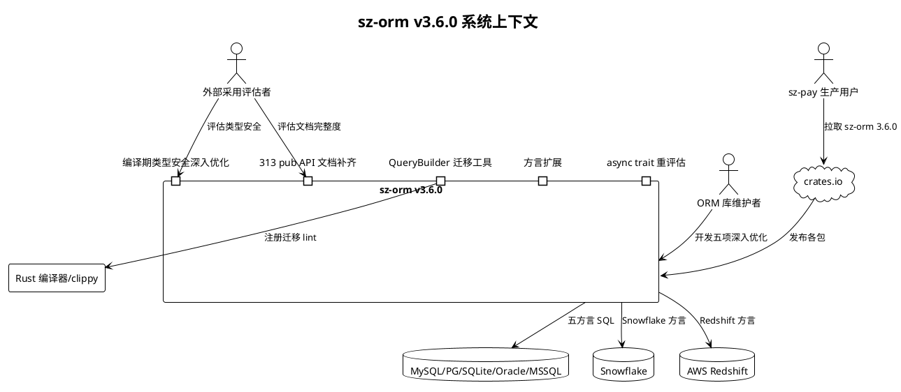
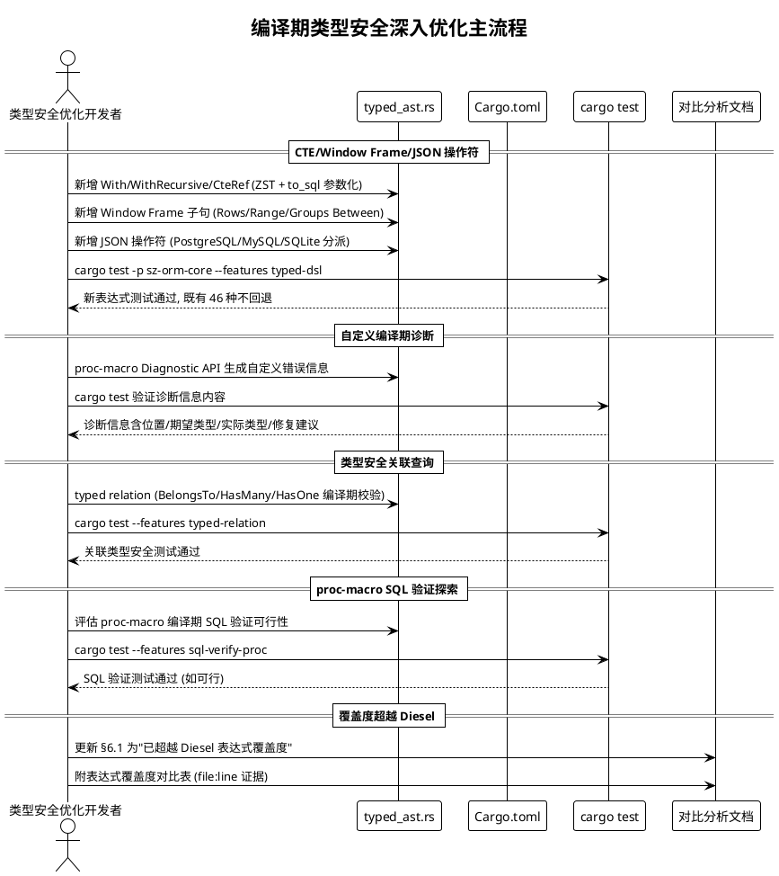
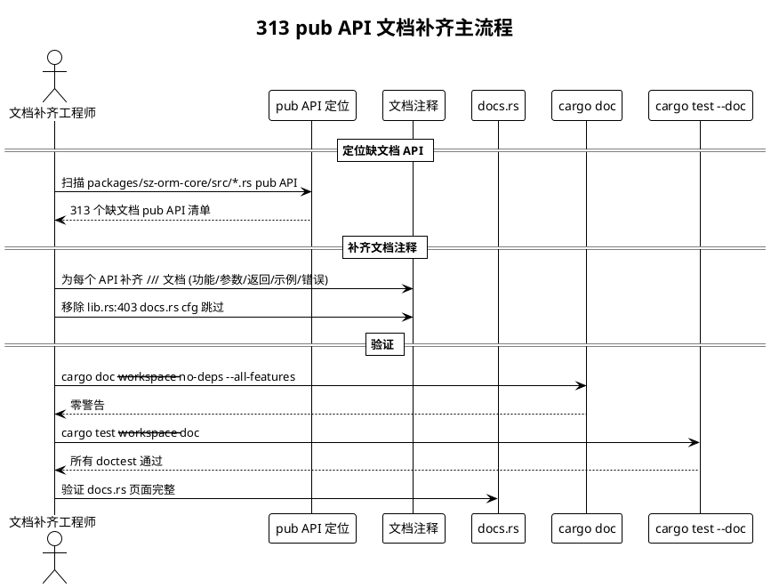
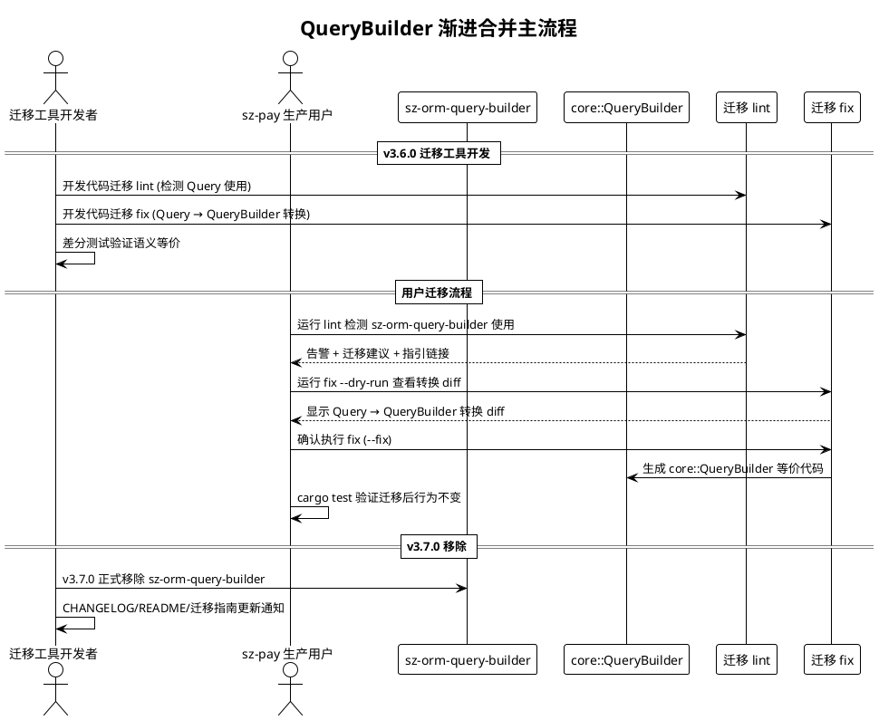
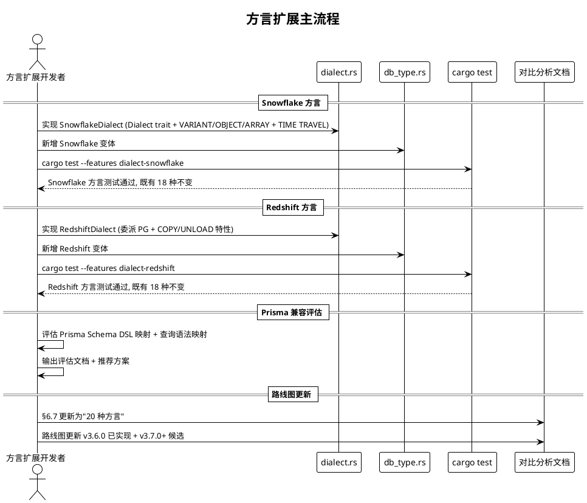
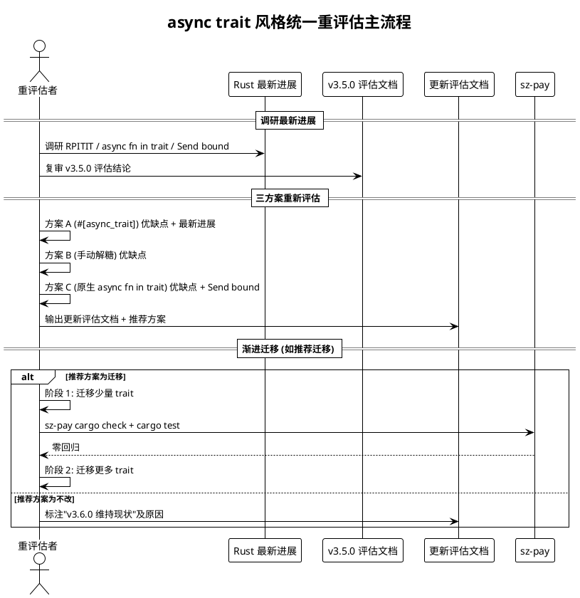

# sz-orm v3.6.0 需求规格说明书

> 版本：v3.6.0（编译期类型安全深入优化 + 313 pub API 文档补齐 + 方言扩展 + QueryBuilder 渐进合并 + async trait 风格统一重评估）
> 基线：v3.5.0（已完成：6 里程碑 / 28 主任务 / 115 子任务，6,751 passed / 0 failed / 253 ignored；补充任务 sz-pay 回归修复 + crates.io 发布 + 剩余不足评估均已完成）
> 日期：2026-08-10
> 需求格式：EARS（Ubiquitous / Event-driven / State-driven / Optional / Unwanted）
> 文档定位：需求规格（What to build），不含技术设计（How to build）
> 优先级声明：五项能力按"编译期类型安全深入优化(1,最高,超越 Diesel 核心竞争力) → 313 pub API 文档补齐(2,补竞品短板解除采用门槛) → QueryBuilder 渐进合并(3,消歧义降迁移成本) → 方言扩展(4,补企业数据库按需) → async trait 风格统一重评估(5,可选,降维护成本)"的收益/风险序推进；方向 1 为最高收益中风险（新表达式+编译期诊断，需 feature gate 隔离+自定义诊断验证），方向 2 为高收益低风险（纯文档工作不引入新代码依赖），方向 3 为中收益中风险（自动迁移工具开发需 lint 注册+fix 机械性），方向 4 为中收益中风险（新方言实现需 Rust 驱动+行为一致验证），方向 5 为低收益低风险（仅评估不强制实施）
> 需求编号约定：REQ-TS-xxx（编译期类型安全深入优化）/ REQ-DOC-API-xxx（313 pub API 文档补齐）/ REQ-QB-MIG-xxx（QueryBuilder 渐进合并）/ REQ-DIALECT-xxx（方言扩展）/ REQ-ASYNC-xxx（async trait 风格统一重评估）
> 缺陷来源：用户 5 项深入优化请求 + 对比分析文档 §6 剩余 4 项不足（§6.1 生态成熟度 / §6.2 文档完整度 / §6.3 社区规模 / §6.4 生产案例）+ v3.5.0 方言扩展路线图（§10.4.2 建议 v3.6.0 实现 Snowflake/Redshift）
> 兼容性铁律：所有改进通过 feature gate 隔离，默认 feature 行为不变，既有公开 API 完全向后兼容，v3.5.0 已验收的 6,751 测试基线不回退；QueryBuilder 自动迁移工具不自动修改用户代码，仅提供 lint 告警与 fix 建议；async trait 重评估不强制迁移，既有 Connection trait 签名在评估期内保持不变

---

# 1. 组件定位

## 1.1 核心职责

本组件负责交付 sz-orm v3.6.0 的五项深入优化任务：编译期类型安全深入优化（补齐 CTE/Window Frame/JSON 操作符等 SQL 构造、增强编译期错误诊断、完善类型安全关联查询、探索 proc-macro 编译期 SQL 验证，目标超越 Diesel 表达式覆盖度）、313 个 pub API 文档补齐（使 cargo doc 零警告 + docs.rs 完整）、QueryBuilder 渐进合并（提供自动迁移 lint/fix 工具 + v3.7.0 移除路线图）、方言扩展（Snowflake/Redshift 等云数仓 + Prisma 方言兼容评估）、async trait 风格统一重评估（基于 Rust RPITIT 等最新进展重新评估），实现 sz-orm 在"编译期类型安全成熟度超越 Diesel、文档完整度对齐竞品、API 歧义消除与迁移自动化、方言覆盖度扩展、代码风格统一"五个维度的深入优化，且不破坏现有 API 兼容性与 v3.5.0 已验收基线。

## 1.2 核心输入

1. **v3.5.0 已验收基线**：6,751 passed / 0 failed / 253 ignored（`docs/spec/v3.5.0/spec.md` 记录），作为不回退基准。
2. **v3.5.0 typed_ast 46 种表达式**：`packages/sz-orm-core/src/typed_ast.rs` 已对齐 Diesel 46 种表达式（Eq/Ne/Lt/Gt/Le/Ge/And/Or/Like/In/Not + 聚合/算术/字符串/日期/窗口/NULL 处理/BETWEEN/DISTINCT/子查询/类型转换），作为深入优化的基础。
3. **用户深入优化需求**：用户提出 5 项 v3.6.0 方向（编译期类型安全深入 / 313 API 文档 / 方言扩展 / QueryBuilder 渐进合并 / async trait 重评估），作为本版本需求来源。
4. **对比分析剩余 4 项不足**：`docs/sz-orm与同类产品对比分析.md` §6 剩余 4 项（§6.1 生态成熟度 / §6.2 文档完整度 313 API / §6.3 社区规模 / §6.4 生产案例），其中 §6.2 为纯代码工作可由本版本改进，§6.1 通过超越 Diesel 表达式覆盖度改进，§6.3/6.4 非代码工作不在本版本范畴。
5. **v3.5.0 方言扩展路线图**：`docs/spec/v3.5.0/spec.md` §10.4.2 建议 v3.6.0 实现 Snowflake/Redshift，作为方言扩展的需求来源。
6. **v3.5.0 QueryBuilder deprecated 现状**：`packages/sz-orm-query-builder/src/lib.rs:214` 已标注 `#[deprecated]`，`docs/query-builder-guide.md` 选择指南已完成，v3.6.0 需提供自动迁移工具，作为 QueryBuilder 渐进合并的需求来源。
7. **v3.5.0 async trait 评估现状**：`docs/async-trait-evaluation.md` 已完成评估（329 行），v3.5.0 选择不改，v3.6.0 需基于 Rust 最新进展（RPITIT - Return Position Impl Trait In Trait，Rust 1.75+ 稳定）重新评估，作为 async trait 重评估的需求来源。
8. **313 个 pub API 文档缺口**：`packages/sz-orm-core/src/lib.rs:403` docs.rs cfg 跳过导致 313 个 pub API 缺 `///` 文档注释，v3.5.0 已新增 doc-completion feature（`packages/sz-orm-core/Cargo.toml:42`）但未补齐文档，作为文档补齐的需求来源。
9. **Diesel 表达式覆盖度对标基准**：Diesel 2.2.x 支持的表达式 + SQL 构造（CTE/Window Frame/JSON 操作符/关联查询类型安全等），作为编译期类型安全超越 Diesel 的对标基准。
10. **Rust async trait 最新进展**：RPITIT（Return Position Impl Trait In Trait，Rust 1.75+ 稳定）、async fn in trait（无需 `#[async_trait]` 宏）、GAT 在 async 场景的成熟度，作为 async trait 重评估的技术输入。
11. **Prisma 方言兼容参考**：Prisma Schema DSL 与 SQL 方言的映射关系，作为 Prisma 方言兼容评估的输入。
12. **五方言覆盖约束**：MySQL/PostgreSQL/SQLite/Oracle/MSSQL，所有新能力必须保持五方言行为一致。
13. **既有 feature gate 体系**：`packages/sz-orm-core/Cargo.toml:13-64` 已有 25+ feature（含 typed-dsl/l1-cache/dialect-cockroachdb/dialect-yugabytedb/doc-completion/migration-guide 等），作为新能力 feature gate 隔离的基础。
14. **sz-pay 生产依赖证据**：`E:\vue\test\sz-pay\server\sz-rust\Cargo.toml` 从 crates.io 拉取 sz-orm-* 3.5.0 版本（v3.5.0 补充任务已发布），作为 API 兼容性验证的下游基准。
15. **crates.io token**：`E:\vue\test\鲜视达\服务器信息.md` 记录 crates.io token，作为 v3.6.0 发布的凭证。

## 1.3 核心输出

1. **编译期类型安全深入优化能力**：CTE/Window Frame/JSON 操作符等新 SQL 构造表达式 + 自定义编译期诊断信息 + 类型安全关联查询（typed relation）+ proc-macro 编译期 SQL 验证探索，通过 `typed-dsl`/`typed-relation`/`sql-verify-proc` feature gate 隔离。
2. **313 pub API 文档补齐能力**：所有 313 个 pub API 补齐 `///` 文档注释，`cargo doc --workspace --no-deps --all-features` 零警告，docs.rs 页面完整。
3. **QueryBuilder 自动迁移工具**：代码迁移 lint（检测 sz-orm-query-builder 使用）+ 自动 fix 建议（生成 core::QueryBuilder 等价代码）+ v3.7.0 移除路线图。
4. **方言扩展能力**：Snowflake 方言（云数仓）+ Redshift 方言（AWS 云数仓）+ Prisma 方言兼容评估，通过 `dialect-snowflake`/`dialect-redshift`/`dialect-prisma` feature gate 隔离。
5. **async trait 风格统一重评估能力**：基于 Rust RPITIT 等最新进展的重新评估文档 + 推荐方案 + 渐进迁移计划（如评估支持）。
6. **需求追溯矩阵**：本文档第 7 章，建立需求 ↔ 验收条件映射。
7. **验收标准总览**：本文档第 9 章，按方向汇总验收条件。

## 1.4 职责边界

本组件**不负责**以下事项：

1. **不重写 typed_ast 既有 46 种表达式**：深入优化以扩展方式提供（新增 CTE/Window Frame/JSON 操作符等表达式类型），既有 46 种表达式保持完全向后兼容。
2. **不破坏既有公开 API**：所有新能力通过 feature gate 隔离，既有公开 API（QueryBuilder/L1Cache/L2Cache/Connection trait/Dialect 等）签名保持完全向后兼容。
3. **不自动修改用户代码**：QueryBuilder 自动迁移工具仅提供 lint 告警与 fix 建议，不自动修改用户代码（需用户确认后执行 fix）。
4. **不立即移除 sz-orm-query-builder**：v3.6.0 提供自动迁移工具，v3.7.0 才正式移除 sz-orm-query-builder，v3.6.0 保持 sz-orm-query-builder 可用（标注 deprecated）。
5. **不强制 async trait 风格迁移**：async trait 重评估仅输出评估文档与推荐方案，不强制实施迁移，既有 Connection trait 签名在评估期内保持不变。
6. **不实现所有候选方言**：方言扩展仅对"必须实现"的方言（Snowflake/Redshift）生成 EARS 需求并实施，Prisma 方言仅评估兼容性不强制实现，其他候选方言仅规划不实施。
7. **不修改 sz-pay / sz-rust 下游代码**：下游零回归通过 feature gate 默认关闭 + crates.io 版本兼容保证，本组件仅提供上游就绪验证（ADR-0001 严禁修改下游/上游仓库）。
8. **不降低既有测试覆盖**：v3.6.0 不得使 v3.5.0 已验收的 6,751 测试基线回退，仅增不减。
9. **不引入新重依赖到默认 feature**：所有新能力通过 feature gate 隔离，默认 feature 不引入额外依赖与行为变更。
10. **不改变既有安全铁律**：任何 WHERE 条件必须参数化，默认禁止 `SELECT *`，N+1 检测自动拦截，AI 输出不自动执行，沿用 v3.5.0 既有铁律。
11. **不负责社区规模扩展（§6.3）**：对比分析文档 §6.3 指出社区规模小，但社区运营非代码改进范畴，v3.6.0 不包含。
12. **不负责扩展生产案例（§6.4）**：对比分析文档 §6.4 指出生产案例仅一个（sz-pay），需外部采纳，v3.6.0 不包含。
13. **不负责 LLM 模型训练与托管**：沿用 v3.3.0 既有边界。

---

# 2. 领域术语

**编译期类型安全深入优化（Compile-Time Type Safety Deep Optimization）**
: 在 v3.5.0 已对齐 Diesel 46 种表达式的基础上，补齐更多 SQL 构造（CTE/Window Frame/JSON 操作符）、增强编译期错误诊断（自定义诊断信息）、完善类型安全关联查询（typed relation）、探索 proc-macro 编译期 SQL 验证，目标在表达式覆盖度上超越 Diesel。
: 备注：v3.5.0 已对齐 Diesel，v3.6.0 目标是超越。

**CTE 表达式（Common Table Expression）**
: SQL 公用表表达式，`WITH cte_name AS (subquery) SELECT ...`，支持递归 CTE（`WITH RECURSIVE`），用于复杂查询分解与复用。
: 备注：Diesel 2.2.x 支持 CTE，SZ-ORM typed_ast.rs v3.5.0 未实现，v3.6.0 补齐。

**Window Frame 表达式（Window Frame Expression）**
: SQL 窗口函数 FRAME 子句，`OVER (PARTITION BY ... ORDER BY ... ROWS BETWEEN ... AND ...)` / `RANGE BETWEEN ... AND ...` / `GROUPS BETWEEN ... AND ...`，用于精确控制窗口范围。
: 备注：v3.5.0 已补齐窗口函数（Over/PartitionBy/Lag/Lead/RowNumber/Rank/DenseRank），但未补齐 FRAME 子句（ROWS/RANGE/GROUPS BETWEEN），v3.6.0 补齐。

**JSON 操作符表达式（JSON Operator Expression）**
: SQL JSON 操作符，包括 PostgreSQL `->`/`->>`/`#>`/`#>>`（JSON 字段访问）、MySQL `JSON_EXTRACT`/`JSON_UNQUOTE`/`->`/`->>`、SQLite `json_extract`/`->`/`->>`，用于 JSON 数据查询。
: 备注：Diesel 支持 JSON 操作符（diesel-json crate），SZ-ORM v3.5.0 未实现，v3.6.0 补齐。

**自定义编译期诊断信息（Custom Compile-Time Diagnostic）**
: 通过 proc-macro 的 `Diagnostic` API 或 `compile_error!` 生成的自定义编译期错误信息，比 Rust 默认类型不匹配错误更清晰，指明错误位置、期望类型、实际类型、修复建议。
: 备注：Diesel 的编译期错误信息较为友好，SZ-ORM v3.5.0 依赖 Rust 默认错误信息，v3.6.0 增强。

**类型安全关联查询（Typed Relation / Type-Safe Relation Query）**
: 在 typed_ast DSL 中类型安全地表达 Model 之间的关联查询（BelongsTo/HasMany/HasOne 等），编译期校验关联的外键类型匹配与表归属，避免运行时关联错误。
: 备注：v3.5.0 typed_ast 专注单表表达式，关联查询通过 EagerLoader（`eager_loader.rs:129`）运行时实现，v3.6.0 探索编译期类型安全关联。

**proc-macro 编译期 SQL 验证（Proc-Macro Compile-Time SQL Verification）**
: 通过 proc-macro 在编译期解析 SQL 字符串，校验 SQL 语法 + 表/列存在性 + 类型匹配，类似 sqlx::query! 宏但扩展到 sz-orm 的 QueryBuilder 生态。
: 备注：v3.5.0 已有 `query!` 宏的 db-verify feature（`packages/sz-orm-macros/Cargo.toml` db-verify），v3.6.0 探索更深入的 proc-macro SQL 验证。

**313 pub API 文档缺口（313 pub API Documentation Gap）**
: `packages/sz-orm-core/src/lib.rs:403` docs.rs cfg 跳过导致 313 个 pub API 缺 `///` 文档注释，cargo doc 产生 missing_docs 警告，docs.rs 页面不完整。
: 备注：v3.5.0 已新增 doc-completion feature（`Cargo.toml:42`）但未补齐文档，v3.6.0 补齐。

**QueryBuilder 自动迁移工具（QueryBuilder Auto-Migration Tool）**
: 检测 sz-orm-query-builder 使用并提供自动迁移到 core::QueryBuilder 的 lint + fix 工具，降低用户迁移成本，为 v3.7.0 正式移除 sz-orm-query-builder 做准备。
: 备注：v3.5.0 已标注 deprecated + 选择指南，v3.6.0 提供自动化工具。

**代码迁移 lint（Code Migration Lint）**
: 注册到 Rust 编译器或 clippy 的 lint 规则，检测 sz-orm-query-builder 的 `Query` 类型使用，输出告警与迁移建议。
: 备注：可通过 clippy custom lint 或独立工具实现。

**代码迁移 fix（Code Migration Fix）**
: 自动将 sz-orm-query-builder 的 `Query` 代码转换为 core::QueryBuilder 的等价代码，需用户确认后执行（不自动修改）。
: 备注：类似 clippy --fix 的机械性转换，复杂场景需人工审查。

**Snowflake 方言（Snowflake Dialect）**
: Snowflake 云数据仓库的 SQL 方言，基于 ANSI SQL 扩展，支持 VARIANT/OBJECT/ARRAY 半结构化类型、COPY INTO 数据加载、TIME TRAVEL 时间旅行查询等特性。
: 备注：v3.5.0 方言扩展路线图（§10.4.2）建议 v3.6.0 实现，Hibernate/SQLAlchemy 支持 Snowflake。

**Redshift 方言（Redshift Dialect）**
: AWS Redshift 云数据仓库的 SQL 方言，基于 PostgreSQL 8.0.2 扩展，大部分 SQL 语法与 PostgreSQL 兼容，可通过委派 PostgreSqlDialect + Redshift 特性扩展实现。
: 备注：v3.5.0 方言扩展路线图（§10.4.2）建议 v3.6.0 实现，SQLAlchemy 支持 Redshift。

**Prisma 方言兼容（Prisma Dialect Compatibility）**
: Prisma Schema DSL 与 sz-orm 方言的兼容性评估，探索 sz-orm 是否能支持 Prisma 风格的 Schema 定义与查询。
: 备注：Prisma 是 TypeScript/Node.js 生态的 ORM，本评估探索跨生态兼容可能性，v3.6.0 仅评估不强制实现。

**RPITIT（Return Position Impl Trait In Trait）**
: Rust 1.75+ 稳定的特性，允许在 trait 方法返回类型使用 `impl Trait`，使 async fn in trait 无需 `#[async_trait]` 宏即可使用（但有 Send bound 限制）。
: 备注：v3.5.0 评估时 RPITIT 已稳定但 Send bound 限制未完全解决，v3.6.0 重新评估最新进展。

**async fn in trait（原生 async trait 方法）**
: Rust 原生支持 trait 中 async fn 方法（通过 RPITIT），无需 `#[async_trait]` 宏手动解糖，但有 Send bound 与 dyn trait 限制。
: 备注：v3.5.0 评估选择不改，v3.6.0 基于 Rust 最新进展重新评估。

---

# 3. 角色与边界

## 3.1 核心角色

- **ORM 库维护者**：执行 v3.6.0 五项深入优化任务的开发、验证、测试操作者，是新增能力的主要使用者与验收人。
- **编译期类型安全深入优化开发者**：负责 typed_ast.rs 新 SQL 构造表达式补齐、自定义诊断信息、类型安全关联查询、proc-macro SQL 验证探索的开发者，关注超越 Diesel 表达式覆盖度。
- **pub API 文档补齐工程师**：负责为 313 个 pub API 补齐 `///` 文档注释的技术文档工程师，关注 cargo doc 零警告与 docs.rs 完整。
- **QueryBuilder 迁移工具开发者**：负责开发代码迁移 lint + fix 工具的开发者，关注迁移自动化与 v3.7.0 移除路线图。
- **方言扩展开发者**：负责 Snowflake/Redshift 方言实现与 Prisma 兼容评估的开发者，关注云数仓支持与五方言行为一致。
- **async trait 重评估者**：负责基于 Rust RPITIT 等最新进展重新评估 async trait 风格统一的评估者，关注 Send bound 与迁移影响。
- **sz-pay 生产用户**：依赖 sz-orm 的下游项目方，关注 v3.6.0 升级是否零回归与 crates.io 版本可用。
- **外部采用评估者**：评估是否采用 sz-orm 的外部开发者，关注文档完整度、编译期类型安全成熟度、迁移工具可用性。

## 3.2 外部系统

- **crates.io**：Rust 包注册表，v3.6.0 各包发布目标，sz-pay 从此拉取依赖。
- **sz-pay 项目**：`E:\vue\test\sz-pay\server\sz-rust`，sz-orm 唯一生产用户，从 crates.io 拉取 7 个包 3.5.0 版本，v3.6.0 发布后可升级。
- **Diesel**：Rust ORM 竞品，编译期类型安全深入优化的对标基准（目标超越）。
- **Snowflake**：云数据仓库，Snowflake 方言实现的目标数据库。
- **AWS Redshift**：AWS 云数据仓库，Redshift 方言实现的目标数据库。
- **Prisma**：TypeScript/Node.js 生态 ORM，Prisma 方言兼容评估的参考对象。
- **Rust 编译器 / clippy**：QueryBuilder 迁移 lint 的注册目标（clippy custom lint 或独立工具）。
- **MySQL / PostgreSQL / SQLite / Oracle / SQL Server**：五方言覆盖约束，所有新能力必须保持行为一致。

## 3.3 交互上下文



---

# 4. DFX约束

## 4.1 性能

1. **新 SQL 构造表达式零成本抽象**：新增 CTE/Window Frame/JSON 操作符等表达式类型必须为零大小类型（ZST），仅在编译期携带类型信息，运行时无额外开销，与既有 46 种表达式一致。
2. **自定义编译期诊断零运行时开销**：自定义诊断信息仅在编译期生成，不引入运行时开销，编译产物大小不增加。
3. **QueryBuilder 迁移 lint 零运行时开销**：迁移 lint 仅在编译期/clippy 检查时运行，不引入运行时开销。
4. **新方言实现不回退既有性能**：Snowflake/Redshift 方言实现不得使既有 18 种方言的查询构造性能回退。
5. **feature gate 隔离零默认开销**：所有新能力通过 feature gate 隔离，默认 feature 关闭时编译产物大小与运行时开销与 v3.5.0 一致。

## 4.2 可靠性

1. **v3.5.0 测试基线不回退**：v3.6.0 不得使 v3.5.0 已验收的 6,751 passed / 0 failed / 253 ignored 基线回退，仅增不减。
2. **crates.io 发布版本兼容**：v3.6.0 发布到 crates.io 的各包必须与 sz-pay 当前拉取的 3.5.0 版本兼容（SemVer 语义化版本），sz-pay 可平滑升级。
3. **新 SQL 构造五方言行为一致**：CTE/Window Frame/JSON 操作符等新表达式在 MySQL/PostgreSQL/SQLite/Oracle/MSSQL 五方言行为必须一致（不支持的方言返回 Err 而非静默错误）。
4. **QueryBuilder 迁移工具语义保持**：自动 fix 生成的 core::QueryBuilder 代码与原 sz-orm-query-builder 代码语义必须等价（差分测试验证）。
5. **新方言行为与竞品一致**：Snowflake/Redshift 方言生成的 SQL 必须与 Snowflake/Redshift 官方文档行为一致。

## 4.3 安全性

1. **新 SQL 构造表达式参数化**：新增 CTE/Window Frame/JSON 操作符等表达式生成的 SQL 必须使用参数化占位符（`?`），禁止字符串拼接，沿用 v3.5.0 SQL 注入防护铁律。
2. **proc-macro SQL 验证不执行危险 SQL**：编译期 SQL 验证仅执行 EXPLAIN/EXPLAIN QUERY PLAN，不执行 INSERT/UPDATE/DELETE 等修改数据的 SQL。
3. **crates.io 发布不泄露 secrets**：发布产物不得包含 .env / credentials / token 等敏感信息，发布脚本预检。
4. **QueryBuilder 迁移工具不泄露敏感信息**：迁移 lint/fix 输出不包含数据库连接字符串/密码等敏感信息。

## 4.4 可维护性

1. **313 pub API 文档补齐降采用门槛**：文档补齐后 docs.rs 页面完整，新人可通过文档理解 API，降低采用与维护门槛。
2. **自定义编译期诊断降调试成本**：自定义诊断信息比 Rust 默认错误更清晰，降低用户调试类型不匹配错误的成本。
3. **QueryBuilder 迁移工具降迁移成本**：自动 lint/fix 工具降低用户从 sz-orm-query-builder 迁移到 core::QueryBuilder 的成本。
4. **所有新能力附 file:line 证据**：每条能力结论必须附真实存在的 `file:line` 代码证据，沿用审计合规铁律。

## 4.5 兼容性

1. **既有公开 API 完全向后兼容**：typed_ast 既有 46 种表达式、QueryBuilder 既有 API、Connection trait 既有签名、Dialect 既有实现、L1Cache/L2Cache 既有 API 在 v3.6.0 保持不变。
2. **feature gate 默认关闭**：所有新能力通过 feature gate 隔离，默认 feature 行为与 v3.5.0 一致。
3. **sz-orm-query-builder v3.6.0 保持可用**：v3.6.0 标注 deprecated 但保持可用，v3.7.0 才正式移除，给用户迁移周期。
4. **crates.io SemVer 兼容**：v3.6.0 版本号遵循 SemVer，minor 版本升级（3.5.0 → 3.6.0）保证向后兼容。
5. **async trait 评估期内签名不变**：async trait 重评估不强制迁移，既有 Connection trait 签名在评估期内保持不变。

---

# 5. 核心能力

## 5.1 编译期类型安全深入优化

> 现状：v3.5.0 已对齐 Diesel 46 种表达式（`packages/sz-orm-core/src/typed_ast.rs`），但用户想进一步深入优化，目标在表达式覆盖度上超越 Diesel 而非仅对齐。
> 形态：补齐更多 SQL 构造（CTE/Window Frame/JSON 操作符）、增强编译期错误提示（自定义诊断信息）、完善类型安全关联查询（typed relation）、探索 proc-macro 式编译期 SQL 验证，通过 `typed-dsl`/`typed-relation`/`sql-verify-proc` feature gate 隔离，既有 46 种表达式保持完全向后兼容。

### 5.1.1 业务规则

1. **CTE 表达式补齐**（EARS: Ubiquitous，优先级：high，来源：用户/技术演进）
   系统应当在 typed_ast.rs 补齐 CTE（Common Table Expression）表达式类型 With/WithRecursive/CteRef，支持 `WITH cte_name AS (subquery) SELECT ...` 与递归 `WITH RECURSIVE`，每个表达式为零大小类型（ZST）+ TypedExpression trait 实现 + to_sql 生成参数化 SQL，通过 `typed-dsl` feature gate 隔离，既有 46 种表达式不变。
   a. 验收条件：[typed_ast.rs 新增 With/WithRecursive/CteRef] → [每个表达式为 ZST；TypedExpression trait 实现完整；to_sql 生成 `WITH cte AS (...) SELECT ...`；递归 CTE 生成 `WITH RECURSIVE`；`cargo test -p sz-orm-core --features typed-dsl` 通过；既有 46 种表达式测试不回退]

2. **Window Frame 表达式补齐**（EARS: Ubiquitous，优先级：high，来源：用户/技术演进）
   系统应当在 typed_ast.rs 补齐 Window Frame 子句表达式类型 RowsFrame/RangeFrame/GroupsFrame/FrameBetween/FrameUnboundedPreceding/FrameCurrentRow，支持 `OVER (PARTITION BY ... ORDER BY ... ROWS BETWEEN ... AND ...)` / `RANGE BETWEEN` / `GROUPS BETWEEN`，通过 `typed-dsl` feature gate 隔离，与 v3.5.0 既有窗口函数（Over/PartitionBy/Lag/Lead/RowNumber/Rank/DenseRank）协作。
   a. 验收条件：[typed_ast.rs 新增 Window Frame 表达式] → [to_sql 生成 `ROWS BETWEEN ... AND ...`/`RANGE BETWEEN ... AND ...`/`GROUPS BETWEEN ... AND ...`；支持 UNBOUNDED PRECEDING/CURRENT ROW/UNBOUNDED FOLLOWING；与既有窗口函数协作；`cargo test` 通过]

3. **JSON 操作符表达式补齐**（EARS: Ubiquitous，优先级：high，来源：用户/技术演进）
   系统应当在 typed_ast.rs 补齐 JSON 操作符表达式类型 JsonGet/JsonGetText/JsonPathGet/JsonPathGetText/JsonContains/JsonExists，支持 PostgreSQL `->`/`->>`/`#>`/`#>>`、MySQL `JSON_EXTRACT`/`JSON_UNQUOTE`/`->`/`->>`、SQLite `json_extract`/`->`/`->>`，通过 `typed-dsl` feature gate 隔离，按方言分派生成对应 SQL。
   a. 验收条件：[typed_ast.rs 新增 JSON 操作符表达式] → [PostgreSQL 生成 `col->'key'`/`col->>'key'`/`col#>'{path}'`/`col#>>'{path}'`；MySQL 生成 `JSON_EXTRACT(col, '$.key')`/`JSON_UNQUOTE(...)`/`col->'$.key'`；SQLite 生成 `json_extract(col, '$.key')`；`cargo test` 通过]

4. **自定义编译期诊断信息**（EARS: Ubiquitous，优先级：high，来源：用户/技术演进）
   系统应当为 typed_ast DSL 的类型不匹配错误提供自定义编译期诊断信息，通过 proc-macro 的 `Diagnostic` API 或 `compile_error!` 生成，诊断信息包含：错误位置（列名/表达式）、期望类型（Expected SqlType）、实际类型（Found SqlType）、修复建议（如"请使用 Cast 显式转换"或"请检查列归属表"），比 Rust 默认类型不匹配错误更清晰，通过 `typed-dsl` feature gate 隔离。
   a. 验收条件：[typed_ast 类型不匹配错误触发] → [自定义诊断信息输出（含错误位置/期望类型/实际类型/修复建议）；诊断信息比 Rust 默认错误更清晰；`cargo test` 验证诊断信息内容]

5. **类型安全关联查询（typed relation）**（EARS: Ubiquitous，优先级：medium，来源：用户/技术演进）
   系统应当探索并实现类型安全关联查询（typed relation），在 typed_ast DSL 中类型安全地表达 Model 之间的关联查询（BelongsTo/HasMany/HasOne），编译期校验关联的外键类型匹配与表归属，通过 `typed-relation` feature gate 隔离，与既有 EagerLoader（`eager_loader.rs:129`）运行时关联协作。
   a. 验收条件：[typed relation 实现完成] → [BelongsTo/HasMany/HasOne 关联类型安全表达；编译期校验外键类型匹配；编译期校验表归属；与 EagerLoader 协作；`cargo test --features typed-relation` 通过]

6. **proc-macro 编译期 SQL 验证探索**（EARS: Optional，优先级：medium，来源：用户/技术演进）
   如果 v3.6.0 评估 proc-macro 编译期 SQL 验证可行，系统可能探索通过 proc-macro 在编译期解析 SQL 字符串，校验 SQL 语法 + 表/列存在性 + 类型匹配，扩展 v3.5.0 既有 `query!` 宏的 db-verify feature（`packages/sz-orm-macros/Cargo.toml` db-verify）到 sz-orm 的 QueryBuilder 生态，通过 `sql-verify-proc` feature gate 隔离。
   a. 验收条件：[proc-macro SQL 验证评估可行] → [编译期解析 SQL 字符串；校验 SQL 语法；校验表/列存在性（连真 DB）；校验类型匹配；仅执行 EXPLAIN 不执行修改 SQL；`cargo test --features sql-verify-proc` 通过]

7. **表达式覆盖度超越 Diesel**（EARS: State-driven，优先级：high，来源：用户/对比分析）
   在补齐 CTE/Window Frame/JSON 操作符等表达式后的状态下，系统应当超越 Diesel 同等表达式覆盖度（Diesel 2.2.x 表达式 + CTE + Window Frame + JSON + 关联查询全覆盖），并在对比分析文档 §6.1 更新"编译期类型安全生态成熟度不及 Diesel"为"已超越 Diesel 表达式覆盖度"。
   a. 验收条件：[typed_ast 表达式覆盖度超越 Diesel] → [对比分析文档 §6.1 更新；表达式覆盖度对比表附 file:line 证据；覆盖度数量 > Diesel；`cargo test --features typed-dsl,typed-relation` 全通过]

8. **禁止项 — 新表达式引入运行时开销**（EARS: Unwanted，优先级：high，来源：技术约束）
   如果新增表达式类型引入运行时开销（非 ZST、非零成本抽象），则系统应当通过编译期断言（`static_assert!(size_of::<T>() == 0)`）与基准测试杜绝，禁止违反零成本抽象原则。
   a. 验收条件：[新增表达式非 ZST] → [编译期断言失败阻断编译；基准测试显示运行时开销增加则告警]

9. **禁止项 — 新表达式 SQL 注入**（EARS: Unwanted，优先级：high，来源：安全约束）
   如果新增 CTE/Window Frame/JSON 操作符等表达式生成的 SQL 使用字符串拼接而非参数化占位符，则系统应当通过 SQL 注入扫描（`scripts/check-sql-injection.ps1`）杜绝，禁止 SQL 注入。
   a. 验收条件：[新表达式 SQL 生成] → [使用参数化占位符（`?`）；`scripts/check-sql-injection.ps1` 通过；无字符串拼接]

### 5.1.2 交互流程



### 5.1.3 异常场景

1. **新表达式在部分方言不支持**
   a. 触发条件：如 CTE 在旧版 MySQL（< 8.0）不支持、Window Frame 在 SQLite < 3.25 不支持、JSON 操作符各方言语法差异大
   b. 系统行为：to_sql 按方言+版本分派，不支持的方言/版本返回 Err(UnsupportedFeature)，编译期不阻断（运行时按方言处理）
   c. 用户感知：不支持的方言调用返回 Err(UnsupportedFeature)，文档标注各方言版本支持矩阵

2. **自定义诊断信息与 Rust 默认错误冲突**
   a. 触发条件：自定义诊断信息与 Rust 默认类型不匹配错误同时输出，信息冗余
   b. 系统行为：自定义诊断信息优先输出，抑制 Rust 默认错误（通过 proc-macro 展开控制），或两者协同（自定义诊断 + Rust 错误位置定位）
   c. 用户感知：用户看到清晰的诊断信息，不困惑于冗余错误

3. **类型安全关联查询过于严格拒绝合法关联**
   a. 触发条件：typed relation 编译期校验拒绝合法的多态关联（MorphMany/MorphTo）或自引用关联
   b. 系统行为：提供 escape hatch（运行时关联回退到 EagerLoader），类型安全关联保持严格（编译期安全优先）
   c. 用户感知：合法关联用 typed relation，复杂关联回退 EagerLoader，文档标注适用场景

4. **proc-macro SQL 验证编译时间显著增加**
   a. 触发条件：proc-macro 编译期连真 DB 验证导致编译时间显著增加（每次编译都连 DB）
   b. 系统行为：缓存验证结果（按 SQL 哈希缓存），仅 SQL 变更时重新验证，默认关闭（需 `sql-verify-proc` feature + `SZ_ORM_QUERY_VERIFY=1` 环境变量）
   c. 用户感知：默认关闭不影响编译时间，启用时缓存优化，文档标注编译时间影响

## 5.2 313 个 pub API 文档补齐

> 现状：`packages/sz-orm-core/src/lib.rs:403` docs.rs cfg 跳过导致 313 个 pub API 缺 `///` 文档注释，v3.5.0 已新增 doc-completion feature（`packages/sz-orm-core/Cargo.toml:42`）但未补齐文档，对比分析文档 §6.2 指出文档完整度不及竞品。
> 形态：为所有 313 个 pub API 补齐 `///` 文档注释（功能/参数/返回/示例/错误），移除 docs.rs cfg 跳过，使 `cargo doc --workspace --no-deps --all-features` 零警告，docs.rs 页面完整。

### 5.2.1 业务规则

1. **313 pub API 文档补齐**（EARS: Ubiquitous，优先级：high，来源：用户/对比分析）
   系统应当为所有 313 个缺文档的 pub API 补齐 `///` 文档注释，每个 API 的文档注释包含：功能描述（一句话说明 API 作用）、参数说明（每个参数的含义与类型约束）、返回值说明（返回值含义与类型）、示例代码（`# Examples` + 可运行 doctest）、错误说明（`# Errors` + 可能返回的 Err 及触发条件），文档注释遵循 rustdoc 规范。
   a. 验收条件：[313 个 pub API 文档补齐] → [每个 API 有 `///` 文档注释；含功能/参数/返回/示例/错误说明；doctest 可运行；`cargo doc --workspace --no-deps --all-features` 零 missing_docs 警告]

2. **移除 docs.rs cfg 跳过**（EARS: Ubiquitous，优先级：high，来源：用户/对比分析）
   系统应当移除 `packages/sz-orm-core/src/lib.rs:403` 的 docs.rs cfg 跳过配置（`#![cfg_attr(docsrs, feature(doc_cfg))]` 相关的 cfg 跳过），使 docs.rs 页面展示所有 pub API 文档，不再跳过缺文档的 API。
   a. 验收条件：[docs.rs cfg 跳过移除] → [`lib.rs:403` cfg 跳过配置移除；docs.rs 页面展示所有 pub API；无跳过的 API]

3. **cargo doc 零警告**（EARS: Ubiquitous，优先级：high，来源：用户/对比分析）
   系统应当使 `cargo doc --workspace --no-deps --all-features` 执行零警告（无 missing_docs / broken_intra_doc_links / private_intra_doc_links 等警告），docs.rs 页面完整可浏览。
   a. 验收条件：[cargo doc 执行] → [零警告；无 missing_docs；无 broken_intra_doc_links；docs.rs 页面完整可浏览]

4. **doctest 通过**（EARS: Ubiquitous，优先级：high，来源：技术约束）
   系统应当使所有补齐的文档注释中的 doctest 可运行且通过，`cargo test --workspace --doc` 零失败，doctest 示例代码与 API 实际行为一致。
   a. 验收条件：[cargo test --workspace --doc 执行] → [所有 doctest 通过；示例代码与 API 实际行为一致；零失败]

5. **文档注释与代码实际行为一致**（EARS: Ubiquitous，优先级：high，来源：技术约束）
   系统应当保证补齐的文档注释与代码实际行为一致，文档描述的参数约束/返回值/错误条件与代码实现一致，通过 doctest + 代码审查验证。
   a. 验收条件：[文档注释与代码一致性验证] → [doctest 通过；代码审查确认一致；文档不描述代码未实现的行为]

6. **对比分析文档 §6.2 更新**（EARS: State-driven，优先级：medium，来源：对比分析）
   在 313 pub API 文档补齐完成后的状态下，系统应当在对比分析文档 §6.2 更新"文档完整度不及竞品（313 pub API 缺文档）"为"文档完整度已对齐竞品（313 pub API 文档补齐完成）"。
   a. 验收条件：[313 pub API 文档补齐完成] → [对比分析文档 §6.2 更新；附 file:line 证据；docs.rs 页面完整]

7. **禁止项 — 文档与实际不符**（EARS: Unwanted，优先级：high，来源：技术约束）
   如果补齐的文档注释与代码实际行为不符（如文档声称某参数可选但代码要求必填、文档示例代码无法运行），则系统应当通过 doctest + 代码审查杜绝，禁止文档与实际不符。
   a. 验收条件：[文档与代码不符] → [doctest 失败阻断；代码审查发现不一致；门禁 14 阻断]

### 5.2.2 交互流程



### 5.2.3 异常场景

1. **pub API 数量变化（新增/删除）**
   a. 触发条件：v3.6.0 新增/删除 pub API 导致 313 数量变化
   b. 系统行为：重新统计缺文档 pub API 数量，补齐所有缺文档 API，文档标注实际数量
   c. 用户感知：文档完整度按实际 pub API 数量验证，不固守 313

2. **doctest 示例代码需要真实 DB 连接**
   a. 触发条件：某些 API 的示例代码需要真实 DB 连接（如 Pool::connect），doctest 默认无 DB
   b. 系统行为：示例代码用 `# ```ignore` 或 `# ```no_run` 标注不运行，或用 Mock 连接，真实 DB 示例标注 `#[ignore]`
   c. 用户感知：doctest 不依赖真实 DB，真实 DB 示例标注 ignore

3. **文档注释中的 intra-doc link 断裂**
   a. 触发条件：文档注释引用的类型/模块路径变更导致 intra-doc link 断裂
   b. 系统行为：`cargo doc` 检测 broken_intra_doc_links 警告，门禁 14 阻断，修复 link
   c. 用户感知：cargo doc 零警告保证 link 有效

## 5.3 QueryBuilder 渐进合并

> 现状：v3.5.0 已为 sz-orm-query-builder 标注 `#[deprecated]`（`packages/sz-orm-query-builder/src/lib.rs:214`）+ 提供选择指南（`docs/query-builder-guide.md`），但不立即删除。用户想了解渐进合并的具体路线图和时间表。
> 形态：v3.6.0 提供自动迁移工具（代码迁移 lint 检测 sz-orm-query-builder 使用 + 自动 fix 建议生成 core::QueryBuilder 等价代码），制定 v3.7.0 正式移除 sz-orm-query-builder 的路线图，v3.6.0 保持 sz-orm-query-builder 可用（标注 deprecated）。

### 5.3.1 业务规则

1. **代码迁移 lint 开发**（EARS: Ubiquitous，优先级：medium，来源：用户）
   系统应当开发 QueryBuilder 代码迁移 lint，检测 sz-orm-query-builder 的 `Query` 类型使用（`use sz_orm_query_builder::Query` / `Query::select()` / `Query::insert()` 等），输出告警信息（含迁移建议 + core::QueryBuilder 等价 API 指引 + 选择指南链接），lint 可注册到 clippy（custom lint）或作为独立工具运行。
   a. 验收条件：[代码迁移 lint 开发完成] → [检测 sz-orm-query-builder::Query 使用；输出告警 + 迁移建议 + 指引链接；可注册 clippy 或独立运行；`cargo test` 验证 lint 检测准确]

2. **代码迁移 fix 开发**（EARS: Ubiquitous，优先级：medium，来源：用户）
   系统应当开发 QueryBuilder 代码迁移 fix 工具，自动将 sz-orm-query-builder 的 `Query` 代码转换为 core::QueryBuilder 的等价代码（`Query::select()` → `QueryBuilder::<Model>::new()` + `.select()` 等），fix 需用户确认后执行（不自动修改），复杂场景（如 UNION/CTE/窗口函数）标注需人工审查。
   a. 验收条件：[代码迁移 fix 开发完成] → [自动转换 Query → QueryBuilder 等价代码；需用户确认执行；复杂场景标注人工审查；转换语义等价（差分测试）；`cargo test` 验证 fix 正确]

3. **迁移工具语义保持验证**（EARS: Ubiquitous，优先级：medium，来源：技术约束）
   系统应当验证迁移工具自动 fix 生成的 core::QueryBuilder 代码与原 sz-orm-query-builder 代码语义等价（生成的 SQL 相同），通过差分测试（对同一查询用 Query 和 QueryBuilder 构造，比较生成 SQL）验证。
   a. 验收条件：[差分测试验证] → [Query 与 QueryBuilder 生成 SQL 相同；差分测试覆盖所有可转换的查询类型；`cargo test` 通过]

4. **v3.7.0 移除路线图制定**（EARS: Ubiquitous，优先级：medium，来源：用户）
   系统应当制定 v3.7.0 正式移除 sz-orm-query-builder 的路线图，含：v3.6.0 提供迁移工具 + deprecated 告警、v3.6.x（x≥1）收集用户反馈优化迁移工具、v3.7.0 正式移除 sz-orm-query-builder 包（从 workspace 移除 + crates.io yank 或保留但标注 EOL）、移除前的用户通知计划（CHANGELOG / README / 迁移指南更新）。
   a. 验收条件：[v3.7.0 移除路线图制定] → [含 v3.6.0/v3.6.x/v3.7.0 各阶段计划；用户通知计划；路线图写入 spec.md + CHANGELOG]

5. **sz-orm-query-builder v3.6.0 保持可用**（EARS: Ubiquitous，优先级：medium，来源：兼容性约束）
   系统应当保持 sz-orm-query-builder 在 v3.6.0 可用（标注 deprecated 但不删除），API 完全向后兼容，sz-pay 等下游使用 sz-orm-query-builder 的代码在 v3.6.0 无需修改即可编译通过。
   a. 验收条件：[sz-orm-query-builder v3.6.0 可用] → [标注 deprecated 但不删除；API 完全兼容；sz-pay cargo check 通过（如使用）；`cargo test -p sz-orm-query-builder` 通过]

6. **禁止项 — 迁移工具自动修改用户代码**（EARS: Unwanted，优先级：high，来源：安全约束）
   如果迁移工具的 fix 在未经用户确认的情况下自动修改用户代码，则系统应当通过 fix 需用户显式确认（`--fix` 标志或交互式确认）杜绝，禁止自动修改用户代码。
   a. 验收条件：[迁移 fix 执行] → [需用户显式确认（--fix 标志或交互式）；未确认不修改；修改前显示 diff]

7. **禁止项 — 迁移引入 Breaking Change**（EARS: Unwanted，优先级：high，来源：兼容性约束）
   如果 QueryBuilder 渐进合并引入 Breaking Change（sz-orm-query-builder API 删除导致下游不兼容），则系统应当通过 v3.6.0 保持 sz-orm-query-builder 可用 + SemVer 兼容杜绝，禁止 v3.6.0 引入 Breaking Change。
   a. 验收条件：[v3.6.0 sz-orm-query-builder API] → [API 完全兼容；不删除 API；sz-pay cargo check 通过；SemVer 兼容]

### 5.3.2 交互流程



### 5.3.3 异常场景

1. **迁移 lint 误报**
   a. 触发条件：lint 误将非 sz-orm-query-builder 的 `Query` 类型（如其他库的 Query）报为需迁移
   b. 系统行为：lint 精确匹配 `sz_orm_query_builder::Query` 路径，不匹配其他库的 Query
   c. 用户感知：lint 仅检测 sz-orm-query-builder::Query，不误报

2. **迁移 fix 转换语义不等价**
   a. 触发条件：fix 自动转换的 core::QueryBuilder 代码与原 Query 代码生成 SQL 不等价（如 UNION 语义差异）
   b. 系统行为：差分测试发现不等价时标注"需人工审查"，不自动转换复杂场景
   c. 用户感知：复杂场景标注人工审查，简单场景自动转换

3. **sz-pay 使用 sz-orm-query-builder 导致 deprecated 告警**
   a. 触发条件：sz-pay 使用 sz-orm-query-builder，v3.6.0 deprecated 告警出现在 sz-pay 编译输出
   b. 系统行为：告警为 `#[deprecated]` 标准告警，不影响编译通过，sz-pay 可选择迁移或忽略
   c. 用户感知：sz-pay 编译通过但有 deprecated 告警，可选择迁移消除告警

4. **v3.7.0 移除后 sz-pay 仍依赖 sz-orm-query-builder**
   a. 触发条件：v3.7.0 正式移除 sz-orm-query-builder，但 sz-pay 未迁移仍依赖
   b. 系统行为：v3.7.0 前通过 CHANGELOG/README/迁移指南多次通知，sz-pay 需在 v3.7.0 前迁移
   c. 用户感知：用户收到多次通知，需在 v3.7.0 前完成迁移

## 5.4 方言扩展

> 现状：v3.5.0 已支持 18 种方言（8 独立 + 8 兼容 + CockroachDB + YugabyteDB），v3.5.0 方言扩展路线图（`docs/spec/v3.5.0/spec.md` §10.4.2）建议 v3.6.0 实现 Snowflake/Redshift。用户希望继续扩展方言支持，候选 ClickHouse（OLAP，已支持）、Snowflake（云数仓）、Prisma 方言兼容等。
> 形态：实现 Snowflake 方言（云数仓）+ Redshift 方言（AWS 云数仓，委派 PostgreSqlDialect + Redshift 特性扩展）+ Prisma 方言兼容评估，通过 `dialect-snowflake`/`dialect-redshift`/`dialect-prisma` feature gate 隔离，既有 18 种方言不变。

### 5.4.1 业务规则

1. **Snowflake 方言实现**（EARS: Ubiquitous，优先级：medium，来源：用户/v3.5.0 路线图）
   系统应当实现 Snowflake 方言（SnowflakeDialect），实现 Dialect trait + DbType 枚举新增 Snowflake 变体 + 方言测试 + 五方言行为一致验证，支持 Snowflake 特性：VARIANT/OBJECT/ARRAY 半结构化类型、COPY INTO 数据加载、TIME TRAVEL 时间旅行查询（`AT(OBJECT => ...)`/`BEFORE(...)`）、Snowflake 特有函数，通过 `dialect-snowflake` feature gate 隔离。
   a. 验收条件：[SnowflakeDialect 实现完成] → [Dialect trait 实现完整；DbType 新增 Snowflake 变体；支持 VARIANT/OBJECT/ARRAY 类型；支持 TIME TRAVEL 查询；方言测试通过；`cargo test --features dialect-snowflake` 通过；既有 18 种方言不变]

2. **Redshift 方言实现**（EARS: Ubiquitous，优先级：medium，来源：用户/v3.5.0 路线图）
   系统应当实现 Redshift 方言（RedshiftDialect），基于 PostgreSQL 兼容性委派 PostgreSqlDialect + Redshift 特性扩展（如 COPY 数据加载、UNLOAD 数据卸载、Redshift 特有函数），实现 Dialect trait + DbType 枚举新增 Redshift 变体 + 方言测试，通过 `dialect-redshift` feature gate 隔离。
   a. 验收条件：[RedshiftDialect 实现完成] → [委派 PostgreSqlDialect + Redshift 特性扩展；DbType 新增 Redshift 变体；支持 COPY/UNLOAD；方言测试通过；`cargo test --features dialect-redshift` 通过；既有 18 种方言不变]

3. **Prisma 方言兼容评估**（EARS: Optional，优先级：low，来源：用户）
   如果 v3.6.0 评估 Prisma 方言兼容可行，系统可能评估 sz-orm 是否能支持 Prisma 风格的 Schema 定义与查询，评估含：Prisma Schema DSL 与 sz-orm Model trait 的映射关系、Prisma 查询语法与 sz-orm QueryBuilder 的映射、跨生态兼容的技术可行性、实现难度与收益评估，输出评估文档与推荐方案，不强制实现。
   a. 验收条件：[Prisma 方言兼容评估完成] → [含 Schema DSL 映射评估；查询语法映射评估；技术可行性评估；实现难度与收益评估；推荐方案；评估文档]

4. **新方言五方言行为一致**（EARS: Ubiquitous，优先级：medium，来源：技术约束）
   系统应当保证 Snowflake/Redshift 新方言与既有 18 种方言在公共 SQL 构造（SELECT/INSERT/UPDATE/DELETE/WHERE/JOIN/GROUP BY/HAVING/ORDER BY/LIMIT/OFFSET）上行为一致，新方言特有的 SQL 构造（如 Snowflake TIME TRAVEL）仅在该方言支持，其他方言返回 Err(UnsupportedFeature)。
   a. 验收条件：[新方言五方言行为一致验证] → [公共 SQL 构造行为一致；特有构造仅该方言支持；其他方言返回 Err；`cargo test` 通过]

5. **新方言 Rust 驱动评估**（EARS: Ubiquitous，优先级：medium，来源：技术约束）
   系统应当评估 Snowflake/Redshift 的 Rust 驱动成熟度，Snowflake 评估是否有成熟 Rust 驱动（如 snowflake-api / odbc 绑定），Redshift 评估是否可通过 PostgreSQL 驱动（sqlx-postgres）连接（Redshift 兼容 PG 协议），驱动不成熟时标注"方言实现完成但需用户自备驱动"。
   a. 验收条件：[Rust 驱动评估完成] → [Snowflake 驱动评估；Redshift 驱动评估（PG 兼容）；驱动不成熟时标注；评估文档]

6. **方言扩展路线图更新**（EARS: Ubiquitous，优先级：low，来源：技术演进）
   系统应当更新方言扩展路线图（`docs/spec/v3.5.0/spec.md` §10.4.2），标注 v3.6.0 已实现 Snowflake/Redshift，更新 v3.7.0+ 候选方言（如 Informix/SAP HANA/Firebird），更新对比分析文档 §6.7 方言数量。
   a. 验收条件：[路线图更新] → [v3.6.0 已实现方言标注；v3.7.0+ 候选更新；对比分析 §6.7 更新为"20 种方言"；附 file:line 证据]

7. **禁止项 — 实现无 Rust 驱动的方言**（EARS: Unwanted，优先级：medium，来源：技术约束）
   如果某方言无成熟 Rust 驱动且无法通过兼容协议连接（如 SAP HANA 无官方 Rust 驱动且不兼容其他协议），则系统应当标注"暂不需要（无 Rust 驱动）"，禁止实现无驱动支撑的方言（方言实现可完成但需标注驱动限制）。
   a. 验收条件：[方言无 Rust 驱动且不兼容] → [标注"暂不需要（无 Rust 驱动）"；不生成实施需求或标注驱动限制]

8. **禁止项 — 新方言破坏既有方言**（EARS: Unwanted，优先级：high，来源：兼容性约束）
   如果新方言实现破坏既有 18 种方言的行为（如修改 Dialect trait 签名、影响既有方言 SQL 生成），则系统应当通过新方言独立实现 + feature gate 隔离杜绝，禁止破坏既有方言。
   a. 验收条件：[新方言实现] → [既有 18 种方言测试不回退；Dialect trait 签名不变；feature gate 隔离]

### 5.4.2 交互流程



### 5.4.3 异常场景

1. **Snowflake Rust 驱动不成熟**
   a. 触发条件：Snowflake 无成熟 Rust 驱动（snowflake-api 不维护或 ODBC 绑定不稳定）
   b. 系统行为：方言实现完成（SQL 生成正确），但标注"需用户自备驱动（ODBC/HTTP API）"，集成测试标注 `#[ignore]`
   c. 用户感知：方言 SQL 生成可用，但需自备驱动连接 Snowflake

2. **Redshift 委派 PG 不完全兼容**
   a. 触发条件：Redshift 虽基于 PG 但部分 SQL 语法不兼容（如 Redshift 不支持 PG 的某些窗口函数）
   b. 系统行为：RedshiftDialect 委派 PG 但覆盖不兼容的 SQL 构造（返回 Err 或 Redshift 特有语法）
   c. 用户感知：Redshift 方言处理 Redshift 特有不兼容场景

3. **Prisma 兼容评估结论为不可行**
   a. 触发条件：Prisma Schema DSL 与 sz-orm Model trait 映射存在根本性冲突（如 Prisma 异步生成器 vs sz-orm 异步运行时）
   b. 系统行为：评估文档标注"不可行"及原因，不实施 Prisma 方言兼容
   c. 用户感知：评估文档说明不可行原因，不期待 Prisma 兼容

4. **新方言测试需要真实数据库**
   a. 触发条件：Snowflake/Redshift 方言集成测试需要真实 Snowflake/Redshift 实例（云服务，非本地）
   b. 系统行为：集成测试标注 `#[ignore]`，需用户提供 Snowflake/Redshift 连接信息时运行，CI 默认不运行
   c. 用户感知：集成测试需真实云数据库，默认不运行

## 5.5 async trait 风格统一重评估

> 现状：v3.5.0 已完成 async trait 风格评估文档（`docs/async-trait-evaluation.md`，329 行），评估了方案 A（统一 `#[async_trait]`）与方案 B（统一手动解糖），v3.5.0 选择不改。用户可能想在 v3.6.0 重新评估或推进，需要评估 Rust async trait 的最新进展（RPITIT 等）对 sz-orm 的影响。
> 形态：基于 Rust RPITIT（Return Position Impl Trait In Trait，Rust 1.75+ 稳定）、async fn in trait、Send bound 等最新进展，重新评估 async trait 风格统一，输出更新评估文档与推荐方案，按推荐方案渐进迁移（如评估支持），既有 Connection trait 签名在评估期内保持不变。

### 5.5.1 业务规则

1. **Rust async trait 最新进展调研**（EARS: Ubiquitous，优先级：low，来源：用户/技术演进）
   系统应当调研 Rust async trait 的最新进展，含：RPITIT（Return Position Impl Trait In Trait，Rust 1.75+ 稳定）的 Send bound 限制、async fn in trait 的 dyn trait 限制、Rust 1.80+ 的 async fn in trait + Send bound 改进、async-trait crate 的最新版本与特性、tokio 异步运行时对 async trait 的影响，输出调研报告。
   a. 验收条件：[Rust async trait 最新进展调研] → [含 RPITIT 进展；async fn in trait 限制；Send bound 改进；async-trait crate 最新特性；调研报告附信息来源]

2. **v3.5.0 评估结论复审**（EARS: Ubiquitous，优先级：low，来源：用户/技术演进）
   系统应当复审 v3.5.0 评估文档（`docs/async-trait-evaluation.md`）的结论，基于 Rust 最新进展判断 v3.5.0 结论是否仍然成立（如 v3.5.0 因 Send bound 限制选择不改，Rust 1.80+ 是否解决该限制），更新评估结论。
   a. 验收条件：[v3.5.0 评估结论复审] → [逐条复审 v3.5.0 评估结论；基于最新进展更新；标注结论是否变更；更新评估文档]

3. **三方案重新评估**（EARS: Ubiquitous，优先级：low，来源：用户/技术演进）
   系统应当重新评估三方案：方案 A（统一为 `#[async_trait]` 宏）、方案 B（统一为手动解糖）、方案 C（统一为原生 async fn in trait，基于 RPITIT），评估各方案的优缺点、Send bound 兼容性、dyn trait 兼容性、性能基准、迁移影响、学习成本，输出更新评估文档与推荐方案。
   a. 验收条件：[三方案重新评估] → [含方案 A/B/C 优缺点；Send bound 兼容性；dyn trait 兼容性；性能基准；迁移影响；推荐方案；评估文档]

4. **渐进迁移方案（如评估支持）**（EARS: Optional，优先级：low，来源：用户/技术演进）
   如果 v3.6.0 重新评估推荐方案为迁移（方案 A 或 C），系统可能制定渐进迁移方案，按推荐方案分阶段迁移 trait，每阶段迁移少量 trait + 全量测试验证 + 下游 sz-pay 零回归验证，不一次性迁移所有 trait，通过 feature gate 或版本号控制迁移节奏。
   a. 验收条件：[渐进迁移方案制定（如推荐迁移）] → [分阶段迁移计划；每阶段 trait 数量；每阶段测试验证；sz-pay 零回归验证；不一次性迁移]

5. **既有 Connection trait 评估期内不变**（EARS: Ubiquitous，优先级：low，来源：兼容性约束）
   系统应当保持既有 Connection trait（`packages/sz-orm-core/src/pool.rs:45`）签名在 v3.6.0 评估期内不变，重评估仅输出评估文档与推荐方案，不强制实施迁移（除非用户明确要求且 sz-pay 零回归验证通过）。
   a. 验收条件：[v3.6.0 评估期内] → [Connection trait 签名不变；不强制迁移；sz-pay cargo check 通过]

6. **禁止项 — 迁移引入 Breaking Change**（EARS: Unwanted，优先级：high，来源：兼容性约束）
   如果 async trait 风格统一迁移引入 Breaking Change（公开 API 签名变更导致下游不兼容），则系统应当通过保持 trait 方法签名语义不变 + feature gate 隔离 + SemVer 兼容杜绝，禁止迁移引入 Breaking Change。
   a. 验收条件：[迁移后公开 API 签名] → [语义不变；feature gate 隔离；sz-pay cargo check 通过；SemVer 兼容]

### 5.5.2 交互流程



### 5.5.3 异常场景

1. **Rust 最新进展仍不解决 Send bound 限制**
   a. 触发条件：Rust 1.80+ 的 async fn in trait 仍不完美解决 Send bound 限制（如 dyn trait + async fn 仍需 `#[async_trait]`）
   b. 系统行为：评估文档标注"Send bound 限制未完全解决，维持 v3.5.0 现状"，推荐方案为不改
   c. 用户感知：评估文档说明限制，维持现状

2. **迁移后 sz-pay 回归**
   a. 触发条件：迁移某 trait 后 sz-pay cargo test 失败
   b. 系统行为：回退该 trait 迁移，分析失败原因，修复后再迁移或维持现状
   c. 用户感知：回归则回退，不强制迁移有问题的 trait

3. **方案 C（原生 async fn in trait）需 Rust 版本升级**
   a. 触发条件：方案 C 需要 Rust 1.80+，但 sz-orm 当前 rust-version = "1.81"（已满足），但部分用户用旧版 Rust
   b. 系统行为：sz-orm rust-version = "1.81" 已满足方案 C 要求，评估文档标注 Rust 版本要求
   c. 用户感知：sz-orm 已要求 Rust 1.81，方案 C 可行

---

# 6. 数据约束

## 6.1 编译期类型安全深入优化数据（方向 1）

1. **既有表达式数量**：46 种（v3.5.0 已对齐 Diesel，`typed_ast.rs`）
2. **新增 SQL 构造类别**：CTE（3 种：With/WithRecursive/CteRef）/ Window Frame（6 种：RowsFrame/RangeFrame/GroupsFrame/FrameBetween/FrameUnboundedPreceding/FrameCurrentRow）/ JSON 操作符（6 种：JsonGet/JsonGetText/JsonPathGet/JsonPathGetText/JsonContains/JsonExists），共约 15 种新增
3. **feature gate**：`typed-dsl`（既有）/ `typed-relation`（新增）/ `sql-verify-proc`（新增）
4. **零成本抽象约束**：所有新增表达式为 ZST，`static_assert!(size_of::<T>() == 0)`
5. **Diesel 表达式覆盖度对标**：Diesel 2.2.x 表达式 + CTE + Window Frame + JSON + 关联查询，v3.6.0 目标超越

## 6.2 313 pub API 文档数据（方向 2）

1. **pub API 文档缺口**：313 个（`packages/sz-orm-core/src/lib.rs:403` docs.rs cfg 跳过）
2. **文档注释规范**：rustdoc `///` 格式，含 `# Examples` + `# Errors` + `# Panics`（按需）
3. **验证命令**：`cargo doc --workspace --no-deps --all-features`（零警告）+ `cargo test --workspace --doc`（doctest 通过）
4. **feature gate**：`doc-completion`（`Cargo.toml:42` 既有，门禁矩阵标识）

## 6.3 QueryBuilder 渐进合并数据（方向 3）

1. **sz-orm-query-builder 现状**：已标注 `#[deprecated]`（`packages/sz-orm-query-builder/src/lib.rs:214`），v3.6.0 保持可用
2. **core::QueryBuilder**：`packages/sz-orm-core/src/query.rs:36`（推荐使用）
3. **迁移工具**：lint（检测 Query 使用）+ fix（Query → QueryBuilder 转换）
4. **移除路线图**：v3.6.0 迁移工具 → v3.6.x 反馈优化 → v3.7.0 正式移除

## 6.4 方言扩展数据（方向 4）

1. **当前方言数量**：18 种（v3.5.0，8 独立 + 8 兼容 + CockroachDB + YugabyteDB）
2. **v3.6.0 新增方言**：Snowflake（独立实现）+ Redshift（委派 PG + 特性扩展），共 2 种新增，总计 20 种
3. **feature gate**：`dialect-snowflake`（新增）/ `dialect-redshift`（新增）/ `dialect-prisma`（新增，仅评估）
4. **竞品方言数**：Hibernate 20+ / EF Core 15+ / SQLAlchemy 20+，v3.6.0 达 20 种对齐

## 6.5 async trait 风格统一重评估数据（方向 5）

1. **v3.5.0 评估文档**：`docs/async-trait-evaluation.md`（329 行）
2. **手动解糖 trait**：Connection trait（`pool.rs:45`）/ L2CacheBackend（`l2_cache.rs:1176`）/ DataMigrationHook（`schema_sync.rs:156`）
3. **Rust 最新进展**：RPITIT（Rust 1.75+ 稳定）/ async fn in trait / Send bound / async-trait crate 最新版
4. **三方案**：A（统一 `#[async_trait]`）/ B（统一手动解糖）/ C（原生 async fn in trait，基于 RPITIT）
5. **sz-orm rust-version**："1.81"（已满足方案 C 的 Rust 版本要求）

---

# 7. 需求追溯矩阵

| 需求编号 | 需求描述 | 验收条件编号 | 优先级 | 来源 | 对应 v3.5.0 不足 |
|---------|---------|------------|--------|------|----------------|
| REQ-TS-001 | CTE 表达式补齐 | 5.1.1.1 | high | 用户/技术演进 | §6.1 生态成熟度 |
| REQ-TS-002 | Window Frame 表达式补齐 | 5.1.1.2 | high | 用户/技术演进 | §6.1 生态成熟度 |
| REQ-TS-003 | JSON 操作符表达式补齐 | 5.1.1.3 | high | 用户/技术演进 | §6.1 生态成熟度 |
| REQ-TS-004 | 自定义编译期诊断信息 | 5.1.1.4 | high | 用户/技术演进 | §6.1 生态成熟度 |
| REQ-TS-005 | 类型安全关联查询 | 5.1.1.5 | medium | 用户/技术演进 | §6.1 生态成熟度 |
| REQ-TS-006 | proc-macro 编译期 SQL 验证探索 | 5.1.1.6 | medium | 用户/技术演进 | §6.1 生态成熟度 |
| REQ-TS-007 | 表达式覆盖度超越 Diesel | 5.1.1.7 | high | 用户/对比分析 | §6.1 生态成熟度 |
| REQ-TS-008 | 禁止新表达式引入运行时开销 | 5.1.1.8 | high | 技术约束 | — |
| REQ-TS-009 | 禁止新表达式 SQL 注入 | 5.1.1.9 | high | 安全约束 | — |
| REQ-DOC-API-001 | 313 pub API 文档补齐 | 5.2.1.1 | high | 用户/对比分析 | §6.2 文档完整度 |
| REQ-DOC-API-002 | 移除 docs.rs cfg 跳过 | 5.2.1.2 | high | 用户/对比分析 | §6.2 文档完整度 |
| REQ-DOC-API-003 | cargo doc 零警告 | 5.2.1.3 | high | 用户/对比分析 | §6.2 文档完整度 |
| REQ-DOC-API-004 | doctest 通过 | 5.2.1.4 | high | 技术约束 | §6.2 文档完整度 |
| REQ-DOC-API-005 | 文档注释与代码实际行为一致 | 5.2.1.5 | high | 技术约束 | §6.2 文档完整度 |
| REQ-DOC-API-006 | 对比分析文档 §6.2 更新 | 5.2.1.6 | medium | 对比分析 | §6.2 文档完整度 |
| REQ-DOC-API-007 | 禁止文档与实际不符 | 5.2.1.7 | high | 技术约束 | — |
| REQ-QB-MIG-001 | 代码迁移 lint 开发 | 5.3.1.1 | medium | 用户 | — |
| REQ-QB-MIG-002 | 代码迁移 fix 开发 | 5.3.1.2 | medium | 用户 | — |
| REQ-QB-MIG-003 | 迁移工具语义保持验证 | 5.3.1.3 | medium | 技术约束 | — |
| REQ-QB-MIG-004 | v3.7.0 移除路线图制定 | 5.3.1.4 | medium | 用户 | — |
| REQ-QB-MIG-005 | sz-orm-query-builder v3.6.0 保持可用 | 5.3.1.5 | medium | 兼容性约束 | — |
| REQ-QB-MIG-006 | 禁止迁移工具自动修改用户代码 | 5.3.1.6 | high | 安全约束 | — |
| REQ-QB-MIG-007 | 禁止迁移引入 Breaking Change | 5.3.1.7 | high | 兼容性约束 | — |
| REQ-DIALECT-001 | Snowflake 方言实现 | 5.4.1.1 | medium | 用户/v3.5.0 路线图 | §6.7 方言数量 |
| REQ-DIALECT-002 | Redshift 方言实现 | 5.4.1.2 | medium | 用户/v3.5.0 路线图 | §6.7 方言数量 |
| REQ-DIALECT-003 | Prisma 方言兼容评估 | 5.4.1.3 | low | 用户 | — |
| REQ-DIALECT-004 | 新方言五方言行为一致 | 5.4.1.4 | medium | 技术约束 | — |
| REQ-DIALECT-005 | 新方言 Rust 驱动评估 | 5.4.1.5 | medium | 技术约束 | — |
| REQ-DIALECT-006 | 方言扩展路线图更新 | 5.4.1.6 | low | 技术演进 | §6.7 方言数量 |
| REQ-DIALECT-007 | 禁止实现无 Rust 驱动的方言 | 5.4.1.7 | medium | 技术约束 | — |
| REQ-DIALECT-008 | 禁止新方言破坏既有方言 | 5.4.1.8 | high | 兼容性约束 | — |
| REQ-ASYNC-001 | Rust async trait 最新进展调研 | 5.5.1.1 | low | 用户/技术演进 | — |
| REQ-ASYNC-002 | v3.5.0 评估结论复审 | 5.5.1.2 | low | 用户/技术演进 | — |
| REQ-ASYNC-003 | 三方案重新评估 | 5.5.1.3 | low | 用户/技术演进 | — |
| REQ-ASYNC-004 | 渐进迁移方案（如评估支持） | 5.5.1.4 | low | 用户/技术演进 | — |
| REQ-ASYNC-005 | 既有 Connection trait 评估期内不变 | 5.5.1.5 | low | 兼容性约束 | — |
| REQ-ASYNC-006 | 禁止迁移引入 Breaking Change | 5.5.1.6 | high | 兼容性约束 | — |

---

# 8. 约束条件汇总

## 8.1 兼容性约束（Out of Scope）

1. **不重写 typed_ast 既有 46 种表达式**：深入优化以扩展方式提供，既有 46 种表达式保持完全向后兼容。
2. **不破坏既有公开 API**：所有新能力通过 feature gate 隔离，既有公开 API 保持完全向后兼容。
3. **不自动修改用户代码**：QueryBuilder 迁移工具仅提供 lint 告警与 fix 建议，需用户确认后执行。
4. **不立即移除 sz-orm-query-builder**：v3.6.0 保持可用，v3.7.0 才正式移除。
5. **不强制 async trait 风格迁移**：重评估仅输出评估文档与推荐方案，不强制实施迁移。
6. **不实现所有候选方言**：仅 Snowflake/Redshift 实施，Prisma 仅评估，其他候选仅规划。
7. **不修改 sz-pay / sz-rust 下游代码**：ADR-0001 严禁修改下游/上游仓库。
8. **不负责社区规模扩展（§6.3）**：非代码改进范畴。
9. **不负责扩展生产案例（§6.4）**：需外部采纳，非代码改进范畴。

## 8.2 feature gate 隔离约束

1. **typed-dsl**：CTE/Window Frame/JSON 操作符新表达式（`Cargo.toml:56` 既有）
2. **typed-relation**：类型安全关联查询（新增）
3. **sql-verify-proc**：proc-macro 编译期 SQL 验证（新增）
4. **dialect-snowflake**：Snowflake 方言（新增）
5. **dialect-redshift**：Redshift 方言（新增）
6. **dialect-prisma**：Prisma 方言兼容评估（新增，仅评估）
7. **doc-completion**：313 pub API 文档补齐门禁矩阵标识（`Cargo.toml:42` 既有）
8. **默认 feature 不变**：所有新能力默认关闭，不引入新重依赖

## 8.3 安全约束

1. **新 SQL 构造表达式参数化**：新增表达式 SQL 使用参数化占位符，禁止字符串拼接。
2. **proc-macro SQL 验证不执行危险 SQL**：仅执行 EXPLAIN，不执行 INSERT/UPDATE/DELETE。
3. **crates.io 发布不泄露 secrets**：发布脚本预检。
4. **QueryBuilder 迁移工具不泄露敏感信息**：lint/fix 输出不包含连接字符串/密码。

## 8.4 测试约束

1. **v3.5.0 基线不回退**：6,751 passed / 0 failed / 253 ignored 仅增不减。
2. **新能力附测试**：每项新能力有单元测试 + 集成测试（按需）。
3. **新方言集成测试标注 `#[ignore]`**：需真实 Snowflake/Redshift 云数据库，默认不运行。
4. **差分测试**：QueryBuilder 迁移工具 Query 与 QueryBuilder 生成 SQL 等价。
5. **doctest 通过**：313 pub API 文档补齐后 `cargo test --workspace --doc` 零失败。

## 8.5 文档约束

1. **门禁 14 强制**：代码变更必须同步更新受影响文档（v3.5.0 已建立）。
2. **每条结论附 file:line 证据**：沿用审计合规铁律。
3. **对比分析文档同步更新**：§6.1 更新为"已超越 Diesel"、§6.2 更新为"文档完整度已对齐竞品"、§6.7 更新为"20 种方言"。

---

# 9. 验收标准总览

## 9.1 方向 1：编译期类型安全深入优化

- [ ] CTE 表达式（With/WithRecursive/CteRef）实现，支持递归 CTE
- [ ] Window Frame 表达式（RowsFrame/RangeFrame/GroupsFrame/FrameBetween/FrameUnboundedPreceding/FrameCurrentRow）实现
- [ ] JSON 操作符表达式（JsonGet/JsonGetText/JsonPathGet/JsonPathGetText/JsonContains/JsonExists）实现，PostgreSQL/MySQL/SQLite 三方言分派
- [ ] 自定义编译期诊断信息实现（含错误位置/期望类型/实际类型/修复建议）
- [ ] 类型安全关联查询（typed relation）实现（BelongsTo/HasMany/HasOne 编译期校验）
- [ ] proc-macro 编译期 SQL 验证探索完成（如可行）
- [ ] 所有新增表达式为 ZST（零成本抽象）
- [ ] `cargo test -p sz-orm-core --features typed-dsl,typed-relation` 全通过
- [ ] 既有 46 种表达式测试不回退
- [ ] 对比分析文档 §6.1 更新为"已超越 Diesel 表达式覆盖度"
- [ ] 表达式覆盖度 > Diesel 2.2.x

## 9.2 方向 2：313 pub API 文档补齐

- [ ] 313 个 pub API 文档补齐（每个 API 有 `///` 文档注释，含功能/参数/返回/示例/错误说明）
- [ ] 移除 `lib.rs:403` docs.rs cfg 跳过配置
- [ ] `cargo doc --workspace --no-deps --all-features` 零警告
- [ ] `cargo test --workspace --doc` doctest 全通过
- [ ] docs.rs 页面完整可浏览
- [ ] 对比分析文档 §6.2 更新为"文档完整度已对齐竞品"

## 9.3 方向 3：QueryBuilder 渐进合并

- [ ] 代码迁移 lint 开发完成（检测 sz-orm-query-builder::Query 使用，输出告警 + 迁移建议）
- [ ] 代码迁移 fix 开发完成（Query → QueryBuilder 等价转换，需用户确认）
- [ ] 差分测试验证迁移工具语义保持（Query 与 QueryBuilder 生成 SQL 等价）
- [ ] v3.7.0 移除路线图制定（含 v3.6.0/v3.6.x/v3.7.0 各阶段计划 + 用户通知计划）
- [ ] sz-orm-query-builder v3.6.0 保持可用（标注 deprecated 但不删除，API 完全兼容）
- [ ] sz-pay cargo check 通过（如使用 sz-orm-query-builder）

## 9.4 方向 4：方言扩展

- [ ] SnowflakeDialect 实现完成（Dialect trait + VARIANT/OBJECT/ARRAY + TIME TRAVEL）
- [ ] RedshiftDialect 实现完成（委派 PG + COPY/UNLOAD 特性扩展）
- [ ] Prisma 方言兼容评估完成（含 Schema DSL 映射 + 查询语法映射 + 可行性 + 推荐方案）
- [ ] 新方言五方言行为一致验证通过
- [ ] 新方言 Rust 驱动评估完成
- [ ] `cargo test --features dialect-snowflake,dialect-redshift` 通过
- [ ] 既有 18 种方言测试不回退
- [ ] 方言扩展路线图更新（v3.6.0 已实现 + v3.7.0+ 候选）
- [ ] 对比分析文档 §6.7 更新为"20 种方言"

## 9.5 方向 5：async trait 风格统一重评估

- [ ] Rust async trait 最新进展调研完成（RPITIT / async fn in trait / Send bound）
- [ ] v3.5.0 评估结论复审完成（逐条复审，标注结论是否变更）
- [ ] 三方案重新评估完成（方案 A/B/C 优缺点 + Send bound + dyn trait + 性能 + 迁移影响 + 推荐方案）
- [ ] 渐进迁移方案制定（如推荐迁移，含分阶段计划 + sz-pay 零回归验证）
- [ ] 既有 Connection trait 评估期内签名不变
- [ ] 更新评估文档输出

---

# 10. 版本号与里程碑

## 10.1 版本号

- **v3.6.0**：本文档五项深入优化，minor 版本升级（向后兼容），通过 feature gate 隔离新能力。

## 10.2 里程碑规划

| 里程碑 | 内容 | 优先级 | 风险 | 依赖 |
|--------|------|--------|------|------|
| M1 | 方向 1 编译期类型安全深入优化（CTE/Window Frame/JSON + 自定义诊断 + typed relation + proc-macro 探索） | 最高 | 中 | typed-dsl/typed-relation/sql-verify-proc feature gate |
| M2 | 方向 2 313 pub API 文档补齐 | 高 | 低 | 纯文档工作 |
| M3 | 方向 3 QueryBuilder 渐进合并（迁移 lint/fix 工具 + v3.7.0 路线图） | 中 | 中 | clippy custom lint 或独立工具 |
| M4 | 方向 4 方言扩展（Snowflake/Redshift + Prisma 评估） | 中 | 中 | Rust 驱动评估 + 真实云数据库测试 |
| M5 | 方向 5 async trait 风格统一重评估 | 低 | 低 | Rust 最新进展调研 |

## 10.3 Breaking Change 风险评估

| 方向 | Breaking Change 风险 | 缓解措施 |
|------|---------------------|---------|
| 1 编译期类型安全深入优化 | 无（feature gate 隔离，既有 46 种表达式不变） | typed-dsl/typed-relation/sql-verify-proc feature gate |
| 2 313 pub API 文档补齐 | 无（纯文档，不改 API） | — |
| 3 QueryBuilder 渐进合并 | 无（v3.6.0 保持 sz-orm-query-builder 可用，v3.7.0 才移除） | deprecated + 不立即删除 + 迁移工具 |
| 4 方言扩展 | 无（feature gate 隔离，既有 18 种方言不变） | dialect-snowflake/dialect-redshift feature gate |
| 5 async trait 重评估 | 低（仅评估不强制迁移，评估期内签名不变） | 评估期 + feature gate |

## 10.4 与 v3.5.0 的关系

v3.6.0 是 v3.5.0 的增量改进，非 Breaking Change：

1. **增量改进**：所有新能力通过 feature gate 隔离，默认 feature 行为与 v3.5.0 一致。
2. **测试基线不回退**：v3.5.0 的 6,751 passed / 0 failed / 253 ignored 基线仅增不减。
3. **API 完全向后兼容**：既有公开 API（typed_ast 46 种表达式/QueryBuilder/L1Cache/L2Cache/Connection trait/Dialect 18 种等）签名不变。
4. **crates.io SemVer 兼容**：3.5.0 → 3.6.0 为 minor 版本升级，保证向后兼容，sz-pay 可平滑升级。
5. **对比分析不足改进**：§6.1 生态成熟度（超越 Diesel 表达式覆盖度）/ §6.2 文档完整度（313 API 补齐）/ §6.7 方言数量（20 种）三项不足在 v3.6.0 改进，§6.3 社区规模 / §6.4 生产案例非代码工作不在本版本范畴。

## 10.5 v3.5.0 方言扩展路线图延续

v3.5.0 `spec.md` §10.4.2 制定的方言扩展路线图在 v3.6.0 延续：

| 版本 | 新增方言 | 触发条件 | feature gate | v3.6.0 状态 |
|------|---------|---------|-------------|------------|
| v3.5.0 | CockroachDB + YugabyteDB | PG 兼容分布式数据库需求 | dialect-cockroachdb / dialect-yugabytedb | ✅ 已完成 |
| v3.6.0 | Snowflake + Redshift | 云数仓需求 | dialect-snowflake / dialect-redshift | 🔄 本版本实施 |
| v3.7.0（建议） | Informix | Rust 驱动成熟 + 用户需求 | dialect-informix | 待定 |
| v3.7.0（建议） | SAP HANA | Rust 驱动成熟 + 企业需求 | dialect-saphana | 待定 |
| v3.7.0（建议） | Firebird | 用户需求出现 | dialect-firebird | 待定 |

---

> 本文档为 sz-orm v3.6.0 需求规格说明书，基于 v3.5.0 已验收基线（6,751 passed / 0 failed / 253 ignored）+ 用户 5 项深入优化请求 + 对比分析文档剩余不足 + v3.5.0 方言扩展路线图生成。所有改进通过 feature gate 隔离，保证既有 API 完全向后兼容与测试基线不回退。
> 生成日期：2026-08-10
> 基线版本：v3.5.0（6,751 passed / 0 failed / 253 ignored）
> 目标版本：v3.6.0
> 需求总数：37 条（REQ-TS-001~009 + REQ-DOC-API-001~007 + REQ-QB-MIG-001~007 + REQ-DIALECT-001~008 + REQ-ASYNC-001~006）
> 优先级分布：high 17 条 / medium 13 条 / low 7 条
> 来源分布：用户/技术演进 13 条 / 用户/对比分析 5 条 / 用户/v3.5.0 路线图 2 条 / 技术约束 8 条 / 兼容性约束 5 条 / 安全约束 2 条 / 对比分析 1 条 / 技术演进 1 条