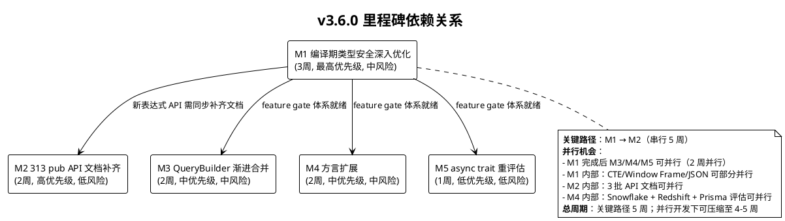
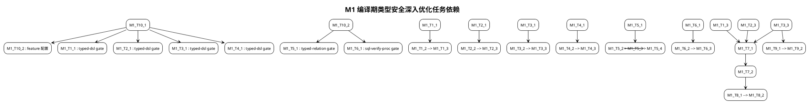
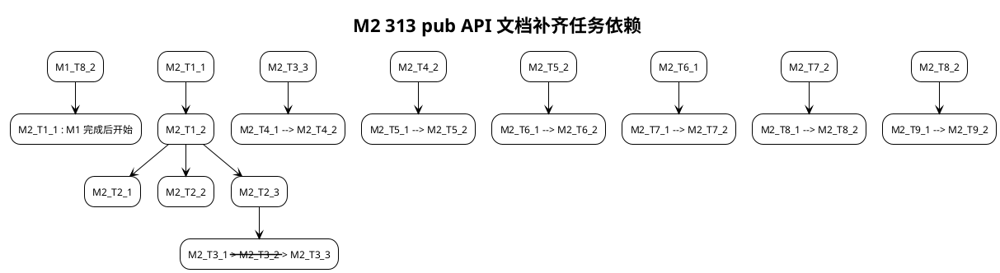

# sz-orm v3.6.0 编码任务规划文档

> 版本：v3.6.0（编译期类型安全深入优化 + 313 pub API 文档补齐 + QueryBuilder 渐进合并 + 方言扩展 + async trait 风格统一重评估）
> 基线：v3.5.0（已完成：6 里程碑 / 28 主任务 / 115 子任务，6,751 passed / 0 failed / 253 ignored；44 包已发布 crates.io；补充任务 sz-pay 回归修复 + crates.io 发布 + 剩余不足评估均已完成）
> 日期：2026-08-10
> 文档定位：编码任务规划（What to do），对应需求规格 `docs/spec/v3.6.0/spec.md`（5 方向 / 37 条 EARS 需求 / 5 组 REQ-TS/REQ-DOC-API/REQ-QB-MIG/REQ-DIALECT/REQ-ASYNC）与技术设计 `docs/spec/v3.6.0/design.md`（5 里程碑 + 6 新增 feature gate + 2 既有复用）
> 任务粒度：每个子任务可在 0.5-4 小时内完成，单个任务不超过 500 行代码变更
> 任务统计：40 主任务 / 96 子任务 / 5 里程碑
> 工程化铁律：禁止占位实现（todo!/unimplemented!/unreachable!）/ unsafe 零容忍 / 参数化查询 / API 向后兼容 / Feature 隔离 / 五方言行为一致 / ADR-0001 不改上游 / 审计合规铁律（每结论附 file:line 证据）/ 严禁 PowerShell 替换操作（用 Node.js 脚本）/ 编译时 `$env:RUST_MIN_STACK="67108864"` + `$env:CARGO_INCREMENTAL=0` / 测试 `cargo test --workspace -j 2 --no-fail-fast`

---

# 1. 任务总览

## 1.1 任务统计

| 里程碑 | 方向 | 主任务数 | 子任务数 | 关联需求 | 周期 | 优先级 | 风险 |
|--------|------|---------|---------|---------|------|--------|------|
| M1 编译期类型安全深入优化 | 方向 1 | 10 | 27 | REQ-TS-001~009 | 3 周 | 最高 | 中 |
| M2 313 pub API 文档补齐 | 方向 2 | 9 | 20 | REQ-DOC-API-001~007 | 2 周 | 高 | 低 |
| M3 QueryBuilder 渐进合并 | 方向 3 | 7 | 16 | REQ-QB-MIG-001~007 | 2 周 | 中 | 中 |
| M4 方言扩展 | 方向 4 | 8 | 20 | REQ-DIALECT-001~008 | 2 周 | 中 | 中 |
| M5 async trait 重评估 | 方向 5 | 6 | 13 | REQ-ASYNC-001~006 | 1 周 | 低 | 低 |
| **合计** | — | **40** | **96** | **37 条 REQ** | **5 周** | — | — |

## 1.2 里程碑分布

```
M1 编译期类型安全深入优化 (3 周, 最高优先级, 中风险)
    │
    ├──→ M2 313 pub API 文档补齐 (2 周, 高优先级, 低风险)  [关键路径]
    ├──→ M3 QueryBuilder 渐进合并 (2 周, 中优先级, 中风险)
    ├──→ M4 方言扩展 (2 周, 中优先级, 中风险)
    └──→ M5 async trait 重评估 (1 周, 低优先级, 低风险)
```

- **关键路径**：M1 → M2（串行 5 周，新表达式 API 需同步补齐文档）
- **并行机会**：
  - M1 完成后 M3/M4/M5 可并行（feature gate 体系就绪，2 周并行）
  - M1 内部：CTE/Window Frame/JSON 操作符可部分并行（不同表达式类别）
  - M2 内部：3 批 API 文档（核心/扩展/测试）可并行
  - M4 内部：Snowflake + Redshift + Prisma 评估可并行
- **总周期**：关键路径 5 周；并行开发下可压缩至 4-5 周

## 1.3 Feature Gate 矩阵

### 1.3.1 6 个新增 Feature gate

| 新增 Feature | 所属包 | 默认 | 依赖 | 关联里程碑 |
|---------|--------|------|------|-----------|
| `typed-relation` | sz-orm-core | 关闭 | 无（复用 typed_ast + Model + EagerLoader） | M1 |
| `sql-verify-proc` | sz-orm-core | 关闭 | sqlparser（复用 plan-cache 的 sqlparser） | M1 |
| `qb-migration-tool` | sz-orm-core | 关闭 | syn / quote（复用 sz-orm-macros 的 syn/quote） | M3 |
| `dialect-snowflake` | sz-orm-core | 关闭 | 无（独立实现 Dialect trait） | M4 |
| `dialect-redshift` | sz-orm-core | 关闭 | 无（委派 PostgreSqlDialect） | M4 |
| `dialect-prisma` | sz-orm-core | 关闭 | 无（纯评估文档） | M4 |

### 1.3.2 2 个既有 Feature 复用

| 既有 Feature | 所属包 | 默认 | 依赖 | 关联里程碑 |
|---------|--------|------|------|-----------|
| `typed-dsl` | sz-orm-core | 关闭 | 无 | M1 |
| `doc-completion` | sz-orm-core | 关闭 | 无（纯文档） | M2 |

---

# 2. M1 编译期类型安全深入优化（REQ-TS-001~009）

> **目标**：在 v3.5.0 已对齐 Diesel 46 种表达式基础上，补齐 CTE/Window Frame/JSON 操作符等 15 种新表达式（超越 Diesel 表达式覆盖度），实现自定义编译期诊断、类型安全关联查询（typed relation）、proc-macro 编译期 SQL 验证探索，通过 `typed-dsl`/`typed-relation`/`sql-verify-proc` feature gate 隔离，既有 46 种表达式完全向后兼容。
> **周期**：3 周
> **优先级**：最高（中风险高收益，超越 Diesel 核心竞争力）
> **关联设计**：design.md §5.1.1
> **关联验收**：AC-TS-1~9（spec §9.1）

## 2.1 M1-T1：CTE 表达式 With/WithRecursive/CteRef

- [ ] **M1-T1.1** 在 `packages/sz-orm-core/src/typed_ast.rs` 新增 3 种 CTE 表达式 ZST：`With<Name, Subquery>`/`WithRecursive<Name, Initial, Recursive>`/`CteRef<Name>`，各为 `PhantomData<...>` 零大小类型，通过 `#[cfg(feature = "typed-dsl")]` 条件编译隔离
  - 关联需求：REQ-TS-001
  - 关联设计：design.md §5.1.1 M1-T1 / §1.1.3 模块 A
  - 输入：既有 `TypedExpression` trait（typed_ast.rs:249）+ `TypedSelectQuery<T>`（typed_ast.rs:672）
  - 输出：3 种 ZST 表达式定义，`static_assert!(size_of::<With<N,S>>() == 0)` 编译期断言通过
  - 涉及文件：`packages/sz-orm-core/src/typed_ast.rs`
  - 工作量：S（1h）
  - 依赖：M1-T10.1

- [ ] **M1-T1.2** 为 3 种 CTE 表达式实现 `TypedExpression` trait + `ExprTable` trait：`to_sql()` 生成 `WITH cte_name AS (subquery) SELECT ...` / `WITH RECURSIVE cte_name AS (initial UNION ALL recursive) SELECT ...` / CTE 引用，使用参数化占位符（`?`），五方言行为一致（CTE 语法通用，旧版 MySQL < 8.0 返回 `Err(UnsupportedFeature)`）
  - 关联需求：REQ-TS-001
  - 关联设计：design.md §5.1.1 M1-T1
  - 输入：M1-T1.1 的 3 种 ZST 定义
  - 输出：`to_sql()` 输出正确参数化 SQL，五方言分派（不支持的方言返回 Err）
  - 涉及文件：`packages/sz-orm-core/src/typed_ast.rs`
  - 工作量：M（2h）
  - 依赖：M1-T1.1

- [ ] **M1-T1.3** 编写 CTE 表达式单元测试 `tests/typed_ast_cte_test.rs`：覆盖 to_sql 输出（含递归 CTE）、ZST 断言、五方言分派（MySQL 8.0+/PG/SQLite 3.8.3+/Oracle/MSSQL 支持，旧版返回 Err）、与 QueryBuilder SQL 差分对比，在 `Cargo.toml` 注册 `[[test]] typed_ast_cte required-features=["typed-dsl"]`
  - 关联需求：REQ-TS-001
  - 关联设计：design.md §6.1.1
  - 输入：M1-T1.2 的 trait 实现
  - 输出：`cargo test -p sz-orm-core --features typed-dsl typed_ast_cte` 全通过
  - 涉及文件：`packages/sz-orm-core/tests/typed_ast_cte_test.rs` + `packages/sz-orm-core/Cargo.toml`
  - 工作量：M（3h）
  - 依赖：M1-T1.2

## 2.2 M1-T2：Window Frame 表达式

- [ ] **M1-T2.1** 在 `packages/sz-orm-core/src/typed_ast.rs` 新增 6 种 Window Frame 表达式 ZST：`RowsFrame`/`RangeFrame`/`GroupsFrame`/`FrameBetween<Start, End>`/`FrameUnboundedPreceding`/`FrameCurrentRow`，通过 `#[cfg(feature = "typed-dsl")]` 隔离
  - 关联需求：REQ-TS-002
  - 关联设计：design.md §5.1.1 M1-T2 / §1.1.3 模块 B
  - 输入：v3.5.0 既有窗口函数（Over/PartitionBy/Lag/Lead/RowNumber/Rank/DenseRank）
  - 输出：6 种 ZST 表达式定义，ZST 断言通过
  - 涉及文件：`packages/sz-orm-core/src/typed_ast.rs`
  - 工作量：S（1.5h）
  - 依赖：M1-T10.1

- [ ] **M1-T2.2** 为 6 种 Window Frame 表达式实现 `TypedExpression` trait：`to_sql()` 生成 `ROWS BETWEEN <start> AND <end>` / `RANGE BETWEEN ... AND ...` / `GROUPS BETWEEN ... AND ...`，支持 `UNBOUNDED PRECEDING` / `CURRENT ROW` / `UNBOUNDED FOLLOWING` 边界，与既有窗口函数协作（OVER 子句组合），不支持的方言（SQLite < 3.25）返回 `Err(UnsupportedFeature)`
  - 关联需求：REQ-TS-002
  - 关联设计：design.md §5.1.1 M1-T2
  - 输入：M1-T2.1 的 6 种 ZST 定义 + 既有窗口函数
  - 输出：`to_sql()` 输出正确参数化 SQL，与既有 Over/PartitionBy 协作
  - 涉及文件：`packages/sz-orm-core/src/typed_ast.rs`
  - 工作量：M（3h）
  - 依赖：M1-T2.1

- [ ] **M1-T2.3** 编写 Window Frame 表达式单元测试 `tests/typed_ast_window_frame_test.rs`：覆盖 to_sql 输出（ROWS/RANGE/GROUPS BETWEEN）、边界（UNBOUNDED PRECEDING/CURRENT ROW/UNBOUNDED FOLLOWING）、与既有窗口函数组合、五方言分派、ZST 断言，在 `Cargo.toml` 注册 `[[test]] typed_ast_window_frame required-features=["typed-dsl"]`
  - 关联需求：REQ-TS-002
  - 关联设计：design.md §6.1.1
  - 输入：M1-T2.2 的 trait 实现
  - 输出：`cargo test -p sz-orm-core --features typed-dsl typed_ast_window_frame` 全通过
  - 涉及文件：`packages/sz-orm-core/tests/typed_ast_window_frame_test.rs` + `packages/sz-orm-core/Cargo.toml`
  - 工作量：M（3.5h）
  - 依赖：M1-T2.2

## 2.3 M1-T3：JSON 操作符表达式

- [ ] **M1-T3.1** 在 `packages/sz-orm-core/src/typed_ast.rs` 新增 6 种 JSON 操作符表达式 ZST：`JsonGet<Col, Key>`/`JsonGetText<Col, Key>`/`JsonPathGet<Col, Path>`/`JsonPathGetText<Col, Path>`/`JsonContains<Col, Value>`/`JsonExists<Col, Key>`，通过 `#[cfg(feature = "typed-dsl")]` 隔离
  - 关联需求：REQ-TS-003
  - 关联设计：design.md §5.1.1 M1-T3 / §1.1.3 模块 C
  - 输入：既有 `Dialect` trait（dialect.rs:23）的 `json_extract` 方法
  - 输出：6 种 ZST 表达式定义，ZST 断言通过
  - 涉及文件：`packages/sz-orm-core/src/typed_ast.rs`
  - 工作量：S（1.5h）
  - 依赖：M1-T10.1

- [ ] **M1-T3.2** 为 6 种 JSON 操作符表达式实现 `TypedExpression` trait：`to_sql()` 按方言分派生成对应 SQL——PostgreSQL `col->'key'`/`col->>'key'`/`col#>'{path}'`/`col#>>'{path}'`/`col @> 'value'`/`col ? 'key'`、MySQL `JSON_EXTRACT(col, '$.key')`/`JSON_UNQUOTE(...)`/`col->'$.key'`/`JSON_CONTAINS(col, 'value')`/`JSON_EXISTS(col, '$.key')`、SQLite `json_extract(col, '$.key')`，Oracle/MSSQL 返回 `Err(UnsupportedFeature)`，使用参数化占位符
  - 关联需求：REQ-TS-003
  - 关联设计：design.md §5.1.1 M1-T3
  - 输入：M1-T3.1 的 6 种 ZST 定义 + 既有 `Dialect::json_extract`
  - 输出：`to_sql()` 三方言分派正确，不支持的方言返回 Err
  - 涉及文件：`packages/sz-orm-core/src/typed_ast.rs`
  - 工作量：L（4h）
  - 依赖：M1-T3.1

- [ ] **M1-T3.3** 编写 JSON 操作符表达式单元测试 `tests/typed_ast_json_op_test.rs`：覆盖 to_sql 三方言分派（PG/MySQL/SQLite）、不支持的方言返回 Err、ZST 断言、与 QueryBuilder SQL 差分对比，在 `Cargo.toml` 注册 `[[test]] typed_ast_json_op required-features=["typed-dsl"]`
  - 关联需求：REQ-TS-003
  - 关联设计：design.md §6.1.1
  - 输入：M1-T3.2 的 trait 实现
  - 输出：`cargo test -p sz-orm-core --features typed-dsl typed_ast_json_op` 全通过
  - 涉及文件：`packages/sz-orm-core/tests/typed_ast_json_op_test.rs` + `packages/sz-orm-core/Cargo.toml`
  - 工作量：M（2.5h）
  - 依赖：M1-T3.2

## 2.4 M1-T4：自定义编译期诊断信息

- [ ] **M1-T4.1** 在 `packages/sz-orm-macros/src/lib.rs` 新增自定义诊断模块 `diagnostic.rs`：通过 proc-macro2 / syn / quote 的 `Diagnostic` API 生成自定义编译期诊断信息，诊断信息结构包含：错误位置（列名/表达式 span）、期望类型（Expected SqlType）、实际类型（Found SqlType）、修复建议（如"请使用 Cast 显式转换"或"请检查列归属表"），通过 `#[cfg(feature = "typed-dsl")]` 隔离
  - 关联需求：REQ-TS-004
  - 关联设计：design.md §5.1.1 M1-T4 / §1.1.3 模块 D
  - 输入：既有 proc-macro2 / syn / quote 依赖（sz-orm-macros 既有）
  - 输出：自定义诊断生成函数，输出 `compile_error!` 含位置/期望/实际/建议
  - 涉及文件：`packages/sz-orm-macros/src/diagnostic.rs` + `packages/sz-orm-macros/src/lib.rs`
  - 工作量：L（4h）
  - 依赖：M1-T10.1

- [ ] **M1-T4.2** 在 `packages/sz-orm-core/src/typed_ast.rs` 类型不匹配触发点集成自定义诊断：当 `Eq<C, T>` 的 `C: TypedColumn<RustType = T>` 约束失败、`And<L, R>` 的 `L: TypedExpression<SqlType = Bool>` 约束失败、`TypedSelectQuery::filter<E>` 的 `E: ExprTable<Table = T>` 跨表列引用失败时，通过 proc-macro 展开生成自定义诊断信息，抑制 Rust 默认冗余错误（通过 proc-macro 展开控制）
  - 关联需求：REQ-TS-004
  - 关联设计：design.md §5.1.1 M1-T4
  - 输入：M1-T4.1 的诊断模块 + 既有类型约束触发点
  - 输出：类型不匹配错误触发时输出自定义诊断（含位置/期望/实际/建议），比 Rust 默认错误更清晰
  - 涉及文件：`packages/sz-orm-core/src/typed_ast.rs` + `packages/sz-orm-macros/src/diagnostic.rs`
  - 工作量：L（4h）
  - 依赖：M1-T4.1

- [ ] **M1-T4.3** 编写自定义诊断单元测试 `tests/typed_ast_diagnostic_test.rs`：覆盖类型不匹配触发（Eq/And/filter 跨表）、诊断信息内容验证（位置/期望/实际/建议字段完整）、与 Rust 默认错误对比（自定义诊断更清晰），使用 `trybuild` crate 验证编译期诊断信息，在 `Cargo.toml` 注册 `[[test]] typed_ast_diagnostic required-features=["typed-dsl"]`
  - 关联需求：REQ-TS-004
  - 关联设计：design.md §6.1.1
  - 输入：M1-T4.2 的诊断集成
  - 输出：`cargo test -p sz-orm-core --features typed-dsl typed_ast_diagnostic` 全通过，诊断信息内容验证
  - 涉及文件：`packages/sz-orm-core/tests/typed_ast_diagnostic_test.rs` + `packages/sz-orm-core/Cargo.toml`
  - 工作量：M（3h）
  - 依赖：M1-T4.2

## 2.5 M1-T5：typed relation 类型安全关联查询

- [ ] **M1-T5.1** 在 `packages/sz-orm-core/src/typed_relation.rs` 新增模块骨架：定义 `BelongsTo<Child, Parent, ForeignKey>`/`HasMany<Parent, Child, ForeignKey>`/`HasOne<Parent, Child, ForeignKey>` 三种关联类型 ZST，通过 `#[cfg(feature = "typed-relation")]` 条件编译隔离，在 `lib.rs` 新增 `#[cfg(feature = "typed-relation")] pub mod typed_relation;` 模块声明
  - 关联需求：REQ-TS-005
  - 关联设计：design.md §5.1.1 M1-T5 / §1.1.3 模块 E
  - 输入：既有 `Model` trait（model.rs:271）+ `TypedSelectQuery<T>`（typed_ast.rs:672）
  - 输出：3 种关联类型 ZST 定义，模块声明就绪
  - 涉及文件：`packages/sz-orm-core/src/typed_relation.rs` + `packages/sz-orm-core/src/lib.rs`
  - 工作量：M（2h）
  - 依赖：M1-T10.2

- [ ] **M1-T5.2** 实现编译期外键类型匹配校验：`BelongsTo<Child, Parent, FK>` 要求 `Child::ForeignKey == Parent::PrimaryKey` 类型匹配（通过关联类型约束），`HasMany<Parent, Child, FK>` 要求 `Child::ForeignKey == Parent::PrimaryKey`，编译期拒绝外键类型不匹配的关联，提供 `#[derive(Relation)]` 宏自动提取外键类型
  - 关联需求：REQ-TS-005
  - 关联设计：design.md §5.1.1 M1-T5
  - 输入：M1-T5.1 的关联类型定义
  - 输出：编译期外键类型校验，类型不匹配编译失败
  - 涉及文件：`packages/sz-orm-core/src/typed_relation.rs` + `packages/sz-orm-macros/src/relation_derive.rs`
  - 工作量：L（4h）
  - 依赖：M1-T5.1

- [ ] **M1-T5.3** 实现编译期表归属校验 + 与 EagerLoader 协作：校验外键属于 Child 表（非 Parent 表），提供 `typed_relation::load_belongs_to::<Parent>()` 等关联查询构造方法，与既有 `EagerLoader`（eager_loader.rs:129）协作——简单关联用 typed relation（编译期类型安全），复杂关联（多态关联 MorphMany/MorphTo/自引用）提供 `escape_hatch()` 回退 EagerLoader（运行时）
  - 关联需求：REQ-TS-005
  - 关联设计：design.md §5.1.1 M1-T5 / §7.1 决策"typed relation 与 EagerLoader 关系"
  - 输入：M1-T5.2 的外键校验 + 既有 EagerLoader
  - 输出：表归属校验通过，与 EagerLoader 协作，escape hatch 就绪
  - 涉及文件：`packages/sz-orm-core/src/typed_relation.rs`
  - 工作量：L（4h）
  - 依赖：M1-T5.2

- [ ] **M1-T5.4** 编写 typed relation 单元测试 `tests/typed_relation_test.rs`：覆盖 BelongsTo/HasMany/HasOne 编译期外键类型校验、表归属校验、与 EagerLoader 协作、escape hatch 回退、多态关联回退场景，在 `Cargo.toml` 注册 `[[test]] typed_relation required-features=["typed-relation"]`
  - 关联需求：REQ-TS-005
  - 关联设计：design.md §6.1.1
  - 输入：M1-T5.3 的协作实现
  - 输出：`cargo test -p sz-orm-core --features typed-relation typed_relation` 全通过
  - 涉及文件：`packages/sz-orm-core/tests/typed_relation_test.rs` + `packages/sz-orm-core/Cargo.toml`
  - 工作量：M（3h）
  - 依赖：M1-T5.3

## 2.6 M1-T6：proc-macro 编译期 SQL 验证探索

- [ ] **M1-T6.1** 在 `packages/sz-orm-macros/src/sql_verify.rs` 新增 proc-macro SQL 验证模块：通过 sqlparser（复用 plan-cache 的 sqlparser）在编译期解析 SQL 字符串，校验 SQL 语法 + 表/列存在性（连真 DB 执行 `EXPLAIN`/`EXPLAIN QUERY PLAN`，仅查询不修改）+ 类型匹配，扩展 v3.5.0 既有 `query!` 宏的 db-verify feature 到 QueryBuilder 生态，通过 `#[cfg(feature = "sql-verify-proc")]` 隔离
  - 关联需求：REQ-TS-006
  - 关联设计：design.md §5.1.1 M1-T6 / §1.1.3 模块 F
  - 输入：既有 db-verify feature（Cargo.toml:18）+ sqlparser 依赖
  - 输出：proc-macro SQL 验证函数，编译期解析 + EXPLAIN 校验
  - 涉及文件：`packages/sz-orm-macros/src/sql_verify.rs` + `packages/sz-orm-macros/src/lib.rs`
  - 工作量：L（4h）
  - 依赖：M1-T10.2

- [ ] **M1-T6.2** 实现 SQL 验证结果缓存：按 SQL 哈希（xxhash-rust）缓存验证结果到 `target/sql-verify-cache/`，仅 SQL 变更时重新连 DB 验证，避免每次编译都连 DB（缓解编译时间增加风险），通过 `SZ_ORM_QUERY_VERIFY=1` 环境变量启用连真 DB，默认仅语法校验
  - 关联需求：REQ-TS-006
  - 关联设计：design.md §5.1.1 M1-T6 / §7.2 风险"proc-macro SQL 验证编译时间显著增加"
  - 输入：M1-T6.1 的验证模块
  - 输出：缓存机制就绪，编译时间不显著增加
  - 涉及文件：`packages/sz-orm-macros/src/sql_verify.rs`
  - 工作量：M（2.5h）
  - 依赖：M1-T6.1

- [ ] **M1-T6.3** 编写 proc-macro SQL 验证单元测试 `tests/sql_verify_proc_test.rs`：覆盖 SQL 语法校验、表/列存在性校验（连真 DB，标注 `#[ignore]`）、类型匹配校验、EXPLAIN only（不执行修改 SQL）、缓存命中，在 `Cargo.toml` 注册 `[[test]] sql_verify_proc required-features=["sql-verify-proc"]`
  - 关联需求：REQ-TS-006
  - 关联设计：design.md §6.1.1
  - 输入：M1-T6.2 的缓存实现
  - 输出：`cargo test -p sz-orm-core --features sql-verify-proc sql_verify_proc` 全通过
  - 涉及文件：`packages/sz-orm-core/tests/sql_verify_proc_test.rs` + `packages/sz-orm-core/Cargo.toml`
  - 工作量：M（3h）
  - 依赖：M1-T6.2

## 2.7 M1-T7：编译期 ZST 断言 + 差分测试

- [ ] **M1-T7.1** 为所有 15 种新增表达式（CTE 3 + Window Frame 6 + JSON 6）添加编译期 ZST 断言：在 `tests/typed_ast_zst_assert_test.rs` 中为每种表达式添加 `static_assert!(size_of::<T>() == 0)` 编译期断言，验证零成本抽象，运行基准测试 `benches/typed_overhead_bench.rs` 对比新表达式与既有 46 种表达式的运行时开销（无开销增加）
  - 关联需求：REQ-TS-008
  - 关联设计：design.md §5.1.1 M1-T7 / §6.1.1 基准测试
  - 输入：M1-T1~M1-T3 的 15 种表达式
  - 输出：15 种表达式 ZST 断言全通过，基准测试无开销增加
  - 涉及文件：`packages/sz-orm-core/tests/typed_ast_zst_assert_test.rs` + `packages/sz-orm-core/benches/typed_overhead_bench.rs`
  - 工作量：M（2h）
  - 依赖：M1-T1.3 + M1-T2.3 + M1-T3.3

- [ ] **M1-T7.2** 编写 typed_ast vs QueryBuilder 差分测试 `tests/typed_ast_qb_diff_test.rs`：对同一查询用 typed_ast DSL 和 QueryBuilder 构造，比较生成 SQL 字符串完全一致，覆盖 CTE/Window Frame/JSON 操作符/聚合/算术/字符串/日期/窗口/NULL/BETWEEN/DISTINCT/子查询/类型转换等关键查询类型
  - 关联需求：REQ-TS-008
  - 关联设计：design.md §6.1.1 差分测试
  - 输入：M1-T1~M1-T3 的表达式 + 既有 QueryBuilder
  - 输出：`cargo test -p sz-orm-core --features typed-dsl --test typed_ast_qb_diff` 全通过，SQL 一致
  - 涉及文件：`packages/sz-orm-core/tests/typed_ast_qb_diff_test.rs`
  - 工作量：M（2h）
  - 依赖：M1-T7.1

## 2.8 M1-T8：表达式覆盖度超越 Diesel 验证

- [ ] **M1-T8.1** 编写表达式覆盖度对比表 `docs/dsl-coverage-comparison.md`：列出 sz-orm v3.6.0 表达式清单（46 既有 + 15 新增 = 61 种）vs Diesel 2.2.x 表达式清单（含 CTE/Window Frame/JSON/关联查询），标注每种表达式的 sz-orm 实现位置（file:line 证据）+ Diesel 对应实现，证明 sz-orm 覆盖度 > Diesel
  - 关联需求：REQ-TS-007
  - 关联设计：design.md §5.1.1 M1-T8
  - 输入：M1-T1~M1-T6 的表达式实现
  - 输出：覆盖度对比表，sz-orm 61 种 > Diesel，每项附 file:line 证据
  - 涉及文件：`docs/dsl-coverage-comparison.md`
  - 工作量：S（1.5h）
  - 依赖：M1-T7.2

- [ ] **M1-T8.2** 更新对比分析文档 `docs/sz-orm与同类产品对比分析.md` §6.1：将"编译期类型安全生态成熟度不及 Diesel"更新为"已超越 Diesel 表达式覆盖度（61 种 vs Diesel 2.2.x）"，附覆盖度对比表链接 + file:line 证据
  - 关联需求：REQ-TS-007
  - 关联设计：design.md §5.1.1 M1-T8
  - 输入：M1-T8.1 的覆盖度对比表
  - 输出：对比分析文档 §6.1 更新完成
  - 涉及文件：`docs/sz-orm与同类产品对比分析.md`
  - 工作量：S（0.5h）
  - 依赖：M1-T8.1

## 2.9 M1-T9：SQL 注入扫描验证

- [ ] **M1-T9.1** 对所有 15 种新增表达式的 `to_sql()` 输出进行 SQL 注入扫描：运行 `scripts/check-sql-injection.ps1` 扫描 typed_ast.rs 新增代码，验证使用参数化占位符（`?`）而非字符串拼接，对发现的字符串拼接立即修复
  - 关联需求：REQ-TS-009
  - 关联设计：design.md §5.1.1 M1-T9
  - 输入：M1-T1~M1-T3 的 to_sql 实现
  - 输出：`scripts/check-sql-injection.ps1` 通过，无字符串拼接
  - 涉及文件：`packages/sz-orm-core/src/typed_ast.rs` + `scripts/check-sql-injection.ps1`
  - 工作量：S（1h）
  - 依赖：M1-T3.3

- [ ] **M1-T9.2** 在 `tests/typed_ast_sql_injection_test.rs` 编写 SQL 注入防护测试：对每种新表达式构造恶意输入（含 SQL 注入 payload），验证 to_sql 输出使用参数化占位符隔离，注入 payload 不影响 SQL 结构
  - 关联需求：REQ-TS-009
  - 关联设计：design.md §6.1.1
  - 输入：M1-T9.1 的扫描结果
  - 输出：`cargo test -p sz-orm-core --features typed-dsl typed_ast_sql_injection` 全通过
  - 涉及文件：`packages/sz-orm-core/tests/typed_ast_sql_injection_test.rs`
  - 工作量：S（1h）
  - 依赖：M1-T9.1

## 2.10 M1-T10：feature gate 配置 + 模块声明

- [ ] **M1-T10.1** 在 `packages/sz-orm-core/Cargo.toml` 新增 `typed-relation` feature 定义（`typed-relation = []`）+ `sql-verify-proc` feature 定义（`sql-verify-proc = ["dep:sqlparser", "dep:xxhash-rust"]`，复用 plan-cache 的 sqlparser），在 `[dependencies]` 新增 `sqlparser`/`xxhash-rust` 的 optional 引用（如未存在），验证 feature 正交性（与既有 typed-dsl 等互不依赖）
  - 关联需求：REQ-TS-001/005/006
  - 关联设计：design.md §3.1 / §5.1.1 M1-T10
  - 输入：既有 Cargo.toml feature 体系（25+ feature）
  - 输出：`cargo check --features typed-relation,sql-verify-proc,typed-dsl` 通过，feature 正交
  - 涉及文件：`packages/sz-orm-core/Cargo.toml`
  - 工作量：S（1h）
  - 依赖：无

- [ ] **M1-T10.2** 在 `packages/sz-orm-core/src/lib.rs` 新增 `#[cfg(feature = "typed-relation")] pub mod typed_relation;` + `#[cfg(feature = "sql-verify-proc")] pub mod sql_verify;` 模块声明，验证默认 feature（`default = ["redis"]`）编译产物大小与 v3.5.0 一致（无新增代码编译）
  - 关联需求：REQ-TS-005/006
  - 关联设计：design.md §3.3 默认 Feature 零行为变更保证
  - 输入：M1-T10.1 的 feature 定义
  - 输出：模块声明就绪，默认 feature 编译产物大小不变
  - 涉及文件：`packages/sz-orm-core/src/lib.rs`
  - 工作量：S（1h）
  - 依赖：M1-T10.1

---

# 3. M2 313 pub API 文档补齐（REQ-DOC-API-001~007）

> **目标**：为 `packages/sz-orm-core/src/lib.rs:403` docs.rs cfg 跳过导致的 313 个 pub API 缺 `///` 文档注释补齐文档（功能/参数/返回/示例/错误），移除 docs.rs cfg 跳过，使 `cargo doc --workspace --no-deps --all-features` 零警告 + `cargo test --workspace --doc` doctest 通过，docs.rs 页面完整。
> **周期**：2 周
> **优先级**：高（低风险高收益，补竞品短板解除采用门槛）
> **关联设计**：design.md §5.1.2
> **关联验收**：AC-DOC-API-1~7（spec §9.2）

## 3.1 M2-T1：定位 313 缺文档 pub API

- [ ] **M2-T1.1** 执行 `cargo doc --workspace --no-deps --all-features 2>&1 | findstr missing_docs` 扫描所有 missing_docs 警告，收集缺文档 pub API 清单，按模块分类（query/pool/model/dialect/value/result_map/typed_ast/l2_cache/migration 等），统计实际数量（基准 313，v3.6.0 新增 API 后可能变化）
  - 关联需求：REQ-DOC-API-001
  - 关联设计：design.md §5.1.2 M2-T1
  - 输入：既有 `lib.rs:403` docs.rs cfg 跳过配置
  - 输出：缺文档 pub API 清单（按模块分类），实际数量统计
  - 涉及文件：`packages/sz-orm-core/src/*.rs`
  - 工作量：S（1h）
  - 依赖：M1-T8.2（M1 新表达式 API 需同步补齐）

- [ ] **M2-T1.2** 将缺文档 API 清单写入 `docs/api-doc-gap-list.md`：按模块分组列出每个缺文档 API（含文件路径 + 行号 + API 签名），分批标注（第一批核心 API / 第二批扩展 API / 第三批测试辅助 API），作为补齐工作清单
  - 关联需求：REQ-DOC-API-001
  - 关联设计：design.md §5.1.2 M2-T1
  - 输入：M2-T1.1 的 API 清单
  - 输出：`docs/api-doc-gap-list.md` 清单文件，分批标注完成
  - 涉及文件：`docs/api-doc-gap-list.md`
  - 工作量：S（1h）
  - 依赖：M2-T1.1

## 3.2 M2-T2：第一批补齐核心 API 文档

- [ ] **M2-T2.1** 为 `QueryBuilder`（query.rs）所有 pub API 补齐 `///` 文档注释：含功能描述、参数说明（每个参数含义与类型约束）、返回值说明、`# Examples` 可运行 doctest、`# Errors` 可能返回的 Err 及触发条件，文档遵循 rustdoc 规范
  - 关联需求：REQ-DOC-API-001
  - 关联设计：design.md §5.1.2 M2-T2
  - 输入：M2-T1.2 的第一批清单
  - 输出：QueryBuilder 所有 pub API 文档补齐，doctest 可运行
  - 涉及文件：`packages/sz-orm-core/src/query.rs`
  - 工作量：L（4h）
  - 依赖：M2-T1.2

- [ ] **M2-T2.2** 为 `Pool`/`Connection`/`ConnectionFactory`（pool.rs）+ `Model`（model.rs）+ `L1Cache`/`L2Cache`（l1_cache.rs/l2_cache.rs）所有 pub API 补齐 `///` 文档注释，含功能/参数/返回/示例/错误说明
  - 关联需求：REQ-DOC-API-001
  - 关联设计：design.md §5.1.2 M2-T2
  - 输入：M2-T1.2 的第一批清单
  - 输出：Pool/Connection/Model/Cache 所有 pub API 文档补齐
  - 涉及文件：`packages/sz-orm-core/src/pool.rs` + `packages/sz-orm-core/src/model.rs` + `packages/sz-orm-core/src/l1_cache.rs` + `packages/sz-orm-core/src/l2_cache.rs`
  - 工作量：L（4h）
  - 依赖：M2-T1.2

- [ ] **M2-T2.3** 为 `Dialect` trait + 18 种方言实现（dialect.rs）+ `DbType`（db_type.rs）所有 pub API 补齐 `///` 文档注释，含各方言特性说明（如 PostgreSQL 支持 RETURNING、MySQL 不支持等）
  - 关联需求：REQ-DOC-API-001
  - 关联设计：design.md §5.1.2 M2-T2
  - 输入：M2-T1.2 的第一批清单
  - 输出：Dialect/DbType 所有 pub API 文档补齐
  - 涉及文件：`packages/sz-orm-core/src/dialect.rs` + `packages/sz-orm-core/src/db_type.rs`
  - 工作量：L（4h）
  - 依赖：M2-T1.2

## 3.3 M2-T3：第二批补齐扩展 API 文档

- [ ] **M2-T3.1** 为 `value`（value.rs）+ `result_map`（result_map.rs）所有 pub API 补齐 `///` 文档注释：含 Value 枚举各变体说明、ResultMap 列映射说明、类型转换规则
  - 关联需求：REQ-DOC-API-001
  - 关联设计：design.md §5.1.2 M2-T3
  - 输入：M2-T1.2 的第二批清单
  - 输出：value/result_map 所有 pub API 文档补齐
  - 涉及文件：`packages/sz-orm-core/src/value.rs` + `packages/sz-orm-core/src/result_map.rs`
  - 工作量：M（3h）
  - 依赖：M2-T2.3

- [ ] **M2-T3.2** 为 `typed_ast`（typed_ast.rs）所有 pub API 补齐 `///` 文档注释：含 `SqlType` trait + 14 种类型 ZST + `TypedExpression` trait + `ExprTable` trait + `TypedSelectQuery<T>` + 46 种既有表达式 + 15 种 v3.6.0 新增表达式（CTE/Window Frame/JSON 操作符）说明
  - 关联需求：REQ-DOC-API-001
  - 关联设计：design.md §5.1.2 M2-T3
  - 输入：M2-T1.2 的第二批清单 + M1 新增 15 种表达式
  - 输出：typed_ast 所有 pub API 文档补齐
  - 涉及文件：`packages/sz-orm-core/src/typed_ast.rs`
  - 工作量：L（4h）
  - 依赖：M2-T3.1

- [ ] **M2-T3.3** 为 `migration`（migration.rs）+ `transaction`（transaction.rs）+ `hooks`（hooks.rs）+ `repository`（repository.rs）所有 pub API 补齐 `///` 文档注释
  - 关联需求：REQ-DOC-API-001
  - 关联设计：design.md §5.1.2 M2-T3
  - 输入：M2-T1.2 的第二批清单
  - 输出：migration/transaction/hooks/repository 所有 pub API 文档补齐
  - 涉及文件：`packages/sz-orm-core/src/migration.rs` + `packages/sz-orm-core/src/transaction.rs` + `packages/sz-orm-core/src/hooks.rs` + `packages/sz-orm-core/src/repository.rs`
  - 工作量：M（3h）
  - 依赖：M2-T3.2

## 3.4 M2-T4：第三批补齐测试/辅助 API 文档

- [ ] **M2-T4.1** 为 `eager_loader`（eager_loader.rs）+ `schema_sync`（schema_sync.rs）+ `n1_query_detector`（n1_query_detector.rs）等辅助模块所有 pub API 补齐 `///` 文档注释
  - 关联需求：REQ-DOC-API-001
  - 关联设计：design.md §5.1.2 M2-T4
  - 输入：M2-T1.2 的第三批清单
  - 输出：辅助模块所有 pub API 文档补齐
  - 涉及文件：`packages/sz-orm-core/src/eager_loader.rs` + `packages/sz-orm-core/src/schema_sync.rs` + `packages/sz-orm-core/src/n1_query_detector.rs`
  - 工作量：M（2.5h）
  - 依赖：M2-T3.3

- [ ] **M2-T4.2** 为 `typed_relation`（M1 新增）+ `sql_verify`（M1 新增）+ 其他 v3.6.0 新增模块所有 pub API 补齐 `///` 文档注释，确保 v3.6.0 新增 API 不引入新的 missing_docs 警告
  - 关联需求：REQ-DOC-API-001
  - 关联设计：design.md §5.1.2 M2-T4
  - 输入：M2-T1.2 的第三批清单 + M1 新增模块
  - 输出：v3.6.0 新增模块所有 pub API 文档补齐
  - 涉及文件：`packages/sz-orm-core/src/typed_relation.rs` + `packages/sz-orm-macros/src/sql_verify.rs` + `packages/sz-orm-macros/src/diagnostic.rs`
  - 工作量：M（2h）
  - 依赖：M2-T4.1

## 3.5 M2-T5：移除 docs.rs cfg 跳过

- [ ] **M2-T5.1** 移除 `packages/sz-orm-core/src/lib.rs:403` 的 docs.rs cfg 跳过配置（`#![cfg_attr(docsrs, warn(missing_docs))]` 相关的 cfg 跳过），改为全局 `#![warn(missing_docs)]`，使 docs.rs 页面展示所有 pub API 文档
  - 关联需求：REQ-DOC-API-002
  - 关联设计：design.md §5.1.2 M2-T5
  - 输入：M2-T2~M2-T4 的文档补齐完成
  - 输出：`lib.rs:403` cfg 跳过移除，全局 `#![warn(missing_docs)]` 生效
  - 涉及文件：`packages/sz-orm-core/src/lib.rs`
  - 工作量：S（0.5h）
  - 依赖：M2-T4.2

- [ ] **M2-T5.2** 验证 docs.rs 页面配置 `packages/sz-orm-core/Cargo.toml` `[package.metadata.docs.rs]` 配置正确（`all-features = true` + `rustdoc-args = ["--cfg", "docsrs"]`），确保 docs.rs 构建时启用所有 feature + docsrs cfg
  - 关联需求：REQ-DOC-API-002
  - 关联设计：design.md §5.1.2 M2-T5
  - 输入：M2-T5.1 的 cfg 跳过移除
  - 输出：docs.rs 配置正确，页面展示所有 pub API
  - 涉及文件：`packages/sz-orm-core/Cargo.toml`
  - 工作量：S（0.5h）
  - 依赖：M2-T5.1

## 3.6 M2-T6：cargo doc 零警告验证

- [ ] **M2-T6.1** 执行 `cargo doc --workspace --no-deps --all-features` 验证零警告：无 missing_docs / broken_intra_doc_links / private_intra_doc_links 警告，对发现的警告立即修复（补齐文档/修复 intra-doc link/调整可见性）
  - 关联需求：REQ-DOC-API-003
  - 关联设计：design.md §5.1.2 M2-T6
  - 输入：M2-T5.2 的 docs.rs 配置
  - 输出：`cargo doc --workspace --no-deps --all-features` 零警告
  - 涉及文件：`packages/sz-orm-core/src/*.rs`
  - 工作量：M（2h）
  - 依赖：M2-T5.2

- [ ] **M2-T6.2** 验证 docs.rs 页面完整可浏览：检查 docs.rs 构建产物（本地模拟 `cargo doc --all-features --config "build.rustdocflags=[\"--cfg\", \"docsrs\"]"`），所有 pub API 有文档页面，模块结构完整
  - 关联需求：REQ-DOC-API-003
  - 关联设计：design.md §5.1.2 M2-T6
  - 输入：M2-T6.1 的零警告验证
  - 输出：docs.rs 页面完整可浏览
  - 涉及文件：无（验证任务）
  - 工作量：S（1h）
  - 依赖：M2-T6.1

## 3.7 M2-T7：doctest 验证

- [ ] **M2-T7.1** 执行 `cargo test --workspace --doc` 验证所有 doctest 通过：对失败的 doctest 修复示例代码（调整 API 调用/添加 `# use` 导入/标注 `# ```ignore` 或 `# ```no_run` 不运行需真实 DB 的示例）
  - 关联需求：REQ-DOC-API-004
  - 关联设计：design.md §5.1.2 M2-T7
  - 输入：M2-T6.1 的零警告验证
  - 输出：`cargo test --workspace --doc` 零失败
  - 涉及文件：`packages/sz-orm-core/src/*.rs`
  - 工作量：M（3h）
  - 依赖：M2-T6.1

- [ ] **M2-T7.2** 对需要真实 DB 连接的 doctest 标注 `# ```ignore` 或 `# ```no_run`：如 `Pool::connect`/`QueryBuilder::execute` 等需真实 DB 的示例，标注不运行或用 Mock 连接，真实 DB 示例标注 `#[ignore]` 单独运行
  - 关联需求：REQ-DOC-API-004
  - 关联设计：design.md §5.1.2 M2-T7 / §5.2.3 异常场景 2
  - 输入：M2-T7.1 的 doctest 修复
  - 输出：需真实 DB 的 doctest 标注 ignore，不依赖真实 DB
  - 涉及文件：`packages/sz-orm-core/src/*.rs`
  - 工作量：S（1h）
  - 依赖：M2-T7.1

## 3.8 M2-T8：文档与代码一致性验证

- [ ] **M2-T8.1** 代码审查验证文档注释与代码实际行为一致：对每个补齐的文档注释，审查文档描述的参数约束/返回值/错误条件与代码实现是否一致，禁止文档描述代码未实现的行为
  - 关联需求：REQ-DOC-API-005/007
  - 关联设计：design.md §5.1.2 M2-T8
  - 输入：M2-T7.2 的 doctest 通过
  - 输出：代码审查确认文档与代码一致，无文档与实际不符
  - 涉及文件：`packages/sz-orm-core/src/*.rs`
  - 工作量：M（2h）
  - 依赖：M2-T7.2

- [ ] **M2-T8.2** 运行门禁 14 文档同步检查 `python scripts/check-doc-sync.py --diff HEAD` 验证文档与代码同步：确保文档补齐后门禁 14 通过
  - 关联需求：REQ-DOC-API-005
  - 关联设计：design.md §5.1.2 M2-T8
  - 输入：M2-T8.1 的代码审查
  - 输出：门禁 14 通过，文档与代码同步
  - 涉及文件：无（验证任务）
  - 工作量：S（0.5h）
  - 依赖：M2-T8.1

## 3.9 M2-T9：对比分析文档 §6.2 更新

- [ ] **M2-T9.1** 更新对比分析文档 `docs/sz-orm与同类产品对比分析.md` §6.2：将"文档完整度不及竞品（313 pub API 缺文档）"更新为"文档完整度已对齐竞品（313 pub API 文档补齐完成，cargo doc 零警告，docs.rs 页面完整）"，附 file:line 证据（lib.rs:403 cfg 跳过移除 + cargo doc 零警告输出）
  - 关联需求：REQ-DOC-API-006
  - 关联设计：design.md §5.1.2 M2-T9
  - 输入：M2-T8.2 的一致性验证
  - 输出：对比分析文档 §6.2 更新完成
  - 涉及文件：`docs/sz-orm与同类产品对比分析.md`
  - 工作量：S（0.5h）
  - 依赖：M2-T8.2

- [ ] **M2-T9.2** 更新 `docs/api-doc-gap-list.md` 标注所有 API 已补齐：将清单中每个 API 标记为 ✅ 已补齐，作为 v3.6.0 文档补齐完成的证据
  - 关联需求：REQ-DOC-API-006
  - 关联设计：design.md §5.1.2 M2-T9
  - 输入：M2-T9.1 的文档更新
  - 输出：API 缺文档清单全部标注已补齐
  - 涉及文件：`docs/api-doc-gap-list.md`
  - 工作量：S（0.5h）
  - 依赖：M2-T9.1

---

# 4. M3 QueryBuilder 渐进合并（REQ-QB-MIG-001~007）

> **目标**：开发 QueryBuilder 代码迁移 lint（检测 sz-orm-query-builder::Query 使用 + 告警 + 迁移建议）+ fix 工具（Query → QueryBuilder 等价转换，需用户确认），制定 v3.7.0 正式移除 sz-orm-query-builder 路线图，v3.6.0 保持 sz-orm-query-builder 可用（标注 deprecated 但不删除）。
> **周期**：2 周
> **优先级**：中（中风险中收益，消歧义降迁移成本）
> **关联设计**：design.md §5.1.3
> **关联验收**：AC-QB-MIG-1~7（spec §9.3）

## 4.1 M3-T1：开发 qb_migration_lint

- [ ] **M3-T1.1** 在 `packages/sz-orm-core/src/qb_migration_lint.rs` 新增迁移 lint 模块骨架：通过 syn 解析 Rust AST，精确匹配 `sz_orm_query_builder::Query` 路径（`use sz_orm_query_builder::Query` / `Query::select()` / `Query::insert()` 等），不匹配其他库的 Query 类型，通过 `#[cfg(feature = "qb-migration-tool")]` 条件编译隔离
  - 关联需求：REQ-QB-MIG-001
  - 关联设计：design.md §5.1.3 M3-T1 / §1.1.3 模块 G
  - 输入：既有 sz-orm-query-builder::Query（lib.rs:53）+ syn/quote 依赖
  - 输出：lint 模块骨架，精确匹配 Query 路径
  - 涉及文件：`packages/sz-orm-core/src/qb_migration_lint.rs` + `packages/sz-orm-core/src/lib.rs`
  - 工作量：M（3h）
  - 依赖：M3-T7.1

- [ ] **M3-T1.2** 实现 lint 告警 + 迁移建议输出：检测到 `sz_orm_query_builder::Query` 使用时输出告警信息（含迁移建议 + core::QueryBuilder 等价 API 指引 + 选择指南链接 `docs/query-builder-guide.md`），告警格式遵循 Rust 编译器告警格式（含文件:行:列）
  - 关联需求：REQ-QB-MIG-001
  - 关联设计：design.md §5.1.3 M3-T1
  - 输入：M3-T1.1 的 lint 骨架
  - 输出：lint 告警输出，含迁移建议 + 指引链接
  - 涉及文件：`packages/sz-orm-core/src/qb_migration_lint.rs`
  - 工作量：M（3h）
  - 依赖：M3-T1.1

- [ ] **M3-T1.3** 编写 lint 单元测试 `tests/qb_migration_lint_test.rs`：覆盖精确匹配（sz_orm_query_builder::Query 检测）、不误报（其他库 Query 不检测）、告警格式、迁移建议内容，在 `Cargo.toml` 注册 `[[test]] qb_migration_lint required-features=["qb-migration-tool"]`
  - 关联需求：REQ-QB-MIG-001
  - 关联设计：design.md §6.1.3
  - 输入：M3-T1.2 的告警实现
  - 输出：`cargo test -p sz-orm-core --features qb-migration-tool qb_migration_lint` 全通过
  - 涉及文件：`packages/sz-orm-core/tests/qb_migration_lint_test.rs` + `packages/sz-orm-core/Cargo.toml`
  - 工作量：M（2h）
  - 依赖：M3-T1.2

## 4.2 M3-T2：开发 qb_migration_fix

- [ ] **M3-T2.1** 在 `packages/sz-orm-core/src/qb_migration_fix.rs` 新增迁移 fix 模块骨架：通过 syn/quote 解析 Rust AST + 自动将 `Query::select()` → `QueryBuilder::<Model>::new().select()` 等等价转换，支持 `--dry-run`（仅显示 diff 不修改）+ `--fix`（执行修改，需用户显式确认）+ 交互式确认模式
  - 关联需求：REQ-QB-MIG-002/006
  - 关联设计：design.md §5.1.3 M3-T2 / §1.1.3 模块 G
  - 输入：M3-T1.2 的 lint 实现 + 既有 core::QueryBuilder（query.rs:36）
  - 输出：fix 模块骨架，支持 --dry-run/--fix/交互式确认
  - 涉及文件：`packages/sz-orm-core/src/qb_migration_fix.rs`
  - 工作量：L（4h）
  - 依赖：M3-T1.3

- [ ] **M3-T2.2** 实现 fix 转换规则：覆盖常见 Query API 到 QueryBuilder 等价转换（select/insert/update/delete/where/order_by/limit/offset/join 等），复杂场景（UNION/CTE/窗口函数）标注"需人工审查"不自动转换，转换前显示 diff 供用户确认
  - 关联需求：REQ-QB-MIG-002
  - 关联设计：design.md §5.1.3 M3-T2 / §7.2 风险"迁移 fix 转换语义不等价"
  - 输入：M3-T2.1 的 fix 骨架
  - 输出：fix 转换规则覆盖常见 API，复杂场景标注人工审查
  - 涉及文件：`packages/sz-orm-core/src/qb_migration_fix.rs`
  - 工作量：L（4h）
  - 依赖：M3-T2.1

- [ ] **M3-T2.3** 编写 fix 单元测试 `tests/qb_migration_fix_test.rs`：覆盖常见 API 转换（select/insert/update/delete）、--dry-run 模式、--fix 模式、交互式确认、复杂场景标注人工审查，在 `Cargo.toml` 注册 `[[test]] qb_migration_fix required-features=["qb-migration-tool"]`
  - 关联需求：REQ-QB-MIG-002
  - 关联设计：design.md §6.1.3
  - 输入：M3-T2.2 的转换规则
  - 输出：`cargo test -p sz-orm-core --features qb-migration-tool qb_migration_fix` 全通过
  - 涉及文件：`packages/sz-orm-core/tests/qb_migration_fix_test.rs` + `packages/sz-orm-core/Cargo.toml`
  - 工作量：M（2h）
  - 依赖：M3-T2.2

## 4.3 M3-T3：差分测试验证语义等价

- [ ] **M3-T3.1** 编写差分测试 `tests/qb_migration_diff_test.rs`：对同一查询用 `sz_orm_query_builder::Query` 和 `core::QueryBuilder` 构造，比较生成 SQL 字符串完全一致，覆盖所有可转换的查询类型（select/insert/update/delete/where/order_by/limit/offset/join/聚合/子查询等）
  - 关联需求：REQ-QB-MIG-003
  - 关联设计：design.md §5.1.3 M3-T3 / §6.1.3
  - 输入：M3-T2.3 的 fix 实现
  - 输出：差分测试覆盖所有可转换查询类型，SQL 等价验证
  - 涉及文件：`packages/sz-orm-core/tests/qb_migration_diff_test.rs`
  - 工作量：M（3h）
  - 依赖：M3-T2.3

- [ ] **M3-T3.2** 对差分测试发现的不等价场景标注"需人工审查"：记录不等价的查询类型到 `docs/qb-migration-known-issues.md`，在 fix 工具中遇到这些场景时标注人工审查不自动转换
  - 关联需求：REQ-QB-MIG-003
  - 关联设计：design.md §5.1.3 M3-T3
  - 输入：M3-T3.1 的差分测试
  - 输出：不等价场景记录，fix 工具标注人工审查
  - 涉及文件：`docs/qb-migration-known-issues.md` + `packages/sz-orm-core/src/qb_migration_fix.rs`
  - 工作量：S（1.5h）
  - 依赖：M3-T3.1

## 4.4 M3-T4：制定 v3.7.0 移除路线图

- [ ] **M3-T4.1** 编写 `docs/qb-migration-roadmap.md` v3.7.0 移除路线图：含三阶段计划——v3.6.0（提供迁移工具 + deprecated 告警）、v3.6.x x≥1（收集用户反馈优化迁移工具）、v3.7.0（正式移除 sz-orm-query-builder 包，从 workspace 移除 + crates.io yank 或保留标注 EOL），含用户通知计划（CHANGELOG/README/迁移指南更新时间表）
  - 关联需求：REQ-QB-MIG-004
  - 关联设计：design.md §5.1.3 M3-T4 / §2.3.4
  - 输入：M3-T3.2 的差分测试
  - 输出：v3.7.0 移除路线图文档
  - 涉及文件：`docs/qb-migration-roadmap.md`
  - 工作量：S（1.5h）
  - 依赖：M3-T3.2

- [ ] **M3-T4.2** 在 `CHANGELOG.md` + `README.md` + `docs/query-builder-guide.md` 更新迁移路线图引用：标注 v3.6.0 提供迁移工具 + v3.7.0 移除计划，引导用户使用迁移工具
  - 关联需求：REQ-QB-MIG-004
  - 关联设计：design.md §5.1.3 M3-T4
  - 输入：M3-T4.1 的路线图
  - 输出：CHANGELOG/README/迁移指南更新完成
  - 涉及文件：`CHANGELOG.md` + `README.md` + `docs/query-builder-guide.md`
  - 工作量：S（0.5h）
  - 依赖：M3-T4.1

## 4.5 M3-T5：保持 sz-orm-query-builder v3.6.0 可用

- [ ] **M3-T5.1** 验证 `packages/sz-orm-query-builder/src/lib.rs:214` deprecated 标注完整：确保所有 pub API 标注 `#[deprecated(note = "请使用 sz_orm_core::QueryBuilder，参见 docs/query-builder-guide.md")]`，deprecated 告警不影响编译通过
  - 关联需求：REQ-QB-MIG-005/007
  - 关联设计：design.md §5.1.3 M3-T5
  - 输入：既有 deprecated 标注
  - 输出：所有 pub API deprecated 标注完整，编译通过
  - 涉及文件：`packages/sz-orm-query-builder/src/lib.rs`
  - 工作量：S（1h）
  - 依赖：无

- [ ] **M3-T5.2** 执行 `cargo test -p sz-orm-query-builder` 验证 sz-orm-query-builder API 完全兼容：所有测试通过，API 签名不变，v3.6.0 保持可用
  - 关联需求：REQ-QB-MIG-005
  - 关联设计：design.md §5.1.3 M3-T5
  - 输入：M3-T5.1 的 deprecated 标注
  - 输出：`cargo test -p sz-orm-query-builder` 全通过，API 兼容
  - 涉及文件：无（验证任务）
  - 工作量：S（1h）
  - 依赖：M3-T5.1

## 4.6 M3-T6：sz-pay cargo check 验证

- [ ] **M3-T6.1** 在 sz-pay 项目 `E:\vue\test\sz-pay\server\sz-rust` 执行 `cargo check` 验证 sz-orm-query-builder API 兼容：如 sz-pay 使用 sz-orm-query-builder，deprecated 告警出现但不影响编译通过
  - 关联需求：REQ-QB-MIG-007
  - 关联设计：design.md §5.1.3 M3-T6 / §6.3
  - 输入：M3-T5.2 的 API 兼容验证
  - 输出：sz-pay cargo check 通过（deprecated 告警不影响编译）
  - 涉及文件：无（验证任务，ADR-0001 不修改 sz-pay）
  - 工作量：S（1h）
  - 依赖：M3-T5.2

- [ ] **M3-T6.2** 在 sz-pay 项目执行 `cargo test -j 2 --no-fail-fast` 验证零回归：与 sz-pay 既有测试基线对比，0 failed，确认 sz-orm-query-builder deprecated 告警不影响运行时行为
  - 关联需求：REQ-QB-MIG-007
  - 关联设计：design.md §5.1.3 M3-T6 / §6.3
  - 输入：M3-T6.1 的 cargo check
  - 输出：sz-pay cargo test 零回归
  - 涉及文件：无（验证任务）
  - 工作量：S（1h）
  - 依赖：M3-T6.1

## 4.7 M3-T7：feature gate 配置

- [ ] **M3-T7.1** 在 `packages/sz-orm-core/Cargo.toml` 新增 `qb-migration-tool` feature 定义（`qb-migration-tool = ["dep:syn", "dep:quote"]`，复用 sz-orm-macros 的 syn/quote），在 `[dependencies]` 新增 syn/quote 的 optional 引用（如未存在），验证 feature 正交性
  - 关联需求：REQ-QB-MIG-001
  - 关联设计：design.md §3.1 / §5.1.3 M3-T7
  - 输入：既有 Cargo.toml feature 体系
  - 输出：`cargo check --features qb-migration-tool` 通过，feature 正交
  - 涉及文件：`packages/sz-orm-core/Cargo.toml`
  - 工作量：S（0.5h）
  - 依赖：无

- [ ] **M3-T7.2** 在 `packages/sz-orm-core/src/lib.rs` 新增 `#[cfg(feature = "qb-migration-tool")] pub mod qb_migration_lint;` + `#[cfg(feature = "qb-migration-tool")] pub mod qb_migration_fix;` 模块声明，验证默认 feature 编译产物大小与 v3.5.0 一致
  - 关联需求：REQ-QB-MIG-001
  - 关联设计：design.md §3.3
  - 输入：M3-T7.1 的 feature 定义
  - 输出：模块声明就绪，默认 feature 编译产物大小不变
  - 涉及文件：`packages/sz-orm-core/src/lib.rs`
  - 工作量：S（0.5h）
  - 依赖：M3-T7.1

---

# 5. M4 方言扩展（REQ-DIALECT-001~008）

> **目标**：实现 SnowflakeDialect（独立实现，VARIANT/OBJECT/ARRAY + COPY INTO + TIME TRAVEL）+ RedshiftDialect（委派 PG + COPY/UNLOAD 特性扩展）+ Prisma 方言兼容评估，达到 20 种方言，通过 `dialect-snowflake`/`dialect-redshift`/`dialect-prisma` feature gate 隔离，既有 18 种方言不变。
> **周期**：2 周
> **优先级**：中（中风险中收益，补企业数据库按需）
> **关联设计**：design.md §5.1.4
> **关联验收**：AC-DIALECT-1~8（spec §9.4）

## 5.1 M4-T1：SnowflakeDialect 实现

- [ ] **M4-T1.1** 在 `packages/sz-orm-core/src/dialect_snowflake.rs` 新增 SnowflakeDialect 结构 + Dialect trait 基础方法实现：`clone_box`/`db_type`（返回 `DbType::Snowflake`）/`quote`（`"identifier"` 双引号）/`escape_string`/`build_pagination`/`supports_returning`（true）/`auto_increment_keyword`/`build_create_table`/`build_drop_table`/`build_alter_table`，通过 `#[cfg(feature = "dialect-snowflake")]` 条件编译隔离
  - 关联需求：REQ-DIALECT-001
  - 关联设计：design.md §5.1.4 M4-T1 / §2.4.2
  - 输入：既有 Dialect trait（dialect.rs:23）
  - 输出：SnowflakeDialect 基础 Dialect trait 实现完整
  - 涉及文件：`packages/sz-orm-core/src/dialect_snowflake.rs` + `packages/sz-orm-core/src/lib.rs`
  - 工作量：L（4h）
  - 依赖：M4-T8.1

- [ ] **M4-T1.2** 实现 Snowflake 特有特性：VARIANT/OBJECT/ARRAY 半结构化类型（`build_create_table` 支持 VARIANT/OBJECT/ARRAY 列类型）+ COPY INTO 数据加载（`build_copy_into(table, source)` 生成 `COPY INTO table FROM source`）+ TIME TRAVEL 时间旅行查询（`build_time_travel(sql, clause)` 生成 `AT(TIMESTAMP => ...)`/`BEFORE(...)`/`AT(OFFSET => ...)`）+ Snowflake 特有函数（通过 `to_sql` 分派）
  - 关联需求：REQ-DIALECT-001
  - 关联设计：design.md §5.1.4 M4-T1 / §2.4.2
  - 输入：M4-T1.1 的基础实现
  - 输出：Snowflake 特有特性支持完整
  - 涉及文件：`packages/sz-orm-core/src/dialect_snowflake.rs`
  - 工作量：L（4h）
  - 依赖：M4-T1.1

- [ ] **M4-T1.3** 编写 Snowflake 方言单元测试 `tests/dialect_snowflake_test.rs`：覆盖 Dialect trait 所有方法 + VARIANT/OBJECT/ARRAY 类型生成 + COPY INTO SQL 生成 + TIME TRAVEL SQL 生成 + 五方言行为一致（公共 SQL 构造与基础方言一致），在 `Cargo.toml` 注册 `[[test]] dialect_snowflake required-features=["dialect-snowflake"]`
  - 关联需求：REQ-DIALECT-001
  - 关联设计：design.md §6.1.4
  - 输入：M4-T1.2 的特性实现
  - 输出：`cargo test -p sz-orm-core --features dialect-snowflake dialect_snowflake` 全通过
  - 涉及文件：`packages/sz-orm-core/tests/dialect_snowflake_test.rs` + `packages/sz-orm-core/Cargo.toml`
  - 工作量：M（2h）
  - 依赖：M4-T1.2

- [ ] **M4-T1.4** 编写 Snowflake 集成测试 `tests/dialect_snowflake_integration_test.rs`：标注 `#[ignore]`（需真实 Snowflake 云数据库），覆盖 COPY INTO 数据加载 + TIME TRAVEL 查询 + VARIANT/OBJECT/ARRAY 类型 CRUD，文档标注"需用户自备 Snowflake 云数据库 + ODBC/HTTP API 驱动"
  - 关联需求：REQ-DIALECT-001/005
  - 关联设计：design.md §6.1.4 / §7.2 风险"Snowflake Rust 驱动不成熟"
  - 输入：M4-T1.3 的单元测试
  - 输出：集成测试标注 `#[ignore]`，文档标注驱动要求
  - 涉及文件：`packages/sz-orm-core/tests/dialect_snowflake_integration_test.rs`
  - 工作量：M（2h）
  - 依赖：M4-T1.3

## 5.2 M4-T2：RedshiftDialect 实现

- [ ] **M4-T2.1** 在 `packages/sz-orm-core/src/dialect_redshift.rs` 新增 RedshiftDialect 结构（`pub struct RedshiftDialect(PostgreSqlDialect)` 委派 PG）+ Dialect trait 委派实现：`clone_box`/`db_type`（返回 `DbType::Redshift`）/其他方法委派 `self.0`（PostgreSqlDialect），通过 `#[cfg(feature = "dialect-redshift")]` 条件编译隔离
  - 关联需求：REQ-DIALECT-002
  - 关联设计：design.md §5.1.4 M4-T2 / §2.4.3
  - 输入：既有 PostgreSqlDialect（dialect.rs:228）+ delegate_dialect_to 宏
  - 输出：RedshiftDialect 委派 PG 实现完整
  - 涉及文件：`packages/sz-orm-core/src/dialect_redshift.rs` + `packages/sz-orm-core/src/lib.rs`
  - 工作量：M（2h）
  - 依赖：M4-T8.1

- [ ] **M4-T2.2** 实现 Redshift 特有特性扩展：COPY 数据加载（`build_copy(table, source)` 生成 `COPY table FROM 'source'`）+ UNLOAD 数据卸载（`build_unload(query, target)` 生成 `UNLOAD('query') TO 'target'`）+ Redshift 特有函数（通过 `to_sql` 分派）+ 覆盖不兼容的 PG 构造（返回 Err 或 Redshift 特有语法）
  - 关联需求：REQ-DIALECT-002
  - 关联设计：design.md §5.1.4 M4-T2 / §2.4.3
  - 输入：M4-T2.1 的委派实现
  - 输出：Redshift 特有特性支持完整，不兼容构造覆盖
  - 涉及文件：`packages/sz-orm-core/src/dialect_redshift.rs`
  - 工作量：M（3h）
  - 依赖：M4-T2.1

- [ ] **M4-T2.3** 编写 Redshift 方言单元测试 + 集成测试 `tests/dialect_redshift_test.rs`：单元测试覆盖 Dialect trait 方法 + COPY/UNLOAD SQL 生成 + 委派 PG 行为一致 + 不兼容构造返回 Err；集成测试标注 `#[ignore]`（需真实 Redshift 云数据库），在 `Cargo.toml` 注册 `[[test]] dialect_redshift required-features=["dialect-redshift"]`
  - 关联需求：REQ-DIALECT-002
  - 关联设计：design.md §6.1.4
  - 输入：M4-T2.2 的特性实现
  - 输出：`cargo test -p sz-orm-core --features dialect-redshift dialect_redshift` 全通过
  - 涉及文件：`packages/sz-orm-core/tests/dialect_redshift_test.rs` + `packages/sz-orm-core/Cargo.toml`
  - 工作量：M（2h）
  - 依赖：M4-T2.2

## 5.3 M4-T3：DbType 新增 Snowflake + Redshift 变体

- [ ] **M4-T3.1** 在 `packages/sz-orm-core/src/db_type.rs` DbType 枚举新增 `Snowflake` + `Redshift` 变体（`#[non_exhaustive]` 允许扩展），在 `get_dialect` 函数新增 `DbType::Snowflake => SnowflakeDialect` + `DbType::Redshift => RedshiftDialect` 分支（通过 `#[cfg(feature = "dialect-snowflake")]`/`#[cfg(feature = "dialect-redshift")]` 隔离）
  - 关联需求：REQ-DIALECT-001/002
  - 关联设计：design.md §5.1.4 M4-T3
  - 输入：M4-T1.1 + M4-T2.1 的方言实现
  - 输出：DbType 新增 2 变体，get_dialect 新增 2 分支
  - 涉及文件：`packages/sz-orm-core/src/db_type.rs`
  - 工作量：S（1h）
  - 依赖：M4-T1.1 + M4-T2.1

- [ ] **M4-T3.2** 验证 DbType 枚举变体数量 = 23（v3.5.0 的 21 + Snowflake + Redshift），执行 `cargo check --features dialect-snowflake,dialect-redshift` 验证编译通过，既有 21 变体不变
  - 关联需求：REQ-DIALECT-001/002
  - 关联设计：design.md §5.1.4 M4-T3
  - 输入：M4-T3.1 的变体新增
  - 输出：DbType 变体数量 = 23，编译通过
  - 涉及文件：无（验证任务）
  - 工作量：S（1h）
  - 依赖：M4-T3.1

## 5.4 M4-T4：新方言五方言行为一致验证

- [ ] **M4-T4.1** 编写五方言行为一致测试 `tests/dialect_new_consistency_test.rs`：验证 SnowflakeDialect/RedshiftDialect 与基础方言（PG for Redshift）在公共 SQL 构造（quote/escape_string/build_pagination/build_create_table 等）行为一致，特有构造（VARIANT/COPY INTO/TIME TRAVEL/UNLOAD）仅该方言支持
  - 关联需求：REQ-DIALECT-004
  - 关联设计：design.md §5.1.4 M4-T4 / §6.2
  - 输入：M4-T1.3 + M4-T2.3 的方言测试
  - 输出：五方言行为一致测试通过
  - 涉及文件：`packages/sz-orm-core/tests/dialect_new_consistency_test.rs`
  - 工作量：M（2h）
  - 依赖：M4-T1.3 + M4-T2.3

- [ ] **M4-T4.2** 验证既有 18 种方言测试不回退：执行 `cargo test -p sz-orm-core` 验证既有 18 种方言测试全通过（6,751 基线不回退），新方言不影响既有方言
  - 关联需求：REQ-DIALECT-008
  - 关联设计：design.md §5.1.4 M4-T4 / §6.1.4
  - 输入：M4-T4.1 的一致性测试
  - 输出：既有 18 种方言测试全通过，不回退
  - 涉及文件：无（验证任务）
  - 工作量：S（1h）
  - 依赖：M4-T4.1

## 5.5 M4-T5：新方言 Rust 驱动评估

- [ ] **M4-T5.1** 评估 Snowflake Rust 驱动可用性：调研 crates.io 上的 Snowflake 驱动（如 snowflake-api 等），评估成熟度 + 维护状态 + 功能覆盖，如无成熟驱动则标注"需用户自备驱动（ODBC/HTTP API）"，集成测试标注 `#[ignore]`
  - 关联需求：REQ-DIALECT-005/007
  - 关联设计：design.md §5.1.4 M4-T5 / §7.2 风险"Snowflake Rust 驱动不成熟"
  - 输入：M4-T1.4 的集成测试
  - 输出：Snowflake 驱动评估结论，标注驱动要求
  - 涉及文件：`docs/dialect-snowflake-driver-evaluation.md`
  - 工作量：S（1h）
  - 依赖：M4-T1.4

- [ ] **M4-T5.2** 评估 Redshift Rust 驱动可用性：Redshift 基于 PG 8.0.2，可复用 sqlx PostgreSQL 驱动，验证 sqlx PG 驱动连接 Redshift 兼容性，标注"使用 sqlx PostgreSQL 驱动连接 Redshift"
  - 关联需求：REQ-DIALECT-005
  - 关联设计：design.md §5.1.4 M4-T5
  - 输入：M4-T2.3 的集成测试
  - 输出：Redshift 驱动评估结论，复用 sqlx PG 驱动
  - 涉及文件：`docs/dialect-redshift-driver-evaluation.md`
  - 工作量：S（1h）
  - 依赖：M4-T2.3

## 5.6 M4-T6：Prisma 方言兼容评估

- [ ] **M4-T6.1** 评估 Prisma Schema DSL 映射：分析 Prisma model/entity/field/relation 与 sz-orm Model trait 的映射关系，记录映射可行性 + 不兼容点，写入 `docs/prisma-dialect-evaluation.md`
  - 关联需求：REQ-DIALECT-003
  - 关联设计：design.md §5.1.4 M4-T6 / §2.4.4
  - 输入：既有 Model trait（model.rs:271）+ Prisma Schema DSL 文档
  - 输出：Prisma Schema DSL 映射评估文档
  - 涉及文件：`docs/prisma-dialect-evaluation.md`
  - 工作量：M（2h）
  - 依赖：无

- [ ] **M4-T6.2** 评估 Prisma 查询语法映射 + 跨生态兼容可行性：分析 Prisma findMany/findUnique/create/update 与 sz-orm QueryBuilder 的映射，评估 TypeScript/Node.js（Prisma 生态）vs Rust（sz-orm 生态）跨生态兼容的技术可行性 + 实现难度 + 收益
  - 关联需求：REQ-DIALECT-003
  - 关联设计：design.md §5.1.4 M4-T6 / §2.4.4
  - 输入：M4-T6.1 的 Schema DSL 评估
  - 输出：查询语法映射 + 跨生态可行性评估，写入 `docs/prisma-dialect-evaluation.md`
  - 涉及文件：`docs/prisma-dialect-evaluation.md`
  - 工作量：M（2h）
  - 依赖：M4-T6.1

- [ ] **M4-T6.3** 输出 Prisma 兼容推荐方案：基于评估结论输出推荐方案（可能为"不实施，跨生态兼容难度高收益低"或"评估可行性，未来版本考虑"），写入 `docs/prisma-dialect-evaluation.md` 结论章节
  - 关联需求：REQ-DIALECT-003
  - 关联设计：design.md §5.1.4 M4-T6 / §7.2 风险"Prisma 兼容评估结论为不可行"
  - 输入：M4-T6.2 的可行性评估
  - 输出：推荐方案明确，写入评估文档
  - 涉及文件：`docs/prisma-dialect-evaluation.md`
  - 工作量：S（1h）
  - 依赖：M4-T6.2

## 5.7 M4-T7：方言扩展路线图更新

- [ ] **M4-T7.1** 更新方言扩展路线图 `docs/dialect-extension-roadmap.md`：标注 v3.6.0 已实现 Snowflake + Redshift（20 种方言），列出 v3.7.0+ 候选方言（如 Databricks/BigQuery/Trino 等），更新优先级与触发条件
  - 关联需求：REQ-DIALECT-006
  - 关联设计：design.md §5.1.4 M4-T7
  - 输入：M4-T1.3 + M4-T2.3 + M4-T6.3 的方言实现 + 评估
  - 输出：方言扩展路线图更新完成
  - 涉及文件：`docs/dialect-extension-roadmap.md`
  - 工作量：S（1h）
  - 依赖：M4-T6.3

- [ ] **M4-T7.2** 更新对比分析文档 `docs/sz-orm与同类产品对比分析.md` §6.7：将"方言数量 18 种"更新为"20 种方言（v3.6.0 新增 Snowflake + Redshift）"，附 file:line 证据（dialect_snowflake.rs + dialect_redshift.rs 实现位置）
  - 关联需求：REQ-DIALECT-006
  - 关联设计：design.md §5.1.4 M4-T7
  - 输入：M4-T7.1 的路线图更新
  - 输出：对比分析文档 §6.7 更新为"20 种方言"
  - 涉及文件：`docs/sz-orm与同类产品对比分析.md`
  - 工作量：S（0.5h）
  - 依赖：M4-T7.1

## 5.8 M4-T8：feature gate 配置

- [ ] **M4-T8.1** 在 `packages/sz-orm-core/Cargo.toml` 新增 `dialect-snowflake`/`dialect-redshift`/`dialect-prisma` feature 定义（均为 `[]` 无依赖），验证 feature 正交性（与既有 dialect-cockroachdb/dialect-yugabytedb 等互不依赖）
  - 关联需求：REQ-DIALECT-001/002/003
  - 关联设计：design.md §3.1 / §5.1.4 M4-T8
  - 输入：既有 Cargo.toml feature 体系
  - 输出：`cargo check --features dialect-snowflake,dialect-redshift,dialect-prisma` 通过，feature 正交
  - 涉及文件：`packages/sz-orm-core/Cargo.toml`
  - 工作量：S（0.5h）
  - 依赖：无

- [ ] **M4-T8.2** 在 `packages/sz-orm-core/src/lib.rs` 新增 `#[cfg(feature = "dialect-snowflake")] pub mod dialect_snowflake;` + `#[cfg(feature = "dialect-redshift")] pub mod dialect_redshift;` 模块声明，验证默认 feature 编译产物大小与 v3.5.0 一致
  - 关联需求：REQ-DIALECT-001/002
  - 关联设计：design.md §3.3
  - 输入：M4-T8.1 的 feature 定义
  - 输出：模块声明就绪，默认 feature 编译产物大小不变
  - 涉及文件：`packages/sz-orm-core/src/lib.rs`
  - 工作量：S（0.5h）
  - 依赖：M4-T8.1

---

# 6. M5 async trait 风格统一重评估（REQ-ASYNC-001~006）

> **目标**：基于 Rust RPITIT（Return Position Impl Trait In Trait，Rust 1.75+ 稳定）等最新进展重新评估 async trait 风格统一，调研最新进展 + 复审 v3.5.0 评估结论 + 重新评估三方案（A 统一 `#[async_trait]` / B 统一手动解糖 / C 原生 async fn in trait），输出更新评估文档 + 推荐方案 + 渐进迁移方案（如推荐迁移），既有 Connection trait 签名在评估期内保持不变。
> **周期**：1 周
> **优先级**：低（低风险低收益，仅评估不强制实施）
> **关联设计**：design.md §5.1.5
> **关联验收**：AC-ASYNC-1~6（spec §9.5）

## 6.1 M5-T1：Rust async trait 最新进展调研

- [ ] **M5-T1.1** 调研 Rust async trait 最新进展：RPITIT（Rust 1.75+ 稳定，允许 trait 方法返回 `impl Trait`）+ async fn in trait 的 dyn trait 限制（原生不支持 `dyn trait`，需 `#[async_trait]` 宏）+ Rust 1.80+ 的 async fn in trait + Send bound 改进 + async-trait crate 最新版本与特性 + tokio 异步运行时对 async trait 的影响，写入 `docs/async-trait-rust-news.md`
  - 关联需求：REQ-ASYNC-001
  - 关联设计：design.md §5.1.5 M5-T1 / §2.5.2
  - 输入：Rust 官方文档 + async-trait crate 文档 + tokio 文档
  - 输出：Rust async trait 最新进展调研报告
  - 涉及文件：`docs/async-trait-rust-news.md`
  - 工作量：M（2h）
  - 依赖：无

- [ ] **M5-T1.2** 评估 sz-orm 当前 async trait 使用现状：梳理 `Connection` trait（pool.rs:45，手动解糖）+ `ConnectionFactory` trait（pool.rs:732，`#[async_trait]`）+ `Model` trait（model.rs:271，`#[async_trait]`）+ `L2CacheBackend`（l2_cache.rs:1176，手动解糖）+ `DataMigrationHook`（schema_sync.rs:156，手动解糖）的 async trait 风格混用现状，记录每处 trait 的 dyn trait 使用情况（是否需要 trait object）
  - 关联需求：REQ-ASYNC-001
  - 关联设计：design.md §5.1.5 M5-T1 / §1.1.1
  - 输入：M5-T1.1 的调研报告 + 既有 trait 定义
  - 输出：sz-orm async trait 使用现状梳理，含 dyn trait 使用情况
  - 涉及文件：`docs/async-trait-rust-news.md`
  - 工作量：M（2h）
  - 依赖：M5-T1.1

## 6.2 M5-T2：v3.5.0 评估结论复审

- [ ] **M5-T2.1** 逐条复审 v3.5.0 评估文档 `docs/async-trait-evaluation.md`（329 行）的结论：基于 M5-T1.1 的最新进展，判断每条结论是否仍然成立，标注结论是否变更（✅ 仍然成立 / ⚠️ 部分变更 / ❌ 已变更），记录变更原因
  - 关联需求：REQ-ASYNC-002
  - 关联设计：design.md §5.1.5 M5-T2 / §2.5.3
  - 输入：M5-T1.2 的现状梳理 + 既有 v3.5.0 评估文档
  - 输出：v3.5.0 评估结论复审结果，每条标注是否变更
  - 涉及文件：`docs/async-trait-evaluation.md`
  - 工作量：S（1.5h）
  - 依赖：M5-T1.2

- [ ] **M5-T2.2** 重点复审方案 A 不可行结论（HRTB 与 sqlx::Executor 冲突）：验证 RPITIT 是否解决 HRTB 冲突（预期不解决，HRTB 是 sqlx::Executor 的约束非 async trait 风格问题），确认方案 A 仍然不可行
  - 关联需求：REQ-ASYNC-002
  - 关联设计：design.md §5.1.5 M5-T2 / §2.5.3
  - 输入：M5-T2.1 的复审结果
  - 输出：方案 A 不可行结论确认，HRTB 冲突未解决
  - 涉及文件：`docs/async-trait-evaluation.md`
  - 工作量：S（0.5h）
  - 依赖：M5-T2.1

## 6.3 M5-T3：三方案重新评估

- [ ] **M5-T3.1** 重新评估方案 A（统一 `#[async_trait]` 宏）：基于最新进展评估优缺点 + HRTB 冲突是否解决（预期不解决）+ sz-pay 影响（无法编译），确认结论仍为"技术不可行"
  - 关联需求：REQ-ASYNC-003
  - 关联设计：design.md §5.1.5 M5-T3 / §2.5.3
  - 输入：M5-T2.2 的方案 A 复审
  - 输出：方案 A 重新评估结论，写入评估文档
  - 涉及文件：`docs/async-trait-evaluation.md`
  - 工作量：S（1h）
  - 依赖：M5-T2.2

- [ ] **M5-T3.2** 重新评估方案 B（统一手动解糖）：基于最新进展评估优缺点 + 迁移工作量 + Breaking Change 风险 + sz-pay 影响，确认结论仍为"可行但工作量大 + Breaking Change，不推荐"
  - 关联需求：REQ-ASYNC-003
  - 关联设计：design.md §5.1.5 M5-T3 / §2.5.3
  - 输入：M5-T3.1 的方案 A 评估
  - 输出：方案 B 重新评估结论，写入评估文档
  - 涉及文件：`docs/async-trait-evaluation.md`
  - 工作量：S（1h）
  - 依赖：M5-T3.1

- [ ] **M5-T3.3** 重新评估方案 C（原生 async fn in trait，基于 RPITIT）：基于最新进展评估优缺点 + dyn trait 限制（Connection trait 是否需要 trait object）+ Send bound 限制 + Rust 1.80+ 改进 + sz-pay 影响，评估方案 C 可行性，确认推荐方案
  - 关联需求：REQ-ASYNC-003
  - 关联设计：design.md §5.1.5 M5-T3 / §2.5.3 / §2.5.4
  - 输入：M5-T3.2 的方案 B 评估 + M5-T1.2 的 dyn trait 使用情况
  - 输出：方案 C 重新评估结论 + 推荐方案，写入评估文档
  - 涉及文件：`docs/async-trait-evaluation.md`
  - 工作量：M（3h）
  - 依赖：M5-T3.2

## 6.4 M5-T4：输出更新评估文档 + 推荐方案

- [ ] **M5-T4.1** 更新 `docs/async-trait-evaluation.md` 评估文档：整合 M5-T1~M5-T3 的调研 + 复审 + 重新评估结论，新增 v3.6.0 章节（基于 RPITIT 重评估），更新三方案对比表（含最新进展影响），明确推荐方案（方案 C 若 Connection trait 不需要 trait object，否则维持现状）
  - 关联需求：REQ-ASYNC-003
  - 关联设计：design.md §5.1.5 M5-T4 / §2.5.4
  - 输入：M5-T3.3 的推荐方案
  - 输出：评估文档更新完成，推荐方案明确
  - 涉及文件：`docs/async-trait-evaluation.md`
  - 工作量：S（1.5h）
  - 依赖：M5-T3.3

- [ ] **M5-T4.2** 在评估文档中标注 v3.6.0 决策：若推荐方案为迁移则标注"v3.6.0 评估完成，推荐方案 C，渐进迁移计划见下文"；若推荐方案为不改则标注"v3.6.0 维持现状，原因：Send bound 限制/dyn trait 限制未完全解决"
  - 关联需求：REQ-ASYNC-003
  - 关联设计：design.md §5.1.5 M5-T4 / §2.5.4
  - 输入：M5-T4.1 的文档更新
  - 输出：v3.6.0 决策标注明确
  - 涉及文件：`docs/async-trait-evaluation.md`
  - 工作量：S（0.5h）
  - 依赖：M5-T4.1

## 6.5 M5-T5：渐进迁移方案制定（如推荐迁移）

- [ ] **M5-T5.1** 若推荐方案为迁移，制定渐进迁移方案：阶段 1 迁移非 Connection trait（ConnectionFactory/Model/L2CacheBackend/DataMigrationHook）+ 全量测试 + sz-pay 零回归验证；阶段 2 评估迁移 Connection trait（若 dyn trait 限制不影响）+ 全量测试 + sz-pay 零回归验证；不一次性迁移所有 trait，写入评估文档
  - 关联需求：REQ-ASYNC-004
  - 关联设计：design.md §5.1.5 M5-T5 / §2.5.4
  - 输入：M5-T4.2 的决策标注
  - 输出：渐进迁移方案（如推荐迁移），分阶段计划
  - 涉及文件：`docs/async-trait-evaluation.md`
  - 工作量：M（2h）
  - 依赖：M5-T4.2

- [ ] **M5-T5.2** 若推荐方案为不改，标注"v3.6.0 维持现状"及原因：在评估文档中明确标注维持现状的原因（Send bound 限制/dyn trait 限制/HRTB 冲突等），不制定迁移计划
  - 关联需求：REQ-ASYNC-004
  - 关联设计：design.md §5.1.5 M5-T5 / §7.2 风险"Rust 最新进展仍不解决 Send bound 限制"
  - 输入：M5-T5.1 的迁移方案（如制定）
  - 输出：维持现状标注及原因（如不迁移）
  - 涉及文件：`docs/async-trait-evaluation.md`
  - 工作量：S（1h）
  - 依赖：M5-T5.1

## 6.6 M5-T6：保持既有 Connection trait 评估期内不变

- [ ] **M5-T6.1** 验证既有 Connection trait（pool.rs:45）签名在评估期内不变：执行 `cargo check --workspace` 验证 Connection trait 签名与 v3.5.0 一致，不修改任何 trait 签名（评估仅输出文档，不强制实施迁移）
  - 关联需求：REQ-ASYNC-005/006
  - 关联设计：design.md §5.1.5 M5-T6
  - 输入：M5-T5.2 的迁移方案/维持现状标注
  - 输出：Connection trait 签名不变，`cargo check --workspace` 通过
  - 涉及文件：无（验证任务）
  - 工作量：S（0.5h）
  - 依赖：M5-T5.2

- [ ] **M5-T6.2** 在 sz-pay 项目执行 `cargo check` 验证零回归：确认评估期内 Connection trait 签名不变不影响 sz-pay 编译，ADR-0001 不修改 sz-pay 代码
  - 关联需求：REQ-ASYNC-005/006
  - 关联设计：design.md §5.1.5 M5-T6 / §6.3
  - 输入：M5-T6.1 的签名不变验证
  - 输出：sz-pay cargo check 通过，零回归
  - 涉及文件：无（验证任务）
  - 工作量：S（0.5h）
  - 依赖：M5-T6.1

---

# 7. 任务依赖关系图

## 7.1 里程碑间依赖



## 7.2 M1 内部任务依赖



## 7.3 M2 内部任务依赖



## 7.4 M3/M4/M5 内部任务依赖

```plantuml
@startuml
!theme plain
title M3/M4/M5 任务依赖

package M3 {
  M3_T7_1 --> M3_T7_2 --> M3_T1_1 --> M3_T1_2 --> M3_T1_3
  M3_T1_3 --> M3_T2_1 --> M3_T2_2 --> M3_T2_3
  M3_T2_3 --> M3_T3_1 --> M3_T3_2 --> M3_T4_1 --> M3_T4_2
  M3_T5_1 --> M3_T5_2 --> M3_T6_1 --> M3_T6_2
}

package M4 {
  M4_T8_1 --> M4_T8_2
  M4_T8_1 --> M4_T1_1 --> M4_T1_2 --> M4_T1_3 --> M4_T1_4
  M4_T8_1 --> M4_T2_1 --> M4_T2_2 --> M4_T2_3
  M4_T1_1 --> M4_T3_1
  M4_T2_1 --> M4_T3_1 --> M4_T3_2
  M4_T1_3 --> M4_T4_1
  M4_T2_3 --> M4_T4_1 --> M4_T4_2
  M4_T1_4 --> M4_T5_1
  M4_T2_3 --> M4_T5_2
  M4_T6_1 --> M4_T6_2 --> M4_T6_3
  M4_T6_3 --> M4_T7_1 --> M4_T7_2
}

package M5 {
  M5_T1_1 --> M5_T1_2 --> M5_T2_1 --> M5_T2_2
  M5_T2_2 --> M5_T3_1 --> M5_T3_2 --> M5_T3_3
  M5_T3_3 --> M5_T4_1 --> M5_T4_2 --> M5_T5_1 --> M5_T5_2
  M5_T5_2 --> M5_T6_1 --> M5_T6_2
}

@enduml
```

---

# 8. 验收标准映射：37 条 EARS 需求 → 任务映射

| 需求编号 | 需求描述 | 优先级 | 关联任务 | 验收条件 |
|---------|---------|--------|---------|---------|
| REQ-TS-001 | CTE 表达式补齐 | high | M1-T1.1~M1-T1.3 | 3 种 ZST + to_sql 参数化 + 递归 CTE + 五方言分派 + 测试通过 |
| REQ-TS-002 | Window Frame 表达式补齐 | high | M1-T2.1~M1-T2.3 | 6 种 ZST + to_sql + 边界 + 与既有窗口函数协作 + 测试通过 |
| REQ-TS-003 | JSON 操作符表达式补齐 | high | M1-T3.1~M1-T3.3 | 6 种 ZST + 三方言分派 + 不支持方言返回 Err + 测试通过 |
| REQ-TS-004 | 自定义编译期诊断信息 | high | M1-T4.1~M1-T4.3 | proc-macro Diagnostic API + 位置/期望/实际/建议 + 测试通过 |
| REQ-TS-005 | 类型安全关联查询 | medium | M1-T5.1~M1-T5.4 | BelongsTo/HasMany/HasOne + 编译期外键校验 + 与 EagerLoader 协作 + escape hatch |
| REQ-TS-006 | proc-macro 编译期 SQL 验证探索 | medium | M1-T6.1~M1-T6.3 | SQL 解析 + EXPLAIN only + 缓存 + 测试通过 |
| REQ-TS-007 | 表达式覆盖度超越 Diesel | high | M1-T8.1~M1-T8.2 | 覆盖度对比表 + §6.1 更新 + 61 种 > Diesel |
| REQ-TS-008 | 禁止新表达式引入运行时开销 | high | M1-T7.1~M1-T7.2 | ZST 断言 + 基准测试 + 差分测试 |
| REQ-TS-009 | 禁止新表达式 SQL 注入 | high | M1-T9.1~M1-T9.2 | SQL 注入扫描通过 + 参数化占位符 + 注入防护测试 |
| REQ-DOC-API-001 | 313 pub API 文档补齐 | high | M2-T1.1~M2-T4.2 | 313 API 文档补齐 + 功能/参数/返回/示例/错误 |
| REQ-DOC-API-002 | 移除 docs.rs cfg 跳过 | high | M2-T5.1~M2-T5.2 | lib.rs:403 cfg 跳过移除 + 全局 #![warn(missing_docs)] |
| REQ-DOC-API-003 | cargo doc 零警告 | high | M2-T6.1~M2-T6.2 | cargo doc --workspace --no-deps --all-features 零警告 |
| REQ-DOC-API-004 | doctest 通过 | high | M2-T7.1~M2-T7.2 | cargo test --workspace --doc 零失败 |
| REQ-DOC-API-005 | 文档注释与代码实际行为一致 | high | M2-T8.1~M2-T8.2 | 代码审查 + 门禁 14 通过 |
| REQ-DOC-API-006 | 对比分析文档 §6.2 更新 | medium | M2-T9.1~M2-T9.2 | §6.2 更新为"文档完整度已对齐竞品" |
| REQ-DOC-API-007 | 禁止文档与实际不符 | high | M2-T8.1 | doctest 失败阻断 + 代码审查 |
| REQ-QB-MIG-001 | 代码迁移 lint 开发 | medium | M3-T1.1~M3-T1.3 + M3-T7.1~M3-T7.2 | lint 检测 Query 使用 + 告警 + 迁移建议 + feature gate |
| REQ-QB-MIG-002 | 代码迁移 fix 开发 | medium | M3-T2.1~M3-T2.3 | fix 自动转换 + --dry-run/--fix + 需用户确认 |
| REQ-QB-MIG-003 | 迁移工具语义保持验证 | medium | M3-T3.1~M3-T3.2 | 差分测试 + SQL 等价 + 不等价场景标注 |
| REQ-QB-MIG-004 | v3.7.0 移除路线图制定 | medium | M3-T4.1~M3-T4.2 | 三阶段计划 + 用户通知计划 |
| REQ-QB-MIG-005 | sz-orm-query-builder v3.6.0 保持可用 | medium | M3-T5.1~M3-T5.2 | deprecated 标注 + API 兼容 + 测试通过 |
| REQ-QB-MIG-006 | 禁止迁移工具自动修改用户代码 | high | M3-T2.1 | fix 需用户显式确认（--fix 或交互式） |
| REQ-QB-MIG-007 | 禁止迁移引入 Breaking Change | high | M3-T5.1 + M3-T6.1~M3-T6.2 | API 完全兼容 + sz-pay cargo check 通过 |
| REQ-DIALECT-001 | Snowflake 方言实现 | medium | M4-T1.1~M4-T1.4 + M4-T3.1 + M4-T8.1 | Dialect trait + VARIANT/OBJECT/ARRAY + COPY INTO + TIME TRAVEL + 测试 |
| REQ-DIALECT-002 | Redshift 方言实现 | medium | M4-T2.1~M4-T2.3 + M4-T3.1 + M4-T8.1 | 委派 PG + COPY/UNLOAD + 测试 |
| REQ-DIALECT-003 | Prisma 方言兼容评估 | low | M4-T6.1~M4-T6.3 + M4-T8.1 | Schema DSL 映射 + 查询语法映射 + 跨生态可行性 + 推荐方案 |
| REQ-DIALECT-004 | 新方言五方言行为一致 | medium | M4-T4.1~M4-T4.2 | 公共 SQL 构造一致 + 特有构造仅该方言支持 |
| REQ-DIALECT-005 | 新方言 Rust 驱动评估 | medium | M4-T5.1~M4-T5.2 | Snowflake 驱动评估 + Redshift 复用 sqlx PG |
| REQ-DIALECT-006 | 方言扩展路线图更新 | low | M4-T7.1~M4-T7.2 | v3.6.0 已实现 + v3.7.0+ 候选 + §6.7 更新 |
| REQ-DIALECT-007 | 禁止实现无 Rust 驱动的方言 | medium | M4-T5.1 | Snowflake 标注"需用户自备驱动" + 集成测试 #[ignore] |
| REQ-DIALECT-008 | 禁止新方言破坏既有方言 | high | M4-T4.2 | 既有 18 种方言测试不回退 |
| REQ-ASYNC-001 | Rust async trait 最新进展调研 | low | M5-T1.1~M5-T1.2 | RPITIT + async fn in trait + Send bound + Rust 1.80+ 调研 |
| REQ-ASYNC-002 | v3.5.0 评估结论复审 | low | M5-T2.1~M5-T2.2 | 逐条复审 + 标注是否变更 + 方案 A 不可行确认 |
| REQ-ASYNC-003 | 三方案重新评估 | low | M5-T3.1~M5-T3.3 + M5-T4.1~M5-T4.2 | 方案 A/B/C 优缺点 + 推荐方案 |
| REQ-ASYNC-004 | 渐进迁移方案（如评估支持） | low | M5-T5.1~M5-T5.2 | 分阶段计划 + sz-pay 零回归（如推荐迁移） |
| REQ-ASYNC-005 | 既有 Connection trait 评估期内不变 | low | M5-T6.1~M5-T6.2 | 签名不变 + sz-pay cargo check 通过 |
| REQ-ASYNC-006 | 禁止迁移引入 Breaking Change | high | M5-T6.1 | 评估期内签名不变 + 不强制迁移 |

---

# 9. 风险与缓解措施

> 引用 design.md §7.2 风险矩阵，每条风险附关联任务与缓解措施。

| 风险 | 概率 | 影响 | 风险等级 | 缓解措施 | 关联任务 |
|------|------|------|---------|---------|---------|
| 新表达式在部分方言不支持（CTE 旧版 MySQL/Window Frame SQLite < 3.25/JSON 操作符方言差异） | 中 | 中 | 中 | to_sql 按方言+版本分派，不支持的方言返回 Err(UnsupportedFeature)，文档标注各方言版本支持矩阵 | M1-T1.2 + M1-T2.2 + M1-T3.2 |
| 自定义诊断信息与 Rust 默认错误冲突 | 低 | 低 | 低 | 自定义诊断信息优先输出，抑制 Rust 默认错误（通过 proc-macro 展开控制） | M1-T4.2 |
| typed relation 过于严格拒绝合法关联 | 中 | 中 | 中 | 提供 escape hatch（运行时关联回退 EagerLoader），文档标注适用场景 | M1-T5.3 |
| proc-macro SQL 验证编译时间显著增加 | 中 | 中 | 中 | 缓存验证结果（按 SQL 哈希缓存），仅 SQL 变更时重新验证，默认关闭 | M1-T6.2 |
| Snowflake Rust 驱动不成熟 | 高 | 中 | 中 | 方言实现完成（SQL 生成正确），标注"需用户自备驱动（ODBC/HTTP API）"，集成测试标注 `#[ignore]` | M4-T1.4 + M4-T5.1 |
| Redshift 委派 PG 不完全兼容 | 中 | 中 | 中 | RedshiftDialect 委派 PG 但覆盖不兼容的 SQL 构造（返回 Err 或 Redshift 特有语法） | M4-T2.2 |
| Prisma 兼容评估结论为不可行 | 中 | 低 | 低 | 评估文档标注"不可行"及原因，不实施 Prisma 方言兼容 | M4-T6.3 |
| 迁移 lint 误报 | 低 | 低 | 低 | lint 精确匹配 `sz_orm_query_builder::Query` 路径，不匹配其他库的 Query | M3-T1.1 |
| 迁移 fix 转换语义不等价 | 中 | 中 | 中 | 差分测试发现不等价时标注"需人工审查"，不自动转换复杂场景 | M3-T2.2 + M3-T3.2 |
| sz-pay 使用 sz-orm-query-builder 导致 deprecated 告警 | 中 | 低 | 低 | 告警为 `#[deprecated]` 标准告警，不影响编译通过，sz-pay 可选择迁移或忽略 | M3-T6.1 |
| async trait 迁移后 sz-pay 回归 | 低 | 高 | 中 | 回退该 trait 迁移，分析失败原因，修复后再迁移或维持现状 | M5-T5.1 + M5-T6.2 |
| Rust 最新进展仍不解决 Send bound 限制 | 中 | 低 | 低 | 评估文档标注"Send bound 限制未完全解决，维持 v3.5.0 现状"，推荐方案为不改 | M5-T5.2 |

---

# 10. 工程化规范

## 10.1 14 道门禁（提交前必过）

| # | 门禁 | 命令 |
|---|------|------|
| 1 | fmt 格式检查 | `cargo fmt --all -- --check` |
| 2 | check 编译检查 | `cargo check --workspace --all-targets` |
| 3 | clippy 静态分析 | `cargo clippy --workspace --all-targets -- -D warnings` |
| 4 | test 单元/集成测试 | `cargo test --workspace -j 2 --no-fail-fast` |
| 5 | doc 文档构建 | `cargo doc --workspace --no-deps --all-features` |
| 6 | audit 安全审计 | `cargo audit` + `cargo deny check` |
| 7 | integration 真实服务集成 | `cargo test --workspace -- --ignored` |
| 8 | 禁止占位实现检查 | `grep -rn 'todo!\|unimplemented!\|unreachable!' --include='*.rs'` |
| 9 | SQL 注入扫描 | `scripts/check-sql-injection.ps1` |
| 10 | Feature 全组合编译 | `cargo check --workspace --all-targets --all-features` |
| 11 | 上游仓库未修改检查 | `git diff --name-only HEAD`（ADR-0001） |
| 12 | 文档与代码一致性检查 | `python scripts/check-doc-consistency.py` |
| 13 | 审计证据验证 | `bash scripts/audit-verify.sh <审计报告.md>` |
| 14 | 文档同步更新检查 | `python scripts/check-doc-sync.py --diff HEAD` |

## 10.2 五维审查（每次 PR 必做）

正确性 → 可读性 → 架构 → 安全性 → 性能

## 10.3 AI 辅助开发 10 条硬约束

1. 禁止占位实现（todo!/unimplemented!/unreachable!）
2. 强制参数化查询（禁止 SQL 字符串拼接）
3. API 兼容性（签名变更必须同步更新所有调用方和测试）
4. 五维审查必过
5. unsafe 零容忍（必须有 // SAFETY: 注释）
6. 禁止 mock 逃逸
7. 门禁前置（主动运行 gate.ps1）
8. 跨平台意识
9. Feature 隔离
10. 教训记忆（阅读防御追溯表）

## 10.4 审计合规铁律

- 每条审计/审查结论必须附带可验证的 `file:line` 代码证据
- 修复后必须运行 `cargo test` 并附输出，禁止未验证即标记 ✅
- 多项修复必须逐项验证，禁止批量声称"全部通过"
- 审计后必须运行 `bash scripts/audit-verify.sh <审计报告.md>` 验证证据

## 10.5 编译环境

- 操作系统：Windows MSVC
- 必须设置：`$env:RUST_MIN_STACK="67108864"` + `$env:CARGO_INCREMENTAL=0`
- 测试命令：`cargo test --workspace -j 2 --no-fail-fast`
- 严禁 PowerShell 替换操作（用 Node.js 脚本）

## 10.6 ADR-0001

严禁修改上游 sz-orm / sz-rust 仓库的任何文件。任何改动必须通过 PR 贡献到上游。违反此原则会导致审计记录与事实不符，直接红牌拒绝入库。

---

> 本文档为 sz-orm v3.6.0 编码任务规划文档，基于 v3.5.0 已验收基线（6,751 passed / 0 failed / 253 ignored）+ 用户 5 项深入优化请求 + 对比分析文档剩余不足 + v3.5.0 方言扩展路线图生成。所有改进通过 feature gate 隔离，保证既有 API 完全向后兼容与测试基线不回退。
> 生成日期：2026-08-10
> 基线版本：v3.5.0（6,751 passed / 0 failed / 253 ignored，44 包已发布 crates.io）
> 目标版本：v3.6.0
> 需求总数：37 条（REQ-TS-001~009 + REQ-DOC-API-001~007 + REQ-QB-MIG-001~007 + REQ-DIALECT-001~008 + REQ-ASYNC-001~006）
> 设计方向：5 个（编译期类型安全深入优化 / 313 pub API 文档补齐 / QueryBuilder 渐进合并 / 方言扩展 / async trait 重评估）
> 里程碑：5 个（M1~M5，关键路径 5 周，并行开发可压缩至 4-5 周）
> 任务统计：40 主任务 / 96 子任务 / 5 里程碑
> Feature Gate：6 个新增（typed-relation/sql-verify-proc/dialect-snowflake/dialect-redshift/dialect-prisma/qb-migration-tool）+ 2 个既有复用（typed-dsl/doc-completion）
> 新增表达式：15 种（CTE 3 + Window Frame 6 + JSON 操作符 6），目标超越 Diesel 表达式覆盖度
> 新增方言：2 种（Snowflake + Redshift），总计 20 种方言，对齐竞品（Hibernate 20+/SQLAlchemy 20+）