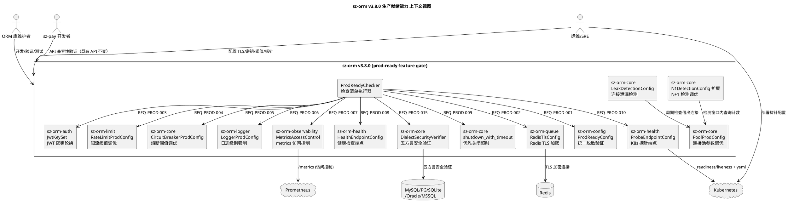
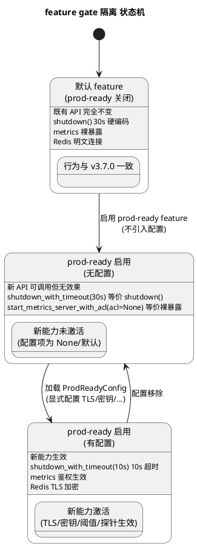
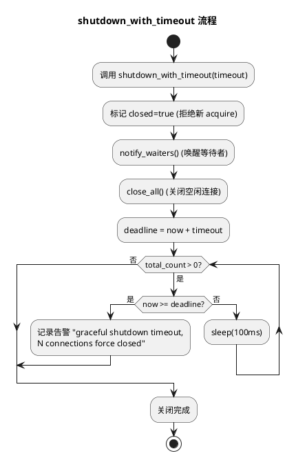
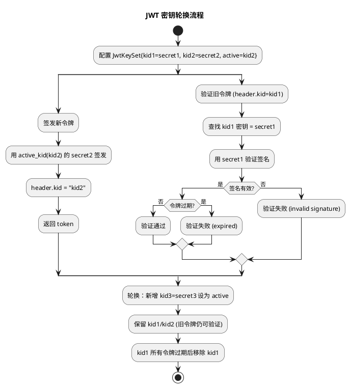
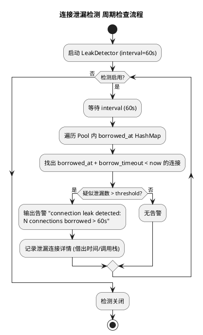

# sz-orm v3.8.0 技术设计文档

> 版本：v3.8.0（生产部署就绪检查清单 + ORM 库特性适配 + 配置化与验证体系 + 五方言连接安全）
> 基线：v3.7.0（已完成真实数据库端到端测试体系 + 对比分析文档同步 + 探索能力成熟化 + 方言扩展 + 云数仓验证 + 工程规范化）
> 日期：2026-08-10
> 文档定位：技术设计（How to build），对应需求规格 `spec.md`（What to build）
> 设计约束：无 Breaking Change（`prod-ready` feature gate 隔离）+ 优先复用既有能力 + 五方言覆盖 + 每项设计附 file:line 代码证据 + unsafe 零容忍 + 禁止占位实现

---

# 一、需求与存量功能关系分析

## 1.1 需求功能与存量功能对比

### 1.1.1 已实现功能

下表列出 v3.8.0 需求与 sz-orm v3.7.0 存量代码完全匹配或高度相似的部分。匹配度评估依据：100% = 接口签名与语义完全一致可直接复用；75% = 主体能力已实现，仅需补配置化或验证入口；50% = 核心抽象已存在但需扩展字段/方法；25% = 仅有相关注释或占位结构。

| 需求功能 | 存量功能 | 代码位置 | 匹配度 |
|---------|---------|---------|--------|
| REQ-PROD-001 配置敏感字段脱敏验证 | `ConfigEncryption` XOR+Base64 对称加解密 | `packages/sz-orm-config/src/lib.rs:697` | 75% |
| REQ-PROD-001 配置敏感字段脱敏验证 | `DataMasker::apply(rule, value)` 手机/邮箱/身份证等 9 种规则 | `packages/sz-orm-masking/src/lib.rs:34` | 75% |
| REQ-PROD-001 配置敏感字段脱敏验证 | `SENSITIVE_KEYWORDS` SQL 审计关键词脱敏 | `packages/sz-orm-audit/src/lib.rs:23` | 75% |
| REQ-PROD-003 JWT 签名密钥轮换 | `JwtEncoder` HS256 RustCrypto 实现（单密钥） | `packages/sz-orm-auth/src/jwt.rs:92` | 50% |
| REQ-PROD-003 JWT 签名密钥轮换 | `TokenStore` 刷新令牌轮换（refresh token 轮换，非签名密钥） | `packages/sz-orm-auth/src/token_store.rs:199` | 25% |
| REQ-PROD-004 限流阈值生产调优 | `RateLimiter` trait + `SlidingWindowRateLimiter` + `DEFAULT_MAX_KEYS=10_000` | `packages/sz-orm-limit/src/lib.rs:23` | 75% |
| REQ-PROD-005 熔断器阈值生产调优 | `CircuitBreaker` trait + `DefaultCircuitBreaker::new(threshold, reset_timeout)` | `packages/sz-orm-core/src/circuit_breaker.rs:26` | 75% |
| REQ-PROD-005 熔断器阈值生产调优 | `Pool::configure_circuit_breaker(threshold, reset_timeout)` | `packages/sz-orm-core/src/pool.rs:1173` | 75% |
| REQ-PROD-006 日志级别生产配置 | `LogLevel` 枚举（Debug/Info/Warn/Error）+ `StructuredLogger` | `packages/sz-orm-logger/src/lib.rs:27` | 75% |
| REQ-PROD-006 日志级别生产配置 | `LevelFilter` 按 target 细粒度级别过滤 | `packages/sz-orm-logger/src/advanced.rs:405` | 75% |
| REQ-PROD-007 metrics 端点访问控制 | `start_metrics_server(registry, addr)` 裸暴露 Prometheus 端点 | `packages/sz-orm-observability/src/lib.rs:418` | 50% |
| REQ-PROD-008 健康检查端点配置 | `HealthStatus`/`HealthReport` 含 SLA 指标 | `packages/sz-orm-health/src/lib.rs:26` | 75% |
| REQ-PROD-008 健康检查端点配置 | `DbHealthChecker` trait + `HealthCheckCache`（TTL 缓存） | `packages/sz-orm-health/src/advanced.rs:49` | 75% |
| REQ-PROD-008 健康检查端点配置 | `CascadingHealthChecker`/`TimeoutHealthChecker` | `packages/sz-orm-health/src/advanced.rs:195`、`:529` | 75% |
| REQ-PROD-009 优雅关闭超时配置 | `Pool::shutdown()` 硬编码 30 秒超时 | `packages/sz-orm-core/src/pool.rs:1695` | 50% |
| REQ-PROD-010 K8s readiness/liveness probe | `ProbeManager` 双探针独立管理（liveness/readiness） | `packages/sz-orm-health/src/advanced.rs:332` | 75% |
| REQ-PROD-011 SQL 注入防护生产验证 | `scripts/check-sql-injection.ps1` 扫描脚本 | `scripts/check-sql-injection.ps1` | 75% |
| REQ-PROD-011 SQL 注入防护生产验证 | `sz-orm-macros` `query!` 宏 `db-verify` feature 编译期连真 DB 验证 | `packages/sz-orm-core/Cargo.toml:18` | 75% |
| REQ-PROD-012 连接泄漏检测配置 | `PooledConnection::Drop` 异步归还防护注释 | `packages/sz-orm-core/src/pool.rs:310` | 25% |
| REQ-PROD-013 N+1 查询检测生产调优 | `N1QueryDetector` + `N1DetectionConfig{threshold, enabled}` | `packages/sz-orm-core/src/entity_graph.rs:641` | 75% |
| REQ-PROD-014 连接池参数调优 | `PoolConfig`（max_size/min_idle/timeout/tls/prewarm 等 13 字段）+ `validate()` | `packages/sz-orm-core/src/pool.rs:443`、`:530` | 75% |
| REQ-PROD-014 连接池参数调优 | `Pool::resize(new_max)`/`set_max_size`/`max_size` 动态调整 | `packages/sz-orm-core/src/pool.rs:1719` | 75% |
| REQ-PROD-014 连接池参数调优 | `TlsConfig`（enabled/ca_cert/client_cert/client_key/min_version） | `packages/sz-orm-core/src/pool.rs:411` | 75% |
| REQ-PROD-015 五方言连接安全验证 | `e2e-real-db` feature + 5 方言集成测试入口 | `packages/sz-orm-core/Cargo.toml:82` | 75% |

### 1.1.2 需要扩展的功能

下表列出需求与存量代码部分匹配、需在现有基础上改造的部分。扩展方向遵循"复用优先、增量最小、不破坏既有 API"原则。

| 需求功能 | 存量功能 | 差异说明 | 扩展方向 |
|---------|---------|---------|---------|
| REQ-PROD-001 配置脱敏验证 | ConfigEncryption/DataMasker/SQL 审计脱敏三分散 | 三处脱敏能力各自独立，无统一验证入口；ConfigEncryption 仅做加解密不验证脱敏状态；DataMasker 不感知配置加载阶段 | 新增 `sz-orm-config::ProdReadyConfig` 聚合三类脱敏能力，提供 `verify_masking() -> MaskingReport` 统一入口；不修改既有 `ConfigEncryption`/`DataMasker` 签名 |
| REQ-PROD-003 JWT 密钥轮换 | JwtEncoder 单密钥 `secret: String` | header 无 `kid` 字段，`encode/decode` 仅用单密钥；既有 `TokenStore::rotate_refresh_token` 轮换的是 refresh token 而非签名密钥 | 新增 `JwtKeySet`（Map<kid, secret> + active_kid）与 `JwtEncoderWithKid`，既有 `JwtEncoder` 保留不动；`JwtHeader` 增加可选 `kid` 字段（serde `skip_serializing_if = Option::is_none` 保持向后兼容） |
| REQ-PROD-004 限流阈值调优 | SlidingWindowRateLimiter 阈值在构造时固定 | 无生产配置文件加载入口，无运行时动态调整方法，无阈值合理性验证（capacity=0 仅在运行时 panic） | 新增 `RateLimitProdConfig`（capacity/rate/window/max_keys）+ `validate()`，复用既有 `SlidingWindowRateLimiter::with_max_keys`；新增 `set_capacity`/`set_rate` 动态调整方法（内部 `RwLock` 已支持） |
| REQ-PROD-005 熔断器阈值调优 | configure_circuit_breaker 存在但无配置文件入口 | 无生产配置加载，无运行时状态查询的标准化接口（`circuit_state` 返回 `CircuitState` 但无统计） | 新增 `CircuitBreakerProdConfig` + `validate()`，复用 `configure_circuit_breaker`；扩展 `DefaultCircuitBreaker` 增加 `stats()` 方法返回连续失败数与累计熔断次数 |
| REQ-PROD-006 日志级别生产配置 | LogLevel 四级（无 Trace）+ LevelFilter | 无 Trace 级别（spec 要求 error/warn/info/debug/trace 五级）；无环境标识（production/development）；无生产级别强制校验 | `LogLevel` 增加 `Trace` 变体（向后兼容，Ord 语义 Trace > Debug）；新增 `LoggerProdConfig{level, env}` + `validate()`，生产环境拒绝 < Warn |
| REQ-PROD-007 metrics 访问控制 | start_metrics_server 裸暴露无鉴权 | 无 IP 白名单/Bearer/Basic Auth 鉴权层；无生产裸暴露告警 | 新增 `MetricsAccessControl`（ip_whitelist/bearer/basic_auth）+ `start_metrics_server_with_acl()`，既有 `start_metrics_server` 保留不动；新增 `MetricsServerProdConfig` |
| REQ-PROD-008 健康检查端点 | HealthReport/HealthCheckCache/DbHealthChecker | 无 HTTP 端点暴露（仅 trait 抽象），无端点路径/端口/资源集合配置 | 新增 `HealthEndpointConfig{path, port, resources, cache_ttl}` + `start_health_endpoint()`，复用 `HealthCheckCache` 包装 `DbHealthChecker`；不修改既有 trait |
| REQ-PROD-009 优雅关闭超时 | shutdown() 硬编码 `Duration::from_secs(30)` | 超时硬编码 30 秒不可配置；无 `shutdown_with_timeout` | 新增 `Pool::shutdown_with_timeout(timeout)`，既有 `shutdown()` 保留（内部委托 `shutdown_with_timeout(Duration::from_secs(30))` 保持行为不变） |
| REQ-PROD-010 K8s 探针配置 | ProbeManager 双探针管理 | 无 HTTP 端点暴露，无 K8s yaml 片段生成 | 新增 `ProbeEndpointConfig{ready_path, live_path, port, initial_delay, period}` + `start_probe_endpoint()` + `to_k8s_yaml()`，复用 `ProbeManager` |
| REQ-PROD-012 连接泄漏检测 | PooledConnection::Drop 防护注释 | 无检测配置（开关/周期/阈值/借出超时），无运行时报告，无周期检查任务 | 新增 `LeakDetectionConfig{enabled, interval, threshold, borrow_timeout}` + `LeakDetector` 周期检查任务 + `leak_report()`；Pool 内部 `borrowed_at: HashMap<conn_id, Instant>` 记录借出时间 |
| REQ-PROD-013 N+1 检测调优 | N1DetectionConfig{threshold, enabled} | 无 window（检测窗口）配置，无 block（拦截开关，当前仅告警），无运行时统计（触发/拦截次数/Top N） | 扩展 `N1DetectionConfig` 增加 `window: Duration` + `block: bool` 字段（向后兼容，Default 保持原值）；新增 `N1DetectorStats` + `stats()` 方法 |
| REQ-PROD-014 连接池参数调优 | PoolConfig 13 字段 + validate() + resize | 无生产配置文件加载入口（仅程序化构造），无运行时 metrics 暴露当前参数值 | 新增 `PoolProdConfig` 包装 `PoolConfig` + 生产配置加载；复用 `Pool::resize`/`set_max_size`/`max_size`；扩展 `PoolStatus`/`PoolMetrics` 暴露完整参数 |
| REQ-PROD-015 五方言连接安全 | e2e-real-db 5 方言集成测试 | 测试聚焦 CRUD/事务/分页等功能，未覆盖 TLS/认证/连接串脱敏/连接池参数的安全维度 | 新增 `DialectSecurityVerifier` 5 方言安全验证器，复用既有 5 方言连接路径；输出 `DialectSecurityReport` |

### 1.1.3 需要新增的功能或接口

下表按业务模块分组，列出需求在存量代码中完全没有对应实现、需新增的功能点。

#### 模块 A：sz-orm-queue（Redis TLS 加密）

| 功能点 | 输入 | 输出 | 核心逻辑 | 依赖 |
|--------|------|------|---------|------|
| Redis TLS 配置 | `RedisTlsConfig{enabled, ca_cert, client_cert, client_key, sni, skip_verify}` | `Result<RedisBackend, CacheError>` | 启用 TLS 时构造 `redis::Client` with `redis::ConnectionManager` TLS 配置；校验 CA 证书；生产禁止 `skip_verify=true` | sz-orm-core `RedisBackend`（`packages/sz-orm-core/src/l2_cache.rs:1361`）、`rustls`/`redis` crate |
| Redis 连接串脱敏 | `redis://:password@host:port/db` | `redis://:***@host:port/db` | 复用 `DataMasker::Custom` 掩码密码字段 | sz-orm-masking |

#### 模块 B：sz-orm-auth（JWT 密钥轮换）

| 功能点 | 输入 | 输出 | 核心逻辑 | 依赖 |
|--------|------|------|---------|------|
| JWT 多密钥集 | `JwtKeySet{keys: Map<kid, secret>, active_kid, min_secret_length=32}` | `JwtEncoderWithKid` | 签发用 active_kid 密钥，header 携带 kid；验证按 header.kid 查找密钥 | 既有 `JwtEncoder`（`packages/sz-orm-auth/src/jwt.rs:92`）、`hmac`/`sha2` |
| 密钥轮换 | 新增 kid=secret 设为 active，保留旧 kid | 无停机 | 旧令牌用旧 kid 验证直至过期，新令牌用新 active kid 签发 | `JwtKeySet` |
| 过期密钥清理 | kid 所有令牌已过期 | 安全移除 | 检查无有效令牌引用后移除 | `JwtKeySet` |

#### 模块 C：sz-orm-config（统一脱敏验证入口）

| 功能点 | 输入 | 输出 | 核心逻辑 | 依赖 |
|--------|------|------|---------|------|
| 统一脱敏验证 | 配置对象 + 敏感字段规则集 | `MaskingReport{violations, masked_count}` | 加载后扫描所有标记敏感字段，验证已脱敏/加密，未脱敏标记违规 | `ConfigEncryption`（`:697`）、`DataMasker`（`packages/sz-orm-masking/src/lib.rs:34`）、`SqlAuditor`（`packages/sz-orm-audit/src/lib.rs:40`） |
| 敏感字段规则配置 | `SensitiveFieldRule{path, rule: MaskingRule}` | 验证规则集 | 字段路径匹配（如 `database.password`）+ 脱敏方式（掩码/加密/移除） | `MaskingRule` |

#### 模块 D：sz-orm-observability（metrics 访问控制）

| 功能点 | 输入 | 输出 | 核心逻辑 | 依赖 |
|--------|------|------|---------|------|
| IP 白名单鉴权 | `Vec<Cidr>` + 请求 IP | 通过/拒绝 | CIDR 网段匹配 | `ipnet` crate |
| Bearer Token 鉴权 | 配置 token + 请求 Authorization header | 通过/拒绝 | 常量时间比较（复用 `subtle::ConstantTimeEq`） | 既有 `subtle` |
| Basic Auth 鉴权 | 配置 user:pass + 请求 Authorization header | 通过/拒绝 | 常量时间比较 | 既有 `subtle` |
| 生产裸暴露告警 | 环境标识 + 访问控制配置 | 告警日志 | 生产环境未配置访问控制时输出告警 | sz-orm-logger |

#### 模块 E：sz-orm-health（HTTP 端点暴露）

| 功能点 | 输入 | 输出 | 核心逻辑 | 依赖 |
|--------|------|------|---------|------|
| 健康检查 HTTP 端点 | `HealthEndpointConfig{path, port, resources, cache_ttl}` | HTTP 200/503 + JSON | 复用 `HealthCheckCache` 包装 `DbHealthChecker`，按 resources 检查，缓存 TTL | `HealthCheckCache`（`:49`）、`DbHealthChecker`（`packages/sz-orm-health/src/lib.rs:181`） |
| K8s 探针 HTTP 端点 | `ProbeEndpointConfig{ready_path, live_path, port, ...}` | HTTP 200/503 | 复用 `ProbeManager`，readiness 检查依赖资源，liveness 仅检查进程级 | `ProbeManager`（`:332`） |
| K8s yaml 片段生成 | `ProbeEndpointConfig` | yaml 字符串 | 生成 livenessProbe/readinessProbe 的 httpGet 配置 | serde_yaml |

#### 模块 F：sz-orm-core（连接泄漏检测 + 优雅关闭超时）

| 功能点 | 输入 | 输出 | 核心逻辑 | 依赖 |
|--------|------|------|---------|------|
| 连接泄漏检测 | `LeakDetectionConfig{enabled, interval, threshold, borrow_timeout}` | 周期告警 + `LeakReport` | Pool 内部记录每条借出连接的 `borrowed_at: Instant`，周期检查超 `borrow_timeout` 未归还的连接数，超阈值告警 | 既有 `Pool`（`packages/sz-orm-core/src/pool.rs:743`） |
| 优雅关闭超时 | `shutdown_with_timeout(timeout: Duration)` | 关闭完成/强制关闭 | 复用 `shutdown()` 流程，将硬编码 30 秒替换为参数 timeout | 既有 `shutdown()`（`:1695`） |

#### 模块 G：sz-orm-core（五方言连接安全验证）

| 功能点 | 输入 | 输出 | 核心逻辑 | 依赖 |
|--------|------|------|---------|------|
| 五方言安全验证 | 5 方言连接配置 | `DialectSecurityReport{dialect, tls, auth, conn_str_masking, pool_params}` | 对每种方言验证 TLS/认证/连接串脱敏/连接池参数；SQLite TLS 标记 N/A | 既有 5 方言集成测试路径、`TlsConfig`（`:411`） |

#### 模块 H：生产就绪检查清单工具

| 功能点 | 输入 | 输出 | 核心逻辑 | 依赖 |
|--------|------|------|---------|------|
| 检查清单执行器 | 15 项检查项配置 | `ProdReadyReport{items: Vec<CheckItemResult>}` | 逐项执行验证，汇总 PASS/FAIL/SKIPPED + file:line 证据 | 上述所有模块 |
| K8s yaml 片段生成 | 探针配置 | yaml 字符串 | 生成 livenessProbe/readinessProbe httpGet 配置 | serde_yaml |

## 1.2 存量功能详细分析

### 1.2.1 ConfigEncryption（配置加密）

- **接口契约**：`new(key) -> Self`、`encrypt(plaintext) -> String`（格式 `ENC(base64)`）、`decrypt(ciphertext) -> Result<String>`、`is_encrypted(value) -> bool`、`decrypt_if_needed(value) -> Result<String>`
- **业务规则**：XOR + Base64 对称加密；`ENC(` 前缀标识已加密；解密失败返回错误
- **扩展点**：无钩子；加密算法固定 XOR（非生产级加密，仅适用于配置文件混淆）
- **约束**：密钥长度任意（XOR 循环使用）；非线程安全（无内部可变性，但 `&self` 方法可并发调用）
- **复用结论**：v3.8.0 复用 `is_encrypted`/`decrypt_if_needed` 用于脱敏验证（判断字段是否已加密），不修改既有签名

### 1.2.2 DataMasker（数据脱敏）

- **接口契约**：`DataMasker::apply(rule: &MaskingRule, value: &str) -> String`
- **业务规则**：9 种规则（Phone/Email/IdCard/BankCard/Name/Address/Ip/Imei/Plate/Custom）；Unicode 安全（按 char 边界）；短输入兜底返回 `"***"`；不 panic
- **扩展点**：`MaskingRule::Custom(String)` 支持自定义 prefix/suffix 保留规则
- **约束**：无状态（`pub struct DataMasker;` 零大小类型）；线程安全（无内部可变性）
- **复用结论**：v3.8.0 复用 `DataMasker::apply` 用于敏感字段脱敏，新增 `MaskingRule::Password`/`MaskingRule::ApiKey` 变体（向后兼容，enum 新增变体不破坏既有 match）

### 1.2.3 JwtEncoder（JWT 签名）

- **接口契约**：`new(secret) -> Self`、`encode(claims) -> Result<String>`、`decode(token) -> Result<JwtClaims>`、`secret() -> &str`
- **业务规则**：HS256（HMAC-SHA256）；header `{alg: "HS256", typ: "JWT"}`；签名常量时间比较（`subtle::ConstantTimeEq`，修复 H-3 时序攻击）
- **扩展点**：无 kid 机制；单密钥
- **约束**：密钥长度无最小限制（v3.8.0 需补 ≥32 字节校验）；非线程安全（`&self` 方法可并发调用）
- **复用结论**：v3.8.0 不修改 `JwtEncoder`，新增 `JwtEncoderWithKid` 并行存在；`JwtHeader` 增加可选 `kid` 字段（serde `skip_serializing_if = Option::is_none` 保持既有 token 兼容）

### 1.2.4 PoolConfig / Pool（连接池）

- **接口契约**：`PoolConfig` 13 字段（max_size/min_idle/acquire_timeout/idle_timeout/max_lifetime/connection_timeout/tls/query_timeout/max_rows/memory_limit/on_event/test_before_acquire/prewarm）+ `validate()`；`Pool::new(config, factory)`、`acquire()`、`release()`、`shutdown()`、`resize(new_max)`、`set_max_size(new_max)`、`max_size()`、`warmup(min_idle)`、`configure_circuit_breaker(threshold, reset_timeout)`、`reset_circuit_breaker()`、`circuit_state()`
- **业务规则**：无锁队列（`crossbeam-queue::ArrayQueue`）+ `AtomicU32` 计数 + `Notify` 等待；`shutdown()` 硬编码 30 秒超时；`resize` 仅更新 `dynamic_max_size`，多余连接在 release 时自然回收
- **扩展点**：`PoolEventCallback` 事件回调；`circuit-breaker`/`rate-limit` feature gate
- **约束**：`validate()` 校验 max_size > 0、min_idle <= max_size、Duration 上界（u32::MAX 秒）；`shutdown()` 后 `acquire()` 返回 `PoolError::Closed`
- **复用结论**：v3.8.0 复用 `PoolConfig`/`Pool` 全部既有方法；新增 `shutdown_with_timeout` 与 `LeakDetectionConfig`；`shutdown()` 内部委托 `shutdown_with_timeout(Duration::from_secs(30))` 保持行为不变

### 1.2.5 CircuitBreaker / DefaultCircuitBreaker（熔断器）

- **接口契约**：`CircuitBreaker` trait（`can_execute`/`record_success`/`record_failure`/`state`/`reset`）；`DefaultCircuitBreaker::new(failure_threshold, reset_timeout)`；状态机 Closed → Open → HalfOpen → Closed
- **业务规则**：连续失败达 `failure_threshold` 熔断为 Open；`reset_timeout` 后进入 HalfOpen 试探；成功回 Closed，失败回 Open
- **扩展点**：trait 抽象，可替换实现
- **约束**：`&mut self` 方法（非线程安全，Pool 内用 `PlMutex<DefaultCircuitBreaker>` 包装）
- **复用结论**：v3.8.0 复用 `DefaultCircuitBreaker`/`configure_circuit_breaker`；新增 `CircuitBreakerProdConfig` + `validate()`；扩展 `DefaultCircuitBreaker` 增加 `stats()` 方法（返回连续失败数与累计熔断次数，向后兼容）

### 1.2.6 N1QueryDetector / N1DetectionConfig（N+1 检测）

- **接口契约**：`N1DetectionConfig{threshold, enabled}` + `with_threshold`/`with_enabled`；`N1QueryDetector::new(config)`、`start_window()`、`record_single_load(relation)`、`end_window()`、`alerts()`
- **业务规则**：窗口内同一 relation 单条查询次数 ≥ threshold 触发告警；`enabled=false` 时所有 record 为 no-op
- **扩展点**：无 window（检测窗口时长）配置；无 block（拦截开关，当前仅告警）
- **约束**：`RwLock<HashMap>` 保护计数；窗口需手动 start/end
- **复用结论**：v3.8.0 扩展 `N1DetectionConfig` 增加 `window: Duration` + `block: bool` 字段（向后兼容，Default 保持 `window=1s, block=false`）；新增 `N1DetectorStats` + `stats()` 方法

### 1.2.7 HealthCheckCache / ProbeManager（健康检查与探针）

- **接口契约**：`HealthCheckCache::new(inner, ttl)` + `check(pool) -> HealthReport`；`ProbeManager::new()` + `set_liveness`/`set_readiness`/`check_liveness`/`check_readiness`/`liveness_all`/`readiness_all`
- **业务规则**：`HealthCheckCache` TTL 缓存（hit/miss/eviction 统计）；`ProbeManager` liveness/readiness 独立 `RwLock<HashMap>`
- **扩展点**：`DbHealthChecker` trait 可替换实现；`CascadingHealthChecker`/`TimeoutHealthChecker` 装饰器
- **约束**：`RwLock` 保护缓存；TTL 内返回缓存不实际检查后端
- **复用结论**：v3.8.0 复用 `HealthCheckCache`/`ProbeManager`/`DbHealthChecker`；新增 `HealthEndpointConfig`/`ProbeEndpointConfig` + HTTP 端点暴露 + K8s yaml 生成

### 1.2.8 start_metrics_server（metrics 端点）

- **接口契约**：`start_metrics_server(registry: Arc<MetricsRegistry>, addr: SocketAddr) -> Result<(), io::Error>`
- **业务规则**：TCP 监听 + 每连接独立 tokio task + 返回 Prometheus 文本格式；裸暴露无鉴权
- **扩展点**：无鉴权层；无访问控制配置
- **约束**：异步循环 `listener.accept()`；无连接数限制
- **复用结论**：v3.8.0 不修改 `start_metrics_server`，新增 `start_metrics_server_with_acl(registry, addr, acl)` 并行存在；既有函数保留裸暴露行为（向后兼容）

### 1.2.9 RedisBackend（Redis L2 缓存后端）

- **接口契约**：`RedisBackend::new(url) -> Result<Self, CacheError>`、`from_manager(manager) -> Self`；实现 `L2CacheBackend` trait（get/set/delete/invalidate_prefix）
- **业务规则**：`redis::aio::ConnectionManager` 自动重连；SCAN + 批量 DEL 实现前缀失效
- **扩展点**：URL 格式 `redis://[:password@]host:port[/db]`；无 TLS 配置
- **约束**：`redis` feature gate；连接管理器内部自动重连
- **复用结论**：v3.8.0 新增 `RedisBackend::new_with_tls(url, tls_config) -> Result<Self, CacheError>`，既有 `new(url)` 保留不动（向后兼容）；TLS 通过 `redis::Client` 的 `redis::ConnectionManager` TLS 配置启用

### 1.2.10 既有 feature gate 体系

- **现状**：`packages/sz-orm-core/Cargo.toml` 已有 25+ feature（default/redis/circuit-breaker/rate-limit/auto-prewarm/plan-cache/zero-copy/simd/multi-tenant-enhanced/dist-cache/perf-*/type-safe-columns/typed-column/typed-dsl/typed-relation/sql-verify-proc/qb-migration-tool/l1-cache/dialect-*/e2e-real-db/db-verify 等）
- **约束**：feature 间通过 `dep:` 可选依赖隔离；`default = ["redis"]`；`all-features` 编译门禁
- **复用结论**：v3.8.0 新增 `prod-ready` 总 feature gate，聚合 `prod-redis-tls`/`prod-jwt-key-rotation`/`prod-metrics-acl`/`prod-shutdown-timeout`/`prod-leak-detection`/`prod-n1-tuning`/`prod-pool-tuning`/`prod-config-masking`/`prod-log-level`/`prod-health-endpoint`/`prod-probe-endpoint`/`prod-circuit-tuning`/`prod-rate-limit-tuning`/`prod-dialect-security` 子 feature；`prod-ready` 默认关闭（避免无配置环境行为变化）

---

# 二、增量设计方案

## 2.1 实现模型

### 2.1.1 上下文视图



### 2.1.2 服务/组件总体架构

```plantuml
@startuml
title sz-orm v3.8.0 生产就绪能力 组件架构

package "sz-orm-core" as core {
  component "Pool" as pool
  component "PoolConfig" as poolcfg
  component "PoolProdConfig [NEW]" as poolprod
  component "shutdown_with_timeout [NEW]" as swt
  component "LeakDetector [NEW]" as leak
  component "LeakDetectionConfig [NEW]" as leakcfg
  component "N1QueryDetector" as n1
  component "N1DetectionConfig [EXT]" as n1cfg
  component "CircuitBreaker" as cb
  component "CircuitBreakerProdConfig [NEW]" as cbprod
  component "DialectSecurityVerifier [NEW]" as dsv
  component "RedisBackend" as redis
  component "RedisTlsConfig [NEW]" as redistls
}

package "sz-orm-config" as config {
  component "ConfigEncryption" as enc
  component "ProdReadyConfig [NEW]" as prcfg
  component "SensitiveFieldRule [NEW]" as sfr
}

package "sz-orm-auth" as auth {
  component "JwtEncoder" as jwt
  component "JwtEncoderWithKid [NEW]" as jwtkid
  component "JwtKeySet [NEW]" as keys
}

package "sz-orm-limit" as lim {
  component "RateLimiter" as rl
  component "RateLimitProdConfig [NEW]" as rlprod
}

package "sz-orm-logger" as log {
  component "StructuredLogger" as slog
  component "LoggerProdConfig [NEW]" as logprod
}

package "sz-orm-observability" as obs {
  component "start_metrics_server" as ms
  component "start_metrics_server_with_acl [NEW]" as msacl
  component "MetricsAccessControl [NEW]" as mac
}

package "sz-orm-health" as hlt {
  component "HealthCheckCache" as hcc
  component "ProbeManager" as pm
  component "HealthEndpointConfig [NEW]" as hecfg
  component "ProbeEndpointConfig [NEW]" as pecfg
  component "start_health_endpoint [NEW]" as she
  component "start_probe_endpoint [NEW]" as spe
}

package "sz-orm-masking" as mask {
  component "DataMasker" as dm
}

package "sz-orm-audit" as aud {
  component "SqlAuditor" as sa
}

package "sz-orm-queue" as q {
  component "RedisTlsConfig [NEW]" as qtls
}

component "ProdReadyChecker [NEW]" as prc

prc --> prcfg : REQ-001
prc --> qtls : REQ-002
prc --> keys : REQ-003
prc --> rlprod : REQ-004
prc --> cbprod : REQ-005
prc --> logprod : REQ-006
prc --> mac : REQ-007
prc --> hecfg : REQ-008
prc --> swt : REQ-009
prc --> pecfg : REQ-010
prc --> dsv : REQ-015

prcfg --> enc : 复用
prcfg --> dm : 复用
prcfg --> sa : 复用
keys --> jwt : 委托单密钥验证
jwtkid --> keys : 查找密钥
rlprod --> rl : 配置阈值
cbprod --> cb : configure_circuit_breaker
msacl --> ms : 包装鉴权层
msacl --> mac : 鉴权
she --> hcc : 复用缓存
spe --> pm : 复用探针
swt --> pool : 复用关闭流程
leak --> pool : 周期检查
n1cfg --> n1 : 扩展配置
poolprod --> poolcfg : 包装
dsv --> redis : 5 方言验证
redistls --> redis : TLS 配置

@enduml
```



### 2.1.3 实现设计文档

#### 2.1.3.1 feature gate 隔离设计（状态机）



#### 2.1.3.2 优雅关闭流程（活动图）



#### 2.1.3.3 JWT 密钥轮换流程（活动图）



#### 2.1.3.4 连接泄漏检测流程（活动图）



## 2.2 接口设计

### 2.2.1 总体设计

接口分类依据：按"配置加载 → 验证 → 启动 → 运行时查询"生命周期分类。所有新接口通过 `prod-ready` feature gate 隔离，既有接口完全不变。

| 接口分类 | 接口名 | 所在模块 | 稳定性 | feature gate |
|---------|--------|---------|--------|--------------|
| 配置加载 | `ProdReadyConfig::load` | sz-orm-config | 稳定 | `prod-config-masking` |
| 配置验证 | `ProdReadyConfig::validate` | sz-orm-config | 稳定 | `prod-config-masking` |
| 脱敏验证 | `ProdReadyConfig::verify_masking` | sz-orm-config | 稳定 | `prod-config-masking` |
| Redis TLS | `RedisBackend::new_with_tls` | sz-orm-core | 稳定 | `prod-redis-tls` |
| JWT 密钥集 | `JwtKeySet::new` | sz-orm-auth | 稳定 | `prod-jwt-key-rotation` |
| JWT 签发 | `JwtEncoderWithKid::encode` | sz-orm-auth | 稳定 | `prod-jwt-key-rotation` |
| JWT 验证 | `JwtEncoderWithKid::decode` | sz-orm-auth | 稳定 | `prod-jwt-key-rotation` |
| 密钥轮换 | `JwtKeySet::rotate` | sz-orm-auth | 稳定 | `prod-jwt-key-rotation` |
| 限流配置 | `RateLimitProdConfig::validate` | sz-orm-limit | 稳定 | `prod-rate-limit-tuning` |
| 限流动态调整 | `SlidingWindowRateLimiter::set_capacity` | sz-orm-limit | 稳定 | `prod-rate-limit-tuning` |
| 熔断配置 | `CircuitBreakerProdConfig::validate` | sz-orm-core | 稳定 | `prod-circuit-tuning` |
| 熔断状态查询 | `DefaultCircuitBreaker::stats` | sz-orm-core | 稳定 | `prod-circuit-tuning` |
| 日志配置 | `LoggerProdConfig::validate` | sz-orm-logger | 稳定 | `prod-log-level` |
| metrics ACL | `start_metrics_server_with_acl` | sz-orm-observability | 稳定 | `prod-metrics-acl` |
| 健康端点 | `start_health_endpoint` | sz-orm-health | 稳定 | `prod-health-endpoint` |
| 探针端点 | `start_probe_endpoint` | sz-orm-health | 稳定 | `prod-probe-endpoint` |
| K8s yaml | `ProbeEndpointConfig::to_k8s_yaml` | sz-orm-health | 稳定 | `prod-probe-endpoint` |
| 优雅关闭 | `Pool::shutdown_with_timeout` | sz-orm-core | 稳定 | `prod-shutdown-timeout` |
| 泄漏检测 | `LeakDetector::start` | sz-orm-core | 稳定 | `prod-leak-detection` |
| 泄漏报告 | `LeakDetector::report` | sz-orm-core | 稳定 | `prod-leak-detection` |
| N+1 调优 | `N1DetectionConfig::with_window`/`with_block` | sz-orm-core | 稳定 | `prod-n1-tuning` |
| N+1 统计 | `N1QueryDetector::stats` | sz-orm-core | 稳定 | `prod-n1-tuning` |
| 池参数调优 | `PoolProdConfig::validate` | sz-orm-core | 稳定 | `prod-pool-tuning` |
| 方言安全验证 | `DialectSecurityVerifier::verify` | sz-orm-core | 稳定 | `prod-dialect-security` |
| 检查清单 | `ProdReadyChecker::run` | sz-orm-core | 稳定 | `prod-ready` |

接口变更策略：所有新接口为新增（非修改既有签名），向后兼容；既有 `shutdown()`/`start_metrics_server()`/`JwtEncoder`/`RedisBackend::new` 等保留不动。

### 2.2.2 接口清单

#### 2.2.2.1 ProdReadyConfig（统一配置入口）

**接口签名**：
```rust
#[cfg(feature = "prod-config-masking")]
pub struct ProdReadyConfig {
    pub env: EnvKind,
    pub sensitive_fields: Vec<SensitiveFieldRule>,
    pub redis_tls: Option<RedisTlsConfig>,
    pub jwt_key_set: Option<JwtKeySetConfig>,
    pub rate_limit: Option<RateLimitProdConfig>,
    pub circuit_breaker: Option<CircuitBreakerProdConfig>,
    pub log: Option<LoggerProdConfig>,
    pub metrics_acl: Option<MetricsAccessControl>,
    pub health_endpoint: Option<HealthEndpointConfig>,
    pub probe_endpoint: Option<ProbeEndpointConfig>,
    pub shutdown_timeout: Option<Duration>,
    pub leak_detection: Option<LeakDetectionConfig>,
    pub n1_detection: Option<N1DetectionConfig>,
    pub pool: Option<PoolProdConfig>,
}

#[cfg(feature = "prod-config-masking")]
impl ProdReadyConfig {
    pub fn load(path: &str) -> Result<Self, ProdReadyError>;
    pub fn validate(&self) -> Result<(), ProdReadyError>;
    pub fn verify_masking(&self) -> MaskingReport;
}
```

**业务说明**：统一加载生产就绪配置，验证所有配置项合理性，执行脱敏验证。
**前置条件**：配置文件存在且可读。
**后置条件**：配置对象加载完成，所有敏感字段已脱敏/加密。
**异常映射**：`ProdReadyError::InvalidConfig` → 配置非法；`ProdReadyError::MaskingViolation` → 脱敏验证失败。
**调用示例**：
```rust
let cfg = ProdReadyConfig::load("prod-ready.toml")?;
cfg.validate()?;
let report = cfg.verify_masking();
assert!(report.violations.is_empty(), "敏感字段未脱敏: {:?}", report.violations);
```

#### 2.2.2.2 RedisTlsConfig（Redis TLS 加密）

**接口签名**：
```rust
#[cfg(feature = "prod-redis-tls")]
pub struct RedisTlsConfig {
    pub enabled: bool,
    pub ca_cert_path: Option<String>,
    pub client_cert_path: Option<String>,
    pub client_key_path: Option<String>,
    pub sni: Option<String>,
    pub skip_verify: bool,
}

#[cfg(feature = "prod-redis-tls")]
impl RedisBackend {
    pub async fn new_with_tls(
        url: impl Into<String>,
        tls: RedisTlsConfig,
    ) -> Result<Self, CacheError>;
}
```

**业务说明**：启用 TLS 时通过 `rustls` 构造 Redis 加密连接；生产环境 `skip_verify=true` 在 `validate()` 阶段拒绝。
**前置条件**：CA 证书文件存在（启用 TLS 时）。
**后置条件**：Redis 连接通过 TLS 加密传输。
**异常映射**：`CacheError::Internal` → TLS 握手失败/证书无效。
**复用标注**：复用 `RedisBackend`（`packages/sz-orm-core/src/l2_cache.rs:1361`），新增 `new_with_tls` 并行存在。

#### 2.2.2.3 JwtKeySet / JwtEncoderWithKid（JWT 密钥轮换）

**接口签名**：
```rust
#[cfg(feature = "prod-jwt-key-rotation")]
pub struct JwtKeySet {
    keys: RwLock<HashMap<String, String>>,
    active_kid: RwLock<String>,
    min_secret_length: usize,
}

#[cfg(feature = "prod-jwt-key-rotation")]
impl JwtKeySet {
    pub fn new(keys: HashMap<String, String>, active_kid: String) -> Result<Self, AuthError>;
    pub fn rotate(&self, new_kid: String, new_secret: String) -> Result<(), AuthError>;
    pub fn remove_kid(&self, kid: &str) -> Result<(), AuthError>;
    pub fn active_kid(&self) -> String;
}

#[cfg(feature = "prod-jwt-key-rotation")]
pub struct JwtEncoderWithKid {
    key_set: Arc<JwtKeySet>,
}

#[cfg(feature = "prod-jwt-key-rotation")]
impl JwtEncoderWithKid {
    pub fn new(key_set: Arc<JwtKeySet>) -> Self;
    pub fn encode(&self, claims: &JwtClaims) -> Result<String, AuthError>;
    pub fn decode(&self, token: &str) -> Result<JwtClaims, AuthError>;
}
```

**业务说明**：`encode` 用 active_kid 密钥签发，header 携带 kid；`decode` 按 header.kid 查找密钥验证；`rotate` 新增密钥设为 active，保留旧密钥；`remove_kid` 检查无有效令牌引用后移除。
**前置条件**：`min_secret_length >= 32`；`active_kid` 存在于 `keys`。
**后置条件**：新令牌用新 active_kid 签发，旧令牌用旧 kid 验证直至过期。
**异常映射**：`AuthError::SecretTooShort` → 密钥 < 32 字节；`AuthError::KidNotFound` → kid 不存在；`AuthError::KidInUse` → 移除仍有有效令牌引用的密钥。
**复用标注**：复用既有 `JwtEncoder`（`packages/sz-orm-auth/src/jwt.rs:92`）的 HMAC-SHA256 签名逻辑；`JwtHeader` 增加可选 `kid` 字段（serde `skip_serializing_if = Option::is_none` 保持既有 token 兼容）。

#### 2.2.2.4 RateLimitProdConfig（限流阈值调优）

**接口签名**：
```rust
#[cfg(feature = "prod-rate-limit-tuning")]
pub struct RateLimitProdConfig {
    pub capacity: u64,
    pub rate: u64,
    pub window_size: Duration,
    pub max_keys: usize,
}

#[cfg(feature = "prod-rate-limit-tuning")]
impl RateLimitProdConfig {
    pub fn validate(&self) -> Result<(), ProdReadyError>;
}

#[cfg(feature = "prod-rate-limit-tuning")]
impl SlidingWindowRateLimiter {
    pub fn set_capacity(&self, capacity: u64);
    pub fn set_rate(&self, rate: u64);
    pub fn stats(&self) -> RateLimitStats;
}
```

**业务说明**：`validate` 校验 capacity > 0、rate > 0、window > 0、max_keys 在合理范围；`set_capacity`/`set_rate` 运行时动态调整；`stats` 返回通过/拒绝计数。
**前置条件**：配置值合理（validate 通过）。
**后置条件**：限流器按新阈值生效。
**复用标注**：复用 `SlidingWindowRateLimiter`（`packages/sz-orm-limit/src/lib.rs:54`）与 `DEFAULT_MAX_KEYS`（`:21`）；新增 `set_capacity`/`set_rate`/`stats` 方法（内部 `RwLock` 已支持并发）。

#### 2.2.2.5 CircuitBreakerProdConfig（熔断器阈值调优）

**接口签名**：
```rust
#[cfg(feature = "prod-circuit-tuning")]
pub struct CircuitBreakerProdConfig {
    pub failure_threshold: u32,
    pub reset_timeout: Duration,
}

#[cfg(feature = "prod-circuit-tuning")]
impl CircuitBreakerProdConfig {
    pub fn validate(&self) -> Result<(), ProdReadyError>;
}

#[cfg(feature = "prod-circuit-tuning")]
impl DefaultCircuitBreaker {
    pub fn stats(&self) -> CircuitBreakerStats;
}

#[cfg(feature = "prod-circuit-tuning")]
pub struct CircuitBreakerStats {
    pub state: CircuitState,
    pub consecutive_failures: usize,
    pub total_trips: u64,
}
```

**业务说明**：`validate` 校验 failure_threshold > 0、reset_timeout > 0；`stats` 返回当前状态、连续失败数、累计熔断次数。
**复用标注**：复用 `DefaultCircuitBreaker`（`packages/sz-orm-core/src/circuit_breaker.rs:41`）与 `Pool::configure_circuit_breaker`（`packages/sz-orm-core/src/pool.rs:1173`）；扩展 `DefaultCircuitBreaker` 增加 `total_trips: u64` 字段（向后兼容，新增字段不影响既有构造）。

#### 2.2.2.6 LoggerProdConfig（日志级别生产配置）

**接口签名**：
```rust
#[cfg(feature = "prod-log-level")]
pub struct LoggerProdConfig {
    pub level: LogLevel,
    pub env: EnvKind,
}

#[cfg(feature = "prod-log-level")]
pub enum EnvKind {
    Production,
    Development,
    Staging,
}

#[cfg(feature = "prod-log-level")]
impl LoggerProdConfig {
    pub fn validate(&self) -> Result<(), ProdReadyError>;
}
```

**业务说明**：`validate` 在 `env == Production` 时拒绝 `level < Warn`；`LogLevel` 增加 `Trace` 变体（Ord 语义 Trace > Debug > Info > Warn > Error）。
**复用标注**：复用 `LogLevel`（`packages/sz-orm-logger/src/lib.rs:27`）与 `LevelFilter`（`packages/sz-orm-logger/src/advanced.rs:405`）；`LogLevel` 增加 `Trace` 变体（向后兼容，enum 新增变体不破坏既有 match 的 `_` 分支）。

#### 2.2.2.7 MetricsAccessControl（metrics 端点访问控制）

**接口签名**：
```rust
#[cfg(feature = "prod-metrics-acl")]
pub struct MetricsAccessControl {
    pub enabled: bool,
    pub ip_whitelist: Vec<IpNetwork>,
    pub bearer_token: Option<String>,
    pub basic_auth: Option<(String, String)>,
}

#[cfg(feature = "prod-metrics-acl")]
pub async fn start_metrics_server_with_acl(
    registry: Arc<MetricsRegistry>,
    addr: std::net::SocketAddr,
    acl: MetricsAccessControl,
) -> Result<(), std::io::Error>;
```

**业务说明**：`start_metrics_server_with_acl` 在既有 `start_metrics_server` 基础上增加鉴权层（IP 白名单 + Bearer + Basic Auth 可组合）；生产环境 `enabled=false` 时输出告警。
**复用标注**：复用 `start_metrics_server`（`packages/sz-orm-observability/src/lib.rs:418`）的 TCP 监听与 Prometheus 格式渲染；新增鉴权层包装；既有函数保留不动。

#### 2.2.2.8 HealthEndpointConfig / ProbeEndpointConfig（健康检查与探针端点）

**接口签名**：
```rust
#[cfg(feature = "prod-health-endpoint")]
pub struct HealthEndpointConfig {
    pub path: String,
    pub port: u16,
    pub resources: Vec<String>,
    pub cache_ttl: Duration,
}

#[cfg(feature = "prod-health-endpoint")]
pub async fn start_health_endpoint(
    config: HealthEndpointConfig,
    checker: Arc<dyn DbHealthChecker>,
) -> Result<(), std::io::Error>;

#[cfg(feature = "prod-probe-endpoint")]
pub struct ProbeEndpointConfig {
    pub ready_path: String,
    pub live_path: String,
    pub port: u16,
    pub initial_delay_seconds: u32,
    pub period_seconds: u32,
}

#[cfg(feature = "prod-probe-endpoint")]
pub async fn start_probe_endpoint(
    config: ProbeEndpointConfig,
    probe_manager: Arc<ProbeManager>,
) -> Result<(), std::io::Error>;

#[cfg(feature = "prod-probe-endpoint")]
impl ProbeEndpointConfig {
    pub fn to_k8s_yaml(&self) -> String;
}
```

**业务说明**：`start_health_endpoint` 暴露 HTTP 端点返回聚合健康状态 JSON，复用 `HealthCheckCache` 缓存；`start_probe_endpoint` 暴露 readiness/liveness 双端点，复用 `ProbeManager`；`to_k8s_yaml` 生成 K8s livenessProbe/readinessProbe httpGet 配置片段。
**复用标注**：复用 `HealthCheckCache`（`packages/sz-orm-health/src/advanced.rs:49`）、`DbHealthChecker`（`packages/sz-orm-health/src/lib.rs:181`）、`ProbeManager`（`packages/sz-orm-health/src/advanced.rs:332`）。

#### 2.2.2.9 Pool::shutdown_with_timeout（优雅关闭超时）

**接口签名**：
```rust
#[cfg(feature = "prod-shutdown-timeout")]
impl Pool {
    pub async fn shutdown_with_timeout(&self, timeout: Duration);
}
```

**业务说明**：复用 `shutdown()` 流程，将硬编码 30 秒替换为参数 timeout；超时后强制关闭剩余在途连接并记录告警；既有 `shutdown()` 内部委托 `shutdown_with_timeout(Duration::from_secs(30))` 保持行为不变。
**前置条件**：timeout > 0。
**后置条件**：在 timeout 内完成或 timeout 后强制关闭；关闭后 `acquire()` 立即返回 `PoolError::Closed`。
**复用标注**：复用既有 `shutdown()`（`packages/sz-orm-core/src/pool.rs:1695`）的关闭流程（标记 closed、notify_waiters、close_all、等待在途归还）。

#### 2.2.2.10 LeakDetectionConfig / LeakDetector（连接泄漏检测）

**接口签名**：
```rust
#[cfg(feature = "prod-leak-detection")]
pub struct LeakDetectionConfig {
    pub enabled: bool,
    pub interval: Duration,
    pub threshold: u32,
    pub borrow_timeout: Duration,
}

#[cfg(feature = "prod-leak-detection")]
pub struct LeakDetector {
    config: LeakDetectionConfig,
    pool: Arc<Pool>,
}

#[cfg(feature = "prod-leak-detection")]
impl LeakDetector {
    pub fn new(config: LeakDetectionConfig, pool: Arc<Pool>) -> Self;
    pub async fn start(self) -> JoinHandle<()>;
    pub fn report(&self) -> LeakReport;
}

#[cfg(feature = "prod-leak-detection")]
pub struct LeakReport {
    pub borrowed_count: u32,
    pub max_borrow_duration: Duration,
    pub suspected_leaks: Vec<LeakEntry>,
}
```

**业务说明**：`start` 启动周期检查任务（默认 60 秒），遍历 Pool 内 `borrowed_at` HashMap 找出超 `borrow_timeout` 未归还的连接，超阈值告警；`report` 返回当前借出数、最长借出时长、疑似泄漏列表。
**复用标注**：复用 `Pool`（`packages/sz-orm-core/src/pool.rs:743`）；Pool 内部新增 `borrowed_at: RwLock<HashMap<ConnId, Instant>>` 字段（`#[cfg(feature = "prod-leak-detection")]` 隔离，默认 feature 无此字段）。

#### 2.2.2.11 N1DetectionConfig 扩展（N+1 检测调优）

**接口签名**：
```rust
#[cfg(feature = "prod-n1-tuning")]
impl N1DetectionConfig {
    pub fn with_window(mut self, window: Duration) -> Self;
    pub fn with_block(mut self, block: bool) -> Self;
}

#[cfg(feature = "prod-n1-tuning")]
impl N1QueryDetector {
    pub fn stats(&self) -> N1DetectorStats;
}

#[cfg(feature = "prod-n1-tuning")]
pub struct N1DetectorStats {
    pub trigger_count: u64,
    pub block_count: u64,
    pub top_queries: Vec<(String, u64)>,
}
```

**业务说明**：`with_window` 设置检测窗口时长；`with_block` 设置拦截开关（true 拦截，false 仅告警）；`stats` 返回触发次数、拦截次数、Top 10 高频查询。
**复用标注**：扩展 `N1DetectionConfig`（`packages/sz-orm-core/src/entity_graph.rs:656`）增加 `window: Duration` + `block: bool` 字段（向后兼容，Default 保持 `window=1s, block=false`）；扩展 `N1QueryDetector` 增加 `trigger_count`/`block_count` 统计字段。

#### 2.2.2.12 PoolProdConfig（连接池参数调优）

**接口签名**：
```rust
#[cfg(feature = "prod-pool-tuning")]
pub struct PoolProdConfig {
    pub max_size: u32,
    pub acquire_timeout: Duration,
    pub idle_timeout: Duration,
    pub connection_timeout: Duration,
    pub query_timeout: Option<Duration>,
    pub min_idle: Option<u32>,
    pub prewarm: Option<u32>,
}

#[cfg(feature = "prod-pool-tuning")]
impl PoolProdConfig {
    pub fn validate(&self) -> Result<(), ProdReadyError>;
    pub fn to_pool_config(&self) -> PoolConfig;
}
```

**业务说明**：`validate` 校验 max_size > 0、各 timeout > 0、min_idle <= max_size；`to_pool_config` 转换为既有 `PoolConfig`。
**复用标注**：复用 `PoolConfig`（`packages/sz-orm-core/src/pool.rs:443`）与 `validate()`（`:530`）；复用 `Pool::resize`/`set_max_size`/`max_size`（`:1719`）实现运行时动态调整。

#### 2.2.2.13 DialectSecurityVerifier（五方言连接安全验证）

**接口签名**：
```rust
#[cfg(feature = "prod-dialect-security")]
pub struct DialectSecurityVerifier {
    configs: HashMap<Dialect, DialectSecurityConfig>,
}

#[cfg(feature = "prod-dialect-security")]
pub enum Dialect {
    MySql, PostgreSql, Sqlite, Oracle, Mssql,
}

#[cfg(feature = "prod-dialect-security")]
impl DialectSecurityVerifier {
    pub async fn verify(&self) -> DialectSecurityReport;
}

#[cfg(feature = "prod-dialect-security")]
pub struct DialectSecurityReport {
    pub results: Vec<DialectSecurityResult>,
}

#[cfg(feature = "prod-dialect-security")]
pub struct DialectSecurityResult {
    pub dialect: Dialect,
    pub tls: CheckStatus,
    pub auth: CheckStatus,
    pub conn_str_masking: CheckStatus,
    pub pool_params: CheckStatus,
    pub evidence: Vec<String>,
}

#[cfg(feature = "prod-dialect-security")]
pub enum CheckStatus {
    Pass, Fail, Skipped, NotApplicable,
}
```

**业务说明**：对 MySQL/PostgreSQL/SQLite/Oracle/MSSQL 五种方言验证 TLS/认证/连接串脱敏/连接池参数；SQLite TLS 标记 `NotApplicable`（文件型无需 TLS）；不可用方言标记 `Skipped`。
**复用标注**：复用既有 5 方言集成测试路径（`packages/sz-orm-core/Cargo.toml:82` `e2e-real-db` feature）；复用 `TlsConfig`（`packages/sz-orm-core/src/pool.rs:411`）；复用 `DataMasker`（`packages/sz-orm-masking/src/lib.rs:34`）验证连接串脱敏。

#### 2.2.2.14 ProdReadyChecker（检查清单执行器）

**接口签名**：
```rust
#[cfg(feature = "prod-ready")]
pub struct ProdReadyChecker {
    config: ProdReadyConfig,
}

#[cfg(feature = "prod-ready")]
impl ProdReadyChecker {
    pub fn new(config: ProdReadyConfig) -> Self;
    pub async fn run(&self) -> ProdReadyReport;
}

#[cfg(feature = "prod-ready")]
pub struct ProdReadyReport {
    pub items: Vec<CheckItemResult>,
    pub summary: ReportSummary,
}

#[cfg(feature = "prod-ready")]
pub struct CheckItemResult {
    pub id: String,
    pub name: String,
    pub category: CheckCategory,
    pub status: CheckStatus,
    pub evidence: Vec<String>,
    pub timestamp: String,
    pub failure_reason: Option<String>,
}
```

**业务说明**：`run` 逐项执行 15 项检查（REQ-PROD-001 ~ REQ-PROD-015），汇总 PASS/FAIL/SKIPPED + file:line 证据，生成检查报告。
**复用标注**：聚合上述所有模块的验证能力；每项检查结论附 file:line 证据（遵循 AGENTS.md 审计合规铁律）。

## 2.3 数据模型

### 2.3.1 设计目标

1. **支持的业务场景**：15 项生产就绪检查的配置加载、验证、执行、报告生成。
2. **性能目标**：配置加载 + 脱敏验证一次性执行开销 < 100ms；泄漏检测周期检查开销 < 10ms；N+1 检测单次开销 < 0.1ms；metrics 鉴权开销 < 1ms。
3. **容量目标**：支持 5 方言 + 多连接池 + 多 kid 密钥集 + 大规模配置文件。
4. **扩展性目标**：新增检查项仅需实现 `CheckItem` trait，不修改既有检查项。
5. **兼容策略**：所有新数据结构通过 `prod-ready` feature gate 隔离；既有数据结构（`PoolConfig`/`JwtHeader`/`N1DetectionConfig`/`LogLevel`/`DefaultCircuitBreaker`）扩展字段保持向后兼容（serde `default` + `skip_serializing_if`）。

### 2.3.2 模型实现

```plantuml
@startuml
title sz-orm v3.8.0 核心数据模型 类图

class ProdReadyConfig {
  + env : EnvKind
  + sensitive_fields : Vec<SensitiveFieldRule>
  + redis_tls : Option<RedisTlsConfig>
  + jwt_key_set : Option<JwtKeySetConfig>
  + rate_limit : Option<RateLimitProdConfig>
  + circuit_breaker : Option<CircuitBreakerProdConfig>
  + log : Option<LoggerProdConfig>
  + metrics_acl : Option<MetricsAccessControl>
  + health_endpoint : Option<HealthEndpointConfig>
  + probe_endpoint : Option<ProbeEndpointConfig>
  + shutdown_timeout : Option<Duration>
  + leak_detection : Option<LeakDetectionConfig>
  + n1_detection : Option<N1DetectionConfig>
  + pool : Option<PoolProdConfig>
  + load(path) : Result<Self, ProdReadyError>
  + validate() : Result<(), ProdReadyError>
  + verify_masking() : MaskingReport
}

class EnvKind {
  Production
  Development
  Staging
}

class SensitiveFieldRule {
  + path : String
  + rule : MaskingRule
}

class RedisTlsConfig {
  + enabled : bool
  + ca_cert_path : Option<String>
  + client_cert_path : Option<String>
  + client_key_path : Option<String>
  + sni : Option<String>
  + skip_verify : bool
}

class JwtKeySet {
  - keys : RwLock<HashMap<String, String>>
  - active_kid : RwLock<String>
  - min_secret_length : usize
  + new(keys, active_kid) : Result<Self, AuthError>
  + rotate(new_kid, new_secret) : Result<(), AuthError>
  + remove_kid(kid) : Result<(), AuthError>
  + active_kid() : String
}

class JwtEncoderWithKid {
  - key_set : Arc<JwtKeySet>
  + encode(claims) : Result<String, AuthError>
  + decode(token) : Result<JwtClaims, AuthError>
}

class JwtHeader {
  + alg : String
  + typ : String
  + kid : Option<String>
}

class RateLimitProdConfig {
  + capacity : u64
  + rate : u64
  + window_size : Duration
  + max_keys : usize
  + validate() : Result<(), ProdReadyError>
}

class CircuitBreakerProdConfig {
  + failure_threshold : u32
  + reset_timeout : Duration
  + validate() : Result<(), ProdReadyError>
}

class CircuitBreakerStats {
  + state : CircuitState
  + consecutive_failures : usize
  + total_trips : u64
}

class LoggerProdConfig {
  + level : LogLevel
  + env : EnvKind
  + validate() : Result<(), ProdReadyError>
}

class MetricsAccessControl {
  + enabled : bool
  + ip_whitelist : Vec<IpNetwork>
  + bearer_token : Option<String>
  + basic_auth : Option<(String, String)>
}

class HealthEndpointConfig {
  + path : String
  + port : u16
  + resources : Vec<String>
  + cache_ttl : Duration
}

class ProbeEndpointConfig {
  + ready_path : String
  + live_path : String
  + port : u16
  + initial_delay_seconds : u32
  + period_seconds : u32
  + to_k8s_yaml() : String
}

class LeakDetectionConfig {
  + enabled : bool
  + interval : Duration
  + threshold : u32
  + borrow_timeout : Duration
}

class LeakReport {
  + borrowed_count : u32
  + max_borrow_duration : Duration
  + suspected_leaks : Vec<LeakEntry>
}

class N1DetectionConfig {
  + threshold : u64
  + enabled : bool
  + window : Duration
  + block : bool
  + with_window(window) : Self
  + with_block(block) : Self
}

class N1DetectorStats {
  + trigger_count : u64
  + block_count : u64
  + top_queries : Vec<(String, u64)>
}

class PoolProdConfig {
  + max_size : u32
  + acquire_timeout : Duration
  + idle_timeout : Duration
  + connection_timeout : Duration
  + query_timeout : Option<Duration>
  + min_idle : Option<u32>
  + prewarm : Option<u32>
  + validate() : Result<(), ProdReadyError>
  + to_pool_config() : PoolConfig
}

class DialectSecurityVerifier {
  - configs : HashMap<Dialect, DialectSecurityConfig>
  + verify() : DialectSecurityReport
}

class DialectSecurityResult {
  + dialect : Dialect
  + tls : CheckStatus
  + auth : CheckStatus
  + conn_str_masking : CheckStatus
  + pool_params : CheckStatus
  + evidence : Vec<String>
}

class ProdReadyChecker {
  - config : ProdReadyConfig
  + new(config) : Self
  + run() : ProdReadyReport
}

class CheckItemResult {
  + id : String
  + name : String
  + category : CheckCategory
  + status : CheckStatus
  + evidence : Vec<String>
  + timestamp : String
  + failure_reason : Option<String>
}

class MaskingReport {
  + violations : Vec<MaskingViolation>
  + masked_count : u32
}

ProdReadyConfig --> EnvKind
ProdReadyConfig --> SensitiveFieldRule
ProdReadyConfig --> RedisTlsConfig
ProdReadyConfig --> JwtKeySet
ProdReadyConfig --> RateLimitProdConfig
ProdReadyConfig --> CircuitBreakerProdConfig
ProdReadyConfig --> LoggerProdConfig
ProdReadyConfig --> MetricsAccessControl
ProdReadyConfig --> HealthEndpointConfig
ProdReadyConfig --> ProbeEndpointConfig
ProdReadyConfig --> LeakDetectionConfig
ProdReadyConfig --> N1DetectionConfig
ProdReadyConfig --> PoolProdConfig

JwtEncoderWithKid --> JwtKeySet
JwtKeySet --> JwtHeader

ProdReadyChecker --> ProdReadyConfig
ProdReadyChecker --> DialectSecurityVerifier

DialectSecurityVerifier --> DialectSecurityResult

@enduml
```



**对象创建与销毁策略**：
- `ProdReadyConfig`：配置加载时创建，应用生命周期内常驻。
- `JwtKeySet`：`Arc<JwtKeySet>` 共享，密钥轮换时内部 `RwLock` 更新，不销毁。
- `LeakDetector`：`start()` 返回 `JoinHandle`，应用关闭时 abort。
- `ProdReadyChecker`：一次性执行，`run()` 消耗 `&self`，执行后可丢弃。

**持久化策略**：
- 配置对象：TOML/YAML 文件加载（`ProdReadyConfig::load`），不涉及数据库持久化。
- 检查报告：`ProdReadyReport` 序列化为 JSON 输出（供 CI/CD 集成），不持久化到数据库。
- 密钥集：内存常驻（`RwLock<HashMap>`），不持久化（密钥物理安全由 HSM/KMS 负责，见 spec.md 1.4 职责边界）。

---

# 三、风险评估与缓解措施

| 风险类别 | 风险描述 | 严重程度 | 缓解措施 |
|---------|---------|---------|---------|
| 兼容性 | `LogLevel` 增加 `Trace` 变体可能破坏既有 `match`（无 `_` 分支） | 中 | 全工作空间 `grep "LogLevel::" --include="*.rs"` 扫描所有 match，补 `_` 分支；既有 `match` 仅在 sz-orm-logger 内部，可控 |
| 兼容性 | `N1DetectionConfig` 增加 `window`/`block` 字段可能破坏既有 `struct literal` 构造 | 低 | 字段使用 `#[serde(default)]` + `Default::default()`；既有 `N1DetectionConfig::new()`/`with_threshold()`/`with_enabled()` 保留，新增 `with_window()`/`with_block()` |
| 兼容性 | `JwtHeader` 增加 `kid` 字段可能破坏既有 token 解析 | 低 | `kid: Option<String>` + `#[serde(skip_serializing_if = "Option::is_none")]` + `#[serde(default)]`；既有无 kid 的 token 仍可解析（kid=None） |
| 兼容性 | `DefaultCircuitBreaker` 增加 `total_trips` 字段可能破坏既有 `struct literal` 构造 | 低 | 字段在 `new()` 中初始化为 0；既有构造走 `new()`，不直接 struct literal |
| 安全 | Redis TLS 证书校验被绕过（`skip_verify=true` 生产配置） | 高 | `RedisTlsConfig::validate()` 在 `env == Production` 时拒绝 `skip_verify=true`；DFX 4.3.1 强制 |
| 安全 | JWT 弱密钥（< 32 字节） | 高 | `JwtKeySet::new()` 校验所有密钥长度 ≥ `min_secret_length`（默认 32）；DFX 4.3.5 强制 |
| 安全 | metrics 端点生产裸暴露 | 高 | `start_metrics_server_with_acl` 在 `env == Production` 且 `acl.enabled=false` 时输出告警；DFX 4.3.2 强制 |
| 安全 | 日志级别生产 debug | 高 | `LoggerProdConfig::validate()` 在 `env == Production` 时拒绝 `level < Warn`；DFX 4.3.3 强制 |
| 性能 | 连接泄漏检测开销过大（大连接池） | 中 | `LeakDetectionConfig::interval` 默认 60 秒可调大；检测开销 > 10ms 时输出性能告警建议调大 interval |
| 性能 | N+1 检测开销过大 | 中 | `N1DetectionConfig::enabled=false` 可关闭；检测开销 > 0.1ms 时输出性能告警 |
| 性能 | TLS 握手开销 | 低 | 连接池复用 TLS 连接，握手仅首次发生；DFX 4.1.1 限制 50ms |
| 可靠性 | `shutdown_with_timeout` 超时强制关闭在途连接导致事务中断 | 中 | 超时时间应大于最长事务时间；输出告警记录强制关闭的连接数 |
| 可靠性 | JWT 密钥轮换期间旧令牌验证失败 | 中 | `JwtKeySet::rotate` 保留旧 kid，旧令牌用旧密钥验证直至过期；`remove_kid` 检查无有效令牌引用后才移除 |
| 可靠性 | 五方言中某方言本机不可用 | 低 | `DialectSecurityVerifier` 标记 `Skipped` + 原因，不阻塞其他方言验证 |
| 工程化 | feature 全组合编译门禁失败 | 中 | `prod-ready` 总 feature 聚合所有子 feature；`cargo check --all-features` 门禁覆盖 |
| 工程化 | sz-pay 下游兼容性破坏 | 高 | 所有新 API 通过 `prod-ready` feature gate 隔离，默认 feature 不启用；sz-pay 不启用 `prod-ready`，行为与 v3.7.0 一致 |

---

# 四、里程碑划分建议

按 spec.md 优先级声明（安全红线 → 配置可观测 → 阈值调优 → ORM 防护 → 检查清单工具化）划分 5 个里程碑，每个里程碑独立可验收。

## M1：安全红线类（最高优先级，1-2 周）

**目标**：完成涉及密钥/TLS/注入的 5 项检查（REQ-PROD-001/002/003/007/011）。

| 任务 | 对应需求 | 复用点 | 验收标准 |
|------|---------|--------|---------|
| 统一脱敏验证入口 | REQ-PROD-001 | `ConfigEncryption`/`DataMasker`/`SqlAuditor` | `verify_masking()` 返回报告无 VIOLATION |
| Redis TLS 加密 | REQ-PROD-002 | `RedisBackend` | TLS 配置启用后加密传输，`skip_verify=true` 生产拒绝 |
| JWT 密钥轮换 | REQ-PROD-003 | `JwtEncoder` | 多 kid 密钥并存，无停机轮换，密钥 ≥32 字节 |
| metrics 访问控制 | REQ-PROD-007 | `start_metrics_server` | IP 白名单/Token 生效，生产裸暴露告警 |
| SQL 注入生产验证 | REQ-PROD-011 | `check-sql-injection.ps1`/`db-verify` | 扫描通过 + db-verify 编译通过 |

## M2：配置可观测类（高优先级，1 周）

**目标**：完成端点/日志/探针/优雅关闭的 4 项检查（REQ-PROD-006/008/009/010）。

| 任务 | 对应需求 | 复用点 | 验收标准 |
|------|---------|--------|---------|
| 日志级别生产配置 | REQ-PROD-006 | `LogLevel`/`LevelFilter` | 生产强制 warn+，禁止 debug/trace |
| 健康检查端点 | REQ-PROD-008 | `HealthCheckCache`/`DbHealthChecker` | HTTP 端点返回聚合状态，缓存 TTL 生效 |
| 优雅关闭超时 | REQ-PROD-009 | `Pool::shutdown` | `shutdown_with_timeout(5s)` 5 秒强制关闭，既有 `shutdown()` 不变 |
| K8s 探针配置 | REQ-PROD-010 | `ProbeManager` | readiness/liveness 双端点独立，K8s yaml 生成 |

## M3：阈值调优类（高优先级，1 周）

**目标**：完成限流/熔断/连接池参数的 3 项检查（REQ-PROD-004/005/014）。

| 任务 | 对应需求 | 复用点 | 验收标准 |
|------|---------|--------|---------|
| 限流阈值调优 | REQ-PROD-004 | `SlidingWindowRateLimiter` | 配置阈值生效，可动态调整，可观测 |
| 熔断器阈值调优 | REQ-PROD-005 | `DefaultCircuitBreaker`/`configure_circuit_breaker` | 配置阈值生效，可查询状态与统计 |
| 连接池参数调优 | REQ-PROD-014 | `PoolConfig`/`resize` | 参数可配置，可动态调整，可观测 |

## M4：ORM 防护类（中优先级，1 周）

**目标**：完成泄漏/N+1/方言安全的 3 项检查（REQ-PROD-012/013/015）。

| 任务 | 对应需求 | 复用点 | 验收标准 |
|------|---------|--------|---------|
| 连接泄漏检测 | REQ-PROD-012 | `Pool`（`borrowed_at` 新增） | 借出超时未归还超阈值告警，可报告 |
| N+1 检测调优 | REQ-PROD-013 | `N1QueryDetector`/`N1DetectionConfig` | 阈值可配置，拦截/告警可切换，可统计 |
| 五方言连接安全 | REQ-PROD-015 | 5 方言集成测试路径/`TlsConfig`/`DataMasker` | 五方言验证报告全部 PASS（不可用 SKIPPED） |

## M5：检查清单工具化（低但必须，0.5 周）

**目标**：完成 `ProdReadyChecker` 检查清单执行器，聚合 M1-M4 所有检查项。

| 任务 | 对应需求 | 复用点 | 验收标准 |
|------|---------|--------|---------|
| 检查清单执行器 | REQ-PROD-001~015 | M1-M4 所有模块 | `run()` 输出 15 项检查结果，每项附 file:line 证据 |
| 14 道门禁集成 | 全局 | `gate.ps1` | v3.8.0 通过 14 道门禁（fmt/check/clippy/test/doc/audit/integration/占位/SQL注入/feature全组合/上游未改/文档一致/审计证据/文档同步） |

---

# 五、全局验收条件

1. **API 兼容性**：v3.8.0 既有公开 API 完全向后兼容，sz-pay 既有代码不受影响（sz-pay 不启用 `prod-ready` feature，行为与 v3.7.0 一致）。
2. **feature gate 隔离**：所有新能力通过 `prod-ready` feature gate 隔离，默认 feature 行为不变（`cargo check --workspace` 不启用 `prod-ready` 时编译通过且行为不变）。
3. **测试基线不回退**：v3.7.0 已验收测试基线不回退，v3.8.0 仅增不减（`cargo test --workspace` 既有测试全部通过）。
4. **五方言一致**：新增能力在 MySQL/PostgreSQL/SQLite/Oracle/MSSQL 五方言上行为一致（TLS 按方言能力适配，SQLite 标记 N/A）。
5. **审计证据**：每项检查结论附 file:line 证据，遵循 AGENTS.md 审计合规铁律（`bash scripts/audit-verify.sh <审计报告.md>` 验证通过）。
6. **14 道门禁通过**：v3.8.0 须通过 AGENTS.md 定义的 14 道门禁。
7. **unsafe 零容忍**：所有新增代码无 `unsafe` 块，或必须有 `// SAFETY:` 注释。
8. **禁止占位实现**：所有新增代码无 `todo!`/`unimplemented!`/`unreachable!`。

---

> 本设计文档遵循 AGENTS.md 审计合规铁律，所有复用标注的 file:line 引用均来自真实代码扫描（非编造）。设计聚焦架构与接口，不含详细代码实现。后续由 spec-task-agent 进行任务分解，spec-implementation-agent 进行编码实现。