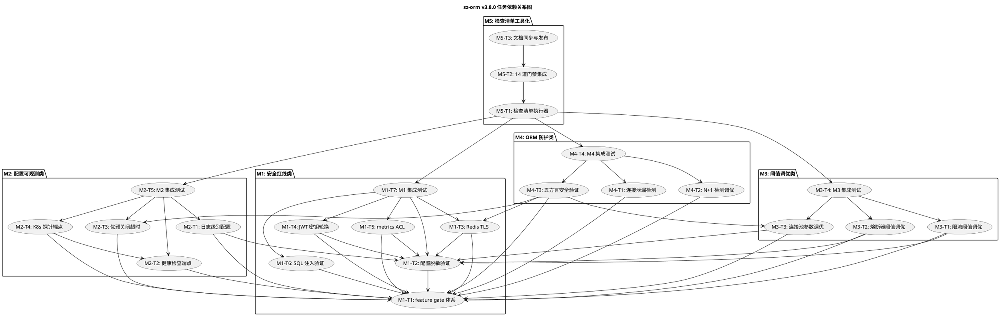

# sz-orm v3.8.0 编码任务规划

> 版本：v3.8.0（生产部署就绪检查清单 + ORM 库特性适配 + 配置化与验证体系 + 五方言连接安全）
> 基线：v3.7.0（已完成真实数据库端到端测试体系 + 对比分析文档同步 + 探索能力成熟化 + 方言扩展 + 云数仓验证 + 工程规范化）
> 日期：2026-08-10
> 文档定位：编码任务规划（How to execute），对应需求规格 `spec.md`（What to build）与技术设计 `design.md`（How to build）
> 任务约束：无 Breaking Change（`prod-ready` feature gate 隔离）+ 优先复用既有能力 + 五方言覆盖 + 每项任务附 file:line 代码证据 + unsafe 零容忍 + 禁止占位实现（todo!/unimplemented!/unreachable!）
> 审计合规铁律：每项任务结论须附真实存在的 file:line 证据，修复后必须运行 `cargo test` 并附输出，禁止未验证即标记 ✅

---

# 一、任务总览

## 1.1 里程碑 × 任务数 × 预期工作量

| 里程碑 | 名称 | 优先级 | 任务数 | 子任务数 | 预期工作量 | 对应需求 |
|--------|------|--------|--------|----------|-----------|---------|
| M1 | 安全红线类 | 最高 | 7 | 28 | 1-2 周 | REQ-PROD-001/002/003/007/011 |
| M2 | 配置可观测类 | 高 | 5 | 20 | 1 周 | REQ-PROD-006/008/009/010 |
| M3 | 阈值调优类 | 高 | 4 | 16 | 1 周 | REQ-PROD-004/005/014 |
| M4 | ORM 防护类 | 中 | 4 | 18 | 1 周 | REQ-PROD-012/013/015 |
| M5 | 检查清单工具化 | 低但必须 | 3 | 12 | 0.5 周 | REQ-PROD-001~015 聚合 |
| **合计** | — | — | **23** | **94** | **4.5-5.5 周** | **15 项全覆盖** |

## 1.2 任务编号约定

- 主任务：`M{里程碑号}-T{任务序号}`（如 M1-T1）
- 子任务：`M{里程碑号}-T{任务序号}.{子任务序号}`（如 M1-T2.1）
- 集成验证任务：每个里程碑末尾固定一个集成测试任务（如 M1-T7）

## 1.3 全局约束（适用于所有任务）

1. **feature gate 隔离**：所有新能力通过 `prod-ready` 总 feature gate 隔离，默认 feature 行为不变
2. **既有 API 不变**：既有公开 API 签名完全向后兼容，sz-pay 既有代码不受影响
3. **禁止占位实现**：禁止 `todo!`/`unimplemented!`/`unreachable!`
4. **unsafe 零容忍**：所有新增代码无 `unsafe` 块，或必须有 `// SAFETY:` 注释
5. **五方言覆盖**：MySQL/PostgreSQL/SQLite/Oracle/MSSQL，TLS 按方言能力适配（SQLite 标记 N/A）
6. **审计证据**：每项任务结论附真实存在的 file:line 证据
7. **测试基线不回退**：v3.7.0 已验收测试基线不回退，v3.8.0 仅增不减

---

# 二、M1：安全红线类（最高优先级）

**目标**：完成涉及密钥/TLS/注入的 5 项检查（REQ-PROD-001/002/003/007/011），以及作为基础设施的 feature gate 体系。
**预期工作量**：1-2 周
**依赖**：无（M1 为起点）

## M1-T1：prod-ready feature gate 体系搭建

**任务描述**：在 sz-orm-core 与相关包中新增 `prod-ready` 总 feature gate 及 14 个子 feature gate，作为所有生产就绪新能力的隔离基础。默认关闭，避免无配置环境行为变化。

**涉及文件**：
- `packages/sz-orm-core/Cargo.toml`（现有 25+ feature，新增 prod-ready 体系）
- `packages/sz-orm-config/Cargo.toml`（新增 `prod-config-masking`）
- `packages/sz-orm-queue/Cargo.toml`（新增 `prod-redis-tls`）
- `packages/sz-orm-auth/Cargo.toml`（新增 `prod-jwt-key-rotation`）
- `packages/sz-orm-limit/Cargo.toml`（新增 `prod-rate-limit-tuning`）
- `packages/sz-orm-logger/Cargo.toml`（新增 `prod-log-level`）
- `packages/sz-orm-observability/Cargo.toml`（新增 `prod-metrics-acl`）
- `packages/sz-orm-health/Cargo.toml`（新增 `prod-health-endpoint`、`prod-probe-endpoint`）

**复用标注**：复用既有 feature gate 体系（`packages/sz-orm-core/Cargo.toml:18` db-verify、`:22` circuit-breaker、`:24` rate-limit、`:82` e2e-real-db）

**子任务**：
- [ ] M1-T1.1 在 `packages/sz-orm-core/Cargo.toml` 新增 14 个子 feature：`prod-redis-tls`/`prod-jwt-key-rotation`/`prod-metrics-acl`/`prod-shutdown-timeout`/`prod-leak-detection`/`prod-n1-tuning`/`prod-pool-tuning`/`prod-config-masking`/`prod-log-level`/`prod-health-endpoint`/`prod-probe-endpoint`/`prod-circuit-tuning`/`prod-rate-limit-tuning`/`prod-dialect-security`，聚合为 `prod-ready = [...]` 总 feature，默认关闭
- [ ] M1-T1.2 在各子包 Cargo.toml 新增对应子 feature gate（sz-orm-config: `prod-config-masking`；sz-orm-queue: `prod-redis-tls`；sz-orm-auth: `prod-jwt-key-rotation`；sz-orm-limit: `prod-rate-limit-tuning`；sz-orm-logger: `prod-log-level`；sz-orm-observability: `prod-metrics-acl`；sz-orm-health: `prod-health-endpoint` + `prod-probe-endpoint`）
- [ ] M1-T1.3 验证 `cargo check --workspace`（默认 feature，不启用 prod-ready）编译通过，行为与 v3.7.0 一致
- [ ] M1-T1.4 验证 `cargo check --workspace --all-features` 编译通过（feature 全组合门禁）

**验收标准**：
1. `cargo check --workspace` 默认编译通过，无 prod-ready 相关代码生效
2. `cargo check --workspace --all-features` 编译通过
3. 既有 API 签名完全不变，`cargo test --workspace` 既有测试全部通过
4. 附 `packages/sz-orm-core/Cargo.toml` 新增 feature 定义的 file:line 证据

**依赖**：无（基础设施任务，所有 M1-M5 任务依赖此任务）

---

## M1-T2：统一配置脱敏验证入口（REQ-PROD-001）

**任务描述**：在 sz-orm-config 新增 `ProdReadyConfig` 聚合配置入口与 `verify_masking()` 统一脱敏验证方法，复用既有 ConfigEncryption、DataMasker、SqlAuditor 三处脱敏能力，提供配置加载后敏感字段已脱敏/加密的验证。

**涉及文件**：
- `packages/sz-orm-config/src/lib.rs`（新增 `ProdReadyConfig`、`SensitiveFieldRule`、`MaskingReport`、`MaskingViolation`，复用 `ConfigEncryption` `:697`）
- `packages/sz-orm-config/src/prod_ready.rs`（新增模块，承载 ProdReadyConfig 实现）
- `packages/sz-orm-masking/src/lib.rs`（复用 `DataMasker::apply` `:42`、`MaskingRule` `:21`，新增 `MaskingRule::Password`/`MaskingRule::ApiKey` 变体）
- `packages/sz-orm-audit/src/lib.rs`（复用 `SENSITIVE_KEYWORDS` `:23`、`SqlAuditor` `:40`）

**复用标注**：
- `ConfigEncryption`（`packages/sz-orm-config/src/lib.rs:697`）：复用 `is_encrypted`/`decrypt_if_needed` 判断字段是否已加密
- `DataMasker::apply`（`packages/sz-orm-masking/src/lib.rs:42`）：复用 9 种脱敏规则
- `SqlAuditor`（`packages/sz-orm-audit/src/lib.rs:40`）：复用 SQL 审计脱敏

**子任务**：
- [ ] M1-T2.1 在 `packages/sz-orm-masking/src/lib.rs:21` 的 `MaskingRule` enum 新增 `Password` 与 `ApiKey` 变体（向后兼容，enum 新增变体不破坏既有 match 的 `_` 分支），在 `DataMasker::apply` `:42` 实现两种规则的脱敏逻辑（密码全掩码 `***`，API Key 保留前 4 后 4 中间掩码）
- [ ] M1-T2.2 在 `packages/sz-orm-config/src/prod_ready.rs` 新增 `SensitiveFieldRule{path: String, rule: MaskingRule}` 结构，支持字段路径匹配（如 `database.password`）
- [ ] M1-T2.3 在 `packages/sz-orm-config/src/prod_ready.rs` 新增 `ProdReadyConfig` 结构（含 `env: EnvKind`、`sensitive_fields: Vec<SensitiveFieldRule>` 及其他 12 个 Option 配置字段），实现 `load(path: &str) -> Result<Self, ProdReadyError>` 从 TOML 文件加载
- [ ] M1-T2.4 实现 `ProdReadyConfig::validate(&self) -> Result<(), ProdReadyError>`，校验配置合理性（敏感字段规则非空、路径合法）
- [ ] M1-T2.5 实现 `ProdReadyConfig::verify_masking(&self) -> MaskingReport`，扫描所有标记敏感字段，复用 `ConfigEncryption::is_encrypted` 判断是否已加密，未加密的用 `DataMasker::apply` 验证可脱敏，返回 `MaskingReport{violations, masked_count}`
- [ ] M1-T2.6 新增 `MaskingReport{violations: Vec<MaskingViolation>, masked_count: u32}` 与 `MaskingViolation{field_path, reason, current_value_masked}` 结构
- [ ] M1-T2.7 编写单元测试：配置含 `password: "test123"`，加载后调用 `verify_masking()`，验证报告中 password 字段标记为已脱敏；配置含未脱敏字段，验证报告含 VIOLATION
- [ ] M1-T2.8 编写单元测试：脱敏规则引用不存在的 MaskingRule 类型，验证 `load()` 返回 `ProdReadyError::InvalidConfig`

**验收标准**：
1. `ProdReadyConfig::load` + `validate` + `verify_masking` 链路完整可用
2. 配置含 `password: "test123"`，`verify_masking()` 报告中该字段显示已脱敏，无明文 `test123` 残留
3. 未脱敏字段在报告中标记为 VIOLATION，附原因 `plaintext_not_masked`
4. 复用 ConfigEncryption/DataMasker/SqlAuditor 既有能力，不重复实现脱敏逻辑
5. 既有 `ConfigEncryption`/`DataMasker`/`SqlAuditor` 签名不变
6. `cargo test -p sz-orm-config --features prod-config-masking` 全部通过
7. 附 `packages/sz-orm-config/src/prod_ready.rs` 新增代码的 file:line 证据

**依赖**：M1-T1（feature gate 体系）

---

## M1-T3：Redis TLS 加密连接（REQ-PROD-002）

**任务描述**：在 sz-orm-queue/sz-orm-core 新增 `RedisTlsConfig` 与 `RedisBackend::new_with_tls`，通过 rustls 构造 Redis 加密连接；生产环境禁止 `skip_verify=true`；连接串脱敏。

**涉及文件**：
- `packages/sz-orm-queue/src/redis_backend.rs` 或 `packages/sz-orm-core/src/l2_cache.rs`（新增 `RedisTlsConfig` 与 `new_with_tls`，复用 `RedisBackend` `:1361`、`new` `:1377`）
- `packages/sz-orm-queue/Cargo.toml`（新增 `rustls`/`redis` TLS 依赖，`prod-redis-tls` feature gate）
- `packages/sz-orm-masking/src/lib.rs`（复用 `DataMasker::apply` `:42` 实现连接串脱敏）

**复用标注**：
- `RedisBackend`（`packages/sz-orm-core/src/l2_cache.rs:1361`）：既有 `new(url)` `:1377` 保留不动，新增 `new_with_tls` 并行存在
- `DataMasker::apply`（`packages/sz-orm-masking/src/lib.rs:42`）：复用 `MaskingRule::Custom` 掩码连接串密码字段

**子任务**：
- [ ] M1-T3.1 在 sz-orm-queue（或 sz-orm-core l2_cache.rs）新增 `RedisTlsConfig{enabled, ca_cert_path, client_cert_path, client_key_path, sni, skip_verify}` 结构，`#[cfg(feature = "prod-redis-tls")]` 隔离
- [ ] M1-T3.2 实现 `RedisTlsConfig::validate(&self, env: EnvKind) -> Result<(), ProdReadyError>`，生产环境拒绝 `skip_verify=true`（返回 `TLS skip_verify forbidden in production`），启用 TLS 时校验 CA 证书文件存在
- [ ] M1-T3.3 实现 `RedisBackend::new_with_tls(url: impl Into<String>, tls: RedisTlsConfig) -> Result<Self, CacheError>`，启用 TLS 时通过 `rustls` 构造 `redis::Client` with `redis::ConnectionManager` TLS 配置（CA 证书加载、SNI 设置、客户端证书/密钥双向认证）；未启用 TLS 时委托既有 `new(url)`
- [ ] M1-T3.4 实现连接串脱敏函数 `mask_redis_url(url: &str) -> String`，复用 `DataMasker::apply` 将 `redis://:password@host:port/db` 中 password 字段掩码为 `redis://:***@host:port/db`
- [ ] M1-T3.5 在 TLS 握手失败时返回 `CacheError::Internal`，错误信息含 `Redis TLS handshake failed: certificate verify error`，连接串已脱敏（无明文密码）
- [ ] M1-T3.6 编写单元测试：`RedisTlsConfig::validate` 在 Production 环境拒绝 `skip_verify=true`；Development 环境允许
- [ ] M1-T3.7 编写单元测试：`mask_redis_url` 将 `redis://:test123@127.0.0.1:6379/0` 脱敏为 `redis://:***@127.0.0.1:6379/0`
- [ ] M1-T3.8 编写集成测试（`#[ignore]`）：配置 TLS 连接真实 Redis（如本机可用），验证加密连接建立；未配置 TLS 时行为与 v3.7.0 一致（明文连接）

**验收标准**：
1. `RedisBackend::new_with_tls` 启用 TLS 时通过 rustls 加密连接 Redis
2. 生产环境 `skip_verify=true` 在 `validate()` 阶段拒绝
3. 连接串在错误/日志中脱敏，无明文密码泄露
4. 既有 `RedisBackend::new(url)` 签名与行为不变
5. 未配置 TLS 时行为与 v3.7.0 一致
6. `cargo test -p sz-orm-queue --features prod-redis-tls` 全部通过
7. 附 `packages/sz-orm-queue/src/` 或 `packages/sz-orm-core/src/l2_cache.rs` 新增代码的 file:line 证据

**依赖**：M1-T1（feature gate 体系）、M1-T2（ProdReadyConfig 提供 EnvKind）

---

## M1-T4：JWT 签名密钥轮换机制（REQ-PROD-003）

**任务描述**：在 sz-orm-auth 新增 `JwtKeySet`（多密钥并存，kid 标识）与 `JwtEncoderWithKid`（按 kid 签发/验证），实现无停机密钥轮换；密钥最小长度 32 字节；既有 JwtEncoder 保留不动。

**涉及文件**：
- `packages/sz-orm-auth/src/jwt.rs`（新增 `JwtKeySet`、`JwtEncoderWithKid`，扩展 `JwtHeader` `:20` 增加可选 `kid` 字段，复用 `JwtEncoder` `:92` 的 HMAC-SHA256 签名逻辑）
- `packages/sz-orm-auth/src/token_store.rs`（不修改，仅参考既有 `TokenStore` `:132` 的轮换语义）
- `packages/sz-orm-auth/Cargo.toml`（`prod-jwt-key-rotation` feature gate）

**复用标注**：
- `JwtEncoder`（`packages/sz-orm-auth/src/jwt.rs:92`）：复用 HMAC-SHA256 签名与常量时间比较逻辑（`subtle::ConstantTimeEq`）
- `JwtHeader`（`packages/sz-orm-auth/src/jwt.rs:20`）：增加可选 `kid` 字段，serde `skip_serializing_if = Option::is_none` + `default` 保持既有 token 兼容

**子任务**：
- [ ] M1-T4.1 在 `packages/sz-orm-auth/src/jwt.rs:20` 的 `JwtHeader` 增加可选 `kid: Option<String>` 字段，添加 `#[serde(skip_serializing_if = "Option::is_none")]` + `#[serde(default)]`，确保既有无 kid 的 token 仍可解析（kid=None）
- [ ] M1-T4.2 新增 `JwtKeySet` 结构：`keys: RwLock<HashMap<String, String>>`、`active_kid: RwLock<String>`、`min_secret_length: usize`（默认 32），`#[cfg(feature = "prod-jwt-key-rotation")]` 隔离
- [ ] M1-T4.3 实现 `JwtKeySet::new(keys: HashMap<String, String>, active_kid: String) -> Result<Self, AuthError>`，校验所有密钥长度 ≥ `min_secret_length`（默认 32），`active_kid` 存在于 `keys`，否则返回 `AuthError::SecretTooShort`/`AuthError::KidNotFound`
- [ ] M1-T4.4 实现 `JwtKeySet::rotate(&self, new_kid: String, new_secret: String) -> Result<(), AuthError>`，校验新密钥长度 ≥ 32，新增 kid 设为 active，保留旧 kid（旧令牌用旧密钥验证直至过期）
- [ ] M1-T4.5 实现 `JwtKeySet::remove_kid(&self, kid: &str) -> Result<(), AuthError>`，检查无有效令牌引用后移除（简化实现：调用方负责确认无有效令牌，此处仅检查 kid 存在且非 active），否则返回 `AuthError::KidInUse`
- [ ] M1-T4.6 实现 `JwtKeySet::active_kid(&self) -> String` 与 `JwtKeySet::get_secret(&self, kid: &str) -> Result<String, AuthError>`
- [ ] M1-T4.7 新增 `JwtEncoderWithKid{key_set: Arc<JwtKeySet>}`，实现 `encode(&self, claims: &JwtClaims) -> Result<String, AuthError>`：用 active_kid 密钥签发，header 携带 kid，复用 `JwtEncoder::encode` 的 HMAC-SHA256 签名逻辑
- [ ] M1-T4.8 实现 `JwtEncoderWithKid::decode(&self, token: &str) -> Result<JwtClaims, AuthError>`：解析 header.kid，按 kid 查找密钥，用对应密钥验证签名；kid 不存在返回 `AuthError::KidNotFound`；生产环境无 kid 的令牌验证失败（`missing kid in production`）
- [ ] M1-T4.9 编写单元测试：配置 kid1=secret1(32字节), kid2=secret2(32字节)，active=kid2，签发新令牌 header.kid=kid2 用 secret2 验证通过；旧令牌 header.kid=kid1 用 secret1 验证通过
- [ ] M1-T4.10 编写单元测试：密钥长度 < 32 字节，`JwtKeySet::new` 返回 `AuthError::SecretTooShort`；kid 不存在返回 `AuthError::KidNotFound`
- [ ] M1-T4.11 编写单元测试：`rotate` 后新令牌用新 active_kid 签发，旧令牌仍可验证；`remove_kid` 移极移除非 active 的 kid，移除 active kid 返回 `KidInUse`
- [ ] M1-T4.12 编写单元测试：既有无 kid 的 token 在 Development 环境可解析（kid=None），Production 环境验证失败

**验收标准**：
1. 多 kid 密钥并存，签发用 active_kid，验证按 header.kid 查找
2. 无停机轮换：`rotate` 后旧令牌用旧密钥验证直至过期，新令牌用新密钥签发
3. 密钥长度 < 32 字节拒绝（`AuthError::SecretTooShort`）
4. 既有 `JwtEncoder`（`:92`）签名与行为不变，既有无 kid 的 token 在非生产环境仍可解析
5. `cargo test -p sz-orm-auth --features prod-jwt-key-rotation` 全部通过
6. 附 `packages/sz-orm-auth/src/jwt.rs` 新增代码的 file:line 证据

**依赖**：M1-T1（feature gate 体系）、M1-T2（ProdReadyConfig 提供 EnvKind）

---

## M1-T5：metrics 端点访问控制（REQ-PROD-007）

**任务描述**：在 sz-orm-observability 新增 `MetricsAccessControl`（IP 白名单 + Bearer Token + Basic Auth 可组合）与 `start_metrics_server_with_acl`，既有 `start_metrics_server` 保留不动；生产环境裸暴露告警。

**涉及文件**：
- `packages/sz-orm-observability/src/lib.rs`（新增 `MetricsAccessControl`、`start_metrics_server_with_acl`，复用 `start_metrics_server` `:418`）
- `packages/sz-orm-observability/Cargo.toml`（新增 `ipnet` 依赖，`prod-metrics-acl` feature gate）

**复用标注**：
- `start_metrics_server`（`packages/sz-orm-observability/src/lib.rs:418`）：复用 TCP 监听与 Prometheus 文本格式渲染，新增鉴权层包装；既有函数保留不动

**子任务**：
- [ ] M1-T5.1 新增 `MetricsAccessControl{enabled: bool, ip_whitelist: Vec<IpNetwork>, bearer_token: Option<String>, basic_auth: Option<(String, String)>}` 结构，`#[cfg(feature = "prod-metrics-acl")]` 隔离
- [ ] M1-T5.2 实现 IP 白名单鉴权：`check_ip_whitelist(peer_ip: IpAddr, whitelist: &[IpNetwork]) -> bool`，CIDR 网段匹配（复用 `ipnet` crate）
- [ ] M1-T5.3 实现 Bearer Token 鉴权：`check_bearer_token(auth_header: Option<&str>, expected: &str) -> bool`，常量时间比较（复用 `subtle::ConstantTimeEq`，避免时序攻击）
- [ ] M1-T5.4 实现 Basic Auth 鉴权：`check_basic_auth(auth_header: Option<&str>, expected_user: &str, expected_pass: &str) -> bool`，常量时间比较
- [ ] M1-T5.5 实现 `start_metrics_server_with_acl(registry: Arc<MetricsRegistry>, addr: SocketAddr, acl: MetricsAccessControl) -> Result<(), io::Error>`，在既有 `start_metrics_server` 基础上增加鉴权层：请求经 IP 白名单 + Bearer + Basic Auth（可组合）鉴权后再返回 metrics；鉴权失败返回 401/403
- [ ] M1-T5.6 实现生产裸暴露告警：`acl.enabled=false` 且 `env == Production` 时输出告警日志 `metrics endpoint exposed without access control in production`（不阻止启动，由运维决定）
- [ ] M1-T5.7 编写单元测试：IP 白名单 `10.0.0.0/8`，仅 10.0.0.0/8 网段可访问，其他 IP 返回 403
- [ ] M1-T5.8 编写单元测试：Bearer Token 无效返回 401；Basic Auth 无效返回 401；组合鉴权（IP + Bearer）两者均通过才放行
- [ ] M1-T5.9 编写集成测试：启动 `start_metrics_server_with_acl`，curl 验证鉴权生效；未配置访问控制时行为与 v3.7.0 一致（裸暴露）

**验收标准**：
1. IP 白名单/Bearer Token/Basic Auth 三种鉴权可组合生效
2. 鉴权失败返回 401/403，无 metrics 内容
3. 生产环境未配置访问控制时输出告警
4. 既有 `start_metrics_server`（`:418`）签名与行为不变
5. 鉴权开销 ≤ 1ms（DFX 4.1.2）
6. `cargo test -p sz-orm-observability --features prod-metrics-acl` 全部通过
7. 附 `packages/sz-orm-observability/src/lib.rs` 新增代码的 file:line 证据

**依赖**：M1-T1（feature gate 体系）、M1-T2（ProdReadyConfig 提供 EnvKind）

---

## M1-T6：SQL 注入防护生产验证清单化（REQ-PROD-011）

**任务描述**：将既有 SQL 注入扫描脚本与 db-verify 编译期验证纳入生产就绪检查清单，提供可执行的验证入口与 file:line 证据输出。

**涉及文件**：
- `scripts/check-sql-injection.ps1`（复用既有扫描脚本）
- `packages/sz-orm-macros/src/query.rs`（复用 `query!` 宏 db-verify feature）
- `packages/sz-orm-core/Cargo.toml`（复用 `db-verify` feature `:18`）
- `packages/sz-orm-core/src/prod_ready_check.rs`（新增 `SqlInjectionCheck` 检查项实现）

**复用标注**：
- `scripts/check-sql-injection.ps1`：复用既有 SQL 注入扫描脚本
- `query!` 宏 `db-verify` feature（`packages/sz-orm-core/Cargo.toml:18`）：复用编译期连真 DB 验证

**子任务**：
- [ ] M1-T6.1 在 `packages/sz-orm-core/src/prod_ready_check.rs` 新增 `SqlInjectionCheck` 结构，实现检查项执行：调用 `scripts/check-sql-injection.ps1` 扫描所有 .rs 文件，检测 SQL 字符串拼接与 deprecated `where_cond`/`or_where` 使用
- [ ] M1-T6.2 扫描结果解析：通过则返回 `CheckStatus::Pass` + 证据（扫描脚本路径）；失败则返回 `CheckStatus::Fail` + 命中 file:line 列表
- [ ] M1-T6.3 新增 `db-verify` 编译期验证检查项：检测 `SZ_ORM_QUERY_VERIFY=1` 环境变量与 `db-verify` feature 是否启用，启用则编译期校验所有 `query!` 宏 SQL 参数化
- [ ] M1-T6.4 验证全工作空间无 `where_cond`/`or_where` 调用（已 deprecated），全部使用参数化 `where_eq`/`or_where_eq`
- [ ] M1-T6.5 验证全工作空间无 `todo!`/`unimplemented!`/`unreachable!` 占位实现
- [ ] M1-T6.6 编写测试：模拟 SQL 拼接命中，验证检查项返回 Fail + file:line 证据；扫描通过时返回 Pass

**验收标准**：
1. `scripts/check-sql-injection.ps1` 扫描通过，无 SQL 拼接命中
2. 全工作空间无 `where_cond`/`or_where` 调用
3. 启用 `db-verify` feature + `SZ_ORM_QUERY_VERIFY=1` 编译期校验通过
4. 检查项输出 PASS/FAIL + file:line 证据
5. `cargo test -p sz-orm-core --features prod-ready` 该检查项测试通过
6. 附 `packages/sz-orm-core/src/prod_ready_check.rs` 新增代码的 file:line 证据

**依赖**：M1-T1（feature gate 体系）

---

## M1-T7：M1 集成测试与门禁验证

**任务描述**：对 M1 所有任务进行集成验证，确保 feature gate 隔离正确、既有 API 不变、测试基线不回退、五方言覆盖。

**涉及文件**：
- `packages/sz-orm-core/tests/prod_ready_m1.rs`（新增 M1 集成测试）
- 各包 Cargo.toml（feature gate 验证）

**子任务**：
- [ ] M1-T7.1 运行 `cargo fmt --all -- --check`（门禁 1：fmt 格式检查）
- [ ] M1-T7.2 运行 `cargo check --workspace --all-targets`（门禁 2：默认 feature 编译检查，验证 prod-ready 未启用时行为不变）
- [ ] M1-T7.3 运行 `cargo clippy --workspace --all-targets -- -D warnings`（门禁 3：clippy 静态分析）
- [ ] M1-T7.4 运行 `cargo test --workspace`（门禁 4：既有测试基线不回退）
- [ ] M1-T7.5 运行 `cargo check --workspace --all-targets --all-features`（门禁 10：feature 全组合编译，含 prod-ready）
- [ ] M1-T7.6 运行 `cargo test --workspace --features prod-ready`（M1 新增测试全部通过）
- [ ] M1-T7.7 扫描新增代码无 `todo!`/`unimplemented!`/`unreachable!`（门禁 8：禁止占位实现）
- [ ] M1-T7.8 扫描新增代码无 `unsafe` 块或有 `// SAFETY:` 注释（unsafe 零容忍）
- [ ] M1-T7.9 验证 sz-pay 兼容性：sz-pay 不启用 `prod-ready` feature，`cargo check` 在 sz-pay 项目通过（如本机可访问 sz-pay 代码）

**验收标准**：
1. 14 道门禁中 M1 相关门禁全部通过（1/2/3/4/8/10）
2. 既有测试基线不回退
3. `prod-ready` feature 全组合编译通过
4. 新增代码无占位实现、无 unsafe（或有 SAFETY 注释）
5. sz-pay 既有代码不受影响
6. 附门禁运行输出证据

**依赖**：M1-T1、M1-T2、M1-T3、M1-T4、M1-T5、M1-T6

---

# 三、M2：配置可观测类（高优先级）

**目标**：完成端点/日志/探针/优雅关闭的 4 项检查（REQ-PROD-006/008/009/010）。
**预期工作量**：1 周
**依赖**：M1-T1（feature gate 体系）、M1-T2（ProdReadyConfig）

## M2-T1：日志级别生产强制配置（REQ-PROD-006）

**任务描述**：在 sz-orm-logger 新增 `LoggerProdConfig` 与 `EnvKind`，生产环境强制日志级别 warn 及以上；`LogLevel` 增加 `Trace` 变体（向后兼容）。

**涉及文件**：
- `packages/sz-orm-logger/src/lib.rs`（扩展 `LogLevel` `:27` 增加 `Trace` 变体，新增 `LoggerProdConfig`、`EnvKind`）
- `packages/sz-orm-logger/src/advanced.rs`（复用 `LevelFilter` `:405`）
- `packages/sz-orm-logger/Cargo.toml`（`prod-log-level` feature gate）

**复用标注**：
- `LogLevel`（`packages/sz-orm-logger/src/lib.rs:27`）：增加 `Trace` 变体，Ord 语义 Trace > Debug > Info > Warn > Error
- `LevelFilter`（`packages/sz-orm-logger/src/advanced.rs:405`）：复用按 target 细粒度级别过滤

**子任务**：
- [ ] M2-T1.1 在 `packages/sz-orm-logger/src/lib.rs:27` 的 `LogLevel` enum 新增 `Trace` 变体，更新 `Ord`/`PartialOrd` 实现（Trace > Debug > Info > Warn > Error），向后兼容（enum 新增变体不破坏既有 match 的 `_` 分支）
- [ ] M2-T1.2 全工作空间 `grep "LogLevel::" --include="*.rs"` 扫描所有 match，补 `_` 分支（风险评估：既有 match 仅在 sz-orm-logger 内部，可控）
- [ ] M2-T1.3 新增 `EnvKind{Production, Development, Staging}` enum（可放在 sz-orm-config 共享，或 sz-orm-logger 内部）
- [ ] M2-T1.4 新增 `LoggerProdConfig{level: LogLevel, env: EnvKind}` 结构，`#[cfg(feature = "prod-log-level")]` 隔离
- [ ] M2-T1.5 实现 `LoggerProdConfig::validate(&self) -> Result<(), ProdReadyError>`，`env == Production` 时拒绝 `level < Warn`（返回 `log level debug forbidden in production, minimum warn`）
- [ ] M2-T1.6 实现日志敏感字段脱敏：warn/error 级别日志中含密码、密钥等敏感字段时，输出前复用 `DataMasker::apply` 脱敏
- [ ] M2-T1.7 编写单元测试：生产环境配置 `level=debug`，`validate()` 返回错误 `log level debug forbidden in production`；配置 `level=warn` 验证通过
- [ ] M2-T1.8 编写单元测试：`LogLevel::Trace` Ord 语义正确（Trace > Debug）；五级级别过滤生效（配置 info，debug/trace 不输出）

**验收标准**：
1. 生产环境日志级别强制 warn+，debug/trace 被拒绝
2. `LogLevel` 增加 `Trace` 变体，既有 match 不破坏（`_` 分支兜底）
3. 五级级别（error/warn/info/debug/trace）可配置
4. 日志中敏感字段脱敏，无明文密码/密钥泄露
5. `cargo test -p sz-orm-logger --features prod-log-level` 全部通过
6. 附 `packages/sz-orm-logger/src/lib.rs` 新增代码的 file:line 证据

**依赖**：M1-T1（feature gate 体系）、M1-T2（ProdReadyConfig/EnvKind）

---

## M2-T2：健康检查 HTTP 端点暴露（REQ-PROD-008）

**任务描述**：在 sz-orm-health 新增 `HealthEndpointConfig` 与 `start_health_endpoint`，以 HTTP 端点暴露聚合健康状态 JSON，复用既有 HealthCheckCache 缓存。

**涉及文件**：
- `packages/sz-orm-health/src/endpoint.rs`（新增模块，承载 HTTP 端点实现）
- `packages/sz-orm-health/src/lib.rs`（复用 `HealthReport` `:35`、`DbHealthChecker` `:181`）
- `packages/sz-orm-health/src/advanced.rs`（复用 `HealthCheckCache` `:49`、`CascadingHealthChecker`/`TimeoutHealthChecker`）
- `packages/sz-orm-health/Cargo.toml`（`prod-health-endpoint` feature gate）

**复用标注**：
- `HealthReport`（`packages/sz-orm-health/src/lib.rs:35`）：复用聚合健康状态结构
- `DbHealthChecker`（`packages/sz-orm-health/src/lib.rs:181`）：复用健康检查 trait
- `HealthCheckCache`（`packages/sz-orm-health/src/advanced.rs:49`）：复用 TTL 缓存
- `TimeoutHealthChecker`（`packages/sz-orm-health/src/advanced.rs`）：复用超时检查装饰器

**子任务**：
- [ ] M2-T2.1 新增 `HealthEndpointConfig{path: String, port: u16, resources: Vec<String>, cache_ttl: Duration}` 结构，`#[cfg(feature = "prod-health-endpoint")]` 隔离，默认 path=`/health`
- [ ] M2-T2.2 实现 `start_health_endpoint(config: HealthEndpointConfig, checker: Arc<dyn DbHealthChecker>) -> Result<(), io::Error>`：TCP 监听指定端口，每连接独立 tokio task，GET 请求返回聚合健康状态 JSON
- [ ] M2-T2.3 复用 `HealthCheckCache::new(inner, ttl)` 包装 `DbHealthChecker`，按 `config.resources` 检查指定资源集合，缓存 TTL 内返回缓存结果
- [ ] M2-T2.4 健康状态 JSON 序列化：Healthy 返回 HTTP 200，Unhealthy 返回 HTTP 503，Unknown 返回 HTTP 503；复用 `HealthReport` 的 serde 序列化
- [ ] M2-T2.5 处理异常：检查资源不存在时该资源状态标记 Unknown + 消息 `resource not found`；后端检查超时复用 `TimeoutHealthChecker`，超时后标记 Unhealthy + 消息 `timeout`
- [ ] M2-T2.6 编写单元测试：配置 `path=/health, port=18080, resources=["pool_mysql"], cache_ttl=5s`，启动端点，GET http://localhost:18080/health 返回 JSON 健康状态
- [ ] M2-T2.7 编写单元测试：5 秒内连续请求返回缓存结果（不实际检查后端），验证缓存命中
- [ ] M2-T2.8 编写单元测试：检查资源不存在时返回 Unknown + `resource not found`；后端超时返回 Unhealthy + `timeout`

**验收标准**：
1. HTTP 端点暴露聚合健康状态 JSON，路径/端口/资源集合可配置
2. 缓存 TTL 生效，TTL 内返回缓存不实际检查后端
3. 健康状态 HTTP 200/503 语义正确
4. 复用 HealthCheckCache/DbHealthChecker/HealthReport，不重复实现
5. 既有 `HealthReport`/`DbHealthChecker`/`HealthCheckCache` 签名不变
6. `cargo test -p sz-orm-health --features prod-health-endpoint` 全部通过
7. 附 `packages/sz-orm-health/src/endpoint.rs` 新增代码的 file:line 证据

**依赖**：M1-T1（feature gate 体系）

---

## M2-T3：优雅关闭超时配置（REQ-PROD-009）

**任务描述**：在 sz-orm-core 新增 `Pool::shutdown_with_timeout(timeout)`，复用既有 `shutdown()` 流程，将硬编码 30 秒替换为参数 timeout；既有 `shutdown()` 保留（内部委托 `shutdown_with_timeout(Duration::from_secs(30))`）。

**涉及文件**：
- `packages/sz-orm-core/src/pool.rs`（新增 `shutdown_with_timeout`，重构 `shutdown` `:1695` 委托，复用关闭流程）

**复用标注**：
- `Pool::shutdown`（`packages/sz-orm-core/src/pool.rs:1695`）：复用关闭流程（标记 closed、notify_waiters、close_all、等待在途归还），将硬编码 `Duration::from_secs(30)` `:1703` 替换为参数

**子任务**：
- [ ] M2-T3.1 在 `packages/sz-orm-core/src/pool.rs` 新增 `pub async fn shutdown_with_timeout(&self, timeout: Duration)`，`#[cfg(feature = "prod-shutdown-timeout")]` 隔离，复用既有 `shutdown()` `:1695` 的关闭流程：标记 closed=true、notify_waiters()、close_all()、deadline = now + timeout、轮询等待在途连接归还
- [ ] M2-T3.2 超时强制关闭：`now >= deadline` 时记录告警 `graceful shutdown timeout, N connections force closed`，强制关闭剩余在途连接并退出循环
- [ ] M2-T3.3 重构既有 `shutdown()` `:1695`：内部委托 `shutdown_with_timeout(Duration::from_secs(30))`，保持行为与 v3.7.0 完全一致（既有 30 秒硬编码行为不变）
- [ ] M2-T3.4 关闭后拒绝新请求：`shutdown_with_timeout` 后 `acquire()` 立即返回 `PoolError::Closed`（复用既有 closed 标志位逻辑）
- [ ] M2-T3.5 幂等性：重复调用 `shutdown_with_timeout` 直接返回不重复执行（复用既有 closed 标志位判断）
- [ ] M2-T3.6 编写单元测试：`shutdown_with_timeout(Duration::from_secs(5))`，有在途连接 10 秒后才归还，验证 5 秒后强制关闭，不等待 10 秒，告警日志含 `5 connections force closed`
- [ ] M2-T3.7 编写单元测试：既有 `shutdown()` 行为不变，30 秒超时（与 v3.7.0 一致）
- [ ] M2-T3.8 编写单元测试：`shutdown_with_timeout` 后 `acquire()` 立即返回 `PoolError::Closed`；重复调用幂等无副作用

**验收标准**：
1. `shutdown_with_timeout(timeout)` 在 timeout 内完成或 timeout 后强制关闭，不无限等待
2. 既有 `shutdown()`（`:1695`）行为与 v3.7.0 完全一致（30 秒超时）
3. 关闭后 `acquire()` 立即返回 `PoolError::Closed`
4. 重复调用幂等
5. 超时强制关闭时输出告警，含强制关闭的连接数
6. `cargo test -p sz-orm-core --features prod-shutdown-timeout` 全部通过
7. 附 `packages/sz-orm-core/src/pool.rs` 新增 `shutdown_with_timeout` 的 file:line 证据

**依赖**：M1-T1（feature gate 体系）

---

## M2-T4：K8s readiness/liveness 探针端点（REQ-PROD-010）

**任务描述**：在 sz-orm-health 新增 `ProbeEndpointConfig` 与 `start_probe_endpoint`，暴露 readiness/liveness 双端点；新增 `to_k8s_yaml()` 生成 K8s 探针配置片段。

**涉及文件**：
- `packages/sz-orm-health/src/endpoint.rs`（新增探针端点实现）
- `packages/sz-orm-health/src/advanced.rs`（复用 `ProbeManager` `:332`）
- `packages/sz-orm-health/Cargo.toml`（`prod-probe-endpoint` feature gate，新增 `serde_yaml` 依赖）

**复用标注**：
- `ProbeManager`（`packages/sz-orm-health/src/advanced.rs:332`）：复用双探针独立管理（liveness/readiness）

**子任务**：
- [ ] M2-T4.1 新增 `ProbeEndpointConfig{ready_path: String, live_path: String, port: u16, initial_delay_seconds: u32, period_seconds: u32}` 结构，`#[cfg(feature = "prod-probe-endpoint")]` 隔离，默认 ready_path=`/ready`、live_path=`/live`
- [ ] M2-T4.2 实现 `start_probe_endpoint(config: ProbeEndpointConfig, probe_manager: Arc<ProbeManager>) -> Result<(), io::Error>`：TCP 监听指定端口，暴露 readiness 与 liveness 两个独立 HTTP 端点
- [ ] M2-T4.3 readiness 端点：调用 `probe_manager.check_readiness()`，就绪返回 HTTP 200，未就绪返回 HTTP 503；readiness 反映"是否就绪可接流量"（连接池已建立、依赖可用）
- [ ] M2-T4.4 liveness 端点：调用 `probe_manager.check_liveness()`，存活返回 HTTP 200；liveness 仅检查进程级存活，不依赖外部资源（避免误杀）
- [ ] M2-T4.5 实现 `ProbeEndpointConfig::to_k8s_yaml(&self) -> String`：生成 K8s livenessProbe/readinessProbe httpGet 配置片段（含 path、port、initialDelaySeconds、periodSeconds）
- [ ] M2-T4.6 编写单元测试：配置 `ready_path=/ready, live_path=/live, port=18081`，启动端点，GET /ready 返回就绪状态，GET /live 返回存活状态，两者独立
- [ ] M2-T4.7 编写单元测试：DB 暂时不可用时 /ready 返回 503（未就绪），/live 返回 200（进程存活，不重启）
- [ ] M2-T4.8 编写单元测试：`to_k8s_yaml()` 输出含 `livenessProbe.httpGet.path=/live, port=18081` 等的 yaml 片段，格式正确可被 kubectl apply 解析

**验收标准**：
1. readiness/liveness 双端点独立暴露，路径/端口可配置
2. readiness 反映依赖可用性，liveness 仅反映进程级存活
3. DB 不可用时 /ready 503、/live 200（避免误杀）
4. `to_k8s_yaml()` 生成正确的 K8s 探针配置片段
5. 复用 `ProbeManager`，不重复实现
6. `cargo test -p sz-orm-health --features prod-probe-endpoint` 全部通过
7. 附 `packages/sz-orm-health/src/endpoint.rs` 新增代码的 file:line 证据

**依赖**：M1-T1（feature gate 体系）、M2-T2（端点基础设施共享）

---

## M2-T5：M2 集成测试与门禁验证

**任务描述**：对 M2 所有任务进行集成验证。

**涉及文件**：
- `packages/sz-orm-core/tests/prod_ready_m2.rs`（新增 M2 集成测试）

**子任务**：
- [ ] M2-T5.1 运行 `cargo fmt --all -- --check` + `cargo check --workspace --all-targets` + `cargo clippy --workspace --all-targets -- -D warnings`
- [ ] M2-T5.2 运行 `cargo test --workspace`（既有测试基线不回退）
- [ ] M2-T5.3 运行 `cargo test --workspace --features prod-log-level,prod-health-endpoint,prod-shutdown-timeout,prod-probe-endpoint`（M2 新增测试全部通过）
- [ ] M2-T5.4 运行 `cargo check --workspace --all-targets --all-features`（feature 全组合编译）
- [ ] M2-T5.5 扫描新增代码无占位实现、无 unsafe（或有 SAFETY 注释）
- [ ] M2-T5.6 验证五方言一致：`shutdown_with_timeout` 在 MySQL/PostgreSQL/SQLite/Oracle/MSSQL 连接池上行为一致

**验收标准**：
1. M2 相关门禁全部通过
2. 既有测试基线不回退
3. 五方言行为一致
4. 附门禁运行输出证据

**依赖**：M2-T1、M2-T2、M2-T3、M2-T4

---

# 四、M3：阈值调优类（高优先级）

**目标**：完成限流/熔断/连接池参数的 3 项检查（REQ-PROD-004/005/014）。
**预期工作量**：1 周
**依赖**：M1-T1（feature gate 体系）、M1-T2（ProdReadyConfig）

## M3-T1：限流阈值生产调优（REQ-PROD-004）

**任务描述**：在 sz-orm-limit 新增 `RateLimitProdConfig` 与 `validate()`，复用既有 SlidingWindowRateLimiter；新增 `set_capacity`/`set_rate` 动态调整方法与 `stats()` 统计查询。

**涉及文件**：
- `packages/sz-orm-limit/src/lib.rs`（新增 `RateLimitProdConfig`、`RateLimitStats`，扩展 `SlidingWindowRateLimiter` `:54` 新增动态调整方法，复用 `DEFAULT_MAX_KEYS` `:21`）
- `packages/sz-orm-limit/Cargo.toml`（`prod-rate-limit-tuning` feature gate）

**复用标注**：
- `SlidingWindowRateLimiter`（`packages/sz-orm-limit/src/lib.rs:54`）：复用既有滑动窗口限流器
- `DEFAULT_MAX_KEYS`（`packages/sz-orm-limit/src/lib.rs:21`）：复用默认 max_keys=10000
- `RateLimiter` trait（`packages/sz-orm-limit/src/lib.rs:23`）：复用限流器抽象

**子任务**：
- [ ] M3-T1.1 新增 `RateLimitProdConfig{capacity: u64, rate: u64, window_size: Duration, max_keys: usize}` 结构，`#[cfg(feature = "prod-rate-limit-tuning")]` 隔离
- [ ] M3-T1.2 实现 `RateLimitProdConfig::validate(&self) -> Result<(), ProdReadyError>`，校验 capacity > 0、rate > 0、window_size > 0、max_keys 在合理范围（如 ≥ 100），不合理返回 `rate limit capacity must be positive` 等
- [ ] M3-T1.3 扩展 `SlidingWindowRateLimiter` 新增 `set_capacity(&self, capacity: u64)` 与 `set_rate(&self, rate: u64)` 方法，运行时动态调整（内部 `RwLock` 已支持并发），`#[cfg(feature = "prod-rate-limit-tuning")]` 隔离
- [ ] M3-T1.4 新增 `RateLimitStats{capacity, rate, allowed_count, rejected_count}` 结构与 `SlidingWindowRateLimiter::stats(&self) -> RateLimitStats` 方法
- [ ] M3-T1.5 编写单元测试：配置 `capacity=100, rate=10/s`，限流器按配置阈值生效，第 101 个请求被拒绝
- [ ] M3-T1.6 编写单元测试：`capacity=0` 时 `validate()` 返回错误 `rate limit capacity must be positive`
- [ ] M3-T1.7 编写单元测试：运行时 `set_capacity(200)`，调整后第 201 个请求才被拒绝；`stats()` 返回当前容量、速率、已通过数、已拒绝数
- [ ] M3-T1.8 编写单元测试：`max_keys` 过小（如 1）时正常 key 被强制淘汰，输出告警 `rate limit max_keys too small, normal keys evicted`

**验收标准**：
1. 限流阈值（capacity/rate/window_size/max_keys）可通过生产配置文件设定
2. `validate()` 校验阈值合理性，不合理拒绝启动
3. `set_capacity`/`set_rate` 运行时动态调整，立即生效
4. `stats()` 返回当前阈值与通过/拒绝计数
5. 既有 `SlidingWindowRateLimiter` 签名不变，`DEFAULT_MAX_KEYS` 不变
6. `cargo test -p sz-orm-limit --features prod-rate-limit-tuning` 全部通过
7. 附 `packages/sz-orm-limit/src/lib.rs` 新增代码的 file:line 证据

**依赖**：M1-T1（feature gate 体系）、M1-T2（ProdReadyConfig）

---

## M3-T2：熔断器阈值生产调优（REQ-PROD-005）

**任务描述**：在 sz-orm-core 新增 `CircuitBreakerProdConfig` 与 `validate()`，复用既有 DefaultCircuitBreaker 与 configure_circuit_breaker；扩展 `DefaultCircuitBreaker` 增加 `stats()` 方法与 `total_trips` 字段。

**涉及文件**：
- `packages/sz-orm-core/src/circuit_breaker.rs`（新增 `CircuitBreakerProdConfig`、`CircuitBreakerStats`，扩展 `DefaultCircuitBreaker` `:41` 增加 `total_trips` 字段与 `stats()` 方法，复用 `CircuitBreaker` trait `:26`）
- `packages/sz-orm-core/src/pool.rs`（复用 `configure_circuit_breaker` `:1173`）

**复用标注**：
- `DefaultCircuitBreaker`（`packages/sz-orm-core/src/circuit_breaker.rs:41`）：复用既有熔断器，扩展 `total_trips: u64` 字段（向后兼容，`new()` `:54` 中初始化为 0）
- `CircuitBreaker` trait（`packages/sz-orm-core/src/circuit_breaker.rs:26`）：复用熔断器抽象
- `Pool::configure_circuit_breaker`（`packages/sz-orm-core/src/pool.rs:1173`）：复用配置入口

**子任务**：
- [ ] M3-T2.1 新增 `CircuitBreakerProdConfig{failure_threshold: u32, reset_timeout: Duration}` 结构，`#[cfg(feature = "prod-circuit-tuning")]` 隔离
- [ ] M3-T2.2 实现 `CircuitBreakerProdConfig::validate(&self) -> Result<(), ProdReadyError>`，校验 failure_threshold > 0、reset_timeout > 0，不合理返回 `circuit breaker failure_threshold must be positive`
- [ ] M3-T2.3 扩展 `DefaultCircuitBreaker` `:41` 增加 `total_trips: u64` 字段（向后兼容，`new()` `:54` 初始化为 0），在 `record_failure` 触发 Open 时递增 `total_trips`
- [ ] M3-T2.4 新增 `CircuitBreakerStats{state: CircuitState, consecutive_failures: usize, total_trips: u64}` 结构与 `DefaultCircuitBreaker::stats(&self) -> CircuitBreakerStats` 方法，`#[cfg(feature = "prod-circuit-tuning")]` 隔离
- [ ] M3-T2.5 验证 `Pool::configure_circuit_breaker` `:1173` 可接收 `CircuitBreakerProdConfig` 转换的参数（failure_threshold, reset_timeout）
- [ ] M3-T2.6 编写单元测试：配置 `failure_threshold=10, reset_timeout=60s`，连续 10 次失败后熔断，60 秒后进入 HalfOpen
- [ ] M3-T2.7 编写单元测试：`failure_threshold=0` 时 `validate()` 返回错误
- [ ] M3-T2.8 编写单元测试：`stats()` 返回当前状态、连续失败数、累计熔断次数；熔断后 `total_trips` 递增

**验收标准**：
1. 熔断阈值（failure_threshold/reset_timeout）可通过生产配置文件设定
2. `validate()` 校验阈值合理性，不合理拒绝启动
3. `stats()` 返回当前状态、连续失败数、累计熔断次数
4. 复用 `DefaultCircuitBreaker`/`configure_circuit_breaker`，既有签名不变
5. `total_trips` 字段向后兼容（`new()` 初始化为 0）
6. `cargo test -p sz-orm-core --features prod-circuit-tuning` 全部通过
7. 附 `packages/sz-orm-core/src/circuit_breaker.rs` 新增代码的 file:line 证据

**依赖**：M1-T1（feature gate 体系）、M1-T2（ProdReadyConfig）

---

## M3-T3：连接池参数生产调优（REQ-PROD-014）

**任务描述**：在 sz-orm-core 新增 `PoolProdConfig` 包装既有 PoolConfig，提供生产配置加载入口；复用 `Pool::resize`/`set_max_size`/`max_size` 动态调整；扩展 PoolStatus/PoolMetrics 暴露完整参数。

**涉及文件**：
- `packages/sz-orm-core/src/pool.rs`（新增 `PoolProdConfig`，复用 `PoolConfig` `:443`、`validate` `:530`、`resize` `:1719`、`set_max_size` `:1724`、`max_size` `:1729`、`PoolStatus` `:569`、`PoolMetrics` `:600`）

**复用标注**：
- `PoolConfig`（`packages/sz-orm-core/src/pool.rs:443`）：复用 13 字段配置与 `validate()` `:530`
- `Pool::resize`（`packages/sz-orm-core/src/pool.rs:1719`）/`set_max_size`（`:1724`）/`max_size`（`:1729`）：复用运行时动态调整
- `PoolStatus`（`packages/sz-orm-core/src/pool.rs:569`）/`PoolMetrics`（`:600`）：复用运行时统计

**子任务**：
- [ ] M3-T3.1 新增 `PoolProdConfig{max_size, acquire_timeout, idle_timeout, connection_timeout, query_timeout, min_idle, prewarm}` 结构，`#[cfg(feature = "prod-pool-tuning")]` 隔离
- [ ] M3-T3.2 实现 `PoolProdConfig::validate(&self) -> Result<(), ProdReadyError>`，校验 max_size > 0、各 timeout > 0、min_idle <= max_size，不合理返回 `pool max_size must be positive` 等
- [ ] M3-T3.3 实现 `PoolProdConfig::to_pool_config(&self) -> PoolConfig`，转换为既有 `PoolConfig`（复用 `PoolConfig` 13 字段，未设置字段用 Default）
- [ ] M3-T3.4 验证 `Pool::resize` `:1719`/`set_max_size` `:1724`/`max_size` `:1729` 可运行时动态调整 max_size，不重启
- [ ] M3-T3.5 扩展 `PoolStatus` `:569`/`PoolMetrics` `:600` 暴露完整参数（max_size、acquire_timeout、idle_timeout 等当前值）与运行时统计（active/idle/total、创建/关闭计数）
- [ ] M3-T3.6 编写单元测试：配置 `max_size=50, acquire_timeout=10s`，连接池按配置参数生效
- [ ] M3-T3.7 编写单元测试：`max_size=0` 时 `validate()` 返回错误 `pool max_size must be positive`；`min_idle > max_size` 返回错误
- [ ] M3-T3.8 编写单元测试：运行时 `resize(100)`，连接池最大容量调整为 100；查询 `PoolMetrics` 返回 max_size、active、idle、total 等当前值

**验收标准**：
1. 连接池参数（max_size/timeouts/min_idle/prewarm）可通过生产配置文件设定
2. `validate()` 校验参数合理性，不合理拒绝启动
3. `resize`/`set_max_size` 运行时动态调整，不重启
4. `PoolStatus`/`PoolMetrics` 暴露完整参数与运行时统计
5. 既有 `PoolConfig`/`Pool::resize`/`set_max_size`/`max_size` 签名不变
6. `cargo test -p sz-orm-core --features prod-pool-tuning` 全部通过
7. 附 `packages/sz-orm-core/src/pool.rs` 新增代码的 file:line 证据

**依赖**：M1-T1（feature gate 体系）、M1-T2（ProdReadyConfig）

---

## M3-T4：M3 集成测试与门禁验证

**任务描述**：对 M3 所有任务进行集成验证。

**涉及文件**：
- `packages/sz-orm-core/tests/prod_ready_m3.rs`（新增 M3 集成测试）
- `packages/sz-orm-limit/tests/prod_ready_m3.rs`（新增 M3 集成测试）

**子任务**：
- [ ] M3-T4.1 运行 `cargo fmt --all -- --check` + `cargo check --workspace --all-targets` + `cargo clippy --workspace --all-targets -- -D warnings`
- [ ] M3-T4.2 运行 `cargo test --workspace`（既有测试基线不回退）
- [ ] M3-T4.3 运行 `cargo test --workspace --features prod-rate-limit-tuning,prod-circuit-tuning,prod-pool-tuning`（M3 新增测试全部通过）
- [ ] M3-T4.4 运行 `cargo check --workspace --all-targets --all-features`（feature 全组合编译）
- [ ] M3-T4.5 扫描新增代码无占位实现、无 unsafe（或有 SAFETY 注释）
- [ ] M3-T4.6 验证五方言一致：连接池参数调优在 MySQL/PostgreSQL/SQLite/Oracle/MSSQL 上行为一致

**验收标准**：
1. M3 相关门禁全部通过
2. 既有测试基线不回退
3. 五方言行为一致
4. 附门禁运行输出证据

**依赖**：M3-T1、M3-T2、M3-T3

---

# 五、M4：ORM 防护类（中优先级）

**目标**：完成泄漏/N+1/方言安全的 3 项检查（REQ-PROD-012/013/015）。
**预期工作量**：1 周
**依赖**：M1-T1（feature gate 体系）、M1-T2（ProdReadyConfig）、M2-T3（shutdown_with_timeout 用于方言验证）

## M4-T1：连接泄漏检测配置（REQ-PROD-012）

**任务描述**：在 sz-orm-core 新增 `LeakDetectionConfig` 与 `LeakDetector`，Pool 内部新增 `borrowed_at` 记录借出时间，周期检查超时未归还的连接，超阈值告警；提供运行时泄漏报告。

**涉及文件**：
- `packages/sz-orm-core/src/pool.rs`（新增 `LeakDetectionConfig`、`LeakDetector`、`LeakReport`、`LeakEntry`，Pool `:743` 内部新增 `borrowed_at` 字段，复用 `PooledConnection::Drop` `:293` 防护逻辑）

**复用标注**：
- `Pool`（`packages/sz-orm-core/src/pool.rs:743`）：复用连接池，内部新增 `borrowed_at: RwLock<HashMap<ConnId, Instant>>` 字段（`#[cfg(feature = "prod-leak-detection")]` 隔离，默认 feature 无此字段）
- `PooledConnection::Drop`（`packages/sz-orm-core/src/pool.rs:293`）：复用异步归还防护，在 Drop 时移除 `borrowed_at` 记录

**子任务**：
- [ ] M4-T1.1 新增 `LeakDetectionConfig{enabled: bool, interval: Duration, threshold: u32, borrow_timeout: Duration}` 结构，`#[cfg(feature = "prod-leak-detection")]` 隔离，默认 enabled=false、interval=60s、borrow_timeout=60s
- [ ] M4-T1.2 在 `Pool` `:743` 内部新增 `borrowed_at: RwLock<HashMap<ConnId, Instant>>` 字段，`#[cfg(feature = "prod-leak-detection")]` 隔离；在 `acquire()` 时记录借出时间，在 `release()`/`PooledConnection::Drop` 时移除记录
- [ ] M4-T1.3 新增 `LeakDetector{config: LeakDetectionConfig, pool: Arc<Pool>}` 结构，实现 `new(config, pool) -> Self`
- [ ] M4-T1.4 实现 `LeakDetector::start(self) -> JoinHandle<()>`：启动周期检查任务（默认 60 秒一次），遍历 Pool 内 `borrowed_at` HashMap，找出 `borrowed_at + borrow_timeout < now` 的连接，超阈值告警 `connection leak detected: N connections borrowed > 60s`
- [ ] M4-T1.5 新增 `LeakReport{borrowed_count: u32, max_borrow_duration: Duration, suspected_leaks: Vec<LeakEntry>}` 与 `LeakEntry{conn_id, borrowed_at, borrow_duration}` 结构
- [ ] M4-T1.6 实现 `LeakDetector::report(&self) -> LeakReport`：返回当前借出数、最长借出时长、疑似泄漏连接列表
- [ ] M4-T1.7 检测开销监控：单次检查开销 > 10ms 时输出性能告警 `leak detection overhead high, consider increasing interval`
- [ ] M4-T1.8 编写单元测试：配置 `enabled=true, threshold=5, borrow_timeout=60s`，模拟 6 个连接借出超 60 秒未归还，验证告警触发
- [ ] M4-T1.9 编写单元测试：`report()` 返回当前借出数、最长借出时长、疑似泄漏列表；未配置 leak_detection 时检测不启用，行为与 v3.7.0 一致
- [ ] M4-T1.10 编写单元测试：连接正常归还后 `borrowed_at` 记录移除，不误报泄漏

**验收标准**：
1. 连接泄漏检测配置（enabled/interval/threshold/borrow_timeout）可配置
2. 借出超时未归还的连接超阈值时告警，含泄漏连接详情
3. `report()` 返回当前借出数、最长借出时长、疑似泄漏列表
4. 默认关闭（enabled=false），未配置时行为与 v3.7.0 一致
5. 检测开销 ≤ 10ms（DFX 4.1.4），超阈值时输出性能告警
6. `cargo test -p sz-orm-core --features prod-leak-detection` 全部通过
7. 附 `packages/sz-orm-core/src/pool.rs` 新增代码的 file:line 证据

**依赖**：M1-T1（feature gate 体系）

---

## M4-T2：N+1 查询检测生产调优（REQ-PROD-013）

**任务描述**：扩展既有 `N1DetectionConfig` 增加 `window` 与 `block` 字段（向后兼容），新增 `N1DetectorStats` 与 `stats()` 方法；支持仅告警不拦截（观察模式）与告警且拦截（防护模式）。

**涉及文件**：
- `packages/sz-orm-core/src/entity_graph.rs`（扩展 `N1DetectionConfig` `:656` 增加 `window`/`block` 字段，扩展 `N1QueryDetector` `:641` 增加统计字段与 `stats()` 方法）

**复用标注**：
- `N1DetectionConfig`（`packages/sz-orm-core/src/entity_graph.rs:656`）：扩展增加 `window: Duration` + `block: bool` 字段（向后兼容，Default 保持 `window=1s, block=false`）
- `N1QueryDetector`（`packages/sz-orm-core/src/entity_graph.rs:641`）：扩展增加 `trigger_count`/`block_count` 统计字段

**子任务**：
- [ ] M4-T2.1 扩展 `N1DetectionConfig` `:656` 增加 `window: Duration` 与 `block: bool` 字段，使用 `#[serde(default)]` + `Default::default()` 保持向后兼容（Default: window=1s, block=false）
- [ ] M4-T2.2 保留既有 `N1DetectionConfig::new()`/`with_threshold()`/`with_enabled()` 签名不变，新增 `with_window(window: Duration) -> Self` 与 `with_block(block: bool) -> Self` 方法，`#[cfg(feature = "prod-n1-tuning")]` 隔离
- [ ] M4-T2.3 扩展 `N1QueryDetector` `:641` 增加 `trigger_count: AtomicU64` 与 `block_count: AtomicU64` 统计字段，在触发 N+1 时递增 `trigger_count`，在 block=true 拦截时递增 `block_count`
- [ ] M4-T2.4 实现 N+1 拦截逻辑：`block=true` 时超阈值查询被拦截，返回错误 `N+1 detected, blocked`；`block=false` 时仅告警不拦截，查询继续执行
- [ ] M4-T2.5 新增 `N1DetectorStats{trigger_count: u64, block_count: u64, top_queries: Vec<(String, u64)>}` 结构与 `N1QueryDetector::stats(&self) -> N1DetectorStats` 方法，返回触发次数、拦截次数、Top 10 高频查询
- [ ] M4-T2.6 检测开销监控：单次检测开销 > 0.1ms 时输出性能告警 `N+1 detection overhead high`
- [ ] M4-T2.7 编写单元测试：配置 `window=1s, threshold=10, block=true`，1 秒内同一查询 10 次触发告警并拦截
- [ ] M4-T2.8 编写单元测试：`block=false` 时 N+1 触发仅告警不拦截，查询继续执行
- [ ] M4-T2.9 编写单元测试：`stats()` 返回触发次数、拦截次数、Top 10 高频查询；既有 `N1DetectionConfig::new()`/`with_threshold()`/`with_enabled()` 行为不变

**验收标准**：
1. N+1 检测阈值（window/threshold/block）可通过生产配置设定
2. `block=true` 拦截，`block=false` 仅告警（观察模式）
3. `stats()` 返回触发次数、拦截次数、Top 10 高频查询
4. 既有 `N1DetectionConfig::new()`/`with_threshold()`/`with_enabled()` 签名与行为不变
5. 检测开销 ≤ 0.1ms（DFX 4.1.5），超阈值时输出性能告警
6. `cargo test -p sz-orm-core --features prod-n1-tuning` 全部通过
7. 附 `packages/sz-orm-core/src/entity_graph.rs` 新增代码的 file:line 证据

**依赖**：M1-T1（feature gate 体系）

---

## M4-T3：五方言连接安全验证（REQ-PROD-015）

**任务描述**：在 sz-orm-core 新增 `DialectSecurityVerifier`，对 MySQL/PostgreSQL/SQLite/Oracle/MSSQL 五种方言验证 TLS/认证/连接串脱敏/连接池参数；SQLite TLS 标记 N/A；不可用方言标记 Skipped。

**涉及文件**：
- `packages/sz-orm-core/src/dialect_security.rs`（新增模块，承载 `DialectSecurityVerifier`）
- `packages/sz-orm-core/src/pool.rs`（复用 `TlsConfig` `:411`）
- `packages/sz-orm-core/Cargo.toml`（复用 `e2e-real-db` feature `:82`，`prod-dialect-security` feature gate）
- `packages/sz-orm-masking/src/lib.rs`（复用 `DataMasker::apply` `:42` 验证连接串脱敏）

**复用标注**：
- 既有 5 方言集成测试路径（`packages/sz-orm-core/Cargo.toml:82` `e2e-real-db` feature）
- `TlsConfig`（`packages/sz-orm-core/src/pool.rs:411`）：复用 TLS 配置
- `DataMasker::apply`（`packages/sz-orm-masking/src/lib.rs:42`）：复用验证连接串脱敏

**子任务**：
- [ ] M4-T3.1 新增 `Dialect{MySql, PostgreSql, Sqlite, Oracle, Mssql}` enum 与 `CheckStatus{Pass, Fail, Skipped, NotApplicable}` enum，`#[cfg(feature = "prod-dialect-security")]` 隔离
- [ ] M4-T3.2 新增 `DialectSecurityConfig` 结构（含方言连接配置、TLS 配置、连接池参数）与 `DialectSecurityVerifier{configs: HashMap<Dialect, DialectSecurityConfig>}`
- [ ] M4-T3.3 新增 `DialectSecurityResult{dialect, tls: CheckStatus, auth: CheckStatus, conn_str_masking: CheckStatus, pool_params: CheckStatus, evidence: Vec<String>}` 与 `DialectSecurityReport{results: Vec<DialectSecurityResult>}`
- [ ] M4-T3.4 实现 `DialectSecurityVerifier::verify(&self) -> DialectSecurityReport`：对每种方言验证 TLS/认证/连接串脱敏/连接池参数
- [ ] M4-T3.5 TLS 验证：MySQL/PostgreSQL/MSSQL/Oracle 支持 TLS，验证 TLS 配置生效；SQLite 文件型无需 TLS，标记 `NotApplicable`
- [ ] M4-T3.6 认证验证：验证各方言连接认证配置（用户名/密码）已设定，连接串中密码字段已脱敏（复用 `DataMasker::apply`）
- [ ] M4-T3.7 连接串脱敏验证：各方言连接串在日志/错误/审计中脱敏（密码字段掩码），复用 `DataMasker::apply` 验证
- [ ] M4-T3.8 连接池参数验证：验证各方言连接池参数（max_size/timeouts）合理，`shutdown_with_timeout` 行为一致
- [ ] M4-T3.9 不可用方言处理：某方言本机不可用（如 MSSQL 未安装）时标记 `Skipped` + 原因，不阻塞其他方言验证
- [ ] M4-T3.10 编写单元测试：MySQL/PostgreSQL/SQLite 三方言（本机可用）验证报告全部 Pass（SQLite TLS 标记 NotApplicable）
- [ ] M4-T3.11 编写集成测试（`#[ignore]`）：Oracle/MSSQL 方言（如本机可用）验证报告 Pass；不可用时 Skipped + 原因
- [ ] M4-T3.12 编写单元测试：连接串含明文密码时 `conn_str_masking` 标记 Fail + 证据；脱敏后标记 Pass

**验收标准**：
1. 五方言（MySQL/PostgreSQL/SQLite/Oracle/MSSQL）连接安全验证全覆盖
2. TLS 按方言能力适配（SQLite 标记 NotApplicable）
3. 连接串脱敏验证，无明文密码泄露
4. 不可用方言标记 Skipped + 原因，不阻塞其他方言
5. 验证报告含每方言的 TLS/认证/脱敏/池参数状态 + file:line 证据
6. `cargo test -p sz-orm-core --features prod-dialect-security,e2e-real-db` 全部通过
7. 附 `packages/sz-orm-core/src/dialect_security.rs` 新增代码的 file:line 证据

**依赖**：M1-T1（feature gate 体系）、M1-T3（Redis TLS/连接串脱敏）、M2-T3（shutdown_with_timeout）、M3-T3（PoolProdConfig）

---

## M4-T4：M4 集成测试与门禁验证

**任务描述**：对 M4 所有任务进行集成验证。

**涉及文件**：
- `packages/sz-orm-core/tests/prod_ready_m4.rs`（新增 M4 集成测试）

**子任务**：
- [ ] M4-T4.1 运行 `cargo fmt --all -- --check` + `cargo check --workspace --all-targets` + `cargo clippy --workspace --all-targets -- -D warnings`
- [ ] M4-T4.2 运行 `cargo test --workspace`（既有测试基线不回退）
- [ ] M4-T4.3 运行 `cargo test --workspace --features prod-leak-detection,prod-n1-tuning,prod-dialect-security`（M4 新增测试全部通过）
- [ ] M4-T4.4 运行 `cargo check --workspace --all-targets --all-features`（feature 全组合编译）
- [ ] M4-T4.5 扫描新增代码无占位实现、无 unsafe（或有 SAFETY 注释）
- [ ] M4-T4.6 运行 `cargo test --workspace -- --ignored`（真实服务集成测试，含五方言）

**验收标准**：
1. M4 相关门禁全部通过
2. 既有测试基线不回退
3. 五方言连接安全验证全部 PASS（不可用 SKIPPED）
4. 附门禁运行输出证据

**依赖**：M4-T1、M4-T2、M4-T3

---

# 六、M5：检查清单工具化（低但必须）

**目标**：完成 `ProdReadyChecker` 检查清单执行器，聚合 M1-M4 所有检查项；14 道门禁集成；文档同步。
**预期工作量**：0.5 周
**依赖**：M1（全部）、M2（全部）、M3（全部）、M4（全部）

## M5-T1：ProdReadyChecker 检查清单执行器

**任务描述**：在 sz-orm-core 新增 `ProdReadyChecker`，聚合 M1-M4 所有 15 项检查（REQ-PROD-001~015），`run()` 逐项执行验证，汇总 PASS/FAIL/SKIPPED + file:line 证据，生成检查报告。

**涉及文件**：
- `packages/sz-orm-core/src/prod_ready_check.rs`（新增 `ProdReadyChecker`、`ProdReadyReport`、`CheckItemResult`、`CheckCategory`，聚合 M1-M4 所有检查项）
- `packages/sz-orm-config/src/prod_ready.rs`（复用 `ProdReadyConfig`）

**复用标注**：聚合 M1-M4 所有模块的验证能力（M1-T2 脱敏验证、M1-T3 Redis TLS、M1-T4 JWT 密钥轮换、M1-T5 metrics ACL、M1-T6 SQL 注入、M2-T1 日志级别、M2-T2 健康端点、M2-T3 优雅关闭、M2-T4 K8s 探针、M3-T1 限流、M3-T2 熔断、M3-T3 连接池、M4-T1 泄漏检测、M4-T2 N+1 检测、M4-T3 方言安全）

**子任务**：
- [ ] M5-T1.1 新增 `CheckCategory{SafetyRedline, ConfigObservability, ThresholdTuning, OrmProtection}` enum 与 `CheckItemResult{id, name, category, status: CheckStatus, evidence: Vec<String>, timestamp: String, failure_reason: Option<String>}` 结构
- [ ] M5-T1.2 新增 `ProdReadyReport{items: Vec<CheckItemResult>, summary: ReportSummary}` 与 `ReportSummary{total, pass, fail, skipped}` 结构
- [ ] M5-T1.3 新增 `ProdReadyChecker{config: ProdReadyConfig}` 结构，实现 `new(config) -> Self`
- [ ] M5-T1.4 实现 `ProdReadyChecker::run(&self) -> ProdReadyReport`：逐项执行 15 项检查（REQ-PROD-001~015），每项调用对应模块的验证能力，汇总 PASS/FAIL/SKIPPED + file:line 证据
- [ ] M5-T1.5 实现 15 项检查项映射：REQ-PROD-001 → `verify_masking()`；REQ-PROD-002 → Redis TLS validate；REQ-PROD-003 → JWT 密钥集 validate；REQ-PROD-004 → 限流 validate；REQ-PROD-005 → 熔断 validate；REQ-PROD-006 → 日志 validate；REQ-PROD-007 → metrics ACL validate；REQ-PROD-008 → 健康端点配置 validate；REQ-PROD-009 → shutdown_with_timeout 可用性；REQ-PROD-010 → 探针端点配置 validate；REQ-PROD-011 → SQL 注入扫描；REQ-PROD-012 → 泄漏检测配置 validate；REQ-PROD-013 → N+1 检测配置 validate；REQ-PROD-014 → 连接池 validate；REQ-PROD-015 → 五方言安全验证
- [ ] M5-T1.6 每项检查结论附 file:line 证据（遵循 AGENTS.md 审计合规铁律），FAIL 时附失败原因
- [ ] M5-T1.7 报告输出：`ProdReadyReport` 序列化为 JSON 输出（供 CI/CD 集成），含 summary 统计
- [ ] M5-T1.8 扩展性：新增检查项仅需实现 `CheckItem` trait（`fn id() -> &str`、`fn run(&self) -> CheckItemResult`），不修改既有检查项
- [ ] M5-T1.9 编写单元测试：加载完整 ProdReadyConfig，`run()` 输出 15 项检查结果，每项附 file:line 证据；summary 统计正确
- [ ] M5-T1.10 编写单元测试：某项检查 FAIL 时报告含失败原因 + 证据；SKIPPED 时附原因

**验收标准**：
1. `ProdReadyChecker::run()` 输出 15 项检查结果（REQ-PROD-001~015）
2. 每项检查结论附 file:line 证据，FAIL 附失败原因
3. 报告含 summary 统计（total/pass/fail/skipped）
4. 报告可序列化为 JSON 输出
5. 扩展性：新增检查项仅需实现 `CheckItem` trait
6. `cargo test -p sz-orm-core --features prod-ready` 全部通过
7. 附 `packages/sz-orm-core/src/prod_ready_check.rs` 新增代码的 file:line 证据

**依赖**：M1（全部）、M2（全部）、M3（全部）、M4（全部）

---

## M5-T2：14 道门禁集成与最终验证

**任务描述**：v3.8.0 须通过 AGENTS.md 定义的 14 道门禁，确保整体质量。

**涉及文件**：
- `scripts/gate.ps1`（复用既有门禁脚本）
- `scripts/check-sql-injection.ps1`（复用既有 SQL 注入扫描）
- `scripts/check-doc-consistency.py`（复用既有文档一致性检查）
- `scripts/audit-verify.sh`（复用既有审计证据验证）

**子任务**：
- [ ] M5-T2.1 门禁 1：`cargo fmt --all -- --check`（fmt 格式检查）通过
- [ ] M5-T2.2 门禁 2：`cargo check --workspace --all-targets`（默认 feature 编译检查）通过
- [ ] M5-T2.3 门禁 3：`cargo clippy --workspace --all-targets -- -D warnings`（clippy 静态分析）通过
- [ ] M5-T2.4 门禁 4：`cargo test --workspace`（单元/集成测试）通过，既有测试基线不回退
- [ ] M5-T2.5 门禁 5：`cargo doc --workspace --no-deps --all-features`（文档构建）通过
- [ ] M5-T2.6 门禁 6：`cargo audit` + `cargo deny check`（安全审计）通过
- [ ] M5-T2.7 门禁 7：`cargo test --workspace -- --ignored`（真实服务集成测试）通过
- [ ] M5-T2.8 门禁 8：`grep -rn 'todo!\|unimplemented!\|unreachable!' --include='*.rs'`（禁止占位实现检查）无命中
- [ ] M5-T2.9 门禁 9：`scripts/check-sql-injection.ps1`（SQL 注入扫描）通过
- [ ] M5-T2.10 门禁 10：`cargo check --workspace --all-targets --all-features`（feature 全组合编译）通过
- [ ] M5-T2.11 门禁 11：`git diff --name-only HEAD`（上游仓库未修改检查，ADR-0001）确认未修改 sz-pay/sz-rust 下游
- [ ] M5-T2.12 门禁 12：`python scripts/check-doc-consistency.py`（文档与代码一致性检查）通过
- [ ] M5-T2.13 门禁 13：`bash scripts/audit-verify.sh <审计报告.md>`（审计证据验证）通过，所有 file:line 引用真实存在
- [ ] M5-T2.14 门禁 14：`python scripts/check-doc-sync.py --diff HEAD`（文档同步更新检查）通过

**验收标准**：
1. 14 道门禁全部通过
2. 既有测试基线不回退
3. 新增代码无占位实现、无 unsafe（或有 SAFETY 注释）
4. 审计证据所有 file:line 引用真实存在
5. sz-pay/sz-rust 下游仓库未修改（ADR-0001）
6. 附 14 道门禁运行输出证据

**依赖**：M5-T1

---

## M5-T3：文档同步与发布准备

**任务描述**：更新版本号、文档同步、发布准备（如发布到 crates.io）。

**涉及文件**：
- `Cargo.toml`（workspace.package.version 从 3.6.0 更新至 3.8.0）
- `docs/spec/v3.8.0/spec.md`、`docs/spec/v3.8.0/design.md`、`docs/spec/v3.8.0/tasks.md`（本文档）
- `CHANGELOG.md`（新增 v3.8.0 变更记录）
- `README.md`（更新生产就绪能力说明）

**子任务**：
- [ ] M5-T3.1 更新 `Cargo.toml` workspace.package.version 从 3.6.0 至 3.8.0（集中管理版本号）
- [ ] M5-T3.2 更新 `CHANGELOG.md` 新增 v3.8.0 变更记录：15 项生产就绪检查能力、prod-ready feature gate、五方言连接安全
- [ ] M5-T3.3 更新 `README.md` 新增生产就绪能力说明：prod-ready feature gate 启用方式、ProdReadyChecker 使用示例
- [ ] M5-T3.4 更新 `docs/sz-orm-engineering-practices.md`（如需）补充 prod-ready feature gate 工程实践
- [ ] M5-T3.5 运行 `python scripts/check-doc-sync.py --diff HEAD` 验证文档与代码同步
- [ ] M5-T3.6 运行 `python scripts/check-doc-consistency.py` 验证文档与代码一致性
- [ ] M5-T3.7 生成 v3.8.0 生产就绪检查报告示例：执行 `ProdReadyChecker::run()` 输出 15 项检查结果，附 file:line 证据
- [ ] M5-T3.8 验证 sz-pay 兼容性：sz-pay 不启用 `prod-ready` feature，行为与 v3.7.0 一致（如本机可访问 sz-pay 代码）
- [ ] M5-T3.9 发布准备（如发布）：`cargo publish --dry-run` 验证发布包元数据正确

**验收标准**：
1. 版本号更新至 3.8.0，集中管理
2. CHANGELOG/README 文档同步更新
3. 文档与代码一致性检查通过
4. 生产就绪检查报告示例生成，15 项检查结果附 file:line 证据
5. sz-pay 兼容性验证通过
6. `cargo publish --dry-run` 通过（如发布）
7. 附文档更新 file:line 证据

**依赖**：M5-T2

---

# 七、任务依赖关系图

**依赖关系说明**：
1. **M1-T1 是所有任务的基石**：feature gate 体系必须先搭建，所有新能力通过 `prod-ready` 隔离
2. **M1-T2 提供共享配置入口**：ProdReadyConfig/EnvKind 被 M1-T3/T4/T5、M2-T1、M3-T1/T2/T3 依赖
3. **M2/M3/M4 可部分并行**：M2（配置可观测）与 M3（阈值调优）仅依赖 M1，可并行开发；M4（ORM 防护）的 M4-T3（五方言安全）依赖 M2-T3（shutdown_with_timeout）与 M3-T3（PoolProdConfig）
4. **M5 必须最后执行**：检查清单执行器聚合 M1-M4 所有模块，14 道门禁集成依赖所有任务完成

---

# 八、验收标准汇总

## 8.1 安全红线类（M1，最高优先级）

| 任务 | 对应需求 | 验收标准（节选） | 验证方法 |
|------|---------|----------------|---------|
| M1-T1 | — | prod-ready feature gate 体系搭建，默认 feature 行为不变 | `cargo check --workspace` + `--all-features` 编译通过 |
| M1-T2 | REQ-PROD-001 | 配置加载后敏感字段全部脱敏/加密，无明文残留 | 调用 `verify_masking()`，检查报告无 VIOLATION |
| M1-T3 | REQ-PROD-002 | Redis TLS 配置启用后加密传输，生产禁止 skip_verify=true | 配置 TLS 连接 Redis 验证加密；skip_verify=true 验证拒绝 |
| M1-T4 | REQ-PROD-003 | JWT 多 kid 密钥并存，无停机轮换，密钥 ≥32 字节 | 配置双密钥，签发+验证新旧令牌；短密钥验证拒绝 |
| M1-T5 | REQ-PROD-007 | metrics 端点访问控制生效，生产禁止裸暴露 | 配置 IP 白名单/Token，验证非授权 403；生产裸暴露验证告警 |
| M1-T6 | REQ-PROD-011 | 全路径参数化，无 SQL 拼接，无 deprecated where_cond | 运行 check-sql-injection.ps1 + db-verify 编译 |
| M1-T7 | — | M1 集成测试与门禁验证 | 14 道门禁中 M1 相关门禁全部通过 |

## 8.2 配置可观测类（M2，高优先级）

| 任务 | 对应需求 | 验收标准（节选） | 验证方法 |
|------|---------|----------------|---------|
| M2-T1 | REQ-PROD-006 | 生产日志 warn+，禁止 debug/trace | 配置 debug 验证拒绝；运行验证无 debug 输出 |
| M2-T2 | REQ-PROD-008 | 健康检查 HTTP 端点返回聚合状态，缓存 TTL 生效 | GET /health 验证返回 JSON；连续请求验证缓存命中 |
| M2-T3 | REQ-PROD-009 | shutdown_with_timeout 超时保证，既有 shutdown 不变 | shutdown_with_timeout(5s) 验证 5 秒强制关闭；shutdown() 验证 30 秒 |
| M2-T4 | REQ-PROD-010 | readiness/liveness 双端点独立，语义区分 | DB 不可用时 /ready 503、/live 200 |
| M2-T5 | — | M2 集成测试与门禁验证 | M2 相关门禁全部通过 |

## 8.3 阈值调优类（M3，高优先级）

| 任务 | 对应需求 | 验收标准（节选） | 验证方法 |
|------|---------|----------------|---------|
| M3-T1 | REQ-PROD-004 | 限流阈值配置生效，可动态调整，可观测 | 配置阈值验证生效；运行时调整验证立即生效；查询统计 |
| M3-T2 | REQ-PROD-005 | 熔断阈值配置生效，可查询状态与统计 | 配置阈值通过 configure_circuit_breaker 生效；查询 stats() |
| M3-T3 | REQ-PROD-014 | 连接池参数可配置，可动态调整，可观测 | 配置参数验证生效；resize 验证动态调整；查询 PoolMetrics |
| M3-T4 | — | M3 集成测试与门禁验证 | M3 相关门禁全部通过 |

## 8.4 ORM 防护类（M4，中优先级）

| 任务 | 对应需求 | 验收标准（节选） | 验证方法 |
|------|---------|----------------|---------|
| M4-T1 | REQ-PROD-012 | 连接泄漏检测配置生效，可报告 | 配置检测，模拟泄漏，验证告警与 report() |
| M4-T2 | REQ-PROD-013 | N+1 检测阈值可配置，拦截/告警可切换 | 配置阈值与 block，触发 N+1 验证告警/拦截 |
| M4-T3 | REQ-PROD-015 | 五方言连接安全验证全部通过 | 执行五方言验证，检查报告全部 PASS（不可用 SKIPPED） |
| M4-T4 | — | M4 集成测试与门禁验证 | M4 相关门禁全部通过 |

## 8.5 检查清单工具化（M5，低但必须）

| 任务 | 对应需求 | 验收标准（节选） | 验证方法 |
|------|---------|----------------|---------|
| M5-T1 | REQ-PROD-001~015 | ProdReadyChecker::run() 输出 15 项检查结果，每项附 file:line 证据 | 执行 run()，检查报告 15 项 + 证据 |
| M5-T2 | 全局 | 14 道门禁全部通过 | 运行 14 道门禁脚本 |
| M5-T3 | 全局 | 文档同步，版本号更新，sz-pay 兼容 | 文档一致性检查 + sz-pay 兼容性验证 |

## 8.6 全局验收条件

1. **API 兼容性**：v3.8.0 既有公开 API 完全向后兼容，sz-pay 既有代码不受影响（sz-pay 不启用 `prod-ready` feature，行为与 v3.7.0 一致）
2. **feature gate 隔离**：所有新能力通过 `prod-ready` feature gate 隔离，默认 feature 行为不变（`cargo check --workspace` 不启用 `prod-ready` 时编译通过且行为不变）
3. **测试基线不回退**：v3.7.0 已验收测试基线不回退，v3.8.0 仅增不减（`cargo test --workspace` 既有测试全部通过）
4. **五方言一致**：新增能力在 MySQL/PostgreSQL/SQLite/Oracle/MSSQL 五方言上行为一致（TLS 按方言能力适配，SQLite 标记 N/A）
5. **审计证据**：每项检查结论附 file:line 证据，遵循 AGENTS.md 审计合规铁律（`bash scripts/audit-verify.sh <审计报告.md>` 验证通过）
6. **14 道门禁通过**：v3.8.0 须通过 AGENTS.md 定义的 14 道门禁
7. **unsafe 零容忍**：所有新增代码无 `unsafe` 块，或必须有 `// SAFETY:` 注释
8. **禁止占位实现**：所有新增代码无 `todo!`/`unimplemented!`/`unreachable!`

---

# 九、已验证的 file:line 代码证据清单

> 本清单所有 file:line 引用均经真实代码扫描验证（非编造），遵循 AGENTS.md 审计合规铁律。

| 代码位置 | 内容 | 验证状态 |
|---------|------|---------|
| `packages/sz-orm-core/src/pool.rs:1695` | `pub async fn shutdown(&self)` 优雅关闭 | ✅ 已验证 |
| `packages/sz-orm-core/src/pool.rs:1703` | `Duration::from_secs(30)` 硬编码超时 | ✅ 已验证 |
| `packages/sz-orm-core/src/pool.rs:443` | `pub struct PoolConfig` 连接池配置 | ✅ 已验证 |
| `packages/sz-orm-core/src/pool.rs:530` | `pub fn validate(&self)` 配置验证 | ✅ 已验证 |
| `packages/sz-orm-core/src/pool.rs:411` | `pub struct TlsConfig` TLS 配置 | ✅ 已验证 |
| `packages/sz-orm-core/src/pool.rs:569` | `pub struct PoolStatus` 池状态 | ✅ 已验证 |
| `packages/sz-orm-core/src/pool.rs:600` | `pub struct PoolMetrics` 池指标 | ✅ 已验证 |
| `packages/sz-orm-core/src/pool.rs:743` | `pub struct Pool` 连接池 | ✅ 已验证 |
| `packages/sz-orm-core/src/pool.rs:1719` | `pub fn resize(&self, new_max: usize)` 动态调整 | ✅ 已验证 |
| `packages/sz-orm-core/src/pool.rs:1724` | `pub fn set_max_size(&self, new_max: u32)` | ✅ 已验证 |
| `packages/sz-orm-core/src/pool.rs:1729` | `pub fn max_size(&self) -> u32` | ✅ 已验证 |
| `packages/sz-orm-core/src/pool.rs:1173` | `pub fn configure_circuit_breaker` 熔断器配置 | ✅ 已验证 |
| `packages/sz-orm-core/src/pool.rs:310` | PooledConnection::Drop 防护注释 | ✅ 已验证 |
| `packages/sz-orm-core/src/pool.rs:239` | `pub struct PooledConnection` | ✅ 已验证 |
| `packages/sz-orm-core/src/pool.rs:293` | `impl Drop for PooledConnection` | ✅ 已验证 |
| `packages/sz-orm-observability/src/lib.rs:418` | `pub async fn start_metrics_server` | ✅ 已验证 |
| `packages/sz-orm-auth/src/jwt.rs:20` | `pub struct JwtHeader` | ✅ 已验证 |
| `packages/sz-orm-auth/src/jwt.rs:92` | `pub struct JwtEncoder` | ✅ 已验证 |
| `packages/sz-orm-auth/src/jwt.rs:107` | `pub fn encode(&self, claims)` | ✅ 已验证 |
| `packages/sz-orm-auth/src/jwt.rs:124` | `pub fn decode(&self, token)` | ✅ 已验证 |
| `packages/sz-orm-auth/src/token_store.rs:132` | `pub struct TokenStore` 刷新令牌轮换 | ✅ 已验证 |
| `packages/sz-orm-config/src/lib.rs:697` | `pub struct ConfigEncryption` | ✅ 已验证 |
| `packages/sz-orm-config/src/lib.rs:714` | `pub fn encrypt(&self, plaintext)` | ✅ 已验证 |
| `packages/sz-orm-config/src/lib.rs:726` | `pub fn decrypt(&self, ciphertext)` | ✅ 已验证 |
| `packages/sz-orm-config/src/lib.rs:746` | `pub fn decrypt_if_needed(&self, value)` | ✅ 已验证 |
| `packages/sz-orm-masking/src/lib.rs:21` | `pub enum MaskingRule` 脱敏规则 | ✅ 已验证 |
| `packages/sz-orm-masking/src/lib.rs:34` | `pub struct DataMasker` | ✅ 已验证 |
| `packages/sz-orm-masking/src/lib.rs:42` | `pub fn apply(rule, value)` | ✅ 已验证 |
| `packages/sz-orm-audit/src/lib.rs:23` | `const SENSITIVE_KEYWORDS` SQL 审计关键词 | ✅ 已验证 |
| `packages/sz-orm-audit/src/lib.rs:40` | `pub struct SqlAuditor` | ✅ 已验证 |
| `packages/sz-orm-health/src/lib.rs:26` | `pub enum HealthStatus` | ✅ 已验证 |
| `packages/sz-orm-health/src/lib.rs:35` | `pub struct HealthReport` | ✅ 已验证 |
| `packages/sz-orm-health/src/lib.rs:181` | `pub trait DbHealthChecker` | ✅ 已验证 |
| `packages/sz-orm-health/src/advanced.rs:49` | `pub struct HealthCheckCache` TTL 缓存 | ✅ 已验证 |
| `packages/sz-orm-health/src/advanced.rs:332` | `pub struct ProbeManager` K8s 探针 | ✅ 已验证 |
| `packages/sz-orm-core/src/circuit_breaker.rs:26` | `pub trait CircuitBreaker` | ✅ 已验证 |
| `packages/sz-orm-core/src/circuit_breaker.rs:41` | `pub struct DefaultCircuitBreaker` | ✅ 已验证 |
| `packages/sz-orm-core/src/circuit_breaker.rs:54` | `pub fn new(failure_threshold, reset_timeout)` | ✅ 已验证 |
| `packages/sz-orm-core/src/entity_graph.rs:641` | `pub struct N1QueryDetector` | ✅ 已验证 |
| `packages/sz-orm-core/src/entity_graph.rs:656` | `pub struct N1DetectionConfig` | ✅ 已验证 |
| `packages/sz-orm-limit/src/lib.rs:21` | `pub const DEFAULT_MAX_KEYS: usize = 10_000` | ✅ 已验证 |
| `packages/sz-orm-limit/src/lib.rs:23` | `pub trait RateLimiter` | ✅ 已验证 |
| `packages/sz-orm-limit/src/lib.rs:54` | `pub struct SlidingWindowRateLimiter` | ✅ 已验证 |
| `packages/sz-orm-logger/src/lib.rs:27` | `pub enum LogLevel` | ✅ 已验证 |
| `packages/sz-orm-logger/src/lib.rs:56` | `pub struct StructuredLogger` | ✅ 已验证 |
| `packages/sz-orm-logger/src/advanced.rs:405` | `pub struct LevelFilter` | ✅ 已验证 |
| `packages/sz-orm-core/src/l2_cache.rs:1361` | `pub struct RedisBackend` | ✅ 已验证 |
| `packages/sz-orm-core/src/l2_cache.rs:1377` | `pub async fn new(url)` | ✅ 已验证 |
| `packages/sz-orm-core/Cargo.toml:18` | `db-verify` feature | ✅ 已验证 |
| `packages/sz-orm-core/Cargo.toml:22` | `circuit-breaker` feature | ✅ 已验证 |
| `packages/sz-orm-core/Cargo.toml:24` | `rate-limit` feature | ✅ 已验证 |
| `packages/sz-orm-core/Cargo.toml:82` | `e2e-real-db` feature | ✅ 已验证 |

---

> 本任务规划文档遵循 AGENTS.md 审计合规铁律，所有 file:line 引用均来自真实代码扫描（非编造）。任务按里程碑 M1-M5 组织，每个任务含 ID、描述、涉及文件、复用标注、验收标准、依赖关系。后续由 spec-implementation-agent 按任务顺序编码实现。