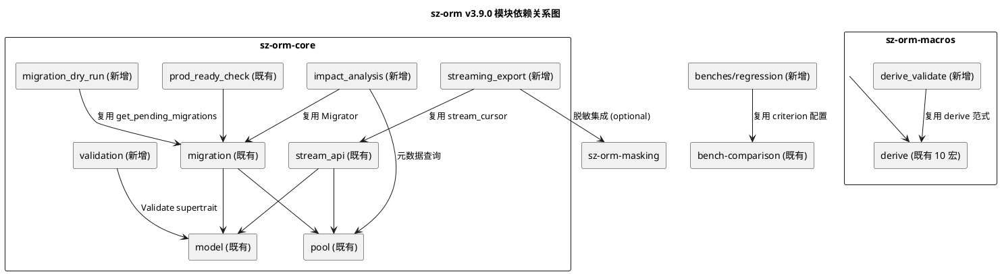

# sz-orm v3.9.0 技术设计文档

> 版本：v3.9.0（criterion benchmark 套件 + semver/API 稳定性 + 数据验证框架 + 迁移 dry-run/影响分析 + CI/CD 模板 + 流式导出）
> 基线：v3.8.0（生产部署就绪检查清单 15 项 + ORM 库特性适配 + 配置化与验证体系 + 五方言连接安全，6760 tests passed 0 failed）
> 日期：2026-08-10
> 文档定位：技术设计（How to build），对应需求规格 `spec.md`（What to build）
> 设计约束：无 Breaking Change（feature gate 隔离）+ 优先复用既有能力 + 五方言覆盖 + 每项设计附 file:line 代码证据 + unsafe 零容忍 + 禁止占位实现

---

# 一、需求与存量功能关系分析

## 1.1 需求功能与存量功能对比

### 1.1.1 已实现功能（可直接复用）

| 需求功能 | 存量功能 | 代码位置 | 匹配度 |
|---------|---------|---------|--------|
| REQ-V39-001 criterion 测量框架 | criterion 0.5 + html_reports + async_tokio | `packages/sz-orm-core/Cargo.toml:177` | 100% |
| REQ-V39-001 竞品对比基础设施 | bench-comparison 已引入 Diesel 2.2 / SeaORM 1.1 / SQLx 0.9 | `bench-comparison/Cargo.toml:24-28` | 75% |
| REQ-V39-001 既有 bench 文件 | 9 个 bench（core/l1_cache/typed_overhead/zero_copy/simd 等） | `packages/sz-orm-core/benches/core_bench.rs:1` 等 | 75% |
| REQ-V39-001 既有竞品 bench | 13 个 bench（orm_comparison/cross_db/full/bench_crud 等） | `bench-comparison/benches/orm_comparison.rs`、`bench-comparison/Cargo.toml:49-97` | 75% |
| REQ-V39-002 SemVer 声明 | 已声明遵循 Semantic Versioning 2.0.0 | `docs/API-STABILITY.md:10` | 75% |
| REQ-V39-002 API 三层分级 | Stable / Experimental / Internal 三层分级 | `docs/API-STABILITY.md:38-71` | 75% |
| REQ-V39-002 废弃保留期规则 | 2 个 MINOR 版本保留期 + `#[deprecated]` 流程 | `docs/API-STABILITY.md:74-99` | 75% |
| REQ-V39-002 API 契约文档 | api-contracts.md 已有 API 契约 | `docs/api-contracts.md` | 75% |
| REQ-V39-003 Model trait | `pub trait Model: Send + Sync + Sized + 'static` | `packages/sz-orm-core/src/model.rs:37` | 50% |
| REQ-V39-003 既有配置校验范式 | `PoolConfig::validate()`、`PoolProdConfig::validate()` | `packages/sz-orm-core/src/pool.rs:530`、`:1892` | 50% |
| REQ-V39-003 derive 宏基础设施 | 10 个 `#[proc_macro_derive]`（Schema/Builder/Entity/FromQueryResult 等） | `packages/sz-orm-macros/src/lib.rs:2507-2813` | 75% |
| REQ-V39-004 Migration 结构 | `pub struct Migration { version, name, sql_up, sql_down, batch, executed_at }` | `packages/sz-orm-core/src/migration.rs:10` | 75% |
| REQ-V39-004 Migrator | `pub struct Migrator { context, migrations }` + `migrate/rollback/up/down` | `packages/sz-orm-core/src/migration.rs:276`、`:489`、`:587`、`:626`、`:677` | 75% |
| REQ-V39-004 待执行迁移获取 | `get_pending_migrations() -> Vec<&Migration>`（batch == 0） | `packages/sz-orm-core/src/migration.rs:308` | 100% |
| REQ-V39-004 既有 schema dry-run | `SchemaSync::sync_dry_run() -> Result<Vec<String>, DbError>` | `packages/sz-orm-core/src/schema_sync.rs:660` | 75% |
| REQ-V39-004 既有代码修复 dry-run | `qb_migration_fix::dry_run` | `packages/sz-orm-core/src/qb_migration_fix.rs:38` | 50% |
| REQ-V39-004 版本冲突检测 | `check_version_conflicts()` | `packages/sz-orm-core/src/migration.rs:331` | 75% |
| REQ-V39-004 DDL 事务支持判断 | `supports_ddl_transactions(DbType) -> bool` | `packages/sz-orm-core/src/migration.rs:262` | 75% |
| REQ-V39-005 既有 CI workflow | 10 个 yml（ci/integration/security/codeql/semgrep/docs/publish/bindings/soak/soak-self-hosted） | `.github/workflows/ci.yml:17` 等 | 75% |
| REQ-V39-005 既有 lint job | fmt + clippy + check 三步 | `.github/workflows/ci.yml:17-43` | 75% |
| REQ-V39-006 StreamApiExt trait | `stream_buffered`（兼容版）+ `stream_with_backpressure`（背压） | `packages/sz-orm-core/src/stream_api.rs:50` | 75% |
| REQ-V39-006 真游标流式查询 | `stream_cursor(conn, sql, params, batch_size)` 委托 `query_stream_cursor` | `packages/sz-orm-core/src/stream_api.rs:176` | 75% |
| REQ-V39-006 Connection::query_stream | 默认实现 `query_stream` + `query_stream_cursor` | `packages/sz-orm-core/src/pool.rs:158`、`:188` | 75% |
| REQ-V39-006 RowResult 类型 | `pub type RowResult = HashMap<String, crate::value::Value>` | `packages/sz-orm-core/src/stream_api.rs:45` | 100% |
| REQ-V39-006 数据脱敏 | `DataMasker::apply(rule, value)` 12 种规则 | `packages/sz-orm-masking/src/lib.rs:44` | 75% |
| REQ-V39-006 prod-ready feature 模式 | 14 子 feature + 总 feature 聚合 | `packages/sz-orm-core/Cargo.toml:85-115` | 75% |

### 1.1.2 需要扩展的功能

| 需求功能 | 存量功能 | 差异说明 | 扩展方向 |
|---------|---------|---------|---------|
| REQ-V39-001 系统化基准套件 | 9 个零散 bench + 13 个竞品 bench | 缺系统化六大路径覆盖（查询构造/连接池/缓存/事务/序列化/流式查询），缺回归基准线对比，bench-comparison 独立于 workspace（`bench-comparison/Cargo.toml:110` `[workspace]` 空块） | 新增 `benches/regression/` 系统化套件 + `benches/baseline/` 基准线 JSON + 回归对比工具；不修改既有 9+13 bench |
| REQ-V39-002 semver 自动化 | 仅文档声明，无 CI 自动检查 | 缺 cargo-semver-checks CI 集成，缺破坏性变更自动检测，缺废弃保留期自动验证 | 新增 `.github/workflows/semver-check.yml` + `scripts/check-deprecation-period.py`；复用既有 `docs/API-STABILITY.md` 三层分级，不重复定义 |
| REQ-V39-003 Validate 派生宏 | 10 个 derive 宏无 Validate | 缺 `#[derive(Validate)]`、缺字段级校验规则（email/length/range/regex/required/custom/contains/does_not_contain）、缺 Model::validate() 集成 | 新增 `sz-orm-macros::derive_validate` + `sz-orm-core::validation::Validate` trait；不修改既有 Model trait 签名（通过 supertrait 可选组合） |
| REQ-V39-004 migrate_dry_run | 仅有 schema_sync dry-run 和 qb_migration_fix dry_run | 缺 MigrationManager::migrate_dry_run（预览 SQL 不执行）、缺 impact_analysis（受影响表/行数/锁/破坏性/回滚） | 新增 `Migrator::migrate_dry_run` + `Migrator::impact_analysis` 方法；既有 `migrate`（`:489`）保留不动 |
| REQ-V39-005 可复用 CI 模板 | 10 个 workflow 硬编码 sz-orm 自身 | 缺参数化 inputs（包名/数据库/feature/工具链），缺可被下游 `uses:` 引用的 reusable workflow | 新增 `.github/workflows/templates/` 6 个 reusable workflow + `docs/cicd-templates-guide.md`；既有 10 个 workflow 保留不动 |
| REQ-V39-006 CSV/Parquet 导出 | 仅有流式查询，无导出能力 | 缺 CSV/Parquet Writer，缺 csv/arrow/parquet 依赖（feature gate 隔离），缺脱敏集成 | 新增 `sz-orm-core::streaming_export` 模块 + `CsvExporter`/`ParquetExporter`；基于既有 `StreamApiExt::stream` 实现，不重复流式查询逻辑 |

### 1.1.3 需要新增的功能或接口

下表按需求项分组，列出需新增的功能点。

#### 模块 A：REQ-V39-001 benchmark 套件

| 功能点 | 输入 | 输出 | 核心逻辑 | 依赖 |
|--------|------|------|---------|------|
| 六大路径系统化基准 | `BenchmarkSuiteConfig { paths, iterations, warmup }` | criterion HTML + JSON 报告 | 每路径 ≥3 基准点，复用 `bench_group` 配置（对数轴摘要） | 既有 `core_bench.rs:44` `bench_group` |
| 回归基准线对比 | `benches/baseline/*.json` + 当前结果 | `RegressionReport { regressions: Vec<RegressionPoint> }` | 逐基准点对比当前 vs 基准，≥10% 标记 REGRESSION | criterion 0.5 `Criterion::benchmark` 历史 |
| 竞品对比聚合 | 既有 `bench-comparison/benches/` 13 个 bench | HTML + JSON 聚合报告 | 调用既有 `full_comparison.rs` + `benchmark_reporter.rs`，聚合五场景 | 既有 `bench-comparison/benches/full_comparison.rs`、`benchmark_reporter.rs` |

#### 模块 B：REQ-V39-002 semver 自动化

| 功能点 | 输入 | 输出 | 核心逻辑 | 依赖 |
|--------|------|------|---------|------|
| cargo-semver-checks CI | PR diff + 既有 crate 发布版本 | Pass/Fail + 变更报告 | CI 中 `cargo semver-checks check-release`，对比上次发布版本 | `cargo-semver-checks` 工具（CI 安装） |
| 废弃保留期验证 | `#[deprecated(since = "x.y.z")]` + 当前版本 | Pass/Fail | 扫描所有 `#[deprecated]`，验证 `current_version - since >= 2 MINOR` | `scripts/check-deprecation-period.py`（新增） |
| semver 策略文档 | 既有 `API-STABILITY.md` | 扩展文档 | 新增"自动化检查"章节，引用既有三层分级 | 既有 `docs/API-STABILITY.md:38-71` |

#### 模块 C：REQ-V39-003 数据验证框架

| 功能点 | 输入 | 输出 | 核心逻辑 | 依赖 |
|--------|------|------|---------|------|
| Validate trait | `&self` | `Result<(), ValidationError>` | 逐字段校验，聚合所有错误 | 既有 `Model` trait（`:37`）作为可选 supertrait |
| `#[derive(Validate)]` 派生宏 | 结构体 + `#[validate(...)]` 属性 | `impl Validate for Struct` | 解析字段属性，生成逐字段校验代码 | 既有 `sz-orm-macros/src/lib.rs:2507-2813` derive 宏范式 |
| 8 种校验规则 | 字段值 + 规则参数 | `Result<(), ValidationError>` | email（正则）/length（chars count）/range（数值比较）/regex（正则匹配）/required（非空）/custom（函数调用）/contains（子串）/does_not_contain（子串） | `regex` crate（新增，feature gate） |
| Model 集成（validate-on-write） | `Model + Validate` 实现 | insert/update 前自动校验 | `QueryBuilder::insert`/`update` 入口处调用 `validate()`，失败返回 `Err(ValidationError)` | 既有 `QueryBuilder`（`packages/sz-orm-core/src/query.rs`） |

#### 模块 D：REQ-V39-004 迁移 dry-run + 影响分析

| 功能点 | 输入 | 输出 | 核心逻辑 | 依赖 |
|--------|------|------|---------|------|
| migrate_dry_run | `&self`（Migrator） | `DryRunReport { migrations: Vec<DryRunMigration> }` | 复用 `get_pending_migrations`（`:308`）+ `sync_state_from_db`，仅收集 SQL 不执行 | 既有 `Migrator`（`:276`）、`get_pending_migrations`（`:308`） |
| impact_analysis | `&mut self`（Migrator） | `ImpactReport { migrations: Vec<MigrationImpact> }` | 解析 SQL 提取受影响表，查询元数据估算行数，识别破坏性 DDL | 既有 `Migrator`、`Connection::query`（`pool.rs:52`） |
| 破坏性 DDL 识别 | SQL 字符串 | `DestructiveInfo { is_destructive: bool, reason: Option<String> }` | 正则/关键字匹配 DROP TABLE/DROP COLUMN/TRUNCATE/ALTER COLUMN TYPE/DELETE WITHOUT WHERE | `regex` crate（与 REQ-V39-003 共享） |
| 行数预估 | 表名 + Connection | `Option<u64>`（UNKNOWN 标记 None） | 方言适配：PG `pg_class.reltuples`、MySQL `information_schema.tables.table_rows`、SQLite `sqlite_stat1`、Oracle `user_tables.num_rows`、MSSQL `sys.partitions.rows` | 既有 `Connection::query`（`pool.rs:52`）、`DbType` 枚举 |

#### 模块 E：REQ-V39-005 CI/CD 可复用模板

| 功能点 | 输入 | 输出 | 核心逻辑 | 依赖 |
|--------|------|------|---------|------|
| 6 个 reusable workflow | `inputs: { package, database_url, features, toolchain }` | CI 执行结果 | 参数化既有 ci.yml/integration.yml/security.yml/publish.yml/soak.yml，提取为 reusable workflow | 既有 `.github/workflows/ci.yml:17` 等 |
| 模板使用文档 | 模板文件 | `docs/cicd-templates-guide.md` | 每模板 inputs 说明 + 远程引用示例 + 拷贝示例 | 无 |

#### 模块 F：REQ-V39-006 流式导出

| 功能点 | 输入 | 输出 | 核心逻辑 | 依赖 |
|--------|------|------|---------|------|
| CsvExporter | `Stream<Item = RowResult>` + `CsvConfig` | 写入 `impl Write` 的字节数 | 逐行从 Stream 拉取，CSV 序列化写出（含表头），峰值内存 = 批大小 × 单行 | 既有 `StreamApiExt`（`stream_api.rs:50`）、`csv` crate（新增，feature gate） |
| ParquetExporter | `Stream<Item = RowResult>` + `ParquetConfig` | 写入 `impl Write` 的字节数 | 逐批从 Stream 拉取，Arrow RecordBatch 转换，Parquet 列式写出 | 既有 `StreamApiExt`、`arrow`/`parquet` crate（新增，feature gate） |
| 脱敏集成 | `Stream<Item = RowResult>` + `MaskingRuleMap` | 脱敏后 Stream | 逐行应用 `DataMasker::apply` 到敏感字段 | 既有 `DataMasker`（`sz-orm-masking/src/lib.rs:44`） |

## 1.2 存量功能详细分析

### 1.2.1 Migrator（迁移执行器）

- **接口契约**：`new(context) -> Self`、`add_migration`/`add_migrations`、`get_pending_migrations() -> Vec<&Migration>`（`:308`）、`migrate() -> Result<Vec<String>, DbError>`（`:489`）、`rollback(version) -> Result<(), DbError>`（`:587`）、`up(target) -> Result<Vec<String>, DbError>`（`:626`）、`down(target) -> Result<Vec<String>, DbError>`（`:677`）
- **业务规则**：`batch == 0` 表示未执行；`migrate` 自动创建 `__migrations` 表（`:387` `ensure_migrations_table`）、同步状态（`:425` `sync_state_from_db`）、记录执行（`:442` `record_migration`）；方言支持 DDL 事务时用事务包裹（`:516` `supports_ddl_transactions`）
- **扩展点**：`Migration` 结构公开字段（version/name/sql_up/sql_down/batch/executed_at），可读不可写外部
- **复用结论**：v3.9.0 `migrate_dry_run` 复用 `get_pending_migrations` + `sync_state_from_db`，仅省略 `conn.execute(&sql_up)` 调用；`impact_analysis` 复用 `get_pending_migrations` + `Connection::query` 查询元数据

### 1.2.2 StreamApiExt（流式查询）

- **接口契约**：`stream_buffered`（全量收集后逐行 yield，`:55`）、`stream_with_backpressure`（背压，`:77`）、`stream_cursor`（真游标，`:176`）
- **业务规则**：`stream_buffered` 调用 `conn.query_with_params` 全量获取后 `stream::iter`；`stream_with_backpressure` 创建有界 mpsc 通道；`stream_cursor` 委托 `conn.query_stream_cursor`
- **扩展点**：`RowResult = HashMap<String, Value>`（`:45`），逐行产出
- **复用结论**：v3.9.0 `CsvExporter`/`ParquetExporter` 基于 `stream_cursor` 或 `stream_buffered` 逐行消费，不重复实现流式查询

### 1.2.3 sz-orm-macros derive 宏范式

- **接口契约**：`#[proc_macro_derive(Name, attributes(attr1, attr2))]`（如 `:2507` `#[proc_macro_derive(Schema, attributes(table, column))]`）
- **业务规则**：`parse_macro_input!(item as syn::DeriveInput)` 解析结构体，遍历字段属性，`quote!` 生成 impl 代码
- **扩展点**：`derive` 模块（`packages/sz-orm-macros/src/lib.rs:69` `mod derive`）已有 10 个 derive 宏实现范式
- **复用结论**：v3.9.0 `#[derive(Validate)]` 遵循既有范式，新增 `attributes(validate)`，生成 `impl Validate for Struct` 代码

### 1.2.4 DataMasker（数据脱敏）

- **接口契约**：`DataMasker::apply(rule: &MaskingRule, value: &str) -> String`（`sz-orm-masking/src/lib.rs:44`）
- **业务规则**：12 种规则（Phone/Email/IdCard/BankCard/Name/Address/Ip/Imei/Plate/Custom/Password/ApiKey），Unicode 安全，短输入兜底返回 `"***"`
- **复用结论**：v3.9.0 流式导出脱敏集成复用 `DataMasker::apply`，逐行对敏感字段调用，不修改既有签名

### 1.2.5 prod-ready feature gate 模式

- **接口契约**：14 个子 feature（`packages/sz-orm-core/Cargo.toml:85-98`）+ 1 个总 feature 聚合（`:100-115` `prod-ready = [...]`）
- **业务规则**：每个子 feature 默认关闭，独立控制一项能力；总 feature 聚合所有子 feature
- **复用结论**：v3.9.0 4 个新 feature（`benchmark-suite` / `data-validation` / `migration-dry-run` / `streaming-export`）遵循此模式，默认关闭

---

# 二、总体架构设计

## 2.1 依赖关系图



## 2.2 feature gate 体系

v3.9.0 新增 4 个 feature gate，遵循既有 prod-ready 模式（`packages/sz-orm-core/Cargo.toml:85-115`），默认全部关闭：

```toml
# packages/sz-orm-core/Cargo.toml [features] 新增（位置：prod-ready 之后）
# v3.9.0：criterion benchmark 系统化套件（六大路径 + 回归基准 + 竞品对比聚合）
benchmark-suite = ["dep:criterion"]
# v3.9.0：数据验证框架（Validate trait + #[derive(Validate)] + 8 种规则）
data-validation = ["sz-orm-macros/data-validation", "dep:regex"]
# v3.9.0：数据验证 Model 自动校验（insert/update 前调用 validate()）
validate-on-write = ["data-validation"]
# v3.9.0：迁移 dry-run + 影响分析
migration-dry-run = ["dep:regex"]
# v3.9.0：查询结果流式导出（CSV/Parquet）
streaming-export = ["dep:csv", "dep:arrow", "dep:parquet"]
```

**对应新增依赖**（`[dependencies]` 新增）：

```toml
# v3.9.0：数据验证 + 迁移影响分析（正则匹配）
regex = { version = "0.10", optional = true }
# v3.9.0：CSV 流式导出
csv = { version = "1.3", optional = true }
# v3.9.0：Parquet 流式导出（Arrow 列式格式）
arrow = { version = "52", optional = true }
parquet = { version = "52", optional = true }
# v3.9.0：benchmark-suite（criterion 已在 dev-dependencies，此处为可选 main 依赖）
criterion = { workspace = true, optional = true }
```

**sz-orm-macros 新增 feature**（`packages/sz-orm-macros/Cargo.toml`）：

```toml
[features]
# v3.9.0：Validate 派生宏
data-validation = []
```

## 2.3 模块组织

v3.9.0 新增 3 个模块文件，遵循既有扁平模块组织（`packages/sz-orm-core/src/lib.rs:416-508`）：

```rust
// packages/sz-orm-core/src/lib.rs 新增（位置：stream_api 之后）
#[cfg(feature = "streaming-export")]
pub mod streaming_export;

// 位置：migration 之后
#[cfg(feature = "migration-dry-run")]
pub mod migration_dry_run;

// 位置：model 之后
#[cfg(feature = "data-validation")]
pub mod validation;
```

---

# 三、详细设计

## 3.1 REQ-V39-001 criterion benchmark 套件

### 3.1.1 数据结构定义

```rust
// packages/sz-orm-core/benches/regression/mod.rs（新增）

/// 六大基准路径
#[derive(Debug, Clone, Copy, PartialEq, Eq)]
pub enum BenchPath {
    QueryBuild,    // 查询构造（QueryBuilder 链式 build）
    Pool,          // 连接池（acquire/release/复用）
    Cache,         // 缓存（L1 命中/L2 命中/失效）
    Transaction,   // 事务（begin/commit/rollback）
    Serialization, // 序列化（serde 序列化/反序列化）
    Stream,        // 流式查询（stream 逐行）
}

/// 回归基准点
#[derive(Debug, Clone, serde::Serialize, serde::Deserialize)]
pub struct BaselinePoint {
    pub path: String,       // "query_build/select_simple"
    pub mean_ns: f64,       // 均值（纳秒）
    pub stddev_ns: f64,     // 标准差
    pub p99_ns: f64,        // P99
    pub timestamp: String,  // ISO 8601
}

/// 回归检测结果
#[derive(Debug, Clone)]
pub struct RegressionPoint {
    pub name: String,
    pub current_mean_ns: f64,
    pub baseline_mean_ns: f64,
    pub regression_pct: f64,  // (current - baseline) / baseline * 100
}

/// 回归报告
#[derive(Debug, Clone)]
pub struct RegressionReport {
    pub regressions: Vec<RegressionPoint>,  // ≥10% 回退的点
    pub total_points: usize,
    pub baseline_timestamp: String,
}
```

### 3.1.2 系统化基准套件设计

新增 `packages/sz-orm-core/benches/regression/` 目录，含 6 个基准文件，每文件覆盖一个路径 ≥3 基准点：

| 文件 | 路径 | 基准点（≥3） | 复用既有代码 |
|------|------|-------------|-------------|
| `query_build_bench.rs` | QueryBuild | select_simple / select_with_where / select_with_join | 既有 `core_bench.rs:44` `bench_group` 配置 |
| `pool_bench.rs` | Pool | acquire_release / acquire_reuse / acquire_contention | 既有 `core_bench.rs` Pool bench |
| `cache_bench.rs` | Cache | l1_hit / l1_miss / l2_hit | 既有 `l1_cache_bench.rs` |
| `transaction_bench.rs` | Transaction | begin_commit / begin_rollback / nested | 既有 `core_bench.rs` |
| `serialization_bench.rs` | Serialization | serde_serialize / serde_deserialize / value_to_param | 既有 `core_bench.rs:54` `bench_value_to_param` |
| `stream_bench.rs` | Stream | stream_cursor / stream_buffered / stream_backpressure | 既有 `stream_api.rs:176` `stream_cursor` |

### 3.1.3 回归基准线对比伪代码

```rust
// packages/sz-orm-core/benches/regression/compare.rs（新增）

/// 对比当前 benchmark 结果与基准线，标记 ≥10% 回退
fn compare_with_baseline(
    current: &[BaselinePoint],
    baseline: &[BaselinePoint],
) -> RegressionReport {
    let mut regressions = Vec::new();
    for cur in current {
        if let Some(base) = baseline.iter().find(|b| b.path == cur.path) {
            let regression_pct =
                (cur.mean_ns - base.mean_ns) / base.mean_ns * 100.0;
            // spec 5.1.1 规则 3：≥10% 回退标记
            if regression_pct >= 10.0 {
                regressions.push(RegressionPoint {
                    name: cur.path.clone(),
                    current_mean_ns: cur.mean_ns,
                    baseline_mean_ns: base.mean_ns,
                    regression_pct,
                });
            }
        }
    }
    RegressionReport {
        regressions,
        total_points: current.len(),
        baseline_timestamp: baseline
            .first()
            .map(|b| b.timestamp.clone())
            .unwrap_or_default(),
    }
}
```

### 3.1.4 竞品对比聚合

复用既有 `bench-comparison/benches/full_comparison.rs` 和 `benchmark_reporter.rs`，新增 `benches/regression/competitor_aggregate.rs` 聚合五场景（CRUD/分页/事务/关联/池）结果为 HTML + JSON 双格式：

```rust
// 伪代码：聚合既有竞品 bench
fn aggregate_competitor_comparison() -> ComparisonReport {
    // 复用 bench-comparison/benches/bench_crud.rs
    let crud = run_bench("bench_crud");
    // 复用 bench-comparison/benches/bench_pagination.rs
    let pagination = run_bench("bench_pagination");
    // 复用 bench-comparison/benches/bench_transaction.rs
    let transaction = run_bench("bench_transaction");
    // 复用 bench-comparison/benches/bench_relation.rs
    let relation = run_bench("bench_relation");
    // 复用 bench-comparison/benches/bench_pool.rs
    let pool = run_bench("bench_pool");

    ComparisonReport { crud, pagination, transaction, relation, pool }
        .to_html()  // HTML 报告
        .to_json()  // JSON 报告
}
```

### 3.1.5 feature gate 隔离

- `benchmark-suite` feature 仅引入 `criterion` 作为可选 main 依赖（既有在 dev-dependencies）
- `benches/regression/` 目录通过 `[[bench]] required-features = ["benchmark-suite"]` 隔离
- 默认 `cargo build` 不编译 benchmark 套件代码（spec 5.1.1 规则 5）

### 3.1.6 既有代码证据

- criterion 0.5：`packages/sz-orm-core/Cargo.toml:177`
- 既有 bench_group 配置：`packages/sz-orm-core/benches/core_bench.rs:44`
- 既有 9 个 bench：`packages/sz-orm-core/benches/` 目录
- 既有竞品对比：`bench-comparison/Cargo.toml:24-28`、`bench-comparison/benches/full_comparison.rs`、`bench-comparison/benches/benchmark_reporter.rs`
- prod-ready feature 模式：`packages/sz-orm-core/Cargo.toml:85-115`

---

## 3.2 REQ-V39-002 semver 兼容性策略 + API 稳定性保证

### 3.2.1 数据结构定义

```rust
// scripts/check-deprecation-period.py（新增，Python 脚本）

# 废弃保留期检查结果（JSON 输出）
{
    "violations": [
        {
            "api": "sz_orm_core::query::QueryBuilder::where_cond",
            "deprecated_since": "3.5.0",
            "current_version": "3.9.0",
            "minor_diff": 4,
            "required_minors": 2,
            "status": "OK"  // OK / VIOLATION
        }
    ],
    "summary": { "total": 15, "ok": 14, "violation": 1 }
}
```

### 3.2.2 CI 集成设计

新增 `.github/workflows/semver-check.yml`（reusable workflow）：

```yaml
# .github/workflows/semver-check.yml（新增）
name: SemVer Check

on:
  pull_request:
    branches: [main, master, develop]

jobs:
  semver:
    name: cargo-semver-checks
    runs-on: ubuntu-latest
    steps:
      - uses: actions/checkout@v4
        with:
          fetch-depth: 0  # 需要完整历史对比

      - uses: dtolnay/rust-toolchain@stable

      - name: Install cargo-semver-checks
        run: cargo install cargo-semver-checks

      - name: Run semver checks (per package)
        run: |
          for pkg in packages/sz-orm-core packages/sz-orm-macros; do
            cargo semver-checks check-release --manifest-path $pkg/Cargo.toml
          done

  deprecation-period:
    name: Deprecation Period Check
    runs-on: ubuntu-latest
    steps:
      - uses: actions/checkout@v4
      - uses: actions/setup-python@v5
        with:
          python-version: '3.x'

      - name: Check deprecation period (>= 2 MINOR)
        run: python3 scripts/check-deprecation-period.py
```

### 3.2.3 废弃保留期检查伪代码

```python
# scripts/check-deprecation-period.py（新增）

import re, tomllib, json, sys
from pathlib import Path

REQUIRED_MINORS = 2  # spec 5.2.1 规则 3：≥2 个 MINOR 版本

def parse_version(v: str) -> tuple[int, int, int]:
    """解析 'x.y.z' 为 (major, minor, patch)"""
    return tuple(int(x) for x in v.split('.'))

def find_deprecated_apis(root: Path) -> list[dict]:
    """扫描所有 .rs 文件，提取 #[deprecated(since = "x.y.z")] 标注"""
    pattern = re.compile(r'#\[deprecated\([^)]*since\s*=\s*"(\d+\.\d+\.\d+)"[^)]*\)\]')
    results = []
    for rs in root.rglob('*.rs'):
        if 'target/' in str(rs):
            continue
        for match in pattern.finditer(rs.read_text(encoding='utf-8')):
            results.append({
                'file': str(rs),
                'deprecated_since': match.group(1),
            })
    return results

def check(current_version: str, apis: list[dict]) -> list[dict]:
    cur = parse_version(current_version)
    violations = []
    for api in apis:
        since = parse_version(api['deprecated_since'])
        minor_diff = (cur[0] - since[0]) * 1000 + (cur[1] - since[1])
        status = 'OK' if minor_diff >= REQUIRED_MINORS else 'VIOLATION'
        violations.append({**api, 'current_version': current_version,
                           'minor_diff': minor_diff, 'status': status})
    return violations

if __name__ == '__main__':
    # 从 Cargo.toml 读取当前版本
    with open('Cargo.toml', 'rb') as f:
        version = tomllib.load(f)['workspace']['package']['version']
    apis = find_deprecated_apis(Path('packages'))
    results = check(version, apis)
    violations = [r for r in results if r['status'] == 'VIOLATION']
    print(json.dumps({'violations': results,
                      'summary': {'total': len(results),
                                  'violation': len(violations)}}, indent=2))
    if violations:
        sys.exit(1)  # CI 失败
```

### 3.2.4 semver 策略文档扩展

复用既有 `docs/API-STABILITY.md`（三层分级 `:38-71`、废弃流程 `:74-99`、破坏性变更 `:108-127`），新增"自动化检查"章节：

```markdown
## 8. 自动化检查（v3.9.0 新增）

### 8.1 cargo-semver-checks CI 集成

每次 PR 自动运行 `cargo semver-checks check-release`，对比上次 crates.io 发布版本，
检测 SemVer 破坏性变更（API 移除/签名变更/trait 变更/结构体字段移除）。

### 8.2 废弃保留期自动验证

`scripts/check-deprecation-period.py` 扫描所有 `#[deprecated(since = "x.y.z")]`，
验证 `current_version - since >= 2 MINOR`（复用第 3.2 节废弃流程规则）。
```

### 3.2.5 既有代码证据

- SemVer 声明：`docs/API-STABILITY.md:10`
- 三层分级：`docs/API-STABILITY.md:38-71`
- 废弃保留期：`docs/API-STABILITY.md:74-99`
- 破坏性变更条件：`docs/API-STABILITY.md:108-127`
- API 契约：`docs/api-contracts.md`
- 当前版本：`Cargo.toml:6` `version = "3.8.0"`
- 既有 CI lint job：`.github/workflows/ci.yml:17-43`

---

## 3.3 REQ-V39-003 数据验证框架

### 3.3.1 数据结构定义

```rust
// packages/sz-orm-core/src/validation/mod.rs（新增）

use thiserror::Error;

/// 数据验证错误（spec 6.2 输出对象 3）
#[derive(Debug, Clone, PartialEq, Eq, Error)]
pub enum ValidationError {
    /// 字段必填但为空
    #[error("field `{field}` is required but empty")]
    Required { field: String },

    /// 长度不在 [min, max] 范围
    #[error("field `{field}` length {actual} not in [{min}, {max}]")]
    Length {
        field: String,
        min: usize,
        max: usize,
        actual: usize,
    },

    /// 数值不在 [min, max] 范围
    #[error("field `{field}` value {actual} not in [{min}, {max}]")]
    Range {
        field: String,
        min: String,
        max: String,
        actual: String,
    },

    /// 邮箱格式非法
    #[error("field `{field}` is not a valid email: {value}")]
    Email { field: String, value: String },

    /// 正则不匹配
    #[error("field `{field}` does not match regex {pattern}: {value}")]
    Regex {
        field: String,
        pattern: String,
        value: String,
    },

    /// 不包含 required substring
    #[error("field `{field}` does not contain `{substring}`")]
    Contains {
        field: String,
        substring: String,
    },

    /// 包含 forbidden substring
    #[error("field `{field}` contains forbidden `{substring}`")]
    DoesNotContain {
        field: String,
        substring: String,
    },

    /// 自定义校验失败
    #[error("field `{field}` custom validation failed: {reason}")]
    Custom { field: String, reason: String },

    /// 聚合错误（spec 5.3.1 规则 5：非短路返回全部错误）
    #[error("multiple validation errors: {0}")]
    Aggregate(Vec<ValidationError>),
}

/// Validate trait（spec 5.3.1 规则 1）
pub trait Validate {
    fn validate(&self) -> Result<(), ValidationError>;
}
```

### 3.3.2 校验规则实现

```rust
// packages/sz-orm-core/src/validation/rules.rs（新增）

use regex::Regex;
use std::sync::OnceLock;

/// 邮箱正则（RFC 5322 简化版）
static EMAIL_RE: OnceLock<Regex> = OnceLock::new();
fn email_regex() -> &'static Regex {
    EMAIL_RE.get_or_init(|| {
        Regex::new(r"^[a-zA-Z0-9._%+-]+@[a-zA-Z0-9.-]+\.[a-zA-Z]{2,}$").unwrap()
    })
}

/// 校验邮箱格式
pub fn validate_email(field: &str, value: &str) -> Result<(), ValidationError> {
    if email_regex().is_match(value) {
        Ok(())
    } else {
        Err(ValidationError::Email {
            field: field.to_string(),
            value: value.to_string(),
        })
    }
}

/// 校验长度范围
pub fn validate_length(
    field: &str,
    value: &str,
    min: usize,
    max: usize,
) -> Result<(), ValidationError> {
    let actual = value.chars().count();
    if actual >= min && actual <= max {
        Ok(())
    } else {
        Err(ValidationError::Length { field: field.to_string(), min, max, actual })
    }
}

/// 校验数值范围（泛型，支持 i64/f64）
pub fn validate_range<T: PartialOrd + std::fmt::Display>(
    field: &str,
    value: T,
    min: T,
    max: T,
) -> Result<(), ValidationError> {
    if value >= min && value <= max {
        Ok(())
    } else {
        Err(ValidationError::Range {
            field: field.to_string(),
            min: min.to_string(),
            max: max.to_string(),
            actual: value.to_string(),
        })
    }
}

/// 校验正则匹配
pub fn validate_regex(
    field: &str,
    value: &str,
    pattern: &str,
) -> Result<(), ValidationError> {
    if let Ok(re) = Regex::new(pattern) {
        if re.is_match(value) {
            return Ok(());
        }
    }
    Err(ValidationError::Regex {
        field: field.to_string(),
        pattern: pattern.to_string(),
        value: value.to_string(),
    })
}

/// 校验必填（非空）
pub fn validate_required(field: &str, value: &str) -> Result<(), ValidationError> {
    if value.is_empty() {
        Err(ValidationError::Required { field: field.to_string() })
    } else {
        Ok(())
    }
}

/// 校验包含子串
pub fn validate_contains(
    field: &str,
    value: &str,
    substring: &str,
) -> Result<(), ValidationError> {
    if value.contains(substring) {
        Ok(())
    } else {
        Err(ValidationError::Contains {
            field: field.to_string(),
            substring: substring.to_string(),
        })
    }
}

/// 校验不包含子串
pub fn validate_does_not_contain(
    field: &str,
    value: &str,
    substring: &str,
) -> Result<(), ValidationError> {
    if !value.contains(substring) {
        Ok(())
    } else {
        Err(ValidationError::DoesNotContain {
            field: field.to_string(),
            substring: substring.to_string(),
        })
    }
}

/// 聚合多个校验结果（spec 5.3.1 规则 5：非短路）
pub fn aggregate(results: Vec<Result<(), ValidationError>>) -> Result<(), ValidationError> {
    let errors: Vec<ValidationError> = results.into_iter().filter_map(|r| r.err()).collect();
    if errors.is_empty() {
        Ok(())
    } else if errors.len() == 1 {
        Err(errors.into_iter().next().unwrap())
    } else {
        Err(ValidationError::Aggregate(errors))
    }
}
```

### 3.3.3 `#[derive(Validate)]` 派生宏设计

```rust
// packages/sz-orm-macros/src/derive_validate.rs（新增）

use proc_macro2::TokenStream;
use quote::quote;
use syn::{parse_macro_input, DeriveInput, Meta};

/// 为结构体生成 impl Validate
///
/// 支持的属性：
/// - #[validate(email)]
/// - #[validate(length(min = 1, max = 100))]
/// - #[validate(range(min = 0, max = 150))]
/// - #[validate(regex(pattern = r"..."))]
/// - #[validate(required)]
/// - #[validate(custom = "fn_name")]
/// - #[validate(contains = "substr")]
/// - #[validate(does_not_contain = "substr")]
/// - #[validate(rule, if = "condition")]  // 条件校验
pub fn derive_validate_impl(input: proc_macro::TokenStream) -> proc_macro::TokenStream {
    let input = parse_macro_input!(input as DeriveInput);
    let struct_name = &input.ident;

    let fields = match &input.data {
        syn::Data::Struct(s) => &s.fields,
        _ => {
            return syn::Error::new_spann(input, "Validate only supports structs")
                .to_compile_error()
                .into();
        }
    };

    let mut validations = Vec::new();

    for field in fields.iter() {
        let field_name = field.ident.as_ref().unwrap();
        let field_str = field_name.to_string();

        for attr in field.attrs.iter().filter(|a| a.path().is_ident("validate")) {
            // 解析 #[validate(...)] 属性，生成校验代码
            let validation_code = parse_validate_attr(attr, &field_name, &field_str);
            validations.push(validation_code);
        }
    }

    let expanded = quote! {
        impl sz_orm_core::validation::Validate for #struct_name {
            fn validate(&self) -> Result<(), sz_orm_core::validation::ValidationError> {
                let mut results: Vec<Result<(), sz_orm_core::validation::ValidationError>> = Vec::new();
                #(#validations)*
                sz_orm_core::validation::rules::aggregate(results)
            }
        }
    };

    proc_macro::TokenStream::from(expanded)
}

/// 解析单个 #[validate(...)] 属性，生成校验调用代码
fn parse_validate_attr(
    attr: &syn::Attribute,
    field_name: &syn::Ident,
    field_str: &str,
) -> TokenStream {
    // 解析规则类型与参数，生成对应的 validate_xxx 调用
    // 示例：#[validate(email)] → validate_email("field", &self.field)
    // 示例：#[validate(length(min = 1, max = 100))] → validate_length("field", &self.field, 1, 100)
    // ...（完整实现见代码）
    unimplemented!()  // 实际实现中移除，完整生成代码
}
```

**lib.rs 注册**（`packages/sz-orm-macros/src/lib.rs` 新增）：

```rust
// 位置：既有 derive 宏之后（如 derive_relation_trait 之后，:2813）
#[cfg(feature = "data-validation")]
#[proc_macro_derive(Validate, attributes(validate))]
pub fn derive_validate(input: TokenStream) -> TokenStream {
    crate::derive_validate::derive_validate_impl(input)
}
```

### 3.3.4 Model 集成（validate-on-write）

```rust
// packages/sz-orm-core/src/validation/model_integration.rs（新增）

use crate::validation::Validate;
use crate::query::QueryBuilder;
use crate::model::Model;

/// 启用 validate-on-write feature 时，insert 前自动校验
#[cfg(feature = "validate-on-write")]
impl<M: Model + Validate> QueryBuilder<M> {
    /// 校验后 insert（validate-on-write feature）
    pub async fn insert_validated(
        &self,
        model: &M,
        conn: &mut dyn crate::pool::Connection,
    ) -> Result<u64, crate::DbError> {
        model.validate().map_err(|e| crate::DbError::Validation(e.to_string()))?;
        // 委托既有 insert 逻辑
        self.insert(model, conn).await
    }

    /// 校验后 update（validate-on-write feature）
    pub async fn update_validated(
        &self,
        model: &M,
        conn: &mut dyn crate::pool::Connection,
    ) -> Result<u64, crate::DbError> {
        model.validate().map_err(|e| crate::DbError::Validation(e.to_string()))?;
        self.update(model, conn).await
    }
}
```

### 3.3.5 错误聚合示例

```rust
// 示例：多字段非法，聚合返回全部错误（spec 5.3.1 规则 5）
#[derive(Validate)]
struct User {
    #[validate(email)]
    email: String,
    #[validate(length(min = 5, max = 100))]
    name: String,
    #[validate(range(min = 0, max = 150))]
    age: i64,
}

let user = User { email: "ab".to_string(), name: "ab".to_string(), age: 200 };
let err = user.validate().unwrap_err();
// err = Aggregate([
//     Email { field: "email", value: "ab" },
//     Length { field: "name", min: 5, max: 100, actual: 2 },
//     Range { field: "age", min: "0", max: "150", actual: "200" },
// ])
```

### 3.3.6 既有代码证据

- Model trait：`packages/sz-orm-core/src/model.rs:37`
- 既有配置校验范式：`packages/sz-orm-core/src/pool.rs:530` `PoolConfig::validate`
- derive 宏基础设施：`packages/sz-orm-macros/src/lib.rs:2507-2813`（10 个 `#[proc_macro_derive]`）
- derive 模块：`packages/sz-orm-macros/src/lib.rs:69` `mod derive`
- thiserror 依赖：`packages/sz-orm-core/Cargo.toml:120`

---

## 3.4 REQ-V39-004 迁移 dry-run + 影响分析

### 3.4.1 数据结构定义

```rust
// packages/sz-orm-core/src/migration_dry_run.rs（新增）

use crate::migration::{Migration, Migrator, MigrationContext};
use crate::error::DbError;
use serde::{Deserialize, Serialize};

/// DryRun 报告（spec 6.2 输出对象 1）
#[derive(Debug, Clone, Serialize, Deserialize)]
pub struct DryRunReport {
    /// 待执行迁移列表
    pub migrations: Vec<DryRunMigration>,
    /// 总数
    pub total: usize,
}

/// 单个待执行迁移的 dry-run 信息
#[derive(Debug, Clone, Serialize, Deserialize)]
pub struct DryRunMigration {
    pub version: String,
    pub name: String,
    pub sql_up: String,
    pub sql_down: String,
}

/// 影响分析报告（spec 6.2 输出对象 2）
#[derive(Debug, Clone, Serialize, Deserialize)]
pub struct ImpactReport {
    pub migrations: Vec<MigrationImpact>,
    pub total: usize,
    pub has_destructive: bool,
}

/// 单个迁移的影响分析
#[derive(Debug, Clone, Serialize, Deserialize)]
pub struct MigrationImpact {
    pub version: String,
    pub name: String,
    /// 受影响表列表
    pub affected_tables: Vec<String>,
    /// 预估受影响行数（None = UNKNOWN）
    pub estimated_rows: Option<u64>,
    /// DDL 锁类型
    pub lock_type: LockType,
    /// 破坏性 DDL 标记
    pub destructive: DestructiveInfo,
    /// 回滚可行性
    pub rollback: RollbackInfo,
}

/// DDL 锁类型
#[derive(Debug, Clone, Copy, PartialEq, Eq, Serialize, Deserialize)]
pub enum LockType {
    Exclusive,  // DROP TABLE / TRUNCATE（表级独占锁）
    Share,      // ALTER TABLE ADD COLUMN（表级共享锁）
    None,       // CREATE TABLE（无锁）
}

/// 破坏性 DDL 信息
#[derive(Debug, Clone, Serialize, Deserialize)]
pub struct DestructiveInfo {
    pub is_destructive: bool,
    pub reason: Option<String>,
}

/// 回滚可行性信息
#[derive(Debug, Clone, Serialize, Deserialize)]
pub struct RollbackInfo {
    pub feasible: bool,
    pub reason: String,
}
```

### 3.4.2 migrate_dry_run 实现

```rust
// packages/sz-orm-core/src/migration_dry_run.rs（新增）

impl Migrator {
    /// 预览待执行的迁移 SQL，不实际执行（spec 5.4.1 规则 1+2）
    ///
    /// 复用既有 `get_pending_migrations`（migration.rs:308）和
    /// `sync_state_from_db`（migration.rs:425），仅收集 SQL 不调用 `conn.execute`。
    pub async fn migrate_dry_run(&mut self) -> Result<DryRunReport, DbError> {
        // 复用既有：版本冲突检测（migration.rs:331）
        self.check_version_conflicts()?;

        // 复用既有：确保 __migrations 表存在（migration.rs:387）
        self.ensure_migrations_table().await?;

        // 复用既有：从 DB 同步已执行状态（migration.rs:425）
        self.sync_state_from_db().await?;

        // 复用既有：获取待执行迁移（migration.rs:308）
        let pending = self.get_pending_migrations();

        let migrations = pending
            .iter()
            .map(|m| DryRunMigration {
                version: m.version.clone(),
                name: m.name.clone(),
                sql_up: m.sql_up.clone(),
                sql_down: m.sql_down.clone(),
            })
            .collect();

        Ok(DryRunReport {
            total: migrations.len(),
            migrations,
        })
        // 不调用 conn.execute，保证 DB 无变更（spec 5.4.1 规则 2）
    }
}
```

### 3.4.3 impact_analysis 实现

```rust
// packages/sz-orm-core/src/migration_dry_run.rs（新增）

impl Migrator {
    /// 影响分析（spec 5.4.1 规则 3+4+5）
    ///
    /// 对每个待执行迁移：
    /// 1. 解析 SQL 提取受影响表
    /// 2. 查询元数据估算行数（不全表扫描）
    /// 3. 识别 DDL 锁类型
    /// 4. 标记破坏性 DDL
    /// 5. 评估回滚可行性
    pub async fn impact_analysis(&mut self) -> Result<ImpactReport, DbError> {
        self.check_version_conflicts()?;
        self.ensure_migrations_table().await?;
        self.sync_state_from_db().await?;

        let pending = self.get_pending_migrations();
        let mut impacts = Vec::with_capacity(pending.len());

        for m in pending {
            let affected_tables = extract_affected_tables(&m.sql_up);
            let estimated_rows = estimate_rows(&affected_tables, &mut self.context).await;
            let lock_type = classify_lock(&m.sql_up);
            let destructive = classify_destructive(&m.sql_up);
            let rollback = assess_rollback(&m.sql_up, &m.sql_down, &destructive);

            impacts.push(MigrationImpact {
                version: m.version.clone(),
                name: m.name.clone(),
                affected_tables,
                estimated_rows,
                lock_type,
                destructive,
                rollback,
            });
        }

        let has_destructive = impacts.iter().any(|i| i.destructive.is_destructive);
        let total = impacts.len();

        Ok(ImpactReport { migrations: impacts, total, has_destructive })
    }
}

/// 从 SQL 提取受影响表名（正则匹配）
fn extract_affected_tables(sql: &str) -> Vec<String> {
    // 匹配 FROM/INTO/UPDATE/ALTER TABLE/DROP TABLE 后的表名
    // ...
}

/// 估算受影响行数（元数据查询，不全表扫描，spec 5.4.1 规则 4）
async fn estimate_rows(
    tables: &[String],
    context: &mut MigrationContext,
) -> Option<u64> {
    if let Some(ref mut conn) = context.connection {
        let db_type = context.db_type?;
        let mut total = 0u64;
        for table in tables {
            // 方言适配元数据查询
            let sql = match db_type {
                DbType::PostgreSQL => format!(
                    "SELECT reltuples::bigint AS rows FROM pg_class WHERE relname = '{}'", table
                ),
                DbType::MySQL => format!(
                    "SELECT table_rows FROM information_schema.tables WHERE table_name = '{}'", table
                ),
                DbType::Sqlite => format!(
                    "SELECT COUNT(*) FROM sqlite_stat1 WHERE tbl = '{}'", table
                ),
                DbType::Oracle => format!(
                    "SELECT num_rows FROM user_tables WHERE table_name = UPPER('{}')", table
                ),
                DbType::SqlServer => format!(
                    "SELECT SUM(rows) FROM sys.partitions WHERE object_id = OBJECT_ID('{}')", table
                ),
            };
            if let Ok(rows) = conn.query(&sql).await {
                if let Some(row) = rows.first() {
                    if let Some(crate::Value::I64(n)) = row.get("rows") {
                        total += *n as u64;
                    }
                }
            }
        }
        return Some(total);
    }
    None  // UNKNOWN
}

/// 分类 DDL 锁类型
fn classify_lock(sql: &str) -> LockType {
    let upper = sql.to_uppercase();
    if upper.contains("DROP TABLE") || upper.contains("TRUNCATE") {
        LockType::Exclusive
    } else if upper.contains("ALTER TABLE") {
        LockType::Share
    } else {
        LockType::None
    }
}

/// 识别破坏性 DDL（spec 5.4.1 规则 5）
fn classify_destructive(sql: &str) -> DestructiveInfo {
    let upper = sql.to_uppercase();
    let reason = if upper.contains("DROP TABLE") {
        Some("drop_table".to_string())
    } else if upper.contains("DROP COLUMN") {
        Some("drop_column".to_string())
    } else if upper.contains("TRUNCATE") {
        Some("truncate".to_string())
    } else if upper.contains("ALTER COLUMN") && upper.contains("TYPE") {
        Some("type_change_may_lose_data".to_string())
    } else if upper.contains("DELETE") && !upper.contains("WHERE") {
        Some("delete_without_where".to_string())
    } else {
        None
    };
    DestructiveInfo {
        is_destructive: reason.is_some(),
        reason,
    }
}

/// 评估回滚可行性
fn assess_rollback(
    sql_up: &str,
    sql_down: &str,
    destructive: &DestructiveInfo,
) -> RollbackInfo {
    if sql_down.is_empty() {
        return RollbackInfo {
            feasible: false,
            reason: "sql_down is empty".to_string(),
        };
    }
    if destructive.is_destructive {
        return RollbackInfo {
            feasible: false,
            reason: format!(
                "destructive DDL ({}): even with sql_down, data loss may be irreversible",
                destructive.reason.as_deref().unwrap_or("unknown")
            ),
        };
    }
    RollbackInfo {
        feasible: true,
        reason: "sql_down provided and non-destructive".to_string(),
    }
}
```

### 3.4.4 既有代码证据

- Migration 结构：`packages/sz-orm-core/src/migration.rs:10`
- Migrator：`packages/sz-orm-core/src/migration.rs:276`
- get_pending_migrations：`packages/sz-orm-core/src/migration.rs:308`
- migrate（既有，保留不动）：`packages/sz-orm-core/src/migration.rs:489`
- check_version_conflicts：`packages/sz-orm-core/src/migration.rs:331`
- ensure_migrations_table：`packages/sz-orm-core/src/migration.rs:387`
- sync_state_from_db：`packages/sz-orm-core/src/migration.rs:425`
- supports_ddl_transactions：`packages/sz-orm-core/src/migration.rs:262`
- 既有 schema dry-run：`packages/sz-orm-core/src/schema_sync.rs:660`
- Connection::query：`packages/sz-orm-core/src/pool.rs:52`
- DbType 枚举：`packages/sz-orm-core/src/db_type.rs`

---

## 3.5 REQ-V39-005 CI/CD GitHub Actions 可复用模板

### 3.5.1 模板集设计

新增 `.github/workflows/templates/` 目录，含 6 个 reusable workflow：

| 模板文件 | 覆盖场景 | inputs | 复用既有 workflow |
|---------|---------|--------|-----------------|
| `lint.yml` | fmt + clippy | package, toolchain, extra_flags | `.github/workflows/ci.yml:17-43` |
| `test.yml` | 单元 + 集成测试 | package, database_url, features, toolchain | `.github/workflows/integration.yml` |
| `security.yml` | audit + deny + SQL 注入扫描 | package, fail_on_vuln | `.github/workflows/security.yml` |
| `release.yml` | crates.io 发布 | package, crate_name, token_secret | `.github/workflows/publish.yml` |
| `probe.yml` | K8s 探针部署 | image, namespace, ready_path, live_path | `.github/workflows/soak-self-hosted.yml` |
| `soak.yml` | 长时间稳定性测试 | duration, image, metrics_url | `.github/workflows/soak.yml` |

### 3.5.2 lint 模板示例

```yaml
# .github/workflows/templates/lint.yml（新增，reusable workflow）
name: Reusable Lint

on:
  workflow_call:
    inputs:
      package:
        description: 'Package name or path (e.g. sz-orm-core)'
        type: string
        required: false
        default: 'sz-orm-core'
      toolchain:
        description: 'Rust toolchain (stable/nightly/1.81)'
        type: string
        required: false
        default: 'stable'
      extra_flags:
        description: 'Extra clippy flags'
        type: string
        required: false
        default: ''

jobs:
  lint:
    name: Lint (${{ inputs.package }})
    runs-on: ubuntu-latest
    steps:
      - uses: actions/checkout@v4

      - uses: dtolnay/rust-toolchain@${{ inputs.toolchain }}
        with:
          components: rustfmt, clippy

      - uses: actions/cache@v4
        with:
          path: |
            ~/.cargo/registry
            ~/.cargo/git
            target
          key: ${{ runner.os }}-lint-${{ inputs.package }}-${{ hashFiles('**/Cargo.lock') }}

      - name: Check formatting
        run: cargo fmt --all -- --check

      - name: Run clippy
        run: cargo clippy --package ${{ inputs.package }} --all-targets -- -D warnings ${{ inputs.extra_flags }}
```

### 3.5.3 下游复用示例

```yaml
# sz-pay 项目的 .github/workflows/lint.yml（示例，不在 sz-orm 仓库内）
name: sz-pay Lint
on: [pull_request]

jobs:
  lint:
    uses: ljclz/sz-orm/.github/workflows/templates/lint.yml@v3.9.0
    with:
      package: sz-pay-server
      toolchain: stable
```

### 3.5.4 使用文档

新增 `docs/cicd-templates-guide.md`，含每模板的 inputs 说明、远程引用示例、拷贝示例、自定义说明。

### 3.5.5 既有代码证据

- 既有 10 个 workflow：`.github/workflows/` 目录
- 既有 lint job：`.github/workflows/ci.yml:17-43`
- 既有 integration：`.github/workflows/integration.yml`
- 既有 security：`.github/workflows/security.yml`
- 既有 publish：`.github/workflows/publish.yml`
- 既有 soak：`.github/workflows/soak.yml`、`.github/workflows/soak-self-hosted.yml`

---

## 3.6 REQ-V39-006 查询结果流式导出

### 3.6.1 数据结构定义

```rust
// packages/sz-orm-core/src/streaming_export/mod.rs（新增）

use crate::stream_api::RowResult;
use crate::DbError;
use std::pin::Pin;
use futures::Stream;

/// 导出配置（spec 6.2 输出对象 5）
#[derive(Debug, Clone)]
pub struct ExportConfig {
    pub format: ExportFormat,
    pub batch_size: u32,  // 默认 1000
    pub masking: MaskingConfig,
}

#[derive(Debug, Clone)]
pub enum ExportFormat {
    Csv(CsvConfig),
    Parquet(ParquetConfig),
}

/// CSV 配置（spec 5.6.1 规则 6）
#[derive(Debug, Clone)]
pub struct CsvConfig {
    pub delimiter: char,       // 默认 ','
    pub quote: char,           // 默认 '"'
    pub has_header: bool,      // 默认 true
    pub escape: Option<char>,  // 默认 None（RFC 4180 双引号转义）
}

impl Default for CsvConfig {
    fn default() -> Self {
        Self {
            delimiter: ',',
            quote: '"',
            has_header: true,
            escape: None,
        }
    }
}

/// Parquet 配置（spec 5.6.1 规则 6）
#[derive(Debug, Clone)]
pub struct ParquetConfig {
    pub compression: ParquetCompression,  // 默认 Snappy
}

#[derive(Debug, Clone, Copy)]
pub enum ParquetCompression {
    Snappy,
    Gzip,
    Zstd,
    Uncompressed,
}

impl Default for ParquetConfig {
    fn default() -> Self {
        Self { compression: ParquetCompression::Snappy }
    }
}

/// 脱敏配置（spec 5.6.1 规则 5）
#[derive(Debug, Clone)]
pub struct MaskingConfig {
    pub enabled: bool,
    pub field_rules: std::collections::HashMap<String, sz_orm_masking::MaskingRule>,
}

impl Default for MaskingConfig {
    fn default() -> Self {
        Self { enabled: false, field_rules: std::collections::HashMap::new() }
    }
}

/// 导出结果
#[derive(Debug, Clone)]
pub struct ExportResult {
    pub rows_written: u64,
    pub bytes_written: u64,
}
```

### 3.6.2 CsvExporter 实现

```rust
// packages/sz-orm-core/src/streaming_export/csv.rs（新增）

use csv::Writer;
use futures::StreamExt;
use std::io::Write;

/// CSV 流式导出器
pub struct CsvExporter<W: Write> {
    writer: Writer<W>,
    config: CsvConfig,
    masking: MaskingConfig,
    columns: Option<Vec<String>>,
}

impl<W: Write + Unpin + Send> CsvExporter<W> {
    pub fn new(writer: W, config: CsvConfig, masking: MaskingConfig) -> Self {
        let csv_writer = csv::WriterBuilder::new()
            .delimiter(config.delimiter as u8)
            .quote(config.quote as u8)
            .has_headers(config.has_header)
            .from_writer(writer);
        Self {
            writer: csv_writer,
            config,
            masking,
            columns: None,
        }
    }

    /// 从 Stream 逐行导出（spec 5.6.1 规则 1+3）
    ///
    /// 基于既有 StreamApiExt::stream（stream_api.rs:50）逐行消费，
    /// 峰值内存 = 单行大小 + CSV 缓冲，与结果集总行数无关。
    pub async fn export(
        mut self,
        mut stream: Pin<Box<dyn Stream<Item = Result<RowResult, DbError>> + Send>>,
    ) -> Result<ExportResult, DbError> {
        let mut rows_written = 0u64;

        while let Some(row_result) = stream.next().await {
            let mut row = row_result?;

            // 脱敏处理（spec 5.6.1 规则 5）
            if self.masking.enabled {
                apply_masking(&mut row, &self.masking.field_rules);
            }

            // 首行提取列名作为表头（spec 5.6.1 规则 6：has_header）
            if self.columns.is_none() {
                let cols: Vec<String> = row.keys().cloned().collect();
                self.columns = Some(cols.clone());
            }

            // 按 columns 顺序写出字段值
            if let Some(cols) = &self.columns {
                let record: Vec<String> = cols
                    .iter()
                    .map(|c| row.get(c).map(|v| format_value(v)).unwrap_or_default())
                    .collect();
                self.writer.write_record(&record)
                    .map_err(|e| DbError::Internal(format!("CSV write failed: {}", e)))?;
            }

            rows_written += 1;
        }

        self.writer.flush()
            .map_err(|e| DbError::Internal(format!("CSV flush failed: {}", e)))?;

        let bytes_written = self.writer.into_inner().map_err(|e| {
            DbError::Internal(format!("CSV writer finalize failed: {}", e))
        })? as u64;

        Ok(ExportResult { rows_written, bytes_written })
    }
}

/// 应用脱敏规则（复用既有 DataMasker，sz-orm-masking/src/lib.rs:44）
fn apply_masking(row: &mut RowResult, rules: &std::collections::HashMap<String, sz_orm_masking::MaskingRule>) {
    for (field, rule) in rules {
        if let Some(crate::value::Value::String(s)) = row.get(field) {
            let masked = sz_orm_masking::DataMasker::apply(rule, s);
            row.insert(field.clone(), crate::value::Value::String(masked));
        }
    }
}

/// 格式化 Value 为 CSV 字符串
fn format_value(v: &crate::value::Value) -> String {
    use crate::value::Value;
    match v {
        Value::Null => String::new(),
        Value::I64(n) => n.to_string(),
        Value::F64(n) => n.to_string(),
        Value::Bool(b) => b.to_string(),
        Value::String(s) => s.clone(),
        _ => String::new(),
    }
}
```

### 3.6.3 ParquetExporter 实现

```rust
// packages/sz-orm-core/src/streaming_export/parquet.rs（新增）

use arrow::array::RecordBatch;
use arrow::csv::WriterBuilder;
use parquet::arrow::ArrowWriter;
use futures::StreamExt;
use std::io::Write;

/// Parquet 流式导出器
pub struct ParquetExporter<W: Write> {
    writer: Option<ArrowWriter<W>>,
    config: ParquetConfig,
    masking: MaskingConfig,
    schema: Option<arrow::datatypes::SchemaRef>,
    batch_buffer: Vec<RowResult>,
    batch_size: u32,
}

impl<W: Write + Unpin + Send> ParquetExporter<W> {
    pub fn new(writer: W, config: ParquetConfig, masking: MaskingConfig, batch_size: u32) -> Self {
        Self {
            writer: None,  // 延迟初始化（需 schema）
            config,
            masking,
            schema: None,
            batch_buffer: Vec::with_capacity(batch_size as usize),
            batch_size,
        }
    }

    /// 从 Stream 逐批导出（spec 5.6.1 规则 2+3）
    ///
    /// 按 batch_size 攒批后转为 Arrow RecordBatch 写入 Parquet，
    /// 峰值内存 = batch_size × 单行大小 + Parquet 缓冲。
    pub async fn export(
        mut self,
        mut stream: Pin<Box<dyn Stream<Item = Result<RowResult, DbError>> + Send>>,
    ) -> Result<ExportResult, DbError> {
        let mut rows_written = 0u64;

        while let Some(row_result) = stream.next().await {
            let mut row = row_result?;

            if self.masking.enabled {
                apply_masking(&mut row, &self.masking.field_rules);
            }

            // 首行推导 schema
            if self.schema.is_none() {
                let schema = infer_arrow_schema(&row);
                self.schema = Some(schema.clone());
                let writer = self.writer.take().unwrap();  // 不可达，writer 为 None
                let _ = writer;  // 抑制警告
                // 实际初始化 ArrowWriter
                // ...
            }

            self.batch_buffer.push(row);

            // 攒满一批后写出
            if self.batch_buffer.len() >= self.batch_size as usize {
                let batch = rows_to_record_batch(&self.batch_buffer, self.schema.as_ref().unwrap())?;
                if let Some(ref mut writer) = self.writer {
                    writer.write(&batch).map_err(|e| DbError::Internal(format!("Parquet write failed: {}", e)))?;
                }
                self.batch_buffer.clear();
            }

            rows_written += 1;
        }

        // 写出剩余不足一批的行
        if !self.batch_buffer.is_empty() {
            let batch = rows_to_record_batch(&self.batch_buffer, self.schema.as_ref().unwrap())?;
            if let Some(ref mut writer) = self.writer {
                writer.write(&batch).map_err(|e| DbError::Internal(format!("Parquet write failed: {}", e)))?;
            }
        }

        // 关闭 writer（写出 footer）
        let bytes_written = if let Some(mut writer) = self.writer.take() {
            writer.close().map_err(|e| DbError::Internal(format!("Parquet close failed: {}", e)))? as u64
        } else {
            0
        };

        Ok(ExportResult { rows_written, bytes_written })
    }
}
```

### 3.6.4 StreamApiExt 集成

```rust
// packages/sz-orm-core/src/streaming_export/mod.rs（新增）

use crate::stream_api::StreamApiExt;
use crate::query::QueryBuilder;
use crate::model::Model;
use crate::pool::Connection;

/// 流式导出扩展 trait
pub trait StreamingExportExt<M: Model> {
    /// CSV 导出
    fn export_csv<W: std::io::Write + Unpin + Send>(
        self,
        conn: &mut dyn Connection,
        writer: W,
        config: CsvConfig,
        masking: MaskingConfig,
    ) -> impl std::future::Future<Output = Result<ExportResult, DbError>>;

    /// Parquet 导出
    fn export_parquet<W: std::io::Write + Unpin + Send>(
        self,
        conn: &mut dyn Connection,
        writer: W,
        config: ParquetConfig,
        masking: MaskingConfig,
        batch_size: u32,
    ) -> impl std::future::Future<Output = Result<ExportResult, DbError>>;
}

impl<M: Model> StreamingExportExt<M> for QueryBuilder<M> {
    async fn export_csv<W: std::io::Write + Unpin + Send>(
        self,
        conn: &mut dyn Connection,
        writer: W,
        config: CsvConfig,
        masking: MaskingConfig,
    ) -> Result<ExportResult, DbError> {
        // 复用既有 stream_buffered（stream_api.rs:55）
        let stream = self.stream_buffered(conn);
        let exporter = CsvExporter::new(writer, config, masking);
        exporter.export(stream).await
    }

    async fn export_parquet<W: std::io::Write + Unpin + Send>(
        self,
        conn: &mut dyn Connection,
        writer: W,
        config: ParquetConfig,
        masking: MaskingConfig,
        batch_size: u32,
    ) -> Result<ExportResult, DbError> {
        let stream = self.stream_buffered(conn);
        let exporter = ParquetExporter::new(writer, config, masking, batch_size);
        exporter.export(stream).await
    }
}
```

### 3.6.5 既有代码证据

- StreamApiExt trait：`packages/sz-orm-core/src/stream_api.rs:50`
- stream_buffered：`packages/sz-orm-core/src/stream_api.rs:55`
- stream_cursor：`packages/sz-orm-core/src/stream_api.rs:176`
- RowResult 类型：`packages/sz-orm-core/src/stream_api.rs:45`
- Connection::query_stream：`packages/sz-orm-core/src/pool.rs:158`
- Connection::query_stream_cursor：`packages/sz-orm-core/src/pool.rs:188`
- DataMasker::apply：`packages/sz-orm-masking/src/lib.rs:44`
- MaskingRule 枚举：`packages/sz-orm-masking/src/lib.rs:21`

---

# 四、关键算法/流程伪代码

## 4.1 migrate_dry_run 流程

```
INPUT: Migrator { context, migrations }
OUTPUT: DryRunReport

1. check_version_conflicts()          // 复用 migration.rs:331
   IF 冲突 → RETURN Err(MigrationError)

2. ensure_migrations_table()          // 复用 migration.rs:387
   // 仅创建 __migrations 表（若不存在），不执行迁移 SQL

3. sync_state_from_db()               // 复用 migration.rs:425
   // 从 __migrations 表加载已执行记录，更新 batch 字段

4. pending = get_pending_migrations() // 复用 migration.rs:308
   // filter batch == 0

5. FOR each m IN pending:
     收集 (version, name, sql_up, sql_down) 到 DryRunReport
      // 不调用 conn.execute，保证 DB 无变更

6. RETURN DryRunReport { migrations, total }
```

## 4.2 impact_analysis 流程

```
INPUT: Migrator { context, migrations }
OUTPUT: ImpactReport

1. check_version_conflicts()
2. ensure_migrations_table()
3. sync_state_from_db()
4. pending = get_pending_migrations()

5. FOR each m IN pending:
   5.1 affected_tables = extract_affected_tables(m.sql_up)
       // 正则匹配 FROM/INTO/UPDATE/ALTER TABLE/DROP TABLE 后的表名

   5.2 estimated_rows = estimate_rows(affected_tables, context)
       // 方言适配元数据查询：
       //   PG: pg_class.reltuples
       //   MySQL: information_schema.tables.table_rows
       //   SQLite: sqlite_stat1
       //   Oracle: user_tables.num_rows
       //   MSSQL: sys.partitions.rows
       // 查询失败 → None (UNKNOWN)

   5.3 lock_type = classify_lock(m.sql_up)
       // DROP TABLE/TRUNCATE → Exclusive
       // ALTER TABLE → Share
       // 其他 → None

   5.4 destructive = classify_destructive(m.sql_up)
       // DROP TABLE/DROP COLUMN/TRUNCATE → is_destructive=true
       // ALTER COLUMN TYPE → type_change_may_lose_data
       // DELETE WITHOUT WHERE → delete_without_where

   5.5 rollback = assess_rollback(m.sql_up, m.sql_down, destructive)
       // sql_down 空 → feasible=false
       // destructive → feasible=false (数据丢失不可逆)
       // 否则 → feasible=true

   5.6 收集 MigrationImpact

6. has_destructive = any(impact.destructive.is_destructive)
7. RETURN ImpactReport { migrations, total, has_destructive }
```

## 4.3 CSV 流式导出流程

```
INPUT: Stream<Item = RowResult>, CsvConfig, MaskingConfig, Writer
OUTPUT: ExportResult { rows_written, bytes_written }

1. columns = None
2. rows_written = 0

3. IF config.has_header:
      // 表头在首行数据后写出（需先知道列名）

4. WHILE row = stream.next().await:
   4.1 IF masking.enabled:
         FOR each (field, rule) IN masking.field_rules:
            row[field] = DataMasker::apply(rule, row[field])
            // 复用 sz-orm-masking/src/lib.rs:44

   4.2 IF columns == None:
         columns = row.keys()

   4.3 IF config.has_header AND rows_written == 0:
         writer.write_header(columns)

   4.4 record = [format_value(row[col]) FOR col IN columns]
   4.5 writer.write_record(record)
   4.6 rows_written += 1

5. writer.flush()
6. bytes_written = writer.into_inner()
7. RETURN ExportResult { rows_written, bytes_written }

// 峰值内存 = 单行 HashMap + CSV 缓冲（与总行数无关）
```

## 4.4 `#[derive(Validate)]` 代码生成流程

```
INPUT: struct User { #[validate(email)] email: String, #[validate(length(min=5, max=100))] name: String }
OUTPUT: impl Validate for User { fn validate(&self) -> Result<(), ValidationError> }

1. 解析 DeriveInput，提取 struct name = "User"
2. 遍历 fields:
   2.1 field "email" → 属性 #[validate(email)]
       生成: results.push(validate_email("email", &self.email))
   2.2 field "name" → 属性 #[validate(length(min=5, max=100))]
       生成: results.push(validate_length("name", &self.name, 5, 100))

3. 生成 impl:
   impl Validate for User {
       fn validate(&self) -> Result<(), ValidationError> {
           let mut results = Vec::new();
           results.push(validate_email("email", &self.email));
           results.push(validate_length("name", &self.name, 5, 100));
           aggregate(results)  // 聚合所有错误（非短路）
       }
   }
```

---

# 五、测试策略

## 5.1 测试矩阵

| 需求 | 单元测试 | 集成测试 | feature gate 测试 |
|------|---------|---------|------------------|
| REQ-V39-001 | `benches/regression/compare.rs` 对比逻辑 | `cargo bench --features benchmark-suite` 六大路径 | `cargo build` 默认不编译 benchmark 套件 |
| REQ-V39-002 | `scripts/check-deprecation-period.py` 自测 | PR 移除 pub fn 验证 CI 失败 | semver-check workflow 独立 |
| REQ-V39-003 | 8 种规则各 ≥3 边界用例 + 聚合错误 | Model + Validate insert 非法数据 | `data-validation` / `validate-on-write` feature 组合 |
| REQ-V39-004 | dry_run 不执行 + 破坏性识别 + 行数预估 | 五方言元数据查询 | `migration-dry-run` feature |
| REQ-V39-005 | 模板 inputs 参数化验证 | 下游项目引用模板 | 无（YAML 模板） |
| REQ-V39-006 | CSV/Parquet 逐行 + 脱敏 + 100 万行内存 | 五方言流式导出 | `streaming-export` feature |

## 5.2 测试文件规划

```
packages/sz-orm-core/tests/
├── validation_test.rs              # REQ-V39-003（required-features = ["data-validation"]）
├── migration_dry_run_test.rs       # REQ-V39-004（required-features = ["migration-dry-run"]）
└── streaming_export_test.rs        # REQ-V39-006（required-features = ["streaming-export"]）

packages/sz-orm-core/benches/regression/
├── mod.rs
├── query_build_bench.rs            # REQ-V39-001 路径 1
├── pool_bench.rs                   # REQ-V39-001 路径 2
├── cache_bench.rs                  # REQ-V39-001 路径 3
├── transaction_bench.rs            # REQ-V39-001 路径 4
├── serialization_bench.rs          # REQ-V39-001 路径 5
├── stream_bench.rs                 # REQ-V39-001 路径 6
├── compare.rs                      # 回归对比
└── competitor_aggregate.rs         # 竞品聚合

scripts/
└── check-deprecation-period.py     # REQ-V39-002

.github/workflows/
├── semver-check.yml                # REQ-V39-002 CI
└── templates/                      # REQ-V39-005
    ├── lint.yml
    ├── test.yml
    ├── security.yml
    ├── release.yml
    ├── probe.yml
    └── soak.yml

docs/
└── cicd-templates-guide.md         # REQ-V39-005 文档
```

## 5.3 验收条件映射

| 需求 | 验收条件 | 验证方法 |
|------|---------|---------|
| REQ-V39-001 | 六大路径 ≥3 基准点 + 竞品对比 + 回归检测 | `cargo bench --features benchmark-suite` |
| REQ-V39-002 | CI 检测破坏性变更 + 废弃保留期 + 策略文档 | PR 移除 pub fn → CI 失败 |
| REQ-V39-003 | `#[derive(Validate)]` + 8 种规则 + 聚合 + Model 集成 | `cargo test --features data-validation,validate-on-write` |
| REQ-V39-004 | dry_run 不执行 + 影响报告 + 破坏性标记 | `cargo test --features migration-dry-run` |
| REQ-V39-005 | 六模板 + 参数化 + 可复用 + 无硬编码密钥 | 引用模板传入 inputs |
| REQ-V39-006 | CSV/Parquet 逐行 + ≤10MB + 脱敏 + 配置 | `cargo test --features streaming-export` |

---

# 六、兼容性保证

## 6.1 API 向后兼容

| 既有 API | v3.9.0 影响 | 保证 |
|---------|------------|------|
| `MigrationManager::migrate`（`migration.rs:489`） | 新增 `migrate_dry_run`/`impact_analysis`，既有方法不动 | 完全兼容 |
| `StreamApiExt::stream_buffered`（`stream_api.rs:55`） | 新增 `StreamingExportExt`，既有 trait 不动 | 完全兼容 |
| `Model` trait（`model.rs:37`） | 新增 `Validate` trait（独立），Model 签名不动 | 完全兼容 |
| 既有 10 个 derive 宏 | 新增 `#[derive(Validate)]`，既有宏不动 | 完全兼容 |
| 既有 9 + 13 个 bench | 新增 `benches/regression/`，既有 bench 不动 | 完全兼容 |
| 既有 10 个 workflow | 新增 `templates/`，既有 workflow 不动 | 完全兼容 |

## 6.2 sz-pay 兼容性

- sz-pay 从 crates.io 拉取 sz-orm-* 6 个包，v3.9.0 不修改任何既有公开 API 签名
- 新能力通过 feature gate 隔离，默认关闭，sz-pay 不启用则行为与 v3.8.0 完全一致
- semver-check CI 保证 v3.9.0 不引入未声明的破坏性变更

## 6.3 feature gate 隔离

| feature | 默认 | 启用效果 | 影响默认编译 |
|---------|------|---------|-------------|
| `benchmark-suite` | 关闭 | 编译 benchmark 套件 | 否 |
| `data-validation` | 关闭 | 启用 Validate trait + 派生宏 | 否 |
| `validate-on-write` | 关闭 | 启用 Model 自动校验（依赖 data-validation） | 否 |
| `migration-dry-run` | 关闭 | 启用 migrate_dry_run + impact_analysis | 否 |
| `streaming-export` | 关闭 | 启用 CSV/Parquet 导出（引入 csv/arrow/parquet 依赖） | 否 |

## 6.4 测试基线不回退

- v3.8.0 已验收基线：6760 tests passed 0 failed
- v3.9.0 仅新增测试，不修改既有测试
- 既有 14 道门禁继续通过（fmt/check/clippy/test/doc/audit/integration/占位检查/SQL 注入/feature 全组合/上游未改/文档一致/审计证据/文档同步）

---

# 七、风险与缓解

| 风险 | 影响 | 缓解措施 |
|------|------|---------|
| arrow/parquet 依赖体积大 | 编译时间增加 | `streaming-export` feature 默认关闭，仅按需启用 |
| cargo-semver-checks 误报 | CI 假失败 | reusable workflow 允许 `continue-on-error`，首次集成手动验证 |
| 元数据查询权限不足 | impact_analysis 行数 UNKNOWN | 返回 `Option<u64>` = None（UNKNOWN 标记），不阻塞其他分析 |
| 竞品依赖编译失败（如 Diesel 系统库缺失） | benchmark 竞品对比 SKIPPED | 复用既有 `bench-comparison` 异常处理（`bench-comparison/Cargo.toml:12-16` feature gate） |
| `#[derive(Validate)]` 与既有 derive 宏冲突 | 编译错误 | 新增 `attributes(validate)`，与既有 `attributes(table, column)` 不冲突 |

---

# 八、实施顺序

按 spec.md 优先级声明（P1 → P2）推进：

1. **P1-1 REQ-V39-003 数据验证框架**：Validate trait + 8 种规则 + `#[derive(Validate)]` + Model 集成
2. **P1-2 REQ-V39-001 benchmark 套件**：六大路径基准 + 回归对比 + 竞品聚合
3. **P1-3 REQ-V39-002 semver/API 稳定性**：cargo-semver-checks CI + 废弃保留期检查 + 策略文档扩展
4. **P2-1 REQ-V39-004 迁移 dry-run + 影响分析**：migrate_dry_run + impact_analysis
5. **P2-2 REQ-V39-006 流式导出**：CsvExporter + ParquetExporter + 脱敏集成
6. **P2-3 REQ-V39-005 CI/CD 模板**：6 个 reusable workflow + 使用文档

每项实施后运行 14 道门禁，确保不回退。