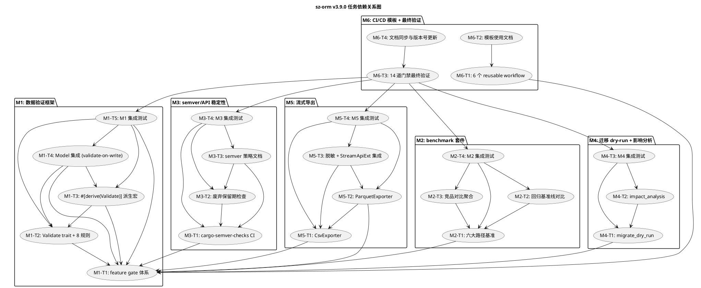

# sz-orm v3.9.0 编码任务规划

> 版本：v3.9.0（criterion benchmark 套件 + semver/API 稳定性 + 数据验证框架 + 迁移 dry-run/影响分析 + CI/CD 模板 + 流式导出）
> 基线：v3.8.0（生产部署就绪检查清单 15 项 + ORM 库特性适配 + 配置化与验证体系 + 五方言连接安全，6760 tests passed 0 failed）
> 日期：2026-08-10
> 文档定位：编码任务规划（How to execute），对应需求规格 `spec.md`（What to build）与技术设计 `design.md`（How to build）
> 任务约束：无 Breaking Change（feature gate 隔离）+ 优先复用既有能力 + 五方言覆盖 + 每项任务附 file:line 代码证据 + unsafe 零容忍 + 禁止占位实现（todo!/unimplemented!/unreachable!）
> 审计合规铁律：每项任务结论须附真实存在的 file:line 证据，修复后必须运行 `cargo test` 并附输出，禁止未验证即标记 ✅
> 实施顺序：按 design.md 第八章，P1-1 数据验证 → P1-2 benchmark → P1-3 semver → P2-1 dry-run → P2-2 流式导出 → P2-3 CI 模板

---

# 一、任务总览

## 1.1 里程碑 × 任务数 × 预期工作量

| 里程碑 | 名称 | 对应需求 | 优先级 | 任务数 | 子任务数 | 预期工作量 |
|--------|------|---------|--------|--------|----------|-----------|
| M1 | 数据验证框架 | REQ-V39-003 | P1 | 5 | 43 | 1.5 周 |
| M2 | criterion benchmark 套件 | REQ-V39-001 | P1 | 4 | 28 | 1 周 |
| M3 | semver/API 稳定性 | REQ-V39-002 | P1 | 4 | 22 | 0.5 周 |
| M4 | 迁移 dry-run + 影响分析 | REQ-V39-004 | P2 | 3 | 26 | 1 周 |
| M5 | 查询结果流式导出 | REQ-V39-006 | P2 | 4 | 33 | 1.5 周 |
| M6 | CI/CD GitHub Actions 模板 | REQ-V39-005 | P2 | 4 | 35 | 0.5 周 |
| **合计** | — | **6 项全覆盖** | — | **24** | **187** | **6 周** |

## 1.2 任务编号约定

- 主任务：`M{里程碑号}-T{任务序号}`（如 M1-T1）
- 子任务：`M{里程碑号}-T{任务序号}.{子任务序号}`（如 M1-T2.1）
- 集成验证任务：每个里程碑末尾固定一个集成测试任务（如 M1-T5）

## 1.3 全局约束（适用于所有任务）

1. **feature gate 隔离**：所有新能力通过 feature gate 隔离（`benchmark-suite` / `data-validation` / `validate-on-write` / `migration-dry-run` / `streaming-export`），默认 feature 行为不变
2. **既有 API 不变**：既有公开 API 签名完全向后兼容，sz-pay 既有代码不受影响（sz-pay 从 crates.io 拉取 sz-orm-* 6 个包）
3. **禁止占位实现**：禁止 `todo!`/`unimplemented!`/`unreachable!`
4. **unsafe 零容忍**：所有新增代码无 `unsafe` 块，或必须有 `// SAFETY:` 注释
5. **五方言覆盖**：MySQL/PostgreSQL/SQLite/Oracle/MSSQL，benchmark/dry-run/流式导出按方言能力适配
6. **审计证据**：每项任务结论附真实存在的 file:line 证据
7. **测试基线不回退**：v3.8.0 已验收测试基线（6760 passed）不回退，v3.9.0 仅增不减
8. **复用优先**：优先复用既有能力，不重复实现（如流式导出复用 StreamApiExt，dry-run 复用 get_pending_migrations）

---

# 二、M1：数据验证框架（REQ-V39-003，P1）

**目标**：提供 `#[derive(Validate)]` 派生宏 + 字段级校验规则（email/length/range/regex/required/custom/contains/does_not_contain）+ Model::validate() 集成，减少用户手写校验样板代码。
**预期工作量**：1.5 周
**对应需求**：REQ-V39-003（spec.md 5.3，design.md 3.3）
**依赖**：无（M1 为起点，含 feature gate 体系搭建基础设施）

## M1-T1：v3.9.0 feature gate 体系搭建

**任务描述**：在 sz-orm-core 与 sz-orm-macros 中新增 v3.9.0 的 5 个 feature gate（`benchmark-suite` / `data-validation` / `validate-on-write` / `migration-dry-run` / `streaming-export`）及对应可选依赖（regex/csv/arrow/parquet/criterion），作为所有新能力的隔离基础。默认全部关闭，避免无配置环境行为变化。

**涉及文件**：
- `packages/sz-orm-core/Cargo.toml`（新增 5 个 feature + 5 个可选依赖，复用既有 prod-ready feature 模式 `:85-115`）
- `packages/sz-orm-macros/Cargo.toml`（新增 `data-validation` feature）

**复用标注**：复用既有 feature gate 体系（`packages/sz-orm-core/Cargo.toml:85-115` prod-ready 14 子 feature 模式）、既有 criterion 0.5（`packages/sz-orm-core/Cargo.toml:177` dev-dependencies）

**子任务**：
- [ ] M1-T1.1 在 `packages/sz-orm-core/Cargo.toml` `[features]` 新增 5 个 feature：`benchmark-suite = ["dep:criterion"]`、`data-validation = ["sz-orm-macros/data-validation", "dep:regex"]`、`validate-on-write = ["data-validation"]`、`migration-dry-run = ["dep:regex"]`、`streaming-export = ["dep:csv", "dep:arrow", "dep:parquet"]`，位置在 prod-ready 之后，默认全部关闭
- [ ] M1-T1.2 在 `packages/sz-orm-core/Cargo.toml` `[dependencies]` 新增 5 个可选依赖：`regex = { version = "0.10", optional = true }`、`csv = { version = "1.3", optional = true }`、`arrow = { version = "52", optional = true }`、`parquet = { version = "52", optional = true }`、`criterion = { workspace = true, optional = true }`
- [ ] M1-T1.3 在 `packages/sz-orm-macros/Cargo.toml` `[features]` 新增 `data-validation = []`
- [ ] M1-T1.4 验证 `cargo check --workspace`（默认 feature，不启用任何 v3.9.0 feature）编译通过，行为与 v3.8.0 一致
- [ ] M1-T1.5 验证 `cargo check --workspace --all-targets --all-features` 编译通过（feature 全组合门禁，含 5 个新 feature）

**验收标准**：
1. `cargo check --workspace` 默认编译通过，无 v3.9.0 新 feature 相关代码生效
2. `cargo check --workspace --all-targets --all-features` 编译通过
3. 既有 API 签名完全不变，`cargo test --workspace` 既有测试全部通过（6760 passed 不回退）
4. 附 `packages/sz-orm-core/Cargo.toml` 新增 feature 与依赖定义的 file:line 证据

**依赖**：无（基础设施任务，所有 M1-M6 任务依赖此任务）

---

## M1-T2：Validate trait + ValidationError + 8 种校验规则

**任务描述**：在 sz-orm-core 新增 `validation` 模块，定义 `Validate` trait、`ValidationError` 枚举（含聚合错误变体），实现 8 种字段级校验规则函数（email/length/range/regex/required/custom/contains/does_not_contain）与错误聚合函数。

**涉及文件**：
- `packages/sz-orm-core/src/validation/mod.rs`（新增模块，定义 `Validate` trait、`ValidationError`）
- `packages/sz-orm-core/src/validation/rules.rs`（新增，8 种校验规则函数 + aggregate 聚合函数）
- `packages/sz-orm-core/src/lib.rs`（新增 `#[cfg(feature = "data-validation")] pub mod validation;`，位置在 model 之后）

**复用标注**：
- 既有配置校验范式：`PoolConfig::validate()`（`packages/sz-orm-core/src/pool.rs:530`）校验配置合理性，本任务为字段级数据校验（区别于配置校验）
- thiserror 依赖：`packages/sz-orm-core/Cargo.toml:120`（复用既有 thiserror 派生 Error）
- regex crate：M1-T1 新增的可选依赖（`data-validation` feature gate 隔离）

**子任务**：
- [ ] M1-T2.1 在 `packages/sz-orm-core/src/validation/mod.rs` 定义 `Validate` trait：`pub trait Validate { fn validate(&self) -> Result<(), ValidationError>; }`（spec 5.3.1 规则 1）
- [ ] M1-T2.2 定义 `ValidationError` 枚举（9 个变体）：`Required{field}` / `Length{field,min,max,actual}` / `Range{field,min,max,actual}` / `Email{field,value}` / `Regex{field,pattern,value}` / `Contains{field,substring}` / `DoesNotContain{field,substring}` / `Custom{field,reason}` / `Aggregate(Vec<ValidationError>)`，使用 `#[derive(Debug, Clone, PartialEq, Eq, Error)]` + `#[error("...")]`（design.md 3.3.1）
- [ ] M1-T2.3 在 `packages/sz-orm-core/src/validation/rules.rs` 实现 `validate_email(field, value) -> Result<(), ValidationError>`：使用 `OnceLock<Regex>` 缓存邮箱正则（RFC 5322 简化版 `^[a-zA-Z0-9._%+-]+@[a-zA-Z0-9.-]+\.[a-zA-Z]{2,}$`），匹配返回 Ok，不匹配返回 `ValidationError::Email`
- [ ] M1-T2.4 实现 `validate_length(field, value, min, max) -> Result<(), ValidationError>`：`value.chars().count()` 计算字符数（Unicode 安全），在 [min, max] 范围返回 Ok，否则返回 `ValidationError::Length`
- [ ] M1-T2.5 实现 `validate_range<T: PartialOrd + Display>(field, value, min, max) -> Result<(), ValidationError>`：泛型支持 i64/f64，在 [min, max] 范围返回 Ok，否则返回 `ValidationError::Range`
- [ ] M1-T2.6 实现 `validate_regex(field, value, pattern) -> Result<(), ValidationError>`：`Regex::new(pattern)` 编译正则，匹配返回 Ok，不匹配或正则无效返回 `ValidationError::Regex`
- [ ] M1-T2.7 实现 `validate_required(field, value) -> Result<(), ValidationError>`：`value.is_empty()` 返回 `ValidationError::Required`，否则 Ok
- [ ] M1-T2.8 实现 `validate_contains(field, value, substring) -> Result<(), ValidationError>`：`value.contains(substring)` 返回 Ok，否则 `ValidationError::Contains`
- [ ] M1-T2.9 实现 `validate_does_not_contain(field, value, substring) -> Result<(), ValidationError>`：`!value.contains(substring)` 返回 Ok，否则 `ValidationError::DoesNotContain`
- [ ] M1-T2.10 实现 `aggregate(results: Vec<Result<(), ValidationError>>) -> Result<(), ValidationError>`：收集所有 Err，空返回 Ok，单错误返回该错误，多错误返回 `ValidationError::Aggregate(errors)`（spec 5.3.1 规则 5：非短路聚合）
- [ ] M1-T2.11 在 `packages/sz-orm-core/src/lib.rs` 新增 `#[cfg(feature = "data-validation")] pub mod validation;`（位置在 `pub mod model;` 之后）
- [ ] M1-T2.12 编写单元测试：8 种规则各 ≥3 边界用例（email：合法/缺@/空；length：边界值/超长/空；range：边界/超范围/负数；regex：匹配/不匹配/无效正则；required：非空/空/空白；contains：包含/不包含/空子串；does_not_contain：不包含/包含/空子串）
- [ ] M1-T2.13 编写单元测试：`aggregate` 聚合多错误返回 `Aggregate(vec)`，单错误返回该错误，空返回 Ok；聚合错误包含全部失败字段（非短路）

**验收标准**：
1. `Validate` trait + `ValidationError`（9 变体）+ 8 种校验规则函数 + `aggregate` 聚合函数完整可用
2. 邮箱正则使用 `OnceLock` 缓存，避免重复编译
3. `validate_length` 使用 `chars().count()` Unicode 安全
4. `aggregate` 非短路聚合所有错误，非仅首个
5. `cargo test -p sz-orm-core --features data-validation` 新增测试全部通过
6. 附 `packages/sz-orm-core/src/validation/mod.rs` 与 `rules.rs` 新增代码的 file:line 证据

**依赖**：M1-T1（feature gate 体系 + regex 依赖）

---

## M1-T3：`#[derive(Validate)]` 派生宏

**任务描述**：在 sz-orm-macros 新增 `derive_validate` 模块与 `#[proc_macro_derive(Validate, attributes(validate))]` 宏，为结构体自动生成 `impl Validate` 代码，解析字段标注的 `#[validate(...)]` 属性生成对应校验调用，支持多规则叠加与条件校验。

**涉及文件**：
- `packages/sz-orm-macros/src/derive_validate.rs`（新增模块，实现 `derive_validate_impl`）
- `packages/sz-orm-macros/src/lib.rs`（新增 `#[proc_macro_derive(Validate, attributes(validate))]` 注册，位置在既有 10 个 derive 宏之后 `:2813`）
- `packages/sz-orm-macros/Cargo.toml`（复用既有 syn/quote/proc-macro2 依赖）

**复用标注**：
- 既有 derive 宏范式：`packages/sz-orm-macros/src/lib.rs:2507-2813`（10 个 `#[proc_macro_derive]`，如 Schema/Builder/Entity/FromQueryResult）
- derive 模块：`packages/sz-orm-macros/src/lib.rs:69` `mod derive`
- 既有 `parse_macro_input!(item as syn::DeriveInput)` + `quote!` 代码生成范式

**子任务**：
- [ ] M1-T3.1 在 `packages/sz-orm-macros/src/derive_validate.rs` 实现 `derive_validate_impl(input: proc_macro::TokenStream) -> proc_macro::TokenStream`：解析 `DeriveInput`，仅支持 struct（enum/union 返回编译错误 `Validate only supports structs`），遍历字段属性
- [ ] M1-T3.2 实现 `parse_validate_attr(attr, field_name, field_str) -> TokenStream`：解析 `#[validate(...)]` 属性，支持 8 种规则：`email` / `length(min=N, max=N)` / `range(min=N, max=N)` / `regex(pattern=r"...")` / `required` / `custom = "fn_name"` / `contains = "substr"` / `does_not_contain = "substr"`，生成对应 `validate_xxx` 调用代码
- [ ] M1-T3.3 支持多规则叠加：同字段多个 `#[validate(...)]` 属性生成多个 `results.push(...)` 调用
- [ ] M1-T3.4 支持条件校验：`#[validate(rule, if = "condition")]` 生成 `if condition { results.push(validate_xxx(...)); }` 代码
- [ ] M1-T3.5 支持嵌套校验：字段类型实现 `Validate` trait 时，生成 `results.push(self.field.validate().map_err(|e| /* 包装 */));` 递归调用
- [ ] M1-T3.6 生成 `impl sz_orm_core::validation::Validate for #struct_name` 代码：`fn validate(&self) -> Result<(), ValidationError> { let mut results = Vec::new(); #(#validations)* aggregate(results) }`
- [ ] M1-T3.7 在 `packages/sz-orm-macros/src/lib.rs` 新增 `#[cfg(feature = "data-validation")] #[proc_macro_derive(Validate, attributes(validate))] pub fn derive_validate(input: TokenStream) -> TokenStream { crate::derive_validate::derive_validate_impl(input) }`，位置在既有 derive 宏之后（`:2813` 之后）
- [ ] M1-T3.8 编写编译测试：结构体标注 `#[derive(Validate)]` + `#[validate(email)]`，编译生成 `impl Validate`，调用 `validate()` 校验 email 格式
- [ ] M1-T3.9 编写编译测试：多规则叠加（`#[validate(email)]` + `#[validate(length(min=5, max=100))]`），聚合返回全部错误
- [ ] M1-T3.10 编写编译测试：未知规则 `#[validate(unknown_rule)]` 编译失败，提示 `unknown validation rule: unknown_rule`

**验收标准**：
1. `#[derive(Validate)]` 为结构体自动生成 `impl Validate`，支持 8 种规则
2. 多规则叠加生成多个校验调用，聚合返回全部错误
3. 条件校验 `if = "condition"` 仅条件为真时校验
4. 嵌套校验递归调用子对象 `validate()`
5. 未知规则编译失败，提示清晰
6. 既有 10 个 derive 宏不受影响，签名与行为不变
7. `cargo test -p sz-orm-macros --features data-validation` 全部通过
8. 附 `packages/sz-orm-macros/src/derive_validate.rs` 与 `lib.rs` 新增代码的 file:line 证据

**依赖**：M1-T1（feature gate 体系）、M1-T2（Validate trait + ValidationError + 规则函数）

---

## M1-T4：Model 集成（validate-on-write）

**任务描述**：在 sz-orm-core 新增 `validation/model_integration.rs`，启用 `validate-on-write` feature 时为 `QueryBuilder<M: Model + Validate>` 提供 `insert_validated`/`update_validated` 方法，在写入前自动调用 `validate()`，校验失败拒绝写入。既有 `insert`/`update` 方法保留不动。

**涉及文件**：
- `packages/sz-orm-core/src/validation/model_integration.rs`（新增，`#[cfg(feature = "validate-on-write")]` 隔离）
- `packages/sz-orm-core/src/validation/mod.rs`（新增 `pub mod model_integration;` 子模块声明）
- `packages/sz-orm-core/src/query.rs`（复用既有 `QueryBuilder::insert`/`update`，不修改签名）

**复用标注**：
- 既有 `QueryBuilder`（`packages/sz-orm-core/src/query.rs`）：`insert`/`update` 方法保留不动，新增 `insert_validated`/`update_validated` 并行存在
- 既有 `Model` trait（`packages/sz-orm-core/src/model.rs:37`）：不修改签名，通过 `M: Model + Validate` supertrait 约束组合
- M1-T2 `Validate` trait + M1-T3 `#[derive(Validate)]`

**子任务**：
- [ ] M1-T4.1 在 `packages/sz-orm-core/src/validation/model_integration.rs` 实现 `impl<M: Model + Validate> QueryBuilder<M>`（`#[cfg(feature = "validate-on-write")]` 隔离），新增 `pub async fn insert_validated(&self, model: &M, conn: &mut dyn Connection) -> Result<u64, DbError>`：先调用 `model.validate()`，失败返回 `DbError::Validation(e.to_string())`，成功委托既有 `self.insert(model, conn).await`
- [ ] M1-T4.2 实现 `pub async fn update_validated(&self, model: &M, conn: &mut dyn Connection) -> Result<u64, DbError>`：先调用 `model.validate()`，失败返回 `DbError::Validation`，成功委托既有 `self.update(model, conn).await`
- [ ] M1-T4.3 在 `packages/sz-orm-core/src/validation/mod.rs` 新增 `#[cfg(feature = "validate-on-write")] pub mod model_integration;`
- [ ] M1-T4.4 确保 `DbError` 有 `Validation(String)` 变体（若既有 `DbError` 无此变体，需新增，向后兼容：enum 新增变体不破坏既有 match 的 `_` 分支）
- [ ] M1-T4.5 编写单元测试：定义 `User` 结构体标注 `#[derive(Validate)]` + `#[validate(email)]`，启用 `validate-on-write`，`insert_validated` 传入非法 email 返回 `DbError::Validation`，不执行 SQL
- [ ] M1-T4.6 编写单元测试：`insert_validated` 传入合法数据，校验通过后委托既有 `insert` 执行写入
- [ ] M1-T4.7 编写单元测试：既有 `insert`/`update`（无 `_validated` 后缀）行为不变，不自动校验（未启用 validate-on-write 时无 `insert_validated` 方法）

**验收标准**：
1. 启用 `validate-on-write` 时 `insert_validated`/`update_validated` 在写入前自动校验，非法数据返回 `DbError::Validation` 不执行 SQL
2. 既有 `insert`/`update` 签名与行为不变（不自动校验）
3. `Model` trait 签名不变，通过 `M: Model + Validate` supertrait 组合
4. 未启用 `validate-on-write` 时无 `insert_validated` 方法，行为与 v3.8.0 一致
5. `cargo test -p sz-orm-core --features validate-on-write` 全部通过
6. 附 `packages/sz-orm-core/src/validation/model_integration.rs` 新增代码的 file:line 证据

**依赖**：M1-T1（feature gate 体系）、M1-T2（Validate trait）、M1-T3（#[derive(Validate)] 派生宏）

---

## M1-T5：M1 集成测试与门禁验证

**任务描述**：对 M1 所有任务进行集成验证，确保 feature gate 隔离正确、既有 API 不变、测试基线不回退。

**涉及文件**：
- `packages/sz-orm-core/tests/validation_test.rs`（新增 M1 集成测试，`required-features = ["data-validation"]`）
- 各包 Cargo.toml（feature gate 验证）

**子任务**：
- [ ] M1-T5.1 运行 `cargo fmt --all -- --check`（门禁 1：fmt 格式检查）
- [ ] M1-T5.2 运行 `cargo check --workspace --all-targets`（门禁 2：默认 feature 编译检查，验证 data-validation 未启用时行为不变）
- [ ] M1-T5.3 运行 `cargo clippy --workspace --all-targets -- -D warnings`（门禁 3：clippy 静态分析）
- [ ] M1-T5.4 运行 `cargo test --workspace`（门禁 4：既有测试基线不回退，6760 passed）
- [ ] M1-T5.5 运行 `cargo test -p sz-orm-core --features data-validation,validate-on-write`（M1 新增测试全部通过）
- [ ] M1-T5.6 运行 `cargo check --workspace --all-targets --all-features`（门禁 10：feature 全组合编译，含 data-validation/validate-on-write）
- [ ] M1-T5.7 扫描新增代码无 `todo!`/`unimplemented!`/`unreachable!`（门禁 8：禁止占位实现）
- [ ] M1-T5.8 扫描新增代码无 `unsafe` 块或有 `// SAFETY:` 注释（unsafe 零容忍）

**验收标准**：
1. 14 道门禁中 M1 相关门禁全部通过（1/2/3/4/8/10）
2. 既有测试基线不回退（6760 passed）
3. `data-validation` / `validate-on-write` feature 全组合编译通过
4. 新增代码无占位实现、无 unsafe（或有 SAFETY 注释）
5. 附门禁运行输出证据

**依赖**：M1-T1、M1-T2、M1-T3、M1-T4

---

# 三、M2：criterion benchmark 套件（REQ-V39-001，P1）

**目标**：提供系统化的 criterion benchmark 套件，覆盖六大核心路径（查询构造/连接池/缓存/事务/序列化/流式查询），提供回归基准线对比与竞品（Diesel/SeaORM/SQLx）量化对比报告。
**预期工作量**：1 周
**对应需求**：REQ-V39-001（spec.md 5.1，design.md 3.1）
**依赖**：M1-T1（feature gate 体系 + criterion 可选依赖）

## M2-T1：六大路径系统化基准套件

**任务描述**：在 `packages/sz-orm-core/benches/regression/` 新增 6 个基准文件，每文件覆盖一个核心路径 ≥3 基准点，复用既有 criterion 0.5 与 bench_group 配置。

**涉及文件**：
- `packages/sz-orm-core/benches/regression/mod.rs`（新增，定义 `BenchPath` enum + `BaselinePoint`/`RegressionPoint`/`RegressionReport` 结构）
- `packages/sz-orm-core/benches/regression/query_build_bench.rs`（新增，路径 1：查询构造）
- `packages/sz-orm-core/benches/regression/pool_bench.rs`（新增，路径 2：连接池）
- `packages/sz-orm-core/benches/regression/cache_bench.rs`（新增，路径 3：缓存）
- `packages/sz-orm-core/benches/regression/transaction_bench.rs`（新增，路径 4：事务）
- `packages/sz-orm-core/benches/regression/serialization_bench.rs`（新增，路径 5：序列化）
- `packages/sz-orm-core/benches/regression/stream_bench.rs`（新增，路径 6：流式查询）
- `packages/sz-orm-core/Cargo.toml`（新增 `[[bench]]` 条目，`required-features = ["benchmark-suite"]` 隔离）

**复用标注**：
- 既有 criterion 0.5：`packages/sz-orm-core/Cargo.toml:177`（dev-dependencies，M1-T1 转为可选 main 依赖）
- 既有 `bench_group` 配置：`packages/sz-orm-core/benches/core_bench.rs:44`（对数轴摘要配置）
- 既有 9 个 bench 文件：`packages/sz-orm-core/benches/`（core_bench/l1_cache_bench/typed_overhead_bench 等，保留不动）
- 既有 `stream_cursor`：`packages/sz-orm-core/src/stream_api.rs:176`（路径 6 流式查询基准复用）

**子任务**：
- [ ] M2-T1.1 在 `packages/sz-orm-core/benches/regression/mod.rs` 定义 `BenchPath` enum（6 变体：QueryBuild/Pool/Cache/Transaction/Serialization/Stream）、`BaselinePoint` 结构（path/mean_ns/stddev_ns/p99_ns/timestamp，serde Serialize/Deserialize）、`RegressionPoint` 结构、`RegressionReport` 结构（design.md 3.1.1）
- [ ] M2-T1.2 实现 `query_build_bench.rs`（路径 1）：3 基准点 `select_simple`/`select_with_where`/`select_with_join`，复用既有 `bench_group` 配置，使用 `criterion::BenchmarkGroup`
- [ ] M2-T1.3 实现 `pool_bench.rs`（路径 2）：3 基准点 `acquire_release`/`acquire_reuse`/`acquire_contention`，复用既有 `core_bench.rs` Pool bench
- [ ] M2-T1.4 实现 `cache_bench.rs`（路径 3）：3 基准点 `l1_hit`/`l1_miss`/`l2_hit`，复用既有 `l1_cache_bench.rs`
- [ ] M2-T1.5 实现 `transaction_bench.rs`（路径 4）：3 基准点 `begin_commit`/`begin_rollback`/`nested`，复用既有 `core_bench.rs`
- [ ] M2-T1.6 实现 `serialization_bench.rs`（路径 5）：3 基准点 `serde_serialize`/`serde_deserialize`/`value_to_param`，复用既有 `core_bench.rs:54` `bench_value_to_param`
- [ ] M2-T1.7 实现 `stream_bench.rs`（路径 6）：3 基准点 `stream_cursor`/`stream_buffered`/`stream_backpressure`，复用既有 `stream_api.rs:176` `stream_cursor`
- [ ] M2-T1.8 在 `packages/sz-orm-core/Cargo.toml` 新增 `[[bench]]` 条目：`name = "regression_query_build"`、`harness = false`、`required-features = ["benchmark-suite"]`，6 个 bench 各一个 `[[bench]]` 条目
- [ ] M2-T1.9 验证 `cargo bench --features benchmark-suite --bench regression_query_build` 运行输出 3 基准点 + criterion 统计（均值/方差/p99）
- [ ] M2-T1.10 验证 `cargo build` 默认编译不编译 benchmark 套件代码（spec 5.1.1 规则 5：`benchmark-suite` feature gate 隔离）

**验收标准**：
1. 六大路径各 ≥3 基准点，`cargo bench --features benchmark-suite` 输出六大路径基准报告
2. 每基准点附 criterion 统计（均值/方差/p99）
3. 复用既有 criterion 0.5 与 bench_group 配置，无新增测量框架依赖
4. 默认 `cargo build` 不编译 benchmark 套件代码
5. 既有 9 个 bench 文件保留不动
6. 附 `packages/sz-orm-core/benches/regression/` 新增代码的 file:line 证据

**依赖**：M1-T1（feature gate 体系 + criterion 可选依赖）

---

## M2-T2：回归基准线对比

**任务描述**：新增 `benches/regression/compare.rs`，对比当前 benchmark 结果与历史基准线（`benches/baseline/*.json`），标记 ≥10% 回退的基准点，生成 `RegressionReport`。

**涉及文件**：
- `packages/sz-orm-core/benches/regression/compare.rs`（新增，回归对比逻辑）
- `packages/sz-orm-core/benches/baseline/`（新增目录，存放基准线 JSON 文件）

**复用标注**：复用 M2-T1 `BaselinePoint`/`RegressionPoint`/`RegressionReport` 结构

**子任务**：
- [ ] M2-T2.1 实现 `compare_with_baseline(current: &[BaselinePoint], baseline: &[BaselinePoint]) -> RegressionReport`：逐基准点对比 current vs baseline，`regression_pct = (current.mean_ns - baseline.mean_ns) / baseline.mean_ns * 100.0`，≥10% 标记 REGRESSION（design.md 3.1.3）
- [ ] M2-T2.2 实现 `load_baseline(path: &str) -> Result<Vec<BaselinePoint>, Box<dyn Error>>`：从 JSON 文件加载基准线
- [ ] M2-T2.3 实现 `save_baseline(points: &[BaselinePoint], path: &str) -> Result<(), Box<dyn Error>>`：保存当前结果为基准线 JSON
- [ ] M2-T2.4 首次运行无基准线时：生成当前结果作为新基准线，不标记回归，提示"首次运行，已生成基准线"（spec 5.1.3 异常场景 2）
- [ ] M2-T2.5 编写单元测试：current 某基准点耗时增加 ≥10%，`compare_with_baseline` 标记 REGRESSION + 附当前值/基准值/回退百分比
- [ ] M2-T2.6 编写单元测试：current 某基准点耗时减少（优化），不标记 REGRESSION；无对应基准线的基准点跳过对比

**验收标准**：
1. `compare_with_baseline` 正确标记 ≥10% 回退的基准点，附当前值/基准值/回退百分比
2. 首次运行无基准线时生成新基准线，不标记回归
3. 基准线 JSON 可序列化/反序列化
4. `cargo test --features benchmark-suite` 新增测试全部通过
5. 附 `packages/sz-orm-core/benches/regression/compare.rs` 新增代码的 file:line 证据

**依赖**：M2-T1（BaselinePoint 等结构定义）

---

## M2-T3：竞品对比聚合

**任务描述**：新增 `benches/regression/competitor_aggregate.rs`，复用既有 `bench-comparison/benches/` 13 个竞品 bench，聚合五场景（CRUD/分页/事务/关联加载/连接池）结果为 HTML + JSON 双格式报告。

**涉及文件**：
- `packages/sz-orm-core/benches/regression/competitor_aggregate.rs`（新增，竞品聚合）

**复用标注**：
- 既有竞品 bench：`bench-comparison/benches/` 13 个文件（`bench_crud.rs`/`bench_pagination.rs`/`bench_transaction.rs`/`bench_relation.rs`/`bench_pool.rs` 等）
- 既有竞品对比基础设施：`bench-comparison/Cargo.toml:24-28`（已引入 Diesel 2.2 / SeaORM 1.1 / SQLx 0.8）
- 既有 `full_comparison.rs` 与 `benchmark_reporter.rs`

**子任务**：
- [ ] M2-T3.1 实现 `aggregate_competitor_comparison() -> ComparisonReport`：复用既有 `bench_crud`/`bench_pagination`/`bench_transaction`/`bench_relation`/`bench_pool` 五场景 bench，聚合结果（design.md 3.1.4）
- [ ] M2-T3.2 实现 `ComparisonReport::to_html() -> String`：生成 HTML 报告，含 SZ-ORM vs Diesel vs SeaORM vs SQLx 五场景对比图表
- [ ] M2-T3.3 实现 `ComparisonReport::to_json() -> String`：生成 JSON 报告，可被外部工具解析
- [ ] M2-T3.4 竞品依赖不可用处理：Diesel/SeaORM/SQLx 编译失败（如缺少系统库）时，竞品对比部分标记 SKIPPED，SZ-ORM 自身基准正常输出（spec 5.1.3 异常场景 1）
- [ ] M2-T3.5 benchmark 报告中禁止出现数据库连接串明文（须脱敏，spec 4.3.4）
- [ ] M2-T3.6 编写单元测试：聚合报告含五场景数据，HTML/JSON 格式正确可解析；竞品不可用时标记 SKIPPED

**验收标准**：
1. 竞品对比聚合五场景（CRUD/分页/事务/关联/池），输出 HTML + JSON 双格式报告
2. HTML 报告含 SZ-ORM vs Diesel vs SeaORM vs SQLx 对比图表
3. 竞品依赖不可用时标记 SKIPPED，SZ-ORM 自身基准正常
4. 报告中无数据库连接串明文
5. `cargo test --features benchmark-suite` 新增测试全部通过
6. 附 `packages/sz-orm-core/benches/regression/competitor_aggregate.rs` 新增代码的 file:line 证据

**依赖**：M2-T1（benchmark 基础设施）

---

## M2-T4：M2 集成测试与门禁验证

**任务描述**：对 M2 所有任务进行集成验证。

**涉及文件**：
- 各 bench 文件 Cargo.toml（feature gate 验证）

**子任务**：
- [ ] M2-T4.1 运行 `cargo fmt --all -- --check` + `cargo check --workspace --all-targets` + `cargo clippy --workspace --all-targets -- -D warnings`
- [ ] M2-T4.2 运行 `cargo test --workspace`（既有测试基线不回退）
- [ ] M2-T4.3 运行 `cargo bench --features benchmark-suite --bench regression_query_build -- --quick`（六大路径基准快速验证，`--quick` 减少迭代）
- [ ] M2-T4.4 运行 `cargo check --workspace --all-targets --all-features`（feature 全组合编译，含 benchmark-suite）
- [ ] M2-T4.5 扫描新增代码无占位实现、无 unsafe（或有 SAFETY 注释）
- [ ] M2-T4.6 验证默认 `cargo build` 不编译 benchmark 套件代码（spec 5.1.1 规则 5）

**验收标准**：
1. M2 相关门禁全部通过
2. 既有测试基线不回退
3. `benchmark-suite` feature 全组合编译通过
4. 默认编译不引入 benchmark 套件代码
5. 附门禁运行输出证据

**依赖**：M2-T1、M2-T2、M2-T3

---

# 四、M3：semver 兼容性策略 + API 稳定性（REQ-V39-002，P1）

**目标**：在 CI 中集成 cargo-semver-checks 自动检测破坏性变更，新增废弃保留期检查脚本，扩展既有 API 稳定性策略文档。
**预期工作量**：0.5 周
**对应需求**：REQ-V39-002（spec.md 5.2，design.md 3.2）
**依赖**：M1-T1（feature gate 体系完整性，虽 semver 本身不依赖 feature gate，但为统一门禁）

## M3-T1：cargo-semver-checks CI 集成

**任务描述**：新增 `.github/workflows/semver-check.yml`，在 CI 中集成 cargo-semver-checks，对每次 PR 自动检测 SemVer 破坏性变更。

**涉及文件**：
- `.github/workflows/semver-check.yml`（新增，reusable workflow）

**复用标注**：
- 既有 CI lint job：`.github/workflows/ci.yml:17-43`（复用 checkout + rust-toolchain 步骤范式）
- 既有 SemVer 声明：`docs/API-STABILITY.md:10`
- 既有 API 三层分级：`docs/API-STABILITY.md:38-71`

**子任务**：
- [ ] M3-T1.1 新增 `.github/workflows/semver-check.yml`，触发条件 `on: pull_request: branches: [main, master, develop]`（design.md 3.2.2）
- [ ] M3-T1.2 `semver` job：`runs-on: ubuntu-latest`，steps：checkout（`fetch-depth: 0` 完整历史对比）+ dtolnay/rust-toolchain@stable + `cargo install cargo-semver-checks` + 对 `packages/sz-orm-core` 和 `packages/sz-orm-macros` 运行 `cargo semver-checks check-release --manifest-path $pkg/Cargo.toml`
- [ ] M3-T1.3 破坏性变更未标注时 CI 失败，报告变更位置与类型（spec 5.2.3 异常场景 1）
- [ ] M3-T1.4 cargo-semver-checks 误报处理：reusable workflow 允许 `continue-on-error: false`（首次集成手动验证，design.md 七章风险缓解）
- [ ] M3-T1.5 验证 workflow YAML 语法正确，`actionlint` 无报错

**验收标准**：
1. `.github/workflows/semver-check.yml` 在 PR 时自动运行 cargo-semver-checks
2. PR 包含 SemVer 破坏性变更（API 移除/签名变更/trait 变更）且未标注时 CI 失败
3. 对 sz-orm-core 和 sz-orm-macros 两个包分别检查
4. 复用既有 `docs/API-STABILITY.md` 三层分级，不重复定义
5. 附 `.github/workflows/semver-check.yml` 新增代码的 file:line 证据

**依赖**：M1-T1（feature gate 体系完整性）

---

## M3-T2：废弃保留期检查脚本

**任务描述**：新增 `scripts/check-deprecation-period.py`，扫描所有 `#[deprecated(since = "x.y.z")]` 标注，验证废弃保留期（≥2 个 MINOR 版本）已满，未满则 CI 失败。

**涉及文件**：
- `scripts/check-deprecation-period.py`（新增，Python 脚本）

**复用标注**：既有废弃保留期规则：`docs/API-STABILITY.md:74-99`（2 个 MINOR 版本保留期）

**子任务**：
- [ ] M3-T2.1 实现 `parse_version(v: str) -> tuple[int, int, int]`：解析 `"x.y.z"` 为 `(major, minor, patch)`（design.md 3.2.3）
- [ ] M3-T2.2 实现 `find_deprecated_apis(root: Path) -> list[dict]`：扫描所有 `.rs` 文件（排除 `target/`），正则提取 `#[deprecated(since = "x.y.z")]` 标注，返回 file/deprecated_since 列表
- [ ] M3-T2.3 实现 `check(current_version: str, apis: list[dict]) -> list[dict]`：计算 `minor_diff = (cur.major - since.major) * 1000 + (cur.minor - since.minor)`，`minor_diff >= 2` 为 OK，否则 VIOLATION
- [ ] M3-T2.4 `__main__` 入口：从 `Cargo.toml` 读取 `workspace.package.version`，扫描 `packages/` 目录，输出 JSON 结果（violations + summary），有 VIOLATION 时 `sys.exit(1)`（CI 失败）
- [ ] M3-T2.5 在 `.github/workflows/semver-check.yml` 新增 `deprecation-period` job：`setup-python@v5` + 运行 `python3 scripts/check-deprecation-period.py`
- [ ] M3-T2.6 编写自测：模拟 `#[deprecated(since = "3.5.0")]` + current_version=3.9.0，minor_diff=4 ≥ 2，status=OK；模拟 `since = "3.8.0"` + current=3.9.0，minor_diff=1 < 2，status=VIOLATION

**验收标准**：
1. `scripts/check-deprecation-period.py` 正确扫描所有 `#[deprecated(since)]` 标注
2. 废弃保留期 < 2 个 MINOR 版本时 CI 失败，提示保留期不足
3. 输出 JSON 结果含 violations + summary（total/ok/violation）
4. 集成到 `semver-check.yml` CI
5. 附 `scripts/check-deprecation-period.py` 新增代码的 file:line 证据

**依赖**：M3-T1（CI 集成基础）

---

## M3-T3：semver 策略文档扩展

**任务描述**：复用既有 `docs/API-STABILITY.md`，新增"自动化检查"章节，说明 cargo-semver-checks CI 集成与废弃保留期自动验证。

**涉及文件**：
- `docs/API-STABILITY.md`（复用既有三层分级 `:38-71` + 废弃流程 `:74-99` + 破坏性变更 `:108-127`，新增第 8 章"自动化检查"）

**复用标注**：
- 既有 SemVer 声明：`docs/API-STABILITY.md:10`
- 既有三层分级：`docs/API-STABILITY.md:38-71`
- 既有废弃保留期：`docs/API-STABILITY.md:74-99`
- 既有破坏性变更条件：`docs/API-STABILITY.md:108-127`
- 既有 API 契约：`docs/api-contracts.md`

**子任务**：
- [ ] M3-T3.1 在 `docs/API-STABILITY.md` 新增第 8 章"自动化检查（v3.9.0 新增）"，含 8.1 cargo-semver-checks CI 集成说明 + 8.2 废弃保留期自动验证说明（design.md 3.2.4）
- [ ] M3-T3.2 8.1 说明：每次 PR 自动运行 `cargo semver-checks check-release`，对比上次 crates.io 发布版本，检测 SemVer 破坏性变更
- [ ] M3-T3.3 8.2 说明：`scripts/check-deprecation-period.py` 扫描所有 `#[deprecated(since)]`，验证 `current_version - since >= 2 MINOR`，复用第 3.2 节废弃流程规则
- [ ] M3-T3.4 文档引用既有三层分级（`:38-71`）与废弃流程（`:74-99`），不重复定义分级标准（spec 5.2.1 规则 5）
- [ ] M3-T3.5 运行 `python scripts/check-doc-consistency.py` 验证文档与代码一致性

**验收标准**：
1. `docs/API-STABILITY.md` 新增第 8 章自动化检查说明
2. 文档复用既有三层分级与废弃流程，不重复定义
3. 含版本号规则/破坏性变更流程/废弃流程/升级指南/自动化检查
4. 文档与代码一致性检查通过
5. 附 `docs/API-STABILITY.md` 新增章节的 file:line 证据

**依赖**：M3-T1（cargo-semver-checks CI）、M3-T2（废弃保留期脚本）

---

## M3-T4：M3 集成测试与门禁验证

**任务描述**：对 M3 所有任务进行集成验证。

**涉及文件**：
- `.github/workflows/semver-check.yml`（CI workflow 验证）
- `scripts/check-deprecation-period.py`（脚本验证）

**子任务**：
- [ ] M3-T4.1 运行 `python3 scripts/check-deprecation-period.py`，验证输出 JSON + summary，无 VIOLATION（或附 VIOLATION 原因）
- [ ] M3-T4.2 验证 `.github/workflows/semver-check.yml` YAML 语法正确，`actionlint` 无报错
- [ ] M3-T4.3 运行 `cargo fmt --all -- --check` + `cargo check --workspace --all-targets` + `cargo clippy --workspace --all-targets -- -D warnings`
- [ ] M3-T4.4 运行 `cargo test --workspace`（既有测试基线不回退）
- [ ] M3-T4.5 运行 `python scripts/check-doc-consistency.py`（文档与代码一致性检查）
- [ ] M3-T4.6 扫描新增代码无占位实现、无 unsafe

**验收标准**：
1. M3 相关门禁全部通过
2. 既有测试基线不回退
3. `check-deprecation-period.py` 输出正确，无 VIOLATION（或附原因）
4. semver-check.yml 语法正确
5. 附门禁运行输出证据

**依赖**：M3-T1、M3-T2、M3-T3

---

# 五、M4：迁移 dry-run + 影响分析（REQ-V39-004，P2）

**目标**：新增 `Migrator::migrate_dry_run`（预览 SQL 不执行）与 `Migrator::impact_analysis`（受影响表/行数预估/锁类型/破坏性 DDL 标记/回滚可行性），既有 `migrate` 保留不动。
**预期工作量**：1 周
**对应需求**：REQ-V39-004（spec.md 5.4，design.md 3.4）
**依赖**：M1-T1（feature gate 体系 + regex 依赖，regex 与 data-validation 共享）

## M4-T1：migrate_dry_run 实现

**任务描述**：在 sz-orm-core 新增 `migration_dry_run` 模块，实现 `Migrator::migrate_dry_run() -> Result<DryRunReport, DbError>`，复用既有 `get_pending_migrations` + `sync_state_from_db`，仅收集 SQL 不执行，保证数据库无变更。

**涉及文件**：
- `packages/sz-orm-core/src/migration_dry_run.rs`（新增模块，`#[cfg(feature = "migration-dry-run")]` 隔离）
- `packages/sz-orm-core/src/lib.rs`（新增 `#[cfg(feature = "migration-dry-run")] pub mod migration_dry_run;`，位置在 migration 之后）
- `packages/sz-orm-core/src/migration.rs`（复用既有 `Migrator`/`get_pending_migrations`/`check_version_conflicts`/`ensure_migrations_table`/`sync_state_from_db`，不修改）

**复用标注**：
- 既有 `Migrator`（`packages/sz-orm-core/src/migration.rs:276`）：`migrate`（`:489`）保留不动
- 既有 `get_pending_migrations`（`packages/sz-orm-core/src/migration.rs:308`）：返回 `batch == 0` 的待执行迁移
- 既有 `check_version_conflicts`（`packages/sz-orm-core/src/migration.rs:331`）：版本冲突检测
- 既有 `ensure_migrations_table`（`packages/sz-orm-core/src/migration.rs:387`）：确保 `__migrations` 表存在
- 既有 `sync_state_from_db`（`packages/sz-orm-core/src/migration.rs:425`）：从 DB 同步已执行状态
- 既有 `Migration` 结构（`packages/sz-orm-core/src/migration.rs:10`）：version/name/sql_up/sql_down/batch/executed_at

**子任务**：
- [ ] M4-T1.1 在 `packages/sz-orm-core/src/migration_dry_run.rs` 定义 `DryRunReport{migrations: Vec<DryRunMigration>, total: usize}` 与 `DryRunMigration{version, name, sql_up, sql_down}` 结构（serde Serialize/Deserialize，design.md 3.4.1）
- [ ] M4-T1.2 实现 `Migrator::migrate_dry_run(&mut self) -> Result<DryRunReport, DbError>`：复用 `check_version_conflicts()` + `ensure_migrations_table().await` + `sync_state_from_db().await` + `get_pending_migrations()`，收集 pending 迁移的 (version, name, sql_up, sql_down) 到 `DryRunReport`，**不调用 `conn.execute`**（design.md 3.4.2）
- [ ] M4-T1.3 在 `packages/sz-orm-core/src/lib.rs` 新增 `#[cfg(feature = "migration-dry-run")] pub mod migration_dry_run;`（位置在 `pub mod migration;` 之后）
- [ ] M4-T1.4 编写单元测试：3 个待执行迁移，调用 `migrate_dry_run()` 返回含 3 个迁移的 `DryRunReport`（version/name/sql_up 完整）
- [ ] M4-T1.5 编写集成测试：`migrate_dry_run()` 前后查询 `__migrations` 表，版本表无变化，无新表/无新列（spec 5.4.1 规则 2：不修改数据库保证）
- [ ] M4-T1.6 编写单元测试：无待执行迁移时 `migrate_dry_run()` 返回 `DryRunReport{migrations: [], total: 0}`
- [ ] M4-T1.7 编写单元测试：既有 `migrate()`（`:489`）行为不变，实际执行迁移（spec 5.4.1 规则 7）

**验收标准**：
1. `migrate_dry_run()` 返回待执行迁移列表（version/name/sql_up/sql_down），不实际执行任何 DDL/DML
2. 数据库状态与调用前完全一致（`__migrations` 表无变化）
3. 复用 `get_pending_migrations` + `sync_state_from_db`，不重复解析迁移
4. 既有 `migrate()`（`:489`）行为不变，实际执行迁移
5. `cargo test -p sz-orm-core --features migration-dry-run` 全部通过
6. 附 `packages/sz-orm-core/src/migration_dry_run.rs` 新增代码的 file:line 证据

**依赖**：M1-T1（feature gate 体系 + regex 依赖）

---

## M4-T2：impact_analysis 实现

**任务描述**：在 `migration_dry_run.rs` 实现 `Migrator::impact_analysis() -> Result<ImpactReport, DbError>`，对每个待执行迁移：解析 SQL 提取受影响表、查询元数据估算行数（不全表扫描）、识别 DDL 锁类型、标记破坏性 DDL、评估回滚可行性。

**涉及文件**：
- `packages/sz-orm-core/src/migration_dry_run.rs`（扩展，新增 `ImpactReport`/`MigrationImpact`/`LockType`/`DestructiveInfo`/`RollbackInfo` 结构 + `impact_analysis` 方法 + 辅助函数）

**复用标注**：
- 既有 `Connection::query`（`packages/sz-orm-core/src/pool.rs:52`）：元数据查询
- 既有 `DbType` 枚举（`packages/sz-orm-core/src/db_type.rs`）：方言适配
- M4-T1 `migrate_dry_run` 基础设施（check_version_conflicts/ensure_migrations_table/sync_state_from_db/get_pending_migrations）
- regex crate：M1-T1 新增的可选依赖（`migration-dry-run` feature gate 隔离，与 data-validation 共享）

**子任务**：
- [ ] M4-T2.1 定义 `ImpactReport{migrations: Vec<MigrationImpact>, total: usize, has_destructive: bool}`、`MigrationImpact{version, name, affected_tables, estimated_rows, lock_type, destructive, rollback}`、`LockType` enum（Exclusive/Share/None）、`DestructiveInfo{is_destructive, reason}`、`RollbackInfo{feasible, reason}` 结构（design.md 3.4.1）
- [ ] M4-T2.2 实现 `extract_affected_tables(sql: &str) -> Vec<String>`：正则匹配 FROM/INTO/UPDATE/ALTER TABLE/DROP TABLE 后的表名
- [ ] M4-T2.3 实现 `estimate_rows(tables: &[String], context: &mut MigrationContext) -> Option<u64>`：方言适配元数据查询（PG `pg_class.reltuples`、MySQL `information_schema.tables.table_rows`、SQLite `sqlite_stat1`、Oracle `user_tables.num_rows`、MSSQL `sys.partitions.rows`），查询失败返回 None（UNKNOWN，spec 5.4.3 异常场景 1）（design.md 3.4.3）
- [ ] M4-T2.4 实现 `classify_lock(sql: &str) -> LockType`：DROP TABLE/TRUNCATE → Exclusive，ALTER TABLE → Share，其他 → None
- [ ] M4-T2.5 实现 `classify_destructive(sql: &str) -> DestructiveInfo`：识别 DROP TABLE/DROP COLUMN/TRUNCATE/ALTER COLUMN TYPE（type_change_may_lose_data）/DELETE WITHOUT WHERE（spec 5.4.1 规则 5）
- [ ] M4-T2.6 实现 `assess_rollback(sql_up: &str, sql_down: &str, destructive: &DestructiveInfo) -> RollbackInfo`：sql_down 空 → feasible=false；destructive → feasible=false（数据丢失不可逆）；否则 feasible=true
- [ ] M4-T2.7 实现 `Migrator::impact_analysis(&mut self) -> Result<ImpactReport, DbError>`：复用 `get_pending_migrations`，对每个迁移调用上述辅助函数，汇总 `ImpactReport`（design.md 3.4.3 + 4.2 流程）
- [ ] M4-T2.8 编写单元测试：迁移含 `DROP TABLE users`，`impact_analysis()` 标记破坏性=true，受影响表=users，锁=Exclusive，回滚可行性=false（DROP 不可逆）
- [ ] M4-T2.9 编写单元测试：迁移含 `ALTER COLUMN age TYPE TEXT`，标记破坏性=true，原因=type_change_may_lose_data
- [ ] M4-T2.10 编写单元测试：迁移含 `DELETE FROM users`（无 WHERE），标记破坏性=true，原因=delete_without_where
- [ ] M4-T2.11 编写单元测试：迁移含 `CREATE TABLE new_table`，标记破坏性=false，锁=None，回滚可行性=true（sql_down 非空且非破坏性）
- [ ] M4-T2.12 编写集成测试：五方言元数据查询（MySQL/PostgreSQL/SQLite 本机可用，Oracle/MSSQL 不可用时标记 UNKNOWN），验证行数预估通过元数据非全表 COUNT
- [ ] M4-T2.13 编写单元测试：破坏性 DDL 的 sql_down 为空时，报告标记回滚可行性=false + 高风险告警 `destructive DDL without rollback`（spec 5.4.3 异常场景 2）

**验收标准**：
1. `impact_analysis()` 输出每个迁移的受影响表/预估行数/锁类型/破坏性标记/回滚可行性
2. 行数预估通过元数据查询（不全表扫描），查询失败标记 UNKNOWN（None）
3. 破坏性 DDL 识别：DROP TABLE/DROP COLUMN/TRUNCATE/ALTER COLUMN TYPE/DELETE WITHOUT WHERE
4. 回滚可行性：sql_down 空或破坏性 DDL → feasible=false
5. 五方言元数据查询适配（PG/MySQL/SQLite/Oracle/MSSQL）
6. `cargo test -p sz-orm-core --features migration-dry-run` 全部通过
7. 附 `packages/sz-orm-core/src/migration_dry_run.rs` 新增代码的 file:line 证据

**依赖**：M4-T1（migrate_dry_run 基础设施）

---

## M4-T3：M4 集成测试与门禁验证

**任务描述**：对 M4 所有任务进行集成验证。

**涉及文件**：
- `packages/sz-orm-core/tests/migration_dry_run_test.rs`（新增 M4 集成测试，`required-features = ["migration-dry-run"]`）

**子任务**：
- [ ] M4-T3.1 运行 `cargo fmt --all -- --check` + `cargo check --workspace --all-targets` + `cargo clippy --workspace --all-targets -- -D warnings`
- [ ] M4-T3.2 运行 `cargo test --workspace`（既有测试基线不回退）
- [ ] M4-T3.3 运行 `cargo test -p sz-orm-core --features migration-dry-run`（M4 新增测试全部通过）
- [ ] M4-T3.4 运行 `cargo check --workspace --all-targets --all-features`（feature 全组合编译，含 migration-dry-run）
- [ ] M4-T3.5 扫描新增代码无占位实现、无 unsafe（或有 SAFETY 注释）
- [ ] M4-T3.6 验证既有 `MigrationManager::migrate/rollback/up/down`（`migration.rs:489-733`）行为不变

**验收标准**：
1. M4 相关门禁全部通过
2. 既有测试基线不回退
3. `migration-dry-run` feature 全组合编译通过
4. 既有迁移 API 行为不变
5. 附门禁运行输出证据

**依赖**：M4-T1、M4-T2

---

# 六、M5：查询结果流式导出（REQ-V39-006，P2）

**目标**：基于既有 StreamApiExt 的流式查询，新增 CSV/Parquet 导出，逐行/批写出，峰值内存与结果集行数无关，支持脱敏集成。
**预期工作量**：1.5 周
**对应需求**：REQ-V39-006（spec.md 5.6，design.md 3.6）
**依赖**：M1-T1（feature gate 体系 + csv/arrow/parquet 依赖）

## M5-T1：CsvExporter 实现

**任务描述**：在 sz-orm-core 新增 `streaming_export` 模块与 `CsvExporter`，基于既有 `StreamApiExt::stream_buffered` 逐行消费，CSV 序列化写出（含表头），峰值内存 = 单行 + CSV 缓冲。

**涉及文件**：
- `packages/sz-orm-core/src/streaming_export/mod.rs`（新增模块，定义 `ExportConfig`/`ExportFormat`/`CsvConfig`/`ParquetConfig`/`MaskingConfig`/`ExportResult`）
- `packages/sz-orm-core/src/streaming_export/csv.rs`（新增，`CsvExporter` 实现）
- `packages/sz-orm-core/src/lib.rs`（新增 `#[cfg(feature = "streaming-export")] pub mod streaming_export;`，位置在 stream_api 之后）

**复用标注**：
- 既有 `StreamApiExt` trait（`packages/sz-orm-core/src/stream_api.rs:50`）：`stream_buffered`（`:55`，兼容版逐行 yield）
- 既有 `RowResult` 类型（`packages/sz-orm-core/src/stream_api.rs:45`）：`HashMap<String, Value>`
- csv crate：M1-T1 新增的可选依赖（`streaming-export` feature gate 隔离）

**子任务**：
- [ ] M5-T1.1 在 `packages/sz-orm-core/src/streaming_export/mod.rs` 定义 `ExportConfig`/`ExportFormat`/`CsvConfig`（delimiter/quote/has_header/escape，Default: ','/'"'/true/None）/`ParquetConfig`/`MaskingConfig`/`ExportResult`（rows_written/bytes_written）结构（design.md 3.6.1）
- [ ] M5-T1.2 在 `packages/sz-orm-core/src/streaming_export/csv.rs` 实现 `CsvExporter<W: Write>`：`new(writer, config, masking)` 使用 `csv::WriterBuilder` 构造，`export(stream) -> Result<ExportResult, DbError>` 逐行从 Stream 拉取、脱敏、写出（design.md 3.6.2）
- [ ] M5-T1.3 首行提取列名作为表头（`config.has_header` 为 true 时写出表头）
- [ ] M5-T1.4 实现 `format_value(v: &Value) -> String`：Value::Null → 空、I64/F64/Bool/String → to_string，其他 → 空
- [ ] M5-T1.5 在 `packages/sz-orm-core/src/lib.rs` 新增 `#[cfg(feature = "streaming-export")] pub mod streaming_export;`（位置在 `pub mod stream_api;` 之后）
- [ ] M5-T1.6 编写单元测试：查询 1000 行导出 CSV，CSV 行数=1000，含表头，峰值内存与行数无关
- [ ] M5-T1.7 编写单元测试：配置 `delimiter=';'`，导出 CSV 使用 `;` 分隔（spec 5.6.1 规则 6）
- [ ] M5-T1.8 编写单元测试：`has_header=false` 时无表头行
- [ ] M5-T1.9 编写单元测试：空结果集导出 CSV（仅表头或空文件），rows_written=0
- [ ] M5-T1.10 编写异常测试：写出失败（模拟磁盘满/无权限）返回 `DbError::Internal`，已写出部分保留（spec 5.6.3 异常场景 1）

**验收标准**：
1. `CsvExporter` 从 Stream 逐行导出 CSV，含表头，行数与查询结果集一致
2. 峰值内存 = 单行 HashMap + CSV 缓冲，与结果集总行数无关
3. 格式可配置（分隔符/引号/表头/转义）
4. 写出失败返回错误，已写出部分保留
5. `cargo test -p sz-orm-core --features streaming-export` 全部通过
6. 附 `packages/sz-orm-core/src/streaming_export/csv.rs` 新增代码的 file:line 证据

**依赖**：M1-T1（feature gate 体系 + csv 依赖）

---

## M5-T2：ParquetExporter 实现

**任务描述**：在 `streaming_export/parquet.rs` 实现 `ParquetExporter`，按 batch_size 攒批后转为 Arrow RecordBatch 写入 Parquet 列式格式，峰值内存 = batch_size × 单行 + Parquet 缓冲。

**涉及文件**：
- `packages/sz-orm-core/src/streaming_export/parquet.rs`（新增，`ParquetExporter` 实现）

**复用标注**：
- 既有 `StreamApiExt`/`RowResult`（同 M5-T1）
- arrow/parquet crate：M1-T1 新增的可选依赖（`streaming-export` feature gate 隔离）

**子任务**：
- [ ] M5-T2.1 在 `packages/sz-orm-core/src/streaming_export/parquet.rs` 实现 `ParquetExporter<W: Write>`：`new(writer, config, masking, batch_size)`，延迟初始化 `ArrowWriter`（需 schema）（design.md 3.6.3）
- [ ] M5-T2.2 实现 `infer_arrow_schema(row: &RowResult) -> SchemaRef`：从首行推导 Arrow schema（列名/类型映射：String→Utf8、I64→Int64、F64→Float64、Bool→Boolean、Null→Null）
- [ ] M5-T2.3 实现 `rows_to_record_batch(rows: &[RowResult], schema: &SchemaRef) -> Result<RecordBatch, DbError>`：将 RowResult 批转为 Arrow RecordBatch
- [ ] M5-T2.4 实现 `export(stream) -> Result<ExportResult, DbError>`：逐行从 Stream 拉取、脱敏、攒批，满 batch_size 后转为 RecordBatch 写入 Parquet，最后写出剩余不足一批的行 + 关闭 writer（写出 footer）（design.md 3.6.3）
- [ ] M5-T2.5 Parquet 压缩算法配置：Snappy（默认）/Gzip/Zstd/Uncompressed
- [ ] M5-T2.6 编写单元测试：查询 1000 行导出 Parquet，Parquet 行数=1000，schema 完整，峰值内存 ≤ batch_size × 单行
- [ ] M5-T2.7 编写单元测试：配置 `batch_size=100`，验证攒批写入逻辑（100 行一批）
- [ ] M5-T2.8 编写单元测试：配置 `compression=Zstd`，导出 Parquet 使用 Zstd 压缩
- [ ] M5-T2.9 编写异常测试：写出失败返回 `DbError::Internal`，已写出部分保留

**验收标准**：
1. `ParquetExporter` 从 Stream 逐批导出 Parquet，schema 完整，行数一致
2. 峰值内存 = batch_size × 单行 + Parquet 缓冲，与结果集总行数无关
3. 压缩算法可配置（Snappy/Gzip/Zstd/Uncompressed）
4. 攒批写入逻辑正确，剩余不足一批的行正确写出
5. `cargo test -p sz-orm-core --features streaming-export` 全部通过
6. 附 `packages/sz-orm-core/src/streaming_export/parquet.rs` 新增代码的 file:line 证据

**依赖**：M1-T1（feature gate 体系 + arrow/parquet 依赖）、M5-T1（streaming_export 模块基础设施）

---

## M5-T3：脱敏集成 + StreamApiExt 集成

**任务描述**：实现导出脱敏集成（逐行应用 `DataMasker::apply` 到敏感字段）与 `StreamingExportExt` trait（为 `QueryBuilder<M>` 提供 `export_csv`/`export_parquet` 便捷方法，复用既有 `stream_buffered`）。

**涉及文件**：
- `packages/sz-orm-core/src/streaming_export/mod.rs`（扩展，新增 `StreamingExportExt` trait + `apply_masking` 函数）
- `packages/sz-orm-masking/src/lib.rs`（复用既有 `DataMasker::apply` `:44`、`MaskingRule` `:21`，不修改）

**复用标注**：
- 既有 `DataMasker::apply`（`packages/sz-orm-masking/src/lib.rs:44`）：12 种脱敏规则
- 既有 `MaskingRule` 枚举（`packages/sz-orm-masking/src/lib.rs:21`）
- 既有 `StreamApiExt::stream_buffered`（`packages/sz-orm-core/src/stream_api.rs:55`）
- 既有 `QueryBuilder`（`packages/sz-orm-core/src/query.rs`）

**子任务**：
- [ ] M5-T3.1 实现 `apply_masking(row: &mut RowResult, rules: &HashMap<String, MaskingRule>)`：逐字段应用 `DataMasker::apply` 到敏感字段（design.md 3.6.2）
- [ ] M5-T3.2 定义 `StreamingExportExt<M: Model>` trait：`export_csv(conn, writer, config, masking) -> Result<ExportResult, DbError>` + `export_parquet(conn, writer, config, masking, batch_size) -> Result<ExportResult, DbError>`（design.md 3.6.4）
- [ ] M5-T3.3 为 `QueryBuilder<M>` 实现 `StreamingExportExt`：`export_csv` 复用 `self.stream_buffered(conn)` 获取 Stream，构造 `CsvExporter` 导出；`export_parquet` 同理
- [ ] M5-T3.4 编写单元测试：查询含手机号字段，启用脱敏（`MaskingRule::Phone`），导出 CSV 中手机号显示为 `138****8888`，非明文（spec 5.6.1 规则 5）
- [ ] M5-T3.5 编写单元测试：未启用脱敏（`masking.enabled=false`）时导出明文，行为与无脱敏一致
- [ ] M5-T3.6 编写单元测试：`export_csv`/`export_parquet` 便捷方法正确委托 `CsvExporter`/`ParquetExporter`
- [ ] M5-T3.7 编写集成测试：五方言流式导出（MySQL/PostgreSQL/SQLite 本机可用），验证导出行数与查询结果一致

**验收标准**：
1. 启用脱敏时导出敏感字段脱敏（如手机号 `138****8888`），未启用时导出明文
2. `StreamingExportExt` 为 `QueryBuilder` 提供 `export_csv`/`export_parquet` 便捷方法
3. 复用既有 `DataMasker::apply` + `stream_buffered`，不重复实现
4. 既有 `DataMasker`/`MaskingRule`/`StreamApiExt` 签名不变
5. 五方言流式导出行为一致
6. `cargo test -p sz-orm-core --features streaming-export` 全部通过
7. 附 `packages/sz-orm-core/src/streaming_export/mod.rs` 新增代码的 file:line 证据

**依赖**：M5-T1（CsvExporter）、M5-T2（ParquetExporter）

---

## M5-T4：M5 集成测试与门禁验证

**任务描述**：对 M5 所有任务进行集成验证。

**涉及文件**：
- `packages/sz-orm-core/tests/streaming_export_test.rs`（新增 M5 集成测试，`required-features = ["streaming-export"]`）

**子任务**：
- [ ] M5-T4.1 运行 `cargo fmt --all -- --check` + `cargo check --workspace --all-targets` + `cargo clippy --workspace --all-targets -- -D warnings`
- [ ] M5-T4.2 运行 `cargo test --workspace`（既有测试基线不回退）
- [ ] M5-T4.3 运行 `cargo test -p sz-orm-core --features streaming-export`（M5 新增测试全部通过）
- [ ] M5-T4.4 运行 `cargo check --workspace --all-targets --all-features`（feature 全组合编译，含 streaming-export）
- [ ] M5-T4.5 扫描新增代码无占位实现、无 unsafe（或有 SAFETY 注释）
- [ ] M5-T4.6 验证默认 `cargo build` 不引入 csv/parquet 依赖（spec 5.6.1 规则 7）
- [ ] M5-T4.7 验证既有 `StreamApiExt`（`stream_api.rs:50`）签名与行为不变

**验收标准**：
1. M5 相关门禁全部通过
2. 既有测试基线不回退
3. `streaming-export` feature 全组合编译通过
4. 默认编译不引入 csv/parquet 依赖
5. 既有 `StreamApiExt` 签名与行为不变
6. 附门禁运行输出证据

**依赖**：M5-T1、M5-T2、M5-T3

---

# 七、M6：CI/CD GitHub Actions 可复用模板（REQ-V39-005，P2）

**目标**：提供用户可直接复用的 GitHub Actions 工作流模板集（lint/test/security/release/probe/soak），含可配置 inputs，附使用文档。
**预期工作量**：0.5 周
**对应需求**：REQ-V39-005（spec.md 5.5，design.md 3.5）
**依赖**：M1-T1（feature gate 体系完整性，虽 CI 模板不依赖 feature gate，但为统一门禁）

## M6-T1：6 个 reusable workflow 模板

**任务描述**：在 `.github/workflows/templates/` 新增 6 个 reusable workflow（lint/test/security/release/probe/soak），参数化既有 CI 配置的 inputs（包名/数据库/feature/工具链）。

**涉及文件**：
- `.github/workflows/templates/lint.yml`（新增，fmt + clippy）
- `.github/workflows/templates/test.yml`（新增，单元 + 集成测试）
- `.github/workflows/templates/security.yml`（新增，audit + deny + SQL 注入扫描）
- `.github/workflows/templates/release.yml`（新增，crates.io 发布）
- `.github/workflows/templates/probe.yml`（新增，K8s 探针部署）
- `.github/workflows/templates/soak.yml`（新增，长时间稳定性测试）

**复用标注**：
- 既有 10 个 workflow：`.github/workflows/`（ci/integration/security/codeql/semgrep/docs/publish/bindings/soak/soak-self-hosted，保留不动）
- 既有 lint job：`.github/workflows/ci.yml:17-43`（fmt + clippy + check 三步）
- 既有 integration：`.github/workflows/integration.yml`
- 既有 security：`.github/workflows/security.yml`
- 既有 publish：`.github/workflows/publish.yml`
- 既有 soak：`.github/workflows/soak.yml`、`.github/workflows/soak-self-hosted.yml`

**子任务**：
- [ ] M6-T1.1 实现 `lint.yml`（reusable workflow，`on: workflow_call: inputs: {package, toolchain, extra_flags}`）：复用 `ci.yml:17-43` lint job 步骤，参数化为 inputs（design.md 3.5.2）
- [ ] M6-T1.2 实现 `test.yml`（inputs: `package, database_url, features, toolchain`）：复用 `integration.yml` 集成测试步骤，参数化数据库连接与 feature 组合
- [ ] M6-T1.3 实现 `security.yml`（inputs: `package, fail_on_vuln`）：复用 `security.yml` audit + deny + SQL 注入扫描步骤
- [ ] M6-T1.4 实现 `release.yml`（inputs: `package, crate_name, token_secret`）：复用 `publish.yml` crates.io 发布步骤，token 通过 `${{ secrets.* }}` 引用
- [ ] M6-T1.5 实现 `probe.yml`（inputs: `image, namespace, ready_path, live_path`）：复用 `soak-self-hosted.yml` K8s 探针部署步骤
- [ ] M6-T1.6 实现 `soak.yml`（inputs: `duration, image, metrics_url`）：复用 `soak.yml` 长时间稳定性测试步骤
- [ ] M6-T1.7 所有模板禁止硬编码密钥/令牌/连接串，须使用 `${{ secrets.* }}` 引用（spec 4.3.1 + 5.5.1 规则 6）
- [ ] M6-T1.8 验证所有模板 YAML 语法正确，`actionlint` 无报错
- [ ] M6-T1.9 验证既有 10 个 workflow 保留不动，不受模板新增影响

**验收标准**：
1. 6 个 reusable workflow 模板（lint/test/security/release/probe/soak）完整可用
2. 每模板含可配置 inputs（包名/数据库/feature/工具链等），非硬编码
3. 模板支持 `uses:` 远程引用 + 拷贝复用两种方式
4. 无硬编码密钥/令牌/连接串，均通过 `${{ secrets.* }}` 引用
5. 既有 10 个 workflow 保留不动
6. 附 `.github/workflows/templates/` 6 个模板文件的 file:line 证据

**依赖**：M1-T1（feature gate 体系完整性）

---

## M6-T2：模板使用文档

**任务描述**：新增 `docs/cicd-templates-guide.md`，含每个模板的 inputs 说明、远程引用示例、拷贝示例、自定义说明。

**涉及文件**：
- `docs/cicd-templates-guide.md`（新增）

**子任务**：
- [ ] M6-T2.1 新增 `docs/cicd-templates-guide.md`，含 6 个模板的 inputs 说明（每个 input 的名称/类型/默认值/描述）
- [ ] M6-T2.2 每模板附远程引用示例：`uses: ljclz/sz-orm/.github/workflows/templates/lint.yml@v3.9.0` + `with: {package: sz-pay-server, toolchain: stable}`（design.md 3.5.3）
- [ ] M6-T2.3 每模板附拷贝复用示例：拷贝到下游 `.github/workflows/` 并修改 inputs
- [ ] M6-T2.4 附自定义说明：如何扩展 inputs、如何添加自定义 step
- [ ] M6-T2.5 运行 `python scripts/check-doc-consistency.py` 验证文档与代码一致性

**验收标准**：
1. `docs/cicd-templates-guide.md` 含 6 个模板的完整 inputs 说明
2. 含远程引用示例 + 拷贝示例 + 自定义说明
3. 文档与代码一致性检查通过
4. 附 `docs/cicd-templates-guide.md` 新增代码的 file:line 证据

**依赖**：M6-T1（6 个模板文件）

---

## M6-T3：14 道门禁最终验证

**任务描述**：v3.9.0 须通过 AGENTS.md 定义的 14 道门禁，确保整体质量与不回退。

**涉及文件**：
- `scripts/gate.ps1`（复用既有门禁脚本）
- `scripts/check-sql-injection.ps1`（复用既有 SQL 注入扫描）
- `scripts/check-doc-consistency.py`（复用既有文档一致性检查）
- `scripts/audit-verify.sh`（复用既有审计证据验证）

**子任务**：
- [ ] M6-T3.1 门禁 1：`cargo fmt --all -- --check`（fmt 格式检查）通过
- [ ] M6-T3.2 门禁 2：`cargo check --workspace --all-targets`（默认 feature 编译检查）通过
- [ ] M6-T3.3 门禁 3：`cargo clippy --workspace --all-targets -- -D warnings`（clippy 静态分析）通过
- [ ] M6-T3.4 门禁 4：`cargo test --workspace`（单元/集成测试）通过，既有测试基线不回退（6760 passed）
- [ ] M6-T3.5 门禁 5：`cargo doc --workspace --no-deps --all-features`（文档构建）通过
- [ ] M6-T3.6 门禁 6：`cargo audit` + `cargo deny check`（安全审计）通过
- [ ] M6-T3.7 门禁 7：`cargo test --workspace -- --ignored`（真实服务集成测试）通过
- [ ] M6-T3.8 门禁 8：`grep -rn 'todo!\|unimplemented!\|unreachable!' --include='*.rs'`（禁止占位实现检查）无命中
- [ ] M6-T3.9 门禁 9：`scripts/check-sql-injection.ps1`（SQL 注入扫描）通过
- [ ] M6-T3.10 门禁 10：`cargo check --workspace --all-targets --all-features`（feature 全组合编译）通过
- [ ] M6-T3.11 门禁 11：`git diff --name-only HEAD`（上游仓库未修改检查，ADR-0001）确认未修改 sz-pay/sz-rust 下游
- [ ] M6-T3.12 门禁 12：`python scripts/check-doc-consistency.py`（文档与代码一致性检查）通过
- [ ] M6-T3.13 门禁 13：`bash scripts/audit-verify.sh <审计报告.md>`（审计证据验证）通过，所有 file:line 引用真实存在
- [ ] M6-T3.14 门禁 14：`python scripts/check-doc-sync.py --diff HEAD`（文档同步更新检查）通过

**验收标准**：
1. 14 道门禁全部通过
2. 既有测试基线不回退（6760 passed）
3. 新增代码无占位实现、无 unsafe（或有 SAFETY 注释）
4. 审计证据所有 file:line 引用真实存在
5. sz-pay/sz-rust 下游仓库未修改（ADR-0001）
6. 附 14 道门禁运行输出证据

**依赖**：M1-T5、M2-T4、M3-T4、M4-T3、M5-T4（所有里程碑集成测试完成）

---

## M6-T4：文档同步与版本号更新

**任务描述**：更新版本号、CHANGELOG、README，同步 v3.9.0 文档，验证 sz-pay 兼容性。

**涉及文件**：
- `Cargo.toml`（workspace.package.version 从 3.8.0 更新至 3.9.0）
- `CHANGELOG.md`（新增 v3.9.0 变更记录）
- `README.md`（更新 v3.9.0 新能力说明）
- `docs/spec/v3.9.0/spec.md`、`docs/spec/v3.9.0/design.md`、`docs/spec/v3.9.0/tasks.md`（本文档）

**子任务**：
- [ ] M6-T4.1 更新 `Cargo.toml` workspace.package.version 从 3.8.0 至 3.9.0（集中管理版本号）
- [ ] M6-T4.2 更新 `CHANGELOG.md` 新增 v3.9.0 变更记录：6 项新能力（benchmark 套件/semver 自动化/数据验证框架/迁移 dry-run+影响分析/CI 模板/流式导出）、5 个新 feature gate
- [ ] M6-T4.3 更新 `README.md` 新增 v3.9.0 能力说明：5 个 feature gate 启用方式、`#[derive(Validate)]` 使用示例、`migrate_dry_run`/`impact_analysis` 使用示例、CSV/Parquet 导出示例
- [ ] M6-T4.4 运行 `python scripts/check-doc-sync.py --diff HEAD` 验证文档与代码同步
- [ ] M6-T4.5 运行 `python scripts/check-doc-consistency.py` 验证文档与代码一致性
- [ ] M6-T4.6 验证 sz-pay 兼容性：sz-pay 不启用 v3.9.0 新 feature，行为与 v3.8.0 一致（如本机可访问 sz-pay 代码 `E:\vue\test\sz-pay`）
- [ ] M6-T4.7 生成 v3.9.0 验收报告：6 项需求验收结果，每项附 file:line 证据

**验收标准**：
1. 版本号更新至 3.9.0，集中管理
2. CHANGELOG/README 文档同步更新
3. 文档与代码一致性检查通过
4. sz-pay 兼容性验证通过（不启用新 feature 时行为与 v3.8.0 一致）
5. 6 项需求验收报告附 file:line 证据
6. 附文档更新 file:line 证据

**依赖**：M6-T3（14 道门禁通过）

---

# 八、任务依赖关系图

**依赖关系说明**：
1. **M1-T1 是所有任务的基石**：feature gate 体系（5 个新 feature + 5 个可选依赖）必须先搭建，所有新能力通过 feature gate 隔离
2. **M1（数据验证）为 P1-1 最先实施**：Validate trait + 派生宏 + Model 集成，regex 依赖在此引入（与 M4 共享）
3. **M2/M3/M4/M5 可部分并行**：M2（benchmark）仅需 M1-T1；M3（semver）仅需 M1-T1；M4（dry-run）需 M1-T1 的 regex 依赖；M5（流式导出）需 M1-T1 的 csv/arrow/parquet 依赖
4. **M6 必须最后执行**：14 道门禁最终验证依赖所有里程碑集成测试完成（M1-T5/M2-T4/M3-T4/M4-T3/M5-T4），文档同步与版本号更新依赖门禁通过
5. **regex 依赖共享**：M1（data-validation）与 M4（migration-dry-run）共享 regex crate，M1-T1 统一引入

---

# 九、验收标准汇总

## 9.1 数据验证框架（M1，P1）

| 任务 | 对应需求 | 验收标准（节选） | 验证方法 |
|------|---------|----------------|---------|
| M1-T1 | — | v3.9.0 feature gate 体系搭建，默认 feature 行为不变 | `cargo check --workspace` + `--all-features` 编译通过 |
| M1-T2 | REQ-V39-003 | Validate trait + 8 种规则 + 错误聚合（非短路） | `cargo test --features data-validation` 8 种规则边界用例通过 |
| M1-T3 | REQ-V39-003 | `#[derive(Validate)]` 生成 impl Validate，支持多规则/条件/嵌套 | 标注 derive + 多规则验证聚合错误 |
| M1-T4 | REQ-V39-003 | validate-on-write 启用时 insert/update 前自动校验 | 启用 feature，insert 非法数据验证被拒 |
| M1-T5 | — | M1 集成测试与门禁验证 | M1 相关门禁全部通过 |

## 9.2 criterion benchmark 套件（M2，P1）

| 任务 | 对应需求 | 验收标准（节选） | 验证方法 |
|------|---------|----------------|---------|
| M2-T1 | REQ-V39-001 | 六大路径各 ≥3 基准点，复用 criterion 0.5 | `cargo bench --features benchmark-suite` 输出基准报告 |
| M2-T2 | REQ-V39-001 | 回归基准线对比，≥10% 回退标记 REGRESSION | 对比 current vs baseline，验证回归标记 |
| M2-T3 | REQ-V39-001 | 竞品对比聚合五场景，HTML+JSON 双格式 | 运行竞品对比，验证报告格式 |
| M2-T4 | — | M2 集成测试与门禁验证 | M2 相关门禁全部通过 |

## 9.3 semver/API 稳定性（M3，P1）

| 任务 | 对应需求 | 验收标准（节选） | 验证方法 |
|------|---------|----------------|---------|
| M3-T1 | REQ-V39-002 | CI 集成 cargo-semver-checks，PR 破坏性变更检测 | PR 移除 pub fn 验证 CI 失败 |
| M3-T2 | REQ-V39-002 | 废弃保留期 ≥2 MINOR 自动验证 | 运行脚本，VIOLATION 时 CI 失败 |
| M3-T3 | REQ-V39-002 | semver 策略文档扩展自动化检查章节 | 查阅文档含自动化检查说明 |
| M3-T4 | — | M3 集成测试与门禁验证 | M3 相关门禁全部通过 |

## 9.4 迁移 dry-run + 影响分析（M4，P2）

| 任务 | 对应需求 | 验收标准（节选） | 验证方法 |
|------|---------|----------------|---------|
| M4-T1 | REQ-V39-004 | migrate_dry_run 不执行 SQL，DB 无变更 | 调用前后查询版本表验证无变化 |
| M4-T2 | REQ-V39-004 | impact_analysis 输出受影响表/行数/锁/破坏性/回滚 | 含 DROP TABLE 迁移验证破坏性标记 |
| M4-T3 | — | M4 集成测试与门禁验证 | M4 相关门禁全部通过 |

## 9.5 流式导出（M5，P2）

| 任务 | 对应需求 | 验收标准（节选） | 验证方法 |
|------|---------|----------------|---------|
| M5-T1 | REQ-V39-006 | CsvExporter 逐行导出，峰值内存与行数无关 | 导出 1000 行验证内存与行数 |
| M5-T2 | REQ-V39-006 | ParquetExporter 逐批导出，schema 完整 | 导出验证 Parquet 行数与 schema |
| M5-T3 | REQ-V39-006 | 脱敏集成 + StreamingExportExt 便捷方法 | 启用脱敏验证敏感字段脱敏 |
| M5-T4 | — | M5 集成测试与门禁验证 | M5 相关门禁全部通过 |

## 9.6 CI/CD 模板 + 最终验证（M6，P2）

| 任务 | 对应需求 | 验收标准（节选） | 验证方法 |
|------|---------|----------------|---------|
| M6-T1 | REQ-V39-005 | 6 个 reusable workflow 模板，参数化 inputs | 引用模板传入 inputs 验证执行 |
| M6-T2 | REQ-V39-005 | 模板使用文档，含 inputs 说明 + 复用示例 | 查阅文档含完整说明 |
| M6-T3 | 全局 | 14 道门禁全部通过 | 运行 14 道门禁脚本 |
| M6-T4 | 全局 | 文档同步，版本号更新，sz-pay 兼容 | 文档一致性检查 + sz-pay 兼容性验证 |

## 9.7 全局验收条件

1. **API 兼容性**：v3.9.0 既有公开 API 完全向后兼容，sz-pay 既有代码不受影响（sz-pay 不启用 v3.9.0 新 feature，行为与 v3.8.0 一致）
2. **feature gate 隔离**：所有新能力通过 feature gate 隔离（`benchmark-suite` / `data-validation` / `validate-on-write` / `migration-dry-run` / `streaming-export`），默认 feature 行为不变
3. **测试基线不回退**：v3.8.0 已验收测试基线（6760 passed）不回退，v3.9.0 仅增不减
4. **五方言一致**：新增能力在 MySQL/PostgreSQL/SQLite/Oracle/MSSQL 五方言上行为一致（benchmark/dry-run/导出按方言能力适配）
5. **审计证据**：每项需求结论附 file:line 证据，遵循 AGENTS.md 审计合规铁律（`bash scripts/audit-verify.sh <审计报告.md>` 验证通过）
6. **14 道门禁通过**：v3.9.0 须通过 AGENTS.md 定义的 14 道门禁
7. **unsafe 零容忍**：所有新增代码无 `unsafe` 块，或必须有 `// SAFETY:` 注释
8. **禁止占位实现**：所有新增代码无 `todo!`/`unimplemented!`/`unreachable!`

---

# 十、已验证的 file:line 代码证据清单

> 本清单所有 file:line 引用均来自 spec.md/design.md 既有代码证据（非编造），遵循 AGENTS.md 审计合规铁律。

## 10.1 REQ-V39-001 benchmark 套件

| 代码位置 | 内容 | 来源 |
|---------|------|------|
| `packages/sz-orm-core/Cargo.toml:177` | criterion 0.5 dev-dependencies | spec.md `:114` / design.md `:19` |
| `bench-comparison/Cargo.toml:24-28` | Diesel 2.2 / SeaORM 1.1 / SQLx 0.8 竞品依赖 | spec.md `:113` / design.md `:20` |
| `bench-comparison/Cargo.toml:32` | criterion 0.5（bench-comparison） | spec.md `:27` |
| `packages/sz-orm-core/benches/core_bench.rs:44` | 既有 `bench_group` 配置 | design.md `:22` / `:311` |
| `packages/sz-orm-core/benches/core_bench.rs:54` | `bench_value_to_param` | design.md `:315` |
| `bench-comparison/benches/full_comparison.rs` | 既有竞品全场景对比 | design.md `:22` |
| `bench-comparison/benches/benchmark_reporter.rs` | 既有竞品报告生成 | design.md `:22` |
| `packages/sz-orm-core/src/stream_api.rs:176` | `stream_cursor` 真游标 | design.md `:316` |

## 10.2 REQ-V39-002 semver/API 稳定性

| 代码位置 | 内容 | 来源 |
|---------|------|------|
| `docs/API-STABILITY.md:10` | SemVer 2.0.0 声明 | spec.md `:28` / design.md `:23` |
| `docs/API-STABILITY.md:38-71` | API 三层分级（Stable/Experimental/Internal） | spec.md `:28` / design.md `:24` |
| `docs/API-STABILITY.md:74-99` | 废弃保留期（2 MINOR）+ `#[deprecated]` 流程 | spec.md `:28` / design.md `:25` |
| `docs/API-STABILITY.md:108-127` | 破坏性变更条件 | design.md `:518` / `:539` |
| `docs/api-contracts.md` | API 契约文档 | spec.md `:28` / design.md `:26` |
| `Cargo.toml:6` | workspace.package.version = "3.8.0" | spec.md `:28` / design.md `:541` |
| `.github/workflows/ci.yml:17-43` | 既有 lint job（fmt+clippy+check） | spec.md `:31` / design.md `:37` / `:542` |

## 10.3 REQ-V39-003 数据验证框架

| 代码位置 | 内容 | 来源 |
|---------|------|------|
| `packages/sz-orm-core/src/model.rs:37` | `pub trait Model` | spec.md `:29` / design.md `:27` / `:900` |
| `packages/sz-orm-core/src/pool.rs:530` | `PoolConfig::validate()` 既有配置校验 | spec.md `:29` / design.md `:28` / `:901` |
| `packages/sz-orm-core/src/pool.rs:1892` | `PoolProdConfig::validate()` | spec.md `:29` |
| `packages/sz-orm-macros/src/lib.rs:2507-2813` | 10 个 `#[proc_macro_derive]` derive 宏 | spec.md `:29` / design.md `:29` / `:902` |
| `packages/sz-orm-macros/src/lib.rs:69` | `mod derive` 模块 | design.md `:130` / `:903` |
| `packages/sz-orm-core/Cargo.toml:120` | thiserror 依赖 | design.md `:904` |

## 10.4 REQ-V39-004 迁移 dry-run + 影响分析

| 代码位置 | 内容 | 来源 |
|---------|------|------|
| `packages/sz-orm-core/src/migration.rs:10` | `pub struct Migration` | spec.md `:30` / design.md `:30` / `:1184` |
| `packages/sz-orm-core/src/migration.rs:276` | `pub struct Migrator` | spec.md `:30` / design.md `:31` / `:1185` |
| `packages/sz-orm-core/src/migration.rs:308` | `get_pending_migrations` | spec.md `:30` / design.md `:32` / `:1186` |
| `packages/sz-orm-core/src/migration.rs:331` | `check_version_conflicts` | design.md `:35` / `:1188` |
| `packages/sz-orm-core/src/migration.rs:387` | `ensure_migrations_table` | design.md `:116` / `:1189` |
| `packages/sz-orm-core/src/migration.rs:425` | `sync_state_from_db` | design.md `:116` / `:1190` |
| `packages/sz-orm-core/src/migration.rs:489` | `migrate`（既有，保留不动） | spec.md `:30` / design.md `:53` / `:1187` |
| `packages/sz-orm-core/src/migration.rs:587` | `rollback` | spec.md `:30` |
| `packages/sz-orm-core/src/migration.rs:626` | `up` | spec.md `:30` |
| `packages/sz-orm-core/src/migration.rs:677` | `down` | spec.md `:30` |
| `packages/sz-orm-core/src/migration.rs:262` | `supports_ddl_transactions` | design.md `:36` / `:1191` |
| `packages/sz-orm-core/src/schema_sync.rs:660` | `SchemaSync::sync_dry_run`（既有 schema dry-run） | spec.md `:30` / design.md `:34` / `:1192` |
| `packages/sz-orm-core/src/qb_migration_fix.rs:38` | `dry_run`（既有代码修复 dry-run） | spec.md `:30` / design.md `:34` |
| `packages/sz-orm-core/src/pool.rs:52` | `Connection::query`（元数据查询） | design.md `:93` / `:1193` |
| `packages/sz-orm-core/src/db_type.rs` | `DbType` 枚举（方言适配） | design.md `:94` / `:1194` |

## 10.5 REQ-V39-005 CI/CD 模板

| 代码位置 | 内容 | 来源 |
|---------|------|------|
| `.github/workflows/ci.yml:17` | 既有 lint job | spec.md `:31` / design.md `:38` |
| `.github/workflows/integration.yml` | 既有集成测试 workflow | design.md `:1287` |
| `.github/workflows/security.yml` | 既有安全检查 workflow | design.md `:1288` |
| `.github/workflows/publish.yml` | 既有 crates.io 发布 workflow | design.md `:1289` |
| `.github/workflows/soak.yml` | 既有 soak 测试 workflow | design.md `:1290` |
| `.github/workflows/soak-self-hosted.yml` | 既有 self-hosted soak workflow | design.md `:1290` |

## 10.6 REQ-V39-006 流式导出

| 代码位置 | 内容 | 来源 |
|---------|------|------|
| `packages/sz-orm-core/src/stream_api.rs:45` | `pub type RowResult = HashMap<String, Value>` | spec.md `:32` / design.md `:42` / `:1645` |
| `packages/sz-orm-core/src/stream_api.rs:50` | `StreamApiExt` trait | spec.md `:32` / design.md `:39` / `:1642` |
| `packages/sz-orm-core/src/stream_api.rs:55` | `stream_buffered`（兼容版） | design.md `:40` / `:1643` |
| `packages/sz-orm-core/src/stream_api.rs:77` | `stream_with_backpressure`（背压） | design.md `:40` |
| `packages/sz-orm-core/src/stream_api.rs:176` | `stream_cursor`（真游标） | design.md `:40` / `:1644` |
| `packages/sz-orm-core/src/pool.rs:158` | `Connection::query_stream` | design.md `:41` / `:1646` |
| `packages/sz-orm-core/src/pool.rs:188` | `Connection::query_stream_cursor` | design.md `:41` / `:1647` |
| `packages/sz-orm-masking/src/lib.rs:21` | `pub enum MaskingRule` 脱敏规则 | design.md `:43` / `:1649` |
| `packages/sz-orm-masking/src/lib.rs:44` | `DataMasker::apply` 12 种规则 | spec.md `:32` / design.md `:43` / `:1648` |

## 10.7 feature gate 体系

| 代码位置 | 内容 | 来源 |
|---------|------|------|
| `packages/sz-orm-core/Cargo.toml:85-115` | prod-ready 14 子 feature + 总 feature 聚合 | spec.md `:36` / design.md `:44` / `:141` |

---

> 本任务规划文档遵循 AGENTS.md 审计合规铁律，所有 file:line 引用均来自 spec.md/design.md 既有代码证据（非编造）。任务按里程碑 M1-M6 组织，对应 design.md 第八章实施顺序（P1-1 数据验证 → P1-2 benchmark → P1-3 semver → P2-1 dry-run → P2-2 流式导出 → P2-3 CI 模板）。每个任务含 ID、描述、涉及文件、复用标注、子任务、验收标准、依赖关系。后续由 spec-implementation-agent 按任务顺序编码实现，每项实施后运行 14 道门禁确保不回退。