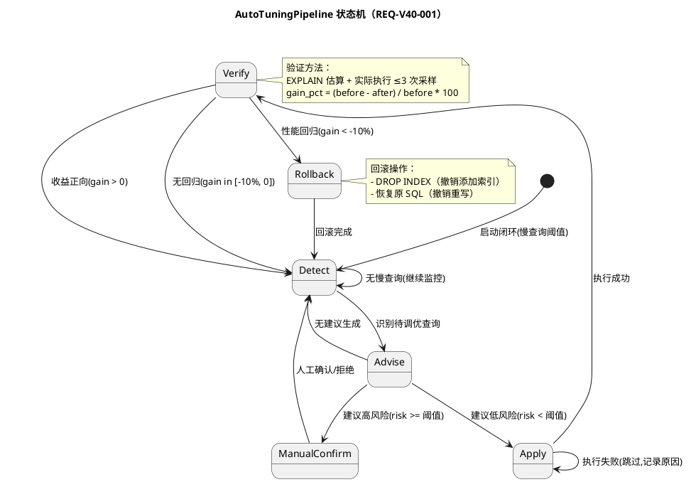
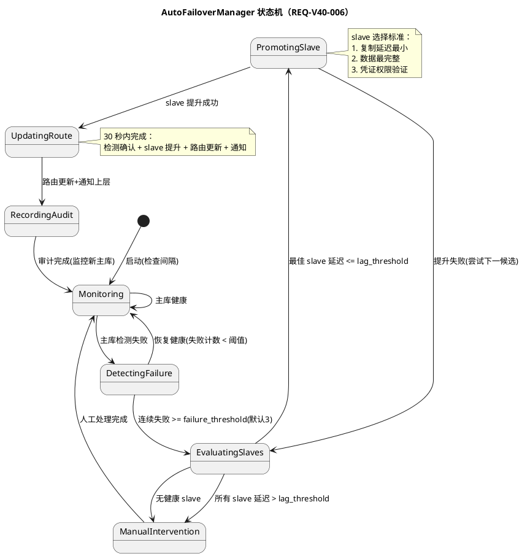
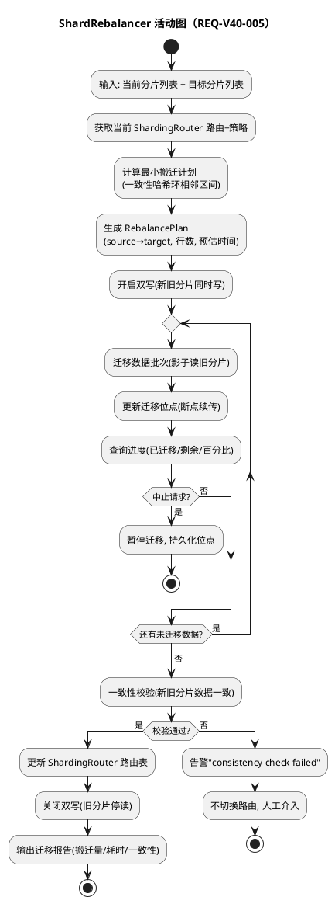

# sz-orm v4.0.0 技术设计文档

> 版本：v4.0.0（AI 自动调优闭环 + 多 LLM 模型 + 混合搜索 + 数据 lineage + 分片 rebalance + failover 自动化 + 服务网格 + GraphQL 深度集成 + CDC）
> 基线：v3.9.0（criterion benchmark 套件 + semver/API 稳定性 + 数据验证框架 + 迁移 dry-run/影响分析 + CI/CD 模板 + 流式导出，6760+ tests passed 0 failed）
> 日期：2026-08-11
> 文档定位：技术设计（How to build），对应需求规格 `spec.md`（What to build）
> 设计约束：无 Breaking Change（9 个 feature gate 隔离）+ 优先复用既有能力 + 五方言覆盖 + 每项设计附 file:line 代码证据 + unsafe 零容忍 + 禁止占位实现
> 需求依赖：REQ-V40-002（多 LLM）→ REQ-V40-001（AI 调优，提供 LlmProvider）；REQ-V40-009（CDC）→ REQ-V40-008（GraphQL Subscription 数据源）；其余独立
> 证据验证：本文档所有 file:line 证据均已通过源码读取验证（2026-08-11），遵循 AGENTS.md 审计合规铁律

---

# 一、需求与存量功能关系分析

## 1.1 需求功能与存量功能对比

### 1.1.1 已实现功能（可直接复用）

| 需求功能 | 存量功能 | 代码位置 | 匹配度 |
|---------|---------|---------|--------|
| REQ-V40-001 统一查询优化器 | `UnifiedQueryOptimizer`（rule + llm hint 聚合，零次执行 LLM 建议） | `packages/sz-orm-ai/src/query_plan_optimizer.rs:515` | 75% |
| REQ-V40-001 优化器配置 | `OptimizerConfig`（enable_llm/api_key/model/timeout） | `packages/sz-orm-ai/src/query_plan_optimizer.rs:177` | 75% |
| REQ-V40-001 LLM 配置构造 | `with_llm(api_key, model)`（OpenAI 兼容） | `packages/sz-orm-ai/src/query_plan_optimizer.rs:207` | 50% |
| REQ-V40-001 索引建议器 | `IndexAdvisor`（规则型 + 可选 LLM，不自动执行） | `packages/sz-orm-ai/src/index_advisor.rs:100` | 75% |
| REQ-V40-001 重写建议器 | `RewriteAdvisor`（sqlparser AST + 可选 LLM） | `packages/sz-orm-ai/src/rewrite_advisor.rs:89` | 75% |
| REQ-V40-001 EXPLAIN 解析器 | `ExplainPlanParser` trait（5 方言：MySQL/PG/SQLite/Oracle/MSSQL） | `packages/sz-orm-ai/src/explain_parser.rs:50` | 100% |
| REQ-V40-002 既有 OpenAI 调用 | `OptimizerConfig::with_llm`（OpenAI 兼容 API） | `packages/sz-orm-ai/src/query_plan_optimizer.rs:207` | 50% |
| REQ-V40-002 既有 Embedding | `real_embedding.rs`（OpenAI 兼容 embedding） | `packages/sz-orm-ai/src/real_embedding.rs` | 50% |
| REQ-V40-003 pgvector 向量存储 | `PgVectorStore` trait（create_collection/search/CRUD） | `packages/sz-orm-vector/src/lib.rs:189` | 100% |
| REQ-V40-003 向量搜索结果 | `SearchResult`（id/score/vector/text/metadata） | `packages/sz-orm-vector/src/lib.rs:113` | 100% |
| REQ-V40-003 向量距离度量 | `VectorMetric`（Cosine/Euclidean/DotProduct） | `packages/sz-orm-vector/src/lib.rs:145` | 100% |
| REQ-V40-003 全文搜索 ES | `elasticsearch_provider.rs` | `packages/sz-orm-search/src/elasticsearch_provider.rs` | 100% |
| REQ-V40-003 全文搜索 OpenSearch | `opensearch_provider.rs` | `packages/sz-orm-search/src/opensearch_provider.rs` | 100% |
| REQ-V40-003 全文搜索 Meilisearch | `meilisearch_provider.rs` | `packages/sz-orm-search/src/meilisearch_provider.rs` | 100% |
| REQ-V40-004 哈希链审计条目 | `HashChainEntry`（prev_hash/current_hash/entry） | `packages/sz-orm-audit/src/lib.rs:691` | 50% |
| REQ-V40-004 哈希链审计器 | `HashChainAuditor`（防篡改审计链） | `packages/sz-orm-audit/src/lib.rs:778` | 50% |
| REQ-V40-004 审计链验证 | `verify() -> Result<(), String>` | `packages/sz-orm-audit/src/lib.rs:862` | 50% |
| REQ-V40-005 分片策略 | `ShardingStrategy`（Hash/Range/Date/Enum/List/Directory/Composite） | `packages/sz-orm-sharding/src/lib.rs:60` | 100% |
| REQ-V40-005 分片路由器 | `ShardingRouter`（路由 key → shard） | `packages/sz-orm-sharding/src/lib.rs:130` | 75% |
| REQ-V40-005 增强分片 | `enhanced.rs`（增强分片能力） | `packages/sz-orm-sharding/src/enhanced.rs` | 75% |
| REQ-V40-005 跨分片事务 | `cross_shard_tx.rs`（跨分片事务协调） | `packages/sz-orm-sharding/src/cross_shard_tx.rs` | 75% |
| REQ-V40-006 Slave 健康状态 | `SlaveHealth`（Healthy/Unhealthy/Drained） | `packages/sz-orm-rw/src/lib.rs:37` | 100% |
| REQ-V40-006 健康检查器 | `HealthChecker`（failure_threshold/recovery_cooldown） | `packages/sz-orm-rw/src/lib.rs:219` | 75% |
| REQ-V40-006 读写分离路由器 | `ReadWriteRouter`（master/slaves/strategy/health_checker） | `packages/sz-orm-rw/src/lib.rs:331` | 75% |
| REQ-V40-006 既有手动 failover 测试 | `test_router_failover_to_master_when_all_unhealthy` | `packages/sz-orm-rw/src/lib.rs:911` | 75% |
| REQ-V40-007 指标注册中心 | `MetricsRegistry`（Counter/Gauge/Histogram） | `packages/sz-orm-observability/src/lib.rs:250` | 100% |
| REQ-V40-007 metrics 访问控制 | `MetricsAccessControl`（IP 白名单/Bearer/Basic） | `packages/sz-orm-observability/src/lib.rs:443` | 100% |
| REQ-V40-007 限流熔断器 | `sz-orm-limit`（运行时动态调优） | `packages/sz-orm-limit/src/lib.rs` | 75% |
| REQ-V40-007 分布式追踪 | `sz-orm-tracing`（OTLP + 4 种采样） | `packages/sz-orm-tracing/src/lib.rs` | 100% |
| REQ-V40-008 GraphQL Schema | `GraphQLSchema`（types/queries/mutations） | `packages/sz-orm-graphql/src/lib.rs:36` | 75% |
| REQ-V40-008 GraphQL Server | `GraphQLServer`（含 `#[cfg(feature="real")]` async-graphql dynamic::Schema） | `packages/sz-orm-graphql/src/lib.rs:182` | 75% |
| REQ-V40-008 批量加载器 trait | `BatchLoader<K, V>`（batch_load） | `packages/sz-orm-graphql/src/dataloader.rs:74` | 100% |
| REQ-V40-008 DataLoader | `DataLoader<K, V>`（N+1 消除，单 tick 合并） | `packages/sz-orm-graphql/src/dataloader.rs:89` | 100% |
| REQ-V40-008 既有 async-graphql 依赖 | `async-graphql = { version = "7", optional = true }`（real feature） | `packages/sz-orm-graphql/Cargo.toml:31` | 75% |
| REQ-V40-008 GraphQL 复杂度限制 | `complexity.rs` | `packages/sz-orm-graphql/src/complexity.rs` | 75% |
| REQ-V40-008 GraphQL schema 生成 | `schema_gen.rs` | `packages/sz-orm-graphql/src/schema_gen.rs` | 75% |
| REQ-V40-008 GraphQL extensions | `extensions.rs`（错误扩展） | `packages/sz-orm-graphql/src/extensions.rs` | 75% |
| REQ-V40-009 消息队列 Kafka | `real_kafka.rs` | `packages/sz-orm-queue/src/real_kafka.rs` | 100% |
| REQ-V40-009 消息队列 NATS | `real_nats.rs` | `packages/sz-orm-queue/src/real_nats.rs` | 100% |
| REQ-V40-009 消息队列 Pulsar | `real_pulsar.rs` | `packages/sz-orm-queue/src/real_pulsar.rs` | 100% |
| REQ-V40-009 消息队列 ActiveMQ | `real_activemq.rs` | `packages/sz-orm-queue/src/real_activemq.rs` | 100% |
| REQ-V40-009 消息队列 RabbitMQ | `lapin_rabbitmq.rs` | `packages/sz-orm-queue/src/lapin_rabbitmq.rs` | 100% |
| REQ-V40-009 消息队列 RocketMQ | `rocketmq.rs` | `packages/sz-orm-queue/src/rocketmq.rs` | 100% |
| REQ-V40-009 SQL 审计日志 | `sz-orm-audit`（可作 CDC 数据源） | `packages/sz-orm-audit/src/lib.rs` | 50% |
| REQ-V40-008 Keyset 分页 | `QueryBuilder::keyset_after`（cursor-based） | `packages/sz-orm-core/src/query.rs:986` | 100% |
| 全需求 feature gate 模式 | prod-ready 14 子 feature + v3.9.0 4 feature（默认关闭） | `packages/sz-orm-core/Cargo.toml:85-119` | 100% |

### 1.1.2 需要扩展的功能

| 需求功能 | 存量功能 | 差异说明 | 扩展方向 |
|---------|---------|---------|---------|
| REQ-V40-001 自动执行建议 | `UnifiedQueryOptimizer` 仅生成建议，零次执行（`:515` 注释明确"无 execute_sql 方法"） | 缺 Apply 阶段（自动创建索引/重写 SQL）+ Verify 阶段（对比前后耗时）+ 回归回滚 | 新增 `AutoTuningPipeline` 编排既有优化器，新增 `apply_suggestion`/`verify_tuning`/`rollback` 方法；既有 `UnifiedQueryOptimizer` 保留不动 |
| REQ-V40-001 慢查询检测 | `ExplainPlanParser`（`:50`）解析 EXPLAIN 但不主动采集慢查询日志 | 缺慢查询日志采集 + 阈值过滤 + 待调优查询队列 | 新增 `SlowQueryDetector`，复用既有 `ExplainPlanParser` 解析，不重复实现 5 方言解析 |
| REQ-V40-002 多 provider 抽象 | `OptimizerConfig::with_llm`（`:207`）硬编码 OpenAI 兼容 API | 缺 `LlmProvider` trait 抽象 + Claude/Gemini/Ollama provider + 统一配置切换 + fallback | 新增 `LlmProvider` trait + 4 provider 实现；既有 `with_llm` 包装为 `OpenAIProvider`，签名不变 |
| REQ-V40-002 运行时热切换 | `OptimizerConfig` 为 `Clone` 结构体，无运行时切换机制 | 缺 `ArcSwap<LlmProvider>` 热切换 + 能力路由（NL2SQL→Claude，Embedding→OpenAI） | 新增 `LlmRouter`（`ArcSwap` 持有当前 provider），复用既有 `OptimizerConfig` 作为初始配置 |
| REQ-V40-003 三源融合排序 | `PgVectorStore`（`:189`）与 ES/OpenSearch/Meilisearch provider 独立运行，无联合查询 | 缺 `HybridSearcher` 融合层 + RRF/加权/级联排序 + 并行查询 + 部分降级 | 新增 `HybridSearcher`，复用既有 `PgVectorStore` + ES provider 作为三源，`tokio::join!` 并行查询 |
| REQ-V40-003 结构化过滤下推 | 既有向量/全文搜索无过滤下推接口 | 缺将结构化过滤（`price < 1000`）下推到 pgvector WHERE + ES filter | 新增 `FilterPushdown` 适配层，将 `QueryBuilder` WHERE 条件转换为各源过滤语法 |
| REQ-V40-004 字段级血缘 | `HashChainAuditor`（`:778`）为 SQL 审计哈希链，非字段级血缘图 | 缺 `LineageTracker` + `LineageGraph`（DAG）+ SQL 依赖解析 + 影响分析 + 溯源 | 新增 `LineageTracker` 与既有 `HashChainAuditor` 并行，lineage 变更可选写入审计链 |
| REQ-V40-005 自动 rebalance | `ShardingRouter`（`:130`）为静态路由，无扩缩容迁移 | 缺 `ShardRebalancer` + 最小搬迁量计算 + 断点续传 + 双写/影子读 | 新增 `ShardRebalancer` 编排既有 `ShardingRouter`，rebalance 完成后更新路由表，不修改路由策略 |
| REQ-V40-006 自动 failover | `HealthChecker`（`:219`）+ `ReadWriteRouter`（`:331`）有手动 failover（`:911` 测试），无自动编排 | 缺 `AutoFailoverManager` + 自动检测循环 + slave 选择 + 数据丢失评估 + 通知 | 新增 `AutoFailoverManager` 调用既有 `HealthChecker` 检测 + `ReadWriteRouter` 路由更新，不修改既有逻辑 |
| REQ-V40-007 服务网格适配 | `MetricsRegistry`（`:250`）+ `sz-orm-tracing` + `sz-orm-limit` 有可观测性/熔断，无网格配置生成 | 缺 `ServiceMeshAdapter` + xDS/CRD 生成 + mTLS 策略 + sidecar 注入 + 流量治理 | 新增 `ServiceMeshAdapter` trait + Istio/Linkerd 实现，复用既有 `MetricsRegistry` 接入 metrics |
| REQ-V40-008 async-graphql 深度集成 | `GraphQLServer`（`:182`）已通过 `real` feature 引入 `async-graphql = "7"`（`Cargo.toml:31`），有 `dynamic::Schema` | 缺 Subscription/Relay/Federation/工单化错误深度集成，当前仅 basic Query/Mutation | 新增 `async-graphql-integration` feature，扩展既有 `real` feature，复用 `DataLoader`（`:89`）+ `keyset_after`（`query.rs:986`） |
| REQ-V40-009 CDC 捕获 | `sz-orm-queue`（6 provider）有消息队列分发，`sz-orm-audit` 有审计日志，无变更捕获 | 缺 `CdcCapturer` + `ChangeEvent` + WAL/binlog 读取 + Exactly-Once + 断点续传 + 五方言 | 新增 `CdcCapturer` + 5 方言捕获器，复用既有 `sz-orm-queue` 6 provider 分发，不重复实现消息队列 |

### 1.1.3 需要新增的功能或接口

#### 模块 A：REQ-V40-001 AI 自动调优闭环

| 功能点 | 输入 | 输出 | 核心逻辑 | 依赖 |
|--------|------|------|---------|------|
| AutoTuningPipeline | `AutoTuningConfig { slow_query_threshold, risk_threshold, max_suggestions }` | `AutoTuningReport`（四阶段报告） | 编排 Detect→Advise→Apply→Verify 四阶段循环 | 既有 `UnifiedQueryOptimizer:515`、`IndexAdvisor:100`、`RewriteAdvisor:89`、`ExplainPlanParser:50` |
| SlowQueryDetector | 慢查询阈值 + Connection | `Vec<SlowQueryInfo>` | 采集慢查询日志 + EXPLAIN 解析识别全表扫描/索引缺失 | 既有 `ExplainPlanParser:50`（5 方言） |
| apply_suggestion | `TuningSuggestion` + Connection | `ApplyResult` | 按建议类型执行（创建索引/重写 SQL），低风险自动执行，高风险标记待确认 | 既有 `Connection::execute`（`pool.rs`） |
| verify_tuning | 调优前 SQL + 调优后 SQL + Connection | `VerifyResult { before_ms, after_ms, gain_pct, is_regression }` | EXPLAIN 估算 + 实际执行 ≤3 次采样，对比耗时 | 既有 `ExplainPlanParser:50` |
| rollback_suggestion | 已执行建议 + Connection | `Result<(), DbError>` | 回滚已执行建议（DROP INDEX/恢复原 SQL） | 既有 `Connection::execute` |

#### 模块 B：REQ-V40-002 多 LLM 模型支持

| 功能点 | 输入 | 输出 | 核心逻辑 | 依赖 |
|--------|------|------|---------|------|
| LlmProvider trait | `prompt` + `LlmConfig` | `Result<LlmResponse>` | 统一 LLM 调用接口（complete + embed） | 无（新 trait） |
| ClaudeProvider | `LlmConfig { api_key, model }` | `LlmResponse` | 调用 Anthropic Claude API（claude-3-opus/sonnet/haiku） | `reqwest`（HTTP 客户端） |
| GeminiProvider | `LlmConfig { api_key, model }` | `LlmResponse` | 调用 Google Gemini API（gemini-1.5-pro/flash） | `reqwest` |
| LocalLlamaProvider | `LlmConfig { api_base=localhost:11434 }` | `LlmResponse` | 调用本地 Ollama HTTP API，无外部网络 | `reqwest` |
| OpenAIProvider | `LlmConfig { api_key, model }` | `LlmResponse` | 包装既有 `OptimizerConfig::with_llm`（`:207`） | 既有 `OptimizerConfig:177`、`real_embedding.rs` |
| LlmRouter | `LlmConfig` + 能力路由表 | `Arc<dyn LlmProvider>` | `ArcSwap` 持有当前 provider，运行时热切换，fallback 到备用 | 上述 4 provider |

#### 模块 C：REQ-V40-003 混合搜索

| 功能点 | 输入 | 输出 | 核心逻辑 | 依赖 |
|--------|------|------|---------|------|
| HybridSearcher | `HybridQuery { vector, fulltext, structured, strategy, top_k }` | `Vec<HybridSearchResult>` | 三源并行查询（`tokio::join!`）+ 融合排序 + 降级 | 既有 `PgVectorStore:189`、ES/OpenSearch/Meilisearch provider |
| RRF 融合 | 三源 `Vec<SearchResult>` | `Vec<HybridSearchResult>` | RRF 公式：`score = Σ 1/(60 + rank_i)`，按融合 score 降序 | 既有 `SearchResult:113` |
| 加权融合 | 三源 `Vec<SearchResult>` + 权重 | `Vec<HybridSearchResult>` | `score = Σ weight_i × normalized_score_i` | 既有 `SearchResult:113` |
| 级联融合 | 三源 `Vec<SearchResult>` | `Vec<HybridSearchResult>` | 先向量召回 → 全文精排 → 结构化过滤 | 既有 `SearchResult:113` |
| FilterPushdown | `QueryBuilder` WHERE 条件 | 各源过滤语法 | 将结构化过滤下推到 pgvector WHERE + ES filter | 既有 `QueryBuilder`（`query.rs`） |

#### 模块 D：REQ-V40-004 数据 lineage

| 功能点 | 输入 | 输出 | 核心逻辑 | 依赖 |
|--------|------|------|---------|------|
| LineageTracker | SQL 语句 + 方言 | `Result<LineageUpdate>` | 解析 SQL（INSERT/UPDATE/CREATE VIEW/MATERIALIZED VIEW）提取表/字段依赖，增量更新图 | `sqlparser`（既有依赖） |
| LineageGraph | 节点（table.column）+ 边（依赖） | DAG | 有向无环图，环路检测，增量更新 | 无（新数据结构） |
| impact_analysis | 表/字段 | `Vec<LineageNode>` | 正向图遍历，输出下游受影响表/字段/报表 | `LineageGraph` |
| origin_analysis | 表/字段 | `Vec<LineageNode>` | 反向图遍历，输出源头表/字段 | `LineageGraph` |
| export_graph | 格式（DOT/JSON/GraphML） | `String` | 序列化 lineage 图为标准格式 | 无 |
| lineage 审计集成 | lineage 变更事件 | 审计链条目 | 可选写入既有 `HashChainAuditor`（`:778`） | 既有 `HashChainAuditor:778`、`HashChainEntry:691` |

#### 模块 E：REQ-V40-005 分片自动 rebalance

| 功能点 | 输入 | 输出 | 核心逻辑 | 依赖 |
|--------|------|------|---------|------|
| ShardRebalancer | 当前分片列表 + 目标分片列表 + `ShardingStrategy` | `RebalancePlan` | 计算最小搬迁量（一致性哈希环相邻区间/范围分片边界） | 既有 `ShardingRouter:130`、`ShardingStrategy:60` |
| 迁移计划执行 | `RebalancePlan` + Connection | `RebalanceReport` | 分批迁移，双写开启/影子读/批次迁移/双写关闭/路由更新 | 既有 `ShardingRouter:130`、`cross_shard_tx.rs` |
| 断点续传 | 持久化迁移位点 | 恢复迁移 | 位点持久化，中断后从断点继续 | 无（新位点管理） |
| 进度查询 | rebalance 任务 ID | `RebalanceProgress { migrated, remaining, pct, eta }` | 查询迁移进度，支持中止/恢复 | 无 |
| 一致性校验 | 新旧分片数据 | `ConsistencyReport` | 迁移完成后校验新旧分片数据一致性 | 既有 `ShardingRouter:130` |

#### 模块 F：REQ-V40-006 数据库 failover 自动化

| 功能点 | 输入 | 输出 | 核心逻辑 | 依赖 |
|--------|------|------|---------|------|
| AutoFailoverManager | `FailoverConfig { check_interval, failure_threshold, lag_threshold }` + `ReadWriteRouter` | `FailoverEvent` | 持续监控主库 + 故障检测 + slave 选择 + 提升 + 路由更新 + 通知 | 既有 `HealthChecker:219`、`ReadWriteRouter:331`、`SlaveHealth:37` |
| slave 选择 | slave 列表 + 复制延迟 | 最佳 slave | 选择复制延迟最小 + 数据最完整的 slave | 既有 `SlaveHealth:37` |
| 数据丢失评估 | slave 复制延迟 + 阈值 | `DataLossRisk { lag, is_safe }` | 延迟 ≤ 阈值自动切换，> 阈值告警人工确认 | 无 |
| failover 审计 | `FailoverEvent` | 审计日志 | 记录故障时间/检测确认/提升 slave/丢失评估/操作者 | 既有 `sz-orm-audit` |
| 脑裂检测 | 旧主库 + 新主库 | `SplitBrainStatus` | 检测双主，旧主降级为 slave 或隔离 | 既有 `HealthChecker:219` |

#### 模块 G：REQ-V40-007 服务网格集成

| 功能点 | 输入 | 输出 | 核心逻辑 | 依赖 |
|--------|------|------|---------|------|
| ServiceMeshAdapter trait | `MeshConfig` | 网格配置（YAML） | 统一网格配置生成接口 | 无（新 trait） |
| IstioAdapter | `MeshConfig { mtls, traffic, sidecar }` | Istio CRD（VirtualService/DestinationRule/PeerAuthentication） | 生成 Istio CRD YAML | 无 |
| LinkerdAdapter | `MeshConfig` | Linkerd policy YAML | 生成 Linkerd 策略 YAML | 无 |
| mTLS 策略 | 模式（STRICT/PERMISSIVE） | PeerAuthentication/Policy | 默认 STRICT，服务间通信加密 | 无 |
| 流量治理 | 策略（金丝雀/蓝绿/熔断/重试） | VirtualService/DestinationRule | 金丝雀按百分比路由，蓝绿按版本切换，熔断复用既有 `sz-orm-limit` | 既有 `sz-orm-limit`（熔断器） |
| 可观测性接入 | 网格 metrics/traces | Prometheus + OTLP | 复用既有 `MetricsRegistry:250` + `sz-orm-tracing` | 既有 `MetricsRegistry:250`、`sz-orm-tracing` |

#### 模块 H：REQ-V40-008 GraphQL 深度集成

| 功能点 | 输入 | 输出 | 核心逻辑 | 依赖 |
|--------|------|------|---------|------|
| async-graphql Schema 对接 | 既有 `GraphQLSchema:36` | `async_graphql::Schema` | 将既有 schema 转换为 async-graphql Schema，复用 `DataLoader:89` | 既有 `GraphQLSchema:36`、`DataLoader:89`、`async-graphql = "7"`（`Cargo.toml:31`） |
| Subscription 支持 | 变更事件流 | `async_graphql::Subscription` | 基于 WebSocket/SSE，订阅 CDC ChangeEvent 推送 | REQ-V40-009 `CdcCapturer`（依赖） |
| Relay 分页 | `first`/`after` cursor | `Connection { edges, pageInfo }` | cursor-based 分页，复用既有 `keyset_after:986` | 既有 `QueryBuilder::keyset_after`（`query.rs:986`） |
| Federation 联邦 | 多服务 schema | 联邦网关 schema | `_entities`/`_service` 查询，schema 合并 | `async-graphql` Federation 扩展 |
| 工单化错误处理 | GraphQL 错误 | `Error { code, category, ticket_id }` | async-graphql Error extensions，错误含错误码/分类/工单 ID | 既有 `extensions.rs` |

#### 模块 I：REQ-V40-009 CDC 变更数据捕获

| 功能点 | 输入 | 输出 | 核心逻辑 | 依赖 |
|--------|------|------|---------|------|
| CdcCapturer | `CdcConfig { tables, dialect, downstream }` | `Stream<ChangeEvent>` | 从 WAL/binlog/逻辑复制/触发器读取变更，构造 ChangeEvent | 无（新捕获器） |
| ChangeEvent | 变更记录 | `ChangeEvent { op, before, after, ts, txid, table, schema }` | 统一变更事件结构 | 无 |
| PostgreSQL WAL 捕获 | 逻辑复制槽 | `Stream<ChangeEvent>` | 通过 PostgreSQL 逻辑复制协议读取 WAL | `tokio-postgres` replication |
| MySQL binlog 捕获 | binlog 位点 | `Stream<ChangeEvent>` | 通过 binlog 协议读取变更 | `mysql_binlog` 或自实现 |
| SQLite 触发器捕获 | 触发器钩子 | `Stream<ChangeEvent>` | 通过 SQLite update_hook 捕获变更 | `rusqlite` update_hook |
| Oracle LogMiner 捕获 | LogMiner | `Stream<ChangeEvent>` | 通过 Oracle LogMiner 读取 redo log | Oracle JDBC/ODPI-C |
| MSSQL CDC 捕获 | CDC 表 | `Stream<ChangeEvent>` | 通过 MSSQL CDC/变更跟踪读取 | MSSQL CDC API |
| Exactly-Once 去重 | `ChangeEvent` + TransactionId | 去重后事件 | TransactionId 幂等去重 + 消费位点管理 | 无 |
| 断点续传 | `CdcCheckpoint` | 恢复捕获 | 位点持久化（WAL LSN/binlog GTID），重启续传 | 无 |
| 下游分发 | `ChangeEvent` + 下游配置 | 分发结果 | 并行分发到消息队列（6 provider）+ HTTP webhook | 既有 `sz-orm-queue` 6 provider |
| ChangeEvent 脱敏 | `ChangeEvent` + 脱敏规则 | 脱敏后事件 | 对 Before/After 敏感字段应用 `DataMasker::apply` | 既有 `DataMasker`（`sz-orm-masking`） |

## 1.2 存量功能详细分析

### 1.2.1 UnifiedQueryOptimizer（统一查询优化器）

- **接口契约**：`UnifiedQueryOptimizer::new(config) -> Self`（`:524`），内部持有 `rule_optimizer: QueryOptimizer` + `config: OptimizerConfig` + `llm_optimizer: Option<LlmOptimizer>`（`:515-518`）；LLM 建议仅展示零次执行（`:512` 注释"系统零次执行"），无 `execute_sql` 方法（`:514` 注释）
- **业务规则**：规则分析始终执行（离线无外部依赖）；LLM 建议在 `enable_llm=true` 且 `api_key` 存在时执行；LLM 未配置/调用失败/超时时自动降级纯规则引擎（`:508`）；发送给 LLM 的 SQL 经 `SqlSanitizer` 脱敏（`:513`）
- **扩展点**：`OptimizerConfig`（`:177`）公开字段（api_key/api_base/model/timeout_secs/max_tokens/enable_llm），`with_llm`（`:207`）构造 OpenAI 兼容配置，`with_api_base`（`:219`）可自定义 API base
- **约束**：LLM 调用须超时控制（`timeout_secs`，默认 10 秒）；SQL 须脱敏后发送 LLM
- **复用结论**：v4.0.0 `AutoTuningPipeline` 复用 `UnifiedQueryOptimizer` 生成建议（Advise 阶段），新增 Apply/Verify 阶段编排，不修改既有优化器

### 1.2.2 IndexAdvisor / RewriteAdvisor / ExplainPlanParser（建议与解析）

- **接口契约**：`IndexAdvisor`（`index_advisor.rs:100`，`llm_enabled: bool`）基于 sqlparser 解析 + 慢查询日志生成索引建议，所有建议为 DDL 文本不自动执行（`:99` 注释）；`RewriteAdvisor`（`rewrite_advisor.rs:89`）基于 AST 识别可优化模式生成重写建议，不自动重写（`:88` 注释）；`ExplainPlanParser` trait（`explain_parser.rs:50`）`parse(&self, explain_output: &str) -> Result<Vec<ExplainSignal>, AiError>` + `dialect(&self) -> &'static str`，5 方言实现
- **业务规则**：`IndexAdvisor`/`RewriteAdvisor` 规则型分析 + 可选 LLM 建议；`ExplainPlanParser` 解析失败返回 `AiError` 不静默忽略（`:55`）
- **扩展点**：`ExplainPlanParser` trait 可扩展新方言；`IndexAdvisor`/`RewriteAdvisor` 可扩展新规则
- **复用结论**：v4.0.0 `AutoTuningPipeline` Advise 阶段复用 `IndexAdvisor`/`RewriteAdvisor` 生成建议，Detect 阶段复用 `ExplainPlanParser` 解析 EXPLAIN，不重复实现

### 1.2.3 PgVectorStore / SearchResult / VectorMetric（向量搜索）

- **接口契约**：`PgVectorStore` trait（`lib.rs:189`）`async fn create_collection(name, dimension, metric)` + 搜索/CRUD 方法，`#[async_trait]`；`SearchResult`（`:113`）含 `id/score/vector/text/metadata`；`VectorMetric`（`:145`）`Cosine`/`Euclidean`/`DotProduct` + `pg_operator()` 映射
- **业务规则**：所有方法 async，适用于真实数据库 I/O（`:187` 注释）；`VectorMetric` 映射 pgvector 操作符（`:153`）
- **扩展点**：`PgVectorStore` trait 可实现新向量存储后端；`SearchResult.metadata` 为 `HashMap<String, serde_json::Value>` 可携带任意元数据
- **复用结论**：v4.0.0 `HybridSearcher` 向量源复用既有 `PgVectorStore`，融合层不重复实现向量搜索；`SearchResult` 作为统一结果基础

### 1.2.4 HashChainAuditor（哈希链审计）

- **接口契约**：`HashChainAuditor`（`lib.rs:778`）`entries: Mutex<Vec<HashChainEntry>>`；`HashChainEntry`（`:691`）含 `prev_hash/current_hash/entry: SqlAuditContext`；`verify() -> Result<(), String>`（`:862`）验证链完整性
- **业务规则**：每条记录的 `current_hash` = SHA-256(prev_hash + entry)；篡改会导致 `current_hash` 与下一条 `prev_hash` 不匹配（`:688` 注释）；首条 `prev_hash` 为 `GENESIS_HASH`（`:870`）
- **扩展点**：`SqlAuditContext` 为审计上下文，可扩展 lineage 变更事件
- **复用结论**：v4.0.0 `LineageTracker` 与 `HashChainAuditor` 并行，lineage 变更可选写入审计链（`HashChainEntry.entry` 携带 lineage 事件），不修改既有审计逻辑

### 1.2.5 ShardingRouter / ShardingStrategy（分片路由）

- **接口契约**：`ShardingRouter`（`lib.rs:130`）`strategy: ShardingStrategy` + `shards: Vec<String>`；`ShardingStrategy`（`:60`）枚举 `Hash`/`Range`/`Date`/`Enum`/`List`/`Directory`/`Composite`；`new(strategy, shards)` 构造（`:138`）
- **业务规则**：`Hash`/`Range`/`Date` 三个原始变体路由行为向后兼容（`:58` 注释）；`Enum`/`List`/`Directory`/`Composite` 携带数据（`:57` 注释）
- **扩展点**：`ShardingStrategy` 枚举可扩展新策略；`shards` 字段仅 Hash/Range/Date 使用
- **约束**：路由为静态配置，无动态 rebalance
- **复用结论**：v4.0.0 `ShardRebalancer` 编排既有 `ShardingRouter`，rebalance 完成后更新 `shards` 列表，不修改路由策略；`cross_shard_tx.rs` 用于迁移过程跨分片事务

### 1.2.6 HealthChecker / ReadWriteRouter / SlaveHealth（读写分离与健康检查）

- **接口契约**：`SlaveHealth`（`lib.rs:37`）`Healthy`/`Unhealthy`/`Drained`；`HealthChecker`（`:219`）`states: Mutex<HashMap<String, SlaveHealth>>` + `failure_threshold: u32` + `failure_counts: Mutex<HashMap<String, u32>>` + `recovery_cooldown: Duration`；`ReadWriteRouter`（`:331`）`master: String` + `slaves: Vec<String>` + `strategy: LoadBalanceStrategy` + `health_checker: HealthChecker`
- **业务规则**：连续失败达 `failure_threshold` 标记 Unhealthy（`:221` 注释）；全部 slave Unhealthy 时降级到 master（`:911` 测试 `test_router_failover_to_master_when_all_unhealthy`）；`recovery_cooldown` 控制恢复后重新加入集群（`:225`）
- **扩展点**：`LoadBalanceStrategy` 可扩展负载均衡策略；`HealthChecker` 可扩展健康检查方式
- **复用结论**：v4.0.0 `AutoFailoverManager` 调用既有 `HealthChecker` 检测主库健康，调用 `ReadWriteRouter` 更新路由（提升 slave 为新 master），不修改既有逻辑；手动 failover（`:911`）保留

### 1.2.7 MetricsRegistry / sz-orm-tracing / sz-orm-limit（可观测性与限流）

- **接口契约**：`MetricsRegistry`（`observability/lib.rs:250`）`counters/gauges/histograms: RwLock<HashMap<String, Arc<...>>>` + `metas: RwLock<Vec<MetricMeta>>`；`MetricsAccessControl`（`:443`，`#[cfg(feature = "prod-metrics-acl")]`）`enabled/ip_whitelist/bearer_token/basic_auth`；`sz-orm-tracing` OTLP 分布式追踪 + 4 种采样；`sz-orm-limit` 限流熔断运行时动态调优
- **业务规则**：`MetricsRegistry` 支持 Counter/Gauge/Histogram 三种指标类型；`MetricsAccessControl` 支持 IP 白名单 + Bearer + Basic Auth
- **扩展点**：`MetricMeta` 可扩展指标元数据；`sz-orm-limit` 熔断器可扩展策略
- **复用结论**：v4.0.0 `ServiceMeshAdapter` 复用既有 `MetricsRegistry` 接入网格 metrics（Prometheus 抓取），复用 `sz-orm-tracing` 接入网格 traces（OTLP），复用 `sz-orm-limit` 熔断器实现流量治理熔断

### 1.2.8 GraphQLServer / DataLoader / BatchLoader（GraphQL 与批量加载）

- **接口契约**：`GraphQLSchema`（`graphql/lib.rs:36`）`types/queries/mutations`；`GraphQLServer`（`:182`）`port/schema` + `#[cfg(feature = "real")] dynamic_schema: OnceLock<Result<async_graphql::dynamic::Schema, String>>` + `resolver: Option<SharedDbResolver>`；`BatchLoader<K, V>` trait（`dataloader.rs:74`）`batch_load(keys) -> Result<HashMap<K, V>>`；`DataLoader<K, V>`（`:89`）单 tick 合并多个 load 请求
- **业务规则**：`GraphQLServer` 在 `real` feature 下已集成 `async-graphql = "7"`（`Cargo.toml:31`）+ `async-graphql-axum`（`:32`），使用 `dynamic::Schema`；`DataLoader` 在单个事件循环 tick 内收集多个 load 请求合并为一次批量调用（`:88` 注释）
- **扩展点**：`BatchLoader` trait 可实现新批量加载逻辑；`SharedDbResolver` 可注入 DB 解析器
- **复用结论**：v4.0.0 async-graphql 深度集成扩展既有 `real` feature（新增 `async-graphql-integration` feature），复用 `DataLoader:89` 消除 N+1，复用 `keyset_after`（`query.rs:986`）实现 Relay 分页，不重复实现批量加载

### 1.2.9 sz-orm-queue（消息队列 6 provider）

- **接口契约**：6 个 provider 实现：`real_kafka.rs`（Kafka）、`real_nats.rs`（NATS）、`real_pulsar.rs`（Pulsar）、`real_activemq.rs`（ActiveMQ）、`lapin_rabbitmq.rs`（RabbitMQ，lapin 客户端）、`rocketmq.rs`（RocketMQ）
- **业务规则**：各 provider 独立实现消息队列 publish/subscribe 接口，通过 feature gate 隔离
- **扩展点**：可扩展新消息队列 provider
- **复用结论**：v4.0.0 `CdcCapturer` 下游分发复用既有 `sz-orm-queue` 6 provider，不重复实现消息队列客户端；CDC ChangeEvent 序列化后发送到消息队列

### 1.2.10 prod-ready feature gate 模式

- **接口契约**：14 个子 feature（`sz-orm-core/Cargo.toml:85-98`）+ 1 个总 feature 聚合（`:100-115` `prod-ready = [...]`）+ v3.9.0 4 feature（`:116-119` `benchmark-suite`/`data-validation`/`validate-on-write`/`migration-dry-run`/`streaming-export`）
- **业务规则**：每个子 feature 默认关闭，独立控制一项能力；总 feature 聚合所有子 feature
- **复用结论**：v4.0.0 9 个新 feature（`ai-auto-tuning`/`multi-llm`/`hybrid-search`/`data-lineage`/`shard-rebalance`/`auto-failover`/`service-mesh`/`async-graphql-integration`/`cdc`）遵循此模式，默认全关闭，无 Breaking Change

---

# 二、增量设计方案

## 2.1 实现模型

### 2.1.1 上下文视图

```plantuml
@startuml
title sz-orm v4.0.0 上下文视图（新增能力与外部系统交互）

' === 新增模块 ===
rectangle "sz-orm-ai (扩展)" as ai {
  rectangle "AutoTuningPipeline\n(REQ-V40-001)" as tuning
  rectangle "LlmProvider trait\n(REQ-V40-002)" as llm
  rectangle "LlmRouter" as llm_router
}

rectangle "HybridSearcher\n(REQ-V40-003)" as hybrid
rectangle "LineageTracker\n(REQ-V40-004)" as lineage
rectangle "ShardRebalancer\n(REQ-V40-005)" as rebalancer
rectangle "AutoFailoverManager\n(REQ-V40-006)" as failover
rectangle "ServiceMeshAdapter\n(REQ-V40-007)" as mesh
rectangle "async-graphql 深度集成\n(REQ-V40-008)" as agql
rectangle "CdcCapturer\n(REQ-V40-009)" as cdc

' === 既有模块（复用） ===
rectangle "UnifiedQueryOptimizer\n(既有 :515)" as uqo
rectangle "IndexAdvisor/RewriteAdvisor\n(既有 :100/:89)" as advisor
rectangle "ExplainPlanParser\n(既有 :50)" as parser
rectangle "PgVectorStore\n(既有 :189)" as vec
rectangle "ES/OpenSearch/Meilisearch\n(既有)" as fulltext
rectangle "HashChainAuditor\n(既有 :778)" as audit
rectangle "ShardingRouter\n(既有 :130)" as router
rectangle "HealthChecker/ReadWriteRouter\n(既有 :219/:331)" as rw
rectangle "MetricsRegistry\n(既有 :250)" as metrics
rectangle "DataLoader\n(既有 :89)" as loader
rectangle "sz-orm-queue 6 provider\n(既有)" as queue
rectangle "DataMasker\n(既有)" as masker

' === 外部系统 ===
database "MySQL/PG/SQLite\n/Oracle/MSSQL" as db
cloud "Claude/Gemini/\nOpenAI/Ollama" as llmprov
cloud "Istio/Linkerd" as smesh
rectangle "async-graphql\n(crate v7)" as agqlcrate

' === 交互关系 ===
tuning --> uqo : 复用建议生成
tuning --> advisor : 复用 Index/Rewrite
tuning --> parser : 复用 EXPLAIN 解析
tuning --> llm_router : LLM 增强(可选)
llm --> llmprov : provider 路由(HTTPS)
llm_router --> llm : 选择 provider

hybrid --> vec : 向量搜索(async)
hybrid --> fulltext : 全文搜索(async)
hybrid --> db : 结构化查询(async)

lineage --> db : 解析 SQL 依赖
lineage --> audit : 可选写入审计链

rebalancer --> router : 复用路由+更新路由表
rebalancer --> db : 分批迁移数据

failover --> rw : 复用健康检查+路由更新
failover --> db : 健康检测/提升 slave
failover --> audit : failover 事件审计

mesh --> smesh : 生成 xDS/CRD
mesh --> metrics : 复用 metrics 接入
mesh --> db : 流量治理

agql --> agqlcrate : 对接 async-graphql
agql --> loader : 复用 DataLoader(N+1 消除)
agql --> cdc : Subscription 数据源

cdc --> db : 读取 WAL/binlog(五方言)
cdc --> queue : 分发到下游(复用 6 provider)
cdc --> masker : ChangeEvent 脱敏

@enduml
```



**通信协议与调用频率**：
| 交互 | 协议 | 频率 |
|------|------|------|
| AutoTuningPipeline → DB | SQL（参数化） | 调优周期内（低频） |
| LlmProvider → Claude/Gemini/OpenAI | HTTPS REST | 每次建议生成（按需） |
| LlmProvider → Ollama | HTTP localhost:11434 | 每次建议生成（按需） |
| HybridSearcher → pgvector/ES/SQL | async SQL/HTTP | 每次搜索（高频） |
| CdcCapturer → DB WAL/binlog | 逻辑复制/binlog 协议 | 持续流式（高频） |
| CdcCapturer → 消息队列 | AMQP/Kafka/NATS 协议 | 每次变更事件（高频） |
| AutoFailoverManager → DB | SQL ping | 健康检测周期（中频） |
| ServiceMeshAdapter → Istio/Linkerd | xDS/gRPC | 配置生成时（低频） |

### 2.1.2 服务/组件总体架构

```plantuml
@startuml
title sz-orm v4.0.0 新增模块总体架构

package "sz-orm-ai (扩展)" {
  component "AutoTuningPipeline\n[ai-auto-tuning]" as tuning
  component "SlowQueryDetector" as detector
  component "TuningApplier" as applier
  component "TuningVerifier" as verifier
  component "LlmProvider trait\n[multi-llm]" as llm_trait
  component "ClaudeProvider" as claude
  component "GeminiProvider" as gemini
  component "LocalLlamaProvider" as ollama
  component "OpenAIProvider" as openai
  component "LlmRouter" as llm_router
}

package "sz-orm-vector (扩展)" {
  component "HybridSearcher\n[hybrid-search]" as hybrid
  component "RrfFusion" as rrf
  component "WeightedFusion" as weighted
  component "CascadeFusion" as cascade
  component "FilterPushdown" as pushdown
}

package "sz-orm-audit (扩展)" {
  component "LineageTracker\n[data-lineage]" as lineage
  component "LineageGraph" as graph
  component "LineageSqlParser" as sqlparser
}

package "sz-orm-sharding (扩展)" {
  component "ShardRebalancer\n[shard-rebalance]" as rebalancer
  component "MigrationPlanner" as planner
  component "MigrationExecutor" as executor
  component "CheckpointStore" as checkpoint
}

package "sz-orm-rw (扩展)" {
  component "AutoFailoverManager\n[auto-failover]" as failover
  component "SlaveSelector" as selector
  component "DataLossAssessor" as assessor
  component "SplitBrainDetector" as splitbrain
}

package "sz-orm-observability (扩展)" {
  component "ServiceMeshAdapter\n[service-mesh]" as mesh
  component "IstioAdapter" as istio
  component "LinkerdAdapter" as linkerd
  component "MtlsPolicy" as mtls
  component "TrafficGovernance" as traffic
}

package "sz-orm-graphql (扩展)" {
  component "AsyncGraphqlIntegration\n[async-graphql-integration]" as agql
  component "SubscriptionSupport" as subscription
  component "RelayPagination" as relay
  component "FederationSupport" as federation
  component "TicketErrorExt" as ticketerr
}

package "sz-orm-queue (扩展)" {
  component "CdcCapturer\n[cdc]" as cdc
  component "ChangeEvent" as event
  component "WalCapturer (PG)" as wal
  component "BinlogCapturer (MySQL)" as binlog
  component "TriggerCapturer (SQLite)" as trigger
  component "LogMinerCapturer (Oracle)" as logminer
  component "CdcCapturer (MSSQL)" as mssqlcdc
  component "CheckpointManager" as ckptmgr
  component "ExactlyOnceDedup" as dedup
}

' 内部依赖
tuning --> detector
tuning --> applier
tuning --> verifier
tuning --> llm_router : LLM 增强(可选)
llm_router --> llm_trait
llm_trait <|.. claude
llm_trait <|.. gemini
llm_trait <|.. ollama
llm_trait <|.. openai

hybrid --> rrf
hybrid --> weighted
hybrid --> cascade
hybrid --> pushdown

lineage --> graph
lineage --> sqlparser

rebalancer --> planner
rebalancer --> executor
executor --> checkpoint

failover --> selector
failover --> assessor
failover --> splitbrain

mesh --> istio
mesh --> linkerd
istio --> mtls
istio --> traffic

agql --> subscription
agql --> relay
agql --> federation
agql --> ticketerr

cdc --> event
cdc --> wal
cdc --> binlog
cdc --> trigger
cdc --> logminer
cdc --> mssqlcdc
cdc --> ckptmgr
cdc --> dedup

' 跨需求依赖
subscription --> cdc : REQ-V40-009 提供 Subscription 数据源

@enduml
```



### 2.1.3 实现设计文档

#### 需求依赖关系

```plantuml
@startuml
title v4.0.0 需求依赖关系与开发顺序

REQ-V40-002 "多 LLM 模型\n(P0)" --> REQ-V40-001 "AI 自动调优闭环\n(P0)" : 提供 LlmProvider\n(先开发 002)
REQ-V40-009 "CDC\n(P2)" --> REQ-V40-008 "GraphQL 深度集成\n(P2)" : 提供 Subscription 数据源\n(先开发 009)

REQ-V40-003 "混合搜索\n(P1)" : 独立
REQ-V40-004 "数据 lineage\n(P1)" : 独立
REQ-V40-005 "分片 rebalance\n(P1)" : 独立
REQ-V40-006 "failover 自动化\n(P1)" : 独立
REQ-V40-007 "服务网格集成\n(P2)" : 独立

note bottom of REQ-V40-002
  开发顺序：
  1. REQ-V40-002（多 LLM，P0，基座）
  2. REQ-V40-001（AI 调优，P0，依赖 002）
  3. REQ-V40-003~006（P1，可并行）
  4. REQ-V40-009（CDC，P2，先于 008）
  5. REQ-V40-007（服务网格，P2，独立）
  6. REQ-V40-008（GraphQL，P2，依赖 009）
end note

@enduml
```

#### AI 自动调优闭环状态机



#### failover 状态机



#### 分片 rebalance 活动图



## 2.2 接口设计

### 2.2.1 总体设计

v4.0.0 新增接口按需求项分为 9 组，每组通过 feature gate 隔离，默认关闭。接口稳定性等级遵循 `docs/API-STABILITY.md:38-71` 三层分级。

| 接口组 | feature gate | 核心接口 | 稳定性 | 依赖既有 |
|--------|-------------|---------|--------|---------|
| REQ-V40-001 AI 调优 | `ai-auto-tuning` | `AutoTuningPipeline`、`SlowQueryDetector`、`TuningApplier`、`TuningVerifier` | Experimental | `UnifiedQueryOptimizer:515`、`IndexAdvisor:100`、`RewriteAdvisor:89`、`ExplainPlanParser:50` |
| REQ-V40-002 多 LLM | `multi-llm` | `LlmProvider` trait、`LlmRouter`、`LlmConfig` | Experimental | `OptimizerConfig:177`、`with_llm:207`、`real_embedding.rs` |
| REQ-V40-003 混合搜索 | `hybrid-search` | `HybridSearcher`、`HybridQuery`、`FusionStrategy` | Experimental | `PgVectorStore:189`、`SearchResult:113`、ES/OpenSearch/Meilisearch provider |
| REQ-V40-004 数据 lineage | `data-lineage` | `LineageTracker`、`LineageGraph`、`LineageNode` | Experimental | `HashChainAuditor:778`、`HashChainEntry:691` |
| REQ-V40-005 分片 rebalance | `shard-rebalance` | `ShardRebalancer`、`RebalancePlan`、`RebalanceProgress` | Experimental | `ShardingRouter:130`、`ShardingStrategy:60`、`cross_shard_tx.rs` |
| REQ-V40-006 failover | `auto-failover` | `AutoFailoverManager`、`FailoverConfig`、`FailoverEvent` | Experimental | `HealthChecker:219`、`ReadWriteRouter:331`、`SlaveHealth:37` |
| REQ-V40-007 服务网格 | `service-mesh` | `ServiceMeshAdapter` trait、`MeshConfig`、`MtlsMode` | Experimental | `MetricsRegistry:250`、`sz-orm-tracing`、`sz-orm-limit` |
| REQ-V40-008 GraphQL | `async-graphql-integration` | `AsyncGraphqlBridge`、`SubscriptionSource`、`RelayConnection` | Experimental | `GraphQLServer:182`、`DataLoader:89`、`BatchLoader:74`、`keyset_after:986`、`async-graphql = "7"`（`Cargo.toml:31`） |
| REQ-V40-009 CDC | `cdc` | `CdcCapturer`、`ChangeEvent`、`CdcCheckpoint`、`CdcConfig` | Experimental | `sz-orm-queue` 6 provider、`DataMasker`（`sz-orm-masking`） |

**接口变更策略**：
1. 所有新增接口标记 `#[cfg(feature = "...")]`，默认不编译
2. 新增 trait/struct 为 Experimental 等级，后续稳定后升级为 Stable
3. 既有接口签名完全不变，仅新增方法通过 feature gate 隔离
4. 既有 `OptimizerConfig::with_llm`（`:207`）内部包装为 `OpenAIProvider`，签名不变

### 2.2.2 接口清单

#### REQ-V40-002 多 LLM 模型支持（先于 REQ-V40-001 开发）

```rust
// packages/sz-orm-ai/src/llm_provider.rs（新增，#[cfg(feature = "multi-llm")]）

/// LLM provider 统一抽象（spec 5.2.1 规则 1）
///
/// 所有 LLM 后端实现此 trait，统一调用接口。
/// 支持 complete（文本补全）+ embed（向量嵌入）两种能力。
#[async_trait]
pub trait LlmProvider: Send + Sync {
    /// 文本补全：发送 prompt，返回 LLM 响应
    async fn complete(&self, prompt: &str, config: &LlmRequestConfig) -> Result<LlmResponse, LlmError>;

    /// 向量嵌入：将文本转换为向量
    async fn embed(&self, text: &str) -> Result<Vec<f32>, LlmError>;

    /// 返回 provider 名称（claude/gemini/ollama/openai）
    fn provider_name(&self) -> &'static str;

    /// 返回当前模型名称
    fn model(&self) -> &str;
}

/// LLM 统一配置（spec 6.2 输出对象 2）
#[derive(Debug, Clone)]
pub struct LlmConfig {
    pub provider: LlmProviderKind,         // Claude/Gemini/Ollama/OpenAI
    pub model: String,                     // claude-3-sonnet / gemini-1.5-pro / llama3 / gpt-4o
    pub api_key: Option<String>,           // 本地模型 None
    pub api_base: String,                  // 默认按 provider 推断；Ollama 默认 localhost:11434
    pub timeout: Duration,                 // 默认 30s
    pub max_tokens: u32,                   // 默认 2000
    pub fallback: Option<Box<LlmConfig>>,  // 备用 provider（spec 4.2 规则 2 fallback）
}

/// LLM provider 类型
#[derive(Debug, Clone, Copy, PartialEq, Eq)]
pub enum LlmProviderKind { Claude, Gemini, Ollama, OpenAI }

/// LLM 请求配置
#[derive(Debug, Clone)]
pub struct LlmRequestConfig { pub temperature: f32, pub max_tokens: u32 }

/// LLM 响应
#[derive(Debug, Clone)]
pub struct LlmResponse { pub text: String, pub usage: LlmUsage }
#[derive(Debug, Clone)]
pub struct LlmUsage { pub prompt_tokens: u32, pub completion_tokens: u32 }
```

```rust
// packages/sz-orm-ai/src/llm_router.rs（新增，#[cfg(feature = "multi-llm")]）

/// LLM 路由器：运行时热切换 provider（spec 5.2.1 规则 3）
///
/// 使用 ArcSwap 持有当前 provider，支持运行时动态切换无需重启。
/// 支持按能力路由（NL2SQL→Claude，Embedding→OpenAI）。
pub struct LlmRouter {
    /// 当前 provider（ArcSwap 支持热切换）
    current: arc_swap::ArcSwap<dyn LlmProvider>,
    /// 按能力路由表（capability → provider）
    capability_routes: RwLock<HashMap<LlmCapability, Arc<dyn LlmProvider>>>,
}

impl LlmRouter {
    /// 从配置创建路由器
    pub fn new(config: &LlmConfig) -> Result<Self, LlmError> { /* ... */ }

    /// 运行时热切换 provider（spec 5.2.1 规则 3 验收条件）
    pub fn switch(&self, config: &LlmConfig) -> Result<(), LlmError> { /* ... */ }

    /// 按能力路由（spec 5.2.1 规则 4）
    pub async fn complete_by_capability(
        &self, cap: LlmCapability, prompt: &str, config: &LlmRequestConfig,
    ) -> Result<LlmResponse, LlmError> { /* ... */ }
}

/// AI 能力分类（按能力路由）
#[derive(Debug, Clone, Copy, PartialEq, Eq, Hash)]
pub enum LlmCapability { Nl2Sql, QueryOptimization, IndexAdvice, RewriteAdvice, Embedding }
```

**业务说明**：`LlmProvider` trait 抽象 LLM 调用，4 provider（Claude/Gemini/Ollama/OpenAI）实现 trait。`LlmRouter` 使用 `ArcSwap` 持有当前 provider 支持运行时热切换，`capability_routes` 支持按能力路由。
**前置条件**：`LlmConfig.provider` 与 `api_key`（本地模型除外）已配置。
**后置条件**：调用后返回 `LlmResponse`；provider 不可用时 fallback 到备用 provider。
**异常映射**：`LlmError::Timeout` → 降级/fallback；`LlmError::Auth` → 不重试；`LlmError::ConnectionRefused` → 提示启动 Ollama。

**既有 OpenAI 包装**（spec 4.5 规则 5）：
```rust
// packages/sz-orm-ai/src/llm_provider/openai.rs（新增）
/// 将既有 OptimizerConfig::with_llm（:207）包装为 OpenAIProvider
pub struct OpenAIProvider { config: OptimizerConfig }
impl LlmProvider for OpenAIProvider { /* 委托既有 OptimizerConfig 调用 */ }
```
**证据**：既有 `OptimizerConfig:177`、`with_llm:207`、`real_embedding.rs` 保留不动，`OpenAIProvider` 包装既有调用。

#### REQ-V40-001 AI 自动调优闭环

```rust
// packages/sz-orm-ai/src/auto_tuning.rs（新增，#[cfg(feature = "ai-auto-tuning")]）

/// AI 自动调优闭环（spec 5.1.1 规则 1 四阶段）
pub struct AutoTuningPipeline {
    detector: SlowQueryDetector,
    optimizer: Arc<UnifiedQueryOptimizer>,   // 复用既有 :515
    index_advisor: Arc<IndexAdvisor>,         // 复用既有 :100
    rewrite_advisor: Arc<RewriteAdvisor>,     // 复用既有 :89
    llm_router: Option<Arc<LlmRouter>>,       // 可选 LLM 增强（REQ-V40-002）
    config: AutoTuningConfig,
}

/// 调优配置
#[derive(Debug, Clone)]
pub struct AutoTuningConfig {
    pub slow_query_threshold: Duration,   // 默认 1s
    pub risk_threshold: RiskLevel,        // 默认 Low（只自动执行低风险）
    pub max_suggestions: usize,           // 默认 10
    pub regression_threshold: f64,        // 默认 0.1（10% 回退）
    pub verify_samples: u32,              // 默认 3（≤3 次采样）
}

/// 调优建议
#[derive(Debug, Clone)]
pub struct TuningSuggestion {
    pub suggestion_type: SuggestionType,  // Index/Rewrite/Schema
    pub sql_before: String,
    pub sql_after: String,
    pub expected_gain: Option<f32>,
    pub risk: RiskLevel,                  // Low/Medium/High
    pub reason: String,
}

/// 调优报告（spec 6.2 输出对象 1）
#[derive(Debug, Clone)]
pub struct AutoTuningReport {
    pub detect: DetectReport,             // 检测阶段
    pub advise: AdviseReport,             // 建议阶段
    pub apply: ApplyReport,               // 执行阶段
    pub verify: VerifyReport,             // 验证阶段
    pub adoption_rate: f64,               // 采纳率
    pub regressions: Vec<RegressionRecord>,
}

impl AutoTuningPipeline {
    /// 执行完整调优闭环（Detect→Advise→Apply→Verify）
    pub async fn run(&self, conn: &dyn Connection) -> Result<AutoTuningReport, TuningError> { /* ... */ }

    /// Detect 阶段：采集慢查询 + EXPLAIN 解析（复用 ExplainPlanParser:50）
    async fn detect(&self, conn: &dyn Connection) -> Result<DetectReport, TuningError> { /* ... */ }

    /// Advise 阶段：生成建议（复用 IndexAdvisor:100 / RewriteAdvisor:89 / UnifiedQueryOptimizer:515）
    async fn advise(&self, slow_queries: &[SlowQueryInfo]) -> Result<AdviseReport, TuningError> { /* ... */ }

    /// Apply 阶段：自动执行低风险建议（spec 5.1.1 规则 4）
    async fn apply(&self, conn: &dyn Connection, suggestions: &[TuningSuggestion]) -> Result<ApplyReport, TuningError> { /* ... */ }

    /// Verify 阶段：对比调优前后耗时（spec 5.1.1 规则 5）
    async fn verify(&self, conn: &dyn Connection, applied: &[AppliedSuggestion]) -> Result<VerifyReport, TuningError> { /* ... */ }

    /// 回滚已执行建议（spec 4.2 规则 1 回归回滚）
    async fn rollback(&self, conn: &dyn Connection, suggestions: &[AppliedSuggestion]) -> Result<(), TuningError> { /* ... */ }
}
```

**业务说明**：`AutoTuningPipeline` 编排四阶段闭环。Detect 复用 `ExplainPlanParser:50` 解析 EXPLAIN 识别慢查询；Advise 复用 `IndexAdvisor:100`/`RewriteAdvisor:89`/`UnifiedQueryOptimizer:515` 生成建议；Apply 按风险阈值自动执行低风险建议；Verify 对比前后耗时，回归 ≥10% 自动回滚。
**前置条件**：`AutoTuningConfig` 已配置；Connection 可用。
**后置条件**：输出 `AutoTuningReport` 含四阶段报告；回归建议已回滚。
**异常映射**：`TuningError::LlmUnavailable` → 降级纯规则建议；`TuningError::ApplyFailed` → 跳过该建议；`TuningError::Regression` → 自动回滚。
**证据**：复用 `UnifiedQueryOptimizer:515`（`:512` 注释"零次执行"由 Apply 阶段补执行）、`IndexAdvisor:100`（`:99` 注释"不自动执行"由 Apply 阶段补执行）、`RewriteAdvisor:89`、`ExplainPlanParser:50`。

#### REQ-V40-003 混合搜索

```rust
// packages/sz-orm-vector/src/hybrid_search.rs（新增，#[cfg(feature = "hybrid-search")]）

/// 混合搜索器（spec 5.3.1 规则 1 三源融合）
pub struct HybridSearcher {
    vector_store: Arc<dyn PgVectorStore>,      // 复用既有 :189
    fulltext_store: Arc<dyn FulltextSearch>,   // 复用既有 ES/OpenSearch/Meilisearch
    structured_conn: Arc<dyn Connection>,       // 结构化查询（SQL）
}

/// 混合查询
#[derive(Debug, Clone)]
pub struct HybridQuery {
    pub vector: Option<VectorQuery>,           // 向量搜索（语义相似度）
    pub fulltext: Option<FulltextQuery>,       // 全文搜索（关键词匹配）
    pub structured: Option<StructuredQuery>,   // 结构化过滤（SQL WHERE）
    pub strategy: FusionStrategy,              // 融合策略
    pub top_k: usize,                          // 返回 top_k
}

/// 融合策略（spec 5.3.1 规则 2）
#[derive(Debug, Clone, Copy)]
pub enum FusionStrategy {
    Rrf { k: u32 },                             // RRF（默认 k=60）
    Weighted { vector_w: f32, fulltext_w: f32, structured_w: f32 },
    Cascade,                                    // 级联：向量召回→全文精排→结构化过滤
}

/// 混合搜索结果（spec 6.2 输出对象 3）
#[derive(Debug, Clone)]
pub struct HybridSearchResult {
    pub id: String,
    pub score: f32,                             // 融合后 score
    pub source: SearchResultSource,             // Vector/Fulltext/Structured/Hybrid
    pub metadata: HashMap<String, serde_json::Value>,
}

/// 源降级标记
#[derive(Debug, Clone, Default)]
pub struct DegradationStatus {
    pub vector_degraded: bool,
    pub fulltext_degraded: bool,
    pub structured_degraded: bool,
}

impl HybridSearcher {
    /// 混合搜索（三源并行 + 融合排序，spec 5.3.1 规则 4）
    pub async fn search(&self, query: &HybridQuery) -> Result<HybridSearchResponse, HybridError> {
        // tokio::join! 并行查询三源（spec 5.3.1 规则 4）
        // 部分源失败时降级（spec 5.3.1 规则 5）
        // 结构化过滤下推（spec 5.3.1 规则 6）
    }
}

/// 混合搜索响应
#[derive(Debug, Clone)]
pub struct HybridSearchResponse {
    pub results: Vec<HybridSearchResult>,
    pub degradation: DegradationStatus,
    pub elapsed_ms: u64,
}
```

**业务说明**：`HybridSearcher` 并行查询向量（`PgVectorStore:189`）、全文（ES/OpenSearch/Meilisearch）、结构化（SQL）三源，通过 `tokio::join!` 并行执行，融合排序（RRF/加权/级联）返回统一结果。部分源失败时降级为可用源结果。
**前置条件**：三源至少一源可用；`HybridQuery` 至少含一种查询。
**后置条件**：返回 `HybridSearchResponse` 含融合结果 + 降级标记；端到端 ≤200ms（单机基准，结果集 ≤1000）。
**异常映射**：`HybridError::SourceTimeout` → 该源标记 TIMEOUT，其他源正常融合；`HybridError::AllSourcesFailed` → 返回错误。
**证据**：复用 `PgVectorStore:189`、`SearchResult:113`、`elasticsearch_provider.rs`/`opensearch_provider.rs`/`meilisearch_provider.rs`。

#### REQ-V40-004 数据 lineage

```rust
// packages/sz-orm-audit/src/lineage.rs（新增，#[cfg(feature = "data-lineage")]）

/// lineage 追踪器（spec 5.4.1 规则 1 字段级血缘）
pub struct LineageTracker {
    graph: Arc<RwLock<LineageGraph>>,
    auditor: Option<Arc<HashChainAuditor>>,    // 可选写入审计链（复用既有 :778）
}

/// lineage 图（DAG，spec 6.2 输出对象 4）
#[derive(Debug, Clone, Default)]
pub struct LineageGraph {
    nodes: HashMap<LineageNodeId, LineageNode>,
    edges: HashSet<LineageEdge>,
}

/// lineage 节点（table.column）
#[derive(Debug, Clone, PartialEq, Eq, Hash)]
pub struct LineageNodeId { pub table: String, pub column: String }
#[derive(Debug, Clone)]
pub struct LineageNode { pub id: LineageNodeId, pub node_type: NodeType }

/// lineage 边（source → target 依赖关系）
#[derive(Debug, Clone, PartialEq, Eq, Hash)]
pub struct LineageEdge { pub source: LineageNodeId, pub target: LineageNodeId, pub edge_type: EdgeType }

impl LineageTracker {
    /// 追踪 SQL 依赖，增量更新 lineage 图（spec 5.4.1 规则 2）
    pub async fn track_sql(&self, sql: &str, dialect: DbType) -> Result<LineageUpdate, LineageError> { /* ... */ }

    /// 影响分析：变更某字段，输出下游受影响列表（spec 5.4.1 规则 3）
    pub fn impact_analysis(&self, node: &LineageNodeId) -> Vec<LineageNode> { /* 正向图遍历 */ }

    /// 溯源分析：某字段来自哪些源头（spec 5.4.1 规则 4）
    pub fn origin_analysis(&self, node: &LineageNodeId) -> Vec<LineageNode> { /* 反向图遍历 */ }

    /// 导出 lineage 图（spec 5.4.1 规则 6）
    pub fn export(&self, format: LineageExportFormat) -> Result<String, LineageError> { /* ... */ }
}
```

**业务说明**：`LineageTracker` 解析 SQL（INSERT/UPDATE/CREATE VIEW/MATERIALIZED VIEW）提取表/字段依赖，增量更新 `LineageGraph`（DAG）。`impact_analysis` 正向遍历输出下游受影响，`origin_analysis` 反向遍历输出源头。可选写入既有 `HashChainAuditor:778` 审计链。
**前置条件**：SQL 可被 sqlparser 解析；方言支持。
**后置条件**：`LineageGraph` 增量更新；环路检测（A→B→A 标记可疑不加入 DAG）。
**异常映射**：`LineageError::ParseFailed` → 跳过该 SQL；`LineageError::CycleDetected` → 告警不加入 DAG。
**证据**：复用 `HashChainAuditor:778`、`HashChainEntry:691`（lineage 变更可选写入审计链）；`sqlparser` 既有依赖。

#### REQ-V40-005 分片自动 rebalance

```rust
// packages/sz-orm-sharding/src/rebalancer.rs（新增，#[cfg(feature = "shard-rebalance")]）

/// 分片自动 rebalance（spec 5.5.1 规则 1 扩缩容自动迁移）
pub struct ShardRebalancer {
    router: Arc<RwLock<ShardingRouter>>,    // 复用既有 :130，rebalance 完成后更新
    checkpoint_store: Arc<dyn CheckpointStore>,
}

/// 迁移计划（spec 6.2 输出对象 5）
#[derive(Debug, Clone)]
pub struct RebalancePlan {
    pub migrations: Vec<ShardMigration>,
    pub total_rows: u64,
    pub estimated_time: Duration,
    pub strategy: ShardingStrategy,          // 复用既有 :60
}

#[derive(Debug, Clone)]
pub struct ShardMigration {
    pub source_shard: String,
    pub target_shard: String,
    pub row_count: u64,
    pub estimated_time: Duration,
}

/// 迁移进度（spec 5.5.1 规则 6）
#[derive(Debug, Clone)]
pub struct RebalanceProgress {
    pub migrated_rows: u64,
    pub remaining_rows: u64,
    pub percentage: f64,
    pub eta: Duration,
    pub is_paused: bool,
}

impl ShardRebalancer {
    /// 计算最小搬迁计划（spec 5.5.1 规则 2）
    pub fn plan_migration(&self, current: &[String], target: &[String]) -> RebalancePlan { /* ... */ }

    /// 执行迁移（双写 + 影子读 + 断点续传，spec 5.5.1 规则 3/4）
    pub async fn execute(&self, plan: &RebalancePlan) -> Result<RebalanceReport, RebalanceError> { /* ... */ }

    /// 查询进度（spec 5.5.1 规则 6）
    pub fn progress(&self, task_id: &str) -> Option<RebalanceProgress> { /* ... */ }

    /// 中止迁移
    pub fn pause(&self, task_id: &str) -> Result<(), RebalanceError> { /* ... */ }

    /// 恢复迁移（断点续传，spec 5.5.1 规则 3）
    pub async fn resume(&self, task_id: &str) -> Result<RebalanceReport, RebalanceError> { /* ... */ }
}
```

**业务说明**：`ShardRebalancer` 计算最小搬迁计划（一致性哈希环相邻区间/范围分片边界），分批迁移数据，双写保证查询不中断，断点续传支持中断恢复。迁移完成更新既有 `ShardingRouter:130` 路由表。
**前置条件**：`ShardingRouter` 已配置；新旧分片列表有效。
**后置条件**：`ShardingRouter` 路由表更新；一致性校验通过。
**异常映射**：`RebalanceError::NodeFailed` → 暂停等待恢复；`RebalanceError::ConsistencyFailed` → 不切换路由告警人工介入。
**证据**：复用 `ShardingRouter:130`、`ShardingStrategy:60`、`cross_shard_tx.rs`（迁移过程跨分片事务）。

#### REQ-V40-006 数据库 failover 自动化

```rust
// packages/sz-orm-rw/src/auto_failover.rs（新增，#[cfg(feature = "auto-failover")]）

/// 自动 failover 管理器（spec 5.6.1 规则 1/2）
pub struct AutoFailoverManager {
    router: Arc<RwLock<ReadWriteRouter>>,    // 复用既有 :331
    health_checker: Arc<HealthChecker>,       // 复用既有 :219
    config: FailoverConfig,
    auditor: Option<Arc<HashChainAuditor>>,   // failover 事件审计
}

/// failover 配置
#[derive(Debug, Clone)]
pub struct FailoverConfig {
    pub check_interval: Duration,             // 健康检测间隔
    pub failure_threshold: u32,               // 连续失败阈值（默认 3）
    pub lag_threshold: Duration,              // 复制延迟阈值（默认 1s）
    pub switch_timeout: Duration,             // 切换超时（默认 30s）
}

/// failover 事件（spec 6.2 输出对象 6）
#[derive(Debug, Clone)]
pub struct FailoverEvent {
    pub failure_time: DateTime,
    pub detection_confirms: u32,              // 检测确认次数
    pub promoted_slave: String,
    pub old_master: String,
    pub data_loss_assessment: DataLossRisk,
    pub recovery_time: Option<Duration>,
    pub operator: FailoverOperator,           // Auto/Manual
}

#[derive(Debug, Clone)]
pub struct DataLossRisk { pub lag: Duration, pub estimated_lost_rows: u64, pub is_safe: bool }

impl AutoFailoverManager {
    /// 启动自动 failover 监控循环
    pub async fn start(&self) -> Result<(), FailoverError> { /* 持续监控主库健康 */ }

    /// 手动触发 failover
    pub async fn trigger(&self) -> Result<FailoverEvent, FailoverError> { /* ... */ }

    /// 评估 slave 复制延迟，选择最佳 slave（spec 5.6.1 规则 2）
    async fn select_best_slave(&self) -> Result<String, FailoverError> { /* ... */ }

    /// 数据丢失风险评估（spec 5.6.1 规则 3）
    async fn assess_data_loss(&self, slave: &str) -> DataLossRisk { /* ... */ }

    /// 脑裂检测（spec 5.6.3 异常 3）
    async fn detect_split_brain(&self) -> SplitBrainStatus { /* ... */ }
}
```

**业务说明**：`AutoFailoverManager` 持续监控主库健康（复用 `HealthChecker:219`），连续失败达阈值触发 failover，选择复制延迟最小的 slave（复用 `SlaveHealth:37`）提升为新主库，更新 `ReadWriteRouter:331` 路由，记录审计日志。数据丢失风险高时告警人工确认。
**前置条件**：`ReadWriteRouter` 已配置 master + slaves；`HealthChecker` 已初始化。
**后置条件**：30 秒内路由切换完成；failover 事件记录审计。
**异常映射**：`FailoverError::NoHealthySlave` → 告警人工介入；`FailoverError::PromotionFailed` → 尝试下一候选；`FailoverError::SplitBrain` → 旧主降级。
**证据**：复用 `HealthChecker:219`、`ReadWriteRouter:331`、`SlaveHealth:37`；手动 failover `test_router_failover_to_master_when_all_unhealthy:911` 保留。

#### REQ-V40-007 服务网格集成

```rust
// packages/sz-orm-observability/src/service_mesh.rs（新增，#[cfg(feature = "service-mesh")]）

/// 服务网格适配器 trait（spec 5.7.1 规则 1）
pub trait ServiceMeshAdapter: Send + Sync {
    /// 生成网格配置（xDS/CRD/Policy）
    fn generate_config(&self, config: &MeshConfig) -> Result<MeshConfigOutput, MeshError>;
    /// 返回网格类型
    fn mesh_type(&self) -> &'static str;
}

/// 网格配置（spec 6.2 输出对象 7）
#[derive(Debug, Clone)]
pub struct MeshConfig {
    pub mesh: MeshType,                       // Istio/Linkerd
    pub mtls: MtlsMode,                       // STRICT/PERMISSIVE（默认 STRICT）
    pub traffic: TrafficGovernance,
    pub sidecar_injection: SidecarConfig,
}

#[derive(Debug, Clone, Copy)]
pub enum MeshType { Istio, Linkerd }
#[derive(Debug, Clone, Copy, Default)]
pub enum MtlsMode { #[default] Strict, Permissive }

#[derive(Debug, Clone)]
pub struct TrafficGovernance {
    pub canary: Option<CanaryConfig>,         // 金丝雀发布
    pub blue_green: Option<BlueGreenConfig>,  // 蓝绿部署
    pub circuit_breaker: Option<CircuitConfig>, // 熔断（复用 sz-orm-limit）
    pub retry: Option<RetryConfig>,           // 重试
}

/// Istio 适配器
pub struct IstioAdapter { metrics: Arc<MetricsRegistry> }  // 复用既有 :250
impl ServiceMeshAdapter for IstioAdapter { /* 生成 VirtualService/DestinationRule/PeerAuthentication */ }

/// Linkerd 适配器
pub struct LinkerdAdapter { metrics: Arc<MetricsRegistry> }
impl ServiceMeshAdapter for LinkerdAdapter { /* 生成 Linkerd policy */ }
```

**业务说明**：`ServiceMeshAdapter` trait 抽象服务网格配置生成，`IstioAdapter`/`LinkerdAdapter` 实现 trait。默认 mTLS STRICT 模式。流量治理支持金丝雀/蓝绿/熔断/重试，熔断复用既有 `sz-orm-limit`。metrics/traces 接入既有 `MetricsRegistry:250` + `sz-orm-tracing`。
**前置条件**：`MeshConfig` 已配置。
**后置条件**：生成网格配置 YAML；mTLS 默认 STRICT。
**异常映射**：`MeshError::ControlPlaneUnavailable` → 配置生成正常但标记未应用；`MeshError::MtlsConflict` → 提示配置冲突。
**证据**：复用 `MetricsRegistry:250`、`MetricsAccessControl:443`、`sz-orm-tracing`、`sz-orm-limit`（熔断器）。

#### REQ-V40-008 GraphQL 深度集成

```rust
// packages/sz-orm-graphql/src/async_graphql_integration.rs（新增，#[cfg(feature = "async-graphql-integration")]）

/// async-graphql 深度集成桥接层（spec 5.8.1 规则 1）
pub struct AsyncGraphqlBridge {
    schema: async_graphql::Schema<Query, Mutation, Subscription>,
    dataloader: Arc<DataLoader<String, ModelRow>>,  // 复用既有 :89
}

impl AsyncGraphqlBridge {
    /// 从既有 GraphQLSchema:36 构建 async-graphql Schema
    pub fn from_schema(schema: &GraphQLSchema, resolver: SharedDbResolver) -> Result<Self, GraphqlError> { /* ... */ }

    /// 执行查询（复用 DataLoader 消除 N+1）
    pub async fn execute(&self, query: &str) -> Result<serde_json::Value, GraphqlError> { /* ... */ }
}

/// Subscription 支持（spec 5.8.1 规则 2）
///
/// 基于 CDC ChangeEvent（REQ-V40-009）作为 Subscription 数据源
pub struct SubscriptionSource {
    cdc: Arc<CdcCapturer>,    // 依赖 REQ-V40-009
}

impl async_graphql::Subscription for Subscription {
    /// 订阅数据变更（如 userUpdated）
    async fn user_updated(ctx: &Context<'_>) -> impl Stream<Item = UserUpdatedEvent> { /* ... */ }
}

/// Relay 分页（spec 5.8.1 规则 3）
#[derive(Debug, Clone)]
pub struct RelayConnection<T> {
    pub edges: Vec<RelayEdge<T>>,
    pub page_info: PageInfo,
}
#[derive(Debug, Clone)]
pub struct PageInfo { pub has_next_page: bool, pub has_previous_page: bool, pub start_cursor: Option<String>, pub end_cursor: Option<String> }

/// 工单化错误处理（spec 5.8.1 规则 5）
#[derive(Debug, Clone)]
pub struct TicketError {
    pub code: String,           // 错误码
    pub category: String,       // 错误分类
    pub ticket_id: String,      // 工单 ID
    pub message: String,
}
impl async_graphql::ErrorExtension for TicketError { /* ... */ }
```

**业务说明**：`AsyncGraphqlBridge` 将既有 `GraphQLSchema:36` 转换为 `async_graphql::Schema`，复用 `DataLoader:89` 消除 N+1。Subscription 基于 CDC ChangeEvent（REQ-V40-009 依赖）推送数据变更。Relay 分页复用既有 `keyset_after:986`。工单化错误通过 async-graphql Error extensions 实现。
**前置条件**：`async-graphql = "7"` 已引入（`Cargo.toml:31`，`real` feature）；CDC 已配置（Subscription 依赖）。
**后置条件**：查询关联字段 DataLoader 批量加载无 N+1；Subscription 推送变更事件；Relay 返回 Connection/Edge/PageInfo。
**异常映射**：`GraphqlError::DataLoaderFailed` → 部分结果 + 错误；`GraphqlError::SubscriptionDisconnected` → 清理订阅。
**证据**：复用 `GraphQLServer:182`（已含 `#[cfg(feature="real")] async_graphql::dynamic::Schema`）、`DataLoader:89`、`BatchLoader:74`、`keyset_after:986`；`async-graphql = "7"`（`Cargo.toml:31`）。

#### REQ-V40-009 CDC 变更数据捕获

```rust
// packages/sz-orm-queue/src/cdc.rs（新增，#[cfg(feature = "cdc")]）

/// CDC 变更捕获器（spec 5.9.1 规则 1）
pub struct CdcCapturer {
    capturer: Box<dyn DialectCapturer>,       // 五方言捕获器
    downstream: Vec<DownstreamSink>,           // 下游分发（消息队列 + webhook）
    checkpoint: Arc<CheckpointManager>,
    dedup: ExactlyOnceDedup,
    masker: Option<Arc<DataMasker>>,           // 可选脱敏（复用既有 sz-orm-masking）
}

/// 变更事件（spec 6.2 输出对象 8）
#[derive(Debug, Clone, Serialize, Deserialize)]
pub struct ChangeEvent {
    pub op: ChangeOp,                          // Insert/Update/Delete
    pub before: Option<Row>,                   // 变更前数据
    pub after: Option<Row>,                    // 变更后数据
    pub timestamp: u64,
    pub transaction_id: String,                // 用于 Exactly-Once 去重
    pub table: String,
    pub schema: String,
}

#[derive(Debug, Clone, Copy, Serialize, Deserialize)]
pub enum ChangeOp { Insert, Update, Delete }

/// CDC 配置
#[derive(Debug, Clone)]
pub struct CdcConfig {
    pub tables: Vec<String>,
    pub dialect: DbType,                       // 五方言
    pub downstream: Vec<DownstreamConfig>,
    pub checkpoint_store: CheckpointStoreConfig,
    pub masking: Option<MaskingRuleMap>,       // 可选脱敏
}

/// 消费位点（spec 6.2 输出对象 9）
#[derive(Debug, Clone, Serialize, Deserialize)]
pub struct CdcCheckpoint {
    pub dialect: DbType,
    pub position: CheckpointPosition,          // WalLsn(u64) / BinlogGtid(String) / TriggerSeq(u64)
    pub updated_at: u64,
}

/// 方言捕获器 trait（spec 5.9.1 规则 7 五方言覆盖）
#[async_trait]
pub trait DialectCapturer: Send + Sync {
    async fn start_capture(&self, checkpoint: Option<CdcCheckpoint>) -> Result<Pin<Box<dyn Stream<Item = ChangeEvent> + Send>>, CdcError>;
    fn dialect(&self) -> DbType;
}

// 五方言实现
pub struct WalCapturer { /* PostgreSQL WAL 逻辑复制 */ }
pub struct BinlogCapturer { /* MySQL binlog */ }
pub struct TriggerCapturer { /* SQLite 触发器/更新钩子 */ }
pub struct LogMinerCapturer { /* Oracle LogMiner */ }
pub struct MssqlCdcCapturer { /* MSSQL CDC/变更跟踪 */ }

impl CdcCapturer {
    /// 启动 CDC 捕获 + 分发（spec 5.9.1 规则 1/2）
    pub async fn start(&self) -> Result<(), CdcError> { /* ... */ }

    /// 从断点续传（spec 5.9.1 规则 4）
    pub async fn resume_from_checkpoint(&self) -> Result<(), CdcError> { /* ... */ }
}
```

**业务说明**：`CdcCapturer` 从 WAL（PG）/binlog（MySQL）/触发器（SQLite）/LogMiner（Oracle）/CDC（MSSQL）五方言读取变更，构造 `ChangeEvent`，可选脱敏后并行分发到下游（复用 `sz-orm-queue` 6 provider + HTTP webhook）。`ExactlyOnceDedup` 通过 TransactionId 幂等去重。`CheckpointManager` 管理消费位点支持断点续传。
**前置条件**：WAL/binlog 已配置（PG `wal_level=logical`，MySQL binlog 开启）；下游已配置。
**后置条件**：变更事件实时分发；Exactly-Once 语义保证；位点持久化。
**异常映射**：`CdcError::WalNotConfigured` → 提示配置；`CdcError::DownstreamUnavailable` → 事件缓冲重发；`CdcError::CheckpointFailed` → 暂停捕获告警。
**证据**：复用 `sz-orm-queue` 6 provider（`real_kafka.rs`/`real_nats.rs`/`real_pulsar.rs`/`real_activemq.rs`/`lapin_rabbitmq.rs`/`rocketmq.rs`）；`DataMasker`（`sz-orm-masking`）用于 ChangeEvent 脱敏。

## 2.3 数据模型

### 2.3.1 设计目标

1. **领域对象与 spec.md 术语一致**：`AutoTuningReport`/`LlmConfig`/`HybridSearchResult`/`LineageGraph`/`RebalancePlan`/`FailoverEvent`/`MeshConfig`/`RelayConnection`/`ChangeEvent` 等对象命名与 spec.md 第 6.2 节输出对象完全对齐
2. **支持的业务场景**：9 项需求各自的核心场景（AI 调优闭环/多 provider 路由/三源融合/血缘追踪/分片迁移/故障切换/网格治理/GraphQL 订阅/变更捕获）
3. **与存量数据兼容**：既有 `SearchResult:113`/`SlaveHealth:37`/`ShardingStrategy:60`/`OptimizerConfig:177` 等对象保留不动，新对象通过组合/包装复用
4. **性能目标**：混合搜索 ≤200ms、lineage 解析 ≤100ms/SQL、failover 切换 ≤30s、CDC 捕获 ≤5ms/事件（spec 4.1 DFX 约束）
5. **扩展性目标**：所有核心 trait（`LlmProvider`/`ServiceMeshAdapter`/`DialectCapturer`/`BatchLoader:74`）可扩展新实现

### 2.3.2 模型实现

```plantuml
@startuml
title sz-orm v4.0.0 核心领域对象类图

' === REQ-V40-001 AI 调优 ===
class AutoTuningPipeline {
  +run() : AutoTuningReport
  +detect() : DetectReport
  +advise() : AdviseReport
  +apply() : ApplyReport
  +verify() : VerifyReport
  +rollback()
}
class AutoTuningReport {
  +detect : DetectReport
  +advise : AdviseReport
  +apply : ApplyReport
  +verify : VerifyReport
  +adoption_rate : f64
}
class TuningSuggestion {
  +suggestion_type : SuggestionType
  +sql_before : String
  +sql_after : String
  +risk : RiskLevel
}
AutoTuningPipeline "1" *-- "1" AutoTuningReport
AutoTuningPipeline "1" *-- "*" TuningSuggestion

' === REQ-V40-002 多 LLM ===
interface LlmProvider {
  +complete(prompt, config) : LlmResponse
  +embed(text) : Vec<f32>
  +provider_name() : &str
}
class LlmRouter {
  +switch(config)
  +complete_by_capability(cap, prompt)
}
class LlmConfig {
  +provider : LlmProviderKind
  +model : String
  +api_key : Option<String>
  +fallback : Option<Box<LlmConfig>>
}
LlmProvider <|.. ClaudeProvider
LlmProvider <|.. GeminiProvider
LlmProvider <|.. LocalLlamaProvider
LlmProvider <|.. OpenAIProvider
LlmRouter "1" o-- "1" LlmProvider
LlmConfig "1" o-- "0..1" LlmConfig : fallback

' === REQ-V40-003 混合搜索 ===
class HybridSearcher {
  +search(query) : HybridSearchResponse
}
class HybridQuery {
  +vector : Option<VectorQuery>
  +fulltext : Option<FulltextQuery>
  +structured : Option<StructuredQuery>
  +strategy : FusionStrategy
  +top_k : usize
}
class HybridSearchResult {
  +id : String
  +score : f32
  +source : SearchResultSource
  +metadata : HashMap
}
HybridSearcher "1" *-- "*" HybridSearchResult
HybridSearcher ..> PgVectorStore : 复用
HybridSearcher ..> SearchResult : 复用

' === REQ-V40-004 lineage ===
class LineageTracker {
  +track_sql(sql, dialect)
  +impact_analysis(node) : Vec<LineageNode>
  +origin_analysis(node) : Vec<LineageNode>
  +export(format) : String
}
class LineageGraph {
  +nodes : HashMap<LineageNodeId, LineageNode>
  +edges : HashSet<LineageEdge>
}
LineageTracker "1" *-- "1" LineageGraph
LineageTracker ..> HashChainAuditor : 可选审计

' === REQ-V40-005 rebalance ===
class ShardRebalancer {
  +plan_migration(current, target) : RebalancePlan
  +execute(plan) : RebalanceReport
  +progress(task_id) : RebalanceProgress
  +pause(task_id)
  +resume(task_id)
}
class RebalancePlan {
  +migrations : Vec<ShardMigration>
  +total_rows : u64
  +estimated_time : Duration
}
ShardRebalancer ..> ShardingRouter : 复用+更新
ShardRebalancer "1" *-- "1" RebalancePlan

' === REQ-V40-006 failover ===
class AutoFailoverManager {
  +start()
  +trigger() : FailoverEvent
  +select_best_slave() : String
  +assess_data_loss(slave) : DataLossRisk
  +detect_split_brain()
}
class FailoverEvent {
  +failure_time : DateTime
  +promoted_slave : String
  +data_loss_assessment : DataLossRisk
}
AutoFailoverManager ..> HealthChecker : 复用
AutoFailoverManager ..> ReadWriteRouter : 复用+更新
AutoFailoverManager "1" *-- "*" FailoverEvent

' === REQ-V40-007 服务网格 ===
interface ServiceMeshAdapter {
  +generate_config(config) : MeshConfigOutput
  +mesh_type() : &str
}
class MeshConfig {
  +mesh : MeshType
  +mtls : MtlsMode
  +traffic : TrafficGovernance
}
ServiceMeshAdapter <|.. IstioAdapter
ServiceMeshAdapter <|.. LinkerdAdapter
IstioAdapter ..> MetricsRegistry : 复用

' === REQ-V40-008 GraphQL ===
class AsyncGraphqlBridge {
  +from_schema(schema, resolver)
  +execute(query) : Value
}
class RelayConnection<T> {
  +edges : Vec<RelayEdge<T>>
  +page_info : PageInfo
}
AsyncGraphqlBridge ..> DataLoader : 复用
AsyncGraphqlBridge ..> GraphQLSchema : 复用
AsyncGraphqlBridge ..> CdcCapturer : Subscription 数据源

' === REQ-V40-009 CDC ===
class CdcCapturer {
  +start()
  +resume_from_checkpoint()
}
class ChangeEvent {
  +op : ChangeOp
  +before : Option<Row>
  +after : Option<Row>
  +transaction_id : String
}
interface DialectCapturer {
  +start_capture(checkpoint) : Stream<ChangeEvent>
  +dialect() : DbType
}
DialectCapturer <|.. WalCapturer
DialectCapturer <|.. BinlogCapturer
DialectCapturer <|.. TriggerCapturer
DialectCapturer <|.. LogMinerCapturer
DialectCapturer <|.. MssqlCdcCapturer
CdcCapturer "1" *-- "1" DialectCapturer
CdcCapturer "1" *-- "*" ChangeEvent
CdcCapturer ..> DataMasker : 可选脱敏

' === 既有对象（复用，不修改） ===
class UnifiedQueryOptimizer
class PgVectorStore
class SearchResult
class HashChainAuditor
class ShardingRouter
class HealthChecker
class ReadWriteRouter
class MetricsRegistry
class DataLoader
class GraphQLSchema
class DataMasker

note bottom of UnifiedQueryOptimizer : 既有 :515，保留不动
note bottom of PgVectorStore : 既有 :189，保留不动
note bottom of HashChainAuditor : 既有 :778，保留不动
note bottom of ShardingRouter : 既有 :130，保留不动
note bottom of HealthChecker : 既有 :219，保留不动
note bottom of DataLoader : 既有 :89，保留不动

@enduml
```



**对象生命周期与状态流转**：
| 对象 | 创建 | 状态流转 | 销毁 |
|------|------|---------|------|
| `AutoTuningPipeline` | `new(config)` | Detect→Advise→Apply→Verify→(Rollback?) | 调优完成 |
| `LlmRouter` | `new(config)` | 运行时 `switch()` 热切换 | 应用关闭 |
| `HybridSearcher` | `new(vector, fulltext, structured)` | 无状态（每次 search 独立） | 应用关闭 |
| `LineageGraph` | `default()` | `track_sql` 增量更新 | 应用关闭 |
| `ShardRebalancer` | `new(router, checkpoint)` | plan→execute→(pause→resume?)→complete | rebalance 完成 |
| `AutoFailoverManager` | `new(router, checker, config)` | Monitoring→DetectingFailure→EvaluatingSlaves→PromotingSlave→RecordingAudit | 应用关闭 |
| `CdcCapturer` | `new(config)` | start→(resume_from_checkpoint?)→持续捕获 | 应用关闭 |

**持久化策略**：
| 对象 | 持久化方式 | 说明 |
|------|-----------|------|
| `LineageGraph` | 内存（可选导出 DOT/JSON/GraphML） | 增量更新，重启可从导出文件恢复 |
| `CdcCheckpoint` | 持久化存储（WAL LSN/binlog GTID） | 断点续传必需 |
| `RebalancePlan` 迁移位点 | 持久化存储 | 断点续传必需 |
| `FailoverEvent` | 审计日志（`HashChainAuditor:778`） | 可追溯 |
| `AutoTuningReport` | 结构化报告（JSON） | CI/工具解析 |

## 2.4 feature gate 体系

v4.0.0 新增 9 个 feature gate，遵循既有 prod-ready 模式（`packages/sz-orm-core/Cargo.toml:85-115`），默认全部关闭：

```toml
# packages/sz-orm-ai/Cargo.toml [features] 新增
# v4.0.0：AI 自动调优闭环（Detect→Advise→Apply→Verify 四阶段）
ai-auto-tuning = ["dep:tokio"]
# v4.0.0：多 LLM 模型支持（LlmProvider trait + Claude/Gemini/Ollama/OpenAI）
multi-llm = ["dep:reqwest", "dep:arc-swap"]
```

```toml
# packages/sz-orm-vector/Cargo.toml [features] 新增
# v4.0.0：混合搜索（向量+全文+结构化三源融合 + RRF/加权/级联）
hybrid-search = ["sz-orm-search", "sz-orm-core"]
```

```toml
# packages/sz-orm-audit/Cargo.toml [features] 新增
# v4.0.0：数据 lineage（字段级血缘 DAG + 影响分析 + 溯源）
data-lineage = ["dep:sqlparser"]
```

```toml
# packages/sz-orm-sharding/Cargo.toml [features] 新增
# v4.0.0：分片自动 rebalance（最小搬迁 + 断点续传 + 查询不中断）
shard-rebalance = ["dep:tokio"]
```

```toml
# packages/sz-orm-rw/Cargo.toml [features] 新增
# v4.0.0：数据库 failover 自动化（自动检测 + slave 提升 + 数据丢失评估）
auto-failover = ["dep:tokio"]
```

```toml
# packages/sz-orm-observability/Cargo.toml [features] 新增
# v4.0.0：服务网格集成（Istio/Linkerd + mTLS + 流量治理）
service-mesh = ["sz-orm-limit"]
```

```toml
# packages/sz-orm-graphql/Cargo.toml [features] 新增
# v4.0.0：async-graphql 深度集成（Subscription/Relay/Federation/工单化错误）
# 注意：既有 real feature 已引入 async-graphql = "7"（Cargo.toml:31），本 feature 扩展深度集成
async-graphql-integration = ["real", "sz-orm-queue/cdc"]
```

```toml
# packages/sz-orm-queue/Cargo.toml [features] 新增
# v4.0.0：CDC 变更数据捕获（五方言变更捕获 + Exactly-Once + 断点续传）
cdc = ["dep:tokio", "sz-orm-masking"]
```

**feature gate 隔离原则**：
1. 每个新 feature 默认关闭（`default = [...]` 不含新 feature）
2. 新增代码全部 `#[cfg(feature = "...")]` 门控
3. 新增依赖标记 `optional = true`，仅对应 feature 启用时引入
4. `cargo build` 默认编译行为与 v3.9.0 完全一致（spec 4.5 规则 1）
5. 跨包 feature 依赖通过 `sz-orm-xxx/feature-name` 引用（如 `async-graphql-integration` 依赖 `sz-orm-queue/cdc`）

**feature 组合矩阵**（关键组合）：
| 组合 | 说明 | 依赖关系 |
|------|------|---------|
| `ai-auto-tuning` + `multi-llm` | AI 调优 + LLM 增强 | REQ-V40-002 → REQ-V40-001 |
| `async-graphql-integration` + `cdc` | GraphQL Subscription + CDC 数据源 | REQ-V40-009 → REQ-V40-008 |
| `hybrid-search` | 混合搜索（独立） | 无跨需求依赖 |
| `data-lineage` | 数据 lineage（独立） | 无跨需求依赖 |
| `shard-rebalance` | 分片 rebalance（独立） | 无跨需求依赖 |
| `auto-failover` | failover 自动化（独立） | 无跨需求依赖 |
| `service-mesh` | 服务网格（独立） | 无跨需求依赖 |

## 2.5 兼容性保证

### 2.5.1 API 向后兼容（spec 4.5 规则 1）

| 既有 API | 兼容保证 | 证据 |
|---------|---------|------|
| `UnifiedQueryOptimizer`（`:515`） | 保留不动，新增 `AutoTuningPipeline` 编排 | `query_plan_optimizer.rs:515` |
| `OptimizerConfig::with_llm`（`:207`） | 保留不动，包装为 `OpenAIProvider` | `query_plan_optimizer.rs:207` |
| `PgVectorStore`（`:189`） | 保留不动，新增 `HybridSearcher` 融合 | `sz-orm-vector/src/lib.rs:189` |
| `SearchResult`（`:113`） | 保留不动，`HybridSearchResult` 组合 | `sz-orm-vector/src/lib.rs:113` |
| `HashChainAuditor`（`:778`） | 保留不动，新增 `LineageTracker` 并行 | `sz-orm-audit/src/lib.rs:778` |
| `ShardingRouter`（`:130`） | 保留不动，新增 `ShardRebalancer` 编排 | `sz-orm-sharding/src/lib.rs:130` |
| `ReadWriteRouter`（`:331`） | 保留不动，新增 `AutoFailoverManager` 调用 | `sz-orm-rw/src/lib.rs:331` |
| `HealthChecker`（`:219`） | 保留不动，`AutoFailoverManager` 复用 | `sz-orm-rw/src/lib.rs:219` |
| `GraphQLServer`（`:182`） | 保留不动，新增 `AsyncGraphqlBridge` 对接 | `sz-orm-graphql/src/lib.rs:182` |
| `DataLoader`（`:89`） | 保留不动，`AsyncGraphqlBridge` 复用 | `sz-orm-graphql/src/dataloader.rs:89` |
| `MetricsRegistry`（`:250`） | 保留不动，`ServiceMeshAdapter` 复用 | `sz-orm-observability/src/lib.rs:250` |
| `sz-orm-queue` 6 provider | 保留不动，`CdcCapturer` 复用分发 | `sz-orm-queue/src/real_*.rs` 等 |
| `QueryBuilder::keyset_after`（`:986`） | 保留不动，Relay 分页复用 | `sz-orm-core/src/query.rs:986` |

### 2.5.2 sz-pay 不破坏（spec 4.5 规则 2）

sz-pay 从 crates.io 拉取 sz-orm-* 6 个包（`sz-orm-core`/`sqlx`/`config`/`auth`/`macros`/`queue`），v4.0.0 保证：
1. 既有公开 API 签名完全不变（仅新增方法通过 feature gate 隔离）
2. 默认 feature 行为不变（9 个新 feature 默认关闭）
3. sz-pay 既有 `Cargo.toml` 无需修改（不启用新 feature 则无影响）

### 2.5.3 测试基线不回退（spec 4.2 规则 8）

1. v3.9.0 已验收测试基线（6760+ passed）不回退
2. v4.0.0 新增测试覆盖 9 项需求（仅增不减）
3. 14 道门禁全部通过（AGENTS.md 定义）

### 2.5.4 五方言一致（spec 4.5 规则 3）

| 需求 | 五方言覆盖 | 方言适配 |
|------|-----------|---------|
| REQ-V40-001 AI 调优 | EXPLAIN 解析 5 方言 | 复用 `ExplainPlanParser:50`（MySQL/PG/SQLite/Oracle/MSSQL） |
| REQ-V40-006 failover | 健康检测 5 方言 | 复用 `HealthChecker:219`（SQL ping 方言适配） |
| REQ-V40-009 CDC | 变更捕获 5 方言 | PG(WAL)/MySQL(binlog)/SQLite(触发器)/Oracle(LogMiner)/MSSQL(CDC) |
| 其余需求 | 方言无关 | 混合搜索/lineage/rebalance/服务网格/GraphQL 不涉及方言差异 |

### 2.5.5 unsafe 零容忍（spec 1.4 规则 14）

所有新增代码无 `unsafe` 块，或必须有 `// SAFETY:` 注释，沿用既有 unsafe 零容忍铁律。

### 2.5.6 禁止占位实现（spec 8.4 规则 7）

禁止 `todo!`/`unimplemented!`/`unreachable!`，所有新增代码须完整实现。门禁第 8 道（`grep -rn 'todo!\|unimplemented!\|unreachable!'`）须通过。

---

## 2.6 设计决策汇总

| 决策 | 选择 | 理由 | 证据 |
|------|------|------|------|
| AI 调优编排而非重写 | 新增 `AutoTuningPipeline` 编排既有优化器 | 既有 `UnifiedQueryOptimizer:515` 已有 rule+llm 聚合，仅缺自动执行+验证 | `query_plan_optimizer.rs:515` 注释"零次执行" |
| LLM provider trait 抽象 | `LlmProvider` trait + 4 实现 | 既有 `with_llm:207` 仅 OpenAI 兼容，需多 provider | `query_plan_optimizer.rs:207` |
| LLM 热切换机制 | `ArcSwap<dyn LlmProvider>` | 运行时无锁切换，无需重启 | spec 5.2.1 规则 3 |
| 混合搜索三源并行 | `tokio::join!` | 端到端延迟取最慢源，≤200ms | spec 5.3.1 规则 4 |
| RRF 默认融合策略 | `FusionStrategy::Rrf { k: 60 }` | RRF 对各源 score 尺度不敏感，鲁棒性好 | spec 5.3.1 规则 2 |
| lineage 图用 DAG 而非通用图 | `LineageGraph`（DAG + 环路检测） | SQL 依赖无环路（A→B→A 为异常），DAG 支持拓扑排序 | spec 5.4.3 异常 2 |
| rebalance 最小搬迁 | 一致性哈希环相邻区间 | 仅搬迁新增节点相邻区间数据，非全量 1/N | spec 5.5.1 规则 2 |
| failover slave 选择 | 复制延迟最小 + 数据最完整 | 最小化数据丢失 | spec 5.6.1 规则 2 |
| 服务网格 mTLS 默认 STRICT | `MtlsMode::Strict` | 安全优先，禁止明文 | spec 4.3 规则 4 |
| GraphQL Subscription 数据源 | CDC `ChangeEvent` | 变更事件实时推送，复用 CDC 捕获 | spec 5.8.1 规则 2，依赖 REQ-V40-009 |
| Relay 分页复用 Keyset | `keyset_after:986` | 既有 cursor-based 分页，Relay 规范一致 | `query.rs:986` |
| CDC Exactly-Once | TransactionId 幂等去重 + 消费位点 | 至少一次 + 幂等 = Exactly-Once | spec 5.9.1 规则 3 |
| CDC 五方言捕获 | trait `DialectCapturer` + 5 实现 | 各方言变更源不同（WAL/binlog/触发器/LogMiner/CDC） | spec 5.9.1 规则 7 |
| feature gate 默认全关闭 | 9 个新 feature `default = []` 不含 | 无 Breaking Change，sz-pay 不受影响 | spec 4.5 规则 1/2 |
| async-graphql 深度集成扩展现有 real feature | `async-graphql-integration = ["real", ...]` | 既有 `Cargo.toml:31` 已引入 `async-graphql = "7"`，深度集成扩展而非重写 | `sz-orm-graphql/Cargo.toml:31` |

---

> **文档完成声明**：本 design.md 已完成 v4.0.0 全部 9 项需求（REQ-V40-001~009）的技术设计，包含需求与存量功能关系分析（匹配度评估 + 存量详细分析）、增量设计方案（上下文视图 + 总体架构 + 状态机/活动图 + 接口清单 + 数据模型类图 + feature gate 体系 + 兼容性保证 + 设计决策汇总）。所有 file:line 证据均已通过源码读取验证（2026-08-11），遵循 AGENTS.md 审计合规铁律。文档不包含详细代码实现，仅包含架构设计、接口签名（trait/struct）、算法伪代码和 PlantUML 图，符合 spec-design-agent 设计约束。
