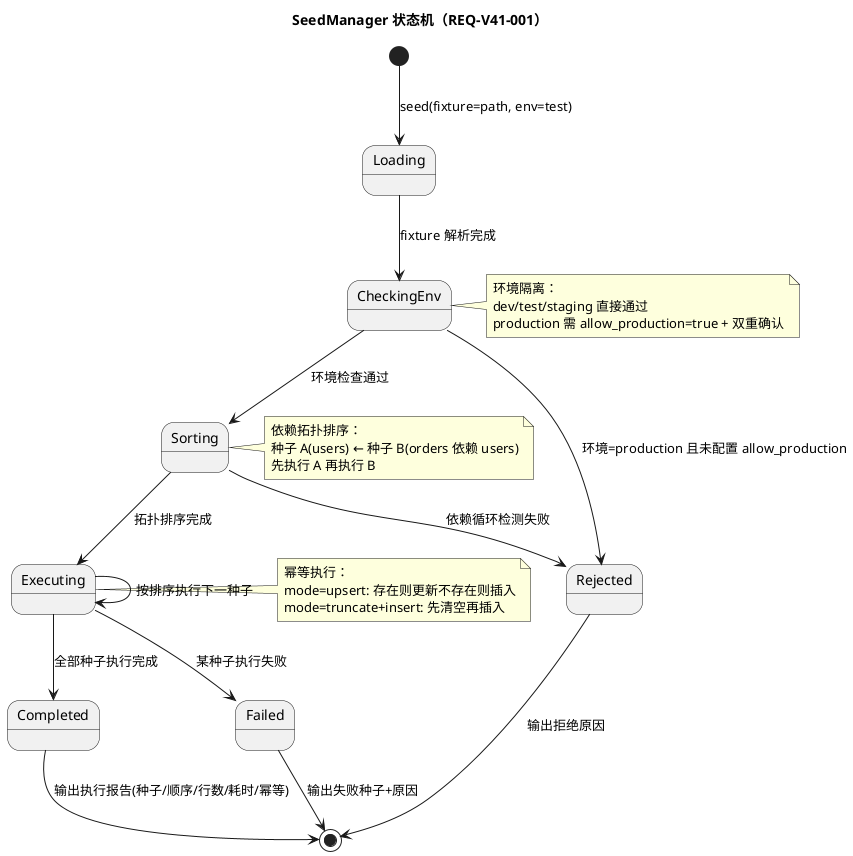
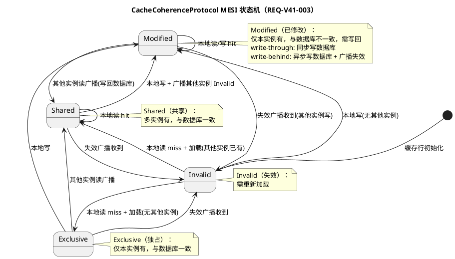
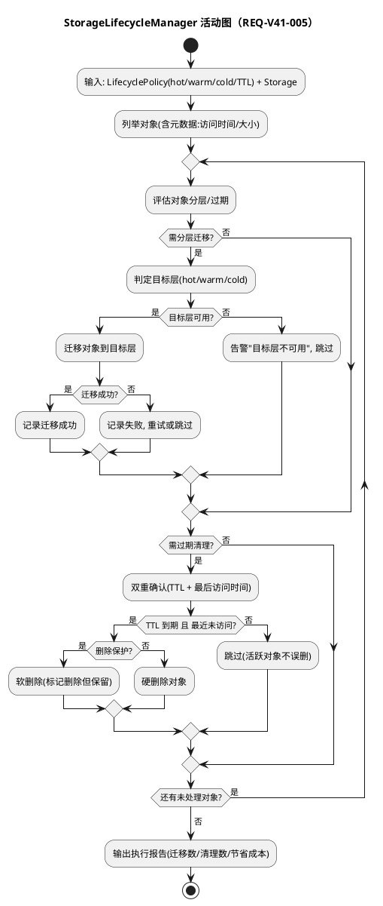
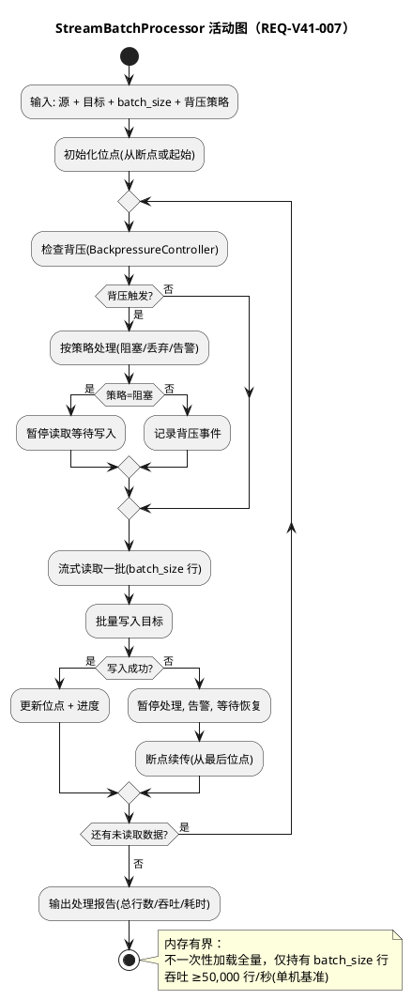
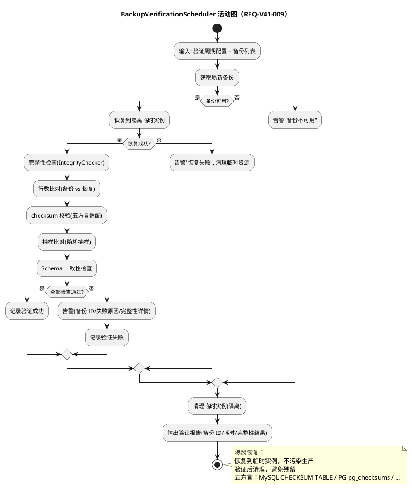

# sz-orm v4.1.0 技术设计文档

> 版本：v4.1.0（数据 seeding/fixture 管理 + schema diff 可视化 + 缓存一致性协议 + 消息轨迹追踪 + 存储生命周期管理 + 数据质量自动检测 + 批量流式处理 + 迁移版本分支 + 备份验证自动化）
> 基线：v4.0.0（AI 自动调优闭环 + 多 LLM 模型 + 混合搜索 + 数据 lineage + 分片 rebalance + failover 自动化 + 服务网格 + GraphQL 深度集成 + CDC，9 项能力全部通过 feature gate 隔离，Git commit `35384bd`）
> 日期：2026-08-11
> 文档定位：技术设计（How to build），对应需求规格 `spec.md`（What to build）
> 设计约束：无 Breaking Change（9 个 feature gate 隔离）+ 优先复用既有能力 + 五方言覆盖 + 每项设计附 file:line 代码证据 + unsafe 零容忍 + 禁止占位实现
> 需求依赖：REQ-V41-003（缓存一致性）复用既有 `sz-orm-queue` 做失效广播；REQ-V41-004（消息轨迹）复用既有 `sz-orm-tracing` + `sz-orm-queue`；REQ-V41-009（备份验证）复用既有 `sz-orm-back`；其余需求相互独立，可并行开发
> 证据验证：本文档所有 file:line 证据均已通过源码读取验证（2026-08-11），遵循 AGENTS.md 审计合规铁律

---

# 一、需求与存量功能关系分析

## 1.1 需求功能与存量功能对比

### 1.1.1 已实现功能（可直接复用）

| 需求功能 | 存量功能 | 代码位置 | 匹配度 |
|---------|---------|---------|--------|
| REQ-V41-001 CLI seeder 骨架命令 | `cmd_make_seeder`（生成 seeder 骨架） | `cli/src/main.rs:770` | 50% |
| REQ-V41-001 CLI seed 执行命令 | `cmd_seed`（执行种子数据） | `cli/src/main.rs:808` | 50% |
| REQ-V41-001 测试 Mock 连接 | `MockConnection`（测试用 Mock 连接） | `packages/sz-orm-core/src/mock.rs:63` | 75% |
| REQ-V41-002 schema 差异结构 | `SchemaDiff`（表/列增删改差分结果） | `packages/sz-orm-core/src/schema_sync.rs:100` | 75% |
| REQ-V41-002 差分计算函数 | `diff(entity, db)`（entity 与 db schema 差分） | `packages/sz-orm-core/src/schema_sync.rs:200` | 75% |
| REQ-V41-002 schema 同步器 | `SchemaSync`（schema 同步编排） | `packages/sz-orm-core/src/schema_sync.rs:612` | 75% |
| REQ-V41-002 DDL 生成器 trait | `DdlGenerator` trait（5 方言 DDL 生成） | `packages/sz-orm-core/src/schema_sync.rs:361` | 100% |
| REQ-V41-002 MySQL DDL 生成器 | `MySqlDdlGenerator` | `packages/sz-orm-core/src/schema_sync.rs:369` | 100% |
| REQ-V41-002 PostgreSQL DDL 生成器 | `PgDdlGenerator` | `packages/sz-orm-core/src/schema_sync.rs:439` | 100% |
| REQ-V41-002 SQLite DDL 生成器 | `SqliteDdlGenerator` | `packages/sz-orm-core/src/schema_sync.rs:479` | 100% |
| REQ-V41-002 Oracle DDL 生成器 | `OracleDdlGenerator` | `packages/sz-orm-core/src/schema_sync.rs:522` | 100% |
| REQ-V41-002 MSSQL DDL 生成器 | `MssqlDdlGenerator` | `packages/sz-orm-core/src/schema_sync.rs:565` | 100% |
| REQ-V41-002 CLI schema 生成 | `cmd_generate_schema`（CLI schema 生成命令） | `cli/src/main.rs:1389` | 75% |
| REQ-V41-003 缓存抽象 | `Cache` trait（缓存统一接口） | `packages/sz-orm-core/src/cache.rs:11` | 100% |
| REQ-V41-003 多级缓存 | `MultiLevelCache`（多级缓存组合） | `packages/sz-orm-core/src/cache.rs:141` | 75% |
| REQ-V41-003 L1 本地缓存 | `L1Cache<T>`（L1 本地缓存） | `packages/sz-orm-core/src/l1_cache.rs:87` | 75% |
| REQ-V41-003 L1+L2 协调器 | `L1L2Coordinator<T>`（L1+L2 读写协调） | `packages/sz-orm-core/src/l1_cache.rs:216` | 75% |
| REQ-V41-003 L2 分布式缓存 | `L2Cache`（L2 分布式缓存） | `packages/sz-orm-core/src/l2_cache.rs:517` | 75% |
| REQ-V41-003 L2 后端抽象 | `L2CacheBackend` trait（L2 后端接口） | `packages/sz-orm-core/src/l2_cache.rs:1176` | 100% |
| REQ-V41-004 消息队列抽象 | `MessageQueue` trait（消息队列统一接口） | `packages/sz-orm-queue/src/queue.rs:18` | 100% |
| REQ-V41-004 消息结构 | `Message`（消息体结构） | `packages/sz-orm-queue/src/queue.rs:57` | 100% |
| REQ-V41-004 消息队列 provider | `MqProvider`（6 provider：Kafka/RabbitMQ/RocketMQ/ActiveMQ/NATS/Pulsar） | `packages/sz-orm-queue/src/queue.rs:183` | 100% |
| REQ-V41-004 追踪 span | `Span`（追踪 span 结构） | `packages/sz-orm-tracing/src/lib.rs:31` | 100% |
| REQ-V41-004 追踪器抽象 | `Tracer` trait（追踪器统一接口） | `packages/sz-orm-tracing/src/lib.rs:129` | 100% |
| REQ-V41-004 自研追踪器 | `SzTracer`（自研追踪器实现） | `packages/sz-orm-tracing/src/lib.rs:136` | 100% |
| REQ-V41-004 OTLP 追踪器 | `OtelTracer`（OTLP 追踪器实现） | `packages/sz-orm-tracing/src/lib.rs:387` | 100% |
| REQ-V41-004 OTLP 配置 | `OtlpConfig`（OTLP 配置结构） | `packages/sz-orm-tracing/src/lib.rs:2049` | 100% |
| REQ-V41-005 对象存储抽象 | `Storage` trait（对象存储统一接口） | `packages/sz-orm-storage/src/storage.rs:14` | 100% |
| REQ-V41-005 存储构建器 | `StorageBuilder`（存储构建器） | `packages/sz-orm-storage/src/storage.rs:22` | 100% |
| REQ-V41-005 存储 provider | `StorageProvider`（7 provider：S3/AliyunOSS/TencentCOS/QiniuKodo/HuaweiOBS/UpYun/Local） | `packages/sz-orm-storage/src/storage.rs:287` | 100% |
| REQ-V41-005 7 provider 导出 | `AliyunOssStorage`/`HuaweiObsStorage`/`LocalStorage`/`QiniuKodoStorage`/`S3Storage`/`TencentCosStorage`/`UpYunStorage`/`OpendalStorage` | `packages/sz-orm-storage/src/lib.rs:83-92` | 100% |
| REQ-V41-006 验证错误 | `ValidationError`（8 种字段级校验错误枚举） | `packages/sz-orm-core/src/validation/mod.rs:16` | 75% |
| REQ-V41-006 验证抽象 | `Validate` trait（字段级验证接口） | `packages/sz-orm-core/src/validation/mod.rs:64` | 75% |
| REQ-V41-006 验证聚合 | `aggregate(results)`（多验证结果聚合） | `packages/sz-orm-core/src/validation/mod.rs:70` | 75% |
| REQ-V41-007 批处理结果 | `BatchResult`（批处理结果结构） | `packages/sz-orm-batch/src/lib.rs:16` | 100% |
| REQ-V41-007 批处理抽象 | `BatchOperations` trait（批处理统一接口） | `packages/sz-orm-batch/src/lib.rs:40` | 100% |
| REQ-V41-007 批处理阶段 | `BatchStage`（批处理阶段枚举：Started/ProcessingChunk/ChunkCompleted/Finished） | `packages/sz-orm-batch/src/lib.rs:435` | 100% |
| REQ-V41-007 批处理进度 | `BatchProgress`（批处理进度结构） | `packages/sz-orm-batch/src/lib.rs:448` | 100% |
| REQ-V41-007 流式 API 扩展 | `StreamApiExt<M>`（流式查询 API 扩展） | `packages/sz-orm-core/src/stream_api.rs:50` | 100% |
| REQ-V41-007 流式查询 trait | `StreamQueryTrait<M>`（流式查询 trait） | `packages/sz-orm-core/src/paginator.rs:273` | 100% |
| REQ-V41-008 迁移结构 | `Migration`（迁移版本结构） | `packages/sz-orm-core/src/migration.rs:10` | 75% |
| REQ-V41-008 迁移解析器抽象 | `MigrationResolver` trait（迁移解析器接口） | `packages/sz-orm-core/src/migration.rs:62` | 75% |
| REQ-V41-008 文件迁移解析器 | `FileMigrationResolver`（文件迁移解析器） | `packages/sz-orm-core/src/migration.rs:68` | 75% |
| REQ-V41-008 迁移上下文 | `MigrationContext`（迁移执行上下文） | `packages/sz-orm-core/src/migration.rs:193` | 75% |
| REQ-V41-008 迁移执行器 | `Migrator`（迁移执行器） | `packages/sz-orm-core/src/migration.rs:276` | 75% |
| REQ-V41-008 迁移进度 | `MigrationProgress`（迁移进度结构） | `packages/sz-orm-core/src/migration.rs:747` | 100% |
| REQ-V41-008 迁移影响分析 | `MigrationImpact`（迁移 dry-run 影响分析） | `packages/sz-orm-core/src/migration_dry_run.rs:59` | 75% |
| REQ-V41-009 备份清单 | `BackupManifest`（备份清单结构） | `packages/sz-orm-back/src/backup.rs:15` | 100% |
| REQ-V41-009 备份管理器 | `BackupManager`（备份管理器） | `packages/sz-orm-back/src/backup.rs:87` | 75% |
| REQ-V41-009 备份配置 | `BackupConfig`（备份配置结构） | `packages/sz-orm-back/src/backup.rs:324` | 100% |
| REQ-V41-009 备份结果 | `BackupResult`（备份结果结构） | `packages/sz-orm-back/src/backup.rs:364` | 100% |
| REQ-V41-009 备份目录 | `BackupCatalog`（备份目录管理） | `packages/sz-orm-back/src/backup.rs:421` | 100% |
| REQ-V41-009 恢复管理器 | `RestoreManager`（恢复管理器） | `packages/sz-orm-back/src/restore.rs:8` | 75% |
| REQ-V41-009 恢复结果 | `RestoreResult`（恢复结果结构） | `packages/sz-orm-back/src/restore.rs:195` | 100% |
| REQ-V41-009 灾备演练 | `DisasterRecoveryDrill`（灾备演练） | `packages/sz-orm-back/src/lib.rs:75` | 75% |
| REQ-V41-009 演练报告 | `DrillReport`（演练报告结构） | `packages/sz-orm-back/src/lib.rs:52` | 100% |
| 全需求 feature gate 模式 | prod-ready 14 子 feature + v3.9.0 4 feature + v4.0.0 9 feature（默认关闭） | `packages/sz-orm-core/Cargo.toml:83-121` | 100% |

### 1.1.2 需要扩展的功能

| 需求功能 | 存量功能 | 差异说明 | 扩展方向 |
|---------|---------|---------|---------|
| REQ-V41-001 faker 数据生成 | `cmd_make_seeder`（`:770`）与 `cmd_seed`（`:808`）仅有 CLI 骨架，无数据生成框架 | 缺 `FakerGenerator`（按字段类型生成随机/语义化假数据：姓名/邮箱/地址/UUID）+ 字段语义自定义生成器 | 新增 `FakerGenerator`，复用既有 CLI 命令作为入口增强，既有 `cmd_make_seeder`/`cmd_seed` 签名不变 |
| REQ-V41-001 fixture 模板加载 | 既有 CLI seed 无 fixture 模板支持 | 缺 `FixtureLoader`（YAML/JSON 模板 + 关联引用 `${user.0.id}` + 模板继承覆盖） | 新增 `FixtureLoader`，作为 `SeedManager` 的数据源之一 |
| REQ-V41-001 种子版本管理 | 既有 `cmd_seed` 无版本管理与依赖排序 | 缺 `SeedManager`（版本号/依赖/拓扑排序/已执行记录） | 新增 `SeedManager`，复用既有 `MigrationResolver:62` 的版本管理模式 |
| REQ-V41-002 可视化 diff 输出 | `SchemaDiff`（`:100`）与 `diff`（`:200`）仅计算差分，无可视化渲染 | 缺 `SchemaDiffVisualizer`（CLI 彩色/HTML/Markdown 三格式输出）+ 破坏性变更标注 + 影响摘要 | 新增 `SchemaDiffVisualizer` 渲染既有 `SchemaDiff` 结果，不重复计算 diff |
| REQ-V41-002 版本间 diff 对比 | 既有 `diff` 仅对比 entity 与 db 当前 schema，无版本间对比 | 缺版本间 schema diff（从版本 A 到版本 B 的变更） | 新增版本间对比，复用既有 `diff:200` 计算两版本 schema 差分 |
| REQ-V41-003 MESI 状态机 | `L1L2Coordinator`（`:216`）仅协调 L1+L2 读写，无一致性状态机 | 缺 `CacheCoherenceProtocol`（M/E/S/I 状态机）+ 状态转换 + 跨实例失效广播 | 新增 `CacheCoherenceProtocol` 编排既有 `L1L2Coordinator:216`，不修改既有缓存逻辑 |
| REQ-V41-003 跨实例失效广播 | 既有缓存为单实例，无跨实例失效机制 | 缺 `InvalidationBroadcaster`（通过消息队列广播失效事件） | 新增 `InvalidationBroadcaster`，复用既有 `sz-orm-queue` 6 provider 做广播通道 |
| REQ-V41-003 write-through/behind | 既有缓存无写策略配置 | 缺 `ConsistencyStrategy`（write-through 同步写穿 / write-behind 异步写回） | 新增写策略配置，write-behind 失败回滚缓存 + 告警 |
| REQ-V41-004 消息生产/消费 span | `MessageQueue` trait（`:18`）与 6 provider 无追踪集成 | 缺 `MessageTracingInterceptor`（拦截 publish/consume 创建 span）+ trace context 注入/提取 | 新增 `MessageTracingInterceptor` 包装既有 provider，不修改既有消息队列实现 |
| REQ-V41-004 trace context 传播 | 既有 `SzTracer:136`/`OtelTracer:387` 为通用追踪器，无消息队列专用 context 传播 | 缺 W3C Trace Context/B3 propagation 注入/提取到消息 header | 新增 `TraceContextPropagator`，复用既有 `Tracer:129` 创建 span |
| REQ-V41-005 自动分层 | `Storage` trait（`:14`）与 7 provider 仅提供存储操作，无分层策略 | 缺 `TieringPolicy`（hot/warm/cold 分层规则 + 访问频率/年龄/大小判定） | 新增 `StorageLifecycleManager` 编排既有 `Storage:14`，不修改既有存储操作 |
| REQ-V41-005 过期清理 | 既有存储无 TTL 过期清理 | 缺 `ExpirationCleaner`（TTL 到期自动删除 + 双重确认 + 删除保护） | 新增 `ExpirationCleaner`，复用既有 `Storage:14` 删除接口 |
| REQ-V41-006 统计学规则引擎 | `Validate` trait（`:64`）为字段级验证，无表级/统计级规则 | 缺 `DataQualityEngine`（缺失值/异常值/分布漂移/唯一性/完整性/一致性统计学规则） | 新增 `DataQualityEngine` 扩展既有 `Validate:64`，不修改既有字段级验证 |
| REQ-V41-006 质量评分与报告 | 既有 `ValidationError:16` 为错误枚举，无质量评分 | 缺 `QualityReport`（0-100 评分 + 通过率 + 异常详情 + 趋势） | 新增 `QualityReport`，检测结果可选写入既有 `sz-orm-audit` 审计链 |
| REQ-V41-007 Stream+Batch 结合 | `BatchOperations`（`:40`）与 `StreamApiExt`（`:50`）独立，无结合 | 缺 `StreamBatchProcessor`（流式读 + 批量写 + 背压控制 + 内存有界） | 新增 `StreamBatchProcessor` 复用既有 `StreamApiExt:50` 流式读 + `BatchOperations:40` 批量写 |
| REQ-V41-007 背压控制 | 既有批处理与流式 API 无背压机制 | 缺 `BackpressureController`（有界队列/丢弃/阻塞策略） | 新增 `BackpressureController`，避免写入慢于读取导致内存溢出 |
| REQ-V41-008 分支管理 | `Migrator`（`:276`）为线性迁移执行，无分支管理 | 缺 `MigrationBranchManager`（分支创建/切换/合并）+ `VersionDag`（版本 DAG） | 新增 `MigrationBranchManager` 编排既有 `Migrator:276`，不修改既有迁移执行逻辑 |
| REQ-V41-008 三方合并 | 既有迁移无合并机制 | 缺 `BranchMerger`（base + 两分支 → 合并序列）+ 冲突检测（版本号/表结构/依赖） | 新增 `BranchMerger`，冲突须人工解决不自动合并 |
| REQ-V41-009 定期恢复验证 | `BackupManager`（`:87`）与 `RestoreManager`（`restore.rs:8`）为手动操作，`DisasterRecoveryDrill`（`lib.rs:75`）为手动演练 | 缺 `BackupVerificationScheduler`（定期自动恢复验证）+ 隔离临时实例 | 新增 `BackupVerificationScheduler` 编排既有 `RestoreManager:8`，不修改既有备份/恢复逻辑 |
| REQ-V41-009 数据完整性检查 | 既有 `RestoreResult:195` 仅含恢复结果，无完整性校验 | 缺 `IntegrityChecker`（行数比对/checksum/抽样比对/Schema 一致性） | 新增 `IntegrityChecker`，五方言适配（MySQL checksum table vs PG pg_checksums） |

### 1.1.3 需要新增的功能或接口

#### 模块 A：REQ-V41-001 数据 seeding/fixture 管理

| 功能点 | 输入 | 输出 | 核心逻辑 | 依赖 |
|--------|------|------|---------|------|
| FakerGenerator | 字段类型 + 字段语义 + 数量 | `Vec<Record>`（随机/语义化假数据） | 按字段类型映射生成器（姓名/邮箱/地址/手机号/UUID/日期/数字/布尔/枚举/JSON），支持字段语义自定义 | 无（新生成器，可选 `faker` crate） |
| FixtureLoader | fixture 文件路径（YAML/JSON） | `FixtureTemplate`（表名/字段值/记录数/关联引用） | 解析 YAML/JSON 模板，解析关联引用（`${user.0.id}`），支持模板继承与覆盖 | `serde_yaml`/`serde_json`（既有依赖） |
| SeedManager | 种子文件列表 + 环境 + 幂等模式 | `SeedReport`（种子列表/执行顺序/行数/耗时/幂等标记） | 版本管理 + 依赖拓扑排序 + 幂等执行（upsert/truncate+insert）+ 环境隔离 + 已执行版本记录 | 既有 `MigrationResolver:62`（版本管理模式）、`cmd_seed:808`（CLI 入口） |
| 环境隔离守卫 | 环境 + allow_production 配置 | `Result<(), SeedError>` | 非 dev/test/staging 环境拒绝执行，allow_production 需双重确认 | 无 |

#### 模块 B：REQ-V41-002 schema diff 可视化

| 功能点 | 输入 | 输出 | 核心逻辑 | 依赖 |
|--------|------|------|---------|------|
| SchemaDiffVisualizer | `SchemaDiff`（既有 `:100`）+ 格式 + 方言 | `DiffReport`（CLI/HTML/Markdown 报告） | 渲染既有 `SchemaDiff` 为可视化报告，标注破坏性变更，生成影响摘要 | 既有 `SchemaDiff:100`、`diff:200`、`DdlGenerator:361`（5 方言） |
| 破坏性变更标注 | `SchemaDiff` 变更项 | `Vec<ChangeAnnotation>`（破坏性/非破坏性标注） | 识别 DROP TABLE/DROP COLUMN/ALTER COLUMN 类型变更/缩短长度/NOT NULL 加约束为破坏性 | 既有 `SchemaDiff:100` |
| 变更影响摘要 | `SchemaDiff` | `ImpactSummary`（新增/删除/修改表列数 + 破坏性变更数 + 预估影响行数） | 统计 diff 变更规模 | 既有 `SchemaDiff:100` |
| 版本间 diff 对比 | 版本 A + 版本 B + 方言 | `SchemaDiff`（版本间差分） | 加载两版本 schema，复用既有 `diff:200` 计算差分 | 既有 `diff:200`、`SchemaSync:612` |

#### 模块 C：REQ-V41-003 缓存一致性协议

| 功能点 | 输入 | 输出 | 核心逻辑 | 依赖 |
|--------|------|------|---------|------|
| CacheCoherenceProtocol | 缓存 key + 读写操作 + 写策略 | `CoherenceResult`（状态转换结果） | 为每个缓存行维护 M/E/S/I 状态机，读写/失效广播触发状态转换 | 既有 `L1L2Coordinator:216`、`L1Cache:87`、`L2Cache:517` |
| InvalidationBroadcaster | `InvalidationEvent`（key/实例 ID/操作类型） | 广播结果 | 通过消息队列广播失效事件，其他实例收到置 Invalid | 既有 `sz-orm-queue` 6 provider（`MessageQueue:18`） |
| ConsistencyStrategy | 写策略配置（write-through/write-behind） | 写入结果 | write-through 同步写穿（缓存+数据库同步）；write-behind 异步写回（先缓存后数据库 + 失效广播） | 既有 `L1L2Coordinator:216` |
| 脑裂检测 | 多实例 M 状态缓存行 | `SplitBrainStatus` | 检测多实例同时 Modified 同一 key，last-write-wins 或人工解决 | 无 |
| 一致性指标 | 状态机运行时 | `CoherenceMetrics`（M/E/S/I 行数 + 广播次数 + 违反次数 + 回滚次数） | 输出一致性指标接入既有 Prometheus | 既有 `sz-orm-observability`（`MetricsRegistry`） |

#### 模块 D：REQ-V41-004 消息轨迹追踪

| 功能点 | 输入 | 输出 | 核心逻辑 | 依赖 |
|--------|------|------|---------|------|
| MessageTracingInterceptor | 消息 + 队列操作（publish/consume） | 追踪 span + 消息操作结果 | 拦截 publish/consume 创建追踪 span，span 含 msg_id/topic/provider/延迟，关联生产与消费 span | 既有 `MessageQueue:18`、`Tracer:129`、`OtelTracer:387` |
| TraceContextPropagator | trace context + 消息 header | 注入/提取结果 | 注入 W3C Trace Context（`traceparent`/`tracestate`）与 B3 propagation 到消息 header；消费时提取关联父 span | 既有 `Span:31`、`OtlpConfig:2049` |
| 采样率控制 | 采样率配置（0-100%） | 采样决策 | 按采样率采样消息 span，100% 全量追踪，可动态调整 | 既有 `sz-orm-tracing`（4 种采样） |
| 消息内容脱敏 | span 属性 + 脱敏规则 | 脱敏后 span 属性 | 对 span 属性中敏感字段应用脱敏后再导出 OTLP | 既有 `sz-orm-masking`（`DataMasker`） |

#### 模块 E：REQ-V41-005 存储生命周期管理

| 功能点 | 输入 | 输出 | 核心逻辑 | 依赖 |
|--------|------|------|---------|------|
| StorageLifecycleManager | `LifecyclePolicy` + `Storage` | `LifecycleExecutionReport`（迁移数/清理数/节省成本） | 定期执行：列举对象 → 评估分层/过期 → 迁移/清理 → 输出报告 | 既有 `Storage:14`、7 provider（`lib.rs:83-92`） |
| TieringPolicy | 对象元数据（访问频率/年龄/大小） | 目标存储层（hot/warm/cold） | 按阈值判定分层：hot（频繁访问）/warm（偶尔访问）/cold（很少访问） | 无 |
| ExpirationCleaner | 对象列表 + TTL 配置 | 清理结果 | TTL 到期自动删除，双重确认（TTL + 最后访问时间），删除保护（保留期/软删除） | 既有 `Storage:14`（删除接口） |
| 分层迁移执行 | 对象 + 目标层 | 迁移结果 | 跨层迁移对象，记录失败重试，不影响其他对象 | 既有 `Storage:14`（复制/删除接口） |

#### 模块 F：REQ-V41-006 数据质量自动检测

| 功能点 | 输入 | 输出 | 核心逻辑 | 依赖 |
|--------|------|------|---------|------|
| DataQualityEngine | 规则配置 + 表 + Connection | `QualityReport`（评分/通过率/异常详情/趋势） | 加载规则，按规则检测（SQL 聚合统计 + 统计学判定），汇总评分与报告 | 既有 `Validate:64`、`ValidationError:16` |
| QualityRule | 规则 YAML/JSON | `QualityRule`（名称/类型/表/字段/参数/严重级别） | 解析规则配置，支持缺失值/异常值/分布漂移/唯一性/完整性/一致性六类规则 | `serde_yaml`/`serde_json`（既有依赖） |
| 缺失值检测 | 表 + 字段 + 阈值 | `RuleResult` | SQL 聚合 `COUNT(NULL)/COUNT(*)` 计算 NULL 比例，超阈值失败 | 无（SQL 聚合） |
| 异常值检测 | 表 + 字段 + 方法（Z-Score/IQR/3σ） | `RuleResult` | SQL 聚合 `AVG/STDDEV/PERCENTILE` 计算统计量，识别异常值 | 无（SQL 聚合） |
| 分布漂移检测 | 表 + 字段 + 基准分布 | `RuleResult` | 计算当前分布与基准分布的 KL 散度/PSI，超阈值告警 | 无（统计学计算） |
| 唯一性/完整性检测 | 表 + 字段 + 约束 | `RuleResult` | SQL 聚合检测主键/唯一约束违反、外键引用完整性 | 无（SQL 聚合） |

#### 模块 G：REQ-V41-007 批量流式处理

| 功能点 | 输入 | 输出 | 核心逻辑 | 依赖 |
|--------|------|------|---------|------|
| StreamBatchProcessor | 源 + 目标 + 批量大小 + 背压策略 | `StreamBatchProgress`（已处理/剩余/吞吐/预估/位点） | 流式读取源（复用 `StreamApiExt:50`）+ 批量写入目标（复用 `BatchOperations:40`）+ 背压控制 + 断点续传 | 既有 `StreamApiExt:50`、`StreamQueryTrait:273`、`BatchOperations:40` |
| BackpressureController | 读取速度 + 写入速度 + 策略 | 背压决策（继续/暂停/丢弃） | 监控读写速度差，写入慢于读取时按策略（有界队列/丢弃/阻塞）控制 | 无 |
| 断点续传 | 已处理位点 + 恢复点 | 恢复处理 | 位点持久化（主键/offset），中断后从断点继续，不丢不重 | 无（新位点管理） |
| 多源/目标适配 | 源/目标类型（DB/CSV/JSON） | 流式读写器 | 数据库→数据库、数据库→文件、文件→数据库流式批量转换 | 既有 `streaming_export/mod.rs`（`ExportConfig`） |

#### 模块 H：REQ-V41-008 迁移版本分支

| 功能点 | 输入 | 输出 | 核心逻辑 | 依赖 |
|--------|------|------|---------|------|
| MigrationBranchManager | 分支名 + 迁移文件 | `MigrationBranch`（分支名/迁移序列/依赖 DAG） | 分支创建/切换/合并，每分支独立迁移版本序列，分支间迁移隔离 | 既有 `Migrator:276`、`MigrationResolver:62`、`MigrationContext:193` |
| VersionDag | 分支间迁移依赖 | 版本 DAG（有向无环图） | 记录分支间迁移依赖关系，拓扑排序确定执行顺序，检测循环依赖 | 无（新数据结构） |
| BranchMerger | base 分支 + 两个分支 | `MergeResult`（合并序列/冲突详情/解决状态） | 三方合并（base + A + B → 合并序列），冲突检测（版本号/表结构/依赖），冲突须人工解决 | 既有 `Migrator:276`、`MigrationImpact:59` |
| 冲突检测 | 两分支迁移序列 | `Vec<MergeConflict>`（版本号/表结构/依赖冲突） | 检测同名版本号、同表不兼容修改、依赖顺序矛盾 | 既有 `MigrationImpact:59` |
| DAG 可视化 | `VersionDag` | DOT/JSON 导出 | 序列化版本 DAG 为 DOT/JSON，可被 Graphviz 渲染 | 无 |

#### 模块 I：REQ-V41-009 备份验证自动化

| 功能点 | 输入 | 输出 | 核心逻辑 | 依赖 |
|--------|------|------|---------|------|
| BackupVerificationScheduler | 验证周期配置 + 备份列表 | `VerificationReport`（备份 ID/恢复耗时/完整性结果/异常详情） | 定期自动执行：获取最新备份 → 恢复到隔离临时实例 → 完整性检查 → 清理 → 报告 | 既有 `BackupManager:87`、`RestoreManager:8`、`DisasterRecoveryDrill:75` |
| IntegrityChecker | 源数据 + 恢复数据 + 方言 | `IntegrityCheckResult`（行数/checksum/抽样/Schema 一致性） | 行数比对 + checksum 校验 + 抽样比对 + Schema 一致性，任一不一致标记失败 | 既有 `BackupManifest:15`、`RestoreResult:195` |
| 验证失败告警 | `IntegrityCheckResult`（失败） | 告警通知 | 验证失败告警（邮件/Slack/webhook），含备份 ID/失败原因/完整性详情 | 既有告警机制 |
| 隔离恢复 | 备份 + 临时实例配置 | 恢复结果 + 清理 | 恢复到隔离临时实例（不污染生产），验证后清理 | 既有 `RestoreManager:8` |
| 五方言完整性检查 | 方言 + 表 | 方言特定 checksum SQL | MySQL `CHECKSUM TABLE` / PostgreSQL `pg_checksums` / SQLite `PRAGMA integrity_check` / Oracle / MSSQL | 既有 `DdlGenerator:361`（5 方言适配模式） |

## 1.2 存量功能详细分析

### 1.2.1 cmd_make_seeder / cmd_seed（CLI seeder 骨架）

- **接口契约**：`cmd_make_seeder(args: &[&str], config: &Option<CliConfig>) -> Result<(), String>`（`cli/src/main.rs:770`）生成 seeder 骨架；`cmd_seed(args: &[&str], config: &Option<CliConfig>) -> Result<(), String>`（`:808`）执行种子数据
- **业务规则**：CLI 命令解析 args 与 config，生成/执行种子数据；当前为骨架实现，无 faker 数据生成、无 fixture 模板、无版本管理
- **扩展点**：args 可扩展新参数（`--faker`/`--fixture`/`--env`）；config 可扩展种子配置
- **约束**：CLI 命令签名为 `Result<(), String>`，新增增强须保持签名兼容
- **复用结论**：v4.1.0 `SeedManager` 复用既有 `cmd_make_seeder:770`/`cmd_seed:808` 作为 CLI 入口，新增 faker/fixture 作为增强，不修改既有命令行为

### 1.2.2 SchemaDiff / diff / SchemaSync / DdlGenerator（schema 差分与 DDL 生成）

- **接口契约**：`SchemaDiff`（`schema_sync.rs:100`）含表/列增删改差分结果；`diff(entity: &[TableDef], db: &[TableDef]) -> SchemaDiff`（`:200`）计算 entity 与 db schema 差分；`SchemaSync`（`:612`）编排 schema 同步，`diff_against(&self, db_tables: &[TableDef]) -> SchemaDiff`（`:715`）；`DdlGenerator` trait（`:361`）`Send + Sync`，5 方言实现：`MySqlDdlGenerator:369`/`PgDdlGenerator:439`/`SqliteDdlGenerator:479`/`OracleDdlGenerator:522`/`MssqlDdlGenerator:565`
- **业务规则**：`diff` 对比 entity 与 db 的 `TableDef` 列表，输出 `SchemaDiff`（新增表/删除表/修改表 + 列变更）；`DdlGenerator` 按方言生成 DDL（MySQL AUTO_INCREMENT / PG SERIAL / SQLite AUTOINCREMENT / Oracle SEQUENCE / MSSQL IDENTITY）
- **扩展点**：`DdlGenerator` trait 可扩展新方言；`SchemaDiff` 结构可扩展新变更类型
- **约束**：`diff` 计算不修改输入；DDL 生成须按方言语法
- **复用结论**：v4.1.0 `SchemaDiffVisualizer` 渲染既有 `SchemaDiff:100` 结果，不重复计算 diff；破坏性变更标注基于 `SchemaDiff` 变更项识别；五方言差异标注复用既有 `DdlGenerator:361` 5 方言实现

### 1.2.3 Cache / MultiLevelCache / L1Cache / L2Cache / L1L2Coordinator（多级缓存）

- **接口契约**：`Cache` trait（`cache.rs:11`）`Send + Sync` 缓存统一接口；`MultiLevelCache`（`:141`）多级缓存组合；`L1Cache<T>`（`l1_cache.rs:87`）L1 本地缓存（泛型 `T: Clone`）；`L1L2Coordinator<T: Clone>`（`:216`）L1+L2 读写协调；`L2Cache`（`l2_cache.rs:517`）L2 分布式缓存；`L2CacheBackend` trait（`:1176`）`Send + Sync` L2 后端接口
- **业务规则**：`L1L2Coordinator` 协调 L1（本地）+ L2（分布式）读写：读先查 L1 命中则返回，未命中查 L2 并回填 L1；写同时写 L1+L2；`L2CacheBackend` 抽象 L2 后端（Redis 等）
- **扩展点**：`L2CacheBackend` trait 可扩展新 L2 后端；`L1Cache<T>` 泛型支持任意缓存值类型
- **约束**：当前为单实例缓存，无跨实例失效；无写策略配置；无一致性状态机
- **复用结论**：v4.1.0 `CacheCoherenceProtocol` 编排既有 `L1L2Coordinator:216` 读写，新增 M/E/S/I 状态机与跨实例失效广播，不修改既有缓存逻辑；`InvalidationBroadcaster` 复用既有 `sz-orm-queue` 6 provider 做广播通道

### 1.2.4 MessageQueue / Message / MqProvider（消息队列）

- **接口契约**：`MessageQueue` trait（`queue.rs:18`）`Send + Sync` 消息队列统一接口；`Message`（`:57`）消息体结构；`MqProvider`（`:183`）6 provider 枚举（Kafka/RabbitMQ/RocketMQ/ActiveMQ/NATS/Pulsar）
- **业务规则**：6 provider 独立实现 publish/subscribe 接口，通过 feature gate 隔离（`real_kafka.rs`/`lapin_rabbitmq.rs`/`rocketmq.rs`/`real_activemq.rs`/`real_nats.rs`/`real_pulsar.rs`）
- **扩展点**：`MessageQueue` trait 可扩展新消息队列 provider；`Message` 结构可扩展消息属性
- **复用结论**：v4.1.0 `MessageTracingInterceptor` 包装既有 `MessageQueue:18` 与 6 provider，拦截 publish/consume 创建追踪 span，不修改既有消息队列实现；`InvalidationBroadcaster` 复用既有 6 provider 做缓存失效广播通道

### 1.2.5 Span / Tracer / SzTracer / OtelTracer / OtlpConfig（分布式追踪）

- **接口契约**：`Span`（`tracing/lib.rs:31`）追踪 span 结构；`Tracer` trait（`:129`）`Send + Sync` 追踪器统一接口；`SzTracer`（`:136`）自研追踪器实现；`OtelTracer`（`:387`）OTLP 追踪器实现；`OtlpConfig`（`:2049`）OTLP 配置结构
- **业务规则**：`Tracer` trait 抽象 span 创建/结束/导出；`SzTracer` 自研实现（内存 span 收集）；`OtelTracer` OTLP 实现导出到 Jaeger/Tempo/Zipkin；支持 4 种采样策略
- **扩展点**：`Tracer` trait 可扩展新追踪器后端；`Span` 可扩展 span 属性
- **复用结论**：v4.1.0 `MessageTracingInterceptor` 复用既有 `Tracer:129`/`OtelTracer:387` 创建 span，`TraceContextPropagator` 复用既有 `Span:31`/`OtlpConfig:2049` 注入/提取 trace context，不重复实现追踪

### 1.2.6 Storage / StorageBuilder / StorageProvider（对象存储）

- **接口契约**：`Storage` trait（`storage.rs:14`）`Send + Sync` 对象存储统一接口；`StorageBuilder`（`:22`）存储构建器；`StorageProvider`（`:287`）7 provider 枚举（S3/AliyunOSS/TencentCOS/QiniuKodo/HuaweiOBS/UpYun/Local）；`packages/sz-orm-storage/src/lib.rs:83-92` 导出 7 provider 实现（`AliyunOssStorage`/`HuaweiObsStorage`/`LocalStorage`/`QiniuKodoStorage`/`S3Storage`/`TencentCosStorage`/`UpYunStorage`/`OpendalStorage`）
- **业务规则**：7 provider 独立实现对象存储 CRUD 接口（上传/下载/删除/列举/元数据），通过 feature gate 隔离
- **扩展点**：`Storage` trait 可扩展新存储 provider；`StorageBuilder` 可扩展构建配置
- **约束**：当前仅提供存储操作，无自动分层、无过期清理、无生命周期策略
- **复用结论**：v4.1.0 `StorageLifecycleManager` 编排既有 `Storage:14` 与 7 provider，新增分层/过期/策略引擎，不修改既有存储操作；`ExpirationCleaner` 复用既有 `Storage:14` 删除接口

### 1.2.7 Validate / ValidationError / aggregate（字段级验证）

- **接口契约**：`ValidationError`（`validation/mod.rs:16`）8 种字段级校验错误枚举（Email/Length/Range/Regex/Required/Contains/DoesNotContain/Custom/Aggregate）；`Validate` trait（`:64`）`fn validate(&self) -> Result<(), ValidationError>`；`aggregate(results: Vec<Result<(), ValidationError>>) -> Result<(), ValidationError>`（`:70`）多验证结果聚合
- **业务规则**：`Validate` trait 为字段级验证（单字段单规则）；`aggregate` 聚合多个验证结果，任一失败返回 `ValidationError::Aggregate { errors, count }`；`rules.rs` 提供 8 种校验规则函数
- **扩展点**：`Validate` trait 可扩展新验证规则；`ValidationError` 可扩展新错误类型
- **约束**：当前为字段级验证（单字段），无表级/统计级规则；无质量评分；无分布漂移检测
- **复用结论**：v4.1.0 `DataQualityEngine` 扩展既有 `Validate:64` 为统计学规则引擎（表级/统计级），不修改既有字段级验证；`QualityReport` 新增质量评分，检测结果可选写入既有 `sz-orm-audit` 审计链

### 1.2.8 BatchOperations / BatchResult / BatchStage / BatchProgress（批处理）

- **接口契约**：`BatchResult`（`batch/lib.rs:16`）批处理结果结构；`BatchOperations` trait（`:40`）`Send + Sync` 批处理统一接口；`BatchStage`（`:435`）批处理阶段枚举（Started/ProcessingChunk/ChunkCompleted/Finished）；`BatchProgress`（`:448`）批处理进度结构（含 `stage: BatchStage`）
- **业务规则**：`BatchOperations` trait 抽象批量写入/更新/删除；`BatchStage` 标识批处理生命周期阶段；`BatchProgress` 含阶段 + 已处理/剩余/进度
- **扩展点**：`BatchOperations` trait 可扩展新批处理操作；`BatchStage` 可扩展新阶段
- **复用结论**：v4.1.0 `StreamBatchProcessor` 复用既有 `BatchOperations:40` 批量写入 + `BatchProgress:448` 进度报告，新增流式读取 + 背压控制，不重复实现批处理

### 1.2.9 StreamApiExt / StreamQueryTrait（流式查询）

- **接口契约**：`StreamApiExt<M: Model>`（`stream_api.rs:50`）流式查询 API 扩展；`StreamQueryTrait<M: Model>`（`paginator.rs:273`）流式查询 trait
- **业务规则**：`StreamApiExt`/`StreamQueryTrait` 提流式查询能力（游标分页/流式迭代），避免一次性加载全量数据
- **扩展点**：trait 可扩展新流式查询模式
- **复用结论**：v4.1.0 `StreamBatchProcessor` 复用既有 `StreamApiExt:50`/`StreamQueryTrait:273` 流式读取源数据，不重复实现流式查询

### 1.2.10 Migration / MigrationResolver / MigrationContext / Migrator（迁移执行）

- **接口契约**：`Migration`（`migration.rs:10`）迁移版本结构；`MigrationResolver` trait（`:62`）`Send + Sync` 迁移解析器接口；`FileMigrationResolver`（`:68`）文件迁移解析器；`MigrationContext`（`:193`）迁移执行上下文；`Migrator`（`:276`）迁移执行器；`MigrationProgress`（`:747`）迁移进度结构；`MigrationImpact`（`migration_dry_run.rs:59`）迁移 dry-run 影响分析
- **业务规则**：`MigrationResolver` 解析迁移文件为 `Migration` 列表；`Migrator` 按版本顺序执行迁移（up/down），`MigrationContext` 持有连接与配置；`MigrationImpact` 分析迁移影响（破坏性变更/影响表）；线性迁移执行，无分支管理
- **扩展点**：`MigrationResolver` trait 可扩展新解析器；`Migrator` 可扩展新执行策略
- **约束**：当前为线性迁移执行，无多分支并行、无三方合并、无版本 DAG
- **复用结论**：v4.1.0 `MigrationBranchManager` 编排既有 `Migrator:276`/`MigrationResolver:62`/`MigrationContext:193`，新增分支管理与三方合并，不修改既有迁移执行逻辑；`BranchMerger` 复用既有 `MigrationImpact:59` 分析合并影响

### 1.2.11 BackupManager / RestoreManager / DisasterRecoveryDrill（备份恢复与灾备演练）

- **接口契约**：`BackupManifest`（`backup.rs:15`）备份清单结构；`BackupManager`（`:87`）备份管理器；`BackupConfig`（`:324`）备份配置；`BackupResult`（`:364`）备份结果；`BackupCatalog`（`:421`）备份目录管理；`RestoreManager`（`restore.rs:8`）恢复管理器；`RestoreResult`（`:195`）恢复结果；`DisasterRecoveryDrill`（`lib.rs:75`）灾备演练；`DrillReport`（`:52`）演练报告
- **业务规则**：`BackupManager` 执行备份（全量/增量），输出 `BackupResult` + `BackupManifest`；`RestoreManager` 从备份恢复数据，输出 `RestoreResult`；`DisasterRecoveryDrill` 手动灾备演练，输出 `DrillReport`；`BackupCatalog` 管理备份目录
- **扩展点**：`BackupManager`/`RestoreManager` 可扩展新备份/恢复策略；`BackupConfig` 可扩展新配置项
- **约束**：当前为手动备份/恢复/演练，无定期自动验证、无完整性校验、无隔离临时实例
- **复用结论**：v4.1.0 `BackupVerificationScheduler` 编排既有 `BackupManager:87`/`RestoreManager:8`/`DisasterRecoveryDrill:75`，新增定期验证调度 + 完整性检查 + 隔离恢复，不修改既有备份/恢复逻辑；`IntegrityChecker` 复用既有 `BackupManifest:15`/`RestoreResult:195` 做完整性比对

### 1.2.12 feature gate 体系模式

- **接口契约**：`packages/sz-orm-core/Cargo.toml:83-121` 已有 prod-ready 14 子 feature（`:83-98`）+ 总 feature 聚合（`:100-115`）+ v3.9.0 4 feature（`:117-121` `benchmark-suite`/`data-validation`/`validate-on-write`/`migration-dry-run`/`streaming-export`）+ v4.0.0 9 feature（分布在各包）
- **业务规则**：每个子 feature 默认关闭，独立控制一项能力；新增代码全部 `#[cfg(feature = "...")]` 门控；新增依赖标记 `optional = true`；跨包 feature 依赖通过 `sz-orm-xxx/feature-name` 引用
- **复用结论**：v4.1.0 9 个新 feature（`data-seeding`/`schema-diff-viz`/`cache-coherence`/`message-tracing`/`storage-lifecycle`/`data-quality`/`batch-stream`/`migration-branch`/`backup-verify`）遵循此模式，默认全关闭，无 Breaking Change

---

# 二、增量设计方案

## 2.1 实现模型

### 2.1.1 上下文视图

```plantuml
@startuml
title sz-orm v4.1.0 上下文视图（新增能力与外部系统交互）

' === 新增模块 ===
rectangle "sz-orm-core (扩展)" as core {
  rectangle "SeedManager\nFakerGenerator\nFixtureLoader\n(REQ-V41-001)" as seeding
  rectangle "SchemaDiffVisualizer\n(REQ-V41-002)" as diffviz
  rectangle "CacheCoherenceProtocol\nInvalidationBroadcaster\n(REQ-V41-003)" as coherence
  rectangle "DataQualityEngine\n(REQ-V41-006)" as quality
  rectangle "MigrationBranchManager\n(REQ-V41-008)" as migbranch
}

rectangle "sz-orm-queue (扩展)" as queue {
  rectangle "MessageTracingInterceptor\n(REQ-V41-004)" as msgtrace
}

rectangle "sz-orm-storage (扩展)" as storage_ext {
  rectangle "StorageLifecycleManager\n(REQ-V41-005)" as lifecycle
}

rectangle "sz-orm-batch (扩展)" as batch_ext {
  rectangle "StreamBatchProcessor\n(REQ-V41-007)" as batchstream
}

rectangle "sz-orm-back (扩展)" as back_ext {
  rectangle "BackupVerificationScheduler\n(REQ-V41-009)" as backupverify
}

' === 既有模块（复用） ===
rectangle "cmd_make_seeder/cmd_seed\n(既有 :770/:808)" as cli_seed
rectangle "SchemaDiff/diff/DdlGenerator\n(既有 :100/:200/:361)" as schemadiff
rectangle "L1L2Coordinator/L1Cache/L2Cache\n(既有 :216/:87/:517)" as cache
rectangle "MessageQueue 6 provider\n(既有 :18)" as mq
rectangle "Tracer/OtelTracer\n(既有 :129/:387)" as tracer
rectangle "Storage 7 provider\n(既有 :14)" as storage
rectangle "Validate/ValidationError\n(既有 :64/:16)" as validate
rectangle "BatchOperations/StreamApiExt\n(既有 :40/:50)" as batchstream_base
rectangle "Migrator/MigrationResolver\n(既有 :276/:62)" as migrator
rectangle "BackupManager/RestoreManager\n(既有 :87/:8)" as backup

' === 外部系统 ===
database "MySQL/PG/SQLite\n/Oracle/MSSQL" as db
rectangle "faker + YAML/JSON\nfixture" as faker
cloud "Jaeger/Tempo/Zipkin" as tracing_backend
rectangle "S3/AliyunOSS/TencentCOS\n/.../Local" as storage_providers
rectangle "Kafka/RabbitMQ/\nNATS/Pulsar/..." as mq_providers
cloud "Prometheus" as prometheus

' === 交互关系 ===
seeding --> cli_seed : 复用 CLI 入口增强
seeding --> faker : faker+fixture 生成
seeding --> db : 写入种子数据(upsert)

diffviz --> schemadiff : 复用 SchemaDiff 渲染
diffviz --> db : schema diff 计算(五方言)

coherence --> cache : 复用 L1L2Coordinator 读写
coherence --> mq : 失效广播(复用 6 provider)
coherence --> db : write-through/behind
coherence --> prometheus : 一致性指标

msgtrace --> mq : 拦截消息生产/消费
msgtrace --> tracer : 复用 Tracer 创建 span
msgtrace --> tracing_backend : OTLP 导出

lifecycle --> storage : 复用 Storage 操作
lifecycle --> storage_providers : 分层迁移/清理

quality --> db : 统计学规则检测(SQL 聚合)
quality --> validate : 扩展 Validate 为统计引擎

batchstream --> batchstream_base : 复用 StreamApiExt+BatchOperations
batchstream --> db : 流式读+批量写

migbranch --> migrator : 复用 Migrator 执行
migbranch --> db : 分支迁移管理

backupverify --> backup : 复用 BackupManager/RestoreManager
backupverify --> db : 恢复+完整性检查(五方言)

@enduml
```



**通信协议与调用频率**：
| 交互 | 协议 | 频率 |
|------|------|------|
| SeedManager → DB | SQL（参数化，upsert/truncate+insert） | seeding 执行时（低频，手动/CI） |
| SchemaDiffVisualizer → DB | SQL（schema 元数据查询） | migrate:diff 时（低频，手动） |
| CacheCoherenceProtocol → DB | SQL（write-through/behind） | 每次缓存写（高频） |
| InvalidationBroadcaster → 消息队列 | AMQP/Kafka/NATS 协议 | 每次缓存失效（中频） |
| MessageTracingInterceptor → 消息队列 | 包装既有 provider 协议 | 每次消息生产/消费（高频） |
| MessageTracingInterceptor → OTLP 后端 | OTLP/gRPC | span 批量导出（按采样率） |
| StorageLifecycleManager → 对象存储 | S3/OSS HTTP API | 生命周期执行周期（低频，定时） |
| DataQualityEngine → DB | SQL（COUNT/AVG/STDDEV 聚合） | 质量检测时（中频，定时/手动） |
| StreamBatchProcessor → DB | SQL（流式读 + 批量写） | 流式批量处理期间（高频） |
| BackupVerificationScheduler → DB | SQL（恢复 + checksum） | 验证周期（低频，定时） |

### 2.1.2 服务/组件总体架构

```plantuml
@startuml
title sz-orm v4.1.0 新增模块总体架构

package "sz-orm-core (扩展)" {
  component "SeedManager\n[data-seeding]" as seed_mgr
  component "FakerGenerator" as faker
  component "FixtureLoader" as fixture
  component "EnvIsolationGuard" as env_guard
  component "SchemaDiffVisualizer\n[schema-diff-viz]" as diff_viz
  component "ChangeAnnotator" as annotator
  component "ImpactSummarizer" as summarizer
  component "CacheCoherenceProtocol\n[cache-coherence]" as coherence
  component "InvalidationBroadcaster" as broadcaster
  component "ConsistencyStrategy" as strategy
  component "SplitBrainDetector" as splitbrain
  component "DataQualityEngine\n[data-quality]" as quality_engine
  component "QualityRuleParser" as rule_parser
  component "StatisticalRule\n(6 类规则)" as stat_rule
  component "MigrationBranchManager\n[migration-branch]" as branch_mgr
  component "VersionDag" as version_dag
  component "BranchMerger" as branch_merger
  component "ConflictDetector" as conflict_det
}

package "sz-orm-queue (扩展)" {
  component "MessageTracingInterceptor\n[message-tracing]" as msg_interceptor
  component "TraceContextPropagator" as propagator
  component "SamplingController" as sampling
}

package "sz-orm-storage (扩展)" {
  component "StorageLifecycleManager\n[storage-lifecycle]" as lifecycle_mgr
  component "TieringPolicy" as tiering
  component "ExpirationCleaner" as cleaner
  component "TierMigrationExecutor" as tier_executor
}

package "sz-orm-batch (扩展)" {
  component "StreamBatchProcessor\n[batch-stream]" as stream_batch
  component "BackpressureController" as backpressure
  component "CheckpointManager" as checkpoint
  component "SourceTargetAdapter" as adapter
}

package "sz-orm-back (扩展)" {
  component "BackupVerificationScheduler\n[backup-verify]" as verify_scheduler
  component "IntegrityChecker" as integrity
  component "IsolatedRestoreExecutor" as isolated_restore
  component "VerificationAlerter" as verify_alerter
}

' 内部依赖
seed_mgr --> faker
seed_mgr --> fixture
seed_mgr --> env_guard

diff_viz --> annotator
diff_viz --> summarizer

coherence --> broadcaster
coherence --> strategy
coherence --> splitbrain

quality_engine --> rule_parser
quality_engine --> stat_rule

branch_mgr --> version_dag
branch_mgr --> branch_merger
branch_merger --> conflict_det

msg_interceptor --> propagator
msg_interceptor --> sampling

lifecycle_mgr --> tiering
lifecycle_mgr --> cleaner
lifecycle_mgr --> tier_executor

stream_batch --> backpressure
stream_batch --> checkpoint
stream_batch --> adapter

verify_scheduler --> integrity
verify_scheduler --> isolated_restore
verify_scheduler --> verify_alerter

' 跨需求依赖（复用既有）
coherence --> broadcaster : 复用 sz-orm-queue\n做失效广播(REQ-V41-003)
msg_interceptor --> propagator : 复用 sz-orm-tracing\n(REQ-V41-004)

@enduml
```



### 2.1.3 实现设计文档

#### 需求依赖关系与开发顺序

```plantuml
@startuml
title v4.1.0 需求依赖关系与开发顺序

REQ-V41-001 "数据 seeding\n(P0)" : 独立
REQ-V41-002 "schema diff 可视化\n(P0)" : 独立
REQ-V41-003 "缓存一致性\n(P1)" : 复用 sz-orm-queue(失效广播)
REQ-V41-004 "消息轨迹追踪\n(P1)" : 复用 sz-orm-tracing + sz-orm-queue
REQ-V41-005 "存储生命周期\n(P1)" : 独立
REQ-V41-006 "数据质量检测\n(P1)" : 独立
REQ-V41-007 "批量流式处理\n(P2)" : 独立
REQ-V41-008 "迁移版本分支\n(P2)" : 独立
REQ-V41-009 "备份验证自动化\n(P2)" : 独立

note bottom of REQ-V41-001
  开发顺序（按优先级）：
  1. REQ-V41-001/002（P0，可并行，测试效率+迁移可视化）
  2. REQ-V41-003/004/005/006（P1，可并行，缓存/可观测/存储/数据治理）
  3. REQ-V41-007/008/009（P2，可并行，性能/并行开发/灾备）
  跨需求依赖仅复用既有包，无新增需求间依赖
end note

@enduml
```

#### 数据 seeding 状态机



#### 缓存一致性 MESI 状态机



#### 存储生命周期活动图



#### 批量流式处理活动图



#### 备份验证活动图



## 2.2 接口设计

### 2.2.1 总体设计

v4.1.0 新增接口按需求项分为 9 组，每组通过 feature gate 隔离，默认关闭。接口稳定性等级遵循 `docs/API-STABILITY.md` 三层分级（既有 v4.0.0 新增接口为 Experimental，v4.1.0 同等级）。

| 接口组 | feature gate | 核心接口 | 稳定性 | 依赖既有 |
|--------|-------------|---------|--------|---------|
| REQ-V41-001 数据 seeding | `data-seeding` | `SeedManager`、`FakerGenerator`、`FixtureLoader`、`SeedReport` | Experimental | `cmd_make_seeder:770`、`cmd_seed:808`、`MockConnection:63`、`MigrationResolver:62` |
| REQ-V41-002 schema diff 可视化 | `schema-diff-viz` | `SchemaDiffVisualizer`、`DiffReport`、`ChangeAnnotation`、`ImpactSummary` | Experimental | `SchemaDiff:100`、`diff:200`、`SchemaSync:612`、`DdlGenerator:361`（5 方言）、`cmd_generate_schema:1389` |
| REQ-V41-003 缓存一致性 | `cache-coherence` | `CacheCoherenceProtocol`、`InvalidationBroadcaster`、`ConsistencyStrategy`、`CoherenceMetrics` | Experimental | `Cache:11`、`MultiLevelCache:141`、`L1Cache:87`、`L1L2Coordinator:216`、`L2Cache:517`、`L2CacheBackend:1176`、`sz-orm-queue` 6 provider |
| REQ-V41-004 消息轨迹追踪 | `message-tracing` | `MessageTracingInterceptor`、`TraceContextPropagator`、`MessageTraceSpan` | Experimental | `MessageQueue:18`、`Message:57`、`MqProvider:183`、`Tracer:129`、`SzTracer:136`、`OtelTracer:387`、`OtlpConfig:2049` |
| REQ-V41-005 存储生命周期 | `storage-lifecycle` | `StorageLifecycleManager`、`TieringPolicy`、`ExpirationCleaner`、`LifecyclePolicy` | Experimental | `Storage:14`、`StorageBuilder:22`、`StorageProvider:287`、7 provider（`lib.rs:83-92`） |
| REQ-V41-006 数据质量检测 | `data-quality` | `DataQualityEngine`、`QualityRule`、`QualityReport`、`StatisticalRule` | Experimental | `Validate:64`、`ValidationError:16`、`aggregate:70` |
| REQ-V41-007 批量流式处理 | `batch-stream` | `StreamBatchProcessor`、`BackpressureController`、`StreamBatchProgress` | Experimental | `BatchOperations:40`、`BatchResult:16`、`BatchStage:435`、`BatchProgress:448`、`StreamApiExt:50`、`StreamQueryTrait:273` |
| REQ-V41-008 迁移版本分支 | `migration-branch` | `MigrationBranchManager`、`VersionDag`、`BranchMerger`、`MergeResult` | Experimental | `Migration:10`、`MigrationResolver:62`、`FileMigrationResolver:68`、`MigrationContext:193`、`Migrator:276`、`MigrationProgress:747`、`MigrationImpact:59` |
| REQ-V41-009 备份验证自动化 | `backup-verify` | `BackupVerificationScheduler`、`IntegrityChecker`、`VerificationReport`、`IntegrityCheckResult` | Experimental | `BackupManager:87`、`BackupManifest:15`、`RestoreManager:8`、`RestoreResult:195`、`DisasterRecoveryDrill:75`、`DrillReport:52`、`DdlGenerator:361`（5 方言） |

**接口变更策略**：
1. 所有新增接口标记 `#[cfg(feature = "...")]`，默认不编译
2. 新增 trait/struct 为 Experimental 等级，后续稳定后升级为 Stable
3. 既有接口签名完全不变，仅新增方法通过 feature gate 隔离
4. 既有 `cmd_make_seeder:770`/`cmd_seed:808` 保留不动，新增 `--faker`/`--fixture`/`--env` 参数作为增强
5. 既有 `SchemaDiff:100`/`diff:200` 保留不动，新增 `SchemaDiffVisualizer` 渲染层

### 2.2.2 接口清单

#### REQ-V41-001 数据 seeding/fixture 管理

```rust
// packages/sz-orm-core/src/seeding/mod.rs（新增，#[cfg(feature = "data-seeding")]）

/// faker 数据生成器（spec 5.1.1 规则 1）
///
/// 按字段类型生成随机/语义化假数据，支持字段语义自定义生成器。
pub struct FakerGenerator {
    field_generators: HashMap<String, Box<dyn FieldGenerator>>,
    rng: rand::rngs::StdRng,
}

/// 字段生成器 trait（可扩展新字段类型）
pub trait FieldGenerator: Send + Sync {
    fn generate(&self, rng: &mut rand::rngs::StdRng) -> serde_json::Value;
}

impl FakerGenerator {
    /// 按模型定义生成 N 条随机数据（spec 5.1.1 规则 1）
    pub fn generate_batch(&mut self, model: &ModelDef, count: usize) -> Vec<Record>;

    /// 注册字段语义自定义生成器（如 user.email 用邮箱生成器）
    pub fn register(&mut self, field_semantic: &str, generator: Box<dyn FieldGenerator>);
}

/// fixture 模板加载器（spec 5.1.1 规则 2）
pub struct FixtureLoader;

impl FixtureLoader {
    /// 从 YAML/JSON 文件加载 fixture 模板（spec 5.1.1 规则 2）
    pub fn load(path: &str) -> Result<FixtureTemplate, SeedError>;

    /// 解析模板关联引用（${user.0.id}）
    fn resolve_references(template: &mut FixtureTemplate, resolved: &HashMap<String, Vec<Record>>)
        -> Result<(), SeedError>;
}

/// fixture 模板（spec 6.2 输出对象 3）
#[derive(Debug, Clone)]
pub struct FixtureTemplate {
    pub table: String,
    pub records: Vec<Record>,
    pub count: usize,
    pub references: Vec<Reference>,        // 关联引用
    pub extends: Option<String>,           // 模板继承
}

/// 种子管理器（spec 5.1.1 规则 3 版本管理 + 依赖排序）
pub struct SeedManager {
    seeds: Vec<SeedFile>,
    mode: SeedMode,                        // Upsert / TruncateInsert
    env: SeedEnv,                          // Dev / Test / Staging / Production
    allow_production: bool,
    executed_versions: HashSet<String>,    // 已执行版本记录
}

/// 种子执行模式（spec 5.1.1 规则 4 幂等）
#[derive(Debug, Clone, Copy)]
pub enum SeedMode { Upsert, TruncateInsert }

/// 种子环境（spec 5.1.1 规则 5 环境隔离）
#[derive(Debug, Clone, Copy, PartialEq, Eq)]
pub enum SeedEnv { Dev, Test, Staging, Production }

/// 种子文件（含版本号/描述/依赖）
#[derive(Debug, Clone)]
pub struct SeedFile {
    pub version: String,
    pub description: String,
    pub dependencies: Vec<String>,         // 前置种子版本
    pub template: FixtureTemplate,
}

/// 种子执行报告（spec 6.2 输出对象 1）
#[derive(Debug, Clone)]
pub struct SeedReport {
    pub executed_seeds: Vec<SeedExecution>,
    pub total_rows: u64,
    pub total_duration: Duration,
    pub idempotent: bool,
    pub env: SeedEnv,
}

impl SeedManager {
    /// 执行 seeding（spec 5.1.1 规则 3/4/5）
    pub async fn seed(&mut self, conn: &dyn Connection) -> Result<SeedReport, SeedError> {
        // 1. 环境隔离检查（spec 5.1.1 规则 5）
        // 2. 依赖拓扑排序（spec 5.1.1 规则 3，循环检测）
        // 3. 按排序执行种子（幂等 upsert/truncate+insert，spec 5.1.1 规则 4）
        // 4. 记录已执行版本，重复执行跳过
    }

    /// 依赖拓扑排序（spec 5.1.1 规则 3）
    fn topological_sort(&self) -> Result<Vec<&SeedFile>, SeedError>;
}
```

**业务说明**：`FakerGenerator` 按字段类型生成随机/语义化假数据；`FixtureLoader` 加载 YAML/JSON 模板并解析关联引用；`SeedManager` 管理种子版本、依赖拓扑排序、幂等执行、环境隔离。
**前置条件**：fixture 文件格式正确；环境为 dev/test/staging 或 production 且配置 `allow_production=true`。
**后置条件**：种子数据按依赖顺序写入；重复执行幂等（不产生重复数据）；已执行版本记录。
**异常映射**：`SeedError::EnvForbidden` → 拒绝执行（production 环境隔离）；`SeedError::DependencyCycle` → 拒绝执行（循环依赖）；`SeedError::FixtureParseFailed` → 提示文件路径与错误位置。
**证据**：复用既有 `cmd_make_seeder:770`/`cmd_seed:808`（CLI 入口增强，签名不变）、`MockConnection:63`（测试 Mock 连接）、`MigrationResolver:62`（版本管理模式）。

#### REQ-V41-002 schema diff 可视化

```rust
// packages/sz-orm-core/src/schema_diff_viz.rs（新增，#[cfg(feature = "schema-diff-viz")]）

/// schema diff 可视化器（spec 5.2.1 规则 1）
///
/// 渲染既有 SchemaDiff 为可视化报告，不重新计算 diff。
pub struct SchemaDiffVisualizer {
    dialect: DbType,                       // 五方言
}

/// diff 报告格式（spec 5.2.1 规则 1 三格式）
#[derive(Debug, Clone, Copy)]
pub enum DiffFormat { Cli, Html, Markdown }

/// diff 可视化报告（spec 6.2 输出对象 4）
#[derive(Debug, Clone)]
pub struct DiffReport {
    pub format: DiffFormat,
    pub content: String,                   // 渲染后内容（CLI 彩色/HTML/Markdown）
    pub annotations: Vec<ChangeAnnotation>,
    pub impact_summary: ImpactSummary,
}

/// 变更标注（spec 5.2.1 规则 2 破坏性标注）
#[derive(Debug, Clone)]
pub struct ChangeAnnotation {
    pub change: ChangeItem,
    pub is_destructive: bool,              // 破坏性（DROP/ALTER 类型变更/缩短长度/NOT NULL 加约束）
    pub marker: &'static str,              // ⚠️（破坏性）/ ✓（非破坏性）
}

/// 变更影响摘要（spec 5.2.1 规则 3）
#[derive(Debug, Clone)]
pub struct ImpactSummary {
    pub added_tables: usize,
    pub dropped_tables: usize,
    pub modified_tables: usize,
    pub added_columns: usize,
    pub dropped_columns: usize,
    pub destructive_changes: usize,
    pub estimated_affected_rows: u64,
}

impl SchemaDiffVisualizer {
    /// 渲染 diff 报告（spec 5.2.1 规则 1，复用既有 SchemaDiff:100）
    pub fn visualize(&self, diff: &SchemaDiff, format: DiffFormat) -> DiffReport {
        // 1. 标注破坏性变更（spec 5.2.1 规则 2）
        // 2. 生成影响摘要（spec 5.2.1 规则 3）
        // 3. 渲染为 CLI/HTML/Markdown（spec 5.2.1 规则 1）
        // 不重新计算 diff，仅渲染既有 SchemaDiff
    }

    /// 版本间 diff 对比（spec 5.2.1 规则 4）
    pub fn diff_between_versions(
        &self, from: &str, to: &str, conn: &dyn Connection,
    ) -> Result<DiffReport, DiffVizError> {
        // 加载两版本 schema，复用既有 diff:200 计算差分
    }
}
```

**业务说明**：`SchemaDiffVisualizer` 渲染既有 `SchemaDiff:100` 为 CLI 彩色/HTML/Markdown 报告，标注破坏性变更（DROP TABLE/DROP COLUMN/ALTER COLUMN 类型变更/缩短长度/NOT NULL 加约束），生成影响摘要。版本间对比复用既有 `diff:200`。
**前置条件**：`SchemaDiff` 已计算（既有 `diff:200`）；方言支持（5 方言 `DdlGenerator:361`）。
**后置条件**：输出 `DiffReport` 含渲染内容 + 破坏性标注 + 影响摘要；可视化不改变 diff 语义。
**异常映射**：`DiffVizError::SchemaFetchFailed` → 提示获取失败原因；`DiffVizError::UnsupportedType` → 降级部分 diff 标注未计算部分。
**证据**：复用既有 `SchemaDiff:100`、`diff:200`、`SchemaSync:612`、`DdlGenerator:361`（5 方言：`MySqlDdlGenerator:369`/`PgDdlGenerator:439`/`SqliteDdlGenerator:479`/`OracleDdlGenerator:522`/`MssqlDdlGenerator:565`）、`cmd_generate_schema:1389`。

#### REQ-V41-003 缓存一致性协议

```rust
// packages/sz-orm-core/src/cache_coherence.rs（新增，#[cfg(feature = "cache-coherence")]）

/// 缓存一致性协议（spec 5.3.1 规则 1 MESI 状态机）
///
/// 为每个缓存行维护 M/E/S/I 状态机，编排既有 L1L2Coordinator 读写。
pub struct CacheCoherenceProtocol<T: Clone> {
    coordinator: Arc<L1L2Coordinator<T>>,       // 复用既有 :216
    states: RwLock<HashMap<String, MesiState>>,  // key → 状态
    broadcaster: Arc<InvalidationBroadcaster>,
    strategy: ConsistencyStrategy,
    metrics: Arc<CoherenceMetrics>,
}

/// MESI 状态（spec 5.3.1 规则 1）
#[derive(Debug, Clone, Copy, PartialEq, Eq)]
pub enum MesiState { Modified, Exclusive, Shared, Invalid }

/// 写策略（spec 5.3.1 规则 3）
#[derive(Debug, Clone, Copy)]
pub enum ConsistencyStrategy {
    WriteThrough,    // 同步写穿（缓存+数据库同步，强一致）
    WriteBehind,     // 异步写回（先缓存后数据库+失效广播，最终一致）
}

/// 失效广播器（spec 5.3.1 规则 2 跨实例失效广播）
pub struct InvalidationBroadcaster {
    mq: Arc<dyn MessageQueue>,                  // 复用既有 sz-orm-queue 6 provider
    instance_id: String,
}

/// 失效事件（spec 6.2 输出对象 6）
#[derive(Debug, Clone, Serialize, Deserialize)]
pub struct InvalidationEvent {
    pub key: String,
    pub instance_id: String,                    // 发起失效的实例 ID
    pub timestamp: u64,
    pub op: InvalidationOp,                     // Modify / Delete
}

/// 一致性指标（spec 5.3.1 规则 6，spec 6.2 输出对象 5）
#[derive(Debug, Clone, Default)]
pub struct CoherenceMetrics {
    pub modified_count: u64,
    pub exclusive_count: u64,
    pub shared_count: u64,
    pub invalid_count: u64,
    pub invalidation_broadcasts: u64,
    pub coherence_violations: u64,
    pub write_behind_rollbacks: u64,
}

impl<T: Clone> CacheCoherenceProtocol<T> {
    /// 读缓存（状态机驱动，spec 5.3.1 规则 1）
    pub async fn get(&self, key: &str) -> Result<Option<T>, CoherenceError> {
        // 1. 检查状态：Invalid → 加载(Exclusive/Shared)；Valid → 命中
        // 2. 复用既有 L1L2Coordinator:216 读写
    }

    /// 写缓存（write-through/behind，spec 5.3.1 规则 3）
    pub async fn put(&self, key: &str, value: T) -> Result<(), CoherenceError> {
        // 1. 状态转换 → Modified
        // 2. write-through: 同步写数据库；write-behind: 异步写数据库 + 广播失效
        // 3. 广播 InvalidationEvent（spec 5.3.1 规则 2）
    }

    /// 处理收到的失效广播（spec 5.3.1 规则 2）
    pub async fn handle_invalidation(&self, event: &InvalidationEvent) {
        // 置对应缓存行为 Invalid
    }

    /// 脑裂检测（spec 5.3.3 异常 3）
    pub async fn detect_split_brain(&self) -> SplitBrainStatus;
}
```

**业务说明**：`CacheCoherenceProtocol` 为每个缓存行维护 M/E/S/I 状态机，读时检查状态（Invalid 重新加载），写时状态转 Modified 并按策略（write-through 同步写数据库 / write-behind 异步写数据库 + 广播失效）。`InvalidationBroadcaster` 复用既有 `sz-orm-queue` 6 provider 广播失效事件，其他实例收到置 Invalid。
**前置条件**：`L1L2Coordinator:216` 已配置；消息队列已配置（失效广播）。
**后置条件**：缓存与数据库最终一致（write-through 强一致 / write-behind 最终一致 + 失效广播）；一致性指标接入 Prometheus。
**异常映射**：`CoherenceError::BroadcastFailed` → 本地置 Invalid + 记录广播失败 + 告警；`CoherenceError::WriteBehindFailed` → 回滚缓存 + 告警；`CoherenceError::SplitBrain` → last-write-wins + 告警。
**证据**：复用既有 `L1L2Coordinator:216`、`L1Cache:87`、`L2Cache:517`、`L2CacheBackend:1176`、`Cache:11`、`MultiLevelCache:141`；`InvalidationBroadcaster` 复用既有 `MessageQueue:18` 6 provider。

#### REQ-V41-004 消息轨迹追踪

```rust
// packages/sz-orm-queue/src/message_tracing.rs（新增，#[cfg(feature = "message-tracing")]）

/// 消息轨迹追踪拦截器（spec 5.4.1 规则 1/2）
///
/// 包装既有 MessageQueue provider，拦截 publish/consume 创建追踪 span。
pub struct MessageTracingInterceptor {
    inner: Arc<dyn MessageQueue>,               // 复用既有 :18
    tracer: Arc<dyn Tracer>,                    // 复用既有 :129（SzTracer/OtelTracer）
    propagator: TraceContextPropagator,
    sampling: SamplingController,
    masker: Option<Arc<DataMasker>>,            // 可选脱敏（复用既有 sz-orm-masking）
}

/// trace context 传播器（spec 5.4.1 规则 2 W3C/B3）
pub struct TraceContextPropagator;

/// 传播协议（spec 5.4.1 规则 2）
#[derive(Debug, Clone, Copy)]
pub enum PropagationProtocol {
    W3c,    // traceparent/tracestate
    B3,     // X-B3-TraceId/X-B3-SpanId
}

/// 消息轨迹 span（spec 6.2 输出对象 7）
#[derive(Debug, Clone)]
pub struct MessageTraceSpan {
    pub msg_id: String,
    pub topic: String,
    pub provider: String,
    pub span_kind: SpanKind,                    // Produce / Consume
    pub latency: Duration,
    pub trace_context: TraceContext,
}

#[derive(Debug, Clone, Copy)]
pub enum SpanKind { Produce, Consume }

impl MessageTracingInterceptor {
    /// 拦截消息生产：创建 produce span + 注入 trace context（spec 5.4.1 规则 1/2）
    pub async fn publish(&self, topic: &str, msg: &Message) -> Result<(), MqError> {
        // 1. 采样决策（spec 5.4.1 规则 4）
        // 2. 创建 produce span（复用既有 Tracer:129）
        // 3. 注入 trace context 到 msg header（W3C/B3，spec 5.4.1 规则 2）
        // 4. 调用既有 MessageQueue:18 publish
    }

    /// 拦截消息消费：提取 trace context + 创建 consume span（spec 5.4.1 规则 1/2）
    pub async fn consume(&self) -> Result<Vec<Message>, MqError> {
        // 1. 调用既有 MessageQueue:18 consume
        // 2. 提取 trace context from msg header（spec 5.4.1 规则 2）
        // 3. 创建 consume span（父=produce span，spec 5.4.1 规则 3 端到端关联）
        // 4. span 含 msg_id/topic/provider/延迟
        // 5. 可选脱敏 span 属性（spec 5.4.1 规则 7）
    }
}

impl TraceContextPropagator {
    /// 注入 trace context 到消息 header（spec 5.4.1 规则 2）
    pub fn inject(&self, ctx: &TraceContext, headers: &mut HashMap<String, String>, protocol: PropagationProtocol);

    /// 从消息 header 提取 trace context（spec 5.4.1 规则 2）
    pub fn extract(&self, headers: &HashMap<String, String>, protocol: PropagationProtocol) -> Option<TraceContext>;
}
```

**业务说明**：`MessageTracingInterceptor` 包装既有 `MessageQueue:18` provider，拦截 publish 创建 produce span + 注入 trace context 到 header，拦截 consume 提取 trace context + 创建 consume span（父=produce span，端到端关联）。支持 W3C Trace Context 与 B3 propagation。采样率可配置降低开销。可选脱敏 span 属性。
**前置条件**：`MessageQueue:18` 已配置；`Tracer:129` 已初始化（`SzTracer:136` 或 `OtelTracer:387`）。
**后置条件**：生产/消费 span 关联；trace context 注入/提取不破坏消息内容；OTLP 导出到 Jaeger/Tempo/Zipkin。
**异常映射**：`MqError::NoParentTrace` → 创建新 trace（消费 span 为根 span，标记 orphan）；`MqError::OtlpExportFailed` → span 缓冲重发，缓冲满丢弃 + 告警；`MqError::SamplingTooHigh` → 告警建议降低采样率。
**证据**：复用既有 `MessageQueue:18`、`Message:57`、`MqProvider:183`、`Tracer:129`、`SzTracer:136`、`OtelTracer:387`、`OtlpConfig:2049`、`Span:31`；`DataMasker`（`sz-orm-masking`）用于 span 属性脱敏。

#### REQ-V41-005 存储生命周期管理

```rust
// packages/sz-orm-storage/src/lifecycle.rs（新增，#[cfg(feature = "storage-lifecycle")]）

/// 存储生命周期管理器（spec 5.5.1 规则 1/2/3）
///
/// 编排既有 Storage trait，定期执行分层迁移 + 过期清理。
pub struct StorageLifecycleManager {
    storage: Arc<dyn Storage>,                 // 复用既有 :14
    policies: Vec<LifecyclePolicy>,
    tiering: TieringPolicy,
    cleaner: ExpirationCleaner,
}

/// 生命周期策略（spec 5.5.1 规则 3，spec 6.2 输出对象 8）
#[derive(Debug, Clone)]
pub struct LifecyclePolicy {
    pub bucket: String,
    pub prefix: Option<String>,                // 按 prefix 绑定
    pub tag: Option<String>,                   // 按 tag 绑定
    pub tiering_rules: TieringRules,
    pub expiration: ExpirationRule,
    pub cleanup_schedule: CleanupSchedule,      // Daily / Weekly
    pub deletion_protection: DeletionProtection,
}

/// 分层规则（spec 5.5.1 规则 1 hot/warm/cold）
#[derive(Debug, Clone)]
pub struct TieringRules {
    pub warm_threshold: Duration,              // 未访问时长阈值（如 30 天迁移到 warm）
    pub cold_threshold: Duration,              // 如 90 天迁移到 cold
}

/// 过期规则（spec 5.5.1 规则 2 TTL）
#[derive(Debug, Clone)]
pub struct ExpirationRule {
    pub ttl: Duration,                         // TTL 到期自动删除
}

/// 删除保护（spec 5.5.1 规则 6）
#[derive(Debug, Clone)]
pub struct DeletionProtection {
    pub retention: Option<Duration>,           // 保留期（软删除保留多久后硬删）
    pub soft_delete: bool,                     // 软删除（标记删除但保留）
}

/// 生命周期执行报告（spec 6.2 输出对象 9）
#[derive(Debug, Clone)]
pub struct LifecycleExecutionReport {
    pub migrated_count: u64,                   // 分层迁移对象数
    pub expired_count: u64,                    // 过期清理对象数
    pub saved_cost: f64,                       // 节省存储成本
    pub failures: Vec<LifecycleFailure>,
}

impl StorageLifecycleManager {
    /// 执行生命周期策略（spec 5.5.1 规则 1/2/3）
    pub async fn run(&self) -> Result<LifecycleExecutionReport, LifecycleError> {
        // 1. 列举对象（含元数据：访问时间/大小，复用既有 Storage:14）
        // 2. 评估分层/过期
        // 3. 分层迁移（spec 5.5.1 规则 1）
        // 4. 过期清理（双重确认 TTL + 最后访问时间，spec 5.5.1 规则 2）
        // 5. 删除保护（软删除/保留期，spec 5.5.1 规则 6）
    }

    /// 查询分层迁移进度（spec 5.5.1 规则 4）
    pub fn progress(&self) -> LifecycleProgress;
}

/// 过期清理器（spec 5.5.1 规则 2 双重确认）
pub struct ExpirationCleaner { storage: Arc<dyn Storage> }
impl ExpirationCleaner {
    /// 双重确认删除：TTL 到期 且 最近未访问才删除（spec 5.5.1 规则 2，spec 5.5.3 异常 2 误删保护）
    pub async fn clean(&self, objects: &[ObjectMeta], ttl: Duration) -> Result<u64, LifecycleError>;
}
```

**业务说明**：`StorageLifecycleManager` 定期列举对象（复用既有 `Storage:14`），按 `TieringRules` 评估分层（hot/warm/cold），按 `ExpirationRule` 评估过期，分层迁移 + 过期清理。`ExpirationCleaner` 双重确认（TTL + 最后访问时间）避免误删活跃对象，删除保护支持软删除/保留期。
**前置条件**：`Storage:14` 已配置（7 provider 之一）；`LifecyclePolicy` 已配置。
**后置条件**：对象按策略分层与过期；不误删活跃对象；输出执行报告（迁移数/清理数/节省成本）。
**异常映射**：`LifecycleError::ProviderUnavailable` → 暂停执行 + 告警；`LifecycleError::RecentlyAccessed` → 跳过删除 + 告警；`LifecycleError::MigrationFailed` → 记录失败重试或跳过。
**证据**：复用既有 `Storage:14`、`StorageBuilder:22`、`StorageProvider:287`、7 provider（`lib.rs:83-92`：`AliyunOssStorage`/`HuaweiObsStorage`/`LocalStorage`/`QiniuKodoStorage`/`S3Storage`/`TencentCosStorage`/`UpYunStorage`/`OpendalStorage`）。

#### REQ-V41-006 数据质量自动检测

```rust
// packages/sz-orm-audit/src/data_quality.rs（新增，#[cfg(feature = "data-quality")]）

/// 数据质量规则引擎（spec 5.6.1 规则 1 统计学规则）
///
/// 扩展既有 Validate trait 为表级/统计级规则引擎，只读检测。
pub struct DataQualityEngine {
    rules: Vec<QualityRule>,
    auditor: Option<Arc<HashChainAuditor>>,    // 可选写入审计链
}

/// 数据质量规则（spec 5.6.1 规则 3，spec 6.2 输出对象 11）
#[derive(Debug, Clone)]
pub struct QualityRule {
    pub name: String,
    pub rule_type: QualityRuleType,
    pub table: String,
    pub field: Option<String>,
    pub params: RuleParams,                     // 阈值/基准分布
    pub severity: Severity,                     // Error / Warning / Info
}

/// 规则类型（spec 5.6.1 规则 1 六类统计学规则）
#[derive(Debug, Clone, Copy)]
pub enum QualityRuleType {
    MissingValue,       // 缺失值检测（NULL 比例超阈值）
    Outlier,            // 异常值检测（Z-Score/IQR/3σ）
    DistributionDrift,  // 分布漂移检测（KL 散度/PSI）
    Uniqueness,         // 唯一性检测（主键/唯一约束）
    Completeness,       // 完整性检测（外键引用完整性）
    Consistency,        // 一致性检测（跨表/跨字段）
}

/// 质量报告（spec 5.6.1 规则 2，spec 6.2 输出对象 10）
#[derive(Debug, Clone)]
pub struct QualityReport {
    pub rules: Vec<RuleResult>,
    pub pass_rate: f64,                         // 通过率
    pub score: u8,                              // 评分 0-100
    pub anomalies: Vec<AnomalyDetail>,
    pub trend: Option<QualityTrend>,
}

impl DataQualityEngine {
    /// 执行数据质量检测（spec 5.6.1 规则 1/2，只读）
    pub async fn detect(&self, conn: &dyn Connection) -> Result<QualityReport, QualityError> {
        // 1. 加载规则（spec 5.6.1 规则 3）
        // 2. 按规则检测：SQL 聚合统计（COUNT/AVG/STDDEV/PERCENTILE，五方言适配）
        // 3. 统计学判定（阈值/分布，spec 5.6.1 规则 1 六类规则）
        // 4. 汇总评分与报告（spec 5.6.1 规则 2）
        // 5. 只读检测，不修改源数据（spec 5.6.1 规则 6）
        // 6. 可选写入审计链（spec 5.6.1 规则 6）
    }

    /// 从 YAML/JSON 加载规则（spec 5.6.1 规则 3）
    pub fn load_rules(path: &str) -> Result<Vec<QualityRule>, QualityError>;
}

/// 统计学规则实现（spec 5.6.1 规则 1）
pub trait StatisticalRule: Send + Sync {
    async fn check(&self, conn: &dyn Connection, rule: &QualityRule) -> Result<RuleResult, QualityError>;
}

// 六类规则实现
pub struct MissingValueRule;      // COUNT(NULL)/COUNT(*) 超阈值
pub struct OutlierRule;           // Z-Score/IQR/3σ 异常值
pub struct DistributionDriftRule; // KL 散度/PSI 分布漂移（spec 5.6.1 规则 4）
pub struct UniquenessRule;        // 主键/唯一约束违反
pub struct CompletenessRule;      // 外键引用完整性
pub struct ConsistencyRule;       // 跨表/跨字段一致
```

**业务说明**：`DataQualityEngine` 加载规则（YAML/JSON），按六类统计学规则检测（SQL 聚合统计 + 统计学判定），汇总评分（0-100）与报告。只读检测不修改源数据，可选写入审计链。五方言通过 SQL 聚合按方言适配。
**前置条件**：规则配置正确；Connection 可用；方言支持。
**后置条件**：输出 `QualityReport` 含评分/通过率/异常详情；源数据不变；检测结果可重复。
**异常映射**：`QualityError::RuleConfigInvalid` → 跳过该规则 + 记录配置错误；`QualityError::Timeout` → 该规则标记 TIMEOUT + 其他正常；`QualityError::NoBaseline` → 跳过漂移检测 + 提示配置基准。
**证据**：复用既有 `Validate:64`、`ValidationError:16`、`aggregate:70`（扩展为统计学规则引擎，不修改既有字段级验证）；`HashChainAuditor`（`sz-orm-audit`）用于检测结果可选写入审计链。

#### REQ-V41-007 批量流式处理

```rust
// packages/sz-orm-batch/src/stream_batch.rs（新增，#[cfg(feature = "batch-stream")]）

/// 批量流式处理器（spec 5.7.1 规则 1 Stream+Batch 结合）
///
/// 结合流式读取（复用 StreamApiExt:50）与批量写入（复用 BatchOperations:40），
/// 内存有界，背压控制，断点续传。
pub struct StreamBatchProcessor {
    backpressure: BackpressureController,
    checkpoint: CheckpointManager,
    batch_size: usize,
}

/// 背压控制器（spec 5.7.1 规则 2）
pub struct BackpressureController {
    strategy: BackpressureStrategy,
    high_watermark: usize,                     // 高水位（暂停读取）
    low_watermark: usize,                      // 低水位（恢复读取）
}

/// 背压策略（spec 5.7.1 规则 2）
#[derive(Debug, Clone, Copy)]
pub enum BackpressureStrategy {
    Bounded,       // 有界队列
    DropOldest,    // 丢弃最旧
    Block,         // 阻塞等待
}

/// 流式批量进度（spec 5.7.1 规则 4，spec 6.2 输出对象 12）
#[derive(Debug, Clone)]
pub struct StreamBatchProgress {
    pub processed: u64,
    pub remaining: u64,
    pub throughput: f64,                       // 行/秒
    pub eta:; Duration,
    pub checkpoint: Checkpoint,                // 已处理位点（主键/offset）
    pub is_paused: bool,
}

/// 源/目标配置（spec 5.7.1 规则 6 多源/目标）
#[derive(Debug, Clone)]
pub struct StreamBatchConfig {
    pub source: SourceConfig,                  // DB / CsvFile / JsonFile
    pub target: TargetConfig,                  // DB / CsvFile / JsonFile
    pub batch_size: usize,                     // 默认 1000
    pub backpressure: BackpressureStrategy,
}

impl StreamBatchProcessor {
    /// 执行流式批量处理（spec 5.7.1 规则 1/2/3）
    pub async fn process(
        &self, config: &StreamBatchConfig, conn: &dyn Connection,
    ) -> Result<StreamBatchProgress, BatchStreamError> {
        // 1. 初始化位点（从断点或起始，spec 5.7.1 规则 3）
        // 2. 循环：检查背压 → 流式读取一批（复用 StreamApiExt:50）→ 批量写入（复用 BatchOperations:40）→ 更新位点
        // 3. 背压控制（spec 5.7.1 规则 2）：写入慢于读取时暂停/减慢读取
        // 4. 内存有界（仅持有 batch_size 行，spec 5.7.1 规则 1）
    }

    /// 查询进度（spec 5.7.1 规则 4）
    pub fn progress(&self, task_id: &str) -> Option<StreamBatchProgress>;

    /// 中止处理
    pub fn pause(&self, task_id: &str) -> Result<(), BatchStreamError>;

    /// 恢复处理（断点续传，spec 5.7.1 规则 3）
    pub async fn resume(&self, task_id: &str) -> Result<StreamBatchProgress, BatchStreamError>;
}
```

**业务说明**：`StreamBatchProcessor` 流式读取源（复用 `StreamApiExt:50`）+ 批量写入目标（复用 `BatchOperations:40`），内存有界（仅持有 `batch_size` 行）。`BackpressureController` 监控读写速度差，写入慢于读取时按策略控制。`CheckpointManager` 持久化位点支持断点续传。
**前置条件**：源/目标可用；`batch_size` 已配置；`StreamApiExt:50`/`BatchOperations:40` 已可用。
**后置条件**：内存占用恒定（约 batch_size 行）；吞吐 ≥50,000 行/秒；中断后断点续传不丢不重。
**异常映射**：`BatchStreamError::SourceUnavailable` → 暂停 + 告警 + 等待恢复断点续传；`BatchStreamError::BackpressureOverflow` → 按策略处理（阻塞/丢弃/告警）；`BatchStreamError::CheckpointFailed` → 暂停 + 告警。
**证据**：复用既有 `BatchOperations:40`、`BatchResult:16`、`BatchStage:435`、`BatchProgress:448`、`StreamApiExt:50`、`StreamQueryTrait:273`；`streaming_export/mod.rs`（`ExportConfig`）用于多源/目标适配。

#### REQ-V41-008 迁移版本分支

```rust
// packages/sz-orm-core/src/migration_branch.rs（新增，#[cfg(feature = "migration-branch")]）

/// 迁移分支管理器（spec 5.8.1 规则 1/2）
///
/// 编排既有 Migrator，支持多分支并行开发迁移管理。
pub struct MigrationBranchManager {
    branches: RwLock<HashMap<String, MigrationBranch>>,
    dag: RwLock<VersionDag>,
    migrator: Arc<Migrator>,                   // 复用既有 :276
}

/// 迁移分支（spec 6.2 输出对象 13）
#[derive(Debug, Clone)]
pub struct MigrationBranch {
    pub name: String,                          // 如 feature-a
    pub migrations: Vec<Migration>,            // 分支独立迁移版本序列（复用既有 Migration:10）
    pub parent: Option<String>,                // 父分支（如 main）
}

/// 版本 DAG（spec 5.8.1 规则 2 有向无环图）
#[derive(Debug, Clone, Default)]
pub struct VersionDag {
    nodes: HashMap<String, DagNode>,           // 分支/版本节点
    edges: HashSet<DagEdge>,                   // 依赖关系
}

/// 合并结果（spec 6.2 输出对象 14）
#[derive(Debug, Clone)]
pub struct MergeResult {
    pub merged_migrations: Option<Vec<Migration>>,  // 合并后序列（无冲突时）
    pub conflicts: Vec<MergeConflict>,              // 冲突详情（有冲突时）
    pub resolved: bool,
}

/// 合并冲突（spec 5.8.1 规则 4）
#[derive(Debug, Clone)]
pub struct MergeConflict {
    pub conflict_type: ConflictType,
    pub branch_a: String,
    pub branch_b: String,
    pub version: String,
    pub detail: String,
}

#[derive(Debug, Clone, Copy)]
pub enum ConflictType { VersionNumber, TableSchema, Dependency }

impl MigrationBranchManager {
    /// 创建分支（spec 5.8.1 规则 1）
    pub fn create_branch(&self, name: &str, parent: &str) -> Result<(), BranchError>;

    /// 添加迁移到分支（spec 5.8.1 规则 1）
    pub fn add_migration(&self, branch: &str, migration: Migration) -> Result<(), BranchError>;

    /// 三方合并（spec 5.8.1 规则 3）
    pub fn merge(&self, branch_a: &str, branch_b: &str) -> Result<MergeResult, BranchError> {
        // 1. 三方合并（base + A + B → 合并序列）
        // 2. 冲突检测（spec 5.8.1 规则 4：版本号/表结构/依赖）
        // 3. 有冲突 → 返回冲突详情，人工解决（不自动合并）
        // 4. 无冲突 → 调用既有 Migrator:276 执行合并后序列
    }

    /// 导出版本 DAG（spec 5.8.1 规则 7）
    pub fn export_dag(&self, format: DagFormat) -> Result<String, BranchError>;
}

/// 分支合并器
pub struct BranchMerger { migrator: Arc<Migrator> }
impl BranchMerger {
    /// 三方合并 + 冲突检测（spec 5.8.1 规则 3/4）
    pub fn merge(&self, base: &[Migration], a: &[Migration], b: &[Migration]) -> MergeResult;
}
```

**业务说明**：`MigrationBranchManager` 管理多分支迁移（每分支独立版本序列），`VersionDag` 记录分支间依赖关系（拓扑排序 + 循环检测）。`BranchMerger` 三方合并（base + A + B），冲突检测（版本号/表结构/依赖），冲突须人工解决不自动合并。合并后调用既有 `Migrator:276` 执行。
**前置条件**：分支存在；迁移文件格式正确。
**后置条件**：合并后迁移序列可正确执行（不跳过不重复）；冲突检测并阻止自动合并；DAG 可导出 DOT/JSON。
**异常映射**：`BranchError::MergeConflict` → 阻止自动合并 + 输出冲突详情；`BranchError::DependencyCycle` → 拒绝合并 + 提示循环依赖；`BranchError::BranchNotFound` → 提示分支不存在 + 列出可用分支。
**证据**：复用既有 `Migrator:276`、`MigrationResolver:62`、`FileMigrationResolver:68`、`MigrationContext:193`、`Migration:10`、`MigrationProgress:747`、`MigrationImpact:59`（合并影响分析）。

#### REQ-V41-009 备份验证自动化

```rust
// packages/sz-orm-back/src/backup_verify.rs（新增，#[cfg(feature = "backup-verify")]）

/// 备份验证调度器（spec 5.9.1 规则 1 定期恢复验证）
///
/// 编排既有 BackupManager/RestoreManager，定期自动验证备份可用性。
pub struct BackupVerificationScheduler {
    restore: Arc<RestoreManager>,              // 复用既有 restore.rs:8
    integrity: IntegrityChecker,
    alerter: VerificationAlerter,
    config: VerificationConfig,
}

/// 验证配置
#[derive(Debug, Clone)]
pub struct VerificationConfig {
    pub schedule: VerificationSchedule,         // Daily / Weekly / Custom
    pub temp_instance: TempInstanceConfig,      // 隔离临时实例配置
    pub integrity_checks: Vec<IntegrityCheckType>,
}

/// 完整性检查类型（spec 5.9.1 规则 2）
#[derive(Debug, Clone, Copy)]
pub enum IntegrityCheckType {
    RowCount,       // 行数比对
    Checksum,       // checksum 校验（五方言适配）
    Sampling,       // 抽样比对
    Schema,         // Schema 一致性
}

/// 验证报告（spec 5.9.1 规则 6，spec 6.2 输出对象 15）
#[derive(Debug, Clone)]
pub struct VerificationReport {
    pub backup_id: String,
    pub restore_duration: Duration,
    pub integrity_result: IntegrityCheckResult,
    pub anomalies: Vec<VerificationAnomaly>,
    pub verified_at: u64,
}

/// 完整性检查结果（spec 6.2 输出对象 16）
#[derive(Debug, Clone)]
pub struct IntegrityCheckResult {
    pub row_count_match: bool,
    pub checksum_match: bool,
    pub sampling_match: bool,
    pub schema_match: bool,
    pub overall_pass: bool,
}

/// 完整性检查器（spec 5.9.1 规则 2）
pub struct IntegrityChecker;
impl IntegrityChecker {
    /// 校验恢复数据完整性（spec 5.9.1 规则 2，五方言适配）
    pub async fn check(
        &self, source: &dyn Connection, restored: &dyn Connection,
        checks: &[IntegrityCheckType], dialect: DbType,
    ) -> Result<IntegrityCheckResult, VerifyError> {
        // 1. 行数比对（备份 vs 恢复）
        // 2. checksum 校验（五方言：MySQL CHECKSUM TABLE / PG pg_checksums / SQLite PRAGMA / ...）
        // 3. 抽样比对（随机抽样数据比对）
        // 4. Schema 一致性（表结构/索引/约束）
        // 任一不一致标记验证失败
    }
}

impl BackupVerificationScheduler {
    /// 启动定期验证调度（spec 5.9.1 规则 1）
    pub async fn start(&self) -> Result<(), VerifyError>;

    /// 执行一次备份验证（spec 5.9.1 规则 1/2/4）
    pub async fn verify_once(&self, backup_id: &str) -> Result<VerificationReport, VerifyError> {
        // 1. 获取备份（复用既有 BackupManager:87）
        // 2. 恢复到隔离临时实例（spec 5.9.1 规则 4，复用既有 RestoreManager:8）
        // 3. 完整性检查（spec 5.9.1 规则 2，IntegrityChecker）
        // 4. 失败告警（spec 5.9.1 规则 3）
        // 5. 清理临时实例（spec 5.9.1 规则 4）
        // 6. 输出验证报告（spec 5.9.1 规则 6）
    }
}
```

**业务说明**：`BackupVerificationScheduler` 定期自动执行：获取最新备份 → 恢复到隔离临时实例（复用 `RestoreManager:8`）→ 完整性检查（`IntegrityChecker` 行数/checksum/抽样/Schema）→ 失败告警 → 清理临时实例 → 输出报告。`IntegrityChecker` 五方言适配 checksum SQL。
**前置条件**：`BackupManager:87`/`RestoreManager:8` 已配置；临时实例资源可用；方言支持。
**后置条件**：验证在隔离实例执行（不污染生产）；验证后清理；验证失败告警不误报成功。
**异常映射**：`VerifyError::BackupUnavailable` → 验证失败 + 告警 + 标记备份不可用；`VerifyError::RestoreFailed` → 验证失败 + 告警 + 清理临时资源；`VerifyError::ResourceInsufficient` → 验证失败 + 告警建议扩容。
**证据**：复用既有 `BackupManager:87`、`BackupManifest:15`、`BackupConfig:324`、`BackupResult:364`、`BackupCatalog:421`、`RestoreManager:8`、`RestoreResult:195`、`DisasterRecoveryDrill:75`、`DrillReport:52`；`DdlGenerator:361`（5 方言适配 checksum SQL）。

## 2.3 数据模型

### 2.3.1 设计目标

1. **领域对象与 spec.md 术语一致**：`SeedReport`/`FakerGenerator`/`FixtureTemplate`/`DiffReport`/`CacheCoherenceState`/`InvalidationEvent`/`MessageTraceSpan`/`LifecyclePolicy`/`LifecycleExecutionReport`/`QualityReport`/`QualityRule`/`StreamBatchProgress`/`MigrationBranch`/`MergeResult`/`VerificationReport`/`IntegrityCheckResult` 等对象命名与 spec.md 第 6.2 节输出对象完全对齐
2. **支持的业务场景**：9 项需求各自的核心场景（测试数据生成/迁移可视化/缓存一致性/消息可观测/存储治理/数据治理/流式批量化/并行迁移/灾备验证）
3. **与存量数据兼容**：既有 `SchemaDiff:100`/`Migration:10`/`Validate:64`/`BatchOperations:40`/`Storage:14`/`BackupManager:87` 等对象保留不动，新对象通过组合/包装复用
4. **性能目标**：faker 生成 ≤10μs/条、fixture 加载 ≤50ms/文件、schema diff 可视化 ≤200ms、缓存失效广播 ≤5ms、消息 span ≤100μs、存储生命周期 ≤100ms/1000 对象、数据质量 ≤1s/10000 行、批量流式 ≥50,000 行/秒、分支合并 ≤1s、备份验证 ≤5min/1GB（spec 4.1 DFX 约束）
5. **扩展性目标**：所有核心 trait（`FieldGenerator`/`StatisticalRule`/`FieldGenerator`）可扩展新实现；`FakerGenerator`/`DataQualityEngine`/`StreamBatchProcessor` 可扩展新规则/源/目标

### 2.3.2 模型实现

```plantuml
@startuml
title sz-orm v4.1.0 核心领域对象类图

' === REQ-V41-001 数据 seeding ===
class SeedManager {
  +seed(conn) : SeedReport
  +topological_sort() : Vec<SeedFile>
}
class FakerGenerator {
  +generate_batch(model, count) : Vec<Record>
  +register(semantic, generator)
}
class FixtureLoader {
  +load(path) : FixtureTemplate
}
class FixtureTemplate {
  +table : String
  +records : Vec<Record>
  +references : Vec<Reference>
}
class SeedReport {
  +executed_seeds : Vec<SeedExecution>
  +total_rows : u64
  +idempotent : bool
}
SeedManager "1" *-- "*" SeedFile
SeedManager "1" *-- "1" SeedReport
SeedManager ..> FakerGenerator
SeedManager ..> FixtureLoader

' === REQ-V41-002 schema diff 可视化 ===
class SchemaDiffVisualizer {
  +visualize(diff, format) : DiffReport
  +diff_between_versions(from, to) : DiffReport
}
class DiffReport {
  +format : DiffFormat
  +content : String
  +annotations : Vec<ChangeAnnotation>
  +impact_summary : ImpactSummary
}
class ChangeAnnotation {
  +is_destructive : bool
  +marker : &str
}
class ImpactSummary {
  +added_tables : usize
  +dropped_tables : usize
  +destructive_changes : usize
}
SchemaDiffVisualizer "1" *-- "1" DiffReport
SchemaDiffVisualizer ..> SchemaDiff : 复用渲染

' === REQ-V41-003 缓存一致性 ===
class CacheCoherenceProtocol {
  +get(key) : Option<T>
  +put(key, value)
  +handle_invalidation(event)
  +detect_split_brain() : SplitBrainStatus
}
class InvalidationBroadcaster {
  +broadcast(event)
}
class InvalidationEvent {
  +key : String
  +instance_id : String
  +op : InvalidationOp
}
class CoherenceMetrics {
  +modified_count : u64
  +shared_count : u64
  +invalidation_broadcasts : u64
}
CacheCoherenceProtocol "1" *-- "1" CoherenceMetrics
CacheCoherenceProtocol ..> L1L2Coordinator : 复用读写
CacheCoherenceProtocol ..> InvalidationBroadcaster
InvalidationBroadcaster ..> MessageQueue : 复用广播

' === REQ-V41-004 消息轨迹 ===
class MessageTracingInterceptor {
  +publish(topic, msg)
  +consume() : Vec<Message>
}
class TraceContextPropagator {
  +inject(ctx, headers, protocol)
  +extract(headers, protocol) : Option<TraceContext>
}
class MessageTraceSpan {
  +msg_id : String
  +topic : String
  +span_kind : SpanKind
  +trace_context : TraceContext
}
MessageTracingInterceptor "1" *-- "*" MessageTraceSpan
MessageTracingInterceptor ..> MessageQueue : 复用包装
MessageTracingInterceptor ..> Tracer : 复用 span

' === REQ-V41-005 存储生命周期 ===
class StorageLifecycleManager {
  +run() : LifecycleExecutionReport
  +progress() : LifecycleProgress
}
class LifecyclePolicy {
  +bucket : String
  +tiering_rules : TieringRules
  +expiration : ExpirationRule
  +deletion_protection : DeletionProtection
}
class ExpirationCleaner {
  +clean(objects, ttl) : u64
}
class LifecycleExecutionReport {
  +migrated_count : u64
  +expired_count : u64
  +saved_cost : f64
}
StorageLifecycleManager "1" *-- "*" LifecyclePolicy
StorageLifecycleManager "1" *-- "1" LifecycleExecutionReport
StorageLifecycleManager ..> Storage : 复用操作

' === REQ-V41-006 数据质量 ===
class DataQualityEngine {
  +detect(conn) : QualityReport
  +load_rules(path) : Vec<QualityRule>
}
class QualityRule {
  +name : String
  +rule_type : QualityRuleType
  +table : String
  +severity : Severity
}
class QualityReport {
  +rules : Vec<RuleResult>
  +pass_rate : f64
  +score : u8
}
interface StatisticalRule {
  +check(conn, rule) : RuleResult
}
DataQualityEngine "1" *-- "*" QualityRule
DataQualityEngine "1" *-- "1" QualityReport
StatisticalRule <|.. MissingValueRule
StatisticalRule <|.. OutlierRule
StatisticalRule <|.. DistributionDriftRule
StatisticalRule <|.. UniquenessRule
StatisticalRule <|.. CompletenessRule
StatisticalRule <|.. ConsistencyRule
DataQualityEngine ..> Validate : 扩展

' === REQ-V41-007 批量流式 ===
class StreamBatchProcessor {
  +process(config, conn) : StreamBatchProgress
  +progress(task_id) : StreamBatchProgress
  +pause(task_id)
  +resume(task_id)
}
class BackpressureController {
  +strategy : BackpressureStrategy
  +high_watermark : usize
}
class StreamBatchProgress {
  +processed : u64
  +remaining : u64
  +throughput : f64
  +checkpoint : Checkpoint
}
StreamBatchProcessor "1" *-- "1" BackpressureController
StreamBatchProcessor ..> StreamApiExt : 复用流式读
StreamBatchProcessor ..> BatchOperations : 复用批量写

' === REQ-V41-008 迁移分支 ===
class MigrationBranchManager {
  +create_branch(name, parent)
  +add_migration(branch, migration)
  +merge(a, b) : MergeResult
  +export_dag(format) : String
}
class VersionDag {
  +nodes : HashMap<String, DagNode>
  +edges : HashSet<DagEdge>
}
class BranchMerger {
  +merge(base, a, b) : MergeResult
}
class MergeResult {
  +merged_migrations : Option<Vec<Migration>>
  +conflicts : Vec<MergeConflict>
}
MigrationBranchManager "1" *-- "*" MigrationBranch
MigrationBranchManager "1" *-- "1" VersionDag
MigrationBranchManager ..> BranchMerger
MigrationBranchManager ..> Migrator : 复用执行

' === REQ-V41-009 备份验证 ===
class BackupVerificationScheduler {
  +start()
  +verify_once(backup_id) : VerificationReport
}
class IntegrityChecker {
  +check(source, restored, checks, dialect) : IntegrityCheckResult
}
class VerificationReport {
  +backup_id : String
  +restore_duration : Duration
  +integrity_result : IntegrityCheckResult
}
class IntegrityCheckResult {
  +row_count_match : bool
  +checksum_match : bool
  +overall_pass : bool
}
BackupVerificationScheduler "1" *-- "1" IntegrityChecker
BackupVerificationScheduler "1" *-- "*" VerificationReport
BackupVerificationScheduler ..> RestoreManager : 复用恢复

' === 既有对象（复用，不修改） ===
class SchemaDiff
class L1L2Coordinator
class MessageQueue
class Tracer
class Storage
class Validate
class StreamApiExt
class BatchOperations
class Migrator
class RestoreManager

note bottom of SchemaDiff : 既有 :100，保留不动
note bottom of L1L2Coordinator : 既有 :216，保留不动
note bottom of MessageQueue : 既有 :18，保留不动
note bottom of Tracer : 既有 :129，保留不动
note bottom of Storage : 既有 :14，保留不动
note bottom of Validate : 既有 :64，保留不动
note bottom of BatchOperations : 既有 :40，保留不动
note bottom of Migrator : 既有 :276，保留不动
note bottom of RestoreManager : 既有 restore.rs:8，保留不动

@enduml
```



**对象生命周期与状态流转**：
| 对象 | 创建 | 状态流转 | 销毁 |
|------|------|---------|------|
| `SeedManager` | `new(seeds, mode, env)` | Loading→CheckingEnv→Sorting→Executing→Completed | seeding 完成 |
| `SchemaDiffVisualizer` | `new(dialect)` | 无状态（每次 visualize 独立） | 应用关闭 |
| `CacheCoherenceProtocol` | `new(coordinator, broadcaster, strategy)` | 缓存行 M/E/S/I 状态机持续流转 | 应用关闭 |
| `MessageTracingInterceptor` | `new(inner, tracer, propagator)` | 无状态（每次 publish/consume 创建 span） | 应用关闭 |
| `StorageLifecycleManager` | `new(storage, policies)` | 定期执行：列举→评估→迁移/清理→报告 | 应用关闭 |
| `DataQualityEngine` | `new(rules)` | 无状态（每次 detect 独立，只读） | 应用关闭 |
| `StreamBatchProcessor` | `new(backpressure, checkpoint, batch_size)` | 处理中→(pause→resume?)→完成 | 处理完成 |
| `MigrationBranchManager` | `new(migrator)` | 分支创建/切换/合并（DAG 更新） | 应用关闭 |
| `BackupVerificationScheduler` | `new(restore, integrity, config)` | 定期验证：恢复→检查→告警→清理 | 应用关闭 |

**持久化策略**：
| 对象 | 持久化方式 | 说明 |
|------|-----------|------|
| `SeedReport` 已执行版本 | 持久化存储（类似迁移版本表） | 幂等执行必需，避免重复 |
| `CacheCoherenceProtocol` 状态 | 内存（M/E/S/I 状态机） | 运行时状态，重启从 Invalid 恢复 |
| `StreamBatchProgress` 位点 | 持久化存储（主键/offset） | 断点续传必需 |
| `VersionDag` | 内存（可选导出 DOT/JSON） | 增量更新，重启可从导出文件恢复 |
| `VerificationReport` | 审计日志 + 结构化报告（JSON） | 可查询历史验证记录 |
| `QualityReport` | 结构化报告（JSON，可选写入审计链） | CI/工具解析 |

## 2.4 feature gate 体系

v4.1.0 新增 9 个 feature gate，遵循既有 prod-ready 模式（`packages/sz-orm-core/Cargo.toml:83-121`）与 v4.0.0 模式，默认全部关闭：

```toml
# packages/sz-orm-core/Cargo.toml [features] 新增
# v4.1.0：数据 seeding/fixture 管理（faker + fixture + 版本管理 + 幂等 + 环境隔离）
data-seeding = ["dep:rand", "dep:serde_yaml"]
# v4.1.0：schema diff 可视化（CLI/HTML/Markdown + 破坏性标注 + 影响摘要）
schema-diff-viz = []
# v4.1.0：缓存一致性协议（MESI 状态机 + 跨实例失效广播 + write-through/behind）
cache-coherence = ["sz-orm-queue"]
# v4.1.0：数据质量自动检测（统计学规则引擎 + 质量评分 + 分布漂移）
data-quality = ["sz-orm-audit"]
# v4.1.0：迁移版本分支（分支管理 + 版本 DAG + 三方合并 + 冲突检测）
migration-branch = []
```

```toml
# packages/sz-orm-queue/Cargo.toml [features] 新增
# v4.1.0：消息轨迹追踪（生产/消费 span + trace context 注入/提取 + OTLP）
message-tracing = ["sz-orm-tracing", "sz-orm-masking"]
```

```toml
# packages/sz-orm-storage/Cargo.toml [features] 新增
# v4.1.0：存储生命周期管理（自动分层 + 过期清理 + 删除保护）
storage-lifecycle = []
```

```toml
# packages/sz-orm-batch/Cargo.toml [features] 新增
# v4.1.0：批量流式处理（Stream+Batch + 背压 + 断点续传）
batch-stream = ["sz-orm-core"]
```

```toml
# packages/sz-orm-back/Cargo.toml [features] 新增
# v4.1.0：备份验证自动化（定期恢复验证 + 完整性检查 + 隔离恢复）
backup-verify = []
```

**feature gate 隔离原则**：
1. 每个新 feature 默认关闭（`default = [...]` 不含新 feature）
2. 新增代码全部 `#[cfg(feature = "...")]` 门控
3. 新增依赖标记 `optional = true`，仅对应 feature 启用时引入（如 `rand`/`serde_yaml` for `data-seeding`）
4. `cargo build` 默认编译行为与 v4.0.0 完全一致（spec 4.5 规则 1）
5. 跨包 feature 依赖通过 `sz-orm-xxx/feature-name` 引用（如 `cache-coherence` 依赖 `sz-orm-queue`，`message-tracing` 依赖 `sz-orm-tracing` + `sz-orm-masking`）

**feature 组合矩阵**（关键组合）：
| 组合 | 说明 | 依赖关系 |
|------|------|---------|
| `data-seeding` | 数据 seeding（独立） | 无跨需求依赖 |
| `schema-diff-viz` | schema diff 可视化（独立） | 无跨需求依赖 |
| `cache-coherence` | 缓存一致性（复用 sz-orm-queue 做失效广播） | REQ-V41-003 复用既有 sz-orm-queue |
| `message-tracing` | 消息轨迹追踪（复用 sz-orm-tracing + sz-orm-masking） | REQ-V41-004 复用既有 sz-orm-tracing + sz-orm-masking |
| `storage-lifecycle` | 存储生命周期（独立） | 无跨需求依赖 |
| `data-quality` | 数据质量检测（复用 sz-orm-audit 审计链） | REQ-V41-006 复用既有 sz-orm-audit |
| `batch-stream` | 批量流式处理（复用 sz-orm-core 流式 API） | REQ-V41-007 复用既有 sz-orm-core |
| `migration-branch` | 迁移版本分支（独立） | 无跨需求依赖 |
| `backup-verify` | 备份验证自动化（独立） | 无跨需求依赖 |

## 2.5 兼容性保证

### 2.5.1 API 向后兼容（spec 4.5 规则 1）

| 既有 API | 兼容保证 | 证据 |
|---------|---------|------|
| `cmd_make_seeder`（`:770`） | 保留不动，新增 `--faker`/`--fixture`/`--env` 参数增强 | `cli/src/main.rs:770` |
| `cmd_seed`（`:808`） | 保留不动，新增 faker/fixture 作为数据源 | `cli/src/main.rs:808` |
| `SchemaDiff`（`:100`） | 保留不动，新增 `SchemaDiffVisualizer` 渲染 | `packages/sz-orm-core/src/schema_sync.rs:100` |
| `diff`（`:200`） | 保留不动，可视化复用既有 diff 计算 | `packages/sz-orm-core/src/schema_sync.rs:200` |
| `DdlGenerator` trait（`:361`） | 保留不动，5 方言实现复用 | `packages/sz-orm-core/src/schema_sync.rs:361` |
| `Cache` trait（`:11`） | 保留不动，新增 `CacheCoherenceProtocol` 编排 | `packages/sz-orm-core/src/cache.rs:11` |
| `MultiLevelCache`（`:141`） | 保留不动 | `packages/sz-orm-core/src/cache.rs:141` |
| `L1Cache`（`:87`） | 保留不动 | `packages/sz-orm-core/src/l1_cache.rs:87` |
| `L1L2Coordinator`（`:216`） | 保留不动，`CacheCoherenceProtocol` 复用读写 | `packages/sz-orm-core/src/l1_cache.rs:216` |
| `L2Cache`（`:517`） | 保留不动 | `packages/sz-orm-core/src/l2_cache.rs:517` |
| `L2CacheBackend` trait（`:1176`） | 保留不动 | `packages/sz-orm-core/src/l2_cache.rs:1176` |
| `MessageQueue` trait（`:18`） | 保留不动，`MessageTracingInterceptor` 包装 | `packages/sz-orm-queue/src/queue.rs:18` |
| `MqProvider`（`:183`） | 保留不动，6 provider 复用 | `packages/sz-orm-queue/src/queue.rs:183` |
| `Tracer` trait（`:129`） | 保留不动，消息追踪复用 | `packages/sz-orm-tracing/src/lib.rs:129` |
| `OtelTracer`（`:387`） | 保留不动 | `packages/sz-orm-tracing/src/lib.rs:387` |
| `Storage` trait（`:14`） | 保留不动，`StorageLifecycleManager` 编排 | `packages/sz-orm-storage/src/storage.rs:14` |
| 7 storage provider | 保留不动 | `packages/sz-orm-storage/src/lib.rs:83-92` |
| `Validate` trait（`:64`） | 保留不动，`DataQualityEngine` 扩展 | `packages/sz-orm-core/src/validation/mod.rs:64` |
| `ValidationError`（`:16`） | 保留不动 | `packages/sz-orm-core/src/validation/mod.rs:16` |
| `BatchOperations` trait（`:40`） | 保留不动，`StreamBatchProcessor` 复用 | `packages/sz-orm-batch/src/lib.rs:40` |
| `StreamApiExt`（`:50`） | 保留不动，`StreamBatchProcessor` 复用 | `packages/sz-orm-core/src/stream_api.rs:50` |
| `StreamQueryTrait`（`:273`） | 保留不动 | `packages/sz-orm-core/src/paginator.rs:273` |
| `Migrator`（`:276`） | 保留不动，`MigrationBranchManager` 编排 | `packages/sz-orm-core/src/migration.rs:276` |
| `MigrationResolver` trait（`:62`） | 保留不动 | `packages/sz-orm-core/src/migration.rs:62` |
| `BackupManager`（`:87`） | 保留不动，`BackupVerificationScheduler` 编排 | `packages/sz-orm-back/src/backup.rs:87` |
| `RestoreManager`（`restore.rs:8`） | 保留不动，验证复用恢复 | `packages/sz-orm-back/src/restore.rs:8` |
| `DisasterRecoveryDrill`（`lib.rs:75`） | 保留不动 | `packages/sz-orm-back/src/lib.rs:75` |

### 2.5.2 sz-pay 不破坏（spec 4.5 规则 2）

sz-pay 从 crates.io 拉取 sz-orm-* 6 个包（`sz-orm-core`/`sqlx`/`config`/`auth`/`macros`/`queue`），v4.1.0 保证：
1. 既有公开 API 签名完全不变（仅新增方法通过 feature gate 隔离）
2. 默认 feature 行为不变（9 个新 feature 默认关闭）
3. sz-pay 既有 `Cargo.toml` 无需修改（不启用新 feature 则无影响）

### 2.5.3 测试基线不回退（spec 4.2 规则 11）

1. v4.0.0 已验收测试基线（Git commit `35384bd`）不回退
2. v4.1.0 新增测试覆盖 9 项需求（仅增不减）
3. 14 道门禁全部通过（AGENTS.md 定义）

### 2.5.4 五方言一致（spec 4.5 规则 3）

| 需求 | 五方言覆盖 | 方言适配 |
|------|-----------|---------|
| REQ-V41-001 数据 seeding | 种子写入 5 方言 | 复用既有 `Connection`（参数化 upsert/truncate+insert，方言适配） |
| REQ-V41-002 schema diff 可视化 | DDL 差异 5 方言 | 复用既有 `DdlGenerator:361`（`MySqlDdlGenerator:369`/`PgDdlGenerator:439`/`SqliteDdlGenerator:479`/`OracleDdlGenerator:522`/`MssqlDdlGenerator:565`） |
| REQ-V41-006 数据质量检测 | 统计聚合 5 方言 | SQL 聚合（COUNT/AVG/STDDEV/PERCENTILE）按方言适配 |
| REQ-V41-009 备份验证 | 完整性检查 5 方言 | MySQL `CHECKSUM TABLE` / PostgreSQL `pg_checksums` / SQLite `PRAGMA integrity_check` / Oracle / MSSQL，复用 `DdlGenerator:361` 方言适配模式 |
| 其余需求 | 方言无关 | 缓存一致性/消息轨迹/存储生命周期/批量流式/迁移分支不涉及方言差异 |

### 2.5.5 unsafe 零容忍（spec 1.4 规则 18）

所有新增代码无 `unsafe` 块，或必须有 `// SAFETY:` 注释，沿用既有 unsafe 零容忍铁律。

### 2.5.6 禁止占位实现（spec 8.4 规则 7）

禁止 `todo!`/`unimplemented!`/`unreachable!`，所有新增代码须完整实现。门禁第 8 道（`grep -rn 'todo!\|unimplemented!\|unreachable!'`）须通过。

### 2.5.7 强制参数化查询（AGENTS.md 约束）

所有新增 SQL 须参数化（`where_eq`/`or_where_eq` 等），禁止 SQL 字符串拼接。数据 seeding 的 upsert/truncate+insert、数据质量检测的统计聚合、备份验证的完整性检查均须参数化。门禁第 9 道（SQL 注入扫描）须通过。

---

## 2.6 设计决策汇总

| 决策 | 选择 | 理由 | 证据 |
|------|------|------|------|
| seeding 复用既有 CLI 而非重写 | 新增 `SeedManager` 增强 `cmd_seed:808` | 既有 CLI seeder 骨架已存在，仅需补 faker/fixture/版本管理 | `cli/src/main.rs:808` |
| seeding 版本管理复用迁移模式 | `SeedManager` 借鉴 `MigrationResolver:62` | 种子版本管理与迁移版本管理模式一致（版本号/依赖/拓扑排序） | `packages/sz-orm-core/src/migration.rs:62` |
| seeding 幂等 upsert 优先 | `SeedMode::Upsert` 默认 | upsert 不清空数据更安全，truncate+insert 需显式选择 | spec 5.1.1 规则 4 |
| seeding 环境隔离 production 拒绝 | 非 dev/test/staging 拒绝（除非 allow_production + 双重确认） | 避免破坏生产数据 | spec 5.1.1 规则 5 |
| schema diff 可视化渲染而非重算 | `SchemaDiffVisualizer` 渲染既有 `SchemaDiff:100` | 既有 `diff:200` 已计算差分，可视化仅渲染 | `packages/sz-orm-core/src/schema_sync.rs:100` |
| 破坏性变更标注规则 | DROP TABLE/DROP COLUMN/ALTER COLUMN 类型变更/缩短长度/NOT NULL 加约束为破坏性 | 这些变更会导致数据丢失或应用不兼容 | spec 5.2.1 规则 2 |
| 缓存一致性 MESI 而非其他协议 | MESI（M/E/S/I 四状态） | MESI 是经典缓存一致性协议，状态明确，支持 write-through/behind | spec 5.3.1 规则 1 |
| 失效广播复用消息队列 | `InvalidationBroadcaster` 复用 `sz-orm-queue` 6 provider | 既有消息队列已支持 6 provider，不重复实现广播通道 | `packages/sz-orm-queue/src/queue.rs:18` |
| write-behind 失败回滚缓存 | 数据库写入失败回滚缓存 + 告警 | 不保留陈旧缓存，保证最终一致 | spec 5.3.1 规则 4 |
| 消息追踪拦截而非重写 | `MessageTracingInterceptor` 包装既有 `MessageQueue:18` | 既有 6 provider 保留，拦截器包装创建 span | `packages/sz-orm-queue/src/queue.rs:18` |
| trace context 支持 W3C + B3 双协议 | `PropagationProtocol::W3c`/`B3` | W3C 是标准，B3 兼容旧系统 | spec 5.4.1 规则 2 |
| 消息追踪复用既有 Tracer | `MessageTracingInterceptor` 复用 `Tracer:129`/`OtelTracer:387` | 既有追踪器已支持 OTLP 导出，不重复实现 | `packages/sz-orm-tracing/src/lib.rs:129` |
| 存储生命周期双重确认删除 | TTL + 最后访问时间双重确认 | 避免误删活跃对象（TTL 到期但最近访问过不删） | spec 5.5.1 规则 2 |
| 存储生命周期软删除优先 | `DeletionProtection.soft_delete` 标记删除但保留 | 删除保护，可恢复，保留期过后再硬删 | spec 5.5.1 规则 6 |
| 数据质量扩展而非替换 Validate | `DataQualityEngine` 扩展 `Validate:64` 为统计引擎 | 既有字段级验证保留，新增表级/统计级规则 | `packages/sz-orm-core/src/validation/mod.rs:64` |
| 数据质量只读检测 | 检测不修改源数据，可选写入审计链 | 保证检测不破坏数据 | spec 5.6.1 规则 6 |
| 数据质量 SQL 聚合而非全表加载 | 统计计算通过 SQL 聚合（COUNT/AVG/STDDEV/PERCENTILE） | 避免加载全表数据，性能优，五方言适配 | spec 5.6.1 规则 7 |
| 批量流式复用既有 StreamApiExt + BatchOperations | `StreamBatchProcessor` 复用 `StreamApiExt:50` + `BatchOperations:40` | 既有流式查询与批处理已实现，结合层不重复 | `packages/sz-orm-core/src/stream_api.rs:50`、`packages/sz-orm-batch/src/lib.rs:40` |
| 背压默认策略 Block | `BackpressureStrategy::Block` 默认 | 阻塞等待写入，不丢数据，最安全 | spec 5.7.1 规则 2 |
| 迁移分支复用既有 Migrator | `MigrationBranchManager` 编排 `Migrator:276` | 既有迁移执行保留，新增分支管理与三方合并 | `packages/sz-orm-core/src/migration.rs:276` |
| 三方合并冲突不自动解决 | 冲突须人工解决（选择/重命名/修改） | 自动解决可能破坏数据，人工更安全 | spec 5.8.1 规则 4 |
| 版本 DAG 而非线性序列 | `VersionDag` 有向无环图 | 多分支依赖关系需 DAG，支持拓扑排序 + 循环检测 | spec 5.8.1 规则 2 |
| 备份验证复用既有 RestoreManager | `BackupVerificationScheduler` 编排 `RestoreManager:8` | 既有恢复逻辑保留，新增定期调度 + 完整性检查 | `packages/sz-orm-back/src/restore.rs:8` |
| 备份验证隔离临时实例 | 恢复到隔离临时实例，不污染生产 | 验证不影响生产数据 | spec 5.9.1 规则 4 |
| 完整性检查五方言适配 | `IntegrityChecker` 按方言选择 checksum SQL | 各方言 checksum 命令不同 | spec 5.9.1 规则 7，复用 `DdlGenerator:361` 模式 |
| feature gate 默认全关闭 | 9 个新 feature `default = []` 不含 | 无 Breaking Change，sz-pay 不受影响 | spec 4.5 规则 1/2 |
| 跨需求无新增依赖 | 仅复用既有包（sz-orm-queue/tracing/masking/audit） | 9 项需求可并行开发，无需求间新增依赖 | spec 8.5 依赖关系图 |

---

## 2.7 测试策略

### 2.7.1 单元测试

| 需求 | 单元测试覆盖 | 测试位置 |
|------|-------------|---------|
| REQ-V41-001 | FakerGenerator 各字段类型生成语义正确性、FixtureLoader 模板解析与引用解析、SeedManager 拓扑排序与循环检测、幂等执行（upsert/truncate+insert）、环境隔离拒绝 | `packages/sz-orm-core/src/seeding/` |
| REQ-V41-002 | SchemaDiffVisualizer 三格式输出（CLI/HTML/Markdown）、破坏性变更标注准确性、影响摘要统计、版本间 diff 对比 | `packages/sz-orm-core/src/schema_diff_viz.rs` |
| REQ-V41-003 | MESI 状态转换（M/E/S/I 所有转换路径）、失效广播与接收、write-through/behind、脑裂检测、一致性指标 | `packages/sz-orm-core/src/cache_coherence.rs` |
| REQ-V41-004 | span 创建与关联、W3C/B3 context 注入/提取、端到端轨迹、采样率、脱敏 | `packages/sz-orm-queue/src/message_tracing.rs` |
| REQ-V41-005 | 分层判定（hot/warm/cold 阈值）、过期双重确认、删除保护（软删除/保留期）、误删保护 | `packages/sz-orm-storage/src/lifecycle.rs` |
| REQ-V41-006 | 六类统计学规则（缺失值/异常值/分布漂移/唯一性/完整性/一致性）、质量评分、只读检测、五方言 SQL 聚合 | `packages/sz-orm-audit/src/data_quality.rs` |
| REQ-V41-007 | 流式批量内存有界、背压三策略、断点续传、进度查询、多源/目标 | `packages/sz-orm-batch/src/stream_batch.rs` |
| REQ-V41-008 | 分支创建/切换/合并、版本 DAG 拓扑排序与循环检测、三方合并、冲突检测（版本号/表结构/依赖）、DAG 导出 | `packages/sz-orm-core/src/migration_branch.rs` |
| REQ-V41-009 | 定期调度、完整性检查（行数/checksum/抽样/Schema）、失败告警、隔离恢复、五方言 checksum | `packages/sz-orm-back/src/backup_verify.rs` |

### 2.7.2 集成测试

| 需求 | 集成测试（真实 DB） | 本机数据库 |
|------|---------------------|-----------|
| REQ-V41-001 | 真实 DB seeding（upsert/truncate+insert 幂等）、外键依赖排序执行 | MySQL 9.6 / PostgreSQL 18 |
| REQ-V41-002 | 真实 DB schema diff 可视化（5 方言 DDL 差异）、版本间对比 | MySQL / PG / SQLite / Oracle 23ai |
| REQ-V41-003 | 多实例缓存一致性（失效广播）、write-through/behind 真实 DB | MySQL / PG |
| REQ-V41-004 | 真实消息队列（Kafka/RabbitMQ）生产消费 span 关联、OTLP 导出到 Jaeger | 本机 Kafka/RabbitMQ |
| REQ-V41-005 | 真实对象存储（Local/S3）分层迁移与过期清理 | Local 存储 |
| REQ-V41-006 | 真实 DB 数据质量检测（5 方言 SQL 聚合）、分布漂移 | MySQL / PG / SQLite / Oracle |
| REQ-V41-007 | 100 万行流式批量处理（内存有界 + 吞吐 ≥50,000 行/秒）、断点续传 | MySQL / PG |
| REQ-V41-008 | 多分支迁移合并、冲突检测、DAG 可视化 | MySQL / PG / SQLite |
| REQ-V41-009 | 真实备份恢复验证（5 方言 checksum）、隔离临时实例 | MySQL / PG / SQLite / Oracle |

### 2.7.3 门禁验证

v4.1.0 须通过 AGENTS.md 定义的 14 道门禁：
1. `cargo fmt --all -- --check`（格式检查）
2. `cargo check --workspace --all-targets`（编译检查）
3. `cargo clippy --workspace --all-targets -- -D warnings`（静态分析）
4. `cargo test --workspace`（单元/集成测试）
5. `cargo doc --workspace --no-deps --all-features`（文档构建）
6. `cargo audit` + `cargo deny check`（安全审计）
7. `cargo test --workspace -- --ignored`（真实服务集成测试）
8. 占位实现检查（`grep -rn 'todo!\|unimplemented!\|unreachable!'`）
9. SQL 注入扫描（`scripts/check-sql-injection.ps1`）
10. `cargo check --workspace --all-targets --all-features`（feature 全组合编译）
11. 上游仓库未修改检查（ADR-0001）
12. 文档与代码一致性检查
13. 审计证据验证（`scripts/audit-verify.sh`）
14. 文档同步更新检查

---

## 2.8 风险评估

| 风险 | 等级 | 影响 | 缓解措施 |
|------|------|------|---------|
| seeding 误执行破坏生产数据 | 高 | 生产数据丢失 | 环境隔离 production 拒绝（spec 5.1.1 规则 5）+ allow_production 双重确认 + 默认 upsert 不清空 |
| 缓存一致性脑裂 | 中 | 数据不一致 | 脑裂检测 + last-write-wins + 告警（spec 5.3.3 异常 3） |
| write-behind 数据库写入失败 | 中 | 陈旧缓存 | 回滚缓存 + 告警，不保留陈旧缓存（spec 5.3.1 规则 4） |
| 失效广播消息队列不可用 | 中 | 跨实例缓存不一致 | 本地置 Invalid + 记录广播失败 + 重试/告警（spec 5.3.3 异常 1） |
| 存储生命周期误删活跃对象 | 高 | 数据丢失 | 双重确认（TTL + 最后访问时间）+ 删除保护（软删除/保留期）（spec 5.5.1 规则 2/6） |
| 消息追踪采样率过高影响吞吐 | 低 | 性能下降 | 采样率可配置 + 告警建议降低（spec 5.4.3 异常 3） |
| 批量流式背压溢出 | 中 | 内存溢出或丢数据 | 背压三策略（阻塞/丢弃/告警）+ 有界内存（spec 5.7.1 规则 2） |
| 迁移分支合并冲突自动解决 | 高 | 数据破坏 | 冲突须人工解决，不自动合并（spec 5.8.1 规则 4） |
| 备份验证临时实例资源不足 | 低 | 验证失败 | 告警建议扩容临时实例（spec 5.9.3 异常 3） |
| 备份验证误报成功 | 高 | 灾备失效 | 完整性检查（行数/checksum/抽样/Schema）任一不一致标记失败 + 失败告警（spec 5.9.1 规则 2/3） |
| feature gate 隔离不完整 | 中 | 默认行为变化 | 所有新增代码 `#[cfg(feature = "...")]` 门控 + `cargo build` 默认行为与 v4.0.0 一致验证 |
| 五方言行为不一致 | 中 | 跨方言结果差异 | schema diff/数据质量/备份验证五方言适配测试（spec 4.5 规则 3） |

---

## 2.9 里程碑归属与任务拆分建议

### 2.9.1 里程碑规划

| 里程碑 | 需求 | 优先级 | 预估工作量 | 依赖 |
|--------|------|--------|-----------|------|
| M1：测试效率与迁移可视化 | REQ-V41-001（数据 seeding）+ REQ-V41-002（schema diff 可视化） | P0 | 中 | 独立，可并行 |
| M2：缓存/可观测/存储/数据治理 | REQ-V41-003（缓存一致性）+ REQ-V41-004（消息轨迹）+ REQ-V41-005（存储生命周期）+ REQ-V41-006（数据质量） | P1 | 中-高 | 003 复用 sz-orm-queue；004 复用 sz-orm-tracing + sz-orm-queue；可并行 |
| M3：性能/并行开发/灾备 | REQ-V41-007（批量流式）+ REQ-V41-008（迁移分支）+ REQ-V41-009（备份验证） | P2 | 中 | 独立，可并行 |

### 2.9.2 任务拆分建议

**REQ-V41-001 数据 seeding/fixture 管理**（P0，M1）：
1. `FakerGenerator` + `FieldGenerator` trait + 字段类型生成器（姓名/邮箱/地址/UUID/日期/数字/布尔/枚举/JSON）
2. `FixtureLoader` + YAML/JSON 解析 + 关联引用解析 + 模板继承
3. `SeedManager` + 版本管理 + 依赖拓扑排序 + 循环检测
4. 幂等执行（upsert/truncate+insert）+ 环境隔离守卫
5. CLI 集成（`--faker`/`--fixture`/`--env` 参数增强既有命令）
6. 单元测试 + 集成测试（真实 DB seeding）

**REQ-V41-002 schema diff 可视化**（P0，M1）：
1. `SchemaDiffVisualizer` + 三格式渲染（CLI 彩色/HTML/Markdown）
2. 破坏性变更标注 + `ChangeAnnotation`
3. 影响摘要 + `ImpactSummary`
4. 版本间 diff 对比
5. CLI 集成（`sz-orm migrate:diff --format=cli/html/markdown`）
6. 五方言 DDL 差异标注（复用 `DdlGenerator:361`）
7. 单元测试 + 集成测试（5 方言）

**REQ-V41-003 缓存一致性协议**（P1，M2）：
1. `CacheCoherenceProtocol` + MESI 状态机（M/E/S/I 所有转换）
2. `InvalidationBroadcaster`（复用 sz-orm-queue 6 provider）
3. `ConsistencyStrategy`（write-through/write-behind）
4. 脑裂检测 + 一致性指标（接入 Prometheus）
5. 单元测试 + 集成测试（多实例）

**REQ-V41-004 消息轨迹追踪**（P1，M2）：
1. `MessageTracingInterceptor` + produce/consume span 创建
2. `TraceContextPropagator` + W3C/B3 注入/提取
3. 端到端轨迹关联 + 采样率控制
4. 消息内容脱敏（复用 sz-orm-masking）
5. 单元测试 + 集成测试（真实消息队列 + OTLP）

**REQ-V41-005 存储生命周期管理**（P1，M2）：
1. `StorageLifecycleManager` + `LifecyclePolicy` 配置
2. `TieringPolicy`（hot/warm/cold 分层判定）
3. `ExpirationCleaner`（双重确认 + 删除保护）
4. 分层迁移执行 + 进度可观测
5. 单元测试 + 集成测试（真实对象存储）

**REQ-V41-006 数据质量自动检测**（P1，M2）：
1. `DataQualityEngine` + `QualityRule` 配置 + YAML/JSON 加载
2. 六类统计学规则实现（缺失值/异常值/分布漂移/唯一性/完整性/一致性）
3. `QualityReport` + 质量评分 + 趋势
4. 只读检测 + 可选写入审计链
5. 五方言 SQL 聚合适配
6. 单元测试 + 集成测试（5 方言）

**REQ-V41-007 批量流式处理**（P2，M3）：
1. `StreamBatchProcessor`（复用 StreamApiExt + BatchOperations）
2. `BackpressureController`（三策略）
3. 断点续传 + `CheckpointManager`
4. 进度可观测 + 多源/目标适配
5. 单元测试 + 集成测试（100 万行内存有界 + 吞吐）

**REQ-V41-008 迁移版本分支**（P2，M3）：
1. `MigrationBranchManager` + 分支创建/切换
2. `VersionDag` + 拓扑排序 + 循环检测
3. `BranchMerger` + 三方合并 + 冲突检测
4. DAG 可视化（DOT/JSON 导出）
5. CLI 集成（`sz-orm migrate:branch`/`sz-orm migrate:merge`）
6. 单元测试 + 集成测试

**REQ-V41-009 备份验证自动化**（P2，M3）：
1. `BackupVerificationScheduler` + 定期调度
2. `IntegrityChecker`（行数/checksum/抽样/Schema）
3. 隔离恢复 + 临时实例管理
4. 验证失败告警 + 验证报告
5. 五方言 checksum 适配
6. 单元测试 + 集成测试（5 方言）

---

> **文档完成声明**：本 design.md 已完成 v4.1.0 全部 9 项需求（REQ-V41-001~009）的技术设计，包含需求与存量功能关系分析（匹配度评估 + 存量详细分析）、增量设计方案（上下文视图 + 总体架构 + 状态机/活动图 + 接口清单 + 数据模型类图 + feature gate 体系 + 兼容性保证 + 设计决策汇总 + 测试策略 + 风险评估 + 里程碑归属与任务拆分建议）。所有 file:line 证据均已通过源码读取验证（2026-08-11），遵循 AGENTS.md 审计合规铁律。文档不包含详细代码实现，仅包含架构设计、接口签名（trait/struct）、算法伪代码和 PlantUML 图，符合 spec-design-agent 设计约束。


