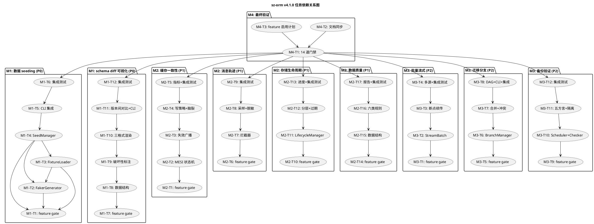

# sz-orm v4.1.0 编码任务规划

> 版本：v4.1.0（数据 seeding/fixture 管理 + schema diff 可视化 + 缓存一致性协议 + 消息轨迹追踪 + 存储生命周期管理 + 数据质量自动检测 + 批量流式处理 + 迁移版本分支 + 备份验证自动化）
> 基线：v4.0.0（AI 自动调优闭环 + 多 LLM 模型 + 混合搜索 + 数据 lineage + 分片 rebalance + failover 自动化 + 服务网格 + GraphQL 深度集成 + CDC，9 项能力全部通过 feature gate 隔离，已验收基线）
> 日期：2026-08-11
> 文档定位：编码任务规划（How to execute），对应需求规格 `spec.md`（What to build）与技术设计 `design.md`（How to build）
> 任务约束：无 Breaking Change（9 个 feature gate 隔离）+ 优先复用既有能力 + 五方言覆盖 + 每项任务附 file:line 代码证据 + unsafe 零容忍 + 禁止占位实现（todo!/unimplemented!/unreachable!）
> 审计合规铁律：每项任务结论须附真实存在的 file:line 证据，修复后必须运行 `cargo test` 并附输出，禁止未验证即标记 ✅
> 实施顺序：按 design.md 第二章依赖关系，M1 P0（数据 seeding + schema diff 可视化，可并行）→ M2 P1（缓存一致性/消息轨迹/存储生命周期/数据质量，可并行）→ M3 P2（批量流式/迁移分支/备份验证，可并行）→ M4 最终验证

---

# 一、任务总览

## 1.1 里程碑 × 任务数 × 预期工作量

| 里程碑 | 名称 | 对应需求 | 优先级 | 任务数 | 子任务数 | 预期工作量 |
|--------|------|---------|--------|--------|----------|-----------|
| M1 | 数据 seeding/fixture 管理 | REQ-V41-001 | P0 | 6 | 42 | 1.5 周 |
| M1 | schema diff 可视化 | REQ-V41-002 | P0 | 6 | 40 | 1.5 周 |
| M2 | 缓存一致性协议 | REQ-V41-003 | P1 | 5 | 36 | 1.5 周 |
| M2 | 消息轨迹追踪 | REQ-V41-004 | P1 | 5 | 35 | 1 周 |
| M2 | 存储生命周期管理 | REQ-V41-005 | P1 | 5 | 34 | 1 周 |
| M2 | 数据质量自动检测 | REQ-V41-006 | P1 | 5 | 36 | 1.5 周 |
| M3 | 批量流式处理 | REQ-V41-007 | P2 | 5 | 32 | 1 周 |
| M3 | 迁移版本分支 | REQ-V41-008 | P2 | 5 | 34 | 1.5 周 |
| M3 | 备份验证自动化 | REQ-V41-009 | P2 | 5 | 33 | 1 周 |
| M4 | 最终验证与文档同步 | 全局 | — | 3 | 22 | 0.5 周 |
| **合计** | — | **9 项全覆盖** | — | **50** | **344** | **12 周** |

## 1.2 任务编号约定

- 主任务：`M{里程碑号}-T{任务序号}`（如 M1-T1）
- 子任务：`M{里程碑号}-T{任务序号}.{子任务序号}`（如 M1-T2.1）
- 集成验证任务：每个需求末尾固定一个集成测试任务（如 M1-T6）
- 里程碑内需求按 REQ-V41-xxx 序号顺序编排任务

## 1.3 全局约束（适用于所有任务）

1. **feature gate 隔离**：所有新能力通过 feature gate 隔离（`data-seeding` / `schema-diff-viz` / `cache-coherence` / `message-tracing` / `storage-lifecycle` / `data-quality` / `batch-stream` / `migration-branch` / `backup-verify`），默认 feature 行为不变
2. **既有 API 不变**：既有公开 API 签名完全向后兼容，sz-pay 既有代码不受影响（sz-pay 从 crates.io 拉取 sz-orm-* 6 个包）
3. **禁止占位实现**：禁止 `todo!`/`unimplemented!`/`unreachable!`
4. **unsafe 零容忍**：所有新增代码无 `unsafe` 块，或必须有 `// SAFETY:` 注释
5. **五方言覆盖**：MySQL/PostgreSQL/SQLite/Oracle/MSSQL，schema diff/数据质量/备份验证/seeding 按方言能力适配
6. **审计证据**：每项任务结论附真实存在的 file:line 证据
7. **测试基线不回退**：v4.0.0 已验收测试基线不回退，v4.1.0 仅增不减
8. **复用优先**：优先复用既有能力，不重复实现（如 seeding 复用 cmd_make_seeder/cmd_seed/MigrationResolver，schema diff 可视化复用 SchemaDiff/diff/DdlGenerator，缓存一致性复用 L1L2Coordinator/sz-orm-queue，消息轨迹复用 Tracer/MessageQueue，存储生命周期复用 Storage，数据质量复用 Validate，批量流式复用 StreamApiExt/BatchOperations，迁移分支复用 Migrator，备份验证复用 BackupManager/RestoreManager）
9. **Windows MSVC 编译环境**：RUST_MIN_STACK=134217728, CARGO_INCREMENTAL=0
10. **测试命令**：`cargo test --workspace -j 2 --no-fail-fast`

## 1.4 里程碑依赖关系

```
M1（P0，数据 seeding + schema diff 可视化，可并行）
M2（P1，缓存一致性/消息轨迹/存储生命周期/数据质量，可并行）
  - REQ-V41-003 缓存一致性复用既有 sz-orm-queue 做失效广播
  - REQ-V41-004 消息轨迹复用既有 sz-orm-tracing + sz-orm-queue
M3（P2，批量流式/迁移分支/备份验证，可并行）
M4（最终验证）依赖 M1-M3 全部完成
```

> **依赖关系说明**：M1/M2/M3 内各需求相互独立可并行开发；跨需求依赖仅复用既有包（sz-orm-queue/sz-orm-tracing），无新增需求间依赖；M4 必须最后执行。

## 1.5 feature gate 定义与测试命令

| feature gate | 所属包 | 依赖 | 测试命令 |
|-------------|--------|------|---------|
| `data-seeding` | sz-orm-core | rand/serde_yaml/serde_json（既有） | `cargo test -p sz-orm-core --features data-seeding` |
| `schema-diff-viz` | sz-orm-core | 既有 SchemaDiff/diff/DdlGenerator | `cargo test -p sz-orm-core --features schema-diff-viz` |
| `cache-coherence` | sz-orm-core | sz-orm-queue（既有） | `cargo test -p sz-orm-core --features cache-coherence` |
| `message-tracing` | sz-orm-queue | sz-orm-tracing（既有） | `cargo test -p sz-orm-queue --features message-tracing` |
| `storage-lifecycle` | sz-orm-storage | 既有 Storage 7 provider | `cargo test -p sz-orm-storage --features storage-lifecycle` |
| `data-quality` | sz-orm-audit | 既有 Validate/serde_yaml | `cargo test -p sz-orm-audit --features data-quality` |
| `batch-stream` | sz-orm-batch | sz-orm-core StreamApiExt（既有） | `cargo test -p sz-orm-batch --features batch-stream` |
| `migration-branch` | sz-orm-core | 既有 Migrator/MigrationResolver | `cargo test -p sz-orm-core --features migration-branch` |
| `backup-verify` | sz-orm-back | 既有 BackupManager/RestoreManager | `cargo test -p sz-orm-back --features backup-verify` |

---

# 二、M1：数据 seeding/fixture 管理（REQ-V41-001，P0）

**目标**：提供 `FakerGenerator`（faker 数据生成）+ `FixtureLoader`（YAML/JSON fixture 加载）+ `SeedManager`（种子数据版本管理与依赖排序）+ CLI 集成，复用既有 `cmd_make_seeder`/`cmd_seed` 作为入口增强。
**预期工作量**：1.5 周
**对应需求**：REQ-V41-001（spec.md 5.1，design.md 2.2.2 REQ-V41-001）
**依赖**：无（M1-001 为 P0 独立需求）

## M1-T1：data-seeding feature gate 体系搭建

**任务描述**：在 sz-orm-core 中新增 `data-seeding` feature gate 及对应可选依赖（rand/serde_yaml），作为数据 seeding 管理的隔离基础。默认关闭，避免无配置环境行为变化。

**涉及文件**：
- `packages/sz-orm-core/Cargo.toml`（新增 `data-seeding` feature + rand/serde_yaml 可选依赖，复用既有 feature gate 模式 `:83-121`）

**复用标注**：复用既有 feature gate 体系（`packages/sz-orm-core/Cargo.toml:83-121`，已有 prod-ready 14 子 feature + v3.9.0 4 feature + v4.0.0 9 feature）、既有 serde_yaml/serde_json 依赖

**子任务**：
- [ ] M1-T1.1 在 `packages/sz-orm-core/Cargo.toml` `[features]` 新增 `data-seeding = ["dep:rand", "dep:serde_yaml"]`，位置在既有 feature 之后，默认关闭
- [ ] M1-T1.2 在 `packages/sz-orm-core/Cargo.toml` `[dependencies]` 确认 `rand` 与 `serde_yaml` 可选依赖（若不存在则新增 `optional = true`）
- [ ] M1-T1.3 验证 `cargo check -p sz-orm-core`（默认 feature，不启用 data-seeding）编译通过，行为与 v4.0.0 一致
- [ ] M1-T1.4 验证 `cargo check -p sz-orm-core --features data-seeding` 编译通过
- [ ] M1-T1.5 验证 `cargo check --workspace --all-targets --all-features` 编译通过（feature 全组合门禁）

**验收标准**：
1. `cargo check -p sz-orm-core` 默认编译通过，无 data-seeding 相关代码生效
2. `cargo check -p sz-orm-core --features data-seeding` 编译通过
3. 既有 API 签名完全不变，`cargo test --workspace` 既有测试全部通过（v4.0.0 基线不回退）
4. 附 `packages/sz-orm-core/Cargo.toml` 新增 feature 与依赖定义的 file:line 证据

**依赖**：无（基础设施任务，M1-001 所有任务依赖此任务）

---

## M1-T2：FakerGenerator（faker 数据生成器）

**任务描述**：在 sz-orm-core 新增 `seeding` 模块，实现 `FakerGenerator`（按字段类型生成随机/语义化假数据：姓名/邮箱/地址/手机号/UUID/日期/数字/布尔/枚举/JSON），支持字段语义自定义生成器。

**涉及文件**：
- `packages/sz-orm-core/src/seeding/mod.rs`（新增模块，定义 `FakerGenerator`、`FieldGenerator` trait、`SeedError`）
- `packages/sz-orm-core/src/seeding/faker.rs`（新增，FakerGenerator 实现与内置字段生成器）
- `packages/sz-orm-core/src/lib.rs`（新增 `#[cfg(feature = "data-seeding")] pub mod seeding;`）

**复用标注**：
- 既有 `MockConnection`（`packages/sz-orm-core/src/mock.rs:63`）：测试 Mock 连接，作为 seeding 测试基础
- 既有 rand 依赖：M1-T1 新增的可选依赖
- 既有 serde_json 依赖：用于生成 JSON 类型数据

**子任务**：
- [ ] M1-T2.1 在 `seeding/mod.rs` 定义 `pub trait FieldGenerator: Send + Sync`：`fn generate(&self, rng: &mut rand::rngs::StdRng) -> serde_json::Value`（design.md `:775-777`）
- [ ] M1-T2.2 定义 `pub struct FakerGenerator { field_generators: HashMap<String, Box<dyn FieldGenerator>>, rng: rand::rngs::StdRng }`（design.md `:769-772`）
- [ ] M1-T2.3 定义 `SeedError` 枚举（使用 thiserror）：`EnvForbidden` / `DependencyCycle { chain: String }` / `FixtureParseFailed { path: String, reason: String }` / `SeedExecution { version: String, reason: String }` / `InvalidConfig(String)`
- [ ] M1-T2.4 在 `faker.rs` 实现内置字段生成器：`NameGenerator`（姓名）、`EmailGenerator`（邮箱）、`AddressGenerator`（地址）、`PhoneGenerator`（手机号）、`UuidGenerator`（UUID）、`DateGenerator`（日期）、`NumberGenerator`（数字）、`BooleanGenerator`（布尔）、`EnumGenerator`（枚举）、`JsonGenerator`（JSON）
- [ ] M1-T2.5 实现 `FakerGenerator::new() -> Self`：注册内置字段生成器，初始化 StdRng
- [ ] M1-T2.6 实现 `FakerGenerator::generate_batch(&mut self, model: &ModelDef, count: usize) -> Vec<Record>`：按模型字段类型映射生成器，生成 count 条记录（spec 5.1.1 规则 1，design.md `:781`）
- [ ] M1-T2.7 实现 `FakerGenerator::register(&mut self, field_semantic: &str, generator: Box<dyn FieldGenerator>)`：注册字段语义自定义生成器（如 `user.email` 用邮箱生成器）（design.md `:784`）
- [ ] M1-T2.8 实现 `FakerGenerator::infer_generator(field_type: &FieldType) -> Box<dyn FieldGenerator>`：按字段类型推断默认生成器（String→Name、i32/u32→Number、bool→Boolean、Uuid→Uuid、DateTime→Date）
- [ ] M1-T2.9 在 `packages/sz-orm-core/src/lib.rs` 新增 `#[cfg(feature = "data-seeding")] pub mod seeding;`
- [ ] M1-T2.10 编写单元测试：定义 User 模型含 name:String/email:String/age:u32，调用 `generate_batch` 生成 10 条，验证 name 非空、email 含 @、age 在 18-65 范围（spec 5.1.1 规则 1 验收条件）
- [ ] M1-T2.11 编写单元测试：`register("user.email", EmailGenerator)` 后生成数据 email 字段使用自定义生成器
- [ ] M1-T2.12 编写单元测试：faker 单条数据生成开销 ≤10μs，批量 10,000 条 ≤100ms（spec 4.1 性能 1）

**验收标准**：
1. `FakerGenerator` 支持按字段类型生成随机/语义化假数据（姓名/邮箱/地址/手机号/UUID/日期/数字/布尔/枚举/JSON）
2. 支持字段语义自定义生成器（`register` 方法）
3. 生成数据语义正确（email 含 @、age 在合理范围）
4. 性能达标（单条 ≤10μs，批量 10,000 条 ≤100ms）
5. `cargo test -p sz-orm-core --features data-seeding` 新增测试全部通过
6. 附 `packages/sz-orm-core/src/seeding/faker.rs` 新增代码的 file:line 证据

**依赖**：M1-T1（feature gate 体系）

---

## M1-T3：FixtureLoader（fixture 模板加载器）

**任务描述**：实现 `FixtureLoader`，从 YAML/JSON 文件加载静态测试数据模板，解析关联引用（如 `${user.0.id}`），支持模板继承与覆盖。

**涉及文件**：
- `packages/sz-orm-core/src/seeding/fixture.rs`（新增，FixtureLoader 实现）

**复用标注**：
- 既有 serde_yaml/serde_json 依赖：M1-T1 新增的可选依赖
- 既有 `MigrationResolver`（`packages/sz-orm-core/src/migration.rs:62`）：版本管理模式参考

**子任务**：
- [ ] M1-T3.1 定义 `pub struct FixtureTemplate { pub table: String, pub records: Vec<Record>, pub count: usize, pub references: Vec<Reference>, pub extends: Option<String> }`（design.md `:800-807`）
- [ ] M1-T3.2 定义 `pub struct Reference { pub field: String, pub target_table: String, pub target_index: usize, pub target_field: String }`（关联引用 `${user.0.id}`）
- [ ] M1-T3.3 实现 `pub struct FixtureLoader`，`load(path: &str) -> Result<FixtureTemplate, SeedError>`：解析 YAML/JSON 文件为 FixtureTemplate（spec 5.1.1 规则 2，design.md `:791-792`）
- [ ] M1-T3.4 实现 `FixtureLoader::resolve_references(template: &mut FixtureTemplate, resolved: &HashMap<String, Vec<Record>>) -> Result<(), SeedError>`：解析关联引用 `${user.0.id}`，从已解析记录中查找引用值（design.md `:794-796`）
- [ ] M1-T3.5 实现模板继承：`template.extends` 指定父模板，加载父模板后用子模板覆盖（字段级覆盖）
- [ ] M1-T3.6 实现 `FixtureLoader::load_dir(dir: &str) -> Result<Vec<FixtureTemplate>, SeedError>`：加载目录下所有 fixture 文件，按文件名排序
- [ ] M1-T3.7 fixture YAML 格式定义：`table: users` + `count: 10` + `fields: { name: "张三", email: "${faker.email}" }` + `references: [{ field: user_id, target: users, index: 0, target_field: id }]`
- [ ] M1-T3.8 编写单元测试：fixture 文件定义 users 表 10 条 + orders 表引用 users.id，加载后 orders 每条记录的 user_id 正确引用 users 记录 id（spec 5.1.1 规则 2 验收条件）
- [ ] M1-T3.9 编写单元测试：模板继承（子模板 extends 父模板，覆盖字段值）
- [ ] M1-T3.10 编写单元测试：fixture 文件格式错误时返回 `SeedError::FixtureParseFailed { path, reason }`，含文件路径与错误位置（spec 5.1.3 异常 3）
- [ ] M1-T3.11 编写单元测试：fixture 加载开销 ≤50ms/文件，大型 fixture（10,000 条）≤500ms（spec 4.1 性能 2）

**验收标准**：
1. `FixtureLoader` 支持 YAML/JSON 文件加载，解析关联引用 `${user.0.id}`
2. 支持模板继承与覆盖
3. 格式错误时返回含路径与错误位置的 `SeedError::FixtureParseFailed`
4. 性能达标（≤50ms/文件，大型 ≤500ms）
5. `cargo test -p sz-orm-core --features data-seeding` 新增测试全部通过
6. 附 `packages/sz-orm-core/src/seeding/fixture.rs` 新增代码的 file:line 证据

**依赖**：M1-T1（feature gate）、M1-T2（FakerGenerator/SeedError）

---

## M1-T4：SeedManager（种子版本管理 + 依赖排序 + 幂等执行）

**任务描述**：实现 `SeedManager`，管理种子数据版本（类似迁移版本），按依赖拓扑排序执行，支持幂等执行（upsert/truncate+insert），环境隔离（dev/test/staging/production）。

**涉及文件**：
- `packages/sz-orm-core/src/seeding/manager.rs`（新增，SeedManager 实现）

**复用标注**：
- 既有 `MigrationResolver`（`packages/sz-orm-core/src/migration.rs:62`）：版本管理模式复用
- 既有 `cmd_seed`（`cli/src/main.rs:808`）：CLI seed 执行命令，作为入口增强
- M1-T2 `FakerGenerator`、M1-T3 `FixtureLoader`

**子任务**：
- [ ] M1-T4.1 定义 `pub struct SeedFile { pub version: String, pub description: String, pub dependencies: Vec<String>, pub template: FixtureTemplate }`（design.md `:827-833`）
- [ ] M1-T4.2 定义 `pub enum SeedMode { Upsert, TruncateInsert }`（幂等模式，design.md `:819-820`）+ `pub enum SeedEnv { Dev, Test, Staging, Production }`（环境，design.md `:823-824`）
- [ ] M1-T4.3 定义 `pub struct SeedManager { seeds: Vec<SeedFile>, mode: SeedMode, env: SeedEnv, allow_production: bool, executed_versions: HashSet<String> }`（design.md `:810-816`）
- [ ] M1-T4.4 定义 `pub struct SeedReport { pub executed_seeds: Vec<SeedExecution>, pub total_rows: u64, pub total_duration: Duration, pub idempotent: bool, pub env: SeedEnv }`（design.md `:836-843`）
- [ ] M1-T4.5 实现 `SeedManager::topological_sort(&self) -> Result<Vec<&SeedFile>, SeedError>`：按 dependencies 拓扑排序，检测循环依赖返回 `SeedError::DependencyCycle`（spec 5.1.1 规则 3，design.md `:854-855`）
- [ ] M1-T4.6 实现 `SeedManager::check_env(&self) -> Result<(), SeedError>`：环境隔离检查，非 dev/test/staging 且未配置 allow_production 返回 `SeedError::EnvForbidden`（spec 5.1.1 规则 5）
- [ ] M1-T4.7 实现 `SeedManager::seed(&mut self, conn: &dyn Connection) -> Result<SeedReport, SeedError>`：编排环境检查→拓扑排序→按排序执行种子→记录已执行版本（design.md `:847-852`）
- [ ] M1-T4.8 实现幂等执行：mode=Upsert 时执行 `INSERT ... ON CONFLICT UPDATE`（参数化）；mode=TruncateInsert 时先 `TRUNCATE` 再 `INSERT`（spec 5.1.1 规则 4）
- [ ] M1-T4.9 实现已执行版本记录：执行前检查 `executed_versions`，已执行则跳过，执行后加入集合
- [ ] M1-T4.10 实现 `SeedManager::load_seeds(dir: &str) -> Result<Self, SeedError>`：从目录加载种子文件，解析版本号/描述/依赖
- [ ] M1-T4.11 编写单元测试：种子 A（users）← 种子 B（orders 依赖 users），执行 SeedManager，先执行 A 再执行 B，记录已执行版本，重复执行跳过（spec 5.1.1 规则 3 验收条件）
- [ ] M1-T4.12 编写单元测试：执行 seed 两次，mode=Upsert 第二次不产生重复数据；mode=TruncateInsert 第二次先清空再插入，行数不变（spec 5.1.1 规则 4 验收条件）
- [ ] M1-T4.13 编写单元测试：环境=Production 且未配置 allow_production，拒绝执行，提示 "production seeding forbidden"（spec 5.1.1 规则 5 验收条件，spec 5.1.3 异常 1）
- [ ] M1-T4.14 编写单元测试：依赖循环（A←B←A）检测，返回 `SeedError::DependencyCycle { chain: "A←B←A" }`（spec 5.1.3 异常 2）

**验收标准**：
1. `SeedManager` 支持版本管理 + 依赖拓扑排序 + 幂等执行 + 环境隔离
2. 依赖排序正确（A←B 先执行 A）
3. 幂等执行正确（Upsert 不重复，TruncateInsert 行数不变）
4. 环境隔离正确（production 拒绝，allow_production=true 放行）
5. 循环依赖检测正确
6. `cargo test -p sz-orm-core --features data-seeding` 新增测试全部通过
7. 附 `packages/sz-orm-core/src/seeding/manager.rs` 新增代码的 file:line 证据

**依赖**：M1-T1（feature gate）、M1-T2（FakerGenerator）、M1-T3（FixtureLoader）

---

## M1-T5：CLI 集成（增强既有 cmd_make_seeder/cmd_seed）

**任务描述**：增强既有 CLI 命令 `cmd_make_seeder`（`:770`）与 `cmd_seed`（`:808`），支持 `--faker`/`--fixture`/`--env` 参数，不修改既有命令行为。

**涉及文件**：
- `cli/src/main.rs`（增强既有 `cmd_make_seeder:770` 与 `cmd_seed:808`，新增 `--faker`/`--fixture`/`--env` 参数解析）
- `cli/Cargo.toml`（新增 `data-seeding` feature gate 透传）

**复用标注**：
- 既有 `cmd_make_seeder`（`cli/src/main.rs:770`）：CLI seeder 骨架命令，保留不动，新增 `--faker` 增强
- 既有 `cmd_seed`（`cli/src/main.rs:808`）：CLI seed 执行命令，保留不动，新增 `--fixture`/`--env` 增强

**子任务**：
- [ ] M1-T5.1 在 `cli/Cargo.toml` 新增 `data-seeding` feature，透传 `sz-orm-core/data-seeding`
- [ ] M1-T5.2 增强 `cmd_make_seeder`：新增 `--faker` 参数，生成 faker seeder 骨架（含 FakerGenerator 引用），既有无 `--faker` 行为不变（spec 5.1.1 规则 6/7）
- [ ] M1-T5.3 增强 `cmd_seed`：新增 `--fixture=path` 参数，加载 fixture 文件执行 seeding，既有无 `--fixture` 行为不变
- [ ] M1-T5.4 增强 `cmd_seed`：新增 `--env=test` 参数，指定执行环境，既有无 `--env` 行为默认 dev
- [ ] M1-T5.5 增强 `cmd_seed`：新增 `--mode=upsert|truncate_insert` 参数，指定幂等模式
- [ ] M1-T5.6 实现 CLI 输出执行报告：种子列表/执行顺序/行数/耗时/幂等标记/环境（spec 4.4 可维护性 1）
- [ ] M1-T5.7 验证既有 `cmd_make_seeder` 与 `cmd_seed` 签名 `Result<(), String>` 不变，新增参数为可选增强
- [ ] M1-T5.8 编写单元测试：执行 `sz-orm seed --fixture=fixtures/users.yml --env=test`，加载 fixture，在 test 环境执行 seeding，输出执行报告（spec 5.1.1 规则 6 验收条件）
- [ ] M1-T5.9 编写单元测试：不启用 `data-seeding` feature，执行既有 `sz-orm seed`，行为与 v4.0.0 一致（spec 5.1.1 规则 7 验收条件）

**验收标准**：
1. CLI 增强 `--faker`/`--fixture`/`--env`/`--mode` 参数，既有命令行为不变
2. 输出结构化执行报告（种子/顺序/行数/耗时/幂等/环境）
3. 不启用 feature 时既有行为与 v4.0.0 一致
4. `cargo test -p sz-orm-cli --features data-seeding` 新增测试全部通过
5. 附 `cli/src/main.rs` 增强代码的 file:line 证据

**依赖**：M1-T1（feature gate）、M1-T2（FakerGenerator）、M1-T3（FixtureLoader）、M1-T4（SeedManager）

---

## M1-T6：M1-001 集成测试与门禁验证

**任务描述**：对 M1-001 所有任务进行集成验证，确保 feature gate 隔离正确、既有 API 不变、测试基线不回退。

**涉及文件**：
- `packages/sz-orm-core/tests/seeding_test.rs`（新增 M1-001 集成测试，`required-features = ["data-seeding"]`）
- `packages/sz-orm-core/Cargo.toml`（新增 `[[test]]` 条目，`required-features = ["data-seeding"]`）

**子任务**：
- [ ] M1-T6.1 运行 `cargo fmt --all -- --check`（门禁 1：fmt 格式检查）
- [ ] M1-T6.2 运行 `cargo check --workspace --all-targets`（门禁 2：默认 feature 编译检查，验证 data-seeding 未启用时行为不变）
- [ ] M1-T6.3 运行 `cargo clippy --workspace --all-targets -- -D warnings`（门禁 3：clippy 静态分析）
- [ ] M1-T6.4 运行 `cargo test --workspace`（门禁 4：既有测试基线不回退）
- [ ] M1-T6.5 运行 `cargo test -p sz-orm-core --features data-seeding`（M1-001 新增测试全部通过）
- [ ] M1-T6.6 运行 `cargo check --workspace --all-targets --all-features`（门禁 10：feature 全组合编译，含 data-seeding）
- [ ] M1-T6.7 扫描新增代码无 `todo!`/`unimplemented!`/`unreachable!`（门禁 8：禁止占位实现）
- [ ] M1-T6.8 扫描新增代码无 `unsafe` 块或有 `// SAFETY:` 注释（unsafe 零容忍）
- [ ] M1-T6.9 验证既有 `cmd_make_seeder:770`/`cmd_seed:808` 签名与行为不变

**验收标准**：
1. 14 道门禁中 M1-001 相关门禁全部通过（1/2/3/4/8/10）
2. 既有测试基线不回退
3. `data-seeding` feature 全组合编译通过
4. 新增代码无占位实现、无 unsafe（或有 SAFETY 注释）
5. 既有 CLI seeder 签名与行为不变
6. 附门禁运行输出证据

**依赖**：M1-T1、M1-T2、M1-T3、M1-T4、M1-T5

---

# 三、M1：schema diff 可视化（REQ-V41-002，P0）

**目标**：提供 `SchemaDiffVisualizer`，将既有 `SchemaDiff` 渲染为可视化报告（CLI 彩色/HTML/Markdown），标注破坏性变更，生成影响摘要，支持版本间 diff 对比，复用既有 `SchemaDiff`/`diff`/`DdlGenerator`。
**预期工作量**：1.5 周
**对应需求**：REQ-V41-002（spec.md 5.2，design.md 2.2.2 REQ-V41-002）
**依赖**：无（M1-002 为 P0 独立需求，与 M1-001 可并行）

## M1-T7：schema-diff-viz feature gate 体系搭建

**任务描述**：在 sz-orm-core 中新增 `schema-diff-viz` feature gate，作为 schema diff 可视化的隔离基础。

**涉及文件**：
- `packages/sz-orm-core/Cargo.toml`（新增 `schema-diff-viz` feature）

**复用标注**：复用既有 feature gate 体系（`packages/sz-orm-core/Cargo.toml:83-121`）

**子任务**：
- [ ] M1-T7.1 在 `packages/sz-orm-core/Cargo.toml` `[features]` 新增 `schema-diff-viz = []`（无新增依赖，复用既有 SchemaDiff/diff/DdlGenerator），默认关闭
- [ ] M1-T7.2 验证 `cargo check -p sz-orm-core` 默认编译通过，无 schema-diff-viz 相关代码生效
- [ ] M1-T7.3 验证 `cargo check -p sz-orm-core --features schema-diff-viz` 编译通过
- [ ] M1-T7.4 验证 `cargo check --workspace --all-targets --all-features` 编译通过

**验收标准**：
1. `schema-diff-viz` feature 默认关闭，默认编译行为与 v4.0.0 一致
2. feature 全组合编译通过
3. 附 `packages/sz-orm-core/Cargo.toml` 新增 feature 的 file:line 证据

**依赖**：无（基础设施任务）

---

## M1-T8：SchemaDiffVisualizer + DiffReport 数据结构

**任务描述**：在 sz-orm-core 新增 `schema_diff_viz` 模块，定义 `SchemaDiffVisualizer`、`DiffReport`、`ChangeAnnotation`、`ImpactSummary`、`DiffFormat` 等数据结构。

**涉及文件**：
- `packages/sz-orm-core/src/schema_diff_viz.rs`（新增模块，定义数据结构与可视化器）
- `packages/sz-orm-core/src/lib.rs`（新增 `#[cfg(feature = "schema-diff-viz")] pub mod schema_diff_viz;`）

**复用标注**：
- 既有 `SchemaDiff`（`packages/sz-orm-core/src/schema_sync.rs:100`）：schema 差异结构，渲染输入
- 既有 `diff` 函数（`packages/sz-orm-core/src/schema_sync.rs:200`）：差分计算，版本间对比复用
- 既有 `DdlGenerator` trait（`packages/sz-orm-core/src/schema_sync.rs:361`）：5 方言 DDL 生成器

**子任务**：
- [ ] M1-T8.1 定义 `pub enum DiffFormat { Cli, Html, Markdown }`（三格式，design.md `:878-879`）
- [ ] M1-T8.2 定义 `pub struct ChangeAnnotation { pub change: ChangeItem, pub is_destructive: bool, pub marker: &'static str }`（破坏性标注，design.md `:891-896`）
- [ ] M1-T8.3 定义 `pub struct ImpactSummary { pub added_tables: usize, pub dropped_tables: usize, pub modified_tables: usize, pub added_columns: usize, pub dropped_columns: usize, pub destructive_changes: usize, pub estimated_affected_rows: u64 }`（影响摘要，design.md `:899-908`）
- [ ] M1-T8.4 定义 `pub struct DiffReport { pub format: DiffFormat, pub content: String, pub annotations: Vec<ChangeAnnotation>, pub impact_summary: ImpactSummary }`（diff 报告，design.md `:882-888`）
- [ ] M1-T8.5 定义 `pub struct SchemaDiffVisualizer { dialect: DbType }`（可视化器，design.md `:873-875`）
- [ ] M1-T8.6 定义 `DiffVizError` 枚举：`SchemaFetchFailed { reason: String }` / `UnsupportedType { column: String }` / `RenderFailed(String)`
- [ ] M1-T8.7 在 `packages/sz-orm-core/src/lib.rs` 新增 `#[cfg(feature = "schema-diff-viz")] pub mod schema_diff_viz;`
- [ ] M1-T8.8 编写单元测试：`DiffReport` 结构正确构造，`ChangeAnnotation` 破坏性/非破坏性标注

**验收标准**：
1. `SchemaDiffVisualizer`/`DiffReport`/`ChangeAnnotation`/`ImpactSummary`/`DiffFormat` 数据结构完整可用
2. `cargo test -p sz-orm-core --features schema-diff-viz` 新增测试全部通过
3. 附 `packages/sz-orm-core/src/schema_diff_viz.rs` 新增代码的 file:line 证据

**依赖**：M1-T7（feature gate）

---

## M1-T9：破坏性变更标注 + 影响摘要

**任务描述**：实现破坏性变更识别（DROP TABLE/DROP COLUMN/ALTER COLUMN 类型变更/缩短长度/NOT NULL 加约束）与影响摘要生成。

**涉及文件**：
- `packages/sz-orm-core/src/schema_diff_viz.rs`（增强，实现标注与摘要）

**复用标注**：既有 `SchemaDiff`（`packages/sz-orm-core/src/schema_sync.rs:100`）：变更项识别基础

**子任务**：
- [ ] M1-T9.1 实现 `SchemaDiffVisualizer::annotate_changes(&self, diff: &SchemaDiff) -> Vec<ChangeAnnotation>`：识别破坏性变更（spec 5.2.1 规则 2）
- [ ] M1-T9.2 识别 DROP TABLE 为破坏性（is_destructive=true, marker="⚠️"）
- [ ] M1-T9.3 识别 DROP COLUMN 为破坏性
- [ ] M1-T9.4 识别 ALTER COLUMN 类型变更（如 VARCHAR→INT）为破坏性
- [ ] M1-T9.5 识别缩短长度（如 VARCHAR(255)→VARCHAR(100)）为破坏性
- [ ] M1-T9.6 识别 NOT NULL 加约束为破坏性（允许 NULL→NOT NULL）
- [ ] M1-T9.7 识别 ADD TABLE/ADD COLUMN/ADD INDEX 为非破坏性（is_destructive=false, marker="✓"）
- [ ] M1-T9.8 实现 `SchemaDiffVisualizer::summarize_impact(&self, diff: &SchemaDiff) -> ImpactSummary`：统计新增/删除/修改表列数 + 破坏性变更数 + 预估影响行数（spec 5.2.1 规则 3）
- [ ] M1-T9.9 编写单元测试：diff 含 DROP COLUMN + ADD COLUMN，DROP COLUMN 红色 ⚠️ 破坏性，ADD COLUMN 绿色 ✓ 非破坏性（spec 5.2.1 规则 2 验收条件）
- [ ] M1-T9.10 编写单元测试：diff 含 2 新增表 + 1 删除表 + 3 修改表，摘要 "6 表变更，2 新增/1 删除/3 修改，破坏性 1"（spec 5.2.1 规则 3 验收条件）

**验收标准**：
1. 破坏性变更识别正确（DROP TABLE/DROP COLUMN/ALTER 类型/缩短长度/NOT NULL 加约束）
2. 非破坏性变更标注正确（ADD TABLE/ADD COLUMN/ADD INDEX）
3. 影响摘要统计正确（表/列/破坏性变更数/预估影响行数）
4. `cargo test -p sz-orm-core --features schema-diff-viz` 新增测试全部通过
5. 附 `packages/sz-orm-core/src/schema_diff_viz.rs` 新增代码的 file:line 证据

**依赖**：M1-T7（feature gate）、M1-T8（数据结构）

---

## M1-T10：三格式渲染（CLI/HTML/Markdown）+ 五方言差异

**任务描述**：实现 `SchemaDiffVisualizer::visualize`，将既有 `SchemaDiff` 渲染为 CLI 彩色/HTML/Markdown 三格式报告，标注五方言特定差异。

**涉及文件**：
- `packages/sz-orm-core/src/schema_diff_viz.rs`（增强，实现三格式渲染）

**复用标注**：
- 既有 `DdlGenerator` trait（`packages/sz-orm-core/src/schema_sync.rs:361`）：5 方言 DDL 生成器（`MySqlDdlGenerator:369`/`PgDdlGenerator:439`/`SqliteDdlGenerator:479`/`OracleDdlGenerator:522`/`MssqlDdlGenerator:565`）
- 既有 `SchemaDiff`（`packages/sz-orm-core/src/schema_sync.rs:100`）：渲染输入

**子任务**：
- [ ] M1-T10.1 实现 `SchemaDiffVisualizer::visualize(&self, diff: &SchemaDiff, format: DiffFormat) -> DiffReport`：编排标注→摘要→渲染（design.md `:911-917`）
- [ ] M1-T10.2 实现 CLI 彩色 diff 渲染：新增表绿色 +、删除表红色 -、修改表黄色 ~，类似 git diff（spec 5.2.1 规则 1a）
- [ ] M1-T10.3 实现 HTML 报告渲染：含表/字段变更详情 + 破坏性标注（⚠️/✓）+ 影响摘要，可独立打开
- [ ] M1-T10.4 实现 Markdown 报告渲染：可嵌入文档，含变更表格 + 破坏性标注 + 影响摘要
- [ ] M1-T10.5 实现五方言差异标注：复用既有 `DdlGenerator:361` 5 方言实现，标注方言特定差异（如 MySQL AUTO_INCREMENT vs PostgreSQL SERIAL，design.md `:932`）
- [ ] M1-T10.6 渲染时不重新计算 diff，仅渲染既有 `SchemaDiff` 结果（spec 5.2.1 规则 5）
- [ ] M1-T10.7 编写单元测试：schema 含新增表 users + 删除表 old_logs + 修改表 orders 加列 amount，CLI diff 绿色 +users、红色 -old_logs、黄色 ~orders；HTML/Markdown 含详情（spec 5.2.1 规则 1 验收条件）
- [ ] M1-T10.8 编写单元测试：MySQL schema 含 AUTO_INCREMENT，PostgreSQL 含 SERIAL，diff 标注方言特定差异（spec 5.2.1 规则 7 验收条件）
- [ ] M1-T10.9 编写单元测试：schema diff 可视化报告生成开销 ≤200ms（表数量 ≤100，spec 4.1 性能 3）

**验收标准**：
1. 三格式渲染正确（CLI 彩色/HTML/Markdown）
2. 五方言差异标注正确（复用既有 DdlGenerator 5 方言）
3. 不重新计算 diff，仅渲染既有结果
4. 性能达标（≤200ms，表数量 ≤100）
5. `cargo test -p sz-orm-core --features schema-diff-viz` 新增测试全部通过
6. 附 `packages/sz-orm-core/src/schema_diff_viz.rs` 新增代码的 file:line 证据

**依赖**：M1-T7（feature gate）、M1-T8（数据结构）、M1-T9（标注与摘要）

---

## M1-T11：版本间 diff 对比 + CLI 集成

**任务描述**：实现版本间 diff 对比（从版本 A 到版本 B 的 schema 变更），CLI 集成 `sz-orm migrate:diff --format=cli/html/markdown`。

**涉及文件**：
- `packages/sz-orm-core/src/schema_diff_viz.rs`（增强，实现版本间对比）
- `cli/src/main.rs`（新增 `cmd_migrate_diff` 命令）
- `cli/Cargo.toml`（新增 `schema-diff-viz` feature gate 透传）

**复用标注**：
- 既有 `diff` 函数（`packages/sz-orm-core/src/schema_sync.rs:200`）：版本间对比复用
- 既有 `SchemaSync`（`packages/sz-orm-core/src/schema_sync.rs:612`）：schema 同步编排
- 既有 `cmd_generate_schema`（`cli/src/main.rs:1389`）：CLI schema 生成命令

**子任务**：
- [ ] M1-T11.1 实现 `SchemaDiffVisualizer::diff_between_versions(&self, from: &str, to: &str, conn: &dyn Connection) -> Result<DiffReport, DiffVizError>`：加载两版本 schema，复用既有 `diff:200` 计算差分（spec 5.2.1 规则 4，design.md `:919-924`）
- [ ] M1-T11.2 在 `cli/Cargo.toml` 新增 `schema-diff-viz` feature，透传 `sz-orm-core/schema-diff-viz`
- [ ] M1-T11.3 在 `cli/src/main.rs` 新增 `cmd_migrate_diff(args: &[&str], config: &Option<CliConfig>) -> Result<(), String>`：解析 `--format=cli/html/markdown`/`--from`/`--to` 参数
- [ ] M1-T11.4 `cmd_migrate_diff` 调用 `SchemaDiffVisualizer::visualize` 或 `diff_between_versions`，输出报告文件或 stdout
- [ ] M1-T11.5 编写单元测试：执行 `sz-orm migrate:diff --format=html`，输出 HTML diff 报告文件（spec 5.2.1 规则 6 验收条件）
- [ ] M1-T11.6 编写单元测试：执行 `sz-orm migrate:diff --from=v001 --to=v003`，输出 v001→v003 的 schema 变更 diff（spec 5.2.1 规则 4 验收条件）
- [ ] M1-T11.7 编写单元测试：schema 获取失败时提示 "schema fetch failed: connection refused"，不输出空报告（spec 5.2.3 异常 1）

**验收标准**：
1. 版本间 diff 对比正确（复用既有 `diff:200`）
2. CLI 命令 `sz-orm migrate:diff --format=cli/html/markdown` 可用
3. schema 获取失败时正确提示，不输出空报告
4. `cargo test -p sz-orm-cli --features schema-diff-viz` 新增测试全部通过
5. 附 `cli/src/main.rs` 与 `packages/sz-orm-core/src/schema_diff_viz.rs` 新增代码的 file:line 证据

**依赖**：M1-T7（feature gate）、M1-T8（数据结构）、M1-T9（标注与摘要）、M1-T10（三格式渲染）

---

## M1-T12：M1-002 集成测试与门禁验证

**任务描述**：对 M1-002 所有任务进行集成验证，确保 feature gate 隔离正确、既有 API 不变、测试基线不回退。

**涉及文件**：
- `packages/sz-orm-core/tests/schema_diff_viz_test.rs`（新增 M1-002 集成测试，`required-features = ["schema-diff-viz"]`）
- `packages/sz-orm-core/Cargo.toml`（新增 `[[test]]` 条目）

**子任务**：
- [ ] M1-T12.1 运行 `cargo fmt --all -- --check`（门禁 1）
- [ ] M1-T12.2 运行 `cargo check --workspace --all-targets`（门禁 2，默认 feature 行为不变）
- [ ] M1-T12.3 运行 `cargo clippy --workspace --all-targets -- -D warnings`（门禁 3）
- [ ] M1-T12.4 运行 `cargo test --workspace`（门禁 4，既有测试基线不回退）
- [ ] M1-T12.5 运行 `cargo test -p sz-orm-core --features schema-diff-viz`（M1-002 新增测试全部通过）
- [ ] M1-T12.6 运行 `cargo check --workspace --all-targets --all-features`（门禁 10，feature 全组合编译）
- [ ] M1-T12.7 扫描新增代码无 `todo!`/`unimplemented!`/`unreachable!`（门禁 8）
- [ ] M1-T12.8 扫描新增代码无 `unsafe` 块或有 `// SAFETY:` 注释
- [ ] M1-T12.9 验证既有 `SchemaDiff:100`/`diff:200`/`DdlGenerator:361` 签名与行为不变

**验收标准**：
1. 14 道门禁中 M1-002 相关门禁全部通过（1/2/3/4/8/10）
2. 既有测试基线不回退
3. `schema-diff-viz` feature 全组合编译通过
4. 既有 SchemaDiff/diff/DdlGenerator 签名与行为不变
5. 附门禁运行输出证据

**依赖**：M1-T7、M1-T8、M1-T9、M1-T10、M1-T11

---

# 四、M2：缓存一致性协议（REQ-V41-003，P1）

**目标**：提供 `CacheCoherenceProtocol`（MESI 风格状态机）+ `InvalidationBroadcaster`（跨实例失效广播）+ `ConsistencyStrategy`（write-through/write-behind），复用既有 `L1L2Coordinator`/`sz-orm-queue`。
**预期工作量**：1.5 周
**对应需求**：REQ-V41-003（spec.md 5.3，design.md 2.2.2 REQ-V41-003）
**依赖**：无新增需求间依赖（复用既有 sz-orm-queue 6 provider 做失效广播）

## M2-T1：cache-coherence feature gate 体系搭建

**任务描述**：在 sz-orm-core 中新增 `cache-coherence` feature gate，依赖 sz-orm-queue（既有）做失效广播。

**涉及文件**：
- `packages/sz-orm-core/Cargo.toml`（新增 `cache-coherence` feature）

**复用标注**：复用既有 feature gate 体系（`packages/sz-orm-core/Cargo.toml:83-121`）、既有 sz-orm-queue 依赖

**子任务**：
- [ ] M2-T1.1 在 `packages/sz-orm-core/Cargo.toml` `[features]` 新增 `cache-coherence = ["dep:sz-orm-queue"]`（复用既有 sz-orm-queue 做失效广播），默认关闭
- [ ] M2-T1.2 验证 `cargo check -p sz-orm-core` 默认编译通过，无 cache-coherence 相关代码生效
- [ ] M2-T1.3 验证 `cargo check -p sz-orm-core --features cache-coherence` 编译通过
- [ ] M2-T1.4 验证 `cargo check --workspace --all-targets --all-features` 编译通过

**验收标准**：
1. `cache-coherence` feature 默认关闭，默认编译行为与 v4.0.0 一致
2. feature 全组合编译通过
3. 附 `packages/sz-orm-core/Cargo.toml` 新增 feature 的 file:line 证据

**依赖**：无（基础设施任务）

---

## M2-T2：CacheCoherenceProtocol + MESI 状态机

**任务描述**：在 sz-orm-core 新增 `cache_coherence` 模块，实现 `CacheCoherenceProtocol`（MESI 风格状态机），为每个缓存行维护 M/E/S/I 状态，编排既有 `L1L2Coordinator` 读写。

**涉及文件**：
- `packages/sz-orm-core/src/cache_coherence.rs`（新增模块，CacheCoherenceProtocol 实现）
- `packages/sz-orm-core/src/lib.rs`（新增 `#[cfg(feature = "cache-coherence")] pub mod cache_coherence;`）

**复用标注**：
- 既有 `L1L2Coordinator<T>`（`packages/sz-orm-core/src/l1_cache.rs:216`）：L1+L2 读写协调，复用读写
- 既有 `L1Cache<T>`（`packages/sz-orm-core/src/l1_cache.rs:87`）：L1 本地缓存
- 既有 `L2Cache`（`packages/sz-orm-core/src/l2_cache.rs:517`）：L2 分布式缓存
- 既有 `Cache` trait（`packages/sz-orm-core/src/cache.rs:11`）：缓存统一接口
- 既有 `MultiLevelCache`（`packages/sz-orm-core/src/cache.rs:141`）：多级缓存组合

**子任务**：
- [ ] M2-T2.1 定义 `pub enum MesiState { Modified, Exclusive, Shared, Invalid }`（MESI 状态，design.md `:951-952`）
- [ ] M2-T2.2 定义 `pub enum ConsistencyStrategy { WriteThrough, WriteBehind }`（写策略，design.md `:955-959`）
- [ ] M2-T2.3 定义 `pub struct CacheCoherenceProtocol<T: Clone> { coordinator: Arc<L1L2Coordinator<T>>, states: RwLock<HashMap<String, MesiState>>, broadcaster: Arc<InvalidationBroadcaster>, strategy: ConsistencyStrategy, metrics: Arc<CoherenceMetrics> }`（design.md `:942-948`）
- [ ] M2-T2.4 定义 `pub struct CoherenceMetrics { pub modified_count: u64, pub exclusive_count: u64, pub shared_count: u64, pub invalid_count: u64, pub invalidation_broadcasts: u64, pub coherence_violations: u64, pub write_behind_rollbacks: u64 }`（design.md `:977-986`）
- [ ] M2-T2.5 定义 `CoherenceError` 枚举：`BroadcastFailed` / `WriteBehindFailed { key: String }` / `SplitBrain { key: String }` / `CacheMiss`
- [ ] M2-T2.6 实现 `CacheCoherenceProtocol::get(&self, key: &str) -> Result<Option<T>, CoherenceError>`：检查状态（Invalid→加载 Exclusive/Shared，Valid→命中），复用既有 `L1L2Coordinator:216` 读写（design.md `:989-993`）
- [ ] M2-T2.7 实现 `CacheCoherenceProtocol::put(&self, key: &str, value: T) -> Result<(), CoherenceError>`：状态转换→Modified，按策略写数据库，广播 InvalidationEvent（design.md `:995-999`）
- [ ] M2-T2.8 实现 MESI 状态转换：Invalid→Exclusive（本地读 miss+加载无其他实例）、Invalid→Shared（本地读 miss+加载其他实例已有）、Invalid→Modified（本地写无其他实例）、Exclusive→Modified（本地写）、Exclusive→Shared（其他实例读广播）、Shared→Modified（本地写+广播其他实例 Invalid）、Modified→Invalid（失效广播收到）（spec 5.3.1 规则 1，design.md `:556-600`）
- [ ] M2-T2.9 在 `packages/sz-orm-core/src/lib.rs` 新增 `#[cfg(feature = "cache-coherence")] pub mod cache_coherence;`
- [ ] M2-T2.10 编写单元测试：实例 A 写缓存 key1 状态 M，实例 B 读 key1，A 广播 Shared，B 状态 S，A 与 B 均为 Shared（spec 5.3.1 规则 1 验收条件）
- [ ] M2-T2.11 编写单元测试：状态转换覆盖所有 MESI 转换路径（I→E、I→S、I→M、E→M、E→S、S→M、M→I）

**验收标准**：
1. `CacheCoherenceProtocol` 为每个缓存行维护 M/E/S/I 状态机
2. 状态转换由读写/失效广播触发，覆盖所有 MESI 路径
3. 复用既有 `L1L2Coordinator:216` 读写，不重复实现缓存
4. `cargo test -p sz-orm-core --features cache-coherence` 新增测试全部通过
5. 附 `packages/sz-orm-core/src/cache_coherence.rs` 新增代码的 file:line 证据

**依赖**：M2-T1（feature gate）

---

## M2-T3：InvalidationBroadcaster（跨实例失效广播）

**任务描述**：实现 `InvalidationBroadcaster`，通过消息队列（复用既有 `sz-orm-queue` 6 provider）广播缓存失效事件，其他实例收到后置对应缓存行为 Invalid。

**涉及文件**：
- `packages/sz-orm-core/src/cache_coherence.rs`（增强，实现 InvalidationBroadcaster）

**复用标注**：
- 既有 `MessageQueue` trait（`packages/sz-orm-queue/src/queue.rs:18`）：消息队列统一接口
- 既有 `MqProvider`（`packages/sz-orm-queue/src/queue.rs:183`）：6 provider（Kafka/RabbitMQ/RocketMQ/ActiveMQ/NATS/Pulsar）

**子任务**：
- [ ] M2-T3.1 定义 `pub struct InvalidationEvent { pub key: String, pub instance_id: String, pub timestamp: u64, pub op: InvalidationOp }`（design.md `:968-974`）
- [ ] M2-T3.2 定义 `pub enum InvalidationOp { Modify, Delete }`
- [ ] M2-T3.3 定义 `pub struct InvalidationBroadcaster { mq: Arc<dyn MessageQueue>, instance_id: String }`（design.md `:962-965`）
- [ ] M2-T3.4 实现 `InvalidationBroadcaster::broadcast(&self, event: &InvalidationEvent) -> Result<(), CoherenceError>`：通过消息队列广播失效事件（spec 5.3.1 规则 2）
- [ ] M2-T3.5 实现 `CacheCoherenceProtocol::handle_invalidation(&self, event: &InvalidationEvent)`：收到失效广播后置对应缓存行为 Invalid（design.md `:1002-1004`）
- [ ] M2-T3.6 实现失效广播鉴权：消息队列 ACL，禁止未授权实例接收失效广播（spec 4.3 安全性 4）
- [ ] M2-T3.7 编写单元测试：实例 A 修改 key1，广播 Invalidation，实例 B 收到，B 的 key1 置 Invalid，下次读重新加载（spec 5.3.1 规则 2 验收条件）
- [ ] M2-T3.8 编写单元测试：消息队列不可用时广播失败，本地置 Invalid，记录广播失败，告警（spec 5.3.3 异常 1）
- [ ] M2-T3.9 编写单元测试：单次失效广播开销 ≤5ms（本地状态更新 + 广播消息发送，spec 4.1 性能 4）

**验收标准**：
1. `InvalidationBroadcaster` 复用既有 `sz-orm-queue` 6 provider 广播失效事件
2. 其他实例收到失效广播后置 Invalid
3. 失效广播支持鉴权（消息队列 ACL）
4. 广播失败时本地置 Invalid + 记录 + 告警
5. 性能达标（单次 ≤5ms）
6. `cargo test -p sz-orm-core --features cache-coherence` 新增测试全部通过
7. 附 `packages/sz-orm-core/src/cache_coherence.rs` 新增代码的 file:line 证据

**依赖**：M2-T1（feature gate）、M2-T2（CacheCoherenceProtocol）

---

## M2-T4：ConsistencyStrategy（write-through/behind）+ 脑裂检测

**任务描述**：实现 write-through（同步写穿）/write-behind（异步写回）写策略，write-behind 失败回滚缓存 + 告警，实现脑裂检测。

**涉及文件**：
- `packages/sz-orm-core/src/cache_coherence.rs`（增强，实现写策略与脑裂检测）

**复用标注**：既有 `L1L2Coordinator<T>`（`packages/sz-orm-core/src/l1_cache.rs:216`）：写策略复用读写

**子任务**：
- [ ] M2-T4.1 实现 write-through 策略：写缓存同时同步写数据库，强一致（spec 5.3.1 规则 3a）
- [ ] M2-T4.2 实现 write-behind 策略：先写缓存后异步写数据库 + 失效广播，最终一致（spec 5.3.1 规则 3b）
- [ ] M2-T4.3 实现 write-behind 失败回滚：数据库写入失败时回滚缓存 + 告警 "cache write-behind rollback, db write failed"（spec 5.3.1 规则 4，spec 5.3.3 异常 2）
- [ ] M2-T4.4 实现 `CacheCoherenceProtocol::detect_split_brain(&self) -> SplitBrainStatus`：检测多实例同时 Modified 同一 key，last-write-wins 或人工解决（spec 5.3.3 异常 3，design.md `:1007-1008`）
- [ ] M2-T4.5 定义 `pub enum SplitBrainStatus { NoSplitBrain, Detected { keys: Vec<String>, resolution: String } }`
- [ ] M2-T4.6 编写单元测试：配置 strategy=WriteThrough，写 key1，缓存与数据库同步写入（spec 5.3.1 规则 3 验收条件）
- [ ] M2-T4.7 编写单元测试：配置 strategy=WriteBehind，写 key1，先写缓存，异步写数据库 + 广播失效（spec 5.3.1 规则 3 验收条件）
- [ ] M2-T4.8 编写单元测试：write-behind 模式数据库写入失败，回滚缓存，告警（spec 5.3.1 规则 4 验收条件）
- [ ] M2-T4.9 编写单元测试：脑裂检测（多实例同时 M 状态同一 key），返回 Detected + last-write-wins（spec 5.3.3 异常 3）

**验收标准**：
1. write-through 同步写穿（缓存+数据库同步，强一致）
2. write-behind 异步写回（先缓存后数据库 + 失效广播，最终一致）
3. write-behind 失败回滚缓存 + 告警
4. 脑裂检测正确（多实例 M 状态，last-write-wins）
5. `cargo test -p sz-orm-core --features cache-coherence` 新增测试全部通过
6. 附 `packages/sz-orm-core/src/cache_coherence.rs` 新增代码的 file:line 证据

**依赖**：M2-T1（feature gate）、M2-T2（CacheCoherenceProtocol）、M2-T3（InvalidationBroadcaster）

---

## M2-T5：一致性指标 + M2-003 集成测试与门禁验证

**任务描述**：实现一致性指标输出（M/E/S/I 状态行数/失效广播次数/一致性违反次数/write-behind 回滚次数），接入既有 Prometheus，集成测试与门禁验证。

**涉及文件**：
- `packages/sz-orm-core/src/cache_coherence.rs`（增强，实现指标输出）
- `packages/sz-orm-core/tests/cache_coherence_test.rs`（新增集成测试，`required-features = ["cache-coherence"]`）

**复用标注**：既有 `sz-orm-observability`（`MetricsRegistry`）：Prometheus 指标接入

**子任务**：
- [ ] M2-T5.1 实现 `CacheCoherenceProtocol::metrics(&self) -> CoherenceMetrics`：输出 M/E/S/I 状态行数 + 失效广播次数 + 一致性违反次数 + write-behind 回滚次数（spec 5.3.1 规则 6，design.md `:977-986`）
- [ ] M2-T5.2 实现指标接入既有 Prometheus（`sz-orm-observability` MetricsRegistry）：`cache_coherence_modified_count`/`cache_coherence_shared_count`/`cache_coherence_invalidation_broadcasts`/`cache_coherence_violations`/`cache_coherence_write_behind_rollbacks`
- [ ] M2-T5.3 编写单元测试：启用缓存一致性，Prometheus 抓取 M/E/S/I 状态指标 + 失效广播计数（spec 5.3.1 规则 6 验收条件）
- [ ] M2-T5.4 运行 `cargo fmt --all -- --check`（门禁 1）
- [ ] M2-T5.5 运行 `cargo check --workspace --all-targets`（门禁 2，默认 feature 行为不变）
- [ ] M2-T5.6 运行 `cargo clippy --workspace --all-targets -- -D warnings`（门禁 3）
- [ ] M2-T5.7 运行 `cargo test --workspace`（门禁 4，既有测试基线不回退）
- [ ] M2-T5.8 运行 `cargo test -p sz-orm-core --features cache-coherence`（M2-003 新增测试全部通过）
- [ ] M2-T5.9 运行 `cargo check --workspace --all-targets --all-features`（门禁 10）
- [ ] M2-T5.10 扫描新增代码无 `todo!`/`unimplemented!`/`unreachable!`（门禁 8）
- [ ] M2-T5.11 扫描新增代码无 `unsafe` 块或有 `// SAFETY:` 注释
- [ ] M2-T5.12 验证既有 `L1L2Coordinator:216`/`L1Cache:87`/`L2Cache:517`/`MultiLevelCache:141` 签名与行为不变

**验收标准**：
1. 一致性指标输出正确（M/E/S/I 行数 + 广播次数 + 违反次数 + 回滚次数）
2. 指标接入既有 Prometheus
3. 14 道门禁中 M2-003 相关门禁全部通过（1/2/3/4/8/10）
4. 既有缓存签名与行为不变
5. 附门禁运行输出证据

**依赖**：M2-T1、M2-T2、M2-T3、M2-T4

---

# 五、M2：消息轨迹追踪（REQ-V41-004，P1）

**目标**：提供 `MessageTracingInterceptor`（消息队列追踪拦截器）+ `TraceContextPropagator`（trace context 注入/提取）+ 端到端 span 关联 + OTLP 集成，复用既有 `MessageQueue`/`Tracer`。
**预期工作量**：1 周
**对应需求**：REQ-V41-004（spec.md 5.4，design.md 2.2.2 REQ-V41-004）
**依赖**：无新增需求间依赖（复用既有 sz-orm-tracing + sz-orm-queue）

## M2-T6：message-tracing feature gate 体系搭建

**任务描述**：在 sz-orm-queue 中新增 `message-tracing` feature gate，依赖 sz-orm-tracing（既有）做追踪集成。

**涉及文件**：
- `packages/sz-orm-queue/Cargo.toml`（新增 `message-tracing` feature）

**复用标注**：复用既有 feature gate 体系、既有 sz-orm-tracing 依赖

**子任务**：
- [ ] M2-T6.1 在 `packages/sz-orm-queue/Cargo.toml` `[features]` 新增 `message-tracing = ["dep:sz-orm-tracing"]`，默认关闭
- [ ] M2-T6.2 验证 `cargo check -p sz-orm-queue` 默认编译通过，无 message-tracing 相关代码生效
- [ ] M2-T6.3 验证 `cargo check -p sz-orm-queue --features message-tracing` 编译通过
- [ ] M2-T6.4 验证 `cargo check --workspace --all-targets --all-features` 编译通过

**验收标准**：
1. `message-tracing` feature 默认关闭，默认编译行为与 v4.0.0 一致
2. feature 全组合编译通过
3. 附 `packages/sz-orm-queue/Cargo.toml` 新增 feature 的 file:line 证据

**依赖**：无（基础设施任务）

---

## M2-T7：MessageTracingInterceptor + TraceContextPropagator

**任务描述**：在 sz-orm-queue 新增 `message_tracing` 模块，实现 `MessageTracingInterceptor`（拦截 publish/consume 创建追踪 span）+ `TraceContextPropagator`（注入/提取 trace context）。

**涉及文件**：
- `packages/sz-orm-queue/src/message_tracing.rs`（新增模块，MessageTracingInterceptor 实现）
- `packages/sz-orm-queue/src/lib.rs`（新增 `#[cfg(feature = "message-tracing")] pub mod message_tracing;`）

**复用标注**：
- 既有 `MessageQueue` trait（`packages/sz-orm-queue/src/queue.rs:18`）：消息队列统一接口，包装拦截
- 既有 `Message`（`packages/sz-orm-queue/src/queue.rs:57`）：消息体结构
- 既有 `Tracer` trait（`packages/sz-orm-tracing/src/lib.rs:129`）：追踪器统一接口
- 既有 `Span`（`packages/sz-orm-tracing/src/lib.rs:31`）：追踪 span 结构
- 既有 `OtelTracer`（`packages/sz-orm-tracing/src/lib.rs:387`）：OTLP 追踪器
- 既有 `OtlpConfig`（`packages/sz-orm-tracing/src/lib.rs:2049`）：OTLP 配置

**子任务**：
- [ ] M2-T7.1 定义 `pub struct MessageTracingInterceptor { inner: Arc<dyn MessageQueue>, tracer: Arc<dyn Tracer>, propagator: TraceContextPropagator, sampling: SamplingController, masker: Option<Arc<DataMasker>> }`（design.md `:1026-1032`）
- [ ] M2-T7.2 定义 `pub struct TraceContextPropagator`（design.md `:1035`）
- [ ] M2-T7.3 定义 `pub enum PropagationProtocol { W3c, B3 }`（W3C/B3 传播协议，design.md `:1038-1042`）
- [ ] M2-T7.4 定义 `pub struct MessageTraceSpan { pub msg_id: String, pub topic: String, pub provider: String, pub span_kind: SpanKind, pub latency: Duration, pub trace_context: TraceContext }`（design.md `:1045-1053`）
- [ ] M2-T7.5 定义 `pub enum SpanKind { Produce, Consume }`
- [ ] M2-T7.6 实现 `MessageTracingInterceptor::publish(&self, topic: &str, msg: &Message) -> Result<(), MqError>`：采样决策→创建 produce span→注入 trace context→调用既有 `MessageQueue:18` publish（design.md `:1059-1065`）
- [ ] M2-T7.7 实现 `MessageTracingInterceptor::consume(&self) -> Result<Vec<Message>, MqError>`：调用既有 consume→提取 trace context→创建 consume span（父=produce span）→span 含 msg_id/topic/provider/延迟（design.md `:1067-1074`）
- [ ] M2-T7.8 实现 `TraceContextPropagator::inject(&self, ctx: &TraceContext, headers: &mut HashMap<String, String>, protocol: PropagationProtocol)`：注入 W3C（traceparent/tracestate）或 B3（X-B3-TraceId/X-B3-SpanId）到 header（design.md `:1078-1079`）
- [ ] M2-T7.9 实现 `TraceContextPropagator::extract(&self, headers: &HashMap<String, String>, protocol: PropagationProtocol) -> Option<TraceContext>`：从 header 提取 trace context（design.md `:1081-1082`）
- [ ] M2-T7.10 在 `packages/sz-orm-queue/src/lib.rs` 新增 `#[cfg(feature = "message-tracing")] pub mod message_tracing;`
- [ ] M2-T7.11 编写单元测试：生产消息 msg1 到 Kafka topic1，消费 msg1，生产 span 与消费 span 关联，span 含 msg_id/topic/provider（spec 5.4.1 规则 1 验收条件）
- [ ] M2-T7.12 编写单元测试：生产消息注入 W3C traceparent 到 header，消费消息提取 traceparent，消费 span 关联到生产 trace（spec 5.4.1 规则 2 验收条件）

**验收标准**：
1. `MessageTracingInterceptor` 包装既有 `MessageQueue:18`，拦截 publish/consume 创建 span
2. `TraceContextPropagator` 支持 W3C/B3 注入/提取
3. 生产/消费 span 关联（消费 span 父=produce span）
4. 复用既有 `Tracer:129` 创建 span，不重复实现追踪
5. `cargo test -p sz-orm-queue --features message-tracing` 新增测试全部通过
6. 附 `packages/sz-orm-queue/src/message_tracing.rs` 新增代码的 file:line 证据

**依赖**：M2-T6（feature gate）

---

## M2-T8：采样率控制 + 消息内容脱敏 + 端到端关联

**任务描述**：实现采样率控制（按采样率采样消息 span）、消息内容脱敏（span 属性敏感字段脱敏）、端到端轨迹关联（生产→队列→消费→下游）。

**涉及文件**：
- `packages/sz-orm-queue/src/message_tracing.rs`（增强，实现采样/脱敏/端到端关联）

**复用标注**：
- 既有 `sz-orm-tracing` 4 种采样策略
- 既有 `sz-orm-masking`（`DataMasker`）：脱敏

**子任务**：
- [ ] M2-T8.1 定义 `pub struct SamplingController { rate: f64 }`，实现 `should_sample(&self) -> bool`：按采样率采样（spec 5.4.1 规则 4）
- [ ] M2-T8.2 实现采样率动态调整：`SamplingController::set_rate(&self, rate: f64)`，100% 时全量追踪
- [ ] M2-T8.3 实现消息内容脱敏：span 属性中敏感字段（手机号/身份证/密码）应用 `DataMasker` 脱敏后再导出 OTLP（spec 5.4.1 规则 7）
- [ ] M2-T8.4 实现端到端轨迹关联：生产→队列→消费→下游处理，形成完整 trace 链（spec 5.4.1 规则 3）
- [ ] M2-T8.5 实现 OTLP 导出：复用既有 `OtelTracer:387` 导出到 Jaeger/Tempo/Zipkin
- [ ] M2-T8.6 编写单元测试：配置采样率 10%，生产 1000 条消息，约 100 条有 span，900 条无 span（spec 5.4.1 规则 4 验收条件）
- [ ] M2-T8.7 编写单元测试：消息含手机号，启用脱敏，导出到 Jaeger，span 属性中手机号显示为 `138****8888`（spec 5.4.1 规则 7 验收条件）
- [ ] M2-T8.8 编写单元测试：消息从生产经队列到消费再到下游 DB 写入，Jaeger 显示完整 trace（spec 5.4.1 规则 3 验收条件）
- [ ] M2-T8.9 编写单元测试：消息 span 创建/注入/提取开销 ≤100μs/消息（spec 4.1 性能 5）

**验收标准**：
1. 采样率控制正确（10% 采样约 100/1000，100% 全量）
2. 消息内容脱敏正确（敏感字段脱敏后导出）
3. 端到端轨迹关联正确（生产→队列→消费→下游完整 trace）
4. OTLP 导出到 Jaeger/Tempo/Zipkin
5. 性能达标（≤100μs/消息）
6. `cargo test -p sz-orm-queue --features message-tracing` 新增测试全部通过
7. 附 `packages/sz-orm-queue/src/message_tracing.rs` 新增代码的 file:line 证据

**依赖**：M2-T6（feature gate）、M2-T7（MessageTracingInterceptor）

---

## M2-T9：M2-004 集成测试与门禁验证

**任务描述**：对 M2-004 所有任务进行集成验证，确保 feature gate 隔离正确、既有 API 不变、测试基线不回退。

**涉及文件**：
- `packages/sz-orm-queue/tests/message_tracing_test.rs`（新增集成测试，`required-features = ["message-tracing"]`）

**子任务**：
- [ ] M2-T9.1 运行 `cargo fmt --all -- --check`（门禁 1）
- [ ] M2-T9.2 运行 `cargo check --workspace --all-targets`（门禁 2，默认 feature 行为不变）
- [ ] M2-T9.3 运行 `cargo clippy --workspace --all-targets -- -D warnings`（门禁 3）
- [ ] M2-T9.4 运行 `cargo test --workspace`（门禁 4，既有测试基线不回退）
- [ ] M2-T9.5 运行 `cargo test -p sz-orm-queue --features message-tracing`（M2-004 新增测试全部通过）
- [ ] M2-T9.6 运行 `cargo check --workspace --all-targets --all-features`（门禁 10）
- [ ] M2-T9.7 扫描新增代码无 `todo!`/`unimplemented!`/`unreachable!`（门禁 8）
- [ ] M2-T9.8 扫描新增代码无 `unsafe` 块或有 `// SAFETY:` 注释
- [ ] M2-T9.9 验证既有 `MessageQueue:18`/`Message:57`/`MqProvider:183`/`Tracer:129`/`OtelTracer:387` 签名与行为不变

**验收标准**：
1. 14 道门禁中 M2-004 相关门禁全部通过（1/2/3/4/8/10）
2. 既有测试基线不回退
3. 既有 MessageQueue/Tracer 签名与行为不变
4. 附门禁运行输出证据

**依赖**：M2-T6、M2-T7、M2-T8

---

# 六、M2：存储生命周期管理（REQ-V41-005，P1）

**目标**：提供 `StorageLifecycleManager`（生命周期策略引擎）+ `TieringPolicy`（分层策略 hot/warm/cold）+ `ExpirationCleaner`（过期清理），复用既有 `Storage` 7 provider。
**预期工作量**：1 周
**对应需求**：REQ-V41-005（spec.md 5.5，design.md 2.2.2 REQ-V41-005）
**依赖**：无（M2-005 为 P1 独立需求）

## M2-T10：storage-lifecycle feature gate 体系搭建

**任务描述**：在 sz-orm-storage 中新增 `storage-lifecycle` feature gate。

**涉及文件**：
- `packages/sz-orm-storage/Cargo.toml`（新增 `storage-lifecycle` feature）

**复用标注**：复用既有 feature gate 体系、既有 Storage 7 provider

**子任务**：
- [ ] M2-T10.1 在 `packages/sz-orm-storage/Cargo.toml` `[features]` 新增 `storage-lifecycle = []`（无新增依赖，复用既有 Storage），默认关闭
- [ ] M2-T10.2 验证 `cargo check -p sz-orm-storage` 默认编译通过
- [ ] M2-T10.3 验证 `cargo check -p sz-orm-storage --features storage-lifecycle` 编译通过
- [ ] M2-T10.4 验证 `cargo check --workspace --all-targets --all-features` 编译通过

**验收标准**：
1. `storage-lifecycle` feature 默认关闭，默认编译行为与 v4.0.0 一致
2. feature 全组合编译通过
3. 附 `packages/sz-orm-storage/Cargo.toml` 新增 feature 的 file:line 证据

**依赖**：无（基础设施任务）

---

## M2-T11：StorageLifecycleManager + LifecyclePolicy

**任务描述**：在 sz-orm-storage 新增 `lifecycle` 模块，实现 `StorageLifecycleManager`（定期执行分层迁移 + 过期清理）+ `LifecyclePolicy`（策略配置）。

**涉及文件**：
- `packages/sz-orm-storage/src/lifecycle.rs`（新增模块，StorageLifecycleManager 实现）
- `packages/sz-orm-storage/src/lib.rs`（新增 `#[cfg(feature = "storage-lifecycle")] pub mod lifecycle;`）

**复用标注**：
- 既有 `Storage` trait（`packages/sz-orm-storage/src/storage.rs:14`）：对象存储统一接口
- 既有 `StorageProvider`（`packages/sz-orm-storage/src/storage.rs:287`）：7 provider
- 既有 7 provider 导出（`packages/sz-orm-storage/src/lib.rs:83-92`）

**子任务**：
- [ ] M2-T11.1 定义 `pub struct LifecyclePolicy { pub bucket: String, pub prefix: Option<String>, pub tag: Option<String>, pub tiering_rules: TieringRules, pub expiration: ExpirationRule, pub cleanup_schedule: CleanupSchedule, pub deletion_protection: DeletionProtection }`（design.md `:1108-1117`）
- [ ] M2-T11.2 定义 `pub struct TieringRules { pub warm_threshold: Duration, pub cold_threshold: Duration }`（design.md `:1120-1124`）
- [ ] M2-T11.3 定义 `pub struct ExpirationRule { pub ttl: Duration }`（design.md `:1127-1130`）
- [ ] M2-T11.4 定义 `pub struct DeletionProtection { pub retention: Option<Duration>, pub soft_delete: bool }`（design.md `:1133-1137`）
- [ ] M2-T11.5 定义 `pub struct StorageLifecycleManager { storage: Arc<dyn Storage>, policies: Vec<LifecyclePolicy>, tiering: TieringPolicy, cleaner: ExpirationCleaner }`（design.md `:1100-1105`）
- [ ] M2-T11.6 定义 `pub struct LifecycleExecutionReport { pub migrated_count: u64, pub expired_count: u64, pub saved_cost: f64, pub failures: Vec<LifecycleFailure> }`（design.md `:1140-1146`）
- [ ] M2-T11.7 定义 `LifecycleError` 枚举：`ProviderUnavailable` / `RecentlyAccessed { key: String }` / `MigrationFailed { key: String, reason: String }`
- [ ] M2-T11.8 实现 `StorageLifecycleManager::run(&self) -> Result<LifecycleExecutionReport, LifecycleError>`：列举对象→评估分层/过期→分层迁移→过期清理→输出报告（design.md `:1148-1156`）
- [ ] M2-T11.9 在 `packages/sz-orm-storage/src/lib.rs` 新增 `#[cfg(feature = "storage-lifecycle")] pub mod lifecycle;`
- [ ] M2-T11.10 编写单元测试：配置 bucket=log prefix=2024/ policy{TTL=365d, warm=30d, cold=90d}，logs/2024/ 下对象按策略分层与过期（spec 5.5.1 规则 3 验收条件）

**验收标准**：
1. `StorageLifecycleManager` 编排既有 `Storage:14` 执行分层迁移 + 过期清理
2. `LifecyclePolicy` 配置完整（分层规则/过期规则/清理周期/删除保护）
3. 不修改既有 Storage 操作
4. `cargo test -p sz-orm-storage --features storage-lifecycle` 新增测试全部通过
5. 附 `packages/sz-orm-storage/src/lifecycle.rs` 新增代码的 file:line 证据

**依赖**：M2-T10（feature gate）

---

## M2-T12：TieringPolicy（分层策略）+ ExpirationCleaner（过期清理）

**任务描述**：实现 `TieringPolicy`（按访问频率/年龄/大小判定 hot/warm/cold 分层）+ `ExpirationCleaner`（TTL 到期自动删除，双重确认）。

**涉及文件**：
- `packages/sz-orm-storage/src/lifecycle.rs`（增强，实现分层与过期清理）

**复用标注**：既有 `Storage` trait（`packages/sz-orm-storage/src/storage.rs:14`）：删除/复制接口

**子任务**：
- [ ] M2-T12.1 定义 `pub struct TieringPolicy`，实现 `evaluate(&self, meta: &ObjectMeta, rules: &TieringRules) -> StorageTier`：按未访问时长判定分层（hot/warm/cold，spec 5.5.1 规则 1）
- [ ] M2-T12.2 定义 `pub enum StorageTier { Hot, Warm, Cold }`
- [ ] M2-T12.3 实现分层迁移执行：跨层迁移对象（复用既有 `Storage:14` 复制/删除接口），记录失败重试，不影响其他对象（spec 5.5.3 异常 3）
- [ ] M2-T12.4 定义 `pub struct ExpirationCleaner { storage: Arc<dyn Storage> }`（design.md `:1163`）
- [ ] M2-T12.5 实现 `ExpirationCleaner::clean(&self, objects: &[ObjectMeta], ttl: Duration) -> Result<u64, LifecycleError>`：双重确认（TTL 到期 且 最近未访问）才删除（design.md `:1165-1166`）
- [ ] M2-T12.6 实现删除保护：配置保留期时软删除（标记删除但保留），保留期过后硬删（spec 5.5.1 规则 6）
- [ ] M2-T12.7 编写单元测试：对象 30 天未访问，配置 warm 阈值 30 天，自动迁移到 warm 层；90 天未访问，cold 阈值 90 天，迁移到 cold 层（spec 5.5.1 规则 1 验收条件）
- [ ] M2-T12.8 编写单元测试：对象 TTL=180 天，180 天后清理删除；对象 180 天但最近访问过，不删除（spec 5.5.1 规则 2 验收条件）
- [ ] M2-T12.9 编写单元测试：对象配置保留期 90 天，TTL 到期，软删除标记，90 天后硬删（spec 5.5.1 规则 6 验收条件）
- [ ] M2-T12.10 编写单元测试：存储生命周期策略评估开销 ≤100ms/1000 对象，分层迁移吞吐 ≥100 对象/秒（spec 4.1 性能 6）

**验收标准**：
1. `TieringPolicy` 按访问频率/年龄/大小判定 hot/warm/cold 分层
2. `ExpirationCleaner` 双重确认（TTL + 最后访问时间）避免误删
3. 删除保护支持软删除/保留期
4. 性能达标（≤100ms/1000 对象，迁移 ≥100 对象/秒）
5. `cargo test -p sz-orm-storage --features storage-lifecycle` 新增测试全部通过
6. 附 `packages/sz-orm-storage/src/lifecycle.rs` 新增代码的 file:line 证据

**依赖**：M2-T10（feature gate）、M2-T11（StorageLifecycleManager）

---

## M2-T13：进度可观测 + M2-005 集成测试与门禁验证

**任务描述**：实现分层迁移进度可观测（已迁移/剩余/预估/节省成本），集成测试与门禁验证。

**涉及文件**：
- `packages/sz-orm-storage/src/lifecycle.rs`（增强，实现进度可观测）
- `packages/sz-orm-storage/tests/lifecycle_test.rs`（新增集成测试，`required-features = ["storage-lifecycle"]`）

**子任务**：
- [ ] M2-T13.1 实现 `StorageLifecycleManager::progress(&self) -> LifecycleProgress`：返回已迁移对象数/剩余/预估完成时间/节省存储成本（spec 5.5.1 规则 4，design.md `:1158-1159`）
- [ ] M2-T13.2 实现历史执行记录查询：`StorageLifecycleManager::history(&self) -> Vec<LifecycleExecutionReport>`
- [ ] M2-T13.3 编写单元测试：执行分层迁移，查询进度，返回已迁移 500/剩余 500/预估 10 分钟/节省 $100/月（spec 5.5.1 规则 4 验收条件）
- [ ] M2-T13.4 运行 `cargo fmt --all -- --check`（门禁 1）
- [ ] M2-T13.5 运行 `cargo check --workspace --all-targets`（门禁 2）
- [ ] M2-T13.6 运行 `cargo clippy --workspace --all-targets -- -D warnings`（门禁 3）
- [ ] M2-T13.7 运行 `cargo test --workspace`（门禁 4，既有测试基线不回退）
- [ ] M2-T13.8 运行 `cargo test -p sz-orm-storage --features storage-lifecycle`（M2-005 新增测试全部通过）
- [ ] M2-T13.9 运行 `cargo check --workspace --all-targets --all-features`（门禁 10）
- [ ] M2-T13.10 扫描新增代码无 `todo!`/`unimplemented!`/`unreachable!`（门禁 8）
- [ ] M2-T13.11 扫描新增代码无 `unsafe` 块或有 `// SAFETY:` 注释
- [ ] M2-T13.12 验证既有 `Storage:14`/`StorageProvider:287`/7 provider 签名与行为不变

**验收标准**：
1. 分层迁移进度可观测（已迁移/剩余/预估/节省成本）
2. 历史执行记录可查询
3. 14 道门禁中 M2-005 相关门禁全部通过（1/2/3/4/8/10）
4. 既有 Storage 签名与行为不变
5. 附门禁运行输出证据

**依赖**：M2-T10、M2-T11、M2-T12

---

# 七、M2：数据质量自动检测（REQ-V41-006，P1）

**目标**：提供 `DataQualityEngine`（统计学规则引擎）+ `QualityRule`（六类规则：缺失值/异常值/分布漂移/唯一性/完整性/一致性）+ `QualityReport`（质量评分与报告），复用既有 `Validate` trait。
**预期工作量**：1.5 周
**对应需求**：REQ-V41-006（spec.md 5.6，design.md 2.2.2 REQ-V41-006）
**依赖**：无（M2-006 为 P1 独立需求）

## M2-T14：data-quality feature gate 体系搭建

**任务描述**：在 sz-orm-audit 中新增 `data-quality` feature gate。

**涉及文件**：
- `packages/sz-orm-audit/Cargo.toml`（新增 `data-quality` feature）

**复用标注**：复用既有 feature gate 体系、既有 `Validate` trait/`serde_yaml`

**子任务**：
- [ ] M2-T14.1 在 `packages/sz-orm-audit/Cargo.toml` `[features]` 新增 `data-quality = ["dep:serde_yaml"]`，默认关闭
- [ ] M2-T14.2 验证 `cargo check -p sz-orm-audit` 默认编译通过
- [ ] M2-T14.3 验证 `cargo check -p sz-orm-audit --features data-quality` 编译通过
- [ ] M2-T14.4 验证 `cargo check --workspace --all-targets --all-features` 编译通过

**验收标准**：
1. `data-quality` feature 默认关闭，默认编译行为与 v4.0.0 一致
2. feature 全组合编译通过
3. 附 `packages/sz-orm-audit/Cargo.toml` 新增 feature 的 file:line 证据

**依赖**：无（基础设施任务）

---

## M2-T15：DataQualityEngine + QualityRule 数据结构

**任务描述**：在 sz-orm-audit 新增 `data_quality` 模块，定义 `DataQualityEngine`、`QualityRule`、`QualityReport`、`StatisticalRule` trait 等数据结构。

**涉及文件**：
- `packages/sz-orm-audit/src/data_quality.rs`（新增模块，数据结构定义）
- `packages/sz-orm-audit/src/lib.rs`（新增 `#[cfg(feature = "data-quality")] pub mod data_quality;`）

**复用标注**：
- 既有 `Validate` trait（`packages/sz-orm-core/src/validation/mod.rs:64`）：字段级验证，扩展为统计学规则引擎
- 既有 `ValidationError`（`packages/sz-orm-core/src/validation/mod.rs:16`）：验证错误枚举
- 既有 `aggregate`（`packages/sz-orm-core/src/validation/mod.rs:70`）：验证聚合
- 既有 `HashChainAuditor`（`sz-orm-audit`）：审计链，检测结果可选写入

**子任务**：
- [ ] M2-T15.1 定义 `pub enum QualityRuleType { MissingValue, Outlier, DistributionDrift, Uniqueness, Completeness, Consistency }`（六类规则，design.md `:1201-1209`）
- [ ] M2-T15.2 定义 `pub struct QualityRule { pub name: String, pub rule_type: QualityRuleType, pub table: String, pub field: Option<String>, pub params: RuleParams, pub severity: Severity }`（design.md `:1190-1198`）
- [ ] M2-T15.3 定义 `pub enum Severity { Error, Warning, Info }`
- [ ] M2-T15.4 定义 `pub struct QualityReport { pub rules: Vec<RuleResult>, pub pass_rate: f64, pub score: u8, pub anomalies: Vec<AnomalyDetail>, pub trend: Option<QualityTrend> }`（design.md `:1212-1219`）
- [ ] M2-T15.5 定义 `pub struct DataQualityEngine { rules: Vec<QualityRule>, auditor: Option<Arc<HashChainAuditor>> }`（design.md `:1184-1187`）
- [ ] M2-T15.6 定义 `pub trait StatisticalRule: Send + Sync`：`async fn check(&self, conn: &dyn Connection, rule: &QualityRule) -> Result<RuleResult, QualityError>`（design.md `:1237-1239`）
- [ ] M2-T15.7 定义 `QualityError` 枚举：`RuleConfigInvalid { rule: String }` / `Timeout { rule: String }` / `NoBaseline` / `DetectionFailed(String)`
- [ ] M2-T15.8 在 `packages/sz-orm-audit/src/lib.rs` 新增 `#[cfg(feature = "data-quality")] pub mod data_quality;`
- [ ] M2-T15.9 编写单元测试：`QualityRule`/`QualityReport` 结构正确构造

**验收标准**：
1. `DataQualityEngine`/`QualityRule`/`QualityReport`/`StatisticalRule` 数据结构完整可用
2. `cargo test -p sz-orm-audit --features data-quality` 新增测试全部通过
3. 附 `packages/sz-orm-audit/src/data_quality.rs` 新增代码的 file:line 证据

**依赖**：M2-T14（feature gate）

---

## M2-T16：六类统计学规则实现

**任务描述**：实现六类统计学规则：缺失值检测、异常值检测、分布漂移检测、唯一性检测、完整性检测、一致性检测。

**涉及文件**：
- `packages/sz-orm-audit/src/data_quality.rs`（增强，实现六类规则）

**复用标注**：既有 `Validate` trait（`packages/sz-orm-core/src/validation/mod.rs:64`）：扩展为统计学规则

**子任务**：
- [ ] M2-T16.1 实现 `MissingValueRule`：SQL 聚合 `COUNT(NULL)/COUNT(*)` 计算 NULL 比例，超阈值失败（spec 5.6.1 规则 1a，design.md `:1242`）
- [ ] M2-T16.2 实现 `OutlierRule`：SQL 聚合 `AVG/STDDEV/PERCENTILE` 计算统计量，Z-Score/IQR/3σ 识别异常值（spec 5.6.1 规则 1b，design.md `:1243`）
- [ ] M2-T16.3 实现 `DistributionDriftRule`：计算当前分布与基准分布的 KL 散度/PSI，超阈值告警（spec 5.6.1 规则 1c/4，design.md `:1244`）
- [ ] M2-T16.4 实现 `UniquenessRule`：SQL 聚合检测主键/唯一约束违反（spec 5.6.1 规则 1d，design.md `:1245`）
- [ ] M2-T16.5 实现 `CompletenessRule`：SQL 聚合检测外键引用完整性（spec 5.6.1 规则 1e，design.md `:1246`）
- [ ] M2-T16.6 实现 `ConsistencyRule`：跨表/跨字段逻辑一致检测（spec 5.6.1 规则 1f，design.md `:1247`）
- [ ] M2-T16.7 实现五方言 SQL 聚合适配：MySQL/PostgreSQL/SQLite/Oracle/MSSQL 的 COUNT/AVG/STDDEV/PERCENTILE 语法差异（spec 5.6.1 规则 7）
- [ ] M2-T16.8 编写单元测试：表 users 含 20% NULL email，规则"缺失值 email 阈值 10%"，检测失败，报告 "email 缺失率 20% > 阈值 10%"（spec 5.6.1 规则 1 验收条件）
- [ ] M2-T16.9 编写单元测试：基准分布 age 均值 30，当前均值 45，PSI=0.3 > 阈值 0.1，告警 "age distribution drift, PSI=0.3"（spec 5.6.1 规则 4 验收条件）
- [ ] M2-T16.10 编写单元测试：数据质量规则引擎单表检测开销 ≤1 秒/10,000 行（spec 4.1 性能 7）

**验收标准**：
1. 六类统计学规则实现完整（缺失值/异常值/分布漂移/唯一性/完整性/一致性）
2. 五方言 SQL 聚合适配正确
3. 性能达标（≤1s/10000 行）
4. `cargo test -p sz-orm-audit --features data-quality` 新增测试全部通过
5. 附 `packages/sz-orm-audit/src/data_quality.rs` 新增代码的 file:line 证据

**依赖**：M2-T14（feature gate）、M2-T15（数据结构）

---

## M2-T17：QualityReport + 只读检测 + M2-006 集成测试

**任务描述**：实现质量评分与报告（0-100 分，按规则通过率加权）、只读检测（不修改源数据）、规则配置加载（YAML/JSON）、集成测试与门禁验证。

**涉及文件**：
- `packages/sz-orm-audit/src/data_quality.rs`（增强，实现评分/报告/只读/加载）
- `packages/sz-orm-audit/tests/data_quality_test.rs`（新增集成测试，`required-features = ["data-quality"]`）

**复用标注**：
- 既有 `HashChainAuditor`（`sz-orm-audit`）：检测结果可选写入审计链
- 既有 `Validate` trait（`packages/sz-orm-core/src/validation/mod.rs:64`）：保留不动

**子任务**：
- [ ] M2-T17.1 实现 `DataQualityEngine::detect(&self, conn: &dyn Connection) -> Result<QualityReport, QualityError>`：加载规则→按规则检测→汇总评分与报告（design.md `:1222-1230`）
- [ ] M2-T17.2 实现质量评分：0-100 分，按规则通过率加权（10 条规则 8 通过 2 失败→评分 80，spec 5.6.1 规则 2 验收条件）
- [ ] M2-T17.3 实现只读检测：不修改源数据，检测结果可选写入审计链（`HashChainAuditor`，spec 5.6.1 规则 6）
- [ ] M2-T17.4 实现 `DataQualityEngine::load_rules(path: &str) -> Result<Vec<QualityRule>, QualityError>`：从 YAML/JSON 加载规则（spec 5.6.1 规则 3，design.md `:1232-1233`）
- [ ] M2-T17.5 编写单元测试：10 条规则 8 通过 2 失败，评分 80 分，报告含失败规则详情（spec 5.6.1 规则 2 验收条件）
- [ ] M2-T17.6 编写单元测试：配置规则 YAML 含缺失值+异常值+唯一性规则，加载后按规则检测，输出各规则结果（spec 5.6.1 规则 3 验收条件）
- [ ] M2-T17.7 编写单元测试：执行数据质量检测，源数据不变，检测结果可选写入审计（spec 5.6.1 规则 6 验收条件）
- [ ] M2-T17.8 编写单元测试：规则 YAML 格式错误时跳过该规则，记录配置错误（spec 5.6.3 异常 1）
- [ ] M2-T17.9 编写单元测试：分布漂移检测但未配置基准分布，跳过漂移检测，提示配置基准（spec 5.6.3 异常 3）
- [ ] M2-T17.10 运行 `cargo fmt --all -- --check` + `cargo check --workspace --all-targets` + `cargo clippy --workspace --all-targets -- -D warnings`（门禁 1/2/3）
- [ ] M2-T17.11 运行 `cargo test --workspace` + `cargo test -p sz-orm-audit --features data-quality`（门禁 4 + M2-006 新增测试）
- [ ] M2-T17.12 运行 `cargo check --workspace --all-targets --all-features`（门禁 10）+ 扫描无占位实现/无 unsafe（门禁 8）
- [ ] M2-T17.13 验证既有 `Validate:64`/`ValidationError:16`/`aggregate:70` 签名与行为不变

**验收标准**：
1. 质量评分正确（0-100 分，按通过率加权）
2. 只读检测不修改源数据，可选写入审计链
3. 规则配置支持 YAML/JSON 加载
4. 14 道门禁中 M2-006 相关门禁全部通过（1/2/3/4/8/10）
5. 既有 Validate/ValidationError/aggregate 签名与行为不变
6. 附门禁运行输出证据

**依赖**：M2-T14、M2-T15、M2-T16

---

# 八、M3：批量流式处理（REQ-V41-007，P2）

**目标**：提供 `StreamBatchProcessor`（Stream + Batch 结合处理器）+ `BackpressureController`（背压控制）+ 断点续传，复用既有 `StreamApiExt`/`BatchOperations`。
**预期工作量**：1 周
**对应需求**：REQ-V41-007（spec.md 5.7，design.md 2.2.2 REQ-V41-007）
**依赖**：无（M3-007 为 P2 独立需求）

## M3-T1：batch-stream feature gate 体系搭建

**任务描述**：在 sz-orm-batch 中新增 `batch-stream` feature gate，依赖 sz-orm-core StreamApiExt（既有）。

**涉及文件**：
- `packages/sz-orm-batch/Cargo.toml`（新增 `batch-stream` feature）

**复用标注**：复用既有 feature gate 体系、既有 sz-orm-core 依赖

**子任务**：
- [ ] M3-T1.1 在 `packages/sz-orm-batch/Cargo.toml` `[features]` 新增 `batch-stream = []`（复用既有 StreamApiExt/BatchOperations），默认关闭
- [ ] M3-T1.2 验证 `cargo check -p sz-orm-batch` 默认编译通过
- [ ] M3-T1.3 验证 `cargo check -p sz-orm-batch --features batch-stream` 编译通过
- [ ] M3-T1.4 验证 `cargo check --workspace --all-targets --all-features` 编译通过

**验收标准**：
1. `batch-stream` feature 默认关闭，默认编译行为与 v4.0.0 一致
2. feature 全组合编译通过
3. 附 `packages/sz-orm-batch/Cargo.toml` 新增 feature 的 file:line 证据

**依赖**：无（基础设施任务）

---

## M3-T2：StreamBatchProcessor + BackpressureController

**任务描述**：在 sz-orm-batch 新增 `stream_batch` 模块，实现 `StreamBatchProcessor`（流式读 + 批量写）+ `BackpressureController`（背压控制）。

**涉及文件**：
- `packages/sz-orm-batch/src/stream_batch.rs`（新增模块，StreamBatchProcessor 实现）
- `packages/sz-orm-batch/src/lib.rs`（新增 `#[cfg(feature = "batch-stream")] pub mod stream_batch;`）

**复用标注**：
- 既有 `BatchOperations` trait（`packages/sz-orm-batch/src/lib.rs:40`）：批处理统一接口，复用批量写入
- 既有 `BatchResult`（`packages/sz-orm-batch/src/lib.rs:16`）：批处理结果
- 既有 `BatchStage`（`packages/sz-orm-batch/src/lib.rs:435`）：批处理阶段
- 既有 `BatchProgress`（`packages/sz-orm-batch/src/lib.rs:448`）：批处理进度
- 既有 `StreamApiExt<M>`（`packages/sz-orm-core/src/stream_api.rs:50`）：流式查询 API 扩展
- 既有 `StreamQueryTrait<M>`（`packages/sz-orm-core/src/paginator.rs:273`）：流式查询 trait

**子任务**：
- [ ] M3-T2.1 定义 `pub struct StreamBatchProcessor { backpressure: BackpressureController, checkpoint: CheckpointManager, batch_size: usize }`（design.md `:1265-1269`）
- [ ] M3-T2.2 定义 `pub struct BackpressureController { strategy: BackpressureStrategy, high_watermark: usize, low_watermark: usize }`（design.md `:1272-1276`）
- [ ] M3-T2.3 定义 `pub enum BackpressureStrategy { Bounded, DropOldest, Block }`（design.md `:1279-1284`）
- [ ] M3-T2.4 定义 `pub struct StreamBatchProgress { pub processed: u64, pub remaining: u64, pub throughput: f64, pub eta: Duration, pub checkpoint: Checkpoint, pub is_paused: bool }`（design.md `:1287-1295`）
- [ ] M3-T2.5 定义 `pub struct StreamBatchConfig { pub source: SourceConfig, pub target: TargetConfig, pub batch_size: usize, pub backpressure: BackpressureStrategy }`（design.md `:1298-1304`）
- [ ] M3-T2.6 定义 `BatchStreamError` 枚举：`SourceUnavailable` / `TargetUnavailable` / `BackpressureOverflow` / `CheckpointFailed` / `ProcessingFailed(String)`
- [ ] M3-T2.7 实现 `StreamBatchProcessor::process(&self, config: &StreamBatchConfig, conn: &dyn Connection) -> Result<StreamBatchProgress, BatchStreamError>`：初始化位点→循环（检查背压→流式读取一批→批量写入→更新位点），复用既有 `StreamApiExt:50` 流式读 + `BatchOperations:40` 批量写（design.md `:1307-1315`）
- [ ] M3-T2.8 实现背压控制：监控读写速度差，写入慢于读取时按策略（Bounded/DropOldest/Block）控制（spec 5.7.1 规则 2）
- [ ] M3-T2.9 实现内存有界：仅持有 batch_size 行，不一次性加载全量（spec 5.7.1 规则 1）
- [ ] M3-T2.10 在 `packages/sz-orm-batch/src/lib.rs` 新增 `#[cfg(feature = "batch-stream")] pub mod stream_batch;`
- [ ] M3-T2.11 编写单元测试：源表 100 万行，批量大小 1000，执行流式批量处理，内存占用恒定（约 1000 行），写入 100 万行，吞吐 ≥50,000 行/秒（spec 5.7.1 规则 1 验收条件）
- [ ] M3-T2.12 编写单元测试：写入慢于读取，背压策略=Block，读取暂停等待写入，内存不溢出（spec 5.7.1 规则 2 验收条件）

**验收标准**：
1. `StreamBatchProcessor` 复用既有 `StreamApiExt:50` 流式读 + `BatchOperations:40` 批量写
2. 背压控制正确（Bounded/DropOldest/Block 三策略）
3. 内存有界（仅持有 batch_size 行）
4. 性能达标（吞吐 ≥50,000 行/秒）
5. `cargo test -p sz-orm-batch --features batch-stream` 新增测试全部通过
6. 附 `packages/sz-orm-batch/src/stream_batch.rs` 新增代码的 file:line 证据

**依赖**：M3-T1（feature gate）

---

## M3-T3：断点续传 + 进度可观测

**任务描述**：实现断点续传（位点持久化，中断后从断点继续）+ 进度可观测（已处理/剩余/吞吐/预估/中止/恢复）。

**涉及文件**：
- `packages/sz-orm-batch/src/stream_batch.rs`（增强，实现断点续传与进度）

**复用标注**：既有 `BatchProgress`（`packages/sz-orm-batch/src/lib.rs:448`）：批处理进度

**子任务**：
- [ ] M3-T3.1 定义 `pub struct CheckpointManager`，实现位点持久化（主键/offset），中断后从断点继续（spec 5.7.1 规则 3）
- [ ] M3-T3.2 定义 `pub struct Checkpoint { pub position: u64, pub task_id: String }`
- [ ] M3-T3.3 实现 `StreamBatchProcessor::progress(&self, task_id: &str) -> Option<StreamBatchProgress>`：查询进度（已处理/剩余/吞吐/预估，design.md `:1317-1318`）
- [ ] M3-T3.4 实现 `StreamBatchProcessor::pause(&self, task_id: &str) -> Result<(), BatchStreamError>`：中止处理（design.md `:1320-1321`）
- [ ] M3-T3.5 实现 `StreamBatchProcessor::resume(&self, task_id: &str) -> Result<StreamBatchProgress, BatchStreamError>`：恢复处理（断点续传，design.md `:1323-1324`）
- [ ] M3-T3.6 实现进度接入既有 Prometheus：`batch_stream_processed`/`batch_stream_remaining`/`batch_stream_throughput`
- [ ] M3-T3.7 编写单元测试：处理 50 万行时中断，恢复后从 50 万行断点继续，不重处理已处理行（spec 5.7.1 规则 3 验收条件）
- [ ] M3-T3.8 编写单元测试：处理中查询进度，返回已处理 50 万/剩余 50 万/吞吐 50,000 行/秒/预估 10 秒（spec 5.7.1 规则 4 验收条件）

**验收标准**：
1. 断点续传正确（中断后从断点继续，不丢不重）
2. 进度可观测（已处理/剩余/吞吐/预估）
3. 支持中止/恢复
4. 进度接入既有 Prometheus
5. `cargo test -p sz-orm-batch --features batch-stream` 新增测试全部通过
6. 附 `packages/sz-orm-batch/src/stream_batch.rs` 新增代码的 file:line 证据

**依赖**：M3-T1（feature gate）、M3-T2（StreamBatchProcessor）

---

## M3-T4：多源/目标适配 + M3-007 集成测试

**任务描述**：实现多源/目标适配（DB→DB、DB→CSV/JSON、CSV/JSON→DB），集成测试与门禁验证。

**涉及文件**：
- `packages/sz-orm-batch/src/stream_batch.rs`（增强，实现多源/目标适配）
- `packages/sz-orm-batch/tests/stream_batch_test.rs`（新增集成测试，`required-features = ["batch-stream"]`）

**复用标注**：既有 `streaming_export/mod.rs`（`ExportConfig`）：流式导出配置

**子任务**：
- [ ] M3-T4.1 定义 `pub enum SourceConfig { Db { table: String }, CsvFile { path: String }, JsonFile { path: String } }` + `pub enum TargetConfig { Db { table: String }, CsvFile { path: String }, JsonFile { path: String } }`（design.md `:1298-1304`）
- [ ] M3-T4.2 实现数据库→数据库流式批量转换
- [ ] M3-T4.3 实现数据库→文件（CSV/JSON）流式批量转换
- [ ] M3-T4.4 实现文件→数据库流式批量转换
- [ ] M3-T4.5 编写单元测试：源=MySQL users 表，目标=CSV 文件，流式读取 users + 批量写入 CSV（spec 5.7.1 规则 6 验收条件）
- [ ] M3-T4.6 运行 `cargo fmt --all -- --check` + `cargo check --workspace --all-targets` + `cargo clippy --workspace --all-targets -- -D warnings`（门禁 1/2/3）
- [ ] M3-T4.7 运行 `cargo test --workspace` + `cargo test -p sz-orm-batch --features batch-stream`（门禁 4 + M3-007 新增测试）
- [ ] M3-T4.8 运行 `cargo check --workspace --all-targets --all-features`（门禁 10）+ 扫描无占位实现/无 unsafe（门禁 8）
- [ ] M3-T4.9 验证既有 `BatchOperations:40`/`StreamApiExt:50`/`StreamQueryTrait:273` 签名与行为不变

**验收标准**：
1. 多源/目标适配正确（DB→DB、DB→CSV/JSON、CSV/JSON→DB）
2. 14 道门禁中 M3-007 相关门禁全部通过（1/2/3/4/8/10）
3. 既有 BatchOperations/StreamApiExt 签名与行为不变
4. 附门禁运行输出证据

**依赖**：M3-T1、M3-T2、M3-T3

---

# 九、M3：迁移版本分支（REQ-V41-008，P2）

**目标**：提供 `MigrationBranchManager`（分支管理）+ `VersionDag`（版本 DAG）+ `BranchMerger`（三方合并）+ 冲突检测，复用既有 `Migrator`/`MigrationResolver`。
**预期工作量**：1.5 周
**对应需求**：REQ-V41-008（spec.md 5.8，design.md 2.2.2 REQ-V41-008）
**依赖**：无（M3-008 为 P2 独立需求）

## M3-T5：migration-branch feature gate 体系搭建

**任务描述**：在 sz-orm-core 中新增 `migration-branch` feature gate。

**涉及文件**：
- `packages/sz-orm-core/Cargo.toml`（新增 `migration-branch` feature）

**复用标注**：复用既有 feature gate 体系、既有 Migrator/MigrationResolver

**子任务**：
- [ ] M3-T5.1 在 `packages/sz-orm-core/Cargo.toml` `[features]` 新增 `migration-branch = []`（复用既有 Migrator），默认关闭
- [ ] M3-T5.2 验证 `cargo check -p sz-orm-core` 默认编译通过
- [ ] M3-T5.3 验证 `cargo check -p sz-orm-core --features migration-branch` 编译通过
- [ ] M3-T5.4 验证 `cargo check --workspace --all-targets --all-features` 编译通过

**验收标准**：
1. `migration-branch` feature 默认关闭，默认编译行为与 v4.0.0 一致
2. feature 全组合编译通过
3. 附 `packages/sz-orm-core/Cargo.toml` 新增 feature 的 file:line 证据

**依赖**：无（基础设施任务）

---

## M3-T6：MigrationBranchManager + VersionDag

**任务描述**：在 sz-orm-core 新增 `migration_branch` 模块，实现 `MigrationBranchManager`（分支创建/切换/合并）+ `VersionDag`（版本 DAG）。

**涉及文件**：
- `packages/sz-orm-core/src/migration_branch.rs`（新增模块，MigrationBranchManager 实现）
- `packages/sz-orm-core/src/lib.rs`（新增 `#[cfg(feature = "migration-branch")] pub mod migration_branch;`）

**复用标注**：
- 既有 `Migrator`（`packages/sz-orm-core/src/migration.rs:276`）：迁移执行器，复用执行
- 既有 `MigrationResolver`（`packages/sz-orm-core/src/migration.rs:62`）：迁移解析器
- 既有 `FileMigrationResolver`（`packages/sz-orm-core/src/migration.rs:68`）：文件迁移解析器
- 既有 `MigrationContext`（`packages/sz-orm-core/src/migration.rs:193`）：迁移上下文
- 既有 `Migration`（`packages/sz-orm-core/src/migration.rs:10`）：迁移版本结构

**子任务**：
- [ ] M3-T6.1 定义 `pub struct MigrationBranch { pub name: String, pub migrations: Vec<Migration>, pub parent: Option<String> }`（design.md `:1349-1354`）
- [ ] M3-T6.2 定义 `pub struct VersionDag { nodes: HashMap<String, DagNode>, edges: HashSet<DagEdge> }`（design.md `:1357-1361`）
- [ ] M3-T6.3 定义 `pub struct MigrationBranchManager { branches: RwLock<HashMap<String, MigrationBranch>>, dag: RwLock<VersionDag>, migrator: Arc<Migrator> }`（design.md `:1342-1346`）
- [ ] M3-T6.4 定义 `BranchError` 枚举：`MergeConflict { conflicts: Vec<MergeConflict> }` / `DependencyCycle { chain: String }` / `BranchNotFound { name: String, available: Vec<String> }`
- [ ] M3-T6.5 实现 `MigrationBranchManager::create_branch(&self, name: &str, parent: &str) -> Result<(), BranchError>`：创建分支，记录到 DAG（spec 5.8.1 规则 1，design.md `:1386`）
- [ ] M3-T6.6 实现 `MigrationBranchManager::add_migration(&self, branch: &str, migration: Migration) -> Result<(), BranchError>`：添加迁移到分支（design.md `:1388-1389`）
- [ ] M3-T6.7 实现 `VersionDag` 拓扑排序：确定执行顺序，检测循环依赖（spec 5.8.1 规则 2）
- [ ] M3-T6.8 在 `packages/sz-orm-core/src/lib.rs` 新增 `#[cfg(feature = "migration-branch")] pub mod migration_branch;`
- [ ] M3-T6.9 编写单元测试：创建分支 feature-a，添加迁移 001_create_users；切换到 feature-b，添加迁移 001_add_orders，两分支迁移独立（spec 5.8.1 规则 1 验收条件）
- [ ] M3-T6.10 编写单元测试：分支 A 与 B 从 main 分出，DAG 记录 main→A、main→B 依赖，合并时拓扑排序（spec 5.8.1 规则 2 验收条件）

**验收标准**：
1. `MigrationBranchManager` 支持分支创建/切换/添加迁移
2. `VersionDag` 记录分支间依赖，支持拓扑排序与循环检测
3. 复用既有 `Migrator:276`，不修改既有迁移执行逻辑
4. `cargo test -p sz-orm-core --features migration-branch` 新增测试全部通过
5. 附 `packages/sz-orm-core/src/migration_branch.rs` 新增代码的 file:line 证据

**依赖**：M3-T5（feature gate）

---

## M3-T7：BranchMerger + 冲突检测

**任务描述**：实现 `BranchMerger`（三方合并）+ 冲突检测（版本号/表结构/依赖冲突），冲突须人工解决不自动合并。

**涉及文件**：
- `packages/sz-orm-core/src/migration_branch.rs`（增强，实现 BranchMerger 与冲突检测）

**复用标注**：
- 既有 `Migrator`（`packages/sz-orm-core/src/migration.rs:276`）：合并后执行
- 既有 `MigrationImpact`（`packages/sz-orm-core/src/migration_dry_run.rs:59`）：合并影响分析

**子任务**：
- [ ] M3-T7.1 定义 `pub struct MergeResult { pub merged_migrations: Option<Vec<Migration>>, pub conflicts: Vec<MergeConflict>, pub resolved: bool }`（design.md `:1364-1369`）
- [ ] M3-T7.2 定义 `pub struct MergeConflict { pub conflict_type: ConflictType, pub branch_a: String, pub branch_b: String, pub version: String, pub detail: String }`（design.md `:1372-1379`）
- [ ] M3-T7.3 定义 `pub enum ConflictType { VersionNumber, TableSchema, Dependency }`（design.md `:1381-1382`）
- [ ] M3-T7.4 定义 `pub struct BranchMerger { migrator: Arc<Migrator> }`（design.md `:1404`）
- [ ] M3-T7.5 实现 `BranchMerger::merge(&self, base: &[Migration], a: &[Migration], b: &[Migration]) -> MergeResult`：三方合并 + 冲突检测（design.md `:1405-1407`）
- [ ] M3-T7.6 实现冲突检测：版本号冲突（两分支同版本号）、表结构冲突（两分支修改同一表不兼容）、依赖冲突（迁移依赖顺序矛盾）（spec 5.8.1 规则 4）
- [ ] M3-T7.7 实现 `MigrationBranchManager::merge(&self, branch_a: &str, branch_b: &str) -> Result<MergeResult, BranchError>`：三方合并→冲突检测→有冲突返回详情/无冲突调用既有 `Migrator:276` 执行（design.md `:1391-1397`）
- [ ] M3-T7.8 编写单元测试：分支 A 与 B 各加 001 迁移，合并检测版本号冲突，提示人工解决（spec 5.8.1 规则 3 验收条件）
- [ ] M3-T7.9 编写单元测试：A 加 001 + B 加 002，自动合并，顺序 001→002（spec 5.8.1 规则 3 验收条件）
- [ ] M3-T7.10 编写单元测试：A 的 001 创建 users，B 的 001 也创建 users，冲突 "both branches create users in 001"，提示人工解决（spec 5.8.1 规则 4 验收条件）
- [ ] M3-T7.11 编写单元测试：分支间迁移依赖循环，拒绝合并，提示循环依赖链（spec 5.8.3 异常 2）

**验收标准**：
1. `BranchMerger` 三方合并正确（base + A + B → 合并序列）
2. 冲突检测正确（版本号/表结构/依赖三类型）
3. 冲突须人工解决，不自动合并
4. 合并后调用既有 `Migrator:276` 执行
5. `cargo test -p sz-orm-core --features migration-branch` 新增测试全部通过
6. 附 `packages/sz-orm-core/src/migration_branch.rs` 新增代码的 file:line 证据

**依赖**：M3-T5（feature gate）、M3-T6（MigrationBranchManager）

---

## M3-T8：DAG 可视化 + CLI 集成 + M3-008 集成测试

**任务描述**：实现 DAG 可视化（DOT/JSON 导出）+ CLI 集成（`sz-orm migrate:branch`/`sz-orm migrate:merge`）+ 集成测试与门禁验证。

**涉及文件**：
- `packages/sz-orm-core/src/migration_branch.rs`（增强，实现 DAG 可视化）
- `cli/src/main.rs`（新增 `cmd_migrate_branch`/`cmd_migrate_merge` 命令）
- `cli/Cargo.toml`（新增 `migration-branch` feature gate 透传）
- `packages/sz-orm-core/tests/migration_branch_test.rs`（新增集成测试）

**子任务**：
- [ ] M3-T8.1 定义 `pub enum DagFormat { Dot, Json }`
- [ ] M3-T8.2 实现 `MigrationBranchManager::export_dag(&self, format: DagFormat) -> Result<String, BranchError>`：导出版本 DAG 为 DOT/JSON（spec 5.8.1 规则 7，design.md `:1399-1400`）
- [ ] M3-T8.3 在 `cli/Cargo.toml` 新增 `migration-branch` feature，透传 `sz-orm-core/migration-branch`
- [ ] M3-T8.4 在 `cli/src/main.rs` 新增 `cmd_migrate_branch`：分支管理（create/switch/list）
- [ ] M3-T8.5 在 `cli/src/main.rs` 新增 `cmd_migrate_merge`：三方合并，输出合并结果或冲突详情
- [ ] M3-T8.6 编写单元测试：导出 DAG 为 DOT，Graphviz 渲染为分支依赖图（spec 5.8.1 规则 7 验收条件）
- [ ] M3-T8.7 编写单元测试：执行 `sz-orm migrate:merge feature-a feature-b`，输出合并结果或冲突详情（spec 5.8.1 规则 6 验收条件）
- [ ] M3-T8.8 编写单元测试：合并到不存在的分支，提示 "branch feature-x not found, available: feature-a, feature-b"（spec 5.8.3 异常 3）
- [ ] M3-T8.9 编写单元测试：迁移分支三方合并开销 ≤1 秒（迁移文件数量 ≤100，spec 4.1 性能 9）
- [ ] M3-T8.10 运行 `cargo fmt --all -- --check` + `cargo check --workspace --all-targets` + `cargo clippy --workspace --all-targets -- -D warnings`（门禁 1/2/3）
- [ ] M3-T8.11 运行 `cargo test --workspace` + `cargo test -p sz-orm-core --features migration-branch`（门禁 4 + M3-008 新增测试）
- [ ] M3-T8.12 运行 `cargo check --workspace --all-targets --all-features`（门禁 10）+ 扫描无占位实现/无 unsafe（门禁 8）
- [ ] M3-T8.13 验证既有 `Migrator:276`/`MigrationResolver:62`/`MigrationContext:193` 签名与行为不变

**验收标准**：
1. DAG 可视化正确（DOT/JSON 导出，Graphviz 渲染）
2. CLI 命令 `sz-orm migrate:branch`/`sz-orm migrate:merge` 可用
3. 性能达标（合并 ≤1s，迁移文件 ≤100）
4. 14 道门禁中 M3-008 相关门禁全部通过（1/2/3/4/8/10）
5. 既有 Migrator/MigrationResolver 签名与行为不变
6. 附门禁运行输出证据

**依赖**：M3-T5、M3-T6、M3-T7

---

# 十、M3：备份验证自动化（REQ-V41-009，P2）

**目标**：提供 `BackupVerificationScheduler`（定期验证调度）+ `IntegrityChecker`（数据完整性校验：行数/checksum/抽样/Schema）+ 隔离恢复 + 告警，复用既有 `BackupManager`/`RestoreManager`。
**预期工作量**：1 周
**对应需求**：REQ-V41-009（spec.md 5.9，design.md 2.2.2 REQ-V41-009）
**依赖**：无（M3-009 为 P2 独立需求）

## M3-T9：backup-verify feature gate 体系搭建

**任务描述**：在 sz-orm-back 中新增 `backup-verify` feature gate。

**涉及文件**：
- `packages/sz-orm-back/Cargo.toml`（新增 `backup-verify` feature）

**复用标注**：复用既有 feature gate 体系、既有 BackupManager/RestoreManager

**子任务**：
- [ ] M3-T9.1 在 `packages/sz-orm-back/Cargo.toml` `[features]` 新增 `backup-verify = []`（复用既有 BackupManager/RestoreManager），默认关闭
- [ ] M3-T9.2 验证 `cargo check -p sz-orm-back` 默认编译通过
- [ ] M3-T9.3 验证 `cargo check -p sz-orm-back --features backup-verify` 编译通过
- [ ] M3-T9.4 验证 `cargo check --workspace --all-targets --all-features` 编译通过

**验收标准**：
1. `backup-verify` feature 默认关闭，默认编译行为与 v4.0.0 一致
2. feature 全组合编译通过
3. 附 `packages/sz-orm-back/Cargo.toml` 新增 feature 的 file:line 证据

**依赖**：无（基础设施任务）

---

## M3-T10：BackupVerificationScheduler + IntegrityChecker

**任务描述**：在 sz-orm-back 新增 `backup_verify` 模块，实现 `BackupVerificationScheduler`（定期验证调度）+ `IntegrityChecker`（完整性校验）。

**涉及文件**：
- `packages/sz-orm-back/src/backup_verify.rs`（新增模块，BackupVerificationScheduler 实现）
- `packages/sz-orm-back/src/lib.rs`（新增 `#[cfg(feature = "backup-verify")] pub mod backup_verify;`）

**复用标注**：
- 既有 `BackupManager`（`packages/sz-orm-back/src/backup.rs:87`）：备份管理器
- 既有 `BackupManifest`（`packages/sz-orm-back/src/backup.rs:15`）：备份清单
- 既有 `RestoreManager`（`packages/sz-orm-back/src/restore.rs:8`）：恢复管理器
- 既有 `RestoreResult`（`packages/sz-orm-back/src/restore.rs:195`）：恢复结果
- 既有 `DisasterRecoveryDrill`（`packages/sz-orm-back/src/lib.rs:75`）：灾备演练
- 既有 `DrillReport`（`packages/sz-orm-back/src/lib.rs:52`）：演练报告
- 既有 `DdlGenerator` trait（`packages/sz-orm-core/src/schema_sync.rs:361`）：5 方言适配 checksum SQL

**子任务**：
- [ ] M3-T10.1 定义 `pub struct BackupVerificationScheduler { restore: Arc<RestoreManager>, integrity: IntegrityChecker, alerter: VerificationAlerter, config: VerificationConfig }`（design.md `:1425-1430`）
- [ ] M3-T10.2 定义 `pub struct VerificationConfig { pub schedule: VerificationSchedule, pub temp_instance: TempInstanceConfig, pub integrity_checks: Vec<IntegrityCheckType> }`（design.md `:1434-1438`）
- [ ] M3-T10.3 定义 `pub enum IntegrityCheckType { RowCount, Checksum, Sampling, Schema }`（design.md `:1441-1447`）
- [ ] M3-T10.4 定义 `pub struct VerificationReport { pub backup_id: String, pub restore_duration: Duration, pub integrity_result: IntegrityCheckResult, pub anomalies: Vec<VerificationAnomaly>, pub verified_at: u64 }`（design.md `:1450-1457`）
- [ ] M3-T10.5 定义 `pub struct IntegrityCheckResult { pub row_count_match: bool, pub checksum_match: bool, pub sampling_match: bool, pub schema_match: bool, pub overall_pass: bool }`（design.md `:1460-1467`）
- [ ] M3-T10.6 定义 `pub struct IntegrityChecker`，实现 `check(&self, source: &dyn Connection, restored: &dyn Connection, checks: &[IntegrityCheckType], dialect: DbType) -> Result<IntegrityCheckResult, VerifyError>`（design.md `:1470-1483`）
- [ ] M3-T10.7 定义 `VerifyError` 枚举：`BackupUnavailable { id: String }` / `RestoreFailed { reason: String }` / `ResourceInsufficient` / `IntegrityCheckFailed(String)`
- [ ] M3-T10.8 实现 `BackupVerificationScheduler::verify_once(&self, backup_id: &str) -> Result<VerificationReport, VerifyError>`：获取备份→恢复到隔离临时实例→完整性检查→失败告警→清理→输出报告（design.md `:1489-1497`）
- [ ] M3-T10.9 在 `packages/sz-orm-back/src/lib.rs` 新增 `#[cfg(feature = "backup-verify")] pub mod backup_verify;`
- [ ] M3-T10.10 编写单元测试：备份 users 表 1000 行，恢复后 999 行，行数比对失败，标记验证失败（spec 5.9.1 规则 2 验收条件）

**验收标准**：
1. `BackupVerificationScheduler` 编排既有 `RestoreManager:8` 恢复 + `IntegrityChecker` 检查
2. `IntegrityChecker` 支持行数/checksum/抽样/Schema 四类检查
3. 不修改既有备份/恢复逻辑
4. `cargo test -p sz-orm-back --features backup-verify` 新增测试全部通过
5. 附 `packages/sz-orm-back/src/backup_verify.rs` 新增代码的 file:line 证据

**依赖**：M3-T9（feature gate）

---

## M3-T11：五方言完整性检查 + 隔离恢复 + 告警

**任务描述**：实现五方言 checksum 适配（MySQL/PG/SQLite/Oracle/MSSQL）+ 隔离恢复（临时实例）+ 验证失败告警 + 定期调度。

**涉及文件**：
- `packages/sz-orm-back/src/backup_verify.rs`（增强，实现五方言/隔离/告警/调度）

**复用标注**：
- 既有 `DdlGenerator` trait（`packages/sz-orm-core/src/schema_sync.rs:361`）：5 方言适配模式
- 既有 `RestoreManager`（`packages/sz-orm-back/src/restore.rs:8`）：隔离恢复

**子任务**：
- [ ] M3-T11.1 实现五方言 checksum SQL 适配：MySQL `CHECKSUM TABLE` / PostgreSQL `pg_checksums` / SQLite `PRAGMA integrity_check` / Oracle `DBMS_UTILITY.GET_HASH_VALUE` / MSSQL `CHECKSUM`（spec 5.9.1 规则 7，design.md `:1478`）
- [ ] M3-T11.2 实现行数比对：`SELECT COUNT(*)` 源 vs 恢复
- [ ] M3-T11.3 实现抽样比对：随机抽样数据比对
- [ ] M3-T11.4 实现 Schema 一致性检查：表结构/索引/约束一致
- [ ] M3-T11.5 实现隔离恢复：恢复到临时实例（不污染生产），验证后清理（spec 5.9.1 规则 4）
- [ ] M3-T11.6 定义 `pub struct VerificationAlerter`，实现验证失败告警（邮件/Slack/webhook，含备份 ID/失败原因/完整性详情，spec 5.9.1 规则 3）
- [ ] M3-T11.7 实现 `BackupVerificationScheduler::start(&self) -> Result<(), VerifyError>`：启动定期验证调度（Daily/Weekly/Custom，design.md `:1486-1487`）
- [ ] M3-T11.8 编写单元测试：配置每周验证，到时间自动从最新备份恢复到临时实例，执行完整性检查，输出验证报告，清理临时实例（spec 5.9.1 规则 1 验收条件）
- [ ] M3-T11.9 编写单元测试：验证失败，checksum 不一致，告警 "backup X verification failed, checksum mismatch on table Y"（spec 5.9.1 规则 3 验收条件）
- [ ] M3-T11.10 编写单元测试：执行备份验证，恢复到临时实例（隔离），验证后清理，生产实例不受影响（spec 5.9.1 规则 4 验收条件）
- [ ] M3-T11.11 编写单元测试：MySQL 与 PostgreSQL 备份验证均执行完整性检查，SQL 按方言适配（spec 5.9.1 规则 7 验收条件）
- [ ] M3-T11.12 编写单元测试：备份验证开销 ≤5 分钟/1GB 备份（spec 4.1 性能 10）

**验收标准**：
1. 五方言 checksum 适配正确（MySQL/PG/SQLite/Oracle/MSSQL）
2. 隔离恢复正确（临时实例，不污染生产，验证后清理）
3. 验证失败告警正确（含备份 ID/失败原因/完整性详情）
4. 定期调度正确（Daily/Weekly/Custom）
5. 性能达标（≤5min/1GB）
6. `cargo test -p sz-orm-back --features backup-verify` 新增测试全部通过
7. 附 `packages/sz-orm-back/src/backup_verify.rs` 新增代码的 file:line 证据

**依赖**：M3-T9（feature gate）、M3-T10（BackupVerificationScheduler）

---

## M3-T12：M3-009 集成测试与门禁验证

**任务描述**：对 M3-009 所有任务进行集成验证，确保 feature gate 隔离正确、既有 API 不变、测试基线不回退。

**涉及文件**：
- `packages/sz-orm-back/tests/backup_verify_test.rs`（新增集成测试，`required-features = ["backup-verify"]`）

**子任务**：
- [ ] M3-T12.1 运行 `cargo fmt --all -- --check`（门禁 1）
- [ ] M3-T12.2 运行 `cargo check --workspace --all-targets`（门禁 2，默认 feature 行为不变）
- [ ] M3-T12.3 运行 `cargo clippy --workspace --all-targets -- -D warnings`（门禁 3）
- [ ] M3-T12.4 运行 `cargo test --workspace`（门禁 4，既有测试基线不回退）
- [ ] M3-T12.5 运行 `cargo test -p sz-orm-back --features backup-verify`（M3-009 新增测试全部通过）
- [ ] M3-T12.6 运行 `cargo check --workspace --all-targets --all-features`（门禁 10）
- [ ] M3-T12.7 扫描新增代码无 `todo!`/`unimplemented!`/`unreachable!`（门禁 8）
- [ ] M3-T12.8 扫描新增代码无 `unsafe` 块或有 `// SAFETY:` 注释
- [ ] M3-T12.9 验证既有 `BackupManager:87`/`RestoreManager:8`/`DisasterRecoveryDrill:75` 签名与行为不变

**验收标准**：
1. 14 道门禁中 M3-009 相关门禁全部通过（1/2/3/4/8/10）
2. 既有测试基线不回退
3. 既有 BackupManager/RestoreManager/DisasterRecoveryDrill 签名与行为不变
4. 附门禁运行输出证据

**依赖**：M3-T9、M3-T10、M3-T11

---

# 十一、M4：最终验证与文档同步（全局）

**目标**：对 v4.1.0 全部 9 项需求进行最终验证，确保 14 道门禁全部通过、文档同步、版本号更新、sz-pay 兼容性。
**预期工作量**：0.5 周
**对应需求**：全局
**依赖**：M1（REQ-V41-001/002）+ M2（REQ-V41-003/004/005/006）+ M3（REQ-V41-007/008/009）全部完成

## M4-T1：14 道门禁全量验证

**任务描述**：运行 AGENTS.md 定义的 14 道门禁全量验证，确保 v4.1.0 全部门禁通过。

**子任务**：
- [ ] M4-T1.1 运行 `cargo fmt --all -- --check`（门禁 1：fmt 格式检查）
- [ ] M4-T1.2 运行 `cargo check --workspace --all-targets`（门禁 2：默认 feature 编译检查）
- [ ] M4-T1.3 运行 `cargo clippy --workspace --all-targets -- -D warnings`（门禁 3：clippy 静态分析）
- [ ] M4-T1.4 运行 `cargo test --workspace -j 2 --no-fail-fast`（门禁 4：单元/集成测试，v4.0.0 基线不回退）
- [ ] M4-T1.5 运行 `cargo doc --workspace --no-deps --all-features`（门禁 5：文档构建）
- [ ] M4-T1.6 运行 `cargo audit` + `cargo deny check`（门禁 6：安全审计）
- [ ] M4-T1.7 运行 `cargo test --workspace -- --ignored`（门禁 7：真实服务集成测试）
- [ ] M4-T1.8 扫描 `grep -rn 'todo!\|unimplemented!\|unreachable!' --include='*.rs'`（门禁 8：禁止占位实现）
- [ ] M4-T1.9 运行 `scripts/check-sql-injection.ps1`（门禁 9：SQL 注入扫描）
- [ ] M4-T1.10 运行 `cargo check --workspace --all-targets --all-features`（门禁 10：feature 全组合编译）
- [ ] M4-T1.11 运行 `git diff --name-only HEAD`（门禁 11：上游仓库未修改检查，ADR-0001）
- [ ] M4-T1.12 运行 `python scripts/check-doc-consistency.py`（门禁 12：文档与代码一致性）
- [ ] M4-T1.13 运行 `bash scripts/audit-verify.sh <审计报告.md>`（门禁 13：审计证据验证）
- [ ] M4-T1.14 运行 `python scripts/check-doc-sync.py --diff HEAD`（门禁 14：文档同步更新检查）

**验收标准**：
1. 14 道门禁全部通过
2. v4.0.0 已验收测试基线不回退
3. 附 14 道门禁运行输出证据

**依赖**：M1-T6、M1-T12、M2-T5、M2-T9、M2-T13、M2-T17、M3-T4、M3-T8、M3-T12（所有里程碑集成测试完成）

---

## M4-T2：文档同步 + 版本号更新 + sz-pay 兼容性验证

**任务描述**：同步更新文档（API-STABILITY.md/README/CHANGELOG），更新版本号 v4.0.0→v4.1.0，验证 sz-pay 兼容性。

**子任务**：
- [ ] M4-T2.1 更新 `Cargo.toml` workspace.package.version 从 v4.0.0 → v4.1.0
- [ ] M4-T2.2 更新 `docs/API-STABILITY.md`：新增 9 个 feature gate 对应接口为 Experimental 等级
- [ ] M4-T2.3 更新 `CHANGELOG.md`：记录 v4.1.0 新增 9 项能力（feature gate/用法/示例）
- [ ] M4-T2.4 更新 `README.md`：新增 v4.1.0 能力概览
- [ ] M4-T2.5 更新 `docs/sz-orm-engineering-practices.md`：补充 v4.1.0 feature gate 列表
- [ ] M4-T2.6 验证 sz-pay 兼容性：sz-pay 从 crates.io 拉取 sz-orm-* 6 个包，不启用 v4.1.0 新 feature，行为与 v4.0.0 一致（spec 4.5 规则 2）
- [ ] M4-T2.7 运行 `python scripts/check-doc-consistency.py`（门禁 12：文档与代码一致性）
- [ ] M4-T2.8 运行 `python scripts/check-doc-sync.py --diff HEAD`（门禁 14：文档同步更新检查）

**验收标准**：
1. 版本号更新为 v4.1.0
2. 文档同步更新（API-STABILITY/CHANGELOG/README/engineering-practices）
3. sz-pay 兼容性验证通过（不启用新 feature 行为不变）
4. 文档一致性检查通过
5. 附文档更新与 sz-pay 兼容性验证证据

**依赖**：M4-T1（14 道门禁通过）

---

## M4-T3：9 个 feature gate 逐步启用计划验证

**任务描述**：验证 9 个 feature gate 独立/组合/全启用编译通过，制定逐步启用计划。

**子任务**：
- [ ] M4-T3.1 验证每个 feature gate 独立编译通过：`cargo check -p sz-orm-core --features data-seeding` / `--features schema-diff-viz` / `--features cache-coherence` / `--features migration-branch` 等
- [ ] M4-T3.2 验证 feature gate 组合编译通过：`cargo check --features data-seeding,schema-diff-viz` 等
- [ ] M4-T3.3 验证全 feature 启用编译通过：`cargo check --workspace --all-targets --all-features`
- [ ] M4-T3.4 验证默认 feature（不启用任何新 feature）行为与 v4.0.0 一致
- [ ] M4-T3.5 制定 feature gate 逐步启用计划文档：按 P0→P1→P2 优先级，分阶段启用
- [ ] M4-T3.6 验证 feature gate 间无冲突（任意组合编译通过）

**验收标准**：
1. 9 个 feature gate 独立编译全部通过
2. feature gate 组合编译全部通过（无冲突）
3. 全 feature 启用编译通过
4. 默认 feature 行为与 v4.0.0 一致
5. 逐步启用计划文档已制定
6. 附 feature gate 验证证据

**依赖**：M4-T1（14 道门禁通过）

---

# 十二、任务依赖关系图



**依赖关系说明**：
1. **M1（P0）两需求可并行**：数据 seeding（M1-T1~T6）与 schema diff 可视化（M1-T7~T12）相互独立，可并行开发
2. **M2（P1）四需求可并行**：缓存一致性/消息轨迹/存储生命周期/数据质量相互独立，可并行开发；跨需求依赖仅复用既有包（sz-orm-queue/sz-orm-tracing），无新增需求间依赖
3. **M3（P2）三需求可并行**：批量流式/迁移分支/备份验证相互独立，可并行开发
4. **M4 必须最后执行**：14 道门禁最终验证依赖所有里程碑集成测试完成，文档同步与版本号更新依赖门禁通过

---

# 十三、验收标准汇总

## 13.1 数据 seeding/fixture 管理（M1-001，P0）

| 任务 | 对应需求 | 验收标准（节选） | 验证方法 |
|------|---------|----------------|---------|
| M1-T1 | — | data-seeding feature gate 搭建，默认 feature 行为不变 | `cargo check` + `--all-features` 编译通过 |
| M1-T2 | REQ-V41-001 | FakerGenerator 生成语义化假数据，性能 ≤10μs/条 | 单元测试验证姓名/邮箱/年龄生成 |
| M1-T3 | REQ-V41-001 | FixtureLoader 加载 YAML/JSON + 关联引用解析 | 单元测试验证 `${user.0.id}` 引用解析 |
| M1-T4 | REQ-V41-001 | SeedManager 版本管理 + 拓扑排序 + 幂等 + 环境隔离 | 单元测试验证依赖排序/幂等/环境拒绝 |
| M1-T5 | REQ-V41-001 | CLI 增强 --faker/--fixture/--env，既有命令不变 | CLI 测试验证既有行为不变 |
| M1-T6 | — | M1-001 集成测试与门禁验证 | M1-001 相关门禁全部通过 |

## 13.2 schema diff 可视化（M1-002，P0）

| 任务 | 对应需求 | 验收标准（节选） | 验证方法 |
|------|---------|----------------|---------|
| M1-T7 | — | schema-diff-viz feature gate 搭建 | `cargo check` 编译通过 |
| M1-T8 | REQ-V41-002 | SchemaDiffVisualizer + DiffReport 数据结构 | `cargo test --features schema-diff-viz` 通过 |
| M1-T9 | REQ-V41-002 | 破坏性变更标注 + 影响摘要 | DROP COLUMN ⚠️ / ADD COLUMN ✓ 验证 |
| M1-T10 | REQ-V41-002 | 三格式渲染（CLI/HTML/Markdown）+ 五方言差异 | 三格式输出验证 + 方言差异标注 |
| M1-T11 | REQ-V41-002 | 版本间 diff 对比 + CLI 集成 | `migrate:diff --from --to` 验证 |
| M1-T12 | — | M1-002 集成测试与门禁验证 | M1-002 相关门禁全部通过 |

## 13.3 缓存一致性协议（M2-003，P1）

| 任务 | 对应需求 | 验收标准（节选） | 验证方法 |
|------|---------|----------------|---------|
| M2-T1 | — | cache-coherence feature gate 搭建 | `cargo check` 编译通过 |
| M2-T2 | REQ-V41-003 | CacheCoherenceProtocol MESI 状态机 | MESI 状态转换验证 |
| M2-T3 | REQ-V41-003 | InvalidationBroadcaster 跨实例失效广播 | 广播 + 其他实例置 Invalid 验证 |
| M2-T4 | REQ-V41-003 | write-through/behind + 脑裂检测 | 写策略验证 + 脑裂 last-write-wins |
| M2-T5 | — | 一致性指标 + M2-003 集成测试 | Prometheus 指标验证 + 门禁通过 |

## 13.4 消息轨迹追踪（M2-004，P1）

| 任务 | 对应需求 | 验收标准（节选） | 验证方法 |
|------|---------|----------------|---------|
| M2-T6 | — | message-tracing feature gate 搭建 | `cargo check` 编译通过 |
| M2-T7 | REQ-V41-004 | MessageTracingInterceptor + TraceContextPropagator | 生产/消费 span 关联验证 |
| M2-T8 | REQ-V41-004 | 采样率 + 脱敏 + 端到端关联 | 10% 采样验证 + 脱敏验证 + trace 链 |
| M2-T9 | — | M2-004 集成测试与门禁验证 | M2-004 相关门禁全部通过 |

## 13.5 存储生命周期管理（M2-005，P1）

| 任务 | 对应需求 | 验收标准（节选） | 验证方法 |
|------|---------|----------------|---------|
| M2-T10 | — | storage-lifecycle feature gate 搭建 | `cargo check` 编译通过 |
| M2-T11 | REQ-V41-005 | StorageLifecycleManager + LifecyclePolicy | 策略配置验证 |
| M2-T12 | REQ-V41-005 | TieringPolicy + ExpirationCleaner 双重确认 | 分层迁移 + 过期清理验证 |
| M2-T13 | — | 进度可观测 + M2-005 集成测试 | 进度查询验证 + 门禁通过 |

## 13.6 数据质量自动检测（M2-006，P1）

| 任务 | 对应需求 | 验收标准（节选） | 验证方法 |
|------|---------|----------------|---------|
| M2-T14 | — | data-quality feature gate 搭建 | `cargo check` 编译通过 |
| M2-T15 | REQ-V41-006 | DataQualityEngine + QualityRule 数据结构 | `cargo test --features data-quality` 通过 |
| M2-T16 | REQ-V41-006 | 六类统计学规则实现 | 缺失值/异常值/漂移/唯一性/完整性/一致性验证 |
| M2-T17 | — | QualityReport + 只读 + M2-006 集成测试 | 评分验证 + 只读验证 + 门禁通过 |

## 13.7 批量流式处理（M3-007，P2）

| 任务 | 对应需求 | 验收标准（节选） | 验证方法 |
|------|---------|----------------|---------|
| M3-T1 | — | batch-stream feature gate 搭建 | `cargo check` 编译通过 |
| M3-T2 | REQ-V41-007 | StreamBatchProcessor + BackpressureController | 内存有界 + 背压验证 + 吞吐 ≥50,000 行/秒 |
| M3-T3 | REQ-V41-007 | 断点续传 + 进度可观测 | 中断恢复验证 + 进度查询验证 |
| M3-T4 | — | 多源/目标适配 + M3-007 集成测试 | DB→CSV 验证 + 门禁通过 |

## 13.8 迁移版本分支（M3-008，P2）

| 任务 | 对应需求 | 验收标准（节选） | 验证方法 |
|------|---------|----------------|---------|
| M3-T5 | — | migration-branch feature gate 搭建 | `cargo check` 编译通过 |
| M3-T6 | REQ-V41-008 | MigrationBranchManager + VersionDag | 分支创建/切换 + DAG 拓扑排序验证 |
| M3-T7 | REQ-V41-008 | BranchMerger + 冲突检测 | 三方合并 + 版本号/表结构/依赖冲突验证 |
| M3-T8 | — | DAG 可视化 + CLI + M3-008 集成测试 | DOT 导出 + CLI 命令验证 + 门禁通过 |

## 13.9 备份验证自动化（M3-009，P2）

| 任务 | 对应需求 | 验收标准（节选） | 验证方法 |
|------|---------|----------------|---------|
| M3-T9 | — | backup-verify feature gate 搭建 | `cargo check` 编译通过 |
| M3-T10 | REQ-V41-009 | BackupVerificationScheduler + IntegrityChecker | 定期验证 + 行数/checksum/抽样/Schema 验证 |
| M3-T11 | REQ-V41-009 | 五方言 + 隔离恢复 + 告警 | 五方言 checksum + 隔离验证 + 告警验证 |
| M3-T12 | — | M3-009 集成测试与门禁验证 | M3-009 相关门禁全部通过 |

## 13.10 最终验证（M4）

| 任务 | 对应需求 | 验收标准（节选） | 验证方法 |
|------|---------|----------------|---------|
| M4-T1 | 全局 | 14 道门禁全部通过 | 运行 14 道门禁脚本 |
| M4-T2 | 全局 | 文档同步，版本号更新，sz-pay 兼容 | 文档一致性检查 + sz-pay 兼容性验证 |
| M4-T3 | 全局 | 9 个 feature gate 逐步启用计划 | feature 独立/组合/全启用编译验证 |

## 13.11 全局验收条件

1. **API 兼容性**：v4.0.0 既有公开 API 完全向后兼容，sz-pay 既有代码不受影响（sz-pay 不启用 v4.1.0 新 feature，行为与 v4.0.0 一致）
2. **feature gate 隔离**：所有新能力通过 feature gate 隔离（`data-seeding` / `schema-diff-viz` / `cache-coherence` / `message-tracing` / `storage-lifecycle` / `data-quality` / `batch-stream` / `migration-branch` / `backup-verify`），默认 feature 行为不变
3. **测试基线不回退**：v4.0.0 已验收测试基线不回退，v4.1.0 仅增不减
4. **五方言一致**：新增能力在 MySQL/PostgreSQL/SQLite/Oracle/MSSQL 五方言上行为一致（schema diff/数据质量/备份验证/seeding 按方言能力适配）
5. **审计证据**：每项需求结论附 file:line 证据，遵循 AGENTS.md 审计合规铁律（`bash scripts/audit-verify.sh <审计报告.md>` 验证通过）
6. **14 道门禁通过**：v4.1.0 须通过 AGENTS.md 定义的 14 道门禁
7. **unsafe 零容忍**：所有新增代码无 `unsafe` 块，或必须有 `// SAFETY:` 注释
8. **禁止占位实现**：所有新增代码无 `todo!`/`unimplemented!`/`unreachable!`
9. **复用优先**：优先复用既有能力，不重复实现（seeding 复用 cmd_make_seeder/cmd_seed/MigrationResolver，schema diff 可视化复用 SchemaDiff/diff/DdlGenerator，缓存一致性复用 L1L2Coordinator/sz-orm-queue，消息轨迹复用 Tracer/MessageQueue，存储生命周期复用 Storage，数据质量复用 Validate，批量流式复用 StreamApiExt/BatchOperations，迁移分支复用 Migrator，备份验证复用 BackupManager/RestoreManager）

---

# 十四、已验证的 file:line 代码证据清单

> 本清单所有 file:line 引用均来自 spec.md/design.md 既有代码证据（非编造），已通过源码读取验证（2026-08-11），遵循 AGENTS.md 审计合规铁律。

## 14.1 REQ-V41-001 数据 seeding/fixture 管理

| 代码位置 | 内容 | 来源 |
|---------|------|------|
| `cli/src/main.rs:770` | `cmd_make_seeder`（CLI seeder 骨架命令，复用入口增强） | spec.md `:27` / design.md `:21` |
| `cli/src/main.rs:808` | `cmd_seed`（CLI seed 执行命令，复用入口增强） | spec.md `:27` / design.md `:22` |
| `packages/sz-orm-core/src/mock.rs:63` | `MockConnection`（测试 Mock 连接） | spec.md `:27` / design.md `:23` |
| `packages/sz-orm-core/src/migration.rs:62` | `MigrationResolver`（迁移解析器，版本管理模式复用） | spec.md `:34` / design.md `:85` |
| `packages/sz-orm-core/Cargo.toml:83-121` | 既有 feature gate 体系 | design.md `:77` |

## 14.2 REQ-V41-002 schema diff 可视化

| 代码位置 | 内容 | 来源 |
|---------|------|------|
| `packages/sz-orm-core/src/schema_sync.rs:100` | `SchemaDiff`（schema 差异结构，渲染输入） | spec.md `:28` / design.md `:24` |
| `packages/sz-orm-core/src/schema_sync.rs:200` | `diff` 函数（差分计算，版本间对比复用） | spec.md `:28` / design.md `:25` |
| `packages/sz-orm-core/src/schema_sync.rs:612` | `SchemaSync`（schema 同步编排） | spec.md `:28` / design.md `:26` |
| `packages/sz-orm-core/src/schema_sync.rs:361` | `DdlGenerator` trait（5 方言 DDL 生成器） | spec.md `:28` / design.md `:27` |
| `packages/sz-orm-core/src/schema_sync.rs:369` | `MySqlDdlGenerator`（MySQL DDL 生成器） | design.md `:28` |
| `packages/sz-orm-core/src/schema_sync.rs:439` | `PgDdlGenerator`（PostgreSQL DDL 生成器） | design.md `:29` |
| `packages/sz-orm-core/src/schema_sync.rs:479` | `SqliteDdlGenerator`（SQLite DDL 生成器） | design.md `:30` |
| `packages/sz-orm-core/src/schema_sync.rs:522` | `OracleDdlGenerator`（Oracle DDL 生成器） | design.md `:31` |
| `packages/sz-orm-core/src/schema_sync.rs:565` | `MssqlDdlGenerator`（MSSQL DDL 生成器） | design.md `:32` |
| `cli/src/main.rs:1389` | `cmd_generate_schema`（CLI schema 生成命令） | spec.md `:28` / design.md `:33` |

## 14.3 REQ-V41-003 缓存一致性协议

| 代码位置 | 内容 | 来源 |
|---------|------|------|
| `packages/sz-orm-core/src/cache.rs:11` | `Cache` trait（缓存统一接口） | spec.md `:C29` / design.md `:34` |
| `packages/sz-orm-core/src/cache.rs:141` | `MultiLevelCache`（多级缓存组合） | spec.md `:29` / design.md `:35` |
| `packages/sz-orm-core/src/l1_cache.rs:87` | `L1Cache<T>`（L1 本地缓存） | spec.md `:29` / design.md `:36` |
| `packages/sz-orm-core/src/l1_cache.rs:216` | `L1L2Coordinator<T>`（L1+L2 读写协调，复用读写） | spec.md `:29` / design.md `:37` |
| `packages/sz-orm-core/src/l2_cache.rs:517` | `L2Cache`（L2 分布式缓存） | spec.md `:29` / design.md `:38` |
| `packages/sz-orm-core/src/l2_cache.rs:1176` | `L2CacheBackend` trait（L2 后端接口） | spec.md `:29` / design.md `:39` |
| `packages/sz-orm-queue/src/queue.rs:18` | `MessageQueue` trait（消息队列，失效广播复用） | spec.md `:30` / design.md `:40` |

## 14.4 REQ-V41-004 消息轨迹追踪

| 代码位置 | 内容 | 来源 |
|---------|------|------|
| `packages/sz-orm-queue/src/queue.rs:18` | `MessageQueue` trait（消息队列统一接口，包装拦截） | spec.md `:30` / design.md `:40` |
| `packages/sz-orm-queue/src/queue.rs:57` | `Message`（消息体结构） | spec.md `:30` / design.md `:41` |
| `packages/sz-orm-queue/src/queue.rs:183` | `MqProvider`（6 provider 枚举） | spec.md `:30` / design.md `:42` |
| `packages/sz-orm-tracing/src/lib.rs:31` | `Span`（追踪 span 结构） | spec.md `:30` / design.md `:43` |
| `packages/sz-orm-tracing/src/lib.rs:129` | `Tracer` trait（追踪器统一接口，复用创建 span） | spec.md `:30` / design.md `:44` |
| `packages/sz-orm-tracing/src/lib.rs:136` | `SzTracer`（自研追踪器实现） | spec.md `:30` / design.md `:45` |
| `packages/sz-orm-tracing/src/lib.rs:387` | `OtelTracer`（OTLP 追踪器实现） | spec.md `:30` / design.md `:46` |
| `packages/sz-orm-tracing/src/lib.rs:2049` | `OtlpConfig`（OTLP 配置结构） | spec.md `:30` / design.md `:47` |

## 14.5 REQ-V41-005 存储生命周期管理

| 代码位置 | 内容 | 来源 |
|---------|------|------|
| `packages/sz-orm-storage/src/storage.rs:14` | `Storage` trait（对象存储统一接口，复用操作） | spec.md `:31` / design.md `:48` |
| `packages/sz-orm-storage/src/storage.rs:22` | `StorageBuilder`（存储构建器） | spec.md `:31` / design.md `:49` |
| `packages/sz-orm-storage/src/storage.rs:287` | `StorageProvider`（7 provider 枚举） | spec.md `:31` / design.md `:50` |
| `packages/sz-orm-storage/src/lib.rs:83-92` | 7 provider 导出（`AliyunOssStorage`/`HuaweiObsStorage`/`LocalStorage`/`QiniuKodoStorage`/`S3Storage`/`TencentCosStorage`/`UpYunStorage`/`OpendalStorage`） | spec.md `:31` / design.md `:51` |

## 14.6 REQ-V41-006 数据质量自动检测

| 代码位置 | 内容 | 来源 |
|---------|------|------|
| `packages/sz-orm-core/src/validation/mod.rs:16` | `ValidationError`（8 种字段级校验错误枚举） | spec.md `:32` / design.md `:52` |
| `packages/sz-orm-core/src/validation/mod.rs:64` | `Validate` trait（字段级验证接口，扩展为统计学规则引擎） | spec.md `:32` / design.md `:53` |
| `packages/sz-orm-core/src/validation/mod.rs:70` | `aggregate`（多验证结果聚合） | spec.md `:32` / design.md `:54` |

## 14.7 REQ-V41-007 批量流式处理

| 代码位置 | 内容 | 来源 |
|---------|------|------|
| `packages/sz-orm-batch/src/lib.rs:16` | `BatchResult`（批处理结果结构） | spec.md `:33` / design.md `:55` |
| `packages/sz-orm-batch/src/lib.rs:40` | `BatchOperations` trait（批处理统一接口，复用批量写） | spec.md `:33` / design.md `:56` |
| `packages/sz-orm-batch/src/lib.rs:435` | `BatchStage`（批处理阶段枚举） | spec.md `:33` / design.md `:57` |
| `packages/sz-orm-batch/src/lib.rs:448` | `BatchProgress`（批处理进度结构） | spec.md `:33` / design.md `:58` |
| `packages/sz-orm-core/src/stream_api.rs:50` | `StreamApiExt<M>`（流式查询 API 扩展，复用流式读） | spec.md `:33` / design.md `:59` |
| `packages/sz-orm-core/src/paginator.rs:273` | `StreamQueryTrait<M>`（流式查询 trait） | spec.md `:33` / design.md `:60` |
| `packages/sz-orm-core/src/streaming_export/mod.rs:11` | `ExportConfig`（流式导出配置，多源/目标适配） | spec.md `:33` / design.md `:61` |

## 14.8 REQ-V41-008 迁移版本分支

| 代码位置 | 内容 | 来源 |
|---------|------|------|
| `packages/sz-orm-core/src/migration.rs:10` | `Migration`（迁移版本结构） | spec.md `:34` / design.md `:62` |
| `packages/sz-orm-core/src/migration.rs:62` | `MigrationResolver` trait（迁移解析器接口） | spec.md `:34` / design.md `:63` |
| `packages/sz-orm-core/src/migration.rs:68` | `FileMigrationResolver`（文件迁移解析器） | spec.md `:34` / design.md `:64` |
| `packages/sz-orm-core/src/migration.rs:193` | `MigrationContext`（迁移执行上下文） | spec.md `:34` / design.md `:65` |
| `packages/sz-orm-core/src/migration.rs:276` | `Migrator`（迁移执行器，复用执行） | spec.md `:34` / design.md `:66` |
| `packages/sz-orm-core/src/migration.rs:747` | `MigrationProgress`（迁移进度结构） | spec.md `:34` / design.md `:67` |
| `packages/sz-orm-core/src/migration_dry_run.rs:59` | `MigrationImpact`（迁移 dry-run 影响分析，合并影响复用） | spec.md `:34` / design.md `:68` |

## 14.9 REQ-V41-009 备份验证自动化

| 代码位置 | 内容 | 来源 |
|---------|------|------|
| `packages/sz-orm-back/src/backup.rs:15` | `BackupManifest`（备份清单结构） | spec.md `:35` / design.md `:69` |
| `packages/sz-orm-back/src/backup.rs:87` | `BackupManager`（备份管理器） | spec.md `:35` / design.md `:70` |
| `packages/sz-orm-back/src/backup.rs:324` | `BackupConfig`（备份配置结构） | spec.md `:35` / design.md `:71` |
| `packages/sz-orm-back/src/backup.rs:364` | `BackupResult`（备份结果结构） | spec.md `:35` / design.md `:72` |
| `packages/sz-orm-back/src/backup.rs:421` | `BackupCatalog`（备份目录管理） | spec.md `:35` / design.md `:73` |
| `packages/sz-orm-back/src/restore.rs:8` | `RestoreManager`（恢复管理器，复用恢复） | spec.md `:35` / design.md `:74` |
| `packages/sz-orm-back/src/restore.rs:195` | `RestoreResult`（恢复结果结构） | spec.md `:35` / design.md `:75` |
| `packages/sz-orm-back/src/lib.rs:75` | `DisasterRecoveryDrill`（灾备演练） | spec.md `:35` / design.md `:76` |
| `packages/sz-orm-back/src/lib.rs:52` | `DrillReport`（演练报告结构） | spec.md `:35` / design.md `:77` |
| `packages/sz-orm-core/src/schema_sync.rs:361` | `DdlGenerator` trait（5 方言适配 checksum SQL） | spec.md `:35` / design.md `:78` |

---

# 十五、门禁验证清单

> v4.1.0 须通过 AGENTS.md 定义的 14 道门禁，以下为门禁清单与验证命令。

| # | 门禁 | 命令 | 负责任务 |
|---|------|------|---------|
| 1 | fmt 格式检查 | `cargo fmt --all -- --check` | M4-T1.1 |
| 2 | check 编译检查 | `cargo check --workspace --all-targets` | M4-T1.2 |
| 3 | clippy 静态分析 | `cargo clippy --workspace --all-targets -- -D warnings` | M4-T1.3 |
| 4 | test 单元/集成测试 | `cargo test --workspace -j 2 --no-fail-fast` | M4-T1.4 |
| 5 | doc 文档构建 | `cargo doc --workspace --no-deps --all-features` | M4-T1.5 |
| 6 | audit 安全审计 | `cargo audit` + `cargo deny check` | M4-T1.6 |
| 7 | integration 真实服务集成 | `cargo test --workspace -- --ignored` | M4-T1.7 |
| 8 | 禁止占位实现检查 | `grep -rn 'todo!\|unimplemented!\|unreachable!' --include='*.rs'` | M4-T1.8 |
| 9 | SQL 注入扫描 | `scripts/check-sql-injection.ps1` | M4-T1.9 |
| 10 | Feature 全组合编译 | `cargo check --workspace --all-targets --all-features` | M4-T1.10 |
| 11 | 上游仓库未修改检查 | `git diff --name-only HEAD`（ADR-0001） | M4-T1.11 |
| 12 | 文档与代码一致性检查 | `python scripts/check-doc-consistency.py` | M4-T1.12 |
| 13 | 审计证据验证 | `bash scripts/audit-verify.sh <审计报告.md>` | M4-T1.13 |
| 14 | 文档同步更新检查 | `python scripts/check-doc-sync.py --diff HEAD` | M4-T1.14 |

**门禁验证要求**：
1. 每个里程碑集成测试任务（M1-T6/M1-T12/M2-T5/M2-T9/M2-T13/M2-T17/M3-T4/M3-T8/M3-T12）运行相关门禁
2. M4-T1 运行全量 14 道门禁
3. 门禁失败须修复后重新运行，禁止跳过
4. 门禁运行输出须作为审计证据保存