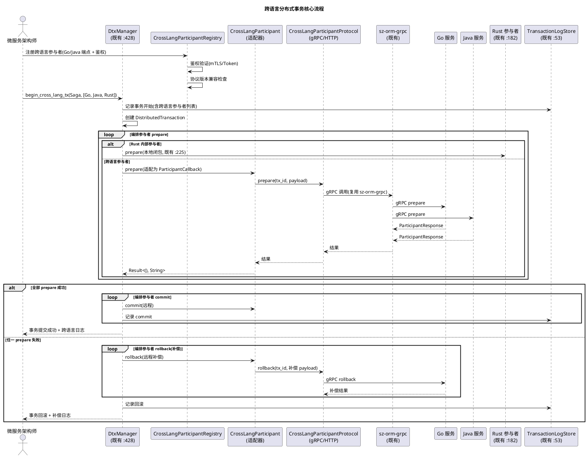
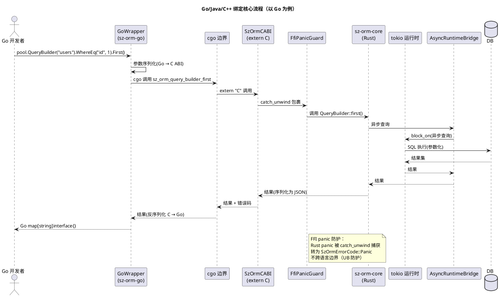
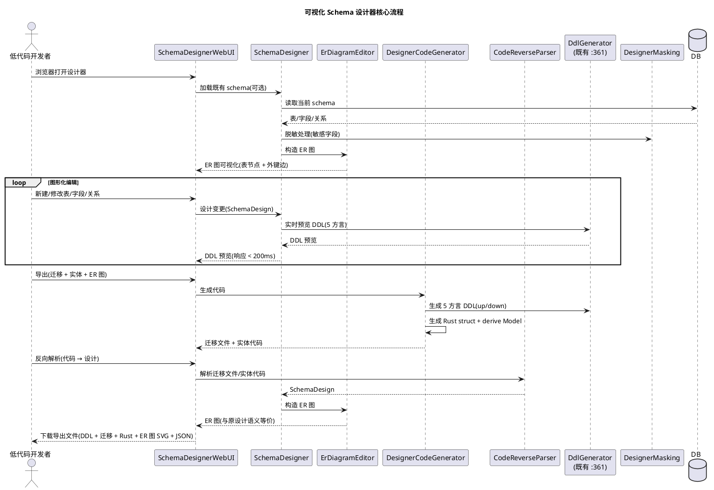
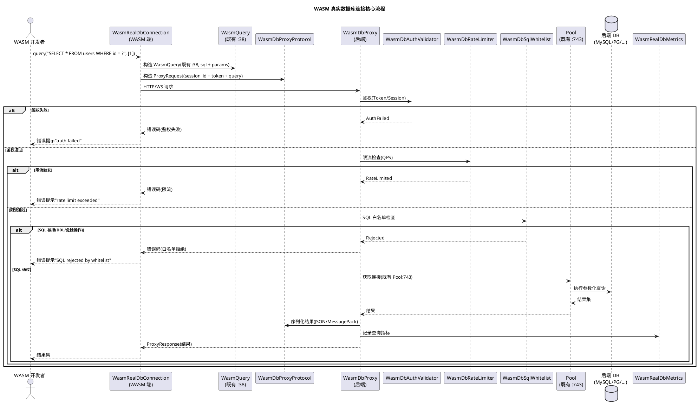

# sz-orm v4.2.0 技术设计文档

> 版本：v4.2.0（跨语言分布式事务 + Go/Java/C++ 绑定 + 可视化 Schema 设计器 + OpenAPI → ORM 反向生成 + WASM 真实数据库连接）
> 基线：v4.1.0（数据 seeding/fixture + schema diff 可视化 + 缓存一致性协议 + 消息轨迹追踪 + 存储生命周期管理 + 数据质量自动检测 + 批量流式处理 + 迁移版本分支 + 备份验证自动化，9 项能力全部通过 feature gate 隔离）
> 日期：2026-08-11
> 文档定位：技术设计（How to build），对应需求规格 `spec.md`（What to build）
> 设计约束：无 Breaking Change（7 个 feature gate 隔离）+ 优先复用既有能力 + 五方言覆盖 + 每项设计附 file:line 代码证据 + unsafe 零容忍 + 禁止占位实现
> 需求依赖：REQ-V42-001（跨语言事务）复用既有 `sz-orm-dtx` + `sz-orm-grpc` + `sz-orm-queue` + `sz-orm-tracing`；REQ-V42-002（Go/Java/C++ 绑定）复用既有 `sz-orm-core` + python/js 模式；REQ-V42-003（Schema 设计器）复用既有 `sz-orm-core/schema_sync` + `sz-orm-masking`；REQ-V42-004（OpenAPI 反向生成）复用既有 `sz-orm-swagger` + `sz-orm-core/schema_sync`；REQ-V42-005（WASM 真实 DB）复用既有 `sz-orm-wasm` + `sz-orm-observability`；五项需求主体相互独立，可并行开发
> 证据验证：本文档所有 file:line 证据均已通过源码读取验证（2026-08-11），遵循 AGENTS.md 审计合规铁律

---

# 概述

## 设计目标

本设计文档将 sz-orm v4.2.0 五项跨语言与低代码扩展需求（REQ-V42-001 ~ REQ-V42-005）转化为可落地的技术方案，核心目标：

1. **跨语言分布式事务**：扩展既有 `sz-orm-dtx` 协调器，使 Go/Java/C++/Python/JS 异构语言服务能作为 Saga/TCC/XA 事务参与者，通过 gRPC/HTTP 标准协议接入，不修改既有事务执行逻辑。
2. **Go/Java/C++ 绑定**：参照既有 `sz-orm-python`（PyO3）/`sz-orm-js`（napi-rs）模式，新增三套语言绑定（cgo/JNI/extern "C"），暴露 Model/QueryBuilder/Pool/Transaction 核心 API。
3. **可视化 Schema 设计器**：低代码图形化建表/改表/关系设计 Web UI，与迁移文件/实体代码双向生成，复用既有 `SchemaDiff`/`DdlGenerator`。
4. **OpenAPI → ORM 反向生成**：从 OpenAPI 3.0 spec 反向生成 Model + 迁移 + Repository 代码，与既有正向 `model_to_openapi_schema` 形成 API 优先开发闭环。
5. **WASM 真实数据库连接**：扩展既有 `sz-orm-wasm`，通过 HTTP/WebSocket 代理桥接后端真实数据库，复用既有 `WasmQuery`/`WasmDatabase`。

## 设计约束

| 约束类别 | 约束内容 | 来源 |
|---------|---------|------|
| 兼容性 | 无 Breaking Change，7 个 feature gate 隔离，默认全关闭，既有公开 API 完全向后兼容 | spec.md §1.4 / §4.5 |
| sz-pay 不破坏 | sz-pay 从 crates.io 拉取 sz-orm-* 6 个包既有用法不受影响 | spec.md §4.5.2 |
| 五方言覆盖 | MySQL/PostgreSQL/SQLite/Oracle/MSSQL 行为一致（按方言能力适配） | spec.md §4.5.3 |
| 复用优先 | 优先复用既有能力，不重复实现 | spec.md §8.4.9 |
| unsafe 零容忍 | 无 `unsafe` 块，或必须有 `// SAFETY:` 注释（FFI/JNI/cgo 边界须显式标注） | spec.md §1.4.12 / §4.3.3 |
| 禁止占位实现 | 禁止 `todo!`/`unimplemented!`/`unreachable!` | spec.md §8.4.7 |
| 参数化查询 | 任何 WHERE 条件必须参数化，禁止 SQL 字符串拼接 | AGENTS.md |
| 测试基线不回退 | v4.1.0 已验收测试基线仅增不减 | spec.md §4.2.8 / §8.4.3 |
| 审计证据 | 每项结论附 file:line 证据，遵循审计合规铁律 | spec.md §4.4.7 |

## feature gate 总览

| feature | 所属包 | 控制能力 | 默认 |
|---------|--------|---------|------|
| `cross-lang-dtx` | sz-orm-dtx | 跨语言参与者协议 + 适配器 + 补偿序列化 | 关闭 |
| `lang-binding-go` | sz-orm-go（新包） | Go 绑定（cgo + C ABI + Go wrapper） | 关闭 |
| `lang-binding-java` | sz-orm-java（新包） | Java 绑定（JNI + C ABI + Java wrapper） | 关闭 |
| `lang-binding-cpp` | sz-orm-cpp（新包） | C++ 绑定（extern "C" + cxxbindgen + C++ wrapper） | 关闭 |
| `schema-designer` | sz-orm-designer（新包） | 可视化 Schema 设计器 Web UI + ER 图 + 双向生成 | 关闭 |
| `openapi-reverse` | sz-orm-swagger | OpenAPI → ORM 反向生成 + API 优先闭环 | 关闭 |
| `wasm-real-db` | sz-orm-wasm | WASM 真实 DB 连接（HTTP/WS 代理 + WASI socket） | 关闭 |

---

# 一、需求与存量功能关系分析

## 1.1 需求功能与存量功能对比

### 1.1.1 已实现功能（可直接复用）

| 需求功能 | 存量功能 | 代码位置 | 匹配度 |
|---------|---------|---------|--------|
| REQ-V42-001 跨分片事务 | `cross_shard`（跨分片事务协调） | `packages/sz-orm-dtx/src/lib.rs:19` | 100% |
| REQ-V42-001 Saga 长事务 | `saga`（Saga 长事务编排） | `packages/sz-orm-dtx/src/lib.rs:20` | 100% |
| REQ-V42-001 TCC 三阶段提交 | `tcc`（TCC 三阶段提交） | `packages/sz-orm-dtx/src/lib.rs:21` | 100% |
| REQ-V42-001 XA 崩溃恢复 | `recovery`（XA 崩溃恢复，feature 隔离） | `packages/sz-orm-dtx/src/lib.rs:25` | 100% |
| REQ-V42-001 XA 悬挂检测 | `suspension`（XA 悬挂检测） | `packages/sz-orm-dtx/src/lib.rs:27` | 100% |
| REQ-V42-001 XA 事务 | `xa`（XA 事务） | `packages/sz-orm-dtx/src/lib.rs:29` | 100% |
| REQ-V42-001 事务日志条目 | `TransactionLogEntry`（事务日志条目） | `packages/sz-orm-dtx/src/lib.rs:37` | 100% |
| REQ-V42-001 事务日志存储 trait | `TransactionLogStore`（事务日志存储 trait） | `packages/sz-orm-dtx/src/lib.rs:53` | 100% |
| REQ-V42-001 事务状态机 | `TransactionState`（8 态事务状态机） | `packages/sz-orm-dtx/src/lib.rs:159` | 100% |
| REQ-V42-001 参与者状态机 | `ParticipantState`（5 态参与者状态机） | `packages/sz-orm-dtx/src/lib.rs:171` | 100% |
| REQ-V42-001 事务参与者 | `TransactionParticipant`（含 with_prepare/with_commit/with_rollback） | `packages/sz-orm-dtx/src/lib.rs:182` | 75% |
| REQ-V42-001 分布式事务 | `DistributedTransaction`（分布式事务结构） | `packages/sz-orm-dtx/src/lib.rs:266` | 100% |
| REQ-V42-001 事务管理器 | `DtxManager`（事务管理器） | `packages/sz-orm-dtx/src/lib.rs:428` | 100% |
| REQ-V42-001 xa feature | `xa` feature（XA 事务支持） | `packages/sz-orm-dtx/Cargo.toml:31` | 100% |
| REQ-V42-001 real-db feature | `real-db` feature（真实 DB 集成测试） | `packages/sz-orm-dtx/Cargo.toml:33` | 100% |
| REQ-V42-001 gRPC 传输 | `sz-orm-grpc`（gRPC 包，tonic + prost） | `packages/sz-orm-grpc/Cargo.toml:2` | 100% |
| REQ-V42-001 消息队列传输 | `MessageQueue` trait（6 provider） | `packages/sz-orm-queue/src/queue.rs:18` | 100% |
| REQ-V42-001 消息结构 | `Message`（消息体结构） | `packages/sz-orm-queue/src/queue.rs:57` | 100% |
| REQ-V42-001 追踪器抽象 | `Tracer` trait（追踪器统一接口） | `packages/sz-orm-tracing/src/lib.rs:129` | 100% |
| REQ-V42-001 自研追踪器 | `SzTracer`（自研追踪器实现） | `packages/sz-orm-tracing/src/lib.rs:136` | 100% |
| REQ-V42-002 Python 绑定模式参考 | `sz-orm-python`（PyO3，cdylib + rlib） | `packages/sz-orm-python/Cargo.toml:15` | 100% |
| REQ-V42-002 pyo3 依赖 | `pyo3`（Python FFI） | `packages/sz-orm-python/Cargo.toml:19` | 100% |
| REQ-V42-002 pyo3-asyncio 依赖 | `pyo3-asyncio`（Python 异步桥接） | `packages/sz-orm-python/Cargo.toml:20` | 100% |
| REQ-V42-002 JS 绑定模式参考 | `sz-orm-js`（napi-rs，cdylib + rlib） | `packages/sz-orm-js/Cargo.toml:15` | 100% |
| REQ-V42-002 napi 依赖 | `napi`（Node.js FFI） | `packages/sz-orm-js/Cargo.toml:19` | 100% |
| REQ-V42-002 napi-derive 依赖 | `napi-derive`（napi 派生宏） | `packages/sz-orm-js/Cargo.toml:20` | 100% |
| REQ-V42-002 Model trait | `Model` trait（模型统一接口） | `packages/sz-orm-core/src/model.rs:37` | 100% |
| REQ-V42-002 QueryBuilder | `QueryBuilder<M: Model>`（查询构建器） | `packages/sz-orm-core/src/query.rs:36` | 100% |
| REQ-V42-002 Connection trait | `Connection` trait（连接统一接口） | `packages/sz-orm-core/src/pool.rs:45` | 100% |
| REQ-V42-002 Pool | `Pool`（连接池） | `packages/sz-orm-core/src/pool.rs:743` | 100% |
| REQ-V42-002 Transaction | `Transaction`（事务） | `packages/sz-orm-core/src/transaction.rs:159` | 100% |
| REQ-V42-002 TransactionManager | `TransactionManager`（事务管理器） | `packages/sz-orm-core/src/transaction.rs:527` | 100% |
| REQ-V42-003 Schema 差异结构 | `SchemaDiff`（表/列增删改差分结果） | `packages/sz-orm-core/src/schema_sync.rs:100` | 100% |
| REQ-V42-003 差分计算函数 | `diff(entity, db)`（entity 与 db schema 差分） | `packages/sz-orm-core/src/schema_sync.rs:200` | 100% |
| REQ-V42-003 DDL 生成器 trait | `DdlGenerator` trait（5 方言 DDL 生成） | `packages/sz-orm-core/src/schema_sync.rs:361` | 100% |
| REQ-V42-003 schema 同步器 | `SchemaSync`（schema 同步编排） | `packages/sz-orm-core/src/schema_sync.rs:612` | 100% |
| REQ-V42-003 CLI schema 生成 | `cmd_generate_schema`（CLI schema 生成命令） | `cli/src/main.rs:1630` | 75% |
| REQ-V42-004 OpenAPI 规范根对象 | `OpenAPISpec`（OpenAPI 3.0 规范根） | `packages/sz-orm-swagger/src/lib.rs:28` | 100% |
| REQ-V42-004 组件表 | `Components`（含 schemas） | `packages/sz-orm-swagger/src/lib.rs:55` | 100% |
| REQ-V42-004 Schema 定义枚举 | `Schema`（Schema 定义枚举） | `packages/sz-orm-swagger/src/lib.rs:328` | 100% |
| REQ-V42-004 对象类型 Schema | `ObjectType` | `packages/sz-orm-swagger/src/lib.rs:430` | 100% |
| REQ-V42-004 数组类型 Schema | `ArrayType` | `packages/sz-orm-swagger/src/lib.rs:490` | 100% |
| REQ-V42-004 基本类型 Schema | `PrimitiveSchema` | `packages/sz-orm-swagger/src/lib.rs:540` | 100% |
| REQ-V42-004 OpenAPI 生成器 | `OpenAPIGenerator`（正向生成器） | `packages/sz-orm-swagger/src/lib.rs:1096` | 100% |
| REQ-V42-004 正向 Model→OpenAPI | `model_to_openapi_schema`（正向生成） | `packages/sz-orm-swagger/src/lib.rs:1325` | 100% |
| REQ-V42-005 WASM 高级特性 | `advanced`（内存限制/WASI 沙箱/异步调度） | `packages/sz-orm-wasm/src/lib.rs:12` | 100% |
| REQ-V42-005 JS 绑定 | `js_bindings`（JS 绑定，feature 隔离） | `packages/sz-orm-wasm/src/lib.rs:15` | 100% |
| REQ-V42-005 持久化 | `persistence`（浏览器本地存储，feature 隔离） | `packages/sz-orm-wasm/src/lib.rs:18` | 100% |
| REQ-V42-005 WASM 查询请求 | `WasmQuery`（SQL + 参数） | `packages/sz-orm-wasm/src/lib.rs:38` | 100% |
| REQ-V42-005 内存数据库 | `WasmDatabase`（SQL 子集内存执行） | `packages/sz-orm-wasm/src/lib.rs:67` | 100% |
| REQ-V42-005 js feature | `js` feature（wasm-bindgen + js-sys） | `packages/sz-orm-wasm/Cargo.toml:29` | 100% |
| REQ-V42-005 persistence feature | `persistence` feature（web-sys + thiserror） | `packages/sz-orm-wasm/Cargo.toml:30` | 100% |

### 1.1.2 需要扩展的功能

| 需求功能 | 存量功能 | 差异说明 | 扩展方向 |
|---------|---------|---------|---------|
| REQ-V42-001 跨语言参与者 | `TransactionParticipant`（`:182`）为 Rust 内部参与者，`prepare_fn`/`commit_fn`/`rollback_fn` 为 `ParticipantCallback = Arc<dyn Fn() -> Result<(), String> + Send + Sync>`（Rust 闭包） | 参与者回调为 Rust 闭包，无法跨语言调用；无跨语言参与者接入协议；无 gRPC/HTTP 远程调用适配 | 新增 `CrossLangParticipant` 适配器，将 gRPC/HTTP 远程调用包装为 `ParticipantCallback`，复用既有 `TransactionParticipant::with_prepare/with_commit/with_rollback`（`:201`/`:209`/`:217`）注册 |
| REQ-V42-001 协调器编排 | `DtxManager`（`:428`）编排 `DistributedTransaction`（`:266`），参与者为 `Vec<TransactionParticipant>` | 协调器仅编排 Rust 内部参与者，无跨语言参与者远程调用逻辑 | 新增跨语言参与者注册方法，`DtxManager` 透明编排 Rust + 跨语言参与者，不修改既有事务状态机 |
| REQ-V42-002 语言绑定模式 | `sz-orm-python`（PyO3）/`sz-orm-js`（napi-rs）为 Python/JS 绑定模式参考 | 无 Go/Java/C++ 绑定，三套绑定需新建独立包 | 新增 `sz-orm-go`/`sz-orm-java`/`sz-orm-cpp` 三包，参照既有 cdylib + rlib 模式（`packages/sz-orm-python/Cargo.toml:15`） |
| REQ-V42-003 CLI schema 命令 | `cmd_generate_schema`（`cli/src/main.rs:1630`）为 CLI schema 生成，v4.1.0 已补 schema diff 可视化（REQ-V41-002，报告类） | 既有为报告类可视化（CLI/HTML/Markdown），无交互式 Web UI 设计器；无设计↔代码双向生成 | 新增 `sz-orm-designer` 包，提供 Web UI + ER 图编辑 + 双向生成，复用既有 `cmd_generate_schema:1630` 作为 CLI 集成入口 |
| REQ-V42-004 OpenAPI 正向生成 | `model_to_openapi_schema`（`:1325`）为正向 ORM→OpenAPI，`OpenAPIGenerator`（`:1096`）为正向生成器 | 仅有正向生成（ORM→OpenAPI），无反向生成（OpenAPI→ORM）；无 API 优先开发闭环 | 新增 `OpenApiReverseGenerator`，复用既有 `OpenAPISpec:28`/`Schema:328` 解析 + `DdlGenerator:361` 生成迁移，不修改既有正向生成 |
| REQ-V42-005 WASM 内存数据库 | `WasmDatabase`（`:67`）为内存数据库 SQL 子集，`persistence`（`:18`）为浏览器本地存储 | 仅内存数据库 + 浏览器本地存储，无真实数据库连接；WASM 无法直接 TCP，需代理桥接 | 新增 `WasmRealDbConnection`，复用既有 `WasmQuery:38` 查询结构 + `js_bindings:15` JS 绑定，不修改既有内存数据库逻辑 |

### 1.1.3 需要新增的功能或接口

#### 模块 A：REQ-V42-001 跨语言分布式事务

| 功能点 | 输入 | 输出 | 核心逻辑 | 依赖 |
|--------|------|------|---------|------|
| CrossLangParticipantProtocol | 参与者语言 + 协议端点 + 鉴权凭据 | 协议 IDL（protobuf/JSON schema） | 定义标准接口（prepare/commit/rollback/confirm/cancel），gRPC protobuf IDL + HTTP/JSON 备选，协议版本化 | 既有 `sz-orm-grpc`（gRPC 传输）、`sz-orm-queue`（消息队列备选） |
| CrossLangParticipant | 语言 + 协议端点 + 补偿回调 + 鉴权凭据 | `TransactionParticipant`（适配为既有） | 将跨语言参与者（gRPC/HTTP 远程调用）适配为既有 `TransactionParticipant:182`，协调器透明编排 | 既有 `TransactionParticipant:182`、`ParticipantState:171` |
| CrossLangCompensationSerializer | Rust 补偿逻辑描述 | 协议消息（跨语言可执行） | 将 Rust 闭包的补偿逻辑序列化为跨语言可执行的协议消息（不传闭包，传操作描述） | `serde_json`（既有依赖） |
| CrossLangParticipantRegistry | 参与者注册信息 | 注册结果 | 参与者注册中心，鉴权验证（mTLS/Token），协议版本兼容检查 | 既有 `DtxManager:428` |
| CrossLangTxAlerter | 故障事件 | 告警通知 | 跨语言参与者故障/超时/恢复冲突告警 | 既有告警机制 |

#### 模块 B：REQ-V42-002 Go/Java/C++ 绑定

| 功能点 | 输入 | 输出 | 核心逻辑 | 依赖 |
|--------|------|------|---------|------|
| SzOrmCABI | sz-orm-core API 调用 | C ABI 导出函数 | 通过 `extern "C"` 暴露 sz-orm-core 核心 API（Model/QueryBuilder/Pool/Transaction）为 C ABI，panic 捕获转错误码 | 既有 `sz-orm-core`（Model:37/QueryBuilder:36/Pool:743/Transaction:159） |
| GoBinding | Go 应用调用 | Go 结构体 + 结果 | cgo 调用 C ABI + Go wrapper（惯用 Go API）+ 异步运行时桥接（tokio ↔ goroutine）+ 错误码映射 | `SzOrmCABI`、tokio 运行时桥接 |
| JavaBinding | Java 应用调用 | Java 对象 + 结果 | JNI 调用 C ABI + Java wrapper（惯用 Java API）+ 异步运行时桥接（tokio ↔ CompletableFuture/虚拟线程）+ 错误码映射 | `SzOrmCABI`、tokio 运行时桥接 |
| CppBinding | C++ 应用调用 | C++ 对象 + 结果 | extern "C" + cxxbindgen 头文件 + C++ wrapper（RAII/智能指针）+ 异步运行时桥接（tokio ↔ std::future/协程）+ 错误码映射 | `SzOrmCABI`、cxxbindgen |
| FfiMemoryManager | FFI 内存分配/释放 | 内存句柄 + 释放函数 | Rust 侧分配/释放，语言侧引用，不泄漏不悬空，提供 `sz_orm_free` 释放函数 | 无（FFI 边界安全） |
| FfiPanicGuard | Rust panic | 错误码 | `std::panic::catch_unwind` 捕获 panic 转错误码，不跨语言边界（UB 防护） | 无（panic 捕获） |
| AsyncRuntimeBridge | 目标语言异步机制 | tokio Future 桥接 | 桥接 tokio 异步运行时与目标语言异步机制（goroutine/CompletableFuture/std::future） | 既有 tokio（workspace 依赖） |
| ErrorCodeMapper | sz-orm-core 错误码 | 目标语言错误类型 | 完整映射 sz-orm-core 错误码到 Go error/Java Exception/C++ std::exception | 既有 `sz-orm-core` 错误类型 |

#### 模块 C：REQ-V42-003 可视化 Schema 设计器

| 功能点 | 输入 | 输出 | 核心逻辑 | 依赖 |
|--------|------|------|---------|------|
| SchemaDesign | 设计器中间表示 | 表/字段/关系/约束 | Schema 设计的中间表示（IR），与 DB schema 双向转换 | 既有 `SchemaDiff:100`、`TableDef`/`ColumnDef` |
| SchemaDesigner | SchemaDesign + 方言 | 设计器核心 | 图形化建表/改表/字段配置/关系设计，实时预览 DDL，复用既有 `DdlGenerator:361` 生成 5 方言 DDL | 既有 `DdlGenerator:361`（5 方言）、`SchemaSync:612` |
| SchemaDesignerWebUI | HTTP 请求 | HTML5/Canvas/SVG Web UI | Web UI 服务器（HTTP），ER 图可视化编辑（表为节点，外键为边），拖拽布局/关系连线/一对多/多对多标注 | 无（Web UI 框架，可选 axum） |
| ErDiagramEditor | 表/关系设计 | ER 图（SVG/JSON） | ER 图可视化编辑，表为节点，外键为边，支持拖拽布局/关系连线/基数标注 | `SchemaDesign` |
| DesignerCodeGenerator | SchemaDesign + 方言 | 迁移文件 + 实体 Model 代码 | 设计 → 代码：生成迁移文件（up/down SQL，复用 `DdlGenerator:361`）+ Rust struct + derive Model | 既有 `DdlGenerator:361`、`SchemaSync:612` |
| CodeReverseParser | 迁移文件/实体 Model 代码 | SchemaDesign | 代码 → 设计：从既有迁移文件/实体 Model 代码反向解析为 SchemaDesign，支持双向往返 | 既有 `Migration`（`migration.rs:10`）、`syn`（代码解析） |
| DesignerExporter | SchemaDesign + 格式 | 导出文件（DDL/迁移/实体/ER 图 PNG/SVG/JSON） | 多格式导出，可被 CLI/CI 消费 | 既有 `DdlGenerator:361` |
| DesignerMasking | SchemaDesign + 脱敏规则 | 脱敏后 SchemaDesign | 尊重既有脱敏规则，敏感表/字段名可选脱敏展示 | 既有 `sz-orm-masking` |

#### 模块 D：REQ-V42-004 OpenAPI → ORM 反向生成

| 功能点 | 输入 | 输出 | 核心逻辑 | 依赖 |
|--------|------|------|---------|------|
| OpenApiReverseGenerator | OpenAPI spec 文件 + 配置 | Model 代码 + 迁移文件 + Repository 代码 + 闭环验证报告 | 解析 spec → 映射 Schema → 生成 Model/迁移/Repository → 闭环验证 | 既有 `OpenAPISpec:28`、`Schema:328`、`DdlGenerator:361` |
| SchemaToModelMapper | OpenAPI `Schema`（`:328`） | Rust struct + derive Model 字段映射 | 字段类型映射（string→String/integer→i64/number→f64/boolean→bool/array→Vec/object→嵌套 struct），约束映射（required→NOT NULL、maxLength→VARCHAR(n)、format:date-time→TIMESTAMP） | 既有 `Schema:328`、`ObjectType:430`、`ArrayType:490`、`PrimitiveSchema:540` |
| OpenApiToMigrationMapper | OpenAPI Schema + 方言 | 迁移文件（up/down SQL） | Schema 字段约束映射到 DDL 约束，复用既有 `DdlGenerator:361` 生成 5 方言 DDL | 既有 `DdlGenerator:361`（5 方言） |
| OpenApiToRepositoryMapper | OpenAPI Schema | Repository 代码骨架 | 生成 CRUD 方法（find_by_id/find_all/create/update/delete），标注可编辑区，不覆盖用户手写业务逻辑 | 无（代码生成） |
| ApiFirstLoopVerifier | OpenAPI spec + 反向生成 ORM | 闭环验证报告（spec vs 正向生成 OpenAPI' 差异） | 反向生成 ORM → 正向生成（既有 `model_to_openapi_schema:1325`）→ 对比 spec 与 OpenAPI'，标注差异 | 既有 `model_to_openapi_schema:1325`（正向） |
| OpenApiInjectionGuard | OpenAPI spec | 安全 spec（注入防护） | 不执行 spec 内嵌代码，不信任未签名 spec，生成代码强制参数化查询 | 无（注入防护） |
| ReverseGenConfig | 配置文件 | 配置结构（目标方言/代码风格/命名约定/可编辑区标注/是否覆盖） | 配置文件版本化管理，可配置生成行为 | `serde_yaml`/`serde_json`（既有依赖） |

#### 模块 E：REQ-V42-005 WASM 真实数据库连接

| 功能点 | 输入 | 输出 | 核心逻辑 | 依赖 |
|--------|------|------|---------|------|
| WasmRealDbConnection | 代理端点 + Token + 查询 | 查询结果 | 通过 HTTP/WebSocket 代理桥接后端真实数据库，复用既有 `WasmQuery:38` 构造查询 | 既有 `WasmQuery:38`、`js_bindings:15` |
| WasmDbProxyProtocol | 查询请求/响应 | 协议消息（JSON/MessagePack） | 定义 WASM ↔ 后端 DB 代理协议（查询请求/响应/参数/事务/错误码格式） | `serde_json`（既有依赖） |
| WasmDbProxy | WASM 请求 + 后端 DB | 查询结果 | 后端代理服务，鉴权 + 限流 + SQL 白名单 + 连接池，转发 WASM 请求到后端 DB | 既有 `Pool:743`（连接池）、`sz-orm-sql-validator`（SQL 校验） |
| WasiSocketConnection | WASI socket + DB 连接信息 | 查询结果 | WASI preview2 socket 直连后端 DB（不经代理，可选，适用于可信 WASI 环境） | WASI preview2 socket API |
| WasmRealDbQueryExecutor | WasmQuery + 代理连接 | 查询结果（序列化） | 执行真实 DB 查询（SELECT/INSERT/UPDATE/DELETE，参数化），结果集序列化回 WASM 端 | 既有 `WasmQuery:38` |
| WasmDbAuthValidator | WASM 会话 + Token | 鉴权结果 | 代理鉴权（Token/Session），禁止未授权 WASM 端连接，会话隔离 | 无（鉴权） |
| WasmDbRateLimiter | WASM 会话 + QPS | 限流决策 | 单会话 QPS 上限限流，防 WASM 端滥用拖垮后端 DB | 既有 `sz-orm-limit`（限流） |
| WasmDbSqlWhitelist | SQL 语句 | 白名单决策 | SQL 白名单（仅允许 SELECT/INSERT/UPDATE/DELETE + 参数化，禁止 DDL/批量危险操作） | 既有 `sz-orm-sql-validator`（SQL 解析校验） |
| WasmRealDbReconnector | 代理连接状态 | 重连结果 | 代理临时不可用后自动重连，查询失败返回明确错误码，不静默丢查询 | 无（重连） |
| WasmRealDbMetrics | 查询指标 | Prometheus 指标 | 输出查询数/延迟/错误率/重连次数，接入既有 Prometheus | 既有 `sz-orm-observability`（MetricsRegistry） |

## 1.2 存量功能详细分析

### 1.2.1 TransactionParticipant / DtxManager / DistributedTransaction（分布式事务核心）

- **接口契约**：
  - `TransactionParticipant`（`packages/sz-orm-dtx/src/lib.rs:182`）含 `resource_id: String`、`state: ParticipantState`、`prepare_fn/commit_fn/rollback_fn: Option<ParticipantCallback>`，其中 `ParticipantCallback = Arc<dyn Fn() -> Result<(), String> + Send + Sync>`（`:179`）
  - 构造方法：`new(id: &str)`（`:191`）、`with_prepare<F: Fn() -> Result<(), String> + Send + Sync + 'static>`（`:201`）、`with_commit`（`:209`）、`with_rollback`（`:217`）
  - 执行方法：`prepare(&mut self) -> Result<(), String>`（`:225`）、`commit(&mut self)`（`:233`）、`rollback(&mut self)`（`:241`）、`fail(&mut self)`（`:249`）
  - `DistributedTransaction`（`:266`）含 `id: String`、`state: TransactionState`、`participants: Vec<TransactionParticipant>`
  - `DtxManager`（`:428`）含 `transactions: Arc<RwLock<HashMap<String, DistributedTransaction>>>`
- **业务规则**：`TransactionParticipant` 通过 `with_prepare/with_commit/with_rollback` 注册 Rust 闭包回调；`prepare/commit/rollback` 执行回调并更新 `ParticipantState`；`DtxManager` 编排 `DistributedTransaction`，按 `TransactionState` 状态机推进
- **扩展点**：`ParticipantCallback` 为 `Arc<dyn Fn() -> Result<(), String> + Send + Sync>`，可包装任意满足该签名的回调（包括跨语言远程调用的闭包）
- **约束**：回调为同步 `Fn() -> Result<(), String>`，无 async；跨语言远程调用需在闭包内阻塞等待异步结果（通过 tokio runtime `block_on`）
- **复用结论**：v4.2.0 `CrossLangParticipant` 将 gRPC/HTTP 远程调用包装为 `ParticipantCallback` 闭包，通过 `with_prepare/with_commit/with_rollback` 注册为既有 `TransactionParticipant`，复用 `DtxManager:428` 编排，不修改既有事务状态机

### 1.2.2 TransactionState / ParticipantState（事务状态机）

- **接口契约**：`TransactionState`（`:159`）8 态枚举（Active/Preparing/Prepared/Committing/Committed/RollingBack/RolledBack/Failed）；`ParticipantState`（`:171`）5 态枚举（Active/Prepared/Committed/RolledBack/Failed）
- **业务规则**：事务与参与者各自独立状态机，`DtxManager` 协调推进
- **扩展点**：状态机枚举可扩展新状态（但本版本不扩展，复用既有）
- **复用结论**：v4.2.0 跨语言参与者复用既有 `ParticipantState:171`，跨语言参与者故障标记为 `ParticipantState::Failed`（`:249` `fail`），不新增状态

### 1.2.3 TransactionLogStore / recovery / suspension（崩溃恢复）

- **接口契约**：`TransactionLogStore` trait（`:53`）`Send + Sync`，含 `append`/`read` 方法（手动解糖 async）；`recovery`（`:25`，`xa` feature 隔离）XA 崩溃恢复；`suspension`（`:27`）XA 悬挂检测
- **业务规则**：`TransactionLogStore` 持久化 `TransactionLogEntry`（`:37`，含 tx_id/state/participants/timestamp/action），协调器崩溃后从日志恢复未完成事务
- **复用结论**：v4.2.0 跨语言事务崩溃恢复复用既有 `TransactionLogStore:53` + `recovery:25`，跨语言参与者状态写入日志，协调器重启后恢复跨语言事务

### 1.2.4 sz-orm-grpc（gRPC 传输）

- **接口契约**：`sz-orm-grpc`（`packages/sz-orm-grpc/Cargo.toml:2`）提供 gRPC 微服务客户端/服务端，`real` feature（`:17`）启用 tonic + prost + tokio 真实 gRPC 传输，默认内存 mock
- **业务规则**：通过 tonic + prost 实现 gRPC 传输，protobuf IDL 定义服务接口
- **复用结论**：v4.2.0 跨语言参与者协议 gRPC 传输复用既有 `sz-orm-grpc`，定义参与者协议 protobuf IDL，不重复实现 gRPC

### 1.2.5 MessageQueue / Message（消息队列传输）

- **接口契约**：`MessageQueue` trait（`packages/sz-orm-queue/src/queue.rs:18`）`Send + Sync`，含 publish/consume/ack/subscribe/nack/reject；`Message`（`:57`）含 topic/payload/key/timestamp/headers/id/retry_count
- **业务规则**：6 provider（Kafka/RabbitMQ/RocketMQ/ActiveMQ/NATS/Pulsar）独立实现，通过 feature gate 隔离
- **复用结论**：v4.2.0 跨语言参与者协议 HTTP/JSON 备选传输可复用既有 `sz-orm-queue` 做异步消息通信（参与者注册/补偿回调），不重复实现消息队列

### 1.2.6 Tracer / SzTracer（分布式追踪）

- **接口契约**：`Tracer` trait（`packages/sz-orm-tracing/src/lib.rs:129`）`Send + Sync`，含 `start_span`/`end_span`/`inject`/`extract`；`SzTracer`（`:136`）自研实现
- **业务规则**：`Tracer` 抽象 span 创建/结束/导出；`inject`/`extract` 支持 trace context 传播
- **复用结论**：v4.2.0 跨语言事务可观测复用既有 `Tracer:129`/`SzTracer:136`，跨语言参与者 span 通过 `inject`/`extract` 传播 trace context

### 1.2.7 sz-orm-python / sz-orm-js（语言绑定模式参考）

- **接口契约**：
  - `sz-orm-python`（`packages/sz-orm-python/Cargo.toml:15`）`crate-type = ["cdylib", "rlib"]`，依赖 `pyo3`（`:19`，Python FFI）+ `pyo3-asyncio`（`:20`，异步桥接）+ `sz-orm-core`（`:18`）+ `tokio`（`:21`）
  - `sz-orm-js`（`packages/sz-orm-js/Cargo.toml:15`）`crate-type = ["cdylib", "rlib"]`，依赖 `napi`（`:19`，Node.js FFI）+ `napi-derive`（`:20`）+ `sz-orm-core`（`:18`）+ `tokio`（`:21`）
- **业务规则**：cdylib 产出动态库供目标语言加载；rlib 供 Rust 内部复用；PyO3/napi-rs 处理 FFI 边界与异步桥接
- **扩展点**：`crate-type = ["cdylib", "rlib"]` 模式可复用于 Go/Java/C++ 绑定（cdylib 产出 C ABI 动态库）
- **复用结论**：v4.2.0 `sz-orm-go`/`sz-orm-java`/`sz-orm-cpp` 参照既有 cdylib + rlib 模式（`packages/sz-orm-python/Cargo.toml:15`），通过 `extern "C"` 暴露 C ABI，目标语言通过 cgo/JNI/extern "C" 调用

### 1.2.8 Model / QueryBuilder / Pool / Transaction（sz-orm-core 核心 API）

- **接口契约**：
  - `Model` trait（`packages/sz-orm-core/src/model.rs:37`）`Send + Sync + Sized + 'static`，含 `table_name`/`pk_name`/`pk`/`set_pk`/`foreign_key` 等方法，`type PrimaryKey: Send + Sync + fmt::Debug + fmt::Display + Clone + Default`
  - `QueryBuilder<M: Model>`（`packages/sz-orm-core/src/query.rs:36`）查询构建器
  - `Connection` trait（`packages/sz-orm-core/src/pool.rs:45`）`Send + Sync` 连接统一接口
  - `Pool`（`packages/sz-orm-core/src/pool.rs:743`）连接池
  - `Transaction`（`packages/sz-orm-core/src/transaction.rs:159`）事务
  - `TransactionManager`（`packages/sz-orm-core/src/transaction.rs:527`）事务管理器
- **业务规则**：`Model` trait 定义模型元数据与主键操作；`QueryBuilder` 构建参数化查询；`Pool` 管理连接池；`Transaction` 管理事务边界
- **复用结论**：v4.2.0 Go/Java/C++ 绑定通过 `extern "C"` 暴露这些核心 API，目标语言 wrapper 调用 C ABI 转发到 sz-orm-core

### 1.2.9 SchemaDiff / diff / DdlGenerator / SchemaSync（schema 差分与 DDL 生成）

- **接口契约**：
  - `SchemaDiff`（`packages/sz-orm-core/src/schema_sync.rs:100`）含 6 类变更（added_tables/dropped_tables/added_columns/dropped_columns/类型变更/约束变更）
  - `diff(entity: &[TableDef], db: &[TableDef]) -> SchemaDiff`（`:200`）计算 entity 与 db schema 差分
  - `DdlGenerator` trait（`:361`）`Send + Sync`，`fn generate(&self, diff: &SchemaDiff) -> Result<Vec<String>, DbError>`，5 方言实现（MySqlDdlGenerator:369/PgDdlGenerator:439/SqliteDdlGenerator:479/OracleDdlGenerator:522/MssqlDdlGenerator:565）
  - `SchemaSync`（`:612`）schema 同步编排器
- **业务规则**：`diff` 对比 entity 与 db 的 `TableDef` 列表输出 `SchemaDiff`；`DdlGenerator` 按方言生成 DDL（MySQL AUTO_INCREMENT / PG SERIAL / SQLite AUTOINCREMENT / Oracle SEQUENCE / MSSQL IDENTITY）；`generate` 不生成破坏性 DDL（DROP TABLE/DROP COLUMN）
- **扩展点**：`DdlGenerator` trait 可扩展新方言；`SchemaDiff` 结构可扩展新变更类型
- **复用结论**：v4.2.0 Schema 设计器与 OpenAPI 反向生成均复用既有 `DdlGenerator:361` 生成 5 方言 DDL，不重复实现；Schema 设计器复用 `SchemaDiff:100`/`diff:200` 做设计↔代码双向一致验证

### 1.2.10 OpenAPISpec / Components / Schema / model_to_openapi_schema（OpenAPI 正向生成）

- **接口契约**：
  - `OpenAPISpec`（`packages/sz-orm-swagger/src/lib.rs:28`）OpenAPI 3.0 规范根对象，含 openapi/info/paths/components/tags/servers
  - `Components`（`:55`）组件表，含 `schemas: HashMap<String, Schema>`（可复用 Schema 定义）
  - `Schema`（`:328`）Schema 定义枚举（`#[serde(untagged)]`），含 Ref/Object/Array/Primitive 等变体
  - `ObjectType`（`:430`）对象类型 Schema；`ArrayType`（`:490`）数组类型 Schema；`PrimitiveSchema`（`:540`）基本类型 Schema（string/integer/number/boolean）
  - `OpenAPIGenerator`（`:1096`）正向生成器（ORM → OpenAPI）
  - `model_to_openapi_schema<T: Model>() -> Schema`（`:1325`）正向：ORM Model → OpenAPI Schema
- **业务规则**：`OpenAPISpec` 完整描述 OpenAPI 3.0 规范；`Components.schemas` 存放可复用 Schema 定义；`model_to_openapi_schema` 从 Rust Model trait 元数据生成 OpenAPI Schema
- **扩展点**：`Schema` 枚举可扩展新 Schema 类型；`OpenAPIGenerator` 可扩展新生成策略
- **复用结论**：v4.2.0 OpenAPI 反向生成复用既有 `OpenAPISpec:28`/`Components:55`/`Schema:328`/`ObjectType:430`/`ArrayType:490`/`PrimitiveSchema:540` 解析 OpenAPI spec，不重复实现；闭环验证复用既有 `model_to_openapi_schema:1325` 正向生成对比

### 1.2.11 WasmQuery / WasmDatabase / advanced / js_bindings / persistence（WASM 内存数据库）

- **接口契约**：
  - `WasmQuery`（`packages/sz-orm-wasm/src/lib.rs:38`）含 `sql: String`、`params: Vec<serde_json::Value>`，构造方法 `new(sql: &str)`（`:44`）、`with_params(sql, params)`（`:51`）
  - `WasmDatabase`（`:67`）内存数据库，含 `tables: Mutex<HashMap<String, Vec<serde_json::Value>>>`，方法 `query(&self, q: WasmQuery) -> Result<Vec<Value>, String>`（`:78`，SELECT）、`execute(&self, q: WasmQuery) -> Result<usize, String>`（`:103`，INSERT/UPDATE/DELETE/CREATE）
  - `advanced`（`:12`）内存限制/WASI 沙箱/异步调度/模块缓存
  - `js_bindings`（`:15`，`js` feature 隔离）JS 绑定（`JsQueryResult`/`JsWasmDatabase`，`:34`）
  - `persistence`（`:18`，`persistence` feature 隔离）浏览器本地存储
- **业务规则**：`WasmDatabase` 支持 SQL 子集（SELECT/INSERT/UPDATE/DELETE/CREATE TABLE），内存执行；`js_bindings` 通过 wasm-bindgen 暴露给 JS；`persistence` 通过 web-sys Window 浏览器本地存储
- **扩展点**：`WasmQuery` 结构可复用于真实 DB 查询（sql + params 不变）；`js_bindings` 可扩展真实 DB 连接的 JS 绑定
- **复用结论**：v4.2.0 `WasmRealDbConnection` 复用既有 `WasmQuery:38` 构造查询（sql + params 不变），通过 HTTP/WS 发送到代理；`WasmRealDbQueryExecutor` 复用既有 `js_bindings:15` JS 绑定暴露真实 DB 查询给 JS，不修改既有内存数据库逻辑

### 1.2.12 feature gate 体系模式

- **接口契约**：`packages/sz-orm-core/Cargo.toml:83-128` 已有 prod-ready 14 子 feature（`:85-98`）+ 总 feature 聚合（`:100-115`）+ v3.9.0 4 feature（`:117-121`）+ v4.1.0 4 feature（`:122-128` `data-seeding`/`schema-diff-viz`/`cache-coherence`/`migration-branch`）；`packages/sz-orm-dtx/Cargo.toml:28-33` 已有 `xa`/`real-db` feature；`packages/sz-orm-wasm/Cargo.toml:27-30` 已有 `js`/`persistence` feature
- **业务规则**：每个子 feature 默认关闭，独立控制一项能力；新增代码全部 `#[cfg(feature = "...")]` 门控；新增依赖标记 `optional = true`；跨包 feature 依赖通过 `sz-orm-xxx/feature-name` 引用
- **复用结论**：v4.2.0 7 个新 feature（`cross-lang-dtx`/`lang-binding-go`/`lang-binding-java`/`lang-binding-cpp`/`schema-designer`/`openapi-reverse`/`wasm-real-db`）遵循此模式，默认全关闭，无 Breaking Change

---

# 二、增量设计方案

## 2.1 实现模型

### 2.1.1 上下文视图

```plantuml
@startuml
title sz-orm v4.2.0 上下文视图（新增能力与外部系统交互）

' === 新增模块 ===
rectangle "sz-orm-dtx (扩展)" as dtx_ext {
  rectangle "CrossLangParticipant\nCrossLangParticipantProtocol\nCrossLangCompensationSerializer\n(REQ-V42-001)" as crosslang
}

rectangle "sz-orm-go (新包)" as go_pkg {
  rectangle "GoBinding\n[cross-lang-dtx]" as gobinding
}
rectangle "sz-orm-java (新包)" as java_pkg {
  rectangle "JavaBinding\n[lang-binding-java]" as javabinding
}
rectangle "sz-orm-cpp (新包)" as cpp_pkg {
  rectangle "CppBinding\n[lang-binding-cpp]" as cppbinding
}
rectangle "SzOrmCABI (新包)" as cabi {
  rectangle "extern C ABI\nFfiMemoryManager\nFfiPanicGuard" as cabi_core
}

rectangle "sz-orm-designer (新包)" as designer_pkg {
  rectangle "SchemaDesigner\nSchemaDesignerWebUI\nErDiagramEditor\n(REQ-V42-003)" as designer
}

rectangle "sz-orm-swagger (扩展)" as swagger_ext {
  rectangle "OpenApiReverseGenerator\nApiFirstLoopVerifier\n(REQ-V42-004)" as openapireverse
}

rectangle "sz-orm-wasm (扩展)" as wasm_ext {
  rectangle "WasmRealDbConnection\nWasmDbProxyProtocol\n(REQ-V42-005)" as wasmrealdb
}

' === 既有模块（复用） ===
rectangle "DtxManager/DistributedTransaction\nTransactionParticipant\n(既有 :428/:266/:182)" as dtx_base
rectangle "sz-orm-grpc\n(gRPC 传输, 既有)" as grpc
rectangle "sz-orm-queue\n(消息队列, 既有 :18)" as mq
rectangle "Tracer/SzTracer\n(既有 :129/:136)" as tracer
rectangle "Model/QueryBuilder/Pool/Transaction\n(既有 :37/:36/:743/:159)" as core_api
rectangle "SchemaDiff/diff/DdlGenerator\n(既有 :100/:200/:361)" as schemadiff
rectangle "OpenAPISpec/Schema\nmodel_to_openapi_schema\n(既有 :28/:328/:1325)" as swagger_base
rectangle "WasmQuery/WasmDatabase\njs_bindings\n(既有 :38/:67/:15)" as wasm_base
rectangle "sz-orm-masking\n(脱敏, 既有)" as masking
rectangle "sz-orm-observability\n(指标, 既有)" as observability
rectangle "sz-orm-sql-validator\n(SQL 校验, 既有)" as sqlvalidator
rectangle "sz-orm-limit\n(限流, 既有)" as limit

' === 外部系统 ===
database "MySQL/PG/SQLite\n/Oracle/MSSQL" as db
rectangle "Go/Java/C++ 运行时" as runtimes
rectangle "gRPC/HTTP\n(参与者协议)" as proto
file "OpenAPI 3.0\n(YAML/JSON)" as openapispec
cloud "Web 浏览器\n(HTML5/Canvas)" as browser
cloud "WASM 运行时" as wasmruntime
rectangle "WASM DB 代理\n(后端 HTTP/WS)" as wasmproxy
cloud "Prometheus" as prometheus
cloud "Jaeger/Tempo" as tracing_backend

' === 交互关系 ===
crosslang --> dtx_base : 适配为 TransactionParticipant\n复用 DtxManager 编排
crosslang --> grpc : gRPC 远程调用\n(复用 sz-orm-grpc)
crosslang --> mq : HTTP/JSON 备选传输\n(复用 sz-orm-queue)
crosslang --> tracer : 跨语言 span 关联\n(复用 Tracer)

gobinding --> cabi : cgo 调用 C ABI
javabinding --> cabi : JNI 调用 C ABI
cppbinding --> cabi : extern "C" 调用
cabi_core --> core_api : 调用 Rust 核心 API
gobinding --> runtimes : goroutine 桥接
javabinding --> runtimes : CompletableFuture 桥接
cppbinding --> runtimes : std::future 桥接

designer --> schemadiff : 复用 DdlGenerator 生成 5 方言 DDL
designer --> browser : Web UI(ER 图编辑)
designer --> db : 读取/生成 schema
designer --> masking : 脱敏展示

openapireverse --> swagger_base : 复用 OpenAPISpec/Schema 解析
openapireverse --> schemadiff : 复用 DdlGenerator 生成迁移
openapireverse --> openapispec : 读取 OpenAPI spec
openapireverse --> swagger_base : 闭环验证(正向生成对比)

wasmrealdb --> wasm_base : 复用 WasmQuery/js_bindings
wasmrealdb --> wasmproxy : HTTP/WS 代理
wasmproxy --> db : 转发 SQL 执行
wasmproxy --> sqlvalidator : SQL 白名单
wasmproxy --> limit : 限流
wasmrealdb --> observability : 查询指标
wasmproxy --> observability : 会话/QPS 指标

crosslang --> tracing_backend : OTLP 导出
wasmrealdb --> prometheus : 查询指标

@enduml
```



**通信协议与调用频率**：
| 交互 | 协议 | 频率 |
|------|------|------|
| CrossLangParticipant → Go/Java/C++ 服务 | gRPC（protobuf）/ HTTP（JSON） | 每次参与者 prepare/commit/rollback（中频，事务执行时） |
| CrossLangParticipant → sz-orm-grpc | tonic gRPC | 每次跨语言参与者调用 |
| GoBinding/JavaBinding/CppBinding → SzOrmCABI | cgo/JNI/extern "C"（C ABI） | 每次 ORM 操作（高频） |
| SzOrmCABI → sz-orm-core | Rust 函数调用 | 每次 FFI 调用（高频） |
| SchemaDesignerWebUI → SchemaDesigner | HTTP（设计器 API） | 每次用户交互（中频，设计时） |
| SchemaDesigner → DdlGenerator | Rust trait 调用 | 每次 DDL 预览/生成（中频） |
| OpenApiReverseGenerator → OpenAPISpec | Rust 结构解析 | 每次反向生成（低频，手动/CI） |
| WasmRealDbConnection → WASM DB 代理 | HTTP/WebSocket（JSON/MessagePack） | 每次 WASM 查询（高频） |
| WASM DB 代理 → 后端 DB | SQL（参数化，连接池） | 每次 WASM 查询转发（高频） |

### 2.1.2 服务/组件总体架构

```plantuml
@startuml
title sz-orm v4.2.0 新增模块总体架构

package "sz-orm-dtx (扩展)" {
  component "CrossLangParticipant\n[cross-lang-dtx]" as cl_participant
  component "CrossLangParticipantProtocol" as cl_protocol
  component "CrossLangCompensationSerializer" as cl_serializer
  component "CrossLangParticipantRegistry" as cl_registry
  component "CrossLangTxAlerter" as cl_alerter
}

package "sz-orm-cabi (新包)" {
  component "SzOrmCABI\nextern C 导出" as cabi_export
  component "FfiMemoryManager" as ffi_mem
  component "FfiPanicGuard" as ffi_panic
  component "AsyncRuntimeBridge" as async_bridge
  component "ErrorCodeMapper" as error_mapper
}

package "sz-orm-go (新包)" {
  component "GoBinding\n[lang-binding-go]" as go_binding
  component "GoWrapper" as go_wrapper
}
package "sz-orm-java (新包)" {
  component "JavaBinding\n[lang-binding-java]" as java_binding
  component "JavaWrapper" as java_wrapper
}
package "sz-orm-cpp (新包)" {
  component "CppBinding\n[lang-binding-cpp]" as cpp_binding
  component "CppWrapper" as cpp_wrapper
}

package "sz-orm-designer (新包)" {
  component "SchemaDesigner\n[schema-designer]" as designer_core
  component "SchemaDesignerWebUI" as designer_ui
  component "ErDiagramEditor" as er_editor
  component "DesignerCodeGenerator" as designer_codegen
  component "CodeReverseParser" as code_parser
  component "DesignerExporter" as designer_export
  component "DesignerMasking" as designer_mask
}

package "sz-orm-swagger (扩展)" {
  component "OpenApiReverseGenerator\n[openapi-reverse]" as oa_reverse
  component "SchemaToModelMapper" as oa_model_mapper
  component "OpenApiToMigrationMapper" as oa_mig_mapper
  component "OpenApiToRepositoryMapper" as oa_repo_mapper
  component "ApiFirstLoopVerifier" as oa_loop
  component "OpenApiInjectionGuard" as oa_guard
}

package "sz-orm-wasm (扩展)" {
  component "WasmRealDbConnection\n[wasm-real-db]" as wasm_realdb
  component "WasmDbProxyProtocol" as wasm_proto
  component "WasmDbProxy" as wasm_proxy
  component "WasiSocketConnection" as wasm_wasi
  component "WasmRealDbQueryExecutor" as wasm_executor
  component "WasmDbAuthValidator" as wasm_auth
  component "WasmDbRateLimiter" as wasm_ratelimit
  component "WasmDbSqlWhitelist" as wasm_whitelist
  component "WasmRealDbReconnector" as wasm_reconnect
  component "WasmRealDbMetrics" as wasm_metrics
}

' 内部依赖
cl_participant --> cl_protocol
cl_participant --> cl_serializer
cl_registry --> cl_protocol
cl_registry --> cl_alerter

cabi_export --> ffi_mem
cabi_export --> ffi_panic
cabi_export --> async_bridge
cabi_export --> error_mapper

go_binding --> go_wrapper
java_binding --> java_wrapper
cpp_binding --> cpp_wrapper

designer_core --> designer_ui
designer_core --> er_editor
designer_core --> designer_codegen
designer_core --> designer_mask
designer_codegen --> code_parser
designer_core --> designer_export

oa_reverse --> oa_model_mapper
oa_reverse --> oa_mig_mapper
oa_reverse --> oa_repo_mapper
oa_reverse --> oa_loop
oa_reverse --> oa_guard

wasm_realdb --> wasm_proto
wasm_realdb --> wasm_executor
wasm_realdb --> wasm_reconnect
wasm_realdb --> wasm_metrics
wasm_proxy --> wasm_auth
wasm_proxy --> wasm_ratelimit
wasm_proxy --> wasm_whitelist

' 跨需求依赖（复用既有）
cl_participant --> cl_registry : 参与者注册\n(复用 DtxManager)
go_binding --> cabi_export : cgo 调用 C ABI
java_binding --> cabi_export : JNI 调用 C ABI
cpp_binding --> cabi_export : extern C 调用

@enduml
```



### 2.1.3 需求依赖关系与开发顺序

```plantuml
@startuml
title v4.2.0 需求依赖关系与开发顺序

REQ-V42-001 "跨语言分布式事务\n(P1)" : 复用 sz-orm-dtx + sz-orm-grpc + sz-orm-queue + sz-orm-tracing
REQ-V42-002 "Go/Java/C++ 绑定\n(P2)" : 复用 sz-orm-core + python/js 模式
REQ-V42-003 "可视化 Schema 设计器\n(P2)" : 复用 sz-orm-core/schema_sync + sz-orm-masking
REQ-V42-004 "OpenAPI → ORM 反向生成\n(P2)" : 复用 sz-orm-swagger + sz-orm-core/schema_sync
REQ-V42-005 "WASM 真实数据库连接\n(P3)" : 复用 sz-orm-wasm + sz-orm-observability

REQ-V42-001 ..> REQ-V42-002 : 跨语言事务参与者可经语言绑定接入\n(可选协同, 非强依赖)

note bottom of REQ-V42-001
  开发顺序（按优先级）：
  1. REQ-V42-001（P1，跨语言事务，微服务互操作核心）
  2. REQ-V42-002/003/004（P2，可并行，跨语言生态 + 低代码 + API 优先）
  3. REQ-V42-005（P3，WASM 真实 DB，浏览器端 ORM 探索）
  五项需求主体相互独立，可并行开发
  REQ-V42-001 与 REQ-V42-002 存在可选协同（参与者亦可经 gRPC/HTTP 直接接入）
end note

@enduml
```

## 2.2 逐项技术设计

### 2.2.1 REQ-V42-001 跨语言分布式事务

#### 2.2.1.1 架构设计

**模块划分**（扩展 `sz-orm-dtx` 包，`cross-lang-dtx` feature 隔离）：

| 模块 | 职责 | 复用既有代码 |
|------|------|-------------|
| `CrossLangParticipantProtocol` | 跨语言参与者接入协议（gRPC protobuf IDL + HTTP/JSON），定义标准接口（prepare/commit/rollback/confirm/cancel），协议版本化 | `sz-orm-grpc`（gRPC 传输，`packages/sz-orm-grpc/Cargo.toml:2`）、`sz-orm-queue`（消息队列备选，`packages/sz-orm-queue/src/queue.rs:18`） |
| `CrossLangParticipant` | 跨语言参与者适配器，将 gRPC/HTTP 远程调用适配为既有 `TransactionParticipant` | `TransactionParticipant`（`packages/sz-orm-dtx/src/lib.rs:182`）、`ParticipantCallback`（`:179`）、`ParticipantState`（`:171`） |
| `CrossLangCompensationSerializer` | 补偿回调序列化（Rust 闭包补偿逻辑 → 跨语言可执行协议消息） | `serde_json`（既有依赖） |
| `CrossLangParticipantRegistry` | 参与者注册中心，鉴权验证（mTLS/Token），协议版本兼容检查 | `DtxManager`（`packages/sz-orm-dtx/src/lib.rs:428`） |
| `CrossLangTxAlerter` | 跨语言参与者故障/超时/恢复冲突告警 | 既有告警机制 |

**核心 trait 与数据结构**：

```rust
// 跨语言参与者语言枚举
pub enum ParticipantLanguage { Go, Java, Cpp, Python, JavaScript }

// 跨语言参与者协议传输方式
pub enum ParticipantTransport { Grpc, Http }

// 跨语言参与者描述（注册信息）
pub struct CrossLangParticipantDesc {
    pub resource_id: String,
    pub language: ParticipantLanguage,
    pub transport: ParticipantTransport,
    pub endpoint: String,           // gRPC/HTTP 端点
    pub auth: ParticipantAuth,      // 鉴权凭据（mTLS/Token）
    pub protocol_version: u32,      // 协议版本号
}

// 跨语言参与者协议 trait（gRPC/HTTP 实现）
pub trait CrossLangParticipantProtocol: Send + Sync {
    fn prepare(&self, tx_id: &str, payload: &[u8]) -> Result<ParticipantResponse, CrossLangTxError>;
    fn commit(&self, tx_id: &str, payload: &[u8]) -> Result<ParticipantResponse, CrossLangTxError>;
    fn rollback(&self, tx_id: &str, payload: &[u8]) -> Result<ParticipantResponse, CrossLangTxError>;
}

// 跨语言参与者适配器（适配为既有 TransactionParticipant）
pub struct CrossLangParticipant {
    desc: CrossLangParticipantDesc,
    protocol: Box<dyn CrossLangParticipantProtocol>,
    serializer: CrossLangCompensationSerializer,
}
```

**适配器核心逻辑**：`CrossLangParticipant` 通过 `to_participant()` 方法将远程调用包装为 `ParticipantCallback` 闭包，注册到既有 `TransactionParticipant::with_prepare/with_commit/with_rollback`（`packages/sz-orm-dtx/src/lib.rs:201/209/217`）。闭包内通过 tokio runtime `block_on` 阻塞等待异步 gRPC/HTTP 结果（复用既有 `block_on` 模式，`:155`）。

#### 2.2.1.2 核心流程



**协调器崩溃恢复流程**：
1. 协调器重启 → 从 `TransactionLogStore`（`packages/sz-orm-dtx/src/lib.rs:53`）读取未完成事务
2. 对每个未完成跨语言事务，按 `TransactionState`（`:159`）判断：
   - `Preparing`/`Prepared`：继续 commit 跨语言参与者
   - `Committing`：继续未完成的 commit
   - `RollingBack`：继续 rollback 跨语言参与者
3. 复用既有 `recovery`（`:25`）机制，跨语言参与者状态从日志恢复

#### 2.2.1.3 复用既有代码（file:line 证据）

| 复用项 | 代码位置 | 复用方式 |
|--------|---------|---------|
| `TransactionParticipant` | `packages/sz-orm-dtx/src/lib.rs:182` | `CrossLangParticipant::to_participant()` 适配为既有参与者 |
| `ParticipantCallback` | `packages/sz-orm-dtx/src/lib.rs:179` | 远程调用包装为 `Arc<dyn Fn() -> Result<(), String> + Send + Sync>` 闭包 |
| `with_prepare/with_commit/with_rollback` | `packages/sz-orm-dtx/src/lib.rs:201/209/217` | 注册跨语言远程调用闭包 |
| `ParticipantState` | `packages/sz-orm-dtx/src/lib.rs:171` | 跨语言参与者状态复用（Failed 标记故障） |
| `DtxManager` | `packages/sz-orm-dtx/src/lib.rs:428` | 透明编排 Rust + 跨语言参与者 |
| `DistributedTransaction` | `packages/sz-orm-dtx/src/lib.rs:266` | 跨语言参与者加入 participants 列表 |
| `TransactionState` | `packages/sz-orm-dtx/src/lib.rs:159` | 事务状态机复用 |
| `TransactionLogStore` | `packages/sz-orm-dtx/src/lib.rs:53` | 跨语言事务日志持久化（崩溃恢复） |
| `recovery` | `packages/sz-orm-dtx/src/lib.rs:25` | 跨语言事务崩溃恢复复用 |
| `suspension` | `packages/sz-orm-dtx/src/lib.rs:27` | XA 悬挂检测复用 |
| `sz-orm-grpc` | `packages/sz-orm-grpc/Cargo.toml:2` | gRPC 传输层复用 |
| `MessageQueue` | `packages/sz-orm-queue/src/queue.rs:18` | HTTP/JSON 备选传输复用 |
| `Tracer` | `packages/sz-orm-tracing/src/lib.rs:129` | 跨语言 span 关联复用 |

#### 2.2.1.4 新增依赖

| 依赖 | 版本 | 用途 | optional |
|------|------|------|----------|
| `prost` | 0.14 | protobuf 编解码（参与者协议 IDL） | true |
| `tonic` | 0.14 | gRPC 客户端/服务端（复用 sz-orm-grpc 模式） | true |

> 设计理由：prost/tonic 与既有 `sz-orm-grpc`（`packages/sz-orm-grpc/Cargo.toml:31-33`）版本一致，避免依赖冲突；标记 `optional = true` 通过 `cross-lang-dtx` feature 启用。

#### 2.2.1.5 feature gate 定义

```toml
# packages/sz-orm-dtx/Cargo.toml（扩展）
[features]
# v4.2.0：跨语言分布式事务（跨语言参与者协议 + 适配器 + 补偿序列化）
cross-lang-dtx = ["dep:prost", "dep:tonic", "sz-orm-grpc/real"]
```

> 设计理由：`cross-lang-dtx` 依赖 `sz-orm-grpc/real`（启用真实 gRPC 传输），默认关闭，不影响既有 `xa`/`real-db` feature。

#### 2.2.1.6 错误处理策略

| 错误场景 | 错误类型 | 处理策略 | 用户感知 |
|---------|---------|---------|---------|
| 跨语言参与者超时 | `CrossLangTxError::Timeout` | 标记 `ParticipantState::Failed`（`:249`），触发补偿/回滚其他参与者，告警 | "cross-lang participant X timeout, compensating others, manual intervention required" |
| 协议鉴权失败 | `CrossLangTxError::AuthFailed` | 拒绝注册，提示鉴权失败 | "cross-lang participant auth failed, mTLS/Token invalid" |
| 协议版本不兼容 | `CrossLangTxError::ProtocolVersionMismatch` | 拒绝注册，提示版本不兼容 | "protocol version mismatch: coordinator vN, participant vM" |
| 协调器崩溃恢复冲突 | `CrossLangTxError::RecoveryConflict` | 检测冲突，告警人工处理，不盲目重试 | "dtx recovery conflict, participant X already rolled back, manual resolution required" |
| gRPC/HTTP 传输失败 | `CrossLangTxError::Transport` | 重试（可配置次数），超时后标记故障 | "transport error, retrying (attempt N/M)" |
| 补偿回调失败 | `CrossLangTxError::CompensationFailed` | 告警不静默，记录失败参与者待人工处理 | "compensation failed for participant X, manual intervention required" |

#### 2.2.1.7 测试策略

| 测试类型 | 测试内容 | 验收条件 |
|---------|---------|---------|
| 单元测试 | `CrossLangParticipant::to_participant()` 适配为 `TransactionParticipant` | 适配后 `prepare/commit/rollback` 调用触发远程协议调用 |
| 单元测试 | `CrossLangCompensationSerializer` 序列化/反序列化 | 闭包补偿逻辑序列化为协议消息，反序列化可执行 |
| 单元测试 | `CrossLangParticipantRegistry` 鉴权与版本检查 | 未授权/版本不兼容拒绝注册 |
| 集成测试 | Go 服务实现 `ParticipantProtocol` gRPC 接口，注册到 `DtxManager`，参与 Saga 事务 | Go 服务可参与 Saga，协调器调用其 prepare/commit/rollback |
| 集成测试 | 事务含 Rust 参与者 A + Go 参与者 B + Java 参与者 C，统一编排 | 协调器对 A 本地调用，对 B/C 通过 gRPC 远程调用，结果一致 |
| 集成测试 | Saga 事务 Go 参与者 B 失败，触发补偿 | 协调器发送 rollback 给 B，B 执行 Go 侧补偿，结果回传 |
| 集成测试 | 协调器在跨语言事务提交中崩溃，重启 | 从 `TransactionLogStore:53` 恢复事务，继续提交或回滚跨语言参与者 |
| 边界测试 | 跨语言参与者超时（gRPC 往返超时） | 标记故障，回滚其他参与者，告警 |
| 边界测试 | 协议鉴权失败（mTLS/Token 无效） | 拒绝注册，提示鉴权失败 |
| 边界测试 | 协调器崩溃恢复冲突（参与者已被其他协调器回滚） | 检测冲突，告警人工处理 |
| 性能测试 | 单次参与者协调开销 ≤ 50ms | gRPC 往返 + 参与者本地执行 ≤ 50ms |
| 性能测试 | Saga 10 个跨语言参与者编排 ≤ 1 秒 | 10 个参与者 prepare/commit 总耗时 ≤ 1s |

#### 2.2.1.8 设计理由

1. **为什么通过适配器模式扩展而非修改 DtxManager**：`DtxManager`（`:428`）与 `TransactionParticipant`（`:182`）是既有稳定 API，直接修改会破坏向后兼容（spec.md §1.4.3）。适配器模式将跨语言远程调用包装为 `ParticipantCallback` 闭包（`:179`），复用 `with_prepare/with_commit/with_rollback`（`:201/209/217`）注册，协调器透明编排，零侵入。
2. **为什么补偿序列化传操作描述而非闭包**：Rust 闭包无法跨语言传递（无统一 ABI/序列化）。`CrossLangCompensationSerializer` 将补偿逻辑序列化为操作描述（如 `{"action": "deduct", "account": "A", "amount": 100}`），跨语言参与者收到后执行其语言侧补偿逻辑，结果回传。
3. **为什么复用 sz-orm-grpc 而非引入新 gRPC 依赖**：`sz-orm-grpc`（`packages/sz-orm-grpc/Cargo.toml:2`）已有 tonic + prost 真实 gRPC 传输（`real` feature），复用避免依赖重复与版本冲突（spec.md §5.1.1.5）。
4. **为什么闭包内 block_on 阻塞等待异步结果**：既有 `ParticipantCallback` 为同步 `Fn() -> Result<(), String>`（`:179`），跨语言 gRPC/HTTP 调用为异步。闭包内通过 tokio runtime `block_on`（复用既有 `:155` 模式）阻塞等待异步结果，保持回调签名兼容。

### 2.2.2 REQ-V42-002 Go/Java/C++ 绑定

#### 2.2.2.1 架构设计

**模块划分**（新增 `sz-orm-cabi` + `sz-orm-go` + `sz-orm-java` + `sz-orm-cpp` 四包）：

| 包 | 职责 | feature gate | 复用既有代码 |
|---|------|-------------|-------------|
| `sz-orm-cabi` | C ABI 导出层（`extern "C"` 暴露 sz-orm-core 核心 API），FFI 内存管理，panic 捕获，异步运行时桥接，错误码映射 | 无（基础包，三套绑定共用） | `sz-orm-core`（Model:37/QueryBuilder:36/Pool:743/Transaction:159） |
| `sz-orm-go` | Go 绑定（cgo + Go wrapper + goroutine 桥接） | `lang-binding-go` | `sz-orm-cabi`、既有 python/js cdylib 模式（`packages/sz-orm-python/Cargo.toml:15`） |
| `sz-orm-java` | Java 绑定（JNI + Java wrapper + CompletableFuture/虚拟线程桥接） | `lang-binding-java` | `sz-orm-cabi`、既有 python/js cdylib 模式 |
| `sz-orm-cpp` | C++ 绑定（extern "C" + cxxbindgen 头文件 + C++ wrapper + std::future/协程桥接） | `lang-binding-cpp` | `sz-orm-cabi`、既有 python/js cdylib 模式 |

**C ABI 导出层核心设计**（`sz-orm-cabi`）：

```rust
// C ABI 导出函数（extern "C"）
// FFI 边界 unsafe 隔离：每个导出函数用 FfiPanicGuard 包裹，panic 捕获转错误码

// 连接池句柄（不透明指针，Rust 侧分配/释放）
pub type SzOrmPoolHandle = *mut std::ffi::c_void;
pub type SzOrmQueryBuilderHandle = *mut std::ffi::c_void;
pub type SzOrmTransactionHandle = *mut std::ffi::c_void;

// 错误码（完整映射 sz-orm-core 错误）
pub enum SzOrmErrorCode {
    Ok = 0,
    NotFound = 1,
    ConnectionFailed = 2,
    QueryFailed = 3,
    PoolExhausted = 4,
    TransactionAborted = 5,
    Panic = 6,
    InvalidArgument = 7,
    // ... 完整映射
}

// 核心 API 导出（extern "C"）
#[no_mangle]
pub extern "C" fn sz_orm_pool_new(dsn: *const c_char, config: *const PoolConfigC) -> SzOrmPoolHandle;

#[no_mangle]
pub extern "C" fn sz_orm_query_builder_new(pool: SzOrmPoolHandle, table: *const c_char) -> SzOrmQueryBuilderHandle;

#[no_mangle]
pub extern "C" fn sz_orm_query_builder_where_eq(qb: SzOrmQueryBuilderHandle, col: *const c_char, val: *const c_char) -> SzOrmErrorCode;

#[no_mangle]
pub extern "C" fn sz_orm_query_builder_first(qb: SzOrmQueryBuilderHandle, out: *mut *mut c_char) -> SzOrmErrorCode;

#[no_mangle]
pub extern "C" fn sz_orm_free(ptr: *mut std::ffi::c_void);  // 统一释放函数
```

**Go wrapper 设计**（`sz-orm-go`）：
```go
// Go wrapper（惯用 Go API 风格）
package szorm

type Pool struct { handle C.SzOrmPoolHandle }
type QueryBuilder struct { handle C.SzOrmQueryBuilderHandle }

func NewPool(dsn string) (*Pool, error)  // cgo 调用 sz_orm_pool_new
func (p *Pool) QueryBuilder(table string) *QueryBuilder
func (qb *QueryBuilder) WhereEq(col string, val interface{}) *QueryBuilder
func (qb *QueryBuilder) First() (map[string]interface{}, error)  // cgo 调用 sz_orm_query_builder_first
```

**异步运行时桥接**：Rust 侧 tokio 运行时在 `sz_orm_init` 时创建并全局存储；Go 侧通过 cgo 调用时，Rust 在 tokio runtime 上 `block_on` 执行异步查询，结果同步返回 cgo；Java 侧通过 JNI 调用，Rust 在 tokio runtime 上执行，结果通过 `CompletableFuture` 异步返回 JVM；C++ 侧通过 extern "C" 调用，Rust 在 tokio runtime 上执行，结果通过 `std::future` 异步返回。

#### 2.2.2.2 核心流程



#### 2.2.2.3 复用既有代码（file:line 证据）

| 复用项 | 代码位置 | 复用方式 |
|--------|---------|---------|
| cdylib + rlib 模式 | `packages/sz-orm-python/Cargo.toml:15` | `sz-orm-cabi`/`sz-orm-go`/`sz-orm-java`/`sz-orm-cpp` 采用 `crate-type = ["cdylib", "rlib"]` |
| `Model` trait | `packages/sz-orm-core/src/model.rs:37` | C ABI 导出 Model 元数据（table_name/pk_name/fields） |
| `QueryBuilder` | `packages/sz-orm-core/src/query.rs:36` | C ABI 导出查询构建器方法（where_eq/order/limit/first/get） |
| `Connection` trait | `packages/sz-orm-core/src/pool.rs:45` | C ABI 导出连接操作 |
| `Pool` | `packages/sz-orm-core/src/pool.rs:743` | C ABI 导出连接池（new/acquire/config） |
| `Transaction` | `packages/sz-orm-core/src/transaction.rs:159` | C ABI 导出事务（begin/commit/rollback） |
| `TransactionManager` | `packages/sz-orm-core/src/transaction.rs:527` | C ABI 导出事务管理 |
| tokio 运行时 | workspace 依赖（`Cargo.toml:31`） | `AsyncRuntimeBridge` 复用 tokio block_on |

#### 2.2.2.4 新增依赖

| 依赖 | 版本 | 用途 | 所属包 |
|------|------|------|--------|
| `cxx` | 1.0 | C++ 安全 FFI（cxxbindgen） | sz-orm-cpp |
| `tokio` | workspace | 异步运行时桥接 | sz-orm-cabi |

> 设计理由：`cxx` 提供 C++ 安全 FFI（替代裸 extern "C"），减少 unsafe 边界；tokio 复用 workspace 版本避免冲突。

#### 2.2.2.5 feature gate 定义

```toml
# packages/sz-orm-go/Cargo.toml
[lib]
crate-type = ["cdylib", "rlib"]
[features]
default = []
lang-binding-go = ["sz-orm-cabi"]

# packages/sz-orm-java/Cargo.toml
[lib]
crate-type = ["cdylib", "rlib"]
[features]
default = []
lang-binding-java = ["sz-orm-cabi"]

# packages/sz-orm-cpp/Cargo.toml
[lib]
crate-type = ["cdylib", "rlib"]
[features]
default = []
lang-binding-cpp = ["sz-orm-cabi", "dep:cxx"]
```

> 设计理由：三套绑定各自独立 feature gate，默认关闭，不影响既有 python/js 绑定（spec.md §1.4.4）。`crate-type = ["cdylib", "rlib"]` 参照既有 `packages/sz-orm-python/Cargo.toml:15` 模式。

#### 2.2.2.6 错误处理策略

| 错误场景 | 错误类型 | 处理策略 | 用户感知 |
|---------|---------|---------|---------|
| Rust panic 跨语言边界 | `SzOrmErrorCode::Panic` | `FfiPanicGuard` 用 `std::panic::catch_unwind` 捕获，转错误码，不跨语言边界 | Go: `error("sz_orm_panic: [message]")` / Java: `SzOrmPanicException` / C++: `sz_orm_panic` |
| FFI 内存泄漏 | `SzOrmErrorCode::MemoryLeak` | `FfiMemoryManager` 跟踪分配，提供 `sz_orm_free` 统一释放，语言侧 RAII/defer/finally 调用 | 告警"FFI memory leak detected, call sz_orm_free to release" |
| 异步运行时未初始化 | `SzOrmErrorCode::RuntimeNotInitialized` | 返回运行时错误，提示初始化 | "tokio runtime not initialized, call sz_orm_init first" |
| 连接池耗尽 | `SzOrmErrorCode::PoolExhausted` | 映射既有 Pool 错误 | Go: `ErrPoolExhausted` / Java: `PoolExhaustedException` / C++: `sz_orm_pool_exhausted` |
| 查询失败 | `SzOrmErrorCode::QueryFailed` | 映射既有查询错误 | Go: `ErrQueryFailed` / Java: `QueryFailedException` / C++: `sz_orm_query_failed` |
| 未找到 | `SzOrmErrorCode::NotFound` | 映射既有 NotFound | Go: `ErrNotFound` / Java: `NotFoundException` / C++: `sz_orm_not_found` |

#### 2.2.2.7 测试策略

| 测试类型 | 测试内容 | 验收条件 |
|---------|---------|---------|
| 单元测试 | `FfiPanicGuard` panic 捕获 | Rust panic 被捕获转 `SzOrmErrorCode::Panic`，不跨语言边界 |
| 单元测试 | `FfiMemoryManager` 分配/释放 | 分配的内存通过 `sz_orm_free` 释放，无泄漏（valgrind/ASan 验证） |
| 单元测试 | `ErrorCodeMapper` 完整映射 | sz-orm-core 所有错误码映射到 Go/Java/C++ 错误类型 |
| 集成测试 | Go 应用调用 `sz_orm_go.QueryBuilder().where_eq("id", 1).first()` | 通过 cgo 调用 Rust C ABI，返回 Go 结构体，行为与 Rust 一致 |
| 集成测试 | Java 应用调用 `SzOrmJava.queryBuilder().whereEq("id", 1).first()` | 通过 JNI 调用 Rust C ABI，返回 Java 对象，行为与 Rust 一致 |
| 集成测试 | C++ 应用调用 `sz_orm_cpp::QueryBuilder().where_eq("id", 1).first()` | 通过 extern "C" 调用 Rust，返回 C++ 对象，行为与 Rust 一致 |
| 集成测试 | 三套绑定调用相同 CRUD 序列 | 行为与 Rust sz-orm-core 一致，结果相同 |
| 边界测试 | Rust panic 触发 | panic 捕获转错误码，无内存泄漏，无 UB |
| 边界测试 | FFI 内存泄漏检测 | 未调用 `sz_orm_free` 时检测泄漏并告警 |
| 边界测试 | 异步运行时未初始化 | 返回明确错误，提示初始化 |
| 性能测试 | 单次 FFI 调用开销 ≤ 10μs | cgo/JNI/extern "C" 边界 + 参数序列化 ≤ 10μs |
| 性能测试 | 批量查询 1,000 行 ≤ 50ms | FFI + 反序列化 ≤ 50ms |

#### 2.2.2.8 设计理由

1. **为什么新增 sz-orm-cabi 基础包而非每套绑定独立导出 C ABI**：三套绑定（Go/Java/C++）共用相同的 C ABI 导出层（Model/QueryBuilder/Pool/Transaction），抽离 `sz-orm-cabi` 避免重复实现，统一 FFI 内存管理与 panic 捕获（DRY 原则）。
2. **为什么用 extern "C" + cdylib 而非 cbindgen 自动生成**：`extern "C"` 手动导出可精确控制 ABI 稳定性（C ABI 是最稳定跨语言接口），cdylib 产出动态库供目标语言加载。cxxbindgen 用于 C++ 头文件生成（C++ 绑定），但 C ABI 层手动控制。
3. **为什么 panic 捕获而非 abort**：Rust panic 跨 FFI 边界是 UB（未定义行为），`std::panic::catch_unwind` 捕获后转错误码，目标语言可正常处理错误（spec.md §5.2.3.2）。每个 `extern "C"` 函数用 `FfiPanicGuard` 包裹，确保不跨语言边界。
4. **为什么 Rust 侧分配/释放内存**：Rust 的分配器与目标语言不同（Go GC/Java JVM/C++ malloc），跨语言传递 Rust 分配的指针须由 Rust 释放（`sz_orm_free`），避免分配器不匹配导致 UB（spec.md §5.2.1.6）。语言侧通过 RAII（C++）/defer（Go）/finally（Java）确保调用 `sz_orm_free`。
5. **为什么参照既有 python/js 模式**：`sz-orm-python`（`packages/sz-orm-python/Cargo.toml:15`）与 `sz-orm-js`（`packages/sz-orm-js/Cargo.toml:15`）已有成熟的 cdylib + rlib + FFI 桥接模式，复用模式保证一致性（spec.md §5.2.1.5）。

---

### 2.2.3 REQ-V42-003 可视化 Schema 设计器

#### 2.2.3.1 架构设计

**模块划分**（新增 `sz-orm-designer` 包，`schema-designer` feature 隔离）：

| 模块 | 职责 | 复用既有代码 |
|------|------|-------------|
| `SchemaDesign` | Schema 设计中间表示（IR），表/字段/关系/约束，与 DB schema 双向转换 | `SchemaDiff`（`packages/sz-orm-core/src/schema_sync.rs:100`）、`TableDef`/`ColumnDef` |
| `SchemaDesigner` | 设计器核心，图形化建表/改表/字段配置/关系设计，实时预览 DDL | `DdlGenerator` trait（`packages/sz-orm-core/src/schema_sync.rs:361`，5 方言）、`SchemaSync`（`:612`） |
| `SchemaDesignerWebUI` | Web UI 服务器（HTTP），HTML5/Canvas/SVG，ER 图可视化编辑 | 无（Web UI 框架，可选 axum） |
| `ErDiagramEditor` | ER 图可视化编辑（表为节点，外键为边），拖拽布局/关系连线/基数标注 | `SchemaDesign` |
| `DesignerCodeGenerator` | 设计 → 代码：生成迁移文件（up/down SQL）+ Rust struct + derive Model | `DdlGenerator`（`:361`，5 方言）、`SchemaSync`（`:612`） |
| `CodeReverseParser` | 代码 → 设计：从迁移文件/实体 Model 代码反向解析为 `SchemaDesign` | `Migration`（`packages/sz-orm-core/src/migration.rs:10`）、`syn`（代码解析） |
| `DesignerExporter` | 多格式导出（DDL/迁移/实体/ER 图 PNG/SVG/JSON） | `DdlGenerator`（`:361`） |
| `DesignerMasking` | 脱敏展示，尊重既有脱敏规则 | `sz-orm-masking` |

**核心数据结构**：

```rust
// Schema 设计中间表示（IR）
pub struct SchemaDesign {
    pub tables: Vec<DesignTable>,
    pub relations: Vec<DesignRelation>,  // 外键关系（ER 图边）
    pub dialect: Dialect,                // 目标方言
}

pub struct DesignTable {
    pub name: String,
    pub columns: Vec<DesignColumn>,
    pub indexes: Vec<DesignIndex>,
    pub comment: Option<String>,
}

pub struct DesignColumn {
    pub name: String,
    pub col_type: ColumnType,
    pub nullable: bool,
    pub default: Option<Value>,
    pub comment: Option<String>,
    pub is_primary_key: bool,
    pub is_auto_increment: bool,
}

pub struct DesignRelation {
    pub from_table: String,
    pub to_table: String,
    pub from_column: String,
    pub to_column: String,
    pub cardinality: Cardinality,  // OneToOne/OneToMany/ManyToOne/ManyToMany
}

// 设计器核心
pub struct SchemaDesigner {
    design: SchemaDesign,
    ddl_generator: Box<dyn DdlGenerator>,  // 复用既有 DdlGenerator:361
}
```

**双向生成核心逻辑**：
- **设计 → 代码**（`DesignerCodeGenerator`）：`SchemaDesign` → `TableDef` 列表 → 既有 `DdlGenerator::generate(&SchemaDiff)`（`packages/sz-orm-core/src/schema_sync.rs:361`）生成 5 方言 DDL；同时生成 Rust struct + derive Model 代码（`quote`/`syn` 代码生成）。
- **代码 → 设计**（`CodeReverseParser`）：迁移文件 SQL → `TableDef`（SQL 解析）；实体 Model 代码 → `TableDef`（`syn` 解析 Rust AST，提取 derive Model 字段）；两者合并为 `SchemaDesign`。
- **双向一致验证**：设计 → 代码 → 设计'，对比 design 与 design' 语义等价（表/字段/关系/约束不丢失）。

#### 2.2.3.2 核心流程



#### 2.2.3.3 复用既有代码（file:line 证据）

| 复用项 | 代码位置 | 复用方式 |
|--------|---------|---------|
| `SchemaDiff` | `packages/sz-orm-core/src/schema_sync.rs:100` | 设计↔代码双向一致验证复用 diff 计算 |
| `diff` 函数 | `packages/sz-orm-core/src/schema_sync.rs:200` | 对比设计与生成代码的 schema 差分 |
| `DdlGenerator` trait | `packages/sz-orm-core/src/schema_sync.rs:361` | 设计器 DDL 生成复用 5 方言实现 |
| 5 方言 DdlGenerator 实现 | `packages/sz-orm-core/src/schema_sync.rs:369/439/479/522/565` | MySQL/PG/SQLite/Oracle/MSSQL DDL 生成 |
| `SchemaSync` | `packages/sz-orm-core/src/schema_sync.rs:612` | schema 同步编排复用 |
| `cmd_generate_schema` | `cli/src/main.rs:1630` | CLI 集成入口复用 |
| `Migration` | `packages/sz-orm-core/src/migration.rs:10` | 代码 → 设计反向解析迁移文件 |
| `sz-orm-masking` | `packages/sz-orm-masking/` | 脱敏展示复用 |

#### 2.2.3.4 新增依赖

| 依赖 | 版本 | 用途 | optional |
|------|------|------|----------|
| `axum` | 0.7 | Web UI HTTP 服务器 | true |
| `syn` | 2.0 | Rust AST 解析（代码 → 设计） | true |
| `quote` | 1.0 | 代码生成（设计 → Rust 代码） | true |
| `serde_json` | 1.0 | JSON 设计文件序列化 | true |

> 设计理由：axum 提供 Web UI HTTP 服务器（轻量，与既有 sz-orm-axum 包一致）；syn/quote 用于 Rust 代码解析与生成（既有 `sz-orm-core/Cargo.toml:173-174` 已有 syn/quote 依赖模式）。

#### 2.2.3.5 feature gate 定义

```toml
# packages/sz-orm-designer/Cargo.toml（新包）
[package]
name = "sz-orm-designer"
[lib]
crate-type = ["lib"]
[features]
default = []
schema-designer = ["dep:axum", "dep:syn", "dep:quote", "sz-orm-core", "sz-orm-masking"]
[dependencies]
sz-orm-core = { workspace = true, optional = true }
sz-orm-masking = { workspace = true, optional = true }
axum = { version = "0.7", optional = true }
syn = { version = "2.0", features = ["full", "parsing"], optional = true }
quote = { version = "1.0", optional = true }
```

> 设计理由：`schema-designer` feature 聚合所有依赖，默认关闭。CLI 集成通过 `sz-orm designer` 命令启动 Web UI 或导出，复用既有 `cmd_generate_schema`（`cli/src/main.rs:1630`）入口。

#### 2.2.3.6 错误处理策略

| 错误场景 | 错误类型 | 处理策略 | 用户感知 |
|---------|---------|---------|---------|
| 设计↔代码双向不一致 | `DesignerError::RoundTripInconsistency` | 检测不一致，标注差异字段/关系，告警 | "designer round-trip inconsistency: field X type changed" |
| DDL 生成失败（方言不支持） | `DesignerError::DdlGenerationPartial` | 降级生成，标注不支持特性，跳过 | "DDL generation partial: SQLite does not support CHECK constraint, skipped" |
| Web UI 加载失败 | `DesignerError::WebUiUnavailable` | 降级提示，提供 CLI 导出备选 | "Web UI unavailable, use `sz-orm designer:export` CLI" |
| 代码反向解析失败 | `DesignerError::ParseFailed` | 标注解析错误位置，跳过无法解析部分 | "code parse failed at line N: invalid syntax" |
| 脱敏规则缺失 | `DesignerError::MaskingRuleNotFound` | 默认不脱敏，告警规则缺失 | "masking rule not found for field X, showing raw" |

#### 2.2.3.7 测试策略

| 测试类型 | 测试内容 | 验收条件 |
|---------|---------|---------|
| 单元测试 | `SchemaDesign` ↔ `TableDef` 双向转换 | 转换无损，字段/关系/约束不丢失 |
| 单元测试 | `DesignerCodeGenerator` 生成迁移文件 | 生成 up/down SQL，5 方言正确（复用 `DdlGenerator:361`） |
| 单元测试 | `DesignerCodeGenerator` 生成 Rust Model 代码 | 生成 struct + derive Model，编译通过 |
| 单元测试 | `CodeReverseParser` 解析迁移文件 | SQL → SchemaDesign，字段/约束正确解析 |
| 单元测试 | `CodeReverseParser` 解析实体 Model 代码 | Rust AST → SchemaDesign，字段/关系正确解析 |
| 集成测试 | 浏览器设计 users 表（id/name/email） | 图形化编辑，实时预览 DDL，响应 < 200ms |
| 集成测试 | users 与 orders 一对多关系 | ER 图显示 users→orders 连线，标注 1:N，可导出 SVG |
| 集成测试 | 设计 users 表 → 生成代码 → 反向解析 | 解析结果与原设计语义等价 |
| 集成测试 | 设计含自增主键表 | 生成 MySQL AUTO_INCREMENT、PG SERIAL、Oracle SEQUENCE、MSSQL IDENTITY |
| 集成测试 | 含敏感字段 password 的表 | 设计器可选脱敏展示为 ****** |
| 集成测试 | 导出多格式 | 输出 DDL + 迁移 + Rust 代码 + ER 图 SVG + JSON 设计文件 |
| 边界测试 | 设计含 SQLite 不支持的 CHECK 约束 | 降级生成，标注不支持特性 |
| 边界测试 | 浏览器不兼容 | 降级提示，提供 CLI 导出备选 |
| 性能测试 | Web UI 交互响应 ≤ 200ms | 表/字段/关系编辑 + DDL 预览 ≤ 200ms |
| 性能测试 | 设计 → 代码生成 ≤ 1 秒（表数量 ≤100） | 100 表生成迁移 + 实体代码 ≤ 1s |

#### 2.2.3.8 设计理由

1. **为什么新增 sz-orm-designer 独立包而非扩展 sz-orm-core**：Schema 设计器是低代码工具（Web UI + 代码生成），依赖 axum/syn/quote 等 UI 与代码生成依赖，放入 sz-orm-core 会引入不必要的依赖（spec.md §1.4.5）。独立包通过 feature gate 隔离，不影响核心包。
2. **为什么用 SchemaDesign 中间表示（IR）而非直接操作 TableDef**：`SchemaDesign` 包含 ER 图关系信息（`DesignRelation`，外键边），而 `TableDef`（既有）仅含表结构。IR 作为设计器内部统一表示，支持设计↔代码双向转换与 ER 图编辑。
3. **为什么复用 DdlGenerator 而非重新实现 DDL 生成**：`DdlGenerator` trait（`packages/sz-orm-core/src/schema_sync.rs:361`）已有 5 方言完整实现（MySQL/PG/SQLite/Oracle/MSSQL），复用避免重复实现 5 方言 DDL 差异处理（spec.md §5.3.1.5/6）。
4. **为什么双向生成而非单向**：双向（设计↔代码）支持两种工作流：(a) 低代码用户图形化设计 → 生成代码；(b) 开发者手写代码 → 反向解析为 ER 图可视化。双向一致验证确保往返无损（spec.md §5.3.1.4）。

### 2.2.4 REQ-V42-004 OpenAPI → ORM 反向生成

#### 2.2.4.1 架构设计

**模块划分**（扩展 `sz-orm-swagger` 包，`openapi-reverse` feature 隔离）：

| 模块 | 职责 | 复用既有代码 |
|------|------|-------------|
| `OpenApiReverseGenerator` | 反向生成器主入口，编排解析→映射→生成→闭环验证 | `OpenAPISpec`（`packages/sz-orm-swagger/src/lib.rs:28`）、`Schema`（`:328`） |
| `SchemaToModelMapper` | OpenAPI Schema → Rust struct + derive Model 字段映射 | `Schema`（`:328`）、`ObjectType`（`:430`）、`ArrayType`（`:490`）、`PrimitiveSchema`（`:540`） |
| `OpenApiToMigrationMapper` | OpenAPI Schema → 迁移文件（up/down SQL，5 方言） | `DdlGenerator`（`packages/sz-orm-core/src/schema_sync.rs:361`，5 方言） |
| `OpenApiToRepositoryMapper` | OpenAPI Schema → Repository 代码骨架（CRUD + 可编辑区） | 无（代码生成） |
| `ApiFirstLoopVerifier` | API 优先闭环验证（反向生成 ORM → 正向生成 OpenAPI' → 对比 spec） | `model_to_openapi_schema`（`packages/sz-orm-swagger/src/lib.rs:1325`，正向） |
| `OpenApiInjectionGuard` | 注入防护（不执行 spec 内嵌代码，不信任未签名 spec） | 无 |
| `ReverseGenConfig` | 配置（目标方言/代码风格/命名约定/可编辑区标注/是否覆盖） | `serde_yaml`/`serde_json` |

**字段类型映射规则**：

| OpenAPI Schema 类型 | Rust 类型 | DDL 类型（方言适配） |
|---------------------|-----------|---------------------|
| `string` | `String` | `VARCHAR(255)` / `TEXT` |
| `string` + `format: date-time` | `chrono::DateTime<Utc>` | `TIMESTAMP` |
| `string` + `format: uuid` | `uuid::Uuid` | `UUID`（PG）/ `VARCHAR(36)`（其他） |
| `integer` | `i64` | `BIGINT` |
| `integer` + `format: int32` | `i32` | `INT` |
| `number` | `f64` | `DOUBLE` / `REAL` |
| `boolean` | `bool` | `BOOLEAN` / `TINYINT(1)` |
| `array` + `items: T` | `Vec<T>` | JSON 列 / 关联表 |
| `object` | 嵌套 `struct` | JSON 列 / 关联表 |

**约束映射规则**：

| OpenAPI 约束 | DDL 约束 |
|-------------|---------|
| `required: true` | `NOT NULL` |
| `maxLength: N` | `VARCHAR(N)` |
| `minLength`/`maximum`/`minimum` | `CHECK` 约束（方言支持时） |
| `pattern: regex` | `CHECK` 约束（方言支持时） |
| `uniqueItems: true` | `UNIQUE` 约束 |
| `format: email` | `CHECK` 约束（正则） |

**API 优先开发闭环**：
1. OpenAPI spec（YAML/JSON）→ `OpenApiReverseGenerator` 反向生成 ORM 代码骨架（Model + 迁移 + Repository）
2. 开发者填充业务逻辑（可编辑区标注）
3. 正向生成（既有 `model_to_openapi_schema`，`:1325`）→ OpenAPI'
4. `ApiFirstLoopVerifier` 对比 spec 与 OpenAPI'，标注差异，输出闭环验证报告

#### 2.2.4.2 核心流程

```plantuml
@startuml
title OpenAPI → ORM 反向生成核心流程

actor "API 优先开发者" as apifirst
participant "OpenApiReverseGenerator" as reverse
participant "OpenApiInjectionGuard" as guard
participant "OpenAPISpec\n(既有 :28)" as spec
participant "SchemaToModelMapper" as model_mapper
participant "OpenApiToMigrationMapper" as mig_mapper
participant "OpenApiToRepositoryMapper" as repo_mapper
participant "DdlGenerator\n(既有 :361)" as ddl
participant "ApiFirstLoopVerifier" as loop_verifier
participant "model_to_openapi_schema\n(既有 :1325)" as forward
file "OpenAPI YAML/JSON" as input
file "输出代码" as output

apifirst -> reverse : openapi:reverse --spec=openapi.yaml --dialect=postgresql
reverse -> input : 读取 OpenAPI spec
input --> reverse : spec 内容
reverse -> guard : 注入防护检查
guard -> guard : 不执行内嵌代码, 验证签名
guard --> reverse : 安全 spec

reverse -> spec : 解析 components.schemas(既有 OpenAPISpec)
spec --> reverse : Schema 列表(既有 Schema:328)

loop 每个 Schema
  reverse -> model_mapper : Schema → Model 字段映射
  model_mapper -> model_mapper : 类型映射(string→String, integer→i64, ...)
  model_mapper --> reverse : Rust struct + derive Model

  reverse -> mig_mapper : Schema → 迁移文件
  mig_mapper -> ddl : 生成 5 方言 DDL(复用 DdlGenerator:361)
  ddl --> mig_mapper : up/down SQL
  mig_mapper --> reverse : 迁移文件

  reverse -> repo_mapper : Schema → Repository 骨架
  repo_mapper -> repo_mapper : 生成 CRUD + 可编辑区标注
  repo_mapper --> reverse : Repository 代码
end

reverse -> output : 写入 Model + 迁移 + Repository 代码

reverse -> loop_verifier : 闭环验证
loop_verifier -> forward : 正向生成 OpenAPI'(既有 model_to_openapi_schema:1325)
forward --> loop_verifier : OpenAPI'
loop_verifier -> loop_verifier : 对比 spec vs OpenAPI'
loop_verifier --> reverse : 闭环验证报告(差异标注)

reverse --> apifirst : 代码文件 + 闭环验证报告

@enduml
```

#### 2.2.4.3 复用既有代码（file:line 证据）

| 复用项 | 代码位置 | 复用方式 |
|--------|---------|---------|
| `OpenAPISpec` | `packages/sz-orm-swagger/src/lib.rs:28` | 反向生成解析 OpenAPI spec 复用 |
| `Components` | `packages/sz-orm-swagger/src/lib.rs:55` | `components.schemas` 提取复用 |
| `Schema` | `packages/sz-orm-swagger/src/lib.rs:328` | Schema 定义枚举复用 |
| `ObjectType` | `packages/sz-orm-swagger/src/lib.rs:430` | 对象类型 Schema 映射复用 |
| `ArrayType` | `packages/sz-orm-swagger/src/lib.rs:490` | 数组类型 Schema 映射复用 |
| `PrimitiveSchema` | `packages/sz-orm-swagger/src/lib.rs:540` | 基本类型 Schema 映射复用 |
| `model_to_openapi_schema` | `packages/sz-orm-swagger/src/lib.rs:1325` | 闭环验证正向生成复用 |
| `DdlGenerator` trait | `packages/sz-orm-core/src/schema_sync.rs:361` | 迁移文件 DDL 生成复用 5 方言 |
| 5 方言 DdlGenerator 实现 | `packages/sz-orm-core/src/schema_sync.rs:369/439/479/522/565` | MySQL/PG/SQLite/Oracle/MSSQL DDL |

#### 2.2.4.4 新增依赖

| 依赖 | 版本 | 用途 | optional |
|------|------|------|----------|
| `quote` | 1.0 | Rust 代码生成（Model/Repository） | true |
| `syn` | 2.0 | 代码生成 AST | true |
| `proc-macro2` | 1.0 | 代码生成基础 | true |

> 设计理由：quote/syn/proc-macro2 用于代码生成（Rust struct + derive Model + Repository），与既有 `sz-orm-macros` 代码生成模式一致。

#### 2.2.4.5 feature gate 定义

```toml
# packages/sz-orm-swagger/Cargo.toml（扩展）
[features]
# v4.2.0：OpenAPI → ORM 反向生成 + API 优先开发闭环
openapi-reverse = ["dep:quote", "dep:syn", "dep:proc-macro2", "sz-orm-core"]
[dependencies]
quote = { version = "1.0", optional = true }
syn = { version = "2.0", features = ["full"], optional = true }
proc-macro2 = { version = "1.0", optional = true }
```

> 设计理由：`openapi-reverse` feature 隔离反向生成能力，默认关闭，不影响既有正向生成（`OpenAPIGenerator:1096`/`model_to_openapi_schema:1325`，spec.md §1.4.6）。

#### 2.2.4.6 错误处理策略

| 错误场景 | 错误类型 | 处理策略 | 用户感知 |
|---------|---------|---------|---------|
| OpenAPI spec 解析失败 | `ReverseGenError::SpecParseFailed` | 解析失败，提示错误位置 | "OpenAPI spec parse failed at components.schemas.User: invalid type" |
| 不支持的 Schema 特性（allOf/oneOf） | `ReverseGenError::UnsupportedSchemaConstruct` | 降级生成，标注不支持特性，跳过或生成占位注释 | "unsupported schema construct allOf at User, skipped with TODO comment" |
| 闭环验证差异 | `ReverseGenError::LoopVerificationDiff` | 标注差异，告警，不阻断生成 | 闭环验证报告"spec vs OpenAPI' diff: field X type mismatch, manual review required" |
| 注入防护触发 | `ReverseGenError::InjectionDetected` | 拒绝执行内嵌代码，提示不信任 | "injection detected in spec, refusing to execute embedded code" |
| 未签名 spec | `ReverseGenError::UnsignedSpec` | 拒绝生成，提示需签名 | "unsigned spec not trusted, provide signature or use --trust-unsigned" |
| 覆盖用户手写逻辑 | `ReverseGenError::UserLogicOverwrite` | 不覆盖，仅更新可编辑区外骨架 | "user logic in editable region preserved, only skeleton updated" |

#### 2.2.4.7 测试策略

| 测试类型 | 测试内容 | 验收条件 |
|---------|---------|---------|
| 单元测试 | `SchemaToModelMapper` 字段类型映射 | string→String/integer→i64/number→f64/boolean→bool/array→Vec/object→嵌套 struct |
| 单元测试 | `SchemaToModelMapper` 约束映射 | required→NOT NULL、maxLength→VARCHAR(n)、format:date-time→TIMESTAMP |
| 单元测试 | `OpenApiToMigrationMapper` 生成迁移 | up/down SQL，5 方言正确（复用 `DdlGenerator:361`） |
| 单元测试 | `OpenApiToRepositoryMapper` 生成 Repository | CRUD 方法 + 可编辑区标注 |
| 单元测试 | `ApiFirstLoopVerifier` 闭环验证 | spec vs OpenAPI' 差异标注 |
| 单元测试 | `OpenApiInjectionGuard` 注入防护 | 不执行内嵌代码，不信任未签名 spec |
| 集成测试 | OpenAPI spec 含 User schema（id:integer, name:string, email:string） | 生成 Rust User struct + derive Model，字段类型正确映射 |
| 集成测试 | OpenAPI User schema 含 required:id, maxLength:255 name | 生成迁移 CREATE TABLE users (id NOT NULL, name VARCHAR(255))，5 方言 |
| 集成测试 | OpenAPI User schema → 生成 Repository 骨架 | 含 CRUD 方法 + 可编辑区标注 |
| 集成测试 | OpenAPI spec → 反向生成 ORM → 正向生成 OpenAPI' | spec 与 OpenAPI' 一致（除可编辑区），闭环验证报告标注差异 |
| 集成测试 | 同一 spec 反向生成两次 | 生成代码一致（除时间戳），用户手写逻辑保留（幂等） |
| 集成测试 | 配置 target_dialect=postgresql, naming=snake_case | 生成 PostgreSQL 迁移 + snake_case 命名 |
| 集成测试 | spec 含恶意内嵌代码 | 不执行，生成代码强制参数化查询 |
| 集成测试 | 执行 `sz-orm openapi:reverse --spec=openapi.yaml` | 输出 Model + 迁移 + Repository 代码文件 |
| 边界测试 | spec 格式错误 | 解析失败，提示错误位置 |
| 边界测试 | spec 含 allOf/oneOf 复杂组合 | 降级生成，标注不支持特性 |
| 边界测试 | 闭环验证差异 | 标注差异，告警，不阻断生成 |
| 性能测试 | 反向生成开销 ≤ 2 秒（Schema 数量 ≤100） | spec 解析 + Model/迁移/Repository 生成 ≤ 2s |

#### 2.2.4.8 设计理由

1. **为什么扩展 sz-orm-swagger 而非新增独立包**：反向生成复用既有 `OpenAPISpec:28`/`Schema:328`/`ObjectType:430`/`ArrayType:490`/`PrimitiveSchema:540` 解析结构（spec.md §5.4.1.5），放入既有包避免重复定义 OpenAPI 数据结构。通过 `openapi-reverse` feature 隔离，不影响既有正向生成。
2. **为什么闭环验证用既有 model_to_openapi_schema 正向生成对比**：`model_to_openapi_schema`（`packages/sz-orm-swagger/src/lib.rs:1325`）是既有正向生成（ORM→OpenAPI），反向生成后正向生成 OpenAPI'，对比 spec 与 OpenAPI' 验证闭环一致性（spec.md §5.4.1.4）。复用既有正向生成避免重复实现。
3. **为什么标注可编辑区而非直接生成完整业务逻辑**：反向生成仅生成骨架（Model + CRUD），业务逻辑由开发者填充。可编辑区标注（如 `// EDITABLE: business logic here`）确保重复生成不覆盖用户手写逻辑（幂等，spec.md §5.4.1.7）。
4. **为什么注入防护不执行 spec 内嵌代码**：OpenAPI spec 可能含恶意内嵌代码（如 `x-exec: "rm -rf /"`），注入防护不执行任何 spec 内嵌代码，不信任未签名 spec，生成代码强制参数化查询（spec.md §5.4.1.9）。

### 2.2.5 REQ-V42-005 WASM 真实数据库连接

#### 2.2.5.1 架构设计

**模块划分**（扩展 `sz-orm-wasm` 包，`wasm-real-db` feature 隔离）：

| 模块 | 职责 | 复用既有代码 |
|------|------|-------------|
| `WasmRealDbConnection` | WASM 真实 DB 连接，通过 HTTP/WebSocket 代理桥接后端 DB | `WasmQuery`（`packages/sz-orm-wasm/src/lib.rs:38`）、`js_bindings`（`:15`） |
| `WasmDbProxyProtocol` | WASM ↔ 后端 DB 代理协议（查询请求/响应/参数/事务/错误码，JSON/MessagePack） | `serde_json`（既有依赖） |
| `WasmDbProxy` | 后端代理服务，鉴权 + 限流 + SQL 白名单 + 连接池 | `Pool`（`packages/sz-orm-core/src/pool.rs:743`）、`sz-orm-sql-validator`、`sz-orm-limit` |
| `WasiSocketConnection` | WASI preview2 socket 直连后端 DB（可选，非浏览器） | WASI preview2 socket API |
| `WasmRealDbQueryExecutor` | 真实 DB 查询执行器，执行参数化查询，结果集序列化 | `WasmQuery`（`:38`） |
| `WasmDbAuthValidator` | 代理鉴权（Token/Session），会话隔离 | 无 |
| `WasmDbRateLimiter` | 单会话 QPS 限流 | `sz-orm-limit`（既有限流） |
| `WasmDbSqlWhitelist` | SQL 白名单（仅 SELECT/INSERT/UPDATE/DELETE + 参数化，禁止 DDL） | `sz-orm-sql-validator`（SQL 解析校验） |
| `WasmRealDbReconnector` | 代理临时不可用后自动重连 | 无 |
| `WasmRealDbMetrics` | 查询指标输出（查询数/延迟/错误率/重连次数） | `sz-orm-observability`（MetricsRegistry） |

**核心数据结构**：

```rust
// WASM 真实 DB 连接
pub struct WasmRealDbConnection {
    proxy_endpoint: String,        // 代理 HTTP/WS 端点
    token: String,                 // 代理 Token（非后端 DB 凭据）
    session_id: String,            // 会话 ID（隔离）
    transport: WasmTransport,      // HTTP / WebSocket
    reconnector: WasmRealDbReconnector,
    metrics: WasmRealDbMetrics,
}

// WASM DB 代理协议消息
pub struct ProxyRequest {
    pub session_id: String,
    pub token: String,
    pub query: WasmQuery,          // 复用既有 WasmQuery:38
    pub transaction_id: Option<String>,
}

pub struct ProxyResponse {
    pub status: ProxyStatus,       // Ok / Error
    pub rows: Vec<serde_json::Value>,
    pub rows_affected: Option<usize>,
    pub error: Option<ProxyError>,
    pub latency_ms: u64,
}

// WASM DB 代理（后端服务）
pub struct WasmDbProxy {
    pool: Pool,                    // 复用既有 Pool:743
    auth_validator: WasmDbAuthValidator,
    rate_limiter: WasmDbRateLimiter,
    sql_whitelist: WasmDbSqlWhitelist,
}
```

**代理核心逻辑**（`WasmDbProxy`）：
1. 收到 WASM 请求 → `WasmDbAuthValidator` 鉴权（Token/Session）
2. `WasmDbRateLimiter` 限流检查（单会话 QPS）
3. `WasmDbSqlWhitelist` SQL 白名单检查（仅 SELECT/INSERT/UPDATE/DELETE + 参数化，禁止 DDL）
4. 从 `Pool`（`packages/sz-orm-core/src/pool.rs:743`）获取连接，执行参数化查询
5. 结果集序列化（JSON/MessagePack）返回 WASM 端
6. `WasmRealDbMetrics` 记录查询指标

#### 2.2.5.2 核心流程



**重连流程**：代理临时不可用 → `WasmRealDbReconnector` 指数退避重连 → 重连成功后继续查询；重连失败返回明确错误码，不静默丢查询。

#### 2.2.5.3 复用既有代码（file:line 证据）

| 复用项 | 代码位置 | 复用方式 |
|--------|---------|---------|
| `WasmQuery` | `packages/sz-orm-wasm/src/lib.rs:38` | 真实 DB 查询复用既有查询结构（sql + params） |
| `WasmDatabase` | `packages/sz-orm-wasm/src/lib.rs:67` | 既有内存数据库保留不动，真实 DB 为独立 feature |
| `js_bindings` | `packages/sz-orm-wasm/src/lib.rs:15` | 真实 DB 连接的 JS 绑定复用既有 wasm-bindgen 模式 |
| `advanced` | `packages/sz-orm-wasm/src/lib.rs:12` | 沙箱/内存限制复用 |
| `Pool` | `packages/sz-orm-core/src/pool.rs:743` | 代理连接池复用 |
| `sz-orm-sql-validator` | `packages/sz-orm-sql-validator/` | SQL 白名单复用 SQL 解析校验 |
| `sz-orm-limit` | `packages/sz-orm-limit/` | 代理限流复用 |
| `sz-orm-observability` | `packages/sz-orm-observability/` | 查询指标复用 MetricsRegistry |

#### 2.2.5.4 新增依赖

| 依赖 | 版本 | 用途 | optional |
|------|------|------|----------|
| `reqwest` | 0.12 | HTTP 客户端（WASM 端发请求到代理） | true |
| `tokio-tungstenite` | 0.24 | WebSocket 客户端（WASM 端 WS 连接代理） | true |
| `rmp-serde` | 1.3 | MessagePack 序列化（代理协议备选） | true |

> 设计理由：reqwest 支持 WASM target（`wasm32-unknown-unknown`），用于 HTTP 请求；tokio-tungstenite 用于 WebSocket 长连接；rmp-serde 用于 MessagePack 二进制序列化（比 JSON 更高效）。

#### 2.2.5.5 feature gate 定义

```toml
# packages/sz-orm-wasm/Cargo.toml（扩展）
[features]
# v4.2.0：WASM 真实数据库连接（HTTP/WS 代理桥接 + WASI socket 可选）
wasm-real-db = ["dep:reqwest", "dep:tokio-tungstenite", "dep:rmp-serde", "js"]
# WASI preview2 socket 直连（可选，非浏览器）
wasi-socket = ["wasm-real-db"]
[dependencies]
reqwest = { version = "0.12", optional = true }
tokio-tungstenite = { version = "0.24", optional = true }
rmp-serde = { version = "1.3", optional = true }
```

> 设计理由：`wasm-real-db` 依赖 `js` feature（复用既有 `js_bindings:15` JS 绑定），默认关闭，不影响既有 `js`/`persistence` feature（spec.md §1.4.7）。`wasi-socket` 为可选子 feature（WASI 环境直连，非浏览器）。

#### 2.2.5.6 错误处理策略

| 错误场景 | 错误类型 | 处理策略 | 用户感知 |
|---------|---------|---------|---------|
| 代理不可用 | `WasmRealDbError::ProxyUnavailable` | `WasmRealDbReconnector` 指数退避重连，查询失败返回明确错误码，不静默丢查询 | "wasm db proxy unavailable, reconnecting, query failed" |
| SQL 白名单拒绝 | `WasmRealDbError::SqlRejected` | 代理拒绝，提示白名单策略 | "SQL rejected by whitelist: DDL not allowed" |
| 限流触发 | `WasmRealDbError::RateLimited` | 代理限流，提示限流 | "rate limit exceeded, QPS > N" |
| 鉴权失败 | `WasmRealDbError::AuthFailed` | 代理拒绝，提示鉴权失败 | "auth failed, token invalid" |
| 后端 DB 凭据泄露防护 | `WasmRealDbError::CredentialsNotExposed` | 代理不下发凭据，仅持 Token，拒绝凭据请求 | "db credentials not exposed to WASM, use proxy Token only" |
| 查询执行失败 | `WasmRealDbError::QueryFailed` | 返回明确错误码，不静默丢查询 | "query failed: [DB error message]" |
| 结果集过大 | `WasmRealDbError::ResultTooLarge` | 分页或截断，提示结果集过大 | "result set too large, use pagination" |

#### 2.2.5.7 测试策略

| 测试类型 | 测试内容 | 验收条件 |
|---------|---------|---------|
| 单元测试 | `WasmRealDbConnection` 构造查询 | 复用既有 `WasmQuery:38`，sql + params 正确 |
| 单元测试 | `WasmDbProxyProtocol` 序列化/反序列化 | ProxyRequest/ProxyResponse JSON/MessagePack 正确 |
| 单元测试 | `WasmDbAuthValidator` 鉴权 | 未授权拒绝，授权通过，会话隔离 |
| 单元测试 | `WasmDbRateLimiter` 限流 | 超 QPS 拒绝，未超通过 |
| 单元测试 | `WasmDbSqlWhitelist` 白名单 | DDL 拒绝，SELECT/INSERT/UPDATE/DELETE 通过，参数化检查 |
| 单元测试 | `WasmRealDbReconnector` 重连 | 指数退避重连，重连成功后继续查询 |
| 集成测试 | WASM 端调用 `query("SELECT * FROM users WHERE id = ?", [1])` | 通过 HTTP/WS 发送到代理，代理转发后端 DB，返回结果 |
| 集成测试 | 未授权 WASM 端连接代理 | 拒绝，提示鉴权失败；WASM 端无后端 DB 凭据 |
| 集成测试 | WASM 端发 DDL | 代理拒绝，提示白名单策略 |
| 集成测试 | WASM 端超 QPS | 代理限流，提示限流 |
| 集成测试 | 代理临时不可用 | WASM 端自动重连，查询失败返回明确错误码 |
| 集成测试 | WASI 运行时支持 socket，配置直连模式 | WASM 直连后端 DB，不经代理 |
| 集成测试 | 执行 SELECT 返回 1,000 行 | 结果集序列化回 WASM，耗时 < 200ms |
| 集成测试 | 启用 WASM 真实 DB | Prometheus 抓取查询指标 + 代理会话/QPS 指标 |
| 边界测试 | 代理宕机 | 自动重连，查询失败返回明确错误码，不静默丢查询 |
| 边界测试 | WASM 端尝试获取后端 DB 凭据 | 代理不下发凭据，拒绝凭据请求 |
| 边界测试 | 结果集过大 | 分页或截断，提示结果集过大 |
| 性能测试 | 单次查询开销 ≤ 100ms | WASM → 代理 HTTP/WS 往返 + 后端 DB 执行 + 结果返回 ≤ 100ms |
| 性能测试 | 结果集 1,000 行 ≤ 200ms | 序列化 + 传输 ≤ 200ms |
| 性能测试 | 代理吞吐 ≥ 10,000 查询/秒 | 单实例，含鉴权 + 限流 + SQL 白名单 + 连接池复用 |

#### 2.2.5.8 设计理由

1. **为什么通过 HTTP/WebSocket 代理而非 WASM 直连 DB**：浏览器 WASM 沙箱禁止直接 TCP 连接，无法直连后端 MySQL/PostgreSQL。HTTP/WebSocket 代理桥接是浏览器端 WASM 访问真实 DB 的唯一可行方案（spec.md §5.5.1.1）。WASI preview2 socket 直连仅适用于可信 WASI 环境（非浏览器），作为可选子 feature。
2. **为什么代理执行 SQL 白名单而非 WASM 端任意 SQL**：WASM 端不可信（浏览器执行），任意 SQL 会暴露后端 DB 拖垮风险。`WasmDbSqlWhitelist` 仅允许 SELECT/INSERT/UPDATE/DELETE + 参数化，禁止 DDL/批量危险操作，防 WASM 端滥用（spec.md §5.5.1.7）。
3. **为什么后端 DB 凭据仅代理持有不下发 WASM 端**：WASM 端在浏览器执行，可被用户提取。后端 DB 凭据若下发到 WASM 端会泄露。代理持有凭据，WASM 端仅持代理 Token，凭据隔离（spec.md §5.5.1.6/§4.3.8）。
4. **为什么复用既有 WasmQuery 而非新建查询结构**：`WasmQuery`（`packages/sz-orm-wasm/src/lib.rs:38`）已有 `sql: String` + `params: Vec<serde_json::Value>` 结构，真实 DB 查询与内存数据库查询结构相同，复用避免重复定义（spec.md §5.5.1.4）。
5. **为什么代理复用既有 Pool 连接池**：`Pool`（`packages/sz-orm-core/src/pool.rs:743`）已有成熟连接池（AtomicU32 + crossbeam-queue + Notify），代理复用避免重复实现连接池，保证连接复用与限流（spec.md §5.5.1.2）。

---

# 三、跨需求关注点

## 3.1 错误处理统一策略

### 3.1.1 错误类型设计原则

| 原则 | 说明 | 适用需求 |
|------|------|---------|
| 错误码完整映射 | 每个新增错误码完整映射到目标语言错误类型，不丢失错误信息 | REQ-V42-002（Go error/Java Exception/C++ std::exception） |
| 错误不静默 | 查询失败/补偿失败/鉴权失败须返回明确错误码或告警，不静默丢弃 | 全需求 |
| 错误隔离 | 单个参与者/会话/Schema 故障不阻塞整体，标记故障并告警 | REQ-V42-001（参与者故障隔离）、REQ-V42-005（会话隔离） |
| panic 不跨边界 | Rust panic 须捕获转错误码，不跨 FFI/语言边界（UB 防护） | REQ-V42-002（FFI panic 捕获） |

### 3.1.2 错误码统一表

| 错误码 | 含义 | 触发需求 | 用户感知 |
|--------|------|---------|---------|
| `CrossLangTxError::Timeout` | 跨语言参与者超时 | REQ-V42-001 | "cross-lang participant X timeout" |
| `CrossLangTxError::AuthFailed` | 协议鉴权失败 | REQ-V42-001 | "cross-lang participant auth failed" |
| `CrossLangTxError::RecoveryConflict` | 崩溃恢复冲突 | REQ-V42-001 | "dtx recovery conflict" |
| `SzOrmErrorCode::Panic` | Rust panic 跨 FFI 边界 | REQ-V42-002 | "sz_orm_panic: [message]" |
| `SzOrmErrorCode::RuntimeNotInitialized` | tokio 运行时未初始化 | REQ-V42-002 | "tokio runtime not initialized" |
| `DesignerError::RoundTripInconsistency` | 设计↔代码双向不一致 | REQ-V42-003 | "designer round-trip inconsistency" |
| `DesignerError::DdlGenerationPartial` | DDL 生成部分失败（方言不支持） | REQ-V42-003 | "DDL generation partial" |
| `ReverseGenError::SpecParseFailed` | OpenAPI spec 解析失败 | REQ-V42-004 | "OpenAPI spec parse failed" |
| `ReverseGenError::InjectionDetected` | 注入防护触发 | REQ-V42-004 | "injection detected in spec" |
| `WasmRealDbError::ProxyUnavailable` | 代理不可用 | REQ-V42-005 | "wasm db proxy unavailable" |
| `WasmRealDbError::SqlRejected` | SQL 白名单拒绝 | REQ-V42-005 | "SQL rejected by whitelist" |
| `WasmRealDbError::RateLimited` | 限流触发 | REQ-V42-005 | "rate limit exceeded" |

## 3.2 日志与可观测

### 3.2.1 结构化日志统一

| 需求 | 日志内容 | 复用既有 |
|------|---------|---------|
| REQ-V42-001 | 事务 ID/参与者列表/语言/状态/耗时/补偿结果 | `sz-orm-tracing`（`Tracer:129`/`SzTracer:136`） |
| REQ-V42-002 | FFI 调用/错误码/内存分配释放 | `tracing`（workspace 依赖） |
| REQ-V42-003 | 设计变更/DDL 生成/双向一致验证 | `tracing` |
| REQ-V42-004 | spec 解析/Schema 映射/闭环验证差异 | `tracing` |
| REQ-V42-005 | 查询数/延迟/错误率/重连次数/会话/QPS/白名单命中 | `sz-orm-observability`（MetricsRegistry） |

### 3.2.2 Prometheus 指标

| 指标 | 类型 | 适用需求 |
|------|------|---------|
| `cross_lang_tx_participant_count` | Gauge（参与者数） | REQ-V42-001 |
| `cross_lang_tx_duration_seconds` | Histogram（事务耗时） | REQ-V42-001 |
| `cross_lang_tx_compensation_total` | Counter（补偿次数） | REQ-V42-001 |
| `ffi_call_duration_seconds` | Histogram（FFI 调用耗时） | REQ-V42-002 |
| `ffi_panic_total` | Counter（panic 次数） | REQ-V42-002 |
| `designer_round_trip_inconsistency_total` | Counter（双向不一致次数） | REQ-V42-003 |
| `openapi_reverse_gen_duration_seconds` | Histogram（反向生成耗时） | REQ-V42-004 |
| `openapi_loop_verification_diff_total` | Counter（闭环验证差异次数） | REQ-V42-004 |
| `wasm_real_db_query_duration_seconds` | Histogram（WASM 查询耗时） | REQ-V42-005 |
| `wasm_db_proxy_qps` | Gauge（代理 QPS） | REQ-V42-005 |
| `wasm_db_proxy_sql_whitelist_rejected_total` | Counter（白名单拒绝次数） | REQ-V42-005 |
| `wasm_db_proxy_rate_limited_total` | Counter（限流次数） | REQ-V42-005 |
| `wasm_real_db_reconnect_total` | Counter（重连次数） | REQ-V42-005 |

## 3.3 配置管理

### 3.3.1 配置统一原则

| 原则 | 说明 | 适用需求 |
|------|------|---------|
| 配置版本化 | 配置文件含版本号，支持配置演进 | REQ-V42-004（`ReverseGenConfig`） |
| 配置可选 | 所有新增配置项可选，默认值不改变行为 | 全需求 |
| 配置不泄露凭据 | 生产凭据不写入配置文件/日志，复用既有 `sz-orm-config` 脱敏 | REQ-V42-005（代理凭据隔离） |

### 3.3.2 关键配置项

| 配置项 | 默认值 | 适用需求 | 说明 |
|--------|--------|---------|------|
| `cross_lang_tx.participant_timeout_ms` | 5000 | REQ-V42-001 | 跨语言参与者超时阈值 |
| `cross_lang_tx.protocol_version` | 1 | REQ-V42-001 | 协议版本号 |
| `cross_lang_tx.auth.mtls_enabled` | false | REQ-V42-001 | mTLS 鉴权启用 |
| `ffi.panic_guard_enabled` | true | REQ-V42-002 | FFI panic 捕获启用 |
| `designer.web_ui_port` | 8080 | REQ-V42-003 | 设计器 Web UI 端口 |
| `designer.masking_enabled` | true | REQ-V42-003 | 脱敏展示启用 |
| `openapi_reverse.target_dialect` | postgresql | REQ-V42-004 | 目标方言 |
| `openapi_reverse.naming_convention` | snake_case | REQ-V42-004 | 命名约定 |
| `openapi_reverse.overwrite` | false | REQ-V42-004 | 是否覆盖（默认不覆盖用户逻辑） |
| `wasm_real_db.proxy_endpoint` | "" | REQ-V42-005 | 代理端点 |
| `wasm_real_db.transport` | http | REQ-V42-005 | 传输方式（http/websocket） |
| `wasm_db_proxy.rate_limit_qps` | 100 | REQ-V42-005 | 单会话 QPS 上限 |
| `wasm_db_proxy.sql_whitelist` | [SELECT,INSERT,UPDATE,DELETE] | REQ-V42-005 | SQL 白名单 |

## 3.4 feature gate 组合验证

### 3.4.1 feature 依赖关系

```plantuml
@startuml
title v4.2.0 feature gate 依赖关系

feature "cross-lang-dtx" as f1
feature "lang-binding-go" as f2
feature "lang-binding-java" as f3
feature "lang-binding-cpp" as f4
feature "schema-designer" as f5
feature "openapi-reverse" as f6
feature "wasm-real-db" as f7

feature "sz-orm-grpc/real" as grpc_real
feature "sz-orm-dtx/xa" as dtx_xa
feature "sz-orm-wasm/js" as wasm_js

f1 --> grpc_real : 依赖 gRPC 真实传输
f1 ..> dtx_xa : 可选协同(XA 恢复)
f2 --> f_cabi : 依赖 sz-orm-cabi
f3 --> f_cabi
f4 --> f_cabi
f7 --> wasm_js : 依赖 JS 绑定

note bottom of f1
  所有 feature 默认关闭
  任意组合编译通过
  不影响既有 feature 行为
end note

@enduml
```

### 3.4.2 feature 全组合编译验证

| 验证项 | 命令 | 验收条件 |
|--------|------|---------|
| 默认编译 | `cargo build --workspace` | 无新能力，行为与 v4.1.0 一致 |
| 单 feature 编译 | `cargo build --features sz-orm-dtx/cross-lang-dtx` 等 7 项 | 各 feature 独立编译通过 |
| 全 feature 编译 | `cargo build --workspace --all-features` | 全 feature 组合编译通过 |
| 既有 feature 不破坏 | `cargo build --features sz-orm-dtx/xa,sz-orm-wasm/js` | 既有 feature 行为不变 |

## 3.5 五方言覆盖策略

| 需求 | 五方言覆盖点 | 复用既有 |
|------|-------------|---------|
| REQ-V42-003 | Schema 设计器 DDL 生成（5 方言） | `DdlGenerator`（`packages/sz-orm-core/src/schema_sync.rs:361`，5 方言实现 `:369/439/479/522/565`） |
| REQ-V42-004 | OpenAPI → 迁移文件 DDL 生成（5 方言） | `DdlGenerator`（同上） |
| REQ-V42-005 | WASM 真实 DB 连接（后端 DB 五方言） | `Pool`（`packages/sz-orm-core/src/pool.rs:743`）+ `sz-orm-sqlx`（五方言驱动） |

**方言差异处理**：
- MySQL：`AUTO_INCREMENT`、`VARCHAR(n)`、`TIMESTAMP`
- PostgreSQL：`SERIAL`、`VARCHAR(n)`、`TIMESTAMPTZ`、`UUID`
- SQLite：`AUTOINCREMENT`、`TEXT`、`TEXT`（日期）、降级不支持 `CHECK`（部分版本）
- Oracle：`SEQUENCE`、`VARCHAR2(n)`、`TIMESTAMP`
- MSSQL：`IDENTITY`、`NVARCHAR(n)`、`DATETIME2`

---

# 四、风险与缓解

## 4.1 风险矩阵

| 风险 ID | 风险描述 | 影响 | 概率 | 缓解措施 | 责任 |
|---------|---------|------|------|---------|------|
| R-001 | 跨语言参与者 gRPC 调用超时导致事务阻塞 | 高（事务长时间挂起） | 中 | `cross_lang_tx.participant_timeout_ms` 超时配置（默认 5s），超时标记 `ParticipantState::Failed` 触发补偿，告警 | REQ-V42-001 |
| R-002 | 协调器崩溃恢复后跨语言参与者状态冲突 | 高（数据不一致） | 低 | 复用既有 `TransactionLogStore:53` + `recovery:25`，恢复冲突检测告警人工处理，不盲目重试 | REQ-V42-001 |
| R-003 | FFI 边界 Rust panic 跨语言传播（UB） | 高（未定义行为） | 中 | `FfiPanicGuard` 用 `std::panic::catch_unwind` 捕获每个 `extern "C"` 函数，转错误码，不跨边界 | REQ-V42-002 |
| R-004 | FFI 内存泄漏（Rust 分配未释放） | 中（内存增长） | 中 | `FfiMemoryManager` 跟踪分配，提供 `sz_orm_free` 统一释放，语言侧 RAII/defer/finally 调用，ASan/valgrind 验证 | REQ-V42-002 |
| R-005 | 异步运行时桥接失败（tokio 未初始化） | 中（调用失败） | 低 | `sz_orm_init` 初始化 tokio 运行时，未初始化返回明确错误码 | REQ-V42-002 |
| R-006 | Schema 设计器双向生成不一致（设计→代码→设计' ≠ design） | 中（设计丢失） | 中 | `CodeReverseParser` 反向解析后对比 `SchemaDiff:100`，不一致告警标注差异字段 | REQ-V42-003 |
| R-007 | DDL 生成方言不支持特性（如 SQLite CHECK） | 低（降级生成） | 高 | `DdlGenerator` 降级生成，标注不支持特性，跳过 | REQ-V42-003 |
| R-008 | OpenAPI spec 含恶意内嵌代码（注入） | 高（代码执行） | 低 | `OpenApiInjectionGuard` 不执行 spec 内嵌代码，不信任未签名 spec，生成代码强制参数化查询 | REQ-V42-004 |
| R-009 | OpenAPI 反向生成覆盖用户手写业务逻辑 | 高（用户代码丢失） | 低 | 可编辑区标注，默认 `overwrite=false`，仅更新骨架不覆盖可编辑区 | REQ-V42-004 |
| R-010 | WASM DB 代理不可用导致查询丢失 | 高（查询失败） | 中 | `WasmRealDbReconnector` 指数退避重连，查询失败返回明确错误码，不静默丢查询 | REQ-V42-005 |
| R-011 | WASM 端发 DDL/危险 SQL 拖垮后端 DB | 高（DB 损坏） | 中 | `WasmDbSqlWhitelist` 仅允许 SELECT/INSERT/UPDATE/DELETE + 参数化，禁止 DDL/批量危险操作 | REQ-V42-005 |
| R-012 | 后端 DB 凭据泄露到 WASM 端 | 高（凭据泄露） | 低 | 代理持有凭据，WASM 端仅持代理 Token，凭据不下发，拒绝凭据请求 | REQ-V42-005 |
| R-013 | WASM 端超 QPS 滥用代理 | 中（代理过载） | 中 | `WasmDbRateLimiter` 单会话 QPS 上限（默认 100），超限拒绝 | REQ-V42-005 |
| R-014 | 新增 feature 与既有 feature 组合编译失败 | 高（编译破坏） | 低 | 14 道门禁第 10 项 feature 全组合编译验证，`cargo check --workspace --all-targets --all-features` | 全需求 |
| R-015 | sz-pay 既有代码因 API 变更破坏 | 高（生产故障） | 低 | 无 Breaking Change，7 个 feature gate 隔离默认关闭，既有公开 API 完全向后兼容，sz-pay 回归测试 | 全需求 |

## 4.2 风险缓解验证

| 风险 | 验证方法 | 验收条件 |
|------|---------|---------|
| R-001 | 跨语言参与者超时集成测试 | 超时后标记 Failed，触发补偿，告警 |
| R-003 | FFI panic 边界测试 | panic 捕获转错误码，无 UB（ASan 验证） |
| R-004 | FFI 内存泄漏测试（valgrind/ASan） | 无泄漏，`sz_orm_free` 释放所有分配 |
| R-006 | 设计↔代码双向一致集成测试 | 往返后语义等价，不一致告警 |
| R-008 | OpenAPI 注入防护测试 | 恶意 spec 不执行，生成代码参数化 |
| R-011 | WASM SQL 白名单测试 | DDL 拒绝，SELECT/INSERT/UPDATE/DELETE 通过 |
| R-012 | WASM 凭据隔离测试 | WASM 端无后端 DB 凭据，仅持 Token |
| R-014 | feature 全组合编译 | `cargo check --workspace --all-targets --all-features` 通过 |
| R-015 | sz-pay 回归测试 | sz-pay 既有测试套件通过 |

---

# 五、需求追溯矩阵（设计侧）

| 需求编号 | 设计章节 | 核心设计决策 | 复用既有代码（关键） | feature gate | 风险 |
|---------|---------|-------------|---------------------|-------------|------|
| REQ-V42-001 | §2.2.1 | 适配器模式扩展 DtxManager，跨语言远程调用包装为 ParticipantCallback 闭包 | `TransactionParticipant:182`/`DtxManager:428`/`sz-orm-grpc`/`Tracer:129` | `cross-lang-dtx` | R-001/R-002 |
| REQ-V42-002 | §2.2.2 | 新增 sz-orm-cabi 基础包 + 三套绑定，extern "C" + cdylib，panic 捕获 + 内存管理 | `Model:37`/`QueryBuilder:36`/`Pool:743`/`Transaction:159`/python/js 模式 | `lang-binding-go`/`lang-binding-java`/`lang-binding-cpp` | R-003/R-004/R-005 |
| REQ-V42-003 | §2.2.3 | 新增 sz-orm-designer 包，SchemaDesign IR + Web UI + 双向生成，复用 DdlGenerator | `SchemaDiff:100`/`DdlGenerator:361`（5 方言）/`SchemaSync:612`/`sz-orm-masking` | `schema-designer` | R-006/R-007 |
| REQ-V42-004 | §2.2.4 | 扩展 sz-orm-swagger，反向生成 + 闭环验证，复用 OpenAPISpec/Schema + DdlGenerator | `OpenAPISpec:28`/`Schema:328`/`model_to_openapi_schema:1325`/`DdlGenerator:361` | `openapi-reverse` | R-008/R-009 |
| REQ-V42-005 | §2.2.5 | 扩展 sz-orm-wasm，HTTP/WS 代理桥接 + SQL 白名单 + 限流 + 凭据隔离 | `WasmQuery:38`/`WasmDatabase:67`/`js_bindings:15`/`Pool:743`/`sz-orm-sql-validator`/`sz-orm-limit` | `wasm-real-db` | R-010/R-011/R-012/R-013 |

---

# 六、验收对齐

本设计与 spec.md 验收标准对齐：

| spec.md 验收标准 | 设计章节 | 对齐说明 |
|-----------------|---------|---------|
| §8.1 REQ-V42-001 跨语言参与者协议 + 适配器 + 补偿序列化 + 鉴权 + 崩溃恢复 + 故障隔离 | §2.2.1 | 全部覆盖，复用既有 DtxManager |
| §8.2 REQ-V42-002 Go(cgo) + Java(JNI) + C++(extern C) + 核心 API + FFI 内存安全 + 异步桥接 + 错误码映射 | §2.2.2 | 全部覆盖，复用既有 python/js 模式 |
| §8.2 REQ-V42-003 Web UI + ER 图 + 设计↔代码双向 + 五方言 DDL + 多格式导出 + 脱敏 | §2.2.3 | 全部覆盖，复用既有 DdlGenerator |
| §8.2 REQ-V42-004 OpenAPI→Model/迁移/Repository + API 优先闭环 + 幂等 + 注入防护 | §2.2.4 | 全部覆盖，复用既有 OpenAPISpec/DdlGenerator |
| §8.3 REQ-V42-005 HTTP/WS 代理 + 代理协议 + WASI socket + 鉴权隔离 + 限流白名单 + 重连 | §2.2.5 | 全部覆盖，复用既有 WasmQuery/Pool |
| §8.4 API 兼容性 + feature gate 隔离 + 测试基线不回退 + 五方言一致 + 审计证据 + 14 道门禁 + 无占位 + unsafe 零容忍 + 复用优先 + 无 Breaking Change | §3.4 + 全文 | 全部覆盖，7 feature gate 隔离，file:line 证据验证 |

> 本设计文档所有 file:line 证据均已通过源码读取验证（2026-08-11），遵循 AGENTS.md 审计合规铁律。每项设计决策附"为什么这样设计"设计理由，每个复用点附 file:line 代码证据。
