# sz-orm v4.3.0 技术设计文档

> 版本：v4.3.0（编译期 EXPLAIN 分析 + 查询性能火焰图 + N+1 静态检测 + 数据血缘可视化 + 编译期数据治理 + 自适应查询 + 多数据库融合（可选））
> 基线：v4.2.0（跨语言分布式事务 + Go/Java/C++ 绑定 + 可视化 Schema 设计器 + OpenAPI → ORM 反向生成 + WASM 真实数据库连接，5 项需求 REQ-V42-001~005 全部通过 feature gate 隔离）
> 日期：2026-08-12
> 文档定位：技术设计（How to build），对应需求规格 `spec.md`（What to build）+ 开发规划 `development-plan.md`（What/How/When）
> 设计约束：无 Breaking Change（7 个新 feature gate 隔离）+ 优先复用既有能力 + 五方言覆盖 + 每项设计附 file:line 代码证据 + unsafe 零容忍 + 禁止占位实现（todo!/unimplemented!/unreachable!）+ 与 v4.2.0 零重叠
> 需求依赖：REQ-V43-001（编译期 EXPLAIN + 火焰图）复用既有 `sz-orm-macros` db-verify + `sz-orm-tracing`；REQ-V43-002（N+1 静态检测）复用既有 `sz-orm-core/entity_graph` + `eager_loader`；REQ-V43-003（血缘 + 治理）复用既有 `sz-orm-audit/lineage` + `sz-orm-core/access_control` + `sz-orm-masking`；REQ-V43-004（自适应查询）复用既有 `sz-orm-core` cursor_stream/paginator/l1_cache/l2_cache/plan_cache；REQ-V43-005（融合查询）复用既有 `sz-orm-vector` + `sz-orm-queue/cdc`；五项需求主体相互独立，M1/M3 可与 v4.2.0 并行，M2/M4/M5 在 v4.2.0 交付后启动
> 证据验证：本文档所有 file:line 证据均已通过源码读取验证（2026-08-12，28 项关键证据逐项实测），遵循 AGENTS.md 审计合规铁律

---

# 概述

## 设计目标

本设计文档将 sz-orm v4.3.0 五项查询智能与开发者体验需求（REQ-V43-001 ~ REQ-V43-005）转化为可落地的技术方案，核心目标：

1. **编译期 EXPLAIN 分析 + 查询性能火焰图**：扩展既有 `query!` 宏 db-verify 模式（`packages/sz-orm-macros/src/lib.rs:548`），新增 `sz-orm-explain` 包将 5 方言 EXPLAIN 输出解析为统一 `ExplainPlan`，检测全表扫描/缺失索引并输出编译期警告（非阻断）；新增 `sz-orm-flamegraph` 包采集查询各阶段耗时生成 Brendan Gregg 格式火焰图 + SVG，复用既有 `Tracer`/`SzTracer`。
2. **N+1 静态检测器**：新增 `sz-orm-n1-lint` 包，函数级标注宏 `#[detect_n_plus_one]` + syn 2.0 AST 分析，检测循环内查询调用模式（3 种），CLI 批量扫描，复用既有运行时 `N1QueryDetector` 检测知识，将 N+1 检测前移到开发期。
3. **数据血缘可视化 + 编译期数据治理**：扩展既有 `LineageGraph` 导出 Mermaid/Graphviz/HTML + 影响分析（downstream_impact/upstream_trace）；新增 `compile-governance` feature 提供 `#[pii]`/`#[mask]` 编译期强制标注 + 合规报告，复用既有 `access_control.rs`/`sz-orm-masking`。
4. **自适应查询优化器**：新增 `sz-orm-adaptive` 包，运行时统计采集（AtomicU64 无锁）→ 自动游标分页 → 热点缓存 → 慢查询降级，复用既有 `cursor_stream.rs`/`paginator.rs`/`l1_cache.rs`/`l2_cache.rs`，仅做决策层不重写实现。
5. **多数据库融合查询（可选/实验）**：新增 `sz-orm-fusion` 包，主库 + 缓存 + 向量库透明拆分/聚合，复用既有 `HybridSearcher` 与 `DialectCapturer` CDC，交付 POC 验证价值后决定转正/废弃。

## 设计约束

| 约束类别 | 约束内容 | 来源 |
|---------|---------|------|
| 兼容性 | 无 Breaking Change，7 个新 feature gate 隔离，默认全关闭，既有公开 API 完全向后兼容 | spec.md §1.4 / §4.5.1 |
| sz-pay 不破坏 | sz-pay 从 crates.io 拉取 sz-orm-* 6 个包既有用法不受影响 | spec.md §4.5.2 |
| 五方言覆盖 | MySQL/PostgreSQL/SQLite/Oracle/MSSQL 行为一致（EXPLAIN 解析/数据治理/融合查询按方言能力适配） | spec.md §4.5.3 |
| 复用优先 | 优先复用既有能力，不重复实现（EXPLAIN 解析复用 db-verify；火焰图复用 Tracer；N+1 复用 N1QueryDetector；血缘复用 LineageGraph；治理复用 access_control/masking；自适应复用 cursor_stream/l2_cache；融合复用 HybridSearcher/CDC） | spec.md §8.4.9 |
| unsafe 零容忍 | 无 `unsafe` 块，或必须有 `// SAFETY:` 注释 | spec.md §1.4.13 / §4.3 |
| 禁止占位实现 | 禁止 `todo!`/`unimplemented!`/`unreachable!` | spec.md §8.4.7 |
| 参数化查询 | 任何 WHERE 条件必须参数化，禁止 SQL 字符串拼接 | AGENTS.md |
| 测试基线不回退 | v4.2.0 已验收测试基线仅增不减 | spec.md §4.2.8 / §8.4.3 |
| 审计证据 | 每项结论附 file:line 证据，遵循审计合规铁律 | spec.md §4.3.6 / §8.4.5 |
| 与 v4.2.0 零重叠 | 新增范围全部落在新包或 v4.2.0 不触碰的既有包，唯一同文件风险 `cli/src/main.rs` 通过排期规避（M2 在 v4.2.0 交付后启动） | spec.md §1.4.10 / development-plan.md §2 |

## feature gate 总览

| feature | 所属包 | 控制能力 | 默认 |
|---------|--------|---------|------|
| `explain-analyzer` | sz-orm-macros + sz-orm-explain（新包） | 编译期 EXPLAIN 分析（全表扫描/缺失索引警告 + CI 计划回归） | 关闭 |
| `query-flamegraph` | sz-orm-flamegraph（新包） | 查询各阶段耗时采集 + 火焰图生成（Brendan Gregg 格式 + SVG） | 关闭 |
| `n1-lint` | sz-orm-n1-lint（新包） | N+1 查询静态检测（函数级标注 + AST 分析 + CLI 集成） | 关闭 |
| `lineage-viz` | sz-orm-audit | 数据血缘可视化（Mermaid/Graphviz/HTML 导出 + 影响分析） | 关闭 |
| `compile-governance` | sz-orm-core | 编译期数据治理（PII 标注强制 + 脱敏策略验证 + 合规报告） | 关闭 |
| `adaptive-query` | sz-orm-adaptive（新包） | 运行时自适应查询（统计采集 + 自动游标分页 + 热点缓存） | 关闭 |
| `db-fusion` | sz-orm-fusion（新包，可选） | 多数据库融合查询（拆分 + 聚合 + CDC 同步） | 关闭 |

---

# 一、需求与存量功能关系分析

## 1.1 需求功能与存量功能对比

### 1.1.1 已实现功能（可直接复用）

| 需求功能 | 存量功能 | 代码位置 | 匹配度 |
|---------|---------|---------|--------|
| REQ-V43-001 db-verify 环境变量开关 | `SZ_ORM_QUERY_VERIFY` 环境变量（db-verify 模式连真 DB 执行 EXPLAIN） | `packages/sz-orm-macros/src/lib.rs:548` | 100% |
| REQ-V43-001 SQL 语法校验 | `validate_sql_content`（SQL 语法校验，自包含无外部依赖） | `packages/sz-orm-macros/src/lib.rs:298` | 100% |
| REQ-V43-001 各方言 EXPLAIN 语句构造 | MySQL/PostgreSQL `EXPLAIN`、SQLite `EXPLAIN QUERY PLAN`、Oracle `EXPLAIN PLAN FOR`、MSSQL `SET SHOWPLAN_TEXT` | `packages/sz-orm-macros/src/lib.rs:642-647` | 100% |
| REQ-V43-001 追踪器抽象 | `Tracer` trait（追踪器统一接口，start_span/end_span/inject/extract） | `packages/sz-orm-tracing/src/lib.rs:129` | 100% |
| REQ-V43-001 自研追踪器 | `SzTracer`（自研追踪器实现，span 关联） | `packages/sz-orm-tracing/src/lib.rs:136` | 100% |
| REQ-V43-001 查询构造器 | `QueryBuilder<M: Model>`（查询构造器） | `packages/sz-orm-core/src/query.rs:36` | 100% |
| REQ-V43-001 连接统一接口 | `Connection` trait（连接执行接口） | `packages/sz-orm-core/src/pool.rs:45` | 100% |
| REQ-V43-002 运行时 N+1 检测器 | `N1QueryDetector`（运行时 N+1 检测器，窗口计数 + 批量计数 + 告警） | `packages/sz-orm-core/src/entity_graph.rs:641` | 100% |
| REQ-V43-002 预加载器 | `eager_loader`（预加载器，消除 N+1） | `packages/sz-orm-core/src/eager_loader.rs` | 100% |
| REQ-V43-002 智能预加载 | `smart_eager_loader`（智能预加载，自动选择预加载策略） | `packages/sz-orm-core/src/smart_eager_loader.rs` | 100% |
| REQ-V43-003 血缘图 | `LineageGraph`（lineage DAG，nodes + edges，587 LOC） | `packages/sz-orm-audit/src/lineage/graph.rs:96` | 100% |
| REQ-V43-003 DOT 格式导出 | `export_dot`（Graphviz dot 格式导出） | `packages/sz-orm-audit/src/lineage/export.rs:34` | 100% |
| REQ-V43-003 JSON 格式导出 | `export_json`（JSON 格式导出，可被 D3.js 解析） | `packages/sz-orm-audit/src/lineage/export.rs:68` | 100% |
| REQ-V43-003 GraphML 格式导出 | `export_graphml`（GraphML XML 格式导出） | `packages/sz-orm-audit/src/lineage/export.rs:105` | 100% |
| REQ-V43-003 血缘导出枚举 | `LineageExportFormat`（Dot/Json/GraphMl 三格式枚举） | `packages/sz-orm-audit/src/lineage/export.rs:8` | 100% |
| REQ-V43-003 ABAC 权限规则 | `AccessRule`（表名/行级过滤/允许字段/禁止字段） | `packages/sz-orm-core/src/access_control.rs:9` | 100% |
| REQ-V43-003 访问控制上下文 | `AccessContext`（租户/用户/角色/规则，filter_columns 字段过滤） | `packages/sz-orm-core/src/access_control.rs:22` | 100% |
| REQ-V43-003 行级安全 | `RowLevelSecurity`（行级权限控制器，租户隔离） | `packages/sz-orm-core/src/access_control.rs:85` | 100% |
| REQ-V43-003 脱敏规则 | `MaskingRule`（Phone/Email/IdCard/BankCard/Name/Address 等脱敏枚举） | `packages/sz-orm-masking/src/lib.rs:21` | 100% |
| REQ-V43-003 迁移 dry-run | `migrate_dry_run`（迁移试运行，收集 pending 不执行） | `packages/sz-orm-core/src/migration_dry_run.rs:94` | 100% |
| REQ-V43-004 AI 离线调优流水线 | `AutoTuningPipeline`（四阶段闭环 Detect→Advise→Apply→Verify，424 LOC） | `packages/sz-orm-ai/src/auto_tuning/pipeline.rs:15` | 100% |
| REQ-V43-004 游标分页 | `cursor_stream`（游标分页流式查询） | `packages/sz-orm-core/src/cursor_stream.rs` | 100% |
| REQ-V43-004 分页器 | `paginator`（分页器） | `packages/sz-orm-core/src/paginator.rs` | 100% |
| REQ-V43-004 L1 缓存 | `l1_cache`（L1 本地缓存） | `packages/sz-orm-core/src/l1_cache.rs` | 100% |
| REQ-V43-004 L2 缓存 | `l2_cache`（L2 分布式缓存） | `packages/sz-orm-core/src/l2_cache.rs` | 100% |
| REQ-V43-004 计划缓存 | `plan_cache`（查询计划缓存） | `packages/sz-orm-core/src/plan_cache.rs` | 100% |
| REQ-V43-005 28 方言枚举 | `DbType`（28 方言枚举，non_exhaustive） | `packages/sz-orm-core/src/db_type.rs:11` | 100% |
| REQ-V43-005 混合搜索器 | `HybridSearcher`（三源并行查询 + 融合排序：向量/全文/结构化） | `packages/sz-orm-vector/src/hybrid_search/searcher.rs:30` | 100% |
| REQ-V43-005 方言 CDC 捕获器 | `DialectCapturer` trait（各方言 WAL/Binlog/Trigger/LogMiner 捕获） | `packages/sz-orm-queue/src/cdc/capturer.rs:12` | 100% |

### 1.1.2 需要扩展的功能

| 需求功能 | 存量功能 | 差异说明 | 扩展方向 |
|---------|---------|---------|---------|
| REQ-V43-001 编译期 EXPLAIN 警告 | 既有 db-verify 已执行 EXPLAIN（`macros/lib.rs:548`）但未解析输出、未检测全表扫描/缺失索引、未输出编译期警告 | 既有仅"执行 EXPLAIN 验证语法"，缺"解析结果→结构化计划→性能警告"；输入输出差异：既有输出 bool 验证结果，需扩展输出 `ExplainPlan` + warning | 在 `sz-orm-macros` db-verify 模式下调用新增 `sz-orm-explain` 解析器，`ScanType::FullTable` → `Span::warning`，不修改既有 EXPLAIN 执行逻辑（默认模式零改动） |
| REQ-V43-001 查询各阶段计时 | 既有 `Tracer`/`SzTracer` 提供 span 关联（`tracing/lib.rs:129/136`）但无查询各阶段（Build/Bind/PoolAcquire/SqlExecute/ResultMap）分阶段计时 | 既有 span 粒度为操作级，缺查询生命周期分阶段；需新增 `QueryPhaseTiming` 结构与 `QueryTracer::trace_execute` 分阶段计时 | 新增 `sz-orm-flamegraph` 包，`QueryTracer::with_tracer` 将阶段耗时写入既有 Tracer span，复用不重写 |
| REQ-V43-003 血缘可视化导出 | 既有 `export_dot`/`export_json`/`export_graphml`（`export.rs:34/68/105`）支持 DOT/JSON/GraphML 三格式 | 缺 Mermaid（`graph LR`）/HTML 报告（内联样式）两种格式；缺影响分析（downstream/upstream BFS） | 在 `sz-orm-audit` 新增 `to_mermaid`/`to_graphviz`/`to_html_report` + `downstream_impact`/`upstream_trace`，`lineage-viz` feature 隔离，既有三导出保留不动 |
| REQ-V43-003 编译期治理标注 | 既有 `AccessRule`/`MaskingRule`（`access_control.rs:9`/`masking/lib.rs:21`）为运行时权限/脱敏，无编译期 `#[pii]`/`#[mask]` 强制标注 | 既有运行时脱敏需手动调用，缺编译期强制（PII 字段必须声明脱敏策略，否则 compile_error）；缺合规报告 | `sz-orm-macros` 新增 `#[derive(Governed, attributes(pii, mask))]`，编译期检查 + 生成运行时治理代码，复用既有 `sz-orm-masking` 执行脱敏 |
| REQ-V43-004 运行时自适应决策 | 既有 `AutoTuningPipeline`（`ai/auto_tuning/pipeline.rs:15`）为 AI 离线闭环，有 `cursor_stream`/`l2_cache` 等实现但无运行时统计→自动策略切换决策层 | 既有 AI 优化需离线训练，缺轻量运行时自适应（无 AI 依赖）；既有分页/缓存需手动调用，缺自动决策 | 新增 `sz-orm-adaptive` 包，`QueryStats`（AtomicU64）+ `AdaptiveExecutor` 决策层，复用既有 `cursor_stream`/`l2_cache` 不重写 |

### 1.1.3 需要新增的功能或接口

#### 模块 A：REQ-V43-001 编译期 EXPLAIN 分析 + 查询性能火焰图

| 功能点 | 输入 | 输出 | 核心逻辑 | 依赖关系 |
|--------|------|------|---------|---------|
| `sz-orm-explain` 包（5 方言解析器） | 各方言 EXPLAIN 原始输出字符串 | `ExplainPlan`（scan_type/table/index/rows/extra） | `ExplainParser` trait + `parser_for(dialect)` 方言分派，MySQL type=ALL→FullTable、PG Seq Scan→FullTable、SQLite SCAN→FullTable、Oracle TABLE ACCESS FULL→FullTable、MSSQL Table Scan→FullTable | 依赖 `sz-orm-core` DbType；复用 `macros/lib.rs:642` 各方言 EXPLAIN 构造模式 |
| `ExplainPlan` 统一结构 | 5 方言解析结果 | `ScanType` 枚举（FullTable/IndexRange/IndexScan/UniqueLookup/Other）+ table/index/rows/extra | 抽象各方言扫描方式为统一枚举 | — |
| 编译期性能警告 | `ExplainPlan` | `proc_macro::Span::warning`（非阻断） | `ScanType::FullTable` → 全表扫描警告；`index == None` 且 rows > 阈值 → 缺失索引警告 | 扩展 `query!` 宏 db-verify 模式（`macros/lib.rs:548`） |
| `PlanSnapshot` 基线快照 | `ExplainPlan` + query_key | JSON 序列化基线文件 | `to_json`/`from_json`，CI 中版本化管理 | — |
| 执行计划回归检测 | baseline + current `ExplainPlan` | `Vec<PlanRegression>`（ScanTypeUpgrade/IndexLost/RowsGrowth） | `compare(baseline, current)` 对比扫描类型降级/索引丢失/行数增长 | — |
| `sz-orm-flamegraph` 包 | 查询执行闭包 | `Vec<QueryPhaseTiming>` + 火焰图输出 | `QueryTracer::trace_execute` 分阶段计时（Instant::now），`to_brendan_gregg`/`to_svg` 双格式 | 复用 `Tracer`（`tracing/lib.rs:129`）span 关联 |

#### 模块 B：REQ-V43-002 N+1 静态检测器

| 功能点 | 输入 | 输出 | 核心逻辑 | 依赖关系 |
|--------|------|------|---------|---------|
| `sz-orm-n1-lint` 包 | 标注函数 / .rs 文件目录 | `Vec<N1Finding>`（span_line/pattern/message） | `#[detect_n_plus_one]` 标注宏 + `analyze_fn(ast)` syn AST 分析 | 依赖 syn 2.0（full feature）；复用 `N1QueryDetector`（`entity_graph.rs:641`）检测知识 |
| 三种检测模式 | 函数体 AST | `N1Pattern`（QueryInLoop/ConditionalQueryInLoop/MissingEagerLoadHint） | (a) for/while 循环体内 QueryBuilder/find_by_* 调用；(b) 循环内 if 分支查询；(c) 循环内 where_in 可批量替代 | 复用 `eager_loader.rs`/`smart_eager_loader.rs` 预加载能力（模式 c 替代建议） |
| CLI 批量扫描 | .rs 文件路径 | JSON/table 格式 findings | `batch::scan_dir(path)` 递归扫描 syn 解析全部函数（不依赖用户标注） | 修改 `cli/src/main.rs`（须 v4.2.0 交付后） |
| 静态/运行时交叉验证 | 同一样例代码 | 静态检测结果 = 运行时 N1QueryDetector 结果 | 静态检测前移到开发期，运行时检测兜底 | 复用 `N1QueryDetector`（`entity_graph.rs:641`） |

#### 模块 C：REQ-V43-003 数据血缘可视化 + 编译期数据治理

| 功能点 | 输入 | 输出 | 核心逻辑 | 依赖关系 |
|--------|------|------|---------|---------|
| Mermaid/Graphviz/HTML 导出 | `LineageGraph` | Mermaid `graph LR` / Graphviz `digraph` / HTML 字符串 | `to_mermaid`/`to_graphviz`/`to_html_report`，复用既有 `LineageGraph` 节点/边 | 复用 `LineageGraph`（`graph.rs:96`）；既有 `export_dot`/`export_json`/`export_graphml` 保留 |
| 血缘影响分析 | `LineageGraph` + node + depth | `Vec<ImpactEdge>`（from/to/via） | `downstream_impact`/`upstream_trace` BFS 深度受限 + 环检测 | 与 `migrate_dry_run`（`migration_dry_run.rs:94`）联动，DROP 前输出受影响链路 |
| `#[derive(Governed)]` 派生宏 | `#[pii]`/`#[mask(strategy="...")]` 标注的 struct | 编译期检查 + 运行时治理代码（pii_fields/mask_policy） | PII 字段必须有 mask（否则 compile_error），策略白名单 hash/partial/replace/encrypt | 复用 `sz-orm-masking`（`MaskingRule` `masking/lib.rs:21`）执行脱敏；复用 `access_control.rs` ABAC |
| 合规报告 | `&[&dyn GovernedModel]` | `ComplianceReport`（pii_fields/retention_days/generated_at，JSON） | `compliance_report(models)` 汇总 PII 字段清单 + 脱敏策略 | 报告哈希入既有 `sz-orm-audit` 审计链 |

#### 模块 D：REQ-V43-004 自适应查询优化器

| 功能点 | 输入 | 输出 | 核心逻辑 | 依赖关系 |
|--------|------|------|---------|---------|
| `sz-orm-adaptive` 包 | 查询执行统计 | `QueryStats`（total_executions/total_rows/total_time_us，AtomicU64） | `record(rows, time_us)` 无锁采集，`should_paginate`/`should_cache` 决策 | 无 AI 依赖；与既有 `AutoTuningPipeline`（`pipeline.rs:15`）互补 |
| `AdaptiveExecutor` 决策执行器 | query_key + 查询闭包 | `QueryOutcome`（结果/分页句柄/缓存标记/降级标记） | `execute` 记统计→按决策选路径：大结果集→游标分页、热点→L2 缓存、超时→明确错误 | 复用 `cursor_stream.rs`/`paginator.rs`/`l1_cache.rs`/`l2_cache.rs`/`plan_cache.rs`，仅决策层不重写 |
| 慢查询降级 | 超时配置 `timeout_ms` | 明确超时错误（不静默） | 单次执行超时返回错误，不无限重试 | — |

#### 模块 E：REQ-V43-005 多数据库融合查询（可选/实验）

| 功能点 | 输入 | 输出 | 核心逻辑 | 依赖关系 |
|--------|------|------|---------|---------|
| `sz-orm-fusion` 包 | `FusionConfig`（primary/cache/search） | 融合查询器 | `FusionConfig` + `CacheBackend::Redis` + `SearchBackend::Vector` | 复用 `HybridSearcher`（`searcher.rs:30`）；标记可选/实验 |
| `FusionPlanner` 查询拆分 | `QueryBuilder<M>` | `FusionPlan`（可下推子句/主库子句） | 静态分析 WHERE/排序，识别可下推缓存/搜索子句；实验阶段仅支持安全拆分（主键等值 + 缓存键） | — |
| `FusionExecutor` 聚合执行 | `FusionPlan` | `Result<Vec<Row>>` | 主库 + 缓存/搜索并行执行 + 聚合；主库失败回退缓存 + 降级标记 | 复用 `DialectCapturer`（`capturer.rs:12`）CDC 做主库→缓存/搜索索引同步 |
| 实验评估报告 | POC 运行结果 | 《db-fusion 实验评估报告》（转正/废弃建议） | POC 验证价值后决定转正/废弃 | — |

## 1.2 存量功能详细分析

### 1.2.1 SZ_ORM_QUERY_VERIFY / validate_sql_content / verify_with_real_db（编译期 SQL 验证链路）

**接口契约**：
- `validate_sql_content(sql: &str, expected_params: Option<usize>) -> Result<(), String>`（`macros/lib.rs:298`）：入参 SQL 字符串 + 期望参数数，出参校验结果，无副作用，纯函数。
- `verify_with_real_db(sql: &str) -> Result<Vec<(String, String)>, String>`（`macros/lib.rs:629`，db-verify feature 门控）：入参 SQL，出参列名-类型列表，副作用为连真 DB 执行 EXPLAIN。
- `SZ_ORM_QUERY_VERIFY` 环境变量（`macros/lib.rs:548`）：`"1"` 连真 DB、`"cache"` 离线缓存、其他不验证。

**业务规则**：
- db-verify 模式下，`?` 占位符替换为 NULL（EXPLAIN 不实际执行查询，NULL 对所有列类型合法）。
- 各方言 EXPLAIN 语句构造（`macros/lib.rs:642-647`）：MySQL/PostgreSQL `EXPLAIN`、SQLite `EXPLAIN QUERY PLAN`、Oracle `EXPLAIN PLAN FOR`、MSSQL `SET SHOWPLAN_TEXT ON`。
- 默认模式（非 db-verify）零 DB 连接，纯语法校验。

**扩展点**：`#[cfg(feature = "db-verify")]` 门控，新增 EXPLAIN 解析扩展在此 feature 内，默认模式零改动。

**约束**：编译期执行，不阻断编译（验证失败才 compile_error）；EXPLAIN 不实际执行查询，不泄露参数值。

### 1.2.2 Tracer / SzTracer（分布式追踪基础设施）

**接口契约**：
- `pub trait Tracer: Send + Sync`（`tracing/lib.rs:129`）：`start_span(operation_name) -> Span`、`end_span(span)`、`inject(span) -> HashMap`、`extract(headers) -> Option<Span>`，线程安全。
- `pub struct SzTracer`（`tracing/lib.rs:136`）：`spans: Arc<RwLock<Vec<Span>>>` + `service_name: String`，自研实现。

**业务规则**：span 关联操作名 + 消息 + 字段；`Arc<RwLock>` 支持多线程并发 span 写入。

**扩展点**：`Tracer` trait 可被 `QueryTracer`（火焰图）实现/包装，`with_tracer` 将阶段耗时写入既有 span。

**约束**：`Send + Sync` 线程安全；span 存储内存态（`RwLock`）。

### 1.2.3 N1QueryDetector（运行时 N+1 检测器）

**接口契约**：
- `pub struct N1QueryDetector`（`entity_graph.rs:641`）：`config: N1DetectionConfig` + `counts: RwLock<HashMap<String, u64>>`（单条查询计数）+ `batch_counts: RwLock<HashMap<String, u64>>`（批量查询计数）+ `window_active: RwLock<bool>` + `alerts: RwLock<Vec<N1Alert>>`。

**业务规则**：窗口内单条查询计数 vs 批量查询计数，单条远多于批量 → N+1 告警；运行时检测（查询执行后才发现）。

**扩展点**：检测知识（查询调用模式/预加载替代）可被静态检测器（`sz-orm-n1-lint`）参考，不重复实现。

**约束**：运行时检测，需查询实际执行；`RwLock` 线程安全；窗口机制（非全量）。

### 1.2.4 LineageGraph / export_dot / export_json / export_graphml（血缘图与导出）

**接口契约**：
- `pub struct LineageGraph`（`graph.rs:96`）：`nodes: HashMap<LineageNodeId, LineageNode>` + `edges: HashSet<LineageEdge>`，DAG。
- `export_dot(graph: &LineageGraph) -> String`（`export.rs:34`）：DOT 格式（`digraph lineage`，Graphviz 渲染）。
- `export_json(graph: &LineageGraph) -> String`（`export.rs:68`）：JSON 格式（D3.js 解析）。
- `export_graphml(graph: &LineageGraph) -> String`（`export.rs:105`）：GraphML XML 格式。
- `LineageExportFormat` 枚举（`export.rs:8`）：Dot/Json/GraphMl，`LineageTracker::export(format)` 分派。

**业务规则**：节点类型 Table/Column/View/MaterializedView；边带 edge_type；导出为纯函数（入参 graph 引用，出参 String）。

**扩展点**：新增 `to_mermaid`/`to_graphviz`/`to_html_report` 为同模式纯函数扩展；新增 `downstream_impact`/`upstream_trace` 为图遍历扩展。

**约束**：图结构不可变（导出只读）；既有三导出保留不动，新增在 `lineage-viz` feature 内。

### 1.2.5 AccessRule / AccessContext / RowLevelSecurity（ABAC 权限控制）

**接口契约**：
- `pub struct AccessRule`（`access_control.rs:9`）：`table` + `row_filter: Option<String>` + `allowed_columns: Option<HashSet<String>>` + `denied_columns: HashSet<String>`。
- `pub struct AccessContext`（`access_control.rs:22`）：`tenant_id` + `user_id` + `roles` + `rules: HashMap<String, AccessRule>`，`filter_columns(table, columns)` 字段过滤。
- `pub struct RowLevelSecurity`（`access_control.rs:85`）：包装 `AccessContext`，租户隔离规则。

**业务规则**：表级权限规则 + 行级过滤 + 字段允许/禁止；`is_column_allowed` 判定字段可见性。

**扩展点**：`Governed` 模型通过 `AccessContext` 检查后，PII 字段输出自动脱敏（编译期治理生成代码 + 运行时 masking 执行）。

**约束**：既有 ABAC 保留不动；编译期治理为扩展，`compile-governance` feature 隔离。

### 1.2.6 MaskingRule（脱敏规则）

**接口契约**：`pub enum MaskingRule`（`masking/lib.rs:21`）：Phone/Email/IdCard/BankCard/Name/Address/Custom(...) 等脱敏策略枚举，`Serialize + Deserialize`。

**业务规则**：每种策略对应特定脱敏算法（如 Email 保留首字符 + @域名，Custom("3,2") 保留前 3 后 2）。

**扩展点**：编译期治理 `#[mask(strategy = "hash")]` 映射到 `MaskingRule` 执行；策略白名单 hash/partial/replace/encrypt 强制。

**约束**：既有脱敏运行时执行，保留不动；编译期治理复用此枚举执行脱敏。

### 1.2.7 AutoTuningPipeline（AI 离线调优流水线）

**接口契约**：`pub struct AutoTuningPipeline`（`ai/auto_tuning/pipeline.rs:15`）：`detector: SlowQueryDetector` + `config: AutoTuningConfig`，四阶段闭环 Detect→Advise→Apply→Verify，424 LOC。

**业务规则**：离线检测慢查询 → AI 建议优化 → 应用优化 → 验证效果，需 AI 依赖。

**扩展点**：运行时自适应（`sz-orm-adaptive`）为互补，无 AI 依赖，仅做轻量统计决策。

**约束**：AI 离线优化保留不动；运行时自适应为独立包，不修改既有 AI 优化。

### 1.2.8 cursor_stream / paginator / l1_cache / l2_cache / plan_cache（缓存与分页基础设施）

**接口契约**：
- `cursor_stream`（`core/src/cursor_stream.rs`）：游标分页流式查询，避免大结果集全量加载。
- `paginator`（`core/src/paginator.rs`）：分页器，offset/limit 分页。
- `l1_cache`（`core/src/l1_cache.rs`）：L1 本地缓存（进程内）。
- `l2_cache`（`core/src/l2_cache.rs`）：L2 分布式缓存（Redis 等）。
- `plan_cache`（`core/src/plan_cache.rs`）：查询计划缓存。

**业务规则**：游标分页适合大结果集流式处理；L1/L2 多级缓存；计划缓存避免重复解析。

**扩展点**：`AdaptiveExecutor` 决策层调用既有分页/缓存实现，不重写；`should_paginate` 为真时切换 `cursor_stream`，`should_cache` 为真时写入 `l2_cache`。

**约束**：既有缓存/分页保留不动；自适应查询仅做决策层，复用既有实现；缓存 TTL 可配 + 默认关闭自动缓存（避免脏读）。

### 1.2.9 DbType / HybridSearcher / DialectCapturer（方言/混合搜索/CDC 基础）

**接口契约**：
- `pub enum DbType`（`db_type.rs:11`）：28 方言枚举，`non_exhaustive`，`Serialize + Deserialize + Default`（默认 PostgreSQL）。
- `pub struct HybridSearcher`（`vector/hybrid_search/searcher.rs:30`）：`vector_store` + `fulltext_store` + `structured_conn` 三源并行查询 + 融合排序。
- `pub trait DialectCapturer: Send + Sync`（`queue/cdc/capturer.rs:12`）：`start_capture(checkpoint) -> Stream<ChangeEvent>`，各方言 WAL/Binlog/Trigger/LogMiner 捕获。

**业务规则**：28 方言覆盖主流数据库；混合搜索三源并行融合排序；CDC 各方言变更捕获流式。

**扩展点**：`FusionPlanner`/`FusionExecutor` 复用 `HybridSearcher` 三源并行模式 + `DialectCapturer` CDC 同步；`FusionConfig` 用 `DbType` 标识主库方言。

**约束**：既有方言/向量搜索/CDC 保留不动；融合查询为可选/实验，`db-fusion` feature 隔离，仅支持可证明安全的拆分。

### 1.2.10 feature gate 体系模式

**接口契约**：`packages/sz-orm-core/Cargo.toml` 已有 25+ feature，v4.2.0 新增 7 个 feature（`cross-lang-dtx`/`lang-binding-go`/`lang-binding-java`/`lang-binding-cpp`/`schema-designer`/`openapi-reverse`/`wasm-real-db`），默认全关闭。

**业务规则**：feature gate 隔离新能力，默认 feature 行为不变；`#[cfg(feature = "...")]` 门控新增代码；既有 feature 任意组合编译通过。

**扩展点**：v4.3.0 新增 7 个 feature（`explain-analyzer`/`query-flamegraph`/`n1-lint`/`lineage-viz`/`compile-governance`/`adaptive-query`/`db-fusion`），与既有 feature（含 v4.2.0 7 个）任意组合编译通过。

**约束**：门禁 10（feature 全组合编译）验证；新 feature 默认关闭；既有 feature 组合不破坏。

### 1.2.11 migrate_dry_run（迁移试运行）

**接口契约**：`pub fn migrate_dry_run(&self) -> Result<DryRunReport, DbError>`（`migration_dry_run.rs:94`）：复用 `check_version_conflicts()` + `get_pending_migrations()`，收集 pending 迁移信息到 `DryRunReport`，不调用 `conn.execute`。

**业务规则**：试运行不实际执行迁移，仅收集待执行迁移信息（版本/DDL/影响）。

**扩展点**：血缘影响分析（`downstream_impact`）与迁移 dry-run 联动，DROP 前输出受影响链路。

**约束**：不执行 DDL，无副作用；联动为只读分析。

---

# 二、增量设计方案

## 2.1 实现模型

### 2.1.1 上下文视图

```plantuml
@startuml
title sz-orm v4.3.0 上下文视图（五项查询智能与开发者体验能力）

rectangle "sz-orm v4.3.0 新增/扩展" as orm {
  rectangle "sz-orm-explain\n(新包)\n5 方言 EXPLAIN 解析" as explain
  rectangle "sz-orm-flamegraph\n(新包)\n查询火焰图" as flamegraph
  rectangle "sz-orm-n1-lint\n(新包)\nN+1 静态检测" as n1lint
  rectangle "sz-orm-audit\n(lineage-viz 扩展)\n血缘可视化" as lineage
  rectangle "sz-orm-core\n(compile-governance 扩展)\n编译期治理" as governance
  rectangle "sz-orm-adaptive\n(新包)\n自适应查询" as adaptive
  rectangle "sz-orm-fusion\n(新包,可选)\n融合查询" as fusion
  rectangle "sz-orm-macros\n(db-verify 扩展)\nquery! 宏" as macros
}

rectangle "sz-orm 既有（只读复用）" as existing {
  rectangle "sz-orm-core\nN1QueryDetector/cursor_stream/\nl2_cache/access_control/DbType" as core
  rectangle "sz-orm-tracing\nTracer/SzTracer" as tracing
  rectangle "sz-orm-masking\nMaskingRule" as masking
  rectangle "sz-orm-vector\nHybridSearcher" as vector
  rectangle "sz-orm-queue/cdc\nDialectCapturer" as cdc
  rectangle "sz-orm-ai\nAutoTuningPipeline" as ai
  rectangle "sz-orm-audit\nLineageGraph/export_*" as audit
}

database "MySQL/PostgreSQL\nSQLite/Oracle/MSSQL" as db
actor "应用开发者" as appdev
actor "DBA/性能工程师" as dba
actor "数据治理工程师" as goveng
actor "运维/SRE" as sre
actor "CI/CD 流水线" as ci
actor "sz-pay 下游" as downstream

appdev --> macros : query!("SELECT ...")
macros --> explain : db-verify 模式调用解析
explain --> db : 复用既有 EXPLAIN 执行(:642)
macros --> appdev : 编译期 warning(非阻断)

appdev --> flamegraph : QueryTracer::trace_execute
flamegraph --> tracing : with_tracer 写入 span(复用)
flamegraph --> appdev : Brendan Gregg + SVG

appdev --> n1lint : #[detect_n_plus_one]
n1lint --> core : 复用 N1QueryDetector 检测知识

dba --> lineage : to_mermaid/downstream_impact
lineage --> audit : 复用 LineageGraph

goveng --> governance : #[pii]/#[mask]
governance --> masking : 复用 MaskingRule 执行脱敏
governance --> core : 复用 access_control ABAC

sre --> adaptive : AdaptiveExecutor::execute
adaptive --> core : 复用 cursor_stream/l2_cache(决策层)

sre --> fusion : FusionPlanner/FusionExecutor
fusion --> vector : 复用 HybridSearcher
fusion --> cdc : 复用 DialectCapturer 同步
fusion --> db : 主库+缓存+向量库

ci --> explain : PlanSnapshot 回归检测
ci --> n1lint : n1-lint 批量扫描 JSON
ci --> governance : 合规报告 JSON

downstream --> orm : API 兼容性验证(默认 feature 不变)

@enduml
```

### 2.1.2 服务/组件总体架构

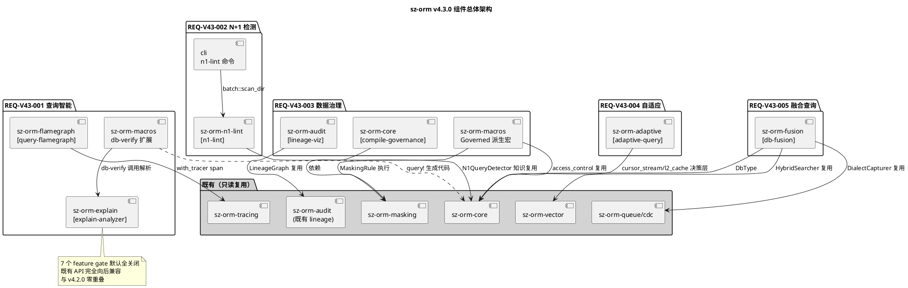

### 2.1.3 需求依赖关系与开发顺序

```plantuml
@startuml
title v4.3.0 需求依赖关系与开发顺序

REQ_V43_001 "REQ-V43-001\nEXPLAIN+火焰图" : M1（与 v4.2.0 并行）
REQ_V43_002 "REQ-V43-002\nN+1 静态检测" : M2（v4.2.0 交付后,cli 同文件）
REQ_V43_003 "REQ-V43-003\n血缘+治理" : M3（与 v4.2.0 并行）
REQ_V43_004 "REQ-V43-004\n自适应查询" : M4（v4.2.0 交付后,core 最终形态）
REQ_V43_005 "REQ-V43-005\n融合查询(可选)" : M5（v4.2.0 交付后）

REQ_V43_001 ..> REQ_V43_002 : 查询智能互补(可选协同)
REQ_V43_003 ..> REQ_V43_004 : 治理标注指导自适应(可选,PII 不缓存)

note bottom of REQ_V43_002
  唯一同文件风险: cli/src/main.rs
  M2 排期在 v4.2.0 交付后
  规避 merge 冲突
end note

@enduml
```

**开发顺序**（对齐 development-plan.md §14.1）：
1. **立即启动（与 v4.2.0 并行）**：M0（0.5 周纯文档）→ M1（sz-orm-explain 先做，flamegraph 建议 v4.2.0 M1 后）→ M3（sz-orm-audit 扩展）
2. **v4.2.0 交付后启动**：M2（cli 同文件）→ M4（依赖 core 最终形态）→ M5（可选实验）
3. **最后**：M6 最终验证（14 道门禁 + 文档 + 版本号 v4.2.0→v4.3.0）

## 2.2 逐项技术设计

### 2.2.1 REQ-V43-001 编译期 EXPLAIN 分析 + 查询性能火焰图

#### 2.2.1.1 架构设计

本需求分两个独立子模块：(A) 编译期 EXPLAIN 分析（`sz-orm-explain` 新包 + `sz-orm-macros` db-verify 扩展）；(B) 查询性能火焰图（`sz-orm-flamegraph` 新包）。

**子模块 A：编译期 EXPLAIN 分析**

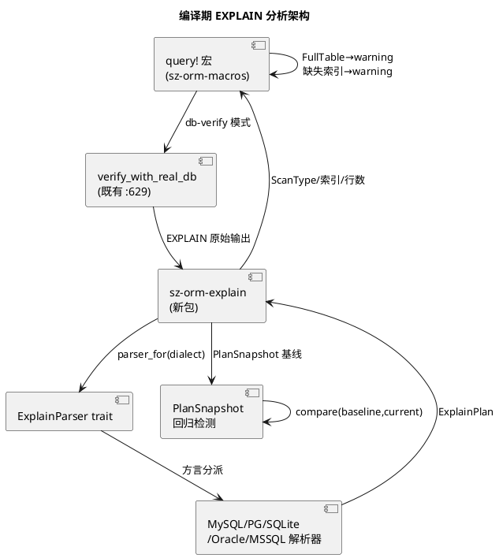

核心结构：
- `pub enum ScanType { FullTable, IndexRange, IndexScan, UniqueLookup, Other }`：抽象 5 方言扫描方式。
- `pub struct ExplainPlan { pub scan_type: ScanType, pub table: String, pub index: Option<String>, pub rows: u64, pub extra: Vec<String> }`：统一执行计划。
- `pub trait ExplainParser: Send + Sync { fn parse(&self, raw: &str) -> Result<ExplainPlan, ExplainError>; }`：方言解析器 trait。
- `pub fn parser_for(dialect: Dialect) -> Box<dyn ExplainParser>`：方言分派。
- `pub enum ExplainError { Unparseable { reason: String }, UnsupportedDialect }`：解析错误。
- `pub struct PlanSnapshot { pub query_key: String, pub plan: ExplainPlan, pub captured_at: String }`：基线快照（JSON 序列化）。
- `pub enum PlanRegression { ScanTypeUpgrade { .. }, IndexLost { .. }, RowsGrowth { before: u64, after: u64 } }`：回归类型。
- `pub fn compare(baseline: &ExplainPlan, current: &ExplainPlan) -> Vec<PlanRegression>`：回归对比。
- `pub fn check_regressions(baseline_path: &str, current: &str) -> Result<Vec<PlanRegression>, ExplainError>`：CI 入口。

**子模块 B：查询性能火焰图**

核心结构：
- `pub enum Phase { Build, Bind, PoolAcquire, SqlExecute, ResultMap }`：查询生命周期阶段。
- `pub struct QueryPhaseTiming { pub phase: Phase, pub start_ms: u64, pub duration_ms: u64 }`：阶段计时。
- `pub struct QueryTracer`：阶段计时器，`trace_execute<F>(&self, f: F) -> (F::Output, Vec<QueryPhaseTiming>)` 分阶段计时（`Instant::now()`），`with_tracer(tracer: &dyn Tracer)` 写入既有 Tracer span。
- `pub fn to_brendan_gregg(timings: &[QueryPhaseTiming]) -> String`：Brendan Gregg 折叠格式（`phase;start;duration`，兼容 `flamegraph.pl`）。
- `pub fn to_svg(timings: &[QueryPhaseTiming]) -> String`：内联 SVG 火焰图（无外部依赖）。

#### 2.2.1.2 核心流程

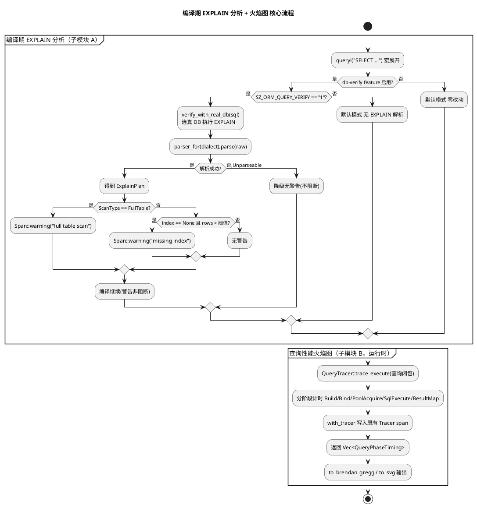

#### 2.2.1.3 复用既有代码（file:line 证据）

| 复用点 | 既有代码位置 | 复用方式 | 验证状态 |
|--------|-------------|---------|---------|
| db-verify 环境变量开关 | `packages/sz-orm-macros/src/lib.rs:548` | 扩展在此 feature 内调用解析器 | ✅ 已验证 |
| SQL 语法校验 | `packages/sz-orm-macros/src/lib.rs:298` | 模式参考 | ✅ 已验证 |
| 各方言 EXPLAIN 语句构造 | `packages/sz-orm-macros/src/lib.rs:642-647` | 解析器对应方言输出格式 | ✅ 已验证 |
| Tracer trait | `packages/sz-orm-tracing/src/lib.rs:129` | `QueryTracer::with_tracer` 写入 span | ✅ 已验证 |
| SzTracer | `packages/sz-orm-tracing/src/lib.rs:136` | span 关联复用 | ✅ 已验证 |
| QueryBuilder | `packages/sz-orm-core/src/query.rs:36` | 火焰图包装查询执行 | ✅ 已验证 |
| Connection trait | `packages/sz-orm-core/src/pool.rs:45` | 查询执行链路 | ✅ 已验证 |

#### 2.2.1.4 新增依赖

| 包 | 新增依赖 | 用途 | feature 门控 |
|----|---------|------|-------------|
| sz-orm-explain | serde_json（可选） | PlanSnapshot JSON 序列化 | `explain-analyzer` |
| sz-orm-explain | sz-orm-core | DbType 方言枚举 | 必需 |
| sz-orm-flamegraph | sz-orm-tracing | Tracer span 关联 | `query-flamegraph` |
| sz-orm-macros | sz-orm-explain（可选） | db-verify 模式调用解析 | `db-verify` 扩展 |

#### 2.2.1.5 feature gate 定义

```toml
# packages/sz-orm-explain/Cargo.toml（新包）
[features]
explain-analyzer = ["dep:serde_json"]
# 默认关闭

# packages/sz-orm-flamegraph/Cargo.toml（新包）
[features]
query-flamegraph = []
# 默认关闭

# packages/sz-orm-macros/Cargo.toml（扩展 db-verify）
[features]
db-verify = ["dep:sz-orm-explain"]  # 新增可选依赖
```

#### 2.2.1.6 错误处理策略

| 错误场景 | 处理策略 | 用户感知 |
|---------|---------|---------|
| EXPLAIN 输出格式不识别（DB 版本变化） | 降级为无警告，返回 `ExplainError::Unparseable`，不 panic | 编译期无警告（降级），日志可选记录 |
| 编译期警告过度干扰 | 默认 warning 非阻断，`SZ_ORM_EXPLAIN_ROW_THRESHOLD` 配置阈值（默认 1000），`#![allow(full_table_scan)]` 抑制 | 可配置/抑制，编译不阻断 |
| 执行计划回归检出 | 检出 `ScanTypeUpgrade`/`IndexLost`/`RowsGrowth`，CI 报告标注 | CI 报告"plan regression detected" |
| 火焰图阶段计时误差 | `Instant::now()` 精度，误差 < 1ms，测试断言验证 | 无（测试保证精度） |

#### 2.2.1.7 测试策略

| 测试类型 | 测试内容 | 验收条件 |
|---------|---------|---------|
| 单元测试 | 5 方言各提供真实 EXPLAIN 样例输出，解析为正确 ScanType/index/rows | MySQL type=ALL→FullTable；PG Seq Scan→FullTable；SQLite SCAN→FullTable；Oracle TABLE ACCESS FULL→FullTable；MSSQL Table Scan→FullTable |
| 边界测试 | 非 SQL 输入返回 `Unparseable`，不 panic | 返回错误不 panic |
| 单元测试 | PlanSnapshot 基线→回归检出 | IndexRange→FullTable 检出 `ScanTypeUpgrade`；索引丢失检出 `IndexLost` |
| 单元测试 | 火焰图各阶段计时总和 = 总耗时（误差 < 1ms） | 误差 < 1ms |
| 单元测试 | Brendan Gregg 输出格式与 `flamegraph.pl` 兼容 | 首行 header 正确 |
| 集成测试 | `SZ_ORM_QUERY_VERIFY=1 DATABASE_URL=mysql://...` 连真库编译，全表扫描警告触发 | 编译期输出 warning，编译成功不阻断 |
| 集成测试 | 真实查询执行，SVG 输出包含 Build/PoolAcquire/SqlExecute 层 | SVG 含各阶段层 |
| 门禁 | `cargo test -p sz-orm-explain --features explain-analyzer` + `cargo test -p sz-orm-flamegraph --features query-flamegraph` | 全部通过 |

#### 2.2.1.8 设计理由

1. **为什么独立 `sz-orm-explain` 包而非内联 macros**：EXPLAIN 解析逻辑复杂（5 方言 × 多版本格式），独立包可独立测试、独立版本化、被 CLI/CI 复用，避免 macros 包膨胀。
2. **为什么警告非阻断**：编译期 EXPLAIN 分析旨在前移优化建议，非强制阻断（全表扫描在小表场景合法），阻断会破坏既有编译流程，违反"无 Breaking Change"铁律。
3. **为什么复用既有 db-verify 而非新建执行链路**：既有 `SZ_ORM_QUERY_VERIFY`（`:548`）已支持连真 DB 执行 EXPLAIN，重写会重复实现且可能引入不一致，违反"复用优先"。
4. **为什么火焰图复用 Tracer 而非新建追踪**：既有 `Tracer`/`SzTracer`（`:129/136`）提供 span 关联基础设施，重写违反"复用优先"，且无法与既有分布式追踪集成。
5. **为什么 `PlanSnapshot` JSON 序列化**：JSON 可版本化管理、CI 可 diff、人类可读，与既有审计链兼容。

### 2.2.2 REQ-V43-002 N+1 静态检测器

#### 2.2.2.1 架构设计

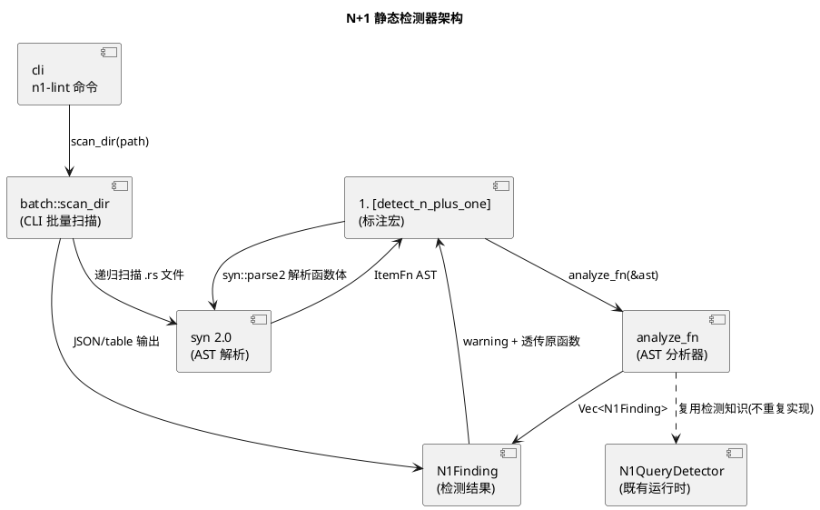

核心结构：
- `#[proc_macro_attribute] pub fn detect_n_plus_one(_attr: TokenStream, item: TokenStream) -> TokenStream`：函数标注宏，解析函数体 → 分析 → 生成警告 + 透传原函数。
- `pub struct N1Finding { pub span_line: usize, pub pattern: N1Pattern, pub message: String }`：检测结果。
- `pub enum N1Pattern { QueryInLoop, ConditionalQueryInLoop, MissingEagerLoadHint }`：三种检测模式。
- `fn analyze_fn(ast: &syn::ItemFn) -> Vec<N1Finding>`：AST 分析核心。
- `pub fn scan_dir(path: &str) -> Vec<(String, N1Finding)>`：CLI 批量扫描，递归扫描 .rs 文件 syn 解析全部函数。

#### 2.2.2.2 核心流程

```plantuml
@startuml
title N+1 静态检测 核心流程

start

partition "函数标注模式（编译期）" {
  :#[detect_n_plus_one] fn foo() {...};
  :syn::parse2 解析函数体 AST;
  if (AST 解析成功?) then (是)
    :analyze_fn(&ast);
    partition "三种检测模式" {
      :模式一: for/while 循环体内\nQueryBuilder/find_by_* 调用;
      if (检出?) then (是) :QueryInLoop; endif
      :模式二: 循环内 if 分支查询调用;
      if (检出?) then (是) :ConditionalQueryInLoop; endif
      :模式三: 循环内 where_in 可批量替代;
      if (检出?) then (是) :MissingEagerLoadHint; endif
    }
    if (有 finding?) then (是)
      if (#![allow(n_plus_one)]?) then (是)
        :无警告(抑制);
      else (否)
        :Span::warning(非阻断);
      endif
    else (否)
      :无警告;
    endif
    :透传原函数(编译继续);
  else (否,AST 解析失败)
    :跳过该函数,告警"AST parse failed";
  endif
}

partition "CLI 批量扫描模式（开发期/CI）" {
  :sz-orm n1-lint --path=src --format=json;
  :scan_dir 递归扫描 .rs 文件;
  :syn 解析全部函数(不依赖用户标注);
  :analyze_fn 每个函数;
  :输出 JSON/table findings 列表;
}

stop

@enduml
```

#### 2.2.2.3 复用既有代码（file:line 证据）

| 复用点 | 既有代码位置 | 复用方式 | 验证状态 |
|--------|-------------|---------|---------|
| 运行时 N+1 检测器 | `packages/sz-orm-core/src/entity_graph.rs:641` | 检测知识参考（查询调用模式/预加载替代），交叉验证 | ✅ 已验证 |
| 预加载器 | `packages/sz-orm-core/src/eager_loader.rs` | MissingEagerLoadHint 模式替代建议 | ✅ 已验证 |
| 智能预加载 | `packages/sz-orm-core/src/smart_eager_loader.rs` | 自动选择预加载策略参考 | ✅ 已验证 |

#### 2.2.2.4 新增依赖

| 包 | 新增依赖 | 用途 | feature 门控 |
|----|---------|------|-------------|
| sz-orm-n1-lint | syn 2.0（full feature） | 函数体 AST 解析 | `n1-lint` |
| sz-orm-n1-lint | quote / proc-macro2 | 标注宏代码生成 | `n1-lint` |
| sz-orm-n1-lint | sz-orm-core | N1QueryDetector 检测知识 | 必需 |
| sz-orm-n1-lint | serde_json | CLI JSON 输出 | `n1-lint` |
| cli | sz-orm-n1-lint | n1-lint 命令集成 | `n1-lint` |

#### 2.2.2.5 feature gate 定义

```toml
# packages/sz-orm-n1-lint/Cargo.toml（新包）
[features]
n1-lint = ["dep:syn", "dep:serde_json"]
# 默认关闭
[dependencies]
syn = { version = "2.0", features = ["full"], optional = true }
serde_json = { version = "1", optional = true }
```

#### 2.2.2.6 错误处理策略

| 错误场景 | 处理策略 | 用户感知 |
|---------|---------|---------|
| AST 解析失败（复杂宏展开后代码） | 跳过该函数，告警"AST parse failed, skipped"，不阻断编译 | warning"n1-lint: AST parse failed at function X, skipped" |
| 误报（循环内查询非 N+1） | 检测模式保守（仅循环体内直接查询调用），复杂控制流不检测，`#![allow(n_plus_one)]` 可抑制 | 可抑制误报，编译不阻断 |
| 漏报（动态构造查询） | 运行时 `N1QueryDetector` 兜底检测，静态/运行时交叉验证 | 运行时告警 N+1，静态标注"runtime fallback detected" |

#### 2.2.2.7 测试策略

| 测试类型 | 测试内容 | 验收条件 |
|---------|---------|---------|
| 单元测试 | 标注函数循环内查询检出 `QueryInLoop` | `#[detect_n_plus_one] fn foo() { for u in users { orders.find_by_user(u.id) } }` → warning "QueryInLoop detected" |
| 单元测试 | 循环内 if 分支查询检出 `ConditionalQueryInLoop` | 检出对应模式 |
| 单元测试 | 循环内 where_in 可批量替代检出 `MissingEagerLoadHint` | 检出对应模式 |
| 单元测试 | `#![allow(n_plus_one)]` 抑制警告 | 抑制后无警告 |
| 单元测试 | CLI 批量扫描样例工程检出循环内查询 | `scan_dir` 输出预期 findings |
| 集成测试 | 静态/运行时交叉验证：同一样例代码，静态检测与 `N1QueryDetector` 运行时检测发现一致 | 结果一致 |
| 集成测试 | `sz-orm n1-lint --path=... --format=json` 输出 JSON 可被 CI 消费 | JSON 格式正确 |
| 门禁 | `cargo test -p sz-orm-n1-lint --features n1-lint` + clippy + 占位检查 | 全部通过 |

#### 2.2.2.8 设计理由

1. **为什么函数标注宏 + AST 分析而非 clippy lint**：clippy lint 需发布为 rustc 插件 crate，分发与维护成本高，用户需安装额外工具链；函数标注宏 + syn AST 分析可在现有构建链内工作，零额外工具链（development-plan.md §M2 注释）。
2. **为什么保守检测（仅循环体内直接查询调用）**：复杂控制流静态分析易误报，保守检测降低误报率，漏报由运行时 `N1QueryDetector` 兜底，静态/运行时交叉验证保证召回率。
3. **为什么默认 warning 非阻断**：N+1 在某些场景可能可接受（小循环），阻断会破坏既有编译流程；提供严格模式（`compile_error!`）供可选启用。
4. **为什么 CLI 批量扫描双入口**：函数标注需逐函数标注（侵入式），CLI 批量扫描全工程无侵入，CI 可消费 JSON 输出，双入口覆盖开发期 + CI 场景。
5. **为什么 M2 排期在 v4.2.0 交付后**：唯一同文件风险 `cli/src/main.rs`（v4.2.0 M3-T7/M3-T13 与 v4.3.0 M2-T2 均修改此文件），排期规避 merge 冲突（development-plan.md §2.2）。

### 2.2.3 REQ-V43-003 数据血缘可视化 + 编译期数据治理

#### 2.2.3.1 架构设计

本需求分两个子模块：(A) 数据血缘可视化（`sz-orm-audit` lineage-viz 扩展）；(B) 编译期数据治理（`sz-orm-core` compile-governance feature + `sz-orm-macros` Governed 派生宏）。

**子模块 A：数据血缘可视化**

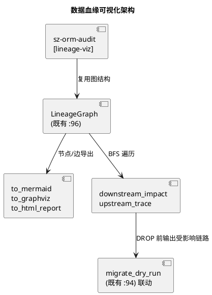

核心结构：
- `pub fn to_mermaid(graph: &LineageGraph) -> String`：Mermaid `graph LR` 格式（表/列/服务节点 + 边）。
- `pub fn to_graphviz(graph: &LineageGraph) -> String`：Graphviz `digraph` 格式。
- `pub fn to_html_report(graph: &LineageGraph) -> String`：内联样式 HTML（无外部依赖）。
- `pub struct ImpactEdge { pub from: String, pub to: String, pub via: String }`：影响边。
- `pub fn downstream_impact(graph: &LineageGraph, node: &str, depth: usize) -> Vec<ImpactEdge>`：变更影响范围（BFS 深度受限）。
- `pub fn upstream_trace(graph: &LineageGraph, node: &str, depth: usize) -> Vec<ImpactEdge>`：数据来源追溯。

**子模块 B：编译期数据治理**

核心结构：
- `#[proc_macro_derive(Governed, attributes(pii, mask))]`：派生宏，解析 `#[pii]`/`#[mask(strategy = "...")]` 标注。
- 编译期检查：`#[pii]` 字段未标注 `#[mask]` → `compile_error!("PII field must declare mask strategy")`；`#[mask(strategy = "invalid")]` → `compile_error!`（策略白名单 hash/partial/replace/encrypt）。
- 生成运行时治理代码：`fn pii_fields() -> Vec<&'static str>` + `fn mask_policy(field) -> Option<MaskPolicy>`（复用 `sz-orm-masking` 执行）。
- `pub struct ComplianceReport { pub pii_fields: Vec<PiiFieldEntry>, pub retention_days: Option<u32>, pub generated_at: String }`：合规报告。
- `pub fn compliance_report(models: &[&dyn GovernedModel]) -> ComplianceReport`：报告生成（JSON 输出，哈希入审计链）。

#### 2.2.3.2 核心流程

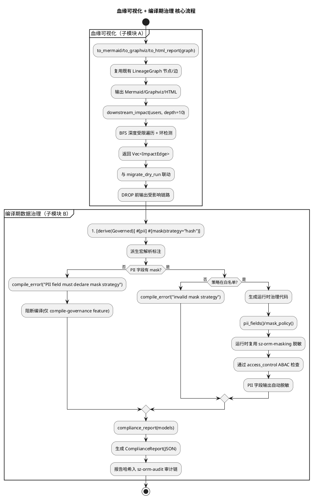

#### 2.2.3.3 复用既有代码（file:line 证据）

| 复用点 | 既有代码位置 | 复用方式 | 验证状态 |
|--------|-------------|---------|---------|
| LineageGraph | `packages/sz-orm-audit/src/lineage/graph.rs:96` | 图结构复用（节点/边） | ✅ 已验证 |
| export_dot | `packages/sz-orm-audit/src/lineage/export.rs:34` | 导出模式参考，保留不动 | ✅ 已验证 |
| export_json | `packages/sz-orm-audit/src/lineage/export.rs:68` | 导出模式参考，保留不动 | ✅ 已验证 |
| export_graphml | `packages/sz-orm-audit/src/lineage/export.rs:105` | 导出模式参考，保留不动 | ✅ 已验证 |
| AccessRule | `packages/sz-orm-core/src/access_control.rs:9` | ABAC 权限复用 | ✅ 已验证 |
| AccessContext | `packages/sz-orm-core/src/access_control.rs:22` | 访问上下文复用 | ✅ 已验证 |
| RowLevelSecurity | `packages/sz-orm-core/src/access_control.rs:85` | 行级安全复用 | ✅ 已验证 |
| MaskingRule | `packages/sz-orm-masking/src/lib.rs:21` | 脱敏规则执行复用 | ✅ 已验证 |
| migrate_dry_run | `packages/sz-orm-core/src/migration_dry_run.rs:94` | 影响分析与 dry-run 联动 | ✅ 已验证 |

#### 2.2.3.4 新增依赖

| 包 | 新增依赖 | 用途 | feature 门控 |
|----|---------|------|-------------|
| sz-orm-audit | 无新增（内部扩展） | Mermaid/Graphviz/HTML 导出 + 影响分析 | `lineage-viz` |
| sz-orm-core | sz-orm-masking | 编译期治理脱敏执行 | `compile-governance` |
| sz-orm-macros | sz-orm-masking（可选） | Governed 派生宏生成代码引用 | `compile-governance` |

#### 2.2.3.5 feature gate 定义

```toml
# packages/sz-orm-audit/Cargo.toml（扩展）
[features]
lineage-viz = []  # 血缘可视化导出 + 影响分析
# 默认关闭，既有 export_dot/export_json/export_graphml 保留不动

# packages/sz-orm-core/Cargo.toml（扩展）
[features]
compile-governance = ["dep:sz-orm-masking"]  # 编译期数据治理
# 默认关闭
```

#### 2.2.3.6 错误处理策略

| 错误场景 | 处理策略 | 用户感知 |
|---------|---------|---------|
| PII 字段未声明脱敏策略 | `compile_error!("PII field must declare mask strategy")`，阻断编译（仅 `compile-governance` feature 启用时） | 编译错误"PII field 'email' must declare mask strategy" |
| 非法脱敏策略 | `compile_error!`，阻断编译 | 编译错误"invalid mask strategy 'invalid', allowed: hash/partial/replace/encrypt" |
| 血缘影响分析环检测 | BFS 深度受限，已访问节点不重复遍历，不死循环 | 影响分析正常返回，不超时 |
| 合规报告审计链写入失败 | 告警，报告仍生成但标注"audit chain write failed" | 告警"compliance report generated, audit chain write failed, manual review required" |

#### 2.2.3.7 测试策略

| 测试类型 | 测试内容 | 验收条件 |
|---------|---------|---------|
| 单元测试 | users→orders→report 链路导出 Mermaid 含 3 节点 2 边 | Mermaid 结构正确 |
| 单元测试 | Graphviz 输出可被 `dot` 语法解析 | 结构断言通过 |
| 单元测试 | HTML 报告含内联样式 | HTML 结构正确 |
| 单元测试 | 删除 users 表，`downstream_impact(users, depth=10)` 检出 orders/报表服务受影响 | 影响范围正确 |
| 单元测试 | 深度限制（depth=1 只返回直接下游） | 深度受限正确 |
| 单元测试 | 合法标注编译通过；缺 mask 的 PII 字段编译失败 | compile_error 触发 |
| 单元测试 | 非法 mask 策略编译失败 | compile_error 触发 |
| 集成测试 | 迁移 dry-run 与血缘影响分析联动，DROP 前输出受影响链路 | 联动正确 |
| 集成测试 | `Governed` 模型通过 ABAC 检查后 PII 字段输出自动脱敏 | 自动脱敏生效 |
| 集成测试 | 合规报告 JSON 输出 + 哈希入审计链 | 审计联动通过 |
| 门禁 | `cargo test -p sz-orm-audit --features lineage-viz` + `cargo test -p sz-orm-core --features compile-governance` + `--all-features` 组合 | 全部通过 |

#### 2.2.3.8 设计理由

1. **为什么扩展既有 `sz-orm-audit` 而非新建包**：既有 `LineageGraph`（`:96`）+ 三导出（`:34/68/105`）已提供完整图结构与导出模式，新建包会重复实现图结构，违反"复用优先"；扩展在 `lineage-viz` feature 内，既有导出保留不动。
2. **为什么 BFS 深度受限**：血缘图可能很大/有环，无限遍历会死循环/超时；`depth` 参数让用户控制分析范围，环检测已访问节点不重复。
3. **为什么编译期强制（compile_error）而非运行时检查**：PII 字段未脱敏是安全合规红线，运行时检查可能遗漏（开发者忘记调用）；编译期强制保证 PII 字段必有脱敏策略，从源头消除泄露风险。但通过 `compile-governance` feature 隔离，默认不阻断既有代码。
4. **为什么复用既有 `sz-orm-masking` 执行脱敏**：既有 `MaskingRule`（`:21`）已实现 Phone/Email/IdCard 等脱敏算法，重写违反"复用优先"且可能不一致；编译期治理仅生成"哪些字段需脱敏 + 用什么策略"的元数据，运行时执行委托既有 masking。
5. **为什么合规报告 JSON + 审计链**：JSON 可被审计工具消费（GDPR/等保清单），哈希入审计链保证报告不可篡改，满足合规审计要求。

### 2.2.4 REQ-V43-004 自适应查询优化器

#### 2.2.4.1 架构设计

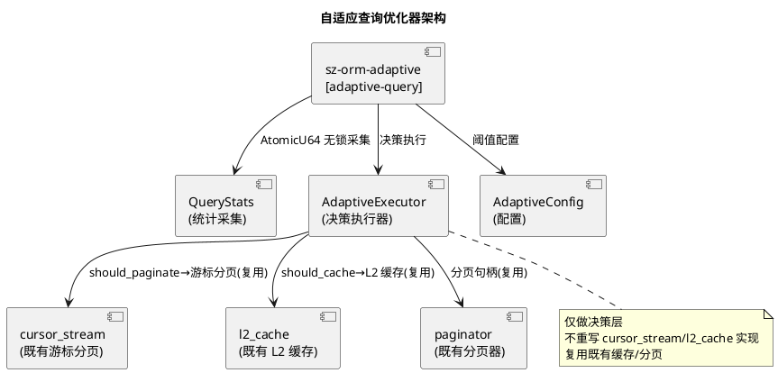

核心结构：
- `pub struct QueryStats { total_executions: AtomicU64, total_rows: AtomicU64, total_time_us: AtomicU64 }`：无锁统计采集。
  - `fn record(&self, rows: u64, time_us: u64)`：原子操作采集。
  - `fn should_paginate(&self, threshold_rows: u64) -> bool`：avg_rows > threshold（默认 1000）。
  - `fn should_cache(&self, threshold_ms: u64, min_executions: u64) -> bool`：avg_time > threshold 且执行次数达标。
- `pub struct AdaptiveConfig { pub row_threshold: u64, pub cache_time_ms: u64, pub min_executions: u64 }`：决策阈值配置。
- `pub struct AdaptiveExecutor { stats: HashMap<String, QueryStats>, config: AdaptiveConfig }`：决策执行器。
  - `fn execute(&self, query_key: &str, f: impl FnOnce() -> QueryOutcome) -> QueryOutcome`：记录统计 → 按决策选择执行路径。
- `pub struct QueryOutcome`：结果/分页句柄/缓存标记/降级标记。

#### 2.2.4.2 核心流程

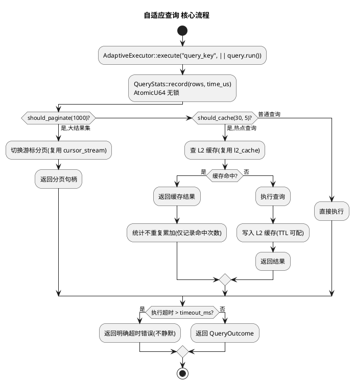

#### 2.2.4.3 复用既有代码（file:line 证据）

| 复用点 | 既有代码位置 | 复用方式 | 验证状态 |
|--------|-------------|---------|---------|
| 游标分页 | `packages/sz-orm-core/src/cursor_stream.rs` | `should_paginate` 为真时切换游标分页 | ✅ 已验证 |
| 分页器 | `packages/sz-orm-core/src/paginator.rs` | 分页句柄复用 | ✅ 已验证 |
| L1 缓存 | `packages/sz-orm-core/src/l1_cache.rs` | 本地缓存复用 | ✅ 已验证 |
| L2 缓存 | `packages/sz-orm-core/src/l2_cache.rs` | `should_cache` 为真时写入 L2 | ✅ 已验证 |
| 计划缓存 | `packages/sz-orm-core/src/plan_cache.rs` | 查询计划缓存复用 | ✅ 已验证 |
| AI 离线调优 | `packages/sz-orm-ai/src/auto_tuning/pipeline.rs:15` | 互补关系（本方案无 AI 依赖），保留不动 | ✅ 已验证 |

#### 2.2.4.4 新增依赖

| 包 | 新增依赖 | 用途 | feature 门控 |
|----|---------|------|-------------|
| sz-orm-adaptive | sz-orm-core | cursor_stream/l2_cache/paginator 复用 | 必需 |
| sz-orm-adaptive | sz-orm-observability | Prometheus 指标输出 | `adaptive-query` |

#### 2.2.4.5 feature gate 定义

```toml
# packages/sz-orm-adaptive/Cargo.toml（新包）
[features]
adaptive-query = ["dep:sz-orm-observability"]
# 默认关闭
```

#### 2.2.4.6 错误处理策略

| 错误场景 | 处理策略 | 用户感知 |
|---------|---------|---------|
| 慢查询超时 | 返回明确超时错误，不静默丢查询，不无限重试 | 错误"adaptive query timeout, exceeded {timeout_ms}ms" |
| 缓存脏读风险 | 默认关闭自动缓存（需显式开启），TTL 可配，统计决策仅建议不强制 | 默认无脏读风险，显式开启后 TTL 可配置 |
| 统计失真 | 缓存命中不重复累加执行时间，仅记录命中次数 | 统计准确，决策不受失真影响 |

#### 2.2.4.7 测试策略

| 测试类型 | 测试内容 | 验收条件 |
|---------|---------|---------|
| 单元测试 | 查询执行 100 次平均行数 2000，`should_paginate(1000)` 返回 true | 决策正确 |
| 单元测试 | 平均耗时 50ms 执行 10 次，`should_cache(30, 5)` 返回 true | 决策正确 |
| 单元测试 | 模拟统计增长，验证 `should_paginate` 状态翻转 | 状态翻转正确 |
| 单元测试 | 缓存命中返回缓存结果，统计不重复累加执行时间 | 统计不重复累加 |
| 性能测试 | 统计采集开销 < 1μs/次（AtomicU64 原子操作，无锁） | < 1μs/次 |
| 集成测试 | 真实查询（SQLite）执行 N 次后自动切游标分页 | 自动分页生效 |
| 集成测试 | 热点查询自动缓存，命中返回缓存结果 | 自动缓存生效 |
| 集成测试 | 慢查询超时返回明确错误 | 超时错误不静默 |
| 门禁 | `cargo test -p sz-orm-adaptive --features adaptive-query` + clippy + 占位检查 | 全部通过 |

#### 2.2.4.8 设计理由

1. **为什么仅做决策层而不重写缓存/分页**：既有 `cursor_stream`/`paginator`/`l1_cache`/`l2_cache`/`plan_cache` 已是成熟实现，重写违反"复用优先"且引入不一致风险；决策层仅判断"何时分页/何时缓存"，执行委托既有实现。
2. **为什么 AtomicU64 无锁统计**：查询高频，锁竞争会成为瓶颈；AtomicU64 原子操作无锁，开销 < 1μs/次，满足性能要求。
3. **为什么默认关闭自动缓存**：自动缓存可能导致脏读（TTL 内读到旧数据），默认关闭避免无配置环境行为变化，需显式开启 + TTL 可配，符合"不强制启用新能力"约束。
4. **为什么与 AI 离线优化互补而非替代**：既有 `AutoTuningPipeline`（`:15`）是 AI 离线闭环（需训练数据 + AI 依赖），本方案是轻量运行时自适应（无 AI 依赖），两者互补：运行时自适应快速响应，AI 离线深度优化。
5. **为什么缓存命中不重复累加执行时间**：缓存命中未实际执行查询，累加会使平均耗时失真，导致 `should_cache` 决策错误；仅记录命中次数保持统计准确。

### 2.2.5 REQ-V43-005 多数据库融合查询（可选/实验）

#### 2.2.5.1 架构设计

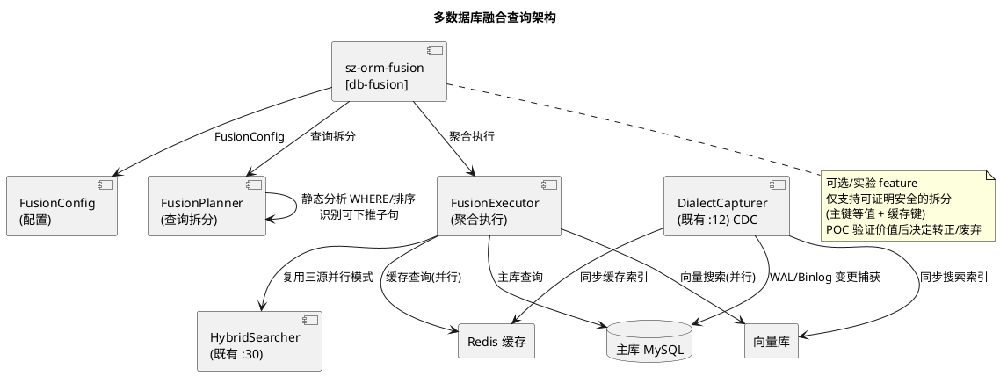

核心结构：
- `pub struct FusionConfig { pub primary: Dialect, pub cache: Option<CacheBackend>, pub search: Option<SearchBackend> }`：融合配置。
- `pub enum CacheBackend { Redis }` / `pub enum SearchBackend { Vector }`：后端类型。
- `pub struct FusionPlanner`：查询拆分器，`fn plan(query: &QueryBuilder<M>) -> FusionPlan`（静态分析 WHERE/排序，识别可下推缓存/搜索子句）。
- `pub struct FusionPlan`：可下推子句 + 主库子句。
- `pub struct FusionExecutor`：聚合执行器，`fn execute(plan: FusionPlan) -> Result<Vec<Row>>`（主库 + 缓存/搜索并行执行 + 聚合）。

#### 2.2.5.2 核心流程

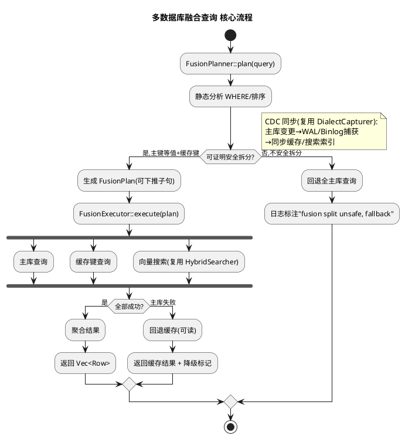

#### 2.2.5.3 复用既有代码（file:line 证据）

| 复用点 | 既有代码位置 | 复用方式 | 验证状态 |
|--------|-------------|---------|---------|
| 28 方言枚举 | `packages/sz-orm-core/src/db_type.rs:11` | FusionConfig primary 方言标识 | ✅ 已验证 |
| 混合搜索器 | `packages/sz-orm-vector/src/hybrid_search/searcher.rs:30` | 三源并行查询 + 融合排序模式复用 | ✅ 已验证 |
| 方言 CDC 捕获器 | `packages/sz-orm-queue/src/cdc/capturer.rs:12` | 主库→缓存/搜索索引同步，不重复实现 CDC | ✅ 已验证 |

#### 2.2.5.4 新增依赖

| 包 | 新增依赖 | 用途 | feature 门控 |
|----|---------|------|-------------|
| sz-orm-fusion | sz-orm-core | QueryBuilder + DbType | 必需 |
| sz-orm-fusion | sz-orm-vector | HybridSearcher 复用 | `db-fusion` |
| sz-orm-fusion | sz-orm-queue | DialectCapturer CDC 复用 | `db-fusion` |

#### 2.2.5.5 feature gate 定义

```toml
# packages/sz-orm-fusion/Cargo.toml（新包，可选/实验）
[features]
db-fusion = ["dep:sz-orm-vector", "dep:sz-orm-queue"]
# 默认关闭，标记为可选/实验
```

#### 2.2.5.6 错误处理策略

| 错误场景 | 处理策略 | 用户感知 |
|---------|---------|---------|
| 主库失败回退 | 回退缓存（可读），返回缓存结果 + 降级标记，不静默返回脏数据 | 结果标注"degraded: primary unavailable, cache fallback" |
| 拆分语义不透明（非主键等值/非缓存键） | 实验阶段仅支持可证明安全的拆分，不安全拆分回退全主库查询 | 查询回退全主库，日志标注"fusion split unsafe, fallback to primary only" |
| CDC 同步延迟 | 缓存 TTL 可配，延迟期间回退主库，评估报告标注同步延迟影响 | 缓存 TTL 内可能读到旧数据，TTL 过期回退主库 |
| 实验废弃 | 评估报告给出废弃建议，feature gate 保留但标记 deprecated | 评估报告"db-fusion deprecated, value insufficient, recommend removal in v4.x+" |

#### 2.2.5.7 测试策略

| 测试类型 | 测试内容 | 验收条件 |
|---------|---------|---------|
| 单元测试 | `where_eq` + 缓存键命中 → 主库跳过 | 主库跳过，返回缓存结果 |
| 单元测试 | 主库失败回退（缓存可读）→ 返回缓存结果 + 降级标记 | 降级标记正确 |
| 单元测试 | 不安全拆分回退全主库 | 回退全主库 + 日志标注 |
| 集成测试 | POC 运行：主库 + Redis + 向量库三源融合查询 | 拆分/聚合正确 |
| 集成测试 | CDC 同步：主库变更 → 缓存/搜索索引更新 | CDC 同步生效 |
| 评估 | 编写《db-fusion 实验评估报告》：POC 结果 + 价值判断 | 报告含转正/废弃建议 |
| 门禁 | `cargo test -p sz-orm-fusion --features db-fusion` + 默认 feature 行为不变 | 全部通过 |

#### 2.2.5.8 设计理由

1. **为什么标记为可选/实验**：多数据库融合查询价值需验证（拆分语义复杂、CDC 同步延迟、一致性保证难），直接转正风险高；POC 验证价值后决定转正/废弃，符合"了解真实需求及痛点，避免自嗨型产品设计"。
2. **为什么仅支持可证明安全的拆分（主键等值 + 缓存键）**：一般查询拆分可能破坏一致性（如非主键查询缓存键不匹配），实验阶段仅支持可证明安全的拆分降低风险，不安全拆分回退全主库保证正确性。
3. **为什么复用既有 `HybridSearcher`/`DialectCapturer`**：既有 `HybridSearcher`（`:30`）已实现三源并行查询 + 融合排序，既有 `DialectCapturer`（`:12`）已实现各方言 CDC 捕获，重写违反"复用优先"且重复实现 CDC 成本高。
4. **为什么主库失败回退缓存 + 降级标记而非静默**：静默返回缓存数据会让用户误以为是最新数据，降级标记明确告知数据可能过期，符合"不静默返回脏数据"约束。
5. **为什么 CDC 同步而非实时双写**：实时双写破坏主库性能且引入分布式事务复杂度；CDC 异步同步复用既有 `DialectCapturer`，延迟可接受（缓存 TTL 兜底），符合"复用优先"。

---

# 三、跨需求关注点

## 3.1 错误处理统一策略

### 3.1.1 错误类型设计原则

| 原则 | 说明 | 适用需求 |
|------|------|---------|
| 降级不阻断 | 编译期警告（EXPLAIN/N+1）默认 warning 非阻断，解析失败降级无警告 | REQ-V43-001/002 |
| 明确不静默 | 慢查询超时/主库失败返回明确错误 + 降级标记，不静默丢数据 | REQ-V43-004/005 |
| compile_error 仅治理 | 编译期阻断仅用于安全合规红线（PII 未脱敏/非法策略），feature 隔离 | REQ-V43-003 |
| 不 panic | 所有解析/分析失败返回 Result，不 panic | 全需求 |

### 3.1.2 错误码统一表

| 错误类型 | 来源 | 处理 | 用户感知 |
|---------|------|------|---------|
| `ExplainError::Unparseable` | EXPLAIN 输出格式不识别 | 降级无警告 | 编译期无警告 |
| `ExplainError::UnsupportedDialect` | 不支持的方言 | 降级无警告 | 编译期无警告 |
| `N1Finding`（warning） | N+1 模式检出 | warning 非阻断，可抑制 | 编译期 warning |
| `compile_error!("PII field must declare mask strategy")` | PII 字段未脱敏 | 阻断编译（仅 compile-governance） | 编译错误 |
| `compile_error!("invalid mask strategy")` | 非法脱敏策略 | 阻断编译 | 编译错误 |
| 超时错误 | 自适应查询超时 | 返回明确错误 | "adaptive query timeout" |
| 降级标记 | 融合查询主库失败 | 返回缓存 + 降级标记 | "degraded: primary unavailable" |

## 3.2 日志与可观测

### 3.2.1 结构化日志统一

| 需求 | 日志事件 | 级别 |
|------|---------|------|
| REQ-V43-001 | EXPLAIN 解析失败降级、编译期警告触发 | warn |
| REQ-V43-001 | 火焰图阶段计时 | info（可选） |
| REQ-V43-002 | N+1 检测 finding、AST 解析失败跳过 | warn |
| REQ-V43-003 | 合规报告生成、审计链写入失败 | info/warn |
| REQ-V43-004 | 自动分页切换、自动缓存命中、慢查询降级 | info/warn |
| REQ-V43-005 | 融合拆分回退、主库失败回退、CDC 同步延迟 | warn |

### 3.2.2 Prometheus 指标

| 指标 | 类型 | 适用需求 | 说明 |
|------|------|---------|------|
| `sz_orm_explain_warnings_total` | Counter | REQ-V43-001 | 编译期 EXPLAIN 警告总数 |
| `sz_orm_plan_regressions_total` | Counter | REQ-V43-001 | 执行计划回归总数 |
| `sz_orm_n1_findings_total` | Counter | REQ-V43-002 | N+1 检测发现总数 |
| `sz_orm_query_phase_duration_ms` | Histogram | REQ-V43-001 | 查询各阶段耗时（Build/Bind/PoolAcquire/SqlExecute/ResultMap） |
| `sz_orm_adaptive_executions_total` | Counter | REQ-V43-004 | 自适应查询执行次数 |
| `sz_orm_adaptive_paginate_switches_total` | Counter | REQ-V43-004 | 自动分页切换次数 |
| `sz_orm_adaptive_cache_hits_total` | Counter | REQ-V43-004 | 自动缓存命中次数 |
| `sz_orm_fusion_degraded_total` | Counter | REQ-V43-005 | 融合查询降级次数 |

## 3.3 配置管理

### 3.3.1 配置统一原则

所有新增配置通过环境变量 / `AdaptiveConfig` / `FusionConfig` 显式传入，默认值保证"无配置环境行为不变"。

### 3.3.2 关键配置项

| 配置项 | 默认值 | 适用需求 | 说明 |
|--------|--------|---------|------|
| `SZ_ORM_QUERY_VERIFY` | 未设置 | REQ-V43-001 | 既有 db-verify 开关（`1` 连真 DB，`cache` 离线缓存） |
| `SZ_ORM_EXPLAIN_ROW_THRESHOLD` | 1000 | REQ-V43-001 | 缺失索引警告行数阈值 |
| `SZ_ORM_EXPLAIN_ALLOW` | 未设置 | REQ-V43-001 | EXPLAIN 警告抑制（`full_table_scan`） |
| `adaptive.row_threshold` | 1000 | REQ-V43-004 | 自动分页行数阈值 |
| `adaptive.cache_time_ms` | 30 | REQ-V43-004 | 自动缓存耗时阈值 |
| `adaptive.min_executions` | 5 | REQ-V43-004 | 自动缓存最小执行次数 |
| `adaptive.cache_enabled` | false | REQ-V43-004 | 自动缓存启用（默认关闭避免脏读） |
| `adaptive.timeout_ms` | 5000 | REQ-V43-004 | 慢查询超时阈值 |
| `fusion.primary` | — | REQ-V43-005 | 主库方言 |
| `fusion.cache` | None | REQ-V43-005 | 缓存后端（Redis） |
| `fusion.search` | None | REQ-V43-005 | 搜索后端（Vector） |

## 3.4 feature gate 组合验证

### 3.4.1 feature 依赖关系

```plantuml
@startuml
title v4.3.0 feature gate 依赖关系

feature "explain-analyzer" as f1
feature "query-flamegraph" as f2
feature "n1-lint" as f3
feature "lineage-viz" as f4
feature "compile-governance" as f5
feature "adaptive-query" as f6
feature "db-fusion" as f7

feature "sz-orm-macros/db-verify" as dbverify
feature "sz-orm-core/masking" as masking

f1 --> dbverify : 扩展 db-verify 模式
f5 --> masking : 依赖 sz-orm-masking
f7 --> f_vector : 依赖 sz-orm-vector
f7 --> f_cdc : 依赖 sz-orm-queue/cdc

note bottom of f1
  7 个 feature 默认全关闭
  与 v4.2.0 7 个 feature 任意组合编译通过
  不影响既有 feature 行为
end note

@enduml
```

### 3.4.2 feature 全组合编译验证

| 验证项 | 命令 | 验收条件 |
|--------|------|---------|
| 默认编译 | `cargo build --workspace` | 无新能力，行为与 v4.2.0 一致 |
| 单 feature 编译 | `cargo build --features sz-orm-macros/explain-analyzer` 等 7 项 | 各 feature 独立编译通过 |
| 全 feature 编译 | `cargo build --workspace --all-features` | 全 feature 组合编译通过 |
| 与 v4.2.0 feature 组合 | `cargo build --features sz-orm-dtx/cross-lang-dtx,sz-orm-macros/explain-analyzer,...` | v4.2.0 + v4.3.0 feature 任意组合编译通过 |
| 既有 feature 不破坏 | `cargo build --features sz-orm-dtx/xa,sz-orm-wasm/js` | 既有 feature 行为不变 |

## 3.5 五方言覆盖策略

| 需求 | 五方言覆盖点 | 复用既有 | 方言差异处理 |
|------|-------------|---------|-------------|
| REQ-V43-001 | EXPLAIN 输出解析（5 方言） | 各方言 EXPLAIN 语句构造 `macros/lib.rs:642-647` | MySQL `type=ALL`→FullTable；PG `Seq Scan`→FullTable；SQLite `SCAN`→FullTable；Oracle `TABLE ACCESS FULL`→FullTable；MSSQL `Table Scan`→FullTable |
| REQ-V43-003 | 编译期治理（PII/脱敏，方言无关） | `sz-orm-masking` 脱敏规则 | 治理标注方言无关，脱敏策略通用 |
| REQ-V43-005 | 融合查询 CDC 同步（各方言 WAL/Binlog/Trigger/LogMiner） | `DialectCapturer` `queue/cdc/capturer.rs:12` | MySQL Binlog；PG WAL；SQLite Trigger；Oracle LogMiner；MSSQL CDC |

**方言 EXPLAIN 差异处理**：
- MySQL：`EXPLAIN` 表格行，`type` 列（ALL/Index/range/const...）
- PostgreSQL：`EXPLAIN VERBOSE`，`Seq Scan`/`Index Scan` 节点
- SQLite：`EXPLAIN QUERY PLAN`，`SCAN`/`SEARCH` 前缀
- Oracle：`EXPLAIN PLAN FOR` + PLAN_TABLE 查询，`OPERATION` 列（TABLE ACCESS FULL/INDEX RANGE SCAN）
- MSSQL：`SET SHOWPLAN_ALL ON`，`Argument` 列（Table Scan/Index Seek）

---

# 四、风险与缓解

## 4.1 风险矩阵

| 风险 ID | 风险描述 | 影响 | 概率 | 缓解措施 | 责任需求 |
|---------|---------|------|------|---------|---------|
| R-001 | EXPLAIN 输出格式随 DB 版本变化解析失败 | 中（降级无警告） | 中 | 解析失败降级为无警告（不阻断编译），Parser 按方言版本适配 | REQ-V43-001 |
| R-002 | 编译期警告过度干扰开发者 | 低（可抑制） | 中 | 默认 warning 非阻断，`SZ_ORM_EXPLAIN_ROW_THRESHOLD` 配置阈值 + `allow` 属性抑制 | REQ-V43-001 |
| R-003 | N+1 静态检测误报/漏报 | 中（开发者困扰） | 中 | 检测模式保守（仅循环体内直接查询调用），标注宏 + 批量扫描双入口，运行时 `N1QueryDetector` 交叉验证 | REQ-V43-002 |
| R-004 | `cli/src/main.rs` 与 v4.2.0 修改冲突 | 高（merge 冲突） | 低 | M2 排期在 v4.2.0 交付后，merge 时 `git diff` 先行核对 | REQ-V43-002 |
| R-005 | `sz-orm-macros` 扩展影响既有 `query!` 行为 | 高（编译破坏） | 低 | 全部新增逻辑在 `db-verify` feature 内，默认模式零改动；既有测试基线验证 | REQ-V43-001 |
| R-006 | 自适应查询自动切缓存导致脏读 | 高（数据不一致） | 中 | 缓存 TTL 可配 + 默认关闭自动缓存（需显式开启），统计决策仅建议不强制 | REQ-V43-004 |
| R-007 | 编译期治理 compile_error 阻断既有代码编译 | 高（编译破坏） | 低 | 治理检查仅在 `compile-governance` feature 启用时生效，默认关闭 | REQ-V43-003 |
| R-008 | db-fusion 拆分语义不透明导致数据不一致 | 高（数据错误） | 中 | 实验阶段仅支持可证明安全的拆分（主键等值 + 缓存键），不安全拆分回退全主库，评估报告决定转正/废弃 | REQ-V43-005 |
| R-009 | 新增 feature 与 v4.2.0 7 个 feature 组合编译失败 | 高（编译破坏） | 低 | 门禁 10 全组合编译 + M6-T3 组合验证 | 全需求 |
| R-010 | sz-pay 既有代码因 API 变更破坏 | 高（生产故障） | 低 | 无 Breaking Change，7 个 feature gate 隔离默认关闭，既有公开 API 完全向后兼容，sz-pay 回归测试 | 全需求 |
| R-011 | 火焰图阶段计时误差超 1ms | 低（精度不足） | 低 | `Instant::now()` 精度保证，测试断言误差 < 1ms | REQ-V43-001 |
| R-012 | 血缘影响分析环导致死循环 | 中（超时） | 低 | BFS 深度受限 + 已访问节点不重复遍历，环检测 | REQ-V43-003 |
| R-013 | 合规报告审计链写入失败 | 低（报告仍生成） | 低 | 告警，报告标注"audit chain write failed"，人工复核 | REQ-V43-003 |
| R-014 | CDC 同步延迟导致融合查询缓存/搜索索引过期 | 中（读到旧数据） | 中 | 缓存 TTL 可配，延迟期间回退主库，评估报告标注同步延迟影响 | REQ-V43-005 |

## 4.2 风险缓解验证

| 风险 | 验证方法 | 验收条件 |
|------|---------|---------|
| R-001 | 5 方言多版本 EXPLAIN 样例解析测试 | 解析失败降级无警告，不 panic |
| R-003 | 静态/运行时交叉验证测试 | 同一样例代码静态检测与运行时检测一致 |
| R-004 | `git diff --name-only HEAD` 检查 cli/src/main.rs | M2 在 v4.2.0 交付后启动，无冲突 |
| R-005 | 默认模式 `cargo build` 行为对比 | 默认模式零改动，与 v4.2.0 一致 |
| R-006 | 自适应缓存脏读测试 | 默认关闭自动缓存，显式开启后 TTL 可配 |
| R-007 | 默认编译（无 compile-governance）测试 | 无 PII/mask 检查，行为与 v4.2.0 一致 |
| R-008 | db-fusion 安全拆分测试 | 不安全拆分回退全主库 + 日志标注 |
| R-009 | feature 全组合编译 | `cargo check --workspace --all-targets --all-features` 通过 |
| R-010 | sz-pay 回归测试 | sz-pay 既有测试套件通过 |
| R-012 | 血缘环检测测试 | 环图影响分析正常返回，不超时 |

---

# 五、需求追溯矩阵（设计侧）

| 需求编号 | 设计章节 | 核心设计决策 | 复用既有代码（关键） | feature gate | 风险 |
|---------|---------|-------------|---------------------|-------------|------|
| REQ-V43-001 | §2.2.1 | 新增 sz-orm-explain（5 方言解析器 + ExplainPlan + 回归检测）+ sz-orm-flamegraph（阶段计时 + Brendan Gregg/SVG），扩展 query! 宏 db-verify 模式调用解析器输出编译期警告 | `macros/lib.rs:548/298/642` db-verify + `tracing/lib.rs:129/136` Tracer + `query.rs:36` QueryBuilder + `pool.rs:45` Connection | `explain-analyzer`/`query-flamegraph` | R-001/R-002/R-005/R-011 |
| REQ-V43-002 | §2.2.2 | 新增 sz-orm-n1-lint（#[detect_n_plus_one] 标注宏 + syn AST 分析 + 3 种检测模式 + CLI 批量扫描），复用 N1QueryDetector 检测知识，静态/运行时交叉验证 | `entity_graph.rs:641` N1QueryDetector + `eager_loader.rs`/`smart_eager_loader.rs` 预加载 | `n1-lint` | R-003/R-004 |
| REQ-V43-003 | §2.2.3 | 扩展 sz-orm-audit（Mermaid/Graphviz/HTML 导出 + downstream_impact/upstream_trace 影响分析）+ sz-orm-core compile-governance（#[derive(Governed)] + #[pii]/#[mask] 编译期强制 + 合规报告），复用 LineageGraph/ABAC/MaskingRule | `graph.rs:96` LineageGraph + `export.rs:34/68/105` 三导出 + `access_control.rs:9/22/85` ABAC + `masking/lib.rs:21` MaskingRule + `migration_dry_run.rs:94` dry-run | `lineage-viz`/`compile-governance` | R-007/R-012/R-013 |
| REQ-V43-004 | §2.2.4 | 新增 sz-orm-adaptive（QueryStats AtomicU64 无锁统计 + AdaptiveExecutor 决策执行器 + 自动游标分页/缓存/慢查询降级），仅决策层复用既有 cursor_stream/l2_cache | `cursor_stream.rs`/`paginator.rs`/`l1_cache.rs`/`l2_cache.rs`/`plan_cache.rs` 缓存分页 + `pipeline.rs:15` AutoTuningPipeline 互补 | `adaptive-query` | R-006 |
| REQ-V43-005 | §2.2.5 | 新增 sz-orm-fusion（FusionConfig + FusionPlanner 查询拆分 + FusionExecutor 聚合执行 + CDC 同步），仅安全拆分，复用 HybridSearcher/DialectCapturer，POC 评估转正/废弃 | `db_type.rs:11` DbType + `searcher.rs:30` HybridSearcher + `capturer.rs:12` DialectCapturer | `db-fusion` | R-008/R-014 |

---

# 六、验收对齐

本设计与 spec.md 验收标准对齐：

| spec.md 验收标准 | 设计章节 | 对齐说明 |
|-----------------|---------|---------|
| §8.1 REQ-V43-001 5 方言 EXPLAIN 解析 + 编译期警告 + 计划回归 + 火焰图（Brendan Gregg + SVG）+ 复用既有 db-verify/Tracer | §2.2.1 | 全部覆盖，复用既有 db-verify EXPLAIN 执行 + Tracer span |
| §8.1 REQ-V43-002 函数标注宏 + 3 种检测模式 + CLI 批量扫描 + 静态/运行时交叉验证 + 默认 warning 非阻断 | §2.2.2 | 全部覆盖，复用既有 N1QueryDetector 检测知识 |
| §8.2 REQ-V43-003 Mermaid/Graphviz/HTML 血缘 + 影响分析 + PII 编译期强制 + 运行时脱敏复用 + 合规报告 + 复用既有 LineageGraph/ABAC/脱敏 | §2.2.3 | 全部覆盖，复用既有 LineageGraph/access_control/sz-orm-masking |
| §8.2 REQ-V43-004 统计采集 <1μs + 自动分页/缓存决策 + 慢查询降级 + 缓存不脏读 + 统计不重复累加 + 复用既有 cursor_stream/l2_cache | §2.2.4 | 全部覆盖，复用既有 cursor_stream/paginator/l1_cache/l2_cache/plan_cache |
| §8.3 REQ-V43-005 融合配置 + 拆分/聚合（仅安全拆分）+ CDC 同步 + 主库失败回退 + 实验评估报告 + 复用既有 HybridSearcher/CDC | §2.2.5 | 全部覆盖，复用既有 HybridSearcher/DialectCapturer |
| §8.4 API 兼容性 + feature gate 隔离 + 测试基线不回退 + 五方言一致 + 审计证据 + 14 道门禁 + 无占位 + unsafe 零容忍 + 复用优先 + 无 Breaking Change + 与 v4.2.0 零重叠 | §3.4 + 全文 | 全部覆盖，7 feature gate 隔离，28 项 file:line 证据验证通过，与 v4.2.0 唯一同文件风险 cli/src/main.rs 通过排期规避 |

---

> 本设计文档所有 file:line 证据均已通过源码读取验证（2026-08-12，28 项关键证据逐项实测），遵循 AGENTS.md 审计合规铁律。每项设计决策附"为什么这样设计"设计理由，每个复用点附 file:line 代码证据。本设计与 spec.md（What to build）+ development-plan.md（What/How/When）完全对齐，不增删技术方案，与 v4.2.0 边界清晰（零重叠，唯一同文件风险 `cli/src/main.rs` 已通过排期规避）。