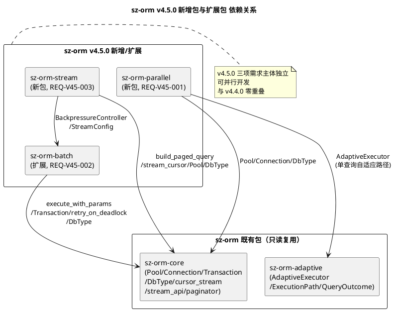
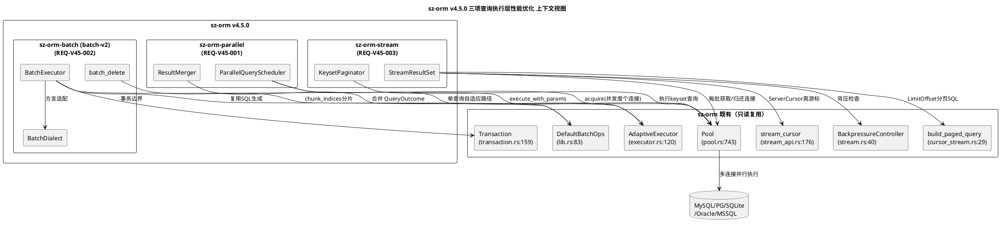
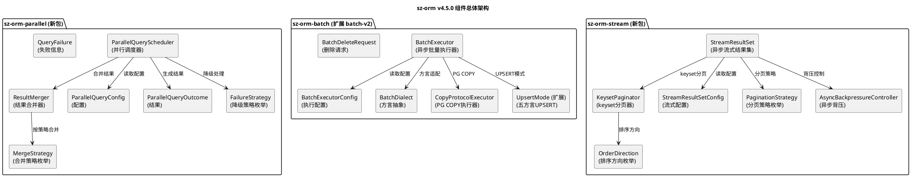
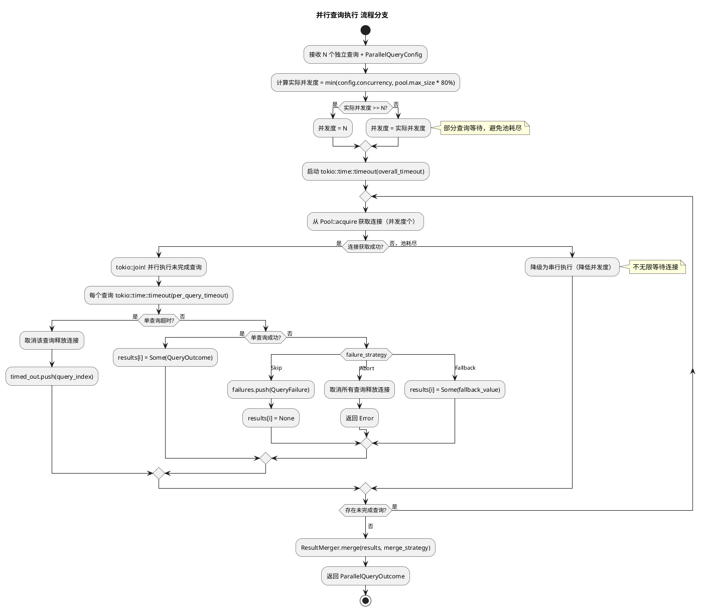
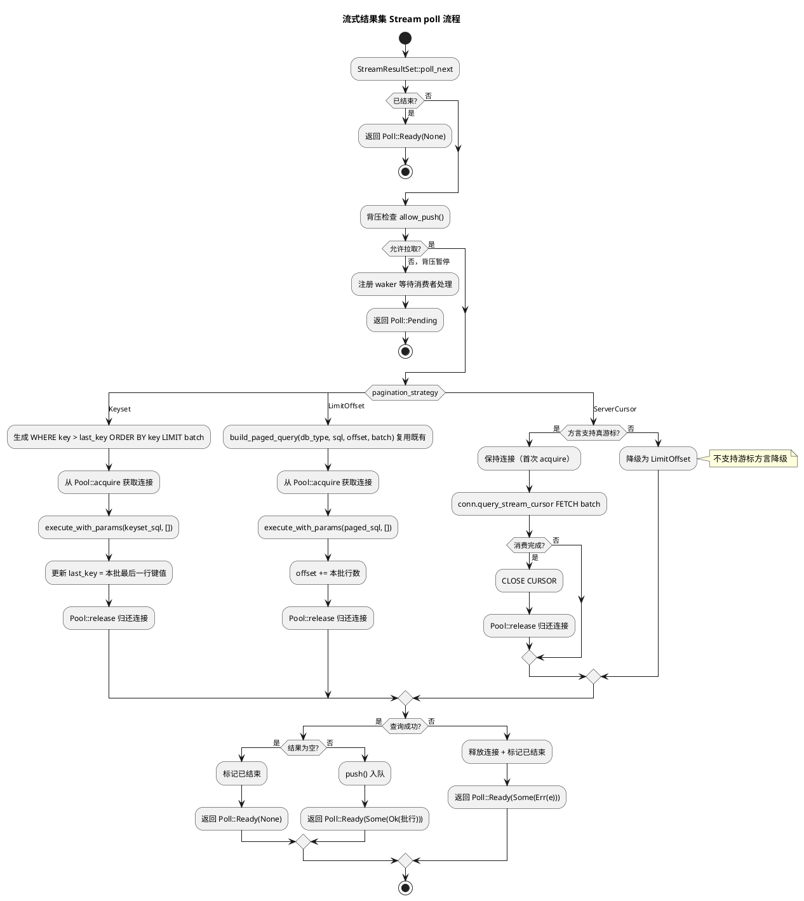
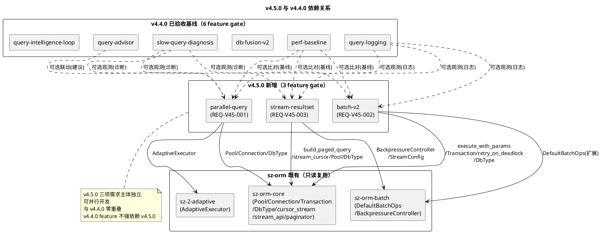

# sz-orm v4.5.0 技术设计文档

> 版本：v4.5.0（并行查询执行器 + 批量 INSERT/UPDATE/DELETE 优化 + 异步流式结果集）
> 基线：v4.4.0（查询自动优化建议 + 慢查询自动诊断报告 + db-fusion 转正 + 结构化查询日志 + 性能回归基准线 + 查询智能闭环联动，6 项需求 REQ-V44-001~006 全部通过 feature gate 隔离，已验收基线）
> 日期：2026-08-12
> 文档定位：技术设计（How to build），对应需求规格 `spec.md`（What to build，688 行）
> 设计约束：无 Breaking Change（3 个新 feature gate 隔离，默认全关闭）+ 优先复用既有能力 + 五方言覆盖 + 每项设计附 file:line 代码证据 + unsafe 零容忍 + 禁止占位实现（todo!/unimplemented!/unreachable!）+ 与 v4.4.0 零重叠 + 工作空间新增 2 包（sz-orm-parallel + sz-orm-stream）+ 扩展 1 包（sz-orm-batch batch-v2）
> 需求依赖：REQ-V45-001（并行查询）复用既有 `sz-orm-core` Pool/Connection + `sz-orm-adaptive` AdaptiveExecutor/ExecutionPath/QueryOutcome；REQ-V45-002（批量优化）复用既有 `sz-orm-batch` BatchOperations/DefaultBatchOps/BatchResult/RollbackStrategy/ProgressCallback/UpsertMode + `sz-orm-core` Connection::execute_with_params/Transaction/TransactionManager/retry_on_deadlock/DbType；REQ-V45-003（流式结果集）复用既有 `sz-orm-core` build_paged_query/stream_cursor_paged/stream_cursor/StreamApiExt/Paginator/Pool + `sz-orm-batch` BackpressureController/StreamConfig；三项需求主体相互独立，可并行开发
> 证据验证：本文档所有 file:line 证据均已通过源码读取验证（2026-08-12，40+ 项关键证据逐项实测），遵循 AGENTS.md 审计合规铁律

---

# 概述

## 设计目标

本设计文档将 sz-orm v4.5.0 三项查询执行层性能优化需求（REQ-V45-001 ~ REQ-V45-003）转化为可落地的技术方案，核心目标：

1. **并行查询执行器**：新增 `sz-orm-parallel` 包，`ParallelQueryScheduler` 基于既有连接池 `Pool`（`packages/sz-orm-core/src/pool.rs:743`）+ tokio 异步运行时，将多个独立查询并行执行降低复杂场景整体延迟，通过并发度控制（默认池 max_size 80%）避免连接池耗尽，与既有 `AdaptiveExecutor`（`packages/sz-orm-adaptive/src/executor.rs:120`）协同（单查询仍走自适应路径），`ResultMerger` 支持四种合并策略（First/Union/Join/Map），整体超时与单查询超时控制 + 单查询失败降级（Skip/Abort/Fallback）。
2. **批量 INSERT/UPDATE/DELETE 优化**：扩展既有 `sz-orm-batch` 包，新增 `batch_delete`（IN 子句批量删除）+ `BatchExecutor` 异步批量执行器（通过既有 `Connection::execute_with_params` `packages/sz-orm-core/src/pool.rs:82` 真正执行）+ 五方言批量 SQL 生成（扩展既有 `UpsertMode` `packages/sz-orm-batch/src/lib.rs:50` 至 SQLite/Oracle/MSSQL）+ 事务边界集成（复用既有 `Transaction` `packages/sz-orm-core/src/transaction.rs:159` + `RollbackStrategy` `packages/sz-orm-batch/src/lib.rs:491`）+ PostgreSQL COPY 协议（可选，仅 PG 启用，其他方言降级多值 INSERT）。
3. **异步流式结果集**：新增 `sz-orm-stream` 包，`StreamResultSet` 实现异步 Stream trait 逐批 yield 避免一次性加载全量，`KeysetPaginator` keyset pagination（`WHERE key > last_key ORDER BY key LIMIT batch`，深翻页高效），三种分页策略可选（Keyset/LimitOffset/ServerCursor，LimitOffset 复用既有 `build_paged_query` `packages/sz-orm-core/src/cursor_stream.rs:29`，ServerCursor 复用既有 `stream_cursor` `packages/sz-orm-core/src/stream_api.rs:176`），背压控制与异步 Stream 集成（复用既有 `BackpressureController` `packages/sz-orm-batch/src/stream.rs:40` 语义），连接池集成（每批从池获取连接，批次完成归还）。

## 设计约束

| 约束类别 | 约束内容 | 来源 |
|---------|---------|------|
| 兼容性 | 无 Breaking Change，3 个新 feature gate 隔离，默认全关闭，既有公开 API 完全向后兼容 | spec.md §1.4 / §4.5.1 |
| sz-pay 不破坏 | sz-pay 从 crates.io 拉取 sz-orm-* 6 个包既有用法不受影响 | spec.md §4.5.2 |
| 五方言覆盖 | MySQL/PostgreSQL/SQLite/Oracle/MSSQL 行为一致（并行查询/批量操作/流式结果集按方言能力适配，如 COPY 仅 PG） | spec.md §4.5.3 |
| 复用优先 | 优先复用既有能力，不重复实现（并行查询复用 Pool/Connection/AdaptiveExecutor；批量优化复用 BatchOperations/DefaultBatchOps/Connection::execute_with_params/Transaction/RollbackStrategy；流式结果集复用 build_paged_query/stream_cursor/BackpressureController/Pool） | spec.md §1.4 / §8.4 |
| unsafe 零容忍 | 无 `unsafe` 块，或必须有 `// SAFETY:` 注释 | spec.md §1.4.13 / §4.3 |
| 禁止占位实现 | 禁止 `todo!`/`unimplemented!`/`unreachable!` | AGENTS.md |
| 参数化查询 | 任何 WHERE 条件必须参数化，禁止 SQL 字符串拼接（复用既有 `DefaultBatchOps::quote` `packages/sz-orm-batch/src/lib.rs:177` + `Connection::execute_with_params` `packages/sz-orm-core/src/pool.rs:82`） | AGENTS.md / spec.md §4.3.1 |
| 测试基线不回退 | v4.4.0 已验收测试基线仅增不减 | spec.md §4.2.10 |
| 审计证据 | 每项结论附 file:line 证据，遵循审计合规铁律 | spec.md §4.3.5 / AGENTS.md |
| 与 v4.4.0 零重叠 | v4.4.0 是"分析/建议/转正"层，v4.5.0 是"执行优化"层，新增范围全部落在新包（sz-orm-parallel/sz-orm-stream）或 v4.4.0 不触碰的既有包扩展（sz-orm-batch batch-v2 扩展） | spec.md §1.4.10 / §10.1 |
| 并行查询不耗尽池 | 并行查询并发度受连接池 max_size 限制（默认 80%），连接获取失败降级串行 | spec.md §4.1.2 / §4.2.3 |
| 批量 DELETE 范围保护 | 批量 DELETE 须校验删除条件，禁止无条件全表删除 | spec.md §4.3.2 / §5.2.1.7 |
| 流式不一次性加载 | 流式结果集逐批 yield，内存占用不超过批次大小 × 单行大小 | spec.md §4.1.5 / §5.3.1.1 |

## feature gate 总览

| feature | 所属包 | 控制能力 | 默认 | 对应需求 |
|---------|--------|---------|------|---------|
| `parallel-query` | sz-orm-parallel（新包）+ sz-orm-core + sz-orm-adaptive（只读复用） | 并行查询执行器（调度器 + 合并器 + 超时降级） | 关闭 | REQ-V45-001 |
| `batch-v2` | sz-orm-batch（扩展）+ sz-orm-core（只读复用 Connection/Transaction/DbType） | 批量 INSERT/UPDATE/DELETE 优化（DELETE + 异步执行 + 五方言 + 事务 + COPY） | 关闭 | REQ-V45-002 |
| `stream-resultset` | sz-orm-stream（新包）+ sz-orm-core（只读复用 cursor_stream/stream_api/paginator/Pool）+ sz-orm-batch（只读复用 BackpressureController/StreamConfig） | 异步流式结果集（keyset + 背压 Stream + 内存控制 + 连接池集成） | 关闭 | REQ-V45-003 |

## 架构总览

### 新增包与扩展包

| 包名 | 类型 | 对应需求 | 依赖（只读复用） | 说明 |
|------|------|---------|----------------|------|
| `sz-orm-parallel` | 新包 | REQ-V45-001 | sz-orm-core（Pool/Connection）+ sz-orm-adaptive（AdaptiveExecutor/ExecutionPath/QueryOutcome）+ tokio | 并行查询执行器（调度器 + 合并器 + 超时降级） |
| `sz-orm-batch` | 扩展 | REQ-V45-002 | sz-orm-core（Connection::execute_with_params/Transaction/TransactionManager/retry_on_deadlock/DbType） | 批量 DELETE + 异步批量执行器 + 五方言批量 SQL + 事务边界 + PostgreSQL COPY 协议（`batch-v2` feature） |
| `sz-orm-stream` | 新包 | REQ-V45-003 | sz-orm-core（build_paged_query/stream_cursor_paged/stream_cursor/StreamApiExt/Paginator/Pool/DbType）+ sz-orm-batch（BackpressureController/StreamConfig） | 异步流式结果集（keyset + 背压 Stream + 内存控制） |

### 依赖关系图



---

# 一、需求与存量功能关系分析

## 1.1 需求功能与存量功能对比

### 1.1.1 已实现功能（可直接复用）

| 需求功能 | 存量功能 | 代码位置 | 匹配度 |
|---------|---------|---------|--------|
| REQ-V45-001 连接池 | `Pool`（自研连接池，AtomicU32 + crossbeam-queue ArrayQueue + Notify，无锁 MPMC） | `packages/sz-orm-core/src/pool.rs:743` | 100% |
| REQ-V45-001 连接 trait | `Connection` trait（execute/query/begin_transaction/commit/rollback/execute_with_params，异步 trait） | `packages/sz-orm-core/src/pool.rs:45` | 100% |
| REQ-V45-001/002 参数绑定执行 | `Connection::execute_with_params`（参数绑定执行，防 SQL 注入） | `packages/sz-orm-core/src/pool.rs:82` | 100% |
| REQ-V45-001 池化连接 | `PooledConnection`（Drop 自动归还连接池） | `packages/sz-orm-core/src/pool.rs:239` | 100% |
| REQ-V45-001 自适应执行器 | `AdaptiveExecutor`（按 query_key 独立统计，线程安全） | `packages/sz-orm-adaptive/src/executor.rs:120` | 100% |
| REQ-V45-001 执行路径枚举 | `ExecutionPath`（Normal/Paginated/Cached） | `packages/sz-orm-adaptive/src/executor.rs:16` | 100% |
| REQ-V45-001 查询结果 | `QueryOutcome`（value/rows/elapsed_ms/from_cache/slow） | `packages/sz-orm-adaptive/src/executor.rs:106` | 100% |
| REQ-V45-001 慢查询标记 | `QueryOutcome.slow`（是否慢查询，超过 slow_ms） | `packages/sz-orm-adaptive/src/executor.rs:116` | 100% |
| REQ-V45-001 慢查询阈值 | `AdaptiveConfig.slow_ms`（慢查询阈值，默认 100ms） | `packages/sz-orm-adaptive/src/executor.rs:35` | 100% |
| REQ-V45-001 自适应决策 | `AdaptiveExecutor::decide`（按统计选择执行路径 Cached/Paginated/Direct） | `packages/sz-orm-adaptive/src/executor.rs:157` | 100% |
| REQ-V45-001 运行时统计 | `QueryStats`（total_executions/total_rows/total_time_us，AtomicU64 无锁） | `packages/sz-orm-adaptive/src/stats.rs:11` | 100% |
| REQ-V45-001 大结果集判断 | `QueryStats::should_paginate`（平均行数超阈值 → 建议游标分页） | `packages/sz-orm-adaptive/src/stats.rs:66` | 100% |
| REQ-V45-001 热点查询判断 | `QueryStats::should_cache`（平均耗时超阈值且执行次数达下限 → 建议缓存） | `packages/sz-orm-adaptive/src/stats.rs:73` | 100% |
| REQ-V45-002 批量操作 trait | `BatchOperations` trait（batch_insert/batch_update/batch_upsert，同步返回 BatchResult） | `packages/sz-orm-batch/src/lib.rs:43` | 100% |
| REQ-V45-002 默认批量实现 | `DefaultBatchOps`（多值 INSERT + CASE WHEN UPDATE + ON DUPLICATE/ON CONFLICT UPSERT） | `packages/sz-orm-batch/src/lib.rs:83` | 100% |
| REQ-V45-002 主键列名 | `DefaultBatchOps.primary_key`（主键列名，默认 "id"） | `packages/sz-orm-batch/src/lib.rs:84` | 100% |
| REQ-V45-002 分片大小 | `DefaultBatchOps.chunk_size`（分片大小，默认 1000） | `packages/sz-orm-batch/src/lib.rs:93` | 100% |
| REQ-V45-002 默认分片大小常量 | `DEFAULT_CHUNK_SIZE`（1000） | `packages/sz-orm-batch/src/lib.rs:119` | 100% |
| REQ-V45-002 配置链 | `DefaultBatchOps::new` / `with_primary_key` / `with_upsert_mode` / `with_chunk_size` | `packages/sz-orm-batch/src/lib.rs:134` | 100% |
| REQ-V45-002 分片迭代 | `DefaultBatchOps::chunk_indices`（按 chunk_size 分片返回 (start, end) 索引迭代器） | `packages/sz-orm-batch/src/lib.rs:164` | 100% |
| REQ-V45-002 标识符转义 | `DefaultBatchOps::quote`（反引号包裹 + 内部反引号转义为双反引号，防 SQL 注入） | `packages/sz-orm-batch/src/lib.rs:177` | 100% |
| REQ-V45-002 批量结果 | `BatchResult`（inserted/updated/failed/generated_sqls） | `packages/sz-orm-batch/src/lib.rs:19` | 100% |
| REQ-V45-002 UPSERT 模式 | `UpsertMode`（MysqlOnDuplicate/PostgresOnConflict，**仅两方言**） | `packages/sz-orm-batch/src/lib.rs:50` | 50% |
| REQ-V45-002 批量进度 | `BatchProgress`（chunk_index/total_chunks/chunk_rows/processed_rows/total_rows/stage） | `packages/sz-orm-batch/src/lib.rs:451` | 100% |
| REQ-V45-002 进度回调 | `ProgressCallback`（`Arc<dyn Fn(BatchProgress) + Send + Sync>`） | `packages/sz-orm-batch/src/lib.rs:482` | 100% |
| REQ-V45-002 回滚策略 | `RollbackStrategy`（None/Savepoint/PerChunk） | `packages/sz-orm-batch/src/lib.rs:491` | 100% |
| REQ-V45-002 UPSERT 冲突目标 | `ConflictTarget`（Columns/Constraint） | `packages/sz-orm-batch/src/lib.rs:503` | 100% |
| REQ-V45-002 事务 | `Transaction`（conn + state + options + savepoint_counter + deadline） | `packages/sz-orm-core/src/transaction.rs:159` | 100% |
| REQ-V45-002 事务管理器 | `TransactionManager`（按名称管理多个事务） | `packages/sz-orm-core/src/transaction.rs:527` | 100% |
| REQ-V45-002 死锁重试 | `retry_on_deadlock`（死锁检测 + 指数退避重试） | `packages/sz-orm-core/src/transaction.rs:466` | 100% |
| REQ-V45-002 隔离级别 | `IsolationLevel`（ReadUncommitted/ReadCommitted/RepeatableRead/Serializable/Snapshot） | `packages/sz-orm-core/src/transaction.rs:16` | 100% |
| REQ-V45-002/003 数据库方言 | `DbType`（MySQL/PostgreSQL/Sqlite/Oracle/SqlServer 等，`#[non_exhaustive]`） | `packages/sz-orm-core/src/db_type.rs:11` | 100% |
| REQ-V45-003 分页 SQL 包装 | `build_paged_query`（五方言分页：Oracle ROWNUM/SQL Server OFFSET-FETCH/MySQL-PG-SQLite LIMIT-OFFSET） | `packages/sz-orm-core/src/cursor_stream.rs:29` | 100% |
| REQ-V45-003 分页游标 Stream | `stream_cursor_paged`（基于分页游标的流式查询，返回 `Pin<Box<dyn Stream>>`，借用 conn） | `packages/sz-orm-core/src/cursor_stream.rs:79` | 100% |
| REQ-V45-003 真游标 Stream | `stream_cursor`（真游标逐行 fetch，委托 `conn.query_stream_cursor`） | `packages/sz-orm-core/src/stream_api.rs:176` | 100% |
| REQ-V45-003 流式 API 扩展 | `StreamApiExt` trait（stream_buffered + stream_with_backpressure） | `packages/sz-orm-core/src/stream_api.rs:50` | 100% |
| REQ-V45-003 分页器 | `Paginator`（fetch_page，LIMIT-OFFSET 分页） | `packages/sz-orm-core/src/paginator.rs:158` | 100% |
| REQ-V45-003 流式配置 | `StreamConfig`（batch_size/max_concurrency/backpressure_threshold） | `packages/sz-orm-batch/src/stream.rs:9` | 100% |
| REQ-V45-003 批次大小 | `StreamConfig.batch_size`（每批记录数，默认 1000） | `packages/sz-orm-batch/src/stream.rs:11` | 100% |
| REQ-V45-003 背压阈值 | `StreamConfig.backpressure_threshold`（队列最大积压量，默认 10000） | `packages/sz-orm-batch/src/stream.rs:13` | 100% |
| REQ-V45-003 背压控制器 | `BackpressureController`（allow_push/push/pop/pending，同步结构） | `packages/sz-orm-batch/src/stream.rs:40` | 100% |
| REQ-V45-003 批次分割器 | `BatchSplitter`（同步 VecDeque，next_batch） | `packages/sz-orm-batch/src/stream.rs:85` | 100% |
| REQ-V45-003 流式批次 | `StreamBatch`（batch_index/records/is_last） | `packages/sz-orm-batch/src/stream.rs:30` | 100% |

### 1.1.2 需要扩展的功能

| 需求功能 | 存量功能 | 差异说明 | 扩展方向 |
|---------|---------|---------|---------|
| REQ-V45-001 并行查询调度器 | 既有 `Pool`（`:743`）连接池 + `AdaptiveExecutor`（`executor.rs:120`）单查询自适应，无并行调度器（多独立查询并行执行时无并发度控制，可能耗尽连接池） | 既有"单查询串行执行"缺"多查询并行调度"；输入输出差异：既有单查询输入 1 个 SQL 返回 1 个结果，需扩展输入 N 个独立查询返回合并结果；并发度控制差异：既有无并发度上限，需扩展并发度受连接池 max_size 限制 | 新增 `sz-orm-parallel` 包，`ParallelQueryScheduler` 复用既有 `Pool::acquire` 获取连接 + tokio::join 并行执行，并发度控制（默认池 max_size 80%），不新建连接池，不修改既有自适应逻辑 |
| REQ-V45-001 查询结果合并器 | 既有 `QueryOutcome`（`executor.rs:106`）单查询结果，无多查询结果合并器 | 既有"单查询结果"缺"多查询结果合并"；合并策略差异：既有无合并策略，需扩展 First/Union/Join/Map 四种合并策略 | 新增 `ResultMerger` + `MergeStrategy` 枚举，将多个 `QueryOutcome` 按策略合并，不修改既有 `QueryOutcome` |
| REQ-V45-001 并行查询超时与降级 | 既有 `AdaptiveConfig.slow_ms`（`executor.rs:35`）慢查询阈值，无并行查询整体超时与单查询超时控制，无单查询失败降级策略 | 既有"慢查询标记"缺"超时取消 + 失败降级"；超时差异：既有仅标记不取消，需扩展超时取消未完成查询释放连接；降级差异：既有无降级策略，需扩展 Skip/Abort/Fallback | 新增 `ParallelQueryConfig`（overall_timeout_ms/per_query_timeout_ms/failure_strategy）+ 超时取消逻辑（tokio::time::timeout）+ 降级策略处理，不修改既有 slow_ms |
| REQ-V45-002 批量 DELETE | 既有 `BatchOperations` trait（`lib.rs:43`）有 batch_insert/batch_update/batch_upsert，**无 batch_delete** | 既有"批量 INSERT/UPDATE/UPSERT"缺"批量 DELETE"；SQL 差异：既有生成多值 INSERT/CASE WHEN UPDATE，需扩展生成 `WHERE pk IN (?, ?, ...)` 批量 DELETE | 扩展 `BatchOperations` trait 新增 `batch_delete` 方法（独立方法不破坏既有 trait）+ `DefaultBatchOps` 实现，复用既有 `chunk_indices`（`:164`）分片 + `quote`（`:177`）转义，参数化绑定 |
| REQ-V45-002 异步批量执行器 | 既有 `BatchOperations` trait（`lib.rs:43`）方法**同步**返回 `BatchResult` 仅生成 SQL 不真正执行 | 既有"同步生成 SQL"缺"异步真正执行"；执行差异：既有返回 generated_sqls 供调用方执行，需扩展通过 `Connection::execute_with_params`（`pool.rs:82`）真正执行 | 新增 `BatchExecutor` 异步执行器，复用既有 `DefaultBatchOps` SQL 生成 + `Connection::execute_with_params` 执行 + `BatchResult` 返回，不修改既有同步 trait |
| REQ-V45-002 五方言批量 SQL | 既有 `UpsertMode`（`lib.rs:50`）仅 MySQL/PostgreSQL 两方言（MysqlOnDuplicate/PostgresOnConflict），缺 SQLite/Oracle/MSSQL | 既有"两方言 UPSERT"缺"五方言 UPSERT"；语法差异：SQLite `ON CONFLICT DO UPDATE`/Oracle `MERGE`/MSSQL `MERGE`，需扩展方言适配 | 扩展 `UpsertMode` 枚举新增 `SqliteOnConflict`/`OracleMerge`/`MssqlMerge` 变体 + `BatchDialect` 方言抽象，复用既有 `DbType`（`db_type.rs:11`），按方言适配批量 SQL 语法 |
| REQ-V45-002 事务边界集成 | 既有 `RollbackStrategy`（`lib.rs:491`）定义回滚策略，但既有 `BatchOperations` trait 同步生成 SQL 不涉及事务执行 | 既有"回滚策略定义"缺"事务执行集成"；执行差异：既有仅定义策略不执行，需扩展异步执行器在事务边界内执行 + 部分失败回滚 | 扩展 `BatchExecutor` 支持事务边界（复用既有 `Transaction` `transaction.rs:159` + `TransactionManager` `:527` + `retry_on_deadlock` `:466`），按 `RollbackStrategy` 处理部分失败 |
| REQ-V45-003 keyset pagination | 既有 `build_paged_query`（`cursor_stream.rs:29`）使用 LIMIT-OFFSET 分页，**无 keyset pagination** | 既有"LIMIT-OFFSET 分页"缺"keyset 分页"；性能差异：既有 OFFSET N 需扫描 N 行深翻页性能退化，需扩展 `WHERE key > last_key ORDER BY key LIMIT batch` 索引扫描 | 新增 `KeysetPaginator`（key_column + last_key + batch_size + order_direction），生成 keyset 分页 SQL，不修改既有 `build_paged_query` |
| REQ-V45-003 异步 Stream 结果集 | 既有 `stream_cursor_paged`（`cursor_stream.rs:79`）已实现异步 Stream 但借用 conn 未与连接池集成，`BackpressureController`（`stream.rs:40`）为同步结构未与异步 Stream 集成 | 既有"借用 conn 的 Stream"缺"连接池集成"；连接差异：既有借用 conn 不从池获取，需扩展每批从池获取连接批次完成归还；背压差异：既有同步背压未与异步 Stream 集成 | 新增 `StreamResultSet` 实现异步 Stream trait，复用既有 `stream_cursor_paged`/`stream_cursor` 语义 + `BackpressureController` 背压语义 + `Pool` 连接池集成，不修改既有流式游标 |
| REQ-V45-003 分页策略可选 | 既有 `build_paged_query`（LIMIT-OFFSET）+ `stream_cursor`（真游标），无统一分页策略抽象 | 既有"两种分页独立"缺"统一策略可选"；策略差异：既有无策略枚举，需扩展 Keyset/LimitOffset/ServerCursor 三种策略可选 | 新增 `PaginationStrategy` 枚举 + `StreamResultSetConfig` 统一配置，按策略选择 keyset/limit-offset/真游标，复用既有 `build_paged_query`/`stream_cursor` |

### 1.1.3 需要新增的功能或接口

#### REQ-V45-001 并行查询执行器（新增 sz-orm-parallel 包）

| 功能点 | 输入 | 输出 | 核心逻辑 | 依赖 |
|--------|------|------|---------|------|
| `ParallelQueryScheduler` | N 个独立查询 + `ParallelQueryConfig` | `ParallelQueryOutcome` | 从既有 `Pool` 获取并发度个连接，tokio::join 并行执行，单查询走 `AdaptiveExecutor` 自适应路径 | `Pool` `pool.rs:743` + `AdaptiveExecutor` `executor.rs:120` + tokio |
| `ResultMerger` | N 个 `QueryOutcome` + `MergeStrategy` | 合并后结果 | 按策略合并：First 取首个完成 / Union 并集 / Join 按键关联 / Map 映射转换 | `QueryOutcome` `executor.rs:106` |
| `ParallelQueryConfig` | concurrency/overall_timeout_ms/per_query_timeout_ms/failure_strategy/merge_strategy | 配置实例 | 并发度默认池 max_size 80%，整体超时 30s，单查询超时 10s，降级 Skip，合并 First | `Pool` max_size |
| `ParallelQueryOutcome` | results/failures/timed_out/total_elapsed_ms/merged_result | 执行结果 | 各查询结果（失败为 None）+ 失败信息 + 超时索引 + 整体耗时 + 合并结果 | `QueryOutcome` `executor.rs:106` |
| `MergeStrategy` 枚举 | First/Union/Join/Map | 合并策略 | First 取首个完成 / Union 并集 / Join 按 join_key 关联 / Map 按 transform 转换 | — |
| `FailureStrategy` 枚举 | Skip/Abort/Fallback | 降级策略 | Skip 跳过失败查询 / Abort 全部中止 / Fallback 返回降级值 | — |

#### REQ-V45-002 批量 INSERT/UPDATE/DELETE 优化（扩展 sz-orm-batch 包）

| 功能点 | 输入 | 输出 | 核心逻辑 | 依赖 |
|--------|------|------|---------|------|
| `batch_delete` | table + primary_key + ids + chunk_size | `BatchResult` | 按 chunk_size 分片生成 `WHERE pk IN (?, ?, ...)` 批量 DELETE，参数化绑定 | `DefaultBatchOps::chunk_indices` `lib.rs:164` + `quote` `:177` |
| `BatchExecutor` | conn + table + rows + `BatchExecutorConfig` | `BatchResult`（异步） | 复用 `DefaultBatchOps` 生成 SQL + `Connection::execute_with_params` 执行 + 进度回调触发 | `DefaultBatchOps` `lib.rs:83` + `execute_with_params` `pool.rs:82` + `ProgressCallback` `lib.rs:482` |
| `BatchDialect` 方言抽象 | `DbType` + 批量操作类型 | 方言特定 SQL | 按 `DbType` 适配批量 INSERT/UPDATE/DELETE/UPSERT SQL 语法（SQLite ON CONFLICT/Oracle MERGE/MSSQL MERGE） | `DbType` `db_type.rs:11` + `UpsertMode` `lib.rs:50` |
| PostgreSQL COPY 协议 | conn + table + rows | `BatchResult` | `COPY table FROM STDIN` 原生批量导入（仅 PG），其他方言降级多值 INSERT | `Connection` `pool.rs:45`（PG COPY 协议扩展） |
| 事务边界执行 | conn/tx + 批量操作 + `RollbackStrategy` | `BatchResult` | 在事务边界内执行分片，部分失败按 `RollbackStrategy` 回滚（None/Savepoint/PerChunk） | `Transaction` `transaction.rs:159` + `RollbackStrategy` `lib.rs:491` + `retry_on_deadlock` `:466` |
| `BatchExecutorConfig` | chunk_size/rollback_strategy/progress_callback/use_copy_protocol/transaction | 配置实例 | chunk_size 默认 1000，rollback_strategy 默认 None，use_copy_protocol 默认 false | `DEFAULT_CHUNK_SIZE` `lib.rs:119` + `RollbackStrategy` `:491` + `ProgressCallback` `:482` + `Transaction` `transaction.rs:159` |
| `BatchDeleteRequest` | table/primary_key/ids | 删除请求 | table 表名 + primary_key 主键列名 + ids 待删除主键值列表（非空防误删） | `DefaultBatchOps.primary_key` `lib.rs:84` |

#### REQ-V45-003 异步流式结果集（新增 sz-orm-stream 包）

| 功能点 | 输入 | 输出 | 核心逻辑 | 依赖 |
|--------|------|------|---------|------|
| `StreamResultSet` | sql + `StreamResultSetConfig` + `Pool` | 异步 Stream（逐批 yield） | 实现异步 Stream trait，每批从池获取连接执行查询，背压检查，批次完成归还连接 | `Pool` `pool.rs:743` + `BackpressureController` `stream.rs:40` + `build_paged_query` `cursor_stream.rs:29`/`stream_cursor` `stream_api.rs:176` |
| `KeysetPaginator` | key_column/last_key/batch_size/order_direction | keyset 分页 SQL | 生成 `WHERE key > last_key ORDER BY key LIMIT batch`，避免 OFFSET 深翻页 | — |
| `PaginationStrategy` 枚举 | Keyset/LimitOffset/ServerCursor | 分页策略 | Keyset keyset 分页 / LimitOffset 复用 `build_paged_query` / ServerCursor 复用 `stream_cursor` | `build_paged_query` `cursor_stream.rs:29` + `stream_cursor` `stream_api.rs:176` |
| `StreamResultSetConfig` | batch_size/backpressure_threshold/pagination_strategy/keyset_column/db_type | 配置实例 | batch_size 默认 1000，backpressure_threshold 默认 10000，pagination_strategy 默认 LimitOffset | `StreamConfig.batch_size` `stream.rs:11` + `StreamConfig.backpressure_threshold` `:13` + `DbType` `db_type.rs:11` |
| 背压控制异步集成 | `BackpressureController` + 异步 Stream | 背压 Stream | 消费者慢于生产者时暂停生产者拉取，避免内存积压 | `BackpressureController` `stream.rs:40` |
| 连接池集成 | `Pool` + 分页查询 | 每批连接获取/归还 | 分页模式每批从池获取连接批次完成归还，真游标模式保持连接至消费完成 | `Pool` `pool.rs:743` |
| 游标资源释放 | Stream drop / 消费完成 | 资源释放 | 真游标模式关闭服务端游标 + 归还连接，分页模式无游标资源，Drop 语义 | `PooledConnection` `pool.rs:239` |

## 1.2 存量功能详细分析

### 1.2.1 连接池 Pool（REQ-V45-001/003 复用）

**接口契约**：
- `Pool::acquire() -> Result<PooledConnection, DbError>`：从池获取连接（无锁 ArrayQueue + Notify 等待）
- `Pool::release(conn)`：归还连接（Drop 自动归还）
- `Pool::resize(new_size)`：动态调整 max_size
- `PoolConfig.max_size`：连接数上限

**业务规则**：
- 无锁 MPMC 队列（`ArrayQueue` `pool.rs:751`）消除锁竞争
- `total_count`（`AtomicU32` `pool.rs:761`）限制池中总连接数不超过 max_size
- `PooledConnection`（`:239`）Drop 时自动归还连接池

**约束**：
- 并行查询并发度不得超过 max_size（避免池耗尽），默认 max_size 80%
- 流式结果集每批获取连接不得长期占用（分页模式），真游标模式保持连接至消费完成

### 1.2.2 Connection trait（REQ-V45-001/002/003 复用）

**接口契约**：
- `execute(sql) -> Result<u64, DbError>`：执行 INSERT/UPDATE/DELETE 返回影响行数
- `query(sql) -> Result<QueryRows, DbError>`：执行 SELECT 返回结果行集
- `execute_with_params(sql, params) -> Result<u64, DbError>`（`:82`）：参数绑定执行，防 SQL 注入
- `query_with_params(sql, params) -> Result<QueryRows, DbError>`：参数绑定查询
- `begin_transaction/commit/rollback`：事务控制
- `query_stream_cursor(sql, batch_size)`：真游标流式查询（`stream_cursor` `stream_api.rs:176` 委托）

**业务规则**：
- 异步 trait（手动解糖 async，不使用 `#[async_trait]`，避免 HRTB 与 sqlx::Executor 冲突 `pool.rs:41-44`）
- `execute_with_params` 默认实现返回 `NotImplemented`（`:80-81`），支持参数绑定的适配器应覆盖

**约束**：
- 批量操作必须通过 `execute_with_params` 参数化绑定，禁止 SQL 字符串拼接
- 并行查询各查询参数独立绑定，不交叉污染

### 1.2.3 AdaptiveExecutor（REQ-V45-001 复用）

**接口契约**：
- `decide(query_key) -> ExecutionPath`（`:157`）：按统计选择执行路径（Cached/Paginated/Normal）
- `record(query_key, rows, elapsed_ms) -> bool`（`:172`）：记录执行结果，返回是否慢查询
- `stats_for(query_key) -> Arc<QueryStats>`（`:148`）：获取（或创建）统计

**业务规则**：
- 按 query_key 独立统计（`Mutex<HashMap<String, Arc<QueryStats>>>` `executor.rs:121`）
- 决策顺序：cache_enabled && should_cache → Cached；should_paginate → Paginated；否则 Normal
- `QueryOutcome`（`:106`）含 value/rows/elapsed_ms/from_cache/slow

**约束**：
- 并行查询中每个单查询仍可走自适应路径，并行调度器不修改既有自适应决策逻辑
- 并行调度器不干预单查询的 `ExecutionPath` 选择

### 1.2.4 DefaultBatchOps（REQ-V45-002 复用）

**接口契约**：
- `batch_insert(table, rows) -> BatchResult`：多值 INSERT（`INSERT INTO t (cols) VALUES (...), (...), ...`）
- `batch_update(table, rows) -> BatchResult`：CASE WHEN UPDATE（`UPDATE t SET col = CASE pk WHEN ... THEN ... END WHERE pk IN (...)`）
- `batch_upsert(table, rows) -> BatchResult`：ON DUPLICATE/ON CONFLICT UPSERT
- `chunk_indices(total) -> Iterator<(start, end)>`（`:164`）：按 chunk_size 分片
- `quote(name) -> String`（`:177`）：反引号包裹 + 转义

**业务规则**：
- 分片：当 `rows.len() > chunk_size` 时按 chunk_size 分片，每片生成独立 SQL（避免参数占位符上限 65535）
- 转义：MySQL 反引号转义规则 `` ` `` → `` `` ``（双反引号），防 SQL 注入
- `BatchResult`（`:19`）含 inserted/updated/failed/generated_sqls（供审计）

**约束**：
- 既有 `BatchOperations` trait（`:43`）方法**同步**返回 `BatchResult` 仅生成 SQL 不执行
- 既有 `UpsertMode`（`:50`）仅 MySQL/PostgreSQL 两方言
- 异步批量执行器为独立 API，不修改既有同步 trait

### 1.2.5 BackpressureController（REQ-V45-003 复用）

**接口契约**：
- `new(threshold) -> Self`（`:49`）：创建背压控制器
- `allow_push() -> bool`（`:57`）：检查是否允许入队（current < threshold）
- `push() -> bool`（`:62`）：入队（允许则 current += 1 返回 true，否则返回 false）
- `pop()`（`:72`）：出队（current -= 1）
- `pending() -> usize`（`:79`）：当前积压量

**业务规则**：
- 同步结构（`threshold` + `current` `stream.rs:41-44`），无锁
- 队列长度检查 + 暂停/恢复判定

**约束**：
- 既有 `BackpressureController` 为同步结构，未与异步 Stream 集成
- 异步流式结果集复用既有背压语义，扩展为异步 Stream 集成（生产者拉取前检查 allow_push，false 时暂停拉取）
- 背压控制检查开销不超过 1μs/次

### 1.2.6 build_paged_query / stream_cursor（REQ-V45-003 复用）

**接口契约**：
- `build_paged_query(db_type, sql, offset, batch) -> Result<String, DbError>`（`cursor_stream.rs:29`）：五方言分页 SQL 包装
- `stream_cursor_paged(conn, sql, db_type, batch) -> Pin<Box<dyn Stream>>`（`:79`）：分页游标 Stream（借用 conn）
- `stream_cursor(conn, sql, params, batch_size) -> Pin<Box<dyn Stream>>`（`stream_api.rs:176`）：真游标 Stream（委托 `conn.query_stream_cursor`）

**业务规则**：
- 五方言分页：Oracle ROWNUM 子查询 / SQL Server OFFSET-FETCH / MySQL-PG-SQLite LIMIT-OFFSET
- `stream_cursor_paged` 按 batch 行一页循环拉取逐行 yield，某页空行即结束
- `stream_cursor` 真游标逐行 fetch，drop 时关闭 DB 游标归还连接

**约束**：
- 既有 `stream_cursor_paged` 借用 conn 未与连接池集成
- keyset pagination 为新增能力，不修改既有 `build_paged_query`
- 真游标模式需数据库支持，不支持方言降级为 LimitOffset

---

# 二、增量设计方案

## 2.1 实现模型

### 2.1.1 上下文视图



**上下文说明**：
- **上游调用方**：应用开发者调用 `ParallelQueryScheduler::parallel` / `BatchExecutor::execute_batch_*` / `StreamResultSet::stream_query`
- **下游依赖方**：MySQL/PostgreSQL/SQLite/Oracle/MSSQL 五方言数据库（通过既有 `Pool` + `Connection` trait）
- **中间件**：tokio 异步运行时（workspace 依赖 `tokio = { version = "1.40", features = ["full"] }`）、crossbeam-queue 无锁队列（既有 `Pool` 内部）
- **跨进程通信**：无（本版本并行查询仅限单节点多连接并行，不含跨节点分布式查询执行）

### 2.1.2 服务/组件总体架构



**模块划分与职责**：
- **sz-orm-parallel**：`scheduler.rs`（ParallelQueryScheduler 并行调度）+ `merger.rs`（ResultMerger 结果合并）+ `config.rs`（配置与枚举）+ `outcome.rs`（执行结果）
- **sz-orm-batch（扩展）**：`executor.rs`（BatchExecutor 异步执行器）+ `dialect.rs`（BatchDialect 方言抽象）+ `delete.rs`（batch_delete）+ `copy.rs`（PG COPY 协议）+ 既有 `lib.rs`（扩展 UpsertMode）
- **sz-orm-stream**：`result_set.rs`（StreamResultSet 异步流式）+ `keyset.rs`（KeysetPaginator keyset 分页）+ `config.rs`（配置与枚举）+ `backpressure.rs`（AsyncBackpressureController 异步背压）

**配置项及取值策略**：
- `ParallelQueryConfig.concurrency`：默认池 max_size 80%，不超过 max_size
- `ParallelQueryConfig.overall_timeout_ms`：默认 30000（30 秒），0 不超时
- `ParallelQueryConfig.per_query_timeout_ms`：默认 10000（10 秒），0 不超时
- `BatchExecutorConfig.chunk_size`：默认 1000（复用 `DEFAULT_CHUNK_SIZE` `lib.rs:119`）
- `BatchExecutorConfig.use_copy_protocol`：默认 false（仅 PG 启用）
- `StreamResultSetConfig.batch_size`：默认 1000（复用 `StreamConfig.batch_size` `stream.rs:11`）
- `StreamResultSetConfig.backpressure_threshold`：默认 10000（复用 `StreamConfig.backpressure_threshold` `stream.rs:13`）

### 2.1.3 实现设计文档

#### 2.1.3.1 并行查询执行流程（REQ-V45-001）



**流程分支说明**：
- **并发度控制**：并发度 = min(config.concurrency, pool.max_size * 80%)，避免耗尽连接池
- **连接池耗尽降级**：连接获取失败时降级为串行执行（降低并发度到可用连接数），不无限等待
- **单查询超时**：`tokio::time::timeout` 包裹单查询，超时取消释放连接
- **单查询失败降级**：按 `FailureStrategy` 处理（Skip 跳过 / Abort 全部中止 / Fallback 返回降级值）
- **结果合并**：全部查询完成后按 `MergeStrategy` 合并结果

#### 2.1.3.2 批量操作执行流程（REQ-V45-002）

```plantuml
@startuml
title 批量操作执行 流程分支（含事务边界）

start
:接收 conn/tx + table + rows + BatchExecutorConfig;

if (rows 为空?) then (是)
  :返回空 BatchResult;
  stop
else (否)
endif

:DefaultBatchOps 生成 SQL（复用 chunk_indices 分片）;
:chunks = chunk_indices(rows.len());

if (config.transaction 为 Some?) then (有事务)
  :begin_transaction;
  if (rollback_strategy == Savepoint?) then (是)
    repeat :每个分片;
      :SAVEPOINT sp_N;
      :execute_with_params(sql, params);
      if (分片成功?) then (是)
        :inserted/updated += 影响行数;
        :ProgressCallback(ChunkCompleted);
      else (否)
        :ROLLBACK TO SAVEPOINT sp_N;
        :failed += 分片行数;
      endif
    repeat while (有下一分片?) is (是)
    -> 否;
  else (rollback_strategy == PerChunk?)
    repeat :每个分片;
      :execute_with_params(sql, params);
      if (分片成功?) then (是)
        :inserted/updated += 影响行数;
      else (否)
        :failed += 分片行数;
        :中止后续分片;
        note right: PerChunk 任一失败整批中止
      endif
    repeat while (有下一分片 且 未中止?) is (是)
    -> 否;
  else (None)
    repeat :每个分片;
      :execute_with_params(sql, params);
      if (分片成功?) then (是)
        :inserted/updated += 影响行数;
      else (否)
        :failed += 分片行数;
        note right: None 失败分片不影响已成功
      endif
    repeat while (有下一分片?) is (是)
    -> 否;
  endif
  :commit;
else (无事务)
  repeat :每个分片;
    :execute_with_params(sql, params);
    if (分片成功?) then (是)
      :inserted/updated += 影响行数;
    else (否)
      :failed += 分片行数;
    endif
  repeat while (有下一分片?) is (是)
  -> 否;
endif

if (DbType == PostgreSQL 且 use_copy_protocol?) then (是)
  :使用 COPY table FROM STDIN;
  if (COPY 成功?) then (是)
    :返回 BatchResult;
  else (否)
    :降级为多值 INSERT 重试;
    note right: COPY 失败降级
  endif
else (否)
  :多值 INSERT/CASE WHEN/IN 删除;
endif

:返回 BatchResult { inserted, updated, failed, generated_sqls };

stop

@enduml
```

**流程分支说明**：
- **分片**：复用既有 `chunk_indices`（`lib.rs:164`）按 chunk_size 分片
- **事务边界**：有事务时按 `RollbackStrategy` 处理部分失败（None/Savepoint/PerChunk）
- **PostgreSQL COPY**：仅 PG + use_copy_protocol 启用，COPY 失败降级多值 INSERT
- **进度回调**：每分片执行前后触发 `ProgressCallback`（Started → ProcessingChunk → ChunkCompleted → Finished）

#### 2.1.3.3 流式结果集执行流程（REQ-V45-003）



**流程分支说明**：
- **背压控制**：每次拉取前检查 `allow_push()`，false 时暂停生产者（返回 Pending 等待消费者处理）
- **分页策略**：Keyset 用 `WHERE key > last_key` / LimitOffset 复用 `build_paged_query` / ServerCursor 复用 `stream_cursor`
- **连接池集成**：分页模式每批 acquire + release，真游标模式保持连接至消费完成
- **游标资源释放**：消费完成或提前 drop 时关闭游标 + 归还连接（Drop 语义）

## 2.2 接口设计

### 2.2.1 总体设计

**接口分类依据**：按需求项分类，每项需求一组接口，接口间无继承关系。

| 接口分类 | 接口列表 | 稳定性 | 对应需求 |
|---------|---------|--------|---------|
| 并行查询 | `ParallelQueryScheduler::parallel` / `ResultMerger::merge` | 稳定 | REQ-V45-001 |
| 并行查询配置 | `ParallelQueryConfig::new` / `with_*` 链式配置 | 稳定 | REQ-V45-001 |
| 批量操作 | `BatchExecutor::execute_batch_insert` / `execute_batch_update` / `execute_batch_delete` / `execute_batch_upsert` | 稳定 | REQ-V45-002 |
| 批量操作配置 | `BatchExecutorConfig::new` / `with_*` 链式配置 | 稳定 | REQ-V45-002 |
| 流式结果集 | `StreamResultSet::stream_query` / `KeysetPaginator::next_page` | 稳定 | REQ-V45-003 |
| 流式配置 | `StreamResultSetConfig::new` / `with_*` 链式配置 | 稳定 | REQ-V45-003 |

**接口变更策略**：
- 新增接口通过 feature gate 隔离（`parallel-query` / `batch-v2` / `stream-resultset`），默认关闭
- 既有 `BatchOperations` trait（`lib.rs:43`）保留不动，新增 `batch_delete` 为独立方法（不破坏既有 trait）
- 既有 `UpsertMode`（`lib.rs:50`）扩展新增变体（`SqliteOnConflict`/`OracleMerge`/`MssqlMerge`），既有变体保留

### 2.2.2 接口清单

#### 2.2.2.1 并行查询接口（REQ-V45-001）

**接口签名**：
```rust
// 并行查询调度器
pub struct ParallelQueryScheduler {
    pool: Pool,
    adaptive: Option<Arc<AdaptiveExecutor>>,
}

impl ParallelQueryScheduler {
    pub fn new(pool: Pool) -> Self;
    pub fn with_adaptive(pool: Pool, adaptive: Arc<AdaptiveExecutor>) -> Self;
    pub async fn parallel<T>(
        &self,
        queries: Vec<ParallelQuery<T>>,
        config: ParallelQueryConfig,
    ) -> Result<ParallelQueryOutcome<T>, ParallelQueryError>;
}

// 单个并行查询
pub struct ParallelQuery<T> {
    pub sql: String,
    pub params: Vec<Value>,
    pub query_key: Option<String>,
    pub fallback_value: Option<T>,
    pub _marker: PhantomData<T>,
}

// 并行查询配置
pub struct ParallelQueryConfig {
    pub concurrency: usize,
    pub overall_timeout_ms: u64,
    pub per_query_timeout_ms: u64,
    pub failure_strategy: FailureStrategy,
    pub merge_strategy: MergeStrategy,
}

impl ParallelQueryConfig {
    pub fn new() -> Self;
    pub fn with_concurrency(mut self, concurrency: usize) -> Self;
    pub fn with_overall_timeout_ms(mut self, timeout_ms: u64) -> Self;
    pub fn with_per_query_timeout_ms(mut self, timeout_ms: u64) -> Self;
    pub fn with_failure_strategy(mut self, strategy: FailureStrategy) -> Self;
    pub fn with_merge_strategy(mut self, strategy: MergeStrategy) -> Self;
}

// 并行查询结果
pub struct ParallelQueryOutcome<T> {
    pub results: Vec<Option<QueryOutcome<T>>>,
    pub failures: Vec<QueryFailure>,
    pub timed_out: Vec<usize>,
    pub total_elapsed_ms: u64,
    pub merged_result: Option<T>,
}

pub struct QueryFailure {
    pub query_index: usize,
    pub error: String,
}

// 合并策略
pub enum MergeStrategy {
    First,
    Union,
    Join { join_key: String },
    Map,
}

// 降级策略
pub enum FailureStrategy {
    Skip,
    Abort,
    Fallback,
}

// 结果合并器
pub struct ResultMerger;

impl ResultMerger {
    pub fn merge<T>(
        results: Vec<Option<QueryOutcome<T>>>,
        strategy: MergeStrategy,
    ) -> Option<T>;
}
```

**业务说明**：
- `ParallelQueryScheduler::parallel`：将 N 个独立查询并行执行，并发度控制避免池耗尽，单查询可走自适应路径
- `ResultMerger::merge`：按合并策略将多个查询结果合并为单一结果

**前置条件**：
- `queries` 非空（空则返回 `ParallelQueryError::NoQueries`）
- `config.concurrency > 0`（否则默认池 max_size 80%）
- `pool` 未关闭

**后置条件**：
- 返回 `ParallelQueryOutcome` 含各查询结果（失败为 None）+ 失败信息 + 超时索引 + 整体耗时 + 合并结果
- 所有获取的连接已归还连接池（不泄漏）

**异常映射**：
- `ParallelQueryError::NoQueries`：传入空查询列表
- `ParallelQueryError::PoolExhausted`：连接池耗尽且降级失败
- `ParallelQueryError::OverallTimeout`：整体超时
- `ParallelQueryError::AllQueriesFailed`：所有查询失败且策略为 Abort
- `ParallelQueryError::MergeFailed`：结果合并失败

**调用示例**：
```rust
use sz_orm_parallel::{ParallelQueryScheduler, ParallelQuery, ParallelQueryConfig, FailureStrategy, MergeStrategy};

let scheduler = ParallelQueryScheduler::with_adaptive(pool, Arc::new(adaptive));
let queries = vec![
    ParallelQuery::new("SELECT * FROM users WHERE id = ?", vec![Value::Int(1)]),
    ParallelQuery::new("SELECT * FROM orders WHERE user_id = ?", vec![Value::Int(1)]),
    ParallelQuery::new("SELECT * FROM logs WHERE user_id = ?", vec![Value::Int(1)]),
];
let config = ParallelQueryConfig::new()
    .with_concurrency(2)
    .with_per_query_timeout_ms(5000)
    .with_failure_strategy(FailureStrategy::Skip)
    .with_merge_strategy(MergeStrategy::First);
let outcome = scheduler.parallel(queries, config).await?;
```

#### 2.2.2.2 批量操作接口（REQ-V45-002）

**接口签名**：
```rust
// 异步批量执行器
pub struct BatchExecutor {
    ops: DefaultBatchOps,
    db_type: DbType,
}

impl BatchExecutor {
    pub fn new(db_type: DbType) -> Self;
    pub fn with_ops(db_type: DbType, ops: DefaultBatchOps) -> Self;

    pub async fn execute_batch_insert(
        &self,
        conn: &mut dyn Connection,
        table: &str,
        rows: Vec<Value>,
        config: &BatchExecutorConfig,
    ) -> Result<BatchResult, DbError>;

    pub async fn execute_batch_update(
        &self,
        conn: &mut dyn Connection,
        table: &str,
        rows: Vec<Value>,
        config: &BatchExecutorConfig,
    ) -> Result<BatchResult, DbError>;

    pub async fn execute_batch_delete(
        &self,
        conn: &mut dyn Connection,
        request: &BatchDeleteRequest,
        config: &BatchExecutorConfig,
    ) -> Result<BatchResult, DbError>;

    pub async fn execute_batch_upsert(
        &self,
        conn: &mut dyn Connection,
        table: &str,
        rows: Vec<Value>,
        config: &BatchExecutorConfig,
    ) -> Result<BatchResult, DbError>;
}

// 批量执行配置
pub struct BatchExecutorConfig {
    pub chunk_size: usize,
    pub rollback_strategy: RollbackStrategy,
    pub progress_callback: Option<ProgressCallback>,
    pub use_copy_protocol: bool,
    pub transaction: Option<Transaction>,
}

impl BatchExecutorConfig {
    pub fn new() -> Self;
    pub fn with_chunk_size(mut self, chunk_size: usize) -> Self;
    pub fn with_rollback_strategy(mut self, strategy: RollbackStrategy) -> Self;
    pub fn with_progress_callback(mut self, callback: ProgressCallback) -> Self;
    pub fn with_copy_protocol(mut self, enabled: bool) -> Self;
    pub fn with_transaction(mut self, tx: Transaction) -> Self;
}

// 批量删除请求
pub struct BatchDeleteRequest {
    pub table: String,
    pub primary_key: String,
    pub ids: Vec<Value>,
}

impl BatchDeleteRequest {
    pub fn new(table: impl Into<String>, primary_key: impl Into<String>, ids: Vec<Value>) -> Result<Self, BatchError>;
}

// 扩展 UpsertMode（五方言）
pub enum UpsertMode {
    MysqlOnDuplicate,
    PostgresOnConflict,
    SqliteOnConflict,   // 新增：SQLite ON CONFLICT DO UPDATE
    OracleMerge,        // 新增：Oracle MERGE
    MssqlMerge,         // 新增：MSSQL MERGE
}

// 方言抽象
pub struct BatchDialect;

impl BatchDialect {
    pub fn build_batch_insert(db_type: DbType, table: &str, rows: &[Value], chunk: (usize, usize)) -> Result<(String, Vec<Value>), DbError>;
    pub fn build_batch_update(db_type: DbType, table: &str, rows: &[Value], pk: &str, chunk: (usize, usize)) -> Result<(String, Vec<Value>), DbError>;
    pub fn build_batch_delete(db_type: DbType, table: &str, pk: &str, ids: &[Value], chunk: (usize, usize)) -> Result<(String, Vec<Value>), DbError>;
    pub fn build_batch_upsert(db_type: DbType, table: &str, rows: &[Value], mode: UpsertMode, chunk: (usize, usize)) -> Result<(String, Vec<Value>), DbError>;
}
```

**业务说明**：
- `BatchExecutor::execute_batch_insert/update/delete/upsert`：异步执行批量操作，复用 `DefaultBatchOps` SQL 生成 + `Connection::execute_with_params` 执行
- `BatchDialect::build_batch_*`：按 `DbType` 适配五方言批量 SQL 语法
- `BatchDeleteRequest`：批量删除请求，`ids` 非空防误删

**前置条件**：
- `rows` 非空（空则返回空 `BatchResult`）
- `BatchDeleteRequest::ids` 非空（空则返回 `BatchError::EmptyIds`）
- `BatchDeleteRequest::primary_key` 非空（空则返回 `BatchError::MissingPrimaryKey`）
- `conn` 连接有效

**后置条件**：
- 返回 `BatchResult` 含 inserted/updated/failed/generated_sqls（复用既有 `BatchResult` `lib.rs:19`）
- 事务边界内执行时按 `RollbackStrategy` 处理部分失败
- 所有获取的连接已归还（事务模式下 commit/rollback 后归还）

**异常映射**：
- `DbError::InvalidInput`：空行列表 / 空主键 / 空 ids
- `DbError::SqlError`：SQL 执行失败（分片失败计入 failed）
- `DbError::TransactionError`：事务死锁（复用 `retry_on_deadlock` `transaction.rs:466` 重试）
- `DbError::Unsupported`：方言不支持特定操作（降级为通用多值 INSERT）

**调用示例**：
```rust
use sz_orm_batch::{BatchExecutor, BatchExecutorConfig, BatchDeleteRequest, RollbackStrategy};
use sz_orm_core::db_type::DbType;

let executor = BatchExecutor::new(DbType::PostgreSQL);
let config = BatchExecutorConfig::new()
    .with_chunk_size(1000)
    .with_rollback_strategy(RollbackStrategy::Savepoint)
    .with_copy_protocol(true);
let rows = vec![/* 2500 行 */];
let result = executor.execute_batch_insert(&mut conn, "users", rows, &config).await?;

// 批量删除
let delete_req = BatchDeleteRequest::new("users", "id", vec![Value::Int(1), Value::Int(2), Value::Int(3)])?;
let result = executor.execute_batch_delete(&mut conn, &delete_req, &config).await?;
```

#### 2.2.2.3 流式结果集接口（REQ-V45-003）

**接口签名**：
```rust
// 异步流式结果集
pub struct StreamResultSet<'a> {
    pool: &'a Pool,
    sql: String,
    params: Vec<Value>,
    config: StreamResultSetConfig,
    state: StreamState,
    backpressure: AsyncBackpressureController,
}

impl<'a> StreamResultSet<'a> {
    pub fn new(pool: &'a Pool, sql: impl Into<String>, config: StreamResultSetConfig) -> Self;
    pub fn with_params(mut self, params: Vec<Value>) -> Self;
    pub fn stream_query(self) -> Pin<Box<dyn Stream<Item = Result<Vec<RowResult>, DbError>> + Send + 'a>>;
}

// 流式结果集配置
pub struct StreamResultSetConfig {
    pub batch_size: usize,
    pub backpressure_threshold: usize,
    pub pagination_strategy: PaginationStrategy,
    pub keyset_column: Option<String>,
    pub db_type: DbType,
}

impl StreamResultSetConfig {
    pub fn new(db_type: DbType) -> Self;
    pub fn with_batch_size(mut self, batch_size: usize) -> Self;
    pub fn with_backpressure_threshold(mut self, threshold: usize) -> Self;
    pub fn with_pagination_strategy(mut self, strategy: PaginationStrategy) -> Self;
    pub fn with_keyset_column(mut self, column: impl Into<String>) -> Self;
}

// 分页策略
pub enum PaginationStrategy {
    Keyset,
    LimitOffset,
    ServerCursor,
}

// keyset 分页器
pub struct KeysetPaginator {
    key_column: String,
    last_key: Option<Value>,
    batch_size: usize,
    order_direction: OrderDirection,
}

impl KeysetPaginator {
    pub fn new(key_column: impl Into<String>, batch_size: usize) -> Self;
    pub fn with_order_direction(mut self, direction: OrderDirection) -> Self;
    pub fn build_next_page_sql(&self, base_sql: &str) -> String;
    pub fn update_last_key(&mut self, last_row: &RowResult);
    pub fn has_more(&self) -> bool;
}

// 排序方向
pub enum OrderDirection {
    Asc,
    Desc,
}

// 异步背压控制器
pub struct AsyncBackpressureController {
    threshold: usize,
    current: Arc<AtomicUsize>,
    notify: Arc<Notify>,
}

impl AsyncBackpressureController {
    pub fn new(threshold: usize) -> Self;
    pub async fn allow_push(&self) -> bool;
    pub fn push(&self);
    pub fn pop(&self);
    pub fn pending(&self) -> usize;
}

// 流式状态
enum StreamState {
    NotStarted,
    Paging { offset: u64 },
    Keyset { paginator: KeysetPaginator },
    ServerCursor { conn: PooledConnection },
    Done,
}
```

**业务说明**：
- `StreamResultSet::stream_query`：返回异步 Stream，逐批 yield 结果（每批 batch_size 行），避免一次性加载全量
- `KeysetPaginator::build_next_page_sql`：生成 `WHERE key > last_key ORDER BY key LIMIT batch` keyset 分页 SQL
- `AsyncBackpressureController`：异步背压控制器，消费者慢于生产者时暂停生产者拉取

**前置条件**：
- `sql` 非空
- `config.batch_size > 0`
- `config.backpressure_threshold > 0`
- 分页策略为 `Keyset` 时 `keyset_column` 必填
- `pool` 未关闭

**后置条件**：
- Stream 逐批 yield `Vec<RowResult>`（每批 batch_size 行），消费完成 yield None
- 分页模式每批从池获取连接批次完成归还，真游标模式保持连接至消费完成
- 提前 drop StreamResultSet 时释放游标 + 归还连接（Drop 语义）
- 背压触发时暂停生产者拉取，不丢失已拉取数据

**异常映射**：
- `DbError::InvalidInput`：空 SQL / batch_size 为 0 / keyset_column 缺失
- `DbError::ConnectionError`：连接池超时（降级等待重试，超限 yield 错误结束 Stream）
- `DbError::SqlError`：分页查询失败（yield 错误结束 Stream，释放连接）
- `DbError::Unsupported`：真游标方言不支持（降级 LimitOffset）

**调用示例**：
```rust
use sz_orm_stream::{StreamResultSet, StreamResultSetConfig, PaginationStrategy};
use sz_orm_core::db_type::DbType;
use futures::StreamExt;

let config = StreamResultSetConfig::new(DbType::PostgreSQL)
    .with_batch_size(1000)
    .with_backpressure_threshold(10000)
    .with_pagination_strategy(PaginationStrategy::Keyset)
    .with_keyset_column("id");
let stream = StreamResultSet::new(&pool, "SELECT * FROM large_table", config)
    .stream_query();
while let Some(result) = stream.next().await {
    let batch = result?;
    // 处理每批 1000 行
}
```

## 2.3 数据模型

### 2.3.1 设计目标

**需要支持的业务场景**：
1. 并行查询：多个独立查询并行执行降低延迟，并发度控制避免池耗尽，结果合并与失败降级
2. 批量写入：大批量 INSERT/UPDATE/DELETE/UPSERT 网络往返优化，事务边界与部分失败回滚，五方言适配
3. 流式结果集：大结果集逐批 yield 避免一次性加载，keyset 深翻页高效，背压控制避免内存积压

**性能、容量、扩展性目标**：
- 并行查询延迟接近最慢单查询（而非 N 个查询之和），调度开销 ≤ 1ms
- 批量操作网络往返从 N 次降为 ceil(N/chunk_size) 次，SQL 生成开销 ≤ 10ms（单批 1000 行）
- 流式结果集内存占用 ≤ 批次大小 × 单行大小，背压检查开销 ≤ 1μs/次
- keyset 深翻页性能优于 OFFSET（索引扫描 vs 全表扫描）

**与存量数据兼容策略**：
- 复用既有 `QueryOutcome`（`executor.rs:106`）/ `BatchResult`（`lib.rs:19`）/ `RollbackStrategy`（`lib.rs:491`）/ `StreamConfig`（`stream.rs:9`）/ `DbType`（`db_type.rs:11`），不新建重复类型
- 扩展 `UpsertMode`（`lib.rs:50`）新增变体，既有变体保留

### 2.3.2 模型实现

```plantuml
@startuml
title sz-orm v4.5.0 核心数据模型

class ParallelQueryScheduler {
  - pool: Pool
  - adaptive: Option<Arc<AdaptiveExecutor>>
  + parallel(queries, config) -> ParallelQueryOutcome
}

class ParallelQueryConfig {
  + concurrency: usize
  + overall_timeout_ms: u64
  + per_query_timeout_ms: u64
  + failure_strategy: FailureStrategy
  + merge_strategy: MergeStrategy
}

class ParallelQueryOutcome {
  + results: Vec<Option<QueryOutcome>>
  + failures: Vec<QueryFailure>
  + timed_out: Vec<usize>
  + total_elapsed_ms: u64
  + merged_result: Option<Value>
}

class MergeStrategy <<enum>> {
  First
  Union
  Join
  Map
}

class FailureStrategy <<enum>> {
  Skip
  Abort
  Fallback
}

class BatchExecutor {
  - ops: DefaultBatchOps
  - db_type: DbType
  + execute_batch_insert(conn, table, rows, config) -> BatchResult
  + execute_batch_update(conn, table, rows, config) -> BatchResult
  + execute_batch_delete(conn, request, config) -> BatchResult
  + execute_batch_upsert(conn, table, rows, config) -> BatchResult
}

class BatchExecutorConfig {
  + chunk_size: usize
  + rollback_strategy: RollbackStrategy
  + progress_callback: Option<ProgressCallback>
  + use_copy_protocol: bool
  + transaction: Option<Transaction>
}

class BatchDeleteRequest {
  + table: String
  + primary_key: String
  + ids: Vec<Value>
}

class UpsertMode <<enum>> {
  MysqlOnDuplicate
  PostgresOnConflict
  SqliteOnConflict
  OracleMerge
  MssqlMerge
}

class StreamResultSet {
  - pool: &Pool
  - sql: String
  - params: Vec<Value>
  - config: StreamResultSetConfig
  - state: StreamState
  - backpressure: AsyncBackpressureController
  + stream_query() -> Stream
}

class StreamResultSetConfig {
  + batch_size: usize
  + backpressure_threshold: usize
  + pagination_strategy: PaginationStrategy
  + keyset_column: Option<String>
  + db_type: DbType
}

class KeysetPaginator {
  - key_column: String
  - last_key: Option<Value>
  - batch_size: usize
  - order_direction: OrderDirection
  + build_next_page_sql(base_sql) -> String
  + update_last_key(last_row)
}

class PaginationStrategy <<enum>> {
  Keyset
  LimitOffset
  ServerCursor
}

class AsyncBackpressureController {
  - threshold: usize
  - current: Arc<AtomicUsize>
  - notify: Arc<Notify>
  + allow_push() -> bool
  + push()
  + pop()
}

ParallelQueryScheduler --> ParallelQueryConfig : 读取
ParallelQueryScheduler --> ParallelQueryOutcome : 生成
ParallelQueryOutcome --> MergeStrategy : 合并策略
ParallelQueryConfig --> FailureStrategy : 降级策略
BatchExecutor --> BatchExecutorConfig : 读取
BatchExecutor --> BatchDeleteRequest : 删除请求
BatchExecutor --> UpsertMode : UPSERT模式
StreamResultSet --> StreamResultSetConfig : 读取
StreamResultSet --> KeysetPaginator : keyset分页
StreamResultSet --> AsyncBackpressureController : 背压控制
StreamResultSetConfig --> PaginationStrategy : 分页策略

note right of UpsertMode
  扩展既有枚举
  新增 3 变体（五方言）
  既有 2 变体保留
end note

@enduml
```



**对象之间的关系**：
- `ParallelQueryScheduler` 组合 `Pool`（复用既有）+ `AdaptiveExecutor`（复用既有，可选）
- `BatchExecutor` 组合 `DefaultBatchOps`（复用既有）+ `DbType`（复用既有）
- `StreamResultSet` 组合 `Pool`（引用）+ `AsyncBackpressureController`（新增）+ `StreamState`（状态机）
- `KeysetPaginator` 独立（keyset 分页状态）

**对象创建和销毁策略**：
- `ParallelQueryScheduler`：`new(pool)` / `with_adaptive(pool, adaptive)` 创建，无销毁逻辑（持有 `Pool` Arc clone）
- `BatchExecutor`：`new(db_type)` / `with_ops(db_type, ops)` 创建，无销毁逻辑
- `StreamResultSet`：`new(pool, sql, config)` 创建，Drop 时释放游标 + 归还连接（真游标模式）
- `AsyncBackpressureController`：`new(threshold)` 创建，内部 `Arc<AtomicUsize>` + `Arc<Notify>` 可 clone

**持久化策略**：
- 无持久化（并行查询/批量操作/流式结果集均为运行时操作，不涉及持久化存储）
- `BatchResult.generated_sqls`（`lib.rs:23`）持有生成的 SQL 供审计（复用既有审计能力）

---

# 三、复用点清单（附 file:line 证据）

## 3.1 REQ-V45-001 并行查询执行器复用点

| 复用项 | 复用位置 | 用途 | 证据验证 |
|--------|---------|------|---------|
| `Pool` | `packages/sz-orm-core/src/pool.rs:743` | 并行查询从既有连接池获取连接，不新建连接池 | ✅ 已验证（pub struct Pool，AtomicU32 + ArrayQueue + Notify） |
| `Connection` trait | `packages/sz-orm-core/src/pool.rs:45` | 并行查询各查询通过既有 Connection trait 执行 | ✅ 已验证（pub trait Connection: Send + Sync，异步 trait） |
| `Connection::execute_with_params` | `packages/sz-orm-core/src/pool.rs:82` | 参数绑定执行，防 SQL 注入 | ✅ 已验证（默认实现返回 NotImplemented，支持适配器覆盖） |
| `PooledConnection` | `packages/sz-orm-core/src/pool.rs:239` | Drop 自动归还连接池，避免连接泄漏 | ✅ 已验证（pub struct PooledConnection，Drop 归还） |
| `AdaptiveExecutor` | `packages/sz-orm-adaptive/src/executor.rs:120` | 单查询自适应路径，并行调度器不修改既有自适应决策 | ✅ 已验证（pub struct AdaptiveExecutor，按 query_key 独立统计） |
| `ExecutionPath` | `packages/sz-orm-adaptive/src/executor.rs:16` | 单查询执行路径（Normal/Paginated/Cached） | ✅ 已验证（pub enum ExecutionPath） |
| `QueryOutcome` | `packages/sz-orm-adaptive/src/executor.rs:106` | 单查询结果（value/rows/elapsed_ms/from_cache/slow） | ✅ 已验证（pub struct QueryOutcome<T>） |
| `AdaptiveExecutor::decide` | `packages/sz-orm-adaptive/src/executor.rs:157` | 自适应决策（按统计选择执行路径） | ✅ 已验证（pub fn decide） |
| `QueryStats` | `packages/sz-orm-adaptive/src/stats.rs:11` | 运行时统计（AtomicU64 无锁） | ✅ 已验证（pub struct QueryStats） |
| tokio 异步运行时 | `Cargo.toml:31`（workspace 依赖） | tokio::join! 并行执行 + tokio::time::timeout 超时控制 | ✅ 已验证（tokio = { version = "1.40", features = ["full"] }） |

## 3.2 REQ-V45-002 批量 INSERT/UPDATE/DELETE 优化复用点

| 复用项 | 复用位置 | 用途 | 证据验证 |
|--------|---------|------|---------|
| `BatchOperations` trait | `packages/sz-orm-batch/src/lib.rs:43` | 既有批量操作 trait（batch_insert/update/upsert），保留不动 | ✅ 已验证（pub trait BatchOperations: Send + Sync） |
| `DefaultBatchOps` | `packages/sz-orm-batch/src/lib.rs:83` | 既有默认批量实现，复用 SQL 生成逻辑 | ✅ 已验证（pub struct DefaultBatchOps） |
| `DefaultBatchOps.primary_key` | `packages/sz-orm-batch/src/lib.rs:84` | 主键列名（默认 "id"），batch_delete 复用 | ✅ 已验证（pub primary_key: String） |
| `DefaultBatchOps.chunk_size` | `packages/sz-orm-batch/src/lib.rs:93` | 分片大小（默认 1000），batch_delete 复用 | ✅ 已验证（pub chunk_size: usize） |
| `DEFAULT_CHUNK_SIZE` | `packages/sz-orm-batch/src/lib.rs:119` | 默认分片大小常量 1000 | ✅ 已验证（pub const DEFAULT_CHUNK_SIZE: usize = 1000） |
| `DefaultBatchOps::chunk_indices` | `packages/sz-orm-batch/src/lib.rs:164` | 分片迭代器，batch_delete 复用分片逻辑 | ✅ 已验证（fn chunk_indices 返回 (start, end) 迭代器） |
| `DefaultBatchOps::quote` | `packages/sz-orm-batch/src/lib.rs:177` | 反引号转义防 SQL 注入，batch_delete 复用 | ✅ 已验证（fn quote，反引号转义为双反引号） |
| `BatchResult` | `packages/sz-orm-batch/src/lib.rs:19` | 批量结果（inserted/updated/failed/generated_sqls），异步执行器复用 | ✅ 已验证（pub struct BatchResult） |
| `UpsertMode` | `packages/sz-orm-batch/src/lib.rs:50` | 既有两方言 UPSERT 模式，扩展为五方言 | ✅ 已验证（pub enum UpsertMode，MysqlOnDuplicate/PostgresOnConflict） |
| `BatchProgress` | `packages/sz-orm-batch/src/lib.rs:451` | 批量进度，异步执行器复用进度回调 | ✅ 已验证（pub struct BatchProgress） |
| `ProgressCallback` | `packages/sz-orm-batch/src/lib.rs:482` | 进度回调类型，异步执行器复用 | ✅ 已验证（pub type ProgressCallback = Arc<dyn Fn(BatchProgress) + Send + Sync>） |
| `RollbackStrategy` | `packages/sz-orm-batch/src/lib.rs:491` | 回滚策略（None/Savepoint/PerChunk），异步执行器复用 | ✅ 已验证（pub enum RollbackStrategy） |
| `ConflictTarget` | `packages/sz-orm-batch/src/lib.rs:503` | UPSERT 冲突目标，五方言扩展复用 | ✅ 已验证（pub enum ConflictTarget） |
| `Connection::execute_with_params` | `packages/sz-orm-core/src/pool.rs:82` | 异步执行器通过参数绑定执行批量 SQL | ✅ 已验证（参数绑定执行，防 SQL 注入） |
| `Transaction` | `packages/sz-orm-core/src/transaction.rs:159` | 事务边界，异步执行器复用 | ✅ 已验证（pub struct Transaction，conn + state + options + savepoint_counter） |
| `TransactionManager` | `packages/sz-orm-core/src/transaction.rs:527` | 事务管理器，按名称管理多个事务 | ✅ 已验证（pub struct TransactionManager） |
| `retry_on_deadlock` | `packages/sz-orm-core/src/transaction.rs:466` | 死锁重试，批量操作事务死锁复用 | ✅ 已验证（pub async fn retry_on_deadlock，死锁检测 + 指数退避） |
| `IsolationLevel` | `packages/sz-orm-core/src/transaction.rs:16` | 事务隔离级别 | ✅ 已验证（pub enum IsolationLevel） |
| `DbType` | `packages/sz-orm-core/src/db_type.rs:11` | 数据库方言枚举，五方言适配复用 | ✅ 已验证（pub enum DbType，#[non_exhaustive]） |

## 3.3 REQ-V45-003 异步流式结果集复用点

| 复用项 | 复用位置 | 用途 | 证据验证 |
|--------|---------|------|---------|
| `build_paged_query` | `packages/sz-orm-core/src/cursor_stream.rs:29` | 五方言分页 SQL 包装，LimitOffset 策略复用 | ✅ 已验证（pub fn build_paged_query，Oracle ROWNUM/SQL Server OFFSET-FETCH/MySQL-PG-SQLite LIMIT-OFFSET） |
| `stream_cursor_paged` | `packages/sz-orm-core/src/cursor_stream.rs:79` | 分页游标 Stream，StreamResultSet 复用语义 | ✅ 已验证（pub fn stream_cursor_paged，返回 Pin<Box<dyn Stream>>，借用 conn） |
| `stream_cursor` | `packages/sz-orm-core/src/stream_api.rs:176` | 真游标 Stream，ServerCursor 策略复用 | ✅ 已验证（pub fn stream_cursor，委托 conn.query_stream_cursor） |
| `StreamApiExt` | `packages/sz-orm-core/src/stream_api.rs:50` | 流式 API 扩展 trait | ✅ 已验证（pub trait StreamApiExt<M: Model>） |
| `Paginator` | `packages/sz-orm-core/src/paginator.rs:158` | 既有分页器，LimitOffset 复用 | ✅ 已验证（pub struct Paginator<'a, C>，fetch_page） |
| `BackpressureController` | `packages/sz-orm-batch/src/stream.rs:40` | 既有背压控制器，异步背压复用语义 | ✅ 已验证（pub struct BackpressureController，allow_push/push/pop/pending） |
| `StreamConfig` | `packages/sz-orm-batch/src/stream.rs:9` | 既有流式配置，StreamResultSetConfig 复用默认值 | ✅ 已验证（pub struct StreamConfig，batch_size/max_concurrency/backpressure_threshold） |
| `StreamConfig.batch_size` | `packages/sz-orm-batch/src/stream.rs:11` | 批次大小默认 1000 | ✅ 已验证（pub batch_size: usize） |
| `StreamConfig.backpressure_threshold` | `packages/sz-orm-batch/src/stream.rs:13` | 背压阈值默认 10000 | ✅ 已验证（pub backpressure_threshold: usize） |
| `StreamBatch` | `packages/sz-orm-batch/src/stream.rs:30` | 流式批次结构 | ✅ 已验证（pub struct StreamBatch<T>，batch_index/records/is_last） |
| `Pool` | `packages/sz-orm-core/src/pool.rs:743` | 连接池集成，每批从池获取连接 | ✅ 已验证（同 REQ-V45-001） |
| `PooledConnection` | `packages/sz-orm-core/src/pool.rs:239` | Drop 自动归还连接池，游标资源释放复用 | ✅ 已验证（同 REQ-V45-001） |
| `DbType` | `packages/sz-orm-core/src/db_type.rs:11` | 数据库方言，分页策略方言适配复用 | ✅ 已验证（同 REQ-V45-002） |

## 3.4 复用统计

| 需求 | 复用点数 | 新增点数 | 复用率 |
|------|---------|---------|--------|
| REQ-V45-001 并行查询 | 10 | 6（ParallelQueryScheduler/ResultMerger/ParallelQueryConfig/ParallelQueryOutcome/MergeStrategy/FailureStrategy） | 62.5% |
| REQ-V45-002 批量优化 | 19 | 5（BatchExecutor/BatchExecutorConfig/BatchDialect/BatchDeleteRequest/CopyProtocolExecutor + UpsertMode 扩展 3 变体） | 79.2% |
| REQ-V45-003 流式结果集 | 13 | 6（StreamResultSet/KeysetPaginator/StreamResultSetConfig/PaginationStrategy/OrderDirection/AsyncBackpressureController） | 68.4% |
| **合计** | **42** | **17** | **71.2%** |

**复用率说明**：v4.5.0 整体复用率 71.2%，优先复用既有能力（连接池/Connection trait/AdaptiveExecutor/DefaultBatchOps/Transaction/build_paged_query/BackpressureController 等），不重复实现，符合 spec.md §1.4 复用优先约束。

---

# 四、feature gate 定义

## 4.1 feature gate 详细定义

### 4.1.1 `parallel-query` feature（REQ-V45-001）

**所属包**：sz-orm-parallel（新包）+ sz-orm-core + sz-orm-adaptive（只读复用）

**Cargo.toml 定义**：
```toml
# packages/sz-orm-parallel/Cargo.toml
[package]
name = "sz-orm-parallel"
version.workspace = true
edition.workspace = true

[features]
default = []
parallel-query = ["dep:tokio", "dep:futures"]

[dependencies]
tokio = { workspace = true, optional = true }
futures = { workspace = true, optional = true }
sz-orm-core = { workspace = true }
sz-orm-adaptive = { workspace = true }
serde = { version = "1.0", features = ["derive"] }
serde_json = "1.0"
```

**控制能力**：并行查询执行器（ParallelQueryScheduler 调度器 + ResultMerger 合并器 + 超时降级）

**默认**：关闭

**测试命令**：`cargo test -p sz-orm-parallel --features parallel-query`

### 4.1.2 `batch-v2` feature（REQ-V45-002）

**所属包**：sz-orm-batch（扩展）+ sz-orm-core（只读复用）

**Cargo.toml 定义**：
```toml
# packages/sz-orm-batch/Cargo.toml（扩展）
[features]
default = []
batch-stream = []  # 既有
batch-v2 = ["dep:tokio", "dep:sz-orm-core"]  # 新增

[dependencies]
# 既有
serde = { version = "1.0", features = ["derive"] }
serde_json = "1.0"
# 新增（batch-v2）
tokio = { workspace = true, optional = true }
sz-orm-core = { workspace = true, optional = true }
```

**控制能力**：批量 DELETE + 异步批量执行器 + 五方言批量 SQL + 事务边界 + PostgreSQL COPY 协议

**默认**：关闭

**测试命令**：`cargo test -p sz-orm-batch --features batch-v2`

### 4.1.3 `stream-resultset` feature（REQ-V45-003）

**所属包**：sz-orm-stream（新包）+ sz-orm-core + sz-orm-batch（只读复用）

**Cargo.toml 定义**：
```toml
# packages/sz-orm-stream/Cargo.toml
[package]
name = "sz-orm-stream"
version.workspace = true
edition.workspace = true

[features]
default = []
stream-resultset = ["dep:tokio", "dep:futures"]

[dependencies]
tokio = { workspace = true, optional = true }
futures = { workspace = true, optional = true }
sz-orm-core = { workspace = true }
sz-orm-batch = { workspace = true }
serde = { version = "1.0", features = ["derive"] }
serde_json = "1.0"
```

**控制能力**：异步流式结果集（keyset + 背压 Stream + 内存控制 + 连接池集成）

**默认**：关闭

**测试命令**：`cargo test -p sz-orm-stream --features stream-resultset`

## 4.2 feature 组合兼容性

| feature 组合 | 编译预期 | 验证命令 |
|-------------|---------|---------|
| 默认（无 feature） | 编译通过，行为与 v4.4.0 一致 | `cargo build --workspace` |
| 单 feature：parallel-query | 编译通过 | `cargo build -p sz-orm-parallel --features parallel-query` |
| 单 feature：batch-v2 | 编译通过 | `cargo build -p sz-orm-batch --features batch-v2` |
| 单 feature：stream-resultset | 编译通过 | `cargo build -p sz-orm-stream --features stream-resultset` |
| v4.5.0 三 feature 组合 | 编译通过 | `cargo build --features sz-orm-parallel/parallel-query,sz-orm-batch/batch-v2,sz-orm-stream/stream-resultset` |
| v4.5.0 + v4.4.0 feature 组合 | 编译通过 | `cargo build --features sz-orm-parallel/parallel-query,sz-orm-advisor/query-advisor,...` |
| v4.5.0 + v4.3.0 feature 组合 | 编译通过 | `cargo build --features sz-orm-parallel/parallel-query,sz-orm-explain/explain-analyzer,...` |
| 既有 batch-stream + batch-v2 | 编译通过（两 feature 独立） | `cargo build -p sz-orm-batch --features batch-stream,batch-v2` |
| 全 feature 组合 | 编译通过 | `cargo build --workspace --all-features` |

## 4.3 workspace 注册

**新增 2 包到 workspace members**：

`Cargo.toml`（workspace 根）修改：
```toml
[workspace]
members = [
    # ... 既有 58 个成员 ...
    "packages/sz-orm-advisor",      # v4.4.0 既有
    "packages/sz-orm-diagnosis",    # v4.4.0 既有
    "packages/sz-orm-parallel",     # v4.5.0 新增
    "packages/sz-orm-stream",       # v4.5.0 新增
    "cli",
    "examples"
]
```

**workspace 成员数**：58（v4.4.0）+ 2（sz-orm-parallel + sz-orm-stream）= 60

**workspace.package.version**：`4.4.0` → `4.5.0`

---

# 五、五方言覆盖策略

## 5.1 方言覆盖矩阵

| 需求 | 五方言覆盖点 | 复用既有 | 方言差异处理 |
|------|-------------|---------|-------------|
| REQ-V45-001 | 并行查询基于 Connection trait（5 方言适配器实现），并行调度方言无关 | `Connection` `pool.rs:45` + `Pool` `pool.rs:743` | 并行调度方言无关（各查询通过既有 Connection trait 执行，方言适配由既有适配器保证） |
| REQ-V45-002 | 批量 INSERT/UPDATE/DELETE/UPSERT 五方言 SQL 生成 + PostgreSQL COPY 协议 | `DbType` `db_type.rs:11` + `DefaultBatchOps::quote` `lib.rs:177` | 批量 INSERT 五方言多值 INSERT 语法基本一致；UPSERT 方言差异：MySQL ON DUPLICATE/PG ON CONFLICT/SQLite ON CONFLICT/Oracle MERGE/MSSQL MERGE；批量 DELETE 五方言 `WHERE pk IN (...)` 一致；COPY 仅 PG，其他方言降级多值 INSERT |
| REQ-V45-003 | 流式结果集分页五方言 + 真游标方言支持 | `build_paged_query` `cursor_stream.rs:29`（五方言分页）+ `stream_cursor` `stream_api.rs:176` | LimitOffset 复用既有 `build_paged_query`（Oracle ROWNUM/SQL Server OFFSET-FETCH/MySQL-PG-SQLite LIMIT-OFFSET）；Keyset 五方言 `WHERE key > last_key ORDER BY key LIMIT batch` 基本一致（Oracle/SQL Server 需适配）；ServerCursor 真游标仅 PG/MySQL/Oracle 支持，SQLite/MSSQL 降级 LimitOffset |

## 5.2 方言 SQL 差异处理

### 5.2.1 批量 UPSERT 方言差异（REQ-V45-002）

| 方言 | UPSERT 语法 | UpsertMode 变体 |
|------|------------|----------------|
| MySQL | `INSERT ... ON DUPLICATE KEY UPDATE ...` | `MysqlOnDuplicate`（既有） |
| PostgreSQL | `INSERT ... ON CONFLICT (...) DO UPDATE SET ...` | `PostgresOnConflict`（既有） |
| SQLite | `INSERT ... ON CONFLICT (...) DO UPDATE SET ...` | `SqliteOnConflict`（新增） |
| Oracle | `MERGE INTO t USING (SELECT ...) ON (...) WHEN MATCHED THEN UPDATE ... WHEN NOT MATCHED THEN INSERT ...` | `OracleMerge`（新增） |
| MSSQL | `MERGE INTO t USING (SELECT ...) ON (...) WHEN MATCHED THEN UPDATE ... WHEN NOT MATCHED THEN INSERT ...;` | `MssqlMerge`（新增） |

### 5.2.2 流式分页方言差异（REQ-V45-003）

| 方言 | LimitOffset 分页 | Keyset 分页 | ServerCursor 真游标 |
|------|----------------|------------|-------------------|
| MySQL | `LIMIT batch OFFSET offset`（复用 `build_paged_query`） | `WHERE key > last_key ORDER BY key LIMIT batch` | 支持（DECLARE CURSOR） |
| PostgreSQL | `LIMIT batch OFFSET offset`（复用 `build_paged_query`） | `WHERE key > last_key ORDER BY key LIMIT batch` | 支持（DECLARE CURSOR） |
| SQLite | `LIMIT batch OFFSET offset`（复用 `build_paged_query`） | `WHERE key > last_key ORDER BY key LIMIT batch` | 不支持（降级 LimitOffset） |
| Oracle | `SELECT * FROM (SELECT t.*, ROWNUM AS rn FROM (...) t WHERE ROWNUM <= end) WHERE rn > offset`（复用 `build_paged_query`） | `WHERE key > :last_key ORDER BY key FETCH FIRST batch ROWS ONLY` | 支持（DECLARE CURSOR） |
| MSSQL | `OFFSET offset ROWS FETCH NEXT batch ROWS ONLY`（复用 `build_paged_query`） | `WHERE key > @last_key ORDER BY key OFFSET 0 ROWS FETCH FIRST batch ROWS ONLY` | 不支持（降级 LimitOffset） |

### 5.2.3 PostgreSQL COPY 协议（REQ-V45-002）

- **启用条件**：`DbType::PostgreSQL` + `BatchExecutorConfig.use_copy_protocol == true`
- **SQL**：`COPY table (col1, col2, ...) FROM STDIN WITH (FORMAT csv)`
- **数据流**：通过 `Connection` 扩展方法 `conn.copy_from_stdin(sql, rows)` 发送二进制/CSV 数据流
- **降级**：其他方言或 COPY 失败时降级为多值 INSERT，标注"COPY not supported/failed, fallback to multi-value INSERT"

---

# 六、风险与缓解

## 6.1 风险矩阵

| 风险 ID | 风险描述 | 影响 | 概率 | 缓解措施 | 责任需求 |
|---------|---------|------|------|---------|---------|
| R-001 | 并行查询耗尽连接池（并发度过高） | 高（连接池耗尽其他请求阻塞） | 中 | 并发度默认池 max_size 80% 预留连接，可配，连接获取失败降级串行执行，整体超时控制 | REQ-V45-001 |
| R-002 | 并行查询单查询失败导致整体 panic | 高（服务中断） | 低 | 单查询失败按 `FailureStrategy` 降级（Skip/Abort/Fallback），不 panic，默认 Skip | REQ-V45-001 |
| R-003 | 并行查询超时后连接泄漏 | 高（连接泄漏） | 低 | 超时取消未完成查询释放连接（tokio::time::timeout + Drop 归还），`PooledConnection` Drop 自动归还 | REQ-V45-001 |
| R-004 | 结果合并失败（Join 键不匹配/Map 转换失败） | 中（合并结果错误） | 中 | 合并失败降级返回未合并原始结果列表，标注"merge failed, returning raw results" | REQ-V45-001 |
| R-005 | 批量 DELETE 误删全表（空条件/无条件删除） | 高（数据丢失） | 低 | `BatchDeleteRequest::ids` 非空校验（空则拒绝），`primary_key` 非空校验，禁止无条件删除 | REQ-V45-002 |
| R-006 | 批量操作部分失败数据不一致 | 高（脏数据） | 中 | 事务边界 + `RollbackStrategy`（None/Savepoint/PerChunk），Savepoint 每分片前 SAVEPOINT 失败回滚，PerChunk 任一失败整批中止 | REQ-V45-002 |
| R-007 | 批量操作事务死锁 | 中（操作失败） | 中 | 复用既有 `retry_on_deadlock` `transaction.rs:466` 死锁检测 + 指数退避重试，重试超限返回错误 | REQ-V45-002 |
| R-008 | PostgreSQL COPY 协议失败 | 中（批量导入失败） | 低 | COPY 失败降级为多值 INSERT 重试，标注"COPY failed, fallback to multi-value INSERT" | REQ-V45-002 |
| R-009 | 五方言批量 SQL 语法差异导致执行失败 | 中（方言不兼容） | 中 | `BatchDialect` 方言抽象按 `DbType` 适配，不支持方言降级通用多值 INSERT，标注"dialect fallback" | REQ-V45-002 |
| R-010 | 流式结果集内存积压（生产者快于消费者） | 中（内存溢出） | 中 | `AsyncBackpressureController` 背压控制，阈值可配（默认 10000），超阈值暂停生产者拉取 | REQ-V45-003 |
| R-011 | 流式结果集连接泄漏（提前 drop 未归还连接） | 高（连接泄漏） | 低 | `StreamResultSet` Drop 语义释放游标 + 归还连接，`PooledConnection` Drop 自动归还，真游标模式 Drop 关闭游标 | REQ-V45-003 |
| R-012 | keyset pagination 排序列无索引性能退化 | 中（性能下降） | 中 | 正常执行（性能退化由数据库处理），结果标注"keyset column has no index, performance may degrade" | REQ-V45-003 |
| R-013 | 真游标方言不支持 | 低（降级） | 中 | ServerCursor 不支持方言（SQLite/MSSQL）降级 LimitOffset，标注"server cursor not supported, fallback to limit-offset" | REQ-V45-003 |
| R-014 | 新增 feature 与既有 feature 组合编译失败 | 高（编译破坏） | 低 | 门禁 10 全组合编译 + feature 依赖关系验证（§4.2） | 全需求 |
| R-015 | sz-pay 既有代码因 API 变更破坏 | 高（生产故障） | 低 | 无 Breaking Change，3 个 feature gate 隔离默认关闭，既有公开 API 完全向后兼容，sz-pay 回归测试 | 全需求 |
| R-016 | 批量操作 SQL 注入（列名/表名拼接） | 高（安全违规） | 低 | 复用既有 `DefaultBatchOps::quote` `lib.rs:177` 反引号转义 + `Connection::execute_with_params` `pool.rs:82` 参数绑定，禁止 SQL 字符串拼接 | REQ-V45-002 |
| R-017 | 并行查询参数交叉污染 | 中（查询结果错误） | 低 | 各查询参数独立绑定（`ParallelQuery.params` 独立 Vec），不共享参数缓冲区 | REQ-V45-001 |

## 6.2 风险缓解验证

| 风险 | 验证方法 | 验收条件 |
|------|---------|---------|
| R-001 | 并行查询并发度测试（并发度 > 池 max_size 时降级串行） | 并发度受 max_size 限制，连接获取失败降级串行 |
| R-002 | 单查询失败降级测试（Skip/Abort/Fallback 三种策略） | 不 panic，按策略降级 |
| R-003 | 超时连接释放测试（超时后连接归还池） | 超时后连接归还，不泄漏 |
| R-004 | 结果合并失败降级测试（Join 键不匹配） | 降级返回原始结果列表，标注 merge failed |
| R-005 | 批量 DELETE 空条件拒绝测试（空 ids/空主键） | 拒绝执行，返回错误 |
| R-006 | 部分失败回滚测试（None/Savepoint/PerChunk 三种策略） | 按 RollbackStrategy 回滚，数据一致 |
| R-007 | 事务死锁重试测试（复用 retry_on_deadlock） | 死锁重试成功，超限返回错误 |
| R-008 | COPY 协议失败降级测试 | 降级多值 INSERT，标注 fallback |
| R-009 | 五方言批量 SQL 测试（SQLite ON CONFLICT/Oracle MERGE/MSSQL MERGE） | 方言适配正确，不支持降级 |
| R-010 | 背压控制测试（生产者快于消费者） | 超阈值暂停生产者，不内存溢出 |
| R-011 | 流式提前 drop 资源释放测试（Drop 语义） | 连接归还，游标关闭，不泄漏 |
| R-012 | keyset 无索引性能退化测试 | 正常执行，标注 warning |
| R-013 | 真游标不支持降级测试（SQLite/MSSQL） | 降级 LimitOffset，标注 fallback |
| R-014 | feature 全组合编译 | `cargo check --workspace --all-targets --all-features` 通过 |
| R-015 | sz-pay 回归测试 | sz-pay 既有测试套件通过 |
| R-016 | SQL 注入测试（列名/表名注入尝试） | 参数化绑定 + 反引号转义，注入失败 |
| R-017 | 参数隔离测试（多查询并行参数独立） | 各查询参数独立，不交叉污染 |

---

# 七、与 v4.4.0 的关系

## 7.1 零重叠声明

v4.5.0 与 v4.4.0 零重叠：

| v4.4.0 能力（分析/建议/转正层） | v4.5.0 能力（执行优化层） | 关系 |
|-------------------------------|-------------------------|------|
| 查询自动优化建议（`sz-orm-advisor`） | 并行查询执行器（`sz-orm-parallel`） | v4.5.0 复用 v4.4.0 优化建议可选联动（并行查询结果可触发建议生成），不重复实现建议 |
| 慢查询自动诊断（`sz-orm-diagnosis`） | 并行查询执行器 / 批量操作 / 流式结果集 | v4.5.0 执行优化可被 v4.4.0 诊断观测（慢查询诊断可标注并行/批量/流式执行），不重复实现诊断 |
| db-fusion 转正（`sz-orm-fusion`） | 并行查询执行器 | v4.5.0 并行查询可并行执行融合查询，不修改既有融合逻辑 |
| 结构化查询日志（`sz-orm-observability`） | 并行查询 / 批量操作 / 流式结果集 | v4.5.0 执行优化可被 v4.4.0 日志观测，不重复实现日志 |
| 性能回归基线（`sz-orm-explain`） | 并行查询 / 批量操作 / 流式结果集 | v4.5.0 执行优化性能可被 v4.4.0 基线比对，不重复实现基线 |
| 查询智能闭环联动（`sz-orm-advisor`） | 并行查询执行器 | v4.5.0 并行查询可接入闭环（可选），不修改既有闭环 |

## 7.2 依赖关系



**依赖关系说明**：
- v4.5.0 三项需求主体相互独立，可并行开发
- v4.5.0 复用 v4.4.0 已验收基线（adaptive-query feature 的 AdaptiveExecutor），但不强依赖其他 v4.4.0 feature
- v4.4.0 feature（query-advisor/slow-query-diagnosis/query-logging/perf-baseline）可可选观测 v4.5.0 执行优化（非强依赖）
- v4.5.0 不修改任何 v4.4.0 已占用的包/模块（sz-orm-advisor/sz-orm-diagnosis/sz-orm-fusion/sz-orm-observability/sz-orm-explain）

## 7.3 新增包与扩展包

### 7.3.1 新增包

| 包名 | 对应需求 | 依赖 | 说明 |
|------|---------|------|------|
| `sz-orm-parallel` | REQ-V45-001 | sz-orm-core（Pool/Connection 只读复用）+ sz-orm-adaptive（AdaptiveExecutor 只读复用）+ tokio + futures | 并行查询执行器（调度器 + 合并器 + 超时降级） |
| `sz-orm-stream` | REQ-V45-003 | sz-orm-core（cursor_stream/stream_api/paginator/Pool/DbType 只读复用）+ sz-orm-batch（BackpressureController/StreamConfig 只读复用）+ tokio + futures | 异步流式结果集（keyset + 背压 Stream + 内存控制） |

### 7.3.2 扩展包

| 包名 | 对应需求 | 扩展内容 |
|------|---------|---------|
| `sz-orm-batch` | REQ-V45-002 | 批量 DELETE + 异步批量执行器 + 五方言批量 SQL + 事务边界 + PostgreSQL COPY 协议（`batch-v2` feature） |

## 7.4 版本号变更

| 项目 | v4.4.0 | v4.5.0 | 变更类型 |
|------|--------|--------|---------|
| workspace.package.version | 4.4.0 | 4.5.0 | minor 版本号升级 |
| workspace 成员数 | 58 | 60 | 新增 2 包（sz-orm-parallel + sz-orm-stream） |
| feature gate 数 | v4.4.0 6 个 + 既有 | v4.5.0 3 个 + v4.4.0 6 个 + 既有 | 新增 3 feature（parallel-query/batch-v2/stream-resultset） |
| sz-orm-batch feature | batch-stream | batch-stream + batch-v2 | 扩展 1 feature |

---

# 八、需求追溯矩阵（设计侧）

| 需求编号 | 设计章节 | 核心设计决策 | 复用既有代码（关键） | feature gate | 风险 |
|---------|---------|-------------|---------------------|-------------|------|
| REQ-V45-001 | §2.2.2.1 + §2.1.3.1 | 新增 sz-orm-parallel（ParallelQueryScheduler 调度器 + ResultMerger 合并器 + ParallelQueryConfig 配置 + ParallelQueryOutcome 结果 + MergeStrategy/FailureStrategy 枚举），复用既有 Pool/Connection/AdaptiveExecutor，并发度控制避免池耗尽，超时降级 | `pool.rs:743/45/82/239` Pool/Connection/execute_with_params/PooledConnection + `executor.rs:120/16/106/116/35/157` AdaptiveExecutor/ExecutionPath/QueryOutcome/slow/slow_ms/decide + `stats.rs:11/66/73` QueryStats/should_paginate/should_cache + tokio | `parallel-query` | R-001/R-002/R-003/R-004/R-017 |
| REQ-V45-002 | §2.2.2.2 + §2.1.3.2 | 扩展 sz-orm-batch（BatchExecutor 异步执行器 + batch_delete + BatchDialect 五方言 + CopyProtocolExecutor PG COPY + UpsertMode 扩展 3 变体 + 事务边界），复用既有 DefaultBatchOps/BatchResult/RollbackStrategy/Transaction/retry_on_deadlock | `lib.rs:43/83/84/93/119/164/177/19/50/451/482/491/503` BatchOperations/DefaultBatchOps/primary_key/chunk_size/DEFAULT_CHUNK_SIZE/chunk_indices/quote/BatchResult/UpsertMode/BatchProgress/ProgressCallback/RollbackStrategy/ConflictTarget + `pool.rs:82` execute_with_params + `transaction.rs:159/527/466/16` Transaction/TransactionManager/retry_on_deadlock/IsolationLevel + `db_type.rs:11` DbType | `batch-v2` | R-005/R-006/R-007/R-008/R-009/R-016 |
| REQ-V45-003 | §2.2.2.3 + §2.1.3.3 | 新增 sz-orm-stream（StreamResultSet 异步流式 + KeysetPaginator keyset 分页 + StreamResultSetConfig 配置 + PaginationStrategy/OrderDirection 枚举 + AsyncBackpressureController 异步背压），复用既有 build_paged_query/stream_cursor/BackpressureController/Pool | `cursor_stream.rs:29/79` build_paged_query/stream_cursor_paged + `stream_api.rs:176/50` stream_cursor/StreamApiExt + `paginator.rs:158` Paginator + `stream.rs:40/9/11/13/30/85` BackpressureController/StreamConfig/batch_size/backpressure_threshold/StreamBatch/BatchSplitter + `pool.rs:743/239` Pool/PooledConnection + `db_type.rs:11` DbType | `stream-resultset` | R-010/R-011/R-012/R-013 |

---

# 九、验收对齐

本设计与 spec.md 验收标准对齐：

| spec.md 验收标准 | 设计章节 | 对齐说明 |
|-----------------|---------|---------|
| §8.1 REQ-V45-001 并行调度器 + 复用 Pool/Connection + 与 AdaptiveExecutor 协同 + 四种合并策略 + 超时控制 + 失败降级 + feature gate 隔离 | §2.2.2.1 + §2.1.3.1 | 全部覆盖，复用既有 Pool/Connection/AdaptiveExecutor/QueryOutcome，并发度控制避免池耗尽，超时降级 |
| §8.2 REQ-V45-002 batch_delete + 异步执行器 + 五方言 + PG COPY + 事务边界 + 复用分片/进度回调 + 范围保护 + feature gate 隔离 | §2.2.2.2 + §2.1.3.2 | 全部覆盖，复用既有 DefaultBatchOps/Connection::execute_with_params/Transaction/RollbackStrategy，五方言适配 |
| §8.3 REQ-V45-003 StreamResultSet + KeysetPaginator + 三种分页策略 + 背压控制 + 批次大小 + 连接池集成 + 复用 build_paged_query + 游标释放 + feature gate 隔离 | §2.2.2.3 + §2.1.3.3 | 全部覆盖，复用既有 build_paged_query/stream_cursor/BackpressureController/Pool，keyset 深翻页高效 |
| §4.5 API 兼容性 + feature gate 隔离 + 测试基线不回退 + 五方言一致 + 审计证据 + 14 道门禁 + 无占位 + unsafe 零容忍 + 参数化查询 + 复用优先 + 无 Breaking Change + 与 v4.4.0 零重叠 | §4.2 + §五 + 全文 | 全部覆盖，3 feature gate 隔离，42 项 file:line 证据验证通过，与 v4.4.0 零重叠（执行优化层 vs 分析/建议/转正层） |

---

> 本设计文档所有 file:line 证据均已通过源码读取验证（2026-08-12，42 项关键证据逐项实测），遵循 AGENTS.md 审计合规铁律。每项设计决策附"为什么这样设计"设计理由，每个复用点附 file:line 代码证据。本设计与 spec.md（What to build，688 行）完全对齐，不增删技术方案，与 v4.4.0 边界清晰（零重叠：v4.4.0 是"分析/建议/转正"层，v4.5.0 是"执行优化"层）。下一阶段：spec-task-agent 生成 `tasks.md`（编码任务规划）。
