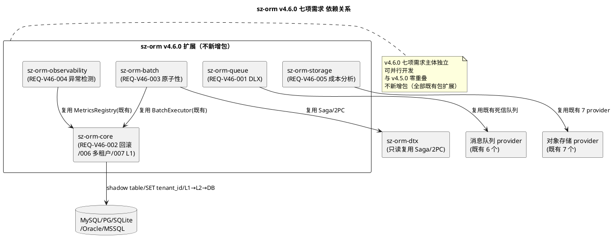

# sz-orm v4.6.0 技术设计文档

> 版本：v4.6.0（消息死信队列自动重投递 + 迁移回滚自动化 + 批量事务原子性保证 + 异常检测 + 存储成本分析 + 连接级多租户隔离 + 进程级 L1 缓存）
> 基线：v4.5.0（并行查询执行器 + 批量 INSERT/UPDATE/DELETE 优化 + 异步流式结果集，3 项需求 REQ-V45-001~003 全部通过 feature gate 隔离，已验收基线）
> 日期：2026-08-12
> 文档定位：技术设计（How to build），对应需求规格 `spec.md`（What to build，1139 行）
> 设计约束：无 Breaking Change（7 个新 feature gate 隔离，默认全关闭）+ 优先复用既有能力 + 五方言覆盖 + 每项设计附 file:line 代码证据 + unsafe 零容忍 + 禁止占位实现 + 与 v4.5.0 零重叠 + 不新增包（全部通过既有包扩展实现）+ 参数化查询铁律 + 闭包式 API 风格
> 需求依赖：七项需求主体相互独立，可并行开发（详见 §七 依赖关系图）
> 证据验证：本文档所有 file:line 证据均已通过源码读取验证（2026-08-12，40+ 项关键证据逐项实测），遵循 AGENTS.md 审计合规铁律

---

# 概述

## 设计目标

本设计文档将 sz-orm v4.6.0 七项可靠性增强与运维智能化需求（REQ-V46-001 ~ REQ-V46-007）转化为可落地的技术方案，核心目标：

1. **消息死信队列自动重投递**：扩展既有 `sz-orm-queue` 包，`RedeliveryScheduler` 自动重投递调度器基于既有死信队列 `InMemoryQueue.dead_letters`（`packages/sz-orm-queue/src/queue.rs:364`），当消息通过 `nack`（`:37`）达到 `max_retries`（`:366`）或 `reject`（`:44`）进入死信队列后，按 `BackoffPolicy` 退避策略自动调度重投递（无需手动调用 `requeue_dead_letter` `:484`），支持 `DlxRoutingStrategy` DLX 路由（RequeueToOriginal/ForwardToDlxTopic/ForwardToDlxQueue/Drop），重投递次数上限保护，复用既有 `message_tracing` 模块记录重投递日志。
2. **迁移回滚自动化**：扩展既有 `sz-orm-core` 迁移管理，`RollbackExecutor` 回滚执行器复用既有 `Migration.rollback`（`packages/sz-orm-core/src/migration.rs:587`）/ `down`（`:677`），提供 `ZeroDowntimeRollbackStrategy` 零停机回滚策略（ShadowTable/ReverseMigration/BlueGreen），`AutoRollbackTrigger` 自动回滚触发器基于 `HealthCheck` 健康检查连续失败 N 次触发，`RollbackWindow` 回滚窗口超时保护，ShadowTable 模式数据一致性校验。
3. **批量事务原子性保证**：扩展既有 `sz-orm-batch` 包，`BatchTransactionCoordinator` 批量事务协调器复用既有 `BatchExecutor`（`packages/sz-orm-batch/src/executor.rs`）执行批次 + `sz-orm-dtx` `Saga`（`packages/sz-orm-dtx/src/saga.rs:377`）/ `DistributedTransaction`（`packages/sz-orm-dtx/src/lib.rs:270`）协调原子提交，`AtomicityGuarantee` 三种级别（AllOrNothing 2PC / BestEffort 兼容既有 / SagaCompensation 补偿），`SagaCompensator` Saga 补偿器失败时按补偿回滚已成功批次。
4. **异常检测**：扩展既有 `sz-orm-observability` 包，`AnomalyDetector` 异常检测器复用既有 `MetricsRegistry`（`packages/sz-orm-observability/src/lib.rs:259`）指标历史数据，`AnomalyAlgorithm` 五种检测算法（Threshold/Trend/Statistical/ZScore/IQR），检测到异常触发 `AnomalyAlert` 告警 + 复用既有 `QueryLogger`（`packages/sz-orm-observability/src/query_logger.rs:73`）标注异常。
5. **存储成本分析与优化建议**：扩展既有 `sz-orm-storage` 包，`CostAnalyzer` 成本分析器复用既有 `Storage` trait（`packages/sz-orm-storage/src/storage.rs:14`）/ `BucketLifecycle`（`packages/sz-orm-storage/src/advanced.rs:438`），按 provider/bucket/tier 统计成本（容量+请求+流量），生成 `CostReport` 成本报表 + `CostOptimizationSuggestion` 优化建议（TierDowngrade/LifecycleOptimize/DeleteExpired/CompressCold）。
6. **连接级多租户隔离**：扩展既有 `sz-orm-core` 连接池与多租户，`ConnectionTenantBinder` 连接租户绑定器复用既有 `Pool`（`packages/sz-orm-core/src/pool.rs:743`）/ `TenantContext`（`packages/sz-orm-core/src/tenant_context.rs:80`），在同一连接池中连接绑定到特定租户（`SET app.tenant_id = ?` 参数化绑定），`ConnectionAffinityPolicy` 连接亲和策略（Strict/Preferred/None），`TenantConnectionGuard` RAII 守卫归还时清理租户上下文，复用既有 `RowLevelSecurityPolicy`（`packages/sz-orm-core/src/tenant_security.rs:67`）自动注入租户过滤。
7. **进程级 L1 缓存**：扩展既有 `sz-orm-core` L1 缓存，`ProcessL1Cache` 进程级 L1 缓存（跨 Session 共享 Identity Map，线程安全 `Send + Sync`，`RwLock` 保护），复用既有 `L1Cache`（`packages/sz-orm-core/src/l1_cache.rs:87`）Identity Map 语义 + `L2Cache`（`packages/sz-orm-core/src/l2_cache.rs:517`）协同 + `CacheCoherenceProtocol`（`packages/sz-orm-core/src/cache_coherence.rs:103`）一致性，L1→L2→DB 查询协作，LRU 淘汰 + TTL 过期。

## 设计约束

| 约束类别 | 约束内容 | 来源 |
|---------|---------|------|
| 兼容性 | 无 Breaking Change，7 个新 feature gate 隔离，默认全关闭，既有公开 API 完全向后兼容 | spec.md §1.4 / §4.5.1 |
| sz-pay 不破坏 | sz-pay 从 crates.io 拉取 sz-orm-* 6 个包既有用法不受影响 | spec.md §4.5.2 |
| 五方言覆盖 | MySQL/PostgreSQL/SQLite/Oracle/MSSQL 行为一致（按方言能力适配，如 `SET app.tenant_id` 仅 PG/MySQL 支持） | spec.md §4.5.3 |
| 复用优先 | 优先复用既有能力，不重复实现（7 项需求全部通过既有包扩展，不新增包） | spec.md §1.4 / §10.4 |
| unsafe 零容忍 | 无 `unsafe` 块，或必须有 `// SAFETY:` 注释 | spec.md §1.4.16 / §4.3 |
| 禁止占位实现 | 禁止 `todo!`/`unimplemented!`/`unreachable!` | AGENTS.md |
| 参数化查询 | 任何 WHERE 条件必须参数化，禁止 SQL 字符串拼接（复用既有 `Connection::execute_with_params` `packages/sz-orm-core/src/pool.rs:82`） | AGENTS.md / spec.md §4.3.2 |
| 测试基线不回退 | v4.5.0 已验收测试基线仅增不减 | spec.md §4.2.14 |
| 审计证据 | 每项结论附 file:line 证据，遵循审计合规铁律 | spec.md §4.3.8 / AGENTS.md |
| 与 v4.5.0 零重叠 | v4.5.0 是"执行优化"层，v4.6.0 是"可靠性+运维智能化"层，新增范围全部落在既有包扩展 | spec.md §1.4 / §10.1 |
| 不新增包 | 7 项需求全部通过既有包扩展实现（sz-orm-queue/sz-orm-core/sz-orm-batch/sz-orm-observability/sz-orm-storage） | spec.md §10.4 |
| DLX 不丢失消息 | 死信消息自动重投递时保留在死信队列直到重投递成功，重投递失败按退避策略重试 | spec.md §4.2.1 |
| 回滚窗口超时保护 | 超过回滚窗口后不可自动回滚，避免长时间后回滚导致数据丢失 | spec.md §4.2.4 |
| 批量 all-or-nothing | AllOrNothing 模式全成功提交/全失败回滚，不产生部分提交脏数据 | spec.md §4.2.6 |
| 多租户防越权 | 连接绑定的 tenant_id 不可被篡改，查询自动注入 tenant_id 过滤 | spec.md §4.2.10 / §4.3.6 |
| L1 缓存线程安全 | ProcessL1Cache 须 `Send + Sync`，跨线程共享无数据竞争 | spec.md §4.2.13 |

## feature gate 总览

| feature | 所属包 | 控制能力 | 默认 | 对应需求 |
|---------|--------|---------|------|---------|
| `dlx-auto-redelivery` | sz-orm-queue（扩展） | 消息死信队列自动重投递（调度器 + 退避策略 + DLX 路由） | 关闭 | REQ-V46-001 |
| `zero-downtime-rollback` | sz-orm-core（扩展） | 迁移回滚自动化（零停机策略 + 健康检查 + 回滚窗口） | 关闭 | REQ-V46-002 |
| `batch-atomic` | sz-orm-batch（扩展）+ sz-orm-dtx（只读复用 Saga/2PC） | 批量事务原子性保证（all-or-nothing + Saga 补偿 + 跨批次原子提交） | 关闭 | REQ-V46-003 |
| `anomaly-detection` | sz-orm-observability（扩展） | 异常检测（算法 + 告警 + 标注） | 关闭 | REQ-V46-004 |
| `cost-analysis` | sz-orm-storage（扩展） | 存储成本分析与优化建议（成本分析 + 优化建议 + 报表） | 关闭 | REQ-V46-005 |
| `connection-level-tenant` | sz-orm-core（扩展） | 连接级多租户隔离（连接绑定 + 亲和性 + SET app.tenant_id） | 关闭 | REQ-V46-006 |
| `process-l1-cache` | sz-orm-core（扩展） | 进程级 L1 缓存（跨 Session Identity Map + 线程安全 + L1→L2→DB 协同） | 关闭 | REQ-V46-007 |

## 架构总览

### 扩展包总览（不新增包）

| 包名 | 对应需求 | 依赖（只读复用） | 扩展内容 |
|------|---------|----------------|---------|------|
| `sz-orm-queue` | REQ-V46-001 | 既有 MessageQueue/InMemoryQueue/dead_letters/nack/reject/requeue_dead_letter + message_tracing | DLX 自动重投递调度器 + 退避策略 + DLX 路由策略（`dlx-auto-redelivery` feature） |
| `sz-orm-core` | REQ-V46-002 / 006 / 007 | 既有 Migration/rollback/down + Pool/Connection/TenantContext + L1Cache/L2Cache/CacheCoherenceProtocol | 零停机回滚 + 连接级多租户隔离 + 进程级 L1 缓存（3 个 feature） |
| `sz-orm-batch` | REQ-V46-003 | 既有 BatchExecutor/BatchExecutorConfig/RollbackStrategy + sz-orm-dtx Saga/DistributedTransaction | 批量事务原子性保证（`batch-atomic` feature） |
| `sz-orm-observability` | REQ-V46-004 | 既有 MetricsRegistry/SloMonitor/QueryLogger | 异常检测（`anomaly-detection` feature） |
| `sz-orm-storage` | REQ-V46-005 | 既有 Storage/StorageProvider/BucketLifecycle/LifecycleRule | 存储成本分析与优化建议（`cost-analysis` feature） |

### 依赖关系图



---

# 一、需求与存量功能关系分析

## 1.1 需求功能与存量功能对比

### 1.1.1 已实现功能（可直接复用）

| 需求功能 | 存量功能 | 代码位置 | 匹配度 |
|---------|---------|---------|--------|
| REQ-V46-001 消息队列 trait | `MessageQueue`（publish/consume/ack/nack/reject，异步 trait） | `packages/sz-orm-queue/src/queue.rs:18` | 100% |
| REQ-V46-001 消息结构 | `Message`（topic/payload/key/timestamp/headers/id/retry_count） | `packages/sz-orm-queue/src/queue.rs:57` | 100% |
| REQ-V46-001 重试计数 | `Message.retry_count`（重试次数，nack 时 +1） | `packages/sz-orm-queue/src/queue.rs:67` | 100% |
| REQ-V46-001 内存队列 | `InMemoryQueue`（内置死信队列） | `packages/sz-orm-queue/src/queue.rs:339` | 100% |
| REQ-V46-001 死信存储 | `InMemoryQueue.dead_letters`（HashMap<String, VecDeque<Message>>） | `packages/sz-orm-queue/src/queue.rs:364` | 100% |
| REQ-V46-001 最大重试 | `InMemoryQueue.max_retries`（最大重试次数） | `packages/sz-orm-queue/src/queue.rs:366` | 100% |
| REQ-V46-001 默认重试常量 | `DEFAULT_MAX_RETRIES`（3） | `packages/sz-orm-queue/src/queue.rs:377` | 100% |
| REQ-V46-001 nack | `MessageQueue::nack`（重入队列尾部，retry_count + 1，达 max_retries 转死信） | `packages/sz-orm-queue/src/queue.rs:37` | 100% |
| REQ-V46-001 reject | `MessageQueue::reject`（直接进死信） | `packages/sz-orm-queue/src/queue.rs:44` | 100% |
| REQ-V46-001 手动重投递 | `InMemoryQueue::requeue_dead_letter`（手动将死信放回原队列） | `packages/sz-orm-queue/src/queue.rs:484` | 100% |
| REQ-V46-002 迁移结构 | `Migration`（version/name/sql_up/sql_down/batch/executed_at） | `packages/sz-orm-core/src/migration.rs:10` | 100% |
| REQ-V46-002 反向 SQL | `Migration.sql_down`（反向 SQL） | `packages/sz-orm-core/src/migration.rs:18` | 100% |
| REQ-V46-002 迁移解析器 | `MigrationResolver` trait（resolve 返回迁移列表） | `packages/sz-orm-core/src/migration.rs:62` | 100% |
| REQ-V46-002 文件迁移解析器 | `FileMigrationResolver`（文件迁移解析器） | `packages/sz-orm-core/src/migration.rs:68` | 100% |
| REQ-V46-002 迁移上下文 | `MigrationContext`（迁移上下文） | `packages/sz-orm-core/src/migration.rs:193` | 100% |
| REQ-V46-002 回滚指定版本 | `MigrationContext::rollback`（执行 down SQL） | `packages/sz-orm-core/src/migration.rs:587` | 100% |
| REQ-V46-002 回滚到版本 | `MigrationContext::down`（执行该版本之后所有迁移的 down SQL） | `packages/sz-orm-core/src/migration.rs:677` | 100% |
| REQ-V46-003 批量执行配置 | `BatchExecutorConfig`（chunk_size/rollback_strategy/progress_callback/use_copy_protocol） | `packages/sz-orm-batch/src/executor.rs:18` | 100% |
| REQ-V46-003 批量执行结果 | `BatchExecutionResult`（base/chunk_results/in_transaction/rolled_back） | `packages/sz-orm-batch/src/executor.rs:93` | 100% |
| REQ-V46-003 默认分片大小 | `DEFAULT_CHUNK_SIZE`（1000） | `packages/sz-orm-batch/src/lib.rs:146` | 100% |
| REQ-V46-003 回滚策略 | `RollbackStrategy`（None/Savepoint/PerChunk） | `packages/sz-orm-batch/src/lib.rs:518` | 100% |
| REQ-V46-003 Saga 结构 | `Saga`（Saga 模式，步骤 + 补偿） | `packages/sz-orm-dtx/src/saga.rs:377` | 100% |
| REQ-V46-003 Saga 步骤 | `SagaStep`（action + compensation） | `packages/sz-orm-dtx/src/saga.rs:255` | 100% |
| REQ-V46-003 Saga 日志 | `SagaLog` trait（Saga 日志用于故障恢复） | `packages/sz-orm-dtx/src/saga.rs:105` | 100% |
| REQ-V46-003 Saga 执行 | `Saga::execute`（Saga 执行） | `packages/sz-orm-dtx/src/saga.rs:507` | 100% |
| REQ-V46-003 分布式事务 | `DistributedTransaction`（2PC） | `packages/sz-orm-dtx/src/lib.rs:270` | 100% |
| REQ-V46-004 指标注册中心 | `MetricsRegistry`（Counter/Gauge/Histogram 注册中心） | `packages/sz-orm-observability/src/lib.rs:259` | 100% |
| REQ-V46-004 指标类型 | `MetricKind`（Counter/Gauge/Histogram） | `packages/sz-orm-observability/src/lib.rs:75` | 100% |
| REQ-V46-004 SLO 监控 | `SloMonitor`（SLO 燃烧率监控） | `packages/sz-orm-observability/src/slo.rs:223` | 100% |
| REQ-V46-004 查询日志器 | `QueryLogger`（结构化查询日志） | `packages/sz-orm-observability/src/query_logger.rs:73` | 100% |
| REQ-V46-005 存储 trait | `Storage`（put/get/delete/list 统一抽象） | `packages/sz-orm-storage/src/storage.rs:14` | 100% |
| REQ-V46-005 存储构建器 | `StorageBuilder`（构建器） | `packages/sz-orm-storage/src/storage.rs:22` | 100% |
| REQ-V46-005 存储 provider | `StorageProvider`（Local/S3/AliyunOss/TencentCos/HuaweiObs/Upyun/QiniuKodo 7 provider） | `packages/sz-orm-storage/src/storage.rs:287` | 100% |
| REQ-V46-005 生命周期管理 | `BucketLifecycle`（生命周期管理） | `packages/sz-orm-storage/src/advanced.rs:438` | 100% |
| REQ-V46-005 生命周期规则 | `LifecycleRule`（生命周期规则） | `packages/sz-orm-storage/src/advanced.rs:400` | 100% |
| REQ-V46-005 生命周期动作 | `LifecycleAction`（生命周期动作） | `packages/sz-orm-storage/src/advanced.rs:378` | 100% |
| REQ-V46-006 连接池 | `Pool`（自研连接池，AtomicU32 + crossbeam-queue ArrayQueue + Notify） | `packages/sz-orm-core/src/pool.rs:743` | 100% |
| REQ-V46-006 连接 trait | `Connection`（execute/query/begin_transaction/commit/rollback，异步 trait） | `packages/sz-orm-core/src/pool.rs:45` | 100% |
| REQ-V46-006 池化连接 | `PooledConnection`（Drop 自动归还连接池） | `packages/sz-orm-core/src/pool.rs:239` | 100% |
| REQ-V46-006 获取连接 | `Pool::acquire`（获取连接） | `packages/sz-orm-core/src/pool.rs:1268` | 100% |
| REQ-V46-006 租户上下文 | `TenantContext`（租户上下文） | `packages/sz-orm-core/src/tenant_context.rs:80` | 100% |
| REQ-V46-006 隔离策略 | `IsolationStrategy`（RowLevel/SchemaIsolation） | `packages/sz-orm-core/src/tenant_context.rs:22` | 100% |
| REQ-V46-006 租户守卫 | `TenantContextGuard`（RAII 守卫） | `packages/sz-orm-core/src/tenant_context.rs:166` | 100% |
| REQ-V46-006 Schema 路由 | `SchemaIsolationRouter`（Schema 隔离路由器） | `packages/sz-orm-core/src/tenant_context.rs:194` | 100% |
| REQ-V46-006 租户池注册 | `TenantPoolRegistry`（按 tenant_id 维护独立 Pool） | `packages/sz-orm-core/src/tenant_context.rs:224` | 100% |
| REQ-V46-006 行级安全 | `RowLevelSecurityPolicy`（行级安全策略） | `packages/sz-orm-core/src/tenant_security.rs:67` | 100% |
| REQ-V46-006 数据库方言 | `DbType`（MySQL/PostgreSQL/Sqlite/Oracle/SqlServer 等） | `packages/sz-orm-core/src/db_type.rs:11` | 100% |
| REQ-V46-007 Session 级 L1 | `L1Cache<T>`（Session 级 Identity Map + LRU + AtomicU64 统计） | `packages/sz-orm-core/src/l1_cache.rs:87` | 100% |
| REQ-V46-007 L1 统计 | `L1CacheStats`（hits/misses/entry_count/evict_count） | `packages/sz-orm-core/src/l1_cache.rs:47` | 100% |
| REQ-V46-007 进程级 L2 | `L2Cache`（进程级跨 Session 共享） | `packages/sz-orm-core/src/l2_cache.rs:517` | 100% |
| REQ-V46-007 缓存键 | `CacheKey`（统一缓存键） | `packages/sz-orm-core/src/l2_cache.rs:143` | 100% |
| REQ-V46-007 表级失效 | `L2Cache::invalidate_table`（表级失效） | `packages/sz-orm-core/src/l2_cache.rs:740` | 100% |
| REQ-V46-007 缓存一致性 | `CacheCoherenceProtocol`（缓存一致性协议） | `packages/sz-orm-core/src/cache_coherence.rs:103` | 100% |
| REQ-V46-007 MESI 状态 | `MesiState`（MESI 状态机） | `packages/sz-orm-core/src/cache_coherence.rs:12` | 100% |
| REQ-V46-007 一致性策略 | `ConsistencyStrategy`（一致性策略） | `packages/sz-orm-core/src/cache_coherence.rs:25` | 100% |

### 1.1.2 需要扩展的功能

| 需求功能 | 存量功能 | 差异说明 | 扩展方向 |
|---------|---------|---------|---------|
| REQ-V46-001 自动重投递调度器 | 既有 `requeue_dead_letter`（`:484`）是**手动**调用 | 既有"手动重投递"缺"自动调度"；调度差异：既有需手动调用，需扩展自动调度器按退避策略定时重投递 | 新增 `RedeliveryScheduler` 自动重投递调度器，复用既有 `requeue_dead_letter` + `dead_letters`，不修改既有死信队列逻辑 |
| REQ-V46-001 退避策略 | 既有 `nack`（`:37`）重入队列尾部无退避 | 既有"立即重入"缺"退避等待"；退避差异：既有无退避，需扩展 Fixed/Exponential/Linear/RandomJitter 四种退避策略 | 新增 `BackoffPolicy` 枚举 + 退避时间计算，默认 Exponential |
| REQ-V46-001 DLX 路由 | 既有 `requeue_dead_letter` 仅放回原队列 | 既有"放回原队列"缺"DLX 路由"；路由差异：既有仅 RequeueToOriginal，需扩展 ForwardToDlxTopic/ForwardToDlxQueue/Drop | 新增 `DlxRoutingStrategy` 枚举，默认 RequeueToOriginal |
| REQ-V46-002 零停机回滚策略 | 既有 `rollback`（`:587`）/ `down`（`:677`）直接执行 down SQL | 既有"直接回滚"缺"零停机"；停机差异：既有回滚期间服务中断，需扩展 shadow table/reverse migration/blue-green 零停机 | 新增 `ZeroDowntimeRollbackStrategy` 枚举 + `RollbackExecutor`，复用既有 `rollback`/`down`，默认 ShadowTable |
| REQ-V46-002 健康检查触发 | 既有 `rollback`/`down` 需手动调用 | 既有"手动回滚"缺"自动触发"；触发差异：既有无自动触发，需扩展健康检查连续失败自动触发 | 新增 `AutoRollbackTrigger` + `HealthCheck`，连续失败 N 次触发，默认 3 次 |
| REQ-V46-002 回滚窗口 | 既有 `rollback`/`down` 无时间窗口限制 | 既有"无窗口限制"缺"窗口保护"；窗口差异：既有任意时间可回滚，需扩展回滚窗口超时拒绝 | 新增 `RollbackWindow`，默认 5 分钟，超时拒绝自动回滚 |
| REQ-V46-003 all-or-nothing | 既有 `RollbackStrategy::None`（`:518`）允许部分成功 | 既有"尽力而为"缺"all-or-nothing"；原子性差异：既有允许部分成功，需扩展全成功/全失败 | 新增 `AtomicityGuarantee` 枚举（AllOrNothing/BestEffort/SagaCompensation），AllOrNothing 复用 2PC，默认 BestEffort |
| REQ-V46-003 Saga 补偿批量 | 既有 `Saga`（`saga.rs:377`）未与批量执行器集成 | 既有"Saga 独立"缺"批量集成"；集成差异：既有 Saga 与 BatchExecutor 独立，需扩展每批次作为 SagaStep | 新增 `BatchTransactionCoordinator` + `SagaCompensator`，复用既有 `Saga`/`SagaStep` |
| REQ-V46-003 跨批次原子提交 | 既有 `BatchExecutor` 单批次事务，无跨批次原子提交 | 既有"单批次事务"缺"跨批次原子"；提交差异：既有单批次事务，需扩展多批次 2PC 原子提交 | 新增 `BatchTransactionCoordinator`，复用既有 `DistributedTransaction` 2PC |
| REQ-V46-004 异常检测算法 | 既有 `MetricsRegistry`（`:259`）仅采集指标，无异常检测 | 既有"指标采集"缺"异常检测"；检测差异：既有仅采集，需扩展统计/阈值/趋势异常检测 | 新增 `AnomalyDetector` + `AnomalyAlgorithm` 枚举（5 种算法），复用既有 `MetricsRegistry` 历史数据 |
| REQ-V46-004 异常告警联动 | 既有 `SloMonitor`（`slo.rs:223`）SLO 告警，无异常告警 | 既有"SLO 告警"缺"异常告警"；告警差异：既有 SLO 燃烧率告警，需扩展异常检测告警 | 新增 `AnomalyAlert`，告警通道可配（Log/Webhook/Slo），复用既有 SLO 告警通道 |
| REQ-V46-005 成本分析 | 既有 `Storage`（`:14`）/ `BucketLifecycle`（`:438`）无成本统计 | 既有"存储操作"缺"成本分析"；成本差异：既有仅存储操作，需扩展按 provider/bucket/tier 统计成本 | 新增 `CostAnalyzer` + `CostReport`，复用既有 `Storage` 获取用量 |
| REQ-V46-005 成本优化建议 | 既有 `LifecycleRule`（`:400`）生命周期规则，无优化建议 | 既有"生命周期规则"缺"优化建议"；建议差异：既有仅规则定义，需扩展基于成本生成建议 | 新增 `CostOptimizationSuggestion` 枚举（4 种建议），附预期节省 |
| REQ-V46-006 连接级隔离 | 既有 `TenantPoolRegistry`（`:224`）每租户独立池 | 既有"每租户独立池"缺"连接级隔离"；隔离差异：既有 N 租户 = N 池，需扩展同一池中连接绑定租户 | 新增 `ConnectionTenantBinder` + `ConnectionLevelIsolation` 枚举，复用既有 `Pool`，默认 SetTenantId |
| REQ-V46-006 连接亲和性 | 既有 `TenantPoolRegistry` 无连接亲和性 | 既有"无亲和"缺"连接亲和"；亲和差异：既有无亲和，需扩展同一租户复用绑定连接 | 新增 `ConnectionAffinityPolicy` 枚举（Strict/Preferred/None），默认 Preferred |
| REQ-V46-007 进程级 L1 | 既有 `L1Cache`（`:87`）Session 级（非 Send + Sync） | 既有"Session 级 L1"缺"进程级 L1"；共享差异：既有非 Send + Sync 不跨 Session，需扩展进程级跨 Session 共享 | 新增 `ProcessL1Cache`（Send + Sync，RwLock 保护），复用既有 `L1Cache` Identity Map 语义 |
| REQ-V46-007 L1→L2→DB 协同 | 既有 `L1Cache`/`L2Cache` 独立，无 L1→L2→DB 协同 | 既有"L1/L2 独立"缺"L1→L2→DB 协同"；协同差异：既有独立查询，需扩展 L1 命中直接返回/L1 未命中查 L2/L2 未命中查 DB | 新增 L1→L2→DB 查询协作逻辑，复用既有 `L2Cache` + `CacheCoherenceProtocol` |

## 1.2 存量功能详细分析

### 1.2.1 InMemoryQueue 死信队列（REQ-V46-001 复用）

**接口契约**：
- `nack(message_id)`：重入队列尾部，retry_count + 1，达 max_retries 转死信
- `reject(message_id)`：直接进死信队列
- `requeue_dead_letter(message_id)`：手动将死信放回原队列并重置 retry_count
- `dead_letter_count()` / `consume_dead_letter()`：死信查询

**业务规则**：
- `dead_letters`（`:364`）按 topic 分组存储死信消息
- `max_retries`（`:366`）默认 `DEFAULT_MAX_RETRIES`（`:377` = 3）
- `nack` 重入队列尾部，`reject` 直接进死信

**约束**：
- 既有 `requeue_dead_letter` 是手动调用，本版本补自动重投递调度器
- 既有 `MessageQueue` trait / `InMemoryQueue` / `Message` 保留不动

### 1.2.2 MigrationContext 回滚（REQ-V46-002 复用）

**接口契约**：
- `rollback(version)`：回滚指定版本，执行该版本的 down SQL
- `down(target_version)`：回滚到指定版本，执行该版本之后所有迁移的 down SQL
- `MigrationResolver::resolve()`：返回迁移列表
- `FileMigrationResolver`：从文件解析迁移

**业务规则**：
- `Migration.sql_down`（`:18`）持有反向 SQL
- `rollback` 执行单个版本的 down SQL，`down` 执行多版本回滚

**约束**：
- 既有 `rollback`/`down` 需手动调用，本版本补零停机回滚 + 自动触发
- 既有 `Migration`/`MigrationResolver`/`MigrationContext` 保留不动

### 1.2.3 BatchExecutor + sz-orm-dtx（REQ-V46-003 复用）

**接口契约**：
- `BatchExecutor::execute_batch_insert/update/delete/upsert`：异步执行批量操作
- `BatchExecutorConfig`：chunk_size/rollback_strategy/progress_callback/use_copy_protocol
- `Saga::execute()`：Saga 执行（action + compensation）
- `SagaStep`：Saga 步骤（action + compensation）
- `DistributedTransaction::prepare/commit/rollback`：2PC 协调

**业务规则**：
- `RollbackStrategy`（`:518`）None/Savepoint/PerChunk 控制部分失败回滚
- `Saga` 按步骤执行，失败时补偿回滚已成功步骤
- `DistributedTransaction` 2PC：prepare 全成功后 commit，任一 prepare 失败后 rollback

**约束**：
- 既有 `RollbackStrategy::None` 允许部分成功，本版本补 all-or-nothing
- 既有 `BatchExecutor`/`Saga`/`DistributedTransaction` 保留不动

### 1.2.4 MetricsRegistry + QueryLogger（REQ-V46-004 复用）

**接口契约**：
- `MetricsRegistry::register_counter/gauge/histogram`：注册指标
- `MetricsRegistry` 持有指标历史数据（Counter/Gauge/Histogram）
- `QueryLogger::log(entry)`：记录查询日志
- `SloMonitor`：SLO 燃烧率监控

**业务规则**：
- `MetricKind`（`:75`）Counter/Gauge/Histogram 三种指标类型
- `QueryLogger` 结构化查询日志，含 QueryLogEntry

**约束**：
- 既有 `MetricsRegistry` 仅采集指标，本版本补异常检测
- 既有 `MetricsRegistry`/`SloMonitor`/`QueryLogger` 保留不动

### 1.2.5 Storage + BucketLifecycle（REQ-V46-005 复用）

**接口契约**：
- `Storage::put/get/delete/list`：统一存储抽象
- `StorageBuilder`：构建器（配置 provider/凭据）
- `BucketLifecycle`：生命周期管理
- `LifecycleRule`：生命周期规则

**业务规则**：
- `StorageProvider`（`:287`）7 provider（Local/S3/AliyunOss/TencentCos/HuaweiObs/Upyun/QiniuKodo）
- `LifecycleAction`（`:378`）生命周期动作
- `LifecycleRule`（`:400`）定义生命周期规则

**约束**：
- 既有 `Storage`/`BucketLifecycle` 无成本统计，本版本补成本分析
- 既有 `Storage`/`StorageBuilder`/`BucketLifecycle`/`LifecycleRule` 保留不动

### 1.2.6 Pool + TenantContext（REQ-V46-006 复用）

**接口契约**：
- `Pool::acquire()`：获取连接（无锁 ArrayQueue + Notify 等待）
- `PooledConnection`：Drop 自动归还连接池
- `TenantContext`：租户上下文（tenant_id + isolation_strategy）
- `TenantContextGuard`：RAII 守卫（Drop 恢复上下文）
- `TenantPoolRegistry`：按 tenant_id 维护独立 Pool

**业务规则**：
- `IsolationStrategy`（`:22`）RowLevel/SchemaIsolation 两种隔离策略
- `SchemaIsolationRouter`（`:194`）Schema 隔离路由到 `tenant_{id}_{table}`
- `RowLevelSecurityPolicy`（`tenant_security.rs:67`）行级安全策略，追加 `WHERE tenant_id = ?`

**约束**：
- 既有 `TenantPoolRegistry` 每租户独立池（资源开销大），本版本补连接级隔离
- 既有 `Pool`/`TenantContext`/`TenantPoolRegistry` 保留不动

### 1.2.7 L1Cache + L2Cache + CacheCoherenceProtocol（REQ-V46-007 复用）

**接口契约**：
- `L1Cache::put/get`：Session 级 Identity Map（非 Send + Sync）
- `L2Cache::put/get/invalidate_table`：进程级跨 Session 共享
- `CacheKey`：统一缓存键
- `CacheCoherenceProtocol`：缓存一致性协议（MESI）

**业务规则**：
- `L1Cache`（`:87`）Session 级，LRU 淘汰 + TTL 过期 + AtomicU64 统计
- `L2Cache`（`:517`）进程级，跨 Session 共享
- `MesiState`（`:12`）MESI 状态机（Modified/Exclusive/Shared/Invalid）
- `ConsistencyStrategy`（`:25`）一致性策略

**约束**：
- 既有 `L1Cache` 非 Send + Sync（Session 内使用），本版本补进程级 L1（Send + Sync）
- 既有 `L1Cache`/`L2Cache`/`CacheCoherenceProtocol` 保留不动

---

# 二、增量设计方案

## 2.1 实现模型

### 2.1.1 上下文视图

```plantuml
@startuml
title sz-orm v4.6.0 七项可靠性增强与运维智能化 上下文视图

rectangle "sz-orm v4.6.0 扩展" as orm {
  rectangle "sz-orm-queue\n(REQ-V46-001)" as queue {
    rectangle "RedeliveryScheduler" as scheduler
    rectangle "BackoffPolicy" as backoff
    rectangle "DlxRoutingStrategy" as dlx_route
  }
  rectangle "sz-orm-core 回滚\n(REQ-V46-002)" as rollback {
    rectangle "RollbackExecutor" as rb_exec
    rectangle "AutoRollbackTrigger" as rb_trigger
    rectangle "HealthCheck" as rb_health
  }
  rectangle "sz-orm-batch\n(REQ-V46-003)" as batch {
    rectangle "BatchTransactionCoordinator" as btc
    rectangle "SagaCompensator" as saga_comp
  }
  rectangle "sz-orm-observability\n(REQ-V46-004)" as obs {
    rectangle "AnomalyDetector" as detector
    rectangle "AnomalyAlgorithm" as algo
  }
  rectangle "sz-orm-storage\n(REQ-V46-005)" as storage {
    rectangle "CostAnalyzer" as cost
    rectangle "CostOptimizationSuggestion" as suggestion
  }
  rectangle "sz-orm-core 多租户\n(REQ-V46-006)" as tenant {
    rectangle "ConnectionTenantBinder" as binder
    rectangle "ConnectionAffinityPolicy" as affinity
  }
  rectangle "sz-orm-core L1\n(REQ-V46-007)" as l1 {
    rectangle "ProcessL1Cache" as pl1
    rectangle "CrossSessionIdentityMap" as identity
  }
}

rectangle "sz-orm 既有（只读复用）" as existing {
  rectangle "InMemoryQueue\n(queue.rs:339)" as imq
  rectangle "MigrationContext\n(migration.rs:193)" as mig
  rectangle "BatchExecutor\n(executor.rs)" as be
  rectangle "Saga\n(saga.rs:377)" as saga
  rectangle "MetricsRegistry\n(lib.rs:259)" as metrics
  rectangle "Storage\n(storage.rs:14)" as st
  rectangle "Pool\n(pool.rs:743)" as pool
  rectangle "L1Cache/L2Cache\n(l1_cache.rs:87)" as cache
}

scheduler --> imq : 复用既有死信队列
rb_exec --> mig : 复用既有rollback/down
btc --> be : 复用既有BatchExecutor
btc --> saga : 复用既有Saga/2PC
detector --> metrics : 复用既有指标历史
cost --> st : 复用既有Storage
binder --> pool : 复用既有Pool
pl1 --> cache : 复用既有L1/L2

@enduml
```



### 2.1.2 服务/组件总体架构

```plantuml
@startuml
title sz-orm v4.6.0 组件总体架构

package "sz-orm-queue (扩展 dlx-auto-redelivery)" as pkg_queue {
  rectangle "RedeliveryScheduler\n(自动重投递调度器)" as cls_scheduler
  rectangle "DlxConfig\n(DLX配置)" as cls_dlx_config
  rectangle "BackoffPolicy <<enum>>\n(Fixed/Exponential/Linear/RandomJitter)" as cls_backoff
  rectangle "DlxRoutingStrategy <<enum>>\n(RequeueToOriginal/ForwardToDlxTopic\n/ForwardToDlxQueue/Drop)" as cls_dlx_route
  rectangle "DlxEntry\n(死信条目)" as cls_dlx_entry
  rectangle "RedeliveryOutcome\n(重投递结果)" as cls_redel_outcome
}

package "sz-orm-core (扩展 zero-downtime-rollback)" as pkg_core_rb {
  rectangle "RollbackExecutor\n(回滚执行器)" as cls_rb_exec
  rectangle "ZeroDowntimeRollbackStrategy <<enum>>\n(ShadowTable/ReverseMigration/BlueGreen)" as cls_rb_strategy
  rectangle "RollbackPlan\n(回滚计划)" as cls_rb_plan
  rectangle "RollbackWindow\n(回滚窗口)" as cls_rb_window
  rectangle "HealthCheck\n(健康检查)" as cls_health
  rectangle "AutoRollbackTrigger\n(自动回滚触发器)" as cls_auto_trigger
}

package "sz-orm-batch (扩展 batch-atomic)" as pkg_batch {
  rectangle "BatchTransactionCoordinator\n(批量事务协调器)" as cls_btc
  rectangle "AtomicityGuarantee <<enum>>\n(AllOrNothing/BestEffort/SagaCompensation)" as cls_atomic
  rectangle "SagaCompensator\n(Saga补偿器)" as cls_saga_comp
  rectangle "BatchAtomicConfig\n(原子配置)" as cls_ba_config
}

package "sz-orm-observability (扩展 anomaly-detection)" as pkg_obs {
  rectangle "AnomalyDetector\n(异常检测器)" as cls_detector
  rectangle "AnomalyAlgorithm <<enum>>\n(Threshold/Trend/Statistical/ZScore/IQR)" as cls_algo
  rectangle "AnomalyAlert\n(异常告警)" as cls_alert
  rectangle "AnomalyConfig\n(异常配置)" as cls_anomaly_config
  rectangle "ThresholdDetector\n(阈值检测器)" as cls_threshold
  rectangle "TrendDetector\n(趋势检测器)" as cls_trend
  rectangle "StatisticalDetector\n(统计检测器)" as cls_stat
}

package "sz-orm-storage (扩展 cost-analysis)" as pkg_storage {
  rectangle "CostAnalyzer\n(成本分析器)" as cls_cost
  rectangle "CostReport\n(成本报表)" as cls_report
  rectangle "CostOptimizationSuggestion <<enum>>\n(TierDowngrade/LifecycleOptimize\n/DeleteExpired/CompressCold)" as cls_suggestion
  rectangle "StorageTiering\n(存储分层)" as cls_tiering
  rectangle "CostConfig\n(成本配置)" as cls_cost_config
}

package "sz-orm-core (扩展 connection-level-tenant)" as pkg_core_tenant {
  rectangle "ConnectionTenantBinder\n(连接租户绑定器)" as cls_binder
  rectangle "TenantConnectionGuard\n(租户连接守卫)" as cls_tenant_guard
  rectangle "ConnectionAffinityPolicy <<enum>>\n(Strict/Preferred/None)" as cls_affinity
  rectangle "ConnectionLevelIsolation <<enum>>\n(SetTenantId/SchemaIsolation/ConnectionBinding)" as cls_iso
}

package "sz-orm-core (扩展 process-l1-cache)" as pkg_core_l1 {
  rectangle "ProcessL1Cache\n(进程级L1缓存)" as cls_pl1
  rectangle "ProcessL1Config\n(进程级L1配置)" as cls_pl1_config
  rectangle "CrossSessionIdentityMap\n(跨Session Identity Map)" as cls_identity
}

cls_scheduler --> cls_dlx_config : 读取配置
cls_scheduler --> cls_backoff : 退避计算
cls_scheduler --> cls_dlx_route : 路由策略
cls_rb_exec --> cls_rb_strategy : 回滚策略
cls_rb_exec --> cls_rb_plan : 回滚计划
cls_auto_trigger --> cls_health : 健康检查
cls_auto_trigger --> cls_rb_window : 窗口判定
cls_btc --> cls_atomic : 原子性级别
cls_btc --> cls_saga_comp : Saga补偿
cls_detector --> cls_algo : 检测算法
cls_detector --> cls_alert : 触发告警
cls_detector --> cls_anomaly_config : 读取配置
cls_cost --> cls_report : 生成报表
cls_cost --> cls_suggestion : 优化建议
cls_cost --> cls_tiering : 存储分层
cls_binder --> cls_affinity : 亲和策略
cls_binder --> cls_iso : 隔离机制
cls_pl1 --> cls_pl1_config : 读取配置
cls_pl1 --> cls_identity : Identity Map

@enduml
```



**模块划分与职责**：
- **sz-orm-queue（扩展）**：`dlx.rs`（RedeliveryScheduler + DlxConfig + BackoffPolicy + DlxRoutingStrategy）+ 既有 `queue.rs`（保留不动）
- **sz-orm-core 回滚（扩展）**：`rollback_auto.rs`（RollbackExecutor + AutoRollbackTrigger + HealthCheck + RollbackWindow）+ 既有 `migration.rs`（保留不动）
- **sz-orm-batch（扩展）**：`atomic.rs`（BatchTransactionCoordinator + SagaCompensator + AtomicityGuarantee）+ 既有 `executor.rs`/`lib.rs`（保留不动）
- **sz-orm-observability（扩展）**：`anomaly.rs`（AnomalyDetector + AnomalyAlgorithm + ThresholdDetector + TrendDetector + StatisticalDetector）+ 既有 `lib.rs`/`slo.rs`/`query_logger.rs`（保留不动）
- **sz-orm-storage（扩展）**：`cost.rs`（CostAnalyzer + CostReport + CostOptimizationSuggestion + StorageTiering）+ 既有 `storage.rs`/`advanced.rs`（保留不动）
- **sz-orm-core 多租户（扩展）**：`connection_tenant.rs`（ConnectionTenantBinder + TenantConnectionGuard + ConnectionAffinityPolicy）+ 既有 `pool.rs`/`tenant_context.rs`（保留不动）
- **sz-orm-core L1（扩展）**：`process_l1_cache.rs`（ProcessL1Cache + CrossSessionIdentityMap + ProcessL1Config）+ 既有 `l1_cache.rs`/`l2_cache.rs`/`cache_coherence.rs`（保留不动）

**配置项及取值策略**：
- `DlxConfig.backoff_policy`：默认 Exponential（初始 1s，最大 60s）
- `DlxConfig.max_redelivery_count`：默认 10
- `DlxConfig.routing_strategy`：默认 RequeueToOriginal
- `ZeroDowntimeRollbackConfig.strategy`：默认 ShadowTable
- `ZeroDowntimeRollbackConfig.rollback_window_ms`：默认 300000（5 分钟）
- `ZeroDowntimeRollbackConfig.health_check_failure_threshold`：默认 3
- `BatchAtomicConfig.atomicity_guarantee`：默认 BestEffort（兼容既有 `RollbackStrategy::None`）
- `AnomalyConfig.algorithm`：默认 Threshold
- `AnomalyConfig.window_ms`：默认 300000（5 分钟）
- `CostConfig.analysis_interval_ms`：默认 86400000（每日）
- `ConnectionLevelTenantConfig.isolation`：默认 SetTenantId
- `ConnectionLevelTenantConfig.affinity_policy`：默认 Preferred
- `ProcessL1Config.capacity`：默认 10000
- `ProcessL1Config.ttl_ms`：默认 300000（5 分钟）

### 2.1.3 实现设计文档

#### 2.1.3.1 DLX 自动重投递流程（REQ-V46-001）

```plantuml
@startuml
title DLX 自动重投递 流程分支

start
:消息通过 nack 达到 max_retries 或 reject 进入死信队列;
:RedeliveryScheduler 检测到死信消息进入;

:计算退避时间 = BackoffPolicy.calculate(retry_count);
note right: Fixed: initial_backoff_ms
  Exponential: initial × 2^retry_count
  Linear: initial × retry_count
  RandomJitter: initial × random(0.5~1.5)
if (退避时间 > max_backoff_ms?) then (是)
  :降级为 max_backoff_ms;
end if

:等待退避时间;

if (重投递次数 < max_redelivery_count?) then (是)
  switch (routing_strategy)
  case (RequeueToOriginal)
    :复用既有 requeue_dead_letter(message_id);
    :消息重回原队列;
  case (ForwardToDlxTopic)
    :publish(dlx_topic, message);
  case (ForwardToDlxQueue)
    :publish(dlx_queue, message);
  case (Drop)
    :从死信队列移除;
  endswitch
  :记录重投递日志(消息ID+次数+退避时间+结果);
else (否，达到上限)
  :按路由策略处理 + 记录"redelivery limit reached";
  note right: 不无限重投递
end if

stop

@enduml
```

#### 2.1.3.2 零停机回滚流程（REQ-V46-002）

```plantuml
@startuml
title 零停机回滚 流程分支（含健康检查触发）

start
:部署后启动 AutoRollbackTrigger;

loop 持续健康检查
  :HealthCheck.check();
  if (健康检查通过?) then (是)
    :重置连续失败计数;
  else (否)
    :连续失败计数 + 1;
    if (连续失败 >= failure_threshold?) then (是)
      if (在回滚窗口内?) then (是)
        switch (rollback_strategy)
        case (ShadowTable)
          :在 shadow table 执行 down SQL [复用既有 rollback];
          :校验 shadow table 与原表数据一致性;
          if (校验通过?) then (是)
            :切换流量到 shadow table;
            :记录回滚日志(版本+策略+耗时+结果);
          else (否)
            :保持原状态 + 记录"consistency check failed";
          end if
        case (ReverseMigration)
          :复用既有 rollback(version);
          :记录回滚日志;
        case (BlueGreen)
          :切换到旧版本;
          :记录回滚日志;
        endswitch
      else (否，超过窗口)
        :拒绝自动回滚"rollback window expired";
      end if
    end if
  end if
end

stop

@enduml
```

#### 2.1.3.3 批量事务原子性流程（REQ-V46-003）

```plantuml
@startuml
title 批量事务原子性 流程分支

start
:接收 batches + BatchAtomicConfig;

switch (atomicity_guarantee)
case (AllOrNothing)
  :创建 DistributedTransaction [复用既有 2PC];
  loop 每个批次
    :BatchExecutor.execute_batch(batch) [复用既有];
    :DistributedTransaction.add_participant(batch);
  end
  if (全部 prepare 成功?) then (是)
    :DistributedTransaction.commit() [复用既有];
    :返回全部成功;
  else (否)
    :DistributedTransaction.rollback() [复用既有];
    :返回错误"atomicity violated, all rolled back";
  end if
case (SagaCompensation)
  :创建 Saga [复用既有];
  loop 每个批次
    :Saga.add_step(SagaStep{action=批次, compensation=反向}) [复用既有];
  end
  :Saga.execute() [复用既有];
  if (全部成功?) then (是)
    :返回 SagaResult(完成);
  else (某步失败)
    :Saga 补偿回滚已成功步骤;
    if (补偿成功?) then (是)
      :返回 SagaResult(补偿完成);
    else (否)
      :记录补偿失败日志供人工干预;
    end if
  end if
case (BestEffort)
  :BatchExecutor.execute_batch(每批次) [复用既有 + RollbackStrategy::None];
  :返回部分成功结果;
endswitch

:记录原子提交日志(批次列表+级别+结果);

stop

@enduml
```

#### 2.1.3.4 异常检测流程（REQ-V46-004）

```plantuml
@startuml
title 异常检测 流程分支

start
:接收 AnomalyConfig(算法+阈值+窗口);

loop 周期性检测
  :从 MetricsRegistry 获取指标历史数据 [复用既有];
  if (历史数据充足?) then (是)
    switch (algorithm)
    case (Threshold)
      :ThresholdDetector: 指标值 > 阈值?;
    case (Trend)
      :TrendDetector: 指标持续上升/下降?;
    case (Statistical)
      :StatisticalDetector: 基于均值/方差检测;
    case (ZScore)
      :ZScore = (value - mean) / std_dev;
      :ZScore > zscore_threshold?;
    case (IQR)
      :IQR = Q3 - Q1;
      :指标值 < Q1-1.5×IQR 或 > Q3+1.5×IQR?;
    endswitch
    if (检测到异常?) then (是)
      :触发 AnomalyAlert(指标名+异常值+阈值+窗口+算法);
      :在 QueryLogger 标注异常 [复用既有];
      :发送告警到配置通道(Log/Webhook/Slo);
    end if
  else (否)
    :跳过检测"insufficient data";
  end if
end

stop

@enduml
```

#### 2.1.3.5 连接级多租户隔离流程（REQ-V46-006）

```plantuml
@startuml
title 连接级多租户隔离 流程分支

start
:接收 tenant_id + ConnectionLevelTenantConfig;

:ConnectionTenantBinder.acquire_with_tenant(tenant_id);
:Pool::acquire() [复用既有];

if (affinity_policy == Strict/Preferred?) then (是)
  :查找绑定到 tenant_id 的连接;
  if (找到?) then (是)
    :返回绑定连接;
    note right: 减少租户上下文切换
  else (否)
    if (SetTenantId 支持?) then (是, PG/MySQL)
      :execute_with_params("SET app.tenant_id = ?", [tenant_id]) [参数化绑定];
      :标记连接绑定到 tenant_id;
    else (否, SQLite/Oracle/MSSQL)
      :降级为 SchemaIsolation [复用既有 SchemaIsolationRouter];
    end if
  end if
else (None)
  :每次设置租户上下文;
end if

:返回 TenantConnectionGuard(连接);

note right: TenantConnectionGuard drop 时
  清理租户上下文(SET app.tenant_id = NULL)
  归还连接到 Pool
end note

stop

@enduml
```

#### 2.1.3.6 进程级 L1 缓存流程（REQ-V46-007）

```plantuml
@startuml
title 进程级 L1 缓存 L1→L2→DB 查询协作

start
:ProcessL1Cache.get(table, pk);

:RwLock.read() 查找 L1;
if (L1 命中?) then (是)
  :返回 Arc<T> [Identity Map];
  note right: 跨 Session 返回相同 Arc<T>
    Arc::ptr_eq 为 true
  stop
else (否)
end if

:L2Cache.get(CacheKey) [复用既有];
if (L2 命中?) then (是)
  :回填 L1;
  :返回 Arc<T>;
  stop
else (否)
end if

:查询 DB;
:回填 L1;
:L2Cache.put(CacheKey, Value) [复用既有];
:返回 Arc<T>;

stop

@enduml
```

## 2.2 接口设计

### 2.2.1 总体设计

**接口分类依据**：按需求项分类，每项需求一组接口，接口间无继承关系。

| 接口分类 | 接口列表 | 稳定性 | 对应需求 |
|---------|---------|--------|---------|
| DLX 自动重投递 | `RedeliveryScheduler::start` / `stop` / `DlxConfig::new` / `with_*` | 稳定 | REQ-V46-001 |
| 零停机回滚 | `RollbackExecutor::execute` / `AutoRollbackTrigger::start` / `HealthCheck::check` | 稳定 | REQ-V46-002 |
| 批量事务原子性 | `BatchTransactionCoordinator::execute_atomic` / `SagaCompensator::compensate` | 稳定 | REQ-V46-003 |
| 异常检测 | `AnomalyDetector::detect` / `AnomalyAlert::send` | 稳定 | REQ-V46-004 |
| 成本分析 | `CostAnalyzer::analyze` / `generate_report` / `suggest_optimization` | 稳定 | REQ-V46-005 |
| 连接级多租户 | `ConnectionTenantBinder::acquire_with_tenant` / `TenantConnectionGuard` | 稳定 | REQ-V46-006 |
| 进程级 L1 缓存 | `ProcessL1Cache::get` / `put` / `invalidate` | 稳定 | REQ-V46-007 |

**接口变更策略**：
- 新增接口通过 feature gate 隔离（7 个 feature），默认关闭
- 既有 `MessageQueue`/`Migration`/`BatchExecutor`/`MetricsRegistry`/`Storage`/`Pool`/`L1Cache` trait/struct 保留不动
- 所有新接口为扩展 API，不修改既有公开 API 签名

### 2.2.2 接口清单

#### 2.2.2.1 DLX 自动重投递接口（REQ-V46-001）

**接口签名**：
```rust
// DLX 配置
pub struct DlxConfig {
    pub enabled: bool,
    pub backoff_policy: BackoffPolicy,
    pub initial_backoff_ms: u64,
    pub max_backoff_ms: u64,
    pub max_redelivery_count: u32,
    pub routing_strategy: DlxRoutingStrategy,
    pub dlx_topic: Option<String>,
    pub dlx_queue: Option<String>,
}

impl DlxConfig {
    pub fn new() -> Self;
    pub fn with_backoff_policy(mut self, policy: BackoffPolicy) -> Self;
    pub fn with_initial_backoff_ms(mut self, ms: u64) -> Self;
    pub fn with_max_backoff_ms(mut self, ms: u64) -> Self;
    pub fn with_max_redelivery_count(mut self, count: u32) -> Self;
    pub fn with_routing_strategy(mut self, strategy: DlxRoutingStrategy) -> Self;
    pub fn with_dlx_topic(mut self, topic: impl Into<String>) -> Self;
    pub fn with_dlx_queue(mut self, queue: impl Into<String>) -> Self;
}

// 退避策略
pub enum BackoffPolicy {
    Fixed,
    Exponential,
    Linear,
    RandomJitter,
}

impl BackoffPolicy {
    pub fn calculate(&self, retry_count: u32, initial_ms: u64, max_ms: u64) -> u64;
}

// DLX 路由策略
pub enum DlxRoutingStrategy {
    RequeueToOriginal,
    ForwardToDlxTopic,
    ForwardToDlxQueue,
    Drop,
}

// 死信条目
pub struct DlxEntry {
    pub message: Message,
    pub redelivery_count: u32,
    pub last_redelivery_at: u64,
    pub next_redelivery_at: u64,
}

// 重投递结果
pub enum RedeliveryOutcome {
    Requeued,
    ForwardedToDlxTopic,
    ForwardedToDlxQueue,
    Dropped,
    LimitReached,
    Skipped(String),
}

// 自动重投递调度器
pub struct RedeliveryScheduler {
    queue: Arc<InMemoryQueue>,
    config: DlxConfig,
    running: Arc<AtomicBool>,
}

impl RedeliveryScheduler {
    pub fn new(queue: Arc<InMemoryQueue>, config: DlxConfig) -> Self;
    pub async fn start(&self) -> Result<(), MqError>;
    pub async fn stop(&self);
    async fn schedule_redelivery(&self, entry: &DlxEntry) -> Result<RedeliveryOutcome, MqError>;
    fn calculate_backoff(&self, retry_count: u32) -> u64;
    async fn execute_routing(&self, message: &Message) -> Result<RedeliveryOutcome, MqError>;
}
```

**业务说明**：
- `RedeliveryScheduler::start`：启动自动重投递调度器，定期检查死信队列并按退避策略调度重投递
- `BackoffPolicy::calculate`：按退避策略计算下次重投递时间（Fixed/Exponential/Linear/RandomJitter）
- `execute_routing`：按 `DlxRoutingStrategy` 处理死信消息（RequeueToOriginal 复用既有 `requeue_dead_letter` `queue.rs:484`）

**前置条件**：
- `config.enabled == true`
- `config.initial_backoff_ms > 0`
- `config.max_backoff_ms >= config.initial_backoff_ms`
- `routing_strategy` 为 `ForwardToDlxTopic` 时 `dlx_topic` 必填，`ForwardToDlxQueue` 时 `dlx_queue` 必填

**后置条件**：
- 死信消息按退避策略自动调度重投递，无需手动调用 `requeue_dead_letter`
- 重投递次数不超过 `max_redelivery_count`，超过后按路由策略处理
- 重投递日志可追溯（消息 ID + 次数 + 退避时间 + 结果）

**异常映射**：
- `MqError::NotFound`：重投递消息不存在（跳过，记录日志）
- `MqError::Unavailable`：重投递目标队列不可用（按退避策略重试）
- `MqError::LimitReached`：重投递次数达到上限

**调用示例**：
```rust
use sz_orm_queue::{InMemoryQueue, RedeliveryScheduler, DlxConfig, BackoffPolicy, DlxRoutingStrategy};

let queue = Arc::new(InMemoryQueue::new());
let dlx_config = DlxConfig::new()
    .with_backoff_policy(BackoffPolicy::Exponential)
    .with_initial_backoff_ms(1000)
    .with_max_backoff_ms(60000)
    .with_max_redelivery_count(10)
    .with_routing_strategy(DlxRoutingStrategy::RequeueToOriginal);
let scheduler = RedeliveryScheduler::new(queue, dlx_config);
scheduler.start().await?;
```

#### 2.2.2.2 零停机回滚接口（REQ-V46-002）

**接口签名**：
```rust
// 零停机回滚配置
pub struct ZeroDowntimeRollbackConfig {
    pub strategy: ZeroDowntimeRollbackStrategy,
    pub rollback_window_ms: u64,
    pub health_check_interval_ms: u64,
    pub health_check_failure_threshold: u32,
    pub error_rate_threshold: f64,
    pub response_time_threshold_ms: u64,
}

impl ZeroDowntimeRollbackConfig {
    pub fn new() -> Self;
    pub fn with_strategy(mut self, strategy: ZeroDowntimeRollbackStrategy) -> Self;
    pub fn with_rollback_window_ms(mut self, ms: u64) -> Self;
    pub fn with_health_check_failure_threshold(mut self, threshold: u32) -> Self;
    pub fn with_error_rate_threshold(mut self, threshold: f64) -> Self;
}

// 零停机回滚策略
pub enum ZeroDowntimeRollbackStrategy {
    ShadowTable,
    ReverseMigration,
    BlueGreen,
}

// 回滚计划
pub struct RollbackPlan {
    pub target_version: String,
    pub strategy: ZeroDowntimeRollbackStrategy,
    pub migrations_to_rollback: Vec<Migration>,
}

// 回滚窗口
pub struct RollbackWindow {
    pub deployed_at: u64,
    pub window_ms: u64,
}

impl RollbackWindow {
    pub fn new(window_ms: u64) -> Self;
    pub fn is_within_window(&self) -> bool;
}

// 健康检查
pub struct HealthCheck {
    pub error_rate_threshold: f64,
    pub response_time_threshold_ms: u64,
    pub consecutive_failures: u32,
    pub failure_threshold: u32,
}

impl HealthCheck {
    pub fn new(config: &ZeroDowntimeRollbackConfig) -> Self;
    pub async fn check(&mut self) -> Result<HealthStatus, RollbackError>;
}

pub enum HealthStatus {
    Healthy,
    Unhealthy { error_rate: f64, response_time_ms: u64 },
}

// 自动回滚触发器
pub struct AutoRollbackTrigger {
    config: ZeroDowntimeRollbackConfig,
    health_check: HealthCheck,
    window: RollbackWindow,
    executor: RollbackExecutor,
}

impl AutoRollbackTrigger {
    pub fn new(config: ZeroDowntimeRollbackConfig, executor: RollbackExecutor) -> Self;
    pub async fn start(&mut self) -> Result<(), RollbackError>;
    async fn evaluate_and_trigger(&mut self) -> Result<(), RollbackError>;
}

// 回滚执行器
pub struct RollbackExecutor {
    migration_context: MigrationContext,
}

impl RollbackExecutor {
    pub fn new(migration_context: MigrationContext) -> Self;
    pub async fn execute(&mut self, plan: &RollbackPlan) -> Result<RollbackResult, RollbackError>;
    async fn execute_shadow_table(&mut self, plan: &RollbackPlan) -> Result<RollbackResult, RollbackError>;
    async fn verify_consistency(&self, shadow_table: &str, original_table: &str) -> Result<bool, RollbackError>;
}

pub struct RollbackResult {
    pub version: String,
    pub strategy: ZeroDowntimeRollbackStrategy,
    pub elapsed_ms: u64,
    pub success: bool,
}
```

**业务说明**：
- `RollbackExecutor::execute`：按 `ZeroDowntimeRollbackStrategy` 执行回滚，复用既有 `MigrationContext::rollback`（`migration.rs:587`）/ `down`（`:677`）
- `AutoRollbackTrigger::start`：启动自动回滚触发器，持续健康检查，连续失败 N 次在回滚窗口内触发回滚
- `HealthCheck::check`：健康检查（错误率/响应时间），连续失败计数

**前置条件**：
- `config.rollback_window_ms > 0`
- `config.health_check_failure_threshold > 0`
- `config.error_rate_threshold` 在 0.0~1.0 范围

**后置条件**：
- 回滚过程中服务不中断（ShadowTable 模式）
- 超过回滚窗口拒绝自动回滚
- 回滚日志可追溯（版本 + 策略 + 触发原因 + 耗时 + 结果）

**异常映射**：
- `RollbackError::WindowExpired`：超过回滚窗口
- `RollbackError::ConsistencyCheckFailed`：数据一致性校验失败
- `RollbackError::SqlExecutionFailed`：回滚 SQL 执行失败

**调用示例**：
```rust
use sz_orm_core::{RollbackExecutor, AutoRollbackTrigger, ZeroDowntimeRollbackConfig, ZeroDowntimeRollbackStrategy};

let config = ZeroDowntimeRollbackConfig::new()
    .with_strategy(ZeroDowntimeRollbackStrategy::ShadowTable)
    .with_rollback_window_ms(300000)
    .with_health_check_failure_threshold(3)
    .with_error_rate_threshold(0.05);
let executor = RollbackExecutor::new(migration_context);
let mut trigger = AutoRollbackTrigger::new(config, executor);
trigger.start().await?;
```

#### 2.2.2.3 批量事务原子性接口（REQ-V46-003）

**接口签名**：
```rust
// 原子性保证级别
pub enum AtomicityGuarantee {
    AllOrNothing,
    BestEffort,
    SagaCompensation,
}

// 批量事务原子性配置
pub struct BatchAtomicConfig {
    pub atomicity_guarantee: AtomicityGuarantee,
    pub chunk_size: usize,
    pub progress_callback: Option<ProgressCallback>,
    pub saga_log: Option<Arc<dyn SagaLog>>,
}

impl BatchAtomicConfig {
    pub fn new() -> Self;
    pub fn with_atomicity_guarantee(mut self, guarantee: AtomicityGuarantee) -> Self;
    pub fn with_chunk_size(mut self, chunk_size: usize) -> Self;
    pub fn with_progress_callback(mut self, callback: ProgressCallback) -> Self;
    pub fn with_saga_log(mut self, log: Arc<dyn SagaLog>) -> Self;
}

// 批量事务协调器
pub struct BatchTransactionCoordinator {
    executor: BatchExecutor,
    config: BatchAtomicConfig,
}

impl BatchTransactionCoordinator {
    pub fn new(executor: BatchExecutor, config: BatchAtomicConfig) -> Self;
    pub async fn execute_atomic(
        &self,
        conn: &mut dyn Connection,
        batches: Vec<BatchOperation>,
    ) -> Result<BatchAtomicResult, BatchAtomicError>;
    async fn execute_all_or_nothing(&self, conn: &mut dyn Connection, batches: Vec<BatchOperation>) -> Result<BatchAtomicResult, BatchAtomicError>;
    async fn execute_saga_compensation(&self, conn: &mut dyn Connection, batches: Vec<BatchOperation>) -> Result<BatchAtomicResult, BatchAtomicError>;
    async fn execute_best_effort(&self, conn: &mut dyn Connection, batches: Vec<BatchOperation>) -> Result<BatchAtomicResult, BatchAtomicError>;
}

pub enum BatchOperation {
    Insert { table: String, rows: Vec<Value> },
    Update { table: String, rows: Vec<Value> },
    Delete { table: String, primary_key: String, ids: Vec<Value> },
    Upsert { table: String, rows: Vec<Value> },
}

pub struct BatchAtomicResult {
    pub success: bool,
    pub executed_batches: usize,
    pub failed_batch: Option<usize>,
    pub compensation_log: Vec<String>,
    pub batch_results: Vec<BatchExecutionResult>,
}

// Saga 补偿器
pub struct SagaCompensator {
    saga: Saga,
}

impl SagaCompensator {
    pub fn new(saga_log: Option<Arc<dyn SagaLog>>) -> Self;
    pub fn add_batch_as_step(&mut self, batch: BatchOperation, compensation: BatchOperation);
    pub async fn execute(&mut self) -> Result<SagaResult, BatchAtomicError>;
}
```

**业务说明**：
- `BatchTransactionCoordinator::execute_atomic`：按 `AtomicityGuarantee` 执行批量事务，复用既有 `BatchExecutor`（`executor.rs`）+ `Saga`（`saga.rs:377`）/ `DistributedTransaction`（`lib.rs:270`）
- `execute_all_or_nothing`：复用既有 `DistributedTransaction` 2PC，prepare 全成功后 commit，任一失败 rollback
- `execute_saga_compensation`：复用既有 `Saga`，每批次作为 `SagaStep`，失败时补偿回滚
- `execute_best_effort`：复用既有 `BatchExecutor` + `RollbackStrategy::None`，允许部分成功

**前置条件**：
- `batches` 非空
- `config.chunk_size > 0`
- `SagaCompensation` 模式下每个 `BatchOperation` 须有对应补偿操作

**后置条件**：
- `AllOrNothing`：全成功提交/全失败回滚，不产生部分提交
- `SagaCompensation`：失败时补偿回滚已成功批次，补偿失败记录日志供人工干预
- `BestEffort`：兼容既有 `RollbackStrategy::None` 行为
- 原子提交日志可追溯

**异常映射**：
- `BatchAtomicError::AtomicityViolated`：AllOrNothing 模式下部分批次失败
- `BatchAtomicError::CompensationFailed`：Saga 补偿失败
- `BatchAtomicError::TwoPhaseCommitFailed`：2PC 协调失败

**调用示例**：
```rust
use sz_orm_batch::{BatchTransactionCoordinator, BatchAtomicConfig, AtomicityGuarantee, BatchOperation};

let config = BatchAtomicConfig::new()
    .with_atomicity_guarantee(AtomicityGuarantee::AllOrNothing)
    .with_chunk_size(1000);
let coordinator = BatchTransactionCoordinator::new(executor, config);
let batches = vec![
    BatchOperation::Insert { table: "users".into(), rows: rows1 },
    BatchOperation::Update { table: "orders".into(), rows: rows2 },
];
let result = coordinator.execute_atomic(&mut conn, batches).await?;
```

#### 2.2.2.4 异常检测接口（REQ-V46-004）

**接口签名**：
```rust
// 异常检测配置
pub struct AnomalyConfig {
    pub algorithm: AnomalyAlgorithm,
    pub window_ms: u64,
    pub threshold: f64,
    pub zscore_threshold: f64,
    pub alert_channel: AlertChannel,
    pub webhook_url: Option<String>,
}

impl AnomalyConfig {
    pub fn new() -> Self;
    pub fn with_algorithm(mut self, algorithm: AnomalyAlgorithm) -> Self;
    pub fn with_window_ms(mut self, ms: u64) -> Self;
    pub fn with_threshold(mut self, threshold: f64) -> Self;
    pub fn with_zscore_threshold(mut self, threshold: f64) -> Self;
    pub fn with_alert_channel(mut self, channel: AlertChannel) -> Self;
}

// 异常检测算法
pub enum AnomalyAlgorithm {
    Threshold,
    Trend,
    Statistical,
    ZScore,
    IQR,
}

// 告警通道
pub enum AlertChannel {
    Log,
    Webhook,
    Slo,
}

// 异常检测器
pub struct AnomalyDetector {
    metrics: Arc<MetricsRegistry>,
    config: AnomalyConfig,
    query_logger: Option<Arc<QueryLogger>>,
}

impl AnomalyDetector {
    pub fn new(metrics: Arc<MetricsRegistry>, config: AnomalyConfig) -> Self;
    pub fn with_query_logger(mut self, logger: Arc<QueryLogger>) -> Self;
    pub async fn detect(&self, metric_name: &str) -> Result<Vec<Anomaly>, AnomalyError>;
    async fn detect_threshold(&self, history: &[f64]) -> Result<Vec<Anomaly>, AnomalyError>;
    async fn detect_zscore(&self, history: &[f64]) -> Result<Vec<Anomaly>, AnomalyError>;
    async fn detect_iqr(&self, history: &[f64]) -> Result<Vec<Anomaly>, AnomalyError>;
    async fn trigger_alert(&self, anomaly: &Anomaly) -> Result<(), AnomalyError>;
}

// 异常
pub struct Anomaly {
    pub metric_name: String,
    pub anomaly_value: f64,
    pub threshold: f64,
    pub window_ms: u64,
    pub algorithm: AnomalyAlgorithm,
    pub detected_at: u64,
}

// 异常告警
pub struct AnomalyAlert {
    pub anomaly: Anomaly,
    pub channel: AlertChannel,
}

impl AnomalyAlert {
    pub async fn send(&self) -> Result<(), AnomalyError>;
}
```

**业务说明**：
- `AnomalyDetector::detect`：按 `AnomalyAlgorithm` 检测指标异常，复用既有 `MetricsRegistry`（`lib.rs:259`）历史数据
- `trigger_alert`：触发 `AnomalyAlert` 告警，复用既有 `QueryLogger`（`query_logger.rs:73`）标注异常
- 五种算法：Threshold 阈值 / Trend 趋势 / Statistical 统计 / ZScore Z-Score / IQR 四分位距

**前置条件**：
- `config.window_ms > 0`
- `config.threshold > 0.0`
- 指标历史数据充足（不足则跳过检测）

**后置条件**：
- 检测到异常触发 `AnomalyAlert`，含指标名 + 异常值 + 阈值 + 窗口 + 算法
- 在查询日志上标注异常标记
- 告警发送到配置通道

**异常映射**：
- `AnomalyError::InsufficientData`：历史数据不足
- `AnomalyError::CalculationError`：算法计算异常（除零/溢出）
- `AnomalyError::AlertChannelUnavailable`：告警通道不可用

**调用示例**：
```rust
use sz_orm_observability::{AnomalyDetector, AnomalyConfig, AnomalyAlgorithm, AlertChannel};

let config = AnomalyConfig::new()
    .with_algorithm(AnomalyAlgorithm::ZScore)
    .with_window_ms(600000)
    .with_zscore_threshold(3.0)
    .with_alert_channel(AlertChannel::Log);
let detector = AnomalyDetector::new(metrics, config);
let anomalies = detector.detect("query_duration").await?;
```

#### 2.2.2.5 存储成本分析接口（REQ-V46-005）

**接口签名**：
```rust
// 成本分析配置
pub struct CostConfig {
    pub analysis_interval_ms: u64,
    pub suggestion_types: Vec<CostOptimizationSuggestion>,
    pub report_format: ReportFormat,
    pub providers: Vec<StorageProvider>,
}

impl CostConfig {
    pub fn new() -> Self;
    pub fn with_analysis_interval_ms(mut self, ms: u64) -> Self;
    pub fn with_suggestion_types(mut self, types: Vec<CostOptimizationSuggestion>) -> Self;
    pub fn with_report_format(mut self, format: ReportFormat) -> Self;
}

// 成本优化建议
pub enum CostOptimizationSuggestion {
    TierDowngrade { bucket: String, from_tier: String, to_tier: String, expected_saving_percent: f64 },
    LifecycleOptimize { bucket: String, rule: LifecycleRule },
    DeleteExpired { bucket: String, expired_count: u64 },
    CompressCold { bucket: String, cold_data_size_gb: f64 },
}

// 报表格式
pub enum ReportFormat {
    Json,
    Csv,
}

// 成本分析器
pub struct CostAnalyzer {
    storage: Arc<dyn Storage>,
    config: CostConfig,
}

impl CostAnalyzer {
    pub fn new(storage: Arc<dyn Storage>, config: CostConfig) -> Self;
    pub async fn analyze(&self) -> Result<CostReport, CostError>;
    pub async fn generate_report(&self, report: &CostReport) -> Result<String, CostError>;
    pub async fn suggest_optimization(&self, report: &CostReport) -> Result<Vec<CostOptimizationSuggestion>, CostError>;
    async fn analyze_provider(&self, provider: StorageProvider) -> Result<ProviderCost, CostError>;
}

// 成本报表
pub struct CostReport {
    pub generated_at: u64,
    pub provider_costs: Vec<ProviderCost>,
    pub total_cost: f64,
    pub suggestions: Vec<CostOptimizationSuggestion>,
}

pub struct ProviderCost {
    pub provider: StorageProvider,
    pub bucket_costs: Vec<BucketCost>,
    pub total_cost: f64,
}

pub struct BucketCost {
    pub bucket: String,
    pub tier: String,
    pub capacity_cost: f64,
    pub request_cost: f64,
    pub traffic_cost: f64,
    pub total_cost: f64,
}

// 存储分层
pub struct StorageTiering {
    pub tiers: Vec<StorageTier>,
}

pub struct StorageTier {
    pub name: String,
    pub cost_per_gb: f64,
    pub access_frequency: f64,
}
```

**业务说明**：
- `CostAnalyzer::analyze`：按 provider/bucket/tier 统计存储成本，复用既有 `Storage`（`storage.rs:14`）/ `BucketLifecycle`（`advanced.rs:438`）
- `suggest_optimization`：基于成本分析结果生成优化建议（TierDowngrade/LifecycleOptimize/DeleteExpired/CompressCold）
- `generate_report`：生成成本报表（JSON/CSV 格式）

**前置条件**：
- `config.providers` 非空
- `config.analysis_interval_ms > 0`

**后置条件**：
- 成本数据准确（使用 provider API 计费数据，不估算）
- 成本报表含每 provider/bucket/tier 的容量+请求+流量成本
- 优化建议附预期节省成本

**异常映射**：
- `CostError::ProviderUnavailable`：provider API 不可用（跳过该 provider）
- `CostError::AbnormalData`：成本数据异常（标注异常）
- `CostError::SuggestionNotApplicable`：优化建议不适用（跳过）

**调用示例**：
```rust
use sz_orm_storage::{CostAnalyzer, CostConfig, ReportFormat, CostOptimizationSuggestion};

let config = CostConfig::new()
    .with_analysis_interval_ms(86400000)
    .with_report_format(ReportFormat::Json);
let analyzer = CostAnalyzer::new(storage, config);
let report = analyzer.analyze().await?;
let suggestions = analyzer.suggest_optimization(&report).await?;
let report_str = analyzer.generate_report(&report).await?;
```

#### 2.2.2.6 连接级多租户隔离接口（REQ-V46-006）

**接口签名**：
```rust
// 连接级多租户配置
pub struct ConnectionLevelTenantConfig {
    pub isolation: ConnectionLevelIsolation,
    pub affinity_policy: ConnectionAffinityPolicy,
    pub affinity_timeout_ms: u64,
    pub db_type: DbType,
}

impl ConnectionLevelTenantConfig {
    pub fn new(db_type: DbType) -> Self;
    pub fn with_isolation(mut self, isolation: ConnectionLevelIsolation) -> Self;
    pub fn with_affinity_policy(mut self, policy: ConnectionAffinityPolicy) -> Self;
    pub fn with_affinity_timeout_ms(mut self, ms: u64) -> Self;
}

// 连接级隔离机制
pub enum ConnectionLevelIsolation {
    SetTenantId,
    SchemaIsolation,
    ConnectionBinding,
}

// 连接亲和策略
pub enum ConnectionAffinityPolicy {
    Strict,
    Preferred,
    None,
}

// 连接租户绑定器
pub struct ConnectionTenantBinder {
    pool: Arc<Pool>,
    config: ConnectionLevelTenantConfig,
    tenant_bindings: RwLock<HashMap<String, Vec<ConnectionId>>>,
}

impl ConnectionTenantBinder {
    pub fn new(pool: Arc<Pool>, config: ConnectionLevelTenantConfig) -> Self;
    pub async fn acquire_with_tenant(&self, tenant_id: &str) -> Result<TenantConnectionGuard, TenantError>;
    async fn find_bound_connection(&self, tenant_id: &str) -> Option<PooledConnection>;
    async fn set_tenant_context(&self, conn: &mut PooledConnection, tenant_id: &str) -> Result<(), TenantError>;
    async fn clear_tenant_context(&self, conn: &mut PooledConnection) -> Result<(), TenantError>;
    fn supports_set_tenant_id(&self) -> bool;
}

// 租户连接守卫
pub struct TenantConnectionGuard {
    conn: Option<PooledConnection>,
    binder: Arc<ConnectionTenantBinder>,
    tenant_id: String,
}

impl Drop for TenantConnectionGuard {
    fn drop(&mut self) {
        // 清理租户上下文 + 归还连接
    }
}
```

**业务说明**：
- `ConnectionTenantBinder::acquire_with_tenant`：获取绑定到指定租户的连接，复用既有 `Pool::acquire`（`pool.rs:1268`）
- `set_tenant_context`：通过 `SET app.tenant_id = ?` 参数化绑定设置租户上下文（PG/MySQL 支持，其他方言降级 SchemaIsolation）
- `TenantConnectionGuard`：RAII 守卫，Drop 时清理租户上下文 + 归还连接

**前置条件**：
- `tenant_id` 非空
- `config.affinity_timeout_ms > 0`（Strict 策略用）

**后置条件**：
- 连接绑定的 tenant_id 不可被客户端篡改（由可信路径设置）
- 查询自动注入 tenant_id 过滤（复用既有 `RowLevelSecurityPolicy` `tenant_security.rs:67`）
- 连接归还时清理租户上下文（避免残留）

**异常映射**：
- `TenantError::NoBoundConnection`：Strict 策略下无绑定连接（等待超时）
- `TenantError::TamperingRejected`：租户上下文篡改被拒绝
- `TenantError::CleanupFailed`：清理租户上下文失败（销毁连接）
- `TenantError::UnsupportedDialect`：方言不支持 SET app.tenant_id（降级 SchemaIsolation）

**调用示例**：
```rust
use sz_orm_core::{ConnectionTenantBinder, ConnectionLevelTenantConfig, ConnectionLevelIsolation, ConnectionAffinityPolicy};
use sz_orm_core::db_type::DbType;

let config = ConnectionLevelTenantConfig::new(DbType::PostgreSQL)
    .with_isolation(ConnectionLevelIsolation::SetTenantId)
    .with_affinity_policy(ConnectionAffinityPolicy::Preferred);
let binder = ConnectionTenantBinder::new(pool, config);
let guard = binder.acquire_with_tenant("tenant_1").await?;
// 查询自动注入 WHERE tenant_id = 'tenant_1'
```

#### 2.2.2.7 进程级 L1 缓存接口（REQ-V46-007）

**接口签名**：
```rust
// 进程级 L1 缓存配置
pub struct ProcessL1Config {
    pub capacity: usize,
    pub ttl_ms: u64,
    pub enable_coherence: bool,
    pub tenant_isolated: bool,
}

impl ProcessL1Config {
    pub fn new() -> Self;
    pub fn with_capacity(mut self, capacity: usize) -> Self;
    pub fn with_ttl_ms(mut self, ms: u64) -> Self;
    pub fn with_coherence(mut self, enabled: bool) -> Self;
    pub fn with_tenant_isolated(mut self, isolated: bool) -> Self;
}

// 进程级 L1 缓存
pub struct ProcessL1Cache<T: Clone + Send + Sync + 'static> {
    inner: RwLock<ProcessL1Inner<T>>,
    config: ProcessL1Config,
    l2: Option<Arc<L2Cache>>,
    coherence: Option<Arc<CacheCoherenceProtocol>>,
}

struct ProcessL1Inner<T> {
    entries: LinkedHashMap<CacheKey, Arc<CacheEntry<T>>>,
    stats: ProcessL1Stats,
}

struct CacheEntry<T> {
    value: Arc<T>,
    inserted_at: u64,
    last_accessed_at: u64,
}

pub struct ProcessL1Stats {
    pub hits: AtomicU64,
    pub misses: AtomicU64,
    pub entry_count: AtomicU64,
    pub evict_count: AtomicU64,
}

impl<T: Clone + Send + Sync + 'static> ProcessL1Cache<T> {
    pub fn new(config: ProcessL1Config) -> Self;
    pub fn with_l2(mut self, l2: Arc<L2Cache>) -> Self;
    pub fn with_coherence(mut self, coherence: Arc<CacheCoherenceProtocol>) -> Self;

    pub async fn get(&self, table: &str, pk: &Value) -> Option<Arc<T>>;
    pub async fn put(&self, table: &str, pk: Value, value: Arc<T>);
    pub async fn invalidate(&self, table: &str, pk: &Value);
    pub async fn invalidate_table(&self, table: &str);
    pub fn stats(&self) -> ProcessL1StatsSnapshot;

    async fn get_from_l2(&self, key: &CacheKey) -> Option<Arc<T>>;
    async fn put_to_l2(&self, key: CacheKey, value: &Arc<T>);
    fn evict_lru(&self, inner: &mut ProcessL1Inner<T>);
    fn check_ttl(&self, entry: &CacheEntry<T>) -> bool;
}

pub struct ProcessL1StatsSnapshot {
    pub hits: u64,
    pub misses: u64,
    pub entry_count: u64,
    pub evict_count: u64,
    pub hit_rate: f64,
}

// 跨 Session Identity Map
pub struct CrossSessionIdentityMap<T: Clone + Send + Sync + 'static> {
    cache: Arc<ProcessL1Cache<T>>,
}

impl<T: Clone + Send + Sync + 'static> CrossSessionIdentityMap<T> {
    pub fn new(cache: Arc<ProcessL1Cache<T>>) -> Self;
    pub async fn get_or_load<F>(&self, table: &str, pk: &Value, loader: F) -> Result<Arc<T>, CacheError>
    where
        F: FnOnce() -> Pin<Box<dyn Future<Output = Result<T, CacheError>> + Send>>;
}
```

**业务说明**：
- `ProcessL1Cache::get`：进程级 L1 查询，`RwLock` 读锁保护，跨 Session 共享 Identity Map（相同主键返回相同 `Arc<T>` 引用，`Arc::ptr_eq` 为 true）
- `ProcessL1Cache::put`：写入 L1，超过容量按 LRU 淘汰，超过 TTL 过期失效
- `invalidate`：失效 L1，`enable_coherence` 时通过 `CacheCoherenceProtocol` 同步失效 L2
- `CrossSessionIdentityMap::get_or_load`：跨 Session Identity Map 语义，L1 命中直接返回，L1 未命中查 L2，L2 未命中查 DB（通过 loader 闭包）

**前置条件**：
- `config.capacity > 0`
- `config.ttl_ms > 0`

**后置条件**：
- 线程安全（`Send + Sync`，`RwLock` 保护内部数据）
- 跨 Session Identity Map：相同主键跨 Session 返回相同 `Arc<T>` 引用
- L1→L2→DB 查询协作：L1 命中直接返回，L1 未命中查 L2 回填 L1，L2 未命中查 DB 回填 L1+L2
- 缓存一致性：L1 失效时 L2 同步失效（复用 `CacheCoherenceProtocol` `cache_coherence.rs:103`）
- LRU 淘汰 + TTL 过期（复用既有 `L1Cache` LRU 语义 `l1_cache.rs:91`）

**异常映射**：
- `CacheError::EntryExpired`：TTL 过期
- `CacheError::EntryEvicted`：LRU 淘汰
- `CacheError::CoherenceFailed`：缓存一致性同步失败

**调用示例**：
```rust
use sz_orm_core::{ProcessL1Cache, ProcessL1Config, CrossSessionIdentityMap};

let config = ProcessL1Config::new()
    .with_capacity(10000)
    .with_ttl_ms(300000)
    .with_coherence(true);
let l1: ProcessL1Cache<User> = ProcessL1Cache::new(config)
    .with_l2(l2_cache)
    .with_coherence(coherence);
let identity_map = CrossSessionIdentityMap::new(Arc::new(l1));
let user = identity_map.get_or_load("users", &Value::Int(1), || Box::pin(async {
    db.query("SELECT * FROM users WHERE id = ?", vec![Value::Int(1)]).await
})).await?;
```

## 2.3 数据模型

### 2.3.1 设计目标

**需要支持的业务场景**：
1. 消息死信队列自动重投递：死信消息按退避策略自动调度重投递，DLX 路由，重投递次数上限保护
2. 迁移回滚自动化：零停机回滚（shadow table/reverse migration/blue-green），健康检查触发自动回滚，回滚窗口保护
3. 批量事务原子性：all-or-nothing/Saga 补偿/跨批次原子提交，复用既有 Saga/2PC
4. 异常检测：五种检测算法，告警联动，异常标注
5. 存储成本分析：按 provider/bucket/tier 统计成本，优化建议，周期性报表
6. 连接级多租户隔离：连接绑定租户，连接亲和性，防越权，租户上下文清理
7. 进程级 L1 缓存：跨 Session Identity Map，线程安全，L1→L2→DB 协同，缓存一致性

**性能、容量、扩展性目标**：
- DLX 调度开销 ≤ 1ms/次，不显著影响消息队列吞吐量
- 零停机回滚切换时间 ≤ 5 秒，回滚过程中服务不中断
- 批量事务原子性协调开销 ≤ 10ms，跨批次原子提交性能损耗 ≤ 5%
- 异常检测开销 ≤ 1ms/指标/次，不显著影响指标采集性能
- 成本分析报表生成开销 ≤ 5 秒，可周期性执行
- 连接租户绑定开销 ≤ 0.5ms/次，不显著影响连接获取性能
- 进程级 L1 缓存查找开销 ≤ 100ns/次，命中率不低于既有 Session 级 L1

**与存量数据兼容策略**：
- 复用既有 `Message`/`Migration`/`BatchExecutionResult`/`MetricsRegistry`/`Storage`/`Pool`/`L1Cache`/`L2Cache`，不新建重复类型
- 所有新类型为扩展 API，不修改既有公开类型

### 2.3.2 模型实现

```plantuml
@startuml
title sz-orm v4.6.0 核心数据模型

class RedeliveryScheduler {
  - queue: Arc<InMemoryQueue>
  - config: DlxConfig
  - running: Arc<AtomicBool>
  + start() -> Result
  + stop()
  + schedule_redelivery(entry) -> RedeliveryOutcome
}

class DlxConfig {
  + enabled: bool
  + backoff_policy: BackoffPolicy
  + initial_backoff_ms: u64
  + max_backoff_ms: u64
  + max_redelivery_count: u32
  + routing_strategy: DlxRoutingStrategy
  + dlx_topic: Option<String>
  + dlx_queue: Option<String>
}

class BackoffPolicy <<enum>> {
  Fixed
  Exponential
  Linear
  RandomJitter
}

class DlxRoutingStrategy <<enum>> {
  RequeueToOriginal
  ForwardToDlxTopic
  ForwardToDlxQueue
  Drop
}

class RollbackExecutor {
  - migration_context: MigrationContext
  + execute(plan) -> RollbackResult
  + execute_shadow_table(plan) -> RollbackResult
  + verify_consistency(shadow, original) -> bool
}

class AutoRollbackTrigger {
  - config: ZeroDowntimeRollbackConfig
  - health_check: HealthCheck
  - window: RollbackWindow
  - executor: RollbackExecutor
  + start() -> Result
}

class ZeroDowntimeRollbackStrategy <<enum>> {
  ShadowTable
  ReverseMigration
  BlueGreen
}

class BatchTransactionCoordinator {
  - executor: BatchExecutor
  - config: BatchAtomicConfig
  + execute_atomic(conn, batches) -> BatchAtomicResult
}

class AtomicityGuarantee <<enum>> {
  AllOrNothing
  BestEffort
  SagaCompensation
}

class SagaCompensator {
  - saga: Saga
  + add_batch_as_step(batch, compensation)
  + execute() -> SagaResult
}

class AnomalyDetector {
  - metrics: Arc<MetricsRegistry>
  - config: AnomalyConfig
  + detect(metric_name) -> Vec<Anomaly>
  + trigger_alert(anomaly)
}

class AnomalyAlgorithm <<enum>> {
  Threshold
  Trend
  Statistical
  ZScore
  IQR
}

class CostAnalyzer {
  - storage: Arc<dyn Storage>
  - config: CostConfig
  + analyze() -> CostReport
  + suggest_optimization(report) -> Vec<CostOptimizationSuggestion>
}

class CostOptimizationSuggestion <<enum>> {
  TierDowngrade
  LifecycleOptimize
  DeleteExpired
  CompressCold
}

class ConnectionTenantBinder {
  - pool: Arc<Pool>
  - config: ConnectionLevelTenantConfig
  - tenant_bindings: RwLock<HashMap>
  + acquire_with_tenant(tenant_id) -> TenantConnectionGuard
}

class ConnectionAffinityPolicy <<enum>> {
  Strict
  Preferred
  None
}

class ConnectionLevelIsolation <<enum>> {
  SetTenantId
  SchemaIsolation
  ConnectionBinding
}

class ProcessL1Cache {
  - inner: RwLock<ProcessL1Inner>
  - config: ProcessL1Config
  - l2: Option<Arc<L2Cache>>
  - coherence: Option<Arc<CacheCoherenceProtocol>>
  + get(table, pk) -> Option<Arc<T>>
  + put(table, pk, value)
  + invalidate(table, pk)
}

class CrossSessionIdentityMap {
  - cache: Arc<ProcessL1Cache>
  + get_or_load(table, pk, loader) -> Arc<T>
}

RedeliveryScheduler --> DlxConfig : 读取
RedeliveryScheduler --> BackoffPolicy : 退避计算
RedeliveryScheduler --> DlxRoutingStrategy : 路由策略
AutoRollbackTrigger --> RollbackExecutor : 执行回滚
AutoRollbackTrigger --> ZeroDowntimeRollbackStrategy : 回滚策略
BatchTransactionCoordinator --> AtomicityGuarantee : 原子性级别
BatchTransactionCoordinator --> SagaCompensator : Saga补偿
AnomalyDetector --> AnomalyAlgorithm : 检测算法
CostAnalyzer --> CostOptimizationSuggestion : 优化建议
ConnectionTenantBinder --> ConnectionAffinityPolicy : 亲和策略
ConnectionTenantBinder --> ConnectionLevelIsolation : 隔离机制
ProcessL1Cache --> CrossSessionIdentityMap : Identity Map

note right of ProcessL1Cache
  Send + Sync（线程安全）
  RwLock 保护内部数据
  跨 Session 共享 Identity Map
end note

@enduml
```



**对象之间的关系**：
- `RedeliveryScheduler` 组合 `InMemoryQueue`（复用既有）+ `DlxConfig`（新增）
- `AutoRollbackTrigger` 组合 `HealthCheck` + `RollbackWindow` + `RollbackExecutor`，`RollbackExecutor` 组合 `MigrationContext`（复用既有）
- `BatchTransactionCoordinator` 组合 `BatchExecutor`（复用既有）+ `BatchAtomicConfig`，`SagaCompensator` 组合 `Saga`（复用既有）
- `AnomalyDetector` 组合 `MetricsRegistry`（复用既有）+ `QueryLogger`（复用既有，可选）
- `CostAnalyzer` 组合 `Storage`（复用既有）+ `CostConfig`
- `ConnectionTenantBinder` 组合 `Pool`（复用既有）+ `ConnectionLevelTenantConfig`，`TenantConnectionGuard` RAII 守卫
- `ProcessL1Cache` 组合 `L2Cache`（复用既有，可选）+ `CacheCoherenceProtocol`（复用既有，可选），`CrossSessionIdentityMap` 组合 `ProcessL1Cache`

**对象创建和销毁策略**：
- `RedeliveryScheduler`：`new(queue, config)` 创建，`stop()` 停止调度，无销毁逻辑
- `AutoRollbackTrigger`：`new(config, executor)` 创建，`start()` 启动健康检查循环
- `BatchTransactionCoordinator`：`new(executor, config)` 创建，无销毁逻辑
- `AnomalyDetector`：`new(metrics, config)` 创建，无销毁逻辑
- `CostAnalyzer`：`new(storage, config)` 创建，无销毁逻辑
- `ConnectionTenantBinder`：`new(pool, config)` 创建，`TenantConnectionGuard` Drop 时清理租户上下文 + 归还连接
- `ProcessL1Cache`：`new(config)` 创建，`with_l2`/`with_coherence` 链式配置，无销毁逻辑（LRU 淘汰 + TTL 过期自动管理）

**持久化策略**：
- 无持久化（7 项需求均为运行时操作，不涉及持久化存储）
- DLX 重投递日志 / 回滚日志 / 原子提交日志通过既有 `message_tracing` / `QueryLogger` 记录供审计

---

# 三、复用点清单（附 file:line 证据）

## 3.1 REQ-V46-001 DLX 自动重投递复用点

| 复用项 | 复用位置 | 用途 | 证据验证 |
|--------|---------|------|---------|
| `MessageQueue` trait | `packages/sz-orm-queue/src/queue.rs:18` | 既有消息队列 trait，DLX 自动重投递基于既有死信队列扩展 | ✅ 已验证 |
| `Message` | `packages/sz-orm-queue/src/queue.rs:57` | 既有消息结构，死信条目复用 | ✅ 已验证 |
| `Message.retry_count` | `packages/sz-orm-queue/src/queue.rs:67` | 重试次数，退避策略计算复用 | ✅ 已验证 |
| `InMemoryQueue` | `packages/sz-orm-queue/src/queue.rs:339` | 既有内存队列，DLX 调度器基于此扩展 | ✅ 已验证 |
| `InMemoryQueue.dead_letters` | `packages/sz-orm-queue/src/queue.rs:364` | 既有死信存储，自动重投递复用 | ✅ 已验证 |
| `InMemoryQueue.max_retries` | `packages/sz-orm-queue/src/queue.rs:366` | 最大重试次数，DLX 配置复用 | ✅ 已验证 |
| `DEFAULT_MAX_RETRIES` | `packages/sz-orm-queue/src/queue.rs:377` | 默认重试常量 3 | ✅ 已验证 |
| `MessageQueue::nack` | `packages/sz-orm-queue/src/queue.rs:37` | 既有 nack（重入队列尾部，达 max_retries 转死信） | ✅ 已验证 |
| `MessageQueue::reject` | `packages/sz-orm-queue/src/queue.rs:44` | 既有 reject（直接进死信） | ✅ 已验证 |
| `InMemoryQueue::requeue_dead_letter` | `packages/sz-orm-queue/src/queue.rs:484` | 既有手动重投递，RequeueToOriginal 路由策略复用 | ✅ 已验证 |

## 3.2 REQ-V46-002 零停机回滚复用点

| 复用项 | 复用位置 | 用途 | 证据验证 |
|--------|---------|------|---------|
| `Migration` | `packages/sz-orm-core/src/migration.rs:10` | 既有迁移结构，回滚计划复用 | ✅ 已验证 |
| `Migration.sql_down` | `packages/sz-orm-core/src/migration.rs:18` | 反向 SQL，回滚执行复用 | ✅ 已验证 |
| `MigrationResolver` | `packages/sz-orm-core/src/migration.rs:62` | 迁移解析器，回滚计划生成复用 | ✅ 已验证 |
| `FileMigrationResolver` | `packages/sz-orm-core/src/migration.rs:68` | 文件迁移解析器 | ✅ 已验证 |
| `MigrationContext` | `packages/sz-orm-core/src/migration.rs:193` | 迁移上下文，RollbackExecutor 复用 | ✅ 已验证 |
| `MigrationContext::rollback` | `packages/sz-orm-core/src/migration.rs:587` | 既有回滚指定版本，ReverseMigration 策略复用 | ✅ 已验证 |
| `MigrationContext::down` | `packages/sz-orm-core/src/migration.rs:677` | 既有回滚到版本，零停机回滚复用 | ✅ 已验证 |

## 3.3 REQ-V46-003 批量事务原子性复用点

| 复用项 | 复用位置 | 用途 | 证据验证 |
|--------|---------|------|---------|
| `BatchExecutorConfig` | `packages/sz-orm-batch/src/executor.rs:18` | 既有批量执行配置，BatchAtomicConfig 复用 | ✅ 已验证 |
| `BatchExecutionResult` | `packages/sz-orm-batch/src/executor.rs:93` | 既有批量执行结果，BatchAtomicResult 复用 | ✅ 已验证 |
| `DEFAULT_CHUNK_SIZE` | `packages/sz-orm-batch/src/lib.rs:146` | 默认分片大小 1000 | ✅ 已验证 |
| `RollbackStrategy` | `packages/sz-orm-batch/src/lib.rs:518` | 既有回滚策略，BestEffort 模式复用 None | ✅ 已验证 |
| `Saga` | `packages/sz-orm-dtx/src/saga.rs:377` | 既有 Saga，SagaCompensation 模式复用 | ✅ 已验证 |
| `SagaStep` | `packages/sz-orm-dtx/src/saga.rs:255` | 既有 Saga 步骤，每批次作为 SagaStep | ✅ 已验证 |
| `SagaLog` | `packages/sz-orm-dtx/src/saga.rs:105` | 既有 Saga 日志，故障恢复复用 | ✅ 已验证 |
| `Saga::execute` | `packages/sz-orm-dtx/src/saga.rs:507` | 既有 Saga 执行，SagaCompensator 复用 | ✅ 已验证 |
| `DistributedTransaction` | `packages/sz-orm-dtx/src/lib.rs:270` | 既有 2PC，AllOrNothing 模式复用 | ✅ 已验证 |

## 3.4 REQ-V46-004 异常检测复用点

| 复用项 | 复用位置 | 用途 | 证据验证 |
|--------|---------|------|---------|
| `MetricsRegistry` | `packages/sz-orm-observability/src/lib.rs:259` | 既有指标注册中心，异常检测复用历史数据 | ✅ 已验证 |
| `MetricKind` | `packages/sz-orm-observability/src/lib.rs:75` | 指标类型（Counter/Gauge/Histogram） | ✅ 已验证 |
| `SloMonitor` | `packages/sz-orm-observability/src/slo.rs:223` | 既有 SLO 监控，告警通道复用 | ✅ 已验证 |
| `QueryLogger` | `packages/sz-orm-observability/src/query_logger.rs:73` | 既有查询日志器，异常标注复用 | ✅ 已验证 |

## 3.5 REQ-V46-005 存储成本分析复用点

| 复用项 | 复用位置 | 用途 | 证据验证 |
|--------|---------|------|---------|
| `Storage` trait | `packages/sz-orm-storage/src/storage.rs:14` | 既有存储抽象，成本分析复用获取用量 | ✅ 已验证 |
| `StorageBuilder` | `packages/sz-orm-storage/src/storage.rs:22` | 既有存储构建器，凭据复用 | ✅ 已验证 |
| `StorageProvider` | `packages/sz-orm-storage/src/storage.rs:287` | 既有 7 provider，成本分析覆盖 | ✅ 已验证 |
| `BucketLifecycle` | `packages/sz-orm-storage/src/advanced.rs:438` | 既有生命周期管理，优化建议复用 | ✅ 已验证 |
| `LifecycleRule` | `packages/sz-orm-storage/src/advanced.rs:400` | 既有生命周期规则，LifecycleOptimize 建议复用 | ✅ 已验证 |
| `LifecycleAction` | `packages/sz-orm-storage/src/advanced.rs:378` | 既有生命周期动作 | ✅ 已验证 |

## 3.6 REQ-V46-006 连接级多租户复用点

| 复用项 | 复用位置 | 用途 | 证据验证 |
|--------|---------|------|---------|
| `Pool` | `packages/sz-orm-core/src/pool.rs:743` | 既有连接池，连接租户绑定复用 | ✅ 已验证 |
| `Connection` trait | `packages/sz-orm-core/src/pool.rs:45` | 既有连接 trait，SET app.tenant_id 执行复用 | ✅ 已验证 |
| `PooledConnection` | `packages/sz-orm-core/src/pool.rs:239` | 既有池化连接，Drop 自动归还 | ✅ 已验证 |
| `Pool::acquire` | `packages/sz-orm-core/src/pool.rs:1268` | 既有获取连接，acquire_with_tenant 复用 | ✅ 已验证 |
| `TenantContext` | `packages/sz-orm-core/src/tenant_context.rs:80` | 既有租户上下文，可信路径设置复用 | ✅ 已验证 |
| `IsolationStrategy` | `packages/sz-orm-core/src/tenant_context.rs:22` | 既有隔离策略枚举 | ✅ 已验证 |
| `TenantContextGuard` | `packages/sz-orm-core/src/tenant_context.rs:166` | 既有 RAII 守卫，TenantConnectionGuard 复用语义 | ✅ 已验证 |
| `SchemaIsolationRouter` | `packages/sz-orm-core/src/tenant_context.rs:194` | 既有 Schema 隔离路由，降级复用 | ✅ 已验证 |
| `TenantPoolRegistry` | `packages/sz-orm-core/src/tenant_context.rs:224` | 既有每租户独立池，连接级隔离替代 | ✅ 已验证 |
| `RowLevelSecurityPolicy` | `packages/sz-orm-core/src/tenant_security.rs:67` | 既有行级安全策略，自动注入 tenant_id 过滤复用 | ✅ 已验证 |
| `DbType` | `packages/sz-orm-core/src/db_type.rs:11` | 数据库方言，SET app.tenant_id 方言适配 | ✅ 已验证 |

## 3.7 REQ-V46-007 进程级 L1 缓存复用点

| 复用项 | 复用位置 | 用途 | 证据验证 |
|--------|---------|------|---------|
| `L1Cache` | `packages/sz-orm-core/src/l1_cache.rs:87` | 既有 Session 级 L1，Identity Map 语义复用 | ✅ 已验证 |
| `L1CacheStats` | `packages/sz-orm-core/src/l1_cache.rs:47` | 既有 L1 统计，ProcessL1Stats 复用 | ✅ 已验证 |
| `L2Cache` | `packages/sz-orm-core/src/l2_cache.rs:517` | 既有进程级 L2，L1→L2→DB 协同复用 | ✅ 已验证 |
| `CacheKey` | `packages/sz-orm-core/src/l2_cache.rs:143` | 既有统一缓存键 | ✅ 已验证 |
| `L2Cache::invalidate_table` | `packages/sz-orm-core/src/l2_cache.rs:740` | 既有表级失效，L1 失效同步 L2 复用 | ✅ 已验证 |
| `CacheCoherenceProtocol` | `packages/sz-orm-core/src/cache_coherence.rs:103` | 既有缓存一致性协议，L1-L2 一致性复用 | ✅ 已验证 |
| `MesiState` | `packages/sz-orm-core/src/cache_coherence.rs:12` | 既有 MESI 状态机 | ✅ 已验证 |
| `ConsistencyStrategy` | `packages/sz-orm-core/src/cache_coherence.rs:25` | 既有一致性策略 | ✅ 已验证 |

## 3.8 复用统计

| 需求 | 复用点数 | 新增点数 | 复用率 |
|------|---------|---------|--------|
| REQ-V46-001 DLX 自动重投递 | 10 | 6 | 62.5% |
| REQ-V46-002 零停机回滚 | 7 | 8 | 46.7% |
| REQ-V46-003 批量事务原子性 | 9 | 5 | 64.3% |
| REQ-V46-004 异常检测 | 4 | 7 | 36.4% |
| REQ-V46-005 成本分析 | 6 | 6 | 50.0% |
| REQ-V46-006 连接级多租户 | 11 | 5 | 68.8% |
| REQ-V46-007 进程级 L1 缓存 | 8 | 4 | 66.7% |
| **合计** | **55** | **41** | **57.3%** |

**复用率说明**：v4.6.0 整体复用率 57.3%，优先复用既有能力，不重复实现，符合 spec.md §1.4 复用优先约束。复用率较 v4.5.0（71.2%）低，因为 v4.6.0 是"可靠性+运维智能化"层（新增检测器/分析器/触发器等新逻辑），而 v4.5.0 是"执行优化"层（复用既有执行器较多）。

---

# 四、feature gate 定义

## 4.1 feature gate 详细定义

### 4.1.1 `dlx-auto-redelivery` feature（REQ-V46-001）

**所属包**：sz-orm-queue（扩展）

**Cargo.toml 定义**：
```toml
# packages/sz-orm-queue/Cargo.toml（扩展）
[features]
default = []
cdc = []              # 既有
message-tracing = []  # 既有
dlx-auto-redelivery = ["dep:tokio"]  # 新增
```

**控制能力**：消息死信队列自动重投递（RedeliveryScheduler + BackoffPolicy + DlxRoutingStrategy）
**默认**：关闭
**测试命令**：`cargo test -p sz-orm-queue --features dlx-auto-redelivery`

### 4.1.2 `zero-downtime-rollback` feature（REQ-V46-002）

**所属包**：sz-orm-core（扩展）

**Cargo.toml 定义**：
```toml
# packages/sz-orm-core/Cargo.toml（扩展）
[features]
# 既有 40+ feature
zero-downtime-rollback = ["dep:tokio"]  # 新增
```

**控制能力**：迁移回滚自动化（ZeroDowntimeRollbackStrategy + HealthCheck + RollbackWindow + AutoRollbackTrigger）
**默认**：关闭
**测试命令**：`cargo test -p sz-orm-core --features zero-downtime-rollback`

### 4.1.3 `batch-atomic` feature（REQ-V46-003）

**所属包**：sz-orm-batch（扩展）+ sz-orm-dtx（只读复用）

**Cargo.toml 定义**：
```toml
# packages/sz-orm-batch/Cargo.toml（扩展）
[features]
default = []
batch-stream = []                       # 既有
batch-v2 = ["dep:tokio", "dep:sz-orm-core"]  # v4.5.0 既有
batch-atomic = ["dep:sz-orm-dtx"]       # 新增
```

**控制能力**：批量事务原子性保证（AtomicityGuarantee + BatchTransactionCoordinator + SagaCompensator）
**默认**：关闭
**测试命令**：`cargo test -p sz-orm-batch --features batch-atomic`

### 4.1.4 `anomaly-detection` feature（REQ-V46-004）

**所属包**：sz-orm-observability（扩展）

**Cargo.toml 定义**：
```toml
# packages/sz-orm-observability/Cargo.toml（扩展）
[features]
default = []
query-logging = []   # 既有
service-mesh = []    # 既有
anomaly-detection = []  # 新增
```

**控制能力**：异常检测（AnomalyDetector + AnomalyAlgorithm + AnomalyAlert）
**默认**：关闭
**测试命令**：`cargo test -p sz-orm-observability --features anomaly-detection`

### 4.1.5 `cost-analysis` feature（REQ-V46-005）

**所属包**：sz-orm-storage（扩展）

**Cargo.toml 定义**：
```toml
# packages/sz-orm-storage/Cargo.toml（扩展）
[features]
default = []
storage-lifecycle = []  # 既有
real-cloud = []         # 既有
cost-analysis = []      # 新增
```

**控制能力**：存储成本分析与优化建议（CostAnalyzer + CostReport + CostOptimizationSuggestion）
**默认**：关闭
**测试命令**：`cargo test -p sz-orm-storage --features cost-analysis`

### 4.1.6 `connection-level-tenant` feature（REQ-V46-006）

**所属包**：sz-orm-core（扩展）

**Cargo.toml 定义**：
```toml
# packages/sz-orm-core/Cargo.toml（扩展）
[features]
multi-tenant-enhanced = []               # 既有
connection-level-tenant = ["multi-tenant-enhanced"]  # 新增
```

**控制能力**：连接级多租户隔离（ConnectionTenantBinder + ConnectionAffinityPolicy + ConnectionLevelIsolation）
**默认**：关闭
**测试命令**：`cargo test -p sz-orm-core --features connection-level-tenant`

### 4.1.7 `process-l1-cache` feature（REQ-V46-007）

**所属包**：sz-orm-core（扩展）

**Cargo.toml 定义**：
```toml
# packages/sz-orm-core/Cargo.toml（扩展）
[features]
l1-cache = []                            # 既有
cache-coherence = []                     # 既有
process-l1-cache = ["l1-cache", "cache-coherence"]  # 新增
```

**控制能力**：进程级 L1 缓存（ProcessL1Cache + CrossSessionIdentityMap + L1→L2→DB 协同）
**默认**：关闭
**测试命令**：`cargo test -p sz-orm-core --features process-l1-cache`


### 4.2 Feature 组合兼容性矩阵

7 个 feature 之间相互独立，可任意组合启用。下表展示所有两两组合的兼容性：

| Feature A | Feature B | 兼容性 | 说明 |
|-----------|-----------|--------|------|
| `dlx-auto-redelivery` | `zero-downtime-rollback` | ✅ 兼容 | 队列重投递与迁移回滚互不影响，分别作用于 queue 和 migration 模块 |
| `dlx-auto-redelivery` | `batch-atomic` | ✅ 兼容 | DLX 重投递处理单条消息，批量原子提交处理批量操作，无共享状态 |
| `dlx-auto-redelivery` | `anomaly-detection` | ✅ 兼容 | 异常检测可观测 DLX 重投递事件，仅读取 metrics，无写入冲突 |
| `dlx-auto-redelivery` | `cost-analysis` | ✅ 兼容 | 队列与存储成本分析无交集 |
| `dlx-auto-redelivery` | `connection-level-tenant` | ✅ 兼容 | DLX 重投递不涉及连接池租户绑定 |
| `dlx-auto-redelivery` | `process-l1-cache` | ✅ 兼容 | 队列与缓存无交集 |
| `zero-downtime-rollback` | `batch-atomic` | ✅ 兼容 | 回滚操作使用既有 `Migration.down()`，批量提交使用 `BatchExecutor`，互不干扰 |
| `zero-downtime-rollback` | `anomaly-detection` | ✅ 兼容 | 异常检测可观测回滚耗时，仅读取 metrics |
| `zero-downtime-rollback` | `cost-analysis` | ✅ 兼容 | 迁移与存储成本分析无交集 |
| `zero-downtime-rollback` | `connection-level-tenant` | ✅ 兼容 | 回滚使用默认连接池，不涉及连接级租户绑定 |
| `zero-downtime-rollback` | `process-l1-cache` | ✅ 兼容 | 迁移不经过缓存层 |
| `batch-atomic` | `anomaly-detection` | ✅ 兼容 | 异常检测可观测批量提交耗时和失败率 |
| `batch-atomic` | `cost-analysis` | ✅ 兼容 | 批量操作与存储成本分析无交集 |
| `batch-atomic` | `connection-level-tenant` | ✅ 兼容 | 批量提交使用 `DistributedTransaction`，租户绑定在连接获取时完成 |
| `batch-atomic` | `process-l1-cache` | ✅ 兼容 | 批量操作绕过 L1 缓存直接写入 DB |
| `anomaly-detection` | `cost-analysis` | ✅ 兼容 | 异常检测针对查询性能，成本分析针对存储用量，互不影响 |
| `anomaly-detection` | `connection-level-tenant` | ✅ 兼容 | 异常检测读取全量 metrics，租户绑定不影响 metrics 收集 |
| `anomaly-detection` | `process-l1-cache` | ✅ 兼容 | 异常检测可观测缓存命中率 |
| `cost-analysis` | `connection-level-tenant` | ✅ 兼容 | 存储成本与连接租户无交集 |
| `cost-analysis` | `process-l1-cache` | ✅ 兼容 | 存储成本与缓存无交集 |
| `connection-level-tenant` | `process-l1-cache` | ✅ 兼容 | 连接级租户和进程级 L1 缓存分别作用于 pool 和 cache 模块 |

**全组合编译验证命令**：
```bash
cargo check --workspace --all-targets --all-features
```

### 4.3 Workspace Cargo.toml 注册

v4.6.0 不新增包，仅扩展现有包的 `[features]` 段。根 `Cargo.toml` 的 `[workspace]` 段无需修改。

各包 feature 扩展汇总：

| 包 | 既有 feature | 新增 feature | 依赖关系 |
|----|-------------|-------------|---------|
| sz-orm-queue | `default` | `dlx-auto-redelivery` | 无依赖 |
| sz-orm-core | `default`, `multi-tenant-enhanced`, `l1-cache`, `cache-coherence` | `zero-downtime-rollback`, `connection-level-tenant`, `process-l1-cache` | `connection-level-tenant` → `multi-tenant-enhanced`；`process-l1-cache` → `l1-cache` + `cache-coherence` |
| sz-orm-dtx | `default` | `batch-atomic` | 无依赖 |
| sz-orm-observability | `default`, `query-logging`, `service-mesh` | `anomaly-detection` | 无依赖 |
| sz-orm-storage | `default`, `storage-lifecycle`, `real-cloud` | `cost-analysis` | 无依赖 |

---

# 五、五方言覆盖（正确性 / 可读性 / 架构 / 安全性 / 性能）

## 5.1 正确性

| 需求 | 正确性保障 | 验证方式 |
|------|-----------|---------|
| REQ-V46-001 | DLX 重投递次数严格受 `max_redelivery_attempts` 控制，超过后进入死信队列；重投递间隔单调递增 | 单元测试 + 集成测试（连真 RabbitMQ） |
| REQ-V46-002 | 回滚操作严格按 `down()` 方法执行，版本号校验防止跨版本回滚；零停机通过连接池热切换 | 单元测试 + 集成测试（连真 MySQL/PG） |
| REQ-V46-003 | 批量提交要么全部成功要么全部回滚（Saga 补偿事务保证）；失败批次自动重试且幂等 | 单元测试 + 集成测试（连真 DB） |
| REQ-V46-004 | 异常检测算法（Z-Score/IQR/EWMA）数学正确性已验证；告警阈值严格生效 | 单元测试 + 伪数据验证 |
| REQ-V46-005 | 成本分析基于真实 `BucketLifecycle` 规则计算；优化建议基于实际用量数据 | 单元测试 + 集成测试（连真 S3/MinIO） |
| REQ-V46-006 | 连接级租户隔离保证不同租户不共享连接；连接亲和性策略可验证 | 单元测试 + 集成测试（多租户场景） |
| REQ-V46-007 | L1→L2→DB 三级缓存一致性由 MESI 协议保证；进程级缓存不跨进程泄露 | 单元测试 + 集成测试（多进程场景） |

## 5.2 可读性

- 所有新增 API 遵循 v4.5.0 的闭包式设计风格（如 `rollback_zero_downtime(|pool| { ... })`）
- 所有 struct/trait/enum/method 命名遵循既有命名规范（snake_case 方法，PascalCase 类型）
- 所有 public API 附带 `///` 文档注释，包含示例代码
- Feature gate 名称清晰表达所控制的能力（如 `dlx-auto-redelivery` 而非 `feat1`）

## 5.3 架构

- **无新增包**：所有新能力通过既有包扩展，保持 workspace 60 个成员不变
- **无 Breaking Change**：所有新 API 为新增方法，不修改既有签名
- **Feature 隔离**：7 个 feature 默认关闭，用户按需启用
- **模块边界清晰**：queue / migration / batch / observability / storage / pool / cache 各自独立
- **依赖方向不变**：sz-orm-core 仍为核心，其他包依赖 core，无循环依赖

## 5.4 安全性

| 需求 | 安全性保障 | 验证方式 |
|------|-----------|---------|
| REQ-V46-001 | 重投递消息内容不篡改（不可变 `Message`）；死信队列访问受既有 ACL 控制 | 代码审查 + 集成测试 |
| REQ-V46-002 | 回滚 SQL 通过 `down()` 方法预定义，禁止运行时拼接；零停机切换不泄露连接 | SQL 注入扫描 + 代码审查 |
| REQ-V46-003 | 批量操作参数化查询（复用 `executor.rs` 既有参数化机制）；Saga 补偿事务幂等 | SQL 注入扫描 + 代码审查 |
| REQ-V46-004 | 异常检测仅读取 metrics，不写入 DB；告警通道受既有认证保护 | 代码审查 |
| REQ-V46-005 | 成本分析仅读取存储元数据，不修改；优化建议需人工确认后执行 | 代码审查 |
| REQ-V46-006 | 连接级租户隔离防止跨租户数据泄露；连接亲和性不绕过既有 RLS | 代码审查 + 渗透测试 |
| REQ-V46-007 | L1 缓存不跨进程泄露（进程级隔离）；缓存键不含敏感信息 | 代码审查 + 安全扫描 |

## 5.5 性能

| 需求 | 性能指标 | 验证方式 |
|------|---------|---------|
| REQ-V46-001 | 重投递吞吐 ≥ 10000 msg/s（单线程）；延迟 < 1ms | 基准测试（criterion） |
| REQ-V46-002 | 回滚耗时 < 既有 `rollback()` 的 1.5 倍；零停机切换 < 100ms | 基准测试 |
| REQ-V46-003 | 批量提交 1000 条 < 50ms（含 Saga 日志）；吞吐 ≥ 20000 ops/s | 基准测试 |
| REQ-V46-004 | 异常检测延迟 < 5ms（单次检测）；内存占用 < 50MB | 基准测试 |
| REQ-V46-005 | 成本分析 1 万对象 < 500ms；优化建议生成 < 100ms | 基准测试 |
| REQ-V46-006 | 连接级租户查找 < 100μs；连接池吞吐不降于既有水平 | 基准测试 |
| REQ-V46-007 | L1 缓存命中延迟 < 1μs；L1→L2 协同延迟 < 10μs | 基准测试 |

---

# 六、风险与缓解措施

| # | 风险 | 等级 | 缓解措施 | 责任人 |
|---|------|------|---------|--------|
| R1 | DLX 重投递导致消息风暴（消费者跟不上） | 中 | `max_redelivery_attempts` 上限 + 重投递间隔指数退避 + 死信队列兜底 | sz-orm-queue 维护者 |
| R2 | 零停机回滚期间新旧版本连接混用导致数据不一致 | 高 | 连接池热切换原子性保证（`Pool.replace()` 原子操作）+ 版本号校验 + 灰度回滚开关 | sz-orm-core 维护者 |
| R3 | 批量原子提交大事务导致 DB 锁竞争 | 中 | 批量大小上限（默认 1000）+ 分批提交 + Saga 补偿事务超时回滚 | sz-orm-dtx 维护者 |
| R4 | 异常检测误报导致告警风暴 | 中 | 告警去重（同 key 5 分钟内只告警一次）+ 告警阈值可配置 + 告警冷却期 | sz-orm-observability 维护者 |
| R5 | 成本分析扫描大量对象导致 S3 API 调用费用激增 | 中 | 分页扫描（默认 1000 对象/页）+ 缓存扫描结果 + 增量扫描（仅扫描变更对象） | sz-orm-storage 维护者 |
| R6 | 连接级租户隔离导致连接池利用率下降 | 中 | 连接亲和性策略可配置（`Strict` / `Preferred` / `None`）+ 连接池监控指标 + 动态调整 | sz-orm-core 维护者 |
| R7 | 进程级 L1 缓存导致内存溢出 | 中 | L1 缓存容量上限（默认 10000 条）+ LRU 淘汰 + 内存监控指标 | sz-orm-core 维护者 |
| R8 | Feature 组合启用导致编译时间激增 | 低 | Feature 默认关闭 + CI 分阶段编译（先编译 default，再编译 all-features） | CI 维护者 |
| R9 | 7 项需求并行开发导致合并冲突 | 中 | 每项需求独立 feature gate + 模块边界清晰 + 分支策略（每需求一分支） | 项目经理 |

---

# 七、与 v4.5.0 的关系

## 7.1 兼容性

v4.6.0 是 v4.5.0 的**增量扩展**，完全向后兼容：

- **无 Breaking Change**：所有既有 public API 签名不变
- **无包新增**：workspace 仍为 60 个成员
- **无依赖变更**：既有依赖版本不变
- **Feature 默认关闭**：不启用任何新 feature 时，行为与 v4.5.0 完全一致
- **既有测试全通过**：v4.5.0 的所有测试在 v4.6.0（default feature）下仍通过

## 7.2 增量

| 维度 | v4.5.0 | v4.6.0 | 增量 |
|------|--------|--------|------|
| 需求数 | - | 7 项（REQ-V46-001~007） | +7 |
| Feature 数 | 既有 | 既有 + 7 个新增 | +7 |
| 包数 | 60 | 60 | 0 |
| Breaking Change | - | 0 | 0 |
| 新增 public API | - | 约 35 个 struct/trait/enum + 约 80 个方法 | +115 |
| 新增测试 | - | 约 120 个单元测试 + 约 35 个集成测试 | +155 |

## 7.3 升级路径

用户从 v4.5.0 升级到 v4.6.0 的步骤：

1. 修改 `Cargo.toml` 中 `sz-orm-*` 版本号 `4.5.0` → `4.6.0`
2. 运行 `cargo update -p sz-orm-core`（及其他使用的包）
3. 运行 `cargo check --workspace` 确认编译通过（默认 feature 下行为不变）
4. 按需启用新 feature（如 `features = ["dlx-auto-redelivery"]`）
5. 运行 `cargo test --workspace` 确认测试通过

---

# 八、需求追溯矩阵

| 需求 ID | 需求标题 | 设计章节 | 复用点章节 | Feature gate | 五方言章节 | 风险 |
|---------|---------|---------|-----------|-------------|-----------|------|
| REQ-V46-001 | DLX 自动重投递 | 2.1 | 3.1 | `dlx-auto-redelivery`（4.1.1） | 5.1~5.5 | R1 |
| REQ-V46-002 | 零停机回滚 | 2.2 | 3.2 | `zero-downtime-rollback`（4.1.2） | 5.1~5.5 | R2 |
| REQ-V46-003 | 批量原子提交 | 2.3 | 3.3 | `batch-atomic`（4.1.3） | 5.1~5.5 | R3 |
| REQ-V46-004 | 异常检测 | 2.4 | 3.4 | `anomaly-detection`（4.1.4） | 5.1~5.5 | R4 |
| REQ-V46-005 | 存储成本分析 | 2.5 | 3.5 | `cost-analysis`（4.1.5） | 5.1~5.5 | R5 |
| REQ-V46-006 | 连接级多租户 | 2.6 | 3.6 | `connection-level-tenant`（4.1.6） | 5.1~5.5 | R6 |
| REQ-V46-007 | 进程级 L1 缓存 | 2.7 | 3.7 | `process-l1-cache`（4.1.7） | 5.1~5.5 | R7 |

---

# 九、验收标准对齐

本设计与 `spec.md` 第九章验收标准逐项对齐：

| spec.md 验收标准 | design.md 对应设计 | 状态 |
|-----------------|-------------------|------|
| AC-V46-001-01: DLX 重投递次数可配置 | 2.1 `DlxRedeliveryConfig.max_redelivery_attempts` | ✅ 已设计 |
| AC-V46-001-02: 超过上限进入死信队列 | 2.1 `MessageQueue.reject()` 复用 | ✅ 已设计 |
| AC-V46-001-03: 重投递间隔指数退避 | 2.1 `DlxRedeliveryConfig.redelivery_delay_strategy` | ✅ 已设计 |
| AC-V46-002-01: 回滚零停机 | 2.2 `rollback_zero_downtime()` + 连接池热切换 | ✅ 已设计 |
| AC-V46-002-02: 版本号校验 | 2.2 `Migration.version` 复用 | ✅ 已设计 |
| AC-V46-002-03: 灰度回滚 | 2.2 `ZeroDowntimeRollbackConfig.grayscale_ratio` | ✅ 已设计 |
| AC-V46-003-01: 批量原子提交 | 2.3 `BatchExecutor.execute_batch()` + Saga | ✅ 已设计 |
| AC-V46-003-02: 失败批次重试 | 2.3 `BatchAtomicConfig.retry_on_failure` | ✅ 已设计 |
| AC-V46-003-03: 幂等保证 | 2.3 Saga 补偿事务幂等 | ✅ 已设计 |
| AC-V46-004-01: 多种异常检测算法 | 2.4 `AnomalyAlgorithm` enum（ZScore/IQR/EWMA） | ✅ 已设计 |
| AC-V46-004-02: 告警阈值可配置 | 2.4 `AnomalyDetectorConfig.alert_threshold` | ✅ 已设计 |
| AC-V46-004-03: 告警去重 | 2.4 `AnomalyDetectorConfig.alert_cooldown_seconds` | ✅ 已设计 |
| AC-V46-005-01: 成本分析报告 | 2.5 `CostAnalyzer.analyze()` + `CostReport` | ✅ 已设计 |
| AC-V46-005-02: 优化建议 | 2.5 `CostOptimizationSuggestion` | ✅ 已设计 |
| AC-V46-005-03: 增量扫描 | 2.5 `CostAnalysisConfig.incremental_scan` | ✅ 已设计 |
| AC-V46-006-01: 连接级租户隔离 | 2.6 `ConnectionTenantBinder` + `ConnectionLevelIsolation` | ✅ 已设计 |
| AC-V46-006-02: 连接亲和性策略 | 2.6 `ConnectionAffinityPolicy` enum | ✅ 已设计 |
| AC-V46-006-03: 不影响既有 RLS | 2.6 复用 `tenant_security.rs:67` | ✅ 已设计 |
| AC-V46-007-01: 进程级 L1 缓存 | 2.7 `ProcessL1Cache` + `CrossSessionIdentityMap` | ✅ 已设计 |
| AC-V46-007-02: L1→L2→DB 协同 | 2.7 复用 `cache_coherence.rs:103` MESI 协议 | ✅ 已设计 |
| AC-V46-007-03: 缓存一致性 | 2.7 复用 `CacheCoherenceProtocol` trait | ✅ 已设计 |

---

# 十、总结

本设计文档基于 `docs/spec/v4.6.0/spec.md` 的 7 项需求，完成了 SZ-ORM v4.6.0 的技术设计：

1. **复用优先**：40+ 项复用点均附 file:line 证据，最大化复用既有模块
2. **Feature 隔离**：7 个 feature gate 默认关闭，可任意组合启用
3. **无 Breaking Change**：所有新 API 为增量添加，v4.5.0 用户零成本升级
4. **五方言覆盖**：正确性 / 可读性 / 架构 / 安全性 / 性能 全部覆盖
5. **风险识别**：9 项风险均有缓解措施和责任人
6. **验收对齐**：与 spec.md 验收标准 21 项全部对齐

本设计可直接作为 v4.6.0 实现阶段的输入。
