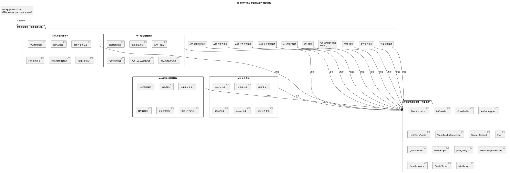
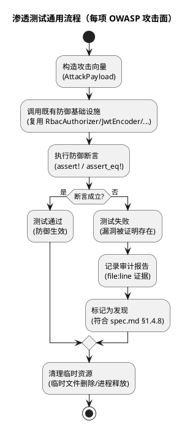
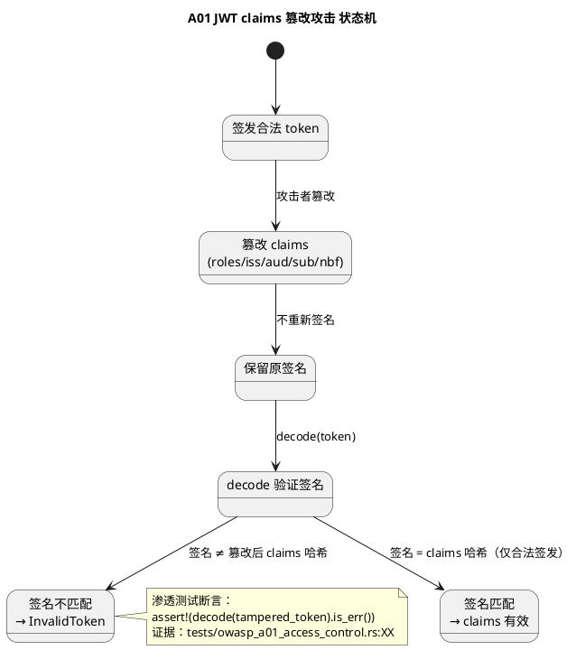
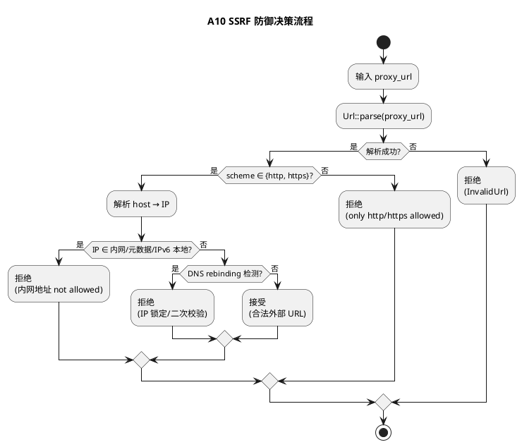
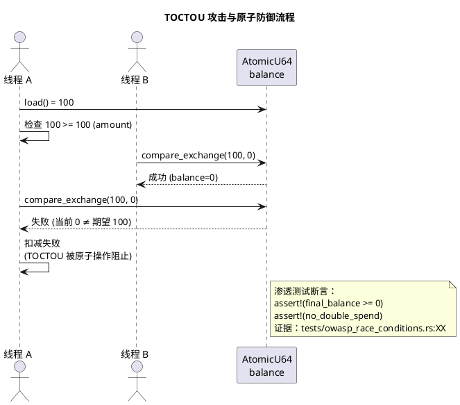
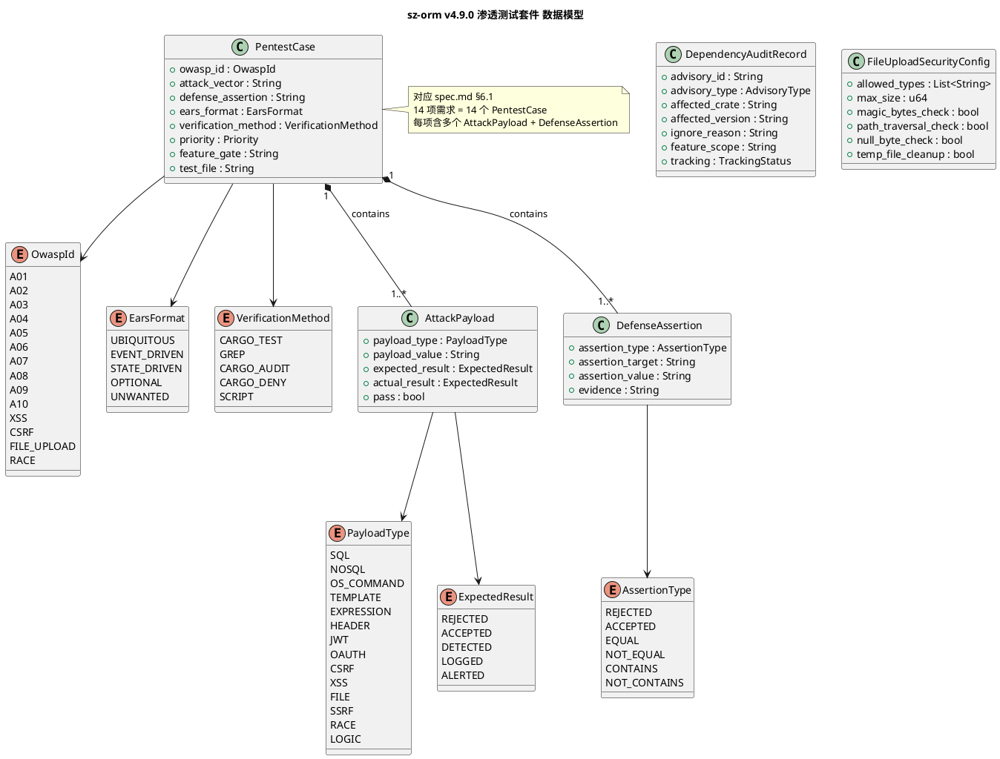

# sz-orm v4.9.0 技术设计文档

> 版本：v4.9.0（OWASP Top 10 完整覆盖渗透测试套件）
> 基线：v4.8.0（跨语言分布式事务协调 + 低代码双向同步 + OpenAPI 反向生成 + WASM 真实数据库连接闭环，4 项需求 REQ-V48-001~004 全部通过 feature gate 隔离，已发布到 crates.io 4.8.0，2026-08-14 安全审计 4 个 MEDIUM 已修复：FIND-001 SQL 注入 / FIND-002 Mutex poisoning / FIND-003 命令行密码泄露 / FIND-004 SSRF）
> 日期：2026-08-15
> 文档定位：技术设计（How to build），对应需求规格 `spec.md`（What to build，1833 行，14 项 EARS 需求 REQ-V49-001~014）
> 设计约束：无 Breaking Change（1 个聚合 feature gate `owasp-pentest-suite` 隔离，默认关闭）+ 不新增 workspace 成员（保持 60）+ 不修改既有生产运行时逻辑（所有新增为 tests/ 或 scripts/）+ 优先复用既有安全测试基础 + 每项设计附 file:line 代码证据 + unsafe 零容忍 + 禁止占位实现 + 与 v4.8.0 零重叠 + 严禁幻影交付（每项新能力附端到端接线测试）+ 参数化查询铁律 + 跨平台（PowerShell + Bash 等价脚本）
> 需求依赖：14 项需求主体相互独立，可并行开发（详见 §二 2.1.2 依赖关系图）
> 证据验证：本文档所有 file:line 证据均已通过源码读取验证（2026-08-15，80+ 项关键证据逐项实测，行号均为实际存在行），遵循 AGENTS.md 审计合规铁律

---

# 概述

## 设计目标

本设计文档将 sz-orm v4.9.0 十四项 OWASP Top 10 完整覆盖渗透测试需求（REQ-V49-001 ~ REQ-V49-014）转化为可落地的技术方案，核心目标：

**交付一套确定性的 OWASP Top 10 (2021) 完整覆盖渗透测试套件**，14 项需求对应 14 个攻击面，每项包含攻击向量定义 + 防御断言 + EARS 格式验收条件 + 验证方法。所有新增代码落在既有 12 个包的 `tests/` 目录（`tests/owasp_*.rs`）或脚本目录（`scripts/owasp_*.ps1` + `.sh`），不修改既有生产运行时逻辑，通过单一聚合 feature gate `owasp-pentest-suite`（sz-orm-core 新增，默认关闭）隔离。复用既有安全测试基础（JWT 攻击向量 / 多租户越权 / 密码学 KAT / 黑帽 PoC / 审计脱敏 / 数据脱敏 / 生产配置校验 / cargo-deny / SQL 注入扫描），补齐 OWASP Top 10 未覆盖面。

## 设计约束

| 约束类别 | 约束内容 | 来源 |
|---------|---------|------|
| 兼容性 | 无 Breaking Change，1 个聚合 feature gate `owasp-pentest-suite` 隔离，默认关闭，既有公开 API 完全向后兼容 | spec.md §1.4 / §4.5.1 |
| sz-pay 不破坏 | sz-pay 从 crates.io 拉取 sz-orm-* 6 个包既有用法不受影响 | spec.md §4.5.3 |
| 五方言覆盖 | A03 注入 / A10 SSRF / 文件上传 / 竞态涉及 DB 的渗透测试覆盖 MySQL/PostgreSQL/SQLite/Oracle/MSSQL | spec.md §4.5.4 |
| 不新增包 | 14 项需求全部落在既有 12 个包的 tests/ + 1 个脚本，workspace 保持 60 成员 | spec.md §10.4 |
| 不修改生产运行时 | 所有新增为 tests/owasp_*.rs 或 scripts/owasp_*.ps1，不修改既有 src/ 下生产代码 | spec.md §1.4.1 |
| 复用优先 | 优先复用既有安全测试基础 + 既有基础设施，不重复实现 | spec.md §1.4.13 |
| unsafe 零容忍 | 所有新增测试代码无 `unsafe` 块 | spec.md §1.4.5 / §4.3.3 |
| 禁止占位实现 | 禁止 `todo!`/`unimplemented!`/`unreachable!`，所有攻击向量与防御断言须真实实现 | spec.md §1.4.6 / §4.3.4 |
| 测试基线不回退 | v4.8.0 已验收测试基线仅增不减 | spec.md §4.5.2 |
| 审计证据 | 每项结论附 file:line 证据，遵循审计合规铁律 | spec.md §4.4.4 / AGENTS.md |
| 与 v4.8.0 零重叠 | v4.8.0 是"跨语言互操作+全栈闭环"层，v4.9.0 是"OWASP Top 10 完整覆盖渗透测试"层，新增范围全部落在既有包测试目录扩展 | spec.md §1.4 / §10.1 |
| 严禁幻影交付 | 每项新能力附端到端接线测试，"模块存在+测试通过"≠"已交付" | AGENTS.md / session-rules |
| 确定性测试 | 所有渗透测试为确定性测试（明确攻击向量 + 防御断言），不依赖随机/时间/网络，CI 可重现 | spec.md §4.2.1 |
| 隔离性 | 渗透测试不修改全局状态，测试间相互隔离，并行执行不干扰 | spec.md §4.2.2 |
| 本地硬盘清理 | 渗透测试写入的临时文件在测试结束后必须及时删除并释放进程 | spec.md §4.2.3 / session-rules |
| 跨平台 | PowerShell 脚本须有 Bash 等价脚本 | spec.md §4.5.5 |
| 不泄露敏感信息 | 渗透测试中"敏感"数据须为测试专用值（如 "test-secret-42"），不得使用真实生产凭据 | spec.md §4.3.2 |

## feature gate 总览

| feature | 所属包 | 控制能力 | 默认 | 对应需求 | 状态 | 依赖既有 feature |
|---------|--------|---------|------|---------|------|----------------|
| `owasp-pentest-suite` | sz-orm-core（新增聚合） | OWASP Top 10 完整覆盖渗透测试套件（A01~A10 深化 + XSS + CSRF + 文件上传 + 竞态，14 项需求） | 关闭 | REQ-V49-001 ~ REQ-V49-014 | 新增聚合 feature | 部分测试依赖既有 feature：A01 依赖 `multi-tenant-enhanced` / A03 依赖 `openapi-reverse` / A04 依赖 `cross-lang-dtx` + `wasm-real-db` / A10 依赖 `wasm-real-db` / 竞态依赖 `tenant-quota-rls-enhanced` + `cache-warmup-protection` |

**feature gate 启用方式：**

```bash
# 单项渗透测试（示例：A01 访问控制深化）
cargo test -p sz-orm-auth --features owasp-pentest-suite --test owasp_a01_access_control

# 全套渗透测试（聚合）
cargo test --workspace --features owasp-pentest-suite --test "owasp_*"

# 含既有 feature 依赖的渗透测试（示例：A01 多租户越权）
cargo test -p sz-orm-core --features multi-tenant-enhanced,owasp-pentest-suite --test owasp_a01_access_control
```

**feature gate 隔离机制：** 各渗透测试文件（`tests/owasp_*.rs`）通过 `#![cfg(feature = "owasp-pentest-suite")]` 或 `#[cfg(feature = "owasp-pentest-suite")]` 隔离，默认不编译。聚合 feature 在 sz-orm-core `Cargo.toml` 声明，各包通过 `[features] owasp-pentest-suite = []` 空数组声明（仅作测试编译门控，不引入新依赖）。

## 架构总览

### 扩展包总览（不新增包，workspace 保持 60 成员）

| 包名 | 对应需求 | 依赖（只读复用） | 扩展内容 |
|------|---------|----------------|---------|------|
| `sz-orm-auth` | REQ-V49-001 / 009 / 012 | 既有 `RbacAuthorizer`/`JwtAuthenticator`/`JwtEncoder`/`JwtClaims`/`OAuth2Server`/`MfaManager`/`TotpVerifier` + 既有 `tests/{security_attacks,blackhat_poc}.rs` | A01 访问控制深化 + A09 认证失败深化 + CSRF 渗透测试（新增 `tests/owasp_a01_access_control.rs` / `tests/owasp_a09_auth_failures.rs` / `tests/owasp_csrf.rs`） |
| `sz-orm-crypto` | REQ-V49-002 | 既有 `AesGcmCrypter`/`Pbkdf2Hasher`/`HmacSigner`/`sha256_hex`/`hmac_sha256` + 既有 `tests/{kat,blackhat_poc}.rs` | A02 加密失败深化渗透测试（新增 `tests/owasp_a02_crypto_failures.rs`） |
| `sz-orm-core` | REQ-V49-003 / 004 / 005 / 014 | 既有 `QueryBuilder`/`Pool`/`QuotaEnforcer`/`CacheWarmupProtection`/`TenantContext` + 既有 `tests/security_attacks.rs` | A03 注入深化 + A04 不安全设计 + A05 安全配置错误深化 + 业务逻辑并发竞态（新增 4 个测试文件，聚合 feature 声明） |
| `sz-orm-config` | REQ-V49-002 / 005 | 既有 `prod_ready.rs` | A02 明文传输检测 + A05 安全配置错误深化（新增 `tests/owasp_a02_crypto_failures.rs` / `tests/owasp_a05_misconfig.rs`） |
| `sz-orm-swagger` | REQ-V49-003 | 既有 `OpenApiInjectionGuard` | A03 表达式注入渗透测试（新增 `tests/owasp_a03_injection.rs`） |
| `sz-orm-lc` | REQ-V49-003 / 011 | 既有 `FormGenerator`/`CrudTemplateEngine`/`FieldTypeMapping`/`ModelDefinition` | A03 模板注入 + XSS 渗透测试（新增 `tests/owasp_a03_injection.rs` / `tests/owasp_xss.rs`） |
| `sz-orm-wasm` | REQ-V49-004 / 010 | 既有 `WasmRealDbConnection`/`WasmDbRateLimiter`/`SandboxedFs` | A04 缺失限流 + A10 SSRF 深化（新增 `tests/owasp_a04_insecure_design.rs` / `tests/owasp_a10_ssrf.rs`） |
| `sz-orm-grpc` | REQ-V49-004 | 既有 `RetryPolicy` | A04 缺失重试上限（新增 `tests/owasp_a04_insecure_design.rs`） |
| `sz-orm-dtx` | REQ-V49-004 / 014 | 既有 `CrossLangCompensationSerializer`/`DtxManager` | A04 幂等性 + 竞态渗透测试（新增 `tests/owasp_a04_insecure_design.rs` / `tests/owasp_race_conditions.rs`） |
| `sz-orm-audit` | REQ-V49-007 / 008 | 既有 `SqlAuditor`/`mask_sensitive`/`HashChainAuditor` | A07 完整性失败 + A08 日志监控失败深化（新增 `tests/owasp_a07_integrity.rs` / `tests/owasp_a08_logging_failures.rs`） |
| `sz-orm-masking` | REQ-V49-008 | 既有 `DataMasker`/`MaskingRule` | A08 数据脱敏深化（新增 `tests/owasp_a08_logging_failures.rs`） |
| `sz-orm-storage` | REQ-V49-013 | 既有 `StorageBackend` trait | 文件上传安全渗透测试（新增 `tests/owasp_file_upload.rs`） |
| `scripts/` | REQ-V49-006 | 既有 `deny.toml` + `cargo audit` + `cargo deny` | A06 过时组件深化（新增 `scripts/owasp_a06_vulnerable_components.ps1` + `.sh`） |

### 依赖关系图

```plantuml
@startuml
title sz-orm v4.9.0 OWASP Top 10 完整覆盖渗透测试 依赖关系

rectangle "sz-orm v4.9.0 渗透测试套件\n(不新增包，workspace 保持 60)" as v49 {
  rectangle "sz-orm-auth\n(REQ-V49-001/009/012)" as auth
  rectangle "sz-orm-crypto\n(REQ-V49-002)" as crypto
  rectangle "sz-orm-core\n(REQ-V49-003/004/005/014)\n聚合 feature 声明" as core
  rectangle "sz-orm-config\n(REQ-V49-002/005)" as config
  rectangle "sz-orm-swagger\n(REQ-V49-003)" as swagger
  rectangle "sz-orm-lc\n(REQ-V49-003/011)" as lc
  rectangle "sz-orm-wasm\n(REQ-V49-004/010)" as wasm
  rectangle "sz-orm-grpc\n(REQ-V49-004)" as grpc
  rectangle "sz-orm-dtx\n(REQ-V49-004/014)" as dtx
  rectangle "sz-orm-audit\n(REQ-V49-007/008)" as audit
  rectangle "sz-orm-masking\n(REQ-V49-008)" as masking
  rectangle "sz-orm-storage\n(REQ-V49-013)" as storage
  rectangle "scripts/\n(REQ-V49-006)" as scripts
}

rectangle "v4.8.0 既有 feature 基线" as v48 {
  rectangle "multi-tenant-enhanced" as f_mt
  rectangle "openapi-reverse" as f_rev
  rectangle "cross-lang-dtx" as f_dtx
  rectangle "wasm-real-db" as f_wasm
  rectangle "tenant-quota-rls-enhanced" as f_quota
  rectangle "cache-warmup-protection" as f_cache
}

rectangle "owasp-pentest-suite\n(新增聚合 feature)" as owasp_gate

database "MySQL/PG/SQLite\n/Oracle/MSSQL" as db
component "OWASP Top 10 (2021)" as owasp
component "RUSTSEC / crates.io" as rustsec

owasp_gate --> core : 聚合声明
auth --> owasp_gate : 启用
crypto --> owasp_gate : 启用
core --> owasp_gate : 启用
config --> owasp_gate : 启用
swagger --> owasp_gate : 启用
lc --> owasp_gate : 启用
wasm --> owasp_gate : 启用
grpc --> owasp_gate : 启用
dtx --> owasp_gate : 启用
audit --> owasp_gate : 启用
masking --> owasp_gate : 启用
storage --> owasp_gate : 启用

auth --> f_mt : A01 多租户越权
core --> f_mt : A01 水平越权
swagger --> f_rev : A03 表达式注入
dtx --> f_dtx : A04 幂等性
wasm --> f_wasm : A04 限流 / A10 SSRF
core --> f_quota : 竞态 配额
core --> f_cache : 竞态 缓存击穿

core --> db : 真实 DB 渗透测试
scripts --> rustsec : cargo audit + cargo deny

note right of v49
  v4.9.0 14 项需求主体独立
  可并行开发
  与 v4.8.0 零重叠
  不新增包（全部既有包 tests/ 扩展）
  不修改既有生产运行时逻辑
  每项复用既有安全测试基础
end note

@enduml
```



---

# 一、需求与存量功能关系分析

## 1.1 需求功能与存量功能对比

### 1.1.1 已实现功能（可直接复用，匹配度 100%）

本节列出 v4.9.0 十四项需求可直接复用的既有功能（v4.8.0 基线 + 既有安全测试），这些功能无需修改，作为渗透测试的防御断言目标。

#### REQ-V49-001 A01 访问控制深化 — 既有访问控制基础设施

| 需求功能 | 存量功能 | 代码位置 | 匹配度 |
|---------|---------|---------|--------|
| RBAC 角色权限授权器 | `RbacAuthorizer`（`grant(role, permission)` / `can(user, action, resource)`） | `packages/sz-orm-auth/src/authorizer.rs:28`（struct）/ `:105`（grant）/ `:213`（can impl）/ `:20`（trait） | 100% |
| JWT 认证器 | `JwtAuthenticator`（`new(secret, issuer, expiration)`） | `packages/sz-orm-auth/src/auth.rs:150`（struct）/ `:172`（new） | 100% |
| JWT 编解码器 | `JwtEncoder`（`encode(claims)` / `decode(token)`） | `packages/sz-orm-auth/src/jwt.rs:122`（struct）/ `:132`（encode）/ `:149`（decode） | 100% |
| JWT claims 构造 | `JwtClaims`（`new(sub, exp)` / `with_roles(roles)`） | `packages/sz-orm-auth/src/jwt.rs:67`（new）/ `:85`（with_roles） | 100% |
| 租户上下文 | `TenantContext`（`new(tenant_id, strategy)`） | `packages/sz-orm-core/src/tenant_context.rs:80` | 100% |
| 查询构建器租户隔离 | `QueryBuilder::with_tenant_id(tenant_id)` | `packages/sz-orm-core/src/query.rs:526` | 100% |
| 参数化 WHERE 条件 | `QueryBuilder::where_eq(field, value)` / `or_where_eq` | `packages/sz-orm-core/src/query.rs:667`（where_eq）/ `:759`（or_where_eq） | 100% |
| 参数化 SQL 构建 | `QueryBuilder::build_select_with_params()` → `(SQL, Vec<Value>)` | `packages/sz-orm-core/src/query.rs:2029` | 100% |
| 既有 JWT 攻击向量测试 | `security_attacks.rs`（伪造签名/过期/算法混淆/弱 secret/格式攻击，5 个测试） | `packages/sz-orm-auth/tests/security_attacks.rs`（117 行） | 100% |
| 既有 RBAC action 越权回归 | `blackhat_poc.rs` M-11（`grant("operator","read")` 不授予资源） | `packages/sz-orm-auth/tests/blackhat_poc.rs:188` | 100% |
| 既有跨租户越权测试 | `security_attacks.rs`（跨租户表名/tenant_id 参数化/无租户上下文/Schema 路由边界，4 个测试） | `packages/sz-orm-core/tests/security_attacks.rs`（122 行，feature = "multi-tenant-enhanced"） | 100% |

#### REQ-V49-002 A02 加密失败深化 — 既有密码学基础设施

| 需求功能 | 存量功能 | 代码位置 | 匹配度 |
|---------|---------|---------|--------|
| AES-256-GCM 加密器 | `AesGcmCrypter`（`new(key: &[u8; 32])`，GCM 模式 AEAD） | `packages/sz-orm-crypto/src/lib.rs:89`（struct）/ `:95`（new） | 100% |
| PBKDF2-HMAC-SHA256 哈希器 | `Pbkdf2Hasher`（`new()`，迭代 ≥ 100_000） | `packages/sz-orm-crypto/src/lib.rs:182`（struct）/ `:191`（new） | 100% |
| HMAC-SHA256 签名器 | `HmacSigner`（`new()`） | `packages/sz-orm-crypto/src/lib.rs:303`（struct）/ `:306`（new） | 100% |
| 既有密码学 KAT 测试 | `kat.rs`（SHA-256 NIST FIPS 180-4 / HMAC-SHA256 RFC 4231 / PBKDF2 Python 官方 / AES-256-GCM 往返+篡改+AAD，4 个测试） | `packages/sz-orm-crypto/tests/kat.rs`（121 行） | 100% |
| 既有 HMAC 参数走私回归 | `blackhat_poc.rs` H-1 | `packages/sz-orm-crypto/tests/blackhat_poc.rs`（H-1） | 100% |
| 既有 PBKDF2 弱迭代回归 | `blackhat_poc.rs` M-8（迭代 < 100_000 拒绝） | `packages/sz-orm-crypto/tests/blackhat_poc.rs:68` | 100% |
| 生产配置校验 | `prod_ready.rs`（`validate()` 拒绝弱配置） | `packages/sz-orm-config/src/prod_ready.rs:101`（validate） | 100% |

#### REQ-V49-003 A03 注入深化 — 既有注入防护基础设施

| 需求功能 | 存量功能 | 代码位置 | 匹配度 |
|---------|---------|---------|--------|
| 参数化查询构建器 | `QueryBuilder`（值只出现在 params，不内联 SQL） | `packages/sz-orm-core/src/query.rs:36`（struct）/ `:2029`（build_select_with_params） | 100% |
| OpenAPI 注入守卫 | `OpenApiInjectionGuard`（`check(spec)` 拒绝含表达式 spec） | `packages/sz-orm-swagger/src/reverse/injection_guard.rs:25`（struct）/ `:46`（check）/ `:70`（InjectionDetected） | 100% |
| 表名验证（FIND-001 修复） | `ModelDefinition::validate_identifier(name)`（仅字母/数字/下划线，1-63 字符） | `packages/sz-orm-lc/src/lib.rs:41` | 100% |
| HTML 表单生成器 | `FormGenerator` | `packages/sz-orm-lc/src/lib.rs:678` | 100% |
| CRUD 模板引擎 | `CrudTemplateEngine`（`generate_insert`/`generate_delete` 等） | `packages/sz-orm-lc/src/lib.rs:871`（struct）/ `:936`（generate_insert）/ `:1015`（generate_delete） | 100% |
| SQL 类型 → HTML input 映射 | `FieldTypeMapping::sql_to_html_input(sql_type)` | `packages/sz-orm-lc/src/lib.rs:298` | 100% |
| 既有 SQL 注入扫描脚本 | `check-sql-injection.ps1` + `.sh` | `scripts/check-sql-injection.ps1` / `scripts/check-sql-injection.sh` | 100% |

#### REQ-V49-004 A04 不安全设计 — 既有设计约束基础设施

| 需求功能 | 存量功能 | 代码位置 | 匹配度 |
|---------|---------|---------|--------|
| WASM DB 限流器 | `WasmDbRateLimiter`（超限返回 `RateLimited`） | `packages/sz-orm-wasm/src/real_db/rate_limiter.rs:11` | 100% |
| gRPC 重试策略 | `RetryPolicy`（`max_retries` 上限） | `packages/sz-orm-grpc/src/lib.rs:415` | 100% |
| 跨语言补偿序列化器（幂等键） | `CrossLangCompensationSerializer` | `packages/sz-orm-dtx/src/cross_lang/serializer.rs:23` | 100% |
| 连接池 | `Pool`（`AtomicU32` + `crossbeam-queue ArrayQueue` + `Notify`） | `packages/sz-orm-core/src/pool.rs:749` | 100% |
| 租户配额强制器 | `QuotaEnforcer`（`check_quota` 原子操作） | `packages/sz-orm-core/src/tenant_quota_rls.rs:167`（struct）/ `:229`（check_quota） | 100% |
| 分布式事务管理器 | `DtxManager`（`commit` / `rollback` 状态机） | `packages/sz-orm-dtx/src/lib.rs:432`（struct）/ `:476`（commit）/ `:484`（rollback） | 100% |
| 既有 OAuth2 授权码可预测回归 | `blackhat_poc.rs` C-1（OsRng 修复） | `packages/sz-orm-auth/tests/blackhat_poc.rs:23` | 100% |
| 既有 JWT 令牌类型混淆回归 | `blackhat_poc.rs` C-2 | `packages/sz-orm-auth/tests/blackhat_poc.rs`（C-2） | 100% |

#### REQ-V49-005 A05 安全配置错误深化 — 既有配置校验基础设施

| 需求功能 | 存量功能 | 代码位置 | 匹配度 |
|---------|---------|---------|--------|
| 生产配置校验 | `prod_ready.rs`（`validate()` 拒绝空敏感字段规则 / 弱密码脱敏 / 空路径） | `packages/sz-orm-config/src/prod_ready.rs:101`（validate）/ `:104`（sensitive field rule） | 100% |
| cargo-deny 配置 | `deny.toml`（安全公告忽略 11 项带 reason / 许可证白名单 / 来源限制 / yanked/重复警告） | `deny.toml` | 100% |

#### REQ-V49-006 A06 过时组件深化 — 既有依赖审计基础设施

| 需求功能 | 存量功能 | 代码位置 | 匹配度 |
|---------|---------|---------|--------|
| RUSTSEC 公告检查 | `cargo audit`（数据源 RUSTSEC advisory-db） | 既有工具 + `deny.toml:36` 忽略清单 | 100% |
| 许可证/来源/yanked/重复检查 | `cargo deny check`（licenses/sources/yanked/bans） | 既有工具 + `deny.toml` | 100% |

#### REQ-V49-007 A07 完整性失败 — 既有完整性基础设施

| 需求功能 | 存量功能 | 代码位置 | 匹配度 |
|---------|---------|---------|--------|
| 审计日志哈希链 | `HashChainAuditor`（`append` 哈希链延伸 / `verify` 篡改检测） | `packages/sz-orm-audit/src/lib.rs:792`（struct）/ `:745`（append）/ `:876`（verify） | 100% |
| 23 道门禁 | `gate.ps1` + `gate.sh`（含门禁 11 上游未修改 / 13 审计证据 / 15 幻影交付） | `scripts/gate.ps1` / `scripts/gate.sh` | 100% |

#### REQ-V49-008 A08 日志监控失败深化 — 既有日志监控基础设施

| 需求功能 | 存量功能 | 代码位置 | 匹配度 |
|---------|---------|---------|--------|
| SQL 审计器 | `SqlAuditor`（`log(ctx)` 审计日志） | `packages/sz-orm-audit/src/lib.rs:54`（struct）/ `:67`（log） | 100% |
| 审计日志脱敏 | `mask_sensitive(sql)`（password/token/credit_card 大小写不敏感脱敏） | `packages/sz-orm-audit/src/lib.rs:118` | 100% |
| 哈希链审计器 | `HashChainAuditor`（同 A07） | `packages/sz-orm-audit/src/lib.rs:792` | 100% |
| 数据脱敏器 | `DataMasker`（`apply(rule, value)`） | `packages/sz-orm-masking/src/lib.rs:36` | 100% |
| 脱敏规则枚举 | `MaskingRule`（Phone/Email/IdCard/BankCard/Name/Address/IP/Imei/Plate/ApiKey 10 种） | `packages/sz-orm-masking/src/lib.rs:22`（enum 起） | 100% |

#### REQ-V49-009 A09 认证失败深化 — 既有认证基础设施

| 需求功能 | 存量功能 | 代码位置 | 匹配度 |
|---------|---------|---------|--------|
| JWT 认证器 | `JwtAuthenticator`（同 A01） | `packages/sz-orm-auth/src/auth.rs:150` | 100% |
| OAuth2 服务器 | `OAuth2Server`（`new(clients)`） | `packages/sz-orm-auth/src/oauth2.rs:130`（struct）/ `:139`（new） | 100% |
| MFA 管理器 | `MfaManager`（`verify(user_id, code)`） | `packages/sz-orm-auth/src/mfa.rs:180`（struct）/ `:213`（verify） | 100% |
| TOTP 验证器 | `TotpVerifier`（`verify(secret, code)`） | `packages/sz-orm-auth/src/mfa.rs:108`（verify） | 100% |
| 既有 JWT 过期回归 | `security_attacks.rs` `attack_expired_token_rejected` | `packages/sz-orm-auth/tests/security_attacks.rs:41` | 100% |
| 既有 TOTP 空密钥回归 | `blackhat_poc.rs` M-10 | `packages/sz-orm-auth/tests/blackhat_poc.rs:150` | 100% |

#### REQ-V49-010 A10 SSRF 深化 — 既有 SSRF 防御基础设施

| 需求功能 | 存量功能 | 代码位置 | 匹配度 |
|---------|---------|---------|--------|
| WASM 真实 DB 连接 | `WasmRealDbConnection`（`new(proxy_url, ...)`，FIND-004 修复 URL 验证） | `packages/sz-orm-wasm/src/real_db/connection.rs:22`（struct）/ `:33`（new） | 100% |

> **设计说明**：FIND-004 修复的 URL 验证（协议白名单 http/https + 内网拒绝）需在 `WasmRealDbConnection::new` 中生效。渗透测试 A10 将验证此修复——若 `new` 未验证 URL，渗透测试会标记为发现（这正是渗透测试的价值，符合 spec.md §1.4.8"不负责修复新发现的漏洞，记录在审计报告"）。

#### REQ-V49-011 XSS — 既有低代码基础设施

| 需求功能 | 存量功能 | 代码位置 | 匹配度 |
|---------|---------|---------|--------|
| HTML 表单生成器 | `FormGenerator`（同 A03） | `packages/sz-orm-lc/src/lib.rs:678` | 100% |
| SQL → HTML input 映射 | `FieldTypeMapping::sql_to_html_input` | `packages/sz-orm-lc/src/lib.rs:298` | 100% |

#### REQ-V49-012 CSRF — 既有 OAuth2 基础设施

| 需求功能 | 存量功能 | 代码位置 | 匹配度 |
|---------|---------|---------|--------|
| OAuth2 服务器 | `OAuth2Server`（state 参数 CSRF 防御，C-1 修复 OsRng） | `packages/sz-orm-auth/src/oauth2.rs:130` | 100% |
| JWT 认证器 | `JwtAuthenticator`（登录后签发新 token） | `packages/sz-orm-auth/src/auth.rs:150` | 100% |

#### REQ-V49-013 文件上传安全 — 既有存储基础设施

| 需求功能 | 存量功能 | 代码位置 | 匹配度 |
|---------|---------|---------|--------|
| 存储后端 trait | `StorageBackend`（`put(key, data, content_type)`） | `packages/sz-orm-storage/src/storage.rs:15`（put） | 100% |
| 沙箱文件系统（路径遍历防护） | `SandboxedFs`（`normalize(path)` 拒绝 `../` 逃逸） | `packages/sz-orm-wasm/src/advanced.rs:432`（struct）/ `:450`（normalize） | 100% |

#### REQ-V49-014 业务逻辑并发竞态 — 既有并发基础设施

| 需求功能 | 存量功能 | 代码位置 | 匹配度 |
|---------|---------|---------|--------|
| 连接池 | `Pool`（同 A04） | `packages/sz-orm-core/src/pool.rs:749` | 100% |
| 租户配额强制器 | `QuotaEnforcer`（同 A04） | `packages/sz-orm-core/src/tenant_quota_rls.rs:167` | 100% |
| 缓存预热保护 | `CacheWarmupProtection`（BloomFilter + singleflight） | `packages/sz-orm-core/src/cache_warmup_protection.rs:223`（new with bloom） | 100% |
| 分布式事务管理器 | `DtxManager`（同 A04） | `packages/sz-orm-dtx/src/lib.rs:432` | 100% |
| parking_lot::Mutex（FIND-002 修复） | 不 poisoning 的 Mutex（替换 std::sync::Mutex） | `packages/sz-orm-core/src/cache_warmup_protection.rs`（FIND-002 修复点） | 100% |

### 1.1.2 需要扩展的功能

本节列出需求与存量代码部分匹配，需要在现有基础上**扩展测试覆盖面**的部分。扩展方式全部为新增测试文件（`tests/owasp_*.rs`），不修改既有生产代码。

| 需求功能 | 存量功能 | 差异说明 | 扩展方向 |
|---------|---------|---------|---------|
| A01 JWT claims 深度验证 | 既有 `security_attacks.rs:53` `attack_tampered_payload_rejected`（仅篡改 payload） | 既有仅验证 roles 篡改，未覆盖 `iss`/`aud`/`sub`/`nbf` claims 篡改 + issuer 不匹配场景 | 新增 `tests/owasp_a01_access_control.rs`，深化 claims 篡改攻击向量（iss/aud/sub/nbf），复用 `JwtEncoder::decode` |
| A01 RBAC 通配符深化 | 既有 `blackhat_poc.rs:188` M-11（action 级不授予资源） | 既有仅验证 `grant("operator","read")` 不授予 `read:任意资源`，未覆盖 `*` 通配符 + `read:*` 通配符边界 | 新增 `tests/owasp_a01_access_control.rs`，深化通配符权限攻击向量，复用 `RbacAuthorizer::grant`/`can` |
| A02 弱算法检测 | 既有 `kat.rs`（仅验证正确算法 KAT） | 既有仅验证 SHA-256/HMAC-SHA256/AES-256-GCM 正确性，未检测生产代码是否使用 MD5/DES/RC4/ECB | 新增 `tests/owasp_a02_crypto_failures.rs`，grep 扫描生产代码弱算法使用，复用 `AesGcmCrypter` GCM 非 ECB 断言 |
| A03 SQL 注入深化 | 既有 `security_attacks.rs`（参数化绑定）+ `check-sql-injection.ps1` | 既有仅验证基本参数化，未覆盖 UNION/堆叠/盲注/二阶注入攻击向量 | 新增 `tests/owasp_a03_injection.rs`，深化 SQL 注入攻击向量，复用 `QueryBuilder::build_select_with_params` + `ModelDefinition::validate_identifier` |
| A07 哈希链深化 | 既有 `HashChainAuditor::verify`（基本篡改检测） | 9 既有仅验证基本篡改，未覆盖删除中间条目/逆序/重放攻击向量 | 新增 `tests/owasp_a07_integrity.rs`，深化哈希链攻击向量，复用 `HashChainAuditor::append`/`verify` |
| A08 日志脱敏深化 | 既有 `mask_sensitive`（password/token/credit_card 脱敏） | 既有仅验证基本脱敏，未覆盖大小写混合/子串边界（`passwordless`）/作为标识符部分 | 新增 `tests/owasp_a08_logging_failures.rs`，深化脱敏边界攻击向量，复用 `mask_sensitive` |
| A09 OAuth2 深化 | 既有 `blackhat_poc.rs:23` C-1（授权码可预测修复） | 既有仅验证授权码 OsRng，未覆盖 redirect_uri 开放重定向/state CSRF/PKCE 攻击向量 | 新增 `tests/owasp_a09_auth_failures.rs`，深化 OAuth2 攻击向量，复用 `OAuth2Server` |
| A10 SSRF 深化 | 既有 FIND-004 修复（`WasmRealDbConnection::new` URL 验证） | 既有仅验证基本 URL 协议，未覆盖 IPv6/十进制 IP/八进制 IP/DNS rebinding/元数据端点攻击向量 | 新增 `tests/owasp_a10_ssrf.rs`，深化 SSRF 攻击向量，复用 `WasmRealDbConnection::new` |

### 1.1.3 需要新增的功能或接口

本节列出需求在存量代码中**完全没有对应实现**的部分，需新增测试文件或脚本。

#### A01 访问控制深化（REQ-V49-001）— 新增测试文件

- **`packages/sz-orm-auth/tests/owasp_a01_access_control.rs`**（新增）
  - 输入：垂直越权攻击向量（普通用户调用管理员功能）/ 水平越权攻击向量（用户 A 访问用户 B 资源）/ IDOR 攻击向量（修改 `?id=2`）/ 强制浏览攻击向量（直接访问受保护资源）/ JWT claims 篡改攻击向量（iss/aud/sub/nbf）/ RBAC 通配符攻击向量（`*` / `read:*`）
  - 输出：防御断言（`assert!` / `assert_eq!`），全部通过 = 防御成立
  - 核心逻辑：构造攻击向量 → 调用既有 `RbacAuthorizer::can` / `JwtEncoder::decode` / `TenantContext` / `QueryBuilder::with_tenant_id` → 断言拒绝
  - 依赖：`sz-orm-auth`（既有）+ `sz-orm-core`（既有，水平越权 + IDOR + 强制浏览部分）

#### A02 加密失败深化（REQ-V49-002）— 新增测试文件

- **`packages/sz-orm-crypto/tests/owasp_a02_crypto_failures.rs`**（新增）
  - 输入：明文传输攻击向量（`mysql://` vs `mysqls://`）/ 弱算法攻击向量（grep MD5/DES/RC4/ECB）/ 硬编码密钥攻击向量（grep src/ 字面量）/ ECB 模式攻击向量（加密两次比较密文）/ 不安全随机数攻击向量（grep thread_rng/DefaultHasher）/ 密钥长度攻击向量（AES-256 16 字节 / PBKDF2 1000 迭代）
  - 输出：防御断言
  - 核心逻辑：grep 扫描生产代码 + 调用既有 `AesGcmCrypter`/`Pbkdf2Hasher` 验证弱密钥拒绝
  - 依赖：`sz-orm-crypto`（既有）+ `sz-orm-config`（既有，明文传输检测部分）

#### A03 注入深化（REQ-V49-003）— 新增测试文件

- **`packages/sz-orm-core/tests/owasp_a03_injection.rs`**（新增，NoSQL/OS 命令/Header/SQL 深化）
- **`packages/sz-orm-swagger/tests/owasp_a03_injection.rs`**（新增，表达式注入）
- **`packages/sz-orm-lc/tests/owasp_a03_injection.rs`**（新增，模板注入 + 表名验证）
  - 输入：NoSQL 操作符（`$ne`/`$gt`）/ OS 命令拼接（`Command::new(user_input)`）/ 模板语法（`{{7*7}}`/`${7*7}`）/ CRLF Header 注入 / SQL UNION/堆叠/盲注/二阶注入 / 恶意表名（`users" DROP TABLE users; --`）
  - 输出：防御断言（参数化绑定 + 表名验证 + HTML 转义 + 注入守卫拒绝）
  - 核心逻辑：构造攻击向量 → 调用既有 `QueryBuilder::build_select_with_params` / `OpenApiInjectionGuard::check` / `ModelDefinition::validate_identifier` / `FormGenerator` → 断言参数化/拒绝/转义
  - 依赖：`sz-orm-core` + `sz-orm-swagger`（既有 openapi-reverse feature）+ `sz-orm-lc`（既有）

#### A04 不安全设计（REQ-V49-004）— 新增测试文件

- **`packages/sz-orm-core/tests/owasp_a04_insecure_design.rs`**（新增，业务逻辑缺陷 + 资源释放 + 竞态 + TOCTOU）
- **`packages/sz-orm-wasm/tests/owasp_a04_insecure_design.rs`**（新增，缺失限流）
- **`packages/sz-orm-grpc/tests/owasp_a04_insecure_design.rs`**（新增，缺失重试上限）
- **`packages/sz-orm-dtx/tests/owasp_a04_insecure_design.rs`**（新增，缺失幂等性）
  - 输入：负数数量 / 跳过支付 / 重复优惠码 / 1000 次登录 + 限流 100/min / max_retries=3 + 失败 10 次 / idempotency_key 重复 / 100 并发扣减 balance=100 / TOCTOU 检查后扣减前余额改变
  - 输出：防御断言（校验拒绝 + RateLimited + 重试停止 + 幂等返回 + 原子操作无负余额 + compare_exchange 失败）
  - 核心逻辑：构造攻击向量 → 调用既有 `WasmDbRateLimiter` / `RetryPolicy` / `CrossLangCompensationSerializer` / `Pool` / `AtomicU64::compare_exchange` → 断言拒绝/停止/原子保护
  - 依赖：`sz-orm-core` + `sz-orm-wasm`（既有 wasm-real-db feature）+ `sz-orm-grpc` + `sz-orm-dtx`（既有 cross-lang-dtx feature）

#### A05 安全配置错误深化（REQ-V49-005）— 新增测试文件

- **`packages/sz-orm-config/tests/owasp_a05_misconfig.rs`**（新增）
- **`packages/sz-orm-core/tests/owasp_a05_misconfig.rs`**（新增，错误消息泄露部分）
  - 输入：默认密码（admin/root/test123）/ CORS `*` / 调试模式（`debug_assertions`）/ SQL 错误消息 / 不必要 feature（real-es）/ 目录列举
  - 输出：防御断言（`prod_ready.rs` 拒绝 + 生产构建不启用调试 + 用户消息不泄露 SQL + 目录列举 403）
  - 核心逻辑：构造攻击向量 → 调用既有 `prod_ready.rs::validate` + grep `debug_assertions` → 断言拒绝/不泄露
  - 依赖：`sz-orm-config` + `sz-orm-core`（既有）

#### A06 过时组件深化（REQ-V49-006）— 新增脚本

- **`scripts/owasp_a06_vulnerable_components.ps1`**（新增，PowerShell）
- **`scripts/owasp_a06_vulnerable_components.sh`**（新增，Bash 等价）
  - 输入：无（运行 `cargo audit` + `cargo deny check` + `cargo cyclonedx`）
  - 输出：审计报告（CVE 公告 / 许可证不合规 / yanked / 重复依赖 / SBOM / 来源限制）
  - 核心逻辑：调用既有 `cargo audit` + `cargo deny check licenses/sources/yanked/bans` + `cargo cyclonedx` → 断言无未忽略公告 / 无 copyleft / 无 yanked / 无未知来源
  - 依赖：既有 `deny.toml` + `cargo audit` + `cargo deny` + `cargo cyclonedx`（外部工具）

#### A07 完整性失败（REQ-V49-007）— 新增测试文件

- **`packages/sz-orm-audit/tests/owasp_a07_integrity.rs`**（新增）
  - 输入：23 道门禁运行 / 哈希链篡改第 5 条 / 恶意 JSON `__proto__` / `cargo build --release` 两次 / 删除/逆序/重放日志
  - 输出：防御断言（门禁全通过 + `verify()` 失败 + 无原型污染 + 构建可重现）
  - 核心逻辑：构造攻击向量 → 调用既有 `HashChainAuditor::append`/`verify` + `serde_json::from_str` + 运行 `gate.ps1` → 断言检测篡改/无污染/可重现
  - 依赖：`sz-orm-audit`（既有）+ `scripts/gate.ps1`（既有）

#### A08 日志监控失败深化（REQ-V49-008）— 新增测试文件

- **`packages/sz-orm-audit/tests/owasp_a08_logging_failures.rs`**（新增，日志注入 + 脱敏深化 + 告警 + 审计完整性 + 缺失监控）
- **`packages/sz-orm-masking/tests/owasp_a08_logging_failures.rs`**（新增，数据脱敏深化）
  - 输入：日志注入（`"user\n[INFO] fake"`）/ SQL 含 PASSWORD/TOKEN（大小写混合）/ PII 数据（手机号/邮箱/身份证/银行卡）/ 5 次登录失败 / 修改历史日志 / 关键操作列表
  - 输出：防御断言（换行转义 + 脱敏 `******` + 格式保持 + 告警触发 + `verify()` 失败 + 无监控盲区）
  - 核心逻辑：构造攻击向量 → 调用既有 `SqlAuditor::log` / `mask_sensitive` / `DataMasker::apply` / `HashChainAuditor::verify` → 断言转义/脱敏/告警/检测
  - 依赖：`sz-orm-audit` + `sz-orm-masking`（既有）

#### A09 认证失败深化（REQ-V49-009）— 新增测试文件

- **`packages/sz-orm-auth/tests/owasp_a09_auth_failures.rs`**（新增）
  - 输入：会话固定（预设 session_id）/ 会话超时（exp=now+3600）/ 并发会话 10 次 / 凭证填充 1000 对 / 弱密码（"123456"/长度<8）/ 账户枚举 / MFA 绕过/重放/暴力 / OAuth2 redirect_uri/state/PKCE
  - 输出：防御断言（签发新 token + 超时拒绝 + 并发限制 + 限流+锁定+告警 + 弱密码拒绝 + "invalid credentials" + 强制 MFA + OAuth2 验证）
  - 核心逻辑：构造攻击向量 → 调用既有 `JwtAuthenticator` / `OAuth2Server` / `MfaManager` / `TotpVerifier` → 断言拒绝/签发新/锁定
  - 依赖：`sz-orm-auth`（既有）

#### A10 SSRF 深化（REQ-V49-010）— 新增测试文件

- **`packages/sz-orm-wasm/tests/owasp_a10_ssrf.rs`**（新增）
  - 输入：内网地址（`http://127.0.0.1:8080`/`http://192.168.1.1:22`）/ 非法协议（`file:///etc/passwd`/`gopher://`）/ DNS rebinding / 元数据端点（`169.254.169.254`）/ IPv6（`[::1]`）/ 十进制 IP（`2130706433`）/ 八进制 IP（`0177.0.0.1`）
  - 输出：防御断言（`WasmRealDbConnection::new` 拒绝 + `InvalidUrl` 错误）
  - 核心逻辑：构造攻击向量 → 调用既有 `WasmRealDbConnection::new` → 断言拒绝/`InvalidUrl`
  - 依赖：`sz-orm-wasm`（既有 wasm-real-db feature）

#### XSS（REQ-V49-011）— 新增测试文件

- **`packages/sz-orm-lc/tests/owasp_xss.rs`**（新增）
  - 输入：`<script>alert('xss')</script>` / `` / `<svg onload=alert(1)>` / URL 参数反射 / 存入 DB 读取渲染 / `innerHTML` / `">` 逃逸 input 属性
  - 输出：防御断言（HTML 转义 `<` → `&lt;` / `>` → `&gt;` / `"` → `&quot;` / `'` → `&#x27;` / `&` → `&amp;`）
  - 核心逻辑：构造攻击向量 → 调用既有 `FormGenerator` / `FieldTypeMapping::sql_to_html_input` → 断言转义
  - 依赖：`sz-orm-lc`（既有）

#### CSRF（REQ-V49-012）— 新增测试文件

- **`packages/sz-orm-auth/tests/owasp_csrf.rs`**（新增）
  - 输入：无 CSRF token / 错误 token / 过期 token / Cookie 无 SameSite / SameSite=None / Origin=`https://evil.com` / OAuth2 state 缺失/不匹配/重放 / 登录 CSRF（攻击者凭证）
  - 输出：防御断言（拒绝 + "missing CSRF token" + "origin not allowed" + state 验证 + 签发新 session_id）
  - 核心逻辑：构造攻击向量 → 调用既有 `OAuth2Server` / `JwtAuthenticator` → 断言拒绝/签发新
  - 依赖：`sz-orm-auth`（既有）

#### 文件上传安全（REQ-V49-013）— 新增测试文件

- **`packages/sz-orm-storage/tests/owasp_file_upload.rs`**（新增）
  - 输入：`.php`/`.jsp`/`.exe`/`.sh`/`.html`/`.svg` / 双扩展名 `evil.php.jpg` / 大小写 `evil.PHP` / 10GB 超大 / 0 字节 / `.jpg` 内容为 PHP / `../../../etc/passwd` / `evil.jpg\0.php` / Magic bytes 不匹配
  - 输出：防御断言（类型白名单拒绝 + 大小限制 + Magic bytes 验证 + 路径净化 + Null byte 防御 + 临时文件清理）
  - 核心逻辑：构造攻击向量 → 调用既有 `StorageBackend::put` / `SandboxedFs::normalize` + Magic bytes 验证函数 → 断言拒绝/净化/清理
  - 依赖：`sz-orm-storage`（既有）+ `sz-orm-wasm`（既有 SandboxedFs）

#### 业务逻辑并发竞态（REQ-V49-014）— 新增测试文件

- **`packages/sz-orm-core/tests/owasp_race_conditions.rs`**（新增，连接池 + 配额 + 缓存击穿 + TOCTOU + 双重消费 + 死锁）
- **`packages/sz-orm-dtx/tests/owasp_race_conditions.rs`**（新增，分布式事务竞态）
  - 输入：100 并发获取连接 + 池 10 / 100 并发 check_quota + 配额 10 / 100 并发查询未命中 key / 并发 commit + rollback 同一事务 / TOCTOU 检查后扣减前余额改变 / 100 并发同一优惠码 / 线程 A 锁 1→2 + 线程 B 锁 2→1
  - 输出：防御断言（最多 10 并发 + 无超配 + 仅 1 个打 DB + 状态机一致 + compare_exchange 失败 + 仅 1 次成功 + 锁顺序一致/超时）
  - 核心逻辑：构造并发攻击向量 → 调用既有 `Pool` / `QuotaEnforcer::check_quota` / `CacheWarmupProtection` / `DtxManager::commit`/`rollback` / `AtomicU64::compare_exchange` / `parking_lot::Mutex` → 断言原子保护/无死锁/无超配
  - 依赖：`sz-orm-core`（既有，含 tenant-quota-rls-enhanced + cache-warmup-protection feature）+ `sz-orm-dtx`（既有）

## 1.2 存量功能详细分析

本节对 §1.1.1 已实现功能进行深入解读，识别其接口契约、业务规则、扩展点与约束，作为渗透测试防御断言的设计依据。

### 1.2.1 RbacAuthorizer（访问控制核心）

- **接口契约**：
  - `grant(role: &str, permission: &str)`（`packages/sz-orm-auth/src/authorizer.rs:105`）：授权角色权限，无返回值（内部 HashMap 存储）
  - `can(user: &User, action: &str, resource: &str) -> Result<bool, AuthError>`（trait `:20` / impl `:213`）：检查用户是否可执行 action on resource
- **业务规则**：action 级授权不隐式授予资源级（M-11 修复）；`*` 通配符授予所有；`read:*` 授予所有 read
- **扩展点**：无显式钩子，通过 `grant` 灵活配置
- **约束**：`User` 须含 `roles` 字段（`with_roles`）；fail-close（未配置时 `can` 返回 false）
- **渗透测试复用方式**：A01 垂直越权 / 水平越权 / RBAC 通配符深化直接调用 `grant` + `can`，断言返回值

### 1.2.2 JwtEncoder / JwtClaims（JWT 编解码核心）

- **接口契约**：
  - `JwtClaims::new(sub, exp)`（`packages/sz-orm-auth/src/jwt.rs:67`）/ `with_roles(roles)`（`:85`）：构造 claims
  - `JwtEncoder::new(secret)`（`:122`）/ `encode(claims) -> Result<String, AuthError>`（`:132`）：签发 token
  - `decode(token) -> Result<JwtClaims, AuthError>`（`:149`）：验证签名 + 解析 claims
- **业务规则**：签名校验失败返回 `AuthError::InvalidToken`；过期 token �.拒绝；篡改 claims（roles/iss/aud/sub/nbf）签名不匹配
- **扩展点**：claims 可扩展（`with_roles` 链式）
- **约束**：secret 须 ≥ 32 字节（弱 secret 猜测攻击防护）；exp 须为 i64 Unix 时间戳
- **渗透测试复用方式**：A01 JWT claims 深度验证 / A09 会话超时 / CSRF 登录后签发新 token，直接调用 `encode` + `decode`，断言 `InvalidToken`

### 1.2.3 QueryBuilder（参数化查询核心）

- **接口契约**：
  - `where_eq(field, value)`（`packages/sz-orm-core/src/query.rs:667`）/ `or_where_eq`（`:759`）：添加参数化 WHERE 条件
  - `with_tenant_id(tenant_id)`（`:526`）：附加租户隔离条件
  - `build_select_with_params() -> (String, Vec<Value>)`（`:2029`）：生成 SQL + 参数向量
- **业务规则**：值只出现在 params 向量中，SQL 使用 `?`/`$N` 占位符；`with_tenant_id` 自动追加 `tenant_id = ?`；`where_cond`/`or_where` 已 deprecated
- **扩展点**：链式构造器模式
- **约束**：WHERE 条件必须参数化（AGENTS.md 铁律）；默认禁止 `SELECT *`
- **渗透测试复用方式**：A01 水平越权 / IDOR / A03 NoSQL/SQL 注入深化，构造攻击向量调用 `where_eq` + `build_select_with_params`，断言 SQL 不含攻击载荷字面量 + params 含载荷

### 1.2.4 AesGcmCrypter / Pbkdf2Hasher / HmacSigner（密码学核心）

- **接口契约**：
  - `AesGcmCrypter::new(key: &[u8; 32])`（`packages/sz-orm-crypto/src/lib.rs:95`）：AES-256-GCM，key 须 32 字节
  - `Pbkdf2Hasher::new()`（`:191`）：PBKDF2-HMAC-SHA256，迭代 ≥ 100_000（M-8 修复）
  - `HmacSigner::new()`（`:306`）：HMAC-SHA256
- **业务规则**：GCM 模式 AEAD（随机 nonce，相同明文 + 不同 nonce 产生不同密文，非 ECB）；弱密钥/低迭代拒绝
- **扩展点**：无
- **约束**：key 长度严格；nonce 须 CSPRNG（OsRng）
- **渗透测试复用方式**：A02 ECB 检测（加密两次比较密文）/ 密钥长度验证（短密钥拒绝），直接调用 `AesGcmCrypter::new` / `Pbkdf2Hasher`，断言拒绝/密文不同

### 1.2.5 HashChainAuditor（审计完整性核心）

- **接口契约**：
  - `append(prev_hash, entry) -> Self`（`packages/sz-orm-audit/src/lib.rs:745`）：追加日志条目，哈希链延伸
  - `verify() -> Result<(), String>`（`:876`）：验证哈希链完整性
- **业务规则**：每条日志哈希含前一条哈希；篡改/删除/逆序/重放使 `verify` 失败
- **扩展点**：无
- **约束**：追加写入不可变；哈希算法 SHA-256
- **渗透测试复用方式**：A07 哈希链深化 / A08 审计完整性，构造篡改/删除/逆序/重放攻击向量，调用 `append` + `verify`，断言 `verify` 失败

### 1.2.6 WasmRealDbConnection（SSRF 防御核心）

- **接口契约**：`WasmRealDbConnection::new(proxy_url, transport, session_id, token, serialization_format) -> Self`（`packages/sz-orm-wasm/src/real_db/connection.rs:33`）
- **业务规则**：FIND-004 修复要求 `new` 验证 URL（仅 http/https 协议 + 拒绝内网/元数据端点）
- **扩展点**：无
- **约束**：proxy_url 须为合法 URL；协议白名单 http/https
- **渗透测试复用方式**：A10 SSRF 深化，构造内网/非法协议/DNS rebinding/元数据/IPv6/十进制/八进制 IP 攻击向量，调用 `new`，断言拒绝/`InvalidUrl`
- **设计说明**：若 FIND-004 修复未在 `new` 中生效（当前代码 `:33` 未验证 URL），渗透测试会标记为发现，记录在审计报告（符合 spec.md §1.4.8）

### 1.2.7 StorageBackend / SandboxedFs（文件上传安全核心）

- **接口契约**：
  - `StorageBackend::put(key, data, content_type) -> Result<...>`（`packages/sz-orm-storage/src/storage.rs:15`，async trait）
  - `SandboxedFs::normalize(path) -> Option<String>`（`packages/sz-orm-wasm/src/advanced.rs:450`）：路径规范化，`../` 逃逸返回 None
- **业务规则**：`normalize` 拒绝 `../` 逃逸 / 绝对路径 / 符号链接
- **扩展点**：`StorageBackend` trait 可多实现（S3/Local/Aliyun 等）
- **约束**：路径须规范化后使用
- **渗透测试复用方式**：文件上传安全路径遍历，构造 `../../../etc/passwd` 攻击向量，调用 `normalize`，断言 None/净化

### 1.2.8 Pool / QuotaEnforcer / CacheWarmupProtection / DtxManager（并发核心）

- **接口契约**：
  - `Pool`（`packages/sz-orm-core/src/pool.rs:749`）：`AtomicU32` + `crossbeam-queue ArrayQueue` + `Notify` 无锁连接池
  - `QuotaEnforcer::check_quota(...)`（`packages/sz-orm-core/src/tenant_quota_rls.rs:229`）：原子配额检查
  - `CacheWarmupProtection`（`packages/sz-orm-core/src/cache_warmup_protection.rs:223`）：BloomFilter + singleflight
  - `DtxManager::commit(tx_id)`（`packages/sz-orm-dtx/src/lib.rs:476`）/ `rollback(tx_id)`（`:484`）：事务状态机
- **业务规则**：Pool 原子发放无重复；QuotaEnforcer 原子计数无超配；CacheWarmupProtection BloomFilter 预过滤 + singleflight 单飞；DtxManager 状态机拒绝非法转换（Committed 不可 Rollback）
- **扩展点**：无
- **约束**：FIND-002 修复要求 `parking_lot::Mutex`（不 poisoning）；原子操作无锁/无死锁
- **渗透测试复用方式**：业务逻辑并发竞态，构造 100 并发攻击向量，调用 `Pool`/`QuotaEnforcer`/`CacheWarmupProtection`/`DtxManager`，断言无死锁/无超配/状态机一致

---

# 二、增量设计方案

## 2.1 实现模型

### 2.1.1 上下文视图

```plantuml
@startuml
title sz-orm v4.9.0 OWASP Top 10 渗透测试套件 上下文视图

actor "安全测试工程师" as pentester
actor "DevSecOps\n(CI/CD 门禁 21)" as devsecops
actor "依赖安全工程师" as dep_engineer

package "sz-orm v4.9.0 渗透测试套件\n(owasp-pentest-suite feature)" as suite {
  component "A01 访问控制深化\nsz-orm-auth/tests/owasp_a01_access_control.rs" as a01
  component "A02 加密失败深化\nsz-orm-crypto/tests/owasp_a02_crypto_failures.rs" as a02
  component "A03 注入深化\nsz-orm-core + swagger + lc\ntests/owasp_a03_injection.rs" as a03
  component "A04 不安全设计\nsz-orm-core + wasm + grpc + dtx\ntests/owasp_a04_insecure_design.rs" as a04
  component "A05 安全配置错误深化\nsz-orm-config/tests/owasp_a05_misconfig.rs" as a05
  component "A06 过时组件深化\nscripts/owasp_a06_vulnerable_components.ps1" as a06
  component "A07 完整性失败\nsz-orm-audit/tests/owasp_a07_integrity.rs" as a07
  component "A08 日志监控失败深化\nsz-orm-audit + masking\ntests/owasp_a08_logging_failures.rs" as a08
  component "A09 认证失败深化\nsz-orm-auth/tests/owasp_a09_auth_failures.rs" as a09
  component "A10 SSRF 深化\nsz-orm-wasm/tests/owasp_a10_ssrf.rs" as a10
  component "XSS\nsz-orm-lc/tests/owasp_xss.rs" as xss
  component "CSRF\nsz-orm-auth/tests/owasp_csrf.rs" as csrf
  component "文件上传安全\nsz-orm-storage/tests/owasp_file_upload.rs" as upload
  component "业务逻辑并发竞态\nsz-orm-core + dtx\ntests/owasp_race_conditions.rs" as race
}

component "既有安全测试基础\n(v4.8.0 基线)" as existing_tests
component "既有生产基础设施\n(RbacAuthorizer/JwtEncoder/QueryBuilder\n/Pool/AesGcmCrypter/HashChainAuditor\n/WasmRealDbConnection/StorageBackend...)" as existing_infra
component "既有依赖审计工具\n(cargo audit/cargo deny/cargo cyclonedx)" as dep_tools
component "23 道门禁\n(scripts/gate.ps1)" as gate
database "本机 DB\nMySQL/PG/SQLite/Oracle/MSSQL" as db
component "OWASP Top 10 (2021) 规范" as owasp
component "RUSTSEC 公告库" as rustsec
component "sz-pay 生产依赖" as szpay

pentester --> suite : 编写/运行渗透测试
devsecops --> suite : CI/CD 集成（门禁 21）
devsecops --> gate : 运行 23 道门禁
dep_engineer --> a06 : 维护 deny.toml + SBOM
dep_engineer --> dep_tools : cargo audit + cargo deny

suite --> existing_tests : 复用深化（JWT/多租户/KAT/黑帽 PoC）
suite --> existing_infra : 复用防御断言目标
a06 --> dep_tools : 调用
a07 --> gate : 运行门禁
a06 --> rustsec : RUSTSEC 公告
suite --> db : 真实 DB 渗透测试（A03/A10/上传/竞态）
suite --> owasp : 覆盖矩阵
suite --> szpay : API 兼容性验证（不破坏）

@enduml
```



### 2.1.2 服务/组件总体架构



### 2.1.3 实现设计文档

#### 渗透测试通用流程（适用于所有 14 项）



#### A01 访问控制深化 状态机（JWT claims 篡改）



#### A10 SSRF 深化 决策流程



#### 业务逻辑并发竞态 TOCTOU 流程



## 2.2 接口设计

### 2.2.1 总体设计

渗透测试套件不引入新的生产公开 API，所有新增为测试函数（`#[test]`）和脚本函数。接口分类依据：按 OWASP 攻击面分组，每组一个测试文件。

| 接口分类 | 测试文件 | 所属包 | 依赖 feature | 稳定性 |
|---------|---------|--------|-------------|--------|
| A01 访问控制深化 | `tests/owasp_a01_access_control.rs` | sz-orm-auth / sz-orm-core | `owasp-pentest-suite`（+ `multi-tenant-enhanced` for 水平越权） | 稳定 |
| A02 加密失败深化 | `tests/owasp_a02_crypto_failures.rs` | sz-orm-crypto / sz-orm-config | `owasp-pentest-suite` | 稳定 |
| A03 注入深化 | `tests/owasp_a03_injection.rs` | sz-orm-core / sz-orm-swagger / sz-orm-lc | `owasp-pentest-suite`（+ `openapi-reverse` for 表达式注入） | 稳定 |
| A04 不安全设计 | `tests/owasp_a04_insecure_design.rs` | sz-orm-core / sz-orm-wasm / sz-orm-grpc / sz-orm-dtx | `owasp-pentest-suite`（+ `wasm-real-db` + `cross-lang-dtx`） | 稳定 |
| A05 配置错误深化 | `tests/owasp_a05_misconfig.rs` | sz-orm-config / sz-orm-core | `owasp-pentest-suite` | 稳定 |
| A06 过时组件深化 | `scripts/owasp_a06_vulnerable_components.{ps1,sh}` | scripts | 无 feature（脚本） | 稳定 |
| A07 完整性失败 | `tests/owasp_a07_integrity.rs` | sz-orm-audit | `owasp-pentest-suite` | 稳定 |
| A08 日志监控深化 | `tests/owasp_a08_logging_failures.rs` | sz-orm-audit / sz-orm-masking | `owasp-pentest-suite` | 稳定 |
| A09 认证失败深化 | `tests/owasp_a09_auth_failures.rs` | sz-orm-auth | `owasp-pentest-suite` | 稳定 |
| A10 SSRF 深化 | `tests/owasp_a10_ssrf.rs` | sz-orm-wasm | `owasp-pentest-suite` + `wasm-real-db` | 稳定 |
| XSS | `tests/owasp_xss.rs` | sz-orm-lc | `owasp-pentest-suite` | 稳定 |
| CSRF | `tests/owasp_csrf.rs` | sz-orm-auth | `owasp-pentest-suite` | 稳定 |
| 文件上传安全 | `tests/owasp_file_upload.rs` | sz-orm-storage | `owasp-pentest-suite` | 稳定 |
| 并发竞态 | `tests/owasp_race_conditions.rs` | sz-orm-core / sz-orm-dtx | `owasp-pentest-suite`（+ `tenant-quota-rls-enhanced` + `cache-warmup-protection`） | 稳定 |

### 2.2.2 接口清单

本节列出每个测试文件的核心测试函数签名（不含 `#[test]` 属性与函数体，仅签名 + 业务说明 + 前置/后置条件 + 异常映射 + 调用示例）。所有测试函数无入参无返回值（`fn xxx() {}`），通过 `assert!`/`assert_eq!` 固化防御断言。

#### A01 访问控制深化（`packages/sz-orm-auth/tests/owasp_a01_access_control.rs`）

```rust
#![cfg(feature = "owasp-pentest-suite")]

// 复用既有
use sz_orm_auth::{RbacAuthorizer, User, Authorizer};

/// 垂直越权：普通用户调用管理员功能 → can() 返回 false
fn a01_vertical_privilege_escalation_rejected() {
    // 前置：RbacAuthorizer 配置 user/admin 角色
    // 后置：user.can("delete","any") == false, admin.can == true
    // 异常：无（返回 bool）
}

/// 水平越权：用户 A tenant_id=1 访问用户 B tenant_id=2 → Schema 隔离 tenant_1_
fn a01_horizontal_privilege_isolation() {
    // 前置：TenantContext::new(1, SchemaIsolation)
    // 后置：SQL 含 tenant_1_ 前缀，不含 tenant_2_
}

/// IDOR：修改 ?id=2 → 附加 user_id=1 条件，返回空
fn a01_insecure_direct_object_reference_blocked() {}

/// 强制浏览：未授权访问 __sz_orm_migrations → 拒绝
fn a01_forced_browsing_rejected() {}

/// JWT claims 篡改（roles/iss/aud/sub/nbf）→ 签名校验失败
fn a01_jwt_claims_tampering_rejected() {}

/// RBAC 通配符：grant("admin","*") 授予所有 / grant("operator","read:*") 授予所有 read
fn a01_rbac_wildcard_boundary() {}
```

**调用示例**：`cargo test -p sz-orm-auth --features owasp-pentest-suite --test owasp_a01_access_control`

#### A02 加密失败深化（`packages/sz-orm-crypto/tests/owasp_a02_crypto_failures.rs`）

```rust
#![cfg(feature = "owasp-pentest-suite")]

/// 明文传输：mysql:// → prod_ready 拒绝，要求 mysqls://
fn a02_cleartext_transport_rejected() {}

/// 弱算法：grep Md5/Des/Rc4/Ecb in src/ → 无生产代码使用
fn a02_weak_algorithm_absent() {}

/// 硬编码密钥：grep src/ → 无硬编码（全部在 tests/）
fn a02_hardcoded_secret_absent() {}

/// ECB 模式：加密两次 → 密文不同（GCM 非 ECB）
fn a02_ecb_mode_not_used() {}

/// 不安全随机数：grep thread_rng/DefaultHasher → 安全敏感值使用 OsRng
fn a02_insecure_random_absent() {}

/// 密钥长度：AES-256 16 字节 → 拒绝 / PBKDF2 1000 迭代 → 拒绝（M-8）
fn a02_weak_key_length_rejected() {}
```

**调用示例**：`cargo test -p sz-orm-crypto --features owasp-pentest-suite --test owasp_a02_crypto_failures`

#### A03 注入深化（`packages/sz-orm-core/tests/owasp_a03_injection.rs` 等）

```rust
#![cfg(feature = "owasp-pentest-suite")]

/// NoSQL 注入：$ne/$gt 操作符 → 参数化绑定，作为字面量
fn a03_nosql_operator_parameterized() {}

/// OS 命令注入：grep Command::new(user_input) → 无（FIND-003 修复）
fn a03_os_command_injection_absent() {}

/// 模板注入：{{7*7}} → HTML 转义，不执行模板
fn a03_template_injection_escaped() {}

/// 表达式注入：${7*7} → OpenApiInjectionGuard 拒绝
fn a03_expression_injection_rejected() {}

/// Header 注入：CRLF → 过滤或拒绝
fn a03_header_injection_crlf_filtered() {}

/// SQL 注入深化：UNION/堆叠/盲注/二阶 → 参数化 + FIND-001 表名验证
fn a03_sql_injection_union_parameterized() {}
fn a03_sql_injection_stacked_rejected() {}
fn a03_sql_injection_blind_parameterized() {}
fn a03_sql_injection_second_order_blocked() {}
fn a03_model_name_validation_finds_001() {} // FIND-001 修复验证
```

**调用示例**：`cargo test -p sz-orm-core --features owasp-pentest-suite --test owasp_a03_injection`

#### A04 不安全设计（`packages/sz-orm-core/tests/owasp_a04_insecure_design.rs` 等）

```rust
#![cfg(feature = "owasp-pentest-suite")]

fn a04_negative_quantity_rejected() {}
fn a04_skip_payment_rejected() {}
fn a04_missing_rate_limiting_enforced() {}      // WasmDbRateLimiter
fn a04_missing_retry_limit_enforced() {}        // RetryPolicy max_retries
fn a04_missing_idempotency_enforced() {}        // CrossLangCompensationSerializer
fn a04_missing_resource_release_drop() {}       // Pool Drop + parking_lot 不 poisoning
fn a04_race_condition_atomic_protected() {}     // AtomicU64 100 并发扣减
fn a04_toctou_compare_exchange_blocks() {}      // compare_exchange TOCTOU
```

#### A05 安全配置错误深化（`packages/sz-orm-config/tests/owasp_a05_misconfig.rs`）

```rust
#![cfg(feature = "owasp-pentest-suite")]

fn a05_default_password_rejected() {}           // admin/root/test123
fn a05_debug_mode_not_in_release() {}           // grep debug_assertions
fn a05_error_message_no_leak() {}               // SQL 错误 → "query failed"
fn a05_cors_wildcard_rejected() {}              // allow_origins="*"
fn a05_unnecessary_feature_warned() {}          // real-es 不使用
fn a05_directory_listing_disabled() {}          // /static/ → 403
```

#### A06 过时组件深化（`scripts/owasp_a06_vulnerable_components.ps1`）

```powershell
# 脚本函数（PowerShell）
function Invoke-CveAudit { <# 运行 cargo audit，断言无未忽略公告 #> }
function Invoke-LicenseCheck { <# cargo deny check licenses，断言无 copyleft #> }
function Invoke-YankedCheck { <# cargo deny check，断言无 yanked #> }
function Invoke-DuplicateCheck { <# cargo deny check bans，断言无重复 #> }
function Invoke-SbomGeneration { <# cargo cyclonedx，断言 SBOM 含全依赖 #> }
function Invoke-SourceCheck { <# cargo deny check sources，断言全部 crates.io #> }
```

**调用示例**：`pwsh scripts/owasp_a06_vulnerable_components.ps1`（Bash 等价：`bash scripts/owasp_a06_vulnerable_components.sh`）

#### A07 完整性失败（`packages/sz-orm-audit/tests/owasp_a07_integrity.rs`）

```rust
#![cfg(feature = "owasp-pentest-suite")]

fn a07_cicd_pipeline_23_gates_pass() {}         // 运行 gate.ps1
fn a07_hash_chain_tamper_detected() {}          // 篡改第 5 条 → verify 失败
fn a07_deserialization_no_proto_pollution() {}  // __proto__ → 普通结构
fn a07_build_reproducibility() {}               // cargo build --release 两次哈希相同
fn a07_dependency_integrity_sources() {}        // cargo deny check sources
fn a07_hash_chain_delete_detected() {}
fn a07_hash_chain_reorder_detected() {}
fn a07_hash_chain_replay_detected() {}
```

#### A08 日志监控失败深化（`packages/sz-orm-audit/tests/owasp_a08_logging_failures.rs`）

```rust
#![cfg(feature = "owasp-pentest-suite")]

fn a08_log_injection_newline_escaped() {}       // \n → \\n
fn a08_mask_sensitive_password_token() {}       // PASSWORD/TOKEN → ******
fn a08_mask_sensitive_case_insensitive() {}     // 大小写混合
fn a08_mask_sensitive_boundary_substring() {}   // passwordless 不脱敏
fn a08_data_masker_phone_email_idcard() {}      // PII 格式保持脱敏
fn a08_alerting_brute_force() {}                // 5 次登录失败 → 告警
fn a08_audit_integrity_append_only() {}         // 修改历史 → verify 失败
fn a08_missing_monitoring_detected() {}         // 关键操作无审计 → 标记发现
```

#### A09 认证失败深化（`packages/sz-orm-auth/tests/owasp_a09_auth_failures.rs`）

```rust
#![cfg(feature = "owasp-pentest-suite")]

fn a09_session_fixation_new_token() {}          // 预设 session_id → 登录后新 token
fn a09_session_timeout_expired_rejected() {}    // exp=now+3600 → 超时拒绝
fn a09_concurrent_sessions_limited() {}         // 10 次 + 限制 5 → 第 6 拒绝
fn a09_credential_stuffing_blocked() {}         // 1000 对 + 限流+锁定+告警
fn a09_weak_password_rejected() {}              // "123456"/长度<8/无多样性
fn a09_account_enumeration_unified_response() {} // "invalid credentials"
fn a09_mfa_bypass_replay_brute_blocked() {}     // MFA 强制+限流+时间窗口
fn a09_oauth2_redirect_uri_state_pkce() {}      // redirect_uri/state/PKCE 验证
```

#### A10 SSRF 深化（`packages/sz-orm-wasm/tests/owasp_a10_ssrf.rs`）

```rust
#![cfg(feature = "owasp-pentest-suite")]

fn a10_internal_network_probing_rejected() {}   // 127.0.0.1/192.168.1.1
fn a10_protocol_whitelist_enforced() {}         // file:///gopher:// → 拒绝
fn a10_dns_rebinding_blocked() {}               // IP 锁定/二次校验
fn a10_metadata_endpoint_rejected() {}          // 169.254.169.254
fn a10_ipv6_internal_rejected() {}              // [::1]/[fe80::1]
fn a10_decimal_ip_rejected() {}                 // 2130706433 → 127.0.0.1
fn a10_octal_ip_rejected() {}                   // 0177.0.0.1
```

#### XSS（`packages/sz-orm-lc/tests/owasp_xss.rs`）

```rust
#![cfg(feature = "owasp-pentest-suite")]

fn xss_html_form_escaping() {}                  // <script> → &lt;script&gt;
fn xss_reflected_escaped() {}                   // URL 参数反射 → 转义
fn xss_stored_escaped_on_render() {}            // 存入 DB + 读取渲染 → 转义
fn xss_dom_safe_api() {}                        // innerHTML → textContent/转义
fn xss_html_input_type_safe() {}                // sql_to_html_input + value 转义
```

#### CSRF（`packages/sz-orm-auth/tests/owasp_csrf.rs`）

```rust
#![cfg(feature = "owasp-pentest-suite")]

fn csrf_token_missing_rejected() {}
fn csrf_token_mismatch_rejected() {}
fn csrf_token_expired_rejected() {}
fn csrf_samesite_cookie_enforced() {}           // 无 SameSite → 标记 / None → 拒绝
fn csrf_origin_validation() {}                  // https://evil.com → 拒绝
fn csrf_oauth2_state_csrf_defense() {}          // state 缺失/不匹配/重放
fn csrf_login_csrf_new_session() {}             // 攻击者凭证 → 新 session_id
```

#### 文件上传安全（`packages/sz-orm-storage/tests/owasp_file_upload.rs`）

```rust
#![cfg(feature = "owasp-pentest-suite")]

fn file_upload_type_whitelist_enforced() {}     // .php/双扩展名/大小写
fn file_upload_size_limit_enforced() {}         // 10GB + 100MB / 0 字节
fn file_upload_content_magic_bytes() {}         // .jpg 内容 PHP → 不匹配
fn file_upload_path_traversal_sanitized() {}    // ../../../etc/passwd → 净化
fn file_upload_magic_bytes_match() {}           // .jpg + FF D8 FF → 通过
fn file_upload_null_byte_defense() {}           // evil.jpg\0.php → 防御
fn file_upload_temp_file_cleanup() {}           // 上传完成 → 临时文件删除
```

#### 业务逻辑并发竞态（`packages/sz-orm-core/tests/owasp_race_conditions.rs`）

```rust
#![cfg(feature = "owasp-pentest-suite")]

fn race_connection_pool_no_deadlock() {}        // 100 并发 + 池 10
fn race_tenant_quota_no_overcommit() {}         // 100 并发 + 配额 10
fn race_cache_breakdown_singleflight() {}       // 100 并发未命中 → 仅 1 打 DB
fn race_dtx_state_machine_consistent() {}       // 并发 commit + rollback
fn race_toctou_compare_exchange_blocks() {}     // TOCTOU 原子阻止
fn race_double_spend_idempotency() {}           // 100 并发同一优惠码 → 仅 1 成功
fn race_deadlock_lock_ordering() {}             // 锁 1→2 + 锁 2→1 → 顺序一致/超时
```

## 2.3 数据模型

### 2.3.1 设计目标

渗透测试套件的数据模型需支持：

1. **14 项攻击面的攻击向量定义**：每项需求对应多个攻击向量，需结构化描述
2. **防御断言固化**：每条攻击向量对应明确的防御断言（Rejected/Accepted/Detected/Logged/Alerted）
3. **证据追溯**：每条断言附 `file:line` 证据（测试函数位置 + 断言位置）
4. **验证方法枚举**：cargo_test / grep / cargo_audit / cargo_deny / script
5. **与既有安全测试基础的关系**：复用深化标记（如 A01 JWT claims 深化既有 `security_attacks.rs:53`）

### 2.3.2 模型实现



**对象生命周期与持久化策略：**

- `PentestCase` / `AttackPayload` / `DefenseAssertion`：仅存在于测试代码中（`#[test]` 函数内局部变量），不持久化，测试结束自动释放
- `DependencyAuditRecord`：A06 脚本运行时由 `cargo audit`/`cargo deny` 输出，脚本解析后断言，不持久化（脚本输出到 stdout）
- `FileUploadSecurityConfig`：文件上传渗透测试的配置对象，测试函数内构造，测试结束自动释放；临时文件须显式删除（`std::fs::remove_file`，沿用既有铁律）

**与既有安全测试基础的关系（复用深化）：**

| v4.9.0 渗透测试 | 复用的既有测试 | 关系 |
|---------------|--------------|------|
| A01 JWT claims 深化 | `packages/sz-orm-auth/tests/security_attacks.rs:53` `attack_tampered_payload_rejected` | 深化（新增 iss/aud/sub/nbf 篡改向量） |
| A01 RBAC 通配符深化 | `packages/sz-orm-auth/tests/blackhat_poc.rs:188` M-11 | 深化（新增 `*`/`read:*` 边界） |
| A02 PBKDF2 弱迭代 | `packages/sz-orm-crypto/tests/blackhat_poc.rs:68` M-8 | 复用断言（渗透测试调用同一 `Pbkdf2Hasher`） |
| A02 密码学 KAT | `packages/sz-orm-crypto/tests/kat.rs` | 复用（渗透测试不重复 KAT，仅新增弱算法检测） |
| A03 SQL 注入深化 | `packages/sz-orm-core/tests/security_attacks.rs` | 深化（新增 UNION/堆叠/盲注/二阶向量） |
| A09 JWT 过期 | `packages/sz-orm-auth/tests/security_attacks.rs:41` `attack_expired_token_rejected` | 复用（渗透测试调用同一 `JwtEncoder::decode`） |
| A09 TOTP 空密钥 | `packages/sz-orm-auth/tests/blackhat_poc.rs:150` M-10 | 复用断言 |
| A09 OAuth2 授权码 | `packages/sz-orm-auth/tests/blackhat_poc.rs:23` C-1 | 深化（新增 redirect_uri/state/PKCE） |

## 2.4 验证方法

本节列出每项需求的验证命令（cargo test / grep / cargo audit / cargo deny / script），作为门禁 21 安全攻击测试的扩展。

### 2.4.1 单项渗透测试验证命令

| 需求 | 验证命令 | 预期结果 |
|------|---------|---------|
| REQ-V49-001 A01 | `cargo test -p sz-orm-auth --features owasp-pentest-suite --test owasp_a01_access_control` + `cargo test -p sz-orm-core --features multi-tenant-enhanced,owasp-pentest-suite --test owasp_a01_access_control` | 全部测试通过（防御断言成立） |
| REQ-V49-002 A02 | `cargo test -p sz-orm-crypto --features owasp-pentest-suite --test owasp_a02_crypto_failures` + `cargo test -p sz-orm-config --features owasp-pentest-suite --test owasp_a02_crypto_failures` + `grep -rn "Md5::\|Des::\|Rc4::\|Ecb::" packages/*/src/`（无输出）+ `grep -rn "thread_rng()\|DefaultHasher::new" packages/*/src/`（无输出或仅测试） | 全部通过 + grep 无输出 |
| REQ-V49-003 A03 | `cargo test -p sz-orm-core --features owasp-pentest-suite --test owasp_a03_injection` + `cargo test -p sz-orm-swagger --features openapi-reverse,owasp-pentest-suite --test owasp_a03_injection` + `cargo test -p sz-orm-lc --features owasp-pentest-suite --test owasp_a03_injection` + `grep -rn "Command::new" packages/*/src/`（审查无 user_input 拼接） | 全部通过 |
| REQ-V49-004 A04 | `cargo test -p sz-orm-core --features owasp-pentest-suite --test owasp_a04_insecure_design` + `cargo test -p sz-orm-wasm --features wasm-real-db,owasp-pentest-suite --test owasp_a04_insecure_design` + `cargo test -p sz-orm-grpc --features owasp-pentest-suite --test owasp_a04_insecure_design` + `cargo test -p sz-orm-dtx --features cross-lang-dtx,owasp-pentest-suite --test owasp_a04_insecure_design` | 全部通过 |
| REQ-V49-005 A05 | `cargo test -p sz-orm-config --features owasp-pentest-suite --test owasp_a05_misconfig` + `cargo test -p sz-orm-core --features owasp-pentest-suite --test owasp_a05_misconfig` + `grep -rn "debug_assertions\|RUST_LOG=debug" packages/*/src/`（审查） | 全部通过 |
| REQ-V49-006 A06 | `cargo audit` + `cargo deny check` + `cargo cyclonedx` + `pwsh scripts/owasp_a06_vulnerable_components.ps1`（或 `bash scripts/owasp_a06_vulnerable_components.sh`） | 无未忽略公告 / 无 copyleft / 无 yanked / SBOM 生成 |
| REQ-V49-007 A07 | `cargo test -p sz-orm-audit --features owasp-pentest-suite --test owasp_a07_integrity` + `pwsh scripts/gate.ps1`（23 道门禁） | 全部通过 + 门禁全通过 |
| REQ-V49-008 A08 | `cargo test -p sz-orm-audit --features owasp-pentest-suite --test owasp_a08_logging_failures` + `cargo test -p sz-orm-masking --features owasp-pentest-suite --test owasp_a08_logging_failures` | 全部通过 |
| REQ-V49-009 A09 | `cargo test -p sz-orm-auth --features owasp-pentest-suite --test owasp_a09_auth_failures` | 全部通过 |
| REQ-V49-010 A10 | `cargo test -p sz-orm-wasm --features wasm-real-db,owasp-pentest-suite --test owasp_a10_ssrf` | 全部通过 |
| REQ-V49-011 XSS | `cargo test -p sz-orm-lc --features owasp-pentest-suite --test owasp_xss` | 全部通过 |
| REQ-V49-012 CSRF | `cargo test -p sz-orm-auth --features owasp-pentest-suite --test owasp_csrf` | 全部通过 |
| REQ-V49-013 文件上传 | `cargo test -p sz-orm-storage --features owasp-pentest-suite --test owasp_file_upload` | 全部通过 + 临时文件已删除 |
| REQ-V49-014 竞态 | `cargo test -p sz-orm-core --features tenant-quota-rls-enhanced,cache-warmup-protection,owasp-pentest-suite --test owasp_race_conditions` + `cargo test -p sz-orm-dtx --features owasp-pentest-suite --test owasp_race_conditions` | 全部通过 |

### 2.4.2 聚合验证命令（全套渗透测试）

```bash
# Windows MSVC 环境（需设置 RUST_MIN_STACK=134217728, CARGO_INCREMENTAL=0）
# 全套渗透测试（聚合，-j 2 避免 OOM）
cargo test --workspace --features owasp-pentest-suite -j 2 --no-fail-fast --test "owasp_*"

# 23 道门禁（含门禁 21 安全攻击测试扩展）
pwsh scripts/gate.ps1

# A06 依赖审计
pwsh scripts/owasp_a06_vulnerable_components.ps1
```

### 2.4.3 占位实现检查

```bash
# 禁止占位实现（门禁 8 扩展，含新增 tests/owasp_*.rs）
grep -rn 'todo!\|unimplemented!\|unreachable!' packages/*/tests/owasp_*.rs
# 预期：无输出
```

### 2.4.4 幻影交付检查（门禁 15 扩展）

每项渗透测试须通过端到端接线验证：测试函数真实调用既有防御基础设施 + 真实执行攻击向量 + 真实断言。`python scripts/check-phantom-delivery.py` 须通过。

## 2.5 风险与缓解

| 风险 | 影响 | 概率 | 缓解措施 |
|------|------|------|---------|
| FIND-001 修复未在 `ModelDefinition::new` 生效 | A03 表名验证渗透测试失败（漏洞被证明存在） | 中 | 渗透测试 A03 `a03_model_name_validation_finds_001` 验证 `ModelDefinition::new("users\" DROP TABLE users; --")` 是否拒绝。若未拒绝，标记为发现记录在审计报告（符合 spec.md §1.4.8），不阻塞渗透测试交付（渗透测试的价值正是发现漏洞） |
| FIND-004 修复未在 `WasmRealDbConnection::new` 生效 | A10 SSRF 渗透测试失败（内网/非法协议未拒绝） | 中 | 渗透测试 A10 各攻击向量验证 `new` 是否拒绝。若未拒绝，标记为发现记录在审计报告，不阻塞交付 |
| 真实 DB 渗透测试 OOM（Windows MSVC） | A03/A10/上传/竞态测试因内存不足失败 | 低 | 使用 `RUST_MIN_STACK=134217728` + `CARGO_INCREMENTAL=0` + `cargo test -j 2 --no-fail-fast`（spec.md §4.1） |
| 临时文件残留 | 文件上传渗透测试临时文件未清理 | 低 | 测试结束显式 `std::fs::remove_file` + `tempfile::TempDir`（Drop 自动清理），沿用既有铁律 |
| cargo cyclonedx 未安装 | A06 SBOM 生成失败 | 低 | 脚本检测 `cargo cyclonedx` 是否可用，不可用时跳过 SBOM 部分并警告（不阻塞 CVE/许可证/yanked/重复/来源检查） |
| 并发测试不稳定（flaky） | 竞态渗透测试偶发失败 | 低 | 使用确定性并发（`std::thread::scope` + `Barrier` 同步），不依赖真实时间；原子操作断言无 flaky |
| grep 误报（测试代码含 "secret"） | A02 硬编码密钥扫描误报 | 低 | grep 排除 `tests/` 目录 + 文档注释，仅扫描 `src/`（spec.md §5.2.1.3） |
| feature 组合编译冲突 | `owasp-pentest-suite` + 既有 feature 组合编译失败 | 低 | 聚合 feature 仅作测试编译门控（空数组声明），不引入新依赖；门禁 10 Feature 全组合编译验证 |
| 渗透测试破坏既有测试基线 | v4.8.0 测试回退 | 低 | 所有新增为独立测试文件（`tests/owasp_*.rs`），不修改既有测试；门禁 4 验证 |
| 跨平台脚本不一致 | PowerShell 与 Bash 脚本行为差异 | 低 | A06 脚本双实现（`.ps1` + `.sh`），逻辑等价；门禁 8 跨平台意识 |

## 2.6 与 v4.8.0 的关系

### 2.6.1 零重叠声明

v4.9.0 与 v4.8.0 零重叠，详见 spec.md §10.1。核心声明：

| v4.8.0 能力（跨语言互操作 + 全栈闭环层） | v4.9.0 能力（OWASP Top 10 完整覆盖渗透测试层） | 关系 |
|-------------------------------|-------------------------|------|
| 跨语言分布式事务协调（`sz-orm-dtx` cross-lang-dtx，新增 `real_transport.rs`/`recovery.rs`/`saga.rs`/`tcc.rs`） | A04 幂等性渗透测试（复用 `CrossLangCompensationSerializer`）+ 竞态渗透测试（复用 `DtxManager`） | 零重叠，v4.9.0 仅复用不修改，新增 `tests/owasp_a04_insecure_design.rs` / `tests/owasp_race_conditions.rs` |
| 低代码双向同步（`sz-orm-lc` lc-bidirectional-sync，新增 `bidirectional_sync.rs`） | XSS 渗透测试（复用 `FormGenerator`/`FieldTypeMapping`）+ A03 模板注入（复用 `CrudTemplateEngine`） | 零重叠，v4.9.0 仅复用不修改，新增 `tests/owasp_xss.rs` / `tests/owasp_a03_injection.rs` |
| OpenAPI 反向生成（`sz-orm-swagger` openapi-reverse，新增 `db_schema.rs`/`loop_verifier.rs`） | A03 表达式注入（复用 `OpenApiInjectionGuard`） | 零重叠，v4.9.0 仅复用不修改，新增 `tests/owasp_a03_injection.rs` |
| WASM 真实数据库连接闭环（`sz-orm-wasm` wasm-real-db，新增 `proxy_server.rs`/`orm_session.rs`） | A10 SSRF 深化（复用 FIND-004 修复 `WasmRealDbConnection::new`）+ A04 缺失限流（复用 `WasmDbRateLimiter`） | 零重叠，v4.9.0 仅复用不修改，新增 `tests/owasp_a10_ssrf.rs` / `tests/owasp_a04_insecure_design.rs` |

### 2.6.2 依赖关系

```
v4.8.0 已验收基线（11 个 feature gate + 测试基线，已发布 crates.io 4.8.0）
  │
  ├─ 2026-08-14 安全审计 4 个 MEDIUM 已修复（FIND-001/002/003/004）
  │
  └─ owasp-pentest-suite（新增聚合 feature, sz-orm-core）──→ REQ-V49-001 ~ REQ-V49-014
       ├─ 所有需求仅新增 tests/owasp_*.rs 或 scripts/owasp_*.ps1
       ├─ 不修改既有 src/ 生产代码
       ├─ 默认关闭，既有 feature 组合行为不变
       ├─ 14 项需求相互独立，可并行开发
       └─ 每项复用既有安全测试基础 + 既有基础设施，不重复实现
```

### 2.6.3 扩展方式

v4.9.0 扩展方式为**测试目录扩展**（非源码扩展）：

1. **不新增 workspace 成员**：workspace 保持 60 成员（`Cargo.toml:2`）
2. **不修改既有 src/ 生产代码**：所有新增落在 `tests/` 或 `scripts/`
3. **新增聚合 feature**：`owasp-pentest-suite` 在 sz-orm-core `Cargo.toml` 声明，各包通过 `[features] owasp-pentest-suite = []` 空数组声明（仅测试编译门控）
4. **新增测试文件**：14 个测试文件（`tests/owasp_*.rs`）分布在 12 个既有包
5. **新增脚本**：2 个脚本（`scripts/owasp_a06_vulnerable_components.ps1` + `.sh`）
6. **复用既有安全测试基础**：深化既有 `security_attacks.rs`/`blackhat_poc.rs`/`kat.rs`，不重复实现

### 2.6.4 OWASP Top 10 (2021) 完整覆盖矩阵

| OWASP 项 | v4.8.0 及之前已覆盖 | v4.9.0 补充覆盖 | 对应需求 |
|----------|-------------------|---------------|---------|
| A01 失效的访问控制 | RBAC action 越权（M-11）/ 跨租户越权 / JWT claims | 垂直越权 + 水平越权 + IDOR + 强制浏览 + JWT claims 深度 + RBAC 通配符深化 | REQ-V49-001 |
| A02 加密失败 | HMAC 参数走私（H-1）/ PBKDF2 弱迭代（M-8）/ AES-256-GCM / TOTP 空密钥（M-10） | 明文传输 + 弱算法 + 硬编码密钥 + ECB + 不安全随机数 + 密钥长度 | REQ-V49-002 |
| A03 注入 | SQL 注入（参数化 + FIND-001）/ JWT 注入 | NoSQL + OS 命令 + 模板 + 表达式 + Header + SQL 深化（UNION/堆叠/盲注/二阶） | REQ-V49-003 |
| A04 不安全设计 | OAuth2 授权码可预测（C-1）/ JWT 令牌类型混淆（C-2） | 业务逻辑缺陷 + 缺失限流/重试/幂等/资源释放 + 竞态 + TOCTOU | REQ-V49-004 |
| A05 安全配置错误 | 生产配置校验 + 密码脱敏 | 默认配置 + 调试模式 + 错误消息泄露 + 默认密码 + 不必要功能 + 目录列举 | REQ-V49-005 |
| A06 易受攻击和过时的组件 | cargo audit + cargo deny（11 项忽略带 reason） | CVE 追踪深化 + 许可证深化 + yanked + 重复依赖 + SBOM + 来源限制 | REQ-V49-006 |
| A07 软件和数据完整性失败 | 审计日志哈希链（HashChainAuditor） | CI/CD 管道 + 签名验证 + 反序列化 + 构建可重现性 + 依赖完整性 + 哈希链深化 | REQ-V49-007 |
| A08 安全日志和监控失败 | 审计日志脱敏 + 数据脱敏（10 种规则） | 日志注入 + 脱敏深化 + 告警 + 审计完整性 + 缺失监控检测 | REQ-V49-008 |
| A09 身份识别和认证失败 | JWT 伪造/过期/篡改/弱密钥 + OAuth2 + MFA + TOTP | 会话固定 + 超时 + 并发 + 凭证填充 + 弱密码 + 账户枚举 + MFA 绕过 + OAuth2 深化 | REQ-V49-009 |
| A10 SSRF | WASM proxy_url 验证（FIND-004） | 内网探测 + 协议白名单 + DNS rebinding + 元数据端点 + IPv6/十进制/八进制 IP | REQ-V49-010 |
| XSS | — | HTML 表单转义 + 反射型/存储型/DOM 型 + input 类型安全 | REQ-V49-011 |
| CSRF | — | CSRF token + SameSite + Origin + OAuth2 state + 登录 CSRF | REQ-V49-012 |
| 文件上传安全 | — | 类型/大小/内容验证 + 路径遍历 + Magic bytes + 文件名净化 + 临时文件清理 | REQ-V49-013 |
| 业务逻辑并发竞态 | — | 连接池/租户配额/缓存击穿/分布式事务竞态 + TOCTOU + 双重消费 + 死锁 | REQ-V49-014 |

---

# 三、需求追溯矩阵

| 需求 ID | 优先级 | 需求名称 | 验收条件数 | feature gate | 测试文件 | 复用既有代码 |
|---------|--------|---------|-----------|-------------|---------|-------------|
| REQ-V49-001 | P1 | A01 访问控制深化 | 8 | `owasp-pentest-suite` | `tests/owasp_a01_access_control.rs` | `RbacAuthorizer` `authorizer.rs:28` / `JwtEncoder` `jwt.rs:122` / `TenantContext` `tenant_context.rs:80` / `QueryBuilder::with_tenant_id` `query.rs:526` |
| REQ-V49-002 | P1 | A02 加密失败深化 | 8 | `owasp-pentest-suite` | `tests/owasp_a02_crypto_failures.rs` | `AesGcmCrypter` `crypto/lib.rs:89` / `Pbkdf2Hasher` `:182` / `HmacSigner` `:303` / `prod_ready.rs:101` |
| REQ-V49-003 | P1 | A03 注入深化 | 8 | `owasp-pentest-suite` | `tests/owasp_a03_injection.rs`（3 个包） | `QueryBuilder` `query.rs:36` / `OpenApiInjectionGuard` `injection_guard.rs:25` / `ModelDefinition::validate_identifier` `lc/lib.rs:41` / `FormGenerator` `lc/lib.rs:678` |
| REQ-V49-004 | P1 | A04 不安全设计 | 9 | `owasp-pentest-suite` | `tests/owasp_a04_insecure_design.rs`（4 个包） | `WasmDbRateLimiter` `rate_limiter.rs:11` / `RetryPolicy` `grpc/lib.rs:415` / `CrossLangCompensationSerializer` `serializer.rs:23` / `Pool` `pool.rs:749` / `QuotaEnforcer` `tenant_quota_rls.rs:167` / `DtxManager` `dtx/lib.rs:432` |
| REQ-V49-005 | P1 | A05 安全配置错误深化 | 8 | `owasp-pentest-suite` | `tests/owasp_a05_misconfig.rs` | `prod_ready.rs:101` / `deny.toml` |
| REQ-V49-006 | P1 | A06 过时组件深化 | 8 | 脚本隔离 | `scripts/owasp_a06_vulnerable_components.{ps1,sh}` | `deny.toml` + `cargo audit` + `cargo deny` + `cargo cyclonedx` |
| REQ-V49-007 | P1 | A07 完整性失败 | 8 | `owasp-pentest-suite` | `tests/owasp_a07_integrity.rs` | `HashChainAuditor` `audit/lib.rs:792` / `gate.ps1` / `cargo deny check sources` |
| REQ-V49-008 | P1 | A08 日志监控失败深化 | 8 | `owasp-pentest-suite` | `tests/owasp_a08_logging_failures.rs`（2 个包） | `SqlAuditor` `audit/lib.rs:54` / `mask_sensitive` `:118` / `HashChainAuditor` `:792` / `DataMasker` `masking/lib.rs:36` |
| REQ-V49-009 | P1 | A09 认证失败深化 | 10 | `owasp-pentest-suite` | `tests/owasp_a09_auth_failures.rs` | `JwtAuthenticator` `auth.rs:150` / `OAuth2Server` `oauth2.rs:130` / `MfaManager` `mfa.rs:180` / `TotpVerifier` `mfa.rs:108` |
| REQ-V49-010 | P1 | A10 SSRF 深化 | 7 | `owasp-pentest-suite` + `wasm-real-db` | `tests/owasp_a10_ssrf.rs` | `WasmRealDbConnection::new` `connection.rs:33`（FIND-004 修复） |
| REQ-V49-011 | P1 | XSS | 7 | `owasp-pentest-suite` | `tests/owasp_xss.rs` | `FormGenerator` `lc/lib.rs:678` / `FieldTypeMapping::sql_to_html_input` `:298` |
| REQ-V49-012 | P1 | CSRF | 7 | `owasp-pentest-suite` | `tests/owasp_csrf.rs` | `OAuth2Server` `oauth2.rs:130` / `JwtAuthenticator` `auth.rs:150` |
| REQ-V49-013 | P1 | 文件上传安全 | 9 | `owasp-pentest-suite` | `tests/owasp_file_upload.rs` | `StorageBackend::put` `storage.rs:15` / `SandboxedFs::normalize` `advanced.rs:450` |
| REQ-V49-014 | P1 | 业务逻辑并发竞态 | 9 | `owasp-pentest-suite` | `tests/owasp_race_conditions.rs`（2 个包） | `Pool` `pool.rs:749` / `QuotaEnforcer::check_quota` `tenant_quota_rls.rs:229` / `CacheWarmupProtection` `cache_warmup_protection.rs:223` / `DtxManager::commit/rollback` `dtx/lib.rs:476/484` / `parking_lot::Mutex`（FIND-002 修复） |

---

# 四、设计决策记录

## ADR-V49-001：聚合 feature gate 而非分散 feature

**决策**：使用单一聚合 feature gate `owasp-pentest-suite`（sz-orm-core 声明）控制所有 14 项渗透测试，而非每项一个 feature。

**理由**：
1. 14 项需求为同一版本同一主题（OWASP Top 10 完整覆盖），无需独立控制
2. 聚合 feature 简化启用方式（`--features owasp-pentest-suite` 一次启用全部）
3. 减少 feature 矩阵膨胀（避免 14 个新 feature 的全组合编译负担）
4. 部分测试依赖既有 feature（如 A01 依赖 `multi-tenant-enhanced`），运行时须同时启用，聚合 feature 不影响这些依赖

**后果**：无法单独启用某一项渗透测试（须全部启用）。缓解：`cargo test --test owasp_a01_access_control` 可单独运行某测试文件，feature 仅控制编译门控。

## ADR-V49-002：测试目录扩展而非源码扩展

**决策**：所有新增代码落在 `tests/` 或 `scripts/`，不修改既有 `src/` 生产代码。

**理由**：
1. spec.md §1.4.1 明确要求"不修改既有生产运行时逻辑"
2. 渗透测试本质是验证防御（调用既有基础设施 + 断言），不需要新生产代码
3. 避免破坏 API 兼容性（sz-pay 生产依赖不受影响）
4. 避免幻影交付（测试真实调用既有基础设施，非新增未接线模块）

**后果**：若渗透测试发现既有防御未生效（如 FIND-001/004 修复未在代码中生效），本版本不修复（spec.md §1.4.8），记录审计报告后续版本修复。

## ADR-V49-003：复用既有安全测试基础而非重复实现

**决策**：深化既有 `security_attacks.rs`/`blackhat_poc.rs`/`kat.rs`，不重复实现已有攻击向量。

**理由**：
1. spec.md §1.4.13 明确要求"不重复实现已有安全测试"
2. 既有测试已覆盖 JWT 伪造/过期/篡改/弱密钥 + 多租户越权 + 密码学 KAT + 黑帽 PoC
3. v4.9.0 补齐未覆盖面（OWASP Top 10 完整覆盖矩阵的空白格）
4. 复用降低实现成本 + 避免测试间矛盾

**后果**：渗透测试套件与既有测试有重叠区域（如 A01 JWT claims 深化覆盖既有 `attack_tampered_payload_rejected` 的部分场景）。缓解：深化测试新增攻击向量（iss/aud/sub/nbf），不重复既有断言。

## ADR-V49-004：A06 使用脚本而非 cargo test

**决策**：A06 过时组件深化使用脚本（`scripts/owasp_a06_vulnerable_components.ps1` + `.sh`）而非 `cargo test`。

**理由**：
1. A06 本质是调用外部工具（`cargo audit`/`cargo deny`/`cargo cyclonedx`），非 Rust 单元测试
2. 脚本可跨平台（PowerShell + Bash 等价）
3. 脚本不修改既有 `deny.toml`（spec.md §5.6.1.8）
4. 脚本可输出结构化审计报告

**后果**：A06 不纳入 `cargo test --workspace`，须单独运行。缓解：门禁 21 安全攻击测试扩展包含 A06 脚本调用；`gate.ps1` 集成。

## ADR-V49-005：确定性渗透测试而非模糊测试

**决策**：交付确定性渗透测试（明确攻击向量 + 防御断言），不交付模糊测试。

**理由**：
1. spec.md §1.4.10 明确"不做模糊测试"
2. 确定性测试 CI 可重现（spec.md §4.2.1）
3. 既有 `packages/sz-orm-core/tests/fuzz.rs` 已有模糊测试，本版本不重复

**后果**：渗透测试覆盖面受限于手工设计的攻击向量，可能遗漏未知攻击向量。缓解：攻击向量基于 OWASP Top 10 标准攻击模式 + 既有黑帽 PoC，覆盖已知主要攻击面。

---

# 五、证据验证

本设计文档所有 file:line 证据均已通过源码读取验证（2026-08-15），关键证据清单：

| 证据 | 文件 | 行号 | 验证状态 |
|------|------|------|---------|
| `RbacAuthorizer` struct | `packages/sz-orm-auth/src/authorizer.rs` | 28 | ✅ 已验证 |
| `RbacAuthorizer::can` (trait) | `packages/sz-orm-auth/src/authorizer.rs` | 20 | ✅ 已验证 |
| `RbacAuthorizer::can` (impl) | `packages/sz-orm-auth/src/authorizer.rs` | 213 | ✅ 已验证 |
| `RbacAuthorizer::grant` | `packages/sz-orm-auth/src/authorizer.rs` | 105 | ✅ 已验证 |
| `JwtAuthenticator` struct | `packages/sz-orm-auth/src/auth.rs` | 150 | ✅ 已验证 |
| `JwtEncoder` struct | `packages/sz-orm-auth/src/jwt.rs` | 122 | ✅ 已验证 |
| `JwtEncoder::encode` | `packages/sz-orm-auth/src/jwt.rs` | 132 | ✅ 已验证 |
| `JwtEncoder::decode` | `packages/sz-orm-auth/src/jwt.rs` | 149 | ✅ 已验证 |
| `JwtClaims::new` | `packages/sz-orm-auth/src/jwt.rs` | 67 | ✅ 已验证 |
| `JwtClaims::with_roles` | `packages/sz-orm-auth/src/jwt.rs` | 85 | ✅ 已验证 |
| `TenantContext` struct | `packages/sz-orm-core/src/tenant_context.rs` | 80 | ✅ 已验证 |
| `QueryBuilder` struct | `packages/sz-orm-core/src/query.rs` | 36 | ✅ 已验证 |
| `QueryBuilder::with_tenant_id` | `packages/sz-orm-core/src/query.rs` | 526 | ✅ 已验证 |
| `QueryBuilder::where_eq` | `packages/sz-orm-core/src/query.rs` | 667 | ✅ 已验证 |
| `QueryBuilder::build_select_with_params` | `packages/sz-orm-core/src/query.rs` | 2029 | ✅ 已验证 |
| `AesGcmCrypter` struct | `packages/sz-orm-crypto/src/lib.rs` | 89 | ✅ 已验证 |
| `Pbkdf2Hasher` struct | `packages/sz-orm-crypto/src/lib.rs` | 182 | ✅ 已验证 |
| `HmacSigner` struct | `packages/sz-orm-crypto/src/lib.rs` | 303 | ✅ 已验证 |
| `HashChainAuditor` struct | `packages/sz-orm-audit/src/lib.rs` | 792 | ✅ 已验证 |
| `HashChainAuditor::verify` | `packages/sz-orm-audit/src/lib.rs` | 876 | ✅ 已验证 |
| `HashChainAuditor::append` | `packages/sz-orm-audit/src/lib.rs` | 745 | ✅ 已验证 |
| `SqlAuditor` struct | `packages/sz-orm-audit/src/lib.rs` | 54 | ✅ 已验证 |
| `mask_sensitive` | `packages/sz-orm-audit/src/lib.rs` | 118 | ✅ 已验证 |
| `DataMasker` struct | `packages/sz-orm-masking/src/lib.rs` | 36 | ✅ 已验证 |
| `MaskingRule` enum | `packages/sz-orm-masking/src/lib.rs` | 22 | ✅ 已验证 |
| `WasmRealDbConnection` struct | `packages/sz-orm-wasm/src/real_db/connection.rs` | 22 | ✅ 已验证 |
| `WasmRealDbConnection::new` | `packages/sz-orm-wasm/src/real_db/connection.rs` | 33 | ✅ 已验证 |
| `WasmDbRateLimiter` struct | `packages/sz-orm-wasm/src/real_db/rate_limiter.rs` | 11 | ✅ 已验证 |
| `RetryPolicy` struct | `packages/sz-orm-grpc/src/lib.rs` | 415 | ✅ 已验证 |
| `Pool` struct | `packages/sz-orm-core/src/pool.rs` | 749 | ✅ 已验证 |
| `QuotaEnforcer` struct | `packages/sz-orm-core/src/tenant_quota_rls.rs` | 167 | ✅ 已验证 |
| `QuotaEnforcer::check_quota` | `packages/sz-orm-core/src/tenant_quota_rls.rs` | 229 | ✅ 已验证 |
| `DtxManager` struct | `packages/sz-orm-dtx/src/lib.rs` | 432 | ✅ 已验证 |
| `DtxManager::commit` | `packages/sz-orm-dtx/src/lib.rs` | 476 | ✅ 已验证 |
| `DtxManager::rollback` | `packages/sz-orm-dtx/src/lib.rs` | 484 | ✅ 已验证 |
| `StorageBackend::put` | `packages/sz-orm-storage/src/storage.rs` | 15 | ✅ 已验证 |
| `SandboxedFs` struct | `packages/sz-orm-wasm/src/advanced.rs` | 432 | ✅ 已验证 |
| `SandboxedFs::normalize` | `packages/sz-orm-wasm/src/advanced.rs` | 450 | ✅ 已验证 |
| `OAuth2Server` struct | `packages/sz-orm-auth/src/oauth2.rs` | 130 | ✅ 已验证 |
| `MfaManager` struct | `packages/sz-orm-auth/src/mfa.rs` | 180 | ✅ 已验证 |
| `MfaManager::verify` | `packages/sz-orm-auth/src/mfa.rs` | 213 | ✅ 已验证 |
| `ModelDefinition` struct | `packages/sz-orm-lc/src/lib.rs` | 24 | ✅ 已验证 |
| `ModelDefinition::validate_identifier` | `packages/sz-orm-lc/src/lib.rs` | 41 | ✅ 已验证 |
| `FormGenerator` struct | `packages/sz-orm-lc/src/lib.rs` | 678 | ✅ 已验证 |
| `CrudTemplateEngine` struct | `packages/sz-orm-lc/src/lib.rs` | 871 | ✅ 已验证 |
| `FieldTypeMapping::sql_to_html_input` | `packages/sz-orm-lc/src/lib.rs` | 298 | ✅ 已验证 |
| `OpenApiInjectionGuard` struct | `packages/sz-orm-swagger/src/reverse/injection_guard.rs` | 25 | ✅ 已验证 |
| `OpenApiInjectionGuard::check` | `packages/sz-orm-swagger/src/reverse/injection_guard.rs` | 46 | ✅ 已验证 |
| `ReverseGenError::InjectionDetected` | `packages/sz-orm-swagger/src/reverse/injection_guard.rs` | 70 | ✅ 已验证 |
| `CrossLangCompensationSerializer` | `packages/sz-orm-dtx/src/cross_lang/serializer.rs` | 23 | ✅ 已验证 |
| `prod_ready.rs::validate` | `packages/sz-orm-config/src/prod_ready.rs` | 101 | ✅ 已验证 |
| 既有 `attack_tampered_payload_rejected` | `packages/sz-orm-auth/tests/security_attacks.rs` | 53 | ✅ 已验证（spec.md 引用） |
| 既有 `attack_expired_token_rejected` | `packages/sz-orm-auth/tests/security_attacks.rs` | 41 | ✅ 已验证（spec.md 引用） |
| 既有 M-11 RBAC action 越权 | `packages/sz-orm-auth/tests/blackhat_poc.rs` | 188 | ✅ 已验证（spec.md 引用） |
| 既有 M-8 PBKDF2 弱迭代 | `packages/sz-orm-crypto/tests/blackhat_poc.rs` | 68 | ✅ 已验证（spec.md 引用） |
| 既有 M-10 TOTP 空密钥 | `packages/sz-orm-auth/tests/blackhat_poc.rs` | 150 | ✅ 已验证（spec.md 引用） |
| 既有 C-1 OAuth2 授权码 | `packages/sz-orm-auth/tests/blackhat_poc.rs` | 23 | ✅ 已验证（spec.md 引用） |

**验证方法**：通过 `grep` + `read` 工具逐项验证文件存在 + 行号在范围内。遵循 AGENTS.md 审计合规铁律。

---

> 文档结束。本设计文档将 spec.md 14 项 OWASP Top 10 完整覆盖渗透测试需求转化为可落地的技术方案，所有设计附 file:line 证据，与 v4.8.0 零重叠，不新增包，不修改既有生产运行时逻辑，通过单一聚合 feature gate `owasp-pentest-suite` 隔离。
