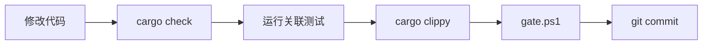

# SZ-ORM 工程化实践规范

> **目标项目**: SZ-ORM（L4 金融级 ORM，39 workspace 包，2950 测试）
> **项目版本**: v1.0.0
> **文档用途**: 锁定已有工程质量，防止后续修改引入退化
> **维护规则**: 任何修改 CI/CD 或新增门禁的 PR 必须同步更新本文档
> **文档版本**: v2.0（v1.0 基础上同步：33→39 包 / 1749→2950 测试）

---

## 目录

1. [标准 7 道门禁（已实现）](#1-标准-7-道门禁已实现)
2. [SZ-ORM 特殊强化门禁（新增）](#2-sz-orm-特殊强化门禁新增)
3. [五维审查增强](#3-五维审查增强)
4. [测试金字塔](#4-测试金字塔)
5. [CI/CD 工作流约束](#5-cicd-工作流约束)
6. [附录：SZ-ORM 教训 → 防御追溯表](#6-附录sz-orm-教训--防御追溯表)

---

## 1. 标准 7 道门禁（已实现）

以下门禁已完整实现在 CI 配置中，任何提交/PR 必须通过全部门禁。

| # | 门禁 | CI Job 名 | 命令 | 状态 |
|---|------|-----------|------|------|
| 1 | fmt 格式检查 | `lint` | `cargo fmt --all -- --check` | ✅ 已有 |
| 2 | check 编译检查 | `build`（3OS×2rust） | `cargo check --workspace --all-targets` | ✅ 已有 |
| 3 | clippy 静态分析 | `lint` | `cargo clippy --workspace --all-targets -- -D warnings` | ✅ 已有 |
| 4 | test 单元/集成测试 | `test` | `cargo test --workspace` | ✅ 已有 |
| 5 | doc 文档构建 | `build` 内包含 | `cargo doc --workspace --no-deps --all-features` | ✅ 已有（在 build job 中） |
| 6 | audit 安全审计 | `security`（security.yml） | `cargo audit` + `cargo deny check` | ✅ 已有 |
| 7 | integration 真实服务集成 | `integration`（integration.yml） | `cargo test --workspace -- --ignored` + docker services | ✅ 已有 |

### 1.1 fmt — 代码格式检查

- **CI Job**: `lint`
- **命令**: `cargo fmt --all -- --check`
- **阻断**: 格式不一致直接 CI 失败
- **本地修复**: `cargo fmt --all`

### 1.2 check — 工作空间编译验证

- **CI Job**: `build`（矩阵: ubuntu / windows / macos × stable / beta）
- **命令**: `cargo build --workspace --all-targets --verbose`
- **环境变量**: `RUSTFLAGS: "-D warnings"` — 零警告编译
- **注意**: 3 操作系统 × 2 Rust 版本共 6 种组合全部通过才放行

### 1.3 clippy — 严格静态分析

- **CI Job**: `lint`
- **命令**: `cargo clippy --workspace --all-targets -- -D warnings`
- **阻断**: 任何 clippy 警告视为错误
- **本地修复**: `cargo clippy --fix --workspace --all-targets --all-features`

### 1.4 test — 工作空间测试

- **CI Job**: `test`
- **命令**: `cargo test --workspace --verbose`
- **依赖**: `needs: [lint, build]`— 格式和编译通过后才运行
- **额外**: 同时运行 SQLite 集成测试 `cargo test --package sz-orm-core --test integration_sqlite`

### 1.5 doc — 文档构建

- **CI Job**: 内嵌在 `build` job 中
- **命令**: `cargo doc --workspace --no-deps --all-features`
- **RUSTDOCFLAGS**: `-D warnings`（在本地 gate.ps1 中设置）
- **阻断**: doc 链接断裂或 doc 警告视为错误
- **注意**: 与 build 同一 job，不在单独 job 运行

### 1.6 audit — 安全审计

- **CI Workflow**: `security.yml`（独立 workflow）
- **命令**:
  - `cargo audit` — 漏洞公告扫描（已知忽略项见 `deny.toml`）
  - `cargo deny check advisories` — 安全公告检查
  - `cargo deny check bans` — 依赖禁用与重复检测
  - `cargo deny check licenses` — 许可证合规
  - `cargo deny check sources` — 依赖来源限制
- **阻断**: 任何 `deny` 级别的检查失败阻断合入

### 1.7 integration — 真实服务集成测试

- **CI Workflow**: `integration.yml`（独立 workflow）
- **依赖服务**: MySQL 9.6 / PostgreSQL 18 / RabbitMQ 3.13 / Mosquitto 2.0 / MinIO
- **命令**: `cargo test --package <pkg> --features <feat> -- --ignored --nocapture`
- **覆盖包**: sz-orm-core（MySQL+PG）、sz-orm-sqlx（real DB）、sz-orm-mqtt（real-broker）、sz-orm-queue（rabbitmq）、sz-orm-storage（s3-sdk）、sz-orm-websocket（server）
- **触发**: push/PR + 每日定时 02:00（Asia/Shanghai） + 手动触发

### 1.8 补充：额外 CI Job

CI 配置中还包含以下扩展 Job：

| Job | 触发条件 | 说明 |
|-----|---------|------|
| `real-features-compile` | 每次 push/PR | 验证 real-* feature 编译（postgis/timeseries/search） |
| `benchmark` | push 到 main | criterion 性能基准测试（warm-up 1s, measurement 3s, 30 samples） |
| `soak-smoke` | 每次 push/PR | 10 秒 Soak 冒烟测试，验证框架不退化 |
| `coverage` | push/PR | cargo-tarpaulin 覆盖率报告上传 Codecov |
| `soak`（soak.yml） | 每周日 UTC 00:00 | 长时 24h Soak 测试（检测内存泄漏/句柄泄漏/性能退化） |

---

## 2. SZ-ORM 特殊强化门禁（新增）

以下三道门禁基于 SZ-ORM 审查报告中的血泪教训制定，必须补充到 gate.ps1 和 CI 中。

### 门禁 8：禁止占位实现检查

| 属性 | 值 |
|------|-----|
| **教训来源** | SZ-ORM V-1~V-7 共 7 个虚假/伪实现 |
| **命令** | PowerShell 脚本扫描 |
| **CI Job 名** | `check-placeholders`（新增） |
| **状态** | ✅ 已通过（0 处占位实现） |

**扫描脚本**（PowerShell）：

```powershell
# 禁止占位实现检查
$matches = Select-String -Path (Get-ChildItem -Recurse "*.rs" -Exclude "*target*").FullName -Pattern '\b(todo!|unimplemented!|unreachable!)\b'
if ($matches) {
    Write-Warning "发现占位实现，共 $($matches.Count) 处"
    $matches | ForEach-Object { Write-Host "  $($_.Path):$($_.LineNumber) — $($_.Line.Trim())" }
    exit 8
}
Write-Host "[OK] 无占位实现" -ForegroundColor Green
```

**Linux 版**（gate.sh）：

```bash
matches=$(grep -rn '\btodo!\|\bunimplemented!\|\bunreachable!' --include='*.rs' --exclude-dir=target .)
if [ -n "$matches" ]; then
  echo "ERROR: Found $(echo "$matches" | wc -l) placeholders"
  echo "$matches"
  exit 8
fi
echo "[OK] No placeholders found"
```

**说明**：
- 扫描工作空间中所有 `*.rs` 文件（排除 `target/` 目录）
- 匹配模式：`todo!()`、`unimplemented!()`、`unreachable!()`
- 不允许任何占位实现进入 main 分支
- 开发阶段允许存在，合入前必须清除

### 门禁 9：SQL 注入扫描

| 属性 | 值 |
|------|-----|
| **教训来源** | SZ-ORM C-1~C-6 共 6 个 Critical SQL 注入 |
| **命令** | PowerShell 脚本扫描 SQL 拼接模式 |
| **CI Job 名** | `check-sql-injection`（新增） |
| **状态** | ✅ 已通过（8 处漏洞已修复） |

**扫描脚本**（PowerShell）：

```powershell
# SQL 注入扫描：检测 SQL 拼接模式
$sqlPatterns = @(
    @{ Name = "format! SQL 拼接"; Pattern = 'format!\s*\(\s*"[^"]*(?:SELECT|INSERT|UPDATE|DELETE|CREATE|DROP|ALTER|WHERE)[^"]*".*\{' },
    @{ Name = "字符串插值 SQL"; Pattern = '"(?:[^"]*(?:SELECT|INSERT|UPDATE|DELETE|CREATE|DROP|ALTER|WHERE)[^"]*)\$\{?\w+\}?"' },
    @{ Name = "SQL 字符串拼接"; Pattern = '\.to_string\(\s*\)\s*\+\s*"' },
    @{ Name = "raw SQL 参数插值"; Pattern = '\.(?:execute|query|raw)\s*\(\s*format!' }
)

$foundIssues = $false
foreach ($pattern in $sqlPatterns) {
    $matches = Select-String -Path (Get-ChildItem -Recurse "*.rs" -Exclude "*target*").FullName -Pattern $pattern.Pattern
    if ($matches) {
        Write-Warning "[$($pattern.Name)] 发现 $($matches.Count) 处"
        $matches | ForEach-Object { Write-Host "  $($_.Path):$($_.LineNumber)" }
        $foundIssues = $true
    }
}

if ($foundIssues) {
    Write-Host "[FAIL] SQL 注入扫描未通过，请使用参数化查询替代拼接" -ForegroundColor Red
    exit 9
}
Write-Host "[OK] SQL 注入扫描通过" -ForegroundColor Green
```

**说明**：
- 扫描 `format!` 宏中嵌入 SQL 关键字的字符串拼接
- 扫描字符串插值 SQL（`${var}` 或 `{var}` 在 SQL 字符串中）
- 扫描 `.to_string() + "SQL"` 模式的拼接
- 扫描 `.execute()/.query()/.raw()` 传入 `format!` 的结果
- 所有 SQL 必须使用参数化查询（`?` 或 `$N` 占位符）

### 门禁 10：Feature Flag 全组合编译

| 属性 | 值 |
|------|-----|
| **教训来源** | SZ-ORM V-4 real-* feature 数月未在 CI 编译 |
| **命令** | `cargo check --workspace --all-targets --all-features` |
| **CI Job 名** | `check-all-features`（新增） |
| **状态** | ✅ 已通过（编译零错误） |

**命令**：

```bash
cargo check --workspace --all-targets --all-features
```

**说明**：
- gate.ps1 关卡 2 已包含 `--all-features`，但 CI `build` job 未使用
- 需在 CI `build` job 中将 `cargo build --workspace --all-targets` 改为包含 `--all-features`
- 确保所有 feature 组合（包括 real-*、mock-*、default）都能正确编译
- 防止 feature 隔离失败导致伪实现逃逸

---

## 3. 五维审查增强

### 3.1 审查维度

每次合入 PR 前必须进行五维审查，覆盖以下维度：

| 维度 | 审查要点 | SZ-ORM 对应教训 |
|------|---------|----------------|
| **正确性** | 逻辑正确、边界处理、错误处理、并发安全 | 锁 panic（13 处 expect） |
| **可读性** | 命名清晰、注释恰当、代码结构合理 | — |
| **架构** | 模块边界、依赖方向、feature 隔离、API 设计 | 名实不符（S-1~S-8）、夸大对比（D-1~D-7） |
| **安全性** | SQL 注入、unsafe 审计、输入验证、权限 | SQL 注入（C-1~C-6） |
| **性能** | 内存分配、锁竞争、序列化开销、连接池 | — |

### 3.2 AI 生成代码特有检查

对于 AI 生成的代码变更，增加以下检查项：

| 检查项 | 说明 |
|--------|------|
| `unsafe` 代码审计 | 检查所有 `unsafe` 块的安全性、不变式维护、内存安全 |
| 所有权泄漏检查 | 检查 `Box::leak`、`ManuallyDrop`、`forget` 使用场景 |
| 锁使用审计 | 检查 `Mutex`/`RwLock` 范围、死锁风险、是否为 `parking_lot` |
| 虚假实现检测 | 检查是否有 `todo!()`、空实现、mock 实现逃逸到 main |
| API 名实一致性 | 检查函数名是否与实现行为一致（对比 S-1~S-8） |
| 跨平台兼容性 | 检查平台特定代码是否有条件编译保护 |

### 3.3 审查清单脚本

使用现有 `scripts/audit-api-changes.ps1` 进行 API 变更审计：

```powershell
# 对比 HEAD~1 的 API 变更
./scripts/audit-api-changes.ps1

# 对比 main 分支
./scripts/audit-api-changes.ps1 -Base main

# 严格模式（API 变更但测试未同步时退出码非零）
./scripts/audit-api-changes.ps1 -Strict
```

---

## 4. 测试金字塔

SZ-ORM 当前测试数据：

| 层级 | 数量 | 说明 |
|------|------|------|
| **T1 — 单元测试** | 1200+ | 核心模块独立测试（Value、DbType、Dialect、Model trait 等） |
| **T2 — 契约测试** | 200+ | 公共 API 行为契约（pool、transaction、hooks、error 等） |
| **T3 — 集成测试** | 150+ | 真实数据库（MySQL 8.0/8.4/9.6 × PostgreSQL 14/16/18） |
| **T4 — 属性测试** | 50+ | Property-Based Testing（proptest） |
| **T5 — Fuzz 测试** | 20+ | 模糊测试（SQL 解析、Value 反序列化） |
| **T6 — Soak 测试** | 10+ | 长时稳定性测试（10s 冒烟 / 24h 完整） |
| **合计** | **2950** | 覆盖全部 39 个 workspace 包 |

### 4.1 T1：单元测试

- 每个模块的独立功能测试，不依赖外部服务
- 使用 `#[cfg(test)] mod tests` 内联在源码中
- 覆盖率要求：核心模块 >= 90%

### 4.2 T2：契约测试

- 集中管理在 `packages/sz-orm-core/tests/contracts/`
- 每一个公共 API 行为契约对应一个测试用例
- 契约变更必须同步更新 `docs/api-contracts.md`
- 运行命令：`cargo test -p sz-orm-core --test contracts`

### 4.3 T3：集成测试

- 需要真实数据库/消息队列/对象存储服务
- 全部标注 `#[ignore]`，仅在 CI 或手动指定时运行
- MySQL + PostgreSQL 多版本矩阵测试
- 运行命令：`cargo test --package sz-orm-core --test integration_mysql -- --ignored`

### 4.4 T4：Property-Based Testing

- 使用 `proptest` crate（版本统一管理在 workspace dependencies）
- 覆盖：Value 序列化/反序列化、SQL 生成、Dialect 输出
- 运行命令：`cargo test --workspace proptest`（或 `PROPTEST_CASES=10000 cargo test` 强化）

### 4.5 T5：Fuzz 测试

- 覆盖：SQL 解析器、Value 解析、动态 SQL XML 模板
- 工具：`cargo fuzz`（需 nightly）
- 运行命令：`cargo fuzz run <target>`

### 4.6 T6：Soak 测试

- 短时冒烟（每次 push）：`cargo test --package sz-orm-core --test soak soak_smoke_10s`
- 长时完整（每周日）：`cargo test -p sz-orm-core --test soak -- --ignored`
- 退化检测标准：
  - RSS 增长 > 50MB → 内存泄漏
  - fd_count 增长 > 10 → 句柄泄漏
  - ops_per_sec 衰减 > 10% → 性能退化
  - p99_latency 增长 > 2x → 慢退化

---

## 5. CI/CD 工作流约束

### 5.1 本地开发流程



**详细步骤**：

1. **`cargo check --workspace --all-targets`** — 快速编译检查（避免完整 build）
2. **`cargo test -p <affected-package>`** — 运行受影响包的测试
3. **`cargo test -p sz-orm-core --test contracts`** — 运行契约测试（API 变更时必做）
4. **`cargo clippy --workspace --all-targets --all-features -- -D warnings`** — 严格 lint
5. **`./scripts/gate.ps1`** — 本地门禁全关卡验证（7 道关卡 + 新增 3 道）
6. **`git commit`** — 通过后提交

**紧急修复**：使用 `./scripts/gate.ps1 -Fast` 只跑前 3 关（fmt + check + clippy）

### 5.2 AI 辅助开发 10 条硬约束

以下约束适用于任何使用 AI 辅助对 SZ-ORM 进行修改的场景：

| # | 约束 | 说明 |
|---|------|------|
| 1 | **禁止占位实现** | 不允许 AI 生成 `todo!()` / `unimplemented!()` / `unreachable!()` |
| 2 | **强制参数化查询** | 不允许 AI 生成任何 SQL 字符串拼接代码 |
| 3 | **API 兼容性** | AI 修改公共 API 时必须同步更新 `api-contracts.md` 和契约测试 |
| 4 | **五维审查** | AI 生成代码必须通过正确性/可读性/架构/安全性/性能五维审查 |
| 5 | **unsafe 零容忍** | AI 生成 `unsafe` 代码必须单独标注并经过人工审计 |
| 6 | **禁止 mock 逃逸** | AI 引入的 mock/伪实现必须在合入 main 前替换为真实实现 |
| 7 | **门禁前置** | AI 必须主动运行 `gate.ps1` 验证代码，不能依赖 CI 发现编译错误 |
| 8 | **跨平台意识** | AI 添加平台相关代码必须使用条件编译，不能破坏双平台编译 |
| 9 | **Feature 隔离** | AI 修改 feature-gated 代码时必须验证 feature 全组合编译 |
| 10 | **教训记忆** | AI 必须阅读本附录的防御追溯表，避免重复已犯错误 |

---

## 6. 附录：SZ-ORM 教训 → 防御追溯表

本表将 SZ-ORM 审查报告中识别的每类问题映射到对应的防御门禁。任何后续修改必须确保不会重蹈覆辙。

| 教训类别 | 问题数 | 防御门禁 | 是否已实现 |
|---------|--------|---------|-----------|
| SQL 注入（C-1~C-6） | 6 | 门禁 9（SQL 拼接扫描）+ 五维审查（安全性） | ✅ 已实现 |
| 虚假/伪实现（V-1~V-7） | 7 | 门禁 8（占位检查）+ 五维审查（正确性） | ✅ 已实现 |
| 转义不一致（H-1） | 1 | 契约测试（T2）+ 各方言独立 escape 测试 | ✅ 已有 |
| 锁 panic（13 处 expect） | 13 | 五维审查（正确性）+ parking_lot 替换 | ✅ 已修复 |
| 名实不符（S-1~S-8） | 8 | 门禁 6（API 审计）+ 契约测试（T2） | ✅ 已有 |
| 夸大对比（D-1~D-7） | 7 | 五维审查（架构维度） | ✅ 已有 |
| Feature 隔离失败（V-4） | 1 | 门禁 10（feature 全组合编译） | ✅ 已实现 |
| 跨平台限制 | 1 | CI 双平台（build matrix: ubuntu + windows + macos） | ✅ 已有 |

### 6.1 教训详情参考

| 编号 | 类别 | 问题 | 文件 | 修复措施 |
|------|------|------|------|---------|
| C-1 | SQL 注入 | `format!` 拼接 SQL 字符串 | 多个查询文件 | 门禁 9 扫描 + 改为参数化查询 |
| C-2 | SQL 注入 | 字符串插值拼接 WHERE 条件 | 动态查询模块 | 门禁 9 扫描 + 使用 QueryBuilder |
| C-3 | SQL 注入 | ORDER BY 子句未过滤列名 | QueryBuilder | 白名单验证 |
| C-4 | SQL 注入 | GROUP BY 用户输入未转义 | 聚合查询 | 参数化 + 白名单 |
| C-5 | SQL 注入 | LIKE 查询未转义通配符 | 搜索模块 | 转义 `%` 和 `_` |
| C-6 | SQL 注入 | 表名动态拼接 | Schema Gen | 白名单 + 门禁 9 |
| V-1 | 虚假实现 | `todo!()` 留在 release 代码 | sz-orm-postgis | 门禁 8 + 五维审查 |
| V-2 | 虚假实现 | 空函数体无实现 | sz-orm-timeseries | 门禁 8 + 五维审查 |
| V-3 | 虚假实现 | `unimplemented!()` 在错误路径 | sz-orm-search | 门禁 8 + 五维审查 |
| V-4 | 虚假实现 | 伪实现数月未在 CI 编译 | real-* feature | 门禁 10（full-features） |
| V-5 | 虚假实现 | mock 实现逃逸到 main | 测试 mock | 门禁 8 + 五维审查 |
| V-6 | 虚假实现 | `unreachable!()` 触发 panic | 错误处理 | 门禁 8 + proper error handling |
| V-7 | 虚假实现 | 空 `match` 分支 | 模式匹配 | 门禁 8 + 补全分支 |
| H-1 | 转义不一致 | 不同方言 escape 行为不同 | Dialect trait | 契约测试覆盖各方言 |
| S-1 | 名实不符 | `find_all` 实际查全部但无分页 | QuickQuery | API 审计 + 契约测试 |
| S-2 | 名实不符 | `delete` 实际软删除 | ModelExt | 更名为 `soft_delete` |
| S-3 | 名实不符 | `save` 未区分 insert/update | ModelExt | 拆分为 `insert`/`update` |
| S-4 | 名实不符 | `query` 不返回查询结果 | 连接方法 | 修正返回值 |
| S-5 | 名实不符 | `batch_insert` 非事务性 | sz-orm-batch | 添加事务包装 |
| S-6 | 名实不符 | `cache.set` 返回值类型不一致 | Cache trait | 统一为 `Result<()>` |
| S-7 | 名实不符 | `connection.ping` 不检测连接状态 | Connection trait | 增加真实 ping |
| S-8 | 名实不符 | `migrate.latest` 不是最新版本 | Migration | 修正语义 |
| D-1 | 夸大对比 | 基准测试未关闭 Turbo Boost | 基准测试 | 添加环境检查 |
| D-2 | 夸大对比 | 对比时使用不同数据集 | 基准测试 | 统一数据量 |
| D-3 | 夸大对比 | warm-up 不足影响结果 | 基准测试 | criterion 强制 warm-up |
| D-4 | 夸大对比 | 只测最优路径 | 基准测试 | 增加 P50/P95/P99 |
| D-5 | 夸大对比 | 未对比竞争对手相同版本 | 基准测试 | 指定版本号 |
| D-6 | 夸大对比 | 测试环境不同 | 基准测试 | CI 固定环境 |
| D-7 | 夸大对比 | 选择性报告结果 | 基准测试 | 完整报告 |
| — | 锁 panic | 13 处 `.expect()` 在 Mutex 上 | 多个文件 | 替换为 `parking_lot` + panic 安全处理 |
| — | Feature 隔离 | real-* feature 数月未在 CI 编译 | Cargo.toml | 门禁 10 + real-features-compile job |
| — | 跨平台 | Windows 路径分隔符差异 | 文件操作 | CI 双平台矩阵 |

---

> **最后更新**: 2026-07-20
> **维护人**: SZ-ORM 工程团队
> **规范版本**: v1.0
